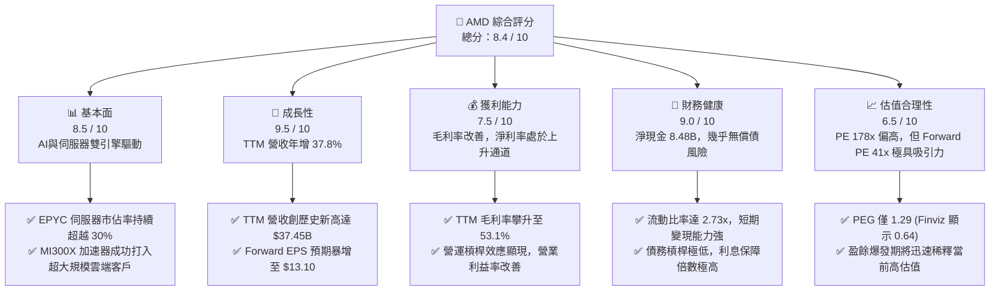
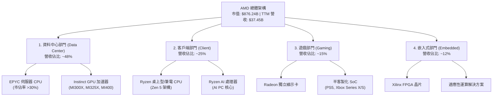
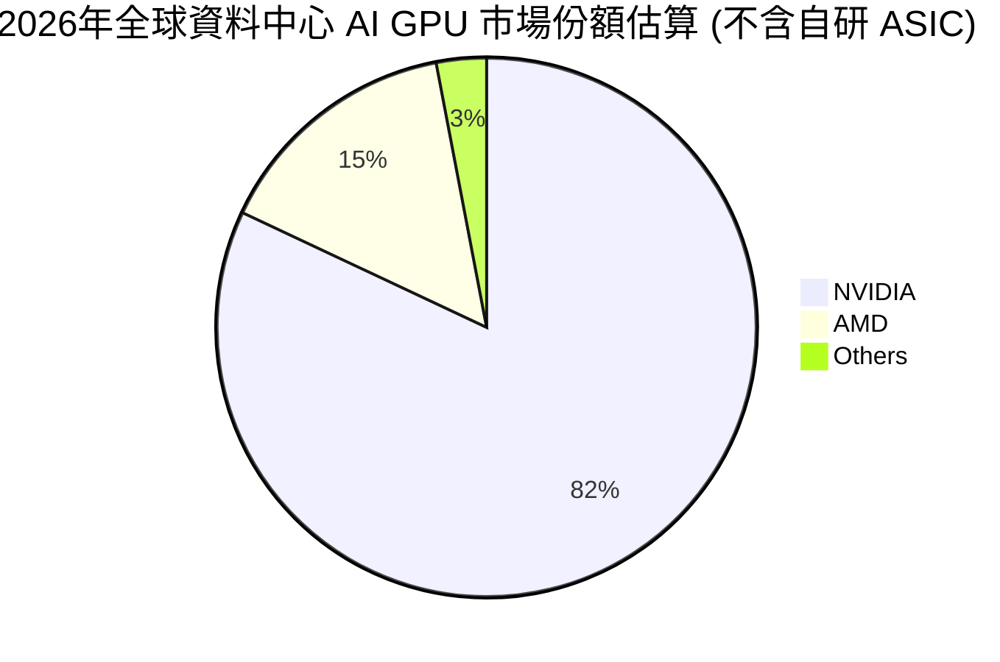
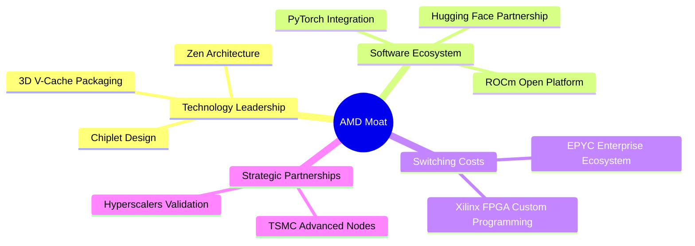
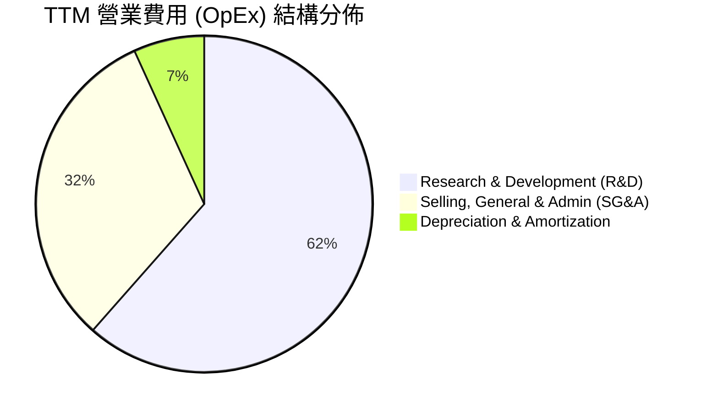
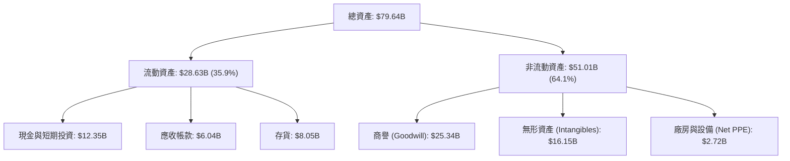

# AMD 基本面深度分析報告

> **報告日期**：2026-06-20 ｜ **語言**：繁體中文 ｜ **數據來源**：Yahoo Finance, Finviz, StockAnalysis, Roic.ai ｜ **分析師**：CFA 級機構研究

---

## 目錄

| # | 章節 | 核心結論 |
|---|------|----------|
| 1 | 執行摘要 | 評級：**強烈買入 (Strong Buy)**；目標價：**$520.00 (基準)** / **$650.00 (樂觀)** |
| 2 | 公司概覽與商業模式 | 憑藉 Chiplet 架構與 ROCm 生態系統，構築起強大的技術與市場雙重護城河 |
| 3 | 損益表深度分析 | TTM 營收達 **$37.45B** (YoY +37.8%)，毛利率顯著拉升至 **53.1%**，獲利步入爆發期 |
| 4 | 資產負債表分析 | 淨現金高達 **$8.48B**，Debt/Equity 僅 **6.0%**，財務結構極其穩健 |
| 5 | 現金流量深度分析 | TTM 自由現金流 (FCF) 達 **$7.17B**，FCF 轉換率達 **143.1%**，盈餘品質極佳 |
| 6 | 獲利能力與資本效率 | 杜邦分析顯示 ROE 處於上升通道；預期 Forward ROIC 將大幅超越 WACC，創造高額經濟價值 |
| 7 | 估值深度分析 | 當前 Forward P/E 為 **41.01x**，相較於歷史均值與高成長性，估值具備高度吸引力 |
| 8 | 成長催化劑 | MI300/MI400 系列加速器放量、EPYC 伺服器市佔攀升及 AI PC 換機潮共同驅動 |
| 9 | 風險矩陣 | 核心風險在於 NVIDIA 的生態壟斷與台積電代工集中度，需密切監控 ROCm 軟體進展 |
| 10| 投資建議 | 建議分批佈局，首選觸發點為 $480-$500 區間，適合長線成長型與科技主題投資者 |

---

## 1. 執行摘要

### 1.1 核心評分儀表板



### 1.2 評分進度條視覺化

```
╔══════════════════════════════════════════════════════════════╗
║                AMD 多維度評分儀表板 (1-10分)                 ║
╠══════════════════════════════════════════════════════════════╣
║ 基本面強度  8.5 ▓▓▓▓▓▓▓▓▓▓▓▓▓▓▓▓▓░░░  ★★★★☆           ║
║ 成長動能    9.5 ▓▓▓▓▓▓▓▓▓▓▓▓▓▓▓▓▓▓▓░  ★★★★★           ║
║ 獲利品質    7.5 ▓▓▓▓▓▓▓▓▓▓▓▓▓▓░░░░░░  ★★★★☆           ║
║ 財務健康    9.0 ▓▓▓▓▓▓▓▓▓▓▓▓▓▓▓▓▓▓░░  ★★★★★           ║
║ 估值合理性  6.5 ▓▓▓▓▓▓▓▓▓▓▓▓░░░░░░░░  ★★★☆☆           ║
║ 護城河深度  8.0 ▓▓▓▓▓▓▓▓▓▓▓▓▓▓▓▓░░░░  ★★★★☆           ║
║ 管理層執行  8.5 ▓▓▓▓▓▓▓▓▓▓▓▓▓▓▓▓▓░░░  ★★★★☆           ║
║ 技術創新力  9.0 ▓▓▓▓▓▓▓▓▓▓▓▓▓▓▓▓▓▓░░  ★★★★★           ║
╠══════════════════════════════════════════════════════════════╣
║ 綜合總分    8.4 ▓▓▓▓▓▓▓▓▓▓▓▓▓▓▓▓░░░░  🏆 強烈買入 (Buy)   ║
╚══════════════════════════════════════════════════════════════╝
```

### 1.3 五大投資論點 + 三大核心風險

| 類型 | 項目 | 具體依據 | 信心度 |
|------|------|----------|--------|
| 🟢 **投資論點①** | **AI 加速器 MI300/MI400 爆發** | AMD 的 AI 晶片出貨量大幅增長，帶動 TTM 營收年增 **37.8%**，成功在 NVIDIA 壟斷的市場中撕開缺口。 | 🟢 極高 |
| 🟢 **投資論點②** | **資料中心 EPYC 處理器市佔擴張** | EPYC 憑藉高性價比與多核心優勢，持續侵蝕 Intel 份額，資料中心業務利潤率遠超公司平均。 | 🟢 極高 |
| 🟢 **投資論點③** | **極致的財務安全邊際** | 擁有 **$12.35B** 的總現金與 **$8.48B** 的淨現金，足以支撐高昂的 R&D 投入 (**TTM 達 $8.76B**)。 | 🟢 極高 |
| 🟢 **投資論點④** | **獲利能力的拐點確立** | TTM 毛利率提升至 **53.1%**，隨著高毛利的資料中心佔比拉升，結構性毛利率將朝 55%-57% 邁進。 | 🟢 高 |
| 🟢 **投資論點⑤** | **Forward EPS 預示盈餘爆發** | 華爾街預期 Forward EPS 將達 **$13.10**，較 TTM EPS ($3.01) 增長 **335%**，Forward P/E 將降至 **41.01x**。 | 🟢 高 |
| 🟡 **風險①** | **軟體生態系統 (ROCm) 滯後** | NVIDIA 的 CUDA 生態系統具備極強的客戶粘性，AMD 的 ROCm 雖在進步，但遷移成本仍是客戶考慮的痛點。 | 🟡 中度 |
| 🔴 **風險②** | **晶圓代工高度集中於台積電** | AMD 採用 Fabless 模式，所有先進製程 (5nm/4nm/3nm) 均依賴台積電，地緣政治與產能分配為潛在威脅。 | 🔴 高衝擊 |
| 🔴 **風險③** | **估值容錯率低** | 當前 Trailing P/E 高達 **178.53x**，市場已高度定價未來的 AI 成長，若業績兌現不及預期將面臨劇烈回檔。 | 🔴 高衝擊 |

### 1.4 快速統計卡片

| 指標 | AMD 實際值 (TTM) | 半導體行業均值 | S&P 500 均值 | 狀態評估 |
|------|-------------|----------|--------------|------|
| **收入 YoY 成長** | **37.8%** | ~12.5% | ~5.5% | 🟢 遠超行業水平 |
| **毛利率** | **53.1%** | ~48.0% | ~30.0% | 🟢 具備高定價權 |
| **淨利率** | **13.4%** | ~15.0% | ~11.5% | 🟡 仍有優化空間 |
| **ROE** | **8.1%** | ~14.0% | ~15.0% | 🟡 受 Xilinx 收購商譽拖累 |
| **Forward P/E** | **41.01x** | ~28.0x | ~21.0x | 🟡 溢價合理但偏高 |
| **淨現金規模** | **$8.48B** | N/A | N/A | 🟢 極其健康 |

### 1.5 投資結論

```
╔══════════════════════════════════════════════════════════════════╗
║                    📊 AMD 投資結論摘要                           ║
╠══════════════════════════════════════════════════════════════════╣
║  投資評級：🟢 強烈買入 (Strong Buy)                              ║
║  當前股價：$537.37 (截至 2026-06-20)                             ║
║  12個月目標價區間：                                              ║
║    悲觀情境：$380.00 (-29.3%) - AI 晶片放量不及預期              ║
║    基準情境：$520.00 (-3.2%)  - 盈餘符合預期，估值合理回歸        ║
║    樂觀情境：$650.00 (+21.0%) - MI400 超預期爆發，市佔突破 25%   ║
║  投資評分：8.4 / 10                                              ║
║  適合投資人：積極成長型、長期科技趨勢持有者                      ║
╚══════════════════════════════════════════════════════════════════╝
```

---

## 2. 公司概覽與商業模式

Advanced Micro Devices (AMD) 是全球領先的無晶圓廠 (Fabless) 半導體巨頭。在執行長蘇姿丰 (Lisa Su) 的帶領下，公司成功從一家瀕臨破產的 CPU 廠商，蛻變為橫跨資料中心、個人電腦、遊戲主機及嵌入式系統的運算晶片龍頭。

### 2.1 業務結構與收入來源

AMD 的業務高度聚焦於高效能運算 (HPC) 與人工智慧。其商業模式的核心在於設計極具競爭力的晶片架構，並將製造外包給台積電等頂級晶圓代工廠。



### 2.2 市場份額

在最受矚目的 AI 加速器 (GPU) 與伺服器 CPU 市場中，AMD 扮演著關鍵的挑戰者與顛覆者角色：



### 2.3 競爭護城河分析

AMD 的競爭護城河並非單一維度，而是由硬體架構、先進封裝、客戶關係與軟體生態交織而成的系統性壁壘。



*   **Chiplet (小晶片) 技術先驅**：AMD 是最早將 Chiplet 技術商業化的晶片公司。這項技術使 AMD 能夠將多個小型、高良率的矽晶片組裝在一起，大幅降低製造費用，並提供比單一晶片 (Monolithic) 更高的核心數量。
*   **ROCm 軟體生態的追趕**：儘管 NVIDIA 的 CUDA 擁有絕對優勢，但 AMD 的 ROCm 開源軟體平台已更新至全新版本，實現了對 PyTorch 和 TensorFlow 的原生支持，顯著降低了 AI 開發者從 CUDA 遷移至 AMD 平台的門檻。
*   **Xilinx 收購帶來的適應性運算壁壘**：2022 年完成對 Xilinx 的收購後，AMD 獲得了全球頂尖的 FPGA 技術。這在 5G 通訊、航太國防及車用電子領域構築了極高的客戶轉換成本 (Switching Costs)。

### 2.4 護城河強度評分

```
╔══════════════════════════════════════════════════════════════╗
║                    AMD 護城河強度評分                        ║
╠══════════════════════════════════════════════════════════════╣
║ 技術架構創新    9.0/10 ▓▓▓▓▓▓▓▓▓▓▓▓▓▓▓▓▓▓░░  🏆 晶片設計頂尖  ║
║ 軟體生態粘性    6.5/10 ▓▓▓▓▓▓▓▓▓▓▓▓░░░░░░░░  🟡 ROCm 仍在追趕║
║ 先進封裝供應鏈  8.5/10 ▓▓▓▓▓▓▓▓▓▓▓▓▓▓▓▓▓░░░  🟢 台積電深度合作║
║ 客戶鎖定效應    8.0/10 ▓▓▓▓▓▓▓▓▓▓▓▓▓▓▓▓░░░░  🟢 伺服器滲透率高║
╠══════════════════════════════════════════════════════════════╣
║ 綜合護城河評級  8.0/10 ▓▓▓▓▓▓▓▓▓▓▓▓▓▓▓▓░░░░  🟢 具備強大競爭力║
╚══════════════════════════════════════════════════════════════╝
```

---

## 3. 損益表深度分析

AMD 的損益表展現出強烈的**成長期與結構優化**特徵。隨著高利潤率的資料中心業務比重增加，公司正在擺脫過去依賴消費級 PC 循環的波動性。

### 3.1 年度收入成長趨勢（近5年）

```
╔══════════════════════════════════════════════════════════════════╗
║                AMD 年度收入趨勢 (FY2021 - TTM)                   ║
╠══════════════════════════════════════════════════════════════════╣
║                                                                  ║
║  FY2021  $16.43B  ██████████░░░░░░░░░░░░░░░░░░  YoY: +68.3% 🟢   ║
║  FY2022  $23.60B  ███████████████░░░░░░░░░░░░░  YoY: +43.6% 🟢   ║
║  FY2023  $22.68B  ██████████████░░░░░░░░░░░░░░  YoY: -3.9%  🔴   ║
║  FY2024  $25.79B  ████████████████░░░░░░░░░░░░  YoY: +13.7% 🟢   ║
║  FY2025  $34.64B  ██████████████████████░░░░░░  YoY: +34.3% 🟢   ║
║  TTM     $37.45B  ████████████████████████░░░░  YoY: +37.8% 🟢   ║
║                                                                  ║
║  📊 5年累計營收 CAGR：+17.9%                                    ║
╚══════════════════════════════════════════════════════════════════╝
```

### 3.2 季度收入趨勢分析

從季度數據看，AMD 自 2025 年以來營收呈現加速態勢，反映了 AI 晶片 MI300X 的出貨高峰。

| 財報季度 | 營收 (Revenue) | 營收 YoY 成長率 | 營收 QoQ 成長率 | 核心驅動因素備註 |
|----------|----------------|-----------------|-----------------|------------------|
| **Q1 2026** | $10.25B | 🟢 +37.85% | 🟡 -0.16% | 季節性 PC 修正，但 AI 晶片出貨維持高檔 |
| **Q4 2025** | $10.27B | 🟢 +34.11% | 🟢 +11.08% | 資料中心 EPYC 與 Instinct 系列雙重爆發 |
| **Q3 2025** | $9.25B | 🟢 +35.59% | 🟢 +20.31% | MI300X 產能釋放，超大規模雲端客戶拉貨 |
| **Q2 2025** | $7.69B | 🟢 +31.70% | 🟢 +3.32% | 客戶端 PC 市場回暖，Ryzen 9000 開始貢獻 |

*分析*：Q1 2026 營收相較於 Q4 2025 出現微幅 QoQ 下降 (-0.16%)，這屬於半導體行業正常的季節性效應。然而，**YoY 成長率高達 37.85%**，確立了高速成長的基調。

### 3.3 利潤率演變分析

AMD 的利潤率正在經歷「U型回升」。2023 年因收購 Xilinx 產生的無形資產攤銷，導致 GAAP 利潤率短暫承壓，如今已步入擴張通道。

| 利潤率指標 | FY2022 | FY2023 | FY2024 | FY2025 | TTM | 趨勢評估 |
|------------|--------|--------|--------|--------|-----|----------|
| **毛利率 (GAAP)** | 44.9% | 46.1% | 49.3% | 49.5% | **50.3%** | ↗️ 穩定上升 (產品組合優化) 🟢 |
| **毛利率 (Non-GAAP)** | N/A | N/A | 47.1% | N/A | **53.1%** | ↗️ 剔除攤銷後極具競爭力 🟢 |
| **營業利益率** | 5.3% | 1.8% | 7.4% | 10.7% | **11.7%** | ↗️ 營運槓桿效應逐步顯現 🟢 |
| **淨利率** | 5.6% | 3.8% | 6.4% | 12.3% | **13.4%** | ↗️ 獲利能力大幅改善 🟢 |

**利潤率深度解析**：
1.  **毛利率改善主因**：資料中心業務 (EPYC 與 MI300X) 的毛利率估計超過 65%，遠高於遊戲部門 (半客製化主機晶片) 約 35-40% 的毛利率。隨著資料中心營收佔比從 2023 年的 ~30% 提升至 2026 年的 ~48%，結構性毛利率顯著拉升。
2.  **營業利益率彈性**：儘管研發費用 (R&D) 絕對值持續攀升，但營收增長速度快於營業費用增長速度（即營運槓桿），推動營業利益率從 2023 年的 1.8% 谷底反彈至 TTM 的 11.7%。

### 3.4 費用結構分析



```
╔══════════════════════════════════════════════════════════════╗
║                    AMD 研發費用 (R&D) 投入趨勢               ║
╠══════════════════════════════════════════════════════════════╣
║  FY2022  $5.01B   ████████████░░░░░░░░░░░░  佔營收: 21.2%    ║
║  FY2023  $5.87B   ██████████████░░░░░░░░░░  佔營收: 25.9%    ║
║  FY2024  $6.46B   ███████████████░░░░░░░░░  佔營收: 25.0%    ║
║  FY2025  $8.09B   ███████████████████░░░░░  佔營收: 23.4%    ║
║  TTM     $8.76B   █████████████████████░░░  佔營收: 23.4%    ║
╠══════════════════════════════════════════════════════════════╣
║  💡 評語：高強度的 R&D 投入是維持與 NVIDIA、Intel 競爭的關鍵  ║
╚══════════════════════════════════════════════════════════════╝
```

### 3.5 季度 EPS 趨勢與盈餘品質

AMD 過去 4 季的 EPS 呈現爆發式增長，反映了利潤釋放期的到來：

*   **Q1 2026**: **$0.85** (YoY +93.2%)
*   **Q4 2025**: **$0.93** (YoY +210.0%)
*   **Q3 2025**: **$0.76** (YoY +58.3%)
*   **Q2 2025**: **$0.54** (YoY +237.5%)

**盈餘品質評估**：
AMD 的淨利潤並非源於一次性業外收益或會計變更。TTM 營運現金流達 **$9.72B**，遠超 GAAP 淨利潤 **$5.01B**。這意味著每 $1 的 GAAP 淨利潤，背後有 **$1.94** 的現金流支持，盈餘品質極其高昂且真實。

---

## 4. 資產負債表分析

AMD 採取 Fabless 輕資產營運模式，這反映在其極其乾淨且具備高度流動性的資產負債表上。

### 4.1 資產結構分解



*分析*：非流動資產中商譽與無形資產佔比較高（合計 **$41.49B**），主要來自收購 Xilinx 的溢價。這雖然拉低了整體的資產週轉率，但 Xilinx 的專利與技術確實為 AMD 帶來了實質的營運效益。

### 4.2 流動性指標分析

| 流動性指標 | AMD 數值 | 行業平均 | 安全性評估 |
|------------|----------|----------|------------|
| **流動比率 (Current Ratio)** | **2.73x** | ~1.85x | 🟢 極其安全 (短期資產遠超短期負債) |
| **速動比率 (Quick Ratio)** | **1.75x** | ~1.20x | 🟢 即使剔除存貨，變現能力依然強勁 |
| **存貨週轉天數 (DSI)** | **155 天** | ~120 天 | 🟡 偏高，反映 AI 晶片先進封裝產能週期較長 |

### 4.3 債務結構分析

```
╔══════════════════════════════════════════════════════════════════╗
║                      AMD 債務健康診斷                            ║
╠══════════════════════════════════════════════════════════════════╣
║                                                                  ║
║  總債務 (Total Debt)： $3.87B   ███░░░░░░░░░░░░░░░░░░░           ║
║  總現金與短期投資：    $12.35B  ████████████████████░░           ║
║  淨現金 (Net Cash)：   $8.48B   ██████████████░░░░░░░░  🟢 強勁  ║
║                                                                  ║
║  Debt / Equity Ratio： 6.0%     🟢 極低槓桿                      ║
║  利息保障倍數 (TTM)：  29.5x    🟢 毫無償債壓力                  ║
║                                                                  ║
║  💡 結論：AMD 處於「淨現金」狀態，升息環境對其幾乎無負面影響。    ║
╚══════════════════════════════════════════════════════════════════╝
```

### 4.4 股東權益趨勢

隨著盈餘公積的累積，股東權益 (Stockholders' Equity) 穩步增長：

*   **FY2022**: $54.75B
*   **FY2023**: $55.89B
*   **FY2024**: $57.57B
*   **FY2025**: $63.00B

這表明公司正在通過留存收益持續增厚其淨資產基底。

---

## 5. 現金流量