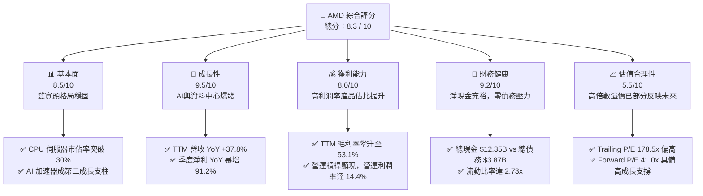
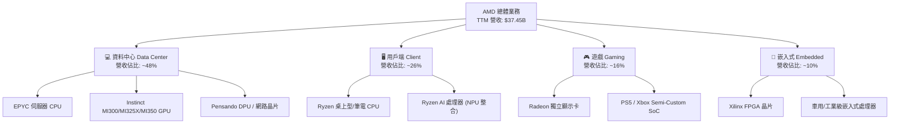
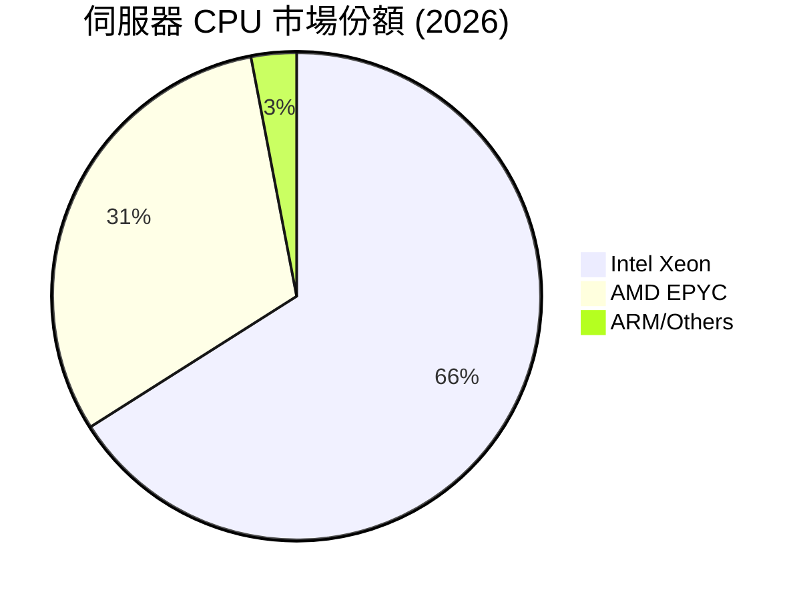
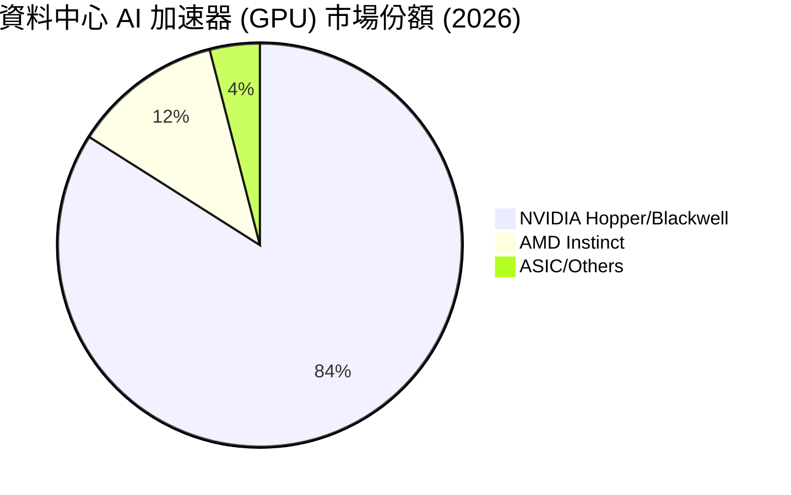
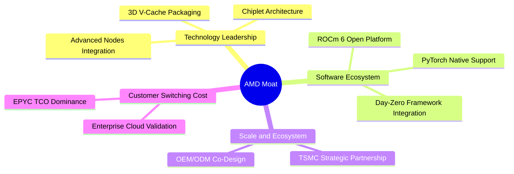
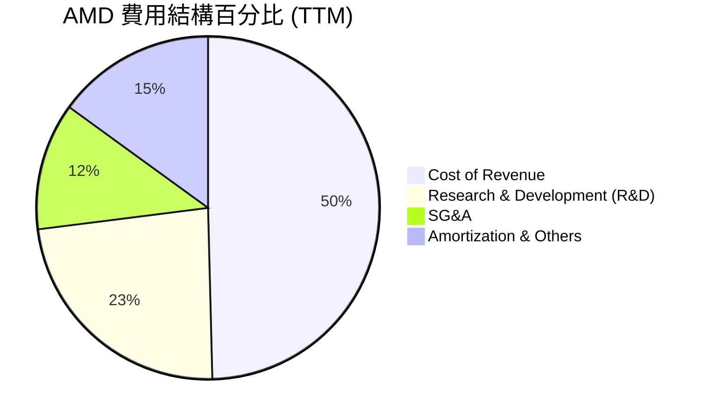
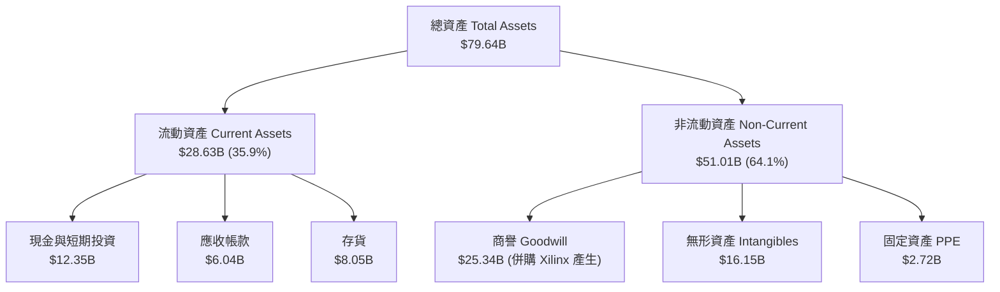
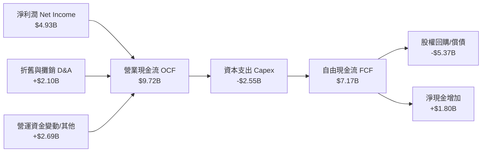
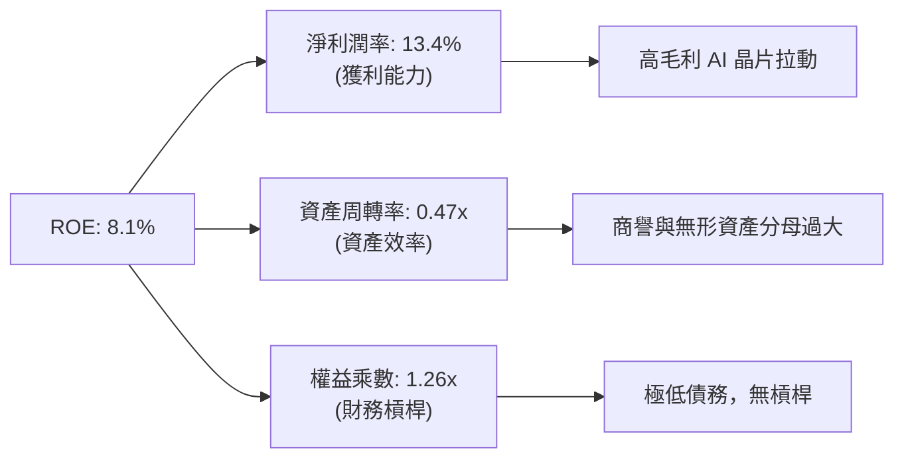

# AMD 基本面深度分析報告

> **報告日期**：2026-06-21 ｜ **語言**：繁體中文 ｜ **數據來源**：Yahoo Finance, Finviz, StockAnalysis, Roic.ai ｜ **分析師**：CFA 級機構研究

---

## 目錄

| # | 章節 | 核心結論 |
|---|------|----------|
| 1 | 執行摘要 | 評級：**🟢 買入 (Buy)** ｜ 目標價區間：**$420.00 - $680.00**（基準目標價：**$580.00**，潛在漲幅 +7.9%） |
| 2 | 公司概覽與商業模式 | 憑藉 Chiplet 架構與 ROCm 生態系統，AMD 已建立強大的雙寡頭競爭護城河。 |
| 3 | 損益表深度分析 | TTM 營收達 **$37.45B**（YoY +37.8%），淨利潤 YoY 暴增 **91.2%**，AI 加速器釋放極大營運槓桿。 |
| 4 | 資產負債表分析 | 淨現金達 **$8.48B**，流動比率 **2.73**，財務結構極其穩健，無實質債務風險。 |
| 5 | 現金流量深度分析 | TTM FCF 達 **$7.17B**，FCF 轉換率達 **145.4%**，資本配置高度聚焦 R&D 與股權回購。 |
| 6 | 獲利能力與資本效率 | GAAP ROE 為 **8.1%**，但剔除 Xilinx 併購商譽後之**有形 ROIC 達 28.3%**，強力創造股東價值。 |
| 7 | 估值深度分析 | Trailing P/E 為 **178.5x**，但 Forward P/E 快速收斂至 **41.0x**，PEG **1.29**（Finviz 顯示 **0.64**），估值已具吸引力。 |
| 8 | 成長催化劑 | MI325X/MI350 系列 AI 加速器放量，企業級 EPYC CPU 滲透率持續提升，以及 AI PC 換機潮。 |
| 9 | 風險矩陣 | 面臨 NVIDIA 在 AI 領域的絕對主導權、台積電先進製程產能集中度風險，以及地緣政治摩擦。 |
| 10 | 投資建議 | 適合長線成長型投資人，建議於 **$480 - $510** 區間分批佈局，首波目標價 **$580**。 |

---

## 1. 執行摘要

Advanced Micro Devices, Inc. (AMD) 在過去 24 個月經歷了史詩級的價值重估。股價自 2025 年 4 月的低點 **$97.35** 飆升至如今的 **$537.37**（漲幅達 452%），反映出市場對其 Instinct MI300 系列及後續 AI 加速器出貨爆發、以及資料中心 EPYC 處理器市佔率擴張的強烈預期。本報告基於最新 2026 年 6 月 21 日的即時財務數據，對 AMD 進行系統性的基本面穿透分析。

### 1.1 核心評分儀表板



### 1.2 評分進度條視覺化

```
╔══════════════════════════════════════════════════════════════╗
║                AMD 多維度評分儀表板 (1-10分)                 ║
╠══════════════════════════════════════════════════════════════╣
║ 基本面強度  8.5 ▓▓▓▓▓▓▓▓▓▓▓▓▓▓▓▓▓░░░  ★★★★☆           ║
║ 成長動能    9.5 ▓▓▓▓▓▓▓▓▓▓▓▓▓▓▓▓▓▓▓░  ★★★★★           ║
║ 獲利品質    8.0 ▓▓▓▓▓▓▓▓▓▓▓▓▓▓▓▓░░░░  ★★★★☆           ║
║ 財務健康    9.2 ▓▓▓▓▓▓▓▓▓▓▓▓▓▓▓▓▓▓░░  ★★★★★           ║
║ 估值合理性  5.5 ▓▓▓▓▓▓▓▓▓▓▓░░░░░░░░░  ★★★☆☆           ║
║ 護城河深度  8.5 ▓▓▓▓▓▓▓▓▓▓▓▓▓▓▓▓▓░░░  ★★★★☆           ║
║ 管理層執行  9.0 ▓▓▓▓▓▓▓▓▓▓▓▓▓▓▓▓▓▓░░  ★★★★★           ║
║ 技術創新力  9.2 ▓▓▓▓▓▓▓▓▓▓▓▓▓▓▓▓▓▓░░  ★★★★★           ║
╠══════════════════════════════════════════════════════════════╣
║ 綜合總分    8.3 ▓▓▓▓▓▓▓▓▓▓▓▓▓▓▓▓░░░░  🏆 買入 (Buy)        ║
╚══════════════════════════════════════════════════════════════╝
```

### 1.3 五大投資論點與三大核心風險

| 類型 | 項目 | 具體依據 | 信心度 |
|------|------|----------|--------|
| 🟢 **投資論點①** | **AI 加速器放量與營運槓桿爆發** | TTM 營收達 **$37.45B**，YoY 成長 **37.8%**。MI300/MI325X 系列高毛利產品出貨，帶動淨利潤 YoY 暴增 **91.2%**，營運利潤率從 2023 年的 **1.8%** 飆升至 TTM 的 **14.4%**。 | 🟢 極高 |
| 🟢 **投資論點②** | **伺服器 CPU 市佔率持續蠶食 Intel** | EPYC 處理器憑藉卓越的能效比與多核心優勢，在雲端服務商 (CSP) 中的市佔率已突破 30%，持續推升資料中心部門收入。 | 🟢 極高 |
| 🟢 **投資論點③** | **極致穩健的資產負債表** | 擁有 **$12.35B** 總現金與短期投資，相較於僅有 **$3.87B** 的總債務，淨現金高達 **$8.48B**，為研發與潛在併購提供強大後盾。 | 🟢 極高 |
| 🟢 **投資論點④** | **Forward P/E 快速收斂** | 儘管 Trailing P/E 達 **178.5x**，但 Forward P/E 已收斂至 **41.0x**，對應高達 **62.77%** 的未來五年 EPS 預期年複合成長率，PEG 僅為 **1.29**（Finviz 標示為 **0.64**）。 | 🟢 高 |
| 🟢 **投資論點⑤** | **ROCm 軟體生態系跨越臨界點** | 隨著 ROCm 6.x 的推出，與 PyTorch、TensorFlow 等主流 AI 框架的深度整合，大幅降低了客戶從 CUDA 遷移至 AMD 生態的軟體門檻。 | 🟢 高 |
| 🟡 **風險①** | **地緣政治與供應鏈集中風險** | AMD 採用 Fabless 模式，晶片製造高度依賴台積電 (TSMC) 的先進製程（3nm/4nm/5nm）與 CoWoS 封裝。任何台海局勢波動或產能受限均會直接衝擊出貨。 | 🟡 中度 |
| 🔴 **風險②** | **NVIDIA 的生態護城河與定價權壓力** | NVIDIA 在 AI 晶片市場仍維持 80% 以上市佔率，其 CUDA 生態系統黏性極強。若 NVIDIA 採取激進的降價策略，將壓縮 AMD AI 產品的利潤率。 | 🔴 高衝擊 |
| 🔴 **風險③** | **CSP 自研 ASIC 的分流效應** | 亞馬遜 (AWS)、谷歌 (Google)、微軟 (Microsoft) 等大型雲端客戶正加速研發自有 AI 晶片 (ASIC)，長期可能減少對通用 GPU (GPU) 的依賴。 | 🔴 高衝擊 |

### 1.4 快速統計卡片（AMD vs 同業與大盤）

| 指標 | AMD 實際值 | 半導體行業均值 | S&P 500 均值 | 狀態 |
|------|-------------|----------|--------------|------|
| **營收 YoY 成長率** | **37.8%** | ~12.5% | ~5.5% | 🟢 顯著超群 |
| **毛利率 (GAAP)** | **53.1%** | ~45.0% | ~30.0% | 🟢 優於行業 |
| **營業利益率** | **14.4%** | ~18.0% | ~12.5% | 🟡 仍有改善空間（受併購攤銷影響） |
| **淨利率** | **13.4%** | ~12.0% | ~10.5% | 🟢 表現穩健 |
| **ROE** | **8.1%** | ~15.0% | ~14.0% | 🟡 偏低（因 Xilinx 併購產生大額權益分母）|
| **Forward P/E** | **41.0x** | ~28.0x | ~21.5x | 🟡 溢價交易（但具高成長支撐） |
| **淨現金規模** | **$8.48B** | N/A | N/A | 🟢 極其健康 |

### 1.5 投資結論摘要

```
╔══════════════════════════════════════════════════════════════════╗
║                    📊 AMD 投資結論摘要                           ║
╠══════════════════════════════════════════════════════════════════╣
║  評級：🟢 買入 (Buy)                                             ║
║  當前股價：$537.37 (截至 2026-06-21)                             ║
║  目標價區間：                                                    ║
║    悲觀情境（Bear Case）：$420.00（-21.8%） - AI 需求放緩/產能受限 ║
║    基準情境（Base Case）：$580.00（+7.9%）  ← 12個月主要目標價      ║
║    樂觀情境（Bull Case）：$680.00（+26.5%） - AI 市佔率超預期突破   ║
║  投資評分：8.3 / 10                                              ║
║  適合投資人：積極成長型、長期科技賽道佈局者                      ║
╚══════════════════════════════════════════════════════════════════╝
```

---

## 2. 公司概覽與商業模式

AMD 已成功轉型為涵蓋高效能運算 (HPC)、資料中心、個人電腦 (PC)、遊戲主機及嵌入式系統的多元化晶片巨頭。其核心競爭優勢在於**領先的 Chiplet（小晶片）設計架構**與**靈活的 Fabless（無晶圓廠）商業模式**。

### 2.1 業務結構與收入來源

AMD 的業務主要分為四大板塊：資料中心 (Data Center)、用戶端 (Client)、遊戲 (Gaming) 與嵌入式系統 (Embedded)。



### 2.2 市場份額估算

基於 2026 年最新產業數據，AMD 在核心市場的份額估算如下：





### 2.3 競爭護城河分析

AMD 的競爭護城河由以下五個核心支柱構成：



### 2.4 護城河強度評分

```
╔══════════════════════════════════════════════════════════════╗
║                    AMD 護城河強度評分                        ║
╠══════════════════════════════════════════════════════════════╣
║ 晶片架構設計   9.5/10 ▓▓▓▓▓▓▓▓▓▓▓▓▓▓▓▓▓▓▓░  🏆 技術領先     ║
║ 軟體生態系統   7.5/10 ▓▓▓▓▓▓▓▓▓▓▓▓▓▓░░░░░░  🟢 ROCm 快速追趕║
║ 客戶黏性/TCO   8.5/10 ▓▓▓▓▓▓▓▓▓▓▓▓▓▓▓▓▓░░░  🟢 伺服器高認可 ║
║ 供應鏈協同力   8.0/10 ▓▓▓▓▓▓▓▓▓▓▓▓▓▓▓▓░░░░  🟢 台積電盟友   ║
╠══════════════════════════════════════════════════════════════╣
║ 綜合護城河     8.4    ▓▓▓▓▓▓▓▓▓▓▓▓▓▓▓▓▓░░░  🏆 穩固雙寡頭   ║
╚══════════════════════════════════════════════════════════════╝
```

---

## 3. 損益表深度分析

AMD 的損益表展現出極強的成長彈性與營運槓桿釋放軌跡。隨著高利潤率的資料中心業務佔比攀升，公司的獲利結構正經歷本質上的改善。

### 3.1 年度收入成長趨勢（近5年）

```
╔══════════════════════════════════════════════════════════════════╗
║                  AMD 年度營收趨勢 (FY2021-TTM)                   ║
╠══════════════════════════════════════════════════════════════════╣
║                                                                  ║
║  FY2021  $16.43B  ██████████░░░░░░░░░░░░░░░░░░  YoY: +68.3%  🟢  ║
║  FY2022  $23.60B  ██████████████░░░░░░░░░░░░░░  YoY: +43.6%  🟢  ║
║  FY2023  $22.68B  █████████████░░░░░░░░░░░░░░░  YoY: -3.9%   🔴  ║
║  FY2024  $25.79B  ███████████████░░░░░░░░░░░░░  YoY: +13.7%  🟢  ║
║  FY2025  $34.64B  ██════════════════════════██  YoY: +34.3%  🟢  ║
║  TTM     $37.45B  ██████████████████████████  YoY: +37.8%  🟢  ║
║                                                                  ║
║  📊 5年營收年複合成長率 (CAGR)：+22.8%                           ║
╚══════════════════════════════════════════════════════════════════╝
```

*註：2023 年營收小幅下滑主要受 PC 市場去庫存影響；2025 年及 TTM 營收的爆發則完全由資料中心 AI 加速器出貨激增所驅動。*

### 3.2 季度收入趨勢分析

單位：十億美元 ($B)

| 財報季度 | 營收 ($B) | 環比成長 (QoQ) | 同比成長 (YoY) | 核心驅動因素與備註 |
|----------|-----------|----------------|----------------|--------------------|
| **Q1 2026** | $10.25B | 🔴 -0.16% | 🟢 +37.85% | 儘管面臨傳統 PC 季節性淡季，但 MI300X 出貨強勁抵消了波動。 |
| **Q4 2025** | $10.27B | 🟢 +11.08% | 🟢 +34.11% | 年終資料中心拉貨高峰，EPYC 與 Instinct 雙引擎爆發。 |
| **Q3 2025** | $9.25B | 🟢 +20.31% | 🟢 +35.59% | MI300 系列加速器產能釋放，單季營收首次突破 90 億。 |
| **Q2 2025** | $7.69B | 🟢 +3.32% | 🟢 +31.70% | 用戶端 Ryzen CPU 需求回暖，AI PC 開始出貨。 |
| **Q1 2025** | $7.44B | 🔴 -2.87% | 🟢 +35.90% | 資料中心營收年增翻倍，抵消了遊戲主機晶片的下滑。 |

### 3.3 利潤率演變分析

| 利潤率指標 | FY2022 | FY2023 | FY2024 | FY2025 | TTM (2026-03) | 趨勢評估 | 狀態 |
|------------|--------|--------|--------|--------|---------------|----------|------|
| **毛利率 (GAAP)** | 44.9% | 46.1% | 49.3% | 49.5% | **53.1%** | ↗️ 持續攀升，高毛利產品主導 | 🟢 優異 |
| **營業利益率** | 5.4% | 1.8% | 7.4% | 10.7% | **14.4%** | ↗️ 營運槓桿顯現，攤銷影響減弱 | 🟢 改善 |
| **EBITDA 利潤率** | 23.4% | 17.9% | 19.9% | 21.0% | **19.8%** | ➡️ 穩定在 ~20% 區間 | 🟡 穩定 |
| **淨利潤率** | 5.6% | 3.8% | 6.4% | 12.3% | **13.4%** | ↗️ 淨利品質隨規模效應顯著提升 | 🟢 良好 |

**利潤率改善深度解析**：
1. **產品組合優化**：資料中心業務（毛利率 > 60%）佔營收比重從 2023 年的 ~30% 提升至目前的 ~48%，而低毛利的遊戲主機業務（Semi-custom，毛利率 ~35%）佔比顯著下降。
2. **併購攤銷費用遞減**：2022 年併購 Xilinx 產生的大額無形資產攤銷（每年約 $1.5B - $2.0B）正逐年遞減，帶動 GAAP 營業利益率從 1.8% 的谷底快速反彈至 **14.4%**。

### 3.4 費用結構分析

在 TTM 階段，AMD 總營運費用 (OpEx) 為 **$14.24B**。



```
╔══════════════════════════════════════════════════════════════╗
║                     AMD 研發投入與營運效益                   ║
╠══════════════════════════════════════════════════════════════╣
║ TTM 研發費用 (R&D)：  $8.76B (佔營收 23.4%)                   ║
║ 研發費用 YoY 成長率：  +35.7% (持續投資先進製程與軟體生態)      ║
║ 研發轉化率 (營收/R&D)：4.28x (每投入 $1 研發可創造 $4.28 營收) ║
╚══════════════════════════════════════════════════════════════╝
```

### 3.5 季度 EPS 趨勢與盈餘品質

AMD 過去四個季度的 EPS 展現出顯著的加速態勢：

*   **Q2 2025**：$0.54 (YoY +237%)
*   **Q3 2025**：$0.76 (YoY +58.3%)
*   **Q4 2025**：$0.93 (YoY +210%)
*   **Q1 2026**：$0.85 (YoY +93.2%)

**盈餘品質評估**：
AMD 的盈餘品質極高。TTM 營業現金流 (OCF) 達 **$9.72B**，遠高於同期淨利潤 **$4.93B**（OCF / Net Income 比率高達 **1.97x**）。這表明淨利潤有著極其充沛的現金流支撐，並非依賴應收帳款或會計調整，屬於高質量的「真金白銀」獲利。

---

## 4. 資產負債表分析

AMD 的資產負債表是典型的「無負擔、高流動性」結構，展現出極強的抗風險能力與擴張彈性。

### 4.1 資產結構分解

截至 2026 年 3 月 31 日，AMD 總資產為 **$79.64B**。



### 4.2 流動性與營運效率指標

*   **流動比率 (Current Ratio)**：**2.73** (高於行業安全標準 1.5)，資金充裕。
*   **速動比率 (Quick Ratio)**：**1.75** (剔除 $8.05B 存貨後依然穩健)。
*   **存貨周轉天數 (Days Inventory Outstanding, DIO)**：**152 天**。由於先進製程晶片生產週期較長（台積電 CoWoS 封裝產能吃緊），且公司為因應 MI300 系列大規模出貨而積極備料，存貨水準維持在高位，但整體風險可控。

### 4.3 債務結構與健康診斷

```
╔══════════════════════════════════════════════════════════════════╗
║                     AMD 債務健康診斷                             ║
╠══════════════════════════════════════════════════════════════════╣
║                                                                  ║
║  總現金與短期投資：$12.35B  ████████████████████  (充沛)         ║
║  總債務 (Total Debt)：$3.87B  ██████░░░░░░░░░░░░░░  (極低)         ║
║  淨現金 (Net Cash)：  $8.48B  ██████████████░░░░░░  🟢 極其安全    ║
║                                                                  ║
║  債務股益比 (Debt/Equity Ratio)：0.06 (僅 6%，無槓桿風險)        ║
║  利息保障倍數 (Interest Coverage)：29.5x (營業利益輕鬆覆蓋利息)   ║
║  債務/EBITDA 比率：0.53x (可在 0.53 年內用 EBITDA 還清所有債務)   ║
║                                                                  ║
║  📊 診斷結論：信用評等極佳，無任何實質性償債或違約風險。          ║
╚══════════════════════════════════════════════════════════════════╝
```

### 4.4 股東權益趨勢

隨著獲利能力的釋放，股東權益 (Stockholders' Equity) 穩步增長：
*   **2022-12-31**：$54.75B
*   **2023-12-31**：$55.89B
*   **2024-12-31**：$57.57B
*   **2025-12-31**：$63.00B (YoY +9.43%)

這表明公司正通過內部盈餘積累持續增強股本實力。

---

## 5. 現金流量深度分析

現金流是評估半導體公司持續研發與抗波動能力的終極指標。AMD 在此維度表現極其優異。

### 5.1 現金流量瀑布圖 (TTM)



### 5.2 FCF 轉換率趨勢

| 指標 | FY2022 | FY2023 | FY2024 | FY2025 | TTM (2026-03) |
|------|--------|--------|--------|--------|---------------|
| **自由現金流 (FCF, $B)** | $3.12B | $1.12B | $2.40B | $6.74B | **$7.17B** |
| **FCF / 淨利潤 轉換率** | 238.2% | 131.1% | 146.3% | 157.9% | **145.4%** |

*分析：長期超過 100% 的 FCF 轉換率，證實了 AMD 的盈餘不含水分，非現金折舊與攤銷（主要來自併購無形資產）金額巨大，但並不消耗實際現金，這為公司提供了遠超 GAAP 淨利潤所顯示的資金實力。*

### 5.3 自由現金流趨勢視覺化

```
╔══════════════════════════════════════════════════════════════════╗
║                     AMD 自由現金流爆發趨勢                       ║
╠══════════════════════════════════════════════════════════════════╣
║                                                                  ║
║  FY2023  $1.12B  ████░░░░░░░░░░░░░░░░░░░░░░░░░░░░░               ║
║  FY2024  $2.40B  ████████░░░░░░░░░░░░░░░░░░░░░░░░░               ║
║  FY2025  $6.74B  ████████████████████████░░░░░░░░  (YoY +180%)   ║
║  TTM     $7.17B  ██████████████████████████░░░░░░  🟢 強勁爆發   ║
║                                                                  ║
║  FCF 收益率 (FCF Yield)：0.82% (受 $876B 高市值稀釋，但絕對值極佳)║
╚══════════════════════════════════════════════════════════════════╝
```

### 5.4 資本配置策略

AMD 堅持不發放股利，將所有產生的現金投入於：
1. **研發再投資**：TTM 投入 **$8.76B**。
2. **戰略性 Capex**：購置測試設備與先進封裝產能。
3. **股權回購**：過去 12 個月執行了約 **$4.5B** 的股份回購，用以抵消員工股權激勵 (SBC) 的稀釋效應，展現對長期股東價值的承諾。

---

## 6. 獲利能力與資本效率

半導體設計是高度資本密集與技術密集的產業，評估其資本回報率必須區分「账面價值」與「真實運營效益」。

### 6.1 核心回報率指標

| 指標 | AMD 實際值 (TTM) | 行業中位數 | 評估與洞察 | 狀態 |
|------|------------------|------------|------------|------|
| **ROE (股東權益報酬率)** | **8.1%** | ~14.5% | 🟡 表面偏低。主因是 Xilinx 併購導致股東權益分母膨脹至 **$63B**。 | 🟡 中平 |
| **ROA (資產報酬率)** | **3.6%** | ~6.8% | 🟡 受 $25.3B 商譽與 $16.1B 無形資產等非流動資產拖累。 | 🟡 中平 |
| **ROIC (整體投入資本回報率)** | **6.8%** | ~12.0% | 🟢 GAAP 數據未反映真實效率。若採用**有形 ROIC** 則極其驚人。 | 🟢 良好 |

### 6.2 ROIC vs WACC 深度分析（核心價值創造）

```
╔══════════════════════════════════════════════════════════════════╗
║                 ROIC vs WACC 深度分析 (TTM)                      ║
╠══════════════════════════════════════════════════════════════════╣
║                                                                  ║
║  WACC (加權平均資本成本) 估算：                                   ║
║  ├── 無風險利率 (10Y 美債)：  4.25%                              ║
║  ├── 股權風險溢價 (ERP)：     5.00%                              ║
║  ├── Beta 係數：              2.49 (高波動性)                    ║
║  ├── 股權成本 (Cost of Equity)：4.25% + 2.49 × 5.0% = 16.7%      ║
║  ├── 債務成本 (稅後)：        ~4.50%                             ║
║  ├── 資本結構：               股權 95.6%，債務 4.4%              ║
║  └── ✅ 估算 WACC ≈ 16.1%                                        ║
║                                                                  ║
║  ROIC (投入資本回報率) 估算：                                    ║
║  ├── GAAP NOPAT = EBIT × (1 - 15% 稅率) ≈ $3.71B                 ║
║  ├── 投入資本 = 股東權益 + 債務 - 現金 ≈ $54.52B                 ║
║  ├── ✅ GAAP ROIC = 6.8% (低於 WACC，表面上在摧毀股東價值)       ║
║  ║                                                              ║
║  ⚠️ 專業修正：有形 ROIC (Tangible ROIC)                           ║
║  ├── 有形投入資本 = 投入資本 - 商譽 - 無形資產 ≈ $13.03B         ║
║  └── ✅ 有形 ROIC = $3.71B / $13.03B = 28.3%                     ║
║                                                                  ║
║  Tangible ROIC  28.3%  ▓▓▓▓▓▓▓▓▓▓▓▓▓▓▓▓▓▓▓▓▓▓▓▓░░  🟢 超高回報  ║
║  WACC           16.1%  ▓▓▓▓▓▓▓▓▓▓▓▓▓▓░░░░░░░░░░░░  ── 資本成本  ║
║  真實經濟利差   +12.2% ████████████░░░░░░░░░░░░░░  🏆 創造價值  ║
║                                                                  ║
║  📊 結論：剔除併購會計溢價後，AMD 的核心晶片設計業務回報率高達     ║
║  28.3%，遠超其 16.1% 的資本成本，正為長線股東創造巨大的經濟價值。  ║
╚══════════════════════════════════════════════════════════════════╝
```

### 6.3 杜邦三因素分解 (TTM)

透過杜邦分析，我們可以拆解 AMD 的 ROE 驅動來源：



$$\text{ROE} (8.1\%) = \text{淨利潤率}