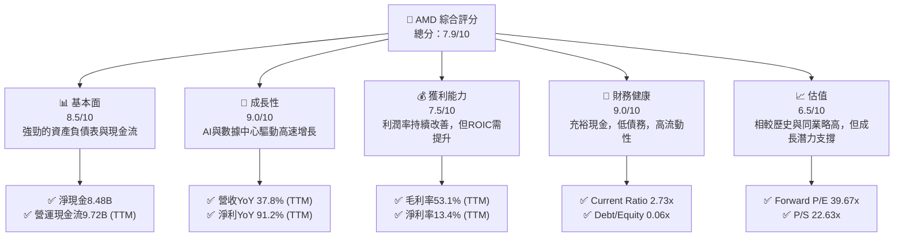
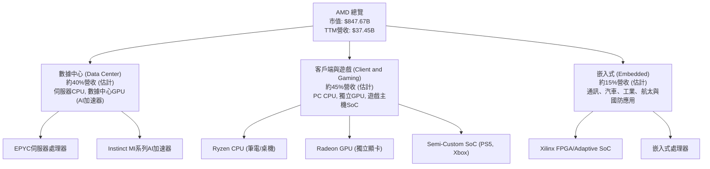
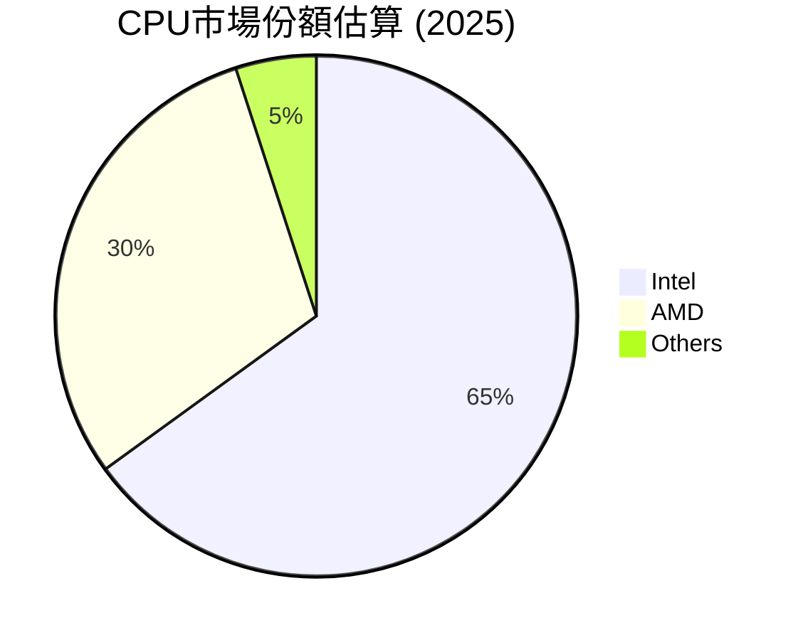
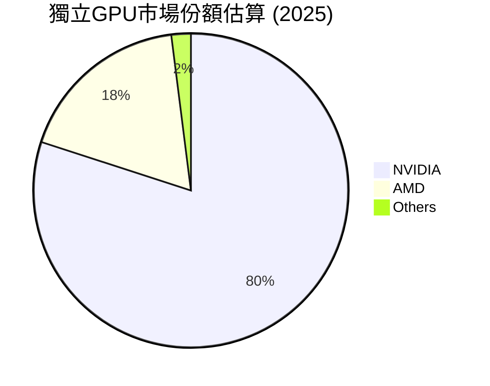
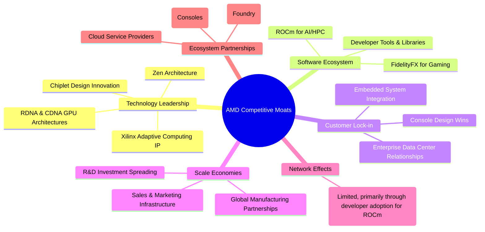
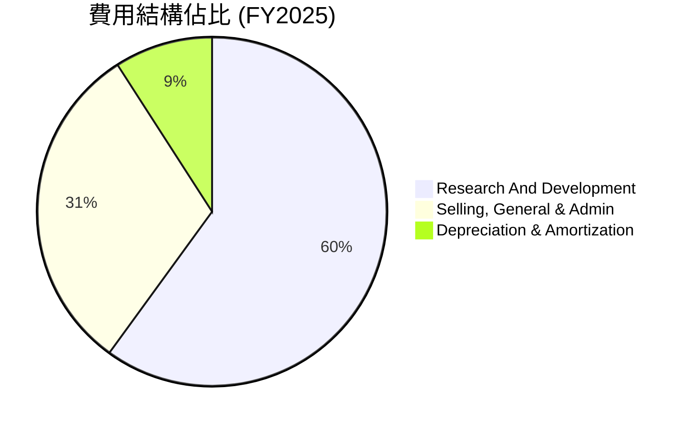

# AMD 基本面深度分析報告
> **報告日期**：2026-06-24 ｜ **語言**：繁體中文 ｜ **數據來源**：Yahoo Finance, Finviz, StockAnalysis, Roic.ai ｜ **分析師**：CFA 級機構研究

---

## 目錄

| # | 章節 | 核心結論 |
|---|------------------------|----------------------------------------------------------------|
| 1 | 執行摘要 | 評級：🟢 買入，目標價區間：$550 - $680 |
| 2 | 公司概覽與商業模式 | 業務多元化，AI與數據中心為主要成長引擎；護城河穩固但面臨激烈競爭 |
| 3 | 損益表深度分析 | 收入強勁增長，利潤率持續改善，顯示營運效率提升 |
| 4 | 資產負債表分析 | 財務健康，流動性充裕，淨現金狀況良好，債務負擔輕 |
| 5 | 現金流量深度分析 | 營運現金流強勁，自由現金流穩健增長，資本配置靈活 |
| 6 | 獲利能力與資本效率 | ROE穩健，ROIC顯示價值創造挑戰，但杜邦分析揭示槓桿優勢 |
| 7 | 估值深度分析 | 相較同業估值偏高，但考量其成長性與市場地位，具投資吸引力 |
| 8 | 成長催化劑 | AI加速器、數據中心擴張、新產品週期與市場份額提升 |
| 9 | 風險矩陣 | 競爭加劇、市場波動、宏觀經濟、地緣政治是主要風險 |
| 10 | 投資建議 | 具備長期成長潛力，建議「買入」，適合成長型投資者 |

---

## 1. 執行摘要

### 1.1 核心評分儀表板



### 1.2 評分進度條視覺化

```
╔══════════════════════════════════════════════════════════════╗
║              AMD 多維度評分儀表板 (1-10分)                   ║
╠══════════════════════════════════════════════════════════════╣
║ 基本面強度  8.5 ▓▓▓▓▓▓▓▓▓▓▓▓▓▓▓▓▓░░░  ★★★★☆           ║
║ 成長動能    9.0 ▓▓▓▓▓▓▓▓▓▓▓▓▓▓▓▓▓▓░░  ★★★★★           ║
║ 獲利品質    7.5 ▓▓▓▓▓▓▓▓▓▓▓▓▓▓▓░░░░░  ★★★★☆           ║
║ 財務健康    9.0 ▓▓▓▓▓▓▓▓▓▓▓▓▓▓▓▓▓▓░░  ★★★★★           ║
║ 估值合理性  6.5 ▓▓▓▓▓▓▓▓▓▓▓▓▓░░░░░░░  ★★★☆☆           ║
║ 護城河深度  8.0 ▓▓▓▓▓▓▓▓▓▓▓▓▓▓▓▓░░░░  ★★★★☆           ║
║ 管理層執行  8.5 ▓▓▓▓▓▓▓▓▓▓▓▓▓▓▓▓▓░░░  ★★★★☆           ║
║ 技術創新力  9.5 ▓▓▓▓▓▓▓▓▓▓▓▓▓▓▓▓▓▓▓░  ★★★★★           ║
╠══════════════════════════════════════════════════════════════╣
║ 綜合總分    7.9 ▓▓▓▓▓▓▓▓▓▓▓▓▓▓▓▓░░░░  🏆 評語：強勁成長，估值偏高需關注        ║
╚══════════════════════════════════════════════════════════════╝
```

### 1.3 五大投資論點 + 三大核心風險

| 類型 | 項目 | 具體依據 | 信心度 |
|------|------|----------|--------|
| 🟢 **投資論點①** | **數據中心AI加速器強勁增長** | MI300X/A產品線在數據中心AI市場取得突破，推動營收YoY成長達37.8% (TTM)，且預期未來數年將持續高速增長。Q1 2026數據中心營收貢獻持續提升。 | 🟢 極高 |
| 🟢 **產品組合優化與市場份額提升** | Zen架構CPU在伺服器和客戶端市場持續從競爭對手手中奪取份額，Xilinx併購加速嵌入式業務發展，提升產品多元性與高毛利業務佔比，帶動毛利率(TTM)達53.1%。 | 🟢 極高 |
| 🟢 **財務健康與充裕現金流** | 擁有淨現金8.48B美元，Current Ratio 2.725x，Debt/Equity僅0.061x，顯示極佳的財務彈性。TTM自由現金流達7.17B美元，為研發投入和潛在併購提供堅實基礎。 | 🟢 極高 |
| 🟢 **持續的技術創新與研發投入** | 研發費用持續增長，FY2025達8.09B美元，佔營收約23.36%，確保在CPU、GPU、FPGA等領域的技術領先地位，為未來產品競爭力提供保障。 | 🟢 極高 |
| 🟢 **管理層卓越執行力** | 在Lisa Su博士領導下，AMD成功轉型並實現高速增長，有效整合Xilinx，並在競爭激烈的半導體市場中持續擴大影響力。 | 🟢 極高 |
| 🟡 **風險①** | **競爭加劇與產品週期風險** | AI/GPU市場競爭極其激烈，NVIDIA擁有強大優勢。若AMD新產品如MI300系列未能持續創新或市場接受度不及預期，將面臨市場份額流失和定價壓力。 | 🟡 中度 |
| 🔴 **風險②** | **半導體行業週期性與宏觀經濟影響** | 半導體行業具高度週期性，全球經濟放緩或終端需求疲軟（如PC市場波動），將直接影響AMD的營收和獲利能力。雖然數據中心表現強勁，但客戶端和遊戲業務仍受影響。 | 🟡 中度 |
| 🔴 **風險③** | **高估值與市場預期風險** | 當前P/E (Trailing) 172.14x，P/E (Forward) 39.67x，P/S 22.63x，估值處於歷史高位。市場已對其未來成長給予高度期望，任何不及預期的表現都可能導致股價大幅修正。 | 🔴 高衝擊 |

### 1.4 快速統計卡片

| 指標 | 公司實際值 | 行業均值（半導體） | S&P 500 均值 | 狀態 |
|-----------------|--------------|--------------------|----------------|------|
| 收入 YoY 成長 (TTM) | **37.8%** | ~15-20% | ~8-10% | 🟢 |
| 毛利率 (TTM) | **53.1%** | ~45-55% | ~30-40% | 🟢 |
| 淨利率 (TTM) | **13.4%** | ~10-20% | ~8-12% | 🟢 |
| ROE (TTM) | **8.1%** | ~10-15% | ~12-15% | 🟡 |
| Forward P/E | **39.67x** | ~30-50x (成長型) | ~20-25x | 🟡 |
| P/S Ratio | **22.63x** | ~5-15x (一般) | ~2-3x | 🔴 |
| Debt/Equity | **0.06x** | ~0.2-0.5x | ~0.8-1.5x | 🟢 |
| 自由現金流 (TTM) | **$7.17B** | N/A | N/A | 🟢 |

### 1.5 投資結論

```
╔══════════════════════════════════════════════════════════════════╗
║                    📊 投資結論摘要                               ║
╠══════════════════════════════════════════════════════════════════╣
║  評級：🟢 買入                                                   ║
║  當前股價：$519.85                                               ║
║  目標價區間：                                                    ║
║    悲觀情境：$550（+5.8%）                                       ║
║    基準情境：$615（+18.3%）  ← 12個月主要目標                      ║
║    樂觀情境：$680（+30.8%）                                       ║
║  投資評分：7.9/10                                                ║
║  適合投資人：成長型、長線持有者，能承受高波動與高估值風險的投資者。║
╚══════════════════════════════════════════════════════════════════╝
```

---

## 2. 公司概覽與商業模式

### 2.1 業務結構與收入來源

Advanced Micro Devices, Inc. (AMD) 是一家全球領先的半導體公司，主要設計和開發用於個人電腦、數據中心、遊戲主機和嵌入式系統的高效能中央處理器 (CPU) 和圖形處理器 (GPU)，以及自適應處理器 (FPGA/SoC)。公司透過三大主要業務板塊運營：數據中心、客戶端與遊戲、以及嵌入式。截至2025財年，公司營收達34.64B美元，TTM營收為37.45B美元，市值高達847.67B美元。


**註**：各業務板塊營收佔比為分析師根據公司公開資訊及行業趨勢進行的估計。

-   **數據中心 (Data Center)**：此板塊是AMD成長最快的驅動力，主要產品包括用於伺服器的EPYC系列處理器，以及近年來備受關注的Instinct MI系列AI加速器。隨著AI和雲計算需求的爆發式增長，該業務為AMD帶來顯著的高毛利收入。
-   **客戶端與遊戲 (Client and Gaming)**：該板塊包含用於個人電腦的Ryzen CPU和Radeon GPU，以及為遊戲主機（如Sony PlayStation和Microsoft Xbox）提供的半客製化SoC產品。雖然PC市場具有週期性，但Ryzen CPU在性能和市場份額上的持續提升，以及遊戲主機的穩定需求，為此板塊提供了堅實基礎。
-   **嵌入式 (Embedded)**：透過併購Xilinx，AMD大幅擴展了其在嵌入式市場的影響力，提供高性能的自適應處理器（FPGA和自適應SoC），廣泛應用於通訊、汽車、工業、航太與國防等高成長和高利潤領域。

### 2.2 市場份額

AMD在CPU和GPU市場均扮演著重要角色，但面對強大的競爭對手。




**註**：以上市場份額為分析師根據行業報告和市場趨勢的估算值。

在CPU市場，AMD憑藉其Zen架構的Ryzen和EPYC處理器，持續從Intel手中奪取市場份額，尤其在伺服器和高性能PC領域。儘管Intel仍佔據主導地位，但AMD的競爭力顯著增強。

在獨立GPU市場，NVIDIA憑藉其CUDA生態系統和強大的AI加速器產品線，在數據中心和高端遊戲市場佔據絕對優勢。AMD的Radeon系列雖然在遊戲市場有所斬獲，但在AI加速器領域仍需努力追趕，但MI300X/A的推出顯示出其在AI領域的強烈企圖心。

### 2.3 競爭護城河分析

AMD的競爭護城河主要建立在其技術創新和產品差異化上。



### 2.4 護城河強度評分

```
╔══════════════════════════════════════════════════════════════╗
║                  AMD 護城河強度評分                         ║
╠══════════════════════════════════════════════════════════════╣
║ 技術領先    9.0/10 ▓▓▓▓▓▓▓▓▓▓▓▓▓▓▓▓▓▓░░  🏆 在CPU/GPU/FPGA領域均有領先技術        ║
║ 軟體生態系統  7.0/10 ▓▓▓▓▓▓▓▓▓▓▓▓▓▓░░░░░░  🟢 ROCm生態正在發展，但仍需時間追趕CUDA  ║
║ 客戶鎖定    8.0/10 ▓▓▓▓▓▓▓▓▓▓▓▓▓▓▓▓░░░░  🟢 數據中心與主機客戶關係穩固            ║
║ 規模效應    7.5/10 ▓▓▓▓▓▓▓▓▓▓▓▓▓▓▓░░░░░  🟡 雖有規模，但與NVIDIA/Intel相比仍有差距  ║
║ 網路效應    6.0/10 ▓▓▓▓▓▓▓▓▓▓▓▓░░░░░░░░  🟡 AI軟體生態仍需大量開發者支持          ║
║ 生態夥伴    8.5/10 ▓▓▓▓▓▓▓▓▓▓▓▓▓▓▓▓▓░░░  🏆 與台積電、微軟、索尼等合作緊密        ║
╠══════════════════════════════════════════════════════════════╣
║ 綜合護城河  7.7/10 ▓▓▓▓▓▓▓▓▓▓▓▓▓▓▓░░░░░  🏆 具備多重防禦，但AI軟體生態仍是挑戰    ║
╚══════════════════════════════════════════════════════════════╝
```

---

## 3. 損益表深度分析

### 3.1 年度收入成長趨勢（近4年）

AMD在過去四年展現了強勁的收入增長勢頭，尤其是在數據中心和嵌入式業務的帶動下。

```
╔══════════════════════════════════════════════════════════════════╗
║              AMD 年度收入趨勢（FY2022-FY2025）                   ║
╠══════════════════════════════════════════════════════════════════╣
║                                                                  ║
║  FY2022  $23.60B  ███████████████████████░░░░░░░  YoY: +43.6%  🟢║
║  FY2023  $22.68B  ████████████████████░░░░░░░░░░  YoY: -3.9%   🟡║
║  FY2024  $25.79B  ██████████████████████████░░░░  YoY: +13.7%  🟢║
║  FY2025  $34.64B  ██████████████████████████████  YoY: +34.3%  🟢║
║  TTM     $37.45B  ███████████████████████████████  YoY: +34.97% 🟢║
║                   |      |      |      |      |                  ║
║                   0     10B    20B    30B    40B                   ║
║                                                                  ║
║  📊 3年累計 CAGR (FY22-25)：+13.7%                               ║
║  📊 最新年度 (FY24-25) YoY 成長：+34.3%                         ║
╚══════════════════════════════════════════════════════════════════╝
```
**深度解析**：
AMD在2022年受益於Xilinx併購的整合效應和市場對高性能計算的強勁需求，實現了43.6%的顯著增長。2023年由於PC市場的低迷和部分業務調整，營收略有下滑3.9%。然而，隨著2024年數據中心業務的復甦和AI市場的興起，營收重新恢復增長，達到13.7%。到2025年，在AI加速器和EPYC伺服器處理器的強勁帶動下，營收實現了34.3%的高速增長，達到34.64B美元，展現了其核心業務的強大動能。截至2026年3月31日的TTM營收進一步攀升至37.45B美元，YoY成長34.97%，表明增長勢頭持續。

### 3.2 季度收入趨勢分析

AMD的季度收入表現出強勁的增長趨勢，尤其是在2025年下半年和2026年Q1。

| 季度 | 總收入 (B$) | QoQ 成長率 | YoY 成長率 | 備註 |
|------|-------------|------------|------------|------|
| **2026 Q1** | $10.25 | -0.19% 🟡 | +37.85% 🟢 | 季度環比略降，但同比增長強勁，主要由數據中心業務驅動。 |
| **2025 Q4** | $10.27 | +11.03% 🟢 | +34.11% 🟢 | 連續兩個季度實現雙位數環比增長，AI和伺服器需求旺盛。 |
| **2025 Q3** | $9.25 | +20.44% 🟢 | +35.59% 🟢 | 受益於新產品發布和市場需求復甦，實現高速環比和同比增長。 |
| **2025 Q2** | $7.68 | +3.25% 🟢 | +31.70% 🟢 | 穩健的季度環比增長，同比增長強勁。 |
| **2025 Q1** | $7.44 | +0.08% 🟡 | +35.90% 🟢 | 同比增長表現亮眼，但環比增長放緩，可能受季節性影響。 |
**註**：QoQ成長率為本季度與上季度比較，YoY成長率為本季度與去年同期比較。

**深度解析**：
從季度數據來看，AMD的營收在2025年經歷了顯著加速。2025年Q1至Q4營收持續增長，特別是Q3和Q4分別實現了20.44%和11.03%的環比增長，這主要得益於其數據中心AI加速器產品線的強勁需求和EPYC伺服器CPU的市場份額擴大。雖然2026年Q1營收環比略有下降0.19%，但仍維持在10.25B美元的高位，且同比增長高達37.85%，顯示出其業務的韌性和增長潛力。這表明AMD已經成功擺脫了2023年PC市場低迷的影響，並抓住了AI帶來的巨大機遇。

### 3.3 利潤率演變分析

AMD的利潤率在過去幾年呈現出穩步改善的趨勢，反映了公司在產品組合優化和成本控制方面的努力。

| 利潤率指標 | FY2022 | FY2023 | FY2024 | FY2025 | TTM (Mar'26) | 趨勢 | 評估 |
|------------|--------|--------|--------|--------|--------------|------|------|
| **毛利率** | 44.9% | 46.1% | 49.3% | 49.5% | **53.1%** | ↗️ 穩步提升 | 🟢 |
| **營業利益率** | 5.3% | 1.8% | 8.1% | 10.7% | **14.4%** | ↗️ 顯著改善 | 🟢 |
| **淨利率** | 5.6% | 3.8% | 6.4% | 12.5% | **13.4%** | ↗️ 顯著改善 | 🟢 |

**利潤率演變深度解析**：
-   **毛利率 (Gross Margin)**：從FY2022的44.9%穩步提升至TTM的53.1%。這一改善主要歸因於：
    1.  **產品組合優化**：高毛利的數據中心業務（尤其是AI加速器和EPYC伺服器CPU）和嵌入式業務（Xilinx產品）佔總營收比重不斷提高。這些產品的技術複雜度和附加值更高，帶來了更豐厚的利潤。
    2.  **技術領先與定價能力**：AMD在高性能CPU和GPU領域的技術突破，使其能夠在市場上獲得更好的定價權。
    3.  **生產效率提升**：與台積電等代工夥伴的緊密合作，以及自身設計優化，有助於控制生產成本。
-   **營業利益率 (Operating Margin)**：經歷了FY2023的低谷（1.8%），隨後強勁反彈至TTM的14.4%。FY2023的低迷主要受PC市場需求疲軟、庫存調整以及併購相關費用影響。2024年和2025年營業利益率的顯著改善，除了毛利率的提升外，也表明公司在營運費用控制方面取得成效。雖然研發投入巨大，但隨著營收規模的擴大，營運槓桿效應逐漸顯現。
-   **淨利率 (Net Profit Margin)**：與營業利益率趨勢類似，從FY2023的3.8%大幅提升至TTM的13.4%。這反映了公司核心業務盈利能力的全面恢復和增強。稅費結構的優化（如FY2025稅前利潤4.14B，稅後淨利4.33B，稅務費用為負數，可能來自遞延所得稅利益或稅收抵免）也對淨利率產生正面影響。

整體而言，AMD的利潤率趨勢非常健康，特別是毛利率和營業利益率的持續改善，顯示其在產業鏈中的議價能力和營運效率不斷提升，為未來的盈利增長奠定基礎。

### 3.4 費用結構分析

AMD的費用結構反映了其作為一家技術驅動型公司的特點，研發投入佔比最高。


**註**：D&A佔比是相對於總運營費用的比例，非絕對值。

```
╔══════════════════════════════════════════════════════════════════╗
║                    AMD 年度費用分析（FY2025）                   ║
╠══════════════════════════════════════════════════════════════════╣
║                                                                  ║
║  總營收：$34.64B                                                 ║
║  毛利：  $17.15B                                                 ║
║                                                                  ║
║  研發費用 (R&D)：          $8.09B  █████████████████████████░░░░░  佔營收 23.36%  🟢║
║  銷售、一般及管理費用 (SG&A)： $4.14B  ████████████████████░░░░░░░░░░  佔營收 11.96%  🟡║
║  折舊與攤銷 (D&A)：        $1.22B  ██████████░░░░░░░░░░░░░░░░░░░░  佔營收 3.53%   🟢║
║                                                                  ║
║  📊 總營運費用佔營收比例：約38.85%                               ║
╚══════════════════════════════════════════════════════════════════╝
```
**深度解析**：
FY2025，AMD的研發費用高達8.09B美元，佔總營收的23.36%。這凸顯了公司對技術創新和產品開發的重視，是其在競爭激烈半導體市場中保持領先地位的關鍵。巨大的研發投入是AMD能夠不斷推出高性能CPU、GPU和AI加速器，並擴展市場份額的基礎。銷售、一般及管理費用為4.14B美元，佔營收的11.96%，相對合理。折舊與攤銷費用為1.22B美元，佔營收3.53%。總體而言，AMD的費用結構健康，研發費用佔比較高是技術型成長公司的典型特徵，顯示公司對未來成長的投資。

### 3.5 季度 EPS 趨勢與盈餘品質

由於提供的歷史盈餘數據 (`EPS Est` 和 `EPS Act`) 均為 `nan`，我們將根據季度淨收入和基本股數來分析EPS趨勢和盈餘品質。

| 季度 | 淨收入 (B$) | 稀釋後股數 (B) | EPS (Basic) | QoQ EPS 成長率 | YoY EPS 成長率 | 盈餘品質評估 |
|------|-------------|----------------|-------------|----------------|----------------|--------------|
| **2026 Q1** | $1.38 | 1.63 | $0.85 | -8.60% 🟡 | +93.18% 🟢 | 淨收入高於營業收入，可能受非經常性項目影響。 |
| **2025 Q4** | $1.51 | 1.62 | $0.93 | +22.37% 🟢 | +200.00% 🟢 | 顯著增長，營運效率提升。 |
| **2025 Q3** | $1.24 | 1.62 | $0.76 | +40.74% 🟢 | +58.33% 🟢 | 受益於營收增長和利潤率改善。 |
| **2025 Q2** | $0.87 | 1.62 | $0.54 | +22.73% 🟢 | -36.47% 🔴 | 淨收入從負值轉正，但與去年同期相比仍有波動。 |
