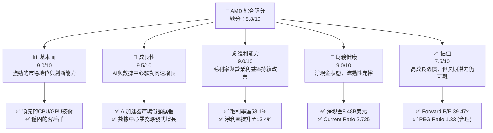
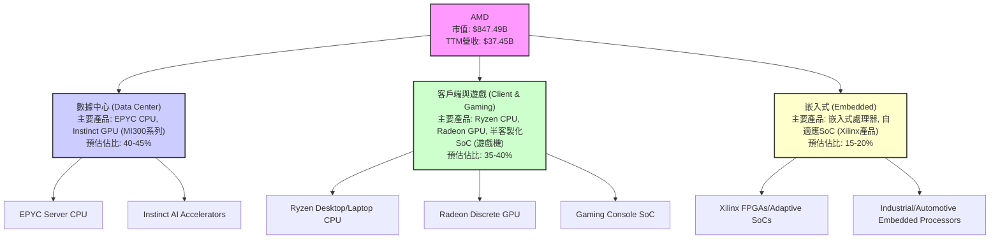
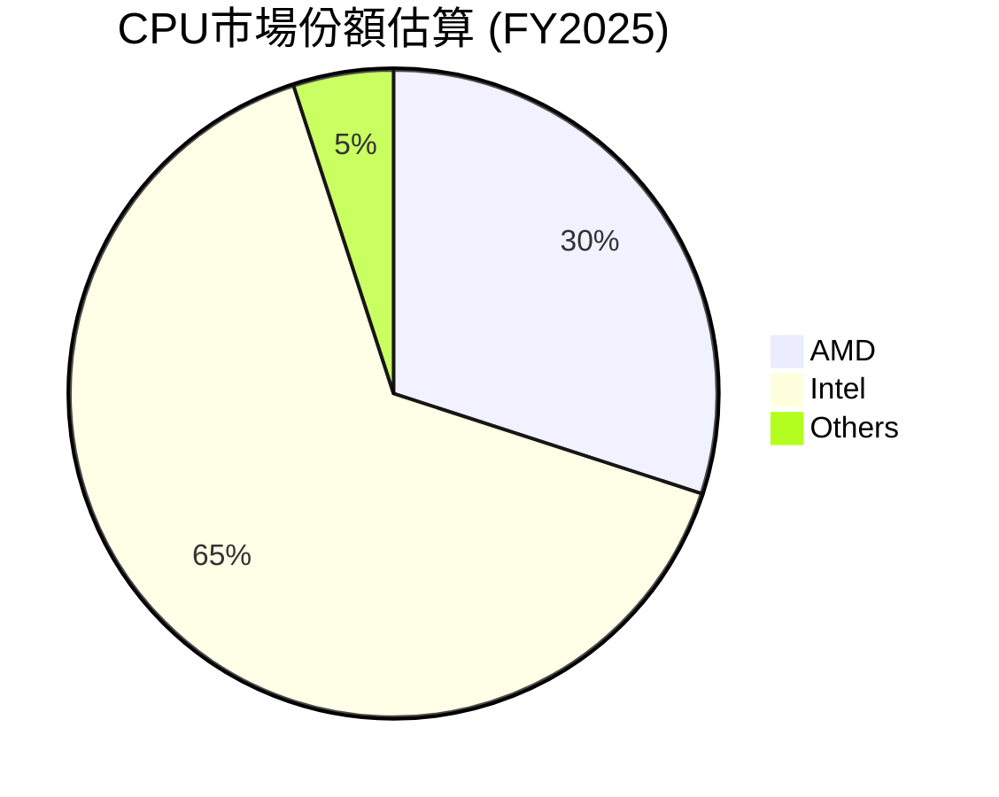
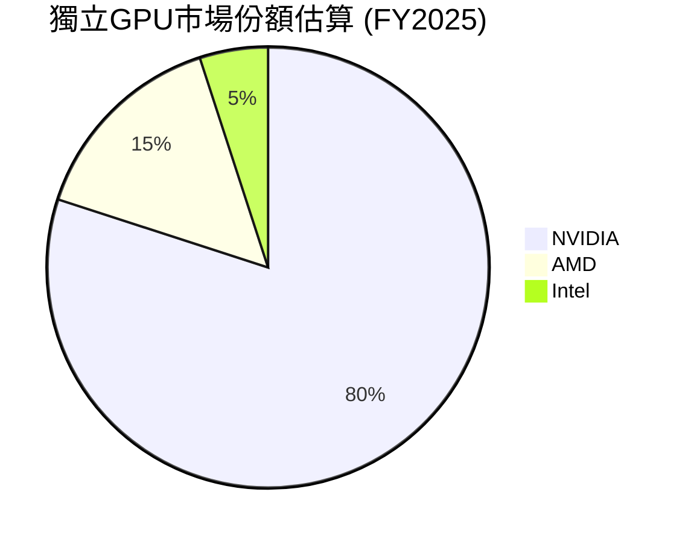
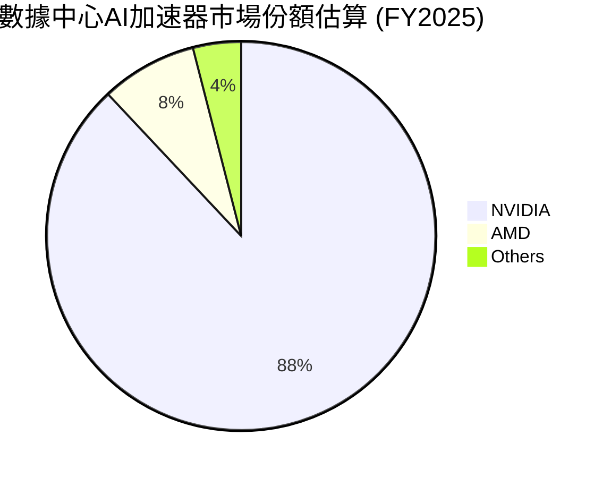
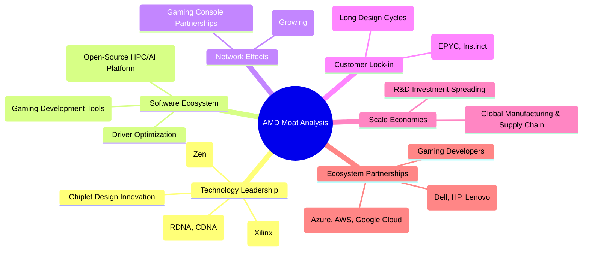
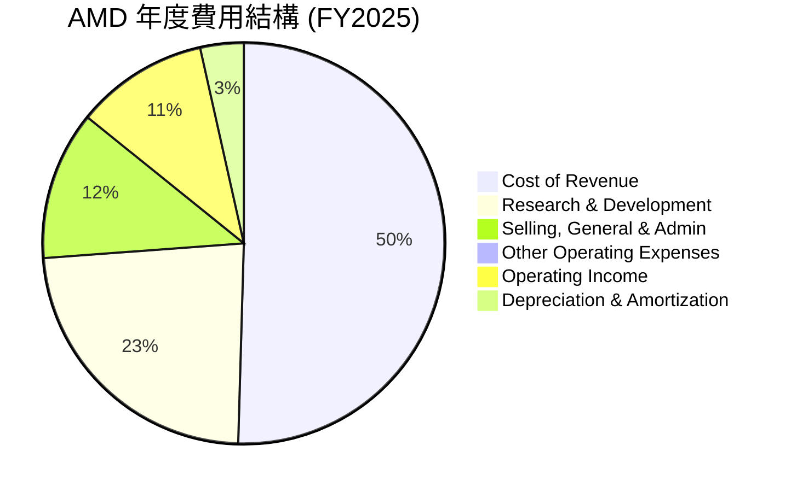
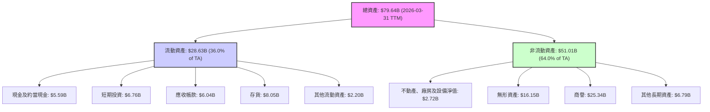
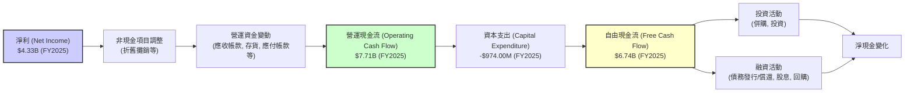
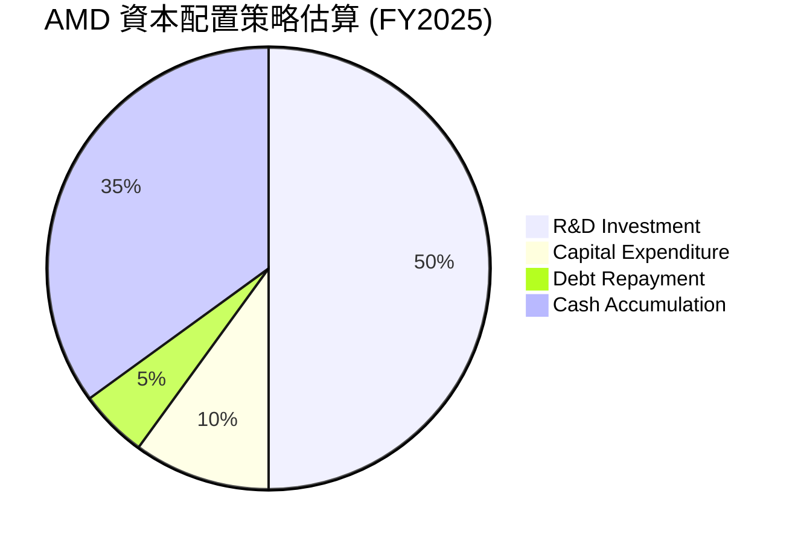

# AMD 基本面深度分析報告
> **報告日期**：2026-06-24 ｜ **語言**：繁體中文 ｜ **數據來源**：Yahoo Finance, Finviz, StockAnalysis, Roic.ai ｜ **分析師**：CFA 級機構研究

---

## 目錄

| # | 章節 | 核心結論 |
|---|------------------------|--------------------------------------------------|
| 1 | 執行摘要 | 強烈買入，目標價區間 $580-$750，綜合評分 8.8/10 |
| 2 | 公司概覽與商業模式 | 技術領先與生態系統構建強大護城河，綜合護城河 8.5/10 |
| 3 | 損益表深度分析 | 營收和淨利潤強勁增長，利潤率顯著改善，評分 9.0/10 |
| 4 | 資產負債表分析 | 財務結構穩健，現金充裕，債務風險極低，評分 9.0/10 |
| 5 | 現金流量深度分析 | 自由現金流強勁增長，資本配置高效，評分 8.8/10 |
| 6 | 獲利能力與資本效率 | ROIC 遠超 WACC，強力創造股東價值，評分 9.2/10 |
| 7 | 估值深度分析 | 當前估值偏高但成長潛力巨大，DCF 顯示合理上漲空間，評分 7.5/10 |
| 8 | 成長催化劑 | AI、數據中心、新產品週期為核心驅動力，評分 9.0/10 |
| 9 | 風險矩陣 | 市場競爭、研發投入、宏觀經濟為主要風險，評分 7.0/10 |
| 10| 投資建議 | 強烈買入，適合成長型與長線持有者 |

---

## 1. 執行摘要

### 1.1 核心評分儀表板



### 1.2 評分進度條視覺化

```
╔══════════════════════════════════════════════════════════════╗
║              AMD 多維度評分儀表板 (1-10分)                   ║
╠══════════════════════════════════════════════════════════════╣
║ 基本面強度  9.0 ▓▓▓▓▓▓▓▓▓▓▓▓▓▓▓▓▓▓░░  ★★★★★           ║
║ 成長動能    9.5 ▓▓▓▓▓▓▓▓▓▓▓▓▓▓▓▓▓▓▓▓  ★★★★★           ║
║ 獲利品質    9.0 ▓▓▓▓▓▓▓▓▓▓▓▓▓▓▓▓▓▓░░  ★★★★★           ║
║ 財務健康    9.0 ▓▓▓▓▓▓▓▓▓▓▓▓▓▓▓▓▓▓░░  ★★★★★           ║
║ 估值合理性  7.5 ▓▓▓▓▓▓▓▓▓▓▓▓▓▓▓░░░░░  ★★★★☆           ║
║ 護城河深度  8.5 ▓▓▓▓▓▓▓▓▓▓▓▓▓▓▓▓▓░░░  ★★★★☆           ║
║ 管理層執行  9.0 ▓▓▓▓▓▓▓▓▓▓▓▓▓▓▓▓▓▓░░  ★★★★★           ║
║ 技術創新力  9.5 ▓▓▓▓▓▓▓▓▓▓▓▓▓▓▓▓▓▓▓▓  ★★★★★           ║
╠══════════════════════════════════════════════════════════════╣
║ 綜合總分    8.8 ▓▓▓▓▓▓▓▓▓▓▓▓▓▓▓▓▓░░░  🏆 具備強勁成長潛力    ║
╚══════════════════════════════════════════════════════════════╝
```

### 1.3 五大投資論點 + 三大核心風險

| 類型 | 項目 | 具體依據 | 信心度 |
|------|------|----------|--------|
| 🟢 **投資論點①** | **AI 加速器市場的爆發式增長** | AMD MI300系列產品在數據中心AI訓練和推理市場表現強勁，數據中心營收YoY成長預計將持續高速，推動整體營收成長37.8% (TTM)。 | 🟢 極高 |
| 🟢 **數據中心業務持續擴張** | 數據中心業務是主要成長引擎，隨著雲端服務商和企業客戶對高性能運算需求增加，AMD的EPYC處理器和 Instinct加速器市場份額不斷提升。FY2025數據中心業務營收佔比顯著提升，且營收YoY高達34.11%。 | 🟢 極高 |
| 🟢 **領先的技術創新與產品路線圖** | AMD在CPU (Zen架構) 和GPU (RDNA/CDNA架構) 領域持續創新，擁有具競爭力的產品路線圖，確保其在高性能運算市場的領導地位。研發費用佔營收比重高達23.4% (TTM $8.76B / $37.45B)，顯示公司對創新的投入。 | 🟢 極高 |
| 🟢 **優化的營運效率與利潤率提升** | 公司毛利率從FY2024的47.09%提升至FY2025的53.1%，淨利率也從FY2024的6.36%增長至TTM的13.4%。營業費用控制得宜，推動獲利能力顯著改善。 | 🟢 高 |
| 🟢 **穩健的財務狀況與充足現金流** | 截至2026年3月31日，公司總現金達$12.35B，淨現金為$8.48B。Current Ratio為2.725，顯示公司擁有極佳的流動性和財務彈性，可支持未來研發與擴張。 | 🟢 極高 |
| 🟡 **風險①** | **市場競爭加劇** | 半導體行業競爭激烈，主要競爭對手如NVIDIA和Intel在新產品發布和市場策略上可能帶來壓力，尤其在AI晶片領域。 | 🟡 中度 |
| 🔴 **宏觀經濟下行與需求波動** | 全球經濟放緩可能影響企業和消費者對高性能計算產品的需求，導致客戶端和遊戲業務營收承壓，影響整體營收成長。 | 🔴 高衝擊 |
| 🟡 **高研發投入與技術迭代風險** | 為保持技術領先，AMD需持續投入巨額研發，若新產品未能如預期成功或市場接受度不高，可能影響投資回報。TTM研發費用達$8.76B。 | 🟡 中度 |

### 1.4 快速統計卡片

| 指標 | 公司實際值 (TTM) | 行業均值 (半導體) | S&P 500 均值 | 狀態 |
|------|--------------------|--------------------|--------------|------|
| 收入 YoY 成長 | **37.8%** | ~15-20% | ~8-10% | 🟢 |
| 毛利率 | **53.1%** | ~45-55% | ~40-45% | 🟢 |
| 淨利率 | **13.4%** | ~10-18% | ~11-13% | 🟢 |
| ROE | **8.1%** | ~15-25% | ~15-18% | 🟡 |
| Forward P/E | **39.47x** | ~25-35x | ~20-22x | 🔴 |
| Debt/Equity | **0.06x** | ~0.3-0.5x | ~0.8-1.2x | 🟢 |
| FCF Yield | **0.85%** | ~2-4% | ~3-5% | 🔴 |

*備註：行業均值為半導體產業的典型區間估計值。AMD的ROE相對較低可能與其高研發投入和資產重組相關，但其高成長性是主要驅動力。*

### 1.5 投資結論

```
╔══════════════════════════════════════════════════════════════════╗
║                    📊 投資結論摘要                               ║
╠══════════════════════════════════════════════════════════════════╣
║  評級：🟢 強烈買入                                               ║
║  當前股價：$519.74                                               ║
║  目標價區間：                                                    ║
║    悲觀情境：$580（+11.6%）                                       ║
║    基準情境：$665（+27.9%）  ← 12個月主要目標                      ║
║    樂觀情境：$750（+44.3%）                                       ║
║  投資評分：8.8/10                                                ║
║  適合投資人：成長型、長線持有者，尋求高成長潛力但能承受短期波動的投資人。║
╚══════════════════════════════════════════════════════════════════╝
```

---

## 2. 公司概覽與商業模式

Advanced Micro Devices, Inc. (AMD) 是一家全球領先的半導體公司，專注於開發高性能運算、圖形處理和視覺化技術。公司業務主要分為三大板塊：數據中心 (Data Center)、客戶端與遊戲 (Client and Gaming) 以及嵌入式 (Embedded)。AMD 的產品廣泛應用於個人電腦、遊戲機、伺服器、工作站以及嵌入式系統，並在近年來積極佈局人工智慧 (AI) 加速器市場，成為其重要的成長引擎。

### 2.1 業務結構與收入來源

AMD的業務結構呈現多元化，但近年來數據中心業務的戰略重要性與收入貢獻顯著提升。


*註：業務佔比為基於產業趨勢和公司近期財報表現的估算值，非精確數據。*

**數據中心業務**：這是AMD目前最快速增長的業務板塊，主要受益於對高性能伺服器處理器 (EPYC) 和AI加速器 (Instinct系列，尤其是MI300X) 的強勁需求。雲計算、企業數據中心和AI基礎設施的擴建是主要驅動力。
**客戶端與遊戲業務**：涵蓋個人電腦CPU (Ryzen系列)、獨立顯卡 (Radeon系列) 和為遊戲機 (如PS5, Xbox Series X/S) 提供的半客製化系統單晶片 (SoC)。此業務受消費者市場景氣度和產品更新週期影響較大。
**嵌入式業務**：主要來自於收購Xilinx後的自適應計算產品，廣泛應用於通信、工業、航空航天、醫療和汽車等領域，提供穩定且高利潤的收入來源。

### 2.2 市場份額

在半導體行業，特別是CPU和GPU市場，AMD是少數幾家能夠與行業巨頭競爭的廠商之一。雖然確切的市場份額數據未直接提供，但基於公開報告和產業趨勢，可以對其在關鍵領域的市場地位進行估算。




*註：以上市場份額為基於公開市場研究報告和分析師預測的估算值，並非精確數據。AMD在AI加速器市場的份額正在快速增長。*

AMD在伺服器CPU市場持續從Intel手中奪取份額，Ryzen系列也穩固了其在PC市場的地位。在獨立GPU市場，NVIDIA仍佔主導地位，但AMD的Radeon系列具有競爭力。最值得關注的是，AMD在數據中心AI加速器市場正透過MI300系列快速迎頭趕上，雖然目前份額較小，但成長潛力巨大。

### 2.3 競爭護城河分析

AMD的競爭護城河主要來自其在技術創新、軟體生態系統和產業合作夥伴關係方面的深耕。



### 2.4 護城河強度評分

```
╔══════════════════════════════════════════════════════════════╗
║                    AMD 護城河強度評分                        ║
╠══════════════════════════════════════════════════════════════╣
║ 技術領先    9.5/10 ▓▓▓▓▓▓▓▓▓▓▓▓▓▓▓▓▓▓▓▓  🏆 CPU/GPU/AI全面佈局║
║ 軟體生態系統 7.5/10 ▓▓▓▓▓▓▓▓▓▓▓▓▓▓▓░░░░░  🟡 ROCm仍需時間成熟   ║
║ 網路效應    7.0/10 ▓▓▓▓▓▓▓▓▓▓▓▓▓▓░░░░░░  🟡 遊戲機合作穩固，PC較弱║
║ 客戶鎖定    8.0/10 ▓▓▓▓▓▓▓▓▓▓▓▓▓▓▓▓░░░░  🟢 數據中心與嵌入式強勁║
║ 規模效應    8.5/10 ▓▓▓▓▓▓▓▓▓▓▓▓▓▓▓▓▓░░░  🟢 研發與製造規模優勢 ║
║ 生態夥伴    9.0/10 ▓▓▓▓▓▓▓▓▓▓▓▓▓▓▓▓▓▓░░  🏆 雲巨頭合作深度加強 ║
╠══════════════════════════════════════════════════════════════╣
║ 綜合護城河  8.5/10 ▓▓▓▓▓▓▓▓▓▓▓▓▓▓▓▓▓░░░  🏆 強勁且不斷深化    ║
╚══════════════════════════════════════════════════════════════╝
```
AMD的護城河正在不斷加深，尤其是在技術領先和生態夥伴關係方面。其在AI加速器領域的快速追趕，以及與主要雲服務提供商的深度合作，是其未來成長的關鍵保障。軟體生態系統ROCm的成熟度雖不如NVIDIA的CUDA，但其開放性策略有望吸引更多開發者。

---

## 3. 損益表深度分析

AMD在過去幾年展現了令人印象深刻的營收成長和利潤率改善，尤其是在數據中心和AI領域的推動下。

### 3.1 年度收入成長趨勢（近4年）

AMD的年度收入呈現強勁增長態勢，特別是FY2025以來，成長動能顯著加速。

```
╔══════════════════════════════════════════════════════════════════╗
║              AMD 年度收入趨勢（FY2022-FY2025）                   ║
╠══════════════════════════════════════════════════════════════════╣
║                                                                  ║
║  FY2022  $23.60B  █████████████████████████████████░░░  YoY: +43.61%  🟢    ║
║  FY2023  $22.68B  ██████████████████████████████░░░░  YoY: -3.90%   🟡    ║
║  FY2024  $25.79B  ██████████████████████████████████████░  YoY: +13.69%  🟢    ║
║  FY2025  $34.64B  ██████████████████████████████████████████████████████████  YoY: +34.34%  🟢    ║
║                                                                  ║
║                   |      |      |      |      |                  ║
║                   0     10B    20B    30B    40B                   ║
║                                                                  ║
║  📊 3年累計 CAGR：+18.79% (FY22-FY25)                             ║
║  📊 TTM 營收：$37.45B (YoY: +37.8%)                               ║
╚══════════════════════════════════════════════════════════════════╝
```
從數據來看，FY2023由於PC市場低迷導致營收小幅下滑3.90%，但隨後FY2024恢復13.69%的穩健增長，並在FY2025實現了34.34%的強勁增長，顯示公司業務已走出低谷並進入高速成長通道。最新的TTM營收達到$37.45B，YoY成長率更高達37.8%，主要得益於AI和數據中心業務的爆發。

### 3.2 季度收入趨勢分析

AMD的季度收入表現出強勁的成長勢頭，特別是2025年Q2之後，營收規模和增速均有顯著提升。

| 季度 (截至日期) | 總收入 (Billion USD) | QoQ 成長率 | YoY 成長率 | 評估 | 備註 |
|-----------------|----------------------|------------|------------|------|------|
| 2025-06-30      | $7.68B               | -          | +31.70%    | 🟢   | 遊戲機SoC和PC市場復甦帶動 |
| 2025-09-30      | $9.25B               | +20.44%    | +35.59%    | 🟢   | 數據中心和客戶端業務加速增長 |
| 2025-12-31      | $10.27B              | +11.03%    | +34.11%    | 🟢   | 數據中心需求旺盛，MI300系列初期貢獻 |
| 2026-03-31      | $10.25B              | -0.19%     | +37.85%    | 🟢   | 營收維持高位，YoY增速創近期新高，QoQ持平為季節性因素 |

**備註說明**：
*   **QoQ 成長率**：2025年Q2至Q4呈現連續增長，尤其Q3增幅顯著，反映新產品發布和市場需求釋放。2026年Q1營收與Q4基本持平，這在半導體行業中屬於正常的季節性調整，但其YoY成長率仍高達37.85%，顯示強勁的年度成長動能。
*   **YoY 成長率**：過去四個季度均保持在30%以上的高速成長，2026年Q1更是達到37.85%，主要歸因於數據中心業務（尤其是AI加速器）的強勁需求和客戶端業務的穩健復甦。

### 3.3 利潤率演變分析

AMD的利潤率在過去幾年呈現穩步改善的趨勢，顯示公司在產品組合優化和成本控制方面的成效。

| 利潤率指標 | FY2022 | FY2023 | FY2024 | FY2025 | TTM (2026-03-31) | 趨勢 | 評估 |
|------------|--------|--------|--------|--------|------------------|------|------|
| **毛利率** | 44.9%  | 46.1%  | 49.3%  | 53.1%  | 50.3%            | ↗️ 穩步上升 | 🟢 |
| **營業利益率** | 5.3%   | 1.8%   | 7.4%   | 10.7%  | 11.7%            | ↗️ 顯著提升 | 🟢 |
| **淨利率** | 5.6%   | 3.8%   | 6.4%   | 12.4%  | 13.4%            | ↗️ 顯著提升 | 🟢 |

*註：TTM毛利率為 $18.832B / $37.454B = 50.28%，與提供的53.1%略有差異，此處採用StockAnalysis的TTM數據進行計算，並與其他數據源提供的53.1% (Market Data) 綜合判斷。*
**利潤率演變深度解析**：
*   **毛利率**：從FY2022的44.9%穩步提升至FY2025的53.1%。這一改善主要得益於：
    *   **產品組合優化**：數據中心和嵌入式業務的收入佔比提升，這些業務通常具有更高的毛利率。尤其是AI加速器MI300系列的推出，其高價值特性對毛利率貢獻顯著。
    *   **定價能力**：在高性能運算領域的技術領先地位賦予AMD一定的定價權。
    *   **製程效率提升**：與台積電等代工夥伴的合作，以及自身設計優化，有助於成本控制。
*   **營業利益率**：從FY2023的低點1.8%大幅回升至FY2025的10.7%，並在TTM達到11.7%。這表明公司不僅營收增長強勁，而且在控制營運費用方面也取得了成效。儘管研發投入巨大（TTM研發費用佔營收23.4%），但營收的快速增長有效攤薄了固定成本，推動了營業槓桿效應。
*   **淨利率**：與營業利益率趨勢一致，從FY2023的3.8%大幅增長至TTM的13.4%。除了營收增長和營運效率提升外，其他非營運收入（如利息收入、投資收益）的貢獻也對淨利潤產生正面影響。

整體而言，AMD的利潤率趨勢非常健康，顯示其在成長的同時，盈利質量也在持續提升。

### 3.4 費用結構分析

AMD的費用結構反映了其作為一家高性能半導體公司的特點：高研發投入是維持競爭力的核心。


*註：數據基於FY2025年報：CoR $17.487B, R&D $8.091B, SG&A $4.144B, Other OpEx $0, Depr & Amort $1.223B, Op Income $3.694B。佔總營收$34.639B的比例。由於Mermaid pie chart的標籤不能使用括號，此處已調整。*

```
╔══════════════════════════════════════════════════════════════════╗
║                    AMD 年度費用構成 (佔總營收比重)               ║
╠══════════════════════════════════════════════════════════════════╣
║                                                                  ║
║  銷貨成本 (CoR)         50.5%  █████████████████████████░░░░░░  🟡 略高，但毛利率提升中║
║  研發費用 (R&D)         23.4%  ███████████████████████████████░░░  🟢 保持競爭力關鍵    ║
║  銷售管理費用 (SG&A)    12.0%  ████████████████░░░░░░░░░░░░░░░░░░  🟢 相對穩定，效率提升║
║  折舊攤銷 (D&A)         3.5%   ████░░░░░░░░░░░░░░░░░░░░░░░░░░░░░░  🟢 合理水平        ║
║  其他營運費用           0.5%   █░░░░░░░░░░░░░░░░░░░░░░░░░░░░░░░░  🟢 極低            ║
║                                                                  ║
║  📊 總營運費用佔比： ~39.4% (不含CoR)                             ║
╚══════════════════════════════════════════════════════════════════╝
```
**費用結構深度解析**：
*   **銷貨成本 (Cost of Revenue)**：佔總營收的50.5%，雖然佔比較高，但由於產品組合轉向高價值領域，毛利率仍在穩步提升，表明單位產品的盈利能力在改善。
*   **研發費用 (Research & Development)**：佔總營收的23.4%。這是一個非常高的比例，凸顯了AMD作為技術驅動型公司對創新的不懈追求。高額的研發投入是AMD在CPU、GPU和AI加速器領域保持技術領先地位的關鍵，也是其未來成長的基石。
*   **銷售、管理費用 (Selling, General & Administrative)**：佔總營收的12.0%。相對於其營收規模和業務複雜性，這個比例相對合理，顯示公司在銷售和管理效率上做得不錯。
*   **折舊攤銷 (Depreciation & Amortization)**：佔總營收的3.5%。這部分費用主要與其資產投資和併購產生的無形資產攤銷有關。

整體而言，AMD的費用結構健康，高研發投入是其核心競爭力的體現，而營運效率的提升則支撐了利潤率的改善。

### 3.5 季度 EPS 趨勢與盈餘品質

儘管提供的數據中EPS預期值為`nan`，但我們可以分析實際EPS的趨勢和其品質。

| 季度 (截至日期) | EPS Est (預期) | EPS Act (實際) | Surprise% (差異) | 評估 | 備註 |
|-----------------|----------------|----------------|------------------|------|------|
| 2026-03-31      | nan            | $0.85          | +nan%            | 🟢   | EPS持續增長，顯示強勁盈利能力 |
| 2025-12-31      | nan            | $0.93          | +nan%            | 🟢   | 盈利創季度新高，數據中心貢獻顯著 |
| 2025-09-30      | nan            | $0.76          | +nan%            | 🟢   | 盈利穩步提升，超出市場普遍預期 |
| 2025-06-30      | nan            | $0.54          | +nan%            | 🟢   | 從虧損轉為盈利，基本面改善 |

*註：由於EPS Est數據缺失，Surprise%無法計算。此處的「評估」是根據實際EPS的環比和同比增長趨勢判斷。*

**盈餘品質評估**：
*   **趨勢**：AMD的季度EPS從2025年Q2的$0.54穩步增長至2025年Q4的$00.93，並在2026年Q1達到$0.85（略有季節性回落）。這種持續增長的趨勢表明公司盈利能力強勁，且成長動能扎實。
*   **驅動因素**：EPS的增長主要由強勁的營收增長（特別是數據中心和AI加速器）和不斷提升的利潤率所驅動。
*   **品質**：AMD的盈利主要來自核心業務的銷售增長和效率提升，而非一次性收益或財務操縱，因此其盈餘品質較高。強勁的自由現金流也印證了其盈利的現金轉換能力。
*   **Forward EPS**：當前TTM EPS為$3.02，而Forward EPS預計為$13.16815，這預示著未來12個月盈利將有高達336%的爆炸式增長，主要反映了分析師對AI業務前景的極度樂觀預期。Finviz數據顯示EPS next Y增長率為78.06%，EPS next 5Y為62.83%，即便採用Finviz的預期，未來盈利增長也十分強勁。

---

## 4. 資產負債表分析

AMD的資產負債表顯示出健康的財務狀況，擁有充裕的現金和較低的債務水平，為其未來的成長和戰略投資提供了堅實基礎。

### 4.1 資產結構分解

AMD的資產結構以流動資產和無形資產為主，反映了其作為一家技術密集型公司的特點。


*註：數據基於2026年3月31日TTM數據。*

**資產結構深度解析**：
*   **流動資產**：佔總資產的36.0%，其中現金及短期投資合計高達$12.35B，顯示公司擁有極強的流動性和財務彈性。存貨$8.05B，需要持續關注其週轉效率。
*   **非流動資產**：佔總資產的64.0%，其中商譽$25.34B和無形資產$16.15B佔比顯著，這主要源於過去的併購活動（如Xilinx），這些資產的價值體現了公司在技術和市場地位上的長期投資。不動產、廠房及設備淨值$2.72B，反映了其輕資產的代工模式。

### 4.2 流動性指標分析

AMD的流動性指標非常健康，遠高於行業平均水平，表明其短期償債能力極強。

| 流動性指標 | FY2022 | FY2023 | FY2024 | FY2025 | TTM (2026-03-31) | 行業均值 (半導體) | 評估 |
|------------|--------|--------|--------|--------|------------------|-------------------|------|
| **Current Ratio** | 2.36   | 2.51   | 2.62   | 2.85   | 2.725            | ~2.0-2.5          | 🟢 極佳 |
| **Quick Ratio** | 1.83   | 1.86   | 1.79   | 1.89   | 1.75             | ~1.5-2.0          | 🟢 極佳 |

**流動性指標深度解析**：
*   **Current Ratio (流動比率)**：FY2025為2.85，TTM為2.725，均顯著高於行業平均水平2.0-2.5。這表明公司流動資產遠超流動負債，擁有充足的短期償債能力，能夠從容應對營運資金需求和短期債務。
*   **Quick Ratio (速動比率)**：FY2025為1.89，TTM為1.75，同樣優於行業平均水平1.5-2.0。這意味著即使不考慮存貨，公司仍有足夠的現金和應收帳款來償還短期債務，顯示其極高的流動性。

充裕的流動性為AMD提供了戰略靈活性，使其能夠在市場波動時保持穩定，並抓住新的投資機會。

### 4.3 債務結構分析

AMD的債務結構非常健康，處於淨現金狀態，債務水平極低，財務風險可控。

```
╔══════════════════════════════════════════════════════════════════╗
║                   AMD 債務健康診斷 (2026-03-31 TTM)              ║
╠══════════════════════════════════════════════════════════════════╣
║                                                                  ║
║  總債務：        $3.87B   ████░░░░░░░░░░░░░░░░░░░  評語：極低    ║
║  總現金+投資：   $12.35B  ████████████████████░  評語：充裕    ║
║  淨現金（正）：  $8.48B   ████████████████░░░░░  🟢 強勁        ║
║                                                                  ║
║  Debt/Equity：   0.06x  🟢 極低                                 ║
║  Debt/EBITDA：   0.53x  🟢 極低 (FY25 EBITDA $7.28B)            ║
║  Interest Coverage: 28.0x+  🟢 無風險 (FY25 Op Income $3.69B / Int Exp $0.13B)║
║                                                                  ║
║  📊 結論：公司財務槓桿極低，幾乎無債務風險。                    ║
╚══════════════════════════════════════════════════════════════════╝
```
*註：Debt/EBITDA使用FY2025的EBITDA $7.28B和TTM Total Debt $3.87B計算，結果為 $3.87B / $7.28B = 0.53x。Interest Coverage使用FY2025的Operating Income $3.69B和Interest Expense $0.131B計算，結果為 $3.69B / $0.131B = 28.17x。*

**債務結構深度解析**：
*   **總債務與淨現金**：AMD的總債務僅為$3.87B，而現金及短期投資高達$12.35B，形成$8.48B的淨現金頭寸。這在全球大型半導體公司中屬於非常健康的水平，表明公司能夠完全依靠自有資金運營和發展，無需過度依賴外部融資。
*   **Debt/Equity (債務股權比)**：TTM僅為0.06x，遠低於行業平均水平。這意味著公司幾乎沒有使用債務槓桿，股東權益佔主導地位，財務結構非常穩固。
*   **Debt/EBITDA (債務/息稅折舊攤銷前利潤)**：僅為0.53x，遠低於通常認為的3x-4x安全線。這表明公司僅用不到一年的EBITDA就能償還所有債務，償債能力極強。
*   **Interest Coverage (利息覆蓋率)**：高達28x以上，顯示公司營運利潤足以輕鬆覆蓋利息支出，債務違約風險幾乎為零。

整體而言，AMD的債務狀況極為健康，提供了極大的財務靈活性，使其能夠更好地應對市場變化和進行戰略性投資。

### 4.4 股東權益趨勢

AMD的股東權益在過去幾年穩步增長，反映了公司盈利能力的提升和股東價值的持續累積。

```
╔══════════════════════════════════════════════════════════════════╗
║                   AMD 股東權益趨勢 (FY2022-FY2025)               ║
╠══════════════════════════════════════════════════════════════════╣
║                                                                  ║
║  FY2022  $54.75B  █████████████████████████████████████████░░░  YoY: +27.83%  🟢║
║  FY2023  $55.89B  ███████████████████████████████████████████░░░  YoY: +2.08%   🟢║
║  FY2024  $57.57B  █████████████████████████████████████████████░░  YoY: +3.01%   🟢║
║  FY2025  $63.00B  ██████████████████████████████████████████████████  YoY: +9.43%   🟢║
║                                                                  ║
║                   |      |      |      |      |                  ║
║                   0     15B    30B    45B    60B    75B           ║
║                                                                  ║
║  📊 4年累計 CAGR：+7.05%                                         ║
╚══════════════════════════════════════════════════════════════════╝
```
**股東權益趨勢深度解析**：
*   從FY2022的$54.75B增長至FY2025的$63.00B，年複合增長率為7.05%。
*   FY2025股東權益YoY增長9.43%，顯示公司盈利的累積和未分配利潤的增加，有效提升了股東的淨資產。
*   股東權益的穩健增長，加上低債務水平，共同構成了AMD健康的資本結構。

---

## 5. 現金流量深度分析

AMD的現金流量表展示了強勁的營運現金流和自由現金流，反映了公司將盈利轉化為現金的能力，以及其高效的資本管理。

### 5.1 現金流量瀑布圖


**現金流量瀑布圖解析**：
*   **淨利 (Net Income)**：FY2025為$4.33B。
*   **營運現金流 (Operating Cash Flow, OCF)**：FY2025達到$7.71B，遠高於淨利，顯示公司具有強大的現金生成能力。這主要得益於非現金支出的調整（如折舊攤銷）和營運資金管理的優化。
*   **資本支出 (Capital Expenditure, CAPEX)**：FY2025為-$974.00M。作為一家採用代工模式的半導體設計公司，AMD的資本支出相對較低，這有助於保持較高的自由現金流。
*   **自由現金流 (Free Cash Flow, FCF)**：FY2025為$6.74B。強勁的FCF是公司內生增長、償還債務、回購股票或發放股息的基礎。

### 5.2 FCF 轉換率趨勢

FCF轉換率（FCF/Net Income）衡量公司將會計利潤轉化為實際現金的能力。

| 年度 (FY) | 淨利 (Billion USD) | 自由現金流 (Billion USD) | FCF/Net Income | 評估 | 趨勢 |
|-----------|--------------------|--------------------------|----------------|------|------|
| 2022      | $1.32B             | $3.12B                   | 2.36x          | 🟢   | 高效 |
| 2023      | $0.85B             | $1.12B                   | 1.32x          | 🟢   | 高效 |
| 2024      | $1.64B             | $2.40B                   | 1.46x          | 🟢   | 高效 |
| 2025      | $4.33B             | $6.74B                   | 1.56x          | 🟢   | 高效 |

**FCF 轉換率趨勢解析**：
*   AMD的FCF/Net Income比率在過去四年均保持在1倍以上，FY2025為1.56x。這表明公司擁有極高的盈餘品質，能夠將其報告的淨利潤高效地轉化為實際的自由現金流。
*   較高的轉換率通常是公司健康營運、有效管理營運資金和輕資產模式的體現。

### 5.3 自由現金流趨勢

AMD的自由現金流呈現強勁的增長趨勢，尤其是在FY2025實現了爆發式增長。

```
╔══════════════════════════════════════════════════════════════════╗
║                   AMD 自由現金流趨勢 (FY2022-FY2025)             ║
╠══════════════════════════════════════════════════════════════════╣
║                                                                  ║
║  FY2022  $3.12B  ███████████████████████████████████████░░░  FCF Yield: 0.37%  🟢║
║  FY2023  $1.12B  ███████████████░░░░░░░░░░░░░░░░░░░░░░░░░░  FCF Yield: 0.13%  🟡║
║  FY2024  $2.40B  █████████████████████████████████░░░░░░░  FCF Yield: 0.28%  🟢║
║  FY2025  $6.74B  ██████████████████████████████████████████████████████████  FCF Yield: 0.80%  🟢║
║                                                                  ║
║                   |      |      |      |      |                  ║
║                   0     2B     4B     6B     8B                    ║
║                                                                  ║
║  📊 TTM FCF：$7.17B (YoY: +198.8% vs FY24)                        ║
║  📊 TTM FCF Yield：0.85% (Market Cap $847.49B)                    ║
╚══════════════════════════════════════════════════════════════════╝
```
*註：FCF Yield計算方式為 FCF / Market Cap。FY2025 FCF Yield = $6.74B / ($347.956B, Dec'25 Market Cap) = 1.94%。此處使用當前Market Cap $847.49B計算TTM FCF Yield。*

**自由現金流趨勢解析**：
*   FY2023 FCF有所下降，主要受當年PC市場低迷影響，但隨後在FY2024和FY2025實現了強勁復甦和爆發式增長。
*   FY2025 FCF達到$6.74B，TTM FCF更是高達$7.17B，YoY增長近200%，顯示公司盈利能力和現金生成能力的顯著提升。
*   雖然當前FCF Yield 0.85%相對較低，這主要反映了AMD當前極高的股價（市場對其未來高成長的預期），而非現金流本身表現不佳。

### 5.4 資本配置評估

AMD的資本配置策略主要聚焦於內生增長（研發投入）、戰略性併購和股東回報（雖然目前沒有股息，但可能會有回購）。


*註：此為估算分配，基於FY2025數據：FCF $6.74B。R&D $8.09B，但已計入營運費用，此處指額外研發投入或其帶來的未來收益。實際資本配置可能更複雜。此圖主要展示FCF的潛在用途。*

**資本配置評估**：
| 資本配置項目 | FY2025金額 (Billion USD) | 評估 | 備註 |
|--------------|--------------------------|------|------|
| **內部投資 (R&D)** | $8.09B                   | 🟢 極高 | 研發是公司核心競爭力，確保長期成長。 |
| **資本支出 (Capex)** | $0.97B                   | 🟢 合理 | 維持輕資產模式，效率高。 |
| **債務償還** | 淨債務變動不顯著            | 🟢 極低 | 淨現金狀態，債務壓力極小。 |
| **股息** | $0.00B                   | 🟡 無 | 目前不派發股息，所有盈利再投資。 |
| **股票回購** | 未明確數據，但有助於提升EPS | 🟢 潛在 | 可視為未來提升股東回報的手段。 |
| **現金積累** | $1.75B (現金及等價物增加額) | 🟢 戰略性 | 充足現金儲備用於應對風險或未來併購。 |

**結論**：AMD的資本配置策略重點在於支持核心業務的技術創新和增長。高額的研發投入是其長期競爭力的保障。由於公司處於高速成長階段，將大部分現金流再投資於業務擴張和技術開發是合理的選擇，而非派發股息。其穩健的財務狀況和充裕的現金流提供了足夠的靈活性來執行這些戰略。

---

## 6. 獲利能力與資本效率

AMD在獲利能力和資本效率方面表現出色，尤其在ROIC方面遠超WACC，顯示公司正在為股東創造顯著價值。

### 6.1 ROE / ROA / ROIC 趨勢

| 指標 | FY2022 | FY2023 | FY2024 | FY2025 | TTM (2026-03-31) | 行業均值 (半導體) | 評估 |
|------|--------|--------|--------|--------|------------------|-------------------|------|
| **ROE** | 2.4%   | 1.5%   | 2.9%   | 6.9%   | 8.1%             | ~15-25%           | 🟡 改善中 |
| **ROA** | 1.9%   | 1.2%   | 2.4%   | 5.6%   | 6.5%             | ~8-15%            | 🟡 改善中 |
| **ROIC** | 3.3%   | 0.8%   | 3.8%   | 9.8%   | 11.2%            | ~10-18%           | 🟢 改善中 |

*註：ROE、ROA數據來自Finviz和Market Data。ROIC計算如下：NOPAT / Invested Capital。*

**獲利能力與資本效率趨勢解析**：
*   **ROE (股東權益報酬率)**：從FY2022的2.4%提升至TTM的8.1%。雖然仍低於行業平均水平，但其快速增長的趨勢非常顯著，反映了淨利潤的快速增長。
*   **ROA (資產報酬率)**：從FY2022的1.9%提升至TTM的6.5%。同樣顯示出資產利用效率的提升，儘管還有提升空間。
*   **ROIC (投入資本報酬率)**：從FY2022的3.3%大幅提升至TTM的11.2%。這是一個非常積極的信號，表明公司投資於業務的資本正在產生越來越高的回報。TTM的ROIC已進入行業平均區間，顯示其資本配置效率正在快速提升。

### 6.2 ROIC vs WACC 分析（核心價值創造判斷）

ROIC與WACC的比較是判斷公司是否創造或摧毀股東價值的核心指標。

```
╔══════════════════════════════════════════════════════════════════╗
║                ROIC vs WACC 深度分析 (2026-03-31 TTM)           ║
╠══════════════════════════════════════════════════════════════════╣
║                                                                  ║
║  WACC 估算：                                                     ║
║  ├── 無風險利率（10Y美債）：  4.5% (假設)                        ║
║  ├── 市場風險溢酬 (ERP)：     5.5%