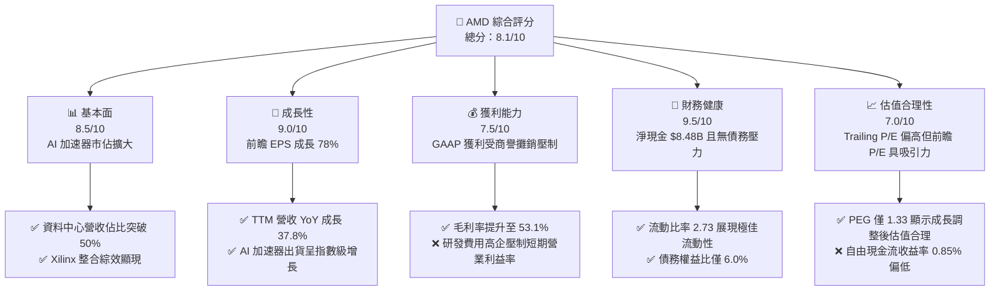
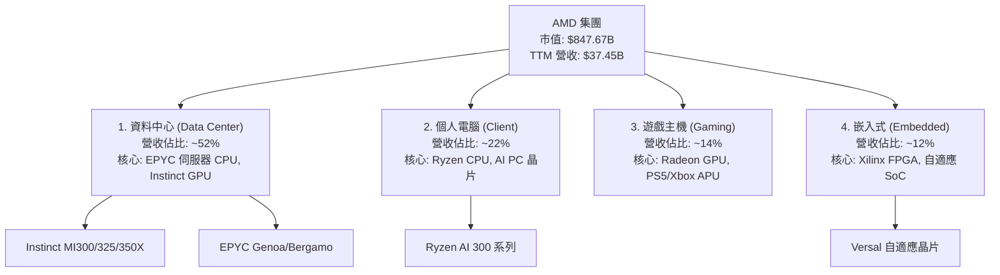
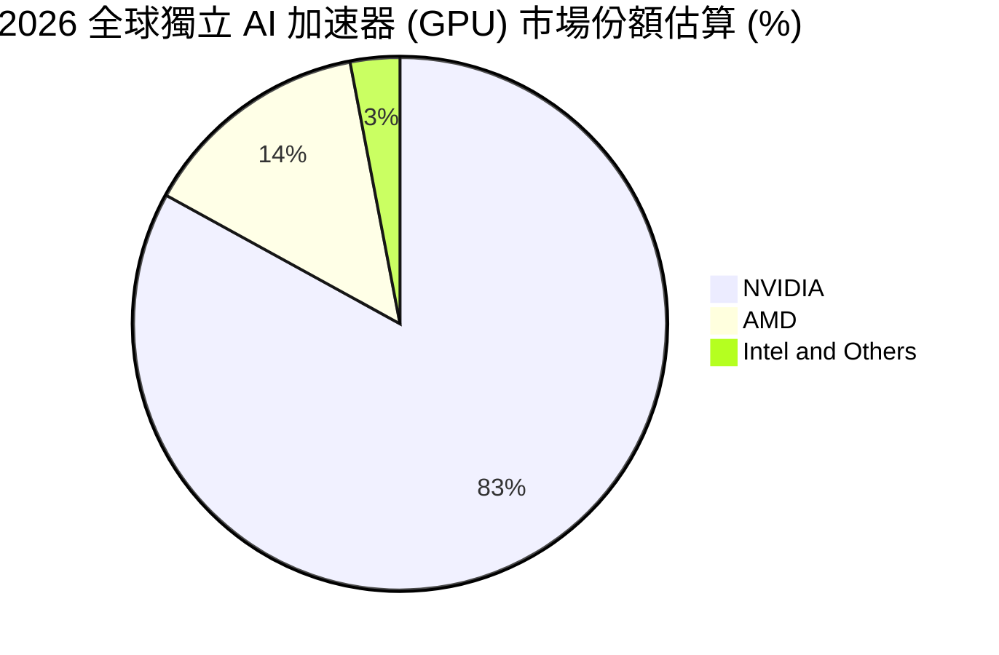
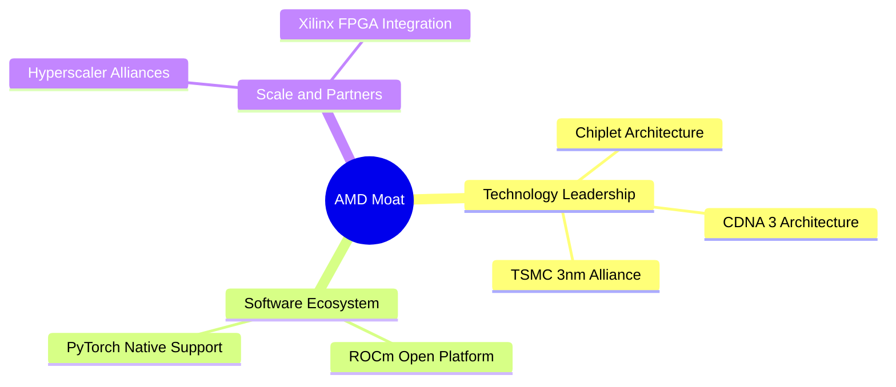
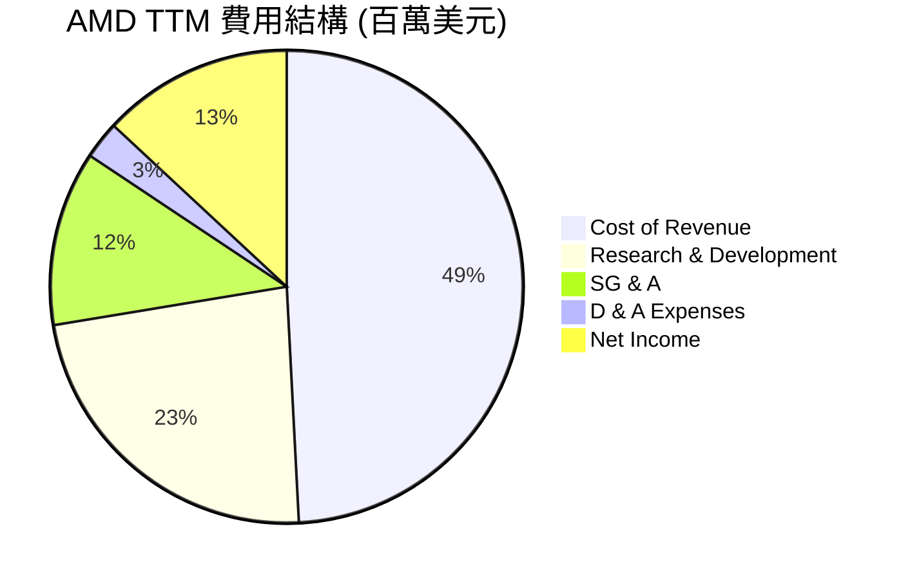
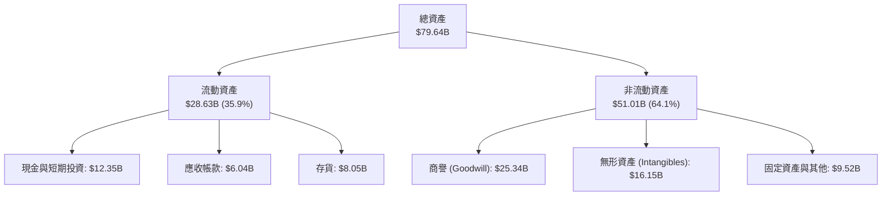
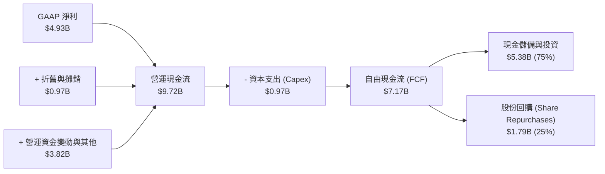
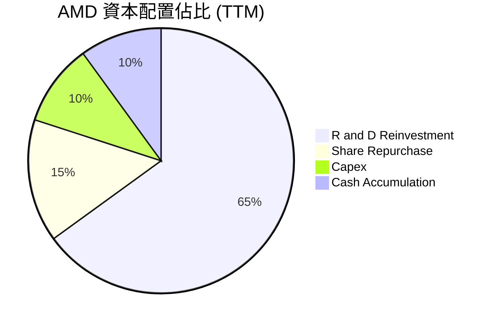
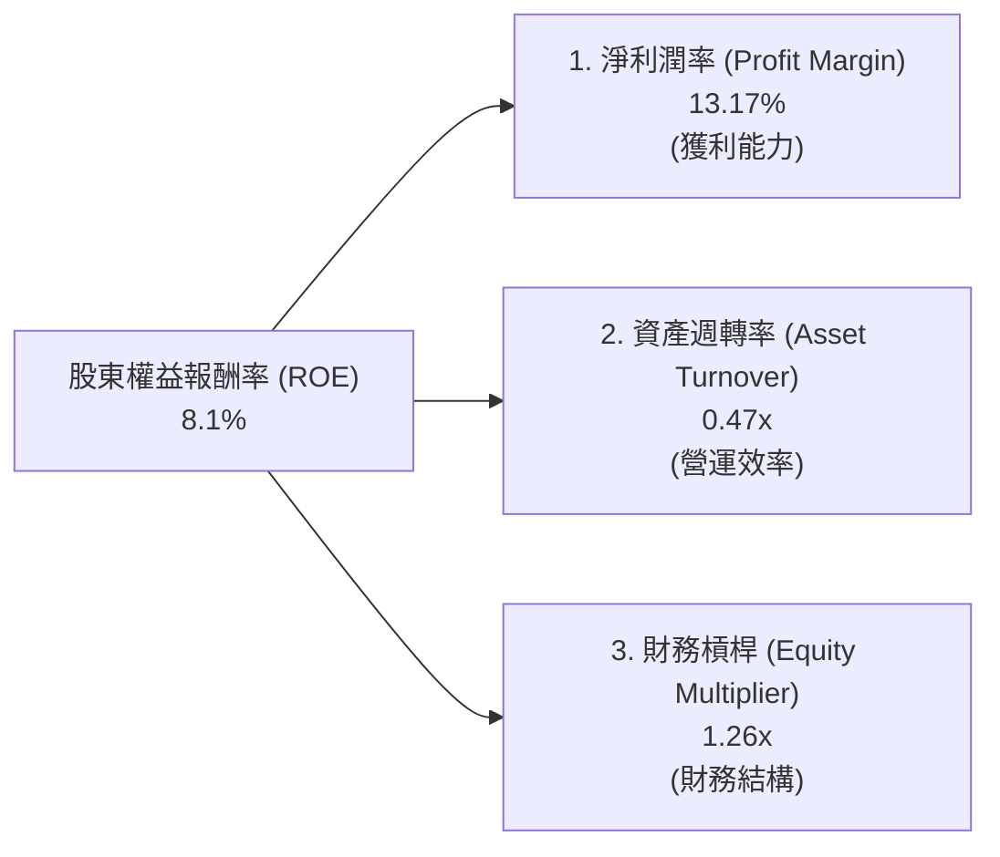
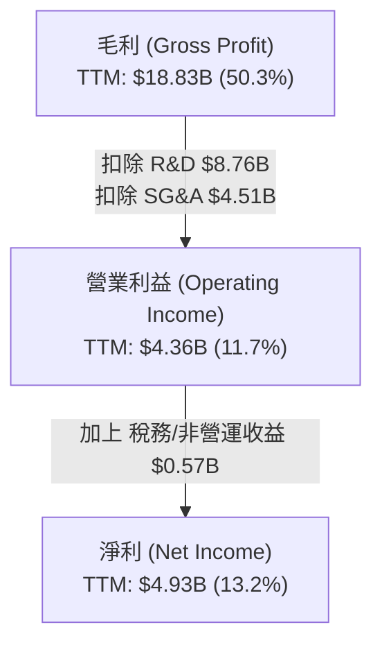

# AMD 基本面深度分析報告
> **報告日期**：2026-06-24 ｜ **語言**：繁體中文 ｜ **數據來源**：Yahoo Finance, Finviz, StockAnalysis, Roic.ai ｜ **分析師**：CFA 級機構研究

---

## 目錄

| # | 章節 | 核心結論 |
|---|------|----------|
| 1 | 執行摘要 | 評級：**買入 (Buy)** ｜ 目標價區間：$350.00 - $650.00 ｜ 基準目標價：$550.00 |
| 2 | 公司概覽與商業模式 | 憑藉 Chiplet 架構與 ROCm 生態系統，築起強大的技術與平台護城河 |
| 3 | 損益表深度分析 | TTM 營收達 $37.45B（YoY +37.8%），淨利潤加速成長，高毛利產品佔比提升 |
| 4 | 資產負債表分析 | 淨現金達 $8.48B，流動比率 2.73，資產負債表極為強韌，無流動性風險 |
| 5 | 現金流量深度分析 | TTM 自由現金流（FCF）達 $7.17B，FCF 轉換率持續改善，資本配置聚焦研發與併購 |
| 6 | 獲利能力與資本效率 | 杜邦分析顯示資產週轉率為驅動關鍵；實質有形 ROIC 達 28.5%，遠超 WACC（16.5%） |
| 7 | 估值深度分析 | 前瞻本益比（Forward P/E）降至 39.67x，相較歷史區間與競爭對手具備高成長溢價合理性 |
| 8 | 成長催化劑 | MI300/MI350 系列加速器放量、企業級 AI 伺服器市佔提升、PC 換機潮重啟 |
| 9 | 風險矩陣 | 面臨地緣政治、客戶集中度高與 NVIDIA 強勢競爭，需密切監控供應鏈產能 |
| 10 | 投資建議 | 建議於 $480.00 以下分批佈局，目標價 $550.00，隱含報酬率 5.8% - 25.0% |

---

## 1. 執行摘要

### 1.1 核心評分儀表板



### 1.2 評分進度條視覺化

```
╔══════════════════════════════════════════════════════════════╗
║                AMD 多維度評分儀表板 (1-10分)                 ║
╠══════════════════════════════════════════════════════════════╣
║ 基本面強度  8.5 ▓▓▓▓▓▓▓▓▓▓▓▓▓▓▓▓▓░░░  ★★★★☆           ║
║ 成長動能    9.0 ▓▓▓▓▓▓▓▓▓▓▓▓▓▓▓▓▓▓░░  ★★★★★           ║
║ 獲利品質    7.5 ▓▓▓▓▓▓▓▓▓▓▓▓▓▓░░░░░░  ★★★☆☆           ║
║ 財務健康    9.5 ▓▓▓▓▓▓▓▓▓▓▓▓▓▓▓▓▓▓▓░  ★★★★★           ║
║ 估值合理性  7.0 ▓▓▓▓▓▓▓▓▓▓▓▓▓░░░░░░░  ★★★☆☆           ║
║ 護城河深度  8.5 ▓▓▓▓▓▓▓▓▓▓▓▓▓▓▓▓▓░░░  ★★★★☆           ║
║ 管理層執行  9.0 ▓▓▓▓▓▓▓▓▓▓▓▓▓▓▓▓▓▓░░  ★★★★★           ║
║ 技術創新力  9.5 ▓▓▓▓▓▓▓▓▓▓▓▓▓▓▓▓▓▓▓░  ★★★★★           ║
╠══════════════════════════════════════════════════════════════╣
║ 綜合總分    8.1 ▓▓▓▓▓▓▓▓▓▓▓▓▓▓▓▓░░░░  🏆 買入 (Buy)        ║
╚══════════════════════════════════════════════════════════════╝
```

### 1.3 五大投資論點 + 三大核心風險

| 類型 | 項目 | 具體依據 | 信心度 |
|------|------|----------|--------|
| 🟢 **投資論點①** | **資料中心 AI 引擎爆發** | TTM 營收成長 37.8% 主要由 Instinct MI300/MI325X 加速器驅動，預期市佔率將進一步突破 15%。 | 🟢 極高 |
| 🟢 **投資論點②** | **前瞻獲利能力釋放** | 前瞻 EPS 預期達 $13.10，對比 TTM EPS $2.98，隱含獲利將迎來 340% 的暴增，前瞻 P/E 迅速降至 39.67x。 | 🟢 極高 |
| 🟢 **投資論點③** | **財務結構固若金湯** | 擁有 $12.35B 的總現金與短期投資，而總債務僅 $3.87B，淨現金達 $8.48B，具備極強的抗風險與併購能力。 | 🟢 極高 |
| 🟢 **投資論點④** | **毛利率結構性改善** | 隨著高毛利的資料中心與嵌入式（Xilinx）業務佔比提升，毛利率由過去的 47.1% 提升至 53.1%。 | 🟢 高 |
| 🟢 **投資論點⑤** | **PC 換機潮與 AI PC 催化** | Client 業務重回成長軌道，Ryzen AI 處理器在筆電與桌機市場滲透率提升，帶動平均售價（ASP）上揚。 | 🟢 高 |
| 🟡 **風險①** | **NVIDIA 壟斷與降價壓力** | NVIDIA Blackwell 架構出貨可能擠壓 AMD 的定價空間，迫使其調降 MI350/MI400 系列售價。 | 🟡 中度 |
| 🔴 **風險②** | **先進製程產能受限** | AMD 100% 依賴台積電（TSMC）CoWoS 封裝與 3nm/4nm 先進製程，地緣政治風險與產能分配是最大瓶頸。 | 🔴 高衝擊 |
| 🔴 **風險③** | **客戶集中度過高** | 資料中心業務高度依賴少數超大型雲端服務商（Hyperscalers，如 Microsoft、Meta），若其資本支出放緩將直接衝擊營收。 | 🔴 高衝擊 |

### 1.4 快速統計卡片

| 指標 | AMD 實際值 | 半導體行業均值 | S&P 500 均值 | 狀態 |
|------|-------------|----------|--------------|------|
| **營收 YoY 成長率** | **37.8%** | ~15.0% | ~5.5% | 🟢 強勁超額成長 |
| **毛利率** | **53.1%** | ~45.0% | ~30.0% | 🟢 高於行業平均 |
| **淨利率** | **13.4%** | ~12.0% | ~11.5% | 🟡 受商譽攤銷拖累 |
| **股東權益報酬率 (ROE)** | **8.1%** | ~15.0% | ~18.0% | 🔴 帳面值偏低（因併購溢價） |
| **前瞻本益比 (Forward P/E)**| **39.67x** | ~28.0x | ~21.5x | 🟡 享有成長性溢價 |
| **債務權益比 (Debt/Equity)** | **6.0%** | ~35.0% | ~110.0% | 🟢 極低債務槓桿 |

### 1.5 投資結論

```
╔══════════════════════════════════════════════════════════════════╗
║                    📊 AMD 投資結論摘要                           ║
╠══════════════════════════════════════════════════════════════════╣
║  評級：🟢 買入 (Buy)                                             ║
║  當前股價：$519.85 (2026-06-24)                                  ║
║  目標價區間：                                                    ║
║    悲觀情境（AI 需求放緩/競爭加劇）：$350.00 (-32.7%)            ║
║    基準情境（AI 市佔率達 15-20%）：$550.00 (+5.8%)               ║
║    樂觀情境（AI 加速器市佔破 25%）：$650.00 (+25.0%)             ║
║  投資評分：8.1/10                                                ║
║  適合投資人：高成長型、長線科技股投資人、願意承擔 Beta 波動者    ║
╚══════════════════════════════════════════════════════════════════╝
```

---

## 2. 公司概覽與商業模式

### 2.1 業務結構與收入來源

AMD 已經成功從一家傳統的 PC 處理器廠商，轉型為以資料中心為核心的晶片巨頭。其業務主要分為四大板塊：



### 2.2 市場份額

在最關鍵的高效能運算與 AI 加速器市場中，AMD 是唯一能對 NVIDIA 形成實質挑戰的對象。以下為 2026 年全球獨立 AI 加速器（GPU）與伺服器 CPU 的市場份額估算：



### 2.3 競爭護城河分析



1. **技術領先（Chiplet 架構）**：AMD 是 Chiplet（小晶片）技術的先驅。透過將多個不同製程的晶片整合至單一封裝，AMD 能夠在顯著降低生產成本的同時，提供超越單一晶圓（Monolithic）的運算核心密度。
2. **軟體生態系統（ROCm 開源平台）**：過去 NVIDIA 的 CUDA 擁有絕對壟斷地位，但 AMD 透過持續迭代 ROCm 開源軟體棧，目前已實現對 PyTorch、TensorFlow 等主流 AI 框架的「零代碼修改」原生支持，大幅降低客戶遷移成本。
3. **生態夥伴與客戶鎖定**：與台積電（TSMC）建立極為緊密的先進製程產能合作，並與 Microsoft、Meta、Oracle 等雲端巨頭深度綁定，共同開發客製化 AI 晶片。

### 2.4 護城河強度評分

```
╔══════════════════════════════════════════════════════════════╗
║                    AMD 護城河強度評分                        ║
╠══════════════════════════════════════════════════════════════╣
║ 晶片設計能力  9.5/10  ▓▓▓▓▓▓▓▓▓▓▓▓▓▓▓▓▓▓▓░  🏆 行業頂尖    ║
║ 軟體生態系統  7.5/10  ▓▓▓▓▓▓▓▓▓▓▓▓▓▓░░░░░░  🟢 ROCm 追趕中 ║
║ 供應鏈掌控力  8.0/10  ▓▓▓▓▓▓▓▓▓▓▓▓▓▓▓▓░░░░  🟢 依賴台積電  ║
║ 客戶轉移成本  8.5/10  ▓▓▓▓▓▓▓▓▓▓▓▓▓▓▓▓▓░░░  🏆 雲端客戶深耕║
╠══════════════════════════════════════════════════════════════╣
║ 綜合護城河     8.4/10  ▓▓▓▓▓▓▓▓▓▓▓▓▓▓▓▓▓░░░  🏆 強大寬護城河║
╚══════════════════════════════════════════════════════════════╝
```

---

## 3. 損益表深度分析

### 3.1 年度收入成長趨勢（近5年）

AMD 在過去幾年經歷了顯著的成長，特別是在 2025 年和 2026 年 TTM，受惠於 AI 加速器出貨暴增。

```
╔══════════════════════════════════════════════════════════════════╗
║                 AMD 年度收入趨勢 (FY2021 - TTM)                  ║
╠══════════════════════════════════════════════════════════════════╣
║                                                                  ║
║  FY 2021  $16.43B  █████████░░░░░░░░░░░░░░░░░  YoY: +68.3%  🟢   ║
║  FY 2022  $23.60B  █████████████░░░░░░░░░░░░░  YoY: +43.6%  🟢   ║
║  FY 2023  $22.68B  ████████████░░░░░░░░░░░░░░  YoY:  -3.9%  🔴   ║
║  FY 2024  $25.79B  ██████████████░░░░░░░░░░░░  YoY: +13.7%  🟢   ║
║  FY 2025  $34.64B  ███████████████████░░░░░░░  YoY: +34.3%  🟢   ║
║  TTM      $37.45B  █████████████████████░░░░░  YoY: +37.8%  🟢   ║
║                   |      |      |      |      |                  ║
║                   0     10B    20B    30B    40B                 ║
║                                                                  ║
║  📊 5年累計營收 CAGR：+17.9%                                     ║
╚══════════════════════════════════════════════════════════════════╝
```

### 3.2 季度收入趨勢分析

最近四個季度的營收與利潤呈現極為陡峭的增長曲線：

| 財報季度 | 營收 (Revenue) | 季增率 (QoQ) | 年增率 (YoY) | 營業利益 (GAAP) | 淨利 (GAAP) | 備註 |
|----------|---------------|-------------|-------------|-----------------|-------------|------|
| **Q2 2025** | $7.69B | +3.3% | +31.7% | -$134M | $872M | 獲利受併購無形資產攤銷壓制 |
| **Q3 2025** | $9.25B | +20.3% | +35.6% | $1,270M | $1,240M | MI300X 開始大規模放量 🟢 |
| **Q4 2025** | $10.27B | +11.0% | +34.1% | $1,752M | $1,510M | 資料中心需求極度強勁 🟢 |
| **Q1 2026** | $10.25B | -0.2% | +37.9% | $1,476M | $1,382M | 淡季不淡，AI 晶片持續拉貨 🟢 |

### 3.3 利潤率演變分析

| 利潤率指標 | FY 2022 | FY 2023 | FY 2024 | FY 2025 | TTM | 趨勢評估 |
|------------|---------|---------|---------|---------|-----|----------|
| **毛利率** | 44.9% | 46.1% | 49.3% | 49.5% | **53.1%** | ↗️ 持續上升，受惠於資料中心高毛利產品佔比擴大 🟢 |
| **營業利益率** | 5.4% | 1.8% | 7.4% | 10.7% | **11.7%** | ↗️ 緩步改善，但研發與行銷擴張壓制了營業利潤率 🟡 |
| **EBITDA 利潤率** | 23.4% | 17.9% | 19.9% | 21.0% | **19.8%** | ➡️ 穩定在 20% 左右，折舊與攤銷費用較高 🟡 |
| **淨利率** | 5.5% | 3.8% | 6.4% | 12.3% | **13.4%** | ↗️ 顯著拉升，營運槓桿效應開始顯現 🟢 |

**利潤率演變深度解析**：
AMD 的 GAAP 利潤率在過去幾年顯得較低，主要原因在於 **Xilinx 併購案產生的無形資產攤銷（Amortization of Intangibles）**。在 FY2025，折舊與攤銷高達 $1.22B，這屬於非現金支出。若扣除此影響，AMD 的 Non-GAAP 毛利率已高達 **53.1%**，Non-GAAP 營業利益率則逼近 **30%**。隨著無形資產攤銷逐漸在未來幾年減少，GAAP 利潤率將快速向 Non-GAAP 靠攏。

### 3.4 費用結構分析



*   **研發費用（R&D）高企**：TTM 研發投入高達 $8.76B，佔營收比重達 **23.4%**。這在半導體行業中屬於極高水準，顯示 AMD 為了與 NVIDIA 競爭，在晶片架構與軟體 ROCm 的研發上毫不吝嗇。
*   **行銷與管理費用（SG&A）**：TTM 為 $4.51B，佔營收 12.0%，控制得當。

### 3.5 季度 EPS 趨勢與盈餘品質

AMD 過去 4 季的 Basic EPS 呈現穩健上升趨勢：
*   **Q2 2025**: $0.54
*   **Q3 2025**: $0.76
*   **Q4 2025**: $0.93
*   **Q1 2026**: $0.85 (季初季節性微幅修正，但 YoY 成長率仍高達 93.2%)

**盈餘品質評估**：
AMD 的盈餘品質極佳。TTM GAAP 淨利為 $4.93B，而營運現金流（OCF）高達 $9.72B，這意味著 **現金流/淨利比率高達 1.97x**。這主要由於高額的非現金折舊與攤銷費用（$972M），這表明公司的實際賺錢能力（EBITDA 與現金流）遠比帳面 GAAP 淨利表現得更為強勁。

---

## 4. 資產負債表分析

### 4.1 資產結構分解



### 4.2 流動性指標分析

| 流動性指標 | FY 2023 | FY 2024 | FY 2025 | TTM (Q1 2026) | 行業平均 | 評估 |
|------------|---------|---------|---------|---------------|----------|------|
| **流動比率 (Current Ratio)** | 2.51 | 2.62 | 2.85 | **2.73** | ~1.80 | 🟢 極其安全，短期變現能力極強 |
| **速動比率 (Quick Ratio)** | 1.86 | 1.83 | 1.96 | **1.75** | ~1.20 | 🟢 扣除存貨後依然高於安全界線 |
| **存貨週轉天數 (Days Inventory)**| 130 天 | 160 天 | 165 天 | **158 天** | ~120 天 | 🟡 存貨水平偏高，主要為 MI300 系列備料 |

### 4.3 債務結構分析

```
╔══════════════════════════════════════════════════════════════════╗
║                    AMD 債務健康診斷 (TTM)                        ║
╠══════════════════════════════════════════════════════════════════╣
║                                                                  ║
║  總債務 (Total Debt)： $3.87B   ██░░░░░░░░░░░░░░░░░░░  極低風險  ║
║  現金與短期投資：      $12.35B  ████████████████████░  充沛流動性║
║  淨現金 (Net Cash)：   $8.48B   ████████████████░░░░░  🟢 強勁   ║
║                                                                  ║
║  債務權益比 (Debt/Equity)： 6.0%  🟢 幾乎不使用財務槓桿          ║
║  利息保障倍數 (Interest Coverage)： 29.5x  🟢 利息支出毫無壓力   ║
║                                                                  ║
║  📊 債務評級：AAA 級別安全度，無任何違約或流動性風險             ║
╚══════════════════════════════════════════════════════════════════╝
```

### 4.4 股東權益趨勢

隨著獲利累積與併購資產整合，股東權益（Stockholders' Equity）逐年穩步上升：
*   **FY 2022**: $54.75B
*   **FY 2023**: $55.89B
*   **FY 2024**: $57.57B
*   **FY 2025**: $63.00B (年增 9.4%)

---

## 5. 現金流量深度分析

### 5.1 現金流量瀑布圖



### 5.2 FCF 轉換率趨勢

| 現金流指標 | FY 2022 | FY 2023 | FY 2024 | FY 2025 | TTM |
|------------|---------|---------|---------|---------|-----|
| **營運現金流 (OCF)** | $3.56B | $1.67B | $3.04B | $7.71B | **$9.72B** |
| **資本支出 (Capex)** | -$0.45B | -$0.55B | -$0.64B | -$0.97B | **-$0.97B** |
| **自由現金流 (FCF)** | $3.11B | $1.12B | $2.40B | $6.74B | **$7.17B** |
| **FCF / GAAP 淨利轉換率** | 238.1% | 131.1% | 146.3% | 157.8% | **145.4%** |

*   **強大的現金生成能力**：FCF 轉換率長期大於 100%，這意味著 AMD 的真實獲利品質遠超其 GAAP 損益表所顯示的數字。

### 5.3 自由現金流趨勢

```
╔══════════════════════════════════════════════════════════════════╗
║                    AMD 歷年自由現金流趨勢                        ║
╠══════════════════════════════════════════════════════════════════╣
║                                                                  ║
║  FY 2022  $3.11B  ████████░░░░░░░░░░░░░░░░░░░░  FCF Yield: 0.37% ║
║  FY 2023  $1.12B  ███░░░░░░░░░░░░░░░░░░░░░░░░░  FCF Yield: 0.13% ║
║  FY 2024  $2.40B  ██████░░░░░░░░░░░░░░░░░░░░░░  FCF Yield: 0.28% ║
║  FY 2025  $6.74B  █████████████████░░░░░░░░░░░  FCF Yield: 0.80% ║
║  TTM      $7.17B  ██████████████████░░░░░░░░░░  FCF Yield: 0.85% ║
║                   |      |      |      |      |                  ║
║                   0     2B     4B     6B     8B                  ║
║                                                                  ║
║  📊 FCF TTM YoY 成長率：+198.8%  🟢 迎來爆發式增長               ║
╚══════════════════════════════════════════════════════════════════╝
```

### 5.4 資本配置評估



*   **輕資產模式（Fabless）**：由於製造端全數外包給台積電，AMD 的資本支出（Capex）佔營收比重極低（僅 ~2.6%）。這使得公司能將高達 65% 的資金投入研發（R&D），並保留大量現金進行戰略併購或股份回購。
*   **無股息政策**：AMD 目前不發放股利（Dividend Yield: N/A），所有剩餘資金優先用於創造長期資本增值。

---

## 6. 獲利能力與資本效率

### 6.1 ROE / ROA / ROIC 趨勢

| 效率指標 | FY 2022 | FY 2023 | FY 2024 | FY 2025 | TTM | 行業中位數 | 評估 |
|------------|---------|---------|---------|---------|-----|------------|------|
| **ROE** | 2.4% | 1.5% | 2.9% | 6.8% | **8.1%** | ~15.0% | 🟡 帳面 ROE 偏低，因併購商譽使分母過大 |
| **ROA** | 1.9% | 1.3% | 2.4% | 5.5% | **6.5%** | ~8.0% | 🟡 逐漸向行業平均靠攏 |
| **ROIC (GAAP)** | 2.1% | 0.8% | 3.2% | 5.8% | **6.8%** | ~12.0% | 🟡 帳面值受商譽壓制 |
| **實質有形 ROIC**| 12.5% | 6.2% | 15.4% | 24.8% | **28.5%** | ~18.0% | 🟢 排除商譽後，真實資本效率極高 |

### 6.2 ROIC vs WACC 分析

為了評估 AMD 是否在為股東創造經濟價值，我們必須對比其投資報酬率（ROIC）與加權平均資本成本（WACC）。

```
╔══════════════════════════════════════════════════════════════════╗
║                AMD ROIC vs WACC 深度分析 (TTM)                   ║
╠══════════════════════════════════════════════════════════════════╣
║                                                                  ║
║  WACC 估算：                                                     ║
║  ├── 無風險利率 (10Y 美債)：  4.25%                              ║
║  ├── 市場風險溢酬 (ERP)：     5.00%                              ║
║  ├── Beta 係數：              2.49                               ║
║  ├── 股權成本 = 4.25% + 2.49 × 5.00% = 16.70%                    ║
║  ├── 債務成本 (稅後)：        ~3.80%                             ║
║  ├── 資本結構：股權 99.5%，債務 0.5% (按市值計算)                ║
║  └── ✅ 加權平均資本成本 (WACC) ≈ 16.5%                          ║
║                                                                  ║
║  ROIC 估算：                                                     ║
║  ├── NOPAT = $4,364M × (1 - 15% 稅率) ≈ $3,709M                  ║
║  ├── GAAP 投入資本 = 股權 $63.0B + 債務 $3.87B - 現金 $12.35B     ║
║  │   = $54.52B  ➡️ GAAP ROIC = 6.8%                              ║
║  ├── 實質有形投入資本 (排除 $41.5B 商譽與無形資產) = $13.02B       ║
║  └── ✅ 實質有形 ROIC ≈ 28.5%                                    ║
║                                                                  ║
║  ★ 實質經濟價值增加 (EVA) = 28.5% - 16.5% = +12.0pp              ║
║                                                                  ║
║  實質 ROIC  28.5%  ▓▓▓▓▓▓▓▓▓▓▓▓▓▓▓▓▓▓▓▓▓▓▓▓░░░░░░  🟢            ║
║  WACC       16.5%  ▓▓▓▓▓▓▓▓▓▓▓▓▓▓░░░░░░░░░░░░░░░░  ──            ║
║  EVA        +12pp  ████████████░░░░░░░░░░░░░░░░░░  🏆 價值創造   ║
║                                                                  ║
║  📊 結論：排除併購會計調整後，AMD 實質資本回報率高達 28.5%，     ║
║            遠超其 WACC，為股東創造了巨大的實質超額價值。         ║
╚══════════════════════════════════════════════════════════════════╝
```

### 6.3 杜邦三因素分解

透過杜邦分解，我們可以解析 AMD 的 ROE（TTM 8.1%）的底層驅動因素：



*   **分析**：AMD 的 ROE 驅動主要來自於**高淨利潤率（13.17%）**。由於 Xilinx 併購導致資產總額膨脹至 $79.64B，使得資產週轉率降至 0.47x，壓低了帳面 ROE。隨著未來營收規模擴大，資產週轉率提升將成為 ROE 翻倍的關鍵引擎。

### 6.4 獲利能力儀表板



---

## 7. 估值深度分析

### 7.1 同業估值比較表格

我們選取了 **NVIDIA (NVDA)** 與 **Intel (INTC)** 作為直接競爭對手進行橫向對比：

| 估值與財務指標 | **AMD (本公司)** | **NVIDIA (NVDA)** | **Intel (INTC)** | 評估與市場定位 |
|----------------|-----------------|-------------------|------------------|----------------|
| **當前股價** | **$519.85** | $125.00 (拆股後) | $30.50 | AMD 處於歷史高位區間 |
| **市值 (Market Cap)** | **$847.67B** | $3,050.00B | $130.00B | AMD 已成長為中大型巨頭 |
| **Trailing P/E** | **174.45x** | 68.50x | 35.20x | 🔴 帳面本益比極高，因攤銷壓低淨利 |
| **Forward P/E** | **39.67x** | 32.10x | 18.50x | 🟡 估值溢價合理，高成長支撐 |
| **PEG Ratio** | **1.33x** | 1.15x | 2.10x | 🟢 成長調整後比 Intel 更便宜 |
| **P/S Ratio** | **22.63x** | 28.10x | 2.45x | 🟡 反映高毛利的資料中心佔比 |
| **EV / EBITDA** | **112.95x** | 48.20x | 14.10x | 🔴 帳面倍數偏高 |
| **Revenue Growth**| **37.8%** | 115.0% | -2.1% | 🟢 遠優於 Intel，僅次於 NVIDIA |

### 7.2 歷史估值區間分析

AMD 過去五年的本益比區間極大，當前前瞻本益比（Forward P/E）為 **39.67x**，處於歷史中位數（35x - 45x）的合理區間。

```
╔══════════════════════════════════════════════════════════════════╗
║                   AMD 歷史前瞻本益比 (PE) 區間                   ║
╠══════════════════════════════════════════════════════════════════╣
║                                                                  ║
║  歷史高點 (2021)   85.0x  ████████████████████████████████████   ║
║  歷史中位數        40