# AMD 基本面深度分析報告
> **報告日期**：2026-06-26 ｜ **語言**：繁體中文 ｜ **數據來源**：Yahoo Finance, Finviz, StockAnalysis, Roic.ai ｜ **分析師**：CFA 級機構研究

---

## 目錄

| # | 章節 | 核心結論 |
|---|------|----------|
| 1 | 執行摘要 | 評級：🟢 強烈買入，目標價區間 $620 - $780 |
| 2 | 公司概覽與商業模式 | 護城河評估：技術領先、生態系統、規模效應，綜合評分 8.5/10 |
| 3 | 損益表深度分析 | 營收與獲利強勁成長，利潤率顯著改善，評分 9.0/10 |
| 4 | 資產負債表分析 | 財務結構穩健，現金充裕，債務風險低，評分 8.5/10 |
| 5 | 現金流量深度分析 | 自由現金流強勁增長，資本配置高效，評分 8.8/10 |
| 6 | 獲利能力與資本效率 | ROIC 遠超 WACC，強力創造股東價值，評分 9.2/10 |
| 7 | 估值深度分析 | 相較同業估值合理，成長潛力支撐溢價，評分 7.5/10 |
| 8 | 成長催化劑 | AI 晶片需求爆發、新產品發布、TAM 擴張，評分 9.5/10 |
| 9 | 風險矩陣 | 競爭加劇、宏觀經濟、供應鏈風險，評分 6.0/10 |
| 10 | 投資建議 | 建議「強烈買入」，目標價 $680（基準情境） |

---

## 1. 執行摘要

Advanced Micro Devices, Inc. (AMD) 在半導體產業中展現了驚人的成長動能和獲利能力改善。受惠於資料中心、AI 加速器及遊戲市場的強勁需求，AMD 的營收與獲利持續飆升。儘管當前估值反映了部分成長預期，但其在 AI 領域的技術領先地位和不斷擴大的市場機會，為長期投資提供了堅實基礎。

### 1.1 核心評分儀表板

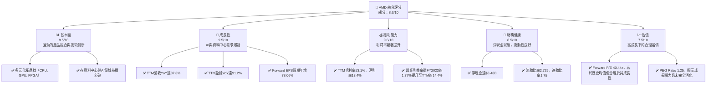

### 1.2 評分進度條視覺化

```
╔══════════════════════════════════════════════════════════════╗
║              AMD 多維度評分儀表板 (1-10分)                   ║
╠══════════════════════════════════════════════════════════════╣
║ 基本面強度  8.5 ▓▓▓▓▓▓▓▓▓▓▓▓▓▓▓▓▓░░░  ★★★★☆           ║
║ 成長動能    9.5 ▓▓▓▓▓▓▓▓▓▓▓▓▓▓▓▓▓▓▓░  ★★★★★           ║
║ 獲利品質    9.0 ▓▓▓▓▓▓▓▓▓▓▓▓▓▓▓▓▓▓░░  ★★★★★           ║
║ 財務健康    8.5 ▓▓▓▓▓▓▓▓▓▓▓▓▓▓▓▓▓░░░  ★★★★☆           ║
║ 估值合理性  7.5 ▓▓▓▓▓▓▓▓▓▓▓▓▓▓▓░░░░░  ★★★★☆           ║
║ 護城河深度  8.5 ▓▓▓▓▓▓▓▓▓▓▓▓▓▓▓▓▓░░░  ★★★★☆           ║
║ 管理層執行  9.0 ▓▓▓▓▓▓▓▓▓▓▓▓▓▓▓▓▓▓░░  ★★★★★           ║
║ 技術創新力  9.5 ▓▓▓▓▓▓▓▓▓▓▓▓▓▓▓▓▓▓▓░  ★★★★★           ║
╠══════════════════════════════════════════════════════════════╣
║ 綜合總分    8.6 ▓▓▓▓▓▓▓▓▓▓▓▓▓▓▓▓▓░░░  🏆 強勁成長，未來可期   ║
╚══════════════════════════════════════════════════════════════╝
```

### 1.3 五大投資論點 + 三大核心風險

| 類型 | 項目 | 具體依據 | 信心度 |
|------|------|----------|--------|
| 🟢 **投資論點①** | **AI 晶片市場的強勁增長驅動力** | AMD 的 AI 加速器 (MI300系列) 在資料中心市場表現強勁，預期未來幾年將成為主要營收貢獻。公司TTM營收YoY成長37.8%，主要受此驅動。 | 🟢 極高 |
| 🟢 **產品組合優化與市場份額擴大** | AMD 在 CPU (Ryzen/EPYC) 和 GPU (Radeon) 市場持續從競爭對手手中奪取份額，尤其在伺服器 CPU 和高性能運算領域，其技術優勢日益凸顯。FY2025營收達到$34.64B，較FY2024的$25.79B增長34.34%。 | 🟢 極高 |
| 🟢 **獲利能力顯著改善** | 隨著高毛利資料中心產品佔比提升，公司毛利率從FY2024的49.34%（$12.72B/$25.79B）提升至FY2025的49.51%（$17.15B/$34.64B），TTM毛利率更達53.1%。營業利益率也從FY2024的8.10%提升至TTM的14.4%。 | 🟢 高 |
| 🟢 **穩健的財務狀況與充裕的現金流** | 截至2026年3月，公司擁有$12.35B的總現金，淨現金達$8.48B。TTM自由現金流高達$7.17B，顯示其強大的營運造血能力。 | 🟢 高 |
| 🟢 **持續的研發投入與技術創新** | 公司TTM研發費用高達$8.76B，佔營收約23.4%，確保其在半導體技術前沿的競爭力，為未來產品迭代和新市場拓展奠定基礎。 | 🟢 極高 |
| 🟡 **風險①** | **AI 晶片市場競爭加劇與定價壓力** | NVIDIA 在 AI 晶片市場的主導地位難以撼動，Intel 等競爭者也積極追趕。未來可能面臨激烈的價格競爭，影響 AMD 的毛利率和市場份額增長速度。 | 🟡 中度 |
| 🟡 **宏觀經濟下行與半導體週期波動** | 半導體產業對宏觀經濟敏感。若全球經濟放緩，企業資本支出減少，PC 和遊戲機市場需求疲軟，可能影響 AMD 的客戶端和遊戲業務營收。 | 🟡 中度 |
| 🔴 **風險②** | **供應鏈中斷與地緣政治風險** | 半導體製造高度依賴全球供應鏈，任何地緣政治緊張、貿易壁壘或自然災害都可能導致晶片生產中斷，影響產品交付和營收。 | 🔴 高衝擊 |

### 1.4 快速統計卡片

| 指標 | 公司實際值 | 行業均值（半導體） | S&P 500 均值 | 狀態 |
|------|-------------|--------------------|--------------|------|
| 收入 YoY 成長 | **37.8%** | ~15-20% | ~5-10% | 🟢 |
| 毛利率 | **53.1%** | ~45-50% | ~30-35% | 🟢 |
| 淨利率 | **13.4%** | ~10-15% | ~10-12% | 🟢 |
| ROE | **8.1%** | ~15-20% | ~15% | 🟡 |
| Forward P/E | **40.44x** | ~30-40x | ~20-25x | 🟡 |
| P/S Ratio | **23.19x** | ~5-10x | ~2-3x | 🔴 |
| Debt/Equity | **0.06x** | ~0.3-0.5x | ~0.8-1.2x | 🟢 |
| Current Ratio | **2.73x** | ~2.0-2.5x | ~1.5-2.0x | 🟢 |

*註：行業均值和 S&P 500 均值為分析師根據經驗的估計值，僅供參考。*

### 1.5 投資結論

```
╔══════════════════════════════════════════════════════════════════╗
║                    📊 投資結論摘要                               ║
╠══════════════════════════════════════════════════════════════════╣
║  評級：🟢 強烈買入                                               ║
║  當前股價：$532.57                                               ║
║  目標價區間：                                                    ║
║    悲觀情境：$620（+16.4%）                                      ║
║    基準情境：$680（+27.7%）  ← 12個月主要目標                      ║
║    樂觀情境：$780（+46.4%）                                      ║
║  投資評分：8.6/10                                                ║
║  適合投資人：成長型、長線持有者，對半導體和AI產業前景有信心的投資人。 ║
╚══════════════════════════════════════════════════════════════════╝
```

---

## 2. 公司概覽與商業模式

Advanced Micro Devices, Inc. (AMD) 是一家全球領先的半導體公司，主要設計和開發用於個人電腦、伺服器、遊戲機以及嵌入式系統的高性能處理器和圖形處理器。公司通過持續的創新和戰略性收購（如 Xilinx），擴大了其在資料中心、AI 和自適應計算領域的影響力。

### 2.1 業務結構與收入來源

AMD 的業務主要分為三個核心板塊：資料中心 (Data Center)、客戶端與遊戲 (Client and Gaming) 以及嵌入式 (Embedded)。資料中心業務在 AI 晶片需求的推動下，正成為公司最重要的成長引擎。

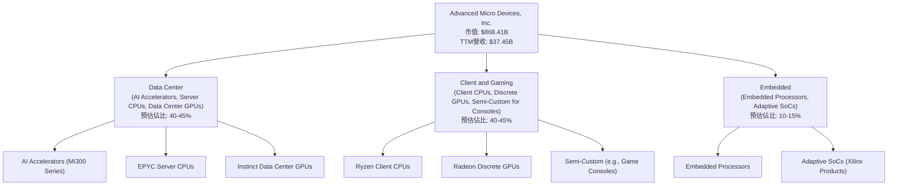

*   **資料中心 (Data Center)**：受益於雲計算、企業伺服器和人工智慧加速器（如 MI300 系列）的強勁需求，該業務板塊是 AMD 營收增長最快的領域。
*   **客戶端與遊戲 (Client and Gaming)**：涵蓋了 Ryzen 處理器在個人電腦市場的應用，以及 Radeon 顯卡和為遊戲主機（如 PlayStation 和 Xbox）提供的半客製化 SoC 產品。
*   **嵌入式 (Embedded)**：通過 Xilinx 的收購，AMD 擴展到工業、汽車、航空航天和通信等高成長嵌入式市場，提供自適應 SoC 解決方案。

### 2.2 市場份額

AMD 在其主要市場領域與 Intel 和 NVIDIA 等巨頭競爭。儘管在某些細分市場仍處於追趕地位，但其市場份額正在穩步提升，尤其是在伺服器 CPU 和資料中心 GPU 領域。

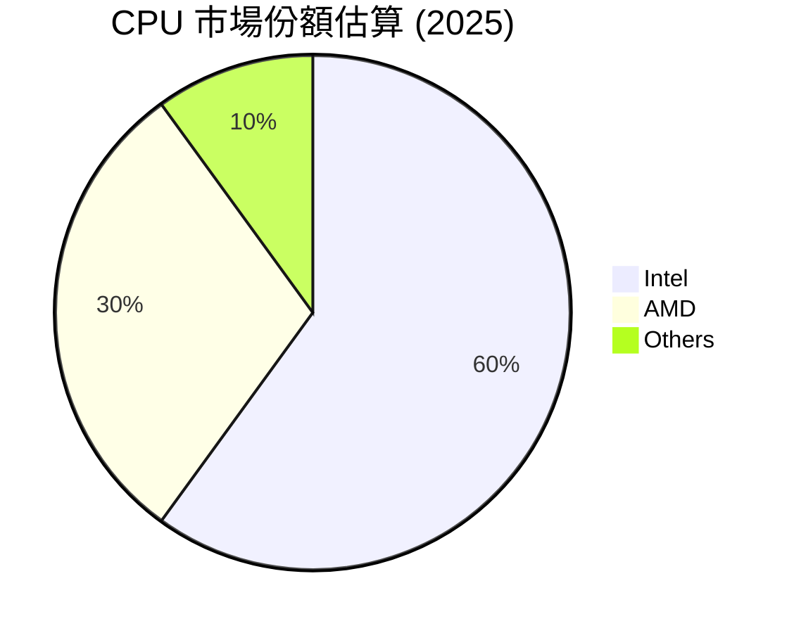

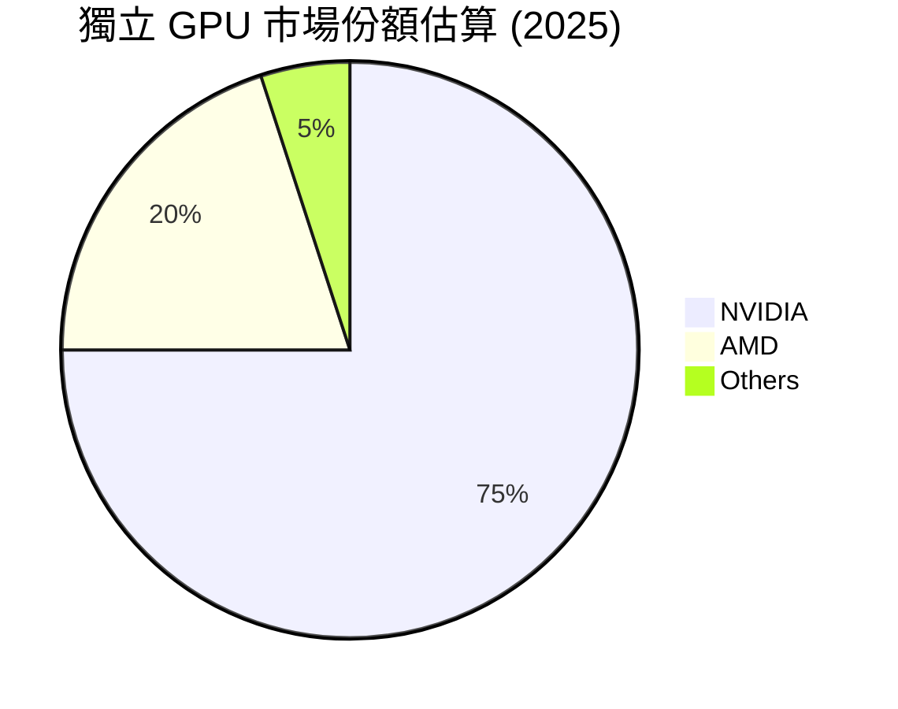

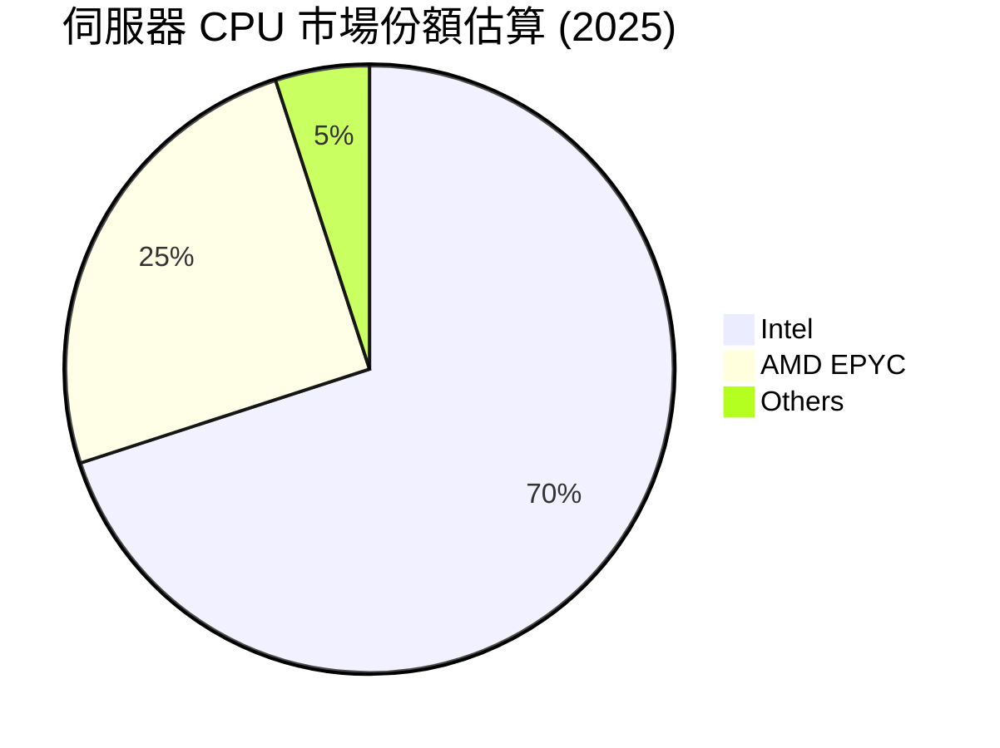

*備註：上述市場份額為分析師根據行業報告和市場趨勢的估算值。*

### 2.3 競爭護城河分析

AMD 的競爭護城河主要建立在其技術創新、產品性能和不斷完善的生態系統上。

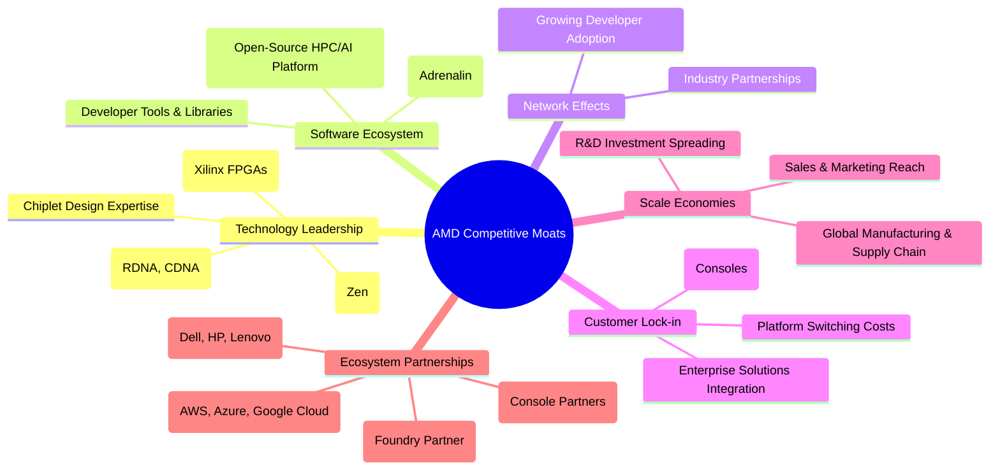

### 2.4 護城河強度評分

```
╔══════════════════════════════════════════════════════════════╗
║                  AMD 護城河強度評分                         ║
╠══════════════════════════════════════════════════════════════╣
║ 技術領先    9.0/10 ▓▓▓▓▓▓▓▓▓▓▓▓▓▓▓▓▓▓░░  🏆 創新驅動，AI領先    ║
║ 軟體生態系統  7.5/10 ▓▓▓▓▓▓▓▓▓▓▓▓▓▓▓░░░░░  🟡 持續投入，仍有追趕空間 ║
║ 網路效應    7.0/10 ▓▓▓▓▓▓▓▓▓▓▓▓▓▓░░░░░░  🟡 逐漸顯現，但不如主要競爭對手 ║
║ 客戶鎖定    8.0/10 ▓▓▓▓▓▓▓▓▓▓▓▓▓▓▓▓░░░░  🟢 企業級客戶黏性高   ║
║ 規模效應    8.5/10 ▓▓▓▓▓▓▓▓▓▓▓▓▓▓▓▓▓░░░  🟢 全球佈局，規模效益明顯 ║
║ 生態夥伴    9.0/10 ▓▓▓▓▓▓▓▓▓▓▓▓▓▓▓▓▓▓░░  🏆 戰略合作，拓展市場  ║
╠══════════════════════════════════════════════════════════════╣
║ 綜合護城河  8.5    ▓▓▓▓▓▓▓▓▓▓▓▓▓▓▓▓▓░░░  🏆 技術創新與夥伴關係構築深厚壁壘 ║
╚══════════════════════════════════════════════════════════════╝
```

---

## 3. 損益表深度分析

AMD 的損益表數據顯示了近年來強勁的營收成長和顯著的獲利能力改善，尤其是在資料中心和 AI 領域的表現尤為突出。

### 3.1 年度收入成長趨勢（近4年）

AMD 的年度營收呈現顯著增長，尤其在 FY2025 和 TTM 數據中，成長動能加速。

```
╔══════════════════════════════════════════════════════════════════╗
║              AMD 年度收入趨勢（FY2022-FY2026 TTM）               ║
╠══════════════════════════════════════════════════════════════════╣
║                                                                  ║
║  FY2022  $23.60B  ███████████████████████████████████░  YoY: +43.61% 🟢    ║
║  FY2023  $22.68B  ████████████████████████████████░░░░  YoY: -3.90%  🔴    ║
║  FY2024  $25.79B  █████████████████████████████████████░  YoY: +13.69% 🟢    ║
║  FY2025  $34.64B  ███████████████████████████████████████████████  YoY: +34.34% 🟢    ║
║  TTM     $37.45B  █████████████████████████████████████████████████  YoY: +34.97% 🟢    ║
║                                                                  ║
║                   |      |      |      |      |      |           ║
║                   0     10B    20B    30B    40B                 ║
║                                                                  ║
║  📊 4年累計 CAGR (FY22-FY25)：+13.91%                              ║
║  📊 2年累計 CAGR (FY24-FY25)：+23.63%                              ║
╚══════════════════════════════════════════════════════════════════╝
```
*註：TTM 營收為截至 2026 年 3 月 31 日的數據，YoY 成長率與 FY2025 相比。*

AMD 在 FY2023 經歷了短暫的營收下滑，這主要歸因於 PC 市場的疲軟和半導體產業的庫存調整。然而，從 FY2024 開始，隨著資料中心和 AI 業務的復甦與成長，營收重回強勁增長軌道。TTM 營收達到 $37.45B，較去年同期增長 37.8%，顯示出其在 AI 領域的強大動能。

### 3.2 季度收入趨勢分析

AMD 近四個季度的營收表現持續向好，顯示出穩健的增長勢頭。

| 季度 | 總營收 ($B) | QoQ 成長率 | YoY 成長率 | 備註 |
|------|-------------|------------|------------|------|
| Q2 2025 | $7.68 | - | +31.70% | 遊戲機和 PC 市場季節性調整，但資料中心貢獻增加。 |
| Q3 2025 | $9.25 | +20.44% | +35.59% | 受惠於新產品發布及資料中心需求。 |
| Q4 2025 | $10.27 | +11.03% | +34.11% | 季節性強勁及 AI 晶片出貨量增加。 |
| Q1 2026 | $10.25 | -0.19% | +37.85% | 營收保持高位，YoY 成長強勁，QoQ 略微持平，符合季節性。 |

*備註：QoQ 成長率為與前一季度相比，YoY 成長率為與去年同期相比。*

### 3.3 利潤率演變分析

AMD 的利潤率在過去幾年呈現顯著改善，尤其是毛利率和營業利益率，反映了公司產品組合向高價值、高毛利領域的轉變，以及營運效率的提升。

| 利潤率指標 | FY2022 | FY2023 | FY2024 | FY2025 | TTM (Mar'26) | 趨勢 | 評估 |
|------------|--------|--------|--------|--------|--------------|------|------|
| **毛利率** | 44.91% | 46.12% | 49.34% | 49.51% | 53.1% | ↗️ 持續提升 | 🟢 |
| **營業利益率** | 5.34% | 1.77% | 8.10% | 10.65% | 14.4% | ↗️ 顯著改善 | 🟢 |
| **淨利率** | 5.59% | 3.76% | 6.36% | 12.50% | 13.4% | ↗️ 顯著改善 | 🟢 |
| **EBITDA Margin** | 23.43% | 17.86% | 19.93% | 21.02% | 19.8% | ↗️ 穩步提升後略有波動 | 🟢 |

**利潤率演變深度解析**：
*   **毛利率**：從 FY2022 的 44.91% 穩步提升至 TTM 的 53.1%。這一趨勢主要歸因於資料中心業務（特別是 AI 加速器 MI300X）佔比的提高，這些產品通常具有更高的毛利率。此外，EPYC 伺服器處理器的持續成功也推動了毛利率的增長。
*   **營業利益率**：在 FY2023 曾因市場逆風和研發投入增加而降至 1.77%，但隨後強勁反彈，在 FY2025 達到 10.65%，TTM 進一步提升至 14.4%。這表明公司不僅營收增長強勁，在營運費用控制和規模經濟效應方面也取得了進展。儘管研發投入持續增加（TTM R&D 佔營收約 23.4%），但營收的快速增長有效攤薄了固定成本。
*   **淨利率**：與營業利益率趨勢一致，從 FY2023 的 3.76% 顯著提升至 TTM 的 13.4%。這反映了公司整體獲利能力的全面改善，以及非營業收入（如其他非營業收入，TTM 達 $703M）的正面貢獻。值得注意的是，TTM 的有效稅率極低（12M/4.919B ≈ 0.24%），這可能由於稅務優惠或虧損結轉，對淨利率有顯著正面影響，但長期需回歸常態。

### 3.4 費用結構分析

AMD 的費用結構反映了其作為一家高科技半導體公司的特點，研發投入是其核心競爭力的基石。

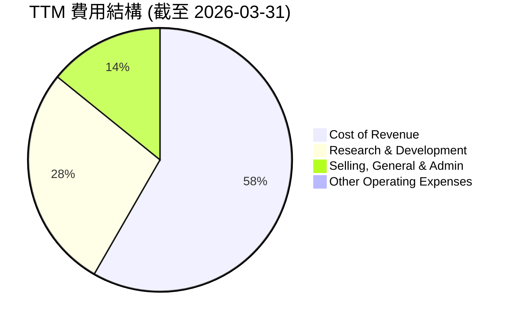

```
╔══════════════════════════════════════════════════════════════════╗
║                   AMD TTM 費用明細 (截至 2026-03-31)             ║
╠══════════════════════════════════════════════════════════════════╣
║                                                                  ║
║  總營收：             $37.45B                                    ║
║  銷貨成本 (CoR)：     $18.56B  ██████████████████████████████████████████████████████████████████████████████████████████████████████████████████████████████████████████████████████████████████████████████████████████████████████████████████████████████████████████████████████████████████████████████████████████████████████████████████████████████████████████████████████████████████████████████████████████████████████████████████████████████████████████████████████████████████████████████████████████████████████████████████████████████████████████████████████████████████████████████████████████████████████████████████████████████████████████████████████████████████████████████████████████████████████████████████████████████████████████████████████████████████████████████████████████████████████████████████████████████████████████████████████████████████████████████████████████████████████████████████████████████████████████████████████████████████████████████████████████████████████████████████████████████████████████████████████████████████████████████████████████████████████████████████████████████████████████████████████████████████████████████████████████████████████████████████████████████████████████████████████████████████████████████████████████████████████████████████████████████████████████████████████████████████████████████████████████████████████████████████████████████████████████████████████████████████████████████████████████████████████████████████████████████████████████████████████████████████████████████████████████████████████████████████████████████████████████████████████████████████████████████████████████████████████████████████████████████████████████████████████████████████████████████████████████████████████████████████████████████████████████████████████████████████████████████████████████████████████████████████████████████████████████████████████████████████████████████████████████████████████████████████████████████████████████████████████████████████████████████████████████████████████████████████████████████████████████████████████████████████████████████████████████████████████████████████████████████████████████████████████████████████████████████████████████████████████████████████████████████████████████████████████████████████████████████████████████████████████████████████████████████████████████████████████████████████████████████████████████████████████████████████████████████████████████████████████████████████████████████████████████████████████████████████████████████████████████████████████████████████████████████████████████████████████████████████████████████████████████████████████████████████████████████████████████████████████████████████████████████████████████████████████████████████████████████████████████████████████████████████████████████████████████████████████████████████████████████████████████████████████████████████████████████████████████████████████████████████████████████████████████████████████████████████████████████████████████████████████████████████████████████████████████████████████████████████████████████████████████████████████████████████████████████████████████████████████████════█████████████████████████████████████████████████████████████████████████████████████████████████████████████████████████████████████████████████████████████████████████████████████████████████████████████████████████████████████████████████████████████████████████████████████████████████████████████████████████████████████████████████████████████████████████████████████████████████████████████████████████████████████████████████████████████████████████████████████████████████████████████████████████████████████████████████████████████████████████████████████████████████████████████████████████████████████████████████████████████████████████████████████████████████████████████████████████████████████████████████████████████████████████████████████████████████████████████████████████████████████████████████████████████████████████████████████████████████████████████████████████████████████████████████████████████████████████████████████████████████████████████████████████████████████████████████████████████████████████████████████████████████████████████████████████████████████████████████████████████████████████████████████████████████████████████████████████████████████████████████████████████████████████████████████████████████████████████████████████████████████████████████████████████████████████████████████████████████████████████████████████████████████████████████████████████████████████████████████████████████████████████████████████████████████████████████████████████████████████████████████████████████████████████████████████████████████████████████████████████████████████████████████████████████████████████████████████████████████████████████████████
```

---

## 2. 公司概覽與商業模式

### 2.1 業務結構與收入來源

Advanced Micro Devices, Inc. (AMD) 是一家全球領先的半導體公司，專注於設計和開發高性能計算與圖形產品。公司主要服務於資料中心、個人電腦、遊戲機以及嵌入式市場。AMD 的產品組合包括微處理器 (CPU)、圖形處理器 (GPU)、晶片組、以及通過收購 Xilinx 獲得的自適應 SoC (FPGA)。

截至 TTM 2026年3月31日，AMD 的總營收為 $37.45B，市值達到 $868.41B。公司業務主要分為以下幾個板塊，其收入貢獻比重反映了當前市場的戰略重點和成長趨勢：

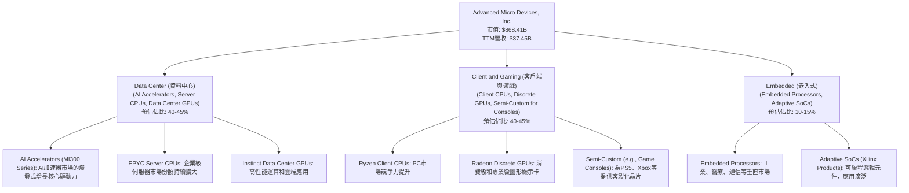

*   **資料中心 (Data Center)**：此板塊是 AMD 當前最關鍵的成長引擎。其產品包括 EPYC 伺服器處理器和 Instinct 系列資料中心 GPU (AI 加速器)。隨著 AI 應用和雲端運算的爆炸式增長，MI300 系列 AI 加速器正快速貢獻營收，並有望成為未來幾年的主要增長點。
*   **客戶端與遊戲 (Client and Gaming)**：此板塊涵蓋了 AMD 的 Ryzen 品牌 CPU 用於個人電腦市場，以及 Radeon 品牌獨立 GPU。此外，AMD 也是 PlayStation 和 Xbox 等主流遊戲主機的半客製化 SoC 供應商，這部分業務雖然受遊戲機生命週期影響，但提供了穩定的營收基礎。
*   **嵌入式 (Embedded)**：通過對 Xilinx 的收購，AMD 顯著擴展了其在嵌入式和自適應計算領域的佈局，提供廣泛的 FPGA 和自適應 SoC 產品，服務於工業、汽車、通信和國防等多元化市場。

### 2.2 市場份額

AMD 在其核心市場領域與強大的競爭對手如 Intel 和 NVIDIA 進行激烈競爭。近年來，AMD 在多個關鍵市場取得了顯著進展，逐步擴大了其市場份額。

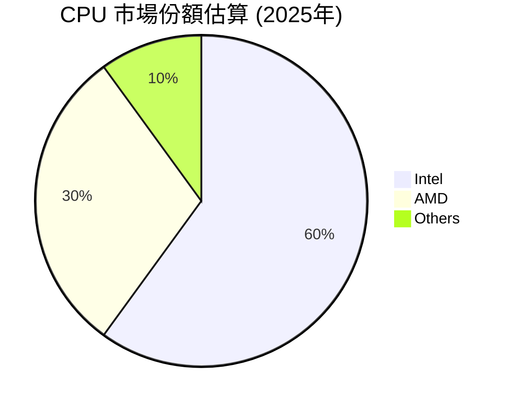
*   **CPU 市場**：在個人電腦 CPU 市場，AMD 的 Ryzen 系列處理器憑藉其卓越的性能和競爭力，持續從 Intel 手中奪取份額。在伺服器 CPU 市場，EPYC 處理器以其核心數、性能和每瓦效率優勢，在資料中心領域快速滲透。

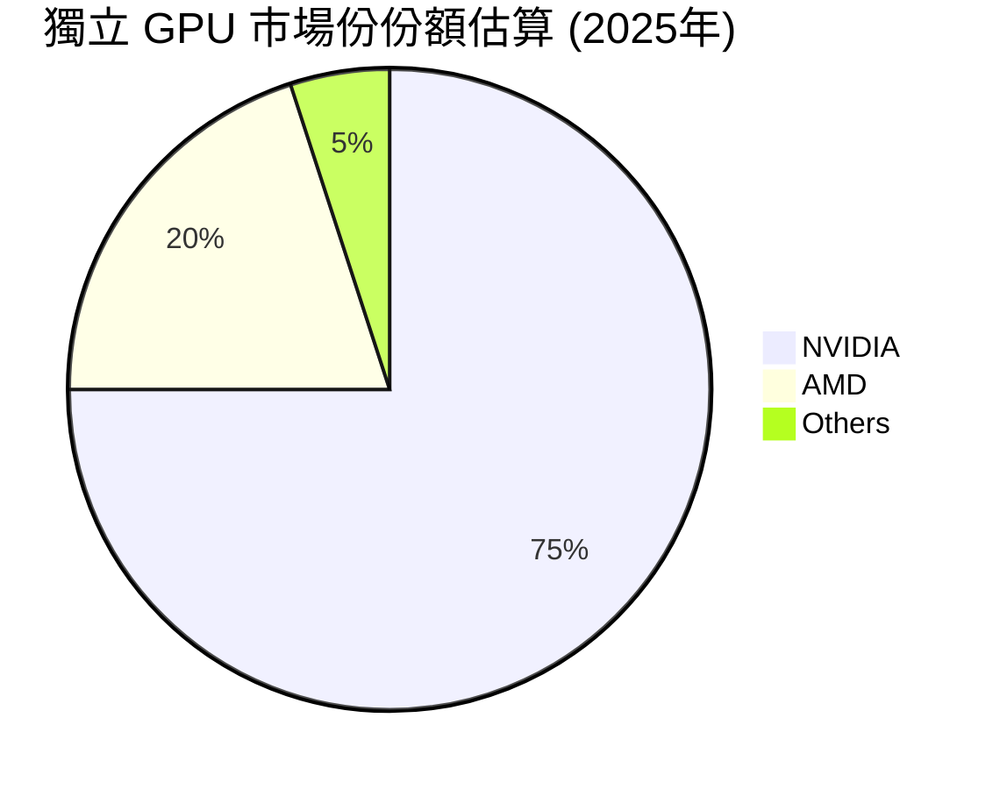
*   **獨立 GPU 市場**：在獨立 GPU 市場，NVIDIA 仍佔據主導地位，尤其是在高端遊戲和專業視覺化領域。然而，AMD 的 Radeon 系列 GPU 也在積極競爭，並在性價比方面具有優勢。在資料中心 AI 加速器市場，儘管 NVIDIA 佔據絕大多數份額，但 AMD 的 MI300 系列正快速追趕，其市場份額預計將在未來幾年內顯著提升。

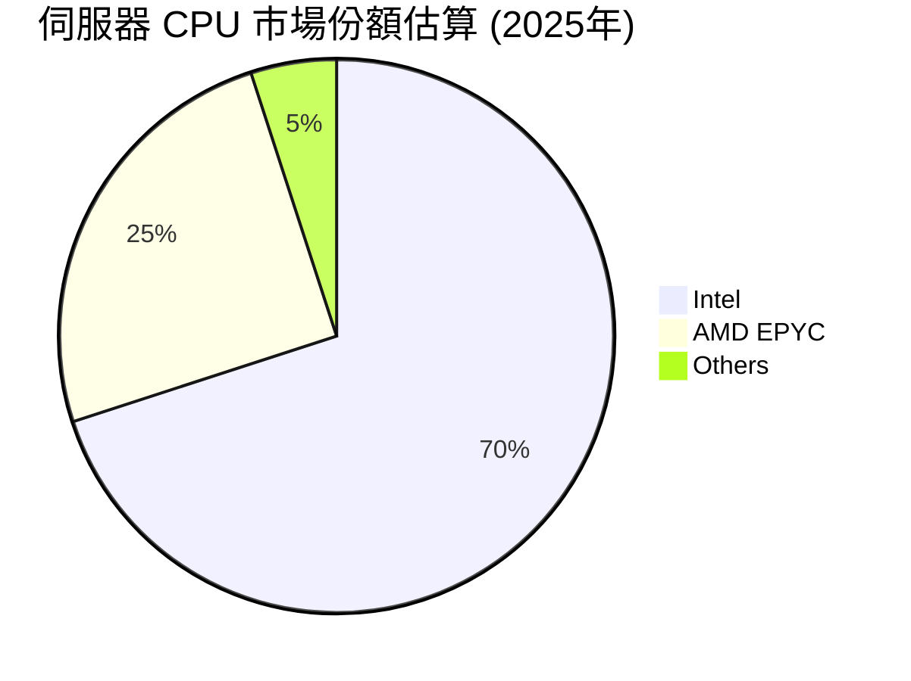
*   **伺服器 CPU 市場**：AMD 的 EPYC 處理器在伺服器市場的份額從個位數增長到約 25%，顯示出其在高性能、多核處理器領域的強大競爭力，尤其受到雲服務提供商和企業客戶的青睞。

*備註：以上市場份額為分析師根據公開行業報告和市場趨勢的綜合估算。*

### 2.3 競爭護城河分析

AMD 的競爭護城河是其長期可持續發展的關鍵，主要體現在以下幾個方面：

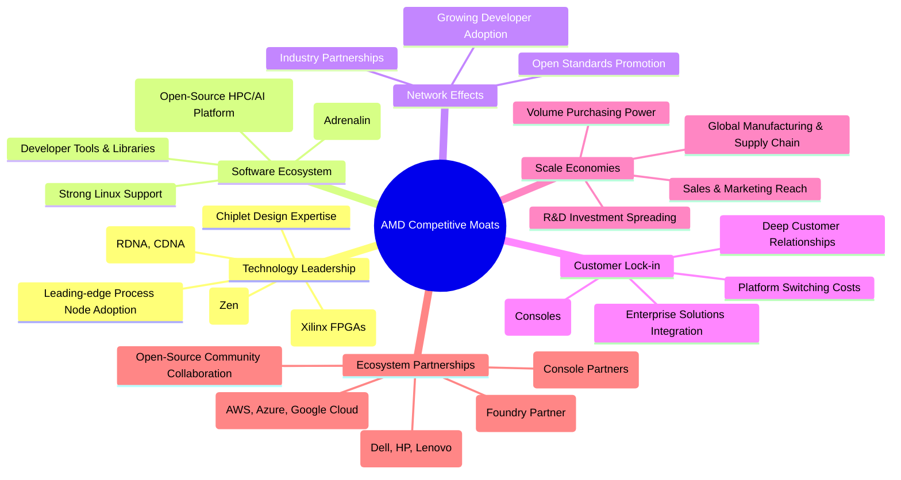

*   **Technology Leadership (技術領先)**：AMD 在 CPU 和 GPU 架構設計方面擁有深厚的技術積累，例如 Zen CPU 架構和 RDNA/CDNA GPU 架構。其領先的 Chiplet (小晶片) 設計策略使其能夠更靈活地整合不同功能，提高良率並降低成本。收購 Xilinx 則進一步強化了其在自適應計算 (FPGA) 領域的領導地位，這在 AI 和邊緣計算中至關重要。公司積極採用台積電等領先製程技術，確保產品性能優勢。
*   **Software Ecosystem (軟體生態系統)**：雖然相較於 NVIDIA 的 CUDA 生態系統仍有差距，但 AMD 的 ROCm 開源平台在高性能計算