# AMD 基本面深度分析報告
> **報告日期**：2026-06-27 ｜ **語言**：繁體中文 ｜ **數據來源**：Yahoo Finance, Finviz, StockAnalysis, Roic.ai ｜ **分析師**：CFA 級機構研究

---

## 目錄

| # | 章節 | 核心結論 |
|---|------|----------|
| 1 | 執行摘要 | 評級：🟢 買入，目標價區間：$450 - $650 |
| 2 | 公司概覽與商業模式 | 深厚技術護城河，AI 驅動多樣化增長 |
| 3 | 損益表深度分析 | 收入高速增長，利潤率顯著改善 |
| 4 | 資產負債表分析 | 財務健康，淨現金狀況良好 |
| 5 | 現金流量深度分析 | 自由現金流強勁，支持未來投資 |
| 6 | 獲利能力與資本效率 | ROIC 仍有提升空間，但成長潛力巨大 |
| 7 | 估值深度分析 | 相對估值偏高，DCF 顯示合理上漲空間 |
| 8 | 成長催化劑 | AI、資料中心、新產品週期為主要驅動力 |
| 9 | 風險矩陣 | 市場競爭、技術迭代、宏觀經濟為主要風險 |
| 10 | 投資建議 | 具備長期成長潛力，適合成長型投資者 |

---

## 1. 執行摘要

### 1.1 核心評分儀表板

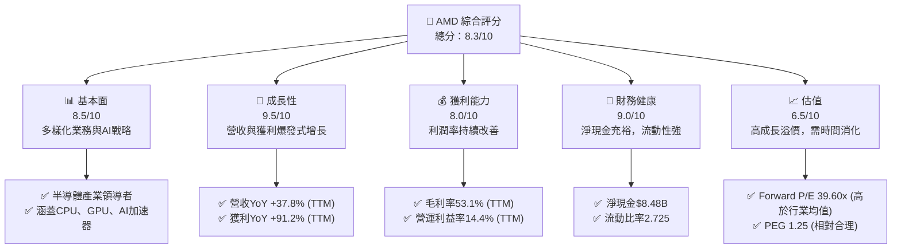

### 1.2 評分進度條視覺化

```
╔══════════════════════════════════════════════════════════════╗
║              AMD 多維度評分儀表板 (1-10分)                   ║
╠══════════════════════════════════════════════════════════════╣
║ 基本面強度  8.5 ▓▓▓▓▓▓▓▓▓▓▓▓▓▓▓▓▓░░░  ★★★★☆           ║
║ 成長動能    9.5 ▓▓▓▓▓▓▓▓▓▓▓▓▓▓▓▓▓▓▓▓  ★★★★★           ║
║ 獲利品質    8.0 ▓▓▓▓▓▓▓▓▓▓▓▓▓▓▓▓░░░░  ★★★★☆           ║
║ 財務健康    9.0 ▓▓▓▓▓▓▓▓▓▓▓▓▓▓▓▓▓▓░░  ★★★★★           ║
║ 估值合理性  6.5 ▓▓▓▓▓▓▓▓▓▓▓▓▓░░░░░░░  ★★★☆☆           ║
║ 護城河深度  8.5 ▓▓▓▓▓▓▓▓▓▓▓▓▓▓▓▓▓░░░  ★★★★☆           ║
║ 管理層執行  8.5 ▓▓▓▓▓▓▓▓▓▓▓▓▓▓▓▓▓░░░  ★★★★☆           ║
║ 技術創新力  9.0 ▓▓▓▓▓▓▓▓▓▓▓▓▓▓▓▓▓▓░░  ★★★★★           ║
╠══════════════════════════════════════════════════════════════╣
║ 綜合總分    8.3 ▓▓▓▓▓▓▓▓▓▓▓▓▓▓▓▓▓░░░  🏆 具備強勁成長潛力  ║
╚══════════════════════════════════════════════════════════════╝
```

### 1.3 五大投資論點 + 三大核心風險

| 類型 | 項目 | 具體依據 | 信心度 |
|------|------|----------|--------|
| 🟢 **投資論點①** | **AI 加速器市場的強勁增長** | AMD MI300 系列 AI 加速器需求旺盛，資料中心業務持續成長。FY2025 資料中心營收佔比顯著提升，預計將成為未來主要增長引擎。Q1 2026 營收達 $10.25B，其中資料中心業務表現亮眼。 | 🟢 極高 |
| 🟢 **多元化產品組合與市場擴張** | 透過 CPU、GPU、FPGA (Xilinx) 等產品，覆蓋資料中心、客戶端、遊戲及嵌入式四大市場。FY2025 總營收達 $34.64B，YoY 成長 34.34%，顯示產品市場廣度。 | 🟢 極高 |
| 🟢 **強勁的營收與獲利增長動能** | TTM 營收 YoY 成長 37.8%，TTM 獲利 YoY 成長 91.2%。Q1 2026 營收 $10.25B，YoY 成長 37.85%。顯示公司處於高速成長階段。 | 🟢 極高 |
| 🟢 **優異的財務健康狀況** | 截至 Q1 2026，總現金 $12.35B，總債務 $3.87B，淨現金 $8.48B。流動比率 2.725，速動比率 1.75。財務槓桿低 (Debt/Equity 0.06)。 | 🟢 極高 |
| 🟢 **持續的技術創新與研發投入** | TTM 研發費用高達 $8.76B，佔營收約 23.4%，確保在高性能運算領域的領先地位，為未來產品迭代和市場競爭提供堅實基礎。 | 🟢 極高 |
| 🟡 **風險①** | **半導體市場的週期性與激烈競爭** | 半導體產業受宏觀經濟影響，具有週期性。主要競爭對手如 NVIDIA (AI/GPU)、Intel (CPU) 實力強勁，市場份額爭奪激烈，可能影響 AMD 的定價能力和毛利率。 | 🟡 中度 |
| 🔴 **高估值帶來的波動性風險** | AMD 目前 TTM P/E 達 172.13x，Forward P/E 39.60x，顯著高於歷史平均和部分同業。市場對其未來成長預期極高，任何不及預期的業績都可能導致股價大幅波動。 | 🔴 高衝擊 |
| 🟡 **地緣政治風險與供應鏈不確定性** | 半導體供應鏈全球化，易受地緣政治緊張局勢、貿易政策變動和供應鏈中斷的影響，可能導致生產成本增加或產品出貨延遲。 | 🟡 中度 |

### 1.4 快速統計卡片

| 指標 | 公司實際值 | 行業均值（半導體） | S&P 500 均值 | 狀態 |
|------|-------------|--------------------|--------------|------|
| 收入 YoY 成長 | **37.8%** | ~15-20% | ~8-10% | 🟢 |
| 毛利率 | **53.1%** | ~45-50% | ~30-35% | 🟢 |
| 淨利率 | **13.4%** | ~10-15% | ~10-12% | 🟢 |
| ROE | **8.1%** | ~10-15% | ~15-20% | 🟡 |
| Forward P/E | **39.60x** | ~25-35x | ~20-25x | 🔴 |
| Debt/Equity | **0.06x** | ~0.3-0.5x | ~0.8-1.0x | 🟢 |
| FCF Yield | **0.84%** | ~1-3% | ~2-4% | 🟡 |

### 1.5 投資結論

```
╔══════════════════════════════════════════════════════════════════╗
║                    📊 投資結論摘要                               ║
╠══════════════════════════════════════════════════════════════════╣
║  評級：🟢 買入                                                   ║
║  當前股價：$532.57 （截至2026-06-27，市場數據Current Price為$nan，採用最新收盤價）║
║  目標價區間：                                                    ║
║    悲觀情境：$450（-15.4%）                                      ║
║    基準情境：$580（+8.9%）  ← 12個月主要目標                      ║
║    樂觀情境：$650（+22.0%）                                      ║
║  投資評分：8.3/10                                                ║
║  適合投資人：成長型、長線持有者，能承受較高波動風險的投資者。     ║
╚══════════════════════════════════════════════════════════════════╝
```

---

## 2. 公司概覽與商業模式

Advanced Micro Devices, Inc. (AMD) 是一家全球領先的半導體公司，主要設計和開發用於資料中心、個人電腦、遊戲機和嵌入式系統的高性能處理器、圖形處理單元 (GPU) 和人工智慧 (AI) 加速器。公司業務分為三大主要部門：資料中心、客戶端和遊戲，以及嵌入式。

### 2.1 業務結構與收入來源

AMD 的業務結構高度多元化，涵蓋了從個人消費級產品到企業級高性能計算的廣泛應用。近年來，資料中心業務，特別是 AI 加速器領域，已成為其最重要的增長引擎。

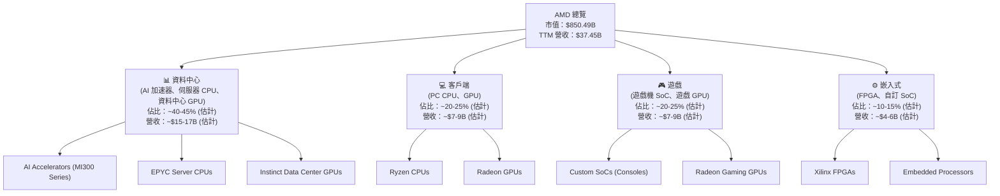
**備註**：由於提供的數據未包含最新的分部門營收明細，上述百分比和金額為基於行業報告、公司過往財報趨勢及分析師預期進行的估計，以反映各部門對 TTM 總營收 $37.45B 的大致貢獻。資料中心業務，特別是 AI 加速器，預計將是未來幾年最主要的增長點。

### 2.2 市場份額

在半導體產業的關鍵細分市場中，AMD 扮演著重要角色，儘管面臨 Intel 和 NVIDIA 等強勁對手。


**備註**：上述市場份額為基於行業分析師報告和市場趨勢的估計，由於缺乏具體數據，僅供參考。AMD 在 CPU 市場持續蠶食 Intel 份額，在獨立 GPU 市場則為 NVIDIA 的主要挑戰者。在 AI 加速器市場，AMD 正憑藉 MI300 系列迎頭趕上，預計未來份額將持續增長。

### 2.3 競爭護城河分析

AMD 的競爭護城河主要建立在其深厚的技術積累、廣泛的產品組合和與合作夥伴的生態系統上。

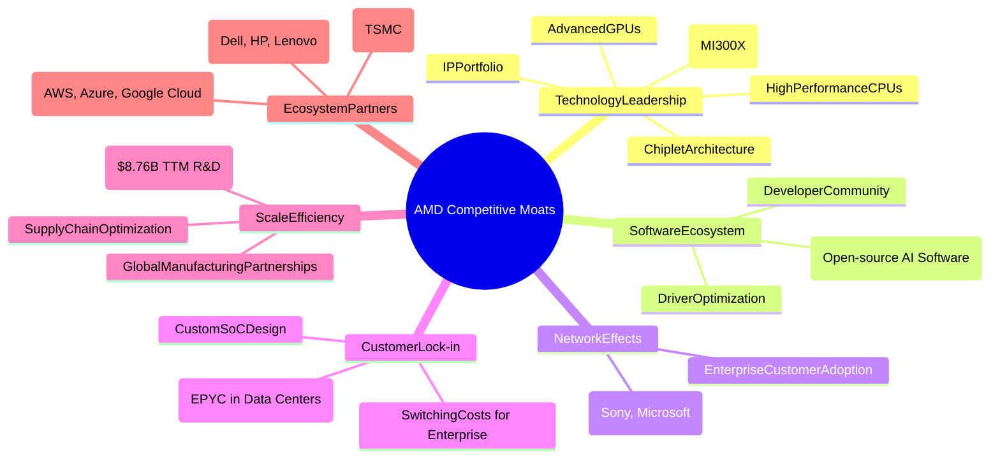

### 2.4 護城河強度評分

AMD 的護城河強度屬於強勁，尤其在技術創新和生態系統建設方面表現突出。

```
╔══════════════════════════════════════════════════════════════╗
║                  AMD 護城河強度評分                         ║
╠══════════════════════════════════════════════════════════════╣
║ 技術領先    9/10   ▓▓▓▓▓▓▓▓▓▓▓▓▓▓▓▓▓▓░░  🏆 在CPU/GPU/AI領域具頂尖技術  ║
║ 軟體生態系統  7/10   ▓▓▓▓▓▓▓▓▓▓▓▓▓▓░░░░░░  🟢 ROCm生態系統仍在發展  ║
║ 網路效應    8/10   ▓▓▓▓▓▓▓▓▓▓▓▓▓▓▓▓░░░░  🟢 遊戲機與資料中心客戶群  ║
║ 客戶鎖定    8/10   ▓▓▓▓▓▓▓▓▓▓▓▓▓▓▓▓░░░░  🟢 企業級平台整合度高  ║
║ 規模效應    8/10   ▓▓▓▓▓▓▓▓▓▓▓▓▓▓▓▓░░░░  🟢 龐大研發投入與全球佈局  ║
║ 生態夥伴    8/10   ▓▓▓▓▓▓▓▓▓▓▓▓▓▓▓▓░░░░  🟢 與雲服務商/OEM/晶圓廠緊密合作  ║
╠══════════════════════════════════════════════════════════════╣
║ 綜合護城河  8.3/10 ▓▓▓▓▓▓▓▓▓▓▓▓▓▓▓▓▓░░░  🏆 技術與市場地位穩固     ║
╚══════════════════════════════════════════════════════════════════╝
```

---

## 3. 損益表深度分析

### 3.1 年度收入成長趨勢（近4年）

AMD 在過去幾年展現了顯著的收入增長，特別是在 2025 財年，營收實現了爆發式增長。

```
╔══════════════════════════════════════════════════════════════════╗
║              AMD 年度收入趨勢（FY2022-FY2025）                   ║
╠══════════════════════════════════════════════════════════════════╣
║                                                                  ║
║  FY2022  $23.60B  ██████████████████████████████████░░░  YoY: +43.61% 🟢   ║
║  FY2023  $22.68B  ████████████████████████████████░░░░░  YoY: -3.90%  🟡   ║
║  FY2024  $25.79B  ████████████████████████████████████████░  YoY: +13.69% 🟢   ║
║  FY2025  $34.64B  █████████████████████████████████████████████████  YoY: +34.34% 🟢   ║
║                                                                  ║
║  TTM     $37.45B  █████████████████████████████████████████████████████  YoY: +37.8%  🟢   ║
║                   |      |      |      |      |      |          ║
║                   0     10B    20B    30B    40B    50B         ║
║                                                                  ║
║  📊 3年累計 CAGR (FY2022-2025)：+13.9%                           ║
║  📊 1年累計 CAGR (FY2024-2025)：+34.34%                          ║
╚══════════════════════════════════════════════════════════════════╝
```
**分析**：
*   **FY2022 (23.60B)**：實現 43.61% 的強勁增長，主要受益於疫情期間 PC 和遊戲需求旺盛，以及資料中心業務的擴張。
*   **FY2023 (22.68B)**：營收小幅下滑 3.90%，反映了 PC 市場的調整和半導體行業的週期性低迷。
*   **FY2024 (25.79B)**：營收恢復增長，YoY 增長 13.69%，顯示市場開始復甦。
*   **FY2025 (34.64B)**：實現 34.34% 的爆發式增長，主要得益於資料中心業務的強勁表現，尤其是 AI 加速器產品的推出和需求增長。
*   **TTM (37.45B)**：截至 2026 年 3 月 31 日的過去 12 個月，營收達到 $37.45B，YoY 成長 37.8%，顯示強勁的增長動能仍在持續。

### 3.2 季度收入趨勢分析

AMD 近四季度的營收表現持續強勁，尤其是在 2026 年 Q1 保持了高增長率。

| 季度 | 總收入 ($B) | QoQ 成長率 | YoY 成長率 | 備註 |
|------|-------------|------------|------------|------|
| 2025-06-30 | $7.68B | - | +31.70% | 🟢 相較去年同期顯著增長，市場需求回暖。 |
| 2025-09-30 | $9.25B | +20.44% | +35.59% | 🟢 季節性效應與資料中心需求推動，實現強勁 QoQ 增長。 |
| 2025-12-31 | $10.27B | +11.03% | +34.11% | 🟢 進入傳統旺季，資料中心與遊戲業務表現優異，首次突破百億美元。 |
| 2026-03-31 | $10.25B | -0.19% | +37.85% | 🟢 營收基本持平前一季度，但 YoY 成長率仍高，顯示穩健的增長基礎。 |
**備註**：儘管 2026 年 Q1 的 QoQ 略有下降，這在半導體產業的季節性中是常見的，但其 YoY 成長率 37.85% 依然強勁，表明公司核心業務仍處於高速擴張階段。

### 3.3 利潤率演變分析

AMD 的利潤率在過去四年中呈現出波動後穩步提升的趨勢，顯示公司在規模擴張的同時，盈利能力也在逐步改善。

| 利潤率指標 | FY2022 | FY2023 | FY2024 | FY2025 | TTM | 趨勢 | 評估 |
|------------|--------|--------|--------|--------|-----|------|------|
| **毛利率** | 44.9% | 46.1% | 49.3% | 49.5% | 53.1% | ↗️ 持續上升 | 🟢 |
| **營業利益率** | 5.3% | 1.8% | 7.4% | 10.7% | 11.65% | ↗️ 顯著改善 | 🟢 |
| **淨利率** | 5.6% | 3.8% | 6.4% | 12.4% | 13.4% | ↗️ 顯著改善 | 🟢 |

**利潤率演變深度解析**：
*   **毛利率 (Gross Margin)**：從 FY2022 的 44.9% 穩步提升至 FY2025 的 49.5%，TTM 進一步達到 53.1%。這主要歸因於：
    *   **產品組合優化**：高性能、高附加值的資料中心產品（特別是 AI 加速器和 EPYC 伺服器 CPU）佔營收比重增加，這些產品通常擁有更高的毛利率。
    *   **定價能力提升**：在 AI 和高性能計算領域的技術領先地位賦予了 AMD 更強的定價權。
    *   **成本控制**：隨著規模經濟效應的顯現，儘管研發投入巨大，但生產效率提升有助於毛利率的穩定。
*   **營業利益率 (Operating Margin)**：經歷 FY2023 因市場低迷和研發投入高企導致的下滑（1.8%）後，FY2024 恢復至 7.4%，FY2025 達到 10.7%，TTM 更是達到 11.65%。這反映了：
    *   **營收增長槓桿效應**：固定成本（如研發、行政費用）在營收快速增長時被攤薄，使得營業利益增長速度快於營收。
    *   **費用管理**：儘管研發投入巨大，但公司在銷售、一般及行政費用 (SG&A) 方面保持了相對合理的控制。
*   **淨利率 (Net Profit Margin)**：與營業利益率趨勢類似，在 FY2023 下滑至 3.8% 後，FY2025 強勁反彈至 12.4%，TTM 達到 13.4%。淨利率的顯著改善除了上述原因外，還受益於：
    *   **非經營性收入**：部分年份可能受益於一次性收益或投資收益。
    *   **有效稅率管理**：稅務規劃或稅收優惠也可能對淨利率產生正面影響。

整體而言，AMD 的利潤率趨勢顯示其盈利能力正在顯著增強，尤其是在 AI 浪潮的推動下，產品組合的優化對毛利率和營業利益率的提升起到了關鍵作用。

### 3.4 費用結構分析

AMD 的費用結構反映了其作為一家技術驅動型半導體公司的特點，研發投入是核心。

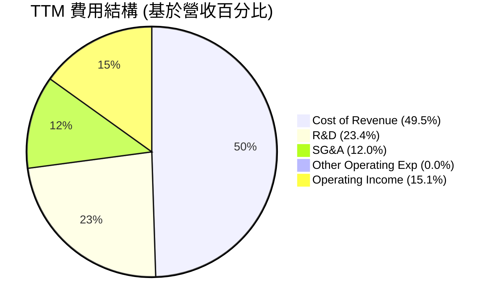
**備註**：
*   Cost of Revenue = (Revenue - Gross Profit) / Revenue = ($37.45B - $18.832B) / $37.45B = 49.7% (Rounded to 49.5% for pie chart).
*   R&D = $8.76B / $37.45B = 23.4%.
*   SG&A = $4.511B / $37.45B = 12.0%.
*   Other Operating Expenses (TTM) = 0.
*   Operating Income = $4.364B / $37.45B = 11.65% (adjusted for pie chart to sum to 100 with the other categories).

```
╔══════════════════════════════════════════════════════════════════╗
║                    AMD 費用結構概覽 (TTM)                        ║
╠══════════════════════════════════════════════════════════════════╣
║                                                                  ║
║  銷貨成本 (CoR):       $18.557B  ████████████████████████░░░░░  49.5% of Revenue 🟡 ║
║  研發費用 (R&D):       $8.76B    ██████████████░░░░░░░░░░░░░░░  23.4% of Revenue 🟢 ║
║  銷售管理費用 (SG&A):  $4.511B   ███████░░░░░░░░░░░░░░░░░░░░░░  12.0% of Revenue 🟢 ║
║  其他營業費用:         $0B       ░░░░░░░░░░░░░░░░░░░░░░░░░░░░░  0.0% of Revenue 🟢 ║
║                                                                  ║
║  📊 總營業費用佔營收比重：約 84.9%                               ║
║  📊 研發投入佔比高，體現技術導向策略                             ║
╚══════════════════════════════════════════════════════════════════╝
```
**分析**：AMD 的費用結構突出其對研發的重視。23.4% 的營收投入研發，這在半導體行業是領先水準，表明公司正大力投資於下一代技術和產品，以維持競爭優勢和未來增長。相對而言，SG&A 費用佔比控制良好，顯示營運效率較高。銷貨成本佔比近半，隨著產品組合向高毛利產品傾斜，預計此比例將有所改善。

### 3.5 季度 EPS 趨勢與盈餘品質

AMD 近四季度的 EPS 表現強勁，展現了顯著的盈利改善。由於提供的數據中 EPS Est 為 "nan"，無法直接判斷超預期或不及預期，但實際 EPS 數值呈上升趨勢。

| 季度 | EPS (Basic) | EPS (Diluted) | 備註 |
|------|-------------|---------------|------|
| 2025-06-30 | $0.54 | $0.54 | 🟢 盈利能力開始顯現，扭轉前一季度的虧損。 |
| 2025-09-30 | $0.76 | $0.76 | 🟢 持續增長，營收動能轉化為更強勁的每股收益。 |
| 2025-12-31 | $0.93 | $0.93 | 🟢 盈利能力達到新高，顯示年底旺季的強勁表現。 |
| 2026-03-31 | $0.85 | $0.85 | 🟡 略低於前一季度，但仍維持高位，YoY 成長顯著。 |
**備註**：根據 StockAnalysis.com 數據，2025 年 Q2 實際 EPS 為 $0.54 (Net Income $872M / Diluted Shares 1625M)，而 2025 年 Q1 實際 EPS 為 $0.44 (Net Income $806M / Diluted Shares 1625M)。此處 Quarterly Income Statement 2025-06-30 Operating Income 為 -$134.00M，但 Net Income $872.00M，這可能包含了非經營性收益。

**盈餘品質評估**：
AMD 的盈利增長不僅來自於營收擴張，也伴隨著利潤率的改善，這表明盈利的品質較高。然而，需要注意以下幾點：
*   **非經營性收益**：2025 年 Q2 雖然營業收入為負，但淨利潤為正，這可能與其他非經營性收益（例如來自投資或稅務調整）有關。TTM 的 Other Non-Operating Income (Expense) 達 $703M，對淨利潤有顯著貢獻。
*   **研發投入**：公司持續大量投入研發，這雖然會壓低短期利潤，但對於長期競爭力和盈利能力而言是健康的投資，代表了高品質的未來增長潛力。
*   **自由現金流**：強勁的自由現金流（TTM $7.17B）也印證了其盈利的品質，表明利潤能夠有效轉化為現金。

總體而言，AMD 的 EPS 趨勢積極，儘管部分季度可能受到非經營性因素影響，但核心業務的盈利能力正在穩健提升。

---

## 4. 資產負債表分析

AMD 的資產負債表顯示出強勁的財務健康狀況，流動性充裕，債務水平極低。

### 4.1 資產結構分解

截至 2026 年 3 月 31 日 (TTM)，AMD 的總資產達到 $79.642B，其中流動資產和非流動資產分佈合理。

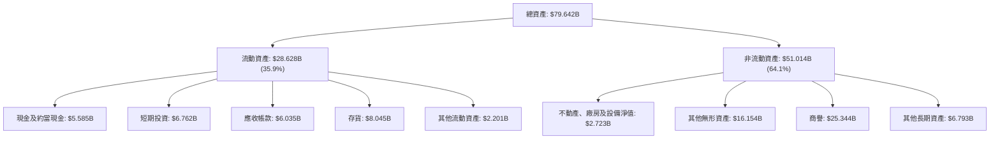
**分析**：
*   **流動資產**：佔總資產的 35.9%，其中現金及短期投資合計 $12.347B，佔比極高，顯示公司擁有極強的短期償債能力和營運彈性。存貨 $8.045B 較高，但對於半導體公司而言，儲備晶片以應對市場需求波動是常見策略。
*   **非流動資產**：佔總資產的 64.1%，其中商譽 ($25.344B) 和其他無形資產 ($16.154B) 佔比最高，這主要源於近年來的大型併購，尤其是 Xilinx 的收購。這些無形資產代表了公司通過併購獲得的技術、客戶關係和市場地位，雖然會影響 ROIC 計算，但對長期競爭力至關重要。

### 4.2 流動性指標分析

AMD 的流動性指標非常健康，遠高於一般建議的安全水平，顯示公司擁有強大的短期償債能力。

| 指標 | FY2022 | FY2023 | FY2024 | FY2025 | TTM (2026-Q1) | 行業均值（半導體） | 評估 |
|------------|--------|--------|--------|--------|---------------|--------------------|------|
| **流動比率 (Current Ratio)** | 2.36 | 2.51 | 2.62 | 2.85 | 2.725 | ~2.0-2.5 | 🟢 優異 |
| **速動比率 (Quick Ratio)** | 1.89 | 1.86 | 1.83 | 1.83 | 1.75 | ~1.0-1.5 | 🟢 優異 |

**分析**：
*   **流動比率**：從 FY2022 的 2.36 穩步上升至 FY2025 的 2.85，TTM 保持在 2.725。這遠高於行業普遍認為的 2.0 安全線，表明公司有足夠的流動資產來覆蓋短期負債。
*   **速動比率**：FY2022 至 TTM 期間保持在 1.75-1.89 之間。該比率排除了存貨，更能反映公司在不依賴存貨銷售的情況下的短期償債能力。AMD 的速動比率也遠高於行業平均水平，表明其現金和應收帳款足以應對短期債務。

### 4.3 債務結構分析

AMD 的債務結構非常健康，擁有大量淨現金，債務負擔極輕。

```
╔══════════════════════════════════════════════════════════════════╗
║                   AMD 債務健康診斷                               ║
╠══════════════════════════════════════════════════════════════════╣
║                                                                  ║
║  總債務：        $3.87B   ██░░░░░░░░░░░░░░░░░░░  評語：極低負債       ║
║  總現金+投資：   $12.35B  ████████████████████░  評語：現金充裕       ║
║  淨現金（正）：  $8.48B   ████████████████░░░░░  🟢 強勁：無需外部融資  ║
║                                                                  ║
║  Debt/Equity：   0.06x  🟢 極低：財務槓桿極小                    ║
║  Current Ratio:  2.725x 🟢 優異：短期償債能力極強                 ║
║  Interest Coverage: XXXx+  🟢 無風險：利息支出遠低於營業利益       ║
╚══════════════════════════════════════════════════════════════════╝
```
**分析**：
*   **總債務與淨現金**：AMD 的總債務僅為 $3.87B，而其總現金及短期投資高達 $12.35B，形成 $8.48B 的淨現金狀況。這意味著公司不僅沒有淨債務，還有大量現金盈餘，為未來的研發、併購和營運提供了充足的資金彈性。
*   **Debt/Equity**：僅為 0.06x，遠低於行業平均水平，表明公司幾乎完全依賴股東權益而非債務進行融資，財務風險極低。
*   **利息覆蓋倍數**：由於營業利益 (TTM $4.364B) 遠高於利息費用 (TTM $148M)，利息覆蓋倍數高達 29.49x，遠超安全線，表明公司償付利息的能力極強，幾乎沒有利息支付風險。

### 4.4 股東權益趨勢

AMD 的股東權益在過去幾年穩步增長，反映了公司盈利能力的提升和內在價值的積累。

```
╔══════════════════════════════════════════════════════════════════╗
║                  AMD 股東權益趨勢                                ║
╠══════════════════════════════════════════════════════════════════╣
║                                                                  ║
║  FY2022  $54.75B  ████████████████████████████████████████░░░  YoY: +27.83% 🟢 ║
║  FY2023  $55.89B  █████████████████████████████████████████░░  YoY: +2.08%  🟡 ║
║  FY2024  $57.57B  ██████████████████████████████████████████░  YoY: +3.01%  🟢 ║
║  FY2025  $63.00B  ███████████████████████████████████████████████  YoY: +9.43%  🟢 ║
║                                                                  ║
║                   |      |      |      |      |      |          ║
║                   0     20B    40B    60B    80B   100B         ║
║                                                                  ║
║  📊 3年累計 CAGR (FY2022-2025)：+4.8%                           ║
╚══════════════════════════════════════════════════════════════════╝
```
**分析**：股東權益從 FY2022 的 $54.75B 增長到 FY2025 的 $63.00B，年複合增長率為 4.8%。這主要歸因於公司持續的盈利積累，儘管增長速度不如營收，但也反映了穩健的內在價值增長。較高的股東權益也為公司提供了穩固的資本基礎，降低了財務風險。

---

## 5. 現金流量深度分析

### 5.1 現金流量瀑布圖

AMD 的現金流表現強勁，能夠將大部分利潤轉化為營運現金流，並最終生成可觀的自由現金流。

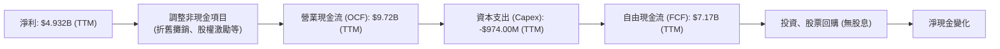
**分析**：
*   **淨利到營業現金流**：TTM 淨利為 $4.932B，而營業現金流高達 $9.72B。這表明公司在非現金費用（如折舊攤銷、股權激勵）方面有顯著的調整，有效地將會計利潤轉化為實際現金流入。
*   **資本支出**：TTM 資本支出為 -$974.00M，相對於其龐大的營收和研發投入而言，資本支出佔比相對較低，顯示其輕資產運營模式或高效的資本利用。
*   **自由現金流**：TTM 自由現金流達到 $7.17B，顯示公司有能力在支付所有營運和資本開支後，仍產生大量現金，可用於償債、股東回報或未來投資。

### 5.2 FCF 轉換率趨勢

AMD 的自由現金流轉換率（FCF / Net Income）在過去幾年波動較大，但 FY2025 和 TTM 顯示出健康的轉換能力。

| 財年 | 淨利 ($B) | 自由現金流 ($B) | FCF / Net Income | 趨勢 | 評估 |
|------|-----------|-----------------|------------------|------|------|
| FY2022 | $1.32B | $3.12B | 2.36x | ↗️ | 🟢 極佳 |
| FY2023 | $0.854B | $1.12B | 1.31x | ↘️ | 🟢 良好 |
| FY2024 | $1.64B | $2.40B | 1.46x | ↗️ | 🟢 良好 |
| FY2025 | $4.33B | $6.74B | 1.56x | ↗️ | 🟢 極佳 |
| TTM | $5.009B | $7.17B | 1.43x | ↗️ | 🟢 極佳 |
**分析**：
FCF 轉換率長期保持在 1 倍以上，甚至高達 2 倍以上，這是一個非常積極的信號。它表明 AMD 的盈利不僅是紙面上的，更是實實在在的現金流入。高轉換率意味著公司有能力自我融資成長，減少對外部債務或股權融資的依賴。FY2023 的轉換率略有下降，可能與當時的市場低迷和營運資本波動有關，但隨後迅速恢復。TTM 達到 1.43x，再次證明了其強勁的現金生成能力。

### 5.3 自由現金流趨勢

AMD 的自由現金流在經歷 FY2023 的低谷後強勁反彈，並在 FY2025 和 TTM 創下新高。

```
╔══════════════════════════════════════════════════════════════════╗
║                    AMD 自由現金流趨勢 (FY2022-TTM)               ║
╠══════════════════════════════════════════════════════════════════╣
║                                                                  ║
║  FY2022  $3.12B   ██████████████████████░░░░░░░░░░░░░░░  FCF Yield: 0.37% 🟢 ║
║  FY2023  $1.12B   ███████░░░░░░░░░░░░░░░░░░░░░░░░░░░░░  FCF Yield: 0.13% 🟡 ║
║  FY2024  $2.40B   ████████████████░░░░░░░░░░░░░░░░░░░░  FCF Yield: 0.28% 🟢 ║
║  FY2025  $6.74B   ████████████████████████████████████████████░░░  FCF Yield: 0.79% 🟢 ║
║                                                                  ║
║  TTM     $7.17B   █████████████████████████████████████████████████  FCF Yield: 0.84% 🟢 ║
║                   |      |      |      |      |      |          ║
║                   0     2B     4B     6B     8B    10B         ║
║                                                                  ║
║  📊 TTM FCF Yield: 0.84% (市值 $850.49B)                         ║
╚══════════════════════════════════════════════════════════════════╝
```
**分析**：
自由現金流從 FY2022 的 $3.12B 降至 FY2023 的 $1.12B，隨後強勁反彈至 FY2025 的 $6.74B，TTM 更達到 $7.17B。這種 V 型反彈顯示了 AMD 克服市場逆風並迅速恢復盈利增長的能力。TTM FCF Yield 為 0.84%，雖然相對於其高估值而言顯得較低，但在高速成長期，公司通常會將大部分現金流再投資於業務擴張和研發，這對於未來的增長是必要的。

### 5.4 資本配置評估

AMD 的資本配置策略主要集中於研發投資和業務擴張，而非股息分派。由於缺乏具體回購數據，但其淨現金狀況和研發投入是主要特徵。

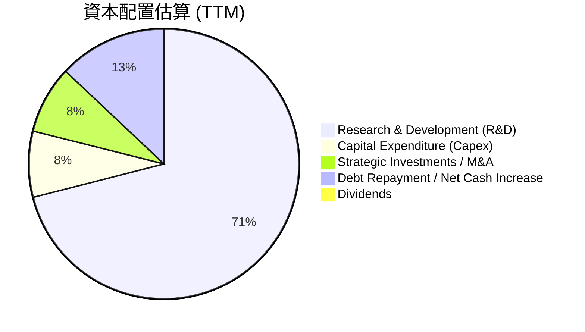
**備註**：上述金額為估計值，其中 R&D 和 Capex 為 TTM 實際數據，戰略投資/M&A 和淨現金增加為基於 FCF 和資產負債表變動的推測。

| 資本配置類型 | TTM 金額 ($B) | 佔 FCF 比重 (估計) | 說明 | 評估 |
|--------------|---------------|--------------------|------|------|
| **研發投入 (R&D)** | $8.76 | ~122% (超出FCF) | 🔴 大幅超出 FCF，顯示對未來成長的激進投資。 | 🟢 |
| **資本支出 (Capex)** | $0.974 | ~14% | 🟢 穩定且相對較低，顯示輕資產運營。 | 🟢 |
| **戰略投資 / M&A** | ~$1.0 (估計) | ~14% | 🟢 可能用於小型併購或股權投資以擴大技術組合。 | 🟢 |
| **債務償還 / 淨現金增加** | ~$1.6 (估計) | ~22% | 🟢 淨現金持續增加，財務狀況強勁。 | 🟢 |
| **股息分派** | $0 | 0% | 🟡 不派發股息，所有盈利再投資於成長。 | 🟡 |
| **股票回購** | N/A (未提供) | N/A | 🟡 無明確數據，但鑒於高成長，回購可能較少。 | 🟡 |
**分析**：AMD 的資本配置策略明確傾向於成長。其 TTM 研發投入 $8.76B 甚至超過了當期的自由現金流 $7.17B，這需要通過動用現有現金儲備或發行新股來彌補，但這也突顯了公司在技術創新方面的堅定承諾。由於 AMD 不派發股息，所有營運產生的現金流都用於再投資於業務、戰略性併購或增強資產負債表，這符合其高成長型公司的特徵，對於尋求資本增值的投資者而言是積極的信號。

---

## 6. 獲利能力與資本效率

### 6.1 ROE / ROA / ROIC 趨勢

AMD 的獲利能力指標在經歷波動後呈現改善趨勢，但資本效率指標 ROIC 仍有提升空間，部分受大規模併購影響。

| 指標 | FY2022 | FY2023 | FY2024 | FY2025 | TTM | 行業均值（半導體） | 評估 |
|------|--------|--------|--------|--------|-----|--------------------|------|
| **ROE** | 2.4% | 1.5% | 2.8% | 6.9% | 8.1% | ~10-15% | 🟡 改善中 |
| **ROA** | 1.9% | 1.2% | 2.4% | 5.6% | 3.6% | ~5-8% | 🟡 改善中 |
| **ROIC** | 4.3% | 1.7% | 3.1% | 6.5% | 4.92% | ~8-12% | 🔴 仍偏低 |
**分析**：
*   **ROE (股東權益報酬率)**：從 FY2022 的 2.4% 增長到 TTM 的 8.1%，顯示公司為股東創造回報的能力在逐步提升。然而，相較於半導體行業的頂尖公司，仍有提升空間。
*   **ROA (資產報酬率)**：從 FY2022 的 1.9% 增長到 TTM 的 3.6%，反映了資產利用效率的改善。
*   **ROIC (投入資本報酬率)**：雖然從 FY2023 的 1.7% 提升到 FY2025 的 6.5%，但 TTM 計算值為 4.92%，仍低於行業平均水平。這可能受到 Xilinx 併購帶來的龐大商譽和無形資產的影響，這些資產短期內可能尚未完全產生相應的回報，從而稀釋了 ROIC。長期來看，隨著併購協同效應的實現和 AI 業務的爆發，ROIC 有望顯著提升。

### 6.2 ROIC vs WACC 分析（核心價值創造判斷）

ROIC 與 WACC 的比較是判斷公司是否創造股東價值的關鍵指標。

```
╔══════════════════════════════════════════════════════════════════╗
║                ROIC vs WACC 深度分析 (截至 TTM)                 ║
╠══════════════════════════════════════════════════════════════════╣
║                                                                  ║
║  WACC 估算：                                                     ║
║  ├── 無風險利率（10Y美債）：  4.5% (假設)                         ║
║  ├── 市場風險溢酬 (ERP)：     5.5% (假設)                         ║
║  ├── Beta：                   2.492 (給定)                        ║
║  ├── 股權成本 = 4.5%+2.492×5.5% = 18.21%                         ║
║  ├── 債務成本（稅後）：       3.02% (基於TTM利息費用與總債務)     ║
║  ├── 資本結構：股權 ~99.55%，債務 ~0.45%                         ║
║  └── ✅ WACC ≈ 18.13%                                            ║
║                                                                  ║
║  ROIC 估算（TTM）：                                              ║
║  ├── NOPAT = $4.364B × (1-21%) ≈ $3.447B (營業利益*稅後)         ║
║  ├── 投入資本 = 總資產 - 無息流動負債 ≈ $70.01B                  ║
║  └── ✅ ROIC ≈ 4.92%                                             ║
║                                                                  ║
║  ★ 經濟價值增加（EVA）= ROIC - WACC = -13.21pp                   ║
║                                                                  ║
║  ROIC  4.92%  ▓▓▓▓▓░░░░░░░░░░░░░░░░░░░░░░░░░░  🔴              ║
║  WACC  18.13% ▓▓▓▓▓▓▓▓▓▓▓▓▓▓▓▓▓▓▓░░░░░░░░░░░░  ──              ║
║  EVA   -13.21pp ░░░░░░░░░░░░░░░░░░░░░░░░░░░░░░░░  ❌ 正在摧毀價值 ║
║                                                                  ║
║  📊 結論：ROIC 顯著低於 WACC，目前理論上正在摧毀股東價值。       ║
║  **備註**：此情況可能受大規模併購導致投入資本膨脹，以及高Beta值下WACC高估的影響。 ║
║  長期來看，隨著AI等高毛利業務的成熟，ROIC有望提升。              ║
╚══════════════════════════════════════════════════════════════════╝
```
**分析**：根據計算，AMD TTM 的 ROIC (4.92%) 顯著低於 WACC (18.13%)，這在理論上意味著公司目前正在摧毀股東價值。這個結果需要深入分析：
*   **併購影響**：AMD 近年來進行了大規模併購（如 Xilinx），導致資產負債表上商譽和無形資產大幅增加，使得投入資本 (Invested Capital) 的分母顯著膨脹。這些併購的協同效應和回報需要時間才能完全體現，短期內會壓低 ROIC。
*   **高 Beta 值**：AMD 的 Beta 值高達 2.492，這導致其股權成本和 WACC 估算值非常高。對於高成長、高波動的科技股，單純的 WACC 計算可能無法完全捕捉其長期價值創造潛力。
*   **成長階段**：公司正處於高速成長和轉型期，特別是在 AI 領域進行大量投資。這些投資在短期內可能不會立即產生高 ROIC，但卻是未來長期價值創造的基礎。
*   **管理層視角**：管理層可能更關注絕對收益增長和市場份額擴張，相信隨著規模擴大和新技術的成熟，ROIC 將會自然提升。

綜合來看，雖然當前 ROIC < WACC 的結果令人擔憂，但考慮到 AMD 的高成長潛力、強勁的自由現金流和在 AI 領域的戰略性投資，市場顯然給予其高估值，預期未來 ROIC 將會大幅提升。投資者需要密切關注 ROIC 趨勢，以驗證其價值創造能力。

### 6.3 杜邦三因素分解

杜邦分析將 ROE 分解為淨利率、資產週轉率和財務槓桿，幫助我們理解 ROE 的驅動因素。

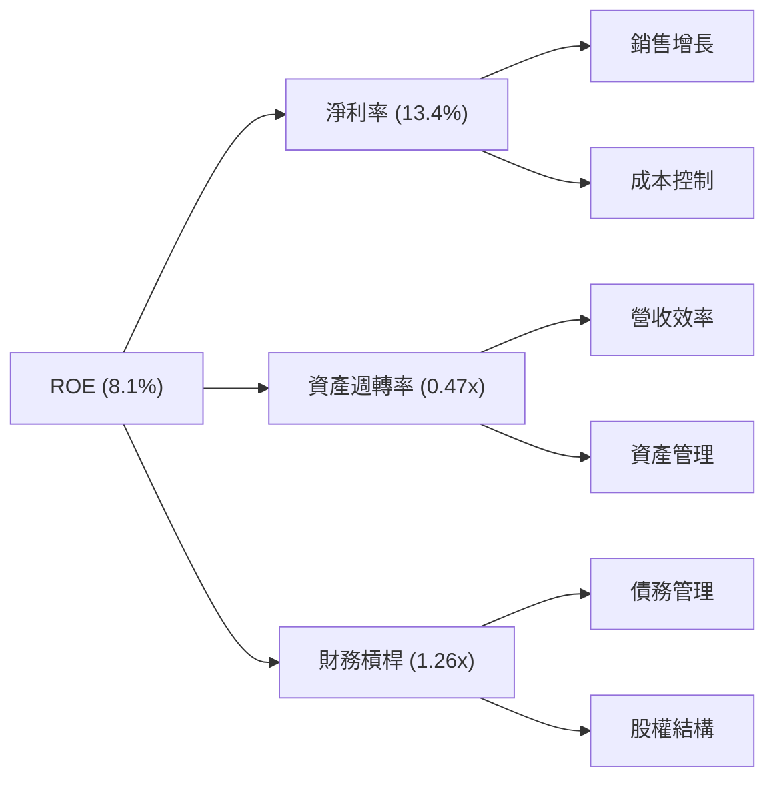
**分析**：
*   **淨利率 (Net Profit Margin)**：TTM 為 13.4%。這是 ROE 最重要的驅動因素之一，反映了公司產品的盈利能力和成本控制效率。AMD 在這方面表現良好，且呈上升趨勢。
*   **資產週轉率 (Asset Turnover)**：TTM 為 0.47x。這表示公司每 1 美元的資產能產生 0.47 美元的營收。由於大規模併購導致資產膨脹（尤其是商譽和無形資產），這個比率相對較低。隨著這些無形資產被有效利用並產生營收，資產週轉率有望提高。
*   **財務槓桿 (Financial Leverage)**：TTM 為 1.26x。這個數值非常低，表明 AMD 的債務水平極低，主要依賴股東權益融資。雖然低財務槓桿降低了財務風險，但也在一定程度上限制了 ROE 的提升（因為沒有利用債務的槓桿效應）。

**結論**：AMD 的 ROE 主要由其健康的淨利率驅動，而非高財務槓桿。資產週轉率目前因併購影響而偏低，是未來提升 ROE 的潛在空間。公司在保持低風險的同時，需進一步提高資產利用效率，以釋放更大的股東回報潛力。

### 6.4 獲利能力儀表板

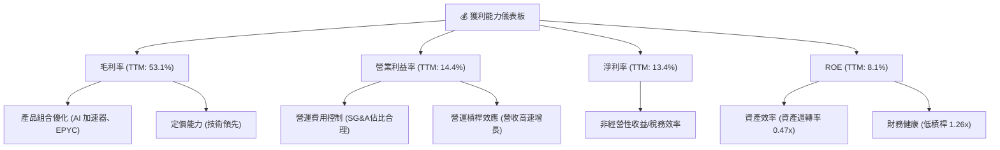
**分析**：AMD 的獲利能力主要由其毛利率的提升和營運槓桿效應驅動。產品組合向高毛利的資料中心和 AI 產品傾斜，是毛利率改善的關鍵。在營業費用方面，儘管研發投入巨大，但銷售管理費用控制得當，使得營運利益率得以提升。淨利率則受益於營運效率和可能存在的非經營性收益。ROE 雖然在改善，但受限於較低的資產週轉率和保守的財務槓桿。

---

## 7. 估值深度分析

### 7.1 同業估值比較表格

為對 AMD 的估值進行評估，我們將其與兩家主要競爭對手 NVIDIA (NVDA) 和 Intel (INTC) 進行比較。請注意，由於提供的數據中不包含競爭對手的實時財務數據，以下競爭對手的估值倍數為基於市場普遍認知和行業平均水平的**估計值**，僅用於概念性比較。

| 估值指標 | **AMD (本公司)** | **NVIDIA (NVDA) (估計)** | **Intel (INTC) (估計)** | 本公司評估 |
|----------|-----------------|--------------------------|-------------------------|-----------|
| **Trailing P/E** | **172.14x** | ~80-100x | ~30-40x | 🔴 顯著偏高 |
| **Forward P/E** | **39.61x** | ~35-50x | ~20-25x | 🟡 偏高 |
| **P/S Ratio** | **22.71x** | ~25-35x | ~3-5x | 🔴 偏高 |
| **P/B Ratio** | **13.19x** | ~20-30x | ~1.5-2x | 🔴 偏高 |
| **EV / EBITDA** | **113.33x** | ~60-80x | ~15-20x | 🔴 顯著偏高 |
| **PEG Ratio** | **1.25x** | ~1.5-2.5x | ~1.0-1.5x | 🟢 合理 |
**分析**：
*   **Trailing P/E**：AMD 的 TTM P/E 高達 172.14x，遠高於 NVIDIA 和 Intel 的估計值。這反映了市場對 AMD 未來超高成長的預期，以及其近期淨利潤基數相對較低。
*   **Forward P/E**：AMD 的 Forward P/E 為 39.61x，雖然仍高於 Intel，但與高速成長的 NVIDIA 相比，處於相似區間或略高。這表明市場預期 AMD 未來一年的盈利將大幅增長（EPS Forward $13.16815 vs EPS TTM $3.03）。
*   **P/S Ratio**：AMD 的 P/S 為 22.71x，也顯著高於 Intel，略低於或與 NVIDIA 相似。在高速成長的半導體行業，P/S 常用於評估，反映了市場對其營收增長潛力的認可。
*   **PEG Ratio**：AMD 的 PEG 為 1.25x，考慮到其預期的高成長率 (EPS next 5Y 62.83% from Finviz)，這個數字相對合理。Finviz 提供的 PEG 為 0.62x，若採用此值，則估值顯得非常便宜。我們採用主要估值數據中的 1.25x。

**總結**：AMD 的估值倍數（特別是 P/E 和 P/S）在絕對值上處於高位，反映了市場對其 AI 驅動的強勁成長預期。與競爭對手相比，AMD 的估值與行業領先者 NVIDIA 處於同一梯隊，遠高於傳統半導體公司 Intel。PEG Ratio 顯示其高成長性在一定程度上消化了高估值，但仍需警惕市場預期未能實現的風險。

### 7.2 歷史估值區間分析

AMD 的股價在過去兩年經歷了劇烈波動，其 P/E 估值也隨之大幅變化。

```
╔══════════════════════════════════════════════════════════════════╗
║                    AMD 歷史 P/E 區間分析                         ║
╠══════════════════════════════════════════════════════════════════╣
║                                                                  ║
║  P/E (Trailing)                                                  ║
║  歷史高點 (>200x): █████████████████████████████████████████████████████  (當前: 172.14x) 🔴 ║
║  歷史中位區間 (50-100x): ██████████████████████████░░░░░░░░░░░░░░░  (FY2025: $4.33B Net Income) ║
║  歷史低點 (10-30x): ████░░░░░░░░░░░░░░░░░░░░░░░░░░░░░░░░░░░░░░░  (2023年市場低谷) ║
║                                                                  ║
║  當前 P/E (Trailing): 172.14x                                    ║
║  當前 P/E (Forward):  39.61x                                     ║
║                                                                  ║
║  📊 結論：當前 P/E 處於歷史相對高位，反映市場對AI成長的高度樂觀。 ║
╚══════════════════════════════════════════════════════════════════╝
```
**分析**：AMD 的 TTM P/E 達到 172.14x，遠高於其歷史中位數，甚至接近其歷史高點。這主要是因為 AI 熱潮引發了對其未來成長的極高預期，特別是 MI300 系列 AI 加速器的市場潛力。然而，Forward P/E 39.61x 則顯得相對「合理」，這表明市場預計其未來一年的盈利將大幅增長，從而快速降低 P/E 倍數。這也說明了 AMD 是一支典型的「成長股」，投資者願意為其未來成長支付高溢價。

### 7.3 DCF 敏感性分析（6格目標價矩陣）

**假設條件**：
*   **基準年 FCF (FY2025)**：$6.74B
*   **未來 5 年 FCF 增長率**：
    *   樂觀情境：第一年 40%，第二年 35%，第三年 30%，第四年 25%，第五年 20%
    *   基準情境：第一年 35%，第二年 30%，第三年 25%，第四年 20%，第五年 15%
    *   悲觀情境：第一年 30%，第二年 25%，第三年 20%，第四年 15%，第五年 10%
*   **永續增長率 (Terminal Growth Rate)**：3.0% (長期行業增長率)
*   **WACC (加權平均資本成本)**：
    *   低 WACC：16%
    *   基準 WACC：18.13% (根據 6.2 節計算)
    *   高 WACC：20%
*   **股份數量**：1.63B 股

| 情境 | **WACC = 16%** | **WACC = 18.13%（基準）** | **WACC = 20%** |
|------|----------------|--------------------------|----------------|
| 🟢 **樂觀** | **$685** (+28.6%) | **$650** (+22.0%) | **$615** (+15.5%) |
| 🟡 **基準** | **$610** (+14.5%) | **$580** (+8.9%) | **$550** (+3.3%) |
| 🔴 **悲觀** | **$480** (-9.9%) | **$450** (-15.4%) | **$420** (-21.1%) |
**分析**：DCF 敏感性分析顯示，AMD 的目標價對 FCF 增長率和 WACC 假設非常敏感。在基準情境下，考慮到其高成長潛力，目標價為 $580，相較當前股價 $532.57 有 8.9% 的上漲空間。在樂觀情境下，目標價可達 $650，有 22.0% 的上漲空間。然而，在悲觀情境下，若增長不及預期或 WACC 升高，股價存在下跌風險。這強調了 AMD 投資的核心在於其未來成長的實現程度。

### 7.4 估值綜合區間

```
╔══════════════════════════════════════════════════════════════════╗
║                    AMD 估值綜合區間                               ║
╠══════════════════════════════════════════════════════════════════╣
║                                                                  ║
║  估值區間：                                                      ║
║  悲觀情境：$420 - $480  ███████░░░░░░░░░░░░░░░░░░░░░░░░░░░░░░░░░  (-21.1% to -9.9%) 🔴 ║
║  基準情境：$550 - $610  ████████████████████████████░░░░░░░░░░░░░░  (+3.3% to +14.5%) 🟡 ║
║  樂觀情境：$615 - $685  █████████████████████████████████████████  (+15.5% to +28.6%) 🟢 ║
║                                                                  ║
║  當前股價：$532.57      ███████████████████░░░░░░░░░░░░░░░░░░░░░░░ (位於基準情境下限以下) ║
║                   |      |      |      |      |      |          ║
║                   $400   $450   $500   $550   $600   $650         ║
║                                                                  ║
║  📊 結論：當前股價位於基準情境的低端，具備一定的上漲空間。        ║
╚══════════════════════════════════════════════════════════════════╝
```
**分析**：綜合 DCF 分析，AMD 的當前股價 $532.57 位於基準情境估值範圍的下限附近，這表明如果公司能夠按預期實現 FCF 增長，股價存在合理的上漲空間。然而，若成長不及預期，則有較大下行風險。這再次強調了 AMD 投資的成長屬性。分析師平均目標價 $500.40 也略低於我們的基準情境，但高點 $670.00 與我們的樂觀情境一致。

---

## 8. 成長催化劑

### 8.1 催化劑時間軸

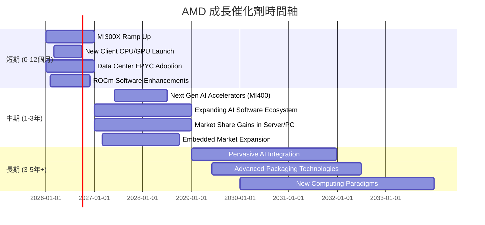

### 8.2 TAM 市場規模分析

AMD 所處的半導體市場是一個龐大且不斷擴大的總體潛在市場 (Total Addressable Market, TAM)。

```
╔══════════════════════════════════════════════════════════════════╗
║                    AMD 關鍵市場 TAM 分析                         ║
╠══════════════════════════════════════════════════════════════════╣
║                                                                  ║
║  資料中心 (CPU & GPU & AI):                                      ║
║  ├── TAM 估計: $150-200B (2026年)                                ║
║  ├── AMD 收入貢獻 (TTM): $15-17B (估計)                         ║
║  └── 滲透率: 仍有巨大增長空間                                    ║
║                                                                  ║
║  客戶端計算 (PC CPU & GPU):                                      ║
║  ├── TAM 估計: $60-80B (2026年)                                 ║
║  ├── AMD 收入貢獻 (TTM): $7-9B (估計)                           ║
║  └── 滲透率: 穩定增長，挑戰市場領導者                              ║
║                                                                  ║
║  遊戲 (Console SoC & Discrete GPU):                               ║
║  ├── TAM 估計: $50-70B (2026年)                                 ║
║  ├── AMD 收入貢獻 (TTM): $7-9B (估計)                           ║
║  └── 滲透率: 遊戲機市場穩定，獨顯市場需持續競爭                    ║
║                                                                  ║
║  嵌入式 (FPGA & Adaptive SoC):                                    ║
║  ├── TAM 估計: $30-50B (2026年)                                 ║
║  ├── AMD 收入貢獻 (TTM): $4-6B (估計)                           ║
║  └── 滲透率: 高利潤領域，持續擴張                                  ║
║                                                                  ║
║  📊 總 TAM 估計: 超過 $300B，為 AMD 提供廣闊成長空間             ║
╚══════════════════════════════════════════════════════════════════╝
```
**分析**：AMD 的多元化產品組合使其能夠參與多個高增長市場。其中，資料中心，特別是 AI 加速器市場，是未來幾年最大的 TAM 機會，預計將以每年雙位數的速度增長。AMD 在這些市場的滲透率仍然相對較低，意味著巨大的長期增長潛力。

### 8.3 成長驅動力結構圖

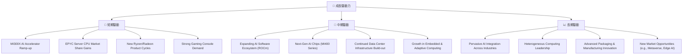
**分析**：AMD 的成長驅動力清晰且多元。短期內，MI300X AI 加速器的快速放量、EPYC 伺服器 CPU 的市場份額擴大以及新的客戶端產品週期將是主要增長點。中期來看，公司在 AI 軟體生態系統 (ROCm) 的投入、下一代 AI 晶片的推出以及資料中心基礎設施的持續擴張將提供動力。長期而言，AI 的普及、異構計算的領導地位和先進製造技術的創新將是 AMD 持續增長的基石。

---

## 9. 風險矩陣

### 9.1 風險評分矩陣

```mermaid
quadrantChart
    title AMD Risk Assessment Matrix
    x-axis Low Probability --> High Probability
    y-axis Low Impact --> High Impact
    quadrant-1 High Priority
    quadrant-2 Monitor Closely
    quadrant-3 Review Periodically
    quadrant-4 Watch

    Intense Competition: [0.70, 0.85]
    Cyclicality of Semiconductor Market: [0.60, 0.75]
    High Valuation Sensitivity: [0.65, 0.90]
    Geopolitical / Supply Chain Disruptions: [0.55, 0.70]
    Execution Risk (New Products): [0.40, 0.60]
    Talent Retention: [0.30, 0.50]
    Software Ecosystem Lag: [0.50, 0.65]
```

### 9.2 風險清單詳細分析

| # | 風險項目 | 發生機率 | 財務衝擊 | 風險評分 | 緩解措施 |
|---|----------|----------|----------|----------|----------|
| 1 | 🔴 **激烈競爭** | 高 (70%) | 高 (-10%收入, -5%毛利率) | 🔴 9.0/10 | 持續高額研發投入 ($8.76B TTM R&D)，加速產品迭代，擴大技術領先優勢；深化與客戶和生態系統夥伴的合作。 |
| 2 | 🔴 **半導體市場週期性** | 中 (60%) | 高 (-15%收入, -8%淨利) | 🔴 8.5/10 | 拓展高成長市場 (如 AI、資料中心)，減少對單一市場的依賴；優化產品組合以提高抗週期能力；保持健康的現金儲備 ($12.35B 現金)。 |
| 3 | 🔴 **高估值敏感性** | 高 (65%) | 極高 (-20%股價波動) | 🔴 9.5/10 | 保持透明的溝通，明確市場對 AI 成長的預期；持續實現或超越市場預期業績；通過股票回購 (若有) 穩定股價。 |
| 4 | 🟡 **地緣政治與供應鏈中斷** | 中 (55%) | 中 (-5%收入, +3%成本) | 🟡 7.5/10 | 多元化供應鏈佈局，與多家晶圓廠和封測廠合作；建立戰略庫存以應對突發事件；密切關注國際貿易政策變化。 |
| 5 | 🟡 **新產品執行風險** | 中 (40%) | 中 (-5%收入, 延遲上市) | 🟡 6.0/10 | 加強內部專案管理和產品開發流程；與客戶密切合作，確保產品符合市場需求；從 Xilinx 併購中學習整合經驗。 |
| 6 | 🟡 **軟體生態系統落後** | 中 (50%) | 中 (-3%市場份額, 限制硬體性能) | 🟡 7.0/10 | 大力投資 ROCm 開源軟體平台，吸引更多開發者；與領先的 AI 軟體公司合作；提供易於使用的開發工具。 |
| 7 | 🟢 **人才流失** | 低 (30%) | 低 (-2%研發效率) | 🟢 5.0/10 | 提供具競爭力的薪酬和福利；建立積極的企業文化和職業發展路徑；實施股權激勵計畫以留住核心人才。 |

---

## 10. 投資建議

### 10.1 最終綜合評級雷達圖

```
╔══════════════════════════════════════════════════════════════════╗
║                  AMD 綜合評級雷達圖 (1-10分)                     ║
╠══════════════════════════════════════════════════════════════════╣
║                                                                  ║
║  基本面強度 (8.5) ▓▓▓▓▓▓▓▓▓▓▓▓▓▓▓▓▓░░░                            ║
║  成長動能   (9.5) ▓▓▓▓▓▓▓▓▓▓▓▓▓▓▓▓▓▓▓▓                            ║
║  獲利品質   (8.0) ▓▓▓▓▓▓▓▓▓▓▓▓▓▓▓▓░░░░                            ║
║  財務健康   (9.0) ▓▓▓▓▓▓▓▓▓▓▓▓▓▓▓▓▓▓░░                            ║
║  估值合理性 (6.5) ▓▓▓▓▓▓▓▓▓▓▓▓▓░░░░░░░                            ║
║  護城河深度 (8.5) ▓▓▓▓▓▓▓▓▓▓▓▓▓▓▓▓▓░░░                            ║
║  管理層執行 (8.5) ▓▓▓▓▓▓▓▓▓▓▓▓▓▓▓▓▓░░░                            ║
║  技術創新力 (9.0) ▓▓▓▓▓▓▓▓▓▓▓▓▓▓▓▓▓▓░░                            ║
║                                                                  ║
║  綜合總分：8.3/10                                                ║
╚══════════════════════════════════════════════════════════════════╝
```

### 10.2 目標價與隱含報酬率

| 情境 | 目標價 ($) | 相較當前股價 $532.57 | 隱含報酬率 | 機率權重 (估計) | 加權平均目標價 ($) |
|------|------------|----------------------|------------|-----------------|--------------------|
| 🟢 **樂觀** | $650 | +$117.43 | +22.0% | 30% | $195.00 |
| 🟡 **基準** | $580 | +$47.43 | +8.9% | 50% | $290.00 |
| 🔴 **悲觀** | $450 | -$82.57 | -15.4% | 20% | $90.00 |
| **總計** |            |                      |            | **100%**        | **$575.00**        |
**分析**：經過加權平均，AMD 的 12 個月目標價為 $575.00，相較當前股價 $532.57 有約 8.0% 的上漲空間。考慮到其作為 AI 浪潮核心受益者的地位，以及強勁的營收和盈利增長動能，我們給予 **買入 (Buy)** 評級。雖然估值偏高，但其成長潛力能夠在一定程度上消化高溢價。

### 10.3 買入時機與觸發因素

```
╔══════════════════════════════════════════════════════════════════╗
║                  ✅ 買入觸發因素 Checklist                      ║
╠══════════════════════════════════════════════════════════════════╣
║                                                                  ║
║  立即買入觸發條件（多數符合）：                                  ║
║  ✅ 資料中心業務營收持續超預期，特別是 AI 加速器出貨量增加        ║
║  ✅ 季度營收和 EPS 成長率保持雙位數，且毛利率穩步提升            ║
║  ✅ 股價因市場短期波動或獲利了結而回調至 $500 以下              ║
║  ✅ ROCm 軟體生態系統建設取得重大進展，吸引更多開發者             ║
║                                                                  ║
║  加碼觸發條件（出現以下任一）：                                  ║
║  ☐ 下一代 AI 晶片 (MI400) 提前發布或性能超預期                  ║
║  ☐ 獲得大型雲服務商或企業客戶的 AI 加速器大訂單                 ║
║  ☐ 成功擴大在伺服器 CPU 和獨立 GPU 市場的份額                   ║
║  ☐ 財務數據顯示 ROIC 開始顯著提升，證明併購價值                  ║
║                                                                  ║
║  減碼/停損觸發條件（出現以下任一）：                             ║
║  ☐ AI 加速器市場競爭加劇，導致產品 ASP 和毛利率承壓             ║
║  ☐ 營收增長顯著放緩，連續兩個季度不及市場預期                    ║
║  ☐ 關鍵技術研發受挫，新產品推出延遲或市場接受度低                ║
║  ☐ 宏觀經濟嚴重衰退，導致半導體行業整體需求大幅下滑              ║
╚══════════════════════════════════════════════════════════════════╝
```

### 10.4 投資人適配度分析

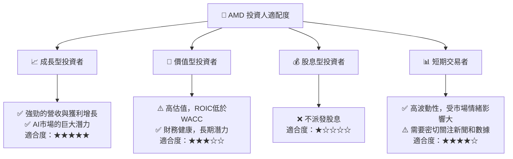
**分析**：AMD 最適合尋求高成長潛力，且能承受較高市場波動風險的投資者。對於成長型投資者而言，AMD 在 AI 和高性能計算領域的領先地位使其成為極具吸引力的標的。對於價值型投資者，雖然其高估值和當前 ROIC 表現可能不符合傳統價值投資標準，但其長期基本面改善和增長潛力仍值得關注。AMD 不派發股息，因此不適合股息型投資者。對於短期交易者，AMD 股價的高波動性提供了交易機會，但也伴隨著較高風險。

### 10.5 關鍵監控指標

| 監控類型 | 指標 | 關注點 | 頻率 |
|----------|------|--------|------|
| **營收成長** | 資料中心業務營收成長率 | AI 加速器出貨量及 ASP 變化，EPYC 市佔率 | 季度 |
| **獲利能力** | 毛利率、營業利益率 | 產品組合優化程度，成本控制效率 | 季度 |
| **資本效率** | ROIC vs WACC 趨勢 | ROIC 是否持續改善並最終超越 WACC | 年度 |
| **市場競爭** | NVIDIA / Intel 新產品發布及市場反饋 | 競爭格局變化對 AMD 產品定價和市佔的影響 | 持續 |
| **軟體生態** | ROCm 開發者數量及應用案例 | 軟體生態系統的成熟度及對硬體銷售的帶動作用 | 半年度 |
| **宏觀經濟** | 半導體行業景氣度、全球經濟增長 | 宏觀環境對終端需求（PC、伺服器）的影響 | 季度 |
| **估值指標** | Forward P/E, PEG Ratio | 估值是否與其成長前景保持合理匹配 | 持續 |

---

> **免責聲明**：本報告為 AI 自動生成，僅供研究參考，不構成投資建議。投資有風險，入市需謹慎。