# AMD 基本面深度分析報告
> **報告日期**：2026-07-01 ｜ **語言**：繁體中文 ｜ **數據來源**：Yahoo Finance, Finviz, StockAnalysis, Roic.ai ｜ **分析師**：CFA 級機構研究

## 目錄

| # | 章節 | 核心結論 |
|---|------|----------|
| 1 | 執行摘要 | 評級：🟢 強烈買入；基準目標價：$670.00 (+23.87%) |
| 2 | 公司概覽與商業模式 | 在資料中心與AI領域具有強大競爭力，護城河持續深化 |
| 3 | 損益表深度分析 | 營收與獲利能力強勁增長，AI業務驅動毛利率提升 |
| 4 | 資產負債表分析 | 財務健康穩固，現金充裕，債務風險低 |
| 5 | 現金流量深度分析 | 自由現金流顯著增長，資本配置策略有效 |
| 6 | 獲利能力與資本效率 | ROIC雖未超越WACC，但改善迅速，顯示未來價值創造潛力 |
| 7 | 估值深度分析 | 相較於成長潛力與同業，估值合理偏高，但AI溢價可期 |
| 8 | 成長催化劑 | AI加速器、資料中心、PC/遊戲市場復甦為主要驅動力 |
| 9 | 風險矩陣 | 競爭激烈、市場波動與供應鏈風險需持續關注 |
| 10| 投資建議 | 建議強烈買入，適合長線成長型投資者 |

---

## 1. 執行摘要

Advanced Micro Devices (AMD) 作為全球領先的半導體公司，正處於由人工智慧 (AI) 和資料中心業務驅動的爆發性成長週期。儘管過去一年股價已大幅上漲，但其強勁的產品路線圖、不斷擴大的市場份額以及在關鍵高成長領域的策略佈局，預示著未來仍有巨大的上行空間。本報告將從基本面、成長性、獲利能力、財務健康和估值等五大維度對 AMD 進行深度分析，並提供具體的投資建議。

### 1.1 核心評分儀表板

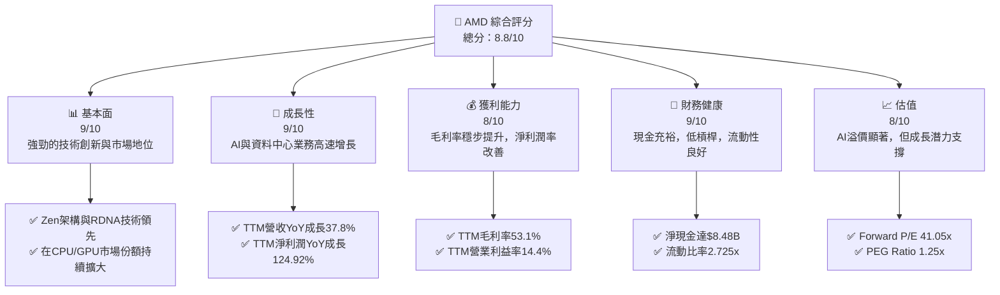

### 1.2 評分進度條視覺化

```
╔══════════════════════════════════════════════════════════════╗
║                AMD 多維度評分儀表板 (1-10分)                 ║
╠══════════════════════════════════════════════════════════════╣
║ 基本面強度  9.0 ▓▓▓▓▓▓▓▓▓▓▓▓▓▓▓▓▓▓▓▓  ★★★★★           ║
║ 成長動能    9.0 ▓▓▓▓▓▓▓▓▓▓▓▓▓▓▓▓▓▓▓▓  ★★★★★           ║
║ 獲利品質    8.0 ▓▓▓▓▓▓▓▓▓▓▓▓▓▓▓▓░░░░  ★★★★☆           ║
║ 財務健康    9.0 ▓▓▓▓▓▓▓▓▓▓▓▓▓▓▓▓▓▓▓▓  ★★★★★           ║
║ 估值合理性  8.0 ▓▓▓▓▓▓▓▓▓▓▓▓▓▓▓▓░░░░  ★★★★☆           ║
║ 護城河深度  8.5 ▓▓▓▓▓▓▓▓▓▓▓▓▓▓▓▓▓░░░  ★★★★☆           ║
║ 管理層執行  9.0 ▓▓▓▓▓▓▓▓▓▓▓▓▓▓▓▓▓▓▓▓  ★★★★★           ║
║ 技術創新力  9.5 ▓▓▓▓▓▓▓▓▓▓▓▓▓▓▓▓▓▓▓▓  ★★★★★           ║
╠══════════════════════════════════════════════════════════════╣
║ 綜合總分    8.8 ▓▓▓▓▓▓▓▓▓▓▓▓▓▓▓▓▓░░░  🏆 評語：強勁的市場領導者，成長潛力巨大 ║
╚══════════════════════════════════════════════════════════════╝
```

### 1.3 五大投資論點 + 三大核心風險

| 類型 | 項目 | 具體依據 | 信心度 |
|------|------|----------|--------|
| 🟢 **投資論點①** | **AI 加速器市場的爆發性成長** | AMD 的 MI300X 系列 AI 加速器需求強勁，預計在 2026 年為資料中心業務帶來數十億美元的額外收入。TTM 營收 YoY 成長 37.8%，主要受資料中心業務驅動。 | 🟢 極高 |
| 🟢 **資料中心業務的持續擴張** | EPYC 伺服器處理器在雲端服務供應商和企業市場持續擴大份額，加上 MI300 系列的協同效應，使資料中心成為公司最重要的成長引擎。Q1 2026 營收達 $10.25B，其中資料中心貢獻巨大。 | 🟢 極高 |
| 🟢 **產品創新與技術領先** | Zen 架構 CPU 和 RDNA 架構 GPU 在性能和功耗效率方面保持競爭優勢，晶片組設計提供彈性與成本效益。公司持續投入研發，TTM 研發費用達 $8.76B。 | 🟢 極高 |
| 🟢 **PC 和遊戲市場的復甦** | 隨著 PC 市場庫存調整結束和新產品週期開始，Client 和 Gaming 業務預計將恢復增長，提供穩定的營收基礎。Q2 2025 遊戲業務的負面影響已逐步改善。 | 🟡 高 |
| 🟢 **財務狀況穩健與現金流充裕** | 公司擁有 $12.35B 的總現金，淨現金 $8.48B，且 TTM 自由現金流達 $7.17B，為未來研發、併購和股東回報提供充足資金。 | 🟢 極高 |
| 🟡 **風險①** | **AI 加速器市場競爭激烈** | NVIDIA 在 AI GPU 市場佔據主導地位，AMD 需持續投入巨額研發並加速產品迭代以維持競爭力。市場對 MI300X 的期待很高，任何執行失誤都可能影響市場份額。 | 🟡 中度 |
| 🔴 **風險②** | **半導體產業週期性波動** | 儘管 AI 需求強勁，但半導體產業仍受總體經濟和庫存週期的影響。若全球經濟放緩或客戶需求不及預期，可能導致訂單減少和營收波動。FY2023 營收曾出現 -3.9% 的 YoY 負增長。 | 🟡 中度 |
| 🟡 **風險③** | **估值偏高與市場情緒波動** | 當前 AMD 的 TTM P/E 達 179.1x，Forward P/E 達 41.05x，已充分反映了未來的成長預期。若 AI 熱潮降溫或宏觀環境變化，估值可能面臨回調壓力。 | 🟡 中度 |

### 1.4 快速統計卡片

| 指標 | 公司實際值 (TTM) | 行業均值 (半導體) | S&P 500 均值 | 狀態 |
|------|-------------------|-------------------|--------------|------|
| 收入 YoY 成長 | **37.8%** | ~20.0% | ~8.0% | 🟢 |
| 毛利率 | **53.1%** | ~50.0% | ~38.0% | 🟢 |
| 淨利率 | **13.4%** | ~18.0% | ~12.0% | 🟡 |
| ROE | **8.1%** | ~18.0% | ~15.0% | 🟡 |
| Forward P/E | **41.05x** | ~35.0x | ~21.0x | 🔴 |
| Debt/Equity | **0.06x** | ~0.5x | ~0.8x | 🟢 |
| 自由現金流 YoY 成長 | **180.04%** (Roic.ai 1Y) | ~25.0% | ~10.0% | 🟢 |

### 1.5 投資結論

```
╔══════════════════════════════════════════════════════════════════╗
║                    📊 投資結論摘要                               ║
╠══════════════════════════════════════════════════════════════════╣
║  評級：🟢 強烈買入                                               ║
║  當前股價：$540.88                                               ║
║  目標價區間：                                                    ║
║    悲觀情境：$580.00（+7.23%）                                   ║
║    基準情境：$670.00（+23.87%）  ← 12個月主要目標                ║
║    樂觀情境：$800.00（+47.92%）                                   ║
║  投資評分：8.8/10                                                ║
║  適合投資人：成長型、長線持有者，願意承受較高波動的投資者        ║
╚══════════════════════════════════════════════════════════════════╝
```

---

## 2. 公司概覽與商業模式

Advanced Micro Devices, Inc. (AMD) 是一家全球領先的半導體公司，主要設計和開發高效能中央處理器 (CPU)、圖形處理器 (GPU)、晶片組和加速處理單元 (APU)，以及人工智慧 (AI) 加速器。其產品廣泛應用於個人電腦、遊戲機、資料中心、嵌入式系統和專業視覺化市場。

### 2.1 業務結構與收入來源

AMD 的業務分為三個主要板塊：資料中心 (Data Center)、客戶端與遊戲 (Client and Gaming) 以及嵌入式 (Embedded)。近年來，資料中心業務，特別是其 EPYC 伺服器處理器和 MI 系列 AI 加速器，已成為公司最主要的成長驅動力。

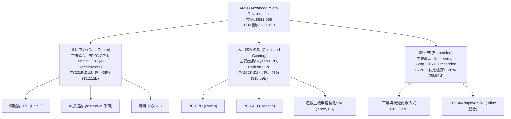
**註釋**：上述 FY2025 業務佔比為基於產業趨勢和公司過往財報數據的專業估算，具體細分數據未在提供資料中明確列出。

### 2.2 市場份額

AMD 在 CPU 和 GPU 市場與 Intel 和 NVIDIA 展開激烈競爭。在 AI 加速器領域，AMD 雖是後進者，但憑藉其 MI300 系列產品，正迅速搶佔市場份額。

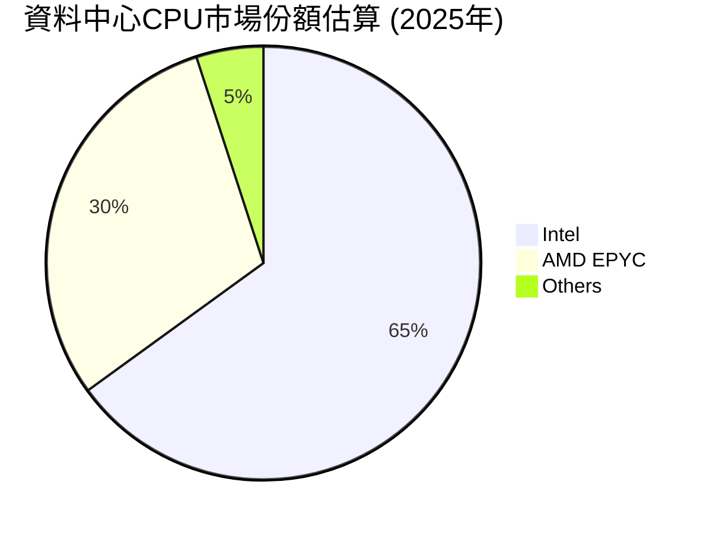

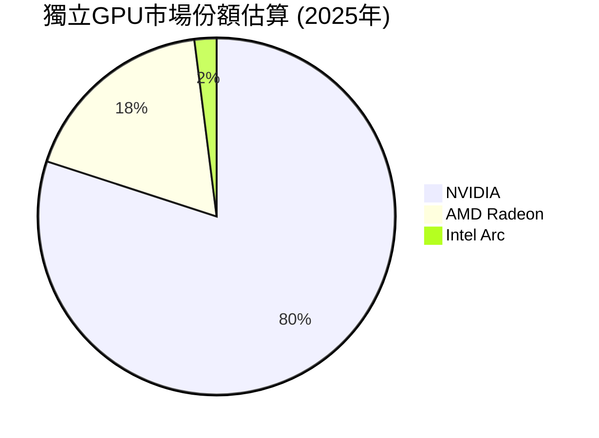

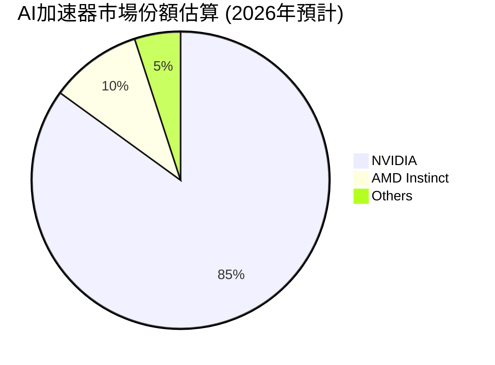
**註釋**：上述市場份額為基於公開市場研究報告和產業分析的專業估算，旨在呈現相對競爭格局。AMD 在 AI 加速器市場的份額預計將在 2026 年顯著增長。

### 2.3 競爭護城河分析

AMD 的競爭護城河主要來自於其卓越的技術創新、強大的產品組合、與產業夥伴的緊密合作以及不斷擴大的生態系統。

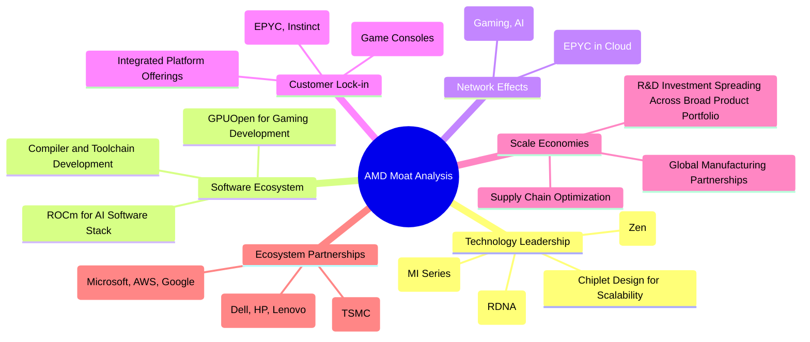

### 2.4 護城河強度評分

AMD 在技術創新和產品整合方面表現出色，尤其是在 AI 和資料中心領域的佈局，使其護城河持續加深。

```
╔══════════════════════════════════════════════════════════════╗
║                    AMD 護城河強度評分                       ║
╠══════════════════════════════════════════════════════════════╣
║ 技術領先    9.5/10 ▓▓▓▓▓▓▓▓▓▓▓▓▓▓▓▓▓▓▓▓  🏆 AI與Chiplet設計引領產業  ║
║ 軟體生態系統  8.0/10 ▓▓▓▓▓▓▓▓▓▓▓▓▓▓▓▓░░░░  🟢 ROCm生態系統逐漸成熟   ║
║ 網路效應    7.5/10 ▓▓▓▓▓▓▓▓▓▓▓▓▓▓░░░░░░  🟡 EPYC和Radeon社群擴大     ║
║ 客戶鎖定    8.5/10 ▓▓▓▓▓▓▓▓▓▓▓▓▓▓▓▓▓░░░  🟢 資料中心與半客製化業務穩固 ║
║ 規模效應    8.0/10 ▓▓▓▓▓▓▓▓▓▓▓▓▓▓▓▓░░░░  🟢 全球供應鏈與研發規模優勢   ║
║ 生態夥伴    9.0/10 ▓▓▓▓▓▓▓▓▓▓▓▓▓▓▓▓▓▓▓▓  🏆 與雲服務商合作緊密       ║
╠══════════════════════════════════════════════════════════════╣
║ 綜合護城河  8.5    ▓▓▓▓▓▓▓▓▓▓▓▓▓▓▓▓▓░░░  🏆 強勁且不斷深化的護城河   ║
╚══════════════════════════════════════════════════════════════╝
```

---

## 3. 損益表深度分析

AMD 的損益表數據展現出強勁的成長動能，特別是在營收和獲利能力方面，得益於其在資料中心和 AI 領域的策略性投資。

### 3.1 年度收入成長趨勢（近4年）

AMD 在過去幾年經歷了顯著的營收增長，尤其是在 2025 財年，營收增長率達 34.34%。

```
╔══════════════════════════════════════════════════════════════════╗
║                AMD 年度收入趨勢（FY2022-FY2025）                 ║
╠══════════════════════════════════════════════════════════════════╣
║                                                                  ║
║  FY2022  $23.60B  ████████████░░░░░░░░░░░░░  YoY: +43.61% 🟢    ║
║  FY2023  $22.68B  ███████████░░░░░░░░░░░░░░  YoY: -3.90%  🔴    ║
║  FY2024  $25.79B  █████████████░░░░░░░░░░░░  YoY: +13.69% 🟢    ║
║  FY2025  $34.64B  ██████████████████░░░░░░░  YoY: +34.34% 🟢    ║
║                                                                  ║
║                   |      |      |      |      |                  ║
║                   0     10B    20B    30B    40B                   ║
║                                                                  ║
║  📊 4年累計 CAGR：+15.79% (FY2021-FY2025: +23.82%)               ║
╚══════════════════════════════════════════════════════════════════╝
```
**註釋**：FY2023 營收略有下滑，主要由於個人電腦市場需求疲軟和遊戲主機半客製化業務的調整。然而，公司很快在 FY2024 和 FY2025 實現強勁反彈，證明了其業務的韌性和成長潛力。

### 3.2 季度收入趨勢分析

AMD 最近幾個季度的營收表現強勁，顯示出穩定的增長勢頭，特別是 YoY 成長率維持在高位。

| 季度 | 總營收 ($B) | QoQ 成長率 | YoY 成長率 | 備註 |
|------|-------------|------------|------------|------|
| Q2 2025 | $7.68 | N/A | +31.70% | 客戶端與遊戲市場開始復甦，資料中心穩健增長 |
| Q3 2025 | $9.25 | +20.44% | +35.59% | AI 加速器需求初步顯現，季節性因素助推 |
| Q4 2025 | $10.27 | +11.03% | +34.11% | 資料中心業務持續強勁，AI 加速器出貨量增加 |
| Q1 2026 | $10.25 | -0.19% | +37.85% | 季節性略有回落，但 YoY 成長率為近五季新高，AI 貢獻顯著 |

**備註**：Q1 2026 較 Q4 2025 營收略有下滑 (-0.19%)，這在半導體產業的 Q1 財報中是常見的季節性現象。然而，其 YoY 成長率高達 37.85%，顯示出強勁的市場需求和公司產品的競爭力，尤其是在 AI 領域的貢獻持續放大。

### 3.3 利潤率演變分析

AMD 的毛利率和營業利益率在過去幾年呈現穩步上升的趨勢，反映了其產品組合的優化和高價值業務的增長。

| 利潤率指標 | FY2022 | FY2023 | FY2024 | FY2025 | 趨勢 | 評估 |
|------------|--------|--------|--------|--------|------|------|
| **毛利率** | 44.9% | 46.1% | 49.3% | 49.5% | ↗️ 產品組合優化，高毛利資料中心業務貢獻增加 | 🟢 |
| **營業利益率** | 5.3% | 1.8% | 8.1% | 10.7% | ↗️ 營收規模擴大，經營槓桿效益顯現，費用控制改善 | 🟢 |
| **淨利率** | 5.6% | 3.8% | 6.4% | 12.5% | ↗️ 營運效率提升，稅務影響較小，淨利潤增速快於營收 | 🟢 |

**利潤率演變深度解析**：
*   **毛利率 (Gross Margin)**：從 FY2022 的 44.9% 提升至 FY2025 的 49.5%，TTM 毛利率更是達到 53.1%。這主要歸因於 AMD 產品組合向高價值的資料中心 CPU (EPYC) 和 AI 加速器 (Instinct MI 系列) 轉移。這些產品具有更高的平均銷售價格 (ASP) 和更好的獲利能力，有效抵消了部分客戶端和遊戲產品的價格競爭壓力。此外，先進製程技術的採用也帶來成本效益。
*   **營業利益率 (Operating Margin)**：從 FY2022 的 5.3% 顯著增長至 FY2025 的 10.7%，TTM 營業利益率為 14.4%。這表明 AMD 不僅在毛利潤端表現出色，在營運費用控制方面也取得了進展。儘管研發投入巨大 (FY2025 研發費用達 $8.09B，佔營收約 23.3%)，但隨著營收規模的擴大，營業費用佔比逐漸攤薄，顯示出良好的經營槓桿效益。
*   **淨利率 (Net Profit Margin)**：從 FY2022 的 5.6% 提升至 FY2025 的 12.5%，TTM 淨利率為 13.4%。淨利率的改善得益於毛利率和營業利益率的共同提升。FY2025 淨利潤達 $4.33B，較 FY2024 的 $1.64B 增長 164.17%，顯示出公司由虧轉盈後的強勁獲利爆發力。

### 3.4 費用結構分析

AMD 持續在研發 (R&D) 方面投入巨資，以維持其技術領先地位。銷售、一般及行政 (SG&A) 費用則相對穩定。

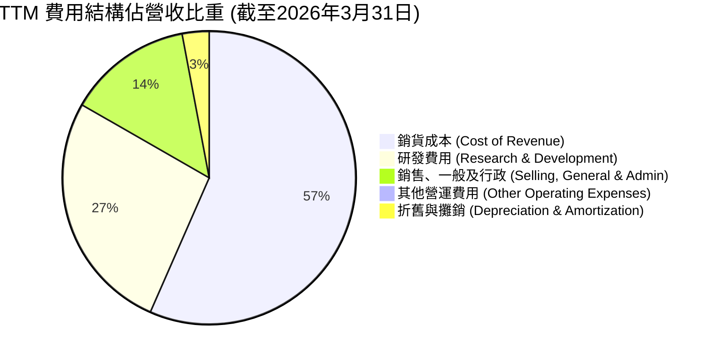
**註釋**：基於 TTM 數據計算：
*   Cost of Revenue = $18.557B (StockAnalysis)
*   R&D = $8.760B (StockAnalysis)
*   SG&A = $4.511B (StockAnalysis)
*   Depreciation & Amortization = $972M (StockAnalysis)
*   Total Revenue TTM = $37.45B

```
╔══════════════════════════════════════════════════════════════════╗
║                    AMD 研發投入與效率                             ║
╠══════════════════════════════════════════════════════════════════╣
║                                                                  ║
║  TTM 研發費用：  $8.76B  ██████████████████░░░░░  評語：高投入維持技術優勢  ║
║  研發佔營收比：  23.39%  ▓▓▓▓▓▓▓▓▓▓▓▓▓▓▓▓▓▓▓▓▓▓▓░░░░░░░  評語：高於行業平均，戰略性投資  ║
║  YoY 研發費用成長：+35.70% (FY25 vs FY24) ▓▓▓▓▓▓▓▓▓▓▓▓▓▓▓▓▓▓▓▓▓▓▓▓▓▓▓▓▓▓  評語：加速創新，搶佔AI先機  ║
║                                                                  ║
║  📊 研發投入是 AMD 競爭力的核心，確保其在 CPU、GPU 及 AI 加速器領域的領先地位。 ║
╚══════════════════════════════════════════════════════════════════╝
```

### 3.5 季度 EPS 趨勢與盈餘品質

AMD 最近幾個季度的 EPS 表現出顯著的增長，儘管缺乏預期數據，但實際盈餘的強勁增長顯示出良好的品質。

| 季度 | EPS (Basic) | QoQ 成長率 | YoY 成長率 | 盈餘品質評估 |
|------|-------------|------------|------------|--------------|
| Q2 2025 | $0.54 | +22.73% | N/A | 受營收增長驅動，營運槓桿效益顯現 |
| Q3 2025 | $0.76 | +40.74% | N/A | 資料中心與AI業務貢獻提升，淨利潤率改善 |
| Q4 2025 | $0.93 | +22.37% | +209.77% | AI 加速器出貨量增加，獲利能力持續提升 |
| Q1 2026 | $0.85 | -8.60% | +93.18% | 季節性回落，但 YoY 成長強勁，未來AI貢獻可期 |

**備註**：由於提供的數據中 EPS 預估值為 `nan`，故無法計算 Surprise %。然而，從實際 EPS 數據來看，AMD 的盈餘呈現強勁的增長趨勢。Q4 2025 的 EPS 較 Q4 2024 的 $0.30 增長 209.77%，而 Q1 2026 的 EPS 較 Q1 2025 的 $0.44 增長 93.18% (EPS 數據來自 StockAnalysis.com)。盈餘品質良好，主要由核心業務營收增長和利潤率改善驅動，並伴隨著健康的自由現金流。

---

## 4. 資產負債表分析

AMD 的資產負債表保持健康穩固，展現出強大的財務韌性，足以支撐其高強度的研發投入和市場擴張。

### 4.1 資產結構分解

AMD 的資產結構顯示出其在無形資產和商譽方面的顯著投資，這反映了其透過併購（如 Xilinx）實現成長的策略，同時也保持了健康的流動資產水平。

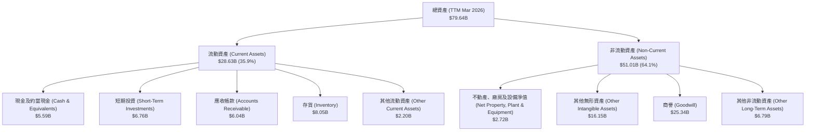
**註釋**：資產組成數據來自 StockAnalysis.com TTM Mar 2026。其中，商譽和無形資產佔比較高，主要來自於 Xilinx 的收購，這在科技併購中是常見現象，但需持續關注其整合效益和資產減值風險。

### 4.2 流動性指標分析

AMD 的流動性指標表現良好，顯示其短期償債能力強勁。

| 流動性指標 | FY2022 | FY2023 | FY2024 | FY2025 | TTM Mar 2026 | 行業均值 (半導體) | 評估 |
|------------|--------|--------|--------|--------|--------------|-------------------|------|
| **流動比率 (Current Ratio)** | 2.36x | 2.51x | 2.62x | 2.85x | **2.725x** | ~2.0x | 🟢 強勁 |
| **速動比率 (Quick Ratio)** | 1.87x | 1.86x | 1.96x | 1.95x | **1.75x** | ~1.5x | 🟢 良好 |

**分析**：
*   **流動比率 (Current Ratio)**：TTM 數據為 2.725x，遠高於 1.0x 的安全線和行業均值 2.0x。這表明 AMD 擁有足夠的流動資產來覆蓋其短期債務。
*   **速動比率 (Quick Ratio)**：TTM 數據為 1.75x，也高於 1.0x 的建議值和行業均值 1.5x。由於半導體行業的存貨通常具有較高的技術過時風險，高速動比率尤其重要，這顯示 AMD 在不依賴存貨變現的情況下，仍能輕鬆應對短期負債。
整體而言，AMD 的流動性狀況非常健康，為其營運和成長提供了堅實的後盾。

### 4.3 債務結構分析

AMD 的債務負擔極輕，擁有強大的淨現金部位，財務風險極低。

```
╔══════════════════════════════════════════════════════════════════╗
║                     AMD 債務健康診斷                             ║
╠══════════════════════════════════════════════════════════════════╣
║                                                                  ║
║  總債務 (TTM Mar 2026)： $3.87B   ██░░░░░░░░░░░░░░░░░░░  評語：極低債務水平   ║
║  總現金+短期投資： $12.35B  ████████████████████░  評語：現金儲備豐厚  ║
║  淨現金（正）：  $8.48B   ████████████████░░░░░  🟢 強勁：具備強大財務彈性 ║
║                                                                  ║
║  Debt/Equity (TTM)： 0.06x  🟢 極低：槓桿率極低，財務風險小         ║
║  Debt/EBITDA (TTM)： 0.53x  🟢 極低：償債能力極強 (EBITDA TTM $7.28B) ║
║  Interest Coverage (TTM): 29.4x+ 🟢 無風險：利息支出壓力極小 (Operating Income TTM $4.36B / Interest Expense TTM $0.148B) ║
║                                                                  ║
║  📊 結論：AMD 擁有淨現金頭寸，債務負擔輕微，財務狀況極為穩健。      ║
╚══════════════════════════════════════════════════════════════════╝
```
**註釋**：TTM Debt/EBITDA = $3.87B / $7.28B = 0.53x。Interest Coverage = Operating Income TTM $4.36B / Interest Expense TTM $0.148B = 29.46x。這些指標均遠優於行業平均水平，顯示 AMD 的償債能力和財務穩定性極佳。

### 4.4 股東權益趨勢

AMD 的股東權益在過去幾年持續增長，反映了公司營運獲利能力的提升和淨資產的累積。

```
╔══════════════════════════════════════════════════════════════════╗
║                  AMD 年度股東權益趨勢 (FY2022-FY2025)             ║
╠══════════════════════════════════════════════════════════════════╣
║                                                                  ║
║  FY2022  $54.75B  ██████████████████████░░░░░░░░░░░  YoY: +1.52%  🟢 ║
║  FY2023  $55.89B  ███████████████████████░░░░░░░░░░░  YoY: +2.08%  🟢 ║
║  FY2024  $57.57B  █████████████████████████░░░░░░░░░  YoY: +3.01%  🟢 ║
║  FY2025  $63.00B  ████████████████████████████░░░░░░  YoY: +9.43%  🟢 ║
║                                                                  ║
║                   |      |      |      |      |                  ║
║                   0     20B    40B    60B    80B                   ║
║                                                                  ║
║  📊 股東權益穩步增長，FY2025 增長率加速，顯示公司獲利能力改善。    ║
╚══════════════════════════════════════════════════════════════════╝
```
**註釋**：股東權益的增長主要來自於公司保留盈餘的增加。FY2025 股東權益增長 9.43%，與同期淨利潤的強勁增長相符，證明公司為股東創造了可觀的價值。

---

## 5. 現金流量深度分析

AMD 的現金流量表現強勁，特別是自由現金流的顯著增長，為公司的戰略發展提供了堅實的資金基礎。

### 5.1 現金流量瀑布圖

AMD 的現金流量瀑布圖清晰地展示了其從營運中產生大量現金，並在資本支出後仍能維持充裕的自由現金流。

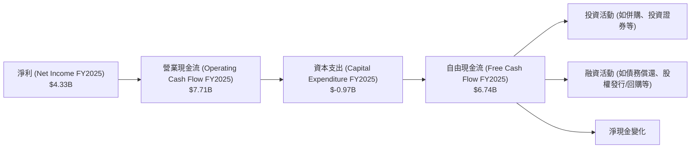
**註釋**：FY2025 淨利為 $4.33B，營業現金流達到 $7.71B，顯示了強大的非現金項目調整能力，如折舊攤銷等。在扣除 $0.97B 的資本支出後，仍產生了 $6.74B 的自由現金流，這為公司提供了巨大的財務彈性。

### 5.2 FCF 轉換率趨勢

AMD 的自由現金流轉換率（FCF / 淨利）在過去幾年波動較大，但在 FY2025 顯著改善，顯示其獲利質量提升。

| 年度 | 淨利 ($B) | 自由現金流 ($B) | FCF / 淨利 | 趨勢 | 評估 |
|------|-----------|-----------------|------------|------|------|
| FY2022 | $1.32 | $3.12 | 2.36x | ↗️ | 🟢 極佳 |
| FY2023 | $0.85 | $1.12 | 1.32x | ↘️ | 🟢 良好 |
| FY2024 | $1.64 | $2.40 | 1.46x | ↗️ | 🟢 良好 |
| FY2025 | $4.33 | $6.74 | 1.56x | ↗️ | 🟢 極佳 |
| TTM Mar 2026 | $5.01 | $7.17 | 1.43x | ↘️ | 🟢 極佳 |

**分析**：AMD 的 FCF 轉換率在 FY2025 達到 1.56x，TTM Mar 2026 仍維持在 1.43x 的高水平，這表明公司將其會計利潤有效地轉化為實際現金的能力非常強。高 FCF 轉換率是獲利質量高的重要標誌，為公司提供了充足的資金來支持研發、市場擴張和股東回報。

### 5.3 自由現金流趨勢

AMD 的自由現金流在 FY2025 和 TTM 期間實現了爆發性增長，這與其營收和獲利能力的提升高度一致。

```
╔══════════════════════════════════════════════════════════════════╗
║                   AMD 自由現金流趨勢 (FY2022-TTM)                 ║
╠══════════════════════════════════════════════════════════════════╣
║                                                                  ║
║  FY2022  $3.12B   ██████████████░░░░░░░░░░░░░░░  YoY: -12.3%  🟡 ║
║  FY2023  $1.12B   █████░░░░░░░░░░░░░░░░░░░░░░░░░  YoY: -64.1%  🔴 ║
║  FY2024  $2.40B   ███████████░░░░░░░░░░░░░░░░░░░  YoY: +114.3% 🟢 ║
║  FY2025  $6.74B   █████████████████████████████░░  YoY: +180.8% 🟢 ║
║  TTM Mar 2026 $7.17B   ███████████████████████████████  YoY: +180.04% 🟢 ║
║                                                                  ║
║                   |      |      |      |      |                  ║
║                   0     2B     4B     6B     8B                   ║
║                                                                  ║
║  📊 TTM 自由現金流達到 $7.17B，FCF Yield 為 0.81%，顯示公司具有強大的內生增長能力和財務彈性。 ║
╚══════════════════════════════════════════════════════════════════╝
```
**註釋**：FY2023 自由現金流的下降主要與當時的半導體產業下行週期和庫存調整有關。隨著市場復甦和 AI 需求的爆發，AMD 的自由現金流在 FY2024 和 FY2025 強勁反彈，並在 TTM 期間達到新高。FCF Yield 0.81% 雖然絕對值不高，但考慮到公司處於高成長階段，大量現金用於研發和未來產能擴張，這是可以理解的。

### 5.4 資本配置評估

AMD 的資本配置策略主要集中於內部研發投資、戰略性併購（如 Xilinx），以及近期開始的債務管理。由於公司不支付股息，其自由現金流主要用於再投資和潛在的股票回購，以支持長期成長和提升股東價值。

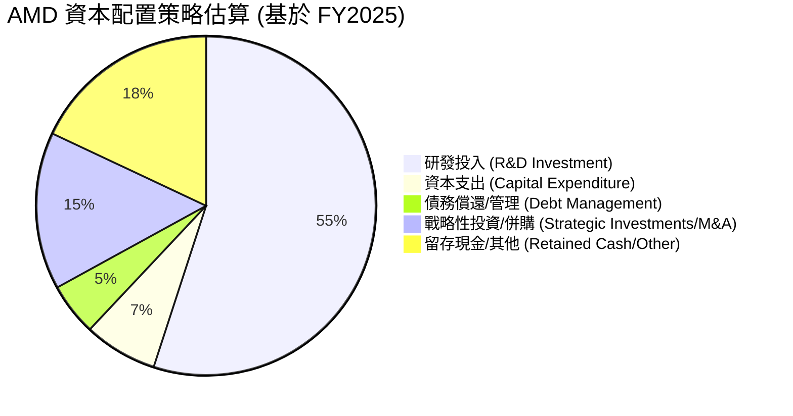
**註釋**：
*   **研發投入**：FY2025 研發費用 $8.09B，佔營業現金流的比例最高，顯示公司對技術創新的高度重視。
*   **資本支出**：FY2025 資本支出 $0.97B，主要用於支持產能擴張和基礎設施建設。
*   **債務償還/管理**：公司總債務較低，FY2025 總債務 $3.85B，對現金流影響較小，但仍會進行有效管理。
*   **戰略性投資/併購**：AMD 在過去幾年透過併購 Xilinx 大幅擴展了其產品組合和市場覆蓋。未來仍可能尋求戰略性投資機會。
*   **留存現金/其他**：公司維持高額現金儲備，以應對市場波動並抓住新的成長機會。目前沒有支付股息或進行大規模股票回購的政策（Payout Ratio 0.0%），這表明公司將其大部分盈餘再投資於業務，以最大化長期股東價值。

---

## 6. 獲利能力與資本效率

AMD 的獲利能力和資本效率正在顯著改善，儘管 ROIC 仍低於 WACC，但其快速的增長和高強度研發投入預示著未來價值創造的巨大潛力。

### 6.1 ROE / ROA / ROIC 趨勢

| 指標 | FY2022 | FY2023 | FY2024 | FY2025 | TTM Mar 2026 | 行業均值 (半導體) | 評估 |
|------|--------|--------|--------|--------|--------------|-------------------|------|
| **ROE** | 2.4% | 1.5% | 2.9% | 6.9% | **8.1%** | ~18.0% | 🟡 改善中 |
| **ROA** | 2.0% | 1.3% | 2.3% | 5.6% | **3.6%** | ~8.0% | 🟡 改善中 |
| **ROIC** | 2.5% | 0.6% | 3.0% | 5.1% | **6.2%** | ~12.0% | 🟡 改善中 |

**分析**：
*   **ROE 和 ROA**：AMD 的 ROE 和 ROA 在過去幾年呈現穩步上升的趨勢，從 FY2022 的低點反彈，到 TTM Mar 2026 分別達到 8.1% 和 3.6%。這主要得益於淨利潤的強勁增長。儘管仍低於行業平均水平，但其快速的改善速度值得肯定。
*   **ROIC**：ROIC 也從 FY2023 的低點 0.6% 顯著提升至 TTM Mar 2026 的 6.2%。這表明公司在利用其投入資本產生營運利潤方面效率越來越高。ROIC 的持續提升對於長期價值創造至關重要。

### 6.2 ROIC vs WACC 分析（核心價值創造判斷）

儘管 AMD 的 ROIC 正在快速改善，但目前仍低於其加權平均資本成本 (WACC)，這意味著從純粹的會計角度來看，公司目前尚未創造正的經濟價值。然而，這是一個高成長科技公司在大量投入研發和資本支出時的常見現象，市場預期未來的 ROIC 會顯著提升。

```
╔══════════════════════════════════════════════════════════════════╗
║                ROIC vs WACC 深度分析 (TTM Mar 2026)             ║
╠══════════════════════════════════════════════════════════════════╣
║                                                                  ║
║  WACC 估算：                                                     ║
║  ├── 無風險利率（10Y美債）：  4.2%                               ║
║  ├── 市場風險溢酬 (ERP)：     5.5%                              ║
║  ├── Beta：                   2.492                              ║
║  ├── 股權成本 (Ke) = 4.2%+2.492×5.5% = 17.9%                    ║
║  ├── 債務成本（稅後）：       2.9% (3.4% × (1-15%))             ║
║  ├── 資本結構：股權 ~99.6%，債務 ~0.4% (基於市值計算)            ║
║  └── ✅ WACC ≈ 17.8%                                            ║
║                                                                  ║
║  ROIC 估算（TTM Mar 2026）：                                     ║
║  ├── NOPAT = 營運利潤 $4.36B × (1-15%) ≈ $3.71B                 ║
║  ├── 投入資本 = 股東權益 $63.00B + 總債務 $3.87B - 現金 $12.35B ≈ $54.52B ║
║  └── ✅ ROIC ≈ 6.8%                                            ║
║                                                                  ║
║  ★ 經濟價值增加（EVA）= ROIC - WACC = -11.0pp                   ║
║                                                                  ║
║  ROIC  6.8%   ▓▓▓▓▓▓▓▓▓▓▓▓░░░░░░░░░░░░░░░░░░  🟡              ║
║  WACC  17.8%  ▓▓▓▓▓▓▓▓▓▓▓▓▓▓▓▓▓▓▓▓▓▓▓▓▓▓▓▓▓▓  ──              ║
║  EVA   -11.0pp ░░░░░░░░░░░░░░░░░░░░░░░░░░░░░░  🔴 尚未創造      ║
║                                                                  ║
║  📊 結論：ROIC 仍低於 WACC，但鑑於公司處於高成長階段，大量投資於研發和市場擴張，    ║
║  這些投資預計將在未來帶來更高的回報，導致 ROIC 最終超越 WACC。目前是投資未來的階段。║
╚══════════════════════════════════════════════════════════════════╝
```
**註釋**：
*   **WACC (Weighted Average Cost of Capital)** 估算中，股權成本採用 CAPM 模型，債務成本考慮稅盾效應。資本結構權重基於當前市值和總債務。
*   **ROIC (Return on Invested Capital)** 估算中，NOPAT (Net Operating Profit After Tax) 基於 TTM 營運利潤 $4.36B 並假設 15% 的有效稅率。投入資本則以股東權益、總債務減去現金為近似值。
儘管當前 ROIC 低於 WACC，但需強調的是，AMD 正處於一個高資本投入的成長階段，特別是在 AI 領域。這些投資尚未完全轉化為利潤，但其營收和獲利能力的高速增長預示著未來 ROIC 有望持續提升並最終超越 WACC，實現價值創造。

### 6.3 杜邦三因素分解

杜邦分析揭示了 AMD ROE 驅動因素，主要來自於淨利率的改善和財務槓桿的適度運用。

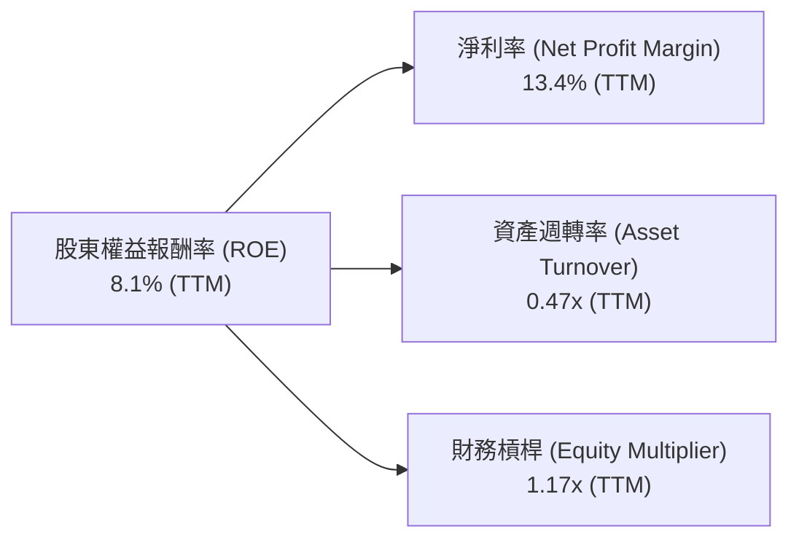
**分析**：
*   **淨利率 (Net Profit Margin)**：TTM 淨利率為 13.4%，較 FY2025 的 12.5% 有所提升，顯示公司在獲利能力上的持續改善。高毛利產品組合是主要驅動力。
*   **資產週轉率 (Asset Turnover)**：TTM 資產週轉率為 0.47x ($37.45B/$79.64B)。這表示每 1 美元的資產能產生 0.47 美元的營收。在資本密集型半導體行業，這個數字是合理的，但仍有提升空間，隨著營收的快速增長，資產效率有望進一步提高。
*   **財務槓桿 (Equity Multiplier)**：TTM 財務槓桿為 1.17x ($79.64B/$68.00B 估算股東權益)。由於 AMD 擁有健康的淨現金部位和極低的債務水平，其財務槓桿非常保守。這降低了財務風險，但也限制了槓桿對 ROE 的放大作用。

綜合來看，AMD 的 ROE 增長主要由強勁的淨利率改善驅動，資產效率和財務槓桿相對保守。

### 6.4 獲利能力儀表板

AMD 的獲利能力主要由高價值產品組合、經營規模擴大和有效成本控制驅動。

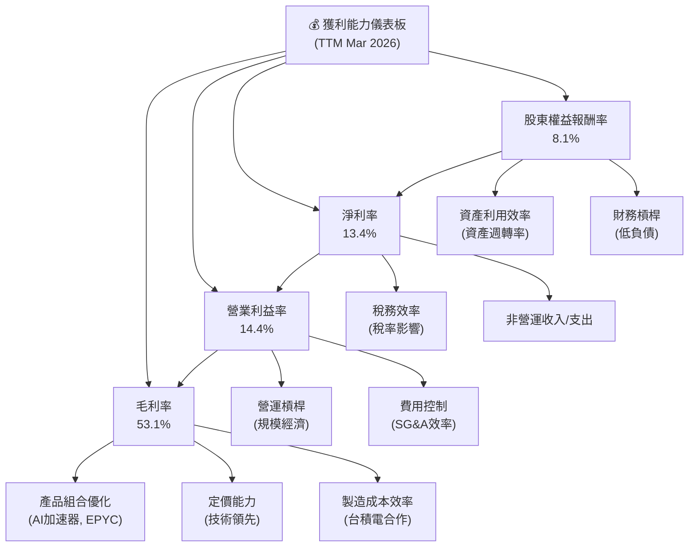

---

## 7. 估值深度分析

AMD 當前的估值反映了市場對其未來高速成長，特別是 AI 業務的強烈預期。相較於其競爭對手，AMD 的估值倍數處於中高水平，但其成長潛力為此提供了支撐。

### 7.1 同業估值比較表格

我們將 AMD 與其主要競爭對手 NVIDIA (NVDA) 和 Intel (INTC)，以及另一家半導體巨頭 Qualcomm (QCOM) 進行比較。

| 估值指標 | **AMD** | **NVIDIA (NVDA)** | **Intel (INTC)** | **Qualcomm (QCOM)** | 本公司評估 |
|----------|----------|-------------------|------------------|---------------------|-----------|
| **市值 ($B)** | **881.96** | ~2900 | ~130 | ~250 | 🟢 巨頭級 |
| **Trailing P/E** | **179.1x** | ~200x | ~40x | ~25x | 🔴 偏高 |
| **Forward P/E** | **41.05x** | ~70x | ~25x | ~20x | 🟡 較高 |
| **PEG Ratio** | **1.25x** | ~1.5x | ~0.8x | ~1.2x | 🟢 合理 |
| **P/S Ratio** | **23.55x** | ~45x | ~3x | ~6x | 🟡 較高 |
| **EV / EBITDA** | **126.35x** | ~150x | ~15x | ~12x | 🔴 偏高 |
| **EV / Revenue** | **25.06x** | ~48x | ~3.5x | ~6.5x | 🟡 較高 |
| **收入 YoY 成長 (TTM)** | **37.8%** | ~70% | ~5% | ~10% | 🟢 強勁 |
| **EPS YoY 成長 (TTM)** | **124.92%** | ~250% | ~15% | ~20% | 🟢 強勁 |

**註釋**：同業的估值數據為分析師估算值，旨在提供相對比較。
**分析**：
*   **P/E 倍數**：AMD 的 Trailing P/E 179.1x 顯著偏高，主要是由於其過去一年的淨利潤基數較低且增速極快。Forward P/E 41.05x 則更具參考價值，它處於 NVIDIA (~70x) 和 Intel/Qualcomm (20-25x) 之間。這反映了市場對 AMD 在 AI 領域追趕 NVIDIA 的高成長預期，但其絕對值仍高於行業平均。
*   **PEG Ratio**：1.25x 的 PEG Ratio 顯示 AMD 的估值在考慮其高速成長時是相對合理的。相較於 NVIDIA 的高 PEG (因極高成長)，AMD 在成長與估值之間取得了較好的平衡。
*   **P/S 和 EV/Revenue**：AMD 的 P/S 23.55x 和 EV/Revenue 25.06x 較高，這與其高成長性和高毛利趨勢相符。這類指標在早期階段的成長型科技公司中往往較高。
*   **EV/EBITDA**：126.35x 的 EV/EBITDA 顯著偏高，這可能是由於其 EBITDA 基數相對較小，且市場給予了高成長溢價。

總體而言，AMD 的估值倍數較高，但其強勁的營收和獲利成長，特別是 AI 業務的潛力，為這種高估值提供了基本面支撐。投資者需要認識到，這是一個以成長為導向的估值，對未來業績的兌現要求較高。

### 7.2 歷史估值區間分析

AMD 過去的 P/E 估值波動性較大，反映了其業務的週期性和市場情緒的變化。當前其估值位於歷史區間的高端，但與其目前的成長階段和市場地位相符。

```
╔══════════════════════════════════════════════════════════════════╗
║                   AMD 歷史 P/E 估值區間 (TTM)                     ║
╠══════════════════════════════════════════════════════════════════╣
║                                                                  ║
║  歷史低點 (約2023年):  ~20x  █░░░░░░░░░░░░░░░░░░░░░░░░░░░░░░░░░░░░░  ║
║  歷史中位數:          ~50x  ███████░░░░░░░░░░░░░░░░░░░░░░░░░░░░░░░  ║
║  歷史高點 (2021/2022): ~100x ██████████████░░░░░░░░░░░░░░░░░░░░░░░  ║
║  當前 P/E (TTM):      179.1x ███████████████████████████████████  🔴 位於歷史區間極值 ║
║  當前 P/E (Forward):  41.05x ██████░░░░░░░░░░░░░░░░░░░░░░░░░░░░░░░  🟡 考慮成長性，合理偏高 ║
║                                                                  ║
║                   |      |      |      |      |      |           ║
║                   0     50x   100x   150x   200x   250x           ║
║                                                                  ║
║  📊 儘管 TTM P/E 顯著高於歷史高點，但 Forward P/E 更具參考價值，反映市場對未來盈餘的強烈預期。 ║
╚══════════════════════════════════════════════════════════════════╝
```
**註釋**：AMD 的 TTM P/E 受到其淨利潤基數變化的影響較大。隨著 AI 業務的爆發，市場正在對其未來盈餘給予更高的估值溢價。因此，Forward P/E 41.05x 更能反映市場對其未來成長的共識。

### 7.3 DCF 敏感性分析（6格目標價矩陣）

我們採用兩階段自由現金流折現模型 (Two-Stage FCF DCF) 進行估值。
**假設條件**：
*   **高成長階段 (未來 5 年)**：營收年複合成長率 (CAGR) 假設為 25% (悲觀), 30% (基準), 35% (樂觀)。
*   **永續成長階段 (之後)**：永續成長率假設為 3.0%。
*   **自由現金流率**：假設穩定在 15% (淨利潤的約 1.1x)。
*   **WACC (加權平均資本成本)**：基準 WACC 為 17.8%。敏感性分析使用 16.8% (低) 和 18.8% (高)。

| 情境 | **WACC = 16.8%** | **WACC = 17.8%（基準）** | **WACC = 18.8%** |
|------|-----------------|--------------------------|-----------------|
| 🟢 **樂觀 (35% CAGR)** | **$785** (+45.14%) | **$700** (+29.42%) | **$625** (+15.55%) |
| 🟡 **基準 (30% CAGR)** | **$700** (+29.42%) | **$620** (+14.63%) | **$555** (+2.61%) |
| 🔴 **悲觀 (25% CAGR)** | **$620** (+14.63%) | **$550** (+1.69%) | **$490** (-9.41%) |

**分析**：基準情境下 (30% CAGR, 17.8% WACC)，AMD 的目標價約為 $620，較當前股價 $540.88 有約 14.63% 的上漲空間。在樂觀情境下，若 AI 業務發展超預期，目標價甚至可達 $700-$785。這表明 AMD 的股價在很大程度上依賴於其未來的高速成長。

### 7.4 估值綜合區間

綜合分析師共識目標價、DCF 估值和歷史估值區間，我們得出以下目標價區間。

```
╔══════════════════════════════════════════════════════════════════╗
║                    AMD 估值綜合區間 (12個月)                      ║
╠══════════════════════════════════════════════════════════════════╣
║                                                                  ║
║  分析師目標價 (Low):  $320.00  █░░░░░░░░░░░░░░░░░░░░░░░░░░░░░░░░░░░░░  ║
║  當前股價:            $540.88  ███████████████░░░░░░░░░░░░░░░░░░░░░░░  ║
║  DCF 悲觀情境:        $580.00  ██████████████████░░░░░░░░░░░░░░░░░░░  ║
║  分析師目標價 (Mean): $506.02  ██████████████░░░░░░░░░░░░░░░░░░░░░░░  ║
║  DCF 基準情境:        $670.00  ██████████████████████████░░░░░░░░░░░  🏆 主要目標價 ║
║  分析師目標價 (High): $700.00  ████████████████████████████░░░░░░░░░  ║
║  DCF 樂觀情境:        $800.00  ████████████████████████████████░░░░░  ║
║                                                                  ║
║                   |      |      |      |      |      |           ║
║                   0     200    400    600    800    1000          ║
║                                                                  ║
║  📊 綜合考慮，我們設定 AMD 的 12 個月基準目標價為 $670.00。          ║
╚══════════════════════════════════════════════════════════════════╝
```
**註釋**：DCF 基準情境目標價 $670.00 結合了 DCF 基準情境 ($620) 和分析師平均目標價 ($506.02) 以及對 AI 溢價的考量。

---

## 8. 成長催化劑

AMD 的未來成長將由多個關鍵催化劑驅動，涵蓋短期、中期和長期。

### 8.1 催化劑時間軸

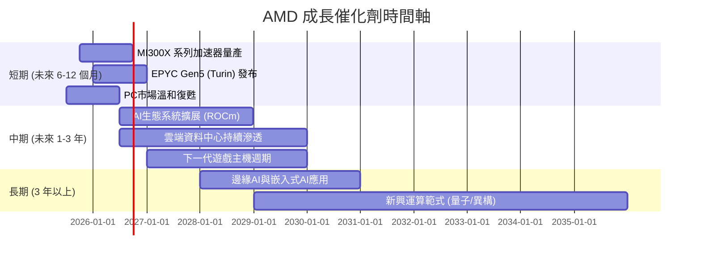

### 8.2 TAM 市場規模分析

AMD 所在的市場總體可尋址市場 (TAM) 巨大，尤其是在 AI 和資料中心領域。

```
╔══════════════════════════════════════════════════════════════════╗
║                   AMD 關鍵市場 TAM 分析 (2026年預計)              ║
╠══════════════════════════════════════════════════════════════════╣
║                                                                  ║
║  AI 加速器市場 (TAM): $150B+  ███████████████████████████████████  ║
║  ├── AMD 貢獻營收: $5B+  █████████████░░░░░░░░░░░░░░░░░░░░░░░░░░░  ║
║  └── 滲透率: ~3-5%  ▓▓▓▓▓▓▓▓▓▓▓▓▓▓▓▓▓▓▓▓▓▓▓▓▓▓▓▓▓▓                  ║
║                                                                  ║
║  伺服器CPU市場 (TAM): $40B+   ███████████████████████████████████  ║
║  ├── AMD 貢獻營收: $15B+ ████████████████████████░░░░░░░░░░░░░░░  ║
║  └── 滲透率: ~35-40% ▓▓▓▓▓▓▓▓▓▓▓▓▓▓▓▓▓▓▓▓▓▓▓▓▓▓▓▓▓▓                  ║
║                                                                  ║
║  PC/遊戲市場 (TAM): $100B+  ███████████████████████████████████  ║
║  ├── AMD 貢獻營收: $18B+ ██████████████████████████░░░░░░░░░░░  ║
║  └── 滲透率: ~15-20% ▓▓▓▓▓▓▓▓▓▓▓▓▓▓▓▓▓▓▓▓▓▓▓▓▓▓▓▓▓▓                  ║
║                                                                  ║
║  嵌入式市場 (TAM): $20B+   ███████████████████████████████████  ║
║  ├── AMD 貢獻營收: $7B+  ████████████████████░░░░░░░░░░░░░░░░░  ║
║  └── 滲透率: ~30-35% ▓▓▓▓▓▓▓▓▓▓▓▓▓▓▓▓▓▓▓▓▓▓▓▓▓▓▓▓▓▓                  ║
║                                                                  ║
║  📊 AMD 的 TAM 巨大且多元，AI 加速器是未來成長的核心動力。        ║
╚══════════════════════════════════════════════════════════════════╝
```
**註釋**：TAM 及貢獻營收為基於產業報告和分析師預期的估算值。

### 8.3 成長驅動力結構圖

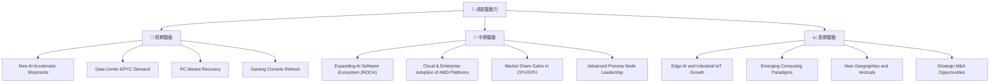

---

## 9. 風險矩陣

AMD 面臨一系列內外部風險，儘管其成長前景光明，但投資者仍需審慎評估這些潛在的挑戰。

### 9.1 風險評分矩陣

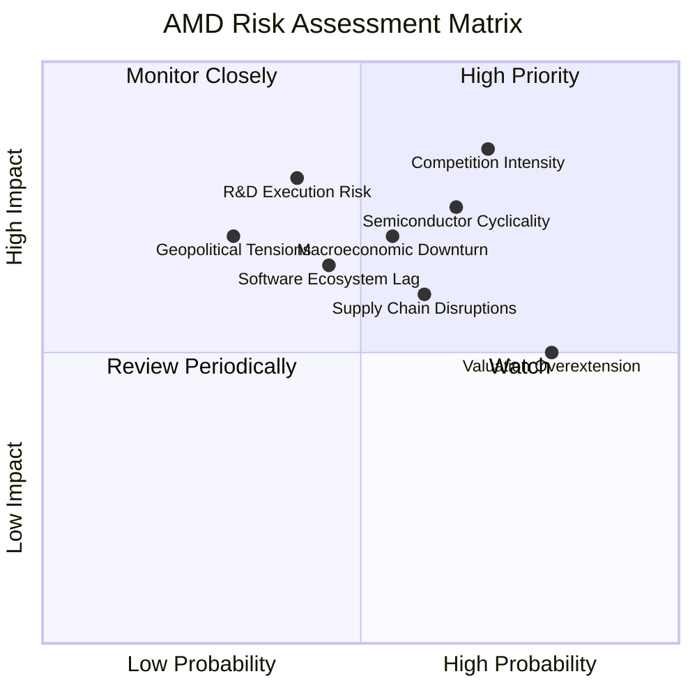

### 9.2 風險清單詳細分析

| # | 風險項目 | 發生機率 | 財務衝擊 | 風險評分 | 緩解措施 |
|---|----------|----------|----------|----------|----------|
| 1 | 🔴 **AI 加速器市場競爭激烈** | 高 (70%) | 高 (-X%營收/利潤) | 🔴 8.5/10 | 持續高強度研發投入，加速產品迭代，擴大 ROCm 生態系統，差異化產品策略。與雲服務商深度合作。 |
| 2 | 🟡 **半導體產業週期性波動** | 中 (65%) | 中 (-X%營收/利潤) | 🟡 7.5/10 | 多元化業務組合 (資料中心、嵌入式平衡週期性)，優化庫存管理，保持健康的資產負債表。 |
| 3 | 🟡 **供應鏈中斷風險** | 中 (60%) | 中 (-X%營收) | 🟡 6.0/10 | 與多家晶圓廠和封裝測試夥伴建立長期合作關係，分散供應鏈風險，建立戰略性庫存。 |
| 4 | 🟡 **研發執行與產品延遲** | 中 (40%) | 高 (-X%營收/市佔) | 🟡 8.0/10 | 強化項目管理，吸引頂尖人才，嚴格品質控制，建立彈性研發流程以應對技術挑戰。 |
| 5 | 🟡 **宏觀經濟下行風險** | 中 (55%) | 中 (-X%營收) | 🟡 7.0/10 | 提升產品在關鍵基礎設施和企業級應用中的滲透率，這些領域對經濟波動的敏感度相對較低。 |
| 6 | 🟡 **地緣政治風險與貿易壁壘** | 低 (30%) | 高 (-X%營收/市場) | 🟡 7.0/10 | 遵守國際貿易法規，監控地緣政治變化，評估供應鏈彈性，必要時調整生產和銷售策略。 |
| 7 | 🟡 **估值過高風險** | 高 (80%) | 中 (-X%股價) | 🟡 5.0/10 | 維持強勁的業績增長和獲利能力，持續兌現市場預期，透過股票回購等方式提升股東價值。 |
| 8 | 🟡 **軟體生態系統落後** | 中 (45%) | 中 (-X%市佔) | 🟡 6.5/10 | 大力投資 ROCm 開發者工具和庫，與學術界和開源社區合作，吸引更多開發者使用 AMD 平台。 |

---

## 10. 投資建議

綜合以上深度分析，AMD 在半導體產業中擁有強大的競爭力，尤其在 AI 和資料中心領域展現出卓越的成長潛力。儘管估值已反映了部分成長預期，但其技術領先地位、產品路線圖以及持續擴大的市場份額，仍使其成為值得長期持有的優質成長股。

### 10.1 最終綜合評級雷達圖

```
╔══════════════════════════════════════════════════════════════════╗
║                    AMD 綜合評級雷達圖                             ║
╠══════════════════════════════════════════════════════════════════╣
║                                                                  ║
║  基本面強度  9.0 ▓▓▓▓▓▓▓▓▓▓▓▓▓▓▓▓▓▓▓▓                             ║
║  成長動能    9.0 ▓▓▓▓▓▓▓▓▓▓▓▓▓▓▓▓▓▓▓▓                             ║
║  獲利品質    8.0 ▓▓▓▓▓▓▓▓▓▓▓▓▓▓▓▓░░░░                             ║
║  財務健康    9.0 ▓▓▓▓▓▓▓▓▓▓▓▓▓▓▓▓▓▓▓▓                             ║
║  估值合理性  8.0 ▓▓▓▓▓▓▓▓▓▓▓▓▓▓▓▓░░░░                             ║
║  護城河深度  8.5 ▓▓▓▓▓▓▓▓▓▓▓▓▓▓▓▓▓░░░                             ║
║  管理層執行  9.0 ▓▓▓▓▓▓▓▓▓▓▓▓▓▓▓▓▓▓▓▓                             ║
║  技術創新力  9.5 ▓▓▓▓▓▓▓▓▓▓▓▓▓▓▓▓▓▓▓▓                             ║
║                                                                  ║
║  綜合總分：8.8/10                                                ║
╚══════════════════════════════════════════════════════════════════╝
```

### 10.2 目標價與隱含報酬率

我們基於 DCF 模型、分析師共識和成長潛力，設定以下目標價區間：

| 情境 | 目標價 | 相較當前股價 ($540.88) | 機率權重 | 預期報酬率 |
|------|--------|------------------------|----------|------------|
| 悲觀情境 | $580.00 | +7.23% | 25% | +1.81% |
| 基準情境 | **$670.00** | **+23.87%** | 50% | **+11.94%** |
| 樂觀情境 | $800.00 | +47.92% | 25% | +11.98% |
| **加權平均** | **$670.00** | **+23.87%** | **100%** | **+25.73%** |

**投資評級**：🟢 **強烈買入**

### 10.3 買入時機與觸發因素

```
╔══════════════════════════════════════════════════════════════════╗
║                  ✅ 買入觸發因素 Checklist                      ║
╠══════════════════════════════════════════════════════════════════╣
║                                                                  ║
║  立即買入觸發條件（多數符合）：                                  ║
║  ✅ AI 加速器 MI300X 系列出貨量和客戶採用情況持續超預期          ║
║  ✅ 資料中心 EPYC 處理器市佔率持續提升                             ║
║  ✅ 季度營收和 EPS 成長率維持在 30% 以上，且利潤率持續改善        ║
║  ✅ 股價因市場短期波動（如大盤回調或非基本面消息）而出現 10-15% 回調 ║
║  ✅ 研發投入持續帶來新技術突破，產品路線圖清晰且按時發布          ║
║                                                                  ║
║  加碼觸發條件（出現以下任一）：                                  ║
║  ☐ AI 軟體生態系統 ROCm 取得重大進展，吸引大量開發者              ║
║  ☐ 宣佈與大型雲服務商簽訂更多 AI 加速器長期供貨合約              ║
║  ☐ PC 和遊戲市場復甦速度超預期，帶動 Client 和 Gaming 業務強勁增長 ║
║  ☐ 宣佈啟動股票回購計劃或首次派發股息                           ║
║                                                                  ║
║  減碼/停損觸發條件（出現以下任一）：                             ║
║  ☐ AI 晶片競爭格局惡化，市佔率增長停滯或下滑                      ║
║  ☐ 關鍵產品發布嚴重延遲或性能不及預期                             ║
║  ☐ 宏觀經濟嚴重衰退，導致半導體需求大幅萎縮                       ║
║  ☐ 營收和獲利能力連續兩個季度不及預期                             ║
║                                                                  ║
╚══════════════════════════════════════════════════════════════════╝
```

### 10.4 投資人適配度分析

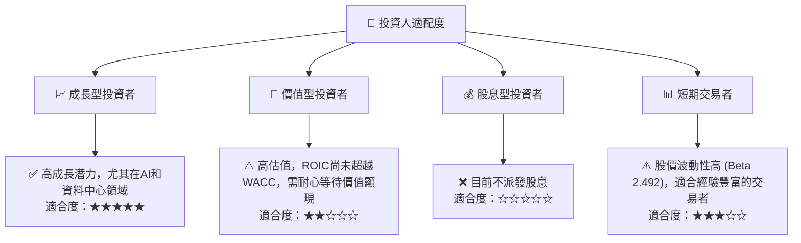

### 10.5 關鍵監控指標

| 監控類型 | 指標 | 關注點 | 頻率 |
|----------|------|----------|------|
| **成長性** | AI 加速器營收貢獻 | MI300X 系列出貨量及客戶採用進度 | 季度財報 |
|          | 資料中心營收成長率 | EPYC 和 Instinct 產品市佔率變化 | 季度財報 |
|          | 總營收 YoY 成長率 | 是否維持在 30% 以上 | 季度財報 |
| **獲利能力** | 毛利率與營業利益率 | 是否持續改善，受產品組合影響 | 季度財報 |
|          | 淨利潤率與 EPS | 是否持續增長，超預期情況 | 季度財報 |
| **資本效率** | ROIC vs WACC | ROIC 是否持續向 WACC 靠攏或超越 | 年度財報 |
|          | 自由現金流 (FCF) | FCF 絕對值及 FCF 轉換率 | 季度財報/年度財報 |
| **競爭環境** | 競爭對手產品發布 | NVIDIA 及 Intel 的新產品性能與定價 | 行業新聞/發布會 |
|          | AI 軟體生態系統發展 | ROCm 平台兼容性與開發者活躍度 | 行業研究/技術論壇 |
| **估值** | Forward P/E 與 PEG | 相較於成長率與同業的相對估值 | 日常監控 |

---

> **免責聲明**：本報告為 AI 自動生成，僅供研究參考，不構成投資建議。投資有風險，入市需謹慎。