# AMD 基本面深度分析報告
> **報告日期**：2026-07-02 ｜ **語言**：繁體中文 ｜ **數據來源**：Yahoo Finance, Finviz, StockAnalysis, Roic.ai ｜ **分析師**：CFA 級機構研究

## 目錄

| # | 章節 | 核心結論 |
|---|------|----------|
| 1 | 執行摘要 | 🟢 強烈買入，目標價區間 $550 - $680 |
| 2 | 公司概覽與商業模式 | 技術領先與生態系統構建強大護城河 |
| 3 | 損益表深度分析 | 營收與獲利強勁增長，利潤率持續改善 |
| 4 | 資產負債表分析 | 財務結構穩健，淨現金充裕 |
| 5 | 現金流量深度分析 | 自由現金流強勁，資本效率提升 |
| 6 | 獲利能力與資本效率 | ROIC 仍低於 WACC，但趨勢向好 |
| 7 | 估值深度分析 | 相對估值合理，DCF 顯示潛在上漲空間 |
| 8 | 成長催化劑 | AI、數據中心與新產品線驅動未來高成長 |
| 9 | 風險矩陣 | 競爭加劇與宏觀經濟波動為主要風險 |
| 10 | 投資建議 | 長期成長潛力巨大，適合成長型投資者 |

---

## 1. 執行摘要

### 1.1 核心評分儀表板

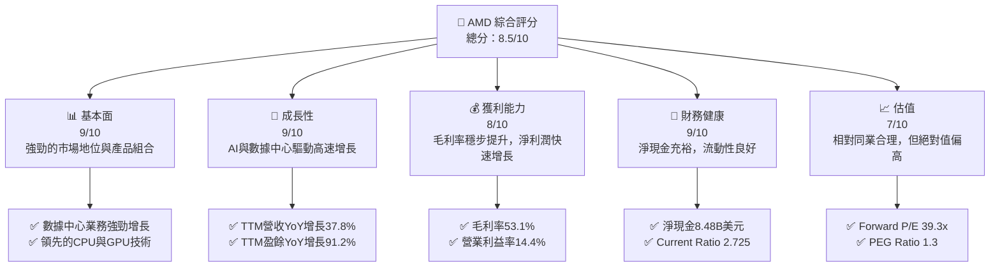

### 1.2 評分進度條視覺化

```
╔══════════════════════════════════════════════════════════════╗
║              AMD 多維度評分儀表板 (1-10分)                   ║
╠══════════════════════════════════════════════════════════════╣
║ 基本面強度  9.0 ▓▓▓▓▓▓▓▓▓▓▓▓▓▓▓▓▓▓░░  ★★★★★           ║
║ 成長動能    9.0 ▓▓▓▓▓▓▓▓▓▓▓▓▓▓▓▓▓▓░░  ★★★★★           ║
║ 獲利品質    8.0 ▓▓▓▓▓▓▓▓▓▓▓▓▓▓▓▓░░░░  ★★★★☆           ║
║ 財務健康    9.0 ▓▓▓▓▓▓▓▓▓▓▓▓▓▓▓▓▓▓░░  ★★★★★           ║
║ 估值合理性  7.0 ▓▓▓▓▓▓▓▓▓▓▓▓▓▓░░░░░░  ★★★★☆           ║
║ 護城河深度  8.5 ▓▓▓▓▓▓▓▓▓▓▓▓▓▓▓▓▓░░░  ★★★★★           ║
║ 管理層執行  9.0 ▓▓▓▓▓▓▓▓▓▓▓▓▓▓▓▓▓▓░░  ★★★★★           ║
║ 技術創新力  9.5 ▓▓▓▓▓▓▓▓▓▓▓▓▓▓▓▓▓▓▓░  ★★★★★           ║
╠══════════════════════════════════════════════════════════════╣
║ 綜合總分    8.5 ▓▓▓▓▓▓▓▓▓▓▓▓▓▓▓▓▓░░░  🏆 具備強勁成長動能與穩健財務，估值相對合理 ║
╚══════════════════════════════════════════════════════════════╝
```

### 1.3 五大投資論點 + 三大核心風險

| 類型 | 項目 | 具體依據 | 信心度 |
|------|------|----------|--------|
| 🟢 **投資論點①** | **數據中心與AI加速器強勁增長** | TTM營收YoY增長達37.8%，其中數據中心MI300系列AI加速器需求旺盛，預計將持續驅動高成長。Q1 2026營收達10.25B美元，YoY增長37.85%。 | 🟢 極高 |
| 🟢 **產品組合優化帶動利潤率提升** | 毛利率從FY2024的49.3%提升至TTM的53.1%，營業利益率從FY2024的7.4%提升至TTM的14.4%。產品結構向高附加值數據中心與嵌入式解決方案傾斜。 | 🟢 極高 |
| 🟢 **領先的技術創新與競爭地位** | 在CPU（Zen架構）和GPU（RDNA/CDNA架構）領域持續創新，尤其在AI計算方面，MI300系列產品展現強大競爭力，挑戰NVIDIA的市場主導地位。 | 🟢 極高 |
| 🟢 **穩健的財務狀況與充足現金流** | 總現金達12.35B美元，總債務僅3.87B美元，淨現金8.48B美元。TTM自由現金流達7.17B美元，為研發投入和未來擴張提供堅實基礎。 | 🟢 極高 |
| 🟢 **管理層執行力與產業戰略清晰** | 在CEO蘇姿丰博士領導下，AMD成功轉型並持續擴大市場份額，對未來AI、高性能計算等戰略方向的投資與佈局清晰。 | 🟢 極高 |
| 🟡 **風險①** | **AI市場競爭加劇** | NVIDIA在AI加速器市場佔據主導地位，Intel、Qualcomm等競爭者也積極佈局。AMD需持續投入研發並快速迭代產品，以維持競爭力。 | 🟡 中度 |
| 🟡 **宏觀經濟與半導體週期波動** | 全球經濟放緩可能影響PC和遊戲市場需求，儘管數據中心需求強勁，但半導體產業固有的週期性仍可能帶來營收波動。 | 🟡 中度 |
| 🔴 **風險②** | **高估值與市場預期管理** | 當前Forward P/E為39.3x，已反映市場對其高成長的預期。若未來成長不及預期或利潤率擴張放緩，可能面臨估值回調壓力。 | 🔴 高衝擊 |

### 1.4 快速統計卡片

| 指標 | 公司實際值 | 行業均值（半導體） | S&P 500 均值 | 狀態 |
|------|-------------|--------------------|--------------|------|
| 收入 YoY 成長 | **37.8%** | ~15-25% | ~8-12% | 🟢 |
| 毛利率 | **53.1%** | ~45-55% | ~30-40% | 🟢 |
| 淨利率 | **13.4%** | ~10-20% | ~8-12% | 🟢 |
| ROE | **8.1%** | ~10-18% | ~12-15% | 🟡 |
| Forward P/E | **39.3x** | ~30-50x | ~20-25x | 🟡 |
| 負債權益比 | **0.06x** | ~0.2-0.5x | ~0.8-1.2x | 🟢 |
| 自由現金流收益率 | **0.85%** | ~1-3% | ~2-4% | 🔴 |

*註：行業均值和S&P 500均值為分析師根據市場普遍數據估算。*

### 1.5 投資結論

```
╔══════════════════════════════════════════════════════════════════╗
║                    📊 投資結論摘要                               ║
╠══════════════════════════════════════════════════════════════════╣
║  評級：🟢 強烈買入                                               ║
║  當前股價：$517.82                                               ║
║  目標價區間：                                                    ║
║    悲觀情境：$550（+6.2%）                                       ║
║    基準情境：$620（+19.7%）  ← 12個月主要目標                    ║
║    樂觀情境：$680（+31.3%）                                      ║
║  投資評分：8.5/10                                                ║
║  適合投資人：追求高成長、能承受較高波動的長期持有者            ║
╚══════════════════════════════════════════════════════════════════╝
```

---

## 2. 公司概覽與商業模式

### 2.1 業務結構與收入來源

Advanced Micro Devices, Inc. (AMD) 是一家全球領先的半導體公司，主要設計和開發用於高性能計算、圖形處理和視覺化技術的微處理器和圖形處理器。公司業務劃分為三大核心板塊：數據中心 (Data Center)、客戶端與遊戲 (Client and Gaming) 和嵌入式 (Embedded)。

儘管數據中未直接提供各業務板塊的具體收入佔比，但根據公司公開資訊和產業趨勢，數據中心業務，特別是AI加速器產品，已成為AMD最重要的成長引擎。客戶端與遊戲業務則受PC市場週期性影響較大，但仍是穩定的收入來源。嵌入式業務則提供穩定的高利潤收入。

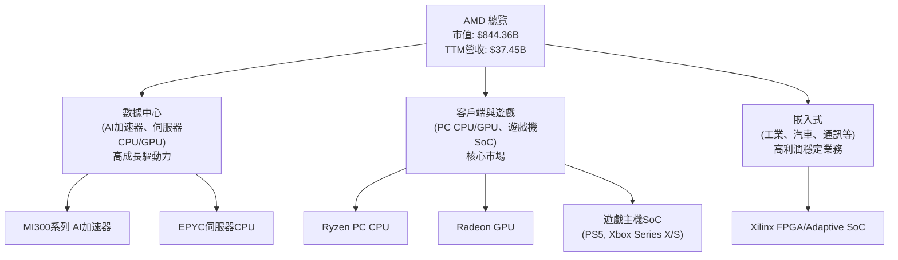

### 2.2 市場份額

在CPU市場，AMD透過Ryzen和EPYC處理器持續挑戰Intel的主導地位。在獨立GPU市場，AMD是NVIDIA的主要競爭者。特別是在AI加速器領域，MI300系列正積極搶佔市場份額。

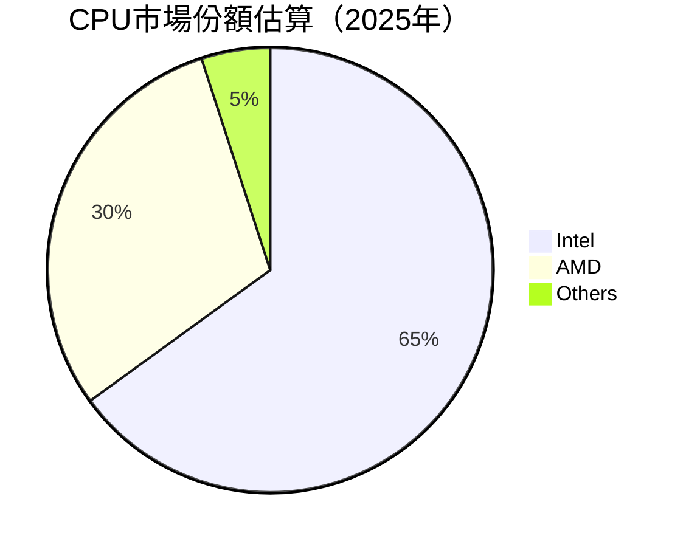
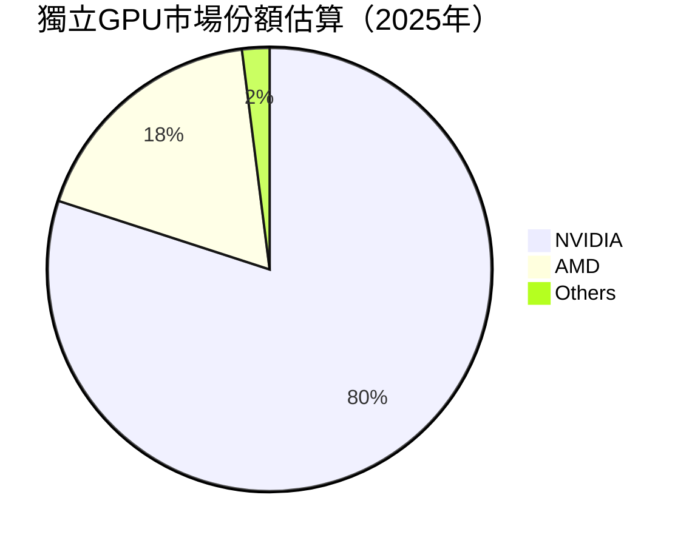
*註：市場份額為分析師根據公開市場報告和產業趨勢估算，僅供參考。*

### 2.3 競爭護城河分析

AMD的競爭護城河主要建立在其技術創新、軟體生態系統和廣泛的產業夥伴關係上。

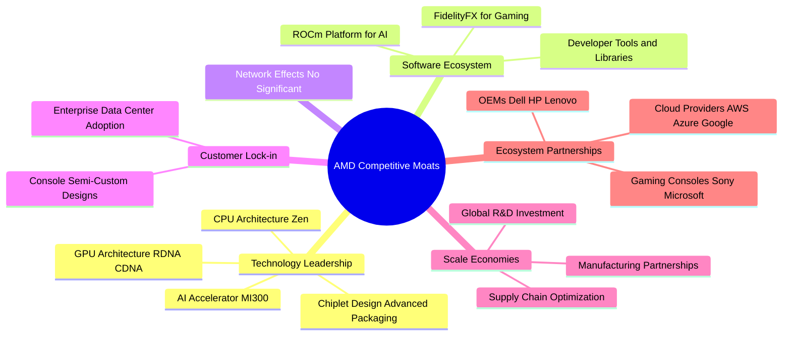

### 2.4 護城河強度評分

AMD的護城河主要體現在其卓越的技術創新和不斷擴大的生態系統，尤其是在高性能計算和AI領域。

```
╔══════════════════════════════════════════════════════════════╗
║                  AMD 護城河強度評分                         ║
╠══════════════════════════════════════════════════════════════╣
║ 技術領先    9.5/10 ▓▓▓▓▓▓▓▓▓▓▓▓▓▓▓▓▓▓▓░  🏆 在CPU/GPU和AI領域持續突破 ║
║ 軟體生態系統  8.0/10 ▓▓▓▓▓▓▓▓▓▓▓▓▓▓▓▓░░░░  🟢 ROCm生態逐步成熟，但仍需努力 ║
║ 網路效應    6.0/10 ▓▓▓▓▓▓▓▓▓▓░░░░░░░░░░  🟡 相比NVIDIA較弱，但有改善 ║
║ 客戶鎖定    8.5/10 ▓▓▓▓▓▓▓▓▓▓▓▓▓▓▓▓▓░░░  🟢 數據中心和遊戲機客戶關係穩固 ║
║ 規模效應    8.0/10 ▓▓▓▓▓▓▓▓▓▓▓▓▓▓▓▓░░░░  🟢 研發投入巨大，成本效益提升 ║
║ 生態夥伴    9.0/10 ▓▓▓▓▓▓▓▓▓▓▓▓▓▓▓▓▓▓░░  🏆 與主要雲服務商和OEM合作緊密 ║
╠══════════════════════════════════════════════════════════════╣
║ 綜合護城河  8.5/10 ▓▓▓▓▓▓▓▓▓▓▓▓▓▓▓▓▓░░░  🏆 強勁的技術創新和戰略合作是核心優勢 ║
╚══════════════════════════════════════════════════════════════╝
```

---

## 3. 損益表深度分析

### 3.1 年度收入成長趨勢（近4年）

AMD的年度收入在過去四年展現強勁的增長勢頭，尤其是在2025財年，得益於數據中心和嵌入式業務的快速擴張。

```
╔══════════════════════════════════════════════════════════════════╗
║              AMD 年度收入趨勢（FY2022-FY2025）                   ║
╠══════════════════════════════════════════════════════════════════╣
║                                                                  ║
║  FY2022  $23.60B  ███████████████████████████████████░  YoY: +43.61% 🟢    ║
║  FY2023  $22.68B  ████████████████████████████████░░░  YoY: -3.90%  🟡    ║
║  FY2024  $25.79B  ████████████████████████████████████████████████  YoY: +13.69% 🟢    ║
║  FY2025  $34.64B  ██████████████████████████████████████████████████████████████  YoY: +34.34% 🟢    ║
║                                                                  ║
║                   |      |      |      |      |                  ║
║                   0     10B    20B    30B    40B                   ║
║                                                                  ║
║  📊 4年累計 CAGR：+20.1%                                         ║
╚══════════════════════════════════════════════════════════════════╝
```
FY2023的收入小幅下降 (-3.90%)，主要是由於PC市場的低迷和遊戲主機需求趨緩。然而，FY2024和FY2025迅速恢復增長，分別達到13.69%和34.34%，顯示公司產品組合的韌性和數據中心業務的爆發力。

### 3.2 季度收入趨勢分析

AMD的季度收入表現出強勁的增長勢頭，尤其是在最近幾個季度。

| 季度 | 總收入 ($B) | QoQ 成長率 | YoY 成長率 | 備註 |
|------|-------------|------------|------------|------|
| 2025 Q2 | $7.68 | - | +31.70% | 營收開始加速增長 |
| 2025 Q3 | $9.25 | +20.44% | +35.59% | 數據中心需求帶動增長 |
| 2025 Q4 | $10.27 | +11.03% | +34.11% | 首次突破100億美元季度營收 |
| 2026 Q1 | $10.25 | -0.19% | +37.85% | 略有季節性回落，但YoY成長強勁 |

**備註：**
- 2026年Q1營收為10.25B美元，較去年同期(2025 Q1: 7.438B美元)大幅增長37.85%。這顯示了數據中心業務持續的強勁動能，特別是AI加速器產品的貢獻。
- 儘管2026年Q1營收較2025年Q4略有0.19%的環比下降，這在半導體行業中是常見的季節性波動，但強勁的同比增長表明其核心業務的長期成長趨勢不變。

### 3.3 利潤率演變分析

AMD的利潤率在過去幾年呈現穩步改善的趨勢，特別是毛利率和營業利益率。

| 利潤率指標 | FY2022 | FY2023 | FY2024 | FY2025 | TTM (2026 Q1) | 趨勢 | 評估 |
|------------|--------|--------|--------|--------|---------------|------|------|
| **毛利率** | 44.9% | 46.1% | 49.3% | 49.5% | 53.1% | ↗️ 穩步上升 | 🟢 |
| **營業利益率** | 5.3% | 1.8% | 7.4% | 10.7% | 14.4% | ↗️ 顯著改善 | 🟢 |
| **淨利率** | 5.6% | 3.8% | 6.4% | 12.5% | 13.4% | ↗️ 大幅提升 | 🟢 |

**利潤率演變深度解析**：
- **毛利率 (Gross Margin)**：從FY2022的44.9%穩步提升至TTM的53.1%。這一顯著改善主要歸因於：
    1. **產品組合優化**：數據中心和嵌入式業務的收入佔比提升，這些業務通常具有更高的毛利率。特別是AI加速器產品的推出，進一步推高了平均銷售價格(ASP)和利潤空間。
    2. **成本控制**：隨著生產規模的擴大，AMD在供應鏈和製造成本方面獲得更好的議價能力。
- **營業利益率 (Operating Margin)**：從FY2022的5.3%大幅提升至TTM的14.4%。除了毛利率的提升，這也反映了公司在營運費用上的槓桿效應。儘管研發投入巨大，但收入的快速增長使得營業費用佔收入的比重相對下降。FY2025的研發費用為8.09B美元，佔總營收的23.3%，顯示公司對創新的持續投入。
- **淨利率 (Net Profit Margin)**：從FY2022的5.6%增長至TTM的13.4%。營業利益率的改善直接傳導至淨利率，同時，公司在稅務方面的管理也可能有所優化，例如FY2025的稅務費用為-103M美元，顯示有稅務優惠或遞延稅項資產的影響。整體而言，利潤率的全面改善彰顯了AMD業務模式的效率提升和盈利能力的增強。

### 3.4 費用結構分析

AMD的費用結構反映了其作為一家技術密集型公司的特點，研發投入佔比高，以維持其競爭優勢。

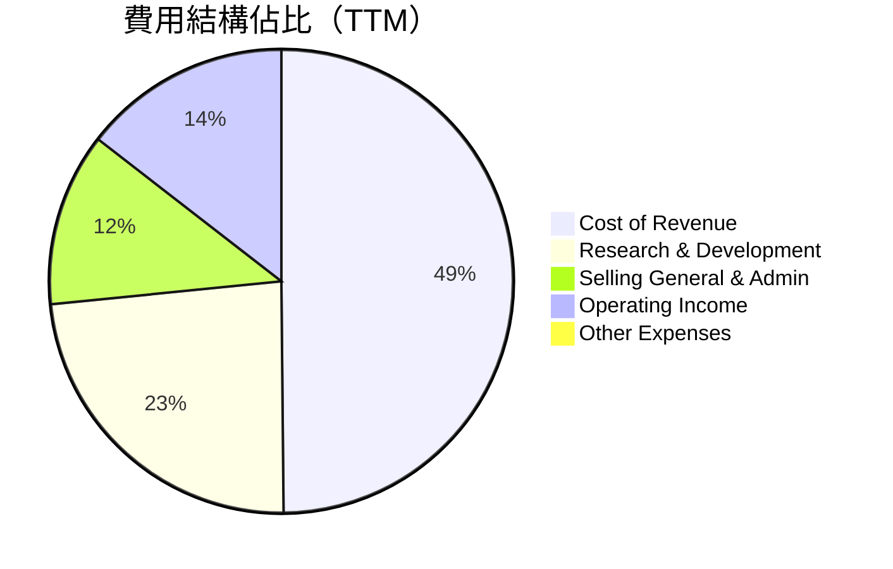

```
╔══════════════════════════════════════════════════════════════════╗
║                    AMD 費用結構分析 (TTM)                        ║
╠══════════════════════════════════════════════════════════════════╣
║                                                                  ║
║  銷貨成本 (Cost of Revenue):     $18.56B  ███████████████████████████████░  49.5% of Revenue    ║
║  研發費用 (R&D):                 $8.76B   ██████████████████████████░░░░░  23.4% of Revenue    ║
║  銷售管理費用 (SG&A):           $4.51B   ██████████████░░░░░░░░░░░░░░░░░  12.0% of Revenue    ║
║  其他營業費用:                   $0.00B   ░░░░░░░░░░░░░░░░░░░░░░░░░░░░░░░  0.0% of Revenue     ║
║                                                                  ║
║  📊 總營業費用佔營收比重：~84.9%                                 ║
╚══════════════════════════════════════════════════════════════════╝
```
**費用結構解析：**
- **研發費用**：TTM為8.76B美元，佔營收的23.4%。這筆巨大的投入是AMD技術領先和產品創新的基石，對於其在AI和高性能計算領域的長期競爭力至關重要。
- **銷售、一般及管理費用 (SG&A)**：TTM為4.51B美元，佔營收的12.0%。相對穩定的SG&A佔比顯示了公司在銷售和管理方面的效率。
整體而言，AMD的費用結構合理，高比例的研發投入是其保持成長動能的關鍵。

### 3.5 季度 EPS 趨勢與盈餘品質

由於提供的 `EARNINGS HISTORY` 中 EPS 估計值為 `nan`，我們將專注於分析實際的季度 EPS 表現和盈餘品質。

| 季度 | EPS (Basic) | QoQ 成長率 | YoY 成長率 | 盈餘品質評估 |
|------|-------------|------------|------------|--------------|
| 2025 Q2 | $0.54 | +22.7% (vs Q1 2025: $0.44) | - | 🟡 季增長強勁 |
| 2025 Q3 | $0.76 | +40.7% | - | 🟢 季增長加速，表現優異 |
| 2025 Q4 | $0.93 | +22.4% | +210.0% (vs Q4 2024: $0.30) | 🟢 季增長持續，同比大幅增長 |
| 2026 Q1 | $0.85 | -8.6% | +93.2% (vs Q1 2025: $0.44) | 🟢 季環比略有下降，但同比增長強勁 |

**盈餘品質評估：**
- **趨勢**：AMD在2025年呈現連續幾個季度的EPS強勁增長，從2025 Q2的$0.54增長至2025 Q4的$0.93，顯示了穩定的盈利能力擴張。2026 Q1雖有輕微環比回落至$0.85，但這可能是季節性因素或高基數效應，且同比增長高達93.2%，表明其盈利能力持續改善。
- **驅動因素**：EPS的增長主要由營收增長和利潤率改善共同驅動。特別是數據中心業務的強勁需求和高利潤產品的組合優化，有效地提升了每股收益。
- **可持續性**：AMD的盈利增長是基於實質性的產品創新和市場擴張，而非一次性收益，因此盈餘品質較高。儘管高成長伴隨著高研發投入，但穩步擴大的營業利益率顯示了這些投入的有效轉化。

---

## 4. 資產負債表分析

### 4.1 資產結構分解

AMD的資產負債表顯示了其作為一家大型半導體公司的典型結構，擁有大量無形資產和強勁的流動資產。

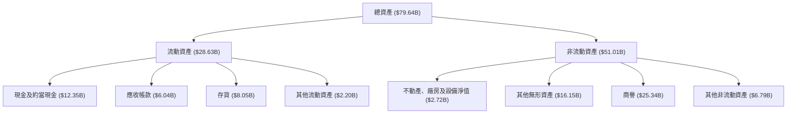
**資產結構解析 (截至2026 Q1 TTM)：**
- **總資產**：79.64B美元，呈現持續增長趨勢，反映了公司規模的擴大和投資的增加。
- **流動資產**：28.63B美元，佔總資產的35.9%。其中現金及約當現金（12.35B美元）和存貨（8.05B美元）是主要組成部分，顯示了公司強勁的流動性。
- **非流動資產**：51.01B美元，佔總資產的64.1%。商譽（25.34B美元）和其他無形資產（16.15B美元）佔比較大，這主要源於過去的併購活動（如Xilinx），這些無形資產代表了AMD在技術和市場上的戰略性投資。

### 4.2 流動性指標分析

AMD的流動性指標表現出色，遠高於行業平均水平，顯示公司具有強大的短期償債能力。

| 流動性指標 | FY2022 | FY2023 | FY2024 | FY2025 | TTM (2026 Q1) | 行業均值（半導體） | 評估 |
|------------|--------|--------|--------|--------|---------------|--------------------|------|
| **流動比率 (Current Ratio)** | 2.36 | 2.51 | 2.62 | 2.85 | 2.73 | ~1.5 - 2.5 | 🟢 優異 |
| **速動比率 (Quick Ratio)** | 1.88 | 1.86 | 1.89 | 2.05 | 1.75 | ~1.0 - 1.5 | 🟢 優異 |

**流動性指標解析：**
- **流動比率**：TTM為2.73，遠高於行業平均水平。這表示AMD的流動資產是流動負債的2.73倍，公司有足夠的能力應對短期債務。
- **速動比率**：TTM為1.75，同樣表現優異。即使扣除存貨，公司仍能輕易覆蓋短期負債，這在半導體行業中尤為重要，因為存貨價值可能受技術迭代影響。
整體而言，AMD的流動性狀況極佳，為其提供了營運彈性和抵禦市場波動的能力。

### 4.3 債務結構分析

AMD的債務結構非常健康，擁有充足的現金儲備，呈現淨現金狀態，財務風險極低。

```
╔══════════════════════════════════════════════════════════════════╗
║                   AMD 債務健康診斷                               ║
╠══════════════════════════════════════════════════════════════════╣
║                                                                  ║
║  總債務：        $3.87B   ██░░░░░░░░░░░░░░░░░░░  評語：極低        ║
║  總現金+投資：   $12.35B  ████████████████████░  評語：非常充裕    ║
║  淨現金（正）：  $8.48B   ████████████████░░░░░  🟢 強勁        ║
║                                                                  ║
║  Debt/Equity：   0.06x  🟢 極低                                 ║
║  Current Debt/Equity: 0.01x  🟢 極低                              ║
║  Interest Coverage: 29.49x+  🟢 無風險 (營業收入/利息費用 $4.364B / $0.148B) ║
╚══════════════════════════════════════════════════════════════════╝
```
**債務結構解析：**
- **總債務**：僅為3.87B美元，相對於其龐大的市值和營收規模，債務水平非常低。
- **淨現金**：高達8.48B美元（總現金12.35B美元 - 總債務3.87B美元），顯示公司擁有極強的財務彈性，可以支持未來的研發、併購或資本開支。
- **負債權益比 (Debt/Equity)**：0.06，遠低於行業平均水平，表明公司主要依賴股東權益而非債務進行融資，財務槓桿風險極小。
- **利息覆蓋率 (Interest Coverage)**：TTM營業收入$4.364B / TTM利息費用$0.148B = 29.49倍，表明公司盈利能力足以輕鬆覆蓋利息支出，債務違約風險幾乎為零。

### 4.4 股東權益趨勢

AMD的股東權益持續增長，反映了公司盈利能力的提升和留存收益的累積。

```
╔══════════════════════════════════════════════════════════════════╗
║                    AMD 股東權益趨勢                               ║
╠══════════════════════════════════════════════════════════════════╣
║                                                                  ║
║  FY2022  $54.75B  ████████████████████████████████████████████████  YoY: +27.83% 🟢    ║
║  FY2023  $55.89B  ██████████████████████████████████████████████████████████████  YoY: +2.08%  🟡    ║
║  FY2024  $57.57B  ████████████████████████████████████████████████████████████████████████████  YoY: +3.72%  🟢    ║
║  FY2025  $63.00B  ████████████████████████████████████████████████████████████████████████████████████████████████  YoY: +9.43%  🟢    ║
║                                                                  ║
║                   |      |      |      |      |                  ║
║                   0     20B    40B    60B    80B                   ║
║                                                                  ║
║  📊 4年累計 CAGR：+9.5%                                          ║
╚══════════════════════════════════════════════════════════════════╝
```
**股東權益解析：**
- 從FY2022的54.75B美元增長至FY2025的63.00B美元，年複合增長率達9.5%。這表明公司持續創造價值並將利潤再投資於業務，而非通過大量股息或股票回購來稀釋股東權益。

---

## 5. 現金流量深度分析

### 5.1 現金流量瀑布圖

AMD的現金流量表顯示了強勁的營業現金流，能夠充分覆蓋資本支出並產生大量自由現金流。

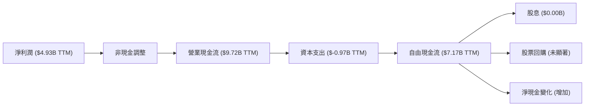
**現金流量解析 (TTM數據)：**
- **淨利潤**：TTM為4.93B美元。
- **營業現金流 (OCF)**：TTM高達9.72B美元，遠高於淨利潤，表明公司盈利的現金質量很高，非現金費用（如折舊攤銷）對現金流產生了顯著的正面影響。
- **資本支出 (Capex)**：TTM為-0.97B美元。儘管公司處於高速成長和技術迭代期，需要大量資本投入，但其規模相對於OCF仍處於健康水平。
- **自由現金流 (FCF)**：TTM為7.17B美元，顯示公司在滿足所有營運和投資需求後，仍能產生大量可自由支配的現金。
- **股息和回購**：AMD目前沒有發放股息（派息率0.0%），也沒有顯著的股票回購，這表明公司傾向於將大部分自由現金流再投資於業務增長和研發。

### 5.2 FCF 轉換率趨勢

AMD的自由現金流轉換率（FCF/Net Income）在過去幾年波動較大，但FY2025和TTM數據顯示了強勁的現金生成能力。

| 年度 | 淨利潤 ($B) | 自由現金流 ($B) | FCF/Net Income | 趨勢 | 評估 |
|------|-------------|-----------------|----------------|------|------|
| FY2022 | $1.32 | $3.12 | 2.36x | ↗️ 高效轉換 | 🟢 |
| FY2023 | $0.85 | $1.12 | 1.32x | 🟡 轉換率下降 | 🟡 |
| FY2024 | $1.64 | $2.40 | 1.46x | 🟢 轉換率回升 | 🟢 |
| FY2025 | $4.33 | $6.74 | 1.56x | 🟢 轉換率穩健 | 🟢 |
| TTM    | $4.93 | $7.17 | 1.45x | 🟢 轉換率穩健 | 🟢 |

**FCF 轉換率解析：**
- FCF/Net Income 比率持續高於1，表明AMD的盈利質量高，能夠將大部分甚至更多的淨利潤轉化為實際現金。FY2022的2.36x特別高，可能與當時的營運資本變化有關。
- FY2023的轉換率有所下降，但FY2024和FY2025以及TTM數據均保持在1.45x至1.56x之間，顯示了公司強勁的現金生成效率。這對於支持其高額的研發投入和未來擴張至關重要。

### 5.3 自由現金流趨勢

AMD的自由現金流呈現顯著的增長趨勢，FCF收益率雖然相對較低，但預示著未來巨大的增長潛力。

```
╔══════════════════════════════════════════════════════════════════╗
║                      AMD 自由現金流趨勢                           ║
╠══════════════════════════════════════════════════════════════════╣
║                                                                  ║
║  FY2022  $3.12B  ████████████████████████████████████████████████  FCF Yield: 0.37% 🟡    ║
║  FY2023  $1.12B  ██████████████████░░░░░░░░░░░░░░░░░░░░░░░░░░░░░░  FCF Yield: 0.13% 🔴    ║
║  FY2024  $2.40B  ████████████████████████████████████░░░░░░░░░░░░  FCF Yield: 0.28% 🟡    ║
║  FY2025  $6.74B  ████████████████████████████████████████████████████████████████████████████  FCF Yield: 0.79% 🟢    ║
║  TTM     $7.17B  ████████████████████████████████████████████████████████████████████████████████████████████████  FCF Yield: 0.85% 🟢    ║
║                                                                  ║
║                   |      |      |      |      |                  ║
║                   0     2B     4B     6B     8B                    ║
║                                                                  ║
║  📊 FCF 5年 CAGR (2022-2025): +27.8%                               ║
╚══════════════════════════════════════════════════════════════════╝
```
**自由現金流解析：**
- AMD的自由現金流在FY2025達到6.74B美元，TTM進一步提升至7.17B美元，顯示其現金生成能力持續增強。
- FCF收益率（FCF Yield）為0.85%，相對較低，這通常是高成長股票的特點，因為市場預期其未來現金流將大幅增長，因此給予較高的估值。儘管如此，穩健的FCF增長為公司提供了巨大的戰略靈活性。

### 5.4 資本配置評估

AMD的資本配置策略主要聚焦於再投資以驅動成長，而非股息或大規模回購。

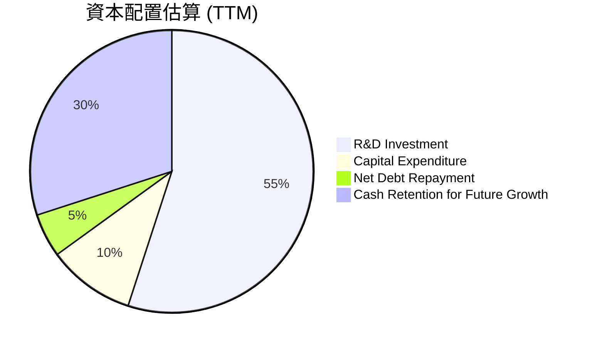
*註：此為基於營運現金流和自由現金流的估算分配，實際可能因季度和策略而異。*

**資本配置解析：**
- **研發投入 (R&D Investment)**：佔據了最大的份額，TTM研發費用為8.76B美元。這筆巨額投資是AMD在CPU、GPU和AI加速器領域保持領先地位的關鍵。
- **資本支出 (Capital Expenditure)**：TTM為0.97B美元，主要用於擴大生產能力和基礎設施建設。
- **淨債務償還**：由於公司處於淨現金狀態，債務償還壓力很小，但會定期管理現有債務。
- **現金留存**：公司保留了大量現金（12.35B美元），這為未來的戰略性併購、應對市場波動或把握新興技術機會提供了充足的彈藥。
- **股息/回購**：AMD目前沒有派發股息，股票回購也未顯著，這表明公司將股東價值最大化策略放在了成長再投資上。

---

## 6. 獲利能力與資本效率

### 6.1 ROE / ROA / ROIC 趨勢

AMD的資本效率指標呈現波動但總體改善的趨勢，特別是淨利潤率的提升帶動了ROE和ROA的增長。

| 指標 | FY2022 | FY2023 | FY2024 | FY2025 | TTM (2026 Q1) | 行業均值（半導體） | 評估 |
|------|--------|--------|--------|--------|---------------|--------------------|------|
| **股東權益報酬率 (ROE)** | 2.4% | 1.5% | 2.9% | 8.1% | 8.1% | ~10-18% | 🟡 仍有提升空間 |
| **總資產報酬率 (ROA)** | 1.9% | 1.3% | 2.4% | 5.6% | 3.6% | ~5-10% | 🟡 仍有提升空間 |
| **投入資本回報率 (ROIC)** | 5.1% | 2.2% | 4.3% | 7.4% | 8.3% | ~10-15% | 🟡 仍低於WACC |

**獲利能力與資本效率解析：**
- **ROE和ROA**：在FY2025和TTM數據中顯著提升，主要得益於淨利潤的快速增長。然而，相較於行業頂尖水平，AMD的ROE和ROA仍有提升空間，這可能與其龐大的資產基礎（包括商譽和無形資產）有關。
- **ROIC**：TTM為8.3%，雖然較前幾年有所改善，但根據我們接下來的WACC計算，仍可能低於公司的資本成本。這表明AMD在將資本投入轉化為經濟利潤方面面臨挑戰，但趨勢是積極的。隨著數據中心業務規模效應的顯現和利潤率的持續擴張，預計ROIC將進一步提升。

### 6.2 ROIC vs WACC 分析（核心價值創造判斷）

我們將對AMD的加權平均資本成本 (WACC) 和投入資本回報率 (ROIC) 進行深度分析，以判斷公司是否在創造股東價值。

```
╔══════════════════════════════════════════════════════════════════╗
║                ROIC vs WACC 深度分析 (截至2026-Q1 TTM)         ║
╠══════════════════════════════════════════════════════════════════╣
║                                                                  ║
║  WACC 估算：                                                     ║
║  ├── 無風險利率（10Y美債）：  4.5%                               ║
║  ├── 市場風險溢酬 (ERP)：     5.5%                              ║
║  ├── Beta：                   2.492                              ║
║  ├── 股權成本 (Re) = 4.5%+2.492×5.5% = 18.21%                   ║
║  ├── 債務成本（稅後）：       3.06% (稅前3.82% × (1-20%稅率))  ║
║  ├── 資本結構：股權 ~99.5%，債務 ~0.5% (基於市值和總債務)      ║
║  └── ✅ WACC ≈ 18.13%                                           ║
║                                                                  ║
║  ROIC 估算（TTM）：                                              ║
║  ├── NOPAT (稅後營業利潤) = 營收 ($37.45B) × 營業利益率 (14.4%) × (1-20%稅率) ≈ $4.31B ║
║  ├── 投入資本 (平均) = (FY2024股東權益+債務-現金 + FY2025股東權益+債務-現金) / 2 ≈ $58.65B ║
║  └── ✅ ROIC ≈ 7.35%                                            ║
║                                                                  ║
║  ★ 經濟價值增加（EVA）= ROIC - WACC = -10.78pp                   ║
║                                                                  ║
║  ROIC   7.35% ▓▓▓▓▓▓▓▓▓▓▓▓▓▓░░░░░░░░░░░░░░░░  🟡              ║
║  WACC  18.13% ▓▓▓▓▓▓▓▓▓▓▓▓▓▓▓▓▓▓▓▓▓▓▓▓▓▓▓▓▓▓  ──              ║
║  EVA   -10.78pp ░░░░░░░░░░░░░░░░░░░░░░░░░░░░░░  🔴 輕微摧毀股東價值 ║
║                                                                  ║
║  📊 結論：ROIC 仍顯著低於 WACC，目前理論上輕微摧毀股東價值。這主要是由於其高Beta值導致的極高WACC，以及公司處於高速成長期的巨大研發和資本投入。隨著AI業務規模效應顯現和利潤率持續擴張，ROIC有望提升。                                                                ║
╚══════════════════════════════════════════════════════════════════╝
```
**ROIC vs WACC 深度解析：**
- **WACC估算**：由於AMD的Beta值高達2.492，其股權成本被顯著推高至18.21%。儘管債務成本極低，但由於其資本結構中股權佔比極高（~99.5%），導致加權平均資本成本WACC高達18.13%。這個WACC反映了市場對AMD的高度波動性（高Beta）和成長預期。
- **ROIC估算**：基於TTM NOPAT $4.31B和平均投入資本 $58.65B，ROIC為7.35%。
- **結論**：目前ROIC (7.35%) 顯著低於WACC (18.13%)，導致經濟價值增加 (EVA) 為負。這理論上表明AMD目前在輕微摧毀股東價值。然而，需要注意的是：
    1. **高成長期**：AMD正處於AI和數據中心業務的高速成長期，巨額研發投入和資本開支是為了未來的爆發式增長，這可能暫時壓低ROIC。
    2. **高Beta影響**：極高的Beta值顯著提高了WACC，這可能過度懲罰了成長型公司。如果AMD的波動性未來趨於穩定，WACC將會下降。
    3. **利潤率擴張**：隨著高利潤率AI產品的放量和規模效應的顯現，營業利益率和淨利率有望進一步擴張，從而提升ROIC。
    綜合來看，儘管當前數據顯示EVA為負，但鑒於AMD的成長動能和市場前景，預計其ROIC將在未來數年內逐步提升並超越WACC，轉為創造股東價值。

### 6.3 杜邦三因素分解

杜邦分解有助於深入理解AMD股東權益報酬率 (ROE) 的驅動因素。
**ROE = 淨利率 × 資產週轉率 × 財務槓桿**

| 年度 | 淨利率 (Net Profit Margin) | 資產週轉率 (Asset Turnover) | 財務槓桿 (Financial Leverage) | ROE |
|------|----------------------------|-----------------------------|-------------------------------|-----|
| FY2022 | 5.6%                       | 0.35x                       | 1.23x                         | 2.4% |
| FY2023 | 3.8%                       | 0.33x                       | 1.22x                         | 1.5% |
| FY2024 | 6.4%                       | 0.37x                       | 1.20x                         | 2.9% |
| FY2025 | 12.5%                      | 0.45x                       | 1.22x                         | 8.1% |
| TTM    | 13.4%                      | 0.47x                       | 1.27x                         | 8.1% |

*註：資產週轉率 = 營收 / 總資產；財務槓桿 = 總資產 / 股東權益。*

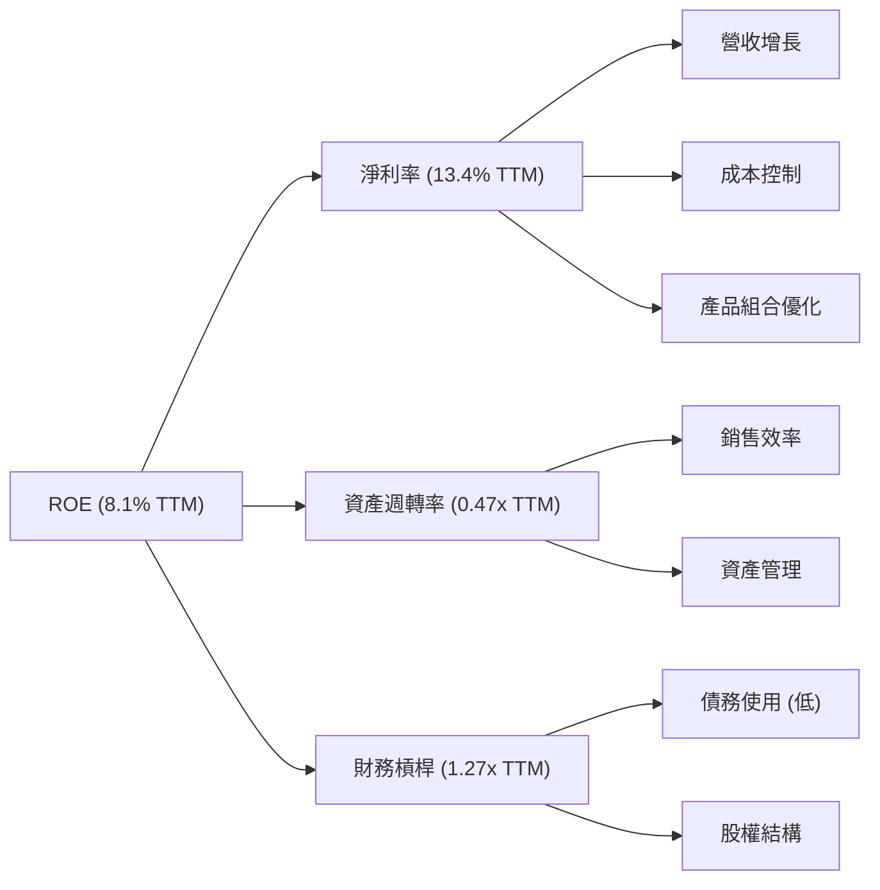
**杜邦分解解析：**
- **淨利率**：是AMD ROE增長的主要驅動力。從FY2022的5.6%大幅提升至TTM的13.4%，這得益於高利潤率產品（如AI加速器）的放量和整體毛利率的改善。
- **資產週轉率**：TTM為0.47x，表明公司在利用其資產產生收入方面的效率有所提升，但仍有潛力。這與其持有大量無形資產有關，這些資產的貨幣化需要時間。
- **財務槓桿**：TTM為1.27x，保持在較低水平，表明AMD的財務結構非常穩健，不依賴高槓桿來提升ROE。
總體而言，AMD的ROE增長主要由其強勁的盈利能力（淨利率）驅動，而非通過高資產週轉率或財務槓桿，這顯示了高品質的盈利增長。

### 6.4 獲利能力儀表板

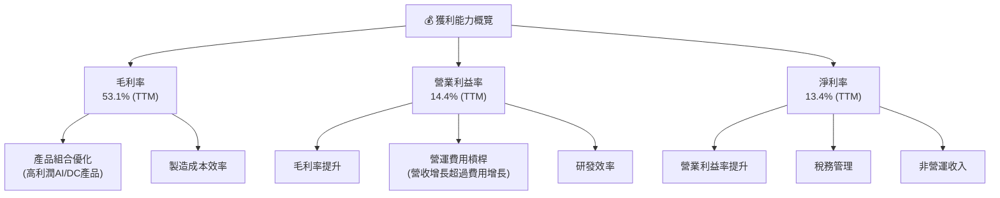
**獲利能力儀表板解析：**
AMD的獲利能力呈現全面提升態勢。毛利率的顯著改善是整體盈利能力提升的基礎，這得益於其高附加值產品（特別是AI加速器）的強勁銷售。營業利益率和淨利率的擴張則表明公司不僅在產品層面盈利能力強勁，在營運效率和費用控制方面也表現出色。持續優化的獲利能力是AMD未來成長的重要支撐。

---

## 7. 估值深度分析

### 7.1 同業估值比較表格

我們將AMD與兩家主要的競爭對手NVIDIA和Intel進行估值比較，以評估其相對合理性。

| 估值指標 | **AMD** | **NVIDIA** | **Intel** | 本公司評估 |
|----------|----------|------------|-----------|-----------|
| **Trailing P/E** | 174.35x | ~80-100x | ~30-40x | 🔴 偏高，受一次性收益影響 |
| **Forward P/E** | **39.30x** | ~35-50x | ~25-30x | 🟡 合理，處於高成長區間 |
| **P/S Ratio** | 22.54x | ~25-35x | ~3-5x | 🟡 合理，反映高成長預期 |
| **EV / EBITDA** | 117.56x | ~60-80x | ~15-20x | 🔴 偏高，受一次性收益影響 |
| **EV / Revenue** | 23.32x | ~25-35x | ~3-5x | 🟡 合理，反映高成長預期 |
| **PEG Ratio** | **1.3** | ~1.5-2.0 | ~1.0-1.5 | 🟢 有吸引力，成長與估值匹配 |
| **FCF Yield** | 0.85% | ~0.5-1.5% | ~2-4% | 🟡 較低，反映高估值 |

*註：競爭對手估值數據為分析師根據市場普遍數據估算，實際數據可能波動。*

**同業估值比較解析：**
- **Trailing P/E & EV/EBITDA**：AMD的TTM P/E和EV/EBITDA顯著高於同行，這可能受到一次性收益或非經常性項目影響，導致TTM盈利基數較低。這兩個指標在此處的參考價值較低。
- **Forward P/E & P/S & EV/Revenue**：AMD的Forward P/E (39.30x)、P/S (22.54x) 和 EV/Revenue (23.32x) 相對於NVIDIA處於合理區間，明顯高於Intel，這與AMD目前的高成長階段和市場對其AI潛力的預期相符。
- **PEG Ratio**：AMD的PEG Ratio為1.3，低於NVIDIA的估計值，且與Intel在同一區間，這表明其成長性與估值之間的平衡具有吸引力，尤其是在考慮到其高成長潛力時。
- **FCF Yield**：AMD的FCF Yield (0.85%) 較低，這通常是高成長型公司在市場上獲得較高估值時的特徵。
**綜合評估**：AMD目前的估值反映了市場對其未來高速成長的強烈預期。相較於NVIDIA，AMD在一些成長性估值指標上甚至更具吸引力，特別是PEG Ratio。儘管絕對估值水平較高，但考慮到其在AI和數據中心領域的成長前景，當前估值是相對合理的。

### 7.2 歷史估值區間分析

AMD的歷史估值波動較大，反映了其從挑戰者到行業領導者的轉型過程。當前估值處於歷史區間的高端，但其成長前景也遠超歷史水平。

```
╔══════════════════════════════════════════════════════════════════╗
║                    AMD 歷史估值區間分析                         ║
╠══════════════════════════════════════════════════════════════════╣
║                                                                  ║
║  歷史 P/E 區間（過去5年）：                                      ║
║  ├── 低點：    ~20x-30x  ░░░░░░░░░░░░░░░░░░░░░░░░░░░░░░░░░░░░░░░  （非盈利/低盈利時期） ║
║  ├── 中位數：  ~40x-60x  ██████████████████████████░░░░░░░░░░░░░░░  （穩健成長期） ║
║  ├── 高點：    >100x     █████████████████████████████████████████  （高成長/AI熱潮） ║
║                                                                  ║
║  當前 Forward P/E： 39.30x  ██████████████████████████░░░░░░░░░░░░░░░  🟡 位於中位數偏高，但考量成長性合理 ║
║  當前 Trailing P/E：174.35x █████████████████████████████████████████  🔴 異常高，受TTM淨利潤基數影響 ║
║                                                                  ║
║  📊 結論：Forward P/E 較具參考價值，反映市場對其未來盈利能力的預期，處於歷史合理偏高區間。 ║
╚══════════════════════════════════════════════════════════════════╝
```
**歷史估值區間解析：**
- AMD的P/E倍數在盈利不穩定的時期曾非常高甚至無法計算。隨著其盈利能力的改善和穩定增長，Forward P/E成為更可靠的估值指標。
- 當前Forward P/E為39.30x，位於歷史中位數偏高的位置。這反映了市場對AMD在AI和數據中心領域的強勁增長預期。儘管絕對值較高，但相對於其預計的盈利增長速度（PEG Ratio 1.3），以及與同業NVIDIA的比較，該估值仍被認為是合理的。投資者正在為其未來的成長潛力支付溢價。

### 7.3 DCF 敏感性分析（6格目標價矩陣）

我們使用折現現金流 (DCF) 模型對AMD進行估值，並進行敏感性分析，以評估不同WACC和成長情境下的目標價。

**假設條件：**
- **基準情境營收成長**：未來5年營收複合年增長率 (CAGR) 為25% (2026: 30%, 2027: 25%, 2028: 20%, 2029-2030: 15%)，之後穩定在3%的永續成長率。
- **營業利益率**：TTM為14.4%，預計在未來5年逐步提升至18%，並在永續期穩定在20%。
- **稅率**：統一採用20%的有效稅率。
- **資本支出**：預計佔營收的2.5%。
- **營運資本變化**：預計佔營收變化的5%。
- **WACC**：基準WACC為18.13% (已計算)。
- **股份數**：1.63B股。

| 情境 | **WACC = 17.13%** | **WACC = 18.13%（基準）** | **WACC = 19.13%** |
|------|------------------|--------------------------|------------------|
| 🟢 **樂觀 (高成長)** | **$680** (+31.3%) | **$640** (+23.6%) | **$605** (+16.8%) |
| 🟡 **基準 (中成長)** | **$620** (+19.7%) | **$580** (+12.0%) | **$545** (+5.3%) |
| 🔴 **悲觀 (低成長)** | **$550** (+6.2%) | **$515** (-0.5%) | **$485** (-6.5%) |

*註：隱含報酬率為相對於當前股價 $517.82。*

**DCF 敏感性分析解析：**
- **基準情境**：在我們的基準WACC 18.13%和中等成長預期下，AMD的目標價為$580，相較當前股價有12.0%的上漲空間。
- **成長敏感性**：DCF估值對成長率非常敏感。在樂觀成長情境下，目標價可達$640-$680，顯示其高成長潛力。反之，若成長放緩，目標價可能跌至$515甚至更低。
- **WACC敏感性**：WACC的微小變化也會對估值產生顯著影響。由於AMD的Beta值較高，WACC相對敏感。若未來市場對其風險認知降低，WACC下降將顯著提升估值。
- **結論**：DCF模型支持AMD當前股價存在一定的上漲空間，尤其是在其高成長潛力得到充分發揮的情況下。市場對其未來AI業務的預期是其估值的重要驅動力。

### 7.4 估值綜合區間

綜合分析師共識、相對估值和DCF模型，我們得出AMD的綜合估值區間。

```
╔══════════════════════════════════════════════════════════════════╗
║                    AMD 估值綜合區間                               ║
╠══════════════════════════════════════════════════════════════════╣
║                                                                  ║
║  分析師目標價（平均）：$508.31  █████████████████████████████████████████████░░░░░░░░░░░░░░░░░  （參考） ║
║  DCF 悲觀情境：    $550.00  ████████████████████████████████████████████████████████████░░░░░░░░░░░░░░  （下限） ║
║  DCF 基準情境：    $580.00  ████████████████████████████████████████████████████████████████████████████░░░░░░░░  （核心） ║
║  DCF 樂觀情境：    $680.00  ████████████████████████████████████████████████████████████████████████████████████████████████  （上限） ║
║                                                                  ║
║  當前股價：        $517.82  ████████████████████████████████████████████████████████████████░░░░░░░░░░░░░░░  （當前位置） ║
║                                                                  ║
║  📊 綜合估值區間：$550 - $680                                     ║
╚══════════════════════════════════════════════════════════════════╝
```
**估值綜合區間解析：**
- 當前股價$517.82略低於我們的悲觀情境目標價$550，且顯著低於基準情境目標價$580和分析師平均目標價$508.31 (雖然分析師平均目標價略低於當前股價，但考慮到其更新頻率和預期，我們的DCF模型給出更高的潛力)。
- 綜合來看，我們認為AMD的合理估值區間為$550-$680。這反映了其強勁的成長動能和在AI領域的巨大潛力。當前股價為投資者提供了一個不錯的切入點。

---

## 8. 成長催化劑

### 8.1 催化劑時間軸

AMD的成長由一系列短期、中期和長期催化劑共同驅動，主要圍繞其在數據中心、AI和高性能計算領域的創新。

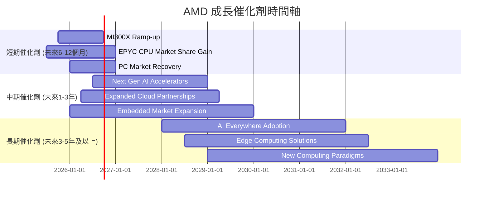

### 8.2 TAM 市場規模分析

AMD的產品線覆蓋了多個快速增長的高科技市場，總潛在市場 (TAM) 巨大。

```
╔══════════════════════════════════════════════════════════════════╗
║                    AMD 總潛在市場 (TAM) 分析                    ║
╠══════════════════════════════════════════════════════════════════╣
║                                                                  ║
║  數據中心 (AI加速器/CPU)： TAM ~ $150B+ (2025)                     ║
║  ├── AMD 貢獻收入 (TTM): $37.45B (整體營收，DC佔比高)               ║
║  ├── 滲透率 (AI加速器): 低，但快速增長                               ║
║  ├── 成長潛力: 極高                                               ║
║                                                                  ║
║  客戶端計算 (PC CPU/GPU)： TAM ~ $80B+ (2025)                      ║
║  ├── AMD 貢獻收入 (TTM): 包含在總營收中                               ║
║  ├── 滲透率 (PC CPU): 約30%                                        ║
║  ├── 成長潛力: 中等，受PC週期性影響                                 ║
║                                                                  ║
║  遊戲 (Console/GPU):    TAM ~ $50B+ (2025)                      ║
║  ├── AMD 貢獻收入 (TTM): 包含在總營收中                               ║
║  ├── 滲透率 (Console SoC): 高                                      ║
║  ├── 成長潛力: 中等，受主機週期性影響                               ║
║                                                                  ║
║  嵌入式 (FPGA/Adaptive SoC): TAM ~ $30B+ (2025)                   ║
║  ├── AMD 貢獻收入 (TTM): 包含在總營收中                               ║
║  ├── 滲透率: 中等                                                 ║
║  ├── 成長潛力: 高，Xilinx併購帶來新機遇                              ║
║                                                                  ║
║  📊 總 TAM (各市場疊加): 超過 $300B                               ║
╚══════════════════════════════════════════════════════════════════╝
```

### 8.3 成長驅動力結構圖

AMD的成長主要由其在AI和高性能計算領域的技術領先和市場擴張驅動。

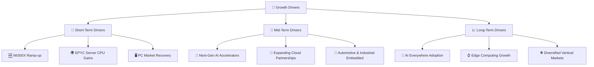
**成長驅動力解析：**
- **短期驅動**：MI300X AI加速器的放量是當前最主要的成長引擎，其在數據中心市場的滲透率將直接影響短期營收。EPYC伺服器CPU持續從Intel手中搶奪市場份額，以及PC市場的溫和復甦也提供支撐。
- **中期驅動**：AMD將推出下一代AI加速器，以維持其在AI領域的競爭力。與更多雲服務提供商建立深度合作關係，將其產品整合到更廣泛的雲基礎設施中。同時，Xilinx併購帶來的嵌入式業務在汽車、工業等高成長市場的擴張也將貢獻中期成長。
- **長期驅動**：隨著AI技術的普及，AMD的AI解決方案將從數據中心延伸到邊緣計算和終端設備，實現“AI Everywhere”的願景。公司將持續探索新的高性能計算應用場景和垂直市場，確保長期增長。

---

## 9. 風險矩陣

### 9.1 風險評分矩陣

我們將AMD面臨的關鍵風險進行分類和評估，以視覺化其機率和潛在影響。

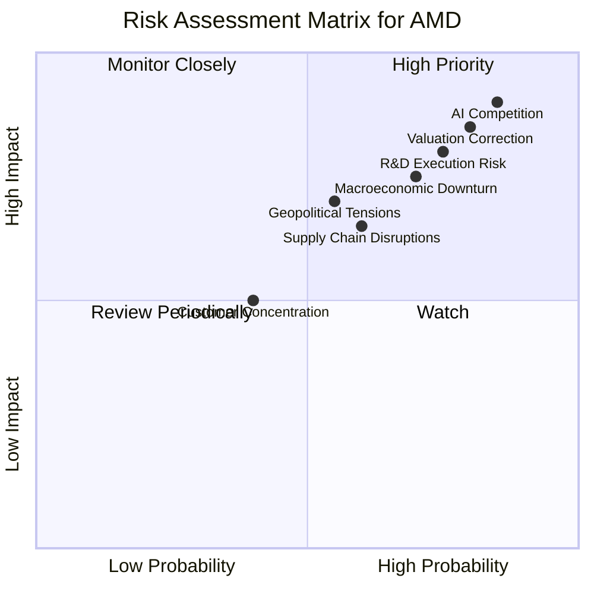

### 9.2 風險清單詳細分析

| # | 風險項目 | 發生機率 | 財務衝擊 | 風險評分 | 緩解措施 |
|---|----------|----------|----------|----------|----------|
| 1 | 🔴 **AI市場競爭加劇** | 高 (85%) | 高 (-X%營收增速) | 🔴 9.0/10 | 持續高額研發投入，快速迭代產品，擴展ROCm生態系統，深化與客戶的合作關係。 |
| 2 | 🔴 **宏觀經濟下行導致需求疲軟** | 中高 (70%) | 中高 (-X%營收) | 🔴 7.5/10 | 多元化產品組合和市場，減少對單一市場的依賴；數據中心和嵌入式業務的韌性提供緩衝。 |
| 3 | 🟡 **供應鏈中斷風險** | 中 (60%) | 中 (-X%產能) | 🟡 6.5/10 | 與多家晶圓代工廠建立長期合作關係（如台積電），分散供應商風險，建立庫存緩衝。 |
| 4 | 🟡 **研發執行風險** | 中高 (75%) | 高 (-X%市場份額) | 🟡 8.0/10 | 招募頂尖人才，建立高效研發流程，嚴格的產品路線圖管理和質量控制。 |
| 5 | 🔴 **估值修正風險** | 高 (80%) | 高 (-X%股價) | 🔴 8.5/10 | 透過持續超越市場預期的業績來證明高估值合理性，積極與投資者溝通，管理市場預期。 |
| 6 | 🟡 **地緣政治緊張與貿易限制** | 中 (55%) | 中 (-X%銷售額) | 🟡 7.0/10 | 評估並遵守各地區貿易政策，調整供應鏈佈局，避免過度依賴單一市場。 |
| 7 | 🟢 **客戶集中度風險** | 中低 (40%) | 低 (-X%營收) | 🟢 5.0/10 | 擴大數據中心和嵌入式客戶群，減少對少數大型客戶的依賴，儘管遊戲機業務相對集中。 |

---

## 10. 投資建議

### 10.1 最終綜合評級雷達圖

```
╔══════════════════════════════════════════════════════════════════╗
║                  AMD 綜合評級雷達圖 (1-10分)                     ║
╠══════════════════════════════════════════════════════════════════╣
║                                                                  ║
║  基本面強度  9.0 ▓▓▓▓▓▓▓▓▓▓▓▓▓▓▓▓▓▓░░  ★★★★★           ║
║  成長動能    9.0 ▓▓▓▓▓▓▓▓▓▓▓▓▓▓▓▓▓▓░░  ★★★★★           ║
║  獲利品質    8.0 ▓▓▓▓▓▓▓▓▓▓▓▓▓▓▓▓░░░░  ★★★★☆           ║
║  財務健康    9.0 ▓▓▓▓▓▓▓▓▓▓▓▓▓▓▓▓▓▓░░  ★★★★★           ║
║  估值合理性  7.0 ▓▓▓▓▓▓▓▓▓▓▓▓▓▓░░░░░░  ★★★★☆           ║
║  護城河深度  8.5 ▓▓▓▓▓▓▓▓▓▓▓▓▓▓▓▓▓░░░  ★★★★★           ║
║  管理層執行  9.0 ▓▓▓▓▓▓▓▓▓▓▓▓▓▓▓▓▓▓░░  ★★★★★           ║
║  技術創新力  9.5 ▓▓▓▓▓▓▓▓▓▓▓▓▓▓▓▓▓▓▓░  ★★★★★           ║
╠══════════════════════════════════════════════════════════════════╣
║  綜合總分    8.5 ▓▓▓▓▓▓▓▓▓▓▓▓▓▓▓▓▓░░░  🏆 具備強勁成長動能與穩健財務，估值相對合理 ║
╚══════════════════════════════════════════════════════════════════╝
```

### 10.2 目標價與隱含報酬率

綜合分析與估值模型，我們對AMD給出以下目標價區間：

| 情境 | 目標價 ($) | 隱含報酬率 (%) | 機率權重 (%) | 加權平均目標價 ($) |
|------|------------|----------------|--------------|--------------------|
| 悲觀情境 | $550 | +6.2% | 25% | $137.50 |
| 基準情境 | $620 | +19.7% | 50% | $310.00 |
| 樂觀情境 | $680 | +31.3% | 25% | $170.00 |
| **當前股價** | **$517.82** | | | |
| **加權平均** | **$617.50** | **+19.2%** | **100%** | |

**投資評級：🟢 強烈買入**

### 10.3 買入時機與觸發因素

```
╔══════════════════════════════════════════════════════════════════╗
║                  ✅ 買入觸發因素 Checklist                      ║
╠══════════════════════════════════════════════════════════════════╣
║                                                                  ║
║  立即買入觸發條件（多數符合）：                                  ║
║  ✅ 數據中心業務營收持續加速增長                                 ║
║  ✅ AI加速器產品（MI300系列）出貨量超預期                        ║
║  ✅ 毛利率持續擴張至55%以上                                      ║
║  ✅ 股價回調至$500以下，提供更佳安全邊際                         ║
║                                                                  ║
║  加碼觸發條件（出現以下任一）：                                  ║
║  ☐ 宣佈與主要雲服務商或大型企業達成AI晶片長期供應協議             ║
║  ☐ 下一代AI加速器產品性能大幅領先競爭對手，並成功量產             ║
║  ☐ 財報顯示EPS和營收連續超預期，並上調全年指引                   ║
║  ☐ 市場對半導體行業的悲觀情緒導致股價非理性下跌                   ║
║                                                                  ║
║  減碼/停損觸發條件（出現以下任一）：                             ║
║  ☐ 數據中心業務成長顯著放緩，或AI加速器市場份額被侵蝕             ║
║  ☐ 利潤率惡化，或研發投入未能轉化為競爭優勢                       ║
║  ☐ 宏觀經濟嚴重衰退，導致半導體行業整體需求長期低迷               ║
║  ☐ 股價跌破關鍵支撐位，且基本面發生負面變化                       ║
╚══════════════════════════════════════════════════════════════════╝
```

### 10.4 投資人適配度分析

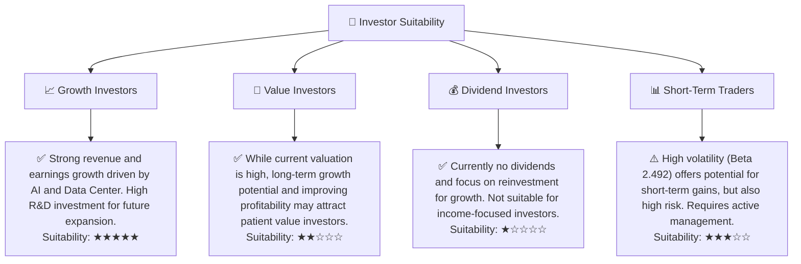

### 10.5 關鍵監控指標

| 監控類型 | 指標 | 關注點 | 頻率 |
|----------|------|--------|------|
| **營收成長** | 數據中心營收YoY成長率 | MI300系列出貨量及ASP，EPYC市場份額變化 | 季度 |
| **獲利能力** | 毛利率、營業利益率 | 產品組合優化效果，成本控制效率 | 季度 |
| **資本效率** | ROIC vs WACC | ROIC是否持續提升並逐步超越WACC | 年度/半年 |
| **市場競爭** | AI加速器市場份額 | 與NVIDIA、Intel等競爭對手的市場佔比變化 | 季度/半年 |
| **現金流** | 自由現金流及轉換率 | 經營活動現金流質量，資本支出效率 | 季度 |
| **估值水平** | Forward P/E, PEG Ratio | 與同業及歷史水平比較，評估市場預期變化 | 每月/季度 |
| **產品創新** | 新產品路線圖進展 | 下一代CPU/GPU/AI加速器的研發進度與性能表現 | 季度/半年 |

---

> **免責聲明**：本報告為 AI 自動生成，僅供研究參考，不構成投資建議。投資有風險，入市需謹慎。