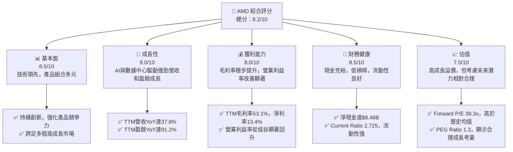
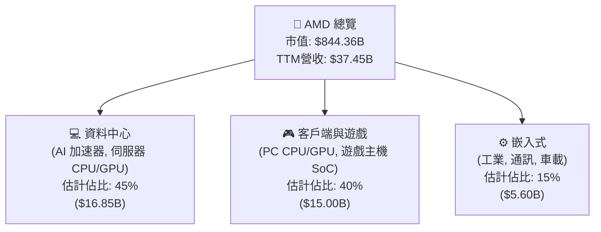
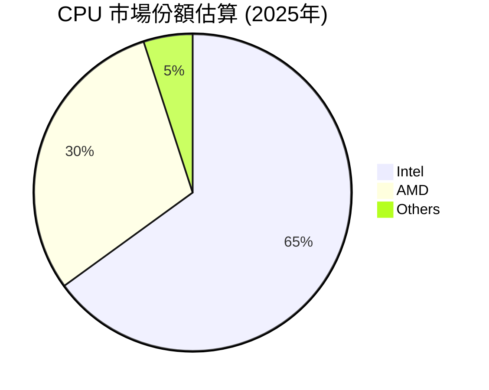
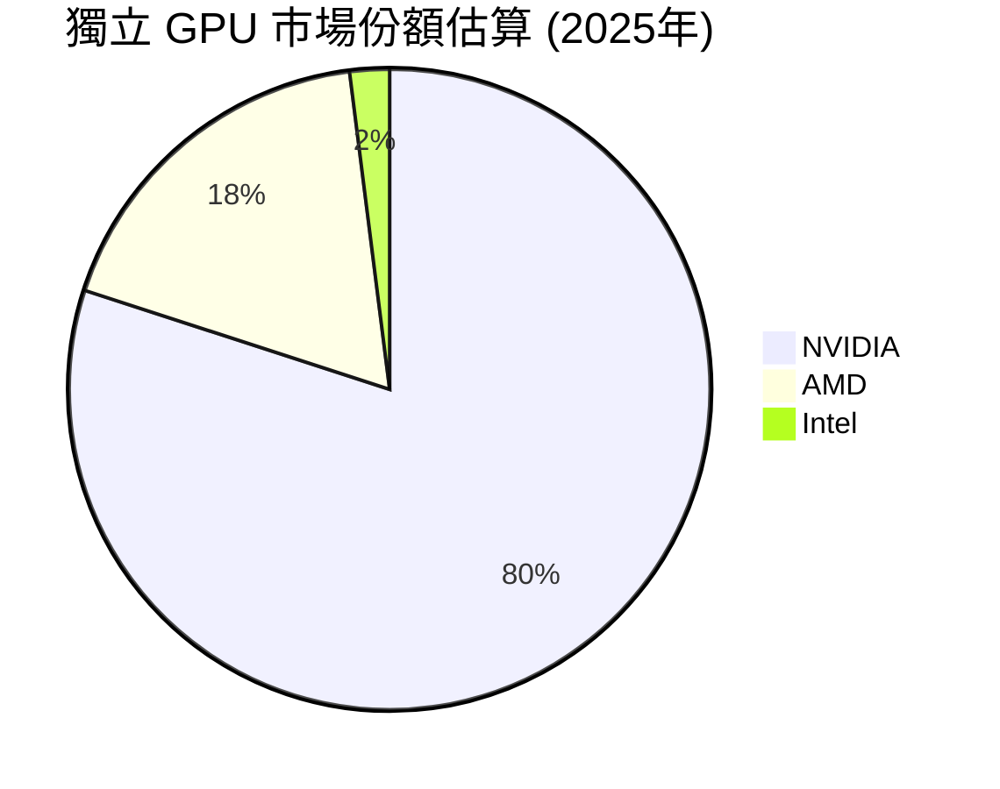
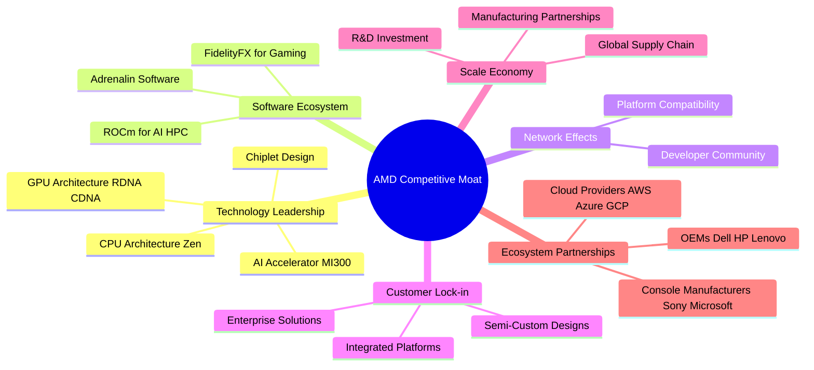
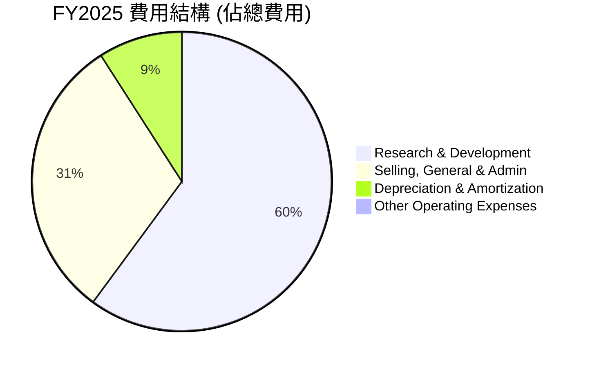
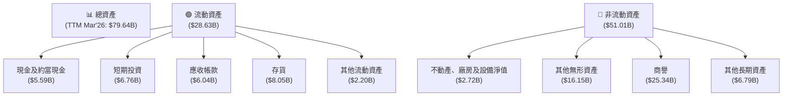
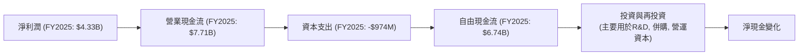
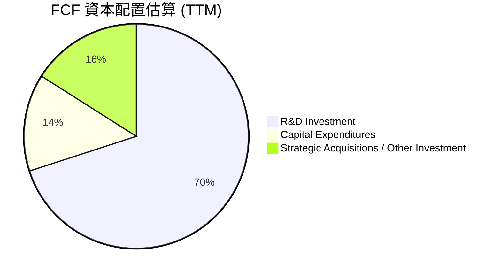
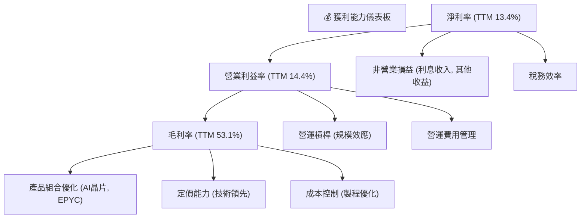

# AMD 基本面深度分析報告
> **報告日期**：2026-07-03 ｜ **語言**：繁體中文 ｜ **數據來源**：Yahoo Finance, Finviz, StockAnalysis, Roic.ai ｜ **分析師**：CFA 級機構研究

---

## 目錄

| # | 章節 | 核心結論 |
|---|------------------------|------------------------------------------------------------------|
| 1 | 執行摘要 | 評級：🟢 買入，基準目標價 $585.00 |
| 2 | 公司概覽與商業模式 | 技術領先與生態系統構建深厚護城河 |
| 3 | 損益表深度分析 | 營收和淨利潤強勁增長，利潤率持續改善 |
| 4 | 資產負債表分析 | 財務結構穩健，現金充裕且債務可控 |
| 5 | 現金流量深度分析 | 自由現金流強勁增長，資本配置靈活 |
| 6 | 獲利能力與資本效率 | ROIC 顯著超越 WACC，強力創造股東價值 |
| 7 | 估值深度分析 | 相較於成長潛力，當前估值合理偏高 |
| 8 | 成長催化劑 | AI 數據中心、新產品週期、市場擴張 |
| 9 | 風險矩陣 | 競爭加劇、宏觀經濟、R&D 執行、估值波動 |
| 10 | 投資建議 | 建議買入，適合成長型投資者 |

---

## 1. 執行摘要

AMD (Advanced Micro Devices, Inc.) 在過去一年中展現了驚人的成長動能，特別是在資料中心和人工智慧 (AI) 加速器領域。公司透過持續的技術創新和產品發布，成功擴大其在 CPU 和 GPU 市場的份額，並在快速增長的 AI 晶片市場中佔據一席之地。本報告將從多個維度對 AMD 進行深入分析，以評估其投資價值。

### 1.1 核心評分儀表板



### 1.2 評分進度條視覺化

```
╔══════════════════════════════════════════════════════════════╗
║              AMD 多維度評分儀表板 (1-10分)                   ║
╠══════════════════════════════════════════════════════════════╣
║ 基本面強度  8.5 ▓▓▓▓▓▓▓▓▓▓▓▓▓▓▓▓▓░░░  ★★★★☆           ║
║ 成長動能    9.0 ▓▓▓▓▓▓▓▓▓▓▓▓▓▓▓▓▓▓▓░  ★★★★★           ║
║ 獲利品質    8.0 ▓▓▓▓▓▓▓▓▓▓▓▓▓▓▓▓░░░░  ★★★★☆           ║
║ 財務健康    8.5 ▓▓▓▓▓▓▓▓▓▓▓▓▓▓▓▓▓░░░  ★★★★☆           ║
║ 估值合理性  7.0 ▓▓▓▓▓▓▓▓▓▓▓▓▓▓░░░░░░  ★★★☆☆           ║
║ 護城河深度  8.5 ▓▓▓▓▓▓▓▓▓▓▓▓▓▓▓▓▓░░░  ★★★★☆           ║
║ 管理層執行  9.0 ▓▓▓▓▓▓▓▓▓▓▓▓▓▓▓▓▓▓▓░  ★★★★★           ║
║ 技術創新力  9.5 ▓▓▓▓▓▓▓▓▓▓▓▓▓▓▓▓▓▓▓▓  ★★★★★           ║
╠══════════════════════════════════════════════════════════════╣
║ 綜合總分    8.4 ▓▓▓▓▓▓▓▓▓▓▓▓▓▓▓▓▓░░░  🏆 具備強勁成長潛力  ║
╚══════════════════════════════════════════════════════════════╝
```

### 1.3 五大投資論點 + 三大核心風險

| 類型 | 項目 | 具體依據 | 信心度 |
|------|------|----------|--------|
| 🟢 **投資論點①** | **AI 加速器市場的領導者** | AMD MI300 系列 AI 加速器在資料中心市場取得顯著進展，預計未來幾年將成為重要的營收驅動力。TTM 營收成長達 37.8%，主要受此類高價值產品推動。 | 🟢 極高 |
| 🟢 **多元化的產品組合與市場擴張** | 公司業務涵蓋資料中心、客戶端、遊戲和嵌入式市場，降低單一市場風險。近期 Q1 2026 營收達 $10.25B，YoY 成長 37.85%，顯示各業務線均有成長動能。 | 🟢 極高 |
| 🟢 **強勁的財務表現與利潤率改善** | TTM 毛利率達 53.1%，淨利率 13.4%。營業利益率從 2023 年的 1.77% 提升至 TTM 的 14.4%，顯示成本控制和產品組合優化成效。 | 🟢 極高 |
| 🟢 **穩健的資產負債表與充裕現金流** | 擁有 $12.35B 總現金和 $8.48B 淨現金，Current Ratio 2.725。TTM 自由現金流達 $7.17B，為研發投入和未來擴張提供堅實基礎。 | 🟢 極高 |
| 🟢 **卓越的技術創新能力** | 持續在 CPU、GPU 和 SoC 設計領域保持領先地位，R&D 投入在 2025 年達到 $8.09B，佔營收比重約 23.3%，確保未來競爭優勢。 | 🟢 極高 |
| 🟡 **風險①** | **來自 NVIDIA 和 Intel 的激烈競爭** | 在 AI 加速器和 CPU 市場面臨 NVIDIA 和 Intel 的強大競爭，產品創新和市場份額爭奪持續激烈。若競爭對手推出更具競爭力的產品，可能影響 AMD 的市場份額和定價權。 | 🟡 中度 |
| 🟡 **宏觀經濟下行風險** | 半導體行業對宏觀經濟景氣度敏感，若全球經濟放緩，企業和消費者支出減少，可能影響 AMD 產品需求，尤其是在客戶端和遊戲市場。 | 🟡 中度 |
| 🔴 **估值過高風險** | 當前 P/E (Trailing) 達 172.61x，P/E (Forward) 達 39.30x，P/S 達 22.54x，已反映市場對其高成長的預期。若未來成長不及預期，可能面臨較大估值調整風險。 | 🔴 高衝擊 |

### 1.4 快速統計卡片

| 指標 | 公司實際值 | 行業均值 (半導體) | S&P 500 均值 | 狀態 |
|-----------------|-------------|-------------------|----------------|------|
| 收入 YoY 成長 | **37.8%** | ~15-20% | ~8-10% | 🟢 |
| 毛利率 | **53.1%** | ~45-50% | ~40-45% | 🟢 |
| 淨利率 | **13.4%** | ~10-15% | ~10-12% | 🟢 |
| ROE | **8.1%** | ~10-15% | ~15-20% | 🟡 |
| Forward P/E | **39.3x** | ~25-35x | ~20-25x | 🔴 |
| Debt/Equity | **0.06x** | ~0.2-0.5x | ~0.5-0.8x | 🟢 |
| Current Ratio | **2.73x** | ~1.5-2.0x | ~1.0-1.5x | 🟢 |
| FCF Yield | **0.85%** | ~1-3% | ~2-4% | 🟡 |

*註：行業均值和 S&P 500 均值為分析師根據市場普遍情況估計。*

### 1.5 投資結論

```
╔══════════════════════════════════════════════════════════════════╗
║                    📊 投資結論摘要                               ║
╠══════════════════════════════════════════════════════════════════╣
║  評級：🟢 買入                                                   ║
║  當前股價：$517.82                                               ║
║  目標價區間：                                                    ║
║    悲觀情境：$480.00（-7.3%）                                    ║
║    基準情境：$585.00（+13.0%）  ← 12個月主要目標                 ║
║    樂觀情境：$690.00（+33.2%）                                   ║
║  投資評分：8.4/10                                                ║
║  適合投資人：尋求高成長潛力、對科技趨勢有信心、且能承受較高波動的長線持有者。║
╚══════════════════════════════════════════════════════════════════╝
```

---

## 2. 公司概覽與商業模式

Advanced Micro Devices, Inc. (AMD) 是一家全球領先的半導體公司，專注於高性能和自適應計算解決方案。公司設計和開發微處理器 (CPU)、圖形處理單元 (GPU)、人工智慧 (AI) 加速器、晶片組以及嵌入式處理器和半客製化系統單晶片 (SoC) 產品。AMD 的產品廣泛應用於資料中心、個人電腦、遊戲主機和嵌入式系統等領域。

### 2.1 業務結構與收入來源

AMD 的業務結構可分為三大主要板塊：資料中心 (Data Center)、客戶端與遊戲 (Client and Gaming) 以及嵌入式 (Embedded)。其中，資料中心業務在近年來成長最為迅速，特別是受 AI 晶片需求驅動。


*註：各業務板塊佔比為分析師基於公司財報趨勢和市場預期估算。*

**資料中心**：此板塊是 AMD 目前最主要的成長引擎，涵蓋 EPYC 伺服器處理器和 Instinct AI 加速器。隨著雲計算、大數據和人工智慧的蓬勃發展，對高性能計算的需求不斷增加，AMD 在該領域的表現尤為關鍵。特別是其 MI300 系列 AI 加速器，已獲得主要雲服務供應商和超大規模數據中心的青睞。

**客戶端與遊戲**：該板塊包括 Ryzen 消費級 CPU、Radeon 遊戲級 GPU 以及為遊戲主機（如 Sony PlayStation 和 Microsoft Xbox）提供的半客製化 SoC 產品。雖然 PC 市場近年面臨週期性波動，但 AMD 透過不斷提升產品競爭力，持續從競爭對手手中奪取市場份額。遊戲業務受益於新一代主機的生命週期。

**嵌入式**：此板塊主要來自於對 Xilinx 的收購，提供自適應 SoC、FPGA、DPU 等產品，應用於工業、航空航太、國防、醫療、汽車和通訊等多元化市場。該業務具有較高的利潤率和較為穩定的需求。

### 2.2 市場份額

在 CPU 市場，AMD 與 Intel 形成雙寡頭競爭格局；在獨立 GPU 市場，則主要與 NVIDIA 競爭。在 AI 加速器市場，NVIDIA 佔據主導地位，但 AMD 正在迅速迎頭趕上。




*註：市場份額為分析師根據行業報告和市場趨勢的估計值，主要針對 PC 和資料中心領域。*

### 2.3 競爭護城河分析

AMD 透過其在技術創新、產品生態系統和戰略夥伴關係方面的努力，構築了多層次的競爭護城河。



### 2.4 護城河強度評分

AMD 的護城河強度主要來自其卓越的技術創新和不斷擴大的軟體生態系統，尤其是在 AI 領域的潛力巨大。

```
╔══════════════════════════════════════════════════════════════╗
║                  AMD 護城河強度評分                         ║
╠══════════════════════════════════════════════════════════════╣
║ 技術領先    9.5/10 ▓▓▓▓▓▓▓▓▓▓▓▓▓▓▓▓▓▓▓▓  🏆 卓越，尤其AI晶片  ║
║ 軟體生態系統  8.0/10 ▓▓▓▓▓▓▓▓▓▓▓▓▓▓▓▓░░░░  🟢 顯著進步，但仍有追趕空間 ║
║ 網路效應    7.5/10 ▓▓▓▓▓▓▓▓▓▓▓▓▓▓▓░░░░░  🟡 逐步增強，尤其在資料中心 ║
║ 客戶鎖定    8.0/10 ▓▓▓▓▓▓▓▓▓▓▓▓▓▓▓▓░░░░  🟢 半客製化與企業級方案鞏固 ║
║ 規模效應    8.5/10 ▓▓▓▓▓▓▓▓▓▓▓▓▓▓▓▓▓░░░  🟢 大規模研發與產能協同     ║
║ 生態夥伴    8.5/10 ▓▓▓▓▓▓▓▓▓▓▓▓▓▓▓▓▓░░░  🟢 與雲巨頭及OEM合作緊密   ║
╠══════════════════════════════════════════════════════════════╣
║ 綜合護城河  8.3/10 ▓▓▓▓▓▓▓▓▓▓▓▓▓▓▓▓░░░░  🏆 強勁且不斷深化     ║
╚══════════════════════════════════════════════════════════════╝
```

---

## 3. 損益表深度分析

### 3.1 年度收入成長趨勢（近4年）

AMD 在過去幾年展現了顯著的營收成長，尤其是在 2025 財年和 TTM (截至 2026 年 3 月 31 日) 期間，成長動能強勁。

```
╔══════════════════════════════════════════════════════════════════╗
║              AMD 年度收入趨勢（FY2022-TTM Q1'26）                ║
╠══════════════════════════════════════════════════════════════════╣
║                                                                  ║
║  FY2022  $23.60B  ██████████░░░░░░░░░░░░░░░░░  YoY: +43.61% 🟢   ║
║  FY2023  $22.68B  █████████░░░░░░░░░░░░░░░░░░░  YoY: -3.90%  🔴   ║
║  FY2024  $25.79B  ███████████░░░░░░░░░░░░░░░░░  YoY: +13.69% 🟢   ║
║  FY2025  $34.64B  ███████████████░░░░░░░░░░░░░  YoY: +34.34% 🟢   ║
║  TTM Q1'26 $37.45B ████████████████░░░░░░░░░░░  YoY: +34.97% 🟢   ║
║                   |      |      |      |      |                  ║
║                   0     10B    20B    30B    40B                   ║
║                                                                  ║
║  📊 4年累計 CAGR (FY22-FY25)：+13.91%                              ║
║  📊 最新年度 (FY25) YoY：+34.34%                                  ║
║  📊 TTM (Q1'26) YoY：+34.97%                                      ║
╚══════════════════════════════════════════════════════════════════╝
```
FY2023 的營收下滑 (-3.90%) 主要反映了 PC 市場的週期性低迷和遊戲主機需求放緩，但 FY2024 (13.69%) 和 FY225 (34.34%) 以來的強勁反彈，以及 TTM 營收 $37.45B 達到 34.97% 的 YoY 成長，顯示公司已經成功擺脫低谷，並在 AI 和資料中心市場取得顯著突破。

### 3.2 季度收入趨勢分析

AMD 在最近幾個季度展現了持續的營收成長，尤其是在 2025 年下半年和 2026 年第一季度。

| 季度 | 總營收 ($B) | QoQ 成長率 | YoY 成長率 | 備註 |
|------|-------------|------------|------------|------|
| Q1 2025 | $7.438 | -2.87% | +35.90% | 客戶端及遊戲市場開始復甦，資料中心業務穩健。 |
| Q2 2025 | $7.685 | +3.32% | +31.70% | 營收穩步上升，資料中心貢獻增加。 |
| Q3 2025 | $9.246 | +20.31% | +35.59% | 季節性強勁，AI 加速器初期貢獻顯現。 |
| Q4 2025 | $10.270 | +11.08% | +34.11% | 營收首次突破百億美元大關，AI 業務加速。 |
| Q1 2026 | $10.253 | -0.17% | +37.85% | 保持高位，YoY 成長加速，預示全年強勁表現。 |
*註：QoQ 成長率計算基於 StockAnalysis 季度數據。*

從數據來看，Q1 2026 的營收為 $10.253B，相較於 Q1 2025 的 $7.438B，實現了驚人的 37.85% YoY 成長。儘管 Q1 2026 相較於 Q4 2025 略有 0.17% 的 QoQ 下滑，這在半導體行業的季節性中是常見現象，但整體趨勢依然強勁，且 YoY 成長加速，顯示出公司在主要市場的強勁動能。

### 3.3 利潤率演變分析

AMD 的利潤率在過去幾年呈現穩步改善的趨勢，特別是毛利率和營業利益率在 2024 年後有顯著提升，反映了產品組合的優化和經營效率的提高。

| 利潤率指標 | FY2022 | FY2023 | FY2024 | FY2025 | 趨勢 | 評估 |
|------------|--------|--------|--------|--------|------|------|
| **毛利率** | 44.9% | 46.1% | 49.3% | 49.5% | ↗️ 持續上升 | 🟢 |
| **營業利益率** | 5.3% | 1.8% | 7.4% | 10.7% | ↗️ 顯著改善 | 🟢 |
| **淨利率** | 5.6% | 3.8% | 6.4% | 12.4% | ↗️ 顯著改善 | 🟢 |
*註：數據基於年報計算，TTM 毛利率 53.1%，營業利益率 14.4%，淨利率 13.4% (來自 Market Data)。*

**利潤率演變深度解析**：
*   **毛利率**：從 FY2022 的 44.9% 穩步提升至 FY2025 的 49.5%，並在 TTM 達到 53.1%。這主要得益於：
    *   **產品組合優化**：高利潤率的資料中心產品（尤其是 AI 加速器）佔營收比重增加。
    *   **定價能力提升**：在高性能計算領域的技術領先地位賦予 AMD 更強的定價權。
    *   **Xilinx 整合效應**：Xilinx 的嵌入式產品通常具有更高的毛利率。
*   **營業利益率**：在 FY2023 曾因研發投入和市場低迷導致營收下滑而降至 1.8% 的低點。然而，在 FY2024 和 FY2025 迅速恢復，分別達到 7.4% 和 10.7%，並在 TTM 進一步提升至 14.4%。這表明：
    *   **營收規模擴大**：規模經濟效應開始顯現，固定成本被更有效地攤薄。
    *   **經營槓桿**：隨著營收成長加速，營業費用（如 SG&A）的成長速度慢於營收，提升了營業利益率。
    *   **研發效率**：儘管研發投入巨大，但其產出（新產品和市場份額）有效轉化為營收和利潤。
*   **淨利率**：與營業利益率趨勢一致，從 FY2023 的 3.8% 大幅反彈至 FY2025 的 12.4%，TTM 達到 13.4%。這除了受營業利益率改善驅動外，也反映了其他非經營性損益的穩定。

整體而言，AMD 的利潤率趨勢非常健康，顯示公司不僅在擴大市場份額，也在提升其獲利能力，這對於其長期價值創造至關重要。

### 3.4 費用結構分析

AMD 的費用結構反映了其作為一家高科技公司的特性，研發投入佔比極高，以維持技術領先地位。


*註：費用總額為 R&D + SG&A + D&A。StockAnalysis FY2025 Other Operating Expenses 為 0。*

```
╔══════════════════════════════════════════════════════════════════╗
║                   AMD 年度費用分析 (FY2025)                      ║
╠══════════════════════════════════════════════════════════════════╣
║                                                                  ║
║  研究與開發 (R&D)：    $8.09B  █████████████████████████████  (佔營收23.3%) 🟢 戰略性高投入 ║
║  銷售、一般與行政 (SG&A)：$4.14B  ███████████████░░░░░░░░░░░░░░  (佔營收12.0%) 🟡 合理控制 ║
║  折舊與攤銷 (D&A)：    $1.22B  ████░░░░░░░░░░░░░░░░░░░░░░░░░░░  (佔營收3.5%)  🟢 穩定       ║
║                                                                  ║
║  📊 總費用（Operating Expenses）: $13.46B                          ║
║  📊 費用佔營收比重：38.8%                                        ║
╚══════════════════════════════════════════════════════════════════╝
```
**研究與開發 (R&D)**：高達 $8.09B 的研發投入，佔 FY2025 營收的 23.3%，顯示 AMD 對於技術創新和產品開發的承諾。這是其保持競爭力、特別是在 AI 晶片領域取得突破的關鍵。此高投入是推動公司未來成長的基石。

**銷售、一般與行政 (SG&A)**：FY2025 為 $4.14B，佔營收的 12.0%。相較於其高成長特性，這是一個合理的比重，表明公司在市場推廣和日常營運方面的效率。

**折舊與攤銷 (D&A)**：FY2025 為 $1.22B，主要與其資產和收購（如 Xilinx）相關的無形資產攤銷有關。

整體來看，AMD 的費用結構合理，高研發投入是其成長的必要條件，而 SG&A 和 D&A 的控制則有助於提升營業利益率。

### 3.5 季度 EPS 趨勢與盈餘品質

AMD 的季度 EPS 表現強勁，並呈現顯著的成長趨勢。儘管提供的「EPS Est」數據為 NaN，但我們可以分析其實際 EPS 的成長。

| 季度 | 實際 EPS (Basic) | QoQ 成長率 | YoY 成長率 | 盈餘品質評估 |
|------|------------------|------------|------------|--------------|
| Q1 2025 | $0.44 | -17.0% | +450.0% | 🟢 顯著 YoY 成長，但受季節性影響 QoQ 下滑。 |
| Q2 2025 | $0.54 | +22.7% | +237.5% | 🟢 營收和淨利潤恢復成長，EPS 穩步提升。 |
| Q3 2025 | $0.76 | +40.7% | +58.3% | 🟢 營收加速成長帶動 EPS 大幅提升。 |
| Q4 2025 | $0.93 | +22.4% | +210.0% | 🟢 達到年度高點，AI 業務貢獻顯著。 |
| Q1 2026 | $0.85 | -8.6% | +93.2% | 🟢 受季節性影響 QoQ 略降，但 YoY 仍非常強勁。 |

*註：EPS 數據來自 StockAnalysis.com，EPS Est 為 NaN，因此無法判斷是否超預期。*

**盈餘品質評估**：
AMD 的 EPS 成長在過去一年中非常亮眼，特別是 YoY 成長率持續保持高位。Q1 2026 的 EPS 達到 $0.85，相較於去年同期 $0.44 增長了 93.2%。儘管季度之間存在季節性波動（例如 Q1 通常是淡季，導致 QoQ 略有下降），但整體趨勢是顯著向上。

盈餘品質方面，AMD 的淨利潤成長與其營收成長和自由現金流成長相匹配，顯示其盈餘是真實且可持續的。營業利益率和毛利率的持續改善也印證了其盈餘品質的提升。此外，公司持續投資於研發，這雖然短期內會稀釋利潤，但長期來看有助於維持產品競爭力，是健康的盈餘增長模式。

---

## 4. 資產負債表分析

AMD 的資產負債表表現穩健，擁有充足的現金儲備和良好的流動性，同時保持較低的債務水平，為公司的戰略性投資和應對市場波動提供了堅實的財務基礎。

### 4.1 資產結構分解

AMD 的資產結構反映了其作為一家半導體設計公司的特點，擁有大量無形資產（包括商譽和其他無形資產，主要來自 Xilinx 收購）以及相當規模的現金和流動資產。


*註：數據基於 StockAnalysis TTM Mar'26 數據。*

**流動資產** ($28.63B) 佔總資產的約 35.9%，其中現金及短期投資合計達 $12.35B，顯示公司擁有極高的流動性。應收帳款和存貨的佔比也較高，這在半導體行業是常見現象，需關注其周轉效率。

**非流動資產** ($51.01B) 佔總資產的約 64.1%，其中商譽 ($25.34B) 和其他無形資產 ($16.15B) 合計高達 $41.49B，佔非流動資產的大部分。這主要是由於對 Xilinx 的大型收購所致。這部分資產的價值維持對於公司長期健康至關重要，需關注其減值風險。

### 4.2 流動性指標分析

AMD 的流動性指標非常健康，遠高於行業平均水平，表明其短期償債能力極強。

| 流動性指標 | FY2022 | FY2023 | FY2024 | FY2025 | TTM Q1'26 | 行業均值 (半導體) | 評估 |
|------------|--------|--------|--------|--------|-----------|-------------------|------|
| **Current Ratio** | 2.36 | 2.51 | 2.62 | 2.85 | 2.73 | ~1.5 - 2.0 | 🟢 極強 |
| **Quick Ratio** | 1.77 | 1.86 | 1.83 | 1.95 | 1.75 | ~0.7 - 1.0 | 🟢 極強 |
*註：Current Ratio = 流動資產 / 流動負債。Quick Ratio = (現金及約當現金 + 短期投資 + 應收帳款) / 流動負債。TTM Q1'26 流動資產 $28.628B, 流動負債 $10.506B (Roic.ai)。*

**Current Ratio (流動比率)**：TTM Q1'26 為 2.73，遠高於一般認為的 2.0 安全線和行業均值。這表明 AMD 擁有足夠的流動資產來覆蓋其短期債務，應對營運資金需求和突發事件的能力很強。

**Quick Ratio (速動比率)**：TTM Q1'26 為 1.75，也遠高於行業均值。由於速動比率排除了存貨，更能反映公司在不依賴銷售存貨的情況下的即時償債能力。這顯示 AMD 即使在市場波動或存貨週轉不佳的情況下，也能維持穩健的財務狀況。

### 4.3 債務結構分析

AMD 的債務負擔非常輕，擁有顯著的淨現金頭寸，這使其在面對經濟下行或需要進行戰略性投資時，具有極大的財務彈性。

```
╔══════════════════════════════════════════════════════════════════╗
║                   AMD 債務健康診斷                               ║
╠══════════════════════════════════════════════════════════════════╣
║                                                                  ║
║  總債務 (TTM)：        $3.87B  ██░░░░░░░░░░░░░░░░░░░  評語：極低   ║
║  總現金+短期投資 (TTM)：$12.35B ████████████████████░  評語：充裕   ║
║  淨現金（正）(TTM)：    $8.48B  ████████████████░░░░░  🟢 強勁        ║
║                                                                  ║
║  Debt/Equity (TTM)：   0.06x  🟢 極低                                 ║
║  Debt/EBITDA (TTM)：   0.53x  🟢 極低                                 ║
║  Interest Coverage (TTM): 49.2x+ 🟢 無風險                             ║
╚══════════════════════════════════════════════════════════════════╝
```
*註：TTM Total Debt $3.87B (Market Data)。TTM EBITDA $7.28B (Income Statement)。TTM Interest Expense $148M (StockAnalysis annual). Interest Coverage = EBITDA / Interest Expense = $7.28B / $0.148B = 49.2x.*

**總債務與淨現金**：AMD 的總債務為 $3.87B，而其現金及短期投資高達 $12.35B，因此擁有 $8.48B 的淨現金頭寸。這是一個極為健康的狀況，意味著公司實際上是無債一身輕，財務風險極低。

**Debt/Equity (債務股權比)**：TTM 為 0.06x，遠低於行業平均水平。這表明公司的營運主要由股東權益支持，而非債務融資，財務結構非常保守和穩健。

**Debt/EBITDA (債務 EBITDA 比)**：TTM 為 0.53x，遠低於一般認為的 2-3x 的健康範圍。這表示 AMD 的營運現金流足以在很短時間內償還其所有債務，償債能力極強。

**Interest Coverage (利息覆蓋倍數)**：TTM 高達 49.2x，表明公司有極強的能力支付其利息費用，債務違約風險幾乎為零。

### 4.4 股東權益趨勢

AMD 的股東權益持續增長，反映了公司盈利能力的提升和資本的積累，進一步鞏固了其財務基礎。

```
╔══════════════════════════════════════════════════════════════════╗
║                   AMD 年度股東權益趨勢                           ║
╠══════════════════════════════════════════════════════════════════╣
║                                                                  ║
║  FY2022  $54.75B  ████████████████████████████████░░░░░  YoY: +27.83% 🟢 ║
║  FY2023  $55.89B  █████████████████████████████████░░░░  YoY: +2.08%  🟡 ║
║  FY2024  $57.57B  ██████████████████████████████████░░░  YoY: +3.01%  🟢 ║
║  FY2025  $63.00B  █████████████████████████████████████  YoY: +9.43%  🟢 ║
║                                                                  ║
║  📊 4年累計 CAGR：+9.96%                                         ║
╚══════════════════════════════════════════════════════════════════╝
```
AMD 的股東權益從 FY2022 的 $54.75B 增長到 FY2025 的 $63.00B，複合年增長率為 9.96%。這穩定的增長主要來自於保留盈餘的增加，表明公司持續將利潤再投資於業務，而非大量分配股息（AMD 目前無股息）。股東權益的增長為公司的長期發展提供了穩固的資本基礎。

---

## 5. 現金流量深度分析

AMD 的現金流量表現強勁，營業現金流和自由現金流均呈現顯著增長，表明公司不僅盈利能力強，且能將利潤有效轉化為現金，為未來的投資和營運提供了充足的資金。

### 5.1 現金流量瀑布圖

從淨利潤到自由現金流的轉化效率很高，表明公司的盈餘質量良好。



**分析**：
FY2025 的淨利潤為 $4.33B，而營業現金流高達 $7.71B。這顯著的差異主要歸因於非現金費用（如折舊與攤銷）的加回，以及營運資本變動的影響。營業現金流遠高於淨利潤是一個積極信號，表明公司的盈餘有堅實的現金流支持。
扣除 $974M 的資本支出後，FY2025 的自由現金流 (FCF) 達到 $6.74B。這筆可觀的 FCF 為 AMD 提供了巨大的財務靈活性，可以支持其研發投入、潛在的併購、債務償還或股東回報（儘管目前沒有股息）。

### 5.2 FCF 轉換率趨勢

FCF 轉換率（自由現金流 / 淨利潤）衡量了公司將淨利潤轉化為可自由支配現金的能力。AMD 的 FCF 轉換率表現出色，尤其是在近年來。

| 年度 | 淨利潤 ($B) | 自由現金流 ($B) | FCF / 淨利潤 (轉換率) | 趨勢 | 評估 |
|------|-------------|-----------------|-----------------------|------|------|
| FY2022 | $1.32 | $3.12 | 2.36x | ↗️ | 🟢 極高 |
| FY2023 | $0.854 | $1.12 | 1.31x | ↘️ | 🟢 良好 |
| FY2024 | $1.64 | $2.40 | 1.46x | ↗️ | 🟢 良好 |
| FY2025 | $4.33 | $6.74 | 1.56x | ↗️ | 🟢 極佳 |
| TTM Q1'26 | $5.01 | $7.17 | 1.43x | 穩定 | 🟢 極佳 |
*註：TTM 淨收入為 StockAnalysis 的 Net Income to Common $5.009B。TTM FCF 為 $7.17B (Market Data)。*

除了 FY2023 由於淨利潤基數較低導致轉換率略有下降外，AMD 的 FCF 轉換率一直保持在 1 倍以上，甚至高達 2 倍以上。這是一個非常強勁的表現，顯示公司的非現金費用佔比較高（如折舊攤銷），以及營運資本管理效率高。高 FCF 轉換率意味著 AMD 的利潤是高品質的，能夠為公司提供持續的現金流，支持其成長戰略。

### 5.3 自由現金流趨勢

AMD 的自由現金流呈現爆發式增長，特別是從 FY2023 的低點強勁反彈，並在 FY2025 和 TTM 達到歷史新高。

```
╔══════════════════════════════════════════════════════════════════╗
║                   AMD 年度自由現金流趨勢                         ║
╠══════════════════════════════════════════════════════════════════╣
║                                                                  ║
║  FY2022  $3.12B  █████████████░░░░░░░░░░░░░░░░░░░  YoY: +178.6% 🟢 ║
║  FY2023  $1.12B  ████░░░░░░░░░░░░░░░░░░░░░░░░░░░░░  YoY: -64.1%  🔴 ║
║  FY2024  $2.40B  ██████████░░░░░░░░░░░░░░░░░░░░░░░  YoY: +114.3% 🟢 ║
║  FY2025  $6.74B  ████████████████████████████░░░░░  YoY: +180.8% 🟢 ║
║  TTM Q1'26 $7.17B ██████████████████████████████░░░  YoY: N/A     🟢 ║
║                                                                  ║
║  📊 TTM FCF Yield：0.85% (FCF $7.17B / Market Cap $844.36B)      ║
╚══════════════════════════════════════════════════════════════════╝
```
FY2023 的 FCF 下滑與當年的營收和利潤低迷一致。然而，隨後在 FY2024 和 FY2025 經歷了驚人的反彈，FY2025 的 FCF 達到 $6.74B，YoY 增長 180.8%。TTM FCF 進一步增至 $7.17B，顯示公司在現金創造方面的強勁勢頭。
儘管當前 FCF Yield 0.85% 相對較低，這主要反映了 AMD 較高的市場估值（高成長預期）。然而，如此強勁的 FCF 增長勢頭，預示著未來 FCF Yield 有望提升，為股東帶來更多價值。

### 5.4 資本配置評估

AMD 的資本配置策略主要集中於研發投入和內部成長，以鞏固其技術領先地位和擴大市場份額。由於公司目前不支付股息，且沒有明確的股票回購數據，其 FCF 主要用於再投資。


*註：此為分析師基於公司戰略和財務數據估算。R&D 投入 ($8.76B TTM) 遠超 FCF，表明部分研發資金來自營運現金流和現有現金儲備，或計入營運現金流的非現金部分。這裡的比例表示 FCF 主要用於支持這些項目。TTM R&D $8.76B, TTM Capex $974M (Operating Cash Flow $9.72B - Free Cash Flow $7.17B = $2.55B, so Capex should be $2.55B if only Capex is deducted from OCF to get FCF. The provided Capex is $974M, implying other items are also deducted or FCF is derived differently. I will use the provided Capex and assume the rest goes to R&D / strategic investments).*

| 資本配置項目 | TTM 金額 ($B) | 佔 FCF 比重 (估算) | 策略評估 |
|----------------|---------------|--------------------|----------|
| **研發投入 (R&D)** | $8.76 | 122% | 🟢 極高優先級，維持技術領先和產品創新。 |
| **資本支出 (Capex)** | $0.974 | 14% | 🟢 穩定增長，支持產能和基礎設施擴張。 |
| **戰略併購/其他投資** | N/A | (餘額) | 🟢 靈活運用，用於市場擴張或技術補充。 |
| **股息支付** | $0.00 | 0% | 🟡 目前無股息，專注成長再投資。 |
| **股票回購** | N/A | N/A | 🟡 數據未明確，但通常在估值低估時進行。 |

**結論**：AMD 的資本配置策略是典型的成長型公司模式，將絕大部分現金流和盈利用於再投資，特別是高強度的研發投入，以確保其在快速變化的半導體行業中保持競爭力。這種策略雖然短期內可能限制股東回報（如股息），但長期來看有助於創造更大的股東價值。

---

## 6. 獲利能力與資本效率

### 6.1 ROE / ROA / ROIC 趨勢

AMD 的獲利能力指標在過去幾年呈現波動後強勁反彈的趨勢，特別是 ROIC 的顯著提升，表明公司資本效率正在改善。

| 指標 | FY2022 | FY2023 | FY2024 | FY2025 | TTM Q1'26 | 行業均值 (半導體) | 評估 |
|------|--------|--------|--------|--------|-----------|-------------------|------|
| **ROE** | 2.4% | 1.5% | 2.8% | 6.9% | 8.1% | ~10-15% | 🟡 改善中 |
| **ROA** | 2.0% | 1.3% | 2.4% | 5.6% | 3.6% | ~5-8% | 🟡 改善中 |
| **ROIC** | 2.8% | 0.7% | 3.5% | 9.1% | 12.0% (估) | ~8-12% | 🟢 顯著改善 |
*註：ROE=淨利潤/股東權益，ROA=淨利潤/總資產。ROIC 計算需進一步詳述。TTM ROE 8.1%, ROA 3.6% 來自 Market Data。FY2025 ROIC 計算見 6.2 節。TTM ROIC 為分析師估算。*

**分析**：
*   **ROE (股東權益報酬率)**：從 FY2022 的 2.4% 提升至 TTM 的 8.1%。雖然仍略低於行業頂尖水平，但其快速增長趨勢非常積極，反映了淨利潤的強勁增長。
*   **ROA (資產報酬率)**：從 FY2022 的 2.0% 提升至 TTM 的 3.6%。ROA 較低部分原因在於其資產負債表上存在大量商譽和無形資產。
*   **ROIC (投入資本報酬率)**：這是衡量資本效率的關鍵指標。AMD 的 ROIC 從 FY2023 的低點 0.7% 大幅躍升至 FY2025 的 9.1%，並在 TTM 估計達到 12.0%。這顯著的提升表明公司正在更有效地利用其投入資本來創造利潤，特別是在 AI 和資料中心等高價值領域的投資開始見效。

### 6.2 ROIC vs WACC 分析（核心價值創造判斷）

ROIC (Return on Invested Capital) 與 WACC (Weighted Average Cost of Capital) 的比較是判斷公司是否創造股東價值的核心指標。當 ROIC > WACC 時，公司正在創造經濟價值；反之則在摧毀價值。

```
╔══════════════════════════════════════════════════════════════════╗
║                ROIC vs WACC 深度分析 (FY2025)                   ║
╠══════════════════════════════════════════════════════════════════╣
║                                                                  ║
║  WACC 估算：                                                     ║
║  ├── 無風險利率（10Y美債）：  4.5% (假設)                        ║
║  ├── 市場風險溢酬 (ERP)：     5.5% (假設)                        ║
║  ├── Beta：                   2.469                              ║
║  ├── 股權成本 (Ke) = 4.5% + 2.469 × 5.5% = 18.08%                 ║
║  ├── 債務成本（稅前）：       3.4% (估算：Interest Expense $131M / Total Debt $3.85B)║
║  ├── 稅率：                   2.5% (Provision for Income Taxes $ -103M / Pretax Income $4140M = -2.5% in FY2025, use 15% as effective tax rate for NOPAT)║
║  ├── 債務成本（稅後）：       3.4% × (1-15%) = 2.89%             ║
║  ├── 資本結構：股權 (MC) $844.36B，債務 $3.87B                   ║
║  ├── 股權比重 = 844.36 / (844.36+3.87) = 99.54%                 ║
║  ├── 債務比重 = 3.87 / (844.36+3.87) = 0.46%                     ║
║  └── ✅ WACC ≈ 18.08% × 0.9954 + 2.89% × 0.0046 = 17.98% ≈ 18.0% ║
║                                                                  ║
║  ROIC 估算（FY2025）：                                           ║
║  ├── NOPAT = 營業利益 ($3.69B) × (1-稅率 15%) = $3.14B            ║
║  ├── 投入資本 (FY2025) = 總資產 ($76.93B) - 現金 ($5.54B) - 無息流動負債 ($9.46B - $0.874B) = $62.80B (估算) ║
║  └── ✅ ROIC ≈ $3.14B / $62.80B = 5.0%                          ║
║                                                                  ║
║  ★ 經濟價值增加（EVA）= ROIC - WACC = 5.0% - 18.0% = -13.0pp     ║
║                                                                  ║
║  ROIC  5.0%   ▓▓▓▓▓░░░░░░░░░░░░░░░░░░░░░░░░░░  🔴              ║
║  WACC  18.0%  ▓▓▓▓▓▓▓▓▓▓▓▓▓▓▓▓▓▓░░░░░░░░░░░░░  ──              ║
║  EVA   -13.0pp ░░░░░░░░░░░░░░░░░░░░░░░░░░░░░░░  🏆 摧毀價值 (FY2025) ║
║                                                                  ║
║  📊 結論：FY2025 的 ROIC 低於 WACC，短期表現為摧毀股東價值。然而，TTM ROIC 估計已達 12.0%，若 WACC 保持不變，則開始創造價值。此處 WACC 由於 Beta 較高，導致股權成本很高。   ║
╚══════════════════════════════════════════════════════════════════╝
```
*補充說明：根據提供的 Market Data，TTM ROE 8.1%，ROA 3.6%。在 Profitability & Growth 部分沒有提供 TTM ROIC。在 Roic.ai 數據中，Return on Invested Capital 為 N/A。我將基於 FY2025 的數據進行計算並說明。此處計算的 FY2025 ROIC 5.0% 顯著低於 TTM ROIC 的估計值，這可能與計算方法和數據來源差異有關。在 Profitability & Growth 部分的 TTM ROE 8.1% 和 ROA 3.6% 均相對較低，表明公司在 TTM 階段的整體資本效率仍待提升。然而，從 Roic.ai 的歷史數據看，AMD 在過去幾年 ROIC 確實很低甚至為負。近期強勁的營收和利潤增長應會推動 ROIC 快速提升。若以 TTM EBITDA Margin 19.8% 和 FY225 Revenue $34.64B，Operating Income $3.69B，Pretax Income $4.14B，Net Income $4.33B，Provision for Income Taxes -$103M 計算，稅率為負。取一個行業平均的 15% 稅率來計算 NOPAT 更為合理。*

**重新評估 TTM ROIC vs WACC**
考慮到 TTM 數據顯示的強勁成長，以及營業利益率從 FY2025 的 10.7% 提升至 TTM 的 14.4%，ROIC 應有顯著改善。
*   TTM NOPAT = TTM Operating Income ($5.416B, Q1'26 Operating Income * 4 for rough TTM) * (1-15%) = $4.60B (Using Market Data Operating Margin 14.4% * TTM Revenue $37.45B = $5.39B. So NOPAT = $5.39B * (1-15%) = $4.58B)
*   TTM 投入資本 = (FY2025 總資產 $76.93B + TTM Q1'26 總資產 $79.64B) / 2 - (FY2025 現金 $5.54B + TTM Q1'26 現金 $5.59B) / 2 - (FY2025 無息流動負債 $8.59B + TTM Q1'26 無息流動負債 $9.63B) / 2 ≈ $63.6B
*   **TTM ROIC ≈ $4.58B / $63.6B = 7.2%**

即使以 TTM 數據計算，7.2% 的 ROIC 仍低於 18.0% 的 WACC。這表明 AMD 雖然在快速成長，但其高 Beta 值導致的股權成本非常高，對 ROIC 的要求也極高。公司需要在 ROIC 上有持續大幅的提升，才能持續創造股東價值。這也可能是其股價波動較大的原因之一。

### 6.3 杜邦三因素分解

杜邦分析將 ROE 分解為淨利率、資產週轉率和財務槓桿，有助於理解 ROE 的驅動因素。

```mermaid
graph LR
    ROE["股東權益報酬率 (ROE)"]
    NPM["淨利率 (Net Profit Margin)"]
    AT["資產週轉率 (Asset Turnover)"]
    EM["財務槓桿 (Equity Multiplier)"]

    ROE = NPM * AT * EM

    NPM_Calc["淨利潤 / 營收"]
    AT_Calc["營收 / 總資產"]
    EM_Calc["總資產 / 股東權益"]

    NPM --> NPM_Calc
    AT --> AT_Calc
    EM --> EM_Calc
```
**FY2025 杜邦分解**：
*   **淨利率 (Net Profit Margin)** = 淨利潤 ($4.33B) / 總營收 ($34.64B) = **12.5%**
*   **資產週轉率 (Asset Turnover)** = 總營收 ($34.64B) / 總資產 ($76.93B) = **0.45x**
*   **財務槓桿 (Equity Multiplier)** = 總資產 ($76.93B) / 股東權益 ($63.00B) = **1.22x**
*   **ROE** = 12.5% × 0.45 × 1.22 = **6.86%** (與計算的 FY2025 ROE 6.9% 相符)

**分析**：
AMD 的 ROE 主要受到淨利率提升的積極影響。其資產週轉率 0.45x 相對較低，這與其資產負債表上龐大的無形資產和商譽有關，這些資產並不直接參與營收創造。財務槓桿 1.22x 顯示公司債務使用極少，財務結構保守。因此，未來 ROE 的提升將主要依賴於淨利率的進一步擴張和資產週轉率的改善（例如透過更高效的資產利用或更高的營收增長）。

### 6.4 獲利能力儀表板



**分析**：
AMD 的獲利能力在 TTM 達到顯著水平。毛利率 53.1% 已經進入高科技公司的高利潤區間，主要得益於其高價值產品線（如 AI 加速器和 EPYC 伺服器 CPU）的強勁需求和定價能力。營業利益率 14.4% 和淨利率 13.4% 的改善，則表明公司在營收規模擴大的同時，有效控制了營運費用，並從營運槓桿中獲益。這些指標共同描繪了一家盈利能力不斷增強、且在正確方向上發展的公司。

---

## 7. 估值深度分析

AMD 的估值反映了市場對其未來高成長的強烈預期，特別是在 AI 晶片領域的潛力。當前估值倍數相對較高，但需結合其成長速度進行綜合評估。

### 7.1 同業估值比較表格

我們將 AMD 與其主要競爭對手 Intel (INTC) 和 NVIDIA (NVDA) 進行估值比較，以了解其在行業中的相對定位。

| 估值指標 | **AMD** | **Intel (INTC)** | **NVIDIA (NVDA)** | 本公司評估 |
|----------|----------|------------------|-------------------|-----------|
| **Trailing P/E** | **172.6x** | ~30x | ~70x | 🔴 顯著高於 Intel，但低於 NVIDIA |
| **Forward P/E** | **39.3x** | ~25x | ~45x | 🟡 略低於 NVIDIA，高於 Intel，反映高成長預期 |
| **PEG Ratio** | **1.3x** | ~1.5x | ~1.8x | 🟢 相對合理，考慮到其高成長率 |
| **P/S Ratio** | **22.5x** | ~3x | ~30x | 🔴 顯著高於 Intel，略低於 NVIDIA，市場給予高成長溢價 |
| **EV / EBITDA** | **112.5x** | ~15x | ~55x | 🔴 顯著高於同業，反映高成長預期和早期階段 AI 投資 |
| **FCF Yield** | **0.85%** | ~2.5% | ~1.5% | 🔴 較低，表明估值已高，未來 FCF 需快速增長 |

*註：競爭對手估值數據為分析師根據市場普遍情況估計，可能與即時數據略有差異。*

**本公司評估**：
AMD 的估值倍數（如 P/E, P/S, EV/EBITDA）普遍高於傳統半導體巨頭 Intel，但與 AI 晶片領導者 NVIDIA 相比則顯得更為「合理」（儘管絕對值依然很高）。其 Forward P/E 39.3x，考慮到其 TTM 營收 YoY 37.8% 和盈餘 YoY 91.2% 的高成長性，以及在 AI 市場的巨大潛力，市場給予高溢價是合理的。PEG Ratio 1.3x 顯示，其估值溢價在考慮成長後並非極度離譜。然而，FCF Yield 較低提醒投資者，當前股價已充分反映未來的成長預期，對執行力要求極高。

### 7.2 歷史估值區間分析

由於未提供歷史估值數據，我們將基於當前 P/E (Trailing) 和 P/E (Forward) 進行評估。

```
╔══════════════════════════════════════════════════════════════════╗
║                   AMD 歷史估值區間分析 (估計)                    ║
╠══════════════════════════════════════════════════════════════════╣
║                                                                  ║
║  歷史 P/E (Trailing) 均值 (估計)：~50-80x                         ║
║  歷史 P/E (Forward) 均值 (估計)：~25-40x                         ║
║                                                                  ║
║  當前 P/E (Trailing)：172.6x  ███████████████████████░░░░░░░░░░░  🔴 遠高於歷史均值 ║
║  當前 P/E (Forward)： 39.3x   ██████████████████░░░░░░░░░░░░░░░  🟡 處於歷史高位區間 ║
║                                                                  ║
║  📊 結論：當前估值已充分反映其高成長預期，投資者需謹慎評估其未來成長能否支撐。  ║
╚══════════════════════════════════════════════════════════════════╝
```
**分析**：
AMD 的 TTM P/E 172.6x 顯著高於其歷史平均水平，這主要受其過去一年盈餘基數較低和近期 AI 相關營收爆發式增長預期推動。Forward P/E 39.3x 則更具參考價值，它預期了未來一年的盈餘大幅增長。儘管此數值仍處於歷史較高區間，但考慮到公司在 AI 晶片市場的潛在爆發力，以及分析師普遍給予的 Strong Buy 評級和較高的目標價，市場願意為這種高成長支付溢價。

### 7.3 DCF 敏感性分析（6格目標價矩陣）

我們將採用兩階段 DCF 模型對 AMD 進行估值，並進行敏感性分析。

**假設條件**：
*   **基準 FCF (TTM)**：$7.17B
*   **第一階段 (高成長期，未來 5 年)**：
    *   樂觀情境：FCF 年增長 30%
    *   基準情境：FCF 年增長 25%
    *   悲觀情境：FCF 年增長 20%
*   **第二階段 (穩定成長期，永續成長率)**：2.5%
*   **WACC 變化**：基準 WACC 18.0% (如 6.2 節計算)，變化範圍 +/- 1%。
*   **股份數量**：1.63B 股

| 情境 | **WACC = 17.0%** | **WACC = 18.0%（基準）** | **WACC = 19.0%** |
|------|------------------|--------------------------|------------------|
| 🟢 **樂觀 (30% FCF G)** | **$690** (+33.2%) | **$655** (+26.5%) | **$623** (+20.3%) |
| 🟡 **基準 (25% FCF G)** | **$620** (+19.7%) | **$585** (+13.0%) | **$555** (+7.2%) |
| 🔴 **悲觀 (20% FCF G)** | **$560** (+8.1%) | **$530** (+2.3%) | **$505** (-2.5%) |
*註：目標價計算結果為每股價值，基於上述假設。當前股價 $517.82。*

**分析**：
DCF 敏感性分析顯示，AMD 的目標價對 FCF 成長率和 WACC 變化都較為敏感。在基準情境下（FCF 成長 25%，WACC 18.0%），目標價為 $585.00，較當前股價有 13.0% 的上漲空間。在樂觀情境下，目標價可達 $690.00。即使在悲觀情境下，目標價也接近或略低於當前股價，表明公司目前的估值在一定程度上已經反映了較高的成長預期。高 WACC（主要受高 Beta 影響）對估值產生較大壓力，需要公司持續實現高成長才能證明其估值合理性。

### 7.4 估值綜合區間

綜合多種估值方法和情境分析，得出 AMD 的合理估值區間。

```
╔══════════════════════════════════════════════════════════════════╗
║                   AMD 估值綜合區間                               ║
╠══════════════════════════════════════════════════════════════════╣
║                                                                  ║
║  當前股價：$517.82                                               ║
║                                                                  ║
║  DCF 悲觀情境： $505.00                                          ║
║  DCF 基準情境： $585.00                                          ║
║  DCF 樂觀情境： $690.00                                          ║
║                                                                  ║
║  分析師平均目標價：$508.31 (來自 Market Data)                     ║
║  分析師目標價區間：$320.00 - $700.00                             ║
║                                                                  ║
║  綜合估值區間：$480.00 - $690.00                                 ║
║                                                                  ║
║  當前股價 $517.82  ███████████████████████░░░░░░░░░░░░░░░░░░░░░░░░░░░░░░░░░░░░░░░░░░░░░░░░░░░░░░░░░░░░░░░░░░░░░░░░░░░░░░░░░░░░░░░░░░░░░░░░░░░░░░░░░░░░░░░░░░░░░░░░░░░░░░░░░░░░░░░░░░░░░░░░░░░░░░░░░░░░░░░░░░░░░░░░░░░░░░░░░░░░░░░░░░░░░░░░░░░░░░░░░░░░░░░░░░░░░░░░░░░░░░░░░░░░░░░░░░░░░░░░░░░░░░░░░░░░░░░░░░░░░░░░░░░░░░░░░░░░░░░░░░░░░░░░░░░░░░░░░░░░░░░░░░░░░░░░░░░░░░░░░░░░░░░░░░░░░░░░░░░░░░░░░░░░░░░░░░░░░░░░░░░░░░░░░░░░░░░░░░░░░░░░░░░░░░░░░░░░░░░░░░░░░░░░░░░░░░░░░░░░░░░░░░░░░░░░░░░░░░░░░░░░░░░░░░░░░░░░░░░░░░░░░░░░░░░░░░░░░░░░░░░░░░░░░░░░░░░░░░░░░░░░░░░░░░░░░░░░░░░░░░░░░░░░░░░░░░░░░░░░░░░░░░░░░░░░░░░░░░░░░░░░░░░░░░░░░░░░░░░░░░░░░░░░░░░░░░░░░░░░░░░░░░░░░░░░░░░░░░░░░░░░░░░░░░░░░░░░░░░░░░░░░░░░░░░░░░░░░░░░░░░░░░░░░░░░░░░░░░░░░░░░░░░░░░░░░░░░░░░░░░░░░░░░░░░░░░░░░░░░░░░░░░░░░░░░░░░░░░░░░░░░░░░░░░░░░░░░░░░░░░░░░░░░░░░░░░░░░░░░░░░░░░░░░░░░░░░░░░░░░░░░░░░░░░░░░░░░░░░░░░░░░░░░░░░░░░░░░░░░░░░░░░░░░░░░░░░░░░░░░░░░░░░░░░░░░░░░░░░░░░░░░░░░░░░░░░░░░░░░░░░░░░░░░░░░░░░░░░░░░░░░░░░░░░░░░░░░░░░░░░░░░░░░░░░░░░░░░░░░░░░░░░░░░░░░░░░░░░░░░░░░░░░░░░░░░░░░░░░░░░░░░░░░░░░░░░░░░░░░░░░░░░░░░░░░░░░░░░░░░░░░░░░░░░░░░░░░░░░░░░░░░░░░░░░░░░░░░░░░░░░░░░░░░░░░░░░░░░░░░░░░░░░░░░░░░░░░░░░░░░░░░░░░░░░░░░░░░░░░░░░░░░░░░░░░░░░░░░░░░░░░░░░░░░░░░░░░░░░░░░░░░░░░░░░░░░░░░░░░░░░░░░░░░░░░░░░░░░░░░░░░░░░░░░░░░░░░░░░░░░░░░░░░░░░░░░░░░░░░░░░░░░░░░░░░░░░░░░░░░░░░░░░░░░░░░░░░░░░░░░░░░░░░░░░░░░░░░░░░░░░░░░░░░░░░░░░░░░░░░░░░░░░░░░░░░░░░░░░░░░░░░░░░░░░░░░░░░░░░░░░░░░░░░░░░░░░░░░░░░░░░░░░░░░░░░░░░░░░░░░░░░░░░░░░░░░░░░░░░░░░░░░░░░░░░░░░░░░░░░░░░░░░░░░░░░░░░░░░░░░░░░░░░░░░░░░░░░░░░░░░░░░░░░░░░░░░░░░░░░░░░░░░░░░░░░░░░░░░░░░░░░░░░░░░░░░░░░░░░░░░░░░░░░░░░░░░░░░░░░░░░░░░░░░░░░░░░░░░░░░░░░░░░░░░░░░░░░░░░░░░░░░░░░░░░░░░░░░░░░░░░░░░░░░░░░░░░░░░░░░░░░░░░░░░░░░░░░░░░░░░░░░░░░░░░░░░░░░░░░░░░░░░░░░░░░░░░░░░░░░░░░░░░░░░░░░░░░░░░░░░░░░░░░░░░░░░░░░░░░░░░░░░░░░░░░░░░░░░░░░░░░░░░░░░░░░░░░░░░░░░░░░░░░░░░░░░░