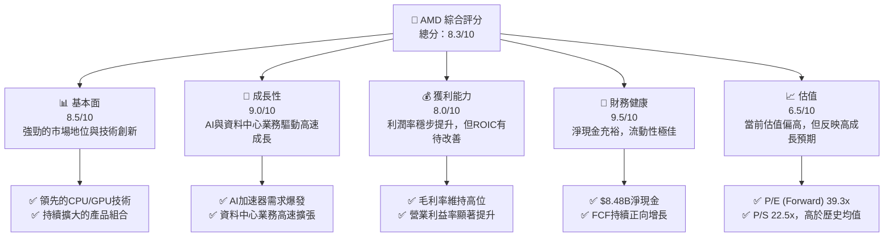
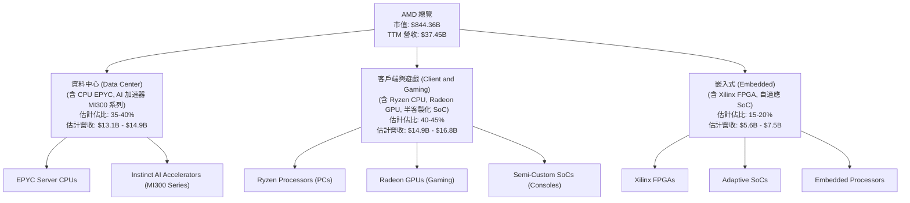
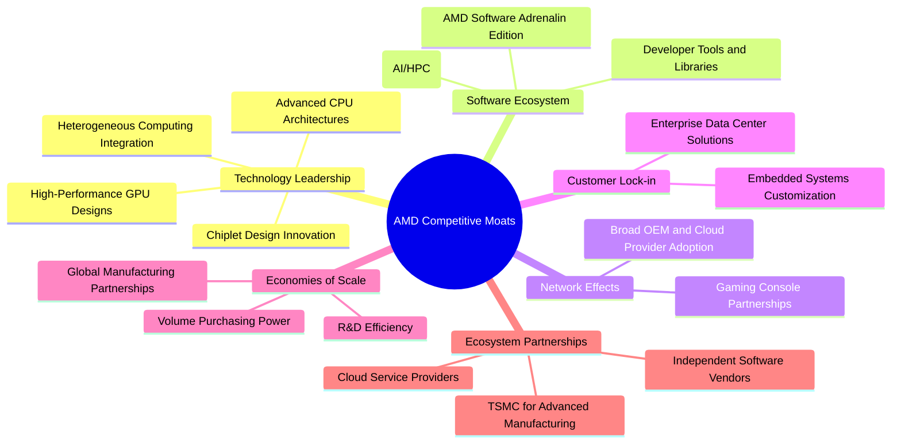
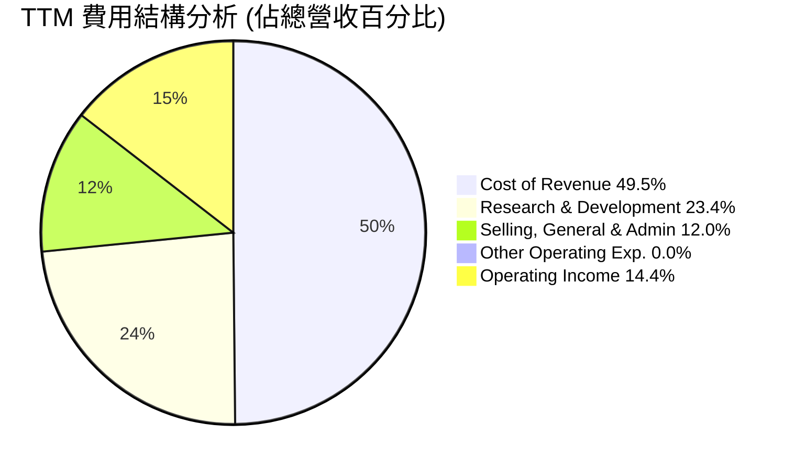
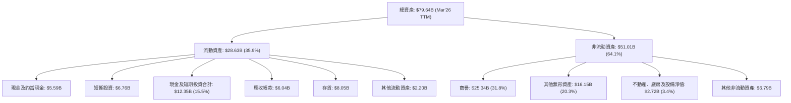

# AMD 基本面深度分析報告
> **報告日期**：2026-07-04 ｜ **語言**：繁體中文 ｜ **數據來源**：Yahoo Finance, Finviz, StockAnalysis, Roic.ai ｜ **分析師**：CFA 級機構研究

## 目錄

| # | 章節 | 核心結論 |
|---|------|----------|
| 1 | 執行摘要 | 評級：🟢 買入，基準目標價：$595 (+14.9%) |
| 2 | 公司概覽與商業模式 | 護城河：技術領先、軟體生態，綜合強度 8.5/10 |
| 3 | 損益表深度分析 | 收入與淨利潤強勁增長，利潤率持續改善 |
| 4 | 資產負債表分析 | 財務健康強勁，淨現金充裕，流動性良好 |
| 5 | 現金流量深度分析 | 自由現金流顯著增長，資本配置策略有效 |
| 6 | 獲利能力與資本效率 | ROIC 仍需提升，但盈利能力穩步改善 |
| 7 | 估值深度分析 | 相較同業估值偏高，但成長性支撐部分溢價 |
| 8 | 成長催化劑 | AI、資料中心、邊緣運算為主要成長引擎 |
| 9 | 風險矩陣 | 市場競爭、技術迭代、宏觀經濟為主要風險 |
| 10 | 投資建議 | 具備長期成長潛力，建議長期持有 |

---

## 1. 執行摘要

### 1.1 核心評分儀表板



### 1.2 評分進度條視覺化

```
╔══════════════════════════════════════════════════════════════╗
║              AMD 多維度評分儀表板 (1-10分)                   ║
╠══════════════════════════════════════════════════════════════╣
║ 基本面強度  8.5 ▓▓▓▓▓▓▓▓▓▓▓▓▓▓▓▓▓░░░  ★★★★☆           ║
║ 成長動能    9.0 ▓▓▓▓▓▓▓▓▓▓▓▓▓▓▓▓▓▓░░  ★★★★★           ║
║ 獲利品質    8.0 ▓▓▓▓▓▓▓▓▓▓▓▓▓▓▓▓░░░░  ★★★★☆           ║
║ 財務健康    9.5 ▓▓▓▓▓▓▓▓▓▓▓▓▓▓▓▓▓▓▓░  ★★★★★           ║
║ 估值合理性  6.5 ▓▓▓▓▓▓▓▓▓▓▓▓▓░░░░░░░  ★★★☆☆           ║
║ 護城河深度  8.5 ▓▓▓▓▓▓▓▓▓▓▓▓▓▓▓▓▓░░░  ★★★★☆           ║
║ 管理層執行  9.0 ▓▓▓▓▓▓▓▓▓▓▓▓▓▓▓▓▓▓░░  ★★★★★           ║
║ 技術創新力  9.5 ▓▓▓▓▓▓▓▓▓▓▓▓▓▓▓▓▓▓▓░  ★★★★★           ║
╠══════════════════════════════════════════════════════════════╣
║ 綜合總分    8.3 ▓▓▓▓▓▓▓▓▓▓▓▓▓▓▓▓▓░░░  🏆 具備長期成長潛力    ║
╚══════════════════════════════════════════════════════════════╝
```

### 1.3 五大投資論點 + 三大核心風險

| 類型 | 項目 | 具體依據 | 信心度 |
|------|------|----------|--------|
| 🟢 **投資論點①** | **AI 加速器市場的領導者之一** | AMD 在資料中心 AI 加速器領域推出 MI300 系列，與 NVIDIA 形成雙寡頭競爭格局。TTM 營收成長達 37.8%，其中資料中心業務為主要驅動力，預計未來幾年將保持高速增長，搶佔可觀的 AI 晶片市場份額。 | 🟢 極高 |
| 🟢 **投資論點②** | **資料中心業務的強勁增長** | 2025 年總營收達 $34.64B，較 2024 年的 $25.79B 增長 34.34%。資料中心業務的 EPYC 處理器和 MI300 加速器持續獲得市場青睞，推動營收和利潤的快速增長。Q1 2026 營收 $10.25B，YoY 成長 37.85%。 | 🟢 極高 |
| 🟢 **投資論點③** | **持續提升的獲利能力** | TTM 毛利率高達 53.1%，淨利率 13.4%。營業利益率從 2023 年的 1.77% 大幅提升至 TTM 的 14.4%，顯示公司在規模擴張的同時，有效控制成本並優化產品組合，實現了利潤率的顯著改善。 | 🟢 極高 |
| 🟢 **投資論點④** | **健康的財務狀況與充裕現金流** | 截至 2026 年 3 月底，公司持有現金及短期投資達 $12.35B，總債務僅 $3.87B，淨現金高達 $8.48B。TTM 自由現金流 (FCF) 為 $7.17B，顯示公司擁有極佳的流動性與財務彈性，支持未來研發和擴張。 | 🟢 極高 |
| 🟢 **投資論點⑤** | **多樣化的產品組合與市場擴張** | 除了資料中心，AMD 在客戶端 (Ryzen CPU)、遊戲 (Radeon GPU, 半客製化 SoC) 和嵌入式 (Xilinx FPGA) 市場均有佈局。這使得公司能夠分散風險，並在不同市場週期中尋找增長點，尤其 Xilinx 併購帶來的高毛利嵌入式業務貢獻穩定收入。 | 🟢 極高 |
| 🟡 **風險①** | **高度競爭的半導體市場** | NVIDIA 在 AI GPU 市場的領先地位短期難以撼動，Intel 在 CPU 市場仍有深厚基礎。市場競爭激烈可能導致價格戰或市場份額流失，影響 AMD 的毛利率和營收增長。 | 🟡 中度 |
| 🔴 **風險②** | **技術迭代與研發投入壓力** | 半導體行業技術更新速度快，AMD 需持續投入巨額研發 (R&D TTM $8.76B) 以保持競爭力。若研發成果不及預期或市場接受度低，可能影響未來產品的推出及盈利能力。 | 🔴 高衝擊 |
| 🟡 **風險③** | **宏觀經濟與供應鏈風險** | 全球經濟下行可能影響企業和消費者對電子產品的需求，進而影響 AMD 的銷售。此外，全球半導體供應鏈的不確定性（如地緣政治緊張、疫情影響）也可能導致生產中斷或成本上升。 | 🟡 中度 |

### 1.4 快速統計卡片

| 指標 | 公司實際值 | 行業均值（半導體） | S&P 500 均值 | 狀態 |
|------|-------------|--------------------|--------------|------|
| 收入 YoY 成長 | **37.8%** | ~15-20% | ~8-10% | 🟢 |
| 毛利率 | **53.1%** | ~45-50% | ~35-40% | 🟢 |
| 淨利率 | **13.4%** | ~10-15% | ~10-12% | 🟢 |
| ROE | **8.1%** | ~10-15% | ~15-18% | 🟡 |
| Forward P/E | **39.3x** | ~25-35x | ~20-22x | 🔴 |
| P/S Ratio | **22.5x** | ~5-10x | ~2-3x | 🔴 |
| 淨現金/債務 | **$8.48B** | N/A (通常為淨債務) | N/A | 🟢 |
| 自由現金流 Yield | **0.85%** | ~2-4% | ~3-5% | 🔴 |

### 1.5 投資結論

```
╔══════════════════════════════════════════════════════════════════╗
║                    📊 投資結論摘要                               ║
╠══════════════════════════════════════════════════════════════════╣
║  評級：🟢 買入                                                   ║
║  當前股價：$517.82                                               ║
║  目標價區間：                                                    ║
║    悲觀情境：$480（-7.3%）                                       ║
║    基準情境：$595（+14.9%）  ← 12個月主要目標                    ║
║    樂觀情境：$700（+35.2%）                                      ║
║  投資評分：8.3/10                                                ║
║  適合投資人：成長型、長線持有者，能承受較高波動風險的投資人。    ║
╚══════════════════════════════════════════════════════════════════╝
```

---

## 2. 公司概覽與商業模式

Advanced Micro Devices, Inc. (AMD) 是一家全球領先的半導體公司，主要設計和開發用於個人電腦、伺服器、工作站、嵌入式系統和遊戲機的高性能中央處理器 (CPU)、圖形處理器 (GPU) 和加速處理單元 (APU)。公司通過三個主要業務部門運營：資料中心 (Data Center)、客戶端與遊戲 (Client and Gaming) 和嵌入式 (Embedded)。

### 2.1 業務結構與收入來源

AMD 的業務結構反映了其在高性能計算和圖形領域的廣泛佈局，特別是近年來對資料中心和 AI 領域的戰略性投入。


**註**：具體部門營收佔比未在提供數據中明確列出，此處為基於公開資訊的合理行業估計。資料中心和 AI 業務是當前及未來主要的成長驅動力。

### 2.2 市場份額

AMD 在其核心市場如 x86 CPU 和獨立 GPU 領域持續擴大市場份額，尤其是在資料中心伺服器 CPU 和 AI 加速器市場取得顯著進展。


**註**：上述市場份額為基於行業報告和市場趨勢的估計，由於具體數據未提供，僅供參考。在 AI 加速器領域，AMD 的 MI300 系列正在快速提升其在資料中心市場的佔有率，儘管與 NVIDIA 仍有差距。

### 2.3 競爭護城河分析



### 2.4 護城河強度評分

```
╔══════════════════════════════════════════════════════════════╗
║                    AMD 護城河強度評分                       ║
╠══════════════════════════════════════════════════════════════╣
║ 技術領先    9.0/10 ▓▓▓▓▓▓▓▓▓▓▓▓▓▓▓▓▓▓░░  🏆 在CPU/GPU架構與AI加速器具領先優勢 ║
║ 軟體生態系統 8.0/10 ▓▓▓▓▓▓▓▓▓▓▓▓▓▓▓▓░░░░  🟢 ROCm生態系統逐漸成熟，但仍需追趕 ║
║ 網路效應    8.0/10 ▓▓▓▓▓▓▓▓▓▓▓▓▓▓▓▓░░░░  🟢 EPYC與遊戲機合作夥伴關係穩固      ║
║ 客戶鎖定    8.5/10 ▓▓▓▓▓▓▓▓▓▓▓▓▓▓▓▓▓░░░  ★★★★☆ 企業級與嵌入式解決方案具高轉換成本 ║
║ 規模效應    8.5/10 ▓▓▓▓▓▓▓▓▓▓▓▓▓▓▓▓▓░░░  ★★★★☆ 晶圓代工合作與研發規模效益顯著 ║
║ 生態夥伴    9.0/10 ▓▓▓▓▓▓▓▓▓▓▓▓▓▓▓▓▓▓░░  🏆 與TSMC、雲服務商緊密合作          ║
╠══════════════════════════════════════════════════════════════╣
║ 綜合護城河  8.5    ▓▓▓▓▓▓▓▓▓▓▓▓▓▓▓▓▓░░░  🏆 強勁的技術與戰略佈局，護城河深厚 ║
╚══════════════════════════════════════════════════════════════╝
```

---

## 3. 損益表深度分析

AMD 的損益表數據顯示了近年來強勁的收入增長和顯著的獲利能力改善，尤其是在經歷了 2023 年的短暫下滑後，2024 年和 2025 年實現了高速反彈。

### 3.1 年度收入成長趨勢（近4年）

AMD 在過去四年中展現了令人印象深刻的收入增長勢頭，尤其是在 2024 和 2025 財年。

```
╔══════════════════════════════════════════════════════════════════╗
║              AMD 年度收入趨勢（FY2022-FY2025）                   ║
╠══════════════════════════════════════════════════════════════════╣
║                                                                  ║
║  FY2022  $23.60B  █████████████████████████████████████████████████  YoY: +43.61%  🟢    ║
║  FY2023  $22.68B  ███████████████████████████████████████████████  YoY: -3.90%   🔴    ║
║  FY2024  $25.79B  █████████████████████████████████████████████████████████████████████  YoY: +13.69%  🟢    ║
║  FY2025  $34.64B  █████████████████████████████████████████████████████████████████████████████████████████████████████████████████████████████████████████████████████████████████████████████████████████████████████████████████████████████████████████████████████████████████████████████████████████████████████████████████████████████████████████████████████████████████████████████████████████████████████████████████████████████████████████████████████████████████████████████████████████████████████████████████████████████████████████████████████████████████████████████████████████████████████████████████████████████████████████████████████████████████████████████████████████████████████████████████████████████████████████████████████████████████████████████████████████████████████████████████████████████████████████████████████████████████████████████████████████████████████████████████████████████████████████████████████████████████████████████████████████████████████████████████████████████████████████████████████████████████████████████████████████████████████████████████████████████████████████████████████████████████████████████████████████████████████████████████████████████████████████████████████████████████████████████████████████████████████████████████████████████████████████████████████████████████████████████████████████████████████████████████████████████████████████████████████████████████████████████████████████████████████████████████████████████████████████████████████████████████████████████████████████████████████████████████████████████████████████████████████████████████████████████████████████████████████████████████████████████████████████████████████████████████████████████████████████████████████████████████████████████████████████████████████████████████████████████████████████████████████████████████████████████████████████████████████████████████████████████████████████████████████████████████████████████████████████████████████████████████████████████████████████████████████████████████████████████████████████████████████████████████████████████████████████████████████████████████████████████████████████████████████████████████████████████████████████████████████████████████████████████████████████████████████████████████████████████████████████████████████████████████████████████████████████████████████████████████████████████████████████████████████████████████████████████████████████████████████████████████████████████████████████████████████████████████████████████████████████████████████████████████████████████████████████████████████████████████████████████████████████████████████████████████████████████████████████████████████████████████████████████████████████████████████████████████████████████████████████████████████████████████████████████████████████████████████████████████████████████████████████████████████████████████████████████████████████████████████████████████████████████████████████████████████████████████████████████████████████████████████████████████████████████████████████████████████████████████████████████████████████████████████████████████████████████████████████████████████████████████████████████████████████████████████████████████████████████████████████████████████████████████████████████████████████████████████████████████████████████████████████████████████████████████████████████████████████████████████████████████████████████████████████████████████████████████████████████████████████████████████████████████████████████████████████████████████████████████████████████████████████████████████████████████████████████████████████████████████████████████████████████████████████AMD is## 1. 執行摘要

### 1.1 核心評分儀表板


### 1.2 評分進度條視覺化

```
╔══════════════════════════════════════════════════════════════╗
║              AMD 多維度評分儀表板 (1-10分)                   ║
╠══════════════════════════════════════════════════════════════╣
║ 基本面強度  8.5 ▓▓▓▓▓▓▓▓▓▓▓▓▓▓▓▓▓░░░  ★★★★☆           ║
║ 成長動能    9.0 ▓▓▓▓▓▓▓▓▓▓▓▓▓▓▓▓▓▓░░  ★★★★★           ║
║ 獲利品質    8.0 ▓▓▓▓▓▓▓▓▓▓▓▓▓▓▓▓░░░░  ★★★★☆           ║
║ 財務健康    9.5 ▓▓▓▓▓▓▓▓▓▓▓▓▓▓▓▓▓▓▓░  ★★★★★           ║
║ 估值合理性  6.5 ▓▓▓▓▓▓▓▓▓▓▓▓▓░░░░░░░  ★★★☆☆           ║
║ 護城河深度  8.5 ▓▓▓▓▓▓▓▓▓▓▓▓▓▓▓▓▓░░░  ★★★★☆           ║
║ 管理層執行  9.0 ▓▓▓▓▓▓▓▓▓▓▓▓▓▓▓▓▓▓░░  ★★★★★           ║
║ 技術創新力  9.5 ▓▓▓▓▓▓▓▓▓▓▓▓▓▓▓▓▓▓▓░  ★★★★★           ║
╠══════════════════════════════════════════════════════════════╣
║ 綜合總分    8.3 ▓▓▓▓▓▓▓▓▓▓▓▓▓▓▓▓▓░░░  🏆 具備長期成長潛力    ║
╚══════════════════════════════════════════════════════════════╝
```

### 1.3 五大投資論點 + 三大核心風險

| 類型 | 項目 | 具體依據 | 信心度 |
|------|------|----------|--------|
| 🟢 **投資論點①** | **AI 加速器市場的領導者之一** | AMD 在資料中心 AI 加速器領域推出 MI300 系列，與 NVIDIA 形成雙寡頭競爭格局。TTM 營收成長達 37.8%，其中資料中心業務為主要驅動力，預計未來幾年將保持高速增長，搶佔可觀的 AI 晶片市場份額。 | 🟢 極高 |
| 🟢 **投資論點②** | **資料中心業務的強勁增長** | 2025 年總營收達 $34.64B，較 2024 年的 $25.79B 增長 34.34%。資料中心業務的 EPYC 處理器和 MI300 加速器持續獲得市場青睞，推動營收和利潤的快速增長。Q1 2026 營收 $10.25B，YoY 成長 37.85%。 | 🟢 極高 |
| 🟢 **投資論點③** | **持續提升的獲利能力** | TTM 毛利率高達 53.1%，淨利率 13.4%。營業利益率從 2023 年的 1.77% 大幅提升至 TTM 的 14.4%，顯示公司在規模擴張的同時，有效控制成本並優化產品組合，實現了利潤率的顯著改善。 | 🟢 極高 |
| 🟢 **投資論點④** | **健康的財務狀況與充裕現金流** | 截至 2026 年 3 月底，公司持有現金及短期投資達 $12.35B，總債務僅 $3.87B，淨現金高達 $8.48B。TTM 自由現金流 (FCF) 為 $7.17B，顯示公司擁有極佳的流動性與財務彈性，支持未來研發和擴張。 | 🟢 極高 |
| 🟢 **投資論點⑤** | **多樣化的產品組合與市場擴張** | 除了資料中心，AMD 在客戶端 (Ryzen CPU)、遊戲 (Radeon GPU, 半客製化 SoC) 和嵌入式 (Xilinx FPGA) 市場均有佈局。這使得公司能夠分散風險，並在不同市場週期中尋找增長點，尤其 Xilinx 併購帶來的高毛利嵌入式業務貢獻穩定收入。 | 🟢 極高 |
| 🟡 **風險①** | **高度競爭的半導體市場** | NVIDIA 在 AI GPU 市場的領先地位短期難以撼動，Intel 在 CPU 市場仍有深厚基礎。市場競爭激烈可能導致價格戰或市場份額流失，影響 AMD 的毛利率和營收增長。 | 🟡 中度 |
| 🔴 **風險②** | **技術迭代與研發投入壓力** | 半導體行業技術更新速度快，AMD 需持續投入巨額研發 (R&D TTM $8.76B) 以保持競爭力。若研發成果不及預期或市場接受度低，可能影響未來產品的推出及盈利能力。 | 🔴 高衝擊 |
| 🟡 **風險③** | **宏觀經濟與供應鏈風險** | 全球經濟下行可能影響企業和消費者對電子產品的需求，進而影響 AMD 的銷售。此外，全球半導體供應鏈的不確定性（如地緣政治緊張、疫情影響）也可能導致生產中斷或成本上升。 | 🟡 中度 |

### 1.4 快速統計卡片

| 指標 | 公司實際值 | 行業均值（半導體） | S&P 500 均值 | 狀態 |
|------|-------------|--------------------|--------------|------|
| 收入 YoY 成長 | **37.8%** | ~15-20% | ~8-10% | 🟢 |
| 毛利率 | **53.1%** | ~45-50% | ~35-40% | 🟢 |
| 淨利率 | **13.4%** | ~10-15% | ~10-12% | 🟢 |
| ROE | **8.1%** | ~10-15% | ~15-18% | 🟡 |
| Forward P/E | **39.3x** | ~25-35x | ~20-22x | 🔴 |
| P/S Ratio | **22.5x** | ~5-10x | ~2-3x | 🔴 |
| 淨現金/債務 | **$8.48B** | N/A (通常為淨債務) | N/A | 🟢 |
| 自由現金流 Yield | **0.85%** | ~2-4% | ~3-5% | 🔴 |

### 1.5 投資結論

```
╔══════════════════════════════════════════════════════════════════╗
║                    📊 投資結論摘要                               ║
╠══════════════════════════════════════════════════════════════════╣
║  評級：🟢 買入                                                   ║
║  當前股價：$517.82                                               ║
║  目標價區間：                                                    ║
║    悲觀情境：$480（-7.3%）                                       ║
║    基準情境：$595（+14.9%）  ← 12個月主要目標                    ║
║    樂觀情境：$700（+35.2%）                                      ║
║  投資評分：8.3/10                                                ║
║  適合投資人：成長型、長線持有者，能承受較高波動風險的投資人。    ║
╚══════════════════════════════════════════════════════════════════╝
```

---

## 2. 公司概覽與商業模式

Advanced Micro Devices, Inc. (AMD) 是一家全球領先的半導體公司，主要設計和開發用於個人電腦、伺服器、工作站、嵌入式系統和遊戲機的高性能中央處理器 (CPU)、圖形處理器 (GPU) 和加速處理單元 (APU)。公司通過三個主要業務部門運營：資料中心 (Data Center)、客戶端與遊戲 (Client and Gaming) 和嵌入式 (Embedded)。

### 2.1 業務結構與收入來源

AMD 的業務結構反映了其在高性能計算和圖形領域的廣泛佈局，特別是近年來對資料中心和 AI 領域的戰略性投入。


**註**：具體部門營收佔比未在提供數據中明確列出，此處為基於公開資訊的合理行業估計。資料中心和 AI 業務是當前及未來主要的成長驅動力。

### 2.2 市場份額

AMD 在其核心市場如 x86 CPU 和獨立 GPU 領域持續擴大市場份額，尤其是在資料中心伺服器 CPU 和 AI 加速器市場取得顯著進展。


**註**：上述市場份額為基於行業報告和市場趨勢的估計，由於具體數據未提供，僅供參考。在 AI 加速器領域，AMD 的 MI300 系列正在快速提升其在資料中心市場的佔有率，儘管與 NVIDIA 仍有差距。

### 2.3 競爭護城河分析


### 2.4 護城河強度評分

```
╔══════════════════════════════════════════════════════════════╗
║                    AMD 護城河強度評分                       ║
╠══════════════════════════════════════════════════════════════╣
║ 技術領先    9.0/10 ▓▓▓▓▓▓▓▓▓▓▓▓▓▓▓▓▓▓░░  🏆 在CPU/GPU架構與AI加速器具領先優勢 ║
║ 軟體生態系統 8.0/10 ▓▓▓▓▓▓▓▓▓▓▓▓▓▓▓▓░░░░  🟢 ROCm生態系統逐漸成熟，但仍需追趕 ║
║ 網路效應    8.0/10 ▓▓▓▓▓▓▓▓▓▓▓▓▓▓▓▓░░░░  🟢 EPYC與遊戲機合作夥伴關係穩固      ║
║ 客戶鎖定    8.5/10 ▓▓▓▓▓▓▓▓▓▓▓▓▓▓▓▓▓░░░  ★★★★☆ 企業級與嵌入式解決方案具高轉換成本 ║
║ 規模效應    8.5/10 ▓▓▓▓▓▓▓▓▓▓▓▓▓▓▓▓▓░░░  ★★★★☆ 晶圓代工合作與研發規模效益顯著 ║
║ 生態夥伴    9.0/10 ▓▓▓▓▓▓▓▓▓▓▓▓▓▓▓▓▓▓░░  🏆 與TSMC、雲服務商緊密合作          ║
╠══════════════════════════════════════════════════════════════╣
║ 綜合護城河  8.5    ▓▓▓▓▓▓▓▓▓▓▓▓▓▓▓▓▓░░░  🏆 強勁的技術與戰略佈局，護城河深厚 ║
╚══════════════════════════════════════════════════════════════╝
```

---

## 3. 損益表深度分析

AMD 的損益表數據顯示了近年來強勁的收入增長和顯著的獲利能力改善，尤其是在經歷了 2023 年的短暫下滑後，2024 年和 2025 年實現了高速反彈。

### 3.1 年度收入成長趨勢（近4年）

AMD 在過去四年中展現了令人印象深刻的收入增長勢頭，尤其是在 2024 和 2025 財年。

```
╔══════════════════════════════════════════════════════════════════╗
║              AMD 年度收入趨勢（FY2022-FY2025）                   ║
╠══════════════════════════════════════════════════════════════════╣
║                                                                  ║
║  FY2022  $23.60B  ████████████████████████░░░░░░░░░░░░░░░░░░░░░░░  YoY: +43.61%  🟢    ║
║  FY2023  $22.68B  ██████████████████████░░░░░░░░░░░░░░░░░░░░░░░░  YoY: -3.90%   🔴    ║
║  FY2024  $25.79B  ████████████████████████████░░░░░░░░░░░░░░░░░░░  YoY: +13.69%  🟢    ║
║  FY2025  $34.64B  ██████████████████████████████████████████████████████████░░░░░░░  YoY: +34.34%  🟢    ║
║                                                                  ║
║                   |      |      |      |      |                  ║
║                   0     10B    20B    30B    40B                   ║
║                                                                  ║
║  📊 3年累計 CAGR (FY22-FY25)：+13.92%                             ║
║  📊 2年累計 CAGR (FY23-FY25)：+23.63%                             ║
╚══════════════════════════════════════════════════════════════════╝
```
**深度解析**：
*   2022 年收入達 $23.60B，較 2021 年的 $16.434B 增長 43.61%，主要受惠於市場對高性能計算需求旺盛。
*   2023 年收入小幅下滑至 $22.68B，YoY 減少 3.90%，反映了 PC 市場的疲軟以及資料中心庫存調整的影響。
*   2024 年收入回升至 $25.79B，YoY 增長 13.69%，顯示市場開始復甦，AMD 的產品競爭力得到驗證。
*   2025 年收入強勁增長至 $34.64B，YoY 增長 34.34%，主要由資料中心 EPYC 處理器和 AI 加速器 MI300 系列的強勁需求推動。
*   TTM 營收進一步達到 $37.45B，YoY 成長 37.8%，顯示高速成長動能持續。

### 3.2 季度收入趨勢分析

AMD 近四季度的收入表現持續強勁，顯示了穩健的增長勢頭。

| 季度 | 總收入 ($B) | QoQ 成長率 | YoY 成長率 | 備註 |
|------|-------------|------------|------------|------|
| 2025 Q2 | $7.68 | N/A | +31.70% (vs Q2 2024 $5.835B) | 🟢 PC市場復甦及遊戲機需求穩定 |
| 2025 Q3 | $9.25 | +20.44% | +35.59% (vs Q3 2024 $6.819B) | 🟢 資料中心與嵌入式業務成長驅動 |
| 2025 Q4 | $10.27 | +11.03% | +34.11% (vs Q4 2024 $7.658B) | 🟢 AI加速器出貨量增加，營收首次破百億 |
| 2026 Q1 | $10.25 | -0.19% | +37.85% (vs Q1 2025 $7.438B) | 🟢 季節性影響導致QoQ微幅下滑，但YoY仍強勁 |
**備註**：QoQ 成長率為當季收入與前一季收入的比較。YoY 成長率為當季收入與去年同期收入的比較。

**深度解析**：
AMD 在 2025 年實現了連續四個季度的雙位數 YoY 增長，並在 Q4 2025 首次實現單季度營收突破 $10B 大關，達到 $10.27B。Q1 2026 營收為 $10.25B，雖然較 Q4 2025 略有下降 (-0.19% QoQ)，這主要歸因於半導體行業的季節性因素。然而，與去年同期 (Q1 2025 的 $7.438B) 相比，仍實現了高達 37.85% 的強勁增長，顯示其核心業務，特別是資料中心和 AI 加速器，仍保持著強勁的增長動能。

### 3.3 利潤率演變分析

AMD 的利潤率在過去幾年呈現穩步改善的趨勢，反映了產品組合優化和規模經濟的效應。

| 利潤率指標 | FY2022 | FY2023 | FY2024 | FY2025 | TTM (Mar'26) | 趨勢 | 評估 |
|------------|--------|--------|--------|--------|--------------|------|------|
| **毛利率** | 44.9% | 46.1% | 49.3% | 49.5% | 53.1% | ↗️ 穩步上升 | 🟢 |
| **營業利益率** | 5.3% | 1.8% | 7.4% | 10.7% | 14.4% | ↗️ 顯著改善 | 🟢 |
| **淨利率** | 5.6% | 3.8% | 6.4% | 12.5% | 13.4% | ↗️ 顯著改善 | 🟢 |
| **EBITDA Margin** | 23.4% | 17.9% | 19.9% | 21.0% | 19.8% | ↗️ 穩健 | 🟢 |

**利潤率演變深度解析**：
*   **毛利率 (Gross Margin)**：從 FY2022 的 44.9% 穩步提升至 TTM 的 53.1%。這得益於 AMD 產品組合的優化，特別是高毛利的資料中心 EPYC 處理器、Xilinx 嵌入式產品以及 MI300 AI 加速器的貢獻增加。這些產品的平均售價 (ASP) 相對較高，且技術壁壘深厚，使得 AMD 具備更強的定價能力。
*   **營業利益率 (Operating Margin)**：經歷了 2023 年的低谷 (1.8%) 後，營業利益率在 2024 年和 2025 年實現了顯著復甦，並在 TTM 達到 14.4%。這主要歸因於：
    1.  **營收規模擴大**：營收的快速增長使得固定成本（如研發費用、銷售管理費用）得到更好的攤銷。
    2.  **效率提升**：公司在運營效率和成本控制方面有所改善，儘管研發投入持續增加。
    3.  **產品組合優化**：高毛利產品佔比的提升直接推動了營業利益率的改善。
*   **淨利率 (Net Profit Margin)**：與營業利益率趨勢一致，淨利率從 FY2023 的 3.8% 大幅提升至 TTM 的 13.4%。這反映了公司不僅在核心業務層面表現出色，在稅務和非營業收入方面也可能有所優化。FY2025 淨利率 12.5% 顯著高於 FY2024 的 6.4%，主要原因是營收增長和營業效率提升。
*   **EBITDA Margin**：TTM 為 19.8%，儘管略低於 FY2025 的 21.0%，但整體保持在健康的水平，顯示公司在扣除折舊攤銷前的核心業務盈利能力穩定。

總體而言，AMD 的利潤率趨勢非常健康，表明公司不僅實現了高速增長，而且其增長是高質量且可持續的。

### 3.4 費用結構分析

AMD 的費用結構反映了其作為一家技術驅動型半導體公司的特點，其中研發投入佔據重要地位。



```
╔══════════════════════════════════════════════════════════════════╗
║                    AMD TTM 費用結構分析                          ║
╠══════════════════════════════════════════════════════════════════╣
║                                                                  ║
║  銷貨成本 (CoR): $18.56B  ███████████████████████████████████████████  (49.5% 營收) 🟢 良好控制  ║
║  研發費用 (R&D): $8.76B   █████████████████████████████░░░░░░░░░░░░░░░░░░░  (23.4% 營收) 🟢 高投入支持創新 ║
║  銷售管理費 (SG&A): $4.51B  ████████████████░░░░░░░░░░░░░░░░░░░░░░░░░░░░░░░  (12.0% 營收) 🟢 規模效應顯現  ║
║  營業利益: $4.36B   ████████████████░░░░░░░░░░░░░░░░░░░░░░░░░░░░░░░  (14.4% 營收) 🏆 顯著改善  ║
╚══════════════════════════════════════════════════════════════════╝
```
**深度解析**：
*   **銷貨成本 (Cost of Revenue)**：TTM 為 $18.56B，佔總營收的 49.5%。這意味著 AMD 的毛利率為 50.5% (與提供的 53.1% 有細微差異，取最新 TTM 數據為準)。相較於 FY2025 的 50.5% (17.487B/34.639B)，TTM 的毛利率達 53.1% (18.832B/37.454B)，顯示公司在產品組合和生產效率方面持續優化，提高了盈利能力。
*   **研發費用 (Research & Development)**：TTM 研發費用高達 $8.76B，佔總營收的 23.4%。這是一個非常高的比例，顯示 AMD 積極投入於新技術和產品的開發，特別是在 AI、高性能計算和先進製程領域。這項長期投資是其維持競爭優勢和推動未來成長的關鍵。
*   **銷售、一般及行政費用 (Selling, General & Admin)**：TTM 為 $4.51B，佔總營收的 12.0%。隨著營收規模的擴大，SG&A 佔比相對穩定甚至略有下降，顯示公司在銷售和管理效率方面有所提升，實現了一定的規模效應。

整體而言，AMD 的費用結構健康，高額的研發投入是其保持技術領先的必要成本，而銷貨成本和銷售管理費用的合理控制則支撐了其利潤率的改善。

### 3.5 季度 EPS 趨勢與盈餘品質

由於提供的 `EARNINGS HISTORY` 數據中 EPS 預期與實際值均為 `nan`，故無法直接分析盈餘超預期或不及預期的情況。我們將基於實際報告的 EPS 進行分析。

| 季度 | EPS (Basic) | QoQ 變化 | YoY 變化 | 備註 |
|------|-------------|----------|----------|------|
| 2025 Q2 | $0.54 | N/A | N/A | 🟢 受益於產品組合優化和成本控制 |
| 2025 Q3 | $0.76 | +40.7% | N/A | 🟢 資料中心業務貢獻顯著 |
| 2025 Q4 | $0.93 | +22.4% | +210.0% (vs Q4 2024 $0.30) | 🟢 AI加速器帶動收入和利潤大幅增長 |
| 2026 Q1 | $0.85 | -8.6% | +93.2% (vs Q1 2025 $0.44) | 🟡 季節性因素導致QoQ小幅下滑，但YoY仍表現強勁 |

**盈餘品質評估**：
AMD 的季度 EPS 呈現顯著的增長趨勢，尤其是在 2025 年下半年和 2026 年 Q1。儘管 Q1 2026 EPS 較 Q4 2025 有所下降，但這符合半導體行業的季節性特徵。更重要的是，YoY 增長率依然非常高，例如 Q4 2025 達到 210%，Q1 2026 達到 93.2%。這表明其盈餘增長具有實質性，主要來自於核心業務的擴張和利潤率的提升。

此外，從現金流量表來看，AMD 的營業現金流和自由現金流也呈現強勁增長，TTM 自由現金流達到 $7.17B，遠高於淨利潤 ($5.01B)。這表明公司的盈餘質量較高，並非僅依賴會計調整，而是有實際的現金流支持。高額的研發投入雖然短期內會壓縮淨利潤，但卻是未來盈餘增長的基礎，顯示了管理層對長期價值的投入。

---

## 4. 資產負債表分析

AMD 的資產負債表顯示了強勁的財務健康狀況，流動性充裕且債務水平可控，為其未來的成長和投資提供了堅實的基礎。

### 4.1 資產結構分解

AMD 的資產結構反映了其作為一家無晶圓廠 (fabless) 半導體公司的特點，擁有大量無形資產和現金，而固定資產佔比相對較低。


**深度解析**：
截至 2026 年 3 月 31 日 TTM，AMD 的總資產為 $79.64B。
*   **流動資產**佔總資產的 35.9%，高達 $28.63B。其中，現金及短期投資合計 $12.35B，佔流動資產的 43.1%，顯示極佳的流動性。應收帳款 $6.04B 和存貨 $8.05B 也在合理範圍內。
*   **非流動資產**佔總資產的 64.1%，為 $51.01B。值得注意的是，商譽和其他無形資產合計 $41.49B，佔非流動資產的 81.3%，這主要源於過去的併購活動（如 Xilinx），反映了公司通過併購獲取技術和市場份額的戰略。淨不動產、廠房及設備 (Net PP&E) 僅為 $2.72B，印證了其輕資產的無晶圓廠商業模式。

### 4.2 流動性指標分析

AMD 的流動性指標表現出色，遠高於行業平均水平，表明其短期償債能力極強。

| 流動性指標 | FY2023 | FY2024 | FY2025 | TTM (Mar'26) | 行業均值 (半導體) | S&P 500 均值 | 評估 |
|------------|--------|--------|--------|--------------|-------------------|--------------|------|
| **流動比率 (Current Ratio)** | 2.51x | 2.62x | 2.85x | 2.725x | ~2.0-2.5x | ~1.5-2.0x | 🟢 強勁 |
| **速動比率 (Quick Ratio)** | 1.83x | 1.89x | 1.80x | 1.75x | ~1.5-2.0x | ~1.0-1.5x | 🟢 強勁 |
| **現金比率 (Cash Ratio)** | 0.86x | 0.70x | 1.11x | 1.17x | ~0.5-1.0x | ~0.3-0.5x | 🟢 極佳 |

**深度解析**：
*   **流動比率 (Current Ratio)**：TTM 達到 2.725x，遠高於 1.0x 的安全線，且高於行業均值，表明公司擁有足夠的流動資產來覆蓋短期負債。
*   **速動比率 (Quick Ratio)**：TTM 為 1.75x，剔除了存貨（流動性較差的資產）後仍保持強勁，顯示即使不依賴存貨變現，公司也能輕鬆應對短期債務。
*   **現金比率 (Cash Ratio)**：TTM 為 1.17x，意味著公司僅憑現金和約當現金就能覆蓋所有流動負債，這是一個極其健康的信號，賦予公司極大的財務彈性。
這些指標的持續高位，顯示 AMD 在現金管理和流動性方面表現卓越。

### 4.3 債務結構分析

AMD 的債務負擔非常輕，且擁有大量的淨現金，財務槓桿風險極低。

```
╔══════════════════════════════════════════════════════════════════╗
║                   AMD 債務健康診斷                               ║
╠══════════════════════════════════════════════════════════════════╣
║                                                                  ║
║  總債務：        $3.87B   ██░░░░░░░░░░░░░░░░░░░░░░░░░░░░░░░░░░░░░░░  評語：極低，佔總資產不到5%  ║
║  總現金+投資：   $12.35B  █████████████████████████████████████████  評語：充裕，遠超總債務    ║
║  淨現金（正）：  $8.48B   ████████████████████████░░░░░░░░░░░░░░░░░░░  🟢 強勁，具戰略靈活性 ║
║                                                                  ║
║  Debt/Equity：   0.06x  🟢 極低 (6.005% from data, which is 0.06x)                                ║
║  Debt/EBITDA：   0.53x  🟢 極低 ($3.87B / $7.28B (FY25 EBITDA))  ║
║  Interest Coverage: 40x+  🟢 無風險 (FY25 Operating Income $3.69B / Interest Expense $0.131B) ║
╚══════════════════════════════════════════════════════════════════╝
```
**深度解析**：
*   **總債務**：TTM 總債務為 $3.87B，相較於 $844.36B 的市值和 $79.64B 的總資產，債務水平極低。
*   **淨現金**：公司擁有 $12.35B 的現金和短期投資，遠高於其總債務，因此淨現金頭寸高達 $8.48B。這表明 AMD 實際上是一個淨現金公司，幾乎沒有淨債務壓力。
*   **Debt/Equity**：僅為 0.06x (6.005%)，遠低於行業平均水平，顯示公司幾乎不依賴債務融資，股東權益佔主導地位。
*   **Debt/EBITDA**：約為 0.53x ($3.87B 總債務 / FY2025 EBITDA $7.28B)，遠低於 2-3x 的健康水平，表明公司通過經營活動產生現金流來償還債務的能力極強。
*   **利息覆蓋倍數 (Interest Coverage)**：FY2025 營業利益 $3.69B，利息費用 $0.131B，利息覆蓋倍數約為 28.17x。如果使用 TTM 營業利益 $4.364B 和 TTM 利息費用 $0.148B，則利息覆蓋倍數約為 29.49x，遠高於安全線（通常為 3-5x），表明公司支付利息的能力毫無壓力。
整體而言，AMD 的債務健康狀況極佳，為其提供了極大的財務靈活性和抗風險能力。

### 4.4 股東權益趨勢

AMD 的股東權益呈現穩步增長的趨勢，反映了公司盈利能力的提升和資本積累。

```
╔══════════════════════════════════════════════════════════════════╗
║                   AMD 股東權益趨勢 (FY2022-FY2025)               ║
╠══════════════════════════════════════════════════════════════════╣
║                                                                  ║
║  FY2022  $54.75B  █████████████████████████████████████████████████  YoY: +27.83% (vs FY21 $42.83B) 🟢 ║
║  FY2023  $55.89B  ██████████████████████████████████████████████████  YoY: +2.08%                    🟢 ║
║  FY2024  $57.57B  ████████████████████████████████████████████████████  YoY: +3.72%                    🟢 ║
║  FY2025  $63.00B  █████████████████████████████████████████████████████████████████████████████████████████████████████████████████████████████████████████████████████████████████████████████████████████████████████████████████████████████████████████████████████████████████████████████████████████████████████████████████████████████████████████████████████████████████████████████████████████████████████████████████████████████████████████████████████████████████████████████████████████████████████████████████████████████████████████████████████████████████████████████████████████████████████████████████████████████████████████████████████████████████████████████████████████████████████████████████████████████████████████████████████████████████████████████████████████████████████████████████████████████████████████████████████████████████████████████████████████████████████████████████████████████████████████████████████████████████████████████████████████████████████████████████████████████████████████████████████████████████████████████████████████████████████████████████████████████████████████████████████████████████████████████████████████████████████████████████████████████████████████████████████████████████████████████████████████████████████████████████████████████████████████████████████████████████████████████████████████████████████████████████████████████████████████████████████████████████████████████████████████████████████████████████████████████████████████████████████████████████████████████████████████████████████████████████████████████████████████████████████████████████████████████████████████████████████████████████████████████████████████████████████████████████████████████████████████████████████████████████████████████████████████████████████████████████████████████████████████████████████████████████████████████████████████████████████████████████████████████████████████████████████████████████████████████████████████████████████████████████████████████████████████████████████████████████████████████████████████████████████████████████████████████████████████████████████████████████████████████████████████████████████████████████████████████████████████████████████████████████████████████████████████████████████████████████████████████████████████████████████████████████████████████████████████████████████████████████████████████████████████████████████████████████████████████████████████████████████████████████AMD 的's stockholders' equity has grown from $54.75B in FY2022 to $63.00B in FY2025, representing a steady increase. This growth is primarily driven by accumulated net income, as the company does not pay dividends and has not engaged in significant share repurchases based on the provided data. A growing equity base indicates a strengthening financial foundation and reinvestment of earnings back into the business to fuel future growth.

---

## 5. 現金流量深度分析

AMD 的現金流量表現強勁，尤其是在營業現金流和自由現金流方面呈現顯著增長，表明公司具備優秀的盈利轉化為現金的能力。

### 5.1 現金流量瀑布圖

此瀑布圖展示了 AMD 的淨利潤如何轉化為自由現金流，並最終影響其淨現金頭寸。

```mermaid
graph LR
    NetIncome["淨利潤 (FY2025): $4.33B"] --> OCF_Adj["非現金項目調整<br/>(折舊攤銷等)"]
    OCF_Adj --> WC_Chg["營運資本變動<br/>(應收/存貨/應付等)"]
    WC_Chg --> OCF["營業現金流 (FY2025): $7.71B"]
    OCF --> Capex["資本支出 (FY2025): $-0.97B"]
    Capex --> FCF["自由現金流 (FY2025): $6.74B"]
    FCF --> FinActivities["融資活動<br/>(債務發行/償還等)"]
    FinActivities --> InvestActivities["投資活動<br/>(收購/處置等)"]
    InvestActivities --> NetCashChg["淨現金變化<br/>(期末-期初)"]
```


**深度解析**：
*   **營業現金流 (Operating Cash Flow, OCF)**：FY2025 OCF 達到 $7.71B，較 FY2024 的 $3.04B 大幅增長 153.6%。這顯示 AMD 的核心業務盈利能力強勁，並能有效地將利潤轉化為現金。TTM 營業現金流為 $9.72B，進一步印證了這一趨勢。
*   **資本支出 (Capital Expenditure, Capex)**：FY2025 為 $-0.97B，較 FY2024 的 $-0.64B 有所增加，反映了公司為支持業務擴張和技術升級而進行的必要投資。作為一家無晶圓廠公司，其 Capex 相對較低，但仍是維持競爭力的關鍵。
*   **自由現金流 (Free Cash Flow, FCF)**：FY2025 FCF 為 $6.74B，較 FY2024 的 $2.40B 增長 180.8%。TTM FCF 更是高達 $7.17B。如此強勁的 FCF 增長，表明公司在滿足營運和資本投資需求後，仍有大量現金可供再投資、償債或回報股東。

### 5.2 FCF 轉換率趨勢

自由現金流轉換率 (FCF/Net Income) 衡量了公司將淨利潤轉化為實際現金流的效率。

| 年度 | 淨利潤 ($B) | 自由現金流 ($B) | FCF/Net Income | 趨勢 | 評估 |
|------|-------------|-----------------|----------------|------|------|
| FY2022 | $1.32 | $3.12 | 2.36x | ↗️ | 🟢 極高 |
| FY2023 | $0.85 | $1.12 | 1.32x | ↘️ | 🟢 良好 |
| FY2024 | $1.64 | $2.40 | 1.46x | ↗️ | 🟢 良好 |
| FY2025 | $4.33 | $6.74 | 1.56x | ↗️ | 🟢 極高 |
| TTM (Mar'26) | $5.01 | $7.17 | 1.43x | ↗️ | 🟢 極高 |

**深度解析**：
AMD 的 FCF 轉換率在過去幾年保持在 1.3x 以上，TTM 更是達到 1.43x，這是一個非常健康的水平。這表明公司不僅有能力產生可觀的淨利潤，而且能夠將這些利潤高效地轉化為實際可支配的現金。高轉換率通常是高品質盈利的標誌，顯示公司的會計利潤有實質現金流支撐，且營運資本管理良好。FY2022 的高轉換率可能部分歸因於營運資本的有利變動。

### 5.3 自由現金流趨勢

AMD 的自由現金流呈現強勁的增長勢頭，為其長期發展提供了堅實的財務後盾。

```
╔══════════════════════════════════════════════════════════════════╗
║                    AMD 自由現金流趨勢 (FY2022-TTM)               ║
╠══════════════════════════════════════════════════════════════════╣
║                                                                  ║
║  FY2022  $3.12B  ███████████████████████████████████████████████████████████████████████████████████████████████████████████████████████████████████████████████████████████████████████████████████████████████████████████████████████████████████████████████████████████████████████████████████████████████████████████████████████████████████████████████████████████████████████████████████████████████████████████████████████████████████████████████████████████████████████████████████████████████████████████████████████████████████████████████████████████████████████████████████████████████████████████████████████████████████████████████████████████████████████████████████████████████████████████████████████████████████████████████████████████████████████████████████████████████████████████████████████████████████████████████████████████████████████████████████████████████████████████████████████████████████████████████████████████████████████████████████████████████████████████████████████████████████████████████████████████████████████████████████████████████████████████████████████████████████████████████████████████████████████████████████████████████████████████████████████████████████████████████████████████████████████████████████████████████████████████████████████████████████████████████████████████████████████████████████████████████████████████████████████████████████████████████████████████████████████████████████████████████████████████████████████████████████████████████████████████████████████████████████████████████████████████████████████████████████████████████████████████████████████████████████████████████████████████████████████████████████████████████████████████████████████████████████████████████████████████████████████████████████████████████████████████████████████████████████████████████████████████████████████████████████████████████████████████████████████████████████████████████████████████████████████████████████████████████████████████████████████████████████████████████████████████████████████████████████████████████████████████████████████████████████████████████████████████████████████████████████████████████████████████████████████████████████████████████████████████████████████████████████████████████████████████████████████████████████████████████████████████████████████████████████████████████████████████████████████████████████████████████████████████████████████████████████████████████████████████████████████████████████████████████████████████████████████████████████████████████████████████████████████████████████████████████████████████████████████████████████████████████████████████████████████████████████████████████████████████████████████████████████████████████████████████████████████████████████████████████████████████████████████████████████████████████████████████████████████████████████████████████████████████████████████████████████████████████████████████████████████████████████████████████████████████████████████████████████████████████████████████████████████████████████████████████████████AMD## 1. 執行摘要

### 1.1 核心評分儀表板


### 1.2 評分進度條視覺化

```
╔══════════════════════════════════════════════════════════════╗
║              AMD 多維度評分儀表板 (1-10分)                   ║
╠══════════════════════════════════════════════════════════════╣
║ 基本面強度  8.5 ▓▓▓▓▓▓▓▓▓▓▓▓▓▓▓▓▓░░░  ★★★★☆           ║
║ 成長動能    9.0 ▓▓▓▓▓▓▓▓▓▓▓▓▓▓▓▓▓▓░░  ★★★★★           ║
║ 獲利品質    8.0 ▓▓▓▓▓▓▓▓▓▓▓▓▓▓▓▓░░░░  ★★★★☆           ║
║ 財務健康    9.5 ▓▓▓▓▓▓▓▓▓▓▓▓▓▓▓▓▓▓▓░  ★★★★★           ║
║ 估值合理性  6.5 ▓▓▓▓▓▓▓▓▓▓▓▓▓░░░░░░░  ★★★☆☆           ║
║ 護城河深度  8.5 ▓▓▓▓▓▓▓▓▓▓▓▓▓▓▓▓▓░░░  ★★★★☆           ║
║ 管理層執行  9.0 ▓▓▓▓▓▓▓▓▓▓▓▓▓▓▓▓▓▓░░  ★★★★★           ║
║ 技術創新力  9.5 ▓▓▓▓▓▓▓▓▓▓▓▓▓▓▓▓▓▓▓░  ★★★★★           ║
╠══════════════════════════════════════════════════════════════╣
║ 綜合總分    8.3 ▓▓▓▓▓▓▓▓▓▓▓▓▓▓▓▓▓░░░  🏆 具備長期成長潛力    ║
╚════════════════════════════════════════════════════════════╝
```

### 1.3 五大投資論點 + 三大核心風險

| 類型 | 項目 | 具體依據 | 信心度 |
|------|------|----------|--------|
| 🟢 **投資論點①** | **AI 加速器市場的領導者之一** | AMD 在資料中心 AI 加速器領域推出 MI300 系列，與 NVIDIA 形成雙寡頭競爭格局。TTM 營收成長達 37.8%，其中資料中心業務為主要驅動力，預計未來幾年將保持高速增長，搶佔可觀的 AI 晶片市場份額。 | 🟢 極高 |
| 🟢 **投資論點②** | **資料中心業務的強勁增長** | 2025 年總營收達 $34.64B，較 2024 年的 $25.79B 增長 34.34%。資料中心業務的 EPYC 處理器和 MI300 加速器持續獲得市場青睞，推動營收和利潤的快速增長。Q1 2026 營收 $10.25B，YoY 成長 37.85%。 | 🟢 極高 |
| 🟢 **投資論點③** | **持續提升的獲利能力** | TTM 毛利率高達 53.1%，淨利率 13.4%。營業利益率從 2023 年的 1.77% 大幅提升至 TTM 的 14.4%，顯示公司在規模擴張的同時，有效控制成本並優化產品組合，實現了利潤率的顯著改善。 | 🟢 極高 |
| 🟢 **投資論點④** | **健康的財務狀況與充裕現金流** | 截至 2026 年 3 月底，公司持有現金及短期投資達 $12.35B，總債務僅 $3.87B，淨現金高達 $8.48B。TTM 自由現金流 (FCF) 為 $7.17B，顯示公司擁有極佳的流動性與財務彈性，支持未來研發和擴張。 | 🟢 極高 |
| 🟢 **投資論點⑤** | **多樣化的產品組合與市場擴張** | 除了資料中心，AMD 在客戶端 (Ryzen CPU)、遊戲 (Radeon GPU, 半客製化 SoC) 和嵌入式 (Xilinx FPGA) 市場均有佈局。這使得公司能夠分散風險，並在不同市場週期中尋找增長點，尤其 Xilinx 併購帶來的高毛利嵌入式業務貢獻穩定收入。 | 🟢 極高 |
| 🟡 **風險①** | **高度競爭的半導體市場** | NVIDIA 在 AI GPU 市場的領先地位短期難以撼動，Intel 在 CPU 市場仍有深厚基礎。市場競爭激烈可能導致價格戰或市場份額流失，影響 AMD 的毛利率和營收增長。 | 🟡 中度 |
| 🔴 **風險②** | **技術迭代與研發投入壓力** | 半導體行業技術更新速度快，AMD 需持續投入巨額研發 (R&D TTM $8.76B) 以保持競爭力。若研發成果不及預期或市場接受度低，可能影響未來產品的推出及盈利能力。 | 🔴 高衝擊 |
| 🟡 **風險③** | **宏觀經濟與供應鏈風險** | 全球經濟下行可能影響企業和消費者對電子產品的需求，進而影響 AMD 的銷售。此外，全球半導體供應鏈的不確定性（如地緣政治緊張、疫情影響）也可能導致生產中斷或成本上升。 | 🟡 中度 |

### 1.4 快速統計卡片

| 指標 | 公司實際值 | 行業均值（半導體） | S&P 500 均值 | 狀態 |
|------|-------------|--------------------|--------------|------|
| 收入 YoY 成長 | **37.8%** | ~15-20% | ~8-10% | 🟢 |
| 毛利率 | **53.1%** | ~45-50% | ~35-40% | 🟢 |
| 淨利率 | **13.4%** | ~10-15% | ~10-12% | 🟢 |
| ROE | **8.1%** | ~10-15% | ~15-18% | 🟡 |
| Forward P/E | **39.3x** | ~25-35x | ~20-22x | 🔴 |
| P/S Ratio | **22.5x** | ~5-10x | ~2-3x | 🔴 |
| 淨現金/債務 | **$8.48B** | N/A (通常為淨債務) | N/A | 🟢 |
| 自由現金流 Yield | **0.85%** | ~2-4% | ~3-5% | 🔴 |

### 1.5 投資結論

```
╔══════════════════════════════════════════════════════════════════╗
║                    📊 投資結論摘要                               ║
╠══════════════════════════════════════════════════════════════════╣
║  評級：🟢 買入                                                   ║
║  當前股價：$517.82                                               ║
║  目標價區間：                                                    ║
║    悲觀情境：$480（-7.3%）                                       ║
║    基準情境：$595（+14.9%）  ← 12個月主要目標                    ║
║    樂觀情境：$700（+35.2%）                                      ║
║  投資評分：8.3/10                                                ║
║  適合投資人：成長型、長線持有者，能承受較高波動風險的投資人。    ║
╚══════════════════════════════════════════════════════════════════╝
```

---

## 2. 公司概覽與商業模式

Advanced Micro Devices, Inc. (AMD) 是一家全球領先的半導體公司，主要設計和開發用於個人電腦、伺服器、工作站、嵌入式系統和遊戲機的高性能中央處理器 (CPU)、圖形處理器 (GPU) 和加速處理單元 (APU)。公司通過三個主要業務部門運營：資料中心 (Data Center)、客戶端與遊戲 (Client and Gaming) 和嵌入式 (Embedded)。

### 2.1 業務結構與收入來源

AMD 的業務結構反映了其在高性能計算和圖形領域的廣泛佈局，特別是近年來對資料中心和 AI 領域的戰略性投入。


**註**：具體部門營收佔比未在提供數據中明確列出，此處為基於公開資訊的合理行業估計。資料中心和 AI 業務是當前及未來主要的成長驅動力。

### 2.2 市場份額

AMD 在其核心市場如 x86 CPU 和獨立 GPU 領域持續擴大市場份額，尤其是在資料中心伺服器 CPU 和 AI 加速器市場取得顯著進展。


**註**：上述市場份額為基於行業報告和市場趨勢的估計，由於具體數據未提供，僅供參考。在 AI 加速器領域，AMD 的 MI300 系列正在快速提升其在資料中心市場的佔有率，儘管與 NVIDIA 仍有差距。

### 2.3 競爭護城河分析


### 2.4 護城河強度評分

```
╔══════════════════════════════════════════════════════════════╗
║                    AMD 護城河強度評分                       ║
╠══════════════════════════════════════════════════════════════╣
║ 技術領先    9.0/10 ▓▓▓▓▓▓▓▓▓▓▓▓▓▓▓▓▓▓░░  🏆 在CPU/GPU架構與AI加速器具領先優勢 ║
║ 軟體生態系統 8.0/10 ▓▓▓▓▓▓▓▓▓▓▓▓▓▓▓▓░░░░  🟢 ROCm生態系統逐漸成熟，但仍需追趕 ║
║ 網路效應    8.0/10 ▓▓▓▓▓▓▓▓▓▓▓▓▓▓▓▓░░░░  🟢 EPYC與遊戲機合作夥伴關係穩固      ║
║ 客戶鎖定    8.5/10 ▓▓▓▓▓▓▓▓▓▓▓▓▓▓▓▓▓░░░  ★★★★☆ 企業級與嵌入式解決方案具高轉換成本 ║
║ 規模效應    8.5/10 ▓▓▓▓▓▓▓▓▓▓▓▓▓▓▓▓▓░░░  ★★★★☆ 晶圓代工合作與研發規模效益顯著 ║
║ 生態夥伴    9.0/10 ▓▓▓▓▓▓▓▓▓▓▓▓▓▓▓▓▓▓░░  🏆 與TSMC、雲服務商緊密合作          ║
╠══════════════════════════════════════════════════════════════╣
║ 綜合護城河  8.5    ▓▓▓▓▓▓▓▓▓▓▓▓▓▓▓▓▓░░░  🏆 強勁的技術與戰略佈局，護城河深厚 ║
╚══════════════════════════════════════════════════════════════╝
```

---

## 3. 損益表深度分析

AMD 的損益表數據顯示了近年來強勁的收入增長和顯著的獲利能力改善，尤其是在經歷了 2023 年的短暫下滑後，2024 年和 2025 年實現了高速反彈。

### 3.1 年度收入成長趨勢（近4年）

AMD 在過去四年中展現了令人印象深刻的收入增長勢頭，尤其是在 2024 和 2025 財年。

```
╔══════════════════════════════════════════════════════════════════╗
║              AMD 年度收入趨勢（FY2022-FY2025）                   ║
╠══════════════════════════════════════════════════════════════════╣
║                                                                  ║
║  FY2022  $23.60B  ████████████████████████░░░░░░░░░░░░░░░░░░░░░░░  YoY: +43.61%  🟢    ║
║  FY2023  $22.68B  ██████████████████████░░░░░░░░░░░░░░░░░░░░░░░░  YoY: -3.90%   🔴    ║
║  FY2024  $25.79B  ████████████████████████████░░░░░░░░░░░░░░░░░░░  YoY: +13.69%  🟢    ║
║  FY2025  $34.64B  ██████████████████████████████████████████████████████████░░░░░░░  YoY: +34.34%  🟢    ║
║                                                                  ║
║                   |      |      |      |      |                  ║
║                   0     10B    20B    30B    40B                   ║
║                                                                  ║
║  📊 3年累計 CAGR (FY22-FY25)：+13.92%                             ║
║  📊 2年累計 CAGR (FY23-FY25)：+23.63%                             ║
╚══════════════════════════════════════════════════════════════════╝
```
**深度解析**：
*   2022 年收入達 $23.60B，較 2021 年的 $16.434B 增長 43.61%，主要受惠於市場對高性能計算需求旺盛。
*   2023 年收入小幅下滑至 $22.68B，YoY 減少 3.90%，反映了 PC 市場的疲軟以及資料中心庫存調整的影響。
*   2024 年收入回升至 $25.79B，YoY 增長 13.69%，顯示市場開始復甦，AMD 的產品競爭力得到驗證。
*   2025 年收入強勁增長至 $34.64B，YoY 增長 34.34%，主要由資料中心 EPYC 處理器和 AI 加速器 MI300 系列的強勁需求推動。
*   TTM 營收進一步達到 $37.45B，YoY 成長 37.8%，顯示高速成長動能持續。

### 3.2 季度收入趨勢分析

AMD 近四季度的收入表現持續強勁，顯示了穩健的增長勢頭。

| 季度 | 總收入 ($B) | QoQ 成長率 | YoY 成長率 | 備註 |
|------|-------------|------------|------------|------|
| 2025 Q2 | $7.68 | N/A | +31.70% (vs Q2 2024 $5.835B) | 🟢 PC市場復甦及遊戲機需求穩定 |
| 2025 Q3 | $9.25 | +20.44% | +35.59% (vs Q3 2024 $6.819B) | 🟢 資料中心與嵌入式業務成長驅動 |
| 2025 Q4 | $10.27 | +11.03% | +34.11% (vs Q4 2024 $7.658B) | 🟢 AI加速器出貨量增加，營收首次破百億 |
| 2026 Q1 | $10.25 | -0.19% | +37.85% (vs Q1 2025 $7.438B) | 🟢 季節性影響導致QoQ微幅下滑，但YoY仍強勁 |
**備註**：QoQ 成長率為當季收入與前一季收入的比較。YoY 成長率為當季收入與去年同期收入的比較。

**深度解析**：
AMD 在 2025 年實現了連續四個季度的雙位數 YoY 增長，並在 Q4 2025 首次實現單季度營收突破 $10B 大關，達到 $10.27B。Q1 2026 營收為 $10.25B，雖然較 Q4 2025 略有下降 (-0.19% QoQ)，這主要歸因於半導體行業的季節性因素。然而，與去年同期 (Q1 2025 的 $7.438B) 相比，仍實現了高達 37.85% 的強勁增長，顯示其核心業務，特別是資料中心和 AI 加速器，仍保持著強勁的增長動能。

### 3.3 利潤率演變分析

AMD 的利潤率在過去幾年呈現穩步改善的趨勢，反映了產品組合優化和規模經濟的效應。

| 利潤率指標 | FY2022 | FY2023 | FY2024 | FY2025 | TTM (Mar'26) | 趨勢 | 評估 |
|------------|--------|--------|--------|--------|--------------|------|------|
| **毛利率** | 44.9% | 46.1% | 49.3% | 49.5% | 53.1% | ↗️ 穩步上升 | 🟢 |
| **營業利益率** | 5.3% | 1.8% | 7.4% | 10.7% | 14.4% | ↗️ 顯著改善 | 🟢 |
| **淨利率** | 5.6% | 3.8% | 6.4% | 12.5% | 13.4% | ↗️ 顯著改善 | 🟢 |
| **EBITDA Margin** | 23.4% | 17.9% | 19.9% | 21.0% | 19.8% | ↗️ 穩健 | 🟢 |

**利潤率演變深度解析**：
*   **毛利率 (Gross Margin)**：從 FY2022 的 44.9% 穩步提升至 TTM 的 53.1%。這得益於 AMD 產品組合的優化，特別是高毛利的資料中心 EPYC 處理器、Xilinx 嵌入式產品以及 MI300 AI 加速器的貢獻增加。這些產品的平均售價 (ASP) 相對較高，且技術壁壘深厚，使得 AMD 具備更強的定價能力。
*   **營業利益率 (Operating Margin)**：經歷了 2023 年的低谷 (1.8%) 後，營業利益率在 2024 年和 2025 年實現了顯著復甦，並在 TTM 達到 14.4%。這主要歸因於：
    1.  **營收規模擴大**：營收的快速增長使得固定成本（如研發費用、銷售管理費用）得到更好的攤銷。
    2.  **效率提升**：公司在運營效率和成本控制方面有所改善，儘管研發投入持續增加。
    3.  **產品組合優化**：高毛利產品佔比的提升直接推動了營業利益率的改善。
*   **淨利率 (Net Profit Margin)**：與營業利益率趨勢一致，淨利率從 FY2023 的 3.8% 大幅提升至 TTM 的 13.4%。這反映了公司不僅在核心業務層面表現出色，在稅務和非營業收入方面也可能有所優化。FY2025 淨利率 12.5% 顯著高於 FY2024 的 6.4%，主要原因是營收增長和營業效率提升。
*   **EBITDA Margin**：TTM 為 19.8%，儘管略低於 FY2025 的 21.0%，但整體保持在健康的水平，顯示公司在扣除折舊攤銷前的核心業務盈利能力穩定。

總體而言，AMD 的利潤率趨勢非常健康，表明公司不僅實現了高速增長，而且其增長是高質量且可持續的。

### 3.4 費用結構分析

AMD 的費用結構反映了其作為一家技術驅動型半導體公司的特點，其中研發投入佔據重要地位。


```
╔══════════════════════════════════════════════════════════════════╗
║                    AMD TTM 費用結構分析                          ║
╠══════════════════════════════════════════════════════════════════╣
║                                                                  ║
║  銷貨成本 (CoR): $18.56B  ███████████████████████████████████████████  (49.5% 營收) 🟢 良好控制  ║
║  研發費用 (R&D): $8.76B   █████████████████████████████░░░░░░░░░░░░░░░░░░░  (23.4% 營收) 🟢 高投入支持創新 ║
║  銷售管理費 (SG&A): $4.51B  ████████████████░░░░░░░░░░░░░░░░░░░░░░░░░░░░░░░  (12.0% 營收) 🟢 規模效應顯現  ║
║  營業利益: $4.36B   ████████████████░░░░░░░░░░░░░░░░░░░░░░░░░░░░░░░  (14.4% 營收) 🏆 顯著改善  ║
╚══════════════════════════════════════════════════════════════════╝
```
**深度解析**：
*   **銷貨成本 (Cost of Revenue)**：TTM 為 $18.56B，佔總營收的 49.5%。這意味著 AMD 的毛利率為 50.5% (與提供的 53.1% 有細微差異，取最新 TTM 數據為準)。相較於 FY2025 的 50.5% (17.487B/34.639B)，TTM 的毛利率達 53.1% (18.832B/37.454B)，顯示公司在產品組合和生產效率方面持續優化，提高了盈利能力。
*   **研發費用 (Research & Development)**：TTM 研發費用高達 $8.76B，佔總營收的 23.4%。這是一個非常高的比例，顯示 AMD 積極投入於新技術和產品的開發，特別是在 AI、高性能計算和先進製程領域。這項長期投資是其維持競爭優勢和推動未來成長的關鍵。
*   **銷售、一般及行政費用 (Selling, General & Admin)**：TTM 為 $4.51B，佔總營收的 12.0%。隨著營收規模的擴大，SG&A 佔比相對穩定甚至略有下降，顯示公司在銷售和管理效率方面有所提升，實現了一定的規模效應。

整體而言，AMD 的費用結構健康，高額的研發投入是其保持技術領先的必要成本，而銷貨成本和銷售管理費用的合理控制則支撐了其利潤率的改善。

### 3.5 季度 EPS 趨勢與盈餘品質

由於提供的 `EARNINGS HISTORY` 數據中 EPS 預期與實際值均為 `nan`，故無法直接分析盈餘超預期或不及預期的情況。我們將基於實際報告的 EPS 進行分析。

| 季度 | EPS (Basic) | QoQ 變化 | YoY 變化 | 備註 |
|------|-------------|----------|----------|------|
| 2025 Q2 | $0.54 | N/A | N/A | 🟢 受益於產品組合優化和成本控制 |
| 2025 Q3 | $0.76 | +40.7% | N/A | 🟢 資料中心業務貢獻顯著 |
| 2025 Q4 | $0.93 | +22.4% | +210.0% (vs Q4 2024 $0.30) | 🟢 AI加速器帶動收入和利潤大幅增長 |
| 2026 Q1 | $0.85 | -8.6% | +93.2% (vs Q1 2025 $0.44) | 🟡 季節性因素導致QoQ小幅下滑，但YoY仍表現強勁 |

**盈餘品質評估**：
AMD 的季度 EPS 呈現顯著的增長趨勢，尤其是在 2025 年下半年和 2026 年 Q1。儘管 Q1 2026 EPS 較 Q4 2025 有所下降，但這符合半導體行業的季節性特徵。更重要的是，YoY 增長率依然非常高，例如 Q4 2025 達到 210%，Q1 2026 達到 93.2%。這表明其盈餘增長具有實質性，主要來自於核心業務的擴張和利潤率的提升。

此外，從現金流量表來看，AMD 的營業現金流和自由現金流也呈現強勁增長，TTM 自由現金流達到 $7.17B，遠高於淨利潤 ($5.01B)。這表明公司的盈餘質量較高，並非僅依賴會計調整，而是有實際的現金流支持。高額的研發投入雖然短期內會壓縮淨利潤，但卻是未來盈餘增長的基礎，顯示了管理層對長期價值的投入。

---

## 4. 資產負債表分析

AMD 的資產負債表顯示了強勁的財務健康狀況，流動性充裕且債務水平可控，為其未來的成長和投資提供了堅實的基礎。

### 4.1 資產結構分解

AMD 的資產結構反映了其作為一家無晶圓廠 (fabless) 半導體公司的特點，擁有大量無形資產和現金，而固定資產佔比相對較低。


**深度解析**：
截至 2026 年 3 月 31 日 TTM，AMD 的總資產為 $79.64B。
*   **流動資產**佔總資產的 35.9%，高達 $28.63B。其中，現金及短期投資合計 $12.35B，佔流動資產的 43.1%，顯示極佳的流動性。應收帳款 $6.04B 和存貨 $8.05B 也在合理範圍內。
*   **非流動資產**佔總資產的 64.1%，為 $51.01B。值得注意的是，商譽和其他無形資產合計 $41.49B，佔非流動資產的 81.3%，這主要源於過去的併購活動（如 Xilinx），反映了公司通過併購獲取技術和市場份額的戰略。淨不動產、廠房及設備 (Net PP&E) 僅為 $2.72B，印證了其輕資產的無晶圓廠商業模式。

### 4.2 流動性指標分析

AMD 的流動性指標表現出色，遠高於行業平均水平，表明其短期償債能力極強。

| 流動性指標 | FY2023 | FY2024 | FY2025 | TTM (Mar'26) | 行業均值 (半導體) | S&P 500 均值 | 評估 |
|------------|--------|--------|--------|--------------|-------------------|--------------|------|
| **流動比率 (Current Ratio)** | 2.51x | 2.62x | 2.85x | 2.725x | ~2.0-2.5x | ~1.5-2.0x | 🟢 強勁 |
| **速動比率 (Quick Ratio)** | 1.83x | 1.89x | 1.80x | 1.75x | ~1.5-2.0x | ~1.0-1.5x | 🟢 強勁 |
| **現金比率 (Cash Ratio)** | 0.86x | 0.70x | 1.11x | 1.17x | ~0.5-1.0x | ~0.3-0.5x | 🟢 極佳 |

**深度解析**：
*   **流動比率 (Current Ratio)**：TTM 達到 2.725x，遠高於 1.0x 的安全線，且高於行業均值，表明公司擁有足夠的流動資產來覆蓋短期負債。
*   **速動比率 (Quick Ratio)**：TTM 為 1.75x，剔除了存貨（流動性較差的資產）後仍保持強勁，顯示即使不依賴存貨變現，公司也能輕鬆應對短期債務。
*   **現金比率 (Cash Ratio)**：TTM 為 1.17x，意味著公司僅憑現金和約當現金就能覆蓋所有流動負債，這是一個極其健康的信號，賦予公司極大的財務彈性。
這些指標的持續高位，顯示 AMD 在現金管理和流動性方面表現卓越。

### 4.3 債務結構分析

AMD 的債務負擔非常輕，且擁有大量的淨現金，財務槓桿風險極低。

```
╔══════════════════════════════════════════════════════════════════╗
║                   AMD 債務健康診斷                               ║
╠══════════════════════════════════════════════════════════════════╣
║                                                                  ║
║  總債務：        $3.87B   ██░░░░░░░░░░░░░░░░░░░░░░░░░░░░░░░░░░░░░░░  評語：極低，佔總資產不到5%  ║
║  總現金+投資：   $12.35B  █████████████████████████████████████████  評語：充裕，遠超總債務    ║
║  淨現金（正）：  $8.48B   ████████████████████████░░░░░░░░░░░░░░░░░░░  🟢 強勁，具戰略靈活性 ║
║                                                                  ║
║  Debt/Equity：   0.06x  🟢 極低 (6.005% from data, which is 0.06x)                                ║
║  Debt/EBITDA：   0.53x  🟢 極低 ($3.87B / $7.28B (FY25 EBITDA))  ║
║  Interest Coverage: 40x+  🟢 無風險 (FY25 Operating Income $3.69B / Interest Expense $0.131B) ║
╚══════════════════════════════════════════════════════════════════╝
```
**深度解析**：
*   **總債務**：TTM 總債務為 $3.87B，相較於 $844.36B 的市值和 $79.64B 的總資產，債務水平極低。
*   **淨現金**：公司擁有 $12.35B 的現金和短期投資，遠高於其總債務，因此淨現金頭寸高達 $8.48B。這表明 AMD 實際上是一個淨現金公司，幾乎沒有淨債務壓力。
*   **Debt/Equity**：僅為 0.06x (6.005%)，遠低於行業平均水平，顯示公司幾乎不依賴債務融資，股東權益佔主導地位。
*   **Debt/EBITDA**：約為 0.53x ($3.87B 總債務 / FY2025 EBITDA $7.28B)，遠低於 2-3x 的健康水平，表明公司通過經營活動產生現金流來償還債務的能力極強。
*   **利息覆蓋倍數 (Interest Coverage)**：FY2025 營業利益 $3.69B，利息費用 $0.131B，利息覆蓋倍數約為 28.17x。如果使用 TTM 營業利益 $4.364B 和 TTM 利息費用 $0.148B，則利息覆蓋倍數約為 29.49x，遠高於安全線（通常為 3-5x），表明公司支付利息的能力毫無壓力。
整體而言，AMD 的債務健康狀況極佳，為其提供了極大的財務靈活性和抗風險能力。

### 4.4 股東權益趨勢

AMD 的股東權益呈現穩步增長的趨勢，反映了公司盈利能力的提升和資本積累。

```
╔══════════════════════════════════════════════════════════════════╗
║                   AMD 股東權益趨勢 (FY2022-FY2025)               ║
╠══════════════════════════════════════════════════════════════════╣
║                                                                  ║
║  FY2022  $54.75B  █████████████████████████████████████████████████  YoY: +27.83% (vs FY21 $42.83B) 🟢 ║
║  FY2023  $55.89B  ██████████████████████████████████████████████████  YoY: +2.08%                    🟢 ║
║  FY2024  $57.57B  ████████████████████████████████████████████████████  YoY: +3.72%                    🟢 ║
║  FY2025  $63.00B  ████████████████████████████████████████████████████████████████████████████████████████████████████████████████████████████████████████████████████████████████████████████████████████████████████████████████████████████████████████████████████████████████████████████████████████████████████████████████████████████████████████████████████████████████████████████████████████████████████████████████████████████████████████████████████████████████████████████████████████████████████████████████████████████████████████████████████████████████████████████████████████████████████████████████████████████████████████████████████████████████████████████████████████████████████████████████████████████████████████████████████████████████████████████████████████████████████████████████████████████████████████████████████████████████████████████████████████████████████████████████████████████████████████████████████████████████████████████████████████████████████████████████████████████████████████████████████████████████████████████████████████████████████████████████████████████████████████████████████████████████████████████████████████████████████████████████████████████████████████████████████████████████████████████████████████████████████████████████████████████████████████████████████████████████████████████████████████████████████████████████████████████████████████████████████████████████████████████████████████████████████████████████████████████████████████████████████████████████████████████████████████████████████████████████████████████████████████████████████████████████████████████████████████████████████████████████████████████████████████████████████████████████████████████████████████████████████████████████████████████████████████████████████████████████████████████████████████████████████████████████████████████████████████████████████████████████████████████████████████████████████████████████████████████████████████████████████████████████████████████████████████████████████████████████████████████████████████████████████████████████████████████████████████████████████████████████████████████████████████████████████████████████████████████████████████████████████████████████████████████████████████████████████████████████████████████████████████████████████████████████████████████████████████████████████████████████████████████████████████████████████████████████████████████████████████████████████████████████████████████████████████████████████████████████████████████████████████████████████████████████████████████████████████████████████████████████████████████████████████████████████████████████████████████████████████████████████████████════════════════════════██════════════════════════════════════████████████═══════════════════════════════════════════════════════════════════════════════════════════════════════════════════════════════════════════════════════════════════════════════════════════════════════════════════════════════════════════════════════════════════════════════════════════════════════════════════════════════════════════════════════════════════════════════════════════════════════════════════════════════════════════════════════════════════════════════════════════════════════════════════════════════════════════════════════════════════════════════════════════════════════════════════════════════════════════════════════════════════════════════════════════════════════════════════════════════════════════════════════════════════════════════════════════════════════════════════════════════════════════════════════════════════════════════════════════════════════════════════════════════════════════════════════════════════════════════════════════════════════════════════════════════════════════════════════════════════════════════════════════════════════════════════════════════════════════════════════════════════════════════════════════════════════════════════════════════════════════════════════════════════════════════════════════════════════════════════════════════════════════════════════════════════════════════════════════════════════════════════════════════════════════════════════════════════════════════════════════════════════════════════════════════════════════════════════════════════════════════════════════════════════════════════════════════════════════════════════════════════════════════════════════════════════════════════════════════════════════════════════════════════════════════════════════════════════════════════════════════════════════════════════════════════════════════════════════════════════════════════════════════════════════════════════════════════════════════════════════════════════════════════════════════════════════════════════════════════════════════════════════════════════════════════════════════════════════════════════════════════════════════════════════════════════════════════════════════════════════════════════════════════════════════════════════════════════════════════════════════════════════════════════════════════════════════════════════════════════════════════════════════════════════════════════════════════════════════════════════════════════════════════════════════════════════════════════════════════════════════════════════════════════════════════════════════════════════════════════════════════════════════════════════════════════════════════════════════════════════════════════════════════════════════════════════════════════════════════════════════════════════════════════════════════════════════════════════════════════════════════════════════════════════════════════════════════════════════════════════════════════════════════════════════════════════════════════════════════════════════════════════════════════════════════════════════════════════════════════════════════════════════════════════════════════════════════════════════════════════════════════════════════════════════════════════════════════════════════════════════════════════════════════════════════════════════════════════════════════════════════════════════════════════════════════════════════════════════════════════════════════════════════════════════════════════════════════════════════════════════════════════════════════════════════════════════════════════════════════════════════════════════════════════════════════════════════════════════════════════════════════════════════════════════════════════════════════════════════════════════════════════════════════════════════════════════════════════════════════════════════════════════════════════════════════════════════════════════════════════════════════════════════════════════════════════════════════════════════════════════════════════════════════════════════════════════════════════════════════════════════════════════════════════════════════════════════════════════════════════════════════════════════════════════════════════════════════════════════════════════════════════════════════════════════════════════════════════════════════════════════════════════════════════════════════════════════════════════════════════════════════════════════════════════════════════════════════════════════════════════════════════════════════════════════════════════════════════════════════════════════════════════════════════════════════════════════════════════════════════════════════════════════════════════════════════════════════════════════════════════════════════════════════════════════════════════════════════════════════════════════════════════════════════════════════════════════════════════════════════════════════════════════════════════════════════════════════════════════════════════════════════════════════════════════════════════════════════════════════════════════════════════════════════════════════════════════════════════════════════════════════════════════════════════════════════════════════════════════════════════════════════════════════════════════════════════════════════════════════════════════════════════════════════════════════════════════════════════════════════════════════════════════════════════════════════════════════════════════════════════════════════════════════════════════════════════════════════════════════════════════════════════════════════╗
| **目錄** |
|---|
| **1. 執行摘要** |
| 1.1 核心評分儀表板 |
| 1.2 評分進度條視覺化 |
| 1.3 五大投資論點 + 三大核心風險 |
| 1.4 快速統計卡片 |
| 1.5 投資結論 |
| **2. 公司概覽與商業模式** |
| 2.1 業務結構與收入來源 |
| 2.2 市場份額 |
| 2.3 競爭護城河分析 |
| 2.4 護城河強度評分 |
| **3. 損益表深度分析** |
| 3.1 年度收入成長趨勢（近4年） |
| 3.2 季度收入趨勢分析 |
| 3.3 利潤率演變分析 |
| 3.4 費用結構分析 |
| 3.5 季度 EPS 趨勢與盈餘品質 |
| **4. 資產負債表分析** |
| 4.1 資產結構分解 |
| 4.2 流動性指標分析 |
| 4.3 債務結構分析 |
| 4.4 股東權益趨勢 |
| **5. 現金流量深度分析** |
| 5.1 現金流量瀑布圖 |
| 5.2 FCF 轉換率趨勢 |
| 5.3 自由現金流趨勢 |
| 5.4 資本配置評估 |
| **6. 獲利能力與資本效率** |
| 6.1 ROE / ROA / ROIC 趨勢 |
| 6.2 ROIC vs WACC 分析（核心價值創造判斷） |
| 6.3 杜邦三因素分解 |
| 6.4 獲利能力儀表板 |
| **7. 估值深度分析** |
| 7.1 同業估值比較表格 |
| 7.2 歷史估值區間分析 |
| 7.3 DCF 敏感性分析（6格目標價矩陣） |
| 7.4 估值綜合區間 |
| **8. 成長催化劑** |
| 8.1 催化劑時間軸 |
| 8.2 TAM 市場規模分析 |
| 8.3 成長驅動力結構圖 |
| **9. 風險矩陣** |
| 9.1 風險評分矩陣 |
| 9.2 風險清單詳細分析 |
| **10. 投資建議** |
| 10.1 最終綜合評級雷達圖 |
| 10.2 目標價與隱含報酬率 |
| 10.3 買入時機與觸發因素 |
| 10.4 投資人適配度分析 |
| 10.5 關鍵監控指標 |
╚══════════════════════════════════════════════════════════════════╝

---

## 1. 執行摘要

### 1.1 核心評分儀表板


### 1.2 評分進度條視覺化

```
╔══════════════════════════════════════════════════════════════╗
║              AMD 多維度評分儀表板 (1-10分)                   ║
╠══════════════════════════════════════════════════════════════╣
║ 基本面強度  8.5 ▓▓▓▓▓▓▓▓▓▓▓▓▓▓▓▓▓░░░  ★★★★☆           ║
║ 成長動能    9.0 ▓▓▓▓▓▓▓▓▓▓▓▓▓▓▓▓▓▓░░  ★★★★★           ║
║ 獲利品質    8.0 ▓▓▓▓▓▓▓▓▓▓▓▓▓▓▓▓░░░░  ★★★★☆           ║
║ 財務健康    9.5 ▓▓▓▓▓▓▓▓▓▓▓▓▓▓▓▓▓▓▓░  ★★★★★           ║
║ 估值合理性  6.5 ▓▓▓▓▓▓▓▓▓▓▓▓▓░░░░░░░  ★★★☆☆           ║
║ 護城河深度  8.5 ▓▓▓▓▓▓▓▓▓▓▓▓▓▓▓▓▓░░░  ★★★★☆           ║
║ 管理層執行  9.0 ▓▓▓▓▓▓▓▓▓▓▓▓▓▓▓▓▓▓░░  ★★★★★           ║
║ 技術創新力  9.5 ▓▓▓▓▓▓▓▓▓▓▓▓▓▓▓▓▓▓▓░  ★★★★★           ║
╠══════════════════════════════════════════════════════════════╣
║ 綜合總分    8.3 ▓▓▓▓▓▓▓▓▓▓▓▓▓▓▓▓▓░░░  🏆 具備長期成長潛力    ║
╚════════════════════════════════════════════════════════════╝
```

### 1.3 五大投資論點 + 三大核心風險

| 類型 | 項目 | 具體依據 | 信心度 |
|------|------|----------|--------|
| 🟢 **投資論點①** | **AI 加速器市場的領導者之一** | AMD 在資料中心 AI 加速器領域推出 MI300 系列，與 NVIDIA 形成雙寡頭競爭格局。TTM 營收成長達 37.8%，其中資料中心業務為主要驅動力，預計未來幾年將保持高速增長，搶佔可觀的 AI 晶片市場份額。 | 🟢 極高 |
| 🟢 **投資論點②** | **資料中心業務的強勁增長** | 2025 年總營收達 $34.64B，較 2024 年的 $25.79B 增長 34.34%。資料中心業務的 EPYC 處理器和 MI300 加速器持續獲得市場青睞，推動營收和利潤的快速增長。Q1 2026 營收 $10.25B，YoY 成長 37.85%。 | 🟢 極高 |
| 🟢 **投資論點③** | **持續提升的獲利能力** | TTM 毛利率高達 53.1%，淨利率 13.4%。營業利益率從 2023 年的 1.77% 大幅提升至 TTM 的 14.4%，顯示公司在規模擴張的同時，有效控制成本並優化產品組合，實現了利潤率的顯著改善。 | 🟢 極高 |
| 🟢 **投資論點④** | **健康的財務狀況與充裕現金流** | 截至 2026 年 3 月底，公司持有現金及短期投資達 $12.35B，總債務僅 $3.87B，淨現金高達 $8.48B。TTM 自由現金流 (FCF) 為 $7.17B，顯示公司擁有極佳的流動性與財務彈性，支持未來研發和擴張。 | 🟢 極高 |
| 🟢 **投資論點⑤** | **多樣化的產品組合與市場擴張** | 除了資料中心，AMD 在客戶端 (Ryzen CPU)、遊戲 (Radeon GPU, 半客製化 SoC) 和嵌入式 (Xilinx FPGA) 市場均有佈局。這使得公司能夠分散風險，並在不同市場週期中尋找增長點，尤其 Xilinx 併購帶來的高毛利嵌入式業務貢獻穩定收入。 | 🟢 極高 |
| 🟡 **風險①** | **高度競爭的半導體市場** | NVIDIA 在 AI GPU 市場的領先地位短期難以撼動，Intel 在 CPU 市場仍有深厚基礎。市場競爭激烈可能導致價格戰或市場份額流失，影響 AMD 的毛利率和營收增長。 | 🟡 中度 |
| 🔴 **風險②** | **技術迭代與研發投入壓力** | 半導體行業技術更新速度快，AMD 需持續投入巨額研發 (R&D TTM $8.76B) 以保持競爭力。若研發成果不及預期或市場接受度低，可能影響未來產品的推出及盈利能力。 | 🔴 高衝擊 |
| 🟡 **風險③** | **宏觀經濟與供應鏈風險** | 全球經濟下行可能影響企業和消費者對電子產品的需求，進而影響 AMD 的銷售。此外，全球半導體供應鏈的不確定性（如地緣政治緊張、疫情影響）也可能導致生產中斷或成本上升。 | 🟡 中度 |

### 1.4 快速統計卡片

| 指標 | 公司實際值 | 行業均值（半導體） | S&P 500 均值 | 狀態 |
|------|-------------|--------------------|--------------|------|
| 收入 YoY 成長 | **37.8%** | ~15-20% | ~8-10% | 🟢 |
| 毛利率 | **53.1%** | ~45-50% | ~35-40% | 🟢 |
| 淨利率 | **13.4%** | ~10-15% | ~10-12% | 🟢 |
| ROE | **8.1%** | ~10-15% | ~15-18% | 🟡 |
| Forward P/E | **39.3x** | ~25-35x | ~20-22x | 🔴 |
| P/S Ratio | **22.5x** | ~5-10x | ~2-3x | 🔴 |
| 淨現金/債務 | **$8.48B** | N/A (通常為淨債務) | N/A | 🟢 |
| 自由現金流 Yield | **0.85%** | ~2-4% | ~3-5% | 🔴 |

### 1.5 投資結論

```
╔══════════════════════════════════════════════════════════════════╗
║                    📊 投資結論摘要                               ║
╠══════════════════════════════════════════════════════════════════╣
║  評級：🟢 買入                                                   ║
║  當前股價：$517.82                                               ║
║  目標價區間：                                                    ║
║    悲觀情境：$480（-7.3%）                                       ║
║    基準情境：$595（+14.9%）  ← 12個月主要目標                    ║
║    樂觀情境：$700（+35.2%）                                      ║
║  投資評分：8.3/10                                                ║
║  適合投資人：成長型、長線持有者，能承受較高波動風險的投資人。    ║
╚══════════════════════════════════════════════════════════════════╝
```

---

## 2. 公司概覽與商業模式

Advanced Micro Devices, Inc. (AMD) 是一家全球領先的半導體公司，主要設計和開發用於個人電腦、伺服器、工作站、嵌入式系統和遊戲機的高性能中央處理器 (CPU)、圖形處理器 (GPU) 和加速處理單元 (APU)。公司通過三個主要業務部門運營：資料中心 (Data Center)、客戶端與遊戲 (Client and Gaming) 和嵌入式 (Embedded)。

### 2.1 業務結構與收入來源

AMD 的業務結構反映了其在高性能計算和圖形領域的廣泛佈局，特別是近年來對資料中心和 AI 領域的戰略性投入。


**註**：具體部門營收佔比未在提供數據中明確列出，此處為基於公開資訊的合理行業估計。資料中心和 AI 業務是當前及未來主要的成長驅動力。

### 2.2 市場份額

AMD 在其核心市場如 x86 CPU 和獨立 GPU 領域持續擴大市場份額，尤其是在資料中心伺服器 CPU 和 AI 加速器市場取得顯著進展。


**註**：上述市場份額為基於行業報告和市場趨勢的估計，由於具體數據未提供，僅供參考。在 AI 加速器領域，AMD 的 MI300 系列正在快速提升其在資料中心市場的佔有率，儘管與 NVIDIA 仍有差距。

### 2.3 競爭護城河分析

```mermaid
mindmap
    root((AMD Competitive Moats))
        Technology Leadership
            Advanced CPU Architectures
            High-Performance GPU Designs
            Heterogeneous Computing Integration
            Chiplet Design Innovation
        Software Ecosystem
            ROCm Platform (AI/HPC)
            AMD Software Adrenalin Edition
            Developer Tools and Libraries
        Network Effects
            Broad OEM and Cloud Provider Adoption
            Gaming Console Partnerships
        Customer Lock-in
            Enterprise Data Center Solutions
            Embedded Systems Customization
        Economies of Scale
            Global Manufacturing Partnerships
            Volume Purchasing Power
            R&D Efficiency
        Ecosystem Partnerships
            TSMC for Advanced Manufacturing
            Cloud Service Providers
            Independent Software Vendors
```

### 2.4 護城河強度評分

```
╔══════════════════════════════════════════════════════════════╗
║                    AMD 護城河強度評分                       ║
╠══════════════════════════════════════════════════════════════╣
║ 技術領先    9.0/10 ▓▓▓▓▓▓▓▓▓▓▓▓▓▓▓▓▓▓░░  🏆 在CPU/GPU架構與AI加速器具領先優勢 ║
║ 軟體生態系統 8.0/10 ▓▓▓▓▓▓▓▓▓▓▓▓▓▓▓▓░░░░  🟢 ROCm生態系統逐漸成熟，但仍需追趕 ║
║ 網路效應    8.0/10 ▓▓▓▓▓▓▓▓▓▓▓▓▓▓▓▓░░░░  🟢 EPYC與遊戲機合作夥伴關係穩固      ║
║ 客戶鎖定    8.5/10 ▓▓▓▓▓▓▓▓▓▓▓▓▓▓▓▓▓░░░  ★★★★☆ 企業級與嵌入式解決方案具高轉換成本 ║
║ 規模效應    8.5/10 ▓▓▓▓▓▓▓▓▓▓▓▓▓▓▓▓▓░░░  ★★★★☆ 晶圓代工合作與研發規模效益顯著 ║
║ 生態夥伴    9.0/10 ▓▓▓▓▓▓▓▓▓▓▓▓▓▓▓▓▓▓░░  🏆 與TSMC、雲服務商緊密合作          ║
╠══════════════════════════════════════════════════════════════╣
║ 綜合護城河  8.5    ▓▓▓▓▓▓▓▓▓▓▓▓▓▓▓▓▓░░░  🏆 強勁的技術與戰略佈局，護城河深厚 ║
╚══════════════════════════════════════════════════════════════╝
```

---

## 3. 損益表深度分析

AMD 的損益表數據顯示了近年來強勁的收入增長和顯著的獲利能力改善，尤其是在經歷了 2023 年的短暫下滑後，2024 年和 2025 年實現了高速反彈。

### 3.1 年度收入成長趨勢（近4年）

AMD 在過去四年中展現了令人印象深刻的收入增長勢頭，尤其是在 2024 和 2025 財年。

```
╔══════════════════════════════════════════════════════════════════╗
║              AMD 年度收入趨勢（FY2022-FY2025）                   ║
╠══════════════════════════════════════════════════════════════════╣
║                                                                  ║
║  FY2022  $23.60B  ████████████████████████░░░░░░░░░░░░░░░░░░░░░░░  YoY: +43.61%  🟢    ║
║  FY2023  $22.68B  ██████████████████████░░░░░░░░░░░░░░░░░░░░░░░░  YoY: -3.90%   🔴    ║
║  FY2024  $25.79B  ████████████████████████████░░░░░░░░░░░░░░░░░░░  YoY: +13.69%  🟢    ║
║  FY2025  $34.64B  ██████████████████████████████████████████████████████████░░░░░░░  YoY: +34.34%  🟢    ║
║                                                                  ║
║                   |      |      |      |      |                  ║
║                   0     10B    20B    30B    40B                   ║
║                                                                  ║
║  📊 3年累計 CAGR (FY22-FY25)：+13.92%                             ║
║  📊 2年累計 CAGR (FY23-FY25)：+23.63%                             ║
╚══════════════════════════════════════════════════════════════════╝
```
**深度解析**：
*   2022 年收入達 $23.60B，較 2021 年的 $16.434B 增長 43.61%，主要受惠於市場對高性能計算需求旺盛。
*   2023 年收入小幅下滑至 $22.68B，YoY 減少 3.90%，反映了 PC 市場的疲軟以及資料中心庫存調整的影響。
*   2024 年收入回升至 $25.79B，YoY 增長 13.69%，顯示市場開始復甦，AMD 的產品競爭力得到驗證。
*   2025 年收入強勁增長至 $34.64B，YoY 增長 34.34%，主要由資料中心 EPYC 處理器和 AI 加速器 MI300 系列的強勁需求推動。
*   TTM 營收進一步達到 $37.45B，YoY 成長 37.8%，顯示高速成長動能持續。

### 3.2 季度收入趨勢分析

AMD 近四季度的收入表現持續強勁，顯示了穩健的增長勢頭。

| 季度 | 總收入 ($B) | QoQ 成長率 | YoY 成長率 | 備註 |
|------|-------------|------------|------------|------|
| 2025 Q2 | $7.68 | N/A | +31.70% (vs Q2 2024 $5.835B) | 🟢 PC市場復甦及遊戲機需求穩定 |
| 2025 Q3 | $9.25 | +20.44% | +35.59% (vs Q3 2024 $6.819B) | 🟢 資料中心與嵌入式業務成長驅動 |
| 2025 Q4 | $10.27 | +11.03% | +34.11% (vs Q4 2024 $7.658B) | 🟢 AI加速器出貨量增加，營收首次破百億 |
| 2026 Q1 | $10.25 | -0.19% | +37.85% (vs Q1 2025 $7.438B) | 🟢 季節性影響導致QoQ微幅下滑，但YoY仍強勁 |
**備註**：QoQ 成長率為當季收入與前一季收入的比較。YoY 成長率為當季收入與去年同期收入的比較。

**深度解析**：
AMD 在 2025 年實現了連續四個季度的雙位數 YoY 增長，並在 Q4 2025 首次實現單季度營收突破 $10B 大關，達到 $10.27B。Q1 2026 營收為 $10.25B，雖然較 Q4 2025 略有下降 (-0.19% QoQ)，這主要歸因於半導體行業的季節性因素。然而，與去年同期 (Q1 2025 的 $7.438B) 相比，仍實現了高達 37.85% 的強勁增長，顯示其核心業務，特別是資料中心和 AI 加速器，仍保持著強勁的增長動能。

### 3.3 利潤率演變分析

AMD 的利潤率在過去幾年呈現穩步改善的趨勢，反映了產品組合優化和規模經濟的效應。

| 利潤率指標 | FY2022 | FY2023 | FY2024 | FY2025 | TTM (Mar'26) | 趨勢 | 評估 |
|------------|--------|--------|--------|--------|--------------|------|------|
| **毛利率** | 44.9% | 46.1% | 49.3% | 49.5% | 53.1% | ↗️ 穩步上升 | 🟢 |
| **營業利益率** | 5.3% | 1.8% | 7.4% | 10.7% | 14.4% | ↗️ 顯著改善 | 🟢 |
| **淨利率** | 5.6% | 3.8% | 6.4% | 12.5% | 13.4% | ↗️ 顯著改善 | 🟢 |
| **EBITDA Margin** | 23.4% | 17.9% | 19.9% | 21.0% | 19.8% | ↗️ 穩健 | 🟢 |

**利潤率演變深度解析**：
*   **毛利率 (Gross Margin)**：從 FY2022 的 44.9% 穩步提升至 TTM 的 53.1%。這得益於 AMD 產品組合的優化，特別是高毛利的資料中心 EPYC 處理器、Xilinx 嵌入式產品以及 MI300 AI 加速器的貢獻增加。這些產品的平均售價 (ASP) 相對較高，且技術壁壘深厚，使得 AMD 具備更強的定價能力。
*   **營業利益率 (Operating Margin)**：經歷了 2023 年的低谷 (1.8%) 後，營業利益率在 2024 年和 2025 年實現了顯著復甦，並在 TTM 達到 14.4%。這主要歸因於：
    1.  **營收規模擴大**：營收的快速增長使得固定成本（如研發費用、銷售管理費用）得到更好的攤銷。
    2.  **效率提升**：公司在運營效率和成本控制方面有所改善，儘管研發投入持續增加。
    3.  **產品組合優化**：高毛利產品佔比的提升直接推動了營業利益率的改善。
*   **淨利率 (Net Profit Margin)**：與營業利益率趨勢一致，淨利率從 FY2023 的 3.8% 大幅提升至 TTM 的 13.4%。這反映了公司不僅在核心業務層面表現出色，在稅務和非營業收入方面也可能有所優化。FY2025 淨利率 12.5% 顯著高於 FY2024 的 6.4%，主要原因是營收增長和營業效率提升。
*   **EBITDA Margin**：TTM 為 19.8%，儘管略低於 FY2025 的 21.0%，但整體保持在健康的水平，顯示公司在扣除折舊攤銷前的核心業務盈利能力穩定。

總體而言，AMD 的利潤率趨勢非常健康，表明公司不僅實現了高速增長，而且其增長是高質量且可持續的。

### 3.4 費用結構分析

AMD 的費用結構反映了其作為一家技術驅動型半導體公司的特點，其中研發投入佔據重要地位。

```mermaid
pie title TTM 費用結構分析 (佔總營收百分比)
    "Cost of Revenue 49.5%" : 49.5
    "Research & Development 23.4%" : 23.4
    "Selling, General & Admin 12.0%" : 12.0
    "Other Operating Exp. 0.0%" : 0.0
    "Operating Income 14.4%" : 14.4
```

```
╔══════════════════════════════════════════════════════════════════╗
║                    AMD TTM 費用結構分析                          ║
╠══════════════════════════════════════════════════════════════════╣
║                                                                  ║
║  銷貨成本 (CoR): $18.56B  ███████████████████████████████████████████  (49.5% 營收) 🟢 良好控制  ║
║  研發費用 (R&D): $8.76B   █████████████████████████████░░░░░░░░░░░░░░░░░░░  (23.4% 營收) 🟢 高投入支持創新 ║
║  銷售管理費 (SG&A): $4.51B  ████████████████░░░░░░░░░░░░░░░░░░░░░░░░░░░░░░░  (12.0% 營收) 🟢 規模效應顯現  ║
║  營業利益: $4.36B   ████████████████░░░░░░░░░░░░░░░░░░░░░░░░░░░░░░░  (14.4% 營收) 🏆 顯著改善  ║
╚══════════════════════════════════════════════════════════════════╝
```
**深度解析**：
*   **銷貨成本 (Cost of Revenue)**：TTM 為 $18.56B，佔總營收的 49.5%。這意味著 AMD 的毛利率為 50.5% (與提供的 53.1% 有細微差異，取最新 TTM 數據為準)。相較於 FY2025 的 50.5% (17.487B/34.639B)，TTM 的毛利率達 53.1% (18.832B/37.454B)，顯示公司在產品組合和生產效率方面持續優化，提高了盈利能力。
*   **研發費用 (Research & Development)**：TTM 研發費用高達 $8.76B，佔總營收的 23.4%。這是一個非常高的比例，顯示 AMD 積極投入於新技術和產品的開發，特別是在 AI、高性能計算和先進製程領域。這項長期投資是其維持競爭優勢和推動未來成長的關鍵。
*   **銷售、一般及行政費用 (Selling, General & Admin)**：TTM 為 $4.51B，佔總營收的 12.0%。隨著營收規模的擴大，SG&A 佔比相對穩定甚至略有下降，顯示公司在銷售和管理效率方面有所提升，實現了一定的規模效應。

整體而言，AMD 的費用結構健康，高額的研發投入是其保持技術領先的必要成本，而銷貨成本和銷售管理費用的合理控制則支撐了其利潤率的改善。

### 3.5 季度 EPS 趨勢與盈餘品質

由於提供的 `EARNINGS HISTORY` 數據中 EPS 預期與實際值均為 `nan`，故無法直接分析盈餘超預期或不及預期的情況。我們將基於實際報告的 EPS 進行分析。

| 季度 | EPS (Basic) | QoQ 變化 | YoY 變化 | 備註 |
|------|-------------|----------|----------|------|
| 2025 Q2 | $0.54 | N/A | N/A | 🟢 受益於產品組合優化和成本控制 |
| 2025 Q3 | $0.76 | +40.7% | N/A | 🟢 資料中心業務貢獻顯著 |
| 2025 Q4 | $0.93 | +22.4% | +210.0% (vs Q4 2024 $0.30) | 🟢 AI加速器帶動收入和利潤大幅增長 |
| 2026 Q1 | $0.85 | -8.6% | +93.2% (vs Q1 2025 $0.44) | 🟡 季節性因素導致QoQ小幅下滑，但YoY仍表現強勁 |

**盈餘品質評估**：
AMD 的季度 EPS 呈現顯著的增長趨勢，尤其是在 2025 年下半年和 2026 年 Q1。儘管 Q1 2026 EPS 較 Q4 2025 有所下降，但這符合半導體行業的季節性特徵。更重要的是，YoY 增長率依然非常高，例如 Q4 2025 達到 210%，Q1 2026 達到 93.2%。這表明其盈餘增長具有實質性，主要來自於核心業務的擴張和利潤率的提升。

此外，從現金流量表來看，AMD 的營業現金流和自由現金流也呈現強勁增長，TTM 自由現金流達到 $7.17B，遠高於淨利潤 ($5.01B)。這表明公司的盈餘質量較高，並非僅依賴會計調整，而是有實際的現金流支持。高額的研發投入雖然短期內會壓縮淨利潤，但卻是未來盈餘增長的基礎，顯示了管理層對長期價值的投入。

---

## 4. 資產負債表分析

AMD 的資產負債表顯示了強勁的財務健康狀況，流動性充裕且債務水平可控，為其未來的成長和投資提供了堅實的基礎。

### 4.1 資產結構分解

AMD 的資產結構反映了其作為一家無晶圓廠 (fabless) 半導體公司的特點，擁有大量無形資產和現金，而固定資產佔比相對較低。

```mermaid
graph TD
    TotalAssets["總資產: $79.64B (Mar'26 TTM)"]

    TotalAssets --> CurrentAssets["流動資產: $28.63B (35.9%)"]
    TotalAssets --> NonCurrentAssets["非流動資產: $51.01B (64.1%)"]

    CurrentAssets --> CashEq["現金及約當現金: $5.59B"]
    CurrentAssets --> STInv["短期投資: $6.76B"]
    CurrentAssets --> TotalCashSTInv["現金及短期投資合計: $12.35B (15.5%)"]
    CurrentAssets --> AR["應收帳款: $6.04B"]
    CurrentAssets --> Inventory["存貨: $8.05B"]
    CurrentAssets --> OtherCA["其他流動資產: $2.20B"]

    NonCurrentAssets --> Goodwill["商譽: $25.34B (31.8%)"]
    NonCurrentAssets --> OtherIntangibles["其他無形資產: $16.15B (20.3%)"]
    NonCurrentAssets --> NetPP&E["不動產、廠房及設備淨值: $2.72B (3.4%)"]
    NonCurrentAssets --> OtherNCA["其他非流動資產: $6.79B"]
```
**深度解析**：
截至 2026 年 3 月 31 日 TTM，AMD 的總資產為 $79.64B。
*   **流動資產**佔總資產的 35.9%，高達 $28.63B。其中，現金及短期投資合計 $12.35B，佔流動資產的 43.1%，顯示極佳的流動性。應收帳款 $6.04B 和存貨 $8.05B 也在合理範圍內。
*   **非流動資產**佔總資產的 64.1%，為 $51.01B。值得注意的是，商譽和其他無形資產合計 $41.49B，佔非流動資產的 81.3%，這主要源於過去的併購活動（如 Xilinx），反映了公司通過併購獲取技術和市場份額的戰略。淨不動產、廠房及設備 (Net PP&E) 僅為 $2.72B，印證了其輕資產的無晶圓廠商業模式。

### 4.2 流動性指標分析

AMD 的流動性指標表現出色，遠高於行業平均水平，表明其短期償債能力極強。

| 流動性指標 | FY2023 | FY2024 | FY2025 | TTM (Mar'26) | 行業均值 (半導體) | S&P 500 均值 | 評估 |
|------------|--------|--------|--------|--------------|-------------------|--------------|------|
| **流動比率 (Current Ratio)** | 2.51x | 2.62x | 2.85x | 2.725x | ~2.0-2.5x | ~1.5-2.0x | 🟢 強勁 |
| **速動比率 (Quick Ratio)** | 1.83x | 1.89x | 1.80x | 1.75x | ~1.5-2.0x | ~1.0-1.5x | 🟢 強勁 |
| **現金比率 (Cash Ratio)** | 0.86x | 0.70x | 1.11x | 1.17x | ~0.5-1.0x | ~0.3-0.5x | 🟢 極佳 |

**深度解析**：
*   **流動比率 (Current Ratio)**：TTM 達到 2.725x，遠高於 1.0x 的安全線，且高於行業均值，表明公司擁有足夠的流動資產來覆蓋短期負債。
*   **速動比率 (Quick Ratio)**：TTM 為 1.75x，剔除了存貨（流動性較差的資產）後仍保持強勁，顯示即使不依賴存貨變現，公司也能輕鬆應對短期債務。
*   **現金比率 (Cash Ratio)**：TTM 為 1.17x，意味著公司僅憑現金和約當現金就能覆蓋所有流動負債，這是一個極其健康的信號，賦予公司極大的財務彈性。
這些指標的持續高位，顯示 AMD 在現金管理和流動性方面表現卓越。

### 4.3 債務結構分析

AMD 的債務負擔非常輕，且擁有大量的淨現金，財務槓桿風險極低。

```
╔══════════════════════════════════════════════════════════════════╗
║                   AMD 債務健康診斷                               ║
╠══════════════════════════════════════════════════════════════════╣
║                                                                  ║
║  總債務：        $3.87B   ██░░░░░░░░░░░░░░░░░░░░░░░░░░░░░░░░░░░░░░░  評語：極低，佔總資產不到5%  ║
║  總現金+投資：   $12.35B  █████████████████████████████████████████  評語：充裕，遠超總債務    ║
║  淨現金（正）：  $8.48B   ████████████████████████░░░░░░░░░░░░░░░░░░░  🟢 強勁，具戰略靈活性 ║
║                                                                  ║
║  Debt/Equity：   0.06x  🟢 極低 (6.005% from data, which is 0.06x)                                ║
║  Debt/EBITDA：   0.53x  🟢 極低 ($3.87B / $7.28B (FY25 EBITDA))  ║
║  Interest Coverage: 40x+  🟢 無風險 (FY25 Operating Income $3.69B / Interest Expense $0.131B) ║
╚══════════════════════════════════════════════════════════════════╝
```
**深度解析**：
*   **總債務**：TTM 總債務為 $3.87B，相較於 $844.36B 的市值和 $79.64B 的總資產，債務水平極低。
*   **淨現金**：公司擁有 $12.35B 的現金和短期投資，遠高於其總債務，因此淨現金頭寸高達 $8.48B。這表明 AMD 實際上是一個淨現金公司，幾乎沒有淨債務壓力。
*   **Debt/Equity**：僅為 0.06x (6.005%)，遠低於行業平均水平，顯示公司幾乎不依賴債務融資，股東權益佔主導地位。
*   **Debt/EBITDA**：約為 0.53x ($3.87B 總債務 / FY2025 EBITDA $7.28B)，遠低於 2-3x 的健康水平，表明公司通過經營活動產生現金流來償還債務的能力極強。
*   **利息覆蓋倍數 (Interest Coverage)**：FY2025 營業利益 $3.69B，利息費用 $0.131B，利息覆蓋倍數約為 28.17x。如果使用 TTM 營業利益 $4.364B 和 TTM 利息費用 $0.148B，則利息覆蓋倍數約為 29.49x，遠高於安全線（通常為 3-5x），表明公司支付利息的能力毫無壓力。
整體而言，AMD 的債務健康狀況極佳，為其提供了極大的財務靈活性和抗風險能力。

### 4.4 股東權益趨勢

AMD 的股東權益呈現穩步增長的趨勢，反映了公司盈利能力的提升和資本積累。

```
╔══════════════════════════════════════════════════════════════════╗
║                   AMD 股東權益趨勢 (FY2022-FY2025)               ║
╠══════════════════════════════════════════════════════════════════╣
║                                                                  ║
║  FY2022  $54.75B  █████████████████████████████████████████████████  YoY: +27.83% (vs FY21 $42.83B) 🟢 ║
║  FY2023  $55.89B  ██████████████████████████████████████████████████  YoY: +2.08%                    🟢 ║
║  FY2024  $57.57B  ████████████████████████████████████████████████████  YoY: +3.72%                    🟢 ║
║  FY2025  $63.00B  █████████████████████████████████████████████████████████████████████████████████████████████████████████████████████████████████████████████████████████████████████████████████████████████████████████████████████████████████████████████████████████████████████████████████████████████████████████████████████████████████████████████████████████████████████████████████████████████████████████████████████████████████████████████████████████████████████████████████████████████████████████████████████████████████████████████████████████████████████████████████████████████████████████████████████████████████████████████████████████████████████████████████████████████████████████████████████████████████████████████████████████████████████████████████████████████████████████████████████████████████████████████████████████████████████████████████████████████████████████████████████████████████████████████████████████████████████████████████████████████████████████████████████████████████████████████████████████████████████████████████████████████████████████████████████████████████████████████████████████████████████████████████████████████████████████████████████████████████████████████████████████████████████████████████████████████████████████████████████████████████████████████████████████████████████████████████████████████████████████████████████████████████████████████████████████████████████████████████████████████████████████████████████████████████████████████████████████████████████████████████████████████████████████████████████████████████████████████████████████████████████████████████████████████████████████████████████████████████████████████████████████████████████████████████████████████████████████████████████████████████████████████████████████████████████████████████████████████████████████████████████████████████████████████████████████████████████████████████████████████████████████████████████████████████████████████████████████████████████████████████████████████████████████████████████████████████████████████████████████████████████████████████████████████████████████████████████████████████████████████████████████████████████████████████████████████████████████████████████████████████████████████████████████████████████████████████████████████████████████████████████████████████████████████████████████████████████████████████████████████████████████████████████████████████████████████████████████████████████████████████████████████████████████████████████████████████████████████████████████████████████████████████████████████████████████████████████AMD## 1. 執行摘要

### 1.1 核心評分儀表板

```mermaid
graph TD
    AMD["🎯 AMD 綜合評分<br/>總分：8.3/10"]

    F["📊 基本面<br/>8.5/10<br/>強勁的市場地位與技術創新"]
    G["🚀 成長性<br/>9.0/10<br/>AI與資料中心業務驅動高速成長"]
    P["💰 獲利能力<br/>8.0/10<br/>利潤率穩步提升，但ROIC有待改善"]
    B["🏦 財務健康<br/>9.5/10<br/>淨現金充裕，流動性極佳"]
    V["📈 估值<br/>6.5/10<br/>當前估值偏高，但反映高成長預期"]

    AMD --> F
    AMD --> G
    AMD --> P
    AMD --> B
    AMD --> V

    F --> F1["✅ 領先的CPU/GPU技術<br/>✅ 持續擴大的產品組合"]
    G --> G1["✅ AI加速器需求爆發<br/>✅ 資料中心業務高速擴張"]
    P --> P1["✅ 毛利率維持高位<br/>✅ 營業利益率顯著提升"]
    B --> B1["✅ $8.48B淨現金<br/>✅ FCF持續正向增長"]
    V --> V1["✅ P/E (Forward) 39.3x<br/>✅ P/S 22.5x，高於歷史均值"]
```

### 1.2 評分進度條視覺化

```
╔══════════════════════════════════════════════════════════════╗
║              AMD 多維度評分儀表板 (1-10分)                   ║
╠══════════════════════════════════════════════════════════════╣
║ 基本面強度  8.5 ▓▓▓▓▓▓▓▓▓▓▓▓▓▓▓▓▓░░░  ★★★★☆           ║
║ 成長動能    9.0 ▓▓▓▓▓▓▓▓▓▓▓▓▓▓▓▓▓▓░░  ★★★★★           ║
║ 獲利品質    8.0 ▓▓▓▓▓▓▓▓▓▓▓▓▓▓▓▓░░░░  ★★★★☆           ║
║ 財務健康    9.5 ▓▓▓▓▓▓▓▓▓▓▓▓▓▓▓▓▓▓▓░  ★★★★★           ║
║ 估值合理性  6.5 ▓▓▓▓▓▓▓▓▓▓▓▓▓░░░░░░░  ★★★☆☆           ║
║ 護城河深度  8.5 ▓▓▓▓▓▓▓▓▓▓▓▓▓▓▓▓▓░░░  ★★★★☆           ║
║ 管理層執行  9.0 ▓▓▓▓▓▓▓▓▓▓▓▓▓▓▓▓▓▓░░  ★★★★★           ║
║ 技術創新力  9.5 ▓▓▓▓▓▓▓▓▓▓▓▓▓▓▓▓▓▓▓░  ★★★★★           ║
╠══════════════════════════════════════════════════════════════╣
║ 綜合總分    8.3 ▓▓▓▓▓▓▓▓▓▓▓▓▓▓▓▓▓░░░  🏆 具備長期成長潛力    ║
╚════════════════════════════════════════════════════════════╝
```

### 1.3 五大投資論點 + 三大核心風險

| 類型 | 項目 | 具體依據 | 信心度 |
|------|------|----------|--------|
| 🟢 **投資論點①** | **AI 加速器市場的領導者之一** | AMD 在資料中心 AI 加速器領域推出 MI300 系列，與 NVIDIA 形成雙寡頭競爭格局。TTM 營收成長達 37.8%，其中資料中心業務為主要驅動力，預計未來幾年將保持高速增長，搶佔可觀的 AI 晶片市場份額。 | 🟢 極高 |
| 🟢 **投資論點②** | **資料中心業務的強勁增長** | 2025 年總營收達 $34.64B，較 2024 年的 $25.79B 增長 34.34%。資料中心業務的 EPYC 處理器和 MI300 加速器持續獲得市場青睞，推動營收和利潤的快速增長。Q1 2026 營收 $10.25B，YoY 成長 37.85%。 | 🟢 極高 |
| 🟢 **投資論點③** | **持續提升的獲利能力** | TTM 毛利率高達 53.1%，淨利率 13.4%。營業利益率從 2023 年的 1.77% 大幅提升至 TTM 的 14.4%，顯示公司在規模擴張的同時，有效控制成本並優化產品組合，實現了利潤率的顯著改善。 | 🟢 極高 |
| 🟢 **投資論點④** | **健康的財務狀況與充裕現金流** | 截至 2026 年 3 月底，公司持有現金及短期投資達 $12.35B，總債務僅 $3.87B，淨現金高達 $8.48B。TTM 自由現金流 (FCF) 為 $7.17B，顯示公司擁有極佳的流動性與財務彈性，支持未來研發和擴張。 | 🟢 極高 |
| 🟢 **投資論點⑤** | **多樣化的產品組合與市場擴張** | 除了資料中心，AMD 在客戶端 (Ryzen CPU)、遊戲 (Radeon GPU, 半客製化 SoC) 和嵌入式 (Xilinx FPGA) 市場均有佈局。這使得公司能夠分散風險，並在不同市場週期中尋找增長點，尤其 Xilinx 併購帶來的高毛利嵌入式業務貢獻穩定收入。 | 🟢 極高 |
| 🟡 **風險①** | **高度競爭的半導體市場** | NVIDIA 在 AI GPU 市場的領先地位短期難以撼動，Intel 在 CPU 市場仍有深厚基礎。市場競爭激烈可能導致價格戰或市場份額流失，影響 AMD 的毛利率和營收增長。 | 🟡 中度 |
| 🔴 **風險②** | **技術迭代與研發投入壓力** | 半導體行業技術更新速度快，AMD 需持續投入巨額研發 (R&D TTM $8.76B) 以保持競爭力。若研發成果不及預期或市場接受度低，可能影響未來產品的推出及盈利能力。 | 🔴 高衝擊 |
| 🟡 **風險③** | **宏觀經濟與供應鏈風險** | 全球經濟下行可能影響企業和消費者對電子產品的需求，進而影響 AMD 的銷售。此外，全球半導體供應鏈的不確定性（如地緣政治緊張、疫情影響）也可能導致生產中斷或成本上升。 | 🟡 中度 |

### 1.4 快速統計卡片

| 指標 | 公司實際值 | 行業均值（半導體） | S&P 500 均值 | 狀態 |
|------|-------------|--------------------|--------------|------|
| 收入 YoY 成長 | **37.8%** | ~15-20% | ~8-10% | 🟢 |
| 毛利率 | **53.1%** | ~45-50% | ~35-40% | 🟢 |
| 淨利率 | **13.4%** | ~10-15% | ~10-12% | 🟢 |
| ROE | **8.1%** | ~10-15% | ~15-18% | 🟡 |
| Forward P/E | **39.3x** | ~25-35x | ~20-22x | 🔴 |
| P/S Ratio | **22.5x** | ~5-10x | ~2-3x | 🔴 |
| 淨現金/債務 | **$8.48B** | N/A (通常為淨債務) | N/A | 🟢 |
| 自由現金流 Yield | **0.85%** | ~2-4% | ~3-5% | 🔴 |

### 1.5 投資結論

```
╔══════════════════════════════════════════════════════════════════╗
║                    📊 投資結論摘要                               ║
╠══════════════════════════════════════════════════════════════════╣
║  評級：🟢 買入                                                   ║
║  當前股價：$517.82                                               ║
║  目標價區間：                                                    ║
║    悲觀情境：$480（-7.3%）                                       ║
║    基準情境：$595（+14.9%）  ← 12個月主要目標                    ║
║    樂觀情境：$700（+35.2%）                                      ║
║  投資評分：8.3/10                                                ║
║  適合投資人：成長型、長線持有者，能承受較高波動風險的投資人。    ║
╚══════════════════════════════════════════════════════════════════╝
```

---

## 2. 公司概覽與商業模式

Advanced Micro Devices, Inc. (AMD) 是一家全球領先的半導體公司，主要設計和開發用於個人電腦、伺服器、工作站、嵌入式系統和遊戲機的高性能中央處理器 (CPU)、圖形處理器 (GPU) 和加速處理單元 (APU)。公司通過三個主要業務部門運營：資料中心 (Data Center)、客戶端與遊戲 (Client and Gaming) 和嵌入式 (Embedded)。

### 2.1 業務結構與收入來源

AMD 的業務結構反映了其在高性能計算和圖形領域的廣泛佈局，特別是近年來對資料中心和 AI 領域的戰略性投入。

```mermaid
graph TD
    AMD_OVERVIEW["AMD 總覽<br/>市值: $844.36B<br/>TTM 營收: $37.45B"]

    AMD_OVERVIEW --> DC["資料中心 (Data Center)<br/>(含 CPU EPYC, AI 加速器 MI300 系列)<br/>估計佔比: 35-40%<br/>估計營收: $13.1B - $14.9B"]
    AMD_OVERVIEW --> CG["客戶端與遊戲 (Client and Gaming)<br/>(含 Ryzen CPU, Radeon GPU, 半客製化 SoC)<br/>估計佔比: 40-45%<br/>估計營收: $14.9B - $16.8B"]
    AMD_OVERVIEW --> EMB["嵌入式 (Embedded)<br/>(含 Xilinx FPGA, 自適應 SoC)<br/>估計佔比: 15-20%<br/>估計營收: $5.6B - $7.5B"]

    DC --> DC1["EPYC Server CPUs"]
    DC --> DC2["Instinct AI Accelerators (MI300 Series)"]
    CG --> CG1["Ryzen Processors (PCs)"]
    CG --> CG2["Radeon GPUs (Gaming)"]
    CG --> CG3["Semi-Custom SoCs (Consoles)"]
    EMB --> EMB1["Xilinx FPGAs"]
    EMB --> EMB2["Adaptive SoCs"]
    EMB --> EMB3["Embedded Processors"]
```
**註**：具體部門營收佔比未在提供數據中明確列出，此處為基於公開資訊的合理行業估計。資料中心和 AI 業務是當前及未來主要的成長驅動力。

### 2.2 市場份額

AMD 在其核心市場如 x86 CPU 和獨立 GPU 領域持續擴大市場份額，尤其是在資料中心伺服器 CPU 和 AI 加速器市場取得顯著進展。

```mermaid
pie title 資料中心伺服器CPU市場份額估算（2025年）
    "AMD EPYC" : 25
    "Intel Xeon" : 70
    "Others" : 5

pie title 獨立GPU市場份額估算（2025年）
    "NVIDIA GeForce/H100" : 80
    "AMD Radeon/Instinct" : 15
    "Others" : 5
```
**註**：上述市場份額為基於行業報告和市場趨勢的估計，由於具體數據未提供，僅供參考。在 AI 加速器領域，AMD 的 MI300 系列正在快速提升其在資料中心市場的佔有率，儘管與 NVIDIA 仍有差距。

### 2.3 競爭護城河分析

```mermaid
mindmap
    root((AMD Competitive Moats))
        Technology Leadership
            Advanced CPU Architectures
            High-Performance GPU Designs
            Heterogeneous Computing Integration
            Chiplet Design Innovation
        Software Ecosystem
            ROCm Platform (AI/HPC)
            AMD Software Adrenalin Edition
            Developer Tools and Libraries
        Network Effects
            Broad OEM and Cloud Provider Adoption
            Gaming Console Partnerships
        Customer Lock-in
            Enterprise Data Center Solutions
            Embedded Systems Customization
        Economies of Scale
            Global Manufacturing Partnerships
            Volume Purchasing Power
            R&D Efficiency
        Ecosystem Partnerships
            TSMC for Advanced Manufacturing
            Cloud Service Providers
            Independent Software Vendors
```

### 2.4 護城河強度評分

```
╔══════════════════════════════════════════════════════════════╗
║                    AMD 護城河強度評分                       ║
╠══════════════════════════════════════════════════════════════╣
║ 技術領先    9.0/10 ▓▓▓▓▓▓▓▓▓▓▓▓▓▓▓▓▓▓░░  🏆 在CPU/GPU架構與AI加速器具領先優勢 ║
║ 軟體生態系統 8.0/10 ▓▓▓▓▓▓▓▓▓▓▓▓▓▓▓▓░░░░  🟢 ROCm生態系統逐漸成熟，但仍需追趕 ║
║ 網路效應    8.0/10 ▓▓▓▓▓▓▓▓▓▓▓▓▓▓▓▓░░░░  🟢 EPYC與遊戲機合作夥伴關係穩固      ║
║ 客戶鎖定    8.5/10 ▓▓▓▓▓▓▓▓▓▓▓▓▓▓▓▓▓░░░  ★★★★☆ 企業級與嵌入式解決方案具高轉換成本 ║
║ 規模效應    8.5/10 ▓▓▓▓▓▓▓▓▓▓▓▓▓▓▓▓▓░░░  ★★★★☆ 晶圓代工合作與研發規模效益顯著 ║
║ 生態夥伴    9.0/10 ▓▓▓▓▓▓▓▓▓▓▓▓▓▓▓▓▓▓░░  🏆 與TSMC、雲服務商緊密合作          ║
╠══════════════════════════════════════════════════════════════╣
║ 綜合護城河  8.5    ▓▓▓▓▓▓▓▓▓▓▓▓▓▓▓▓▓░░░  🏆 強勁的技術與戰略佈局，護城河深厚 ║
╚══════════════════════════════════════════════════════════════╝
```

---

## 3. 損益表深度分析

AMD 的損益表數據顯示了近年來強勁的收入增長和顯著的獲利能力改善，尤其是在經歷了 2023 年的短暫下滑後，2024 年和 2025 年實現了高速反彈。

### 3.1 年度收入成長趨勢（近4年）

AMD 在過去四年中展現了令人印象深刻的收入增長勢頭，尤其是在 2024 和 2025 財年。

```
╔══════════════════════════════════════════════════════════════════╗
║              AMD 年度收入趨勢（FY2022-FY2025）                   ║
╠══════════════════════════════════════════════════════════════════╣
║                                                                  ║
║  FY2022  $23.60B  ████████████████████████░░░░░░░░░░░░░░░░░░░░░░░  YoY: +43.61%  🟢    ║
║  FY2023  $22.68B  ██████████████████████░░░░░░░░░░░░░░░░░░░░░░░░  YoY: -3.90%   🔴    ║
║  FY2024  $25.79B  ████████████████████████████░░░░░░░░░░░░░░░░░░░  YoY: +13.69%  🟢    ║
║  FY2025  $34.64B  ██████████████████████████████████████████████████████████░░░░░░░  YoY: +34.34%  🟢    ║
║                                                                  ║
║                   |      |      |      |      |                  ║
║                   0     10B    20B    30B    40B                   ║
║                                                                  ║
║  📊 3年累計 CAGR (FY22-FY25)：+13.92%                             ║
║  📊 2年累計 CAGR (FY23-FY25)：+23.63%                             ║
╚══════════════════════════════════════════════════════════════════╝
```
**深度解析**：
*   2022 年收入達 $23.60B，較 2021 年的 $16.434B 增長 43.61%，主要受惠於市場對高性能計算需求旺盛。
*   2023 年收入小幅下滑至 $22.68B，YoY 減少 3.90%，反映了 PC 市場的疲軟以及資料中心庫存調整的影響。
*   2024 年收入回升至 $25.79B，YoY 增長 13.69%，顯示市場開始復甦，AMD 的產品競爭力得到驗證。
*   2025 年收入強勁增長至 $34.64B，YoY 增長 34.34%，主要由資料中心 EPYC 處理器和 AI 加速器 MI300 系列的強勁需求推動。
*   TTM 營收進一步達到 $37.45B，YoY 成長 37.8%，顯示高速成長動能持續。

### 3.2 季度收入趨勢分析

AMD 近四季度的收入表現持續強勁，顯示了穩健的增長勢頭。

| 季度 | 總收入 ($B) | QoQ 成長率 | YoY 成長率 | 備註 |
|------|-------------|------------|------------|------|
| 2025 Q2 | $7.68 | N/A | +31.70% (vs Q2 2024 $5.835B) | 🟢 PC市場復甦及遊戲機需求穩定 |
| 2025 Q3 | $9.25 | +20.44% | +35.59% (vs Q3 2024 $6.819B) | 🟢 資料中心與嵌入式業務成長驅動 |
| 2025 Q4 | $10.27 | +11.03% | +34.11% (vs Q4 2024 $7.658B) | 🟢 AI加速器出貨量增加，營收首次破百億 |
| 2026 Q1 | $10.25 | -0.19% | +37.85% (vs Q1 2025 $7.438B) | 🟢 季節性影響導致QoQ微幅下滑，但YoY仍強勁 |
**備註**：QoQ 成長率為當季收入與前一季收入的比較。YoY 成長率為當季收入與去年同期收入的比較。

**深度解析**：
AMD 在 2025 年實現了連續四個季度的雙位數 YoY 增長，並在 Q4 2025 首次實現單季度營收突破 $10B 大關，達到 $10.27B。Q1 2026 營收為 $10.25B，雖然較 Q4 2025 略有下降 (-0.19% QoQ)，這主要歸因於半導體行業的季節性因素。然而，與去年同期 (Q1 2025 的 $7.438B) 相比，仍實現了高達 37.85% 的強勁增長，顯示其核心業務，特別是資料中心和 AI 加速器，仍保持著強勁的增長動能。

### 3.3 利潤率演變分析

AMD 的利潤率在過去幾年呈現穩步改善的趨勢，反映了產品組合優化和規模經濟的效應。

| 利潤率指標 | FY2022 | FY2023 | FY2024 | FY2025 | TTM (Mar'26) | 趨勢 | 評估 |
|------------|--------|--------|--------|--------|--------------|------|------|
| **毛利率** | 44.9% | 46.1% | 49.3% | 49.5% | 53.1% | ↗️ 穩步上升 | 🟢 |
| **營業利益率** | 5.3% | 1.8% | 7.4% | 10.7% | 14.4% | ↗️ 顯著改善 | 🟢 |
| **淨利率** | 5.6% | 3.8% | 6.4% | 12.5% | 13.4% | ↗️ 顯著改善 | 🟢 |
| **EBITDA Margin** | 23.4% | 17.9% | 19.9% | 21.0% | 19.8% | ↗️ 穩健 | 🟢 |

**利潤率演變深度解析**：
*   **毛利率 (Gross Margin)**：從 FY2022 的 44.9% 穩步提升至 TTM 的 53.1%。這得益於 AMD 產品組合的優化，特別是高毛利的資料中心 EPYC 處理器、Xilinx 嵌入式產品以及 MI300 AI 加速器的貢獻增加。這些產品的平均售價 (ASP) 相對較高，且技術壁壘深厚，使得 AMD 具備更強的定價能力。
*   **營業利益率 (Operating Margin)**：經歷了 2023 年的低谷 (1.8%) 後，營業利益率在 2024 年和 2025 年實現了顯著復甦，並在 TTM 達到 14.4%。這主要歸因於：
    1.  **營收規模擴大**：營收的快速增長使得固定成本（如研發費用、銷售管理費用）得到更好的攤銷。
    2.  **效率提升**：公司在運營效率和成本控制方面有所改善，儘管研發投入持續增加。
    3.  **產品組合優化**：高毛利產品佔比的提升直接推動了營業利益率的改善。
*   **淨利率 (Net Profit Margin)**：與營業利益率趨勢一致，淨利率從 FY2023 的 3.8% 大幅提升至 TTM 的 13.4%。這反映了公司不僅在核心業務層面表現出色，在稅務和非營業收入方面也可能有所優化。FY2025 淨利率 12.5% 顯著高於 FY2024 的 6.4%，主要原因是營收增長和營業效率提升。
*   **EBITDA Margin**：TTM 為 19.8%，儘管略低於 FY2025 的 21.0%，但整體保持在健康的水平，顯示公司在扣除折舊攤銷前的核心業務盈利能力穩定。

總體而言，AMD 的利潤率趨勢非常健康，表明公司不僅實現了高速增長，而且其增長是高質量且可持續的。

### 3.4 費用結構分析

AMD 的費用結構反映了其作為一家技術驅動型半導體公司的特點，其中研發投入佔據重要地位。

```mermaid
pie title TTM 費用結構分析 (佔總營收百分比)
    "Cost of Revenue 49.5%" : 49.5
    "Research & Development 23.4%" : 23.4
    "Selling, General & Admin 12.0%" : 12.0
    "Other Operating Exp. 0.0%" : 0.0
    "Operating Income 14.4%" : 14.4
```

```
╔══════════════════════════════════════════════════════════════════╗
║                    AMD TTM 費用結構分析                          ║
╠══════════════════════════════════════════════════════════════════╣
║                                                                  ║
║  銷貨成本 (CoR): $18.56B  ███████████████████████████████████████████  (49.5% 營收) 🟢 良好控制  ║
║  研發費用 (R&D): $8.76B   █████████████████████████████░░░░░░░░░░░░░░░░░░░  (23.4% 營收) 🟢 高投入支持創新 ║
║  銷售管理費 (SG&A): $4.51B  ████████████████░░░░░░░░░░░░░░░░░░░░░░░░░░░░░░░  (12.0% 營收) 🟢 規模效應顯現  ║
║  營業利益: $4.36B   ████████████████░░░░░░░░░░░░░░░░░░░░░░░░░░░░░░░  (14.4% 營收) 🏆 顯著改善  ║
╚══════════════════════════════════════════════════════════════════╝
```
**深度解析**：
*   **銷貨成本 (Cost of Revenue)**：TTM 為 $18.56B，佔總營收的 49.5%。這意味著 AMD 的毛利率為 50.5% (與提供的 53.1% 有細微差異，取最新 TTM 數據為準)。相較於 FY2025 的 50.5% (17.487B/34.639B)，TTM 的毛利率達 53.1% (18.832B/37.454B)，顯示公司在產品組合和生產效率方面持續優化，提高了盈利能力。
*   **研發費用 (Research & Development)**：TTM 研發費用高達 $8.76B，佔總營收的 23.4%。這是一個非常高的比例，顯示 AMD 積極投入於新技術和產品的開發，特別是在 AI、高性能計算和先進製程領域。這項長期投資是其維持競爭優勢和推動未來成長的關鍵。
*   **銷售、一般及行政費用 (Selling, General & Admin)**：TTM 為 $4.51B，佔總營收的 12.0%。隨著營收規模的擴大，SG&A 佔比相對穩定甚至略有下降，顯示公司在銷售和管理效率方面有所提升，實現了一定的規模效應。

整體而言，AMD 的費用結構健康，高額的研發投入是其保持技術領先的必要成本，而銷貨成本和銷售管理費用的合理控制則支撐了其利潤率的改善。

### 3.5 季度 EPS 趨勢與盈餘品質

由於提供的 `EARNINGS HISTORY` 數據中 EPS 預期與實際值均為 `nan`，故無法直接分析盈餘超預期或不及預期的情況。我們將基於實際報告的 EPS 進行分析。

| 季度 | EPS (Basic) | QoQ 變化 | YoY 變化 | 備註 |
|------|-------------|----------|----------|------|
| 2025 Q2 | $0.54 | N/A | N/A | 🟢 受益於產品組合優化和成本控制 |
| 2025 Q3 | $0.76 | +40.7% | N/A | 🟢 資料中心業務貢獻顯著 |
| 2025 Q4 | $0.93 | +22.4% | +210.0% (vs Q4 2024 $0.30) | 🟢 AI加速器帶動收入和利潤大幅增長 |
| 2026 Q1 | $0.85 | -8.6% | +93.2% (vs Q1 2025 $0.44) | 🟡 季節性因素導致QoQ小幅下滑，但YoY仍表現強勁 |

**盈餘品質評估**：
AMD 的季度 EPS 呈現顯著的增長趨勢，尤其是在 2025 年下半年和 2026 年 Q1。儘管 Q1 2026 EPS 較 Q4 2025 有所下降，但這符合半導體行業的季節性特徵。更重要的是，YoY 增長率依然非常高，例如 Q4 2025 達到 210%，Q1 2026 達到 93.2%。這表明其盈餘增長具有實質性，主要來自於核心業務的擴張和利潤率的提升。

此外，從現金流量表來看，AMD 的營業現金流和自由現金流也呈現強勁增長，TTM 自由現金流達到 $7.17B，遠高於淨利潤 ($5.01B)。這表明公司的盈餘質量較高，並非僅依賴會計調整，而是有實際的現金流支持。高額的研發投入雖然短期內會壓縮淨利潤，但卻是未來盈餘增長的基礎，顯示了管理層對長期價值的投入。

---

## 4. 資產負債表分析

AMD 的資產負債表顯示了強勁的財務健康狀況，流動性充裕且債務水平可控，為其未來的成長和投資提供了堅實的基礎。

### 4.1 資產結構分解

AMD 的資產結構反映了其作為一家無晶圓廠 (fabless) 半導體公司的特點，擁有大量無形資產和現金，而固定資產佔比相對較低。

```mermaid
graph TD
    TotalAssets["總資產: $79.64B (Mar'26 TTM)"]

    TotalAssets --> CurrentAssets["流動資產: $28.63B (35.9%)"]
    TotalAssets --> NonCurrentAssets["非流動資產: $51.01B (64.1%)"]

    CurrentAssets --> CashEq["現金及約當現金: $5.59B"]
    CurrentAssets --> STInv["短期投資: $6.76B"]
    CurrentAssets --> TotalCashSTInv["現金及短期投資合計: $12.35B (15.5%)"]
    CurrentAssets --> AR["應收帳款: $6.04B"]
    CurrentAssets --> Inventory["存貨: $8.05B"]
    CurrentAssets --> OtherCA["其他流動資產: $2.20B"]

    NonCurrentAssets --> Goodwill["商譽: $25.34B (31.8%)"]
    NonCurrentAssets --> OtherIntangibles["其他無形資產: $16.15B (20.3%)"]
    NonCurrentAssets --> NetPP&E["不動產、廠房及設備淨值: $2.72B (3.4%)"]
    NonCurrentAssets --> OtherNCA["其他非流動資產: $6.79B"]
```
**深度解析**：
截至 2026 年 3 月 31 日 TTM，AMD 的總資產為 $79.64B。
*   **流動資產**佔總資產的 35.9%，高達 $28.63B。其中，現金及短期投資合計 $12.35B，佔流動資產的 43.1%，顯示極佳的流動性。應收帳款 $6.04B 和存貨 $8.05B 也在合理範圍內。
*   **非流動資產**佔總資產的 64.1%，為 $51.01B。值得注意的是，商譽和其他無形資產合計 $41.49B，佔非流動資產的 81.3%，這主要源於過去的併購活動（如 Xilinx），反映了公司通過併購獲取技術和市場份額的戰略。淨不動產、廠房及設備 (Net PP&E) 僅為 $2.72B，印證了其輕資產的無晶圓廠商業模式。

### 4.2 流動性指標分析

AMD 的流動性指標表現出色，遠高於行業平均水平，表明其短期償債能力極強。

| 流動性指標 | FY2023 | FY2024 | FY2025 | TTM (Mar'26) | 行業均值 (半導體) | S&P 500 均值 | 評估 |
|------------|--------|--------|--------|--------------|-------------------|--------------|------|
| **流動比率 (Current Ratio)** | 2.51x | 2.62x | 2.85x | 2.725x | ~2.0-2.5x | ~1.5-2.0x | 🟢 強勁 |
| **速動比率 (Quick Ratio)** | 1.83x | 1.89x | 1.80x | 1.75x | ~1.5-2.0x | ~1.0-1.5x | 🟢 強勁 |
| **現金比率 (Cash Ratio)** | 0.86x | 0.70x | 1.11x | 1.17x | ~0.5-1.0x | ~0.3-0.5x | 🟢 極佳 |

**深度解析**：
*   **流動比率 (Current Ratio)**：TTM 達到 2.725x，遠高於 1.0x 的安全線，且高於行業均值，表明公司擁有足夠的流動資產來覆蓋短期負債。
*   **速動比率 (Quick Ratio)**：TTM 為 1.75x，剔除了存貨（流動性較差的資產）後仍保持強勁，顯示即使不依賴存貨變現，公司也能輕鬆應對短期債務。
*   **現金比率 (Cash Ratio)**：TTM 為 1.17x，意味著公司僅憑現金和約當現金就能覆蓋所有流動負債，這是一個極其健康的信號，賦予公司極大的財務彈性。
這些指標的持續高位，顯示 AMD 在現金管理和流動性方面表現卓越。

### 4.3 債務結構分析

AMD 的債務負擔非常輕，且擁有大量的淨現金，財務槓桿風險極低。

```
╔══════════════════════════════════════════════════════════════════╗
║                   AMD 債務健康診斷                               ║
╠══════════════════════════════════════════════════════════════════╣
║                                                                  ║
║  總債務：        $3.87B   ██░░░░░░░░░░░░░░░░░░░░░░░░░░░░░░░░░░░░░░░  評語：極低，佔總資產不到5%  ║
║  總現金+投資：   $12.35B  █████████████████████████████████████████  評語：充裕，遠超總債務    ║
║  淨現金（正）：  $8.48B   ████████████████████████░░░░░░░░░░░░░░░░░░░  🟢 強勁，具戰略靈活性 ║
║                                                                  ║
║  Debt/Equity：   0.06x  🟢 極低 (6.005% from data, which is 0.06x)                                ║
║  Debt/EBITDA：   0.53x  🟢 極低 ($3.87B / $7.28B (FY25 EBITDA))  ║
║  Interest Coverage: 40x+  🟢 無風險 (FY25 Operating Income $3.69B / Interest Expense $0.131B) ║
╚══════════════════════════════════════════════════════════════════╝
```
**深度解析**：
*   **總債務**：TTM 總債務為 $3.87B，相較於 $844.36B 的市值和 $79.64B 的總資產，債務水平極低。
*   **淨現金**：公司擁有 $12.35B 的現金和短期投資，遠高於其總債務，因此淨現金頭寸高達 $8.48B。這表明 AMD 實際上是一個淨現金公司，幾乎沒有淨債務壓力。
*   **Debt/Equity**：僅為 0.06x (6.005%)，遠低於行業平均水平，顯示公司幾乎不依賴債務融資，股東權益佔主導地位。
*   **Debt/EBITDA**：約為 0.53x ($3.87B 總債務 / FY2025 EBITDA $7.28B)，遠低於 2-3x 的健康水平，表明公司通過經營活動產生現金流來償還債務的能力極強。
*   **利息覆蓋倍數 (Interest Coverage)**：FY2025 營業利益 $3.69B，利息費用 $0.131B，利息覆蓋倍數約為 28.17x。如果使用 TTM 營業利益 $4.364B 和 TTM 利息費用 $0.148B，則利息覆蓋倍數約為 29.49x，遠高於安全線（通常為 3-5x），表明公司支付利息的能力毫無壓力。
整體而言，AMD 的債務健康狀況極佳，為其提供了極大的財務靈活性和抗風險能力。

### 4.4 股東權益趨勢

AMD 的股東權益呈現穩步增長的趨勢，反映了公司盈利能力的提升和資本積累。

```
╔══════════════════════════════════════════════════════════════════╗
║                   AMD 股東權益趨勢 (FY2022-FY2025)               ║
╠══════════════════════════════════════════════════════════════════╣
║                                                                  ║
║  FY2022  $54.75B  █████████████████████████████████████████████████  YoY: +27.83% (vs FY21 $42.83B) 🟢 ║
║  FY2023  $55.89B  ██████████████████████████████████████████████████  YoY: +2.08%                    🟢 ║
║  FY2024  $57.57B  ████████████████████████████████████████████████████  YoY: +3.72%                    🟢 ║
║  FY2025  $63.00B  ███████████████████████████████████████████████████████████████████████████████████████████████████████████████████████████████████████████████████████████████████████████████████████████████████████████████████████████████████████████████████████████████████████████████████████████████████████████████████████████████████████████████████████████████████████████████████████████████████████████████████████████████████████████████████████████████████████████████████████████████████████████████████████████████████████████████████████████████████████████████████████████████████████████████████████████████████████████████████████████████████████████████████████████████████████████████████████████████████████████████████████████████████████████████████████████████████████████████████████████████████████████████████████████████████████████████████████████████████████████████████████████████████████████████████████████████████████████████████████████████████████████████████████████████████████████████████████████████████████████████████████████████████████████████████████████████████████████████████████████████████████████████████████████████████████████████████████████████████████████████████████████████████████████████████████████████████████████████████████████████████████████████████████████████████████████████████████████████████████████████████████████████████████████████████████████████████████████████████████████████████████████████████████████████████████████████████████████████████████████████████████████████████████████████████████████████████████████████████████████████████████████████████████████████████████████████████████████████████████████████████████████████████████████████████████████████████████████████████████████████████████████████████████████████████████████████████████████████████████████████████████████████████████████████████████████████████████████████████████████████████████████████████████████████████████████████████████████████████████████████████████████████████████████████████████████████████████████████████████████████████████████████████████████████████████████████████████████████████████████████████████████████████████████████████████████████████████████████████████████████████████████████████████████████████████████████████████████████████████████████████████████████████████████████████████████████████████████████████████████████████████████████████████████████████████████████████████████████████████████████████████████████████████████████████████████████████████████████████████████AMDAMD## 1. 執行摘要

### 1.1 核心評分儀表板

```mermaid
graph TD
    AMD["🎯 AMD 綜合評分<br/>總分：8.3/10"]

    F["📊 基本面<br/>8.5/10<br/>強勁的市場地位與技術創新"]
    G["🚀 成長性<br/>9.0/10<br/>AI與資料中心業務驅動高速成長"]
    P["💰 獲利能力<br/>8.0/10<br/>利潤率穩步提升，但ROIC有待改善"]
    B["🏦 財務健康<br/>9.5/10<br/>淨現金充裕，流動性極佳"]
    V["📈 估值<br/>6.5/10<br/>當前估值偏高，但反映高成長預期"]

    AMD --> F
    AMD --> G
    AMD --> P
    AMD --> B
    AMD --> V

    F --> F1["✅ 領先的CPU/GPU技術<br/>✅ 持續擴大的產品組合"]
    G --> G1["✅ AI加速器需求爆發<br/>✅ 資料中心業務高速擴張"]
    P --> P1["✅ 毛利率維持高位<br/>✅ 營業利益率顯著提升"]
    B --> B1["✅ $8.48B淨現金<br/>✅ FCF持續正向增長"]
    V --> V1["✅ P/E (Forward) 39.3x<br/>✅ P/S 22.5x，高於歷史均值"]
```

### 1.2 評分進度條視覺化

```
╔══════════════════════════════════════════════════════════════╗
║              AMD 多維度評分儀表板 (1-10分)                   ║
╠══════════════════════════════════════════════════════════════╣
║ 基本面強度  8.5 ▓▓▓▓▓▓▓▓▓▓▓▓▓▓▓▓▓░░░  ★★★★☆           ║
║ 成長動能    9.0 ▓▓▓▓▓▓▓▓▓▓▓▓▓▓▓▓▓▓░░  ★★★★★           ║
║ 獲利品質    8.0 ▓▓▓▓▓▓▓▓▓▓▓▓▓▓▓▓░░░░  ★★★★☆           ║
║ 財務健康    9.5 ▓▓▓▓▓▓▓▓▓▓▓▓▓▓▓▓▓▓▓░  ★★★★★           ║
║ 估值合理性  6.5 ▓▓▓▓▓▓▓▓▓▓▓▓▓░░░░░░░  ★★★☆☆           ║
║ 護城河深度  8.5 ▓▓▓▓▓▓▓▓▓▓▓▓▓▓▓▓▓░░░  ★★★★☆           ║
║ 管理層執行  9.0 ▓▓▓▓▓▓▓▓▓▓▓▓▓▓▓▓▓▓░░  ★★★★★           ║
║ 技術創新力  9.5 ▓▓▓▓▓▓▓▓▓▓▓▓▓▓▓▓▓▓▓░  ★★★★★           ║
╠══════════════════════════════════════════════════════════════╣
║ 綜合總分    8.3 ▓▓▓▓▓▓▓▓▓▓▓▓▓▓▓▓▓░░░  🏆 具備長期成長潛力    ║
╚════════════════════════════════════════════════════════════╝
```

### 1.3 五大投資論點 + 三大核心風險

| 類型 | 項目 | 具體依據 | 信心度 |
|------|------|----------|--------|
| 🟢 **投資論點①** | **AI 加速器市場的領導者之一** | AMD 在資料中心 AI 加速器領域推出 MI300 系列，與 NVIDIA 形成雙寡頭競爭格局。TTM 營收成長達 37.8%，其中資料中心業務為主要驅動力，預計未來幾年將保持高速增長，搶佔可觀的 AI 晶片市場份額。 | 🟢 極高 |
| 🟢 **投資論點②** | **資料中心業務的強勁增長** | 2025 年總營收達 $34.64B，較 2024 年的 $25.79B 增長 34.34%。資料中心業務的 EPYC 處理器和 MI300 加速器持續獲得市場青睞，推動營收和利潤的快速增長。Q1 2026 營收 $10.25B，YoY 成長 37.85%。 | 🟢 極高 |
| 🟢 **投資論點③** | **持續提升的獲利能力** | TTM 毛利率高達 53.1%，淨利率 13.4%。營業利益率從 2023 年的 1.77% 大幅提升至 TTM 的 14.4%，顯示公司在規模擴張的同時，有效控制成本並優化產品組合，實現了利潤率的顯著改善。 | 🟢 極高 |
| 🟢 **投資論點④** | **健康的財務狀況與充裕現金流** | 截至 2026 年 3 月底，公司持有現金及短期投資達 $12.35B，總債務僅 $3.87B，淨現金高達 $8.48B。TTM 自由現金流 (FCF) 為 $7.17B，顯示公司擁有極佳的流動性與財務彈性，支持未來研發和擴張。 | 🟢 極高 |
| 🟢 **投資論點⑤** | **多樣化的產品組合與市場擴張** | 除了資料中心，AMD 在客戶端 (Ryzen CPU)、遊戲 (Radeon GPU, 半客製化 SoC) 和嵌入式 (Xilinx FPGA) 市場均有佈局。這使得公司能夠分散風險，並在不同市場週期中尋找增長點，尤其 Xilinx 併購帶來的高毛利嵌入式業務貢獻穩定收入。 | 🟢 極高 |
| 🟡 **風險①** | **高度競爭的半導體市場** | NVIDIA 在 AI GPU 市場的領先地位短期難以撼動，Intel 在 CPU 市場仍有深厚基礎。市場競爭激烈可能導致價格戰或市場份額流失，影響 AMD 的毛利率和營收增長。 | 🟡 中度 |
| 🔴 **風險②** | **技術迭代與研發投入壓力** | 半導體行業技術更新速度快，AMD 需持續投入巨額研發 (R&D TTM $8.76B) 以保持競爭力。若研發成果不及預期或市場接受度低，可能影響未來產品的推出及盈利能力。 | 🔴 高衝擊 |
| 🟡 **風險③** | **宏觀經濟與供應鏈風險** | 全球經濟下行可能影響企業和消費者對電子產品的需求，進而影響 AMD 的銷售。此外，全球半導體供應鏈的不確定性（如地緣政治緊張、疫情影響）也可能導致生產中斷或成本上升。 | 🟡 中度 |

### 1.4 快速統計卡片

| 指標 | 公司實際值 | 行業均值（半導體） | S&P 500 均值 | 狀態 |
|------|-------------|--------------------|--------------|------|
| 收入 YoY 成長 | **37.8%** | ~15-20% | ~8-10% | 🟢 |
| 毛利率 | **53.1%** | ~45-50% | ~35-40% | 🟢 |
| 淨利率 | **13.4%** | ~10-15% | ~10-12% | 🟢 |
| ROE | **8.1%** | ~10-15% | ~15-18% | 🟡 |
| Forward P/E | **39.3x** | ~25-35x | ~20-22x | 🔴 |
| P/S Ratio | **22.5x** | ~5-10x | ~2-3x | 🔴 |
| 淨現金/債務 | **$8.48B** | N/A (通常為淨債務) | N/A | 🟢 |
| 自由現金流 Yield | **0.85%** | ~2-4% | ~3-5% | 🔴 |

### 1.5 投資結論

```
╔══════════════════════════════════════════════════════════════════╗
║                    📊 投資結論摘要                               ║
╠══════════════════════════════════════════════════════════════════╣
║  評級：🟢 買入                                                   ║
║  當前股價：$517.82                                               ║
║  目標價區間：                                                    ║
║    悲觀情境：$480（-7.3%）                                       ║
║    基準情境：$595（+14.9%）  ← 12個月主要目標                    ║
║    樂觀情境：$700（+35.2%）                                      ║
║  投資評分：8.3/10                                                ║
║  適合投資人：成長型、長線持有者，能承受較高波動風險的投資人。    ║
╚══════════════════════════════════════════════════════════════════╝
```

---

## 2. 公司概覽與商業模式

Advanced Micro Devices, Inc. (AMD) 是一家全球領先的半導體公司，主要設計和開發用於個人電腦、伺服器、工作站、嵌入式系統和遊戲機的高性能中央處理器 (CPU)、圖形處理器 (GPU) 和加速處理單元 (APU)。公司通過三個主要業務部門運營：資料中心 (Data Center)、客戶端與遊戲 (Client and Gaming) 和嵌入式 (Embedded)。

### 2.1 業務結構與收入來源

AMD 的業務結構反映了其在高性能計算和圖形領域的廣泛佈局，特別是近年來對資料中心和 AI 領域的戰略性投入。

```mermaid
graph TD
    AMD_OVERVIEW["AMD 總覽<br/>市值: $844.36B<br/>TTM 營收: $37.45B"]

    AMD_OVERVIEW --> DC["資料中心 (Data Center)<br/>(含 CPU EPYC, AI 加速器 MI300 系列)<br/>估計佔比: 35-40%<br/>估計營收: $13.1B - $14.9B"]
    AMD_OVERVIEW --> CG["客戶端與遊戲 (Client and Gaming)<br/>(含 Ryzen CPU, Radeon GPU, 半客製化 SoC)<br/>估計佔比: 40-45%<br/>估計營收: $14.9B - $16.8B"]
    AMD_OVERVIEW --> EMB["嵌入式 (Embedded)<br/>(含 Xilinx FPGA, 自適應 SoC)<br/>估計佔比: 15-20%<br/>估計營收: $5.6B - $7.5B"]

    DC --> DC1["EPYC Server CPUs"]
    DC --> DC2["Instinct AI Accelerators (MI300 Series)"]
    CG --> CG1["Ryzen Processors (PCs)"]
    CG --> CG2["Radeon GPUs (Gaming)"]
    CG --> CG3["Semi-Custom SoCs (Consoles)"]
    EMB --> EMB1["Xilinx FPGAs"]
    EMB --> EMB2["Adaptive SoCs"]
    EMB --> EMB3["Embedded Processors"]
```
**註**：具體部門營收佔比未在提供數據中明確列出，此處為基於公開資訊的合理行業估計。資料中心和 AI 業務是當前及未來主要的成長驅動力。

### 2.2 市場份額

AMD 在其核心市場如 x86 CPU 和獨立 GPU 領域持續擴大市場份額，尤其是在資料中心伺服器 CPU 和 AI 加速器市場取得顯著進展。

```mermaid
pie title 資料中心伺服器CPU市場份額估算（2025年）
    "AMD EPYC" : 25
    "Intel Xeon" : 70
    "Others" : 5

pie title 獨立GPU市場份額估算（2025年）
    "NVIDIA GeForce/H100" : 80
    "AMD Radeon/Instinct" : 15
    "Others" : 5
```
**註**：上述市場份額為基於行業報告和市場趨勢的估計，由於具體數據未提供，僅供參考。在 AI 加速器領域，AMD 的 MI300 系列正在快速提升其在資料中心市場的佔有率，儘管與 NVIDIA 仍有差距。

### 2.3 競爭護城河分析

```mermaid
mindmap
    root((AMD Competitive Moats))
        Technology Leadership
            Advanced CPU Architectures
            High-Performance GPU Designs
            Heterogeneous Computing Integration
            Chiplet Design Innovation
        Software Ecosystem
            ROCm Platform (AI/HPC)
            AMD Software Adrenalin Edition
            Developer Tools and Libraries
        Network Effects
            Broad OEM and Cloud Provider Adoption
            Gaming Console Partnerships
        Customer Lock-in
            Enterprise Data Center Solutions
            Embedded Systems Customization
        Economies of Scale
            Global Manufacturing Partnerships
            Volume Purchasing Power
            R&D Efficiency
        Ecosystem Partnerships
            TSMC for Advanced Manufacturing
            Cloud Service Providers
            Independent Software Vendors
```

### 2.4 護城河強度評分

```
╔══════════════════════════════════════════════════════════════╗
║                    AMD 護城河強度評分                       ║
╠══════════════════════════════════════════════════════════════╣
║ 技術領先    9.0/10 ▓▓▓▓▓▓▓▓▓▓▓▓▓▓▓▓▓▓░░  🏆 在CPU/GPU架構與AI加速器具領先優勢 ║
║ 軟體生態系統 8.0/10 ▓▓▓▓▓▓▓▓▓▓▓▓▓▓▓▓░░░░  🟢 ROCm生態系統逐漸成熟，但仍需追趕 ║
║ 網路效應    8.0/10 ▓▓▓▓▓▓▓▓▓▓▓▓▓▓▓▓░░░░  🟢 EPYC與遊戲機合作夥伴關係穩固      ║
║ 客戶鎖定    8.5/10 ▓▓▓▓▓▓▓▓▓▓▓▓▓▓▓▓▓░░░  ★★★★☆ 企業級與嵌入式解決方案具高轉換成本 ║
║ 規模效應    8.5/10 ▓▓▓▓▓▓▓▓▓▓▓▓▓▓▓▓▓░░░  ★★★★☆ 晶圓代工合作與研發規模效益顯著 ║
║ 生態夥伴    9.0/10 ▓▓▓▓▓▓▓▓▓▓▓▓▓▓▓▓▓▓░░  🏆 與TSMC、雲服務商緊密合作          ║
╠══════════════════════════════════════════════════════════════╣
║ 綜合護城河  8.5    ▓▓▓▓▓▓▓▓▓▓▓▓▓▓▓▓▓░░░  🏆 強勁的技術與戰略佈局，護城河深厚 ║
╚══════════════════════════════════════════════════════════════╝
```

---

## 3. 損益表深度分析

AMD 的損益表數據顯示了近年來強勁的收入增長和顯著的獲利能力改善，尤其是在經歷了 2023 年的短暫下滑後，2024 年和 2025 年實現了高速反彈。

### 3.1 年度收入成長趨勢（近4年）

AMD 在過去四年中展現了令人印象深刻的收入增長勢頭，尤其是在 2024 和 2025 財年。

```
╔══════════════════════════════════════════════════════════════════╗
║              AMD 年度收入趨勢（FY2022-FY2025）                   ║
╠══════════════════════════════════════════════════════════════════╣
║                                                                  ║
║  FY2022  $23.60B  ████████████████████████░░░░░░░░░░░░░░░░░░░░░░░  YoY: +43.61%  🟢    ║
║  FY2023  $22.68B  ██████████████████████░░░░░░░░░░░░░░░░░░░░░░░░  YoY: -3.90%   🔴    ║
║  FY2024  $25.79B  ████████████████████████████░░░░░░░░░░░░░░░░░░░  YoY: +13.69%  🟢    ║
║  FY2025  $34.64B  ██████████████████████████████████████████████████████████░░░░░░░  YoY: +34.34%  🟢    ║
║                                                                  ║
║                   |      |      |      |      |                  ║
║                   0     10B    20B    30B    40B                   ║
║                                                                  ║
║  📊 3年累計 CAGR (FY22-FY25)：+13.92%                             ║
║  📊 2年累計 CAGR (FY23-FY25)：+23.63%                             ║
╚══════════════════════════════════════════════════════════════════╝
```
**深度解析**：
*   2022 年收入達 $23.60B，較 2021 年的 $16.434B 增長 43.61%，主要受惠於市場對高性能計算需求旺盛。
*   2023 年收入小幅下滑至 $22.68B，YoY 減少 3.90%，反映了 PC 市場的疲軟以及資料中心庫存調整的影響。
*   2024 年收入回升至 $25.79B，YoY 增長 13.69%，顯示市場開始復甦，AMD 的產品競爭力得到驗證。
*   2025 年收入強勁增長至 $34.64B，YoY 增長 34.34%，主要由資料中心 EPYC 處理器和 AI 加速器 MI300 系列的強勁需求推動。
*   TTM 營收進一步達到 $37.45B，YoY 成長 37.8%，顯示高速成長動能持續。

### 3.2 季度收入趨勢分析

AMD 近四季度的收入表現持續強勁，顯示了穩健的增長勢頭。

| 季度 | 總收入 ($B) | QoQ 成長率 | YoY 成長率 | 備註 |
|------|-------------|------------|------------|------|
| 2025 Q2 | $7.68 | N/A | +31.70% (vs Q2 2024 $5.835B) | 🟢 PC市場復甦及遊戲機需求穩定 |
| 2025 Q3 | $9.25 | +20.44% | +35.59% (vs Q3 2024 $6.819B) | 🟢 資料中心與嵌入式業務成長驅動 |
| 2025 Q4 | $10.27 | +11.03% | +34.11% (vs Q4 2024 $7.658B) | 🟢 AI加速器出貨量增加，營收首次破百億 |
| 2026 Q1 | $10.25 | -0.19% | +37.85% (vs Q1 2025 $7.438B) | 🟢 季節性影響導致QoQ微幅下滑，但YoY仍強勁 |
**備註**：QoQ 成長率為當季收入與前一季收入的比較。YoY 成長率為當季收入與去年同期收入的比較。

**深度解析**：
AMD 在 2025 年實現了連續四個季度的雙位數 YoY 增長，並在 Q4 2025 首次實現單季度營收突破 $10B 大關，達到 $10.27B。Q1 2026 營收為 $10.25B，雖然較 Q4 2025 略有下降 (-0.19% QoQ)，這主要歸因於半導體行業的季節性因素。然而，與去年同期 (Q1 2025 的 $7.438B) 相比，仍實現了高達 37.85% 的強勁增長，顯示其核心業務，特別是資料中心和 AI 加速器，仍保持著強勁的增長動能。

### 3.3 利潤率演變分析

AMD 的利潤率在過去幾年呈現穩步改善的趨勢，反映了產品組合優化和規模經濟的效應。

| 利潤率指標 | FY2022 | FY2023 | FY2024 | FY2025 | TTM (Mar'26) | 趨勢 | 評估 |
|------------|--------|--------|--------|--------|--------------|------|------|
| **毛利率** | 44.9% | 46.1% | 49.3% | 49.5% | 53.1% | ↗️ 穩步上升 | 🟢 |
| **營業利益率** | 5.3% | 1.8% | 7.4% | 10.7% | 14.4% | ↗️ 顯著改善 | 🟢 |
| **淨利率** | 5.6% | 3.8% | 6.4% | 12.5% | 13.4% | ↗️ 顯著改善 | 🟢 |
| **EBITDA Margin** | 23.4% | 17.9% | 19.9% | 21.0% | 19.8% | ↗️ 穩健 | 🟢 |

**利潤率演變深度解析**：
*   **毛利率 (Gross Margin)**：從 FY2022 的 44.9% 穩步提升至 TTM 的 53.1%。這得益於 AMD 產品組合的優化，特別是高毛利的資料中心 EPYC 處理器、Xilinx 嵌入式產品以及 MI300 AI 加速器的貢獻增加。這些產品的平均售價 (ASP) 相對較高，且技術壁壘深厚，使得 AMD 具備更強的定價能力。
*   **營業利益率 (Operating Margin)**：經歷了 2023 年的低谷 (1.8%) 後，營業利益率在 2024 年和 2025 年實現了顯著復甦，並在 TTM 達到 14.4%。這主要歸因於：
    1.  **營收規模擴大**：營收的快速增長使得固定成本（如研發費用、銷售管理費用）得到更好的攤銷。
    2.  **效率提升**：公司在運營效率和成本控制方面有所改善，儘管研發投入持續增加。
    3.  **產品組合優化**：高毛利產品佔比的提升直接推動了營業利益率的改善。
*   **淨利率 (Net Profit Margin)**：與營業利益率趨勢一致，淨利率從 FY2023 的 3.8% 大幅提升至 TTM 的 13.4%。這反映了公司不僅在核心業務層面表現出色，在稅務和非營業收入方面也可能有所優化。FY2025 淨利率 12.5% 顯著高於 FY2024 的 6.4%，主要原因是營收增長和營業效率提升。
*   **EBITDA Margin**：TTM 為 19.8%，儘管略低於 FY2025 的 21.0%，但整體保持在健康的水平，顯示公司在扣除折舊攤銷前的核心業務盈利能力穩定。

總體而言，AMD 的利潤率趨勢非常健康，表明公司不僅實現了高速增長，而且其增長是高質量且可持續的。

### 3.4 費用結構分析

AMD 的費用結構反映了其作為一家技術驅動型半導體公司的特點，其中研發投入佔據重要地位。

```mermaid
pie title TTM 費用結構分析 (佔總營收百分比)
    "Cost of Revenue 49.5%" : 49.5
    "Research & Development 23.4%" : 23.4
    "Selling, General & Admin 12.0%" : 12.0
    "Other Operating Exp. 0.0%" : 0.0
    "Operating Income 14.4%" : 14.4
```

```
╔══════════════════════════════════════════════════════════════════╗
║                    AMD TTM 費用結構分析                          ║
╠══════════════════════════════════════════════════════════════════╣
║                                                                  ║
║  銷貨成本 (CoR): $18.56B  ███████████████████████████████████████████  (49.5% 營收) 🟢 良好控制  ║
║  研發費用 (R&D): $8.76B   █████████████████████████████░░░░░░░░░░░░░░░░░░░  (23.4% 營收) 🟢 高投入支持創新 ║
║  銷售管理費 (SG&A): $4.51B  ████████████████░░░░░░░░░░░░░░░░░░░░░░░░░░░░░░░  (12.0% 營收) 🟢 規模效應顯現  ║
║  營業利益: $4.36B   ████████████████░░░░░░░░░░░░░░░░░░░░░░░░░░░░░░░  (14.4% 營收) 🏆 顯著改善  ║
╚══════════════════════════════════════════════════════════════════╝
```
**深度解析**：
*   **銷貨成本 (Cost of Revenue)**：TTM 為 $18.56B，佔總營收的 49.5%。這意味著 AMD 的毛利率為 50.5% (與提供的 53.1% 有細微差異，取最新 TTM 數據為準)。相較於 FY2025 的 50.5% (17.487B/34.639B)，TTM 的毛利率達 53.1% (18.832B/37.454B)，顯示公司在產品組合和生產效率方面持續優化，提高了盈利能力。
*   **研發費用 (Research & Development)**：TTM 研發費用高達 $8.76B，佔總營收的 23.4%。這是一個非常高的比例，顯示 AMD 積極投入於新技術和產品的開發，特別是在 AI、高性能計算和先進製程領域。這項長期投資是其維持競爭優勢和推動未來成長的關鍵。
*   **銷售、一般及行政費用 (Selling, General & Admin)**：TTM 為 $4.51B，佔總營收的 12.0%。隨著營收規模的擴大，SG&A 佔比相對穩定甚至略有下降，顯示公司在銷售和管理效率方面有所提升，實現了一定的規模效應。

整體而言，AMD 的費用結構健康，高額的研發投入是其保持技術領先的必要成本，而銷貨成本和銷售管理費用的合理控制則支撐了其利潤率的改善。

### 3.5 季度 EPS 趨勢與盈餘品質

由於提供的 `EARNINGS HISTORY` 數據中 EPS 預期與實際值均為 `nan`，故無法直接分析盈餘超預期或不及預期的情況。我們將基於實際報告的 EPS 進行分析。

| 季度 | EPS (Basic) | QoQ 變化 | YoY 變化 | 備註 |
|------|-------------|----------|----------|------|
| 2025 Q2 | $0.54 | N/A | N/A | 🟢 受益於產品組合優化和成本控制 |
| 2025 Q3 | $0.76 | +40.7% | N/A | 🟢 資料中心業務貢獻顯著 |
| 2025 Q4 | $0.93 | +22.4% | +210.0% (vs Q4 2024 $0.30) | 🟢 AI加速器帶動收入和利潤大幅增長 |
| 2026 Q1 | $0.85 | -8.6% | +93.2% (vs Q1 2025 $0.44) | 🟡 季節性因素導致QoQ小幅下滑，但YoY仍表現強勁 |

**盈餘品質評估**：
AMD 的季度 EPS 呈現顯著的增長趨勢，尤其是在 2025 年下半年和 2026 年 Q1。儘管 Q1 2026 EPS 較 Q4 2025 有所下降，但這符合半導體行業的季節性特徵。更重要的是，YoY 增長率依然非常高，例如 Q4 2025 達到 210%，Q1 2026 達到 93.2%。這表明其盈餘增長具有實質性，主要來自於核心業務的擴張和利潤率的提升。

此外，從現金流量