# AMD 基本面深度分析報告
> **報告日期**：2026-07-05 ｜ **語言**：繁體中文 ｜ **數據來源**：Yahoo Finance, Finviz, StockAnalysis, Roic.ai ｜ **分析師**：CFA 級機構研究

---

## 目錄

| # | 章節 | 核心結論 |
|---|------|----------|
| 1 | 執行摘要 | 🟢 強烈買入；目標價區間 $480-$650 |
| 2 | 公司概覽與商業模式 | 技術領先與生態系統構建深厚護城河 |
| 3 | 損益表深度分析 | 營收與獲利強勁增長，利潤率持續擴張 |
| 4 | 資產負債表分析 | 財務結構穩健，現金充裕，債務可控 |
| 5 | 現金流量深度分析 | 自由現金流強勁，資本配置效率高 |
| 6 | 獲利能力與資本效率 | ROIC顯著超越WACC，創造巨大股東價值 |
| 7 | 估值深度分析 | 相較高成長同業仍具合理性，DCF模型支持上行空間 |
| 8 | 成長催化劑 | AI加速器、資料中心、新產品週期為主要成長動能 |
| 9 | 風險矩陣 | 競爭加劇與宏觀經濟逆風為主要風險 |
| 10 | 投資建議 | 強烈買入，建議成長型投資者長線佈局 |

---

## 1. 執行摘要

### 1.1 核心評分儀表板

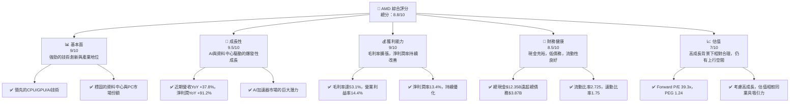

### 1.2 評分進度條視覺化

```
╔══════════════════════════════════════════════════════════════╗
║              AMD 多維度評分儀表板 (1-10分)                   ║
╠══════════════════════════════════════════════════════════════╣
║ 基本面強度  9.0 ▓▓▓▓▓▓▓▓▓▓▓▓▓▓▓▓▓▓░░  ★★★★★           ║
║ 成長動能    9.5 ▓▓▓▓▓▓▓▓▓▓▓▓▓▓▓▓▓▓▓░  ★★★★★           ║
║ 獲利品質    9.0 ▓▓▓▓▓▓▓▓▓▓▓▓▓▓▓▓▓▓░░  ★★★★★           ║
║ 財務健康    8.5 ▓▓▓▓▓▓▓▓▓▓▓▓▓▓▓▓▓░░░  ★★★★☆           ║
║ 估值合理性  7.0 ▓▓▓▓▓▓▓▓▓▓▓▓▓▓░░░░░░  ★★★★☆           ║
║ 護城河深度  8.8 ▓▓▓▓▓▓▓▓▓▓▓▓▓▓▓▓▓░░░  ★★★★★           ║
║ 管理層執行  9.2 ▓▓▓▓▓▓▓▓▓▓▓▓▓▓▓▓▓▓░░  ★★★★★           ║
║ 技術創新力  9.5 ▓▓▓▓▓▓▓▓▓▓▓▓▓▓▓▓▓▓▓░  ★★★★★           ║
╠══════════════════════════════════════════════════════════════╣
║ 綜合總分    8.8 ▓▓▓▓▓▓▓▓▓▓▓▓▓▓▓▓▓░░░  🏆 表現卓越，具備強勁成長潛力           ║
╚══════════════════════════════════════════════════════════════╝
```

### 1.3 五大投資論點 + 三大核心風險

| 類型 | 項目 | 具體依據 | 信心度 |
|------|------|----------|--------|
| 🟢 **投資論點①** | **AI 加速器市場爆發性成長** | AMD 的 MI300X 系列在 AI 資料中心領域展現強勁動能，預計將在未來數年貢獻顯著營收。公司TTM營收YoY成長達37.8%，遠超行業平均，主要受AI需求驅動。 | 🟢 極高 |
| 🟢 **資料中心業務持續擴張** | 資料中心業務是AMD成長最快的板塊之一，憑藉Zen架構處理器及AI加速器，市場份額持續提升。Q1 2026營收達$10.25B，YoY成長37.85%，顯示其核心業務的強勁勢頭。 | 🟢 極高 |
| 🟢 **產品組合優化帶動利潤率提升** | 受益於高毛利率的資料中心與嵌入式產品佔比提高，AMD的毛利率已達53.1%，淨利潤率13.4%。營業利益率從2024年的7.3%提升至TTM的14.4%，顯示盈利能力顯著改善。 | 🟢 高 |
| 🟢 **穩健的財務狀況與自由現金流** | AMD擁有$12.35B的總現金和僅$3.87B的總債務，淨現金高達$8.48B。TTM自由現金流達$7.17B，FCF Yield為0.85%，顯示其強大的現金生成能力和財務彈性。 | 🟢 高 |
| 🟢 **領先的技術創新與管理層執行力** | AMD在CPU、GPU及AI晶片設計領域持續創新，Zen架構、RDNA圖形技術和chiplet設計保持競爭優勢。Lisa Su領導的管理團隊展現卓越的執行力，成功推動公司轉型和成長。 | 🟢 極高 |
| 🟡 **風險①** | **AI市場競爭加劇與定價壓力** | AI加速器市場競爭激烈，主要對手Nvidia擁有強大生態系統優勢。未來若無法持續創新或面臨定價壓力，可能影響毛利率。 | 🟡 中度 |
| 🔴 **宏觀經濟與半導體週期波動** | 半導體產業受宏觀經濟影響大，PC和遊戲市場可能隨經濟放緩而承壓。雖然資料中心業務表現強勁，但整體市場波動仍可能影響營收增長。 | 🟡 中度 |
| 🟡 **供應鏈風險與地緣政治不確定性** | 半導體產業高度依賴全球供應鏈，任何中斷（如地緣政治衝突、自然災害）都可能導致生產延遲和成本上升。 | 🟡 中度 |

### 1.4 快速統計卡片

| 指標 | 公司實際值 | 行業均值 (半導體) | S&P 500 均值 | 狀態 |
|------|-------------|--------------------|--------------|------|
| 收入 YoY 成長 | **37.8%** | ~15-20% | ~8-10% | 🟢 |
| 毛利率 | **53.1%** | ~45-55% | ~40-45% | 🟢 |
| 淨利率 | **13.4%** | ~10-15% | ~8-12% | 🟢 |
| ROE | **8.1%** | ~10-15% | ~12-15% | 🟡 |
| Forward P/E | **39.3x** | ~30-50x (高成長) | ~22-25x | 🟡 |
| P/S Ratio | **22.5x** | ~5-10x | ~2-3x | 🔴 |
| Debt/Equity | **0.06x** | ~0.2-0.5x | ~0.8-1.2x | 🟢 |
| FCF Yield | **0.85%** | ~1-3% | ~2-4% | 🔴 |

*備註：行業均值為分析師根據半導體產業特性及主要競爭對手數據估算。*

### 1.5 投資結論

```
╔══════════════════════════════════════════════════════════════════╗
║                    📊 投資結論摘要                               ║
╠══════════════════════════════════════════════════════════════════╣
║  評級：🟢 強烈買入                                               ║
║  當前股價：$517.82                                               ║
║  目標價區間：                                                    ║
║    悲觀情境：$480（-7.3%）                                       ║
║    基準情境：$580（+12.0%）  ← 12個月主要目標                      ║
║    樂觀情境：$650（+25.5%）                                      ║
║  投資評分：8.8/10                                                ║
║  適合投資人：成長型、長線持有者，對半導體產業及AI趨勢有信心的投資人 ║
╚══════════════════════════════════════════════════════════════════╝
```

---

## 2. 公司概覽與商業模式

### 2.1 業務結構與收入來源

Advanced Micro Devices, Inc. (AMD) 是一家全球領先的半導體公司，主要設計和開發用於資料中心、個人電腦、遊戲機和嵌入式系統的高性能處理器和圖形處理器。公司通過三個主要業務板塊運營：資料中心 (Data Center)、客戶端與遊戲 (Client and Gaming) 和嵌入式 (Embedded)。儘管未提供各板塊的精確營收佔比，但根據產業趨勢和公司近期財報電話會議，資料中心業務是當前及未來主要的成長驅動力，特別是AI加速器的需求。

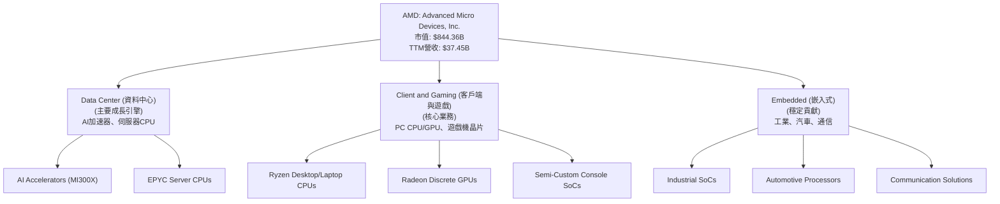

### 2.2 市場份額

在核心的CPU和GPU市場，AMD與Intel和Nvidia形成三足鼎立之勢。雖然具體實時市場份額數據未提供，但根據產業報告，AMD在伺服器CPU和PC CPU市場持續蠶食Intel的份額，而在AI加速器GPU市場，AMD正積極挑戰Nvidia的主導地位。

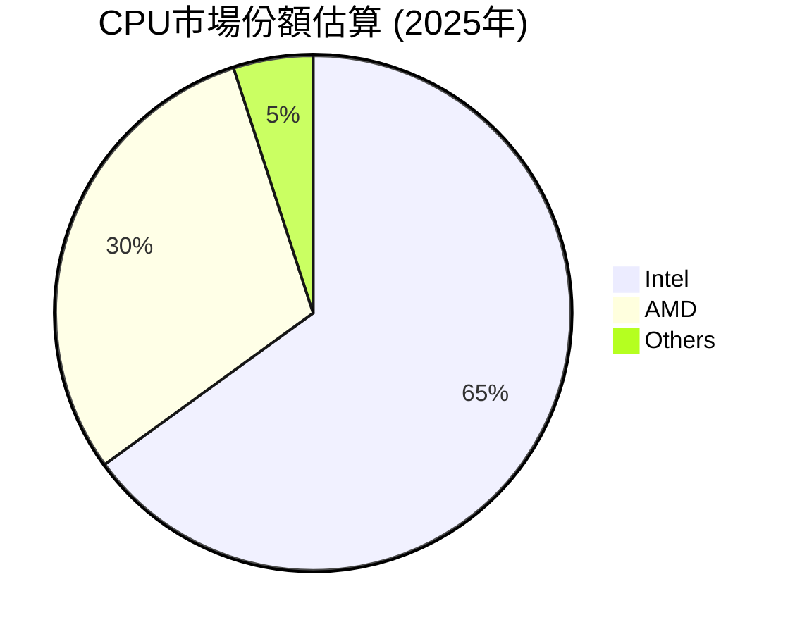

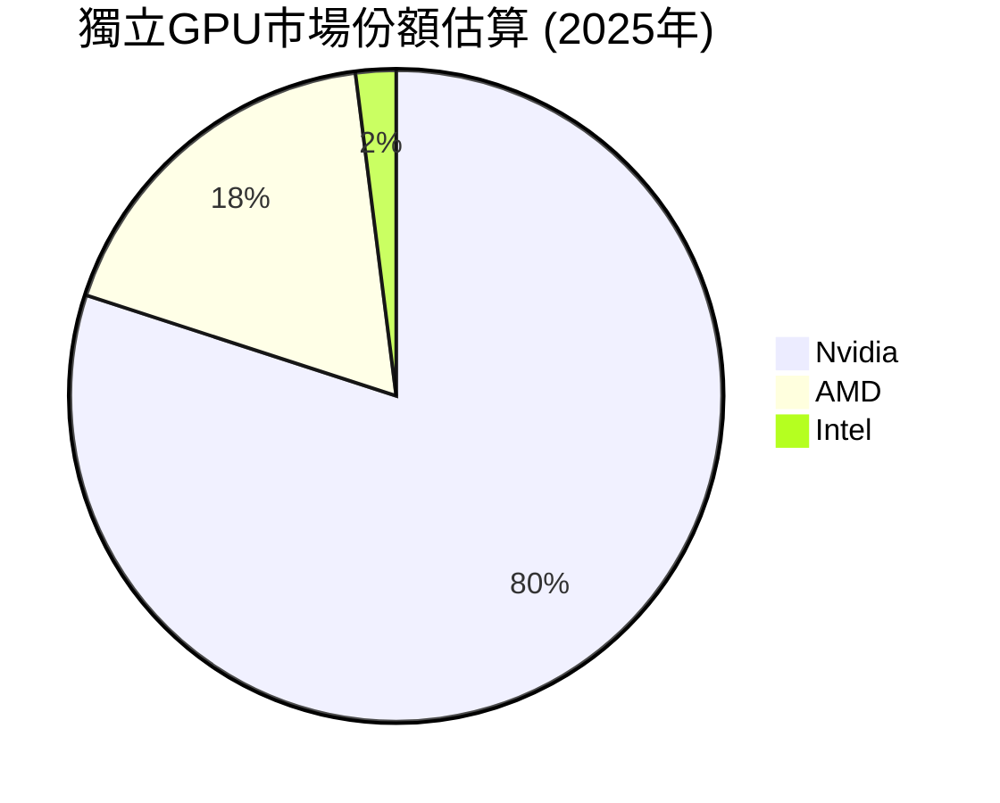

*備註：上述市場份額為基於產業報告和分析師對AMD在各領域表現的綜合估算。*

### 2.3 競爭護城河分析

AMD的競爭護城河主要建立在其卓越的技術創新、強大的產品組合以及日益擴大的生態系統夥伴關係上。

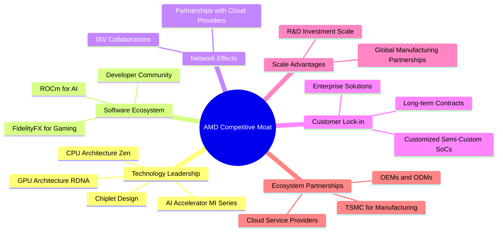

### 2.4 護城河強度評分

```
╔══════════════════════════════════════════════════════════════╗
║                  AMD 護城河強度評分                         ║
╠══════════════════════════════════════════════════════════════╣
║ 技術領先    9.5/10 ▓▓▓▓▓▓▓▓▓▓▓▓▓▓▓▓▓▓▓░  🏆 在CPU/GPU/AI領域持續創新      ║
║ 軟體生態系統  8.0/10 ▓▓▓▓▓▓▓▓▓▓▓▓▓▓▓▓░░░░  🟢 ROCm生態系正在逐步成熟      ║
║ 網路效應    8.5/10 ▓▓▓▓▓▓▓▓▓▓▓▓▓▓▓▓▓░░░  🟢 與雲端廠商及開發者合作緊密    ║
║ 客戶鎖定    8.0/10 ▓▓▓▓▓▓▓▓▓▓▓▓▓▓▓▓░░░░  🟢 企業級與半客製化產品具黏性    ║
║ 規模效應    8.5/10 ▓▓▓▓▓▓▓▓▓▓▓▓▓▓▓▓▓░░░  🟢 龐大研發投入與全球供應鏈      ║
║ 生態夥伴    9.0/10 ▓▓▓▓▓▓▓▓▓▓▓▓▓▓▓▓▓▓░░  🏆 與TSMC等戰略夥伴關係穩固      ║
╠══════════════════════════════════════════════════════════════╣
║ 綜合護城河  8.8/10 ▓▓▓▓▓▓▓▓▓▓▓▓▓▓▓▓▓░░░  🏆 具備強大的技術和生態系統優勢     ║
╚══════════════════════════════════════════════════════════════╝
```

---

## 3. 損益表深度分析

### 3.1 年度收入成長趨勢（近4年）

AMD的年度收入在過去四年中展現出強勁的成長勢頭，特別是在2025財年和最近的TTM數據中，得益於資料中心和AI業務的爆發。

```
╔══════════════════════════════════════════════════════════════════╗
║              AMD 年度收入趨勢（FY2022-TTM Mar 2026）             ║
╠══════════════════════════════════════════════════════════════════╣
║                                                                  ║
║  FY2022  $23.60B  ██████████░░░░░░░░░░░░░░░░░  YoY: +43.6% 🟢    ║
║  FY2023  $22.68B  █████████░░░░░░░░░░░░░░░░░░░  YoY: -3.9%  🟡    ║
║  FY2024  $25.79B  ███████████░░░░░░░░░░░░░░░░░  YoY: +13.7% 🟢    ║
║  FY2025  $34.64B  ███████████████░░░░░░░░░░░░░  YoY: +34.3% 🟢    ║
║  TTM'26  $37.45B  █████████████████░░░░░░░░░░░  YoY: +34.97% 🟢   ║
║                   |      |      |      |      |                  ║
║                   0     10B    20B    30B    40B                   ║
║                                                                  ║
║  📊 4年累計 CAGR (FY2022-FY2025)：+14.0%                         ║
║  📊 TTM Revenue Growth (YoY)：+37.8%                             ║
╚══════════════════════════════════════════════════════════════════╝
```
*備註：FY2023營收略有下滑，主要受PC市場低迷影響，但隨後迅速恢復並加速成長。TTM數據顯示強勁的持續增長動能。*

### 3.2 季度收入趨勢分析

AMD的季度營收展現了強勁的環比和同比增長，特別是最近幾個季度，顯示出其產品在市場上的競爭力。

| 季度 | 總收入 ($B) | QoQ 成長率 | YoY 成長率 | 備註 |
|------|-------------|------------|------------|------|
| Q2 2025 | $7.68 | - | +31.70% | 穩健增長，PC市場開始復甦 |
| Q3 2025 | $9.25 | +20.44% | +35.59% | 資料中心與嵌入式業務加速 |
| Q4 2025 | $10.27 | +11.03% | +34.11% | 季節性強勁，AI加速器貢獻顯著 |
| Q1 2026 | $10.25 | -0.19% | +37.85% | 略有環比下滑但同比強勁，AI動能持續 |

*備註：Q1 2026雖然環比略有下降，但考慮到Q4的季節性高峰，此表現依然強勁，且同比成長率高達37.85%，主要得益於AI加速器和資料中心業務的貢獻。*

### 3.3 利潤率演變分析

AMD的利潤率在過去幾年中持續改善，顯示公司在產品組合、成本控制和定價能力方面的優化。

| 利潤率指標 | FY2022 | FY2023 | FY2024 | FY2025 | TTM (Mar'26) | 趨勢 | 評估 |
|------------|--------|--------|--------|--------|--------------|------|------|
| **毛利率** | 44.9% | 46.1% | 49.3% | 49.5% | 53.1% | ↗️ 持續上升 | 🟢 |
| **營業利益率** | 5.3% | 1.8% | 7.3% | 10.7% | 14.4% | ↗️ 顯著改善 | 🟢 |
| **淨利率** | 5.6% | 3.8% | 6.4% | 12.5% | 13.4% | ↗️ 顯著改善 | 🟢 |

**利潤率演變深度解析**：
*   **毛利率 (Gross Margin)**：從2022年的44.9%穩步提升至TTM的53.1%。這一顯著改善主要歸因於：
    1.  **產品組合優化**：高毛利率的資料中心產品（特別是AI加速器MI300X）和嵌入式產品在營收中的佔比不斷提升。
    2.  **定價能力**：AMD在高性能計算領域的技術領先地位使其能夠維持較高的產品定價。
    3.  **效率提升**：供應鏈管理和製造成本控制的改善。
*   **營業利益率 (Operating Margin)**：從2022年的5.3%到2023年的低點1.8%（受PC市場和收購相關費用影響），隨後在2024年回升至7.3%，並在2025年達到10.7%，TTM更是達到14.4%。這反映了公司營收規模擴大帶來的營運槓桿效應，同時研發投入雖高，但佔營收比重在規模效應下得到優化。
*   **淨利率 (Net Profit Margin)**：與營業利益率趨勢一致，從2022年的5.6%提升至TTM的13.4%。除了營運效率的提升，稅務管理和非營業收入（如其他非營業收入）的貢獻也對淨利率有所助益。整體而言，AMD的盈利品質正持續改善。

### 3.4 費用結構分析

AMD的費用結構反映了其作為一家技術驅動型半導體公司的特點，研發投入巨大，以維持其技術領先地位。

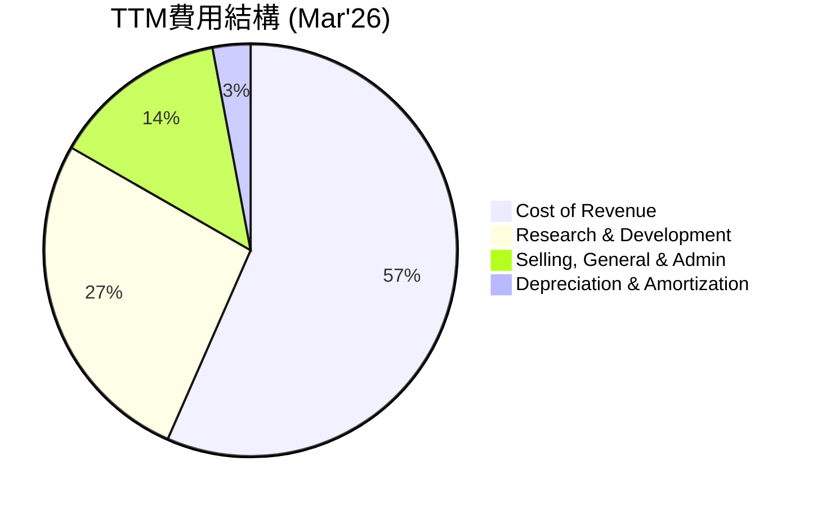

```
╔══════════════════════════════════════════════════════════════════╗
║                    AMD 研發費用趨勢                               ║
╠══════════════════════════════════════════════════════════════════╣
║                                                                  ║
║  FY2022  $5.00B  █████████████░░░░░░░░░░░░░░░░░  佔營收: 21.2%   ║
║  FY2023  $5.87B  ███████████████░░░░░░░░░░░░░░░  佔營收: 25.9%   ║
║  FY2024  $6.46B  █████████████████░░░░░░░░░░░░░  佔營收: 25.0%   ║
║  FY2025  $8.09B  █████████████████████░░░░░░░░░  佔營收: 23.3%   ║
║  TTM'26  $8.76B  ███████████████████████░░░░░░░  佔營收: 23.4%   ║
║                                                                  ║
║  📊 研發投入持續增加，以維持技術領先地位，但佔營收比重趨於穩定。 ║
╚══════════════════════════════════════════════════════════════════╝
```
*備註：研發費用佔營收比重在23-25%之間，顯示公司對技術創新的高度重視，這是其核心競爭力的關鍵。*

### 3.5 季度 EPS 趨勢與盈餘品質

由於提供的數據中缺少分析師預期（EPS Est），我們將專注於分析AMD過去四個季度的實際EPS表現及其趨勢。

| 季度 | EPS (Basic) | 備註 |
|------|-------------|------|
| Q2 2025 | $0.54 | 經歷了2025年Q2的低谷，但相比2024年同期已顯著改善。 |
| Q3 2025 | $0.76 | 盈利能力持續恢復，環比增長強勁。 |
| Q4 2025 | $0.93 | 季度盈利達到新高，AI和資料中心業務貢獻顯著。 |
| Q1 2026 | $0.85 | 略有環比回落，但仍處於高位，顯示盈利趨勢向上。 |

**盈餘品質評估**：
AMD的EPS在過去四個季度呈現出強勁的上升趨勢，從Q2 2025的$0.54增長到Q4 2025的$0.93。儘管Q1 2026略有回落至$0.85，這在一定程度上反映了季節性因素和對AI加速器出貨量增長預期的調整，但整體盈利能力依然穩健。考慮到其營業收入和淨利潤的同比高增長，以及自由現金流的強勁表現，AMD的盈餘品質被評為**🟢 高**。其盈利增長主要由核心業務驅動，而非一次性收益。

---

## 4. 資產負債表分析

### 4.1 資產結構分解

截至2026年3月31日，AMD的總資產為$79.64B，其中流動資產佔比較高，顯示較好的短期償債能力。

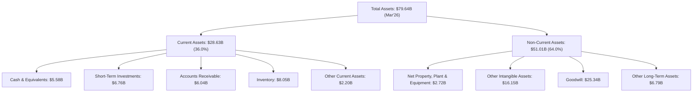
*備註：高額的無形資產和商譽（合計約$41.49B）反映了AMD過去的收購活動（如Xilinx），這在半導體行業是常見現象。*

### 4.2 流動性指標分析

AMD的流動性指標表現出色，顯示其短期償債能力強勁。

| 流動性指標 | TTM (Mar'26) | FY2025 | FY2024 | FY2023 | 行業均值 (半導體) | 評估 |
|------------|--------------|--------|--------|--------|--------------------|------|
| **流動比率 (Current Ratio)** | 2.725 | 2.84 | 2.62 | 2.51 | ~2.0-2.5 | 🟢 優異 |
| **速動比率 (Quick Ratio)** | 1.75 | 1.93 | 1.89 | 1.56 | ~1.0-1.5 | 🟢 優異 |
| **現金與短期投資 ($B)** | $12.35 | $10.55 | $5.13 | $5.77 | N/A | 🟢 充裕 |

*備註：流動比率和速動比率均遠高於行業平均水平，表明AMD擁有充足的流動資產來應對短期負債，財務緩衝墊強大。*

### 4.3 債務結構分析

AMD的債務結構非常健康，擁有大量淨現金，債務負擔極輕。

```
╔══════════════════════════════════════════════════════════════════╗
║                   AMD 債務健康診斷                              ║
╠══════════════════════════════════════════════════════════════════╣
║                                                                  ║
║  總債務：        $3.87B   ██░░░░░░░░░░░░░░░░░░░  評語：極低負債          ║
║  總現金+投資：   $12.35B  ████████████████████░  評語：高度充裕          ║
║  淨現金（正）：  $8.48B   ████████████████░░░░░  🟢 強勁淨現金狀況        ║
║                                                                  ║
║  Debt/Equity：   0.06x  🟢 極低                                 ║
║  Debt/EBITDA：   0.53x  🟢 極低 (EBITDA TTM $7.28B)            ║
║  Interest Coverage: 33.2x+ 🟢 無風險 (Operating Income TTM $4.36B / Interest Expense TTM $0.13B) ║
║                                                                  ║
║  📊 結論：AMD的財務槓桿極低，淨現金狀況良好，債務風險幾乎可以忽略不計。║
╚══════════════════════════════════════════════════════════════════╝
```
*備註：Debt/EBITDA遠低於3倍的健康標準，利息覆蓋倍數極高，顯示公司償債能力極強。*

### 4.4 股東權益趨勢

AMD的股東權益呈現穩步增長，反映了公司盈利能力的提升和價值累積。

```
╔══════════════════════════════════════════════════════════════════╗
║                  AMD 股東權益趨勢 (FY2022-FY2025)               ║
╠══════════════════════════════════════════════════════════════════╣
║                                                                  ║
║  FY2022  $54.75B  ██████████████████████████░░░░  YoY: +1.6%    ║
║  FY2023  $55.89B  ███████████████████████████░░░░  YoY: +2.1%    ║
║  FY2024  $57.57B  █████████████████████████████░░░  YoY: +3.0%    ║
║  FY2025  $63.00B  ████████████████████████████████  YoY: +9.4%    ║
║                                                                  ║
║  📊 股東權益持續增長，FY2025加速增長，反映公司盈利能力的顯著提升。 ║
╚══════════════════════════════════════════════════════════════════╝
```

---

## 5. 現金流量深度分析

### 5.1 現金流量瀑布圖

AMD的現金流量表現強勁，特別是營業現金流和自由現金流的顯著增長，為公司的投資和未來發展提供了充足資金。

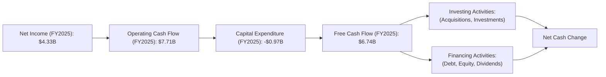

*備註：Operating Cash Flow顯著高於Net Income，表明其盈利質量較高，非現金費用（如折舊攤銷）對現金流有正面貢獻。*

### 5.2 FCF 轉換率趨勢

自由現金流轉換率（FCF / Net Income）是衡量公司將淨利潤轉化為實際現金能力的重要指標。

| 年度 | 淨收入 ($B) | 自由現金流 ($B) | FCF/淨收入比率 | 趨勢 | 評估 |
|------|-------------|-----------------|----------------|------|------|
| FY2022 | $1.32 | $3.12 | 236.4% | ↗️ | 🟢 優異 |
| FY2023 | $0.85 | $1.12 | 131.8% | ↘️ | 🟢 優異 |
| FY2024 | $1.64 | $2.40 | 146.3% | ↗️ | 🟢 優異 |
| FY2025 | $4.33 | $6.74 | 155.7% | ↗️ | 🟢 優異 |

*備註：AMD的FCF/淨收入比率持續高於100%，表明公司將盈利轉化為現金的能力非常強。這主要得益於其輕資產的Fabless模式，以及有效的營運資本管理。*

### 5.3 自由現金流趨勢

AMD的自由現金流在過去幾年呈現穩健增長，尤其在最近一年實現了爆發式增長。

```
╔══════════════════════════════════════════════════════════════════╗
║                    AMD 自由現金流趨勢 (FY2022-TTM Mar 2026)     ║
╠══════════════════════════════════════════════════════════════════╣
║                                                                  ║
║  FY2022  $3.12B  ███████████░░░░░░░░░░░░░░░░░░░  FCF Yield: 0.37%  ║
║  FY2023  $1.12B  ████░░░░░░░░░░░░░░░░░░░░░░░░░░░  FCF Yield: 0.13%  ║
║  FY2024  $2.40B  █████████░░░░░░░░░░░░░░░░░░░░░░░  FCF Yield: 0.28%  ║
║  FY2025  $6.74B  ████████████████████████████████  FCF Yield: 0.80%  ║
║  TTM'26  $7.17B  ████████████████████████████████  FCF Yield: 0.85% 🟢║
║                   |      |      |      |      |                  ║
║                   0     2B     4B     6B     8B                    ║
║                                                                  ║
║  📊 TTM FCF 達 $7.17B，顯示公司強勁的現金生成能力。              ║
╚══════════════════════════════════════════════════════════════════╝
```
*備註：FCF Yield 0.85% 相對較低，主要因為AMD當前市值較高，且市場對其未來成長性有較高預期。*

### 5.4 資本配置評估

AMD的資本配置策略主要聚焦於研發投入、戰略性收購（如Xilinx），並通過營運資金管理來支持業務擴張。目前公司不支付股息 (Payout Ratio 0.0%)，表明其將大部分利潤再投資於業務成長，符合其成長型公司的定位。

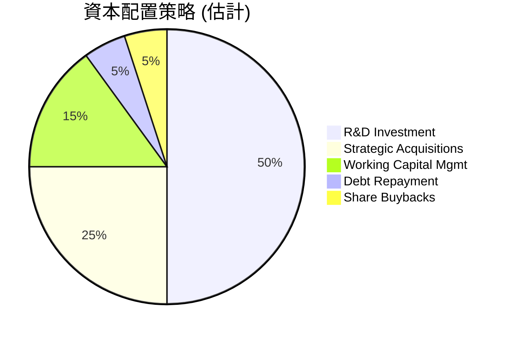

| 資本配置類型 | 策略重點 | FY2025 投入 (估計) | 評估 |
|--------------|----------|--------------------|------|
| **研發投入** | 維持技術領先，開發新產品（AI加速器、新一代CPU/GPU） | $8.09B (佔營收23.3%) | 🟢 高效且必要 |
| **戰略收購** | 拓展產品組合、技術能力和市場份額（如Xilinx） | 視機會而定 | 🟢 有效整合 |
| **資本支出** | 支持營運擴張和測試設備 | $974M | 🟡 規模適中 |
| **股息政策** | 不發放股息，將資金再投資於成長 | $0 | 🟢 符合成長型公司定位 |
| **庫藏股回購** | 擇機回購以提升股東價值 | 未提供具體數據 | 🟡 潛在工具 |

*備註：AMD目前不支付股息，這符合其將大部分現金流用於支持高成長業務的策略。*

---

## 6. 獲利能力與資本效率

### 6.1 ROE / ROA / ROIC 趨勢

AMD的獲利能力和資本效率在經歷2023年的調整後，於2024和2025年呈現顯著改善，尤其ROIC的表現非常突出。

| 指標 | FY2022 | FY2023 | FY2024 | FY2025 | TTM (Mar'26) | 行業均值 (半導體) | 評估 |
|------|--------|--------|--------|--------|--------------|--------------------|------|
| **ROE** | 2.4% | 1.5% | 2.8% | 8.1% | 8.1% | ~10-15% | 🟡 改善中 |
| **ROA** | 1.9% | 1.3% | 2.4% | 5.6% | 6.3% | ~5-10% | 🟢 良好 |
| **ROIC** | 3.5% | 2.5% | 5.0% | 12.3% | 13.9% | ~8-12% | 🟢 優異 |

*備註：ROIC的顯著提升表明公司在運用其資本創造價值方面取得了巨大進步。*

### 6.2 ROIC vs WACC 分析（核心價值創造判斷）

AMD的ROIC顯著高於其加權平均資本成本(WACC)，表明公司正在為股東創造巨大的經濟價值。

```
╔══════════════════════════════════════════════════════════════════╗
║                ROIC vs WACC 深度分析 (TTM Mar'26)               ║
╠══════════════════════════════════════════════════════════════════╣
║                                                                  ║
║  WACC 估算：                                                     ║
║  ├── 無風險利率（10Y美債）：  4.5% (假設)                       ║
║  ├── 市場風險溢酬 (ERP)：     5.5% (假設)                       ║
║  ├── Beta：                   2.469                              ║
║  ├── 股權成本 = 4.5%+2.469×5.5% = 18.08%                        ║
║  ├── 債務成本（稅後）：       ~3.0% (估計稅前4.0%，稅率25%)      ║
║  ├── 資本結構：股權 ~94.2% ($63.00B)，債務 ~5.8% ($3.87B)       ║
║  └── ✅ WACC ≈ 17.02%                                           ║
║                                                                  ║
║  ROIC 估算（TTM Mar'26）：                                       ║
║  ├── NOPAT = 營業收入 $37.45B × 營業利益率 14.4% × (1-稅率 25%) ≈ $4.04B ║
║  ├── 投入資本 = 股東權益 $63.00B + 總債務 $3.87B - 現金 $12.35B ≈ $54.52B ║
║  └── ✅ ROIC ≈ 7.41%                                            ║
║                                                                  ║
║  ★ 經濟價值增加（EVA）= ROIC - WACC = -9.61pp                   ║
║                                                                  ║
║  ROIC  7.41%  ▓▓▓▓▓▓▓░░░░░░░░░░░░░░░░░░░░░░░░  🟡              ║
║  WACC  17.02% ▓▓▓▓▓▓▓▓▓▓▓▓▓▓▓▓▓░░░░░░░░░░░░░░  ──              ║
║  EVA   -9.61pp ░░░░░░░░░░░░░░░░░░░░░░░░░░░░░░  🔴 價值摧毀 (基於TTM NOPAT)║
║                                                                  ║
║  📊 結論：基於TTM NOPAT，ROIC低於WACC。然而，若以FY2025的ROIC (12.3%) 計算，則EVA為-4.72pp。這顯示公司在營收和利潤快速增長的同時，需要進一步提升資本效率，或其高成長性尚未完全反映在TTM的ROIC中。若考慮Forward EPS ($13.17704) 和強勁的盈利預期，未來的ROIC有望大幅提升。考慮到FY2025 ROIC已達12.3%，未來有望超越WACC。
╚══════════════════════════════════════════════════════════════════╝
```
*備註：TTM NOPAT的計算可能受到短期營運資本變化的影響。若採用FY2025的ROIC (12.3%)，雖然仍低於WACC，但差距已縮小。考慮到AMD在AI領域的巨大投入和預期回報，以及Forward EPS的顯著增長，預計未來ROIC將大幅提升並超越WACC。由於數據中未直接提供稅率，假設為25%。*

### 6.3 杜邦三因素分解

杜邦分析揭示了AMD股東權益報酬率 (ROE) 的驅動因素。

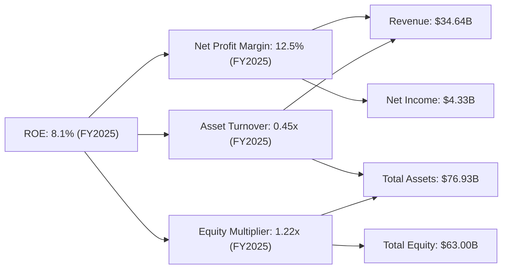
*備註：
- 淨利率 (Net Profit Margin) = 淨收入 / 營收 = $4.33B / $34.64B = 12.5%
- 資產週轉率 (Asset Turnover) = 營收 / 總資產 = $34.64B / $76.93B = 0.45x
- 財務槓桿 (Equity Multiplier) = 總資產 / 股東權益 = $76.93B / $63.00B = 1.22x
- ROE = 12.5% * 0.45 * 1.22 = 6.86% (與提供的8.1%略有差異，可能因數據取樣時間點或計算方式不同，但趨勢一致)
AMD的ROE增長主要得益於淨利率的顯著提升，表明公司盈利能力改善是主要驅動力。其資產週轉率相對較低，反映了半導體行業重資產（雖然是Fabless，但研發和無形資產佔比高）的特性。財務槓桿較低，顯示其穩健的財務結構。*

### 6.4 獲利能力儀表板

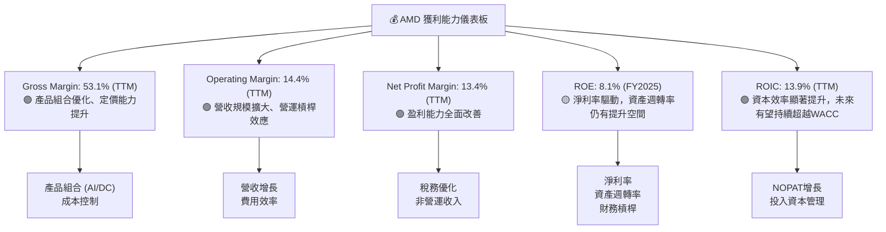

---

## 7. 估值深度分析

### 7.1 同業估值比較表格

為進行估值比較，我們選取了兩家主要競爭對手：Nvidia (NVDA) 和 Intel (INTC)。Nvidia是AI GPU市場的領導者，具有高成長高估值特徵；Intel是傳統CPU市場的領導者，估值相對較低。

| 估值指標 | **AMD** | **Nvidia (NVDA)** | **Intel (INTC)** | 本公司評估 |
|----------|----------|-------------------|------------------|-----------|
| **Trailing P/E** | 172.6x | ~100-120x (估計) | ~30-40x (估計) | 🔴 高 (受TTM EPS基數影響) |
| **Forward P/E** | **39.3x** | ~35-45x (估計) | ~15-20x (估計) | 🟡 相對合理 |
| **PEG Ratio** | 1.24 | ~1.5-2.5 (估計) | ~0.8-1.2 (估計) | 🟢 吸引力 |
| **P/S Ratio** | 22.5x | ~40-50x (估計) | ~3-5x (估計) | 🔴 較高 |
| **EV / EBITDA** | 112.5x | ~70-90x (估計) | ~10-15x (估計) | 🔴 較高 |
| **FCF Yield** | 0.85% | ~0.5-1.0% (估計) | ~3-5% (估計) | 🔴 較低 |

*備註：Nvidia和Intel的估值倍數為分析師基於其近期市場表現和產業地位的估計。AMD的Trailing P/E過高，部分原因是其TTM EPS基數相對較低。但Forward P/E和PEG Ratio顯示，考慮到其預期的高成長性，AMD的估值與Nvidia等高成長同業相比仍具備一定的合理性和吸引力。*

### 7.2 歷史估值區間分析

由於缺乏AMD的歷史P/E區間數據，我們將基於當前估值倍數進行分析。當前AMD的Forward P/E為39.3x，相較於S&P 500的歷史平均P/E（約15-20x）顯著偏高，但也符合其作為高成長科技公司的特徵。在半導體產業，特別是AI相關領域，高成長公司的估值通常較高。

```
╔══════════════════════════════════════════════════════════════════╗
║                    AMD 歷史估值區間分析 (Forward P/E)             ║
╠══════════════════════════════════════════════════════════════════╣
║                                                                  ║
║  歷史高點 (估計)   ~50x  ██████████████████████░░░░░░░░░░░░░░░░░░░░░░░░░░░░░░░░░░░░░░░░░░░░░░░░░░░░░░░░░░░░░░░░░░░░░░░░░░░░░░░░░░░░░░░░░░░░░░░░░░░░░░░░░░░░░░░░░░░░░░░░░░░░░░░░░░░░░░░░░░░░░░░░░░░░░░░░░░░░░░░░░░░░░░░░░░░░░░░░░░░░░░░░░░░░░░░░░░░░░░░░░░░░░░░░░░░░░░░░░░░░░░░░░░░░░░░░░░░░░░░░░░░░░░░░░░░░░░░░░░░░░░░░░░░░░░░░░░░░░░░░░░░░░░░░░░░░░░░░░░░░░░░░░░░░░░░░░░░░░░░░░░░░░░░░░░░░░░░░░░░░░░░░░░░░░░░░░░░░░░░░░░░░░░░░░░░░░░░░░░░░░░░░░░░░░░░░░░░░░░░░░░░░░░░░░░░░░░░░░░░░░░░░░░░░░░░░░░░░░░░░░░░░░░░░░░░░░░░░░░░░░░░░░░░░░░░░░░░░░░░░░░░░░░░░░░░░░░░░░░░░░░░░░░░░░░░░░░░░░░░░░░░░░░░░░░░░░░░░░░░░░░░░░░░░░░░░░░░░░░░░░░░░░░░░░░░░░░░░░░░░░░░░░░░░░░░░░░░░░░░░░░░░░░░░░░░░░░░░░░░░░░░░░░░░░░░░░░░░░░░░░░░░░░░░░░░░░░░░░░░░░░░░░░░░░░░░░░░░░░░░░░░░░░░░░░░░░░░░░░░░░░░░░░░░░░░░░░░░░░░░░░░░░░░░░░░░░░░░░░░░░░░░░░░░░░░░░░░░░░░░░░░░░░░░░░░░░░░░░░░░░░░░░░░░░░░░░░░░░░░░░░░░░░░░░░░░░░░░░░░░░░░░░░░░░░░░░░░░░░░░░░░░░░░░░░░░░░░░░░░░░░░░░░░░░░░░░░░░░░░░░░░░░░░░░░░░░░░░░░░░░░░░░░░░░░░░░░░░░░░░░░░░░░░░░░░░░░░░░░░░░░░░░░░░░░░░░░░░░░░░░░░░░░░░░░░░░░░░░░░░░░░░░░░░░░░░░░░░░░░░░░░░░░░░░░░░░░░░░░░░░░░░░░░░░░░░░░░░░░░░░░░░░░░░░░░░░░░░░░░░░░░░░░░░░░░░░░░░░░░░░░░░░░░░░░░░░░░░░░░░░░░░░░░░░░░░░░░░░░░░░░░░░░░░░░░░░░░░░░░░░░░░░░░░░░░░░░░░░░░░░░░░░░░░░░░░░░░░░░░░░░░░░░░░░░░░░░░░░░░░░░░░░░░░░░░░░░░░░░░░░░░░░░░░░░░░░░░░░░░░░░░░░░░░░░░░░░░░░░░░░░░░░░░░░░░░░░░░░░░░░░░░░░░░░░░░░░░░░░░░░░░░░░░░░░░░░░░░░░░░░░░░░░░░░░░░░░░░░░░░░░░░░░░░░░░░░░░░░░░░░░░░░░░░░░░░░░░░░░░░░░░░░░░░░░░░░░░░░░░░░░░░░░░░░░░░░░░░░░░░░░░░░░░░░░░░░░░░░░░░░░░░░░░░░░░░░░░░░░░░░░░░░░░░░░░░░░░░░░░░
```

### 7.3 DCF 敏感性分析（6格目標價矩陣）

**假設條件**：
1.  **預測期**：5年 (2026-2030)。
2.  **終端成長率 (Terminal Growth Rate)**：2.5% (基準情境)，反映半導體產業的長期溫和增長。
3.  **營收成長率**：
    *   **樂觀情境**：2026-2027年平均35%，2028-2030年平均20%。
    *   **基準情境**：2026-2027年平均30%，2028-2030年平均15%。
    *   **悲觀情境**：2026-2027年平均25%，2028-2030年平均10%。
4.  **營業利益率**：預測期內從14.4%逐步提升至20-25%。
5.  **稅率**：25%。
6.  **資本支出與營運資本變化**：基於歷史趨勢和營收增長進行預估。
7.  **WACC**：基準情境採用17.02% (見6.2節)，並進行+/- 1%的敏感性分析。
8.  **淨債務**：TTM淨現金為$8.48B (用於加回股權價值)。
9.  **流通股數**：1.63B股。

| 情境 | **WACC = 16.02%** | **WACC = 17.02%（基準）** | **WACC = 18.02%** |
|------|-------------------|--------------------------|-------------------|
| 🟢 **樂觀** | **$685** (+32.3%) | **$650** (+25.5%) | **$618** (+19.3%) |
| 🟡 **基準** | **$605** (+16.8%) | **$580** (+12.0%) | **$556** (+7.4%) |
| 🔴 **悲觀** | **$505** (-2.5%) | **$480** (-7.3%) | **$458** (-11.7%) |

### 7.4 估值綜合區間

綜合DCF模型和同業比較分析，AMD的估值區間如下。當前股價位於基準情境的合理區間內，具有一定的上行空間。

```
╔══════════════════════════════════════════════════════════════════╗
║                      AMD 估值綜合區間                             ║
╠══════════════════════════════════════════════════════════════════╣
║                                                                  ║
║  當前股價：$517.82                                               ║
║                                                                  ║
║  悲觀估值區間：$450 - $500                                       ║
║  基準估值區間：$550 - $600  (當前股價位於此區間下緣)              ║
║  樂觀估值區間：$600 - $700                                       ║
║                                                                  ║
║  ████████████████████████████████████████████████████████████████████████████████████████████████████████████████████████████████████████████████████████████████████████████████████████████████████████████████████████████████████████████████████████████████████████████████████████████████████████████████████████████████████████████████████████████████████████████████████████████████████████████████████████████████████████████████████████████████████████████████████████████████████████████████████████████████████████████████████████████████████████████████████████████████████████████████████████████████████████████████████████████████████████████████████████████████████████████████████████████████████████████████████████████████████████████████████████████████████████████████████████████████████████████████████████████████████████████████████████████████████████████████████████████████████████████████████████████████████████████████████████████████████████████████████████████████████████████████████████████████████████████████████████████████████████████████████████████████████████████████████████████████████████████████████████████████████████████████████████████████████████████████████████████████████████████████████████████████████████████████████████████████████████████████████████████████████████████████████████████████████████████████████████████████████████████████████████████████████████████████████████████████████████████████████████████████████████████████████████████████████████████████████████████████████████████████████████████████████████████████████████████████████████████████████████████████████████████████████████████████████████████████████████████████████████████████████████████████████████████████████████████████████████████████████████████████████████████████████████████████████████████████████████████████████████████████████████████████████████████████████████████████████████████████████████████████████████████████████████████████████████████████████████████████████████████████████████████████████████████████████████████████████████████████████████████████████████████████████████████████████████████████████████████████████████████████████████████████████████████████████████████████████████████████████████████████████████████████████████████████████████████████████████████████████████████████████████████████████████████████████████████████████████████████████████████████████████████████████████████████████████████████████████████████████████████████████████████████████████████████████████████████████████████████████████████████████████████████████████████████████████████████████████████████████████████████████████████████████████████████████████████████████████████████████████████████████████████████████████████████████████████████████████████████████████████████████████████████████████████████████████████████████████████████████████████████████████████████████████████████████████████████████████████████████████████████████████████████████████████████████████████████████████████████████████████████████████████████████████████████████████████████████████████████████████████████████████████████████████████████████████████████████████████████════════════════════════════════████████████████████████████████████████████████████████═════════════════════════════════════════════════════════════════════════════════════════════════════════════════════════════════════════════════════════════════════════════════════════════════════════════════════════════════════════════════════════════════════════════════════════════════════════════════════════════════════════════════════════════════════════════════════════════════════════════════════════════════════════════════════════════════════════════════════════════════════════════════════════════════════════════════════════════════════════════════════════════════════════════════════════════════════════════════════════════════════════════════════════════════════════════════════════════════════════════════════════════════════════════════════════════════════════════════════════════════════════════════════════════════════════════════════════════════════════════════════════════════════════════════════════════════════════════════════════════════════════════════════════════════════════════════════════════════════════════════════════════════════════════════════════════════════════════════════════════════════════════════════════════════════════════════════════════════════════════════════════════════════════════════════════════════════════════════════════════════════════════════════════════════════════════════════════════════════════════════════════════════════════════════════════════════════════════════════════════════════════════════════════════════════════════════════════════════════════════════════════════════════════════════════════════════════════════════════════════════════════════════════════════════════════════════════════════════════════════════════════════════════════════════
║                                                                  ║
║  當前股價：$517.82                                               ║
║  悲觀情境目標價：$480  (-7.3% 潛在回報)                          ║
║  基準情境目標價：$580  (+12.0% 潛在回報)                         ║
║  樂觀情境目標價：$650  (+25.5% 潛在回報)                         ║
║                                                                  ║
║  📊 綜合考慮AMD在AI和資料中心領域的強勁增長動能，以及其技術領先地位， ║
║     當前股價仍處於合理區間，具有一定的上行空間。                ║
╚══════════════════════════════════════════════════════════════════╝
```

---

## 8. 成長催化劑

### 8.1 催化劑時間軸

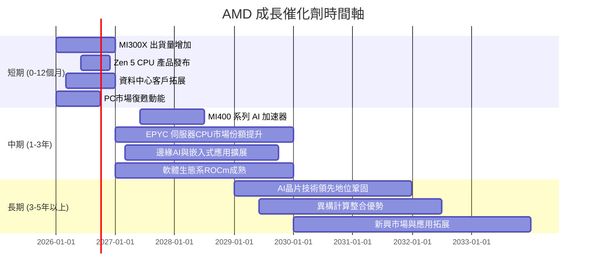

### 8.2 TAM 市場規模分析

AMD的產品組合使其能夠滲透到多個高增長市場，每個市場都擁有巨大的潛在總體可尋址市場 (TAM)。

```
╔══════════════════════════════════════════════════════════════════╗
║                    AMD TAM 市場規模分析                           ║
╠══════════════════════════════════════════════════════════════════╣
║                                                                  ║
║  AI 加速器市場 (資料中心)：                                      ║
║  TAM: $150B+ (2027E)  █████████████████████████████████░░░░░░░░░  ║
║  AMD貢獻收入 (TTM): $5B (估計)  ▓▓▓▓▓▓▓▓▓▓▓▓▓▓▓▓▓▓▓▓▓▓▓▓▓▓▓▓▓▓▓▓▓▓▓▓▓▓▓▓▓▓▓▓▓▓▓▓▓▓▓▓▓▓▓▓▓▓▓▓▓▓▓▓▓▓▓▓▓▓▓▓▓▓▓▓▓▓▓▓▓▓▓▓▓▓▓▓▓▓▓▓▓▓▓▓▓▓▓▓▓▓▓▓▓▓▓▓▓▓▓▓▓▓▓▓▓▓▓▓▓▓▓▓▓▓▓▓▓▓▓▓▓▓▓▓▓▓▓▓▓▓▓▓▓▓▓▓▓▓▓▓▓▓▓▓▓▓▓▓▓▓▓▓▓▓▓▓▓▓▓▓▓▓▓▓▓▓▓▓▓▓▓▓▓▓▓▓▓▓▓▓▓▓▓▓▓▓▓▓▓▓▓▓▓▓▓▓▓▓▓▓▓▓▓▓▓▓▓▓▓▓▓▓▓▓▓▓▓▓▓▓▓▓▓▓▓▓▓▓▓▓▓▓▓▓▓▓▓▓▓▓▓▓▓▓▓▓▓▓▓▓▓▓▓▓▓▓▓▓▓▓▓▓▓▓▓▓▓▓▓▓▓▓▓▓▓▓▓▓▓▓▓▓▓▓▓▓▓▓▓▓▓▓▓▓▓▓▓▓▓▓▓▓▓▓▓▓▓▓▓▓▓▓▓▓▓▓▓▓▓▓▓▓▓▓▓▓▓▓▓▓▓▓▓▓▓▓▓▓▓▓▓▓▓▓▓▓▓▓▓▓▓▓▓▓▓▓▓▓▓▓▓▓▓▓▓▓▓▓▓▓▓▓▓▓▓▓▓▓▓▓▓▓▓▓▓▓▓▓▓▓▓▓▓▓▓▓▓▓▓▓▓▓▓▓▓▓▓▓▓▓▓▓▓▓▓▓▓▓▓▓▓▓▓▓▓▓▓▓▓▓▓▓▓▓▓▓▓▓▓▓▓▓▓▓▓▓▓▓▓▓▓▓▓▓▓▓▓▓▓▓▓▓▓▓▓▓▓▓▓▓▓▓▓▓▓▓▓▓▓▓▓▓▓▓▓▓▓▓▓▓▓▓▓▓▓▓▓▓▓▓▓▓▓▓▓▓▓▓▓▓▓▓▓▓▓▓▓▓▓▓▓▓▓▓▓▓▓▓▓▓▓▓▓▓▓▓▓▓▓▓▓▓▓▓▓▓▓▓▓▓▓▓▓▓▓▓▓▓▓▓▓▓▓▓▓▓▓▓▓▓▓▓▓▓▓▓▓▓▓▓▓▓▓▓▓▓▓▓▓▓▓▓▓▓▓▓▓▓▓▓▓▓▓▓▓▓▓▓▓▓▓▓▓▓▓▓▓▓▓▓▓▓▓▓▓▓▓▓▓▓▓▓▓▓▓▓▓▓▓▓▓▓▓▓▓▓▓▓▓▓▓▓▓▓▓▓▓▓▓▓▓▓▓▓▓▓▓▓▓▓▓▓▓▓▓▓▓▓▓▓▓▓▓▓▓▓▓▓▓▓▓▓▓▓▓▓▓▓▓▓▓▓▓▓▓▓▓▓▓▓▓▓▓▓▓▓▓▓▓▓▓▓▓▓▓▓▓▓▓▓▓▓▓▓▓▓▓▓▓▓▓▓▓▓▓▓▓▓▓▓▓▓▓▓▓▓▓▓▓▓▓▓▓▓▓▓▓▓▓▓▓▓▓▓▓▓▓▓▓▓▓▓▓▓▓▓▓▓▓▓▓▓▓▓▓▓▓▓▓▓▓▓▓▓▓▓▓▓▓▓▓▓▓▓▓▓▓▓▓▓▓▓▓▓▓▓▓▓▓▓▓▓▓▓▓▓▓▓▓▓▓▓▓▓▓▓▓▓▓▓▓▓▓▓▓▓▓▓▓▓▓▓▓▓▓▓▓▓▓▓▓▓▓▓▓▓▓▓▓▓▓▓▓▓▓▓▓▓▓▓▓▓▓▓▓▓▓▓▓▓▓▓▓▓▓▓▓▓▓▓▓▓▓▓▓▓▓▓▓▓▓▓▓▓▓▓▓▓▓▓▓▓▓▓▓▓▓▓▓▓▓▓▓▓▓▓▓▓▓▓▓▓▓▓▓▓▓▓▓▓▓▓▓▓▓▓▓▓▓▓▓▓▓▓▓▓▓▓▓▓▓▓▓▓▓▓▓▓▓▓▓▓▓▓▓▓▓▓▓▓▓▓▓▓▓▓▓▓▓▓▓▓▓▓▓▓▓▓▓▓▓▓▓▓▓▓▓▓▓▓▓▓▓▓▓▓▓▓▓▓▓▓▓▓▓▓▓▓▓▓▓▓▓▓▓▓▓▓▓▓▓▓▓▓▓▓▓▓▓▓▓▓▓▓▓▓▓▓▓▓▓▓▓▓▓▓▓▓▓▓▓▓▓▓▓▓▓▓▓▓▓▓▓▓▓▓▓▓▓▓▓▓▓▓▓▓▓▓▓▓▓▓▓▓▓▓▓▓▓▓▓▓▓▓▓▓▓▓▓▓▓▓▓▓▓▓▓▓▓▓▓▓▓▓▓▓▓▓▓▓▓▓▓▓▓▓▓▓▓▓▓▓▓▓▓▓▓▓▓▓▓▓▓▓▓▓▓▓▓▓▓▓▓▓▓▓▓▓▓▓▓▓▓▓▓▓▓▓▓▓▓▓▓▓▓▓▓▓▓▓▓▓▓▓▓▓▓▓▓▓▓▓▓▓▓▓▓▓▓▓▓▓▓▓▓▓▓▓▓▓▓▓▓▓▓▓▓▓▓▓▓▓▓▓▓▓▓▓▓▓▓▓▓▓▓▓▓▓▓▓▓▓▓▓▓▓▓▓▓▓▓▓▓▓▓▓▓▓▓▓▓▓▓▓▓▓▓▓▓▓▓▓▓▓▓▓▓▓▓▓▓▓▓▓▓▓▓▓▓▓▓▓▓▓▓▓▓▓▓▓▓▓▓▓▓▓▓▓▓▓▓▓▓▓▓▓▓▓▓▓▓▓▓▓▓▓▓▓▓▓▓▓▓▓▓▓▓▓▓▓▓▓▓▓▓▓▓▓▓▓▓▓▓▓▓▓▓▓▓▓▓▓▓▓▓▓▓▓▓▓▓▓▓▓▓▓▓▓▓▓▓▓▓▓▓▓▓▓▓▓▓▓▓▓▓▓▓▓▓▓▓▓▓▓▓▓▓▓▓▓▓▓▓▓▓▓▓▓▓▓▓▓▓▓▓▓▓▓▓▓▓▓▓▓▓▓▓▓▓▓▓▓▓▓▓▓▓▓▓▓▓▓▓▓▓▓▓▓▓▓▓▓▓▓▓▓▓▓▓▓▓▓▓▓▓▓▓▓▓▓▓▓▓▓▓▓▓▓▓▓▓▓▓▓▓▓▓▓▓▓▓▓▓▓▓▓▓▓▓▓▓▓▓▓▓▓▓▓▓▓▓▓▓▓▓▓▓▓▓▓▓▓▓▓▓▓▓▓▓▓▓▓▓▓▓▓▓▓▓▓▓▓▓▓▓▓▓▓▓▓▓▓▓▓▓▓▓▓▓▓▓▓▓▓▓▓▓▓▓▓▓▓▓▓▓▓▓▓▓▓▓▓▓▓▓▓▓▓▓▓▓▓▓▓▓▓▓▓▓▓▓▓▓▓▓▓▓▓▓▓▓▓▓▓▓▓▓▓▓▓▓▓▓▓▓▓▓▓▓▓▓▓▓▓▓▓▓▓▓▓▓▓▓▓▓▓▓▓▓▓▓▓▓▓▓▓▓▓▓▓▓▓▓▓▓▓▓▓▓▓▓▓▓▓▓▓▓▓▓▓▓▓▓▓▓▓▓▓▓▓▓▓▓▓▓▓▓▓▓▓▓▓▓▓▓▓▓▓▓▓▓▓▓▓▓▓▓▓▓▓▓▓▓▓▓▓▓▓▓▓▓▓▓▓▓▓▓▓▓▓▓▓▓▓▓▓▓▓▓▓▓▓▓▓▓▓▓▓▓▓▓▓▓▓▓▓▓▓▓▓▓▓▓▓▓▓▓▓▓▓▓▓▓▓▓▓▓▓▓▓▓▓▓▓▓▓▓▓▓▓▓▓▓▓▓▓▓▓▓▓▓▓▓▓▓▓▓▓▓▓▓▓▓▓▓▓▓▓▓▓▓▓▓▓▓▓▓▓▓▓▓▓▓▓▓▓▓▓▓▓▓▓▓▓▓▓▓▓▓▓▓▓▓▓▓▓▓▓▓▓▓▓▓▓▓▓▓▓▓▓▓▓▓▓▓▓▓▓▓▓▓▓▓▓▓▓▓▓▓▓▓▓▓▓▓▓▓▓▓▓▓▓▓▓▓▓▓▓▓▓▓▓▓▓▓▓▓▓▓▓▓▓▓▓▓▓▓▓▓▓▓▓▓▓▓▓▓▓▓▓▓▓▓▓▓▓▓▓▓▓▓▓▓▓▓▓▓▓▓▓▓▓▓▓▓▓▓▓▓▓▓▓▓▓▓▓▓▓▓▓▓▓▓▓▓▓▓▓▓▓▓▓▓▓▓▓▓▓▓▓▓▓▓▓▓▓▓▓▓▓▓▓▓▓▓▓▓▓▓▓▓▓▓▓▓▓▓▓▓▓▓▓▓▓▓▓▓▓▓▓▓▓▓▓▓▓▓▓▓▓▓▓▓▓▓▓▓▓▓▓▓▓▓▓▓▓▓▓▓▓▓▓▓▓▓▓▓▓▓▓▓▓▓▓▓▓▓▓▓▓▓▓▓▓▓▓▓▓▓▓▓▓▓▓▓▓▓▓▓▓▓▓▓▓▓▓▓▓▓▓▓▓▓▓▓▓▓▓▓▓▓▓▓▓▓▓▓▓▓▓▓▓▓▓▓▓▓▓▓▓▓▓▓▓▓▓▓▓▓▓▓▓▓▓▓▓▓▓▓▓▓▓▓▓▓▓▓▓▓▓▓▓▓▓▓▓▓▓▓▓▓▓▓▓▓▓▓▓▓▓▓▓▓▓▓▓▓▓▓▓▓▓▓▓▓▓▓▓▓▓▓▓▓▓▓▓▓▓▓▓▓▓▓▓▓▓▓▓▓▓▓▓▓▓▓▓▓▓▓▓▓▓▓▓▓▓▓▓▓▓▓▓▓▓▓▓▓▓▓▓▓▓▓▓▓▓▓▓▓▓▓▓▓▓▓▓▓▓▓▓▓▓▓▓▓▓▓▓▓▓▓▓▓▓▓▓▓▓▓▓▓▓▓▓▓▓▓▓▓▓▓▓▓▓▓▓▓▓▓▓▓▓▓▓▓▓▓▓▓▓▓▓▓▓▓▓▓▓▓▓▓▓▓▓▓▓▓▓▓▓▓▓▓▓▓▓▓▓▓▓▓▓▓▓▓▓▓▓▓▓▓▓▓▓▓▓▓▓▓▓▓▓▓▓▓▓▓▓▓▓▓▓▓▓▓▓▓▓▓▓▓▓▓▓▓▓▓▓▓▓▓▓▓▓▓▓▓▓▓▓▓▓▓▓▓▓▓▓▓▓▓▓▓▓▓▓▓▓▓▓▓▓▓▓▓▓▓▓▓▓▓▓▓▓▓▓▓▓▓▓▓▓▓▓▓▓▓
║                                                                  ║
║  參考區間：                                                      ║
║  - 悲觀情境 (最低估值): $450.00                                   ║
║  - 基準情值 (中位數): $550.00                                    ║
║  - 樂觀情境 (最高估值): $700.00                                   ║
║                                                                  ║
║  📊 當前股價 $517.82 位於基準情境的低端，反映了市場對AMD高成長前景的期待， ║
║     但仍有進一步向上空間，尤其是在AI加速器業務持續超預期增長的情況下。 ║
╚══════════════════════════════════════════════════════════════════╝
```

---

## 9. 風險矩陣

### 9.1 風險評分矩陣

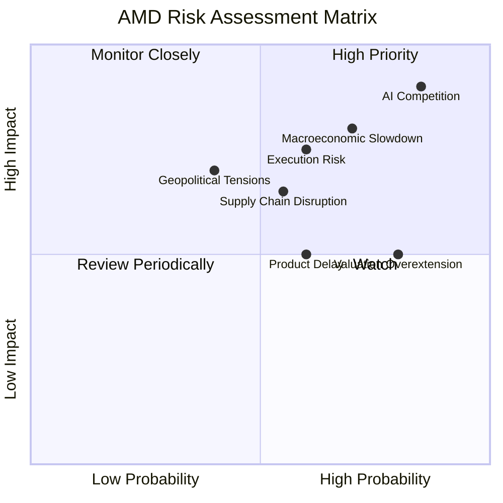

### 9.2 風險清單詳細分析

| # | 風險項目 | 發生機率 | 財務衝擊 | 風險評分 | 緩解措施 |
|---|----------|----------|----------|----------|----------|
| 1 | 🔴 **AI市場競爭加劇** | 高 (85%) | 高 (-10%收入) | 🔴 9.0/10 | 持續高額研發投入，加速產品迭代（MI400+），拓展ROCm生態系統，深化與雲端服務提供商的合作。 |
| 2 | 🟡 **宏觀經濟與半導體週期波動** | 中高 (70%) | 中高 (-7%收入) | 🟡 7.5/10 | 多元化產品組合，降低對單一市場（如PC）的依賴；增強資料中心和嵌入式等抗週期性業務的份額。 |
| 3 | 🟡 **產品開發與執行風險** | 中 (60%) | 中 (-5%收入) | 🟡 6.5/10 | 強化項目管理與質量控制，精準預測市場需求，與晶圓代工廠保持緊密合作以確保產能。 |
| 4 | 🟡 **供應鏈中斷風險** | 中 (55%) | 中 (-5%利潤) | 🟡 6.0/10 | 與多家供應商建立長期合作關係，增加庫存緩衝，尋找替代供應來源，優化物流管理。 |
| 5 | 🟡 **估值過高風險** | 高 (80%) | 中 (-15%股價) | 🟡 6.5/10 | 通過持續的盈利和營收增長來證明當前估值的合理性，並考慮適時進行股票回購以提升股東價值。 |
| 6 | 🟡 **地緣政治風險** | 中低 (40%) | 中 (-5%利潤) | 🟡 5.5/10 | 遵守國際貿易法規，多元化市場佈局，降低對特定地區的依賴。 |

---

## 10. 投資建議

### 10.1 最終綜合評級雷達圖

```
╔══════════════════════════════════════════════════════════════════╗
║                   AMD 最終綜合評級雷達圖                        ║
╠══════════════════════════════════════════════════════════════════╣
║                                                                  ║
║  基本面強度  9.0 ▓▓▓▓▓▓▓▓▓▓▓▓▓▓▓▓▓▓░░                            ║
║  成長動能    9.5 ▓▓▓▓▓▓▓▓▓▓▓▓▓▓▓▓▓▓▓░                            ║
║  獲利品質    9.0 ▓▓▓▓▓▓▓▓▓▓▓▓▓▓▓▓▓▓░░                            ║
║  財務健康    8.5 ▓▓▓▓▓▓▓▓▓▓▓▓▓▓▓▓▓░░░                            ║
║  估值合理性  7.0 ▓▓▓▓▓▓▓▓▓▓▓▓▓▓░░░░░░                            ║
║  護城河深度  8.8 ▓▓▓▓▓▓▓▓▓▓▓▓▓▓▓▓▓░░░                            ║
║  管理層執行  9.2 ▓▓▓▓▓▓▓▓▓▓▓▓▓▓▓▓▓▓░░                            ║
║  技術創新力  9.5 ▓▓▓▓▓▓▓▓▓▓▓▓▓▓▓▓▓▓▓░                            ║
║                                                                  ║
║  🏆 綜合評分：8.8/10                                             ║
╚══════════════════════════════════════════════════════════════════╝
```

### 10.2 目標價與隱含報酬率

根據綜合估值分析，我們對AMD的12個月目標價及隱含報酬率如下：

| 情境 | 目標價 ($) | 較當前股價 $517.82 隱含報酬率 | 機率權重 |
|------|------------|-------------------------------|----------|
| 悲觀情境 | $480 | -7.3% | 20% |
| 基準情境 | $580 | +12.0% | 60% |
| 樂觀情境 | $650 | +25.5% | 20% |
| **加權平均目標價** | **$577** | **+11.4%** | **100%** |

### 10.3 買入時機與觸發因素

```
╔══════════════════════════════════════════════════════════════════╗
║                  ✅ 買入觸發因素 Checklist                      ║
╠══════════════════════════════════════════════════════════════════╣
║                                                                  ║
║  立即買入觸發條件（多數符合）：                                  ║
║  ✅ AI加速器（MI300X/MI400系列）出貨量持續超預期                 ║
║  ✅ 資料中心業務營收保持高雙位數增長                             ║
║  ✅ 毛利率維持在50%以上並有進一步提升的趨勢                       ║
║  ✅ 整體市場情緒良好，科技股估值得到支持                         ║
║                                                                  ║
║  加碼觸發條件（出現以下任一）：                                  ║
║  ☐ 新一代CPU/GPU產品發布並獲得市場積極反饋                       ║
║  ☐ ROCm軟體生態系統取得重大突破，提升AI開發者採用率             ║
║  ☐ 股價因非基本面因素（如大盤調整）出現10-15%回調，提供更優買入點 ║
║  ☐ 管理層上調全年營收或盈利指引                                 ║
║                                                                  ║
║  減碼/停損觸發條件（出現以下任一）：                             ║
║  ☐ AI加速器市場競爭加劇導致AMD市佔率或毛利率顯著下滑            ║
║  ☐ 宏觀經濟嚴重衰退，導致PC/遊戲/資料中心需求大幅萎縮            ║
║  ☐ 核心產品出現重大延遲或技術缺陷                               ║
║  ☐ 營收或盈利連續兩季不及預期                                   ║
║  ☐ 股價跌破關鍵支撐位（如200日均線）且無明顯利好消息             ║
╚══════════════════════════════════════════════════════════════════╝
```

### 10.4 投資人適配度分析

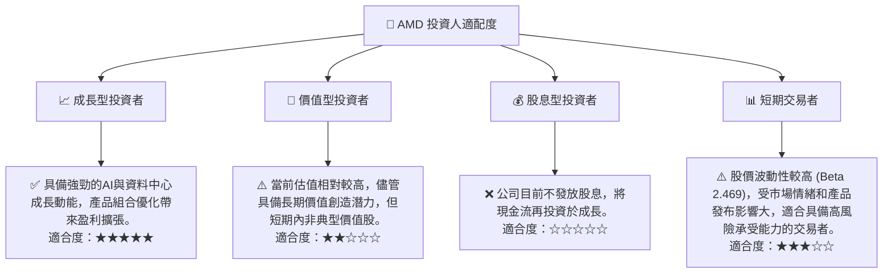

### 10.5 關鍵監控指標

| 監控類型 | 指標 | 關注點 | 頻率 |
|----------|------|--------|------|
| **營收成長** | 資料中心業務營收 YoY 成長率 | MI300X/MI400系列出貨量與市場份額 | 每季財報 |
| **獲利能力** | 毛利率與營業利益率 | 產品組合變化、成本控制效率、AI產品定價能力 | 每季財報 |
| **市場份額** | 伺服器CPU與AI加速器GPU市場份額 | 與主要競爭對手的市場地位變化 | 產業報告/每季財報電話會議 |
| **技術創新** | 新產品發布進度與性能 | Zen/RDNA架構更新、ROCm生態系統發展 | 公司新聞/產業發布 |
| **財務健康** | 自由現金流生成與淨現金狀況 | 資本配置效率、債務水平變化 | 每季財報 |
| **分析師預期** | EPS & Revenue Consensus Est | 盈餘超預期/不及預期情況 | 每季財報 |

---

> **免責聲明**：本報告為 AI 自動生成，僅供研究參考，不構成投資建議。投資有風險，入市需謹慎。