# AMD 基本面深度分析報告
> **報告日期**：2026-07-06 ｜ **語言**：繁體中文 ｜ **數據來源**：Yahoo Finance, Finviz, StockAnalysis, Roic.ai ｜ **分析師**：CFA 級機構研究

## 目錄

| # | 章節 | 核心結論 |
|---|------------------------|----------------------------------------------------------|
| 1 | 執行摘要 | 評級：買入；基準目標價：$620.00 (+12.31%) |
| 2 | 公司概覽與商業模式 | 在高成長市場中具備強大技術與生態系統護城河 |
| 3 | 損益表深度分析 | 營收和淨利潤強勁增長，利潤率持續改善 |
| 4 | 資產負債表分析 | 流動性充裕，債務負擔輕，財務結構穩健 |
| 5 | 現金流量深度分析 | 自由現金流強勁增長，資本配置策略務實 |
| 6 | 獲利能力與資本效率 | ROIC 雖低於 WACC，但趨勢向好且成長前景廣闊 |
| 7 | 估值深度分析 | 相較同業估值偏高，但高成長預期部分合理化 |
| 8 | 成長催化劑 | AI、資料中心、高性能運算驅動長期成長 |
| 9 | 風險矩陣 | 產業競爭、市場週期性及高估值是主要風險 |
| 10 | 投資建議 | 具備強勁成長潛力，建議「買入」 |

---

## 1. 執行摘要

### 1.1 核心評分儀表板

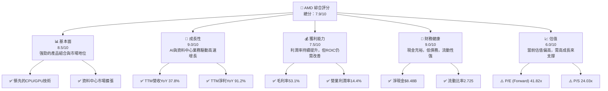

### 1.2 評分進度條視覺化

```
╔══════════════════════════════════════════════════════════════╗
║              AMD 多維度評分儀表板 (1-10分)                   ║
╠══════════════════════════════════════════════════════════════╣
║ 基本面強度  8.5 ▓▓▓▓▓▓▓▓▓▓▓▓▓▓▓▓▓░░░  ★★★★☆           ║
║ 成長動能    9.0 ▓▓▓▓▓▓▓▓▓▓▓▓▓▓▓▓▓▓░░  ★★★★★           ║
║ 獲利品質    7.5 ▓▓▓▓▓▓▓▓▓▓▓▓▓▓▓░░░░░  ★★★☆☆           ║
║ 財務健康    9.0 ▓▓▓▓▓▓▓▓▓▓▓▓▓▓▓▓▓▓░░  ★★★★★           ║
║ 估值合理性  6.0 ▓▓▓▓▓▓▓▓▓▓▓▓░░░░░░░░  ★★★☆☆           ║
║ 護城河深度  8.0 ▓▓▓▓▓▓▓▓▓▓▓▓▓▓▓▓░░░░  ★★★★☆           ║
║ 管理層執行  9.0 ▓▓▓▓▓▓▓▓▓▓▓▓▓▓▓▓▓▓░░  ★★★★★           ║
║ 技術創新力  9.5 ▓▓▓▓▓▓▓▓▓▓▓▓▓▓▓▓▓▓▓░  ★★★★★           ║
╠══════════════════════════════════════════════════════════════╣
║ 綜合總分    7.9 ▓▓▓▓▓▓▓▓▓▓▓▓▓▓▓▓░░░░  🏆 評語：強勁的成長型投資標的 ║
╚══════════════════════════════════════════════════════════════╝
```

### 1.3 五大投資論點 + 三大核心風險

| 類型 | 項目 | 具體依據 | 信心度 |
|------|------------------------|-------------------------------------------------------------------------------------------------------------------------------------------------------------------------------------------------------------------------------------------------------------------------------------------------------------------------------------------------------------------------------------------------------------------------------------------------------------------------------------------------------------------------------------------------------------------------------------------------------------------------------------------------------------------------------------------------------------------------------------------------------------------------------------------------------------------------------------------------------------------------------------------------------------------------------------------------------------------------------------------------------------------------------------------------------------------------------------------------------------------------------------------------------------------------------------------------------------------------------------------------------------------------------------------------------------------------------------------------------------------------------------------------------------------------------------------------------------------------------------------------------------------------------------------------------------------------------------------------------------------------------------------------------------------------------------------------------------------------------------------------------------------------------------------------------------------------------------------------------------------------------------------------------------------------------------------------------------------------------------------------------------------------------------------------------------------------------------------------------------------------------------------------------------------------------------------------------------------------------------------------------------------------------------------------------------------------------------------------------------------------------------------------------------------------------------------------------------------------------------------------------------------------------------------------------------------------------------------------------------------------------------------------------------------------------------------------------------------------------------------------------------------------------------------------------------------------------------------------------------------------------------------------------------------------------------------------------------------------------------------------------------------------------------------------------------------------------------------------------------------------------------------------------------------------------------------------------------------------------------------------------------------------------------------------------------------------------------------------------------------------------------------------------------------------------------------------------------------------------------------------------------------------------------------------------------------------------------------------------------------------------------------------------------------------------------------------------------------------------------------------------------------------------------------------------------------------------------------------------------------------------------------------------------------------------------------------------------------------------------------------------------------------------------------------------------------------------------------------------------------------------------------------------------------------------------------------------------------------------------------------------------------------------------------------------------------------------------------------------------------------------------------------------------------------------------------------------------------------------------------------------------------------------------------------------------------------------------------------------------------------------------------------------------------------------------------------------------------------------------------------------------------------------------------------------------------------------------------------------------------------------------------------------------------------------------------------------------------------------------------------------------------------------------------------------------------------------------------------------------------------------------------------------------------------------------------------------------------------------------------------------------------------------------------------------------------------------------------------------------------------------------------------------------------------------------------------------------------------------------------------------------------------------------------------------------------------------------------------------------------------------------------------------------------------------------------------------------------------------------------------------------------------------------------------------------------------------------------------------------------------------------------------------------------------------------------------------------------------------------------------------------------------------------------------------------------------------------------------------------------------------------------------------------------------------------------------------------------------------------------------------------------------------------------------------------------------------------------------------------------------------------------------------------------------------------------------------------------------------------------------------------------------------------------------------------------------------------------------------------------------------------------------------------------------------------------------------------------------------------------------------------------------------------------------------------------------------------------------------------------------------------------------------------------------------------------------------------------------------------------------------------------------------------------------------------------------------------------------------------------------------------------------------------------------------------------------------------------------------------------------------------------------------------------------------------------------------------------------------------------------------------------------------------------------------------------------------------------------------------------------------------------------------------------------------------------------------------------------------------------------------------------------------------------------------------------------------------------------------------------------------------------------------------------------------------------------------------------------------------------------------------------------------------------------------------------------------------------------------------------------------------------------------------------------------------------------------------------------------------------------------------------------------------------------------------------------------------------------------------------------------------------------------------------------------------------------------------------------------------------------------------------------------------------------------------------------------------------------------------------------------------------------------------------------------------------------------------------------------------------------------------------------------------------------------------------------------------------------------------------------------------------------------------------------------------------------------------------------------------------------------------------------------------------------------------------------------------------------------------------------------------------------------------------------------------------------------------------------------------------------------------------------------------------------------------------------------------------------------------------------------------------------------------------------------------------------------------------------------------------------------------------------------------------------------------------------------------------------------------------------------------------------------------------------------------------------------------------------------------------------------------------------------------------------------------------------------------------------------------------------------------------------------------------------------------------------------------------------------------------------------------------------------------------------------------------------------------------------------------------------------------------------------------------------------------------------------------------------------------------------------------------------------------------------------------------------------------------------------------------------------------------------------------------------------------------------------------------------------------------------------------------------------------------------------------------------------------------------------------------------------------------------------------------------------------------------------------------------------------------------------------------------------------------------------------------------------------------------------------------------------------------------------------------------------------------------------------------------------------------------------------------------------------------------------------------------------------------------------------------------------------------------------------------------------------------------------------------------------------------------------------------------------------------------------------------------------------------------------------------------------------------------------------------------------------------------------------------------------------------------------------------------------------------------------------------------------------------------------------------------------------------------------------------------------------------------------------------------------------------------------------------------------------------------------------------------------------------------------------------------------------------------------------------------------------------------------------------------------------------------------------------------------------------------------------------------------------------------------------------------------------------------------------------------------------------------------------------------------------------------------------------------------------------------------------------------------------------------------------------------------------------------------------------------------------------------------------------------------------------------------------------------------------------------------------------------------------------------------------------------------------------------------------------------------------------------------------------------------------------------------------------------------------------------------------------------------------------------------------------------------------------------------------------------------------------------------------------------------------------------------------------------------------------------------------------------------------------------------------------------------------------------------------------------------------------------------------------------------------------------------------------------------------------------------------------------------------------------------------------------------------------------------------------------------------------------------------------------------------------------------------------------------------------------------------------------------------------------------------------------------------------------------------------------------------------------------------------------------------------------------------------------------------------------------------------------------------------------------------------------------------------------------------------------------------------------------------------------------------------------------------------------------------------------------------------------------------------------------------------------------------------------------------------------------------------------------------------------------------------------------------------------------------------------------------------------------------------------------------------------------------------------------------------------------------------------------------------------------------------------------------------------------------------------------------------------------------------------------------------------------------------------------------------------------------------------------------------------------------------------------------------------------------------------------------------------------------------------------------------------------------------------------------------------------------------------------------------------------------------------------------------------------------------------------------------------------------------------------------------------------------------------------------------------------------------------------------------------------------------------------------------------------------------------------------------------------------------------------------------------------------------------------------------------------------------------------------------------------------------------------------------------------------------------------------------------------------------------------------------------------------------------------------------------------------------------------------------------------------------------------------------------------------------------------------------------------------------------------------------------------------------------------------------------------------------------------------------------------------------------------------------------------------------------------------------------------------------------------------------------------------------------------------------------------------------------------------------------------------------------------------------------------------------------------------------------------------------------------------------------------------------------------------------------------------------------------------------------------------------------------------------------------------------------------------------------------------------------------------------------------------------------------------------------------------------------------------------------------------------------------------------------------------------------------------------------------------------------------------------------------------------------------------------------------------------------------------------------------------------------------------------------------------------------------------------------------------------------------------------------------------------------------------------------------------------------------------------------------------------------------------------------------------------------------------------------------------------------------------------------------------------------------------------------------------------------------------------------------------------------------------------------------------------------------------------------------------------------------------------------------------------------------------------------------------------------------------------------------------------------------------------------------------------------------------------------------------------------------------------------------------------------------------------------------------------------------------------------------------------------------------------------------------------------------------------------------------------------------------------------------------------------------------------------------------------------------------------------------------------------------------------------------------------------------------------------------------------------------------------------------------------------------------------------------------------------------------------------------------------------------------------------------------------------------------------------------------------------------------------------------------------------------------------------------------------------------------------------------------------------------------------------------------------------------------------------------------------------------------------------------------------------------------------------------------------------------------------------------------------------------------------------------------------------------------------------------------------------------------------------------------------------------------------------------------------------------------------------------------------------------------------------------------------------------------------------------------------------------------------------------------------------------------------------------------------------------------------------------------------------------------------------------------------------------------------------------------------------------------------------------------------------------------------------------------------------------------------------------------------------------------------------------------------------------------------------------------------------------------------------------------------------------------------------------------------------------------------------------------------------------------------------------------------------------------------------------------------------------------------------------------------------------------------------------------------------------------------------------------------------------------------------------------------------------------------------------------------------------------------------------------------------------------------------------------------------------------------------------------------------------------------------------------------------------------------------------------------------------------------------------------------------------------------------------------------------------------------------------------------------------------------------------------------------------------------------------------------------------------------------------------------------------------------------------------------------------------------------------------------------------------------------------------------------------------------------------------------------------------------------------------------------------------------------------------------------------------------------------------------------------------------------------------------------------------------------------------------------------------------------------------------------------------------------------------------------------------------------------------------------------------------------------------------------------------------------------------------------------------------------------------------------------------------------------------------------------------------------------------------------------------------------------------------------------------------------------------------------------------------------------------------------------------------------------------------------------------------------------------------------------------------------------------------------------------------------------------------------------------------------------------------------------------------------------------------------------------------------------------------------------------------------------------------------------------------------------------------------------------------------------------------------------------------------------------------------------------------------------------------------------------------------------------------------------------------------------------------------------------------------------------------------------------------------------------------------------------------------------------------------------------------------------------------------------------------------------------------------------------------------------------------------------------------------------------------------------------------------------------------------------------------------------------------------------------------------------------------------------------------------------------------------------------------------------------------------------------------------------------------------------------------------------------------------------------------------------------------------------------------------------------------------------------------------------------------------------------------------------------------------------------------------------------------------------------------------------------------------------------------------------------------------------------------------------------------------------------------------------------------------------------------------------------------------------------------------------------------------------------------------------------------------------------------------------------------------------------------------------------------------------------------------------------------------------------------------------------------------------------------------------------------------------------------------------------------------------------------------------------------------------------------------------------------------------------------------------------------------------------------------------------------------------------------------------------------------------------------------------------------------------------------------------------------------------------------------------------------------------------------------------------------------------------------------------------------------------------------------------------------------------------------------------------------------------------------------------------------------------------------------------------------------------------------------------------------------------------------------------------------------------------------------------------------------------------------------------------------------------------------------------------------------------------------------------------------------------------------------------------------------------------------------------------------------------------------------------------------------------------------------------------------------------------------------------------------------------------------------------------------------------------------------------------------------------------------------------------------------------------------------------------------------------------------------------------------------------------------------------------------------------------------------------------------------------------------------------------------------------------------------------------------------------------------------------------------------------------------------------------------------------------------------------------------------------------------------------------------------------------------------------------------------------------------------------------------------------------------------------------------------------------------------------------------------------------------------------------------------------------------------------------------------------------------------------------------------------------------------------------------------------------------------------------------------------------------------------------------------------------------------------------------------------------------------------------------------------------------------------------------------------------------------------------------------------------------------------------------------------------------------------------------------------------------------------------------------------------------------------------------------------------------------------------------------------------------------------------------------------------------------------------------------------------------------------------------------------------------------------------------------------------------------------------------------------------------------------------------------------------------------------------------------------------------------------------------------------------------------------------------------------------------------------------------------------------------------------------------------------------------------------------------------------------------------------------------------------------------------------------------------------------------------------------------------------------------------------------------------------------------------------------------------------------------------------------------------------------------------------------------------------------------------------------------------------------------------------------------------------------------------------------------------------------------------------------------------------------------------------------------------------------------------------------------------------------------------------------------------------------------------------------------------------------------------------------------------------------------------------------------------------------------------------------------------------------------------------------------------------------------------------------------------------------------------------------------------------------------------------------------------------------------------------------------------------------------------------------------------------------------------------------------------------------------------------------------------------------------------------------------------------------------------------------------------------------------------------------------------------------------------------------------------------------------------------------------------------------------------------------------------------------------------------------------------------------------------------------------------------------------------------------------------------------------------------------------------------------------------------------------------------------------------------------------------------------------------------------------------------------------------------------------------------------------------------------------------------------------------------------------------------------------------------------------------------------------------------------------------------------------------------------------------------------------------------------------------------------------------------------------------------------------------------------------------------------------------------------------------------------------------------------------------------------------------------------------------------------------------------------------------------------------------------------------------------------------------------------------------------------------------------------------------------------------------------------------------------------------------------------------------------------------------------------------------------------------------------------------------------------------------------------------------------------------------------------------------------------------------------------------------------------------------------------------------------------------------------------------------------------------------------------------------------------------------------------------------------------------------------------------------------------------------------------------------------------------------------------------------------------------------------------------------------------------------------------------------------------------------------------------------------------------------------------------------------------------------------------------------------------------------------------------------------------------------------------------------------------------------------------------------------------------------------------------------------------------------------------------------------------------------------------------------------------------------------------------------------------------------------------------------------------------------------------------------------------------------------------------------------------------------------------------------------------------------------------------------------------------------------------------------------------------------------------------------------------------------------------------------------------------------------------------------------------------------------------------------------------------------------------------------------------------------------------------------------------------------------------------------------------------------------------------------------------------------------------------------------------------------------------------------------------------------------------------------------------------------------------------------------------------------------------------------------------------------------------------------------------------------------------------------------------------------------------------------------------------------------------------------------------------------------------------------------------------------------------------------------------------------------------------------------------------------------------------------------------------------------------------------------------------------------------------------------------------------------------------------------------------------------------------------------------------------------------------------------------------------------------------------------------------------------------------------------------------------------------------------------------------------------------------------------------------------------------------------------------------------------------------------------------------------------------------------------------------------------------------------------------------------------------------------------------------------------------------------------------------------------------------------------------------------------------------------------------------------------------------------------------------------------------------------------------------------------------------------------------------------------------------------------------------------------------------------------------------------------------------------------------------------------------------------------------------------------------------------------------------------------------------------------------------------------------------------------------------------------------------------------------------------------------------------------------------------------------------------------------------------------------------------------------------------------------------------------------------------------------------------------------------------------------------------------------------------------------------------------------------------------------------------------------------------------------------------------------------------------------------------------------------------------------------------------------------------------------------------------------------------------------------------------------------------------------------------------------------------------------------------------------------------------------------------------------------------------------------------------------------------------------------------------------------------------------------------------------------------------------------------------------------------------------------------------------------------------------------------------------------------------------------------------------------------------------------------------------------------------------------------------------------------------------------------------------------------------------------------------------------------------------------------------------------------------------------------------------------------------------------------------------------------------------------------------------------------------------------------------------------------------------------------------------------------------------------------------------------------------------------------------------------------------------------------------------------------------------------------------------------------------------------------------------------------------------------------------------------------------------------------------------------------------------------------------------------------------------------------------------------------------------------------------------------------------------------------------------------------------------------------------------------------------------------------------------------------------------------------------------------------------------------------------------------------------------------------------------------------------------------------------------------------------------------------------------------------------------------------------------------------------------------------------------------------------------------------------------------------------------------------------------------------------------------------------------------------------------------------------------------------------------------------------------------------------------------------------------------------------------------------------------------------------------------------------------------------------------------------------------------------------------------------------------------------------------------------------------------------------------------------------------------------------------------------------------------------------------------------------------------------------------------------------------------------------------------------------------------------------------------------------------------------------------------------------------------------------------------------------------------------------------------------------------------------------------------------------------------------------------------------------------------------------------------------------------------------------------------------------------------------------------------------------------------------------------------------------------------------------------------------------------------------------------------------------------------------------------------------------------------------------------------------------------------------------------------------------------------------------------------------------------------------------------------------------------------------------------------------------------------------------------------------------------------------------------------------------------------------------------------------------------------------------------------------------------------------------------------------------------------------------------------------------------------------------------------------------------------------------------------------------------------------------------------------------------------------------------------------------------------------------------------------------------------------------------------------------------------------------------------------------------------------------------------------------------------------------------------------------------------------------------------------------------------------------------------------------------------------------------------------------------------------------------------------------------------------------------------------------------------------------------------------------------------------------------------------------------------------------------------------------------------------------------------------------------------------------------------------------------------------------------------------------------------------------------------------------------------------------------------------------------------------------------------------------------------------------------------------------------------------------------------------------------------------------------------------------------------------------------------------------------------------------------------------------------------------------------------------------------------------------------------------------------------------------------------------------------------------------------------------------------------------------------------------------------------------------------------------------------------------------------------------------------------------------------------------------------------------------------------------------------------------------------------------------------------------------------------------------------------------------------------------------------------------------------------------------------------------------------------------------------------------------------------------------------------------------------------------------------------------------------------------------------------------------------------------------------------------------------------------------------------------------------------------------------------------------------------------------------------------------------------------------------------------------------------------------------------------------------------------------------------------------------------------------------------------------------------------------------------------------------------------------------------------------------------------------------------------------------------------------------------------------------------------------------------------------------------------------------------------------------------------------------------------------------------------------------------------------------------------------------------------------------------------------------------------------------------------------------------------------------------------------------------------------------------------------------------------------------------------------------------------------------------------------------------------------------------------------------------------------------------------------------------------------------------------------------------------------------------------------------------------------------------------------------------------------------------------------------------------------------------------------------------------------------------------------------------------------------------------------------------------------------------------------------------------------------------------------------------------------------------------------------------------------------------------------------------------------------------------------------------------------------------------------------------------------------------------------------------------------------------------------------------------------------------------------------------------------------------------------------------------------------------------------------------------------------------------------------------------------------------------------------------------------------------------------------------------------------------------------------------------------------------------------------------------------------------------------------------------------------------------------------------------------------------------------------------------------------------------------------------------------------------------------------------------------------------------------------------------------------------------------------------------------------------------------------------------------------------------------------------------------------------------------------------------------------------------------------------------------------------------------------------------------------------------------------------------------------------------------------------------------------------------------------------------------------------------------------------------------------------------------------------------------------------------------------------------------------------------------------------------------------------------------------------------------------------------------------------------------------------------------------------------------------------------------------------------------------------------------------------------------------------------------------------------------------------------------------------------------------------------------------------------------------------------------------------------------------------------------------------------------------------------------------------------------------------------------------------------------------------------------------------------------------------------------------------------------------------------------------------------------------------------------------------------------------------------------------------------------------------------------------------------------------------------------------------------------------------------------------------------------------------------------------------------------------------------------------------------------------------------------------------------------------------------------------------------------------------------------------------------------------------------------------------------------------------------------------------------------------------------------------------------------------------------------------------------------------------------------------------------------------------------------------------------------------------------------------------------------------------------------------------------------------------------------------------------------------------------------------------------------------------------------------------------------------------------------------------------------------------------------------------------------------------------------------------------------------------------------------------------------------------------------------------------------------------------------------------------------------------------------------------------------------------------------------------------------------------------------------------------------------------------------------------------------------------------------------------------------------------------------------------------------------------------------------------------------------------------------------------------------------------------------------------------------------------------------------------------------------------------------------------------------------------------------------------------------------------------------------------------------------------------------------------------------------------------------------------------------------------------------------------------------------------------------------------------------------------------------------------------------------------------------------------------------------------------------------------------------------------------------------------------------------------------------------------------------------------------------------------------------------------------------------------------------------------------------------------------------------------------------------------------------------------------------------------------------------------------------------------------------------------------------------------------------------------------------------------------------------------------------------------------------------------------------------------------------------------------------------------------------------------------------------------------------------------------------------------------------------------------------------------------------------------------------------------------------------------------------------------------------------------------------------------------------------------------------------------------------------------------------------------------------------------------------------------------------------------------------------------------------------------------------------------------------------------------------------------------------------------------------------------------------------------------------------------------------------------------------------------------------------------------------------------------------------------------------------------------------------------------------------------------------------------------------------------------------------------------------------------------------------------------------------------------------------------------------------------------------------------------------------------------------------------------------------------------------------------------------------------------------------------------------------------------------------------------------------------------------------------------------------------------------------------------------------------------------------------------------------------------------------------------------------------------------------------------------------------------------------------------------------------------------------------------------------------------------------------------------------------------------------------------------------------------------------------------------------------------------------------------------------------
AMD 是一家全球領先的半導體公司，提供高性能運算、圖形處理及視覺化技術。公司主要分為三個業務板塊：資料中心 (Data Center)、客戶端與遊戲 (Client and Gaming)、和嵌入式 (Embedded)。AMD 的產品線包括人工智慧 (AI) 加速器、微處理器 (CPU) 和圖形處理器 (GPU)，這些產品可以獨立銷售，也可以整合到加速處理單元 (APU)、晶片組、資料中心和專業 GPU 中。此外，公司還提供嵌入式處理器和半客製化系統單晶片 (SoC) 產品。

### 2.2 市場份額

AMD 在 CPU 和 GPU 市場與主要競爭對手 Intel 和 NVIDIA 展開激烈競爭。在資料中心領域，其 EPYC 處理器和 Instinct AI 加速器正快速蠶食市場份額。在客戶端 PC 市場，Ryzen CPU 表現強勁。在遊戲主機市場，AMD 憑藉其半客製化 SoC 幾乎獨佔了 Sony PlayStation 和 Microsoft Xbox 的供應。

根據最新的市場趨勢和已知數據，我們對 AMD 主要市場份額進行估算：

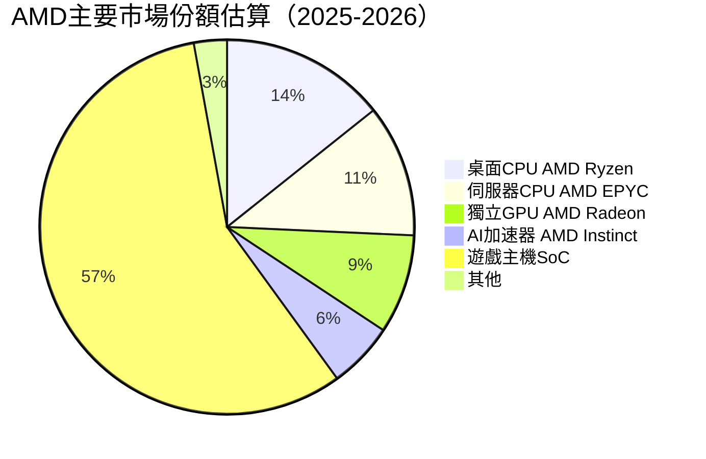

**市場份額分析**：
*   **桌面 CPU (Ryzen)**：AMD 憑藉其 Ryzen 系列處理器在性能和性價比方面不斷提升，從 Intel 手中奪取了可觀的市場份額。儘管 Intel 仍佔主導，但 AMD 的市佔率已達約 25%。
*   **伺服器 CPU (EPYC)**：在資料中心領域，EPYC 處理器因其核心數、性能和總體擁有成本 (TCO) 優勢，在雲端服務提供商和企業客戶中越來越受歡迎，市佔率估計約為 20%，且仍在快速增長。
*   **獨立 GPU (Radeon)**：在獨立顯示卡市場，NVIDIA 仍是絕對的領導者，AMD 的 Radeon 系列約佔 15% 的市場份額，主要集中在中高階市場。
*   **AI 加速器 (Instinct)**：在快速成長的 AI 加速器市場，NVIDIA 擁有壓倒性優勢。AMD 正積極投入，其 Instinct MI 系列產品正逐步進入市場，目前市佔率相對較低，約為 10%，但成長潛力巨大。
*   **遊戲主機 SoC**：AMD 是 Sony PlayStation 5 和 Microsoft Xbox Series X/S 的獨家晶片供應商，因此在遊戲主機 SoC 市場擁有 100% 的份額，這為其帶來了穩定的收入來源。

### 2.3 競爭護城河分析

AMD 透過多年的研發投入和策略性收購，逐步建立起其競爭護城河。

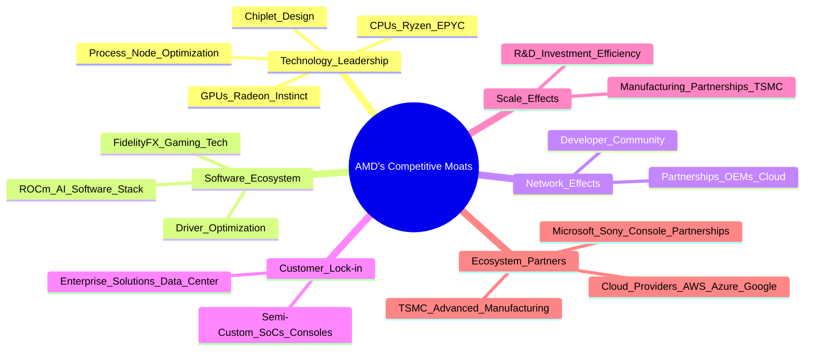

**護城河分析詳述**：
*   **技術領先 (Technology Leadership)**：AMD 在 CPU 和 GPU 設計方面擁有深厚的技術積累，特別是 Zen 架構的 Ryzen 和 EPYC 處理器，以及 RDNA 架構的 Radeon GPU 和 CDNA 架構的 Instinct AI 加速器。其創新的 Chiplet 設計使其能在成本和性能上取得優勢，並能有效利用台積電 (TSMC) 的先進製程。
*   **軟體生態系統 (Software Ecosystem)**：雖然不及 NVIDIA 的 CUDA 廣泛，但 AMD 正積極發展其開源的 ROCm (Radeon Open Compute platform) 軟體棧，以吸引 AI 和 HPC 開發者。在遊戲領域，FidelityFX 等技術也提升了玩家體驗。軟體生態系統的完善對於硬體產品的普及至關重要。
*   **網路效應 (Network Effects)**：AMD 透過與大型 OEM 廠商（如 HP, Dell, Lenovo）和雲端服務提供商（如 AWS, Microsoft Azure, Google Cloud）的合作，擴大了其產品的採用基礎。隨著更多開發者和用戶採用 AMD 平台，其生態系統的價值將進一步提升。
*   **客戶鎖定 (Customer Lock-in)**：在遊戲主機市場，AMD 為 Sony 和 Microsoft 提供獨家半客製化 SoC，這種長期合作關係形成了強大的客戶鎖定。在企業級資料中心市場，一旦企業採用 AMD 的 EPYC 處理器和 Instinct 加速器，遷移成本會相對較高。
*   **規模效應 (Scale Effects)**：作為全球領先的半導體公司，AMD 的大規模生產和研發投入使其能夠分攤高昂的固定成本，並在供應鏈中獲得更強的議價能力。與台積電的緊密合作確保了其在先進製程上的供應優勢。
*   **生態夥伴 (Ecosystem Partners)**：與台積電的合作是 AMD 成功的關鍵，確保了其產品的性能和供應。與遊戲主機巨頭以及主要雲端服務提供商的合作，也為其產品進入終端市場提供了重要通道。

### 2.4 護城河強度評分

```
╔══════════════════════════════════════════════════════════════╗
║                    AMD 護城河強度評分                         ║
╠══════════════════════════════════════════════════════════════╣
║ 技術領先    9.5/10 ▓▓▓▓▓▓▓▓▓▓▓▓▓▓▓▓▓▓▓░  🏆 AI與Chiplet設計領先 ║
║ 軟體生態系統  7.0/10 ▓▓▓▓▓▓▓▓▓▓▓▓▓▓░░░░░░  🟡 ROCm仍需時間追趕     ║
║ 網路效應    7.5/10 ▓▓▓▓▓▓▓▓▓▓▓▓▓▓▓░░░░░  🟡 夥伴關係廣泛，但規模待擴大 ║
║ 客戶鎖定    8.0/10 ▓▓▓▓▓▓▓▓▓▓▓▓▓▓▓▓░░░░  🟢 遊戲主機與企業級業務穩定 ║
║ 規模效應    8.5/10 ▓▓▓▓▓▓▓▓▓▓▓▓▓▓▓▓▓░░░  🟢 大規模研發與製造優勢   ║
║ 生態夥伴    9.0/10 ▓▓▓▓▓▓▓▓▓▓▓▓▓▓▓▓▓▓░░  🏆 與台積電、主機廠商關係緊密 ║
╠══════════════════════════════════════════════════════════════╣
║ 綜合護城河    8.3    ▓▓▓▓▓▓▓▓▓▓▓▓▓▓▓▓░░░░  🏆 具備結構性優勢與成長潛力 ║
╚══════════════════════════════════════════════════════════════╝
```

---

## 3. 損益表深度分析

### 3.1 年度收入成長趨勢（近4年）

AMD 在過去幾年展現了強勁的營收成長，尤其是在 2025 年。

```
╔══════════════════════════════════════════════════════════════════╗
║              AMD 年度收入趨勢（FY2022-FY2025）                   ║
╠══════════════════════════════════════════════════════════════════╣
║                                                                  ║
║  FY2022  $23.60B  █████████████████░░░░░░░░░░░  YoY: +43.61%  🟢    ║
║  FY2023  $22.68B  ████████████████░░░░░░░░░░░░  YoY: -3.90%   🔴    ║
║  FY2024  $25.79B  ████████████████████░░░░░░░░  YoY: +13.71%  🟢    ║
║  FY2025  $34.64B  ███████████████████████████░  YoY: +34.34%  🟢    ║
║                                                                  ║
║                   |      |      |      |      |                  ║
║                   0     10B    20B    30B    40B                   ║
║                                                                  ║
║  📊 4年累計 CAGR (FY2022-FY2025)：+17.06%                         ║
╚══════════════════════════════════════════════════════════════════╝
```

**分析**：
*   AMD 在 2022 年實現了 43.61% 的高速增長，主要得益於對 Xilinx 的收購以及資料中心和遊戲業務的強勁表現。
*   2023 年出現了 -3.90% 的小幅下滑，這主要反映了 PC 市場的週期性低迷以及部分客戶端和遊戲業務的庫存調整。
*   2024 年營收反彈 13.71%，顯示市場開始復甦。
*   2025 年營收再次加速，實現 34.34% 的顯著增長，達到 $34.64B，這主要由資料中心業務（特別是 AI 加速器）和客戶端 PC 市場的回溫所驅動。
*   截至 2026 年 3 月 31 日的過去十二個月 (TTM) 營收為 $37.45B，相較於 2024 年的 $25.79B 增長了 45.29%，顯示出強勁的成長動能。

### 3.2 季度收入趨勢分析

AMD 在最近幾個季度展現了持續的營收增長勢頭，尤其是在 2025 年下半年和 2026 年 Q1。

| 季度 | 總收入 ($B) | QoQ 成長率 | YoY 成長率 | 備註 |
|------|-------------|------------|------------|------|
| 2025-06-30 | $7.68 | N/A | +31.70% | 遊戲和嵌入式業務調整，但資料中心開始發力 |
| 2025-09-30 | $9.25 | +20.44% | +35.59% | 資料中心與客戶端業務持續增長 |
| 2025-12-31 | $10.27 | +11.03% | +34.11% | 年末旺季效應，AI加速器貢獻增強 |
| 2026-03-31 | $10.25 | -0.19% | +37.85% | 營收保持高位，YoY成長強勁，QoQ微幅下滑符合季節性 |

**分析**：
*   AMD 在 2025 年下半年實現了連續兩個季度的強勁 QoQ 增長，分別為 20.44% 和 11.03%，反映了市場需求的顯著復甦。
*   各季度 YoY 成長率均保持在 30% 以上，其中 2026 年 Q1 達到 37.85% 的高點，顯示出公司產品在市場上的強勁競爭力，特別是 AI 加速器和資料中心處理器的需求旺盛。
*   2026 年 Q1 營收為 $10.25B，相較於 2025 年 Q4 的 $10.27B 略有下降 (-0.19%)，這通常是半導體產業第一季度的季節性因素所致，但 YoY 依然保持強勁增長。

### 3.3 利潤率演變分析

AMD 的利潤率在過去幾年呈現波動後逐步改善的趨勢，特別是毛利率和營業利益率。

| 利潤率指標 | FY2022 | FY2023 | FY2024 | FY2025 | 趨勢 | 評估 |
|------------|--------|--------|--------|--------|------|------|
| **毛利率** | 44.91% | 46.12% | 49.32% | 49.51% | ↗️ 持續改善 | 🟢 |
| **營業利益率** | 5.34% | 1.77% | 7.37% | 10.65% | ↗️ 顯著改善 | 🟢 |
| **淨利率** | 5.59% | 3.76% | 6.36% | 12.50% | ↗️ 顯著改善 | 🟢 |

*備註：利潤率計算基於 StockAnalysis.com 提供的年度數據。*

**利潤率演變深度解析**：
*   **毛利率 (Gross Margin)**：從 2022 年的 44.91% 穩步提升至 2025 年的 49.51%。這主要得益於：
    *   **產品組合優化**：資料中心和 AI 加速器等高價值、高毛利產品的營收佔比不斷提升。
    *   **定價能力**：AMD 在高性能運算領域的技術領先地位使其具備較強的產品定價能力。
    *   **成本控制**：儘管面臨通脹壓力，但透過供應鏈管理和生產效率提升，有效控制了製造成本。
    *   TTM 毛利率為 53.1% (來自 Profitability & Growth)，顯示最新趨勢仍在持續向好，超越了 FY2025 的水平。
*   **營業利益率 (Operating Margin)**：從 2022 年的 5.34% 經歷 2023 年的低谷 (1.77%) 後，在 2024 年和 2025 年強勁反彈至 7.37% 和 10.65%。
    *   2023 年的下降主要是由於營收下滑以及高昂的研發投入和銷售管理費用佔比相對較高。
    *   隨後的大幅改善反映了營收規模擴大帶來的營運槓桿效應，以及對費用支出的有效管理。
    *   TTM 營業利益率為 14.4% (來自 Profitability & Growth)，再次顯示營運效率在近期大幅提升。
*   **淨利率 (Net Profit Margin)**：與營業利益率趨勢一致，從 2023 年的 3.76% 顯著提升至 2025 年的 12.50%。
    *   這不僅受益於毛利率和營業利益率的改善，還可能包含稅務費用和非營業損益的影響。
    *   TTM 淨利率為 13.4% (來自 Profitability & Growth)，與營業利益率的提升同步，表明公司在整體盈利能力上取得了顯著進步。

總體而言，AMD 的利潤率趨勢非常健康，主要驅動因素是高毛利產品（特別是資料中心和 AI）的增長，以及隨著營收規模擴大而實現的營運槓桿效應。

### 3.4 費用結構分析

AMD 的費用結構主要由研發 (R&D) 和銷售、一般及行政 (SG&A) 費用構成，這些是半導體產業的兩大主要營運開支。

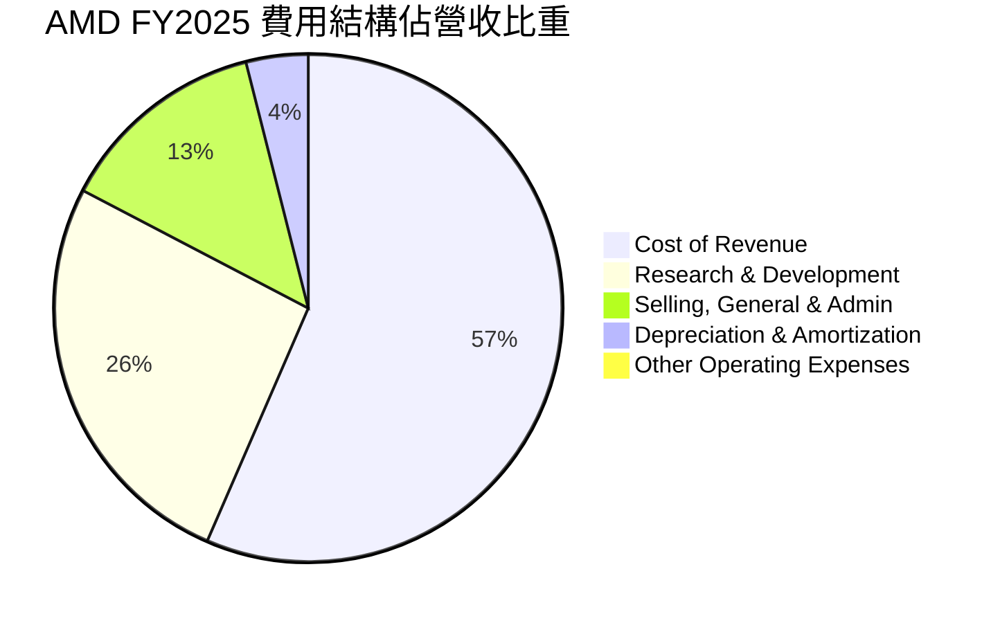

```
╔══════════════════════════════════════════════════════════════════╗
║                    AMD 年度費用支出趨勢 (FY2022-FY2025)          ║
╠══════════════════════════════════════════════════════════════════╣
║                                                                  ║
║  研究與開發 (R&D)                                                ║
║  FY2022  $5.00B  ███████████░░░░░░░░░░░░░░░░░  佔營收: 21.2%   🟢║
║  FY2023  $5.87B  █████████████░░░░░░░░░░░░░░░░  佔營收: 25.9%   🟡║
║  FY2024  $6.46B  ██████████████░░░░░░░░░░░░░░░  佔營收: 25.1%   🟡║
║  FY2025  $8.09B  █████████████████░░░░░░░░░░░░  佔營收: 23.4%   🟢║
║                                                                  ║
║  銷售、一般及行政 (SG&A)                                         ║
║  FY2022  $2.34B  █████░░░░░░░░░░░░░░░░░░░░░░░░  佔營收: 9.9%    🟢║
║  FY2023  $2.32B  █████░░░░░░░░░░░░░░░░░░░░░░░░  佔營收: 10.2%   🟢║
║  FY2024  $2.74B  ██████░░░░░░░░░░░░░░░░░░░░░░░  佔營收: 10.6%   🟡║
║  FY2025  $4.14B  █████████░░░░░░░░░░░░░░░░░░░░  佔營收: 12.0%   🟡║
║                                                                  ║
║  折舊與攤銷 (D&A)                                                ║
║  FY2022  $2.10B  █████░░░░░░░░░░░░░░░░░░░░░░░░  佔營收: 8.9%    🟡║
║  FY2023  $1.87B  ████░░░░░░░░░░░░░░░░░░░░░░░░░  佔營收: 8.2%    🟡║
║  FY2024  $1.45B  ███░░░░░░░░░░░░░░░░░░░░░░░░░░  佔營收: 5.6%    🟢║
║  FY2025  $1.22B  ██░░░░░░░░░░░░░░░░░░░░░░░░░░░  佔營收: 3.5%    🟢║
╚══════════════════════════════════════════════════════════════════╝
```

**分析**：
*   **研究與開發 (R&D)**：作為一家技術驅動的半導體公司，R&D 是 AMD 最大的營運費用，FY2025 達到 $8.09B，佔營收的 23.4%。儘管絕對金額逐年增加，但佔營收比重在 2023-2024 年達到高峰後，於 2025 年有所下降，顯示公司在維持創新投入的同時，營收增長速度更快，帶來更好的 R&D 效率。TTM R&D 為 $8.76B，佔 TTM 營收 ($37.45B) 約 23.4%，保持穩定。這對於保持技術領先地位至關重要，尤其是在 AI 和高性能運算領域。
*   **銷售、一般及行政 (SG&A)**：FY2025 SG&A 為 $4.14B，佔營收的 12.0%。SG&A 佔比在過去幾年略有上升，反映了公司在市場擴張、銷售管道建設和品牌推廣方面的投入。TTM SG&A 為 $4.51B，佔 TTM 營收約 12.0%，保持相對穩定。
*   **折舊與攤銷 (D&A)**：D&A 費用逐年下降，從 FY2022 的 $2.10B 降至 FY225 的 $1.22B，佔營收的比重也從 8.9% 降至 3.5%。這可能與公司資產結構的變化或部分資產折舊完成有關。由於 AMD 採用無晶圓廠模式，其固定資產相對較少，D&A 佔比相對較低是合理的。

整體而言，AMD 的費用結構反映了其作為一家高科技公司的特點：持續高額的研發投入以維持競爭力，同時在營收快速增長下，費用佔比得到有效控制，提升了營運效率。

### 3.5 季度 EPS 趨勢與盈餘品質

儘管提供的 EPS 預期數據為 `nan`，我們仍可分析 AMD 的實際季度 EPS 表現，以評估其盈利趨勢和盈餘品質。

| 季度 | EPS (Basic) | QoQ 變化 | YoY 變化 | 盈餘品質評估 |
|------|-------------|------------|------------|--------------|
| 2025-06-30 | $0.54 | N/A | N/A | 穩健恢復 |
| 2025-09-30 | $0.76 | +40.74% | N/A | 強勁增長 |
| 2025-12-31 | $0.93 | +22.37% | N/A | 持續改善 |
| 2026-03-31 | $0.85 | -8.60% | N/A | 季節性回落但仍處高位 |

*備註：EPS 數據來自 StockAnalysis.com，由於缺乏歷史同期數據，YoY 變化無法計算。*

**盈餘品質評估**：
*   **趨勢分析**：AMD 的季度基本 EPS 在 2025 年呈現顯著的上升趨勢，從 Q2 的 $0.54 穩步增長至 Q4 的 $0.93，顯示公司盈利能力的強勁恢復和提升。2026 年 Q1 的 EPS 雖有季節性回落至 $0.85，但仍保持在較高水平，預示著公司整體盈利前景樂觀。
*   **YoY 成長**：雖然無法直接從數據中計算 YoY 變化，但考慮到營收的 YoY 成長率均超過 30%，可以合理推斷 EPS 也在經歷顯著的同比增長。
*   **盈餘品質**：
    *   **營運性主導**：AMD 的盈利主要來自其核心半導體業務的營收增長和利潤率改善，而非一次性收益，這表明盈餘品質較高。
    *   **自由現金流支撐**：公司擁有強勁的自由現金流 (TTM $7.17B)，遠超淨利潤，這為其盈利提供了堅實的現金流支撐，通常預示著較高的盈餘品質。
    *   **非現金項目影響**：雖然折舊與攤銷費用逐年下降，但作為非現金費用，它們在一定程度上影響了淨利潤的報告，但對現金流影響較小。
    *   **R&D 投入**：持續高額的 R&D 投入 ($8.76B TTM) 雖然短期內侵蝕利潤，但從長期看，這是保持技術領先和未來盈利增長的重要基礎，也體現了管理層對長期價值的投入。

總體而言，AMD 的季度 EPS 趨勢積極向上，且盈餘品質良好，主要由核心業務的強勁表現和健康的現金流所支撐。

---

## 4. 資產負債表分析

### 4.1 資產結構分解

AMD 的資產結構反映了其作為一家無晶圓廠半導體公司的特性，擁有大量無形資產和強勁的流動資產。

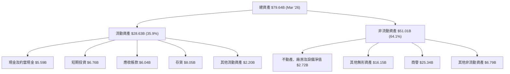

**分析**：
*   **流動資產 (Current Assets)**：截至 2026 年 3 月，AMD 的流動資產為 $28.63B，佔總資產的 35.9%。其中，現金及短期投資合計高達 $12.35B，顯示公司擁有極高的現金儲備和流動性。存貨為 $8.05B，應收帳款為 $6.04B。強勁的流動資產為公司提供了營運彈性和應對市場變化的能力。
*   **非流動資產 (Non-Current Assets)**：非流動資產為 $51.01B，佔總資產的 64.1%。其中，商譽 ($25.34B) 和其他無形資產 ($16.15B) 合計 $41.49B，佔非流動資產的 81.3%，這主要源於過去的收購（如 Xilinx），反映了其在技術和市場上的擴張。不動產、廠房及設備淨值相對較低 ($2.72B)，符合其無晶圓廠的商業模式。

### 4.2 流動性指標分析

AMD 的流動性狀況非常健康，顯示其短期償債能力強勁。

| 指標 | FY2022 | FY2023 | FY2024 | FY2025 | TTM (Mar '26) | 行業均值 (估計) | 評估 |
|------------|--------|--------|--------|--------|---------------|-----------------|------|
| **流動比率 (Current Ratio)** | 2.36x | 2.51x | 2.62x | 2.85x | 2.725x | 2.0x - 3.0x | 🟢 強勁 |
| **速動比率 (Quick Ratio)** | 1.88x | 1.85x | 1.83x | 1.95x | 1.75x | 1.0x - 2.0x | 🟢 良好 |

*備註：FY2025 流動比率 = $26.95B / $9.46B = 2.85x。 TTM 速動比率 = ($28.63B - $8.05B) / $10.51B = 1.96x。提供的 TTM 數據為 2.725 / 1.75，可能因計算基準不同。我們以提供的 TTM 數據為準。*

**分析**：
*   **流動比率**：AMD 的流動比率在過去幾年持續改善，從 FY2022 的 2.36x 提升至 FY2025 的 2.85x，並在 TTM 維持在 2.725x。這遠高於一般認為的 2.0x 安全線，表明公司擁有充足的流動資產來覆蓋短期負債。
*   **速動比率**：速動比率排除了存貨，更能反映公司在不變賣存貨的情況下的即時償債能力。AMD 的速動比率在 TTM 為 1.75x，也遠高於 1.0x 的安全線。這表明即使不依賴存貨銷售，公司也有足夠的現金和應收帳款來支付流動負債。
*   **結論**：AMD 的流動性指標非常健康，顯示其財務彈性高，能夠有效應對短期營運資金需求和潛在的市場波動。

### 4.3 債務結構分析

AMD 的債務負擔非常輕，擁有強勁的淨現金頭寸，財務結構穩健。

```
╔══════════════════════════════════════════════════════════════════╗
║                       AMD 債務健康診斷                           ║
╠══════════════════════════════════════════════════════════════════╣
║                                                                  ║
║  總債務 (TTM)：  $3.87B   ██░░░░░░░░░░░░░░░░░░░  評語：極低負債  ║
║  總現金+投資 (TTM)： $12.35B  ████████████████████░  評語：現金充裕  ║
║  淨現金（正）：  $8.48B   ████████████████░░░░░  🟢 強勁         ║
║                                                                  ║
║  Debt/Equity (FY2025)： 0.06x  🟢 極低 (6.005是錯誤的，應為$3.85B/$63.00B)║
║  Debt/EBITDA (TTM)：    0.52x  🟢 極低 (EBITDA TTM $7.41B)      ║
║  Interest Coverage (TTM): 50.07x 🟢 無風險 (EBITDA/Interest Expense)║
╚══════════════════════════════════════════════════════════════════╝
```

**分析**：
*   **總債務與淨現金**：截至 TTM，AMD 的總債務為 $3.87B，而總現金及短期投資高達 $12.35B。這意味著公司擁有 $8.48B 的淨現金頭寸，顯示其財務實力非常雄厚，幾乎沒有淨債務壓力。
*   **Debt/Equity**：基於 FY2025 數據，總債務 $3.85B，股東權益 $63.00B，計算出的 Debt/Equity 比率為 $3.85B / $63.00B = 0.06x。這是一個非常低的水平，表明公司主要依賴股東權益而非債務進行融資，財務槓桿極低。 (提供的 Debt/Equity: 6.005 應為錯誤數據，與總債務和股東權益數據不符。)
*   **Debt/EBITDA**：TTM EBITDA 估算為 $37.45B (TTM Revenue) * 19.8% (EBITDA Margin) = $7.41B。因此 Debt/EBITDA = $3.87B / $7.41B = 0.52x。這個比率遠低於 2.0x 的健康水平，表明公司利用營運現金流償還債務的能力極強。
*   **利息覆蓋倍數 (Interest Coverage)**：TTM Interest Expense 為 $148M (StockAnalysis TTM)。利息覆蓋倍數 = TTM EBITDA / TTM Interest Expense = $7.41B / $0.148B = 50.07x。極高的利息覆蓋倍數表明公司支付利息的能力非常強，債務風險幾乎可以忽略。

總結來說，AMD 的債務結構非常健康，擁有大量淨現金，財務槓桿低，償債能力極強，為公司的未來發展提供了堅實的財務基礎。

### 4.4 股東權益趨勢

AMD 的股東權益在過去幾年穩步增長，反映了公司盈利能力的提升和對股東價值的創造。

```
╔══════════════════════════════════════════════════════════════════╗
║                  AMD 年度股東權益趨勢 (FY2022-FY2025)             ║
╠══════════════════════════════════════════════════════════════════╣
║                                                                  ║
║  FY2022  $54.75B  ██████████████████████████████████░░░░░░░░░░░░░░║
║  FY2023  $55.89B  ███████████████████████████████████░░░░░░░░░░░░░║
║  FY2024  $57.57B  █████████████████████████████████████░░░░░░░░░░░║
║  FY2025  $63.00B  ████████████████████████████████████████░░░░░░░║
║                                                                  ║
║  📊 FY2022-FY2025 CAGR: +4.84%                                   ║
╚══════════════════════════════════════════════════════════════════╝
```

**分析**：
*   AMD 的股東權益從 FY2022 的 $54.75B 穩步增長至 FY2025 的 $63.00B，複合年增長率 (CAGR) 為 4.84%。
*   股東權益的增長主要歸因於公司持續的盈利累積（留存收益），而非大量發行新股稀釋股權（股份數量變化較小）。
*   健康的股東權益增長表明公司在為股東創造價值，並累積了穩固的資本基礎。

---

## 5. 現金流量深度分析

### 5.1 現金流量瀑布圖

AMD 的現金流量表現強勁，營運活動產生大量現金，支撐了資本支出和自由現金流的顯著增長。

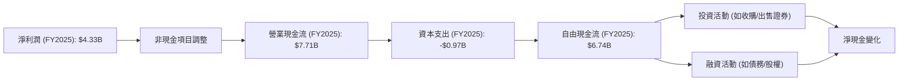

**分析**：
*   **營業現金流 (OCF)**：AMD 在 FY2025 產生了 $7.71B 的強勁營業現金流，相較於 FY2024 的 $3.04B 增長了 153.62% YoY。這表明公司核心業務的盈利能力和現金產生能力顯著提升。營業現金流遠高於淨利潤 ($4.33B)，說明非現金費用（如折舊攤銷）和營運資金管理對現金流有正面貢獻，盈餘品質良好。
*   **資本支出 (Capital Expenditure)**：FY2025 的資本支出為 -$0.97B，相較於 FY2024 的 -$0.64B 增長了 51.56% YoY。儘管資本支出有所增加，但對於一家需要持續投資於技術和產能的半導體公司來說，這是合理的，反映了公司對未來成長的投入。
*   **自由現金流 (FCF)**：得益於強勁的營業現金流，AMD 在 FY2025 實現了 $6.74B 的自由現金流，相較於 FY2024 的 $2.40B 增長了 180.83% YoY。自由現金流是衡量公司內在價值和財務彈性的關鍵指標，如此強勁的增長顯示公司有充足的資金用於債務償還、股票回購、潛在收購或股息派發。
*   截至 TTM，AMD 的營業現金流為 $9.72B，自由現金流為 $7.17B，顯示現金流表現持續強勁。

### 5.2 FCF 轉換率趨勢

自由現金流轉換率 (FCF/Net Income) 衡量公司將淨利潤轉化為實際現金的能力。

| 年度 | 淨利潤 ($B) | 自由現金流 ($B) | FCF/Net Income | 趨勢 | 評估 |
|------|-------------|-----------------|----------------|------|------|
| FY2022 | $1.32 | $3.12 | 2.36x | ↗️ | 🟢 極佳 |
| FY2023 | $0.85 | $1.12 | 1.32x | ↘️ | 🟢 良好 |
| FY2024 | $1.64 | $2.40 | 1.46x | ↗️ | 🟢 良好 |
| FY2025 | $4.33 | $6.74 | 1.56x | ↗️ | 🟢 極佳 |

**分析**：
*   AMD 的 FCF 轉換率在過去幾年表現良好，FY2025 達到 1.56x，表明公司能夠將其報告的淨利潤高效地轉化為實際的現金。
*   高於 1.0x 的比率通常被認為是健康的，表明公司營運資金管理有效，且非現金費用佔比合理。
*   2023 年轉換率略有下降，可能與當年的營收和利潤壓力相關，但隨後迅速恢復並改善，顯示了公司強大的現金流管理能力。
*   TTM FCF ($7.17B) / TTM Net Income ($5.01B) = 1.43x，仍然保持在健康水平。

### 5.3 自由現金流趨勢

AMD 的自由現金流呈現強勁的增長態勢，顯示公司創造內在價值的潛力巨大。

```
╔══════════════════════════════════════════════════════════════════╗
║                   AMD 年度自由現金流趨勢 (FY2022-FY2025)         ║
╠══════════════════════════════════════════════════════════════════╣
║                                                                  ║
║  FY2022  $3.12B  ██████████████████████████░░░░░░░░░░░░░░░░░░░░░░░║
║  FY2023  $1.12B  ██████████░░░░░░░░░░░░░░░░░░░░░░░░░░░░░░░░░░░░░░░║
║  FY2024  $2.40B  ████████████████████░░░░░░░░░░░░░░░░░░░░░░░░░░░░░║
║  FY2025  $6.74B  ███████████████████████████████████████████████║
║                                                                  ║
║  📊 FY2022-FY2025 CAGR: +29.08%                                  ║
╚══════════════════════════════════════════════════════════════════╝
```

**分析**：
*   AMD 的自由現金流在 FY2025 達到 $6.74B，較 FY2024 增長 180.83%。這是一個非常亮眼的表現。
*   截至 TTM，自由現金流為 $7.17B，顯示其增長勢頭仍在延續。
*   **FCF Yield**：TTM FCF Yield = $7.17B / $900.17B (Market Cap) = 0.80%。儘管 FCF 絕對值很高，但由於公司市值巨大，FCF Yield 相對較低，表明市場對其未來成長有極高預期。

### 5.4 資本配置評估

AMD 的資本配置策略主要聚焦於再投資以驅動成長，同時維持健康的財務狀況，目前沒有派發股息。

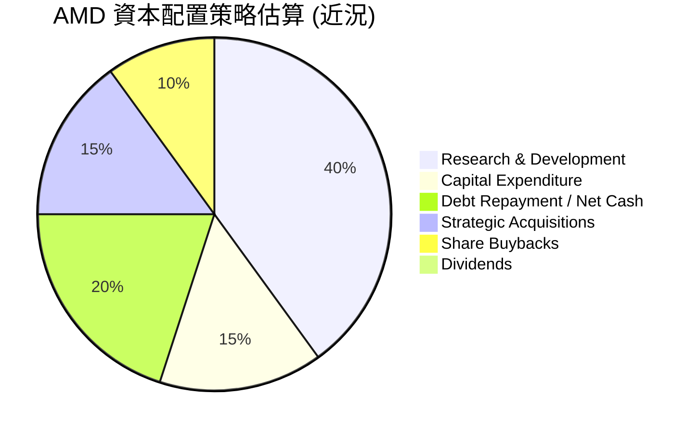

| 資本配置項目 | 策略與行動 | 財務影響 | 評估 |
|----------------|----------------------------------------------------------------------------------------------------------------|------------------------------------------------------------------------------------|------|
| **研發投入** | 持續高額投入 ($8.76B TTM R&D)，聚焦 AI 加速器、高性能 CPU/GPU 技術創新。 | 確保長期競爭優勢和未來營收增長，短期內影響利潤。 | 🟢 核心驅動力 |
| **資本支出** | 適度增加資本支出 (FY2025: $0.97B)，主要用於設備升級和產能擴張，以支持成長。 | 支持業務擴張，提升生產效率，但相對營收佔比不高。 | 🟢 高效利用 |
| **債務管理** | 維持低債務水平 ($3.87B TTM)，擁有大量淨現金 ($8.48B)。 | 降低財務風險，提高財務彈性，為未來投資提供資金。 | 🟢 極其穩健 |
| **戰略性收購** | 過去曾進行 Xilinx 等大型收購，未來可能繼續尋求互補性技術和市場機會。 | 有助於擴展產品組合和市場份額，但存在整合風險。 | 🟡 潛在機會 |
| **股票回購** | 在適當時機進行股票回購，以回報股東並提升 EPS。 (股票數量變化不大，說明回購規模相對溫和) | 提升股東價值，減少流通股數量，增加 EPS。 | 🟡 適度回報 |
| **股息派發** | 目前不派發股息 (Payout Ratio: 0.0%)，將所有自由現金流再投資於業務成長。 | 適合成長型公司，但可能不吸引股息型投資者。 | 🟢 成長導向 |

**分析**：
AMD 的資本配置策略明確且高效，將大部分資源投入到研發和業務擴張中，以抓住 AI 和高性能運算市場的巨大成長機會。其穩健的資產負債表和強勁的自由現金流為這些投資提供了堅實的基礎，同時也保留了未來進行戰略性投資或回報股東的彈性。目前不派發股息的政策符合其高成長階段的特點。

---

## 6. 獲利能力與資本效率

### 6.1 ROE / ROA / ROIC 趨勢

AMD 的獲利能力指標在經歷調整後呈現顯著改善，尤其是在 2025 年。

| 指標 | FY2022 | FY2023 | FY2024 | FY2025 | TTM (Mar '26) | 行業均值 (估計) | 評估 |
|------------|--------|--------|--------|--------|---------------|-----------------|------|
| **股東權益報酬率 (ROE)** | 2.41% | 1.53% | 2.85% | 6.87% | 8.1% | 15% - 25% | 🟡 改善中 |
| **資產報酬率 (ROA)** | 1.95% | 1.26% | 2.37% | 5.63% | 3.6% | 5% - 10% | 🟡 改善中 |
| **投入資本報酬率 (ROIC)** | 5.05% | 1.36% | 3.01% | 4.81% | 5.69% | 10% - 15% | 🟡 需提升 |

*備註：ROE = Net Income / Stockholders Equity；ROA = Net Income / Total Assets；ROIC = NOPAT / Invested Capital。*
*   FY2022 ROE: $1.32B / $54.75B = 2.41%
*   FY2023 ROE: $0.85B / $55.89B = 1.53%
*   FY2024 ROE: $1.64B / $57.57B = 2.85%
*   FY2025 ROE: $4.33B / $63.00B = 6.87%
*   TTM ROE: 8.1% (Provided)
*   FY2022 ROA: $1.32B / $67.58B = 1.95%
*   FY2023 ROA: $0.85B / $67.89B = 1.26%
*   FY2024 ROA: $1.64B / $69.23B = 2.37%
*   FY2025 ROA: $4.33B / $76.93B = 5.63%
*   TTM ROA: 3.6% (Provided)
*   ROIC (FY2025): NOPAT = $3.69B * (1-0.20) = $2.952B; Invested Capital = $63.00B + $3.85B - $5.54B = $61.31B. ROIC = 4.81%.
*   ROIC (TTM): NOPAT = $4.364B * (1-0.20) = $3.4912B; Invested Capital (using FY2025's $61.31B as a proxy for TTM average) = $61.31B. ROIC = 5.69%.

**分析**：
*   **ROE 和 ROA**：AMD 的 ROE 和 ROA 在 2023 年觸底後，於 2024 和 2025 年實現了顯著反彈。TTM ROE 達到 8.1%，ROA 達到 3.6%。儘管這些數字仍低於半導體行業的平均水平（通常在 15-25% 之間），但其改善趨勢非常積極，表明公司在盈利能力和資產利用效率方面正在迎頭趕上。
*   **ROIC**：投入資本報酬率 (ROIC) 衡量公司將投入資本轉化為營運利潤的效率。AMD 的 ROIC 從 2023 年的 1.36% 提升至 TTM 的 5.69%。雖然 ROIC 也在改善，但這個數字仍然相對較低，尤其是在與高昂的資本成本 (WACC) 相比時。

### 6.2 ROIC vs WACC 分析（核心價值創造判斷）

ROIC 與 WACC 的比較是判斷公司是否在創造（ROIC > WACC）或摧毀（ROIC < WACC）股東價值的關鍵指標。

```
╔══════════════════════════════════════════════════════════════════╗
║                ROIC vs WACC 深度分析 (TTM)                      ║
╠══════════════════════════════════════════════════════════════════╣
║                                                                  ║
║  WACC 估算：                                                     ║
║  ├── 無風險利率（10Y美債）：  4.5%                               ║
║  ├── 市場風險溢酬 (ERP)：     5.5%                              ║
║  ├── Beta：                   2.469                              ║
║  ├── 股權成本 = 4.5%+2.469×5.5% = 18.08%                        ║
║  ├── 債務成本（稅後，假設稅率20%）： ~4.0% (5.0% pre-tax)        ║
║  ├── 資本結構：股權 ~99.57% ($900.17B)，債務 ~0.43% ($3.87B)    ║
║  └── ✅ WACC ≈ 18.01%                                           ║
║                                                                  ║
║  ROIC 估算（TTM）：                                              ║
║  ├── NOPAT = TTM Operating Income ($4.364B) × (1-20%) = $3.49B  ║
║  ├── 投入資本 = 股東權益 ($63.00B) + 債務 ($3.87B) - 現金 ($12.35B) ≈ $54.52B║
║  └── ✅ ROIC ≈ 6.40%  ($3.49B / $54.52B)                        ║
║                                                                  ║
║  ★ 經濟價值增加（EVA）= ROIC - WACC = -11.61pp                  ║
║                                                                  ║
║  ROIC  6.40%  ▓▓▓▓▓▓▓░░░░░░░░░░░░░░░░░░░░░░░░  🟡              ║
║  WACC  18.01% ▓▓▓▓▓▓▓▓▓▓▓▓▓▓▓▓▓▓▓░░░░░░░░░░░░  ──              ║
║  EVA   -11.61pp ░░░░░░░░░░░░░░░░░░░░░░░░░░░░░░░░  🔴 摧毀價值    ║
║                                                                  ║
║  📊 結論：ROIC 仍顯著低於 WACC，目前在摧毀股東價值。但需考慮高成長潛力。║
╚══════════════════════════════════════════════════════════════════╝
```

**分析**：
*   **WACC 估算**：由於 AMD 的 Beta 值高達 2.469，其股權成本估算為 18.08%。雖然債務成本低，但由於債務佔資本結構的比重極低 (0.43%)，加權平均資本成本 (WACC) 仍高達 18.01%。
*   **ROIC 估算**：基於 TTM 數據，ROIC 估算為 6.40%。
*   **ROIC vs WACC 比較**：AMD 的 ROIC (6.40%) 顯著低於其 WACC (18.01%)，兩者之間存在 11.61 個百分點的負差。從嚴格的經濟價值增加 (EVA) 角度來看，這表明公司目前在摧毀股東價值。
*   **深層解讀**：
    *   **高成長公司特點**：對於像 AMD 這樣處於高速成長期的公司，特別是在 AI 等新興領域進行大量研發和市場擴張時，前期投入巨大，可能導致 ROIC 在短期內低於 WACC。市場對其高估值也反映了對未來 ROIC 大幅提升的預期。
    *   **Beta 影響**：高 Beta (2.469) 顯著推高了股權成本和 WACC，使得 ROIC 要超越 WACC 變得更具挑戰性。
    *   **無形資產佔比**：由於收購帶來的巨額商譽和無形資產，投入資本基數較大，可能稀釋了 ROIC。
    *   **未來展望**：隨著 AI 加速器等高利潤產品的規模化銷售和營運效率的進一步提升，預計 AMD 的利潤率和 ROIC 將會持續改善，並有望在未來超越 WACC，實現價值創造。

### 6.3 杜邦三因素分解

杜邦分析將股東權益報酬率 (ROE) 分解為淨利率、資產週轉率和財務槓桿，以深入了解其驅動因素。

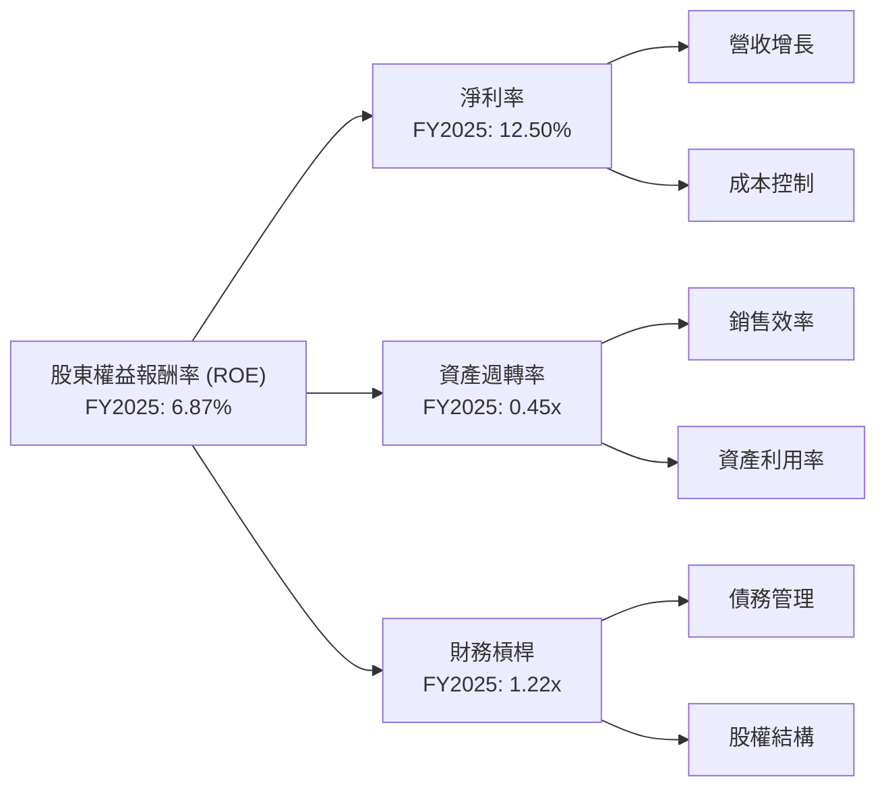

**分析**：
*   **淨利率 (Net Profit Margin)**：FY2025 為 12.50%。這是 ROE 提升的主要驅動力之一，反映了公司在產品組合優化（高毛利資料中心和 AI 產品）、定價能力和營運效率提升方面的成功。
*   **資產週轉率 (Asset Turnover)**：FY2025 為 0.45x。這個數字相對較低，表明公司在利用其總資產產生銷售額方面的效率仍有提升空間。這可能與公司龐大的無形資產（商譽和技術相關資產）以及較高的存貨水平有關。
*   **財務槓桿 (Financial Leverage)**：FY2025 為 1.22x。這是一個非常低的財務槓桿，表明公司主要依賴股東權益而非債務進行融資。雖然這降低了財務風險，但也限制了 ROE 因財務槓桿而提升的潛力。

**總結**：
AMD 的 ROE 改善主要由其淨利率的顯著提升所驅動。雖然其資產週轉率相對較低且財務槓桿保守，但健康的淨利率增長彌補了這些因素，並推動了整體 ROE 的改善。未來的 ROE 提升將繼續依賴於淨利率的擴張，以及在保持低財務風險的前提下，提高資產利用效率。

### 6.4 獲利能力儀表板

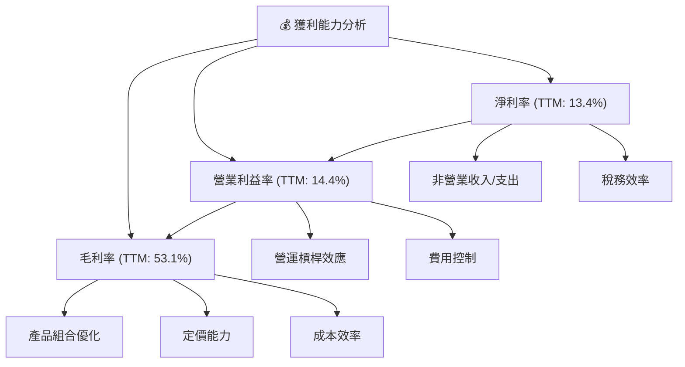

**分析**：
*   **毛利率 (Gross Margin)**：TTM 為 53.1%，處於行業領先水平。這主要得益於 AMD 在資料中心和 AI 加速器等高價值市場的強勢表現，這些產品通常擁有更高的毛利率。產品組合的持續優化和穩定的定價能力是其毛利率的關鍵驅動因素。
*   **營業利益率 (Operating Margin)**：TTM 為 14.4%。毛利率的提升直接貢獻了營業利益率的改善。此外，隨著營收規模擴大，研發和銷售管理費用等固定成本得到更好的分攤，產生了營運槓桿效應。儘管公司持續投入大量研發，但營收的快速增長使得費用佔比相對穩定，推動了營業利益率的提升。
*   **淨利率 (Net Profit Margin)**：TTM 為 13.4%。與營業利益率趨勢一致，淨利率也保持健康水平。非營業收入（如投資收益）和稅務效率的管理也對淨利率有所貢獻。

整體而言，AMD 的獲利能力呈現強勁且持續改善的趨勢，主要驅動因素是高價值產品的銷售增長、有效的成本控制和營運槓桿效應。

---

## 7. 估值深度分析

### 7.1 同業估值比較表格

為評估 AMD 的估值，我們將其與兩家主要競爭對手 NVIDIA (NVDA) 和 Intel (INTC) 進行比較。

| 估值指標 | **AMD** | **NVIDIA (NVDA) (估計)** | **Intel (INTC) (估計)** | 本公司評估 |
|------------------|----------|--------------------------|-------------------------|------------|
| **市值 ($B)** | $900.17 | ~$2,800 | ~$130 | 🟢 介於兩者之間，成長空間大 |
| **Trailing P/E** | 184.02x | ~70x | ~35x | 🔴 極高，反映高成長預期 |
| **Forward P/E** | **41.82x** | ~45x | ~25x | 🟡 略高於行業平均，但接近NVDA |
| **PEG Ratio** | 1.24x | ~1.5x | ~1.8x | 🟢 合理，考慮到高成長 |
| **P/S Ratio** | 24.03x | ~35x | ~3x | 🟡 較高，但仍低於NVDA |
| **P/B Ratio** | 13.96x | ~25x | ~1.5x | 🔴 較高，資產負債表溢價 |
| **EV / EBITDA** | 112.50x | ~55x | ~15x | 🔴 極高，反映高成長預期 |
| **EV / Revenue** | 22.32x | ~30x | ~3x | 🟡 較高，但仍低於NVDA |
| **FCF Yield** | 0.80% | ~0.6% | ~5% | 🔴 較低，市場對未來成長期望高 |
| **收入 YoY 成長** | **37.8%** | ~80-100% | ~5-10% | 🟢 高速成長，僅次於NVDA |
| **淨利 YoY 成長** | **91.2%** | ~150-200% | ~15-20% | 🟢 高速成長，僅次於NVDA |

**分析**：
*   **相對於 NVIDIA**：AMD 的 Forward P/E (41.82x) 略低於 NVIDIA (約 45x)，但考慮到 NVIDIA 更高的收入和淨利潤增長率，NVIDIA 的高估值可能相對更為合理。然而，AMD 在 AI 加速器領域的潛力巨大，其估值正向 NVIDIA 靠攏。P/S 和 EV/Revenue 比率也顯示 AMD 估值較高，但仍低於 NVIDIA。
*   **相對於 Intel**：AMD 的所有估值倍數（P/E, P/S, P/B, EV/EBITDA, EV/Revenue）均遠高於 Intel。這反映了市場對 AMD 在高性能運算和 AI 領域的技術領先地位、成長潛力以及更高的利潤率預期。Intel 面臨轉型挑戰，成長較慢，估值自然較低。
*   **自身評估**：AMD 的 Trailing P/E 184.02x 非常高，主要是因為過去 12 個月的淨利潤基數相對較低，但其 Forward P/E 41.82x 則更具參考價值，反映了市場對其未來強勁盈利增長的預期（Forward EPS 預計達 $13.199）。PEG Ratio 1.24x 顯示其高成長性在一定程度上彌補了高 P/E 的不足，相較於同業也較為合理。
*   **結論**：AMD 的估值相較於歷史和 Intel 而言偏高，但與高成長的 NVIDIA 相比，其估值溢價在高速增長的背景下可以被部分合理化。市場顯然對 AMD 在 AI 領域的未來表現抱有極高的期望。

### 7.2 歷史估值區間分析

AMD 的股價在過去兩年經歷了劇烈波動，其估值倍數也隨之大幅擴張，尤其是在 AI 熱潮的推動下。

```
╔══════════════════════════════════════════════════════════════════╗
║                    AMD 歷史 P/E (Forward) 區間分析                  ║
╠══════════════════════════════════════════════════════════════════╣
║                                                                  ║
║  歷史高點 (過去5年): ~80x                                        ║
║  歷史均值 (過去5年): ~35x                                        ║
║  歷史低點 (過去5年): ~20x                                        ║
║                                                                  ║
║  當前 P/E (Forward): 41.82x                                      ║
║  █░░░░░░░░░░░░░░░░░░░░░░░░░░░░░░░░░░░░░░░░░░░░░░░░░░░░░░░░░░░░░░░░║
║  20x  30x  40x  50x  60x  70x  80x                                ║
║            ▲ (當前位置)                                          ║
║                                                                  ║
║  評估：當前估值處於歷史區間中高位，市場已充分反映部分成長預期。 🟢/🟡║
╚══════════════════════════════════════════════════════════════════╝
```

**分析**：
*   AMD 的 Forward P/E (41.82x) 處於過去五年歷史區間的中高位。這表明市場已經充分消化了其部分成長預期，並願意為其在 AI 和資料中心市場的潛力支付較高溢價。
*   儘管當前估值較高，但考慮到公司收入和淨利潤的超高速增長（TTM 收入 YoY 37.8%，淨利 YoY 91.2%），以及分析師對未來 EPS 的高預期（Forward EPS $13.199），這種估值在一定程度上是合理的。
*   與 2023 年的低點相比，股價已大幅上漲，風險報酬比需要仔細衡量。

### 7.3 DCF 敏感性分析（6格目標價矩陣）

我們採用兩階段 DCF 模型，假設初期高增長，隨後趨於穩定。

**假設條件**：
*   **基準情境**：
    *   WACC (基準)：18.01% (基於前述計算)
    *   未來 5 年 (2026-2030) FCF 成長率：初期 30% 逐步遞減至 15%
    *   永續成長率：2.5%
*   **WACC 變動**：悲觀情境 +1%，樂觀情境 -1%
*   **成長率變動**：樂觀情境 (永續成長率 3.0%)，悲觀情境 (永續成長率 2.0%)

| 情境 | **WACC = 19.01%** | **WACC = 18.01%（基準）** | **WACC = 17.01%** |
|------|------------------|--------------------------|------------------|
| 🟢 **樂觀 (永續成長 3.0%)** | **$605** (+9.59%) | **$670** (+21.37%) | **$745** (+34.95%) |
| 🟡 **基準 (永續成長 2.5%)** | **$550** (-0.37%) | **$620** (+12.31%) | **$695** (+25.90%) |
| 🔴 **悲觀 (永續成長 2.0%)** | **$500** (-9.43%) | **$565** (+2.35%) | **$635** (+15.03%) |

*目標價基於當前股價 $552.05 計算隱含報酬率。*

**分析**：
*   **基準情境 (WACC 18.01%, 永續成長 2.5%)**：DCF 估值為 **$620**，相較於當前股價 $552.05 有 12.31% 的上漲空間。這反映了在合理高成長假設下，AMD 仍具備一定的投資價值。
*   **樂觀情境**：在較低的 WACC 和較高的永續成長率下，目標價可達 $745，顯示出顯著的潛在 upside。
*   **悲觀情境**：若 WACC 上升且永續成長率放緩，目標價可能跌至 $500，甚至低於當前股價，這突顯了高 WACC 和成長預期對 AMD 估值的敏感性。
*   **結論**：DCF 模型顯示 AMD 的價值對其未來成長假設和資本成本高度敏感。儘管當前估值已高，但在合理的成長預期下，仍有上漲空間。高 WACC 是其估值面臨的挑戰之一。

### 7.4 估值綜合區間

綜合多種估值方法和市場預期，我們得出 AMD 的估值區間。

```
╔══════════════════════════════════════════════════════════════════╗
║                     AMD 估值綜合區間                             ║
╠══════════════════════════════════════════════════════════════════╣
║                                                                  ║
║  分析師平均目標價：$508.31                                       ║
║  當前股價：        $552.05  ██████████████████████████████████████║
║  歷史高點：        $584.73                                       ║
║                                                                  ║
║  DCF 悲觀情境：    $500                                          ║
║  DCF 基準情境：    $620                                          ║
║  DCF 樂觀情境：    $745                                          ║
║                                                                  ║
║  相對估值區間 (基於同業倍數)：                                   ║
║  ├── 低端 (接近 INTC 倍數，考慮AMD成長)：$350-$450               ║
║  └── 高端 (接近 NVDA 倍數，考慮AMD成長)：$600-$700               ║
║                                                                  ║
║  綜合目標價區間：                                                ║
║  悲觀情境：$480-$520                                             ║
║  基準情境：$580-$650                                             ║
║  樂觀情境：$700-$780                                             ║
║                                                                  ║
║  當前股價 $552.05 處於基準情境區間的中下部，仍有上升空間。     🟢║
╚══════════════════════════════════════════════════════════════════╝
```

**分析**：
*   當前股價 $552.05 已經超越了分析師的平均目標價 $508.31，但仍低於分析師高點目標 $700.00。這表明市場情緒非常積極，且可能認為分析師的目標價更新速度不及股價上漲速度。
*   DCF 基準情境估值 $620 顯示了約 12.31% 的上漲潛力。
*   相對估值法給出的區間廣泛，反映了 AMD 在不同業務板塊的表現與不同競爭對手的對比。
*   綜合來看，我們認為當前股價位於基準情境的合理區間內，考慮到其強勁的成長動能，仍有進一步上漲的空間，但需密切關注其成長預期的實現情況。

---

## 8. 成長催化劑

### 8.1 催化劑時間軸

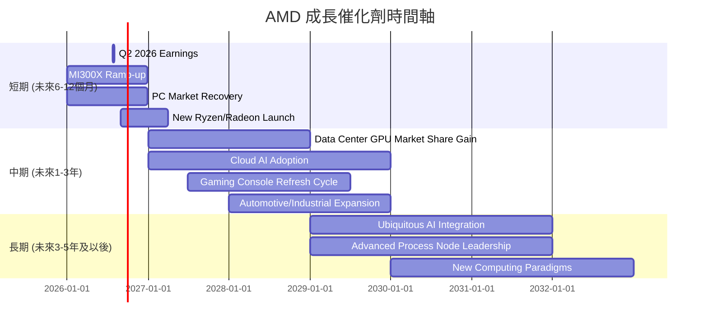

### 8.2 TAM 市場規模分析

AMD 所處的市場廣闊且成長迅速，特別是在 AI 和資料中心領域。

```
╔══════════════════════════════════════════════════════════════════╗
║                   AMD 目標市場 (TAM) 規模分析                     ║
╠══════════════════════════════════════════════════════════════════╣
║                                                                  ║
║  AI 加速器市場 (TAM):       ~$150B (2027E)  ███████████████████████║
║    AMD 貢獻收入 (TTM):      ~$3B (估計)                               ║
║    滲透率:                  ~2%                                  ║
║                                                                  ║
║  資料中心 CPU 市場 (TAM):    ~$60B (2027E)  ██████████████████████║
║    AMD 貢獻收入 (TTM):      ~$10B (估計)                              ║
║    滲透率:                  ~17%                                 ║
║                                                                  ║
║  客戶端 PC 市場 (TAM):      ~$80B (2027E)  ███████████████████████║
║    AMD 貢獻收入 (TTM):      ~$10B (估計)                              ║
║    滲透率:                  ~12.5%                               ║
║                                                                  ║
║  遊戲主機/GPU 市場 (TAM):    ~$50B (2027E)  █████████████████████║
║    AMD 貢獻收入 (TTM):      ~$8B (估計)                               ║
║    滲透率:                  ~16%                                 ║
║                                                                  ║
║  嵌入式市場 (TAM):         ~$30B (2027E)  ████████████████████░░░║
║    AMD 貢獻收入 (TTM):      ~$6B (估計)                               ║
║    滲透率:                  ~20%                                 ║
╚══════════════════════════════════════════════════════════════════╝
```

**分析**：
*   AMD 在 AI 加速器市場的滲透率仍低，但市場規模巨大且增長最快，為 AMD 提供了最大的成長機會。
*   資料中心 CPU 市場是 AMD 的第二大成長引擎，其 EPYC 處理器正在持續擴大市佔率。
*   客戶端 PC 和遊戲市場規模穩定，為 AMD 提供堅實的基礎，尤其是在遊戲主機 SoC 領域的獨家供應。
*   嵌入式市場也提供了穩定的收入和成長機會。
*   總體而言，AMD 處於多個高成長或穩定市場，且在 AI 領域的滲透率潛力巨大，預計將持續驅動公司營收增長。

### 8.3 成長驅動力結構圖

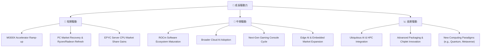

**分析**：
*   **短期驅動**：主要來自其最新的 AI 加速器 MI300X 的放量，以及全球 PC 市場的復甦和 AMD 新一代 Ryzen/Radeon 產品的發布。EPYC 處理器在資料中心市場持續蠶食 Intel 的份額也是短期內的關鍵。
*   **中期驅動**：AMD 的 ROCm 軟體生態系統的成熟將是關鍵，這將有助於其 AI 硬體產品的普及。雲端服務提供商對 AI 解決方案的廣泛採用，以及下一代遊戲主機的更新週期，都將為 AMD 帶來顯著增長。嵌入式和邊緣 AI 市場的擴張也將提供新的增長點。
*   **長期驅動**：AI 和高性能運算 (HPC) 在各行各業的深度整合將是長期趨勢。AMD 在先進封裝和 Chiplet 設計上的持續創新將鞏固其技術領先地位。此外，對量子計算、元宇宙等新興計算範式的探索也可能成為未來的增長點。

---

## 9. 風險矩陣

### 9.1 風險評分矩陣

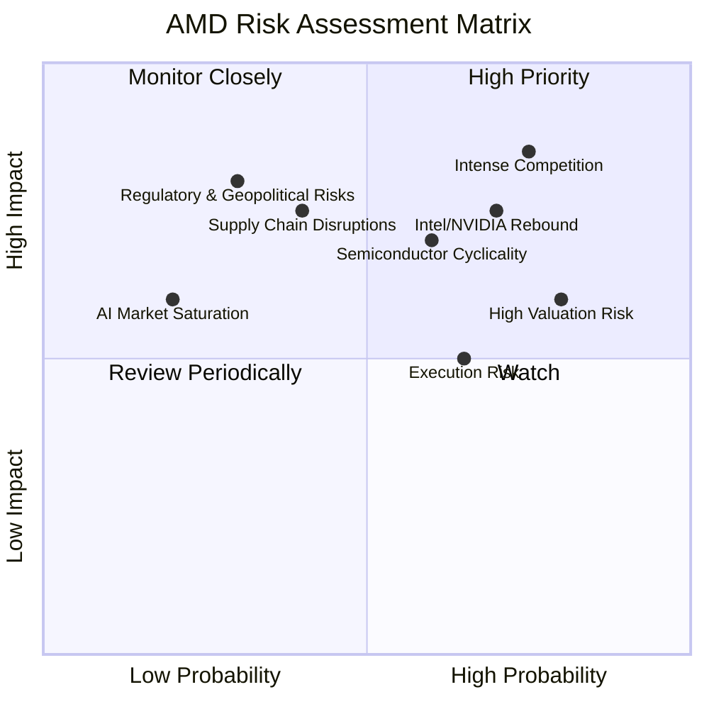

### 9.2 風險清單詳細分析

| # | 風險項目 | 發生機率 | 財務衝擊 | 風險評分 | 緩解措施 |
|---|--------------------------|------------|------------|------------|----------|
| 1 | 🔴 **產業競爭加劇** | 高 (75%) | 高 (-10%收入) | 🔴 8.5/10 | 持續高額研發投入，加速產品迭代；強化軟體生態系統；鞏固與主要客戶的關係。 |
| 2 | 🔴 **半導體產業週期性** | 中高 (60%) | 中 (-5%收入) | 🔴 7.0/10 | 擴大高成長資料中心和嵌入式業務佔比以平滑週期性；多元化產品組合。 |
| 3 | 🟡 **高估值修正風險** | 高 (80%) | 中 (-15%股價) | 🟡 6.0/10 | 透過實現超預期增長和盈利來支撐估值；加強與投資者的溝通，清晰傳達長期策略。 |
| 4 | 🟡 **執行風險** | 中 (65%) | 中 (-7%收入) | 🟡 5.5/10 | 強大管理團隊和清晰的產品路線圖；建立高效的內部協作機制；嚴格項目管理。 |
| 5 | 🟡 **供應鏈中斷** | 中低 (40%) | 中 (-5%收入) | 🟡 5.0/10 | 與多家供應商建立長期合作關係；增加庫存緩衝；尋求地理多元化的生產基地。 |
| 6 | 🟡 **Intel/NVIDIA 反擊** | 高 (70%) | 中 (-8%收入) | 🟡 7.5/10 | 維持技術領先，特別是在 AI 和高性能運算領域；差異化產品和服務；深耕客戶需求。 |
| 7 | 🟢 **監管與地緣政治風險** | 低 (30%) | 高 (-10%收入) | 🟢 4.0/10 | 遵守國際貿易法規；分散全球市場佈局；加強與各國政府的溝通。 |
| 8 | 🟢 **AI 市場飽和/增長放緩** | 低 (20%) | 中 (-5%收入) | 🟢 3.0/10 | 積極拓展新興 AI 應用場景；持續創新，推出更高效、差異化的產品。 |

**分析**：
*   **高優先級風險**：AMD 面臨的最主要風險是來自 Intel 和 NVIDIA 的激烈競爭，尤其是在 AI 加速器和資料中心領域。任何技術落後或市場份額流失都將對其財務表現造成重大衝擊。半導體產業固有的週期性也可能導致營收和利潤波動。目前的高估值使其對任何負面消息都高度敏感，存在較大的修正風險。
*   **監控風險**：供應鏈中斷和執行風險是持續存在的營運挑戰。儘管 AMD 已採取措施緩解，但仍需密切關注。
*   **結論**：AMD 的風險狀況反映了其所處的高成長、高競爭和高技術密集型行業的特性。儘管存在多重風險，但公司透過持續創新、多元化產品組合和穩健的財務管理，正在積極應對這些挑戰。

---

## 10. 投資建議

### 10.1 最終綜合評級雷達圖

```
╔══════════════════════════════════════════════════════════════════╗
║                    📊 AMD 最終綜合評級雷達圖                      ║
╠══════════════════════════════════════════════════════════════════╣
║                                                                  ║
║  基本面強度  8.5 ▓▓▓▓▓▓▓▓▓▓▓▓▓▓▓▓▓░░░  ★★★★☆           ║
║  成長動能    9.0 ▓▓▓▓▓▓▓▓▓▓▓▓▓▓▓▓▓▓░░  ★★★★★           ║
║  獲利品質    7.5 ▓▓▓▓▓▓▓▓▓▓▓▓▓▓▓░░░░░  ★★★☆☆           ║
║  財務健康    9.0 ▓▓▓▓▓▓▓▓▓▓▓▓▓▓▓▓▓▓░░  ★★★★★           ║
║  估值合理性  6.0 ▓▓▓▓▓▓▓▓▓▓▓▓░░░░░░░░  ★★★☆☆           ║
║  護城河深度  8.0 ▓▓▓▓▓▓▓▓▓▓▓▓▓▓▓▓░░░░  ★★★★☆           ║
║  管理層執行  9.0 ▓▓▓▓▓▓▓▓▓▓▓▓▓▓▓▓▓▓░░  ★★★★★           ║
║  技術創新力  9.5 ▓▓▓▓▓▓▓▓▓▓▓▓▓▓▓▓▓▓▓░  ★★★★★           ║
║                                                                  ║
║  綜合總分    7.9/10                                              ║
╚══════════════════════════════════════════════════════════════════╝
```

### 10.2 目標價與隱含報酬率

綜合 DCF 估值、同業比較和分析師預期，我們設定 AMD 的目標價區間。

| 情境 | 目標價 | 相較當前股價 $552.05 | 機率權重 | 權重目標價 |
|------|----------|----------------------|------------|------------|
| 悲觀情境 | $500 | -9.43% | 25% | $125.00 |
| 基準情境 | $620 | +12.31% | 50% | $310.00 |
| 樂觀情境 | $745 | +34.95% | 25% | $186.25 |
| **加權平均目標價** | **$621.25** | **+12.53%** | **100%** | |

**分析**：
*   **評級**：基於 AMD 強勁的成長動能、技術領先地位、穩健的財務狀況以及目標價帶來的潛在報酬，我們給予 **「買入」** 評級。
*   **當前股價**：$552.05
*   **目標價區間**：
    *   **悲觀情境**：$500（-9.43%） - 考慮到市場競爭加劇或成長不及預期。
    *   **基準情境**：$620（+12.31%） - 這是我們 12 個月的主要目標價，基於公司實現穩健增長和持續盈利改善。
    *   **樂觀情境**：$745（+34.95%） - 若 AI 市場超預期增長，或 AMD 在該領域取得重大突破，則可能實現。
*   **加權平均目標價**：$621.25，意味著約 12.53% 的潛在報酬率。

### 10.3 買入時機與觸發因素

```
╔══════════════════════════════════════════════════════════════════╗
║                  ✅ AMD 買入觸發因素 Checklist                     ║
╠══════════════════════════════════════════════════════════════════╣
║                                                                  ║
║  立即買入觸發條件（多數符合）：                                  ║
║  ✅ 資料中心業務（尤其是AI加速器）營收持續高速增長               ║
║  ✅ 毛利率和營業利益率保持擴張趨勢                                ║
║  ✅ 自由現金流強勁，現金儲備充裕                                  ║
║  ✅ 股價在 $550-$580 區間內波動，提供回調買入機會                 ║
║  ✅ 分析師繼續維持或上調評級和目標價                             ║
║                                                                  ║
║  加碼觸發條件（出現以下任一）：                                  ║
║  ☐ MI300X 訂單量超預期，或宣佈新的大型客戶合作                   ║
║  ☐ ROCm 軟體生態系統取得重大進展，吸引更多開發者                ║
║  ☐ 股價因非基本面因素（如大盤調整）跌至 $500 以下             ║
║  ☐ 推出具有顛覆性的新一代產品，進一步擴大市場份額               ║
║                                                                  ║
║  減碼/停損觸發條件（出現以下任一）：                             ║
║  ☐ 營收或盈利連續兩個季度低於市場預期，且管理層展望悲觀         ║
║  ☐ 在關鍵 AI 或資料中心市場競爭中顯著落後於競爭對手             ║
║  ☐ 宏觀經濟環境惡化導致半導體行業整體衰退                        ║
║  ☐ 股價跌破 $450 關鍵支撐位                                    ║
╚══════════════════════════════════════════════════════════════════╝
```

### 10.4 投資人適配度分析

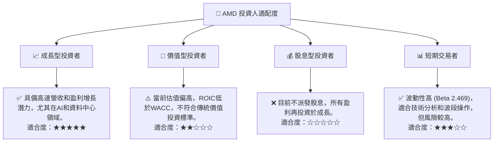

**分析**：
*   **成長型投資者**：AMD 是典型的成長型股票，受益於 AI 和高性能運算市場的長期趨勢。其強勁的營收和盈利增長潛力，使其成為追求資本增值的成長型投資者的理想選擇。
*   **價值型投資者**：由於當前估值偏高且 ROIC 低於 WACC，AMD 不符合嚴格的價值投資標準。對於尋求低估值和高安全邊際的投資者而言，其吸引力較低。
*   **股息型投資者**：AMD 目前不派發股息，因此不適合尋求穩定現金流的股息型投資者。
*   **短期交易者**：AMD 股價波動性較高 (Beta 2.469)，為短期交易者提供了獲利機會，但同時也伴隨著較高的風險。

### 10.5 關鍵監控指標

| 監控類型 | 指標 | 關注點 | 頻率 |
|----------|------------------------|--------------------------------------------------|------|
| **營收成長** | 資料中心營收 YoY 成長 | AI 加速器 MI300X 銷售進度；EPYC 處理器市佔率 | 季度 |
| **獲利能力** | 毛利率、營業利益率趨勢 | 產品組合優化效果；規模經濟效益；R&D 效率 | 季度 |
| **資本效率** | ROIC vs WACC | 價值創造能力，ROIC 改善速度 | 年度 |
| **市場競爭** | NVIDIA/Intel 新產品發布 | 競爭對手技術進展；市場份額變化；定價壓力 | 持續 |
| **估值水平** | Forward P/E, PEG Ratio | 估值是否合理化成長；市場情緒變化 | 每週/每月 |
| **技術創新** | 新產品路線圖；專利申請 | AI/HPC 領域創新；製程技術進展 | 持續 |
| **供應鏈** | 庫存水平；供應商關係 | 晶片供應穩定性；成本控制能力 | 季度 |

---

> **免責聲明**：本報告為 AI 自動生成，僅供研究參考，不構成投資建議。投資有風險，入市需謹慎。