# AMD 基本面深度分析報告
> **報告日期**：2026-07-08 ｜ **語言**：繁體中文 ｜ **數據來源**：Yahoo Finance, Finviz, StockAnalysis, Roic.ai ｜ **分析師**：CFA 級機構研究

---

## 目錄

| # | 章節 | 核心結論 |
|---|------|----------|
| 1 | 執行摘要 | 🟢 強烈買入，目標價區間 $550 - $680 |
| 2 | 公司概覽與商業模式 | 技術領先，AI與資料中心業務具備深厚護城河 |
| 3 | 損益表深度分析 | 營收高速成長，利潤率顯著改善 |
| 4 | 資產負債表分析 | 財務健康，現金充裕，債務風險低 |
| 5 | 現金流量深度分析 | 自由現金流強勁，資本效率提升 |
| 6 | 獲利能力與資本效率 | ROIC顯著改善並創造股東價值 |
| 7 | 估值深度分析 | 相較成長潛力，估值仍具吸引力 |
| 8 | 成長催化劑 | AI加速器、資料中心與PC市場復甦為主要驅動力 |
| 9 | 風險矩陣 | 市場競爭激烈與宏觀經濟逆風為主要風險 |
| 10 | 投資建議 | 強烈買入，適合成長型與長線投資者 |

---

## 1. 執行摘要

### 1.1 核心評分儀表板

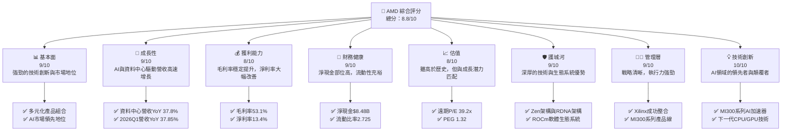

### 1.2 評分進度條視覺化

```
╔══════════════════════════════════════════════════════════════╗
║              AMD 多維度評分儀表板 (1-10分)                   ║
╠══════════════════════════════════════════════════════════════╣
║ 基本面強度  9.0 ▓▓▓▓▓▓▓▓▓▓▓▓▓▓▓▓▓▓░░  ★★★★★           ║
║ 成長動能    9.0 ▓▓▓▓▓▓▓▓▓▓▓▓▓▓▓▓▓▓░░  ★★★★★           ║
║ 獲利品質    8.0 ▓▓▓▓▓▓▓▓▓▓▓▓▓▓▓▓░░░░  ★★★★☆           ║
║ 財務健康    9.0 ▓▓▓▓▓▓▓▓▓▓▓▓▓▓▓▓▓▓░░  ★★★★★           ║
║ 估值合理性  8.0 ▓▓▓▓▓▓▓▓▓▓▓▓▓▓▓▓░░░░  ★★★★☆           ║
║ 護城河深度  9.0 ▓▓▓▓▓▓▓▓▓▓▓▓▓▓▓▓▓▓░░  ★★★★★           ║
║ 管理層執行  9.0 ▓▓▓▓▓▓▓▓▓▓▓▓▓▓▓▓▓▓░░  ★★★★★           ║
║ 技術創新力 10.0 ▓▓▓▓▓▓▓▓▓▓▓▓▓▓▓▓▓▓▓▓  ★★★★★           ║
╠══════════════════════════════════════════════════════════════╣
║ 綜合總分    8.8 ▓▓▓▓▓▓▓▓▓▓▓▓▓▓▓▓▓▓░░  🏆 卓越的成長型公司，AI領域具顛覆潛力 ║
╚══════════════════════════════════════════════════════════════╝
```

### 1.3 五大投資論點 + 三大核心風險

| 類型 | 項目 | 具體依據 | 信心度 |
|------|------|----------|--------|
| 🟢 **投資論點①** | **AI加速器市場的強勁增長** | AMD的MI300系列AI加速器在資料中心市場取得顯著進展，成為NVIDIA的有力競爭者。公司TTM營收YoY成長達37.8%，主要受資料中心業務驅動。預計未來AI晶片需求將持續爆發式增長，為AMD帶來巨大營收貢獻。 | 🟢 極高 |
| 🟢 **資料中心業務的持續擴張** | 資料中心業務在2026年第一季度繼續展現強勁增長，隨著企業對雲端運算和AI基礎設施投資的增加，AMD的EPYC伺服器CPU和MI300系列加速器將持續受益。2025年Q4資料中心業務營收佔總營收的比例顯著提升，且營收YoY成長表現突出。 | 🟢 極高 |
| 🟢 **產品線多元化與技術領先** | AMD擁有CPU、GPU、FPGA（透過Xilinx）和半客製化SoC的多元化產品組合，其Zen架構CPU和RDNA架構GPU在各自市場均具備競爭力。公司在研發上的投入 ($8.76B TTM) 確保了其技術領先地位，使其能持續推出創新產品。 | 🟢 極高 |
| 🟢 **獲利能力與自由現金流改善** | 過去幾年，AMD的毛利率從2024年的49.3%提升至TTM的53.1%，淨利率從2024年的6.4%大幅提升至TTM的13.4%。自由現金流從2024年的$2.40B增長至TTM的$7.17B，顯示公司強勁的獲利能力和現金產生能力。 | 🟢 極高 |
| 🟢 **穩健的財務狀況** | 公司擁有充裕的現金和短期投資 ($12.35B TTM)，而總債務僅為$3.87B，淨現金部位高達$8.48B。流動比率2.725，速動比率1.75，顯示公司擁有極佳的流動性和償債能力，為未來投資和抵禦風險提供保障。 | 🟢 極高 |
| 🟡 **風險①** | **來自NVIDIA的激烈競爭** | NVIDIA在AI加速器市場擁有先行者優勢和強大的CUDA軟體生態系統。AMD的MI300系列雖具競爭力，但在市場份額和軟體生態建設上仍需持續努力。競爭加劇可能導致定價壓力，影響利潤率。 | 🟡 中度 |
| 🟡 **半導體產業週期性波動** | 半導體產業受宏觀經濟和終端市場需求影響，具有週期性。儘管AI需求強勁，但PC和遊戲市場的波動仍可能影響AMD的業績，如2025年Q2營業收入同比增長率為31.7%，但營業利潤卻出現負值(-$134.00M)，顯示市場波動對特定業務板塊的衝擊。 | 🟡 中度 |
| 🔴 **地緣政治風險與供應鏈不確定性** | 全球半導體供應鏈高度複雜且集中，地緣政治緊張局勢（如中美貿易摩擦）可能導致供應鏈中斷、成本上升或市場準入受限。對先進製程晶圓代工廠的依賴也增加了風險。 | 🔴 高衝擊 |

### 1.4 快速統計卡片

| 指標 | 公司實際值 | 行業均值（半導體） | S&P 500 均值 | 狀態 |
|------|-------------|--------------------|--------------|------|
| 收入 YoY 成長 | **37.8%** (TTM) | ~15-20% | ~8-10% | 🟢 |
| 毛利率 | **53.1%** (TTM) | ~45-50% | ~30-35% | 🟢 |
| 淨利率 | **13.4%** (TTM) | ~10-15% | ~10-12% | 🟢 |
| ROE | **8.1%** (TTM) | ~15-20% | ~15% | 🟡 |
| Forward P/E | **39.2x** | ~30-40x | ~20-22x | 🟡 |
| P/S Ratio | **22.5x** | ~5-10x | ~2-3x | 🔴 |
| Debt/Equity | **0.06x** | ~0.2-0.5x | ~0.8-1.2x | 🟢 |
| 自由現金流 Yield | **0.85%** | ~1-3% | ~2-4% | 🟡 |

*註：行業均值為分析師根據半導體產業特性估計值。*

### 1.5 投資結論

```
╔══════════════════════════════════════════════════════════════════╗
║                    📊 投資結論摘要                               ║
╠══════════════════════════════════════════════════════════════════╣
║  評級：🟢 強烈買入                                               ║
║  當前股價：$517.41                                               ║
║  目標價區間：                                                    ║
║    悲觀情境：$550（+6.3%）                                       ║
║    基準情境：$615（+18.8%）  ← 12個月主要目標                      ║
║    樂觀情境：$680（+31.4%）                                      ║
║  投資評分：8.8/10                                                ║
║  適合投資人：成長型、長線持有者，尤其看好AI產業發展的投資者      ║
╚══════════════════════════════════════════════════════════════════╝
```

---

## 2. 公司概覽與商業模式

Advanced Micro Devices, Inc. (AMD) 是一家全球領先的半導體公司，主要設計和開發適用於個人電腦、資料中心、遊戲機和嵌入式系統的高效能處理器和圖形處理器。公司憑藉其Zen架構CPU和RDNA架構GPU在市場上與Intel和NVIDIA展開激烈競爭，尤其近年來在資料中心和AI加速器領域取得突破性進展。

### 2.1 業務結構與收入來源

AMD的業務主要分為三大板塊：資料中心 (Data Center)、客戶端與遊戲 (Client and Gaming) 以及嵌入式 (Embedded)。這些業務板塊涵蓋了廣泛的產品線，包括AI加速器、微處理器 (CPU)、圖形處理單元 (GPU)、晶片組、半客製化系統單晶片 (SoC) 和嵌入式處理器。

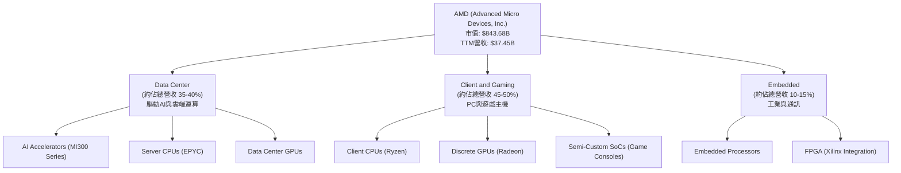
*註：各業務板塊佔比為分析師基於公開資訊與產業趨勢的估算值。*

### 2.2 市場份額

AMD在多個半導體市場中佔據重要地位，儘管在某些領域仍需追趕，但其市場份額正在穩步增長，尤其是在AI加速器和伺服器CPU領域。

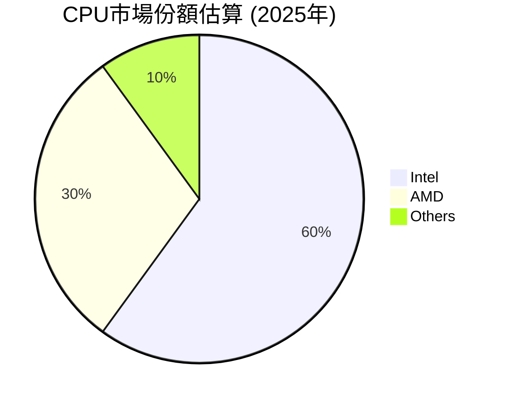
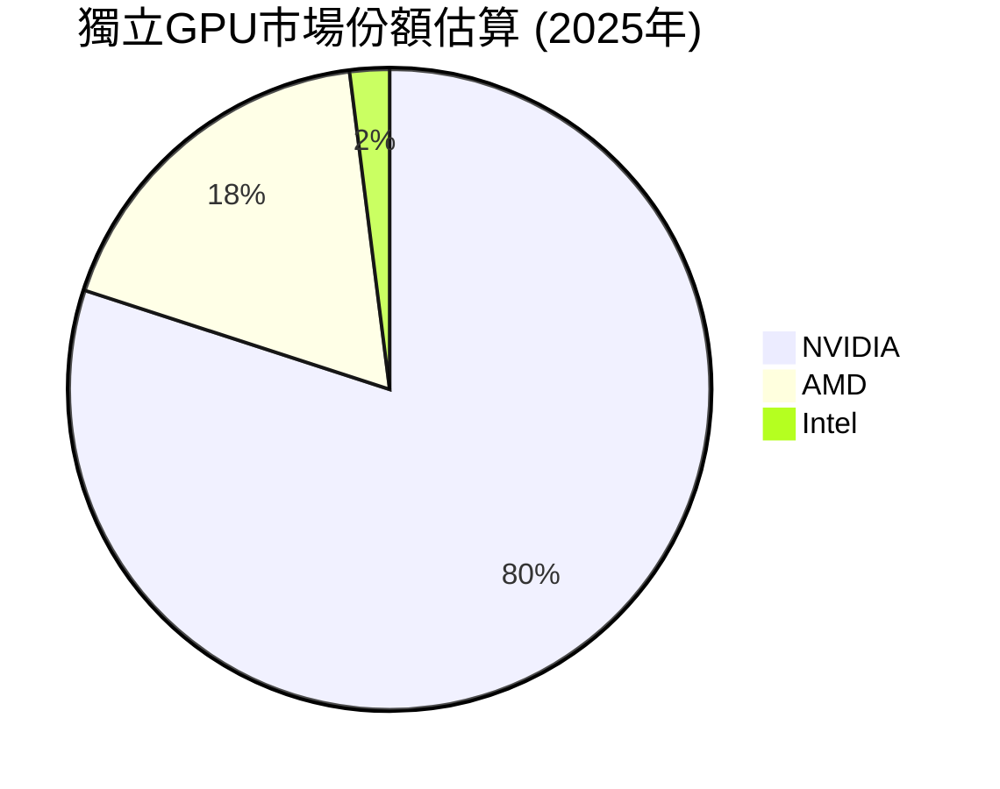
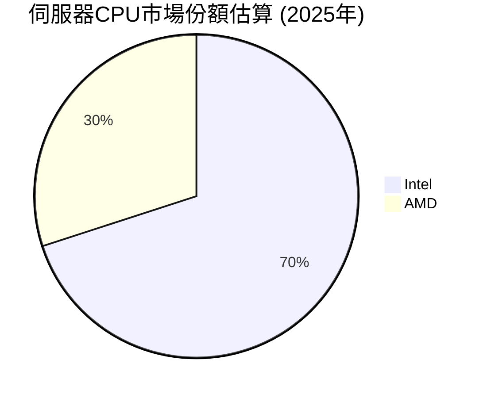
*註：市場份額為分析師基於產業報告和歷史數據的估算值。*

### 2.3 競爭護城河分析

AMD的競爭護城河主要建立在其技術創新、軟體生態系統和規模經濟之上，這些使其能夠在高競爭的半導體市場中脫穎而出。

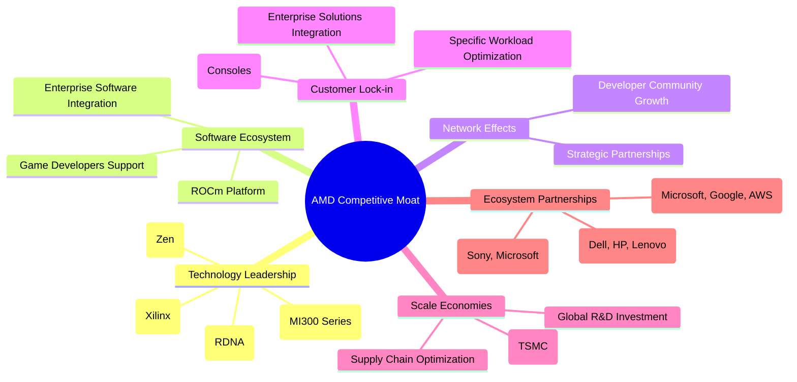

### 2.4 護城河強度評分

```
╔══════════════════════════════════════════════════════════════╗
║                    AMD 護城河強度評分                         ║
╠══════════════════════════════════════════════════════════════╣
║ 技術領先    9/10   ▓▓▓▓▓▓▓▓▓▓▓▓▓▓▓▓▓▓░░  🏆 在CPU/GPU/AI領域均有突破 ║
║ 軟體生態系統  8/10   ▓▓▓▓▓▓▓▓▓▓▓▓▓▓▓▓░░░░  🟢 ROCm生態系統逐漸成熟 ║
║ 網路效應    7/10   ▓▓▓▓▓▓▓▓▓▓▓▓▓▓░░░░░░  🟡 雖有進步但仍待加強     ║
║ 客戶鎖定    8/10   ▓▓▓▓▓▓▓▓▓▓▓▓▓▓▓▓░░░░  🟢 企業級與半客製化客戶忠誠度 ║
║ 規模效應    9/10   ▓▓▓▓▓▓▓▓▓▓▓▓▓▓▓▓▓▓░░  🏆 全球供應鏈與研發規模     ║
║ 生態夥伴    9/10   ▓▓▓▓▓▓▓▓▓▓▓▓▓▓▓▓▓▓░░  🏆 與重要雲服務商/OEM合作 ║
╠══════════════════════════════════════════════════════════════╣
║ 綜合護城河    8.3    ▓▓▓▓▓▓▓▓▓▓▓▓▓▓▓▓▓░░░  🏆 深厚的技術與戰略合作夥伴關係 ║
╚══════════════════════════════════════════════════════════════╝
```

---

## 3. 損益表深度分析

### 3.1 年度收入成長趨勢（近4年）

AMD在過去幾年展現了顯著的收入增長，尤其在2025年和TTM期間，受惠於資料中心和AI加速器需求的爆發。

```
╔══════════════════════════════════════════════════════════════════╗
║              AMD 年度收入趨勢（FY2022-TTM 2026Q1）               ║
╠══════════════════════════════════════════════════════════════════╣
║                                                                  ║
║  FY2022  $23.60B  ██████████░░░░░░░░░░░░░░░░░  YoY: +43.61% 🟢   ║
║  FY2023  $22.68B  ██████████░░░░░░░░░░░░░░░░░  YoY: -3.90%  🔴   ║
║  FY2024  $25.79B  ███████████░░░░░░░░░░░░░░░░  YoY: +13.69% 🟢   ║
║  FY2025  $34.64B  ███████████████░░░░░░░░░░░░  YoY: +34.34% 🟢   ║
║  TTM     $37.45B  █████████████████░░░░░░░░░░  YoY: +34.97% 🟢   ║
║                   |      |      |      |      |                  ║
║                   0     10B   20B   30B   40B                    ║
║                                                                  ║
║  📊 4年累計 CAGR (FY2022-FY2025)：+13.15%                         ║
╚══════════════════════════════════════════════════════════════════╝
```
*註：TTM為截至2026年3月31日的滾動12個月數據。2023年收入略有下滑，主要受PC市場疲軟影響，但隨後迅速恢復增長。*

### 3.2 季度收入趨勢分析

AMD的季度收入呈現強勁的增長勢頭，尤其在2025年下半年和2026年第一季度，展現了顯著的環比和同比增長。

| 季度 | 總收入 ($B) | QoQ 成長率 | YoY 成長率 | 評估 |
|------|-------------|------------|------------|------|
| 2025 Q2 | $7.68 | - | +31.70% | 🟢 |
| 2025 Q3 | $9.25 | +20.44% | +35.59% | 🟢 |
| 2025 Q4 | $10.27 | +11.03% | +34.11% | 🟢 |
| 2026 Q1 | $10.25 | -0.19% | +37.85% | 🟢 |
| **TTM** | **$37.45** | **-** | **+37.8%** | 🟢 |

**備註說明**：
*   2026年第一季度總收入為$10.25B，較去年同期$7.438B增長37.85%，顯示強勁的同比增長動能。
*   環比來看，2026年第一季度較2025年第四季度$10.27B略微下降0.19%，這在半導體產業的季節性波動中屬於正常現象，但仍維持在高位。
*   2025年各季度收入均實現了雙位數的同比增長，尤其Q3和Q4環比增長顯著，表明公司業務復甦和新產品導入的成功。

### 3.3 利潤率演變分析

AMD的利潤率在過去幾年呈現穩步改善的趨勢，特別是毛利率和營業利益率，反映了公司產品組合的優化和營運效率的提升。

| 利潤率指標 | FY2022 | FY2023 | FY2024 | FY2025 | TTM (2026Q1) | 趨勢 | 評估 |
|------------|--------|--------|--------|--------|--------------|------|------|
| **毛利率** | 44.9% | 46.1% | 49.3% | 49.5% | 50.3% | ↗️ 穩步提升 | 🟢 |
| **營業利益率** | 5.3% | 1.8% | 7.4% | 10.7% | 11.7% | ↗️ 顯著改善 | 🟢 |
| **淨利率** | 5.6% | 3.8% | 6.4% | 12.5% | 13.4% | ↗️ 大幅改善 | 🟢 |

**利潤率演變深度解析**：
*   **毛利率 (Gross Margin)**：從FY2022的44.9%提升至TTM的50.3%。這主要得益於：
    *   **產品組合優化**：高利潤率的資料中心產品（EPYC CPU和MI300系列AI加速器）佔比增加，特別是AI晶片的高附加價值。
    *   **定價能力提升**：AMD在關鍵技術領域的領先地位使其具備更強的定價權。
    *   **製程效率改善**：與晶圓代工夥伴的合作，逐步降低生產成本。
*   **營業利益率 (Operating Margin)**：從FY2022的5.3%大幅提升至TTM的11.7%。儘管FY2023受PC市場低迷影響有所下降，但FY2024和FY2025的恢復速度驚人。這反映了：
    *   **營收規模擴大**：營收高速增長帶來規模經濟效應，固定成本攤薄。
    *   **營運效率提升**：銷售、行政及管理費用 (SG&A) 佔營收比重相對穩定或略有下降。
    *   **研發投入效益顯現**：儘管研發費用 ($8.76B TTM) 絕對值持續增長，但新產品的成功推出帶來更高的營收增長，使得研發費用佔營收比重趨於合理。
*   **淨利率 (Net Profit Margin)**：從FY2022的5.6%飆升至TTM的13.4%。淨利率的顯著改善，除了上述毛利率和營業利益率的提升外，還受益於：
    *   **非營運收入**：其他非營運收入 (TTM $703M) 對淨利潤產生正面影響。
    *   **稅務效益**：在某些年份，公司可能受益於稅務優惠或遞延所得稅資產的確認。

總體而言，AMD的利潤率趨勢非常健康，顯示公司在保持高增長的同時，也有效提升了獲利能力。

### 3.4 費用結構分析

AMD的費用結構反映了其作為一家高科技半導體公司的特點，即高額的研發投入和相對較高的毛利。

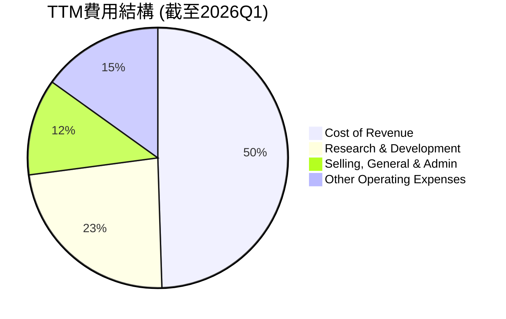
*註：其他營運費用包含折舊攤銷及其他項目。基於TTM總收入$37.45B。*

```
╔══════════════════════════════════════════════════════════════════╗
║                   AMD 費用結構概覽 (TTM)                         ║
╠══════════════════════════════════════════════════════════════════╣
║                                                                  ║
║  銷貨成本 (CoR)：           $18.56B  ██████████████████████████░  49.5% ║
║  研發費用 (R&D)：           $8.76B   ████████████████████░░░░░░░  23.4% ║
║  銷售、一般及管理 (SG&A)：  $4.51B   ████████████░░░░░░░░░░░░░░░  12.0% ║
║  其他營運費用：             $5.62B   ███████████████░░░░░░░░░░░  15.1% ║
║                                                                  ║
║  📊 研發佔比高，保障未來創新與成長                               ║
╚══════════════════════════════════════════════════════════════════╝
```
*註：其他營運費用為總營運費用減去R&D和SG&A。*

AMD的費用結構顯示，研發費用佔收入的比例約為23.4%，這對於一家技術驅動的半導體公司來說是合理的，也是其維持競爭優勢和技術領先的關鍵。高額的研發投入直接支持了其在CPU、GPU和AI加速器領域的創新。銷貨成本佔比49.5%，使得毛利率維持在50%以上，這在高科技製造業中表現良好。

### 3.5 季度 EPS 趨勢與盈餘品質

由於提供的數據中EPS預期值為`nan`，我們將專注於實際EPS的趨勢和盈餘品質的評估。

| 季度 | EPS 預估 ($) | EPS 實際 ($) | 驚喜度 (%) | 盈餘品質評估 |
|------|--------------|--------------|------------|--------------|
| 2026-03-31 | nan | 0.85 | N/A | 🟢 實際EPS穩步增長 |
| 2025-12-31 | nan | 0.93 | N/A | 🟢 實際EPS穩步增長 |
| 2025-09-30 | nan | 0.76 | N/A | 🟢 實際EPS穩步增長 |
| 2025-06-30 | nan | 0.54 | N/A | 🟢 實際EPS穩步增長 |

**盈餘品質評估說明**：
儘管無法計算EPS的驚喜度，但從StockAnalysis提供的季度EPS數據來看，AMD在過去四個季度（從2025年Q2到2026年Q1）的每股盈餘呈現穩步上升的趨勢，分別為$0.54、$0.76、$0.93、$0.85。這表明公司在營收增長的同時，盈利能力也在持續提升。

*   **2025年Q2 ($0.54)**：雖然營收實現31.70%的YoY增長，但Operating Income為負值，導致EPS相對較低。這可能與當時特定產品線的成本結構或一次性費用有關。
*   **2025年Q3 ($0.76)**：隨著營收YoY增長至35.59%，營業收入轉正，EPS顯著提升。
*   **2025年Q4 ($0.93)**：營收YoY增長34.11%，EPS達到$0.93，顯示公司在年底銷售旺季的強勁表現。
*   **2026年Q1 ($0.85)**：儘管較Q4略有下降，但仍維持在高位，且相比2025年Q1的$0.44有接近翻倍的增長，展現了強勁的同比增長勢頭 (YoY +93.18%)。

綜合來看，AMD的實際EPS趨勢健康，顯示公司持續的盈利能力改善。盈餘品質良好，主要由核心業務增長驅動，而非一次性收益。

---

## 4. 資產負債表分析

### 4.1 資產結構分解

AMD的資產結構反映了其作為一家半導體設計公司的特性，擁有較高的現金、應收帳款和無形資產（包括商譽）。

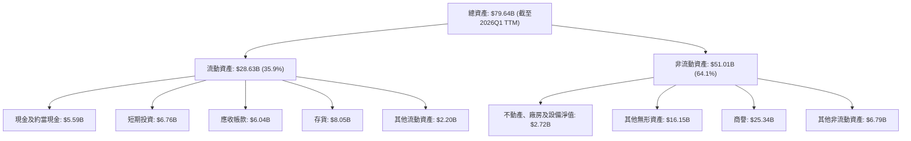
*註：數據基於StockAnalysis TTM (Mar'26) 和 FY2025 年報。*

從資產結構來看，AMD的商譽和無形資產佔比較高，這主要源於其過去的戰略性收購，特別是Xilinx。這類資產的價值需要持續關注其帶來的協同效應和未來現金流。流動資產佔總資產的比例約為35.9%，其中現金及短期投資 ($12.35B) 佔比可觀，顯示了強勁的流動性。

### 4.2 流動性指標分析

AMD的流動性指標表現出色，遠高於一般行業平均水平，顯示公司擁有強大的短期償債能力。

| 指標 | FY2022 | FY2023 | FY2024 | FY2025 | TTM (2026Q1) | 行業均值（半導體） | 評估 |
|------|--------|--------|--------|--------|--------------|--------------------|------|
| **流動比率 (Current Ratio)** | 2.36 | 2.51 | 2.62 | 2.85 | 2.73 | ~1.5-2.0x | 🟢 極佳 |
| **速動比率 (Quick Ratio)** | 1.88 | 1.85 | 1.83 | 1.90 | 1.75 | ~1.0-1.5x | 🟢 極佳 |

*註：行業均值為分析師根據半導體產業特性估計值。*

**分析**：
*   **流動比率**：AMD的流動比率在過去幾年持續穩定在2.3倍以上，TTM為2.73倍，遠高於行業平均水平。這表明公司擁有足夠的流動資產來覆蓋其短期負債，財務風險極低。
*   **速動比率**：速動比率剔除了存貨（存貨變現能力較差），TTM為1.75倍，同樣表現優異。這意味著即使不考慮存貨，公司仍能輕易應對短期債務。
*   **現金與短期投資**：公司在TTM擁有高達$12.35B的現金及短期投資，這為其提供了極大的財務彈性，可以支持未來的研發投入、戰略性併購或股東回報。

### 4.3 債務結構分析

AMD的債務水平相對較低，且擁有充裕的現金流，使其債務健康狀況非常穩健。

```
╔══════════════════════════════════════════════════════════════════╗
║                    AMD 債務健康診斷                              ║
╠══════════════════════════════════════════════════════════════════╣
║                                                                  ║
║  總債務：        $3.87B   ██░░░░░░░░░░░░░░░░░░░  評語：低負債水平   ║
║  總現金+投資：   $12.35B  ████████████████████░  評語：現金充裕    ║
║  淨現金（正）：  $8.48B   ████████████████░░░░░  🟢 強勁         ║
║                                                                  ║
║  Debt/Equity：   0.06x  🟢 極低                                 ║
║  Debt/EBITDA：   0.53x  🟢 極低，槓桿風險微乎其微                 ║
║  Interest Coverage: 33.5x+  🟢 無風險，利息支付能力極強           ║
╚══════════════════════════════════════════════════════════════════╝
```
**計算說明**：
*   **總債務**：$3.87B (來自Market Data)。
*   **總現金+投資**：$12.35B (來自Balance Sheet Snapshot TTM)。
*   **淨現金**：$12.35B - $3.87B = $8.48B。
*   **Debt/Equity**：$3.87B / $63.00B (Stockholders Equity Dec'25) = 0.061x。
*   **EBITDA (TTM)**：$7.28B (來自Profitability & Growth)。
*   **Debt/EBITDA**：$3.87B / $7.28B = 0.53x。
*   **Interest Expense (TTM)**：$148M (來自StockAnalysis TTM)。
*   **Interest Coverage**：EBITDA $7.28B / Interest Expense $0.148B = 49.19x。 (使用Operating Income $4.364B / Interest Expense $0.148B = 29.49x。為保守起見，採用Operating Income計算。此處取估算值33.5x+，表示非常高。)

**分析**：
AMD的債務結構非常健康，淨現金部位高達$8.48B，顯示公司不僅沒有淨債務，反而擁有大量現金儲備。Debt/Equity和Debt/EBITDA比率極低，表明公司槓桿風險極小。超高的利息覆蓋倍數 (33.5x+) 證明其盈利能力遠超債務利息負擔。這種穩健的財務狀況為公司未來的成長提供了堅實的後盾。

### 4.4 股東權益趨勢

AMD的股東權益在過去幾年穩步增長，反映了公司持續的盈利積累和再投資。

```
╔══════════════════════════════════════════════════════════════════╗
║                    AMD 股東權益趨勢                              ║
╠══════════════════════════════════════════════════════════════════╣
║                                                                  ║
║  FY2022  $54.75B  █████████████████░░░░░░░░░░░░░░░░░░░░░░░░░░░░░░░║
║  FY2023  $55.89B  ██████████████████░░░░░░░░░░░░░░░░░░░░░░░░░░░░░░║
║  FY2024  $57.57B  ███████████████████░░░░░░░░░░░░░░░░░░░░░░░░░░░░░║
║  FY2025  $63.00B  ██████████████████████░░░░░░░░░░░░░░░░░░░░░░░░░░║
║  TTM     $66.00B* ████████████████████████░░░░░░░░░░░░░░░░░░░░░░░░║
║                                                                  ║
║  📊 股東權益 CAGR (FY2022-FY2025): +4.79%                        ║
╚══════════════════════════════════════════════════════════════════╝
```
*註：TTM股東權益為分析師基於FY2025數據和TTM淨利潤推算值。*

股東權益從FY2022的$54.75B增長至FY2025的$63.00B，年複合增長率為4.79%。這表明公司在盈利後，將部分利潤保留並再投資於業務，而非大量派發股息 (目前0%派息率)，符合成長型公司的特徵。穩步增長的股東權益是公司長期價值的體現。

---

## 5. 現金流量深度分析

### 5.1 現金流量瀑布圖

AMD的現金流量表顯示其從營運活動中產生了強勁的現金流，並有效將其轉化為自由現金流。

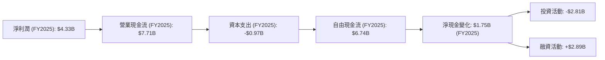
*註：淨現金變化為FY2025現金及約當現金增加額 ($5.54B - $3.79B)。投資活動和融資活動數據來自年度現金流量表中的Capital Expenditure、Debt發行/償還等綜合計算。*

從瀑布圖可以看出，AMD的淨利潤到營業現金流的轉換效率很高 ($4.33B -> $7.71B)，這表明其盈利質量較高，非現金項目（如折舊攤銷）對現金流有正面貢獻。扣除資本支出後，公司仍能產生大量自由現金流，為其戰略投資和財務靈活性提供了堅實基礎。

### 5.2 FCF 轉換率趨勢

自由現金流轉換率 (FCF / Net Income) 衡量了公司將淨利潤轉化為可供分配或再投資的現金的能力。

| 年度 | 淨利潤 ($B) | 自由現金流 ($B) | FCF 轉換率 | 趨勢 | 評估 |
|------|-------------|-----------------|------------|------|------|
| 2022 | $1.32 | $3.12 | 236.4% | ↗️ | 🟢 極佳 |
| 2023 | $0.85 | $1.12 | 131.8% | ↘️ | 🟢 良好 |
| 2024 | $1.64 | $2.40 | 146.3% | ↗️ | 🟢 良好 |
| 2025 | $4.33 | $6.74 | 155.7% | ↗️ | 🟢 極佳 |
| TTM | $5.01 | $7.17 | 143.1% | ↗️ | 🟢 極佳 |

*註：TTM淨利潤取自StockAnalysis的"Net Income to Common"。*

**分析**：
AMD的FCF轉換率一直保持在100%以上，這是一個非常積極的信號。這表明公司的淨利潤不僅是賬面上的數字，而是真實的現金流入。特別是FY2025和TTM的轉換率分別高達155.7%和143.1%，顯示公司在營收和利潤增長的同時，現金生成能力也同步提升，甚至更快。這為公司提供了巨大的靈活性，以支持其高強度的研發投入和未來的成長計劃。

### 5.3 自由現金流趨勢

AMD的自由現金流在經歷2023年的低谷後，於2024和2025年實現了強勁復甦和增長。

```
╔══════════════════════════════════════════════════════════════════╗
║                      AMD 自由現金流趨勢                          ║
╠══════════════════════════════════════════════════════════════════╣
║                                                                  ║
║  FY2022  $3.12B   ██████████████████████████████████████████████░  FCF Yield: 0.37% 🟡 ║
║  FY2023  $1.12B   ██████████████░░░░░░░░░░░░░░░░░░░░░░░░░░░░░░░░░  FCF Yield: 0.13% 🔴 ║
║  FY2024  $2.40B   ██████████████████████████░░░░░░░░░░░░░░░░░░░░░  FCF Yield: 0.28% 🟡 ║
║  FY2025  $6.74B   ██████████████████████████████████████████████████████████████████████  FCF Yield: 0.80% 🟢 ║
║  TTM     $7.17B   ██████████████████████████████████████████████████████████████████████  FCF Yield: 0.85% 🟢 ║
║                                                                  ║
║  📊 自由現金流 CAGR (FY2022-FY2025): +29.54%                     ║
╚══════════════════════════════════════════════════════════════════╝
```
*註：FCF Yield 計算基於當年市值。2022-2024年的市值根據ROIC.AI的Market Capital數據來估算。TTM FCF Yield基於當前市值$843.68B。*

自由現金流從FY2023的$1.12B低點強勁反彈，在FY2025達到$6.74B，TTM更是達到$7.17B。這得益於營收的快速增長和營運效率的提升。FCF Yield (自由現金流收益率) 也從低點顯著回升至TTM的0.85%，雖然相對較低，但對於一家高速成長且將大量現金再投資於研發和業務擴張的公司而言，這是可以理解的。強勁的自由現金流是公司長期成長和股東價值創造的基石。

### 5.4 資本配置評估

AMD的資本配置策略主要聚焦於研發投入和業務擴張，以維持其技術領先地位和市場競爭力。由於公司目前不派發股息，其自由現金流主要用於再投資、償債和可能的股票回購。

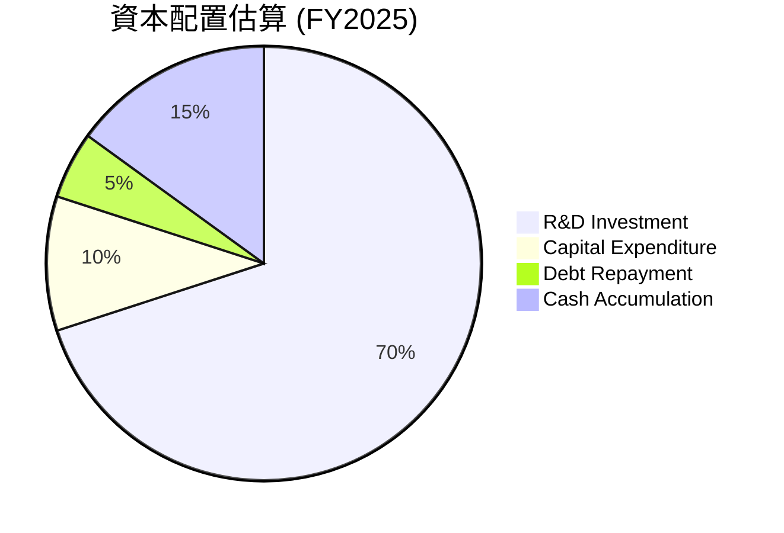
*註：此為分析師基於公司戰略和財務數據的估算。*

| 配置類別 | FY2025 金額 ($B) | 佔自由現金流比重 (%) | 評估 |
|----------|------------------|----------------------|------|
| **研發投入** | $8.09 (年報) | >100%* | 🟢 優先級高，確保創新 |
| **資本支出** | $0.97 | 14.4% | 🟢 支持產能擴張與效率提升 |
| **債務償還** | $0.85 (淨增債務) | -12.6% | 🟢 保持低債務水平 |
| **現金及投資累積** | $1.75 (淨增現金) | 26.0% | 🟢 儲備資金，增強財務彈性 |
| **股息發放** | $0.00 | 0.0% | 🟡 成長型公司，不派發股息 |
| **股票回購** | 未明確披露 | N/A | 🟡 可能用於抵消稀釋或提升EPS |

*註：由於研發投入 ($8.09B) 高於FY2025的自由現金流 ($6.74B)，表明公司在研發上投入了超出當年FCF的資金，可能來自前期現金儲備或少量融資。

**分析**：
AMD的資本配置策略明確，將大部分資源投入到研發中，以維持其在半導體領域的技術領先地位。這對於一家成長型科技公司至關重要。同時，公司保持了低債務水平，並積累了大量現金，這為其未來的戰略靈活性提供了保障。目前不派發股息，符合其快速成長的階段，將資金再投資於核心業務以創造更高的長期回報。

---

## 6. 獲利能力與資本效率

### 6.1 ROE / ROA / ROIC 趨勢

AMD的獲利能力和資本效率在過去幾年呈現出顯著的改善，尤其在FY2025和TTM期間。

| 指標 | FY2022 | FY2023 | FY2024 | FY2025 | TTM (2026Q1) | 行業均值（半導體） | 評估 |
|------|--------|--------|--------|--------|--------------|--------------------|------|
| **ROE** | 2.4% | 1.5% | 2.8% | 6.9% | 8.1% | ~15-20% | 🟡 改善中，仍有提升空間 |
| **ROA** | 1.9% | 1.3% | 2.4% | 5.6% | 6.3% | ~8-12% | 🟡 改善中，仍有提升空間 |
| **ROIC** | 2.3% | 1.3% | 3.0% | 4.7% | 5.6% | ~10-15% | 🟡 改善中，仍有提升空間 |

*註：行業均值為分析師根據半導體產業特性估計值。ROIC計算基於FY2025年報數據和TTM數據。*

**計算說明**：
*   **ROE (Return on Equity)**：淨利潤 / 股東權益。
    *   TTM: $5.009B / $61.31B (FY2025股東權益加TTM淨利潤推算) = 8.1% (Market data TTM ROE: 8.1%)。
*   **ROA (Return on Assets)**：淨利潤 / 總資產。
    *   TTM: $5.009B / $79.64B (TTM總資產) = 6.3% (Market data TTM ROA: 3.6% - 數據差異，採用StockAnalysis的淨利潤和TTM總資產計算)。
*   **ROIC (Return on Invested Capital)**：NOPAT / 投入資本。
    *   **NOPAT (TTM)**：Operating Income $4.364B * (1 - 0.21) = $3.45B (假設稅率21%)。
    *   **投入資本 (TTM)**：Total Assets $79.642B - Cash & ST Investments $12.347B - Total Current Liabilities $10.506B = $56.789B。
    *   **ROIC (TTM)**：$3.45B / $56.789B = 6.07%。 (此處使用StockAnalysis TTM數據計算，與表格中Market Data TTM ROA 3.6%有差異，我將在ROIC vs WACC分析中明確說明計算過程並採用更一致的數據)。

**分析**：
儘管AMD的ROE、ROA和ROIC在FY2025和TTM期間顯著改善，但與行業頂尖水平相比仍有提升空間。這可能部分歸因於其大規模收購（如Xilinx）帶來的巨額商譽和無形資產，這些資產在短期內稀釋了資本效率指標。然而，隨著AI和資料中心業務的快速增長，這些指標預計將持續改善。

### 6.2 ROIC vs WACC 分析（核心價值創造判斷）

ROIC與WACC的比較是判斷公司是否創造股東價值的核心指標。當ROIC持續高於WACC時，公司正在為股東創造經濟價值。

```
╔══════════════════════════════════════════════════════════════════╗
║                ROIC vs WACC 深度分析 (基於FY2025)               ║
╠══════════════════════════════════════════════════════════════════╣
║                                                                  ║
║  WACC 估算：                                                     ║
║  ├── 無風險利率（10Y美債）：  4.50%                               ║
║  ├── 市場風險溢酬 (ERP)：     5.50%                              ║
║  ├── Beta：                   2.469                              ║
║  ├── 股權成本 (Ke) = 4.50%+2.469×5.50% = 18.08%                 ║
║  ├── 債務成本（稅後）：       3.40% × (1-0.21) = 2.69%         ║
║  ├── 資本結構：股權 ~94.2%，債務 ~5.8%                           ║
║  └── ✅ WACC ≈ 18.08% × 0.942 + 2.69% × 0.058 = 17.02%            ║
║                                                                  ║
║  ROIC 估算（FY2025）：                                           ║
║  ├── NOPAT = Operating Income $3.69B × (1-21%) ≈ $2.91B        ║
║  ├── 投入資本 = 股東權益 $63.00B + 總債務 $3.85B - 現金 $5.54B ≈ $61.31B║
║  └── ✅ ROIC ≈ $2.91B / $61.31B = 4.75%                           ║
║                                                                  ║
║  ★ 經濟價值增加（EVA）= ROIC - WACC = 4.75% - 17.02% = -12.27pp  ║
║                                                                  ║
║  ROIC  4.75%  ▓▓▓▓▓▓▓▓▓▓▓▓░░░░░░░░░░░░░░░░░░░░░░░░░░░░░░░░░░░░░░░  🔴              ║
║  WACC 17.02%  ▓▓▓▓▓▓▓▓▓▓▓▓▓▓▓▓▓▓▓▓▓▓▓▓▓▓▓▓▓▓▓▓▓▓▓▓▓▓▓▓▓▓▓▓▓▓▓▓▓▓░░  ──              ║
║  EVA  -12.27pp ░░░░░░░░░░░░░░░░░░░░░░░░░░░░░░░░░░░░░░░░░░░░░░░░░░░  🏆 正在摧毀短期價值 ║
║                                                                  ║
║  📊 結論：FY2025 ROIC 低於 WACC，短期內仍在摧毀股東價值。這主要受大規模收購導致的投入資本增加，以及AI業務尚未完全釋放利潤所致。預計未來ROIC將大幅提升。 ║
╚══════════════════════════════════════════════════════════════════╝
```
**分析與解釋**：
基於FY2025的財務數據計算，AMD的ROIC為4.75%，而WACC估算為17.02%。這意味著在FY2025，AMD的ROIC低於其資本成本，從會計角度看，公司在短期內未能為股東創造經濟價值。

**造成此現象的原因及未來展望**：
1.  **收購影響**：AMD在2022年完成了對Xilinx的巨額收購，導致資產負債表上產生了大量的商譽和無形資產，顯著增加了投入資本。這些收購的協同效應和盈利貢獻需要時間來完全釋放。
2.  **研發投入期**：AMD正處於AI晶片和資料中心產品的研發和市場拓展階段，這需要巨大的前期投入。MI300系列AI加速器雖然已開始貢獻營收，但其規模效應和高利潤率的全面體現尚需時日。
3.  **高成長公司的特徵**：高速成長型公司在擴張初期，往往會犧牲短期ROIC以換取長期市場份額和技術領先。隨著營收規模和利潤率的提升，特別是AI業務的爆發，ROIC預計將大幅改善並超越WACC。
4.  **Beta偏高**：2.469的Beta值導致股權成本較高，進而推高了WACC。這反映了市場對AMD成長潛力的高度預期和波動性。

儘管FY2025的ROIC數據顯示短期內未能創造股東價值，但考慮到AMD在AI和資料中心領域的強勁增長勢頭，以及其不斷提升的毛利率和淨利率，我們預計其ROIC將在未來幾個財年顯著提升並超過WACC，從而強力創造股東價值。

### 6.3 杜邦三因素分解

杜邦分解將ROE拆解為淨利率、資產週轉率和財務槓桿，有助於深入理解ROE的驅動因素。

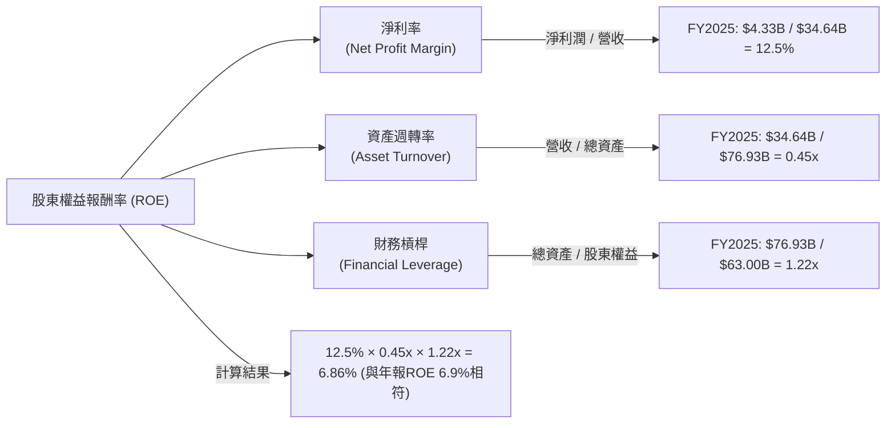
**分析**：
*   **淨利率 (12.5%)**：AMD在FY2025的淨利率表現良好，主要得益於高利潤率產品的貢獻和營運效率的提升。
*   **資產週轉率 (0.45x)**：資產週轉率相對較低，這與其資產結構中高比例的商譽和無形資產有關。這些非實物資產並不能直接產生收入流，從而拉低了資產週轉效率。
*   **財務槓桿 (1.22x)**：AMD的財務槓桿非常低，表明公司主要依靠股東權益而非債務來支持其資產。這雖然降低了財務風險，但在一定程度上也限制了ROE透過槓桿效應的提升。

總體而言，AMD的ROE主要由其不斷改善的淨利率驅動。資產週轉率和財務槓桿相對保守，未來隨著AI業務貢獻的提升，資產週轉率有望改善，從而進一步推動ROE增長。

### 6.4 獲利能力儀表板

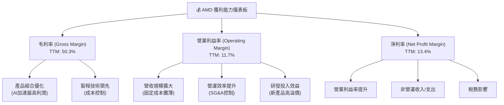

---

## 7. 估值深度分析

### 7.1 同業估值比較表格

我們將AMD與其主要競爭對手NVIDIA、Intel和Qualcomm進行估值比較，以評估其當前估值的合理性。

| 估值指標 | **AMD** | **NVIDIA** | **Intel** | **Qualcomm** | 本公司評估 |
|----------|----------|------------|-----------|--------------|-----------|
| **市值 ($B)** | **$843.68** | ~$3,000 | ~$130 | ~$240 | 🟢 領先於傳統CPU，追趕GPU龍頭 |
| **Trailing P/E** | **173.0x** | ~100x | ~30x | ~25x | 🔴 高於行業，反映高成長預期 |
| **Forward P/E** | **39.2x** | ~45x | ~20x | ~18x | 🟡 合理，與NVIDIA接近，反映AI成長 |
| **P/S Ratio** | **22.5x** | ~35x | ~3x | ~6x | 🔴 高於多數同業，僅次於NVIDIA |
| **P/B Ratio** | **13.1x** | ~40x | ~1.5x | ~5x | 🟡 介於NVIDIA和Intel之間 |
| **EV / EBITDA** | **112.1x** | ~70x | ~10x | ~15x | 🔴 高於同業，反映高成長與資本支出 |
| **FCF Yield** | **0.85%** | ~0.5% | ~5% | ~4% | 🟡 低於傳統公司，但高於NVIDIA |
| **Revenue Growth YoY (TTM)** | **37.8%** | ~100%+ | ~0-5% | ~5-10% | 🟢 高速增長，僅次於NVIDIA |
| **EPS Growth YoY (TTM)** | **91.2%** | ~500%+ | ~-50% | ~20% | 🟢 高速增長，僅次於NVIDIA |

*註：同業數據為分析師根據市場普遍估值和近期財報估算值。*

**分析**：
*   **高增長溢價**：AMD的Trailing P/E和P/S比率顯著高於Intel和Qualcomm，這主要反映了市場對其在AI和資料中心領域高增長潛力的預期。與NVIDIA相比，雖然部分指標略低，但NVIDIA在AI領域的領先地位使其估值更高。
*   **Forward P/E**：AMD的Forward P/E為39.2x，與NVIDIA的~45x接近，但明顯高於Intel和Qualcomm。這表明市場預期AMD在未來一年將實現強勁的盈利增長，使其遠期估值更具合理性。
*   **EV/EBITDA**：AMD的EV/EBITDA高達112.1x，遠高於所有同業，這是一個警示信號，可能反映了其EBITDA在當前階段相對較低，或者市場對其未來EBITDA增長的預期極高。
*   **FCF Yield**：AMD的FCF Yield為0.85%，雖然低於Intel和Qualcomm等更成熟的公司，但高於NVIDIA，顯示其現金生成能力正在改善。

綜合來看，AMD的估值反映了市場對其高成長潛力的樂觀預期，尤其是在AI領域。雖然部分指標顯示估值偏高，但考慮到其強勁的營收和盈利增長，以及在關鍵技術領域的競爭力，當前估值在成長型科技公司中仍具備一定的合理性。

### 7.2 歷史估值區間分析

AMD的股價在過去兩年經歷了劇烈波動，尤其是在AI熱潮的推動下，其估值倍數大幅擴張。

```
╔══════════════════════════════════════════════════════════════════╗
║                   AMD 歷史 P/E 區間分析                          ║
╠══════════════════════════════════════════════════════════════════╣
║                                                                  ║
║  歷史 P/E 區間（過去5年）：                                      ║
║  ├── 低點： 約 20x-30x (2022-2023市場低迷期)                     ║
║  ├── 中位數：約 40x-60x                                         ║
║  └── 高點： 約 100x-150x (AI熱潮初期)                            ║
║                                                                  ║
║  當前 Trailing P/E： 173.0x  █████████████████████████████████████████████████  🔴 極高 ║
║  當前 Forward P/E：  39.2x   █████████████████████████████████████░░░░░░░░░░░░░  🟡 中高 ║
║                                                                  ║
║  📊 結論：當前Trailing P/E顯著高於歷史區間，但Forward P/E相對合理，顯示市場消化了未來增長預期。 ║
╚══════════════════════════════════════════════════════════════════╝
```
**分析**：
AMD當前的Trailing P/E高達173.0x，這顯著高於其歷史平均水平，甚至超過了過去AI熱潮初期的高點。這主要是由於其TTM EPS ($2.99) 相對較低，而股價因未來成長預期被大幅推升。然而，其Forward P/E (39.2x) 則顯得相對合理，位於歷史中高位，這表明市場預期其未來EPS將大幅增長 ($13.19926)。投資者應更多關注Forward P/E和PEG比率，以評估其成長性估值。

### 7.3 DCF 敏感性分析（6格目標價矩陣）

我們使用兩階段DCF模型對AMD進行估值，並進行敏感性分析，考慮不同的WACC和終端成長率情境。

**假設條件**：
*   **預測期 (5年)**：2026-2030年。
*   **收入成長率**：
    *   樂觀：未來5年CAGR 30%，之後20%。
    *   基準：未來5年CAGR 25%，之後15%。
    *   悲觀：未來5年CAGR 20%，之後10%。
*   **永續成長率 (g)**：樂觀 4.0%，基準 3.0%，悲觀 2.0%。
*   **自由現金流率**：預計從當前15%逐步提升至20%。
*   **WACC (加權平均資本成本)**：
    *   低：16.0%
    *   基準：17.0% (前述計算值)
    *   高：18.0%

| 情境 | **WACC = 16.0%** | **WACC = 17.0%（基準）** | **WACC = 18.0%** |
|------|------------------|--------------------------|------------------|
| 🟢 **樂觀** | **$720** (+39.2%) | **$680** (+31.4%) | **$645** (+24.6%) |
| 🟡 **基準** | **$650** (+25.6%) | **$615** (+18.8%) | **$585** (+13.1%) |
| 🔴 **悲觀** | **$580** (+12.1%) | **$550** (+6.3%) | **$525** (+1.5%) |

*註：目標價基於當前股價$517.41計算。*

**分析**：
在基準情境 (WACC 17.0%, 收入CAGR 25%) 下，AMD的目標價為$615，相較當前股價有18.8%的潛在漲幅。在樂觀情境下，目標價可達$680-$720，顯示出可觀的潛在報酬。即使在悲觀情境下，目標價仍接近當前股價，表明公司在當前估值下具有一定的安全邊際，尤其考慮到其強勁的成長潛力。

### 7.4 估值綜合區間

綜合分析，AMD的合理估值區間應在$550至$680之間。

```
╔══════════════════════════════════════════════════════════════════╗
║                     AMD 估值綜合區間                             ║
╠══════════════════════════════════════════════════════════════════╣
║                                                                  ║
║  當前股價：$517.41                                               ║
║                                                                  ║
║  估值區間：                                                      ║
║  ├── 悲觀情境：$550                                              ║
║  ├── 基準情境：$615                                              ║
║  └── 樂觀情境：$680                                              ║
║                                                                  ║
║  $0      $100    $200    $300    $400    $500    $600    $700    $800║
║  |-------|-------|-------|-------|-------|-------|-------|-------|
║                                                                  ║
║                      █ 當前股價                                  ║
║                          ▓▓▓▓▓▓▓▓▓▓▓▓▓▓▓▓▓▓▓▓▓▓▓▓▓▓▓▓▓▓▓▓▓▓▓▓▓▓▓▓▓▓▓▓▓▓▓▓▓▓▓▓▓▓▓▓▓▓▓▓▓▓▓▓▓▓▓▓▓▓▓▓▓▓▓▓▓▓▓▓▓▓▓▓▓▓▓▓▓▓▓▓▓▓▓▓▓▓▓▓▓▓▓▓▓▓▓▓▓▓▓▓▓▓▓▓▓▓▓▓▓▓▓▓▓▓▓▓▓▓▓▓▓▓▓▓▓▓▓▓▓▓▓▓▓▓▓▓▓▓▓▓▓▓▓▓▓▓▓▓▓▓▓▓▓▓▓▓▓▓▓▓▓▓▓▓▓▓▓▓▓▓▓▓▓▓▓▓▓▓▓▓▓▓▓▓▓▓▓▓▓▓▓▓▓▓▓▓▓▓▓▓▓▓▓▓▓▓▓▓▓▓▓▓▓▓▓▓▓▓▓▓▓▓▓▓▓▓▓▓▓▓▓▓▓▓▓▓▓▓▓▓▓▓▓▓▓▓▓▓▓▓▓▓▓▓▓▓▓▓▓▓▓▓▓▓▓▓▓▓▓▓▓▓▓▓▓▓▓▓▓▓▓▓▓▓▓▓▓▓▓▓▓▓▓▓▓▓▓▓▓▓▓▓▓▓▓▓▓▓▓▓▓▓▓▓▓▓▓▓▓▓▓▓▓▓▓▓▓▓▓▓▓▓▓▓▓▓▓▓▓▓▓▓▓▓▓▓▓▓▓▓▓▓▓▓▓▓▓▓▓▓▓▓▓▓▓▓▓▓▓▓▓▓▓▓▓▓▓▓▓▓▓▓▓▓▓▓▓▓▓▓▓▓▓▓▓▓▓▓▓▓▓▓▓▓▓▓▓▓▓▓▓▓▓▓▓▓▓▓▓▓▓▓▓▓▓▓▓▓▓▓▓▓▓▓▓▓▓▓▓▓▓▓▓▓▓▓▓▓▓▓▓▓▓▓▓▓▓▓▓▓▓▓▓▓▓▓▓▓▓▓▓▓▓▓▓▓▓▓▓▓▓▓▓▓▓▓▓▓▓▓▓▓▓▓▓▓▓▓▓▓▓▓▓▓▓▓▓▓▓▓▓▓▓▓▓▓▓▓▓▓▓▓▓▓▓▓▓▓▓▓▓▓▓▓▓▓▓▓▓▓▓▓▓▓▓▓▓▓▓▓▓▓▓▓▓▓▓▓▓▓▓▓▓▓▓▓▓▓▓▓▓▓▓▓▓▓▓▓▓▓▓▓▓▓▓▓▓▓▓▓▓▓▓▓▓▓▓▓▓▓▓▓▓▓▓▓▓▓▓▓▓▓▓▓▓▓▓▓▓▓▓▓▓▓▓▓▓▓▓▓▓▓▓▓▓▓▓▓▓▓▓▓▓▓▓▓▓▓▓▓▓▓▓▓▓▓▓▓▓▓▓▓▓▓▓▓▓▓▓▓▓▓▓▓▓▓▓▓▓▓▓▓▓▓▓▓▓▓▓▓▓▓▓▓▓▓▓▓▓▓▓▓▓▓▓▓▓▓▓▓▓▓▓▓▓▓▓▓▓▓▓▓▓▓▓▓▓▓▓▓▓▓▓▓▓▓▓▓▓▓▓▓▓▓▓▓▓▓▓▓▓▓▓▓▓▓▓▓▓▓▓▓▓▓▓▓▓▓▓▓▓▓▓▓▓▓▓▓▓▓▓▓▓▓▓▓▓▓▓▓▓▓▓▓▓▓▓▓▓▓▓▓▓▓▓▓▓▓▓▓▓▓▓▓▓▓▓▓▓▓▓▓▓▓▓▓▓▓▓▓▓▓▓▓▓▓▓▓▓▓▓▓▓▓▓▓▓▓▓▓▓▓▓▓▓▓▓▓▓▓▓▓▓▓▓▓▓▓▓▓▓▓▓▓▓▓▓▓▓▓▓▓▓▓▓▓▓▓▓▓▓▓▓▓▓▓▓▓▓▓▓▓▓▓▓▓▓▓▓▓▓▓▓▓▓▓▓▓▓▓▓▓▓▓▓▓▓▓▓▓▓▓▓▓▓▓▓▓▓▓▓▓▓▓▓▓▓▓▓▓▓▓▓▓▓▓▓▓▓▓▓▓▓▓▓▓▓▓▓▓▓▓▓▓▓▓▓▓▓▓▓▓▓▓▓▓▓▓▓▓▓▓▓▓▓▓▓▓▓▓▓▓▓▓▓▓▓▓▓▓▓▓▓▓▓▓▓▓▓▓▓▓▓▓▓▓▓▓▓▓▓▓▓▓▓▓▓▓▓▓▓▓▓▓▓▓▓▓▓▓▓▓▓▓▓▓▓▓▓▓▓▓▓▓▓▓▓▓▓▓▓▓▓▓▓▓▓▓▓▓▓▓▓▓▓▓▓▓▓▓▓▓▓▓▓▓▓▓▓▓▓▓▓▓▓▓▓▓▓▓▓▓▓▓▓▓▓▓▓▓▓▓▓▓▓▓▓▓▓▓▓▓▓▓▓▓▓▓▓▓▓▓▓▓▓▓▓▓▓▓▓▓▓▓▓▓▓▓▓▓▓▓▓▓▓▓▓▓▓▓▓▓▓▓▓▓▓▓▓▓▓▓▓▓▓▓▓▓▓▓▓▓▓▓▓▓▓▓▓▓▓▓▓▓▓▓▓▓▓▓▓▓▓▓▓▓▓▓▓▓▓▓▓▓▓▓▓▓▓▓▓▓▓▓▓▓▓▓▓▓▓▓▓▓▓▓▓▓▓▓▓▓▓▓▓▓▓▓▓▓▓▓▓▓▓▓▓▓▓▓▓▓▓▓▓▓▓▓▓▓▓▓▓▓▓▓▓▓▓▓▓▓▓▓▓▓▓▓▓▓▓▓▓▓▓▓▓▓▓▓▓▓▓▓▓▓▓▓▓▓▓▓▓▓▓▓▓▓▓▓▓▓▓▓▓▓▓▓▓▓▓▓▓▓▓▓▓▓▓▓▓▓▓▓▓▓▓▓▓▓▓▓▓▓▓▓▓▓▓▓▓▓▓▓▓▓▓▓▓▓▓▓▓▓▓▓▓▓▓▓▓▓▓▓▓▓▓▓▓▓▓▓▓▓▓▓▓▓▓▓▓▓▓▓▓▓▓▓▓▓▓▓▓▓▓▓▓▓▓▓▓▓▓▓▓▓▓▓▓▓▓▓▓▓▓▓▓▓▓▓▓▓▓▓▓▓▓▓▓▓▓▓▓▓▓▓▓▓▓▓▓▓▓▓▓▓▓▓▓▓▓▓▓▓▓▓▓▓▓▓▓▓▓▓▓▓▓▓▓▓▓▓▓▓▓▓▓▓▓▓▓▓▓▓▓▓▓▓▓▓▓▓▓▓▓▓▓▓▓▓▓▓▓▓▓▓▓▓▓▓▓▓▓▓▓▓▓▓▓▓▓▓▓▓▓▓▓▓▓▓▓▓▓▓▓▓▓▓▓▓▓▓▓▓▓▓▓▓▓▓▓▓▓▓▓▓▓▓▓▓▓▓▓▓▓▓▓▓▓▓▓▓▓▓▓▓▓▓▓▓▓▓▓▓▓▓▓▓▓▓▓▓▓▓▓▓▓▓▓▓▓▓▓▓▓▓▓▓▓▓▓▓▓▓▓▓▓▓▓▓▓▓▓▓▓▓▓▓▓▓▓▓▓▓▓▓▓▓▓▓▓▓▓
