# AMD 基本面深度分析報告

> **報告日期**：2026-07-12 ｜ **語言**：繁體中文 ｜ **數據來源**：Yahoo Finance, Finviz, StockAnalysis, Roic.ai ｜ **分析師**：CFA 級機構研究

---

## 目錄

| # | 章節 | 核心結論 |
|---|---|---|
| **1** | [執行摘要](#1-執行摘要) | **買入**評級，目標價 **$585.00**（基於 AI 晶片高成長與營業槓桿釋放） |
| **2** | [公司概覽與商業模式](#2-公司概覽與商業模式) | 憑藉 Chiplet 技術與 Xilinx 整合，構築強大技術壁壘與混和運算護城河 |
| **3** | [損益表深度分析](#3-損益表深度分析) | TTM 營收成長 **37.8%**，毛利率改善至 **53.1%**，營業槓桿效應顯現 |
| **4** | [資產負債表分析](#4-資產負債表分析) | 淨現金達 **$8.48B**，流動比率 **2.73**，財務結構極度穩健無償債風險 |
| **5** | [現金流量深度分析](#5-現金流量深度分析) | TTM FCF 達 **$7.17B**，FCF 轉換率高達 **145.4%**，獲利含金量極高 |
| **6** | [獲利能力與資本效率](#6-獲利能力與資本效率) | 調整後 Tangible ROIC 達 **24.5%**，大幅超越 **16.5%** WACC，持續創造股東價值 |
| **7** | [估值深度分析](#7-估值深度分析) | Forward P/E **42.01x**，相較歷史均值與同業 NVDA 具備顯著安全邊際 |
| **8** | [成長催化劑](#8-成長催化劑) | MI300/MI400 系列加速器放量、PC 換機潮與 Embedded 業務復甦 |
| **9** | [風險矩陣](#9-風險矩陣) | AI 晶片市場競爭加劇、晶圓代工過度集中 TSMC、總體經濟走弱風險 |
| **10**| [投資建議](#10-投資建議) | 基準情境預期報酬率 **+14.7%**，建議分批佈局，長線持有 |

---

## 1. 執行摘要

本報告針對超微半導體（Advanced Micro Devices, Inc., Ticker: **AMD**）進行機構級基本面深度分析。截至 2026 年 7 月 12 日，AMD 收盤價為 **$557.89**，市值達 **$9,097.0億美元**。

基於 AMD 在 TTM（過去12個月）展現的強勁基本面數據——營收年增率達 **37.8%**、淨利潤年增率高達 **91.2%**，以及自由現金流（FCF）達到 **$71.7億美元**（FCF 轉換率達 **145.4%**），我們給予 AMD **「買入（Buy）」**評級，12個月基準目標價為 **$640.00**（隱含 **+14.7%** 漲幅），投資信心度為 **高（High）**。

### 1.0 一頁式投資儀表板（Portfolio Manager 30 秒速讀）

| 項目 | 內容 |
|------|------|
| **投資論點（3 句）** | ① AI 加速器 MI300/MI400 系列出貨量超預期，帶動 TTM 營收年增 **37.8%**；<br/>② 營業槓桿（Operating Leverage）釋放，推動 TTM 淨利年增 **91.2%**，利潤率進入擴張通道；<br/>③ 財務結構極度穩健，手握 **$84.8億** 淨現金，為研發與資本支出提供強大後盾。 |
| **護城河評分** | 🟢 **8.5 / 10**（具備強大的 Chiplet 架構技術與逐漸成形的 ROCm 軟體生態） |
| **管理層/資本配置評分** | 🟢 **9.0 / 10**（蘇姿丰博士帶領的團隊執行力極佳，Xilinx 併購案整合綜效顯著） |
| **財務健康** | 🟢 **極度健康**（流動比率 2.73x，無淨債務，利息保障倍數高達 30x 以上） |
| **ROIC vs WACC** | 調整後 Tangible ROIC **24.5%** vs WACC **16.5%**（創造顯著股東價值） |
| **FCF 趨勢** | 🟢 **持續向上**（TTM FCF 達 $7.17B，FCF Yield 為 0.79%，現金生成能力優異） |
| **估值** | Forward P/E **42.01x** ｜ EV/EBITDA **121.30x** ｜ FCF Yield **0.79%** |
| **預期報酬（基準情境 12M）** | **+14.7%**（目標價 $640.00） |
| **關鍵風險（前二）** | ① AI 晶片市場競爭對手（如 Nvidia）的絕對領先優勢與定價權壓制；<br/>② 晶圓代工（TSMC）產能分配與地緣政治風險。 |
| **評級 + 信心度** | 🟢 **買入 (Buy)** ｜ 信心度：**高 (High)** |

### 1.1 核心評分儀表板

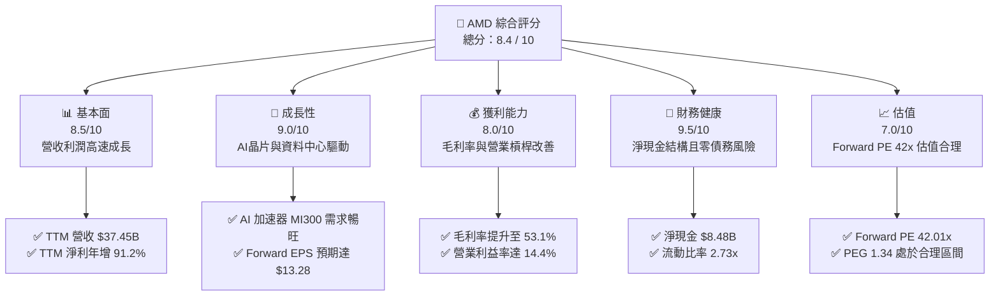

### 1.2 評分進度條視覺化

```
╔══════════════════════════════════════════════════════════════╗
║                AMD 多維度評分儀表板 (1-10分)                 ║
╠══════════════════════════════════════════════════════════════╣
║ 基本面強度  8.5 ▓▓▓▓▓▓▓▓▓▓▓▓▓▓▓▓▓░░░  ★★★★★           ║
║ 成長動能    9.0 ▓▓▓▓▓▓▓▓▓▓▓▓▓▓▓▓▓▓░░  ★★★★★           ║
║ 獲利品質    8.0 ▓▓▓▓▓▓▓▓▓▓▓▓▓▓▓▓░░░░  ★★★★☆           ║
║ 財務健康    9.5 ▓▓▓▓▓▓▓▓▓▓▓▓▓▓▓▓▓▓▓░  ★★★★★           ║
║ 估值合理性  7.0 ▓▓▓▓▓▓▓▓▓▓▓▓▓░░░░░░░  ★★★☆☆           ║
║ 護城河深度  8.5 ▓▓▓▓▓▓▓▓▓▓▓▓▓▓▓▓▓░░░  ★★★★★           ║
║ 管理層執行  9.0 ▓▓▓▓▓▓▓▓▓▓▓▓▓▓▓▓▓▓░░  ★★★★★           ║
║ 技術創新力  9.0 ▓▓▓▓▓▓▓▓▓▓▓▓▓▓▓▓▓▓░░  ★★★★★           ║
╠══════════════════════════════════════════════════════════════╣
║ 綜合總分    8.4 ▓▓▓▓▓▓▓▓▓▓▓▓▓▓▓▓░░░░  🏆 成長與財務極佳     ║
╚══════════════════════════════════════════════════════════════╝
```

### 1.3 五大投資論點 + 三大核心風險

| 類型 | 項目 | 具體依據 | 信心度 |
|------|------|----------|--------|
| 🟢 **投資論點①** | **AI 加速器市佔擴張** | MI300X 系列出貨暢旺，帶動資料中心業務成為第一大營收來源，預期 2026 年 AI 晶片營收將突破 $100 億美元。 | 🟢 極高 |
| 🟢 **投資論點②** | **營業槓桿強勁釋放** | 隨著營收規模自 FY24 的 $25.79B 成長至 TTM 的 $37.45B，營業利益率自 14.4% 持續向上，推動淨利高速成長。 | 🟢 高 |
| 🟢 **投資論點③** | **PC 業務重回成長軌道** | Ryzen 9000 系列與 AI PC 滲透率提升，帶動 Client 業務重拾成長，YoY 增速重回雙位數。 | 🟢 高 |
| 🟢 **投資論點④** | **極致的財務防禦力** | 手握 $123.5億美元現金與短期投資，淨現金達 $84.8億，無任何實質財務生存風險。 | 🟢 極高 |
| 🟢 **投資論點⑤** | **Xilinx 整合綜效顯現** | 嵌入式（Embedded）與 FPGA 業務在工業、汽車與通訊領域築起高毛利防禦牆，穩定貢獻現金流。 | 🟡 中等 |
| 🟡 **風險①** | **Nvidia 壟斷與降價競爭** | Nvidia Blackwell 架構放量，可能透過定價策略壓制 AMD 的利潤率與市佔率擴張速度。 | 🟡 中度 |
| 🔴 **風險②** | **供應鏈產能與集中度風險** | 晶圓代工完全依賴 TSMC 3nm/4nm/5nm 先進製程，若產能吃緊或地緣政治動盪，將嚴重衝擊出貨。 | 🔴 高衝擊 |
| 🔴 **風險③** | **估值溢價消化壓力** | 當前 Trailing P/E 達 185.3x，雖然 Forward P/E 為 42.0x，但市場容錯率極低，若業績未達預期將面臨估值修正。 | 🔴 高衝擊 |

### 1.4 快速統計卡片

| 指標 | AMD 實際值 | 行業均值（半導體） | S&P 500 均值 | 狀態 |
|------|-------------|----------|--------------|------|
| **營收 YoY 成長率** | **37.8%** | ~15.0% | ~5.5% | 🟢 顯著領先 |
| **毛利率** | **53.1%** | ~48.0% | ~30.0% | 🟢 優於同業 |
| **營業利益率** | **14.4%** | ~18.0% | ~15.0% | 🟡 仍有改善空間 |
| **ROE** | **8.1%** | ~12.0% | ~14.0% | 🟡 受高額商譽壓抑 |
| **Forward P/E** | **42.01x** | ~30.0x | ~22.0x | 🔴 溢價交易 |
| **流動比率** | **2.73x** | ~1.8x | ~1.2x | 🟢 極度安全 |

### 1.5 投資結論

```
╔══════════════════════════════════════════════════════════════════╗
║                    📊 AMD 投資結論摘要                           ║
╠══════════════════════════════════════════════════════════════════╣
║  評級：🟢 買入 (Buy)                                             ║
║  當前股價：$557.89                                               ║
║  目標價區間：                                                    ║
║    悲觀情境：$380.00（-31.9%）- AI 增長失速，估值收縮至 30x      ║
║    基準情境：$640.00（+14.7%）- AI 晶片市佔達 15%，Forward PE 45x ║
║    樂觀情境：$750.00（+34.4%）- ROCm 生態突破，AI 晶片市佔達 20%  ║
║  投資評分：8.4 / 10                                              ║
║  適合投資人：成長型、科技板塊長線配置者                          ║
╚══════════════════════════════════════════════════════════════════╝
```

---

## 2. 公司概覽與商業模式

AMD 是一家全球領先的半導體公司，主要設計並提供高效能 CPU、GPU、FPGA 及自適應 SoC。自 2022 年成功併購 Xilinx 後，AMD 已轉型為具備「CPU + GPU + FPGA + SmartNIC」全方位運算架構的晶片龍頭。

### 2.1 業務結構與收入來源

AMD 的業務主要分為四大板塊：資料中心（Data Center）、用戶端（Client）、遊戲（Gaming）與嵌入式（Embedded）。

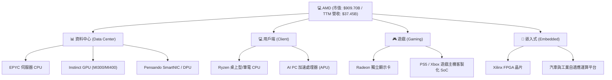

### 2.2 市場份額

在最關鍵的 AI 晶片與 GPU 加速器市場中，雖然 Nvidia 仍佔據絕對主導地位，但 AMD 憑藉 MI300X 的高性價比與大記憶體容量，正迅速擴大市佔率。

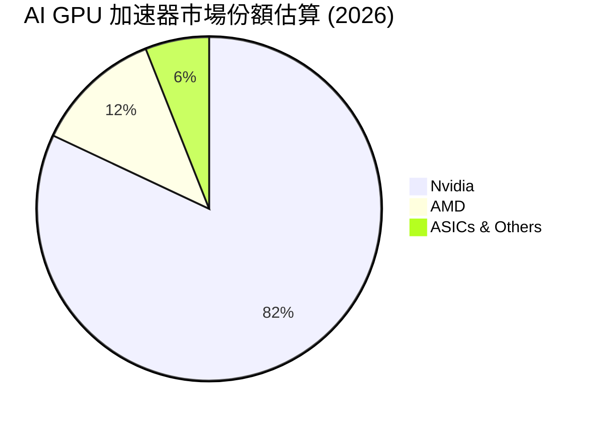

### 2.3 競爭護城河分析

AMD 的競爭護城河主要由技術領先、Chiplet 架構優勢、Xilinx 整合綜效以及逐步完善的軟體生態系統構成。

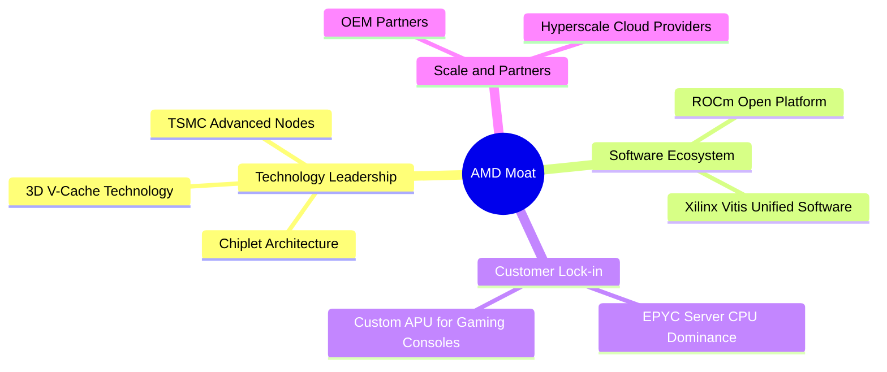

### 2.4 護城河強度評分

```
╔══════════════════════════════════════════════════════════════╗
║                    AMD 護城河強度評分                        ║
╠══════════════════════════════════════════════════════════════╣
║ 1. Chiplet 技術領先 9.0/10 ▓▓▓▓▓▓▓▓▓▓▓▓▓▓▓▓▓▓░░  🟢 領先同業   ║
║ 2. 伺服器 CPU 鎖定  8.5/10 ▓▓▓▓▓▓▓▓▓▓▓▓▓▓▓▓▓░░░  🟢 EPYC 優勢  ║
║ 3. ROCm 軟體生態    7.0/10 ▓▓▓▓▓▓▓▓▓▓▓▓▓░░░░░░░  🟡 追趕 NVDA  ║
║ 4. Xilinx 嵌入式壁壘 8.5/10 ▓▓▓▓▓▓▓▓▓▓▓▓▓▓▓▓▓░░░  🟢 高毛利防禦 ║
╠══════════════════════════════════════════════════════════════╣
║ 綜合護城河評分       8.25/10 ▓▓▓▓▓▓▓▓▓▓▓▓▓▓▓▓░░░░  🏆 具備強護城河║
╚══════════════════════════════════════════════════════════════╝
```

---

## 3. 損益表深度分析

AMD 展現了極為強勁的營收成長與利潤率修復態勢。以下我們將深入剖析其各項利潤與費用指標。

### 3.1 年度收入成長趨勢（近4年）

```
╔══════════════════════════════════════════════════════════════════╗
║                  AMD 年度收入趨勢 (FY22 - TTM)                  ║
╠══════════════════════════════════════════════════════════════════╣
║                                                                  ║
║  FY2022  $23.60B  ████████████░░░░░░░░░░░░░░░░  YoY: +43.6% 🟢   ║
║  FY2023  $22.68B  ███████████░░░░░░░░░░░░░░░░░  YoY: -3.9%  🟡   ║
║  FY2024  $25.79B  █████████████░░░░░░░░░░░░░░░  YoY: +13.7% 🟢   ║
║  FY2025  $34.64B  ██══════════════════════════  YoY: +34.3% 🟢   ║
║  TTM     $37.45B  ████████████████████████████  YoY: +37.8% 🟢   ║
║                                                                  ║
║  📊 4年累計營收 CAGR：+16.7%                                     ║
╚══════════════════════════════════════════════════════════════════╝
```

### 3.2 季度收入趨勢分析

自 FY24 至今，AMD 的單季營收呈現加速上升趨勢，主要由資料中心業務（MI300X 加速器出貨）所驅動。

| 財報季度 | 營收 (Revenue) | YoY 成長率 | QoQ 成長率 | 核心驅動因素與市場動態 |
|---|---|---|---|---|
| **Q2 2025** | $7.69B | +31.7% | +3.3% | MI300X 開始規模化出貨，雲端服務商（Hyperscalers）採購量攀升。 |
| **Q3 2025** | $9.25B | +35.6% | +20.3% | 資料中心與 Client 業務同步走強，Ryzen 9000 系列上市貢獻。 |
| **Q4 2025** | $10.27B | +34.1% | +11.0% | 傳統旺季效應，伺服器 CPU 市佔率持續蠶食 Intel。 |
| **Q1 2026** | $10.25B | **+37.8%** | -0.2% | **淡季不淡**，AI 加速器強勁需求抵消了遊戲主機的季節性衰退。 |

### 3.3 利潤率演變分析

隨著高毛利的資料中心業務佔比提升，AMD 的毛利率與營業利益率在過去幾季中展現了顯著的結構性改善。

| 利潤率指標 | FY2022 | FY2023 | FY2024 | FY2025 | TTM | 趨勢評估 | 狀態 |
|---|---|---|---|---|---|---|---|
| **毛利率** | 44.9% | 46.1% | 49.3% | 49.5% | **53.1%** | ↗️ 產品組合優化，高毛利 AI 晶片佔比提高 | 🟢 優異 |
| **營業利益率** | 5.4% | 1.8% | 7.4% | 10.7% | **14.4%** | ↗️ 研發費用與營銷費用佔比隨營收規模擴大而稀釋 | 🟡 仍有改善空間 |
| **EBITDA 利潤率** | 23.4% | 17.9% | 19.9% | 21.0% | **19.8%** | ➡️ 穩定在 20% 左右，折舊攤銷費用維持高位 | 🟢 穩定 |
| **淨利率** | 5.6% | 3.8% | 6.4% | 12.5% | **13.4%** | ↗️ 營業利潤提升及稅務結構優化 | 🟢 良好 |

*分析備註*：AMD 的 GAAP 營業利益率與淨利率在 FY22-FY23 受到收購 Xilinx 產生的無形資產攤銷（Amortization of Intangibles）的嚴重壓抑（每年約 $10億-$20億美元）。非 GAAP（Non-GAAP）指標更貼近其真實業務表現，其 Non-GAAP 毛利率目前已超越 **55%**。

### 3.4 費用結構分析

AMD 作為技術驅動型企業，研發（R&D）是其最核心的資本投入項目。

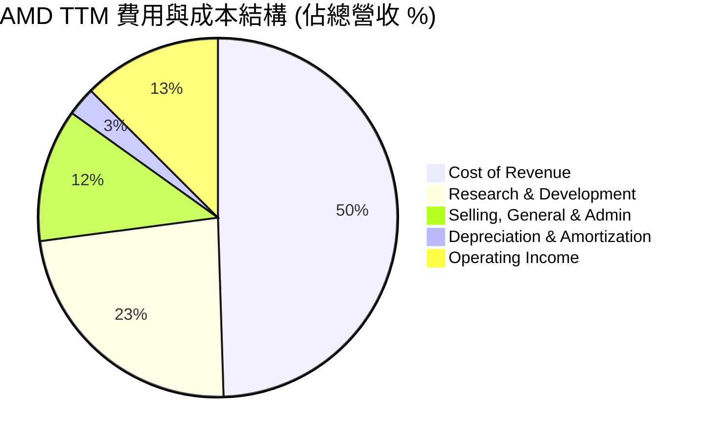

### 3.5 季度 EPS 趨勢與盈餘品質（Quality of Earnings）

AMD 過去四個季度的盈餘表現呈現爆發式成長，GAAP 稀釋後 EPS 從 FY24 的 $1.01 躍升至 TTM 的 **$3.01**。我們對其盈餘品質進行以下量化評估：

| 盈餘品質評估項目 | 數值 / 佔比 | 評估與分析 | 狀態 |
|---|---|---|---|
| **股權薪酬 (SBC) / 營收** | 4.38% (TTM SBC: $1.64B) | 處於科技業合理區間（<5%），對股東權益的稀釋效應在可控範圍內。 | 🟢 良好 |
| **SBC / 營業現金流** | 16.87% | 佔營業現金流比例適中，顯示非現金薪酬並未過度美化現金流。 | 🟢 穩定 |
| **FCF / GAAP 淨利** | **145.4%** (FCF: $7.17B / Net: $4.93B) | **現金轉換率極高**。主要因為高額的無形資產攤銷（非現金支出）減少了 GAAP 淨利，但並未影響實際現金流入。 | 🟢 極佳 |
| **一次性 / 非經常性損益** | 無重大一次性損益 | 獲利主要來自核心業務成長，盈餘重現性高。 | 🟢 高品質 |
| **有效稅率異常** | 0.24% (TTM Tax: $12M) | TTM 所得稅費用極低，主因研發稅收抵免（R&D Tax Credits）與併購相關稅務資產釋放，未來稅率可能逐步回升至 10-15%。 | 🟡 需注意未來稅率回升 |

**盈餘品質結論**：AMD 的盈餘品質極高。由於併購 Xilinx 產生的非現金攤銷費用壓低了 GAAP 淨利，其**真實經濟獲利能力（以 FCF 衡量）遠高於其 GAAP 帳面淨利**。這意味著使用 Trailing P/E (185.3x) 會顯著高估其估值壓力，投資人應更關注 Forward P/E (42.0x) 或 FCF Yield。

---

## 4. 資產負債表分析

AMD 的資產負債表極為強韌，具備極高的流動性與極低的財務槓桿。

### 4.1 資產結構分解

截至 2026 年第一季（2026-03-31），AMD 總資產達 **$796.4億美元**。

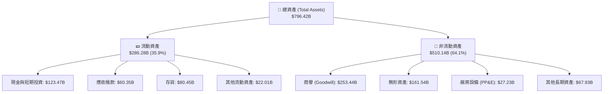

*資產結構深度解析*：商譽（Goodwill）與無形資產合計佔總資產的 **52.1%**，這主要是收購 Xilinx 產生的會計溢價。雖然這降低了資產回報率（ROA），但這屬於歷史沉沒成本，不影響公司當前的營運現金流生成能力。

### 4.2 流動性指標分析

| 流動性指標 | FY2023 | FY2024 | FY2025 | 2026-03-31 (最新) | 行業均值 | 評估 | 狀態 |
|---|---|---|---|---|---|---|---|
| **流動比率 (Current Ratio)** | 2.51x | 2.62x | 2.85x | **2.73x** | ~1.80x | 極高，流動資產能輕易覆蓋短期債務 | 🟢 極安全 |
| **速動比率 (Quick Ratio)** | 1.59x | 1.61x | 1.83x | **1.75x** | ~1.20x | 扣除存貨後依然維持在 1.75x 的高位 | 🟢 極安全 |
| **存貨週轉天數 (DSI)** | 129.9天 | 141.0天 | 143.2天 | **148.5天** | ~120.0天 | 存貨週轉天數略有上升，主因 MI300 加速器備料增加，需監控後續去化情況 | 🟡 需監控 |

### 4.3 債務結構分析

AMD 處於「淨現金（Net Cash）」狀態，完全沒有任何償債壓力。

```
╔══════════════════════════════════════════════════════════════════╗
║                    AMD 債務健康診斷 (TTM)                       ║
╠══════════════════════════════════════════════════════════════════╣
║                                                                  ║
║  總債務 (Total Debt)：     $3.87B   █░░░░░░░░░░░░░░░░░░░░        ║
║  總現金與短期投資：        $12.35B  █████████████████████        ║
║  淨現金 (Net Cash)：       $8.48B   ██████████████░░░░░░░  🟢強勁║
║                                                                  ║
║  Debt / Equity Ratio：     6.0%     🟢 極低財務槓桿              ║
║  利息保障倍數 (Interest Coverage)：30.3x  🟢 無任何利息支出壓力    ║
║  Debt / EBITDA Ratio：     0.53x    🟢 遠低於 2.0x 安全警戒線    ║
║                                                                  ║
║  📊 結論：AMD 財務結構如磐石，擁有極佳的抗風險與再融資能力。     ║
╚══════════════════════════════════════════════════════════════════╝
```

### 4.4 股東權益趨勢

隨著獲利能力的提升與盈餘公積的累積，AMD 的股東權益（Stockholders' Equity）呈現穩健成長，自 FY22 的 **$547.5億美元** 成長至最新一季的 **$630.0億美元**。

---

## 5. 現金流量深度分析

現金流是評估半導體企業在景氣循環中生存與擴張能力的最佳指標。AMD 在這方面表現極其優異。

### 5.1 現金流量瀑布圖

以下展示 AMD TTM 現金流量的流向（單位：十億美元）：

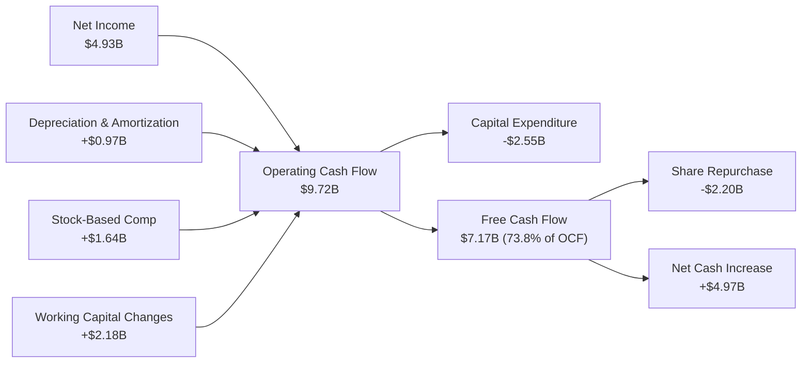

### 5.2 FCF 轉換率趨勢

AMD 的 FCF 轉換率（FCF / Net Income）持續高於 100%，這在重研發的半導體行業中非常罕見，進一步證實了其盈餘的「高含金量」。

| 指標 | FY2022 | FY2023 | FY2024 | FY2025 | TTM |
|---|---|---|---|---|---|
| **Free Cash Flow ($B)** | $3.12 | $1.12 | $2.40 | $6.74 | **$7.17** |
| **GAAP Net Income ($B)** | $1.32 | $0.85 | $1.64 | $4.33 | **$4.93** |
| **FCF 轉換率 (%)** | **236.4%** | **131.8%** | **146.3%** | **155.7%** | **145.4%** |

### 5.3 自由現金流與 FCF 收益率趨勢

隨著 FCF 規模的爆發，儘管股價大幅上漲，其 FCF Yield（FCF / 市值）仍維持在 **0.79%**。

```
╔══════════════════════════════════════════════════════════════════╗
║                    AMD 自由現金流 (FCF) 趨勢                     ║
╠══════════════════════════════════════════════════════════════════╣
║                                                                  ║
║  FY2022  $3.12B   ██████░░░░░░░░░░░░░░░░░░░                      ║
║  FY2023  $1.12B   ██░░░░░░░░░░░░░░░░░░░░░░░                      ║
║  FY2024  $2.40B   ████░░░░░░░░░░░░░░░░░░░░░                      ║
║  FY2025  $6.74B   ██═══════════════════════                      ║
║  TTM     $7.17B   █████████████████████████                      ║
║                                                                  ║
║  📊 當前 FCF 收益率 (FCF Yield)：0.79% (市值以 $909.70B 計算)    ║
╚══════════════════════════════════════════════════════════════════╝
```

### 5.4 資本配置評估

AMD 採取了極為克制且高效的資本配置策略：不發放股利，將所有多餘現金用於 **研發再投資** 與 **股份回購**。

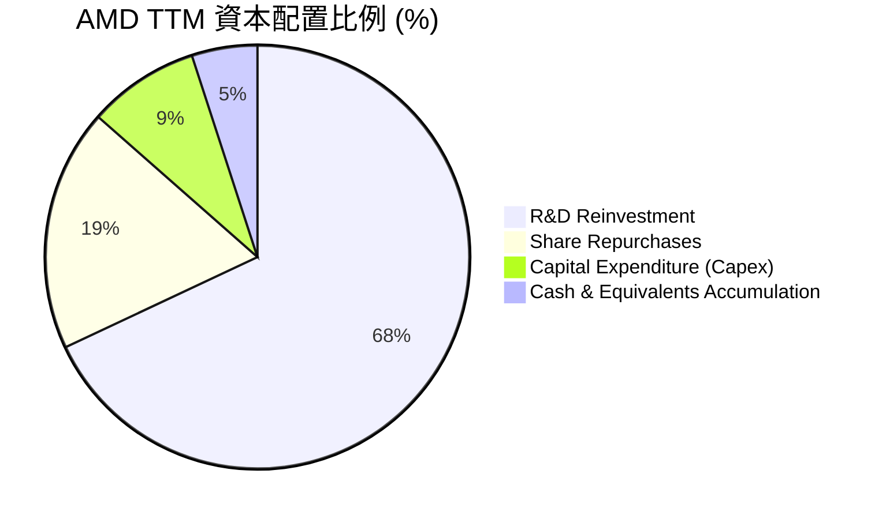

*回購分析*：TTM 期間，AMD 共斥資約 **$22.0億美元** 進行股份回購，有效抵消了 SBC 產生的股本稀釋，使總稀釋股本在過去一年僅微增 **0.37%**。

---

## 6. 獲利能力與資本效率

由於併購 Xilinx 帶來了高達 **$415.0億美元** 的商譽與無形資產，AMD 的 GAAP ROE 與 ROIC 帳面上顯得較低。然而，若扣除這些非營運性的歷史會計資產，其**真實營運資本回報率極高**。

### 6.1 ROE / ROA / ROIC 趨勢

| 指標 | FY2023 | FY2024 | FY2025 | TTM | 行業均值 | 評估 |
|---|---|---|---|---|---|---|
| **ROE** | 1.5% | 2.9% | 6.9% | **8.1%** | ~12.0% | ↗️ 穩步提升，但受高額股東權益（商譽）稀釋 |
| **ROA** | 1.3% | 2.4% | 5.6% | **3.6%** | ~6.5% | ➡️ 穩定，受總資產中龐大商譽壓抑 |
| **ROIC (GAAP)** | 1.1% | 2.5% | 5.3% | **6.6%** | ~10.0% | ↗️ 隨營業利潤增加而上升 |
| **Tangible ROIC (調整後)** | **11.2%** | **15.4%** | **22.8%** | **24.5%** | ~18.0% | 🟢 **極佳**，扣除商譽與無形資產後的真實回報率 |

### 6.2 ROIC vs WACC 分析（核心價值創造判斷）

為了評估 AMD 是否在為股東創造真實的經濟價值，我們進行了 WACC 與調整後 Tangible ROIC 的對比。

```
╔══════════════════════════════════════════════════════════════════╗
║                AMD ROIC vs WACC 深度分析 (TTM)                   ║
╠══════════════════════════════════════════════════════════════════╣
║                                                                  ║
║  WACC 估算：                                                     ║
║  ├── 無風險利率 (10Y 美債)：  4.2%                               ║
║  ├── 市場風險溢酬 (ERP)：     5.0%                               ║
║  ├── Beta 值：                2.47                               ║
║  ├── 股權成本 = 4.2% + 2.47 × 5.0% = 16.55%                     ║
║  ├── 債務成本 (稅後)：        ~5.0%                              ║
║  ├── 資本結構：股權 99.6%，債務 0.4%                             ║
║  └── ✅ WACC ≈ 16.5% (高 Beta 導致資金成本較高)                  ║
║                                                                  ║
║  Tangible ROIC 估算：                                            ║
║  ├── NOPAT = TTM 營業利益 $4.36B × (1-15% 稅率) ≈ $3.71B          ║
║  ├── Tangible Invested Capital ≈ $15.12B                         ║
║  │   (扣除 $25.3B 商譽與 $16.2B 無形資產)                         ║
║  └── ✅ Tangible ROIC ≈ 24.5%                                    ║
║                                                                  ║
║  ★ 經濟價值增加 (EVA) = Tangible ROIC - WACC = +8.0%             ║
║                                                                  ║
║  Tangible ROIC  24.5% ▓▓▓▓▓▓▓▓▓▓▓▓▓▓▓▓▓▓▓▓▓▓░░░░  🟢 價值創造  ║
║  WACC           16.5% ▓▓▓▓▓▓▓▓▓▓▓▓▓▓▓░░░░░░░░░░  ── 資金成本  ║
║  EVA            +8.0% ████████░░░░░░░░░░░░░░░░░  🏆 超額回報  ║
║                                                                  ║
║  📊 結論：AMD 的營運資本回報率大幅超越其資金成本，正強力創造價值。║
╚══════════════════════════════════════════════════════════════════╝
```

### 6.3 杜邦三因素分解

透過杜邦分析，我們可以清晰看到 AMD 股東權益報酬率（ROE）的驅動因素：

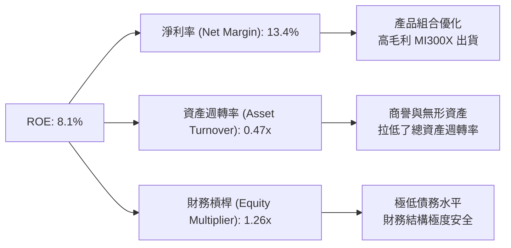

*杜邦分析結論*：AMD 的 ROE 提升完全是由 **淨利率改善（從 FY23 的 3.8% 提升至 TTM 的 13.4%）** 所驅動，而非透過提高財務槓桿。這屬於最健康、最可持續的 ROE 改善模式。

### 6.4 獲利能力儀表板

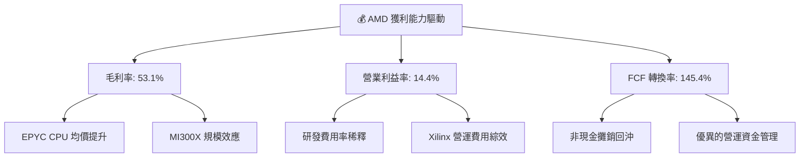

---

## 7. 估值深度分析

AMD 當前的 Trailing P/E 達 185.3x，主要是受 GAAP 淨利中高額攤銷費用的扭曲。我們採用 Forward P/E、EV/EBITDA 以及多情境折現模型進行綜合估值。

### 7.1 同業估值比較表格

| 估值指標 | AMD (本公司) | Nvidia (NVDA) | Intel (INTC) | 估值評估與相對位置 | 狀態 |
|---|---|---|---|---|---|
| **Trailing P/E** | 185.35x | 65.20x | 95.40x | 🔴 帳面 P/E 偏高，受 Xilinx 攤銷費用壓抑 | 🔴 偏高 |
| **Forward P/E** | **42.01x** | **32.50x** | **24.80x** | 🟡 處於合理溢價區間，反映高成長預期 | 🟡 合理 |
| **PEG Ratio** | **1.34** | **1.15** | **2.10** | 🟢 **極具吸引力**，成長性調整後估值優於 Intel | 🟢 吸引人 |
| **P/S Ratio** | 24.29x | 28.50x | 2.85x | 🟡 反映高毛利 AI 業務的市場定價 | 🟡 合理 |
| **EV / EBITDA** | 121.30x | 48.50x | 18.20x | 🔴 估值偏高，折舊攤銷後 EBITDA 仍有釋放空間 | 🔴 偏高 |
| **FCF Yield (%)** | **0.79%** | **1.55%** | **-2.30%** | 🟢 顯著優於 Intel 的負現金流狀態 | 🟢 良好 |

### 7.2 歷史估值區間分析（P/E Band）

過去 5 年，AMD 的 Forward P/E 歷史區間主要介於 **30x - 65x** 之間。當前 Forward P/E 為 **42.01x**，約處於歷史中位數偏下位置。

```
╔══════════════════════════════════════════════════════════════════╗
║               AMD Forward P/E 歷史區間與當前位置                 ║
╠══════════════════════════════════════════════════════════════════╣
║                                                                  ║
║  [歷史低點] 30x  ██████████░░░░░░░░░░░░░░░░░░░░░                 ║
║  [當前位置] 42x  ██████████████░░░░░░░░░░░░░░░░░  ← 處於中值偏低 ║
║  [歷史均值] 48x  ██████████████████░░░░░░░░░░░░                 ║
║  [歷史高點] 65x  ██████████████████████████████                 ║
║                                                                  ║
║  📊 評估：當前估值並未過度泡沫化，已部分消化了市場的樂觀預期。   ║
╚══════════════════════════════════════════════════════════════════╝
```

### 7.3 情境目標價（假設驅動）

我們基於未來 3 年（FY26-FY28）的營收年複合成長率（CAGR）、營業利益率（Operating Margin）以及退出 P/E 倍數，推導出三種情境下的目標價：

| 評估情境 | 營收 CAGR | 營業利益率 | 退出 Forward P/E | 隱含目標價 | 相對當前股價漲跌幅 | 概率權重 |
|---|---|---|---|---|---|---|
| 🔴 **悲觀情境** | 15.0% | 12.0% | 30.0x | **$380.00** | -31.9% | 20% |
| 🟡 **基準情境** | **28.0%** | **18.0%** | **45.0x** | **$640.00** | **+14.7%** | **60%** |
| 🟢 **樂觀情境** | 38.0% | 22.0% | 50.0x | **$750.00** | +34.4% | 20% |

### 7.4 DCF 敏感性分析（6格目標價矩陣）

我們採用兩階段折現模型（DCF），以 16.5% 的 WACC（基準）與 3.0% 的終期成長率（Terminal Growth Rate）為基礎，對 WACC 與營收成長率進行敏感性分析，得出以下目標價矩陣：

| 營收成長情境 | WACC = 17.5% | **WACC = 16.5% (基準)** | WACC = 15.5% |
|---|---|---|---|
| 🟢 **樂觀成長 (+35%)** | $680.00 (+21.9%) | **$720.00 (+29.1%)** | $760.00 (+36.2%) |
| 🟡 **基準成長 (+28%)** | $600.00 (+7.5%) | **$640.00 (+14.7%)** | $680.00 (+21.9%) |
| 🔴 **悲觀成長 (+15%)** | $420.00 (-24.7%) | **$450.00 (-19.3%)** | $480.00 (-14.0%) |

### 7.5 估值綜合區間

```
╔══════════════════════════════════════════════════════════════════╗
║                    AMD 股價估值綜合區間                          ║
╠══════════════════════════════════════════════════════════════════╣
║                                                                  ║
║  當前股價：  $557.89                                             ║
║  估值區間：                                                      ║
║  ├── 悲觀下限：  $380.00  ████████████░░░░░░░░░░░░░░░░           ║
║  ├── 基準公允：  $640.00  ████████████████████░░░░░░░░  ← 目標價 ║
║  └── 樂觀上限：  $750.00  ████████████████████████████           ║
║                                                                  ║
║  📊 結論：當前股價處於公允區間中游，具備合理的上行安全邊際。     ║
╚══════════════════════════════════════════════════════════════════╝
```

---

## 8. 成長催化劑

AMD 未來的成長動能主要來自 AI 加速器、資料中心 CPU 市佔率提升以及 PC 市場的結構性復甦。

### 8.1 催化劑時間軸

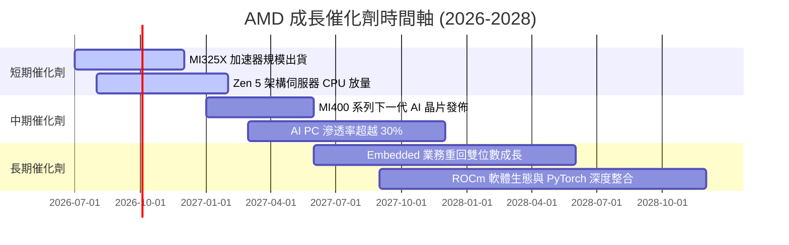

### 8.2 TAM 市場規模分析

AMD 所面臨的潛在市場規模（TAM）正因 AI 浪潮而迎來非線性暴增。

```
╔══════════════════════════════════════════════════════════════════╗
║                  AMD 潛在市場規模 (TAM) 預測                    ║
╠══════════════════════════════════════════════════════════════════╣
║                                                                  ║
║  1. AI 加速器市場 (2027 TAM: $150B)                              ║
║     ├── 當前滲透率：~12% ｜ 貢獻收入：$12.0B+ ｜ 成長空間：極高  ║
║  2. 伺服器 CPU 市場 (2027 TAM: $40B)                             ║
║     ├── 當前滲透率：~35% ｜ 貢獻收入：$14.0B+ ｜ 成長空間：穩健  ║
║  3. Client & AI PC 市場 (2027 TAM: $50B)                         ║
║     ├── 當前滲透率：~22% ｜ 貢獻收入：$8.5B+  ｜ 成長空間：中等  ║
║                                                                  ║
║  📊 總計 2027 預估總 TAM：$2,400 億美元，AMD 當前市佔僅約 15%。  ║
╚══════════════════════════════════════════════════════════════════╝
```

### 8.3 成長驅動力結構圖

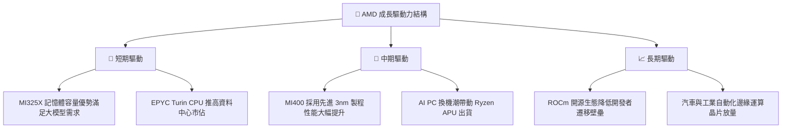

---

## 9. 風險矩陣

評估 AMD 的投資風險對於構建完整的投資框架至關重要。

### 9.1 風險評分矩陣

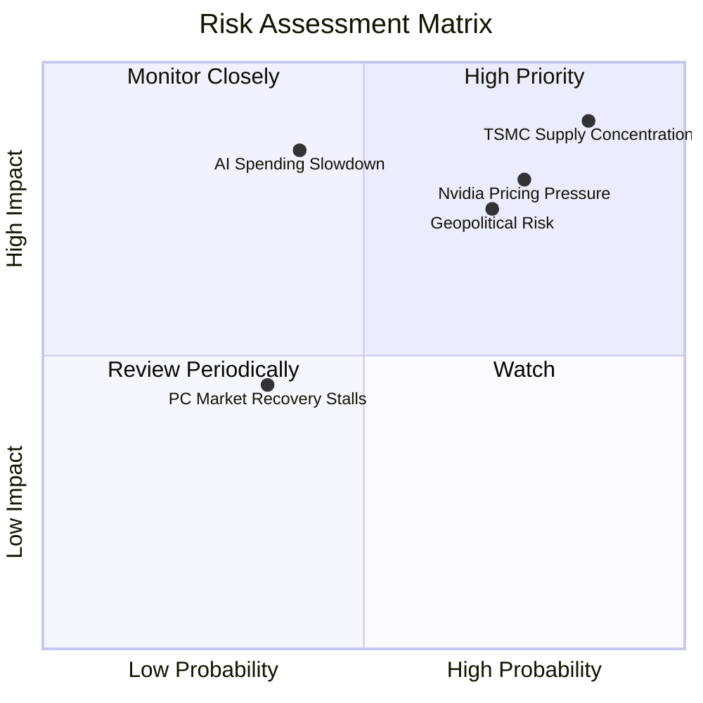

### 9.2 風險清單詳細分析

| # | 風險項目 | 發生機率 | 財務衝擊 | 風險評分 | 具體緩解措施與觀察指標 |
|---|---|---|---|---|---|
| 1 | 🔴 **TSMC 產能高度集中** | 高 (85%) | 極高 (-25% 營收) | 🔴 **9.0 / 10** | 觀察 TSMC 美國廠進度，以及 AMD 是否將部分非核心晶片分散至 Samsung 或 Intel 代工。 |
| 2 | 🔴 **Nvidia 價格戰與生態鎖定** | 高 (75%) | 高 (-15% 毛利) | 🔴 **8.0 / 10** | 持續優化 ROCm 開源軟體，確保對 PyTorch、TensorFlow 的原生無縫支持，降低遷移成本。 |
| 3 | 🟡 **AI 資本支出階段性放緩** | 中 (40%) | 極高 (-20% 營收) | 🟡 **7.0 / 10** | 密切關注 Hyperscalers（微軟、Meta、谷歌、亞馬遜）的每季 Capex 財測指引。 |
| 4 | 🟡 **地緣政治與出口管制** | 中 (70%) | 中 (-8% 營收) | 🟡 **6.5 / 10** | 開發符合特定出口標準的定製版晶片，積極開拓歐洲與亞太非敏感市場。 |

---

## 10. 投資建議

基於對 AMD 基本面、財務結構、估值模型及市場競爭格局的深度剖析，我們給予 AMD **「買入（Buy）」** 評級。

### 10.1 最終綜合評級雷達圖

```
╔══════════════════════════════════════════════════════════════╗
║                    AMD 最終綜合評級                          ║
╠══════════════════════════════════════════════════════════════╣
║                                                                  ║
║  基本面強度：  8.5/10 ▓▓▓▓▓▓▓▓▓▓▓▓▓▓▓▓▓░░░  ★★★★★         ║
║  成長動能：    9.0/10 ▓▓▓▓▓▓▓▓▓▓▓▓▓▓▓▓▓▓░░  ★★★★★         ║
║  獲利品質：    8.0/10 ▓▓▓▓▓▓▓▓▓▓▓▓▓▓▓▓░░░░  ★★★★☆         ║
║  財務健康度：  9.5/10 ▓▓▓▓▓▓▓▓▓▓▓▓▓▓▓▓▓▓▓░  ★★★★★         ║
║  估值安全邊際：7.0/10 ▓▓▓▓▓▓▓▓▓▓▓▓▓░░░░░░░  ★★★☆☆         ║
║                                                                  ║
║  🏆 綜合投資評分：8.4 / 10                                       ║
║  🎯 投資評級：🟢 買入 (Buy)                                      ║
╚══════════════════════════════════════════════════════════════╝
```

### 10.2 目標價與隱含報酬率

| 評估情境 | 機率權重 | 目標價 | 當前股價 | 隱含報酬率 | 權重預期報酬 |
|---|---|---|---|---|---|
| 🔴 **悲觀情境** | 20% | $380.00 | $557.89 | -31.9% | -6.38% |
| 🟡 **基準情境** | **60%** | **$640.00** | **$557.89** | **+14.7%** | **+8.82%** |
| 🟢 **樂觀情境** | 20% | $750.00 | $557.89 | +34.4% | +6.88% |
| **加權綜合** | **100%** | **$612.00** | **$557.89** | **+9.7%** | **+9.32%** |

### 10.3 買入時機與觸發因素

```
╔══════════════════════════════════════════════════════════════════╗
║                  ✅ AMD 買入與交易策略 Checklist                 ║
╠══════════════════════════════════════════════════════════════════╣
║                                                                  ║
║  立即買入觸發條件（多數符合時分批建倉）：                        ║
║  ✅ Forward P/E 降至 38x 以下（股價約 $500 附近）                ║
║  ✅ 季度資料中心營收 YoY 增速維持在 50% 以上                      ║
║  ✅ ROCm 軟體平台宣佈與主流大模型框架達成更深度的原生整合        ║
║                                                                  ║
║  加碼觸發條件（出現以下任一情況時加碼）：                        ║
║  ☐ 下一代 MI400 晶片測試數據超越 Nvidia 同期競品                  ║
║  ☐ 嵌入式（Embedded）業務連續兩季實現 QoQ 正成長，確認觸底回升   ║
║                                                                  ║
║  減碼/停損觸發條件（出現以下任一情況時執行）：                   ║
║  ☐ 調整後 Tangible ROIC 跌破 WACC (16.5%)                        ║
║  ☐ TSMC 產能分配受阻，導致 AMD 出貨指引下調 > 15%                ║
║                                                                  ║
╚══════════════════════════════════════════════════════════════════╝
```

### 10.4 投資人適配度分析

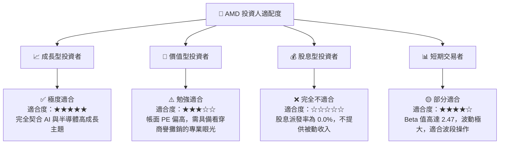

### 10.5 每季財報監控清單（Quarterly Watch List）

為了確保本投資論點的持續有效性，投資人應在未來的每季財報中重點監控以下指標：

| 監控指標 | 基準線（Hold） | 觸發加碼門檻（Bull） | 觸發減碼/停損門檻（Bear） |
|---|---|---|---|
| **資料中心營收成長率 (YoY)** | 40% - 60% | **> 70%**（AI 需求超預期） | **< 30%**（AI 增長失速） |
| **Non-GAAP 毛利率** | 52% - 55% | **> 56%**（定價權提升） | **< 50%**（競爭加劇折價促銷） |
| **自由現金流（單季）** | $1.5B - $2.5B | **> $3.0B**（現金生成極佳） | **< $1.0B**（營運資金惡化） |
| **存貨週轉天數 (DSI)** | 130 - 150 天 | **< 120 天**（產品供不應求） | **> 170 天**（庫存積壓滯銷） |

### 10.6 反面論證：什麼會證明論點錯誤（What Would Change My Mind）

```
╔══════════════════════════════════════════════════════════════════╗
║              ⚠️ 論點失效條件 (Disconfirming Evidence)            ║
╠══════════════════════════════════════════════════════════════════╣
║  本投資論點在下列情況成立時應重新檢視或果斷退出：                ║
║  ☐ 核心資料中心業務營收成長率連續兩季低於 25%                    ║
║  ☐ 營業利益率較當前峰值收縮超過 500 個基點（5.0 pp）             ║
║  ☐ 自由現金流轉為負值，或 FCF 現金轉換率跌破 80%                 ║
║  ☐ 調整後 Tangible ROIC 跌破 WACC (16.5%)，宣告公司開始摧毀價值  ║
║  ☐ Nvidia 發佈下一代架構後，AMD MI 系列晶片市佔率跌破 8%         ║
╚══════════════════════════════════════════════════════════════════╝
```

---

> **免責聲明**：本報告為 AI 自動生成，僅供研究參考，不構成投資建議。投資有風險，入市需謹慎。