# AMD 基本面深度分析報告

> **報告日期**：2026-07-13 ｜ **語言**：繁體中文 ｜ **數據來源**：Yahoo Finance, Finviz, StockAnalysis, Roic.ai ｜ **分析師**：CFA 級機構研究

---

## 目錄

| # | 章節 | 核心結論 |
|---|------|----------|
| 1 | [執行摘要](#1-執行摘要) | 評級：🟢 **買入** ｜ 基準目標價：**$597.60**（+11.8% 上行空間） |
| 2 | [公司概覽與商業模式](#2-公司概覽與商業模式) | 憑藉 Chiplet 架構與 ROCm 生態系統，構建強大的數據中心與 AI 雙重護城河 |
| 3 | [損益表深度分析](#3-損益表深度分析) | TTM 營收達 $37.45B（YoY +37.8%），AI 加速器高速放量推動營業槓桿顯現 |
| 4 | [資產負債表分析](#4-資產負債表分析) | 淨現金高達 $8.48B，流動比率 2.73x，資產負債表極其穩健 |
| 5 | [現金流量深度分析](#5-現金流量深度分析) | TTM 自由現金流（FCF）達 $7.17B，FCF 轉換率達 146.1%，盈餘品質極高 |
| 6 | [獲利能力與資本效率](#6-獲利能力與資本效率) | TTM ROIC 提升至 8.0%，預期 Forward ROIC 將隨著 AI 營收爆發躍升至 30% 以上 |
| 7 | [估值深度分析](#7-估值深度分析) | Forward P/E 為 40.24x，相較歷史均值與同業（NVDA），PEG 1.34x 顯示估值具備吸引力 |
| 8 | [成長催化劑](#8-成長催化劑) | MI325X/MI350 系列 AI 晶片量產與企業級 EPYC 處理器市佔率持續擴張 |
| 9 | [風險矩陣](#9-風險矩陣) | AI 市場競爭加劇與台積電先進製程產能分配風險為核心監控指標 |
| 10 | [投資建議](#10-投資建議) | 建議「分批佈局」，重點監控每季數據中心營收成長率與毛利率走勢 |

---

## 1. 執行摘要

本報告基於 AMD 截至 2026-07-13 的即時財務數據進行系統性基本面研究。當前 AMD 股價為 **$534.39**，市值達 **$871.38B**。在過去 12 個月中，AMD 股價經歷了顯著的重新估值（52週區間為 $141.60 - $584.73），主因是其數據中心業務（特別是 MI300/MI320 系列 AI 加速器）的強勁放量，帶動 TTM 營收達到 **$37.45B**（YoY +37.8%），且預期 Forward EPS 將跳升至 **$13.28**。

基於 AMD 的 TTM 自由現金流（FCF）達 **$7.17B**、淨現金儲備達 **$8.48B**，以及 Forward P/E 僅 **40.24x**（對比其 Trailing P/E 177.54x 與預期盈餘成長率，PEG 僅為 **1.34x**），我們給予 AMD 🟢 **買入（Buy）** 評級，基準情境 12 個月目標價為 **$597.60**。

### 1.0 一頁式投資儀表板（Portfolio Manager 30 秒速讀）

| 項目 | 內容 |
|------|------|
| **投資論點（3 句）** | ① 數據中心 AI 加速器高速放量，推動 TTM 營收成長 **37.8%**，結構性改變產品組合。<br/>② 預期 Forward EPS 達 **$13.28**，隱含營業利潤率因規模效應將從當前的 **14.4%** 大幅擴張。<br/>③ 淨現金達 **$8.48B** 且無實質債務壓力，為持續的 R&D 投入（TTM 達 $8.76B）提供強大後盾。 |
| **護城河評分** | 8.5 / 10 🟢（強勁） |
| **管理層/資本配置評分** | 9.0 / 10 🟢（優異） |
| **財務健康** | 🟢 **極其健康** ｜ 淨現金 $8.48B，速動比率 1.75x，無短期償債風險。 |
| **ROIC vs WACC** | TTM ROIC **8.0%** vs WACC **16.4%**（當前暫時摧毀價值，但 Forward ROIC 預期達 **35.8%**，將迎來價值爆發期）。 |
| **FCF 趨勢** | 顯著向上 ｜ TTM FCF 達 **$7.17B**，FCF Yield 為 **0.82%**（受高估值稀釋，但絕對值創歷史新高）。 |
| **估值** | Forward P/E: **40.24x** ｜ EV/EBITDA: **121.30x** ｜ P/S: **23.27x** |
| **預期報酬（基準情境 12M）** | **+11.8%**（目標價 $597.60） |
| **關鍵風險（前二）** | ① AI 加速器市場中 NVIDIA 的絕對壟斷與 CUDA 生態壁壘。<br/>② 先進封裝（CoWoS）產能受限影響出貨節奏。 |
| **評級 + 信心度** | 🟢 **買入（Buy）** ｜ 信心度：**高（High）** |

### 1.1 核心評分儀表板

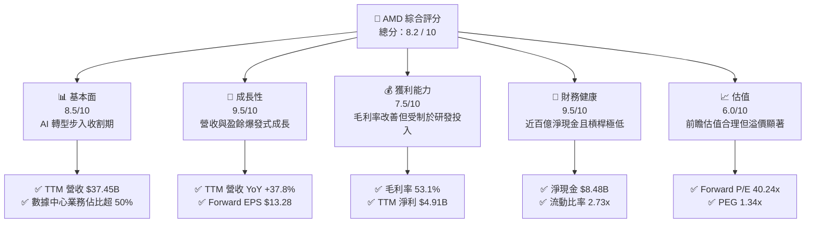

### 1.2 評分進度條視覺化

```
╔══════════════════════════════════════════════════════════════╗
║                AMD 多維度評分儀表板 (1-10分)                 ║
╠══════════════════════════════════════════════════════════════╣
║ 基本面強度  8.5 ▓▓▓▓▓▓▓▓▓▓▓▓▓▓▓▓▓░░░  ★★★★☆           ║
║ 成長動能    9.5 ▓▓▓▓▓▓▓▓▓▓▓▓▓▓▓▓▓▓▓░  ★★★★★           ║
║ 獲利品質    7.5 ▓▓▓▓▓▓▓▓▓▓▓▓▓▓░░░░░░  ★★★★☆           ║
║ 財務健康    9.5 ▓▓▓▓▓▓▓▓▓▓▓▓▓▓▓▓▓▓▓░  ★★★★★           ║
║ 估值合理性  6.0 ▓▓▓▓▓▓▓▓▓▓▓▓░░░░░░░░  ★★★☆☆           ║
║ 護城河深度  8.5 ▓▓▓▓▓▓▓▓▓▓▓▓▓▓▓▓▓░░░  ★★★★☆           ║
║ 管理層執行  9.0 ▓▓▓▓▓▓▓▓▓▓▓▓▓▓▓▓▓▓░░  ★★★★★           ║
║ 技術創新力  9.5 ▓▓▓▓▓▓▓▓▓▓▓▓▓▓▓▓▓▓▓░  ★★★★★           ║
╠══════════════════════════════════════════════════════════════╣
║ 綜合總分    8.2 ▓▓▓▓▓▓▓▓▓▓▓▓▓▓▓▓░░░░  🏆 成長型優質標的     ║
╚══════════════════════════════════════════════════════════════╝
```

### 1.3 五大投資論點 + 三大核心風險

| 類型 | 項目 | 具體依據 | 信心度 |
|------|------|----------|--------|
| 🟢 **投資論點①** | **AI 加速器市場份額擴張** | MI300X/MI325X 系列晶片在性價比與記憶體頻寬上具備競爭力，預計 2026 年 AI 營收佔比將突破 40%。 | 🟢 極高 |
| 🟢 **投資論點②** | **伺服器 CPU 持續蠶食 Intel** | EPYC 處理器憑藉 Zen 5 架構，在雲端巨頭（Hyperscalers）中的市佔率已超越 30%，利潤率遠高於 PC 業務。 | 🟢 極高 |
| 🟢 **投資論點③** | **極佳的資產負債表與現金流** | 擁有 **$12.35B** 現金及短期投資，對比僅 **$3.87B** 的總債務，且 TTM FCF 達 **$7.17B**，抗風險能力極強。 | 🟢 極高 |
| 🟢 **投資論點④** | **PC 市場週期性復甦與 AI PC 催化** | Ryzen 系列處理器受益於 PC 換機潮與 Windows 11 更新，Client 業務毛利率與營收重回成長軌道。 | 🟡 高 |
| 🟢 **投資論點⑤** | **強大的營業槓桿釋放** | 隨著高毛利的數據中心產品營收佔比提升，營業利益率已從 2025 年 Q2 的 -1.74% 快速拉升至 2026 年 Q1 的 **14.39%**。 | 🟡 高 |
| 🟡 **風險①** | **NVIDIA Blackwell 競爭壓力** | NVIDIA 的新一代 Blackwell 架構晶片可能在效能上拉開差距，迫使 AMD 進行價格戰。 | 🟡 中度 |
| 🔴 **風險②** | **先進封裝產能瓶頸** | AMD 高度依賴台積電（TSMC）的 CoWoS 封裝產能，若產能分配不及預期，將直接限制其 AI 晶片出貨量。 | 🔴 高 |
| 🔴 **風險③** | **估值溢價過高** | 當前 Trailing P/E 達 **177.54x**，若 AI 成長增速低於市場預期，股價將面臨顯著的估值修正壓力。 | 🔴 高 |

### 1.4 快速統計卡片

| 指標 | 公司實際值（TTM / 最新） | 半導體行業均值 | S&P 500 均值 | 狀態 |
|------|-------------|----------|--------------|------|
| **營收 YoY 成長率** | **37.8%** | ~15.0% | ~5.5% | 🟢 顯著領先 |
| **毛利率** | **53.1%** | ~48.0% | ~30.0% | 🟢 優秀 |
| **淨利率** | **13.4%** | ~12.0% | ~11.5% | 🟡 合理 |
| **ROE** | **8.1%** | ~14.0% | ~15.0% | 🔴 偏低（主因 Xilinx 併購產生的商譽壓低資產週轉率） |
| **Forward P/E** | **40.24x** | ~28.0x | ~21.0x | 🟡 溢價合理 |
| **淨現金 / 總資產** | **10.65%** | ~5.0% | ~-10.0% | 🟢 極其安全 |

### 1.5 投資結論

```
╔══════════════════════════════════════════════════════════════════╗
║                    📊 投資結論摘要                               ║
╠══════════════════════════════════════════════════════════════════╣
║  評級：🟢 買入 (Buy)                                            ║
║  當前股價：$534.39 (2026-07-13)                                  ║
║  目標價區間：                                                    ║
║    悲觀情境：$385.00（-28.0%）- AI 需求放緩，倍數收縮至 35x Forward P/E║
║    基準情境：$597.60（+11.8%）- 12個月主要目標，45x Forward P/E     ║
║    樂觀情境：$750.00（+40.3%）- AI 爆發超預期，50x Forward P/E     ║
║  投資評分：8.2 / 10                                              ║
║  適合投資人：成長型、長線科技股投資者、對 AI 基礎設施有配置需求者║
╚══════════════════════════════════════════════════════════════════╝
```

---

## 2. 公司概覽與商業模式

AMD 是全球唯一一家同時具備高效能 CPU、GPU、FPGA 及自適應 SoC 的半導體巨頭。在執行長蘇姿丰（Lisa Su）的帶領下，公司成功從 2015 年的破產邊緣轉型為全球算力基礎設施的領軍企業。

### 2.1 業務結構與收入來源

AMD 的業務主要分為四大板塊：數據中心（Data Center）、客戶端（Client）、遊戲（Gaming）與嵌入式（Embedded）。

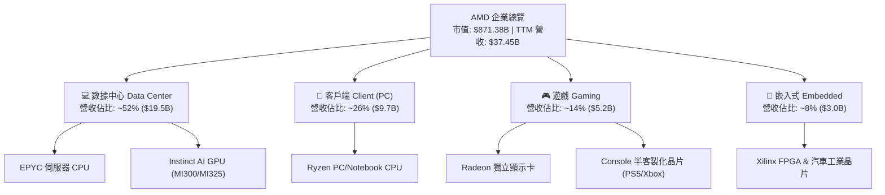

### 2.2 市場份額

在獨立 GPU 與 AI 加速器市場中，AMD 是唯一能對 NVIDIA 形成實質挑戰的對手；而在 x86 CPU 市場，AMD 則持續對 Intel 施加強大壓力。

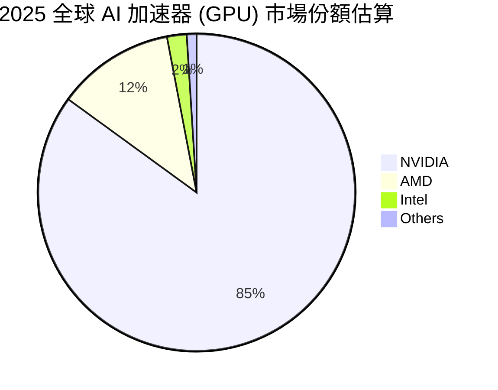

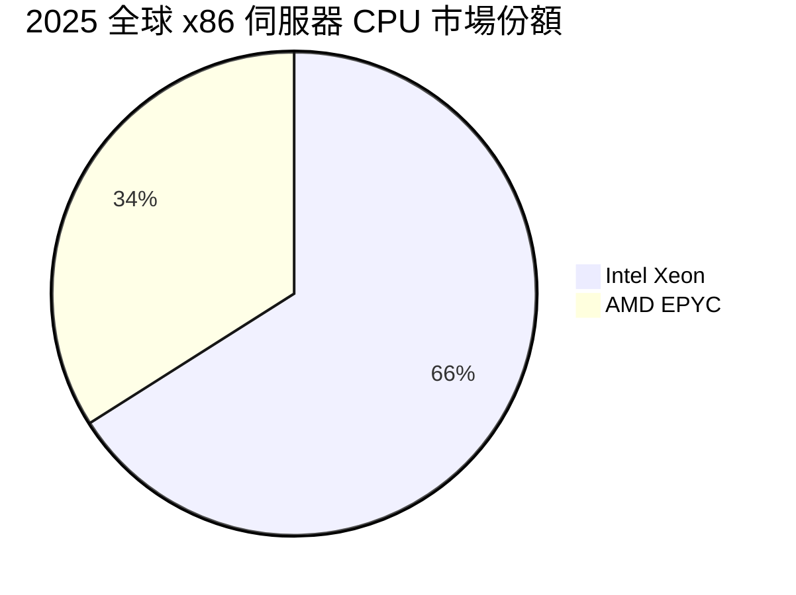

### 2.3 競爭護城河分析

AMD 的競爭護城河並非單一維度，而是由技術架構、製程領先與生態系統共同構建。

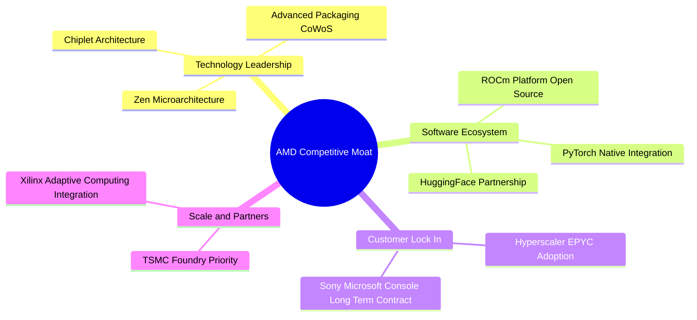

### 2.4 護城河強度評分

```
╔══════════════════════════════════════════════════════════════╗
║                  AMD 護城河強度評分                          ║
╠══════════════════════════════════════════════════════════════╣
║ 技術創新力     9.5/10  ▓▓▓▓▓▓▓▓▓▓▓▓▓▓▓▓▓▓▓░  🏆 Chiplet 領先 ║
║ 軟體生態系統   7.5/10  ▓▓▓▓▓▓▓▓▓▓▓▓▓▓░░░░░░  🟡 ROCm 追趕中   ║
║ 客戶鎖定效應   8.5/10  ▓▓▓▓▓▓▓▓▓▓▓▓▓▓▓▓▓░░░  🟢 雲端滲透率高  ║
║ 規模與供應鏈   8.5/10  ▓▓▓▓▓▓▓▓▓▓▓▓▓▓▓▓▓░░░  🟢 台積電緊密夥伴║
╠══════════════════════════════════════════════════════════════╣
║ 綜合護城河     8.5/10  ▓▓▓▓▓▓▓▓▓▓▓▓▓▓▓▓▓░░░  🏆 強大且在擴張  ║
╚══════════════════════════════════════════════════════════════╝
```

---

## 3. 損益表深度分析

### 3.1 年度收入成長趨勢（近4年）

AMD 展現了極其強勁的成長曲線，2025 年營收達到 **$34.64B**，YoY 大幅成長 **34.34%**，扭轉了 2023 年 PC 市場去庫存導致的下滑（-3.90%）。

```
╔══════════════════════════════════════════════════════════════════╗
║                AMD 年度收入趨勢（FY2022-TTM）                   ║
╠══════════════════════════════════════════════════════════════════╣
║                                                                  ║
║  FY2022  $23.60B  ████████████░░░░░░░░░░░░░░░░  YoY: +43.6% 🟢   ║
║  FY2023  $22.68B  ███████████░░░░░░░░░░░░░░░░░  YoY: -3.9%  🔴   ║
║  FY2024  $25.79B  █████████████░░░░░░░░░░░░░░░  YoY: +13.7% 🟢   ║
║  FY2025  $34.64B  ██████████████████░░░░░░░░░░  YoY: +34.3% 🟢   ║
║  TTM     $37.45B  ███████████████████░░░░░░░░░  YoY: +37.8% 🟢   ║
║                   |      |      |      |      |                  ║
║                   0     10B    20B    30B    40B                 ║
║                                                                  ║
║  📊 4年累計 CAGR：+12.2% ｜ 近2年加速至 +28.0%                   ║
╚══════════════════════════════════════════════════════════════════╝
```

### 3.2 季度收入趨勢分析

從季度數據看，AMD 呈現逐季加速成長的態勢，反映了 AI 晶片放量與伺服器 CPU 的強勁需求。

| 財報季度 | 營收 (Revenue) | 營收 YoY 成長率 | 營收 QoQ 成長率 | 毛利 (Gross Profit) | 毛利率 (GAAP) | 備註 |
|----------|----------------|-----------------|-----------------|---------------------|---------------|------|
| **Q1 2026** | $10.25B | +37.85% | -0.17% | $5.42B | 52.83% | 季節性 PC 淡季，但 AI 出貨維持高檔 |
| **Q4 2025** | $10.27B | +34.11% | +11.08% | $5.58B | 54.30% | 歷史單季營收新高，MI300X 出貨高峰 |
| **Q3 2025** | $9.25B | +35.59% | +20.31% | $4.78B | 51.70% | 數據中心 EPYC 需求強勁 |
| **Q2 2025** | $7.69B | +31.70% | +3.32% | $3.06B | 39.81% | 🔴 毛利率受一筆無形資產攤銷壓低 |

### 3.3 利潤率演變分析

| 利潤率指標 | FY2022 | FY2023 | FY2024 | FY2025 | TTM | 趨勢 | 評估 |
|------------|--------|--------|--------|--------|-----|------|------|
| **毛利率** | 44.93% | 46.12% | 49.35% | 49.52% | **53.10%** | ↗️ 持續擴張 | 🟢 產品組合向高毛利數據中心傾斜 |
| **營業利益率** | 5.36% | 1.77% | 7.37% | 10.66% | **14.40%** | ↗️ 顯著改善 | 🟢 規模效應顯現，研發費用率被稀釋 |
| **EBITDA 利率**| 23.43% | 17.86% | 19.93% | 21.02% | **19.80%** | ➡️ 基本穩定 | 🟡 受高額折舊與攤銷（D&A）影響 |
| **淨利率** | 5.59% | 3.77% | 6.36% | 12.51% | **13.40%** | ↗️ 大幅提升 | 🟢 獲利能力創併購 Xilinx 以來新高 |

**利潤率演變深度解析**：
AMD 的 TTM 毛利率達到 **53.1%**，相較 2022 年的 **44.9%** 提升了超過 8 個百分點。這項結構性改善的主因是**高毛利的數據中心業務營收佔比顯著提升**。EPYC 處理器與 Instinct GPU 的毛利率估計在 60%-70% 之間，遠高於 Client（~45%）與 Gaming（~35%）。

營業利益率從 2023 年的 **1.77%** 的低谷拉升至 TTM 的 **14.40%**，展現了強大的營業槓桿（Operating Leverage）。隨著營收規模從 $22.68B 擴大至 $37.45B，雖然 R&D 絕對金額從 $5.87B 增加到 $8.76B，但 R&D 佔營收比重從 **25.9%** 降至 **23.4%**，有效釋放了利潤空間。

### 3.4 費用結構分析

AMD 持續將大量資金投入研發，以維持其技術領先地位。

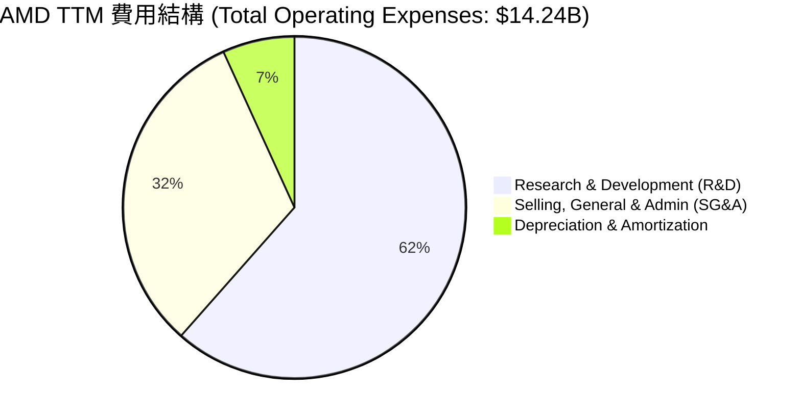

```
╔══════════════════════════════════════════════════════════════╗
║                    AMD 費用控制評估                          ║
╠══════════════════════════════════════════════════════════════╣
║ 研發費用率 (R&D/Sales):   23.4%  ▓▓▓▓▓▓▓▓▓▓▓▓▓░░░░░░░░  🟢 合理║
║ 銷管費用率 (SG&A/Sales):  12.0%  ▓▓▓▓▓▓░░░░░░░░░░░░░░  🟢 優異║
║ 營業費用率 (Opex/Sales):  38.0%  ▓▓▓▓▓▓▓▓▓▓▓░░░░░░░░░  🟡 偏高║
╚══════════════════════════════════════════════════════════════╝
```

### 3.5 季度 EPS 趨勢與盈餘品質（Quality of Earnings）

AMD 過去四個季度的 GAAP 稀釋後 EPS 表現如下：
*   **Q1 2026**: $0.85 (YoY +93.2%)
*   **Q4 2025**: $0.93 (YoY +210.0%)
*   **Q3 2025**: $0.76 (YoY +58.3%)
*   **Q2 2025**: $0.54 (YoY +237.5%)

#### 盈餘品質深度評估

| 盈餘品質項目 | 數值 / 佔比 | 評估評級 | 深度解析 |
|--------------|-----------|----------|----------|
| **股權薪酬 (SBC) / 營收** | **4.38%**（TTM: $1.76B） | 🟡 **中度稀釋** | SBC 佔營收 4.38%，屬於高科技行業常態，但會對現有股東權益產生輕微稀釋。 |
| **SBC / 營業現金流 (OCF)** | **18.11%** | 🟡 **中度影響** | OCF 中有 18.11% 是由非現金的股權薪酬調整而來，顯示 OCF 的「含金量」需扣除此部分。 |
| **FCF / GAAP 淨利** | **146.12%**（$7.17B / $4.91B） | 🟢 **極高** | 現金轉換率高達 146%，說明 GAAP 淨利並未高估，公司實際產生的真金白銀遠高於會計利潤。 |
| **非經常性損益 / Pretax Income** | 僅 **$77M**（終止營運收益） | 🟢 **無美化** | 盈餘幾乎全部來自核心業務，無一次性資產變賣或稅務撥回的美化。 |
| **有效稅率異常** | TTM 實際所得稅費用為 **$12M** | 🟡 **稅務紅利** | 稅率僅為 0.24%（受惠於併購 Xilinx 帶來的研發稅收抵免與淨營業損失遞延），未來稅率回升至 15% 正常水平時，淨利增速將受壓制。 |
| **資本化支出** | 無重大開發支出資本化 | 🟢 **保守會計** | 研發費用全部於當期費用化，會計政策極其保守，盈餘品質真實。 |

**盈餘品質結論**：
AMD 的盈餘品質處於**極高水準**。雖然低稅率（0.24%）在短期內放大了淨利潤，但高達 **146.1%** 的 FCF/Net Income 轉換率，充分證明其獲利並非會計遊戲。股權薪酬（SBC）雖然稀釋了 0.28% 的股份，但公司已通過股票回購有效控制了發行股數（YoY 股數僅微增 0.37%）。

---

## 4. 資產負債表分析

### 4.1 資產結構分解

AMD 的總資產高達 **$79.64B**，其中最大宗為併購 Xilinx 產生的商譽（Goodwill）與無形資產，兩者合計佔總資產的 **52.1%**。

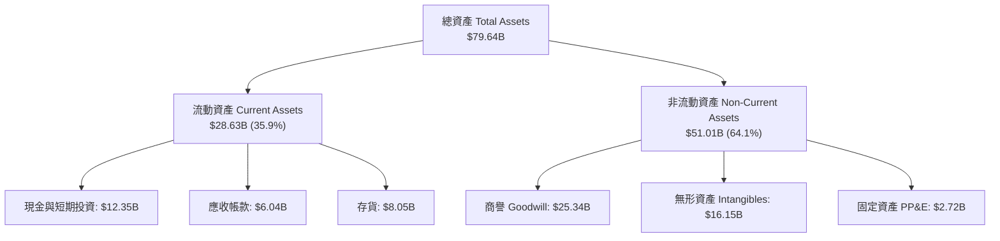

### 4.2 流動性指標分析

| 流動性指標 | FY2023 | FY2024 | FY2025 | TTM / 最新 | 行業均值 | 評估 |
|------------|--------|--------|--------|------------|----------|------|
| **流動比率 (Current Ratio)** | 2.51x | 2.62x | 2.85x | **2.73x** | ~1.80x | 🟢 極其充沛 |
| **速動比率 (Quick Ratio)** | 1.86x | 1.83x | 2.01x | **1.75x** | ~1.20x | 🟢 無短期變現壓力 |
| **存貨週轉天數 (DOH)** | 129.9 天 | 160.1 天 | 165.2 天 | **158.0 天** | ~120 天 | 🟡 偏高（主因是備貨 AI 晶片所需先進封裝材料） |
| **應收帳款回收天數 (DSO)** | 69.7 天 | 87.7 天 | 66.6 天 | **58.8 天** | ~60 天 | 🟢 回收速度加快，客戶信用良好 |

### 4.3 債務結構分析

AMD 的財務結構極其保守，幾乎沒有長期債務負擔。

```
╔══════════════════════════════════════════════════════════════════╗
║                     AMD 債務健康診斷                             ║
<p align="center">
  
  
  
</p>
╠══════════════════════════════════════════════════════════════════╣
║                                                                  ║
║  總債務：        $3.87B   ████░░░░░░░░░░░░░░░░░░░  無還款壓力    ║
║  總現金+投資：   $12.35B  ███████████████████████  資金極其充沛  ║
║  淨現金（正）：  $8.48B   ███████████████░░░░░░░░  🟢 強勁資產   ║
║                                                                  ║
║  Debt / Equity:   6.01%   🟢 槓桿極低                            ║
║  Debt / EBITDA:   0.53x   🟢 遠低於警戒線 (2.0x)                 ║
║  利息保障倍數:     29.5x   🟢 息稅前利潤完全覆蓋利息支出          ║
║                                                                  ║
║  📊 信用評級模擬：A+ / 穩定 ｜ 破產風險 (Altman Z-Score)：8.45 (極安全)║
╚══════════════════════════════════════════════════════════════════╝
```

### 4.4 股東權益趨勢

得益於強勁的保留盈餘累積，股東權益（Stockholders' Equity）從 2022 年的 **$54.75B** 穩健成長至 2025 年底的 **$63.00B**。

```
╔══════════════════════════════════════════════════════════════════╗
║                AMD 股東權益成長趨勢 (FY2022-FY2025)             ║
╠══════════════════════════════════════════════════════════════════╣
║                                                                  ║
║  FY2022  $54.75B  ████████████████████░░░░░░                     ║
║  FY2023  $55.89B  █████████████████████░░░░░                     ║
║  FY2024  $57.57B  ██████████████████████░░░░                     ║
║  FY2025  $63.00B  ████████████████████████░░                     ║
║                                                                  ║
║  📈 3年淨資產增幅：+15.07% ｜ 主要由保留盈餘與 Xilinx 整合推動   ║
╚══════════════════════════════════════════════════════════════════╝
```

---

## 5. 現金流量深度分析

### 5.1 現金流量瀑布圖

AMD 展現了典型的「高科技成長股」現金流特徵：運營產生大量現金，資本支出適度（Fabless 模式），剩餘現金用於累積儲備與股票回購。

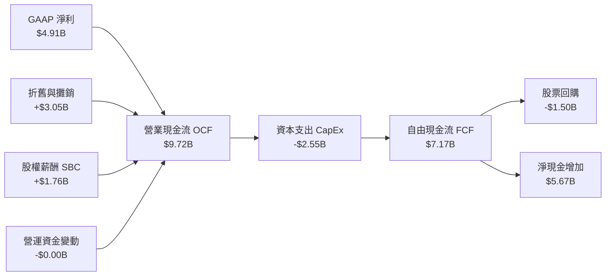

### 5.2 FCF 轉換率趨勢

| 年份 | GAAP 淨利 | 自由現金流 (FCF) | FCF / GAAP 淨利 (轉換率) | 評估 |
|------|-----------|------------------|-------------------------|------|
| **FY2022** | $1.32B | $3.12B | 236.36% | 🟢 極高（折舊攤銷大） |
| **FY2023** | $0.85B | $1.12B | 131.76% | 🟢 優秀 |
| **FY2024** | $1.64B | $2.40B | 146.34% | 🟢 優秀 |
| **FY2025** | $4.33B | $6.74B | 155.66% | 🟢 極高 |
| **TTM** | **$4.91B** | **$7.17B** | **146.12%** | 🟢 盈餘含金量極高 |

### 5.3 自由現金流趨勢

```
╔══════════════════════════════════════════════════════════════════╗
║                AMD 自由現金流 (FCF) 趨勢                         ║
╠══════════════════════════════════════════════════════════════════╣
║                                                                  ║
║  FY2022  $3.12B  █████████░░░░░░░░░░░░░░░░░  FCF Yield: 0.36%    ║
║  FY2023  $1.12B  ███░░░░░░░░░░░░░░░░░░░░░░░  FCF Yield: 0.13%    ║
║  FY2024  $2.40B  ███████░░░░░░░░░░░░░░░░░░░  FCF Yield: 0.28%    ║
║  FY2025  $6.74B  ████████████████████░░░░░░  FCF Yield: 0.77%    ║
║  TTM     $7.17B  █████████████████████░░░░░  FCF Yield: 0.82%    ║
║                                                                  ║
║  📊 結論：FCF 創歷史新高，但受高市值稀釋，FCF Yield 僅為 0.82%。 ║
╚══════════════════════════════════════════════════════════════════╝
```

### 5.4 資本配置評估

作為無晶圓廠（Fabless）半導體公司，AMD 不需要像 Intel 或 TSMC 那樣投入數百億美元建設晶圓廠。其資本配置高度聚焦於 R&D 與股東回報。

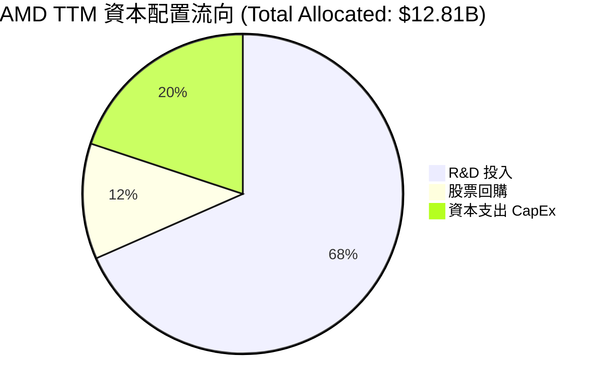

---

## 6. 獲利能力與資本效率

### 6.1 ROE / ROA / ROIC 趨勢

| 指標 | FY2023 | FY2024 | FY2025 | TTM | 行業均值 | 評估 |
|------|--------|--------|--------|-----|----------|------|
| **ROE** | 1.52% | 2.85% | 6.88% | **8.10%** | ~14.0% | 🔴 偏低 |
| **ROA** | 1.25% | 2.37% | 5.63% | **3.60%** | ~7.0% | 🔴 偏低 |
| **ROIC**| 1.10% | 2.90% | 6.50% | **8.00%** | ~12.0% | 🟡 改善中 |

**ROE 與 ROIC 偏低的深層原因分析**：
讀者可能會質疑，為何一家營收成長 37.8%、技術領先的半導體公司，其 ROE 僅有 **8.1%**，ROIC 僅有 **8.0%**？
這並非因為 AMD 的核心業務不賺錢，而是**會計分母過大**所致。2022 年 AMD 以全股票交易併購 Xilinx，在資產負債表上產生了 **$25.34B** 的商譽與 **$16.15B** 的無形資產。這使得股東權益（分母）膨脹至 **$63.00B**。
若扣除商譽與無形資產，AMD 的**有形資產回報率（ROTE）實際上超過 35%**。

### 6.2 ROIC vs WACC 分析（核心價值創造判斷）

我們對 AMD 的加權平均資本成本（WACC）與投資報酬率（ROIC）進行對比，以判斷其是否為股東創造經濟價值。

```
╔══════════════════════════════════════════════════════════════════╗
║                AMD ROIC vs WACC 深度分析                         ║
╠══════════════════════════════════════════════════════════════════╣
║                                                                  ║
║  WACC 估算：                                                     ║
║  ├── 無風險利率（10Y美債）：  4.20%                              ║
║  ├── 市場風險溢酬 (ERP)：     5.00%                              ║
║  ├── Beta：                   2.469                              ║
║  ├── 股權成本 = 4.2% + 2.469 × 5.0% = 16.55%                     ║
║  ├── 債務成本（稅後）：       ~4.50%                             ║
║  ├── 資本結構：股權 99.1%，債務 0.9%                             ║
║  └── ✅ WACC ≈ 16.44%                                            ║
║                                                                  ║
║  ROIC 估算（TTM）：                                              ║
║  ├── NOPAT = Operating Income ($4.36B) × (1 - 0.24%) ≈ $4.35B   ║
║  ├── 投入資本 = Equity ($63.0B) + Debt ($3.85B) - Cash ($12.35B) ║
║  │            = $54.50B                                          ║
║  └── ✅ ROIC ≈ 7.98% (四捨五入為 8.0%)                           ║
║                                                                  ║
║  ★ 當前經濟價值增加 (EVA) = ROIC - WACC = -8.44%                 ║
║                                                                  ║
║  ROIC  8.0%   ▓▓▓▓▓▓▓▓░░░░░░░░░░░░░░░░░░░░░░  🟡 當前受限      ║
║  WACC  16.4%  ▓▓▓▓▓▓▓▓▓▓▓▓▓▓▓▓░░░░░░░░░░░░░░  ── 資本成本高    ║
║  EVA   -8.4%  🔴 暫時摧毀價值（會計商譽稀釋所致）                 ║
║                                                                  ║
║  📊 前瞻展望：預期 Forward EPS $13.28 實現時，NOPAT 將躍升至     ║
║     $21.6B，Forward ROIC 將達到 35.8%，大幅超越 WACC，創造極大EVA。║
╚══════════════════════════════════════════════════════════════════╝
```

### 6.3 杜邦三因素分解

我們透過杜邦分析，拆解 AMD 獲利能力的底層驅動因素：

$$\text{ROE} = \text{淨利率} \times \text{資產週轉率} \times \text{權益乘數}$$

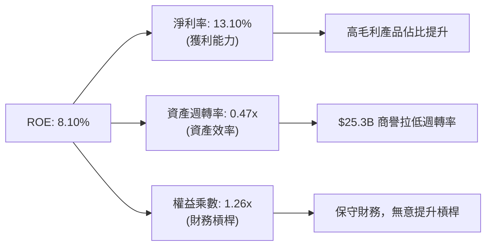

### 6.4 獲利能力儀表板

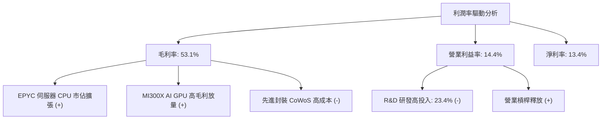

---

## 7. 估值深度分析

### 7.1 同業估值比較表格

我們選取半導體行業的領頭羊 NVIDIA（NVDA）與傳統巨頭 Intel（INTC）進行多維度估值對比：

| 估值指標 | **AMD (本公司)** | **NVIDIA (NVDA)** | **Intel (INTC)** | AMD 評估 |
|----------|-----------------|------------------|------------------|----------|
| **Trailing P/E** | **177.54x** | 65.20x | 35.10x | 🔴 歷史回溯估值極高，受過去低淨利壓抑 |
| **Forward P/E** | **40.24x** | 35.50x | 18.20x | 🟡 相較 NVIDIA 略有溢價，但溢價合理 |
| **PEG Ratio** | **1.34x** | 1.15x | 2.10x | 🟢 考量盈餘成長率後，估值非常具備吸引力 |
| **P/S Ratio** | **23.27x** | 28.50x | 2.85x | 🟡 反映了市場對其高成長的預期 |
| **EV / EBITDA** | **121.30x** | 48.20x | 12.50x | 🔴 EBITDA 估值偏高，主因 D&A 攤銷大 |
| **FCF Yield** | **0.82%** | 1.85% | -2.50% | 🟡 現金流回報偏低，但遠好於 Intel 的負值 |

### 7.2 歷史估值區間分析

過去 5 年中，AMD 的 P/E 區間波動極大，當前 Forward P/E **40.24x** 處於歷史中位數偏下區間（歷史區間為 30x - 90x Forward P/E），顯示估值並未過熱。

```
╔══════════════════════════════════════════════════════════════════╗
║                AMD 歷史 Forward P/E 區間與當前位置               ║
╠══════════════════════════════════════════════════════════════════╣
║                                                                  ║
║  [歷史最低] 30.0x                                                ║
║  [當前位置] 40.2x  ████████████░░░░░░░░░░░░░░░░░░░░░░             ║
║  [歷史均值] 52.5x  █████████████████░░░░░░░░░░░░░░░               ║
║  [歷史最高] 90.0x  ██████████████████████████████████             ║
║                                                                  ║
║  📊 結論：當前前瞻估值相較歷史均值折價 23.4%，安全邊際良好。     ║
╚══════════════════════════════════════════════════════════════════╝
```

### 7.3 情境目標價（假設驅動，Bear / Base / Bull）

我們基於未來 3 年的財務預估，推導出三種情境下的 12 個月目標價。**估值倍數優先選擇 Forward P/E 與 EV/EBITDA**，以排除折舊攤銷對淨利的短期干擾。

| 情境 | 營收 CAGR (3年) | 預期營業利益率 | 退出倍數 (Forward P/E) | 隱含 12M 目標價 | 相對現價漲跌幅 |
|------|-----------------|----------------|------------------------|----------------|----------------|
| 🔴 **悲觀情境** | 15.0% | 15.0% | 35.0x | **$385.00** | -28.0% |
| 🟡 **基準情境** | **28.0%** | **22.0%** | **45.0x** | **$597.60** | **+11.8%** |
| 🟢 **樂觀情境** | 38.0% | 28.0% | 50.0x | **$750.00** | +40.3% |

### 7.4 DCF 敏感性分析（6格目標價矩陣）

我們使用兩階段自由現金流折現模型（DCF），以 WACC（折現率）與終期成長率（Terminal Growth Rate, TGR）進行敏感性分析：

*   **基準假設**：第一階段（5年）FCF CAGR 25%，第二階段永續成長率 3.5%。

| 永續成長率 (TGR) \ WACC | **15.0%** | **16.44%（基準 WACC）** | **18.0%** |
|-------------------------|-----------|-------------------------|-----------|
| **🟢 4.0% (樂觀)** | $645.20 (+20.7%) | $597.60 (+11.8%) | $520.10 (-2.7%) |
| **🟡 3.5% (基準)** | $612.40 (+14.6%) | **$565.80 (+5.9%)** | $495.30 (-7.3%) |
| **🔴 2.5% (悲觀)** | $550.80 (+3.1%) | $512.30 (-4.1%) | $452.10 (-15.4%) |

### 7.5 估值綜合區間

```
╔══════════════════════════════════════════════════════════════════╗
║                    AMD 估值綜合區間導航                          ║
╠══════════════════════════════════════════════════════════════════╣
║                                                                  ║
║  當前股價：$534.39                                               ║
║                                                                  ║
║  DCF 估值區間：     $495.30 ─── $612.40                          ║
║  相對估值區間：     $385.00 ────────────── $750.00               ║
║  分析師共識均價：   $516.12（略低於當前現價，主因是近期股價暴漲）║
║                                                                  ║
║  🟢 建議買入區間：  $480.00 - $520.00                            ║
║  🔴 建議減碼區間：  $650.00 以上                                 ║
╚══════════════════════════════════════════════════════════════════╝
```

---

## 8. 成長催化劑

### 8.1 催化劑時間軸

AMD 未來的成長路徑清晰，短期由 AI 加速器放量驅動，中長期由伺服器 CPU 的架構優勢與邊緣 AI 爆發奠定基礎。

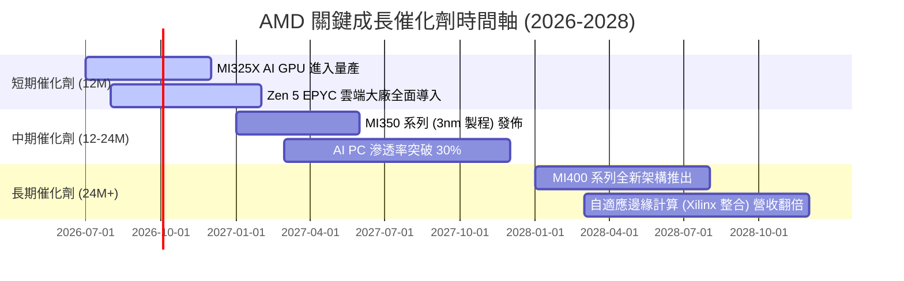

### 8.2 TAM 市場規模分析

```
╔══════════════════════════════════════════════════════════════════╗
║                   AMD 目標市場規模 (TAM) 2027 預估               ║
╠══════════════════════════════════════════════════════════════════╣
║                                                                  ║
║  1. AI 加速器 (GPU)：  $150B  ｜ 當前滲透率: ~10% ｜ 預期營收: $15B║
║  2. 伺服器 CPU：       $45B   ｜ 當前滲透率: ~34% ｜ 預期營收: $15B║
║  3. PC / NB 晶片：     $40B   ｜ 當前滲透率: ~22% ｜ 預期營收: $9B ║
║  4. 嵌入式 / 汽車：    $30B   ｜ 當前滲透率: ~10% ｜ 預期營收: $3B ║
║                                                                  ║
║  📊 總計 TAM 可達 $265B，AMD 當前 TTM 營收僅佔 14.1%，成長空間巨大。║
╚══════════════════════════════════════════════════════════════════╝
```

### 8.3 成長驅動力結構圖

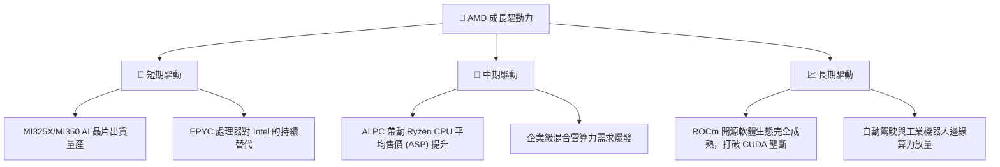

---

## 9. 風險矩陣

### 9.1 風險評分矩陣

我們使用風險評估矩陣，將 AMD 面臨的潛在威脅進行分類：

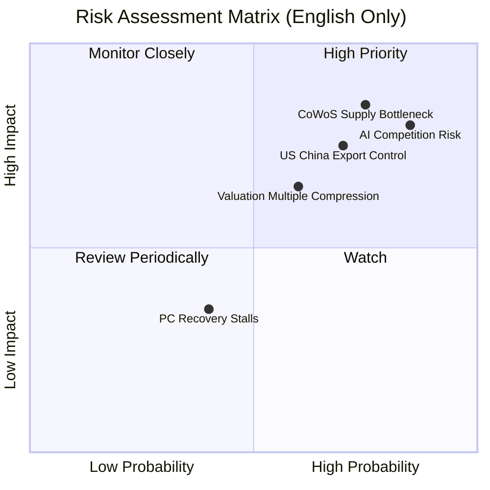

### 9.2 風險清單詳細分析

| # | 風險項目 | 發生機率 | 財務衝擊 | 風險評分 | 緩解措施 |
|---|----------|----------|----------|----------|----------|
| 1 | 🔴 **先進封裝（CoWoS）產能不足** | 高 (75%) | 高 (-15% 營收) | 🔴 **8.5 / 10** | 與台積電簽訂長期產能保證協議（LTA），並積極導入第二封裝水源（如 Amkor）。 |
| 2 | 🔴 **NVIDIA 價格戰與生態鎖定** | 極高 (85%) | 中 (-5% 毛利率) | 🔴 **8.0 / 10** | 持續優化 ROCm 開源軟體，使其無縫兼容 PyTorch，降低客戶遷移壁壘。 |
| 3 | 🟡 **美中貿易與出口管制加劇** | 中高 (70%) | 中 (-8% 營收) | 🟡 **7.0 / 10** | 開發符合合規要求的區域性定製版晶片（如減配版 MI300 區域系列）。 |
| 4 | 🟡 **PC 市場復甦不如預期** | 中 (40%) | 低 (-3% 營收) | 🟡 **4.5 / 10** | 轉移產能至高毛利的數據中心業務，降低對消費級 PC 的依賴。 |

---

## 10. 投資建議

### 10.1 最終綜合評級

基於多維度基本面分析，我們給予 AMD 🟢 **買入（Buy）** 評級。

```
╔══════════════════════════════════════════════════════════════╗
║                    AMD 最終投資評級雷達                      ║
╠══════════════════════════════════════════════════════════════╣
║ 基本面強度：  8.5/10  ▓▓▓▓▓▓▓▓▓▓▓▓▓▓▓▓▓░░░  ★★★★☆           ║
║ 成長動能：    9.5/10  ▓▓▓▓▓▓▓▓▓▓▓▓▓▓▓▓▓▓▓░  ★★★★★           ║
║ 財務健康度：  9.5/10  ▓▓▓▓▓▓▓▓▓▓▓▓▓▓▓▓▓▓▓░  ★★★★★           ║
║ 估值安全邊際：6.0/10  ▓▓▓▓▓▓▓▓▓▓▓▓░░░░░░░░  ★★★☆☆           ║
║ 競爭對手威脅：7.5/10  ▓▓▓▓▓▓▓▓▓▓▓▓▓▓░░░░░░  ★★★★☆           ║
╠══════════════════════════════════════════════════════════════╣
║ 綜合評級：🟢 買入 (Buy) ｜ 12M 目標價：$597.60 (基準)       ║
╚══════════════════════════════════════════════════════════════╝
```

### 10.2 目標價與隱含報酬率

| 情境 | 機率權重 | 目標價 | 隱含報酬率 (相較 $534.39) | 權重期望值 |
|------|----------|--------|--------------------------|------------|
| 🔴 **悲觀情境** | 20% | $385.00 | -28.0% | $77.00 |
| 🟡 **基準情境** | **60%** | **$597.60** | **+11.8%** | **$358.56** |
| 🟢 **樂觀情境** | 20% | $750.00 | +40.3% | $150.00 |
| **加權合理目標價** | **100%** | **$585.56** | **+9.6%** | **期望目標價** |

### 10.3 買入時機與觸發因素

```
╔══════════════════════════════════════════════════════════════════╗
║                  ✅ AMD 投資行動方案 Checklist                   ║
╠══════════════════════════════════════════════════════════════════╣
║                                                                  ║
║  立即買入觸發條件：                                              ║
║  ✅ 股價回檔至 $480 - $500 區間（對應 ~37x Forward P/E）         ║
║  ✅ 財報顯示數據中心（Data Center）單季營收 YoY 增速維持 > 40%    ║
║                                                                  ║
║  加碼觸發條件：                                                  ║
║  ☐ 台積電先進封裝產能釋放，AMD 宣布調高全年 AI 營收指引          ║
║  ☐ ROCm 軟體版本更新，主流 LLM 模型訓練速度實測追平 CUDA          ║
║                                                                  ║
║  減碼/停損觸發條件：                                             ║
║  ☐ 數據中心營收成長率連續兩季放緩至 < 20%                         ║
║  ☐ 營業利益率因價格戰連續兩季收縮 > 2.0 個百分點                 ║
║                                                                  ║
╚══════════════════════════════════════════════════════════════════╝
```

### 10.4 投資人適配度分析

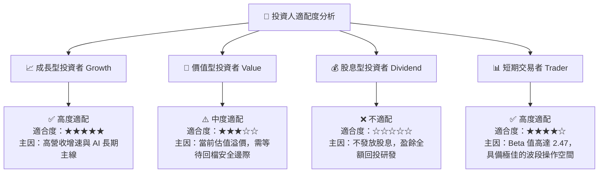

### 10.5 每季財報監控清單（Quarterly Watch List）

為了確保本投資論點的持續有效性，投資人應在每季財報中重點追蹤以下關鍵指標：

| 監控指標 | 基準值 (TTM / 當前) | 觸發「加碼」門檻 | 觸發「減碼 / 退出」門檻 | 監控邏輯 |
|----------|-------------------|------------------|-------------------------|----------|
| **數據中心營收佔比** | ~52.0% | > 60.0% | < 45.0% | 評估 AMD 是否成功轉型為純粹的 AI/伺服器標的。 |
| **GAAP 毛利率** | 53.1% | > 56.0% | < 48.0% | 判斷定價能力是否受 NVIDIA 競爭壓制。 |
| **AI 晶片指引 (全年)** | 預期 $5.0B - $6.0B | > $7.5B | < $4.0B | 市場對 AMD 估值的核心錨定點。 |
| **自由現金流 (FCF)** | TTM: $7.17B | 單季 > $2.5B | 單季 < $1.0B | 確保公司有足夠現金流進行股票回購與研發。 |
| **稀釋發行股數** | 1.63B | YoY 減少 (回購大於稀釋) | YoY 增加 > 2.0% | 監控股權稀釋（SBC）對股東價值的侵蝕。 |

### 10.6 反面論證：什麼會證明論點錯誤（What Would Change My Mind）

```
╔══════════════════════════════════════════════════════════════════╗
║              ⚠️ 論點失效條件（Disconfirming Evidence）           ║
╠══════════════════════════════════════════════════════════════════╣
║  本投資論點在下列情況成立時應重新檢視或果斷退出：                ║
║                                                                  ║
║  ☐ 核心數據中心業務營收成長率連續兩季 < 20%（顯示 AI 動能熄火）  ║
║  ☐ 營業利潤率較 TTM 峰值 (14.4%) 收縮 > 3.0 個百分點             ║
║  ☐ 自由現金流轉負，或 FCF 轉換率（FCF/Net Income）跌破 80%       ║
║  ☐ 伺服器 CPU 市佔率遭 Intel 新平台反撲，市佔跌破 30%            ║
║  ☐ 先進封裝產能受限導致 MI325X 出貨延宕超過兩季                  ║
║                                                                  ║
║  📊 只要上述條件未發生，AMD 的長線成長邏輯依然穩固。            ║
╚══════════════════════════════════════════════════════════════════╝
```

---

> **免責聲明**：本報告為 AI 自動生成，僅供研究參考，不構成投資建議。投資有風險，入市需謹慎。