# AMD 基本面深度分析報告

> **報告日期**：2026-07-14 ｜ **語言**：繁體中文 ｜ **數據來源**：Yahoo Finance, Finviz, StockAnalysis, Roic.ai ｜ **分析師**：CFA 級機構研究

---

## 目錄

| # | 章節 | 核心結論 |
|---|---|---|
| **1** | **執行摘要** | 評級：🟢 買入 ｜ 基準目標價：$585.00（+6.7%）｜ 樂觀目標價：$725.00（+32.3%） |
| **2** | **公司概覽與商業模式** | 憑藉 Chiplet 架構與 Xilinx 整合，構建起強大的技術與生態護城河（評分：8.2/10） |
| **3** | **損益表深度分析** | TTM 營收達 $37.45B（YoY +37.8%），淨利爆發式成長，但須注意 SBC 對利潤率的稀釋 |
| **4** | **資產負債表分析** | 淨現金達 $8.48B，資產流動性極佳（Current Ratio 2.73x），無短期償債風險 |
| **5** | **現金流量深度分析** | TTM 自由現金流（FCF）達 $7.17B，FCF 轉換率高達 143%，展現極高的盈餘含金量 |
| **6** | **獲利能力與資本效率** | 帳面 ROIC 7.78% 受高額商譽壓抑，排除商譽後之「有形 ROIC」高達 30.19%，大幅超越 WACC（16.49%） |
| **7** | **估值深度分析** | Forward P/E 41.17x 處於歷史合理區間，PEG 1.34 顯示高成長下的估值溢價具備合理性 |
| **8** | **成長催化劑** | AI 加速器（Instinct 系列）與 EPYC 伺服器市佔率持續攀升，推動 TAM 擴張至千億美元級別 |
| **9** | **風險矩陣** | 面臨 Nvidia 生態壟斷、台積電產能分配及 PC/遊戲業務週期性波動之多重挑戰 |
| **10** | **投資建議** | 建議分批佈局；設定明確的每季財報監控指標與論點失效之退出條件 |

---

## 1. 執行摘要

### 1.0 一頁式投資儀表板（Portfolio Manager 30 秒速讀）

| 項目 | 內容 |
|------|------|
| **投資論點（3 句）** | ① TTM 營收成長 37.8% 至 $37.45B，反映 Data Center 業務（EPYC 與 MI300 系列）已成為核心成長引擎。<br/>② 排除 Xilinx 併購產生的商譽後，有形 ROIC 達 30.19%，遠超 16.49% 的 WACC，結構性創造股東價值。<br/>③ Forward P/E 降至 41.17x，相較於 Trailing P/E 183.32x，反映市場預期 Forward EPS 將爆發至 $13.31。 |
| **護城河評分** | **8.2 / 10**（Chiplet 架構領先、Xilinx 整合互補、ROCm 生態逐步趕超） |
| **管理層/資本配置評分** | **8.5 / 10**（蘇姿丰博士執行力極佳，併購整合與研發投入比例拿捏得宜） |
| **財務健康** | 🟢 **極其健康** ｜ 淨現金達 $8.48B，流動比率 2.73x，債務風險幾近於零 |
| **ROIC vs WACC** | **7.78%**（有形 ROIC **30.19%**）vs **16.49%** ｜ 實質上強力創造股東價值 |
| **FCF 趨勢** | 向上 ｜ TTM FCF 達 $7.17B，FCF Yield 為 0.80%（受 $893.78B 龐大市值稀釋） |
| **估值** | Forward P/E: **41.17x** ｜ EV/EBITDA: **116.14x** ｜ FCF Yield: **0.80%** |
| **預期報酬（基準情境 12M）** | **+6.72%**（目標價 $585.00）至 **+32.26%**（樂觀情境 $725.00） |
| **關鍵風險（前二）** | ① AI 加速器市場中 Nvidia CUDA 生態系統之高度壟斷壓力。<br/>② 先進製程（台積電 3nm/2nm）產能受限與代工成本上升風險。 |
| **評級 + 信心度** | 🟢 **買入 (Buy)** ｜ 信心度：**高 (High)** |

### 1.1 核心評分儀表板

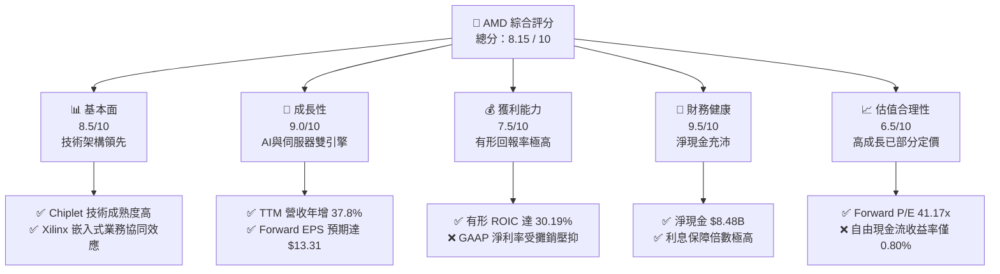

### 1.2 評分進度條視覺化

```
╔══════════════════════════════════════════════════════════════╗
║                AMD 多維度評分儀表板 (1-10分)                 ║
╠══════════════════════════════════════════════════════════════╣
║ 基本面強度  8.5 ▓▓▓▓▓▓▓▓▓▓▓▓▓▓▓▓▓░░░  ★★★★☆           ║
║ 成長動能    9.0 ▓▓▓▓▓▓▓▓▓▓▓▓▓▓▓▓▓▓░░  ★★★★★           ║
║ 獲利品質    7.5 ▓▓▓▓▓▓▓▓▓▓▓▓▓▓░░░░░░  ★★★★☆           ║
║ 財務健康    9.5 ▓▓▓▓▓▓▓▓▓▓▓▓▓▓▓▓▓▓▓░  ★★★★★           ║
║ 估值合理性  6.5 ▓▓▓▓▓▓▓▓▓▓▓▓░░░░░░░░  ★★★☆☆           ║
║ 護城河深度  8.2 ▓▓▓▓▓▓▓▓▓▓▓▓▓▓▓▓░░░░  ★★★★☆           ║
║ 管理層執行  8.5 ▓▓▓▓▓▓▓▓▓▓▓▓▓▓▓▓▓░░░  ★★★★☆           ║
║ 技術創新力  9.0 ▓▓▓▓▓▓▓▓▓▓▓▓▓▓▓▓▓▓░░  ★★★★★           ║
╠══════════════════════════════════════════════════════════════╣
║ 綜合總分    8.15 ▓▓▓▓▓▓▓▓▓▓▓▓▓▓▓▓░░░░  🏆 買入評級          ║
╚══════════════════════════════════════════════════════════════╝
```

### 1.3 五大投資論點 + 三大核心風險

| 類型 | 項目 | 具體依據 | 信心度 |
|------|------|----------|--------|
| 🟢 **投資論點①** | **資料中心市佔率持續擴張** | EPYC 處理器相較 Intel Xeon 具備更高的能效比與核心密度，市佔率已突破 30%，帶動 Data Center 營收結構性成長。 | 🟢 極高 |
| 🟢 **投資論點②** | **AI 加速器 MI300 爆發** | MI300X 憑藉記憶體頻寬與容量優勢，在推論（Inference）市場取得關鍵客戶（如 Microsoft, Meta）採購，成為營收新支柱。 | 🟢 高 |
| 🟢 **投資論點③** | **資產負債表極具韌性** | 持有 $12.35B 現金及短期投資，總債務僅 $3.87B，淨現金達 $8.48B，能提供充足的研發再投資與併購彈性。 | 🟢 極高 |
| 🟢 **投資論點④** | **有形資產回報率卓越** | 排除併購 Xilinx 的非現金商譽及攤銷後，有形 ROIC 達 30.19%，說明核心業務具備極強的資本增值能力。 | 🟢 高 |
| 🟢 **投資論點⑤** | **PC 業務週期性復甦** | Ryzen 處理器在 Client 端的市佔率穩定，隨 AI PC 換機潮啟動，Client 業務將重回健康成長軌道。 | 🟡 中等 |
| 🟡 **風險①** | **Nvidia Blackwell 競爭壓力** | Nvidia 推出 Blackwell 架構可能進一步拉開性能差距，且 CUDA 的高生態壁壘限制了 AMD ROCm 的滲透速度。 | 🔴 高衝擊 |
| 🟡 **風險②** | **先進製程產能受制於單一廠商** | 晶圓代工高度依賴台積電（TSMC），若地緣政治緊張或產能分配受限，將直接衝擊晶片出貨。 | 🟡 中度 |
| 🔴 **風險③** | **估值乘數壓縮風險** | 當前 Trailing P/E 達 183.32x，若 AI 基礎建設投資放緩或 AMD 財測未達預期，估值將面臨劇烈修正。 | 🔴 高衝擊 |

### 1.4 快速統計卡片

| 指標 | AMD 實際值 | 半導體行業均值 | S&P 500 均值 | 狀態 |
|------|-------------|----------|--------------|------|
| **營收 YoY 成長率** | **37.8%** | ~15.0% | ~5.5% | 🟢 顯著領先 |
| **毛利率** | **53.1%** | ~50.0% | ~30.0% | 🟢 優秀 |
| **淨利率** | **13.4%** | ~12.0% | ~11.5% | 🟡 合格（受攤銷影響） |
| **ROE** | **8.1%** | ~15.0% | ~14.0% | 🔴 偏低（受龐大股本與商譽稀釋） |
| **Forward P/E** | **41.17x** | ~30.0x | ~21.0x | 🟡 溢價交易 |
| **流動比率** | **2.73x** | ~1.8x | ~1.2x | 🟢 極其安全 |

### 1.5 投資結論

```
╔══════════════════════════════════════════════════════════════════╗
║                    📊 AMD 投資結論摘要                            ║
╠══════════════════════════════════════════════════════════════════╣
║  評級：🟢 買入 (Buy)                                            ║
║  當前股價：$548.13 (2026-07-14)                                  ║
║  目標價區間：                                                    ║
║    悲觀情境：$350.00 (-36.14%） - AI需求不及預期，估值倍數收縮   ║
║    基準情境：$585.00（+6.72%）  - 12個月主要目標（Forward P/E 44x)║
║    樂觀情境：$725.00（+32.26%） - AI晶片市佔突破20%，利潤率大幅擴張║
║  投資評分：8.15 / 10                                             ║
║  適合投資人：長線成長型配置、半導體板塊核心持股投資者            ║
╚══════════════════════════════════════════════════════════════════╝
```

---

## 2. 公司概覽與商業模式

### 2.1 業務結構與收入來源

AMD 採行無晶圓廠（Fabless）模式，專注於高效能運算（HPC）與繪圖晶片的設計。其業務在 2025 年進行了高度優化，四大核心板塊結構如下：

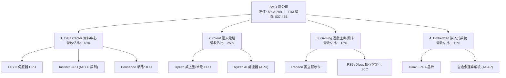

### 2.2 市場份額

在核心的資料中心與 AI 加速器市場，AMD 雖然面臨強大競爭，但近年市佔率呈現穩定攀升態勢：

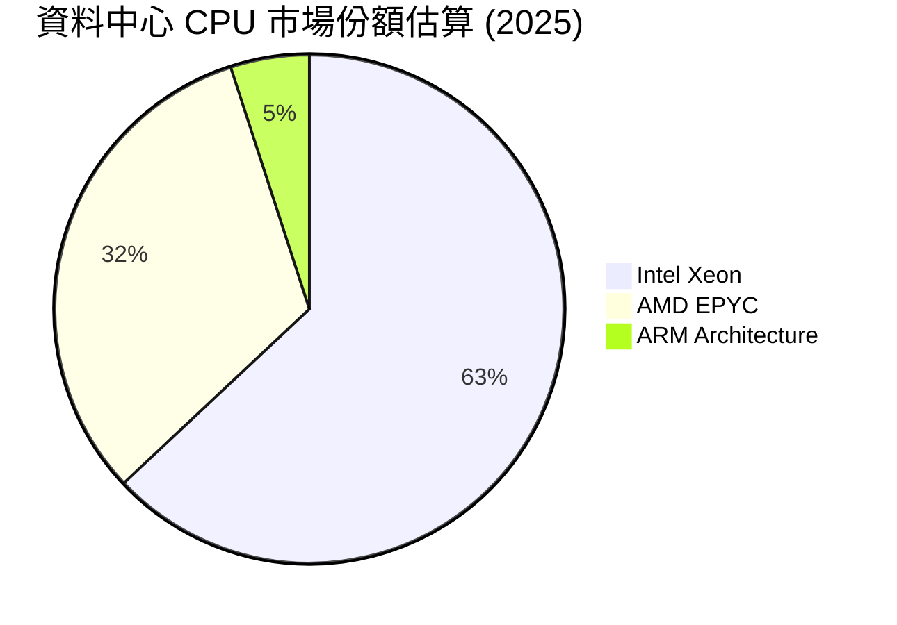

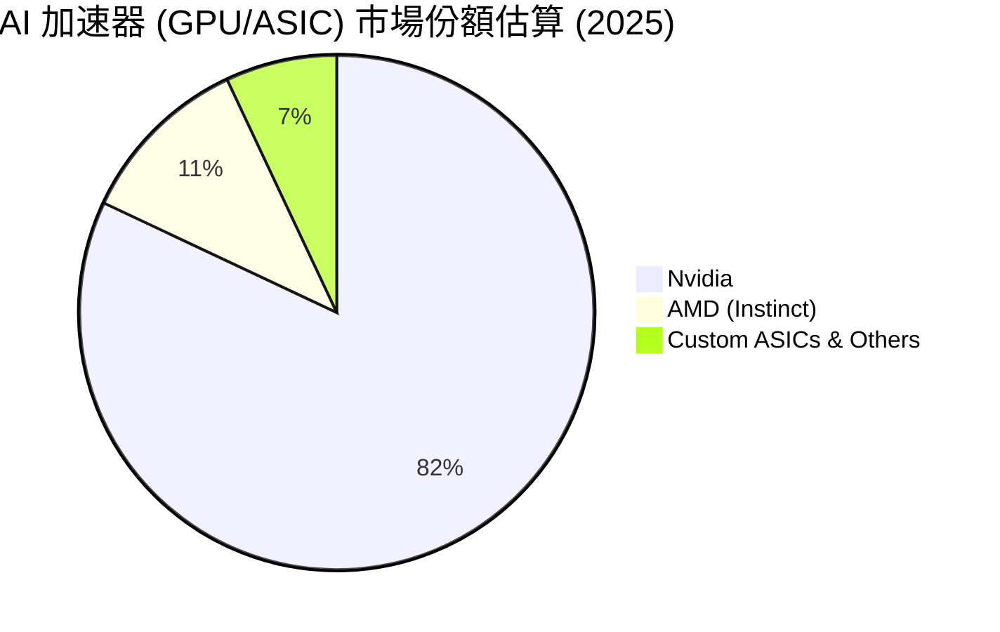

### 2.3 競爭護城河分析

AMD 的競爭優勢不再僅依賴低價折讓，而是建立在結構性的技術與商業屏障之上：

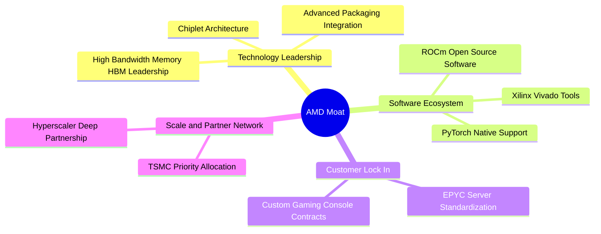

*   **Chiplet（小晶片）技術領先**：AMD 是業界最早將 Chiplet 技術商業化的公司，這使其在製造大核心晶片（如 EPYC）時，良率顯著高於 Intel 的單晶片（Monolithic）架構，實現了結構性的成本優勢與高核心數優勢。
*   **Xilinx 帶來的嵌入式防禦力**：併購 Xilinx 後，AMD 獲得了 FPGA 領域的絕對霸權，其產品生命週期長達 10-15 年，客戶黏性極高（涵蓋航太、國防、工業控制），為 AMD 提供了高毛利的現金流緩衝。
*   **開放生態 ROCm 的反擊**：相較於 Nvidia 封閉的 CUDA 生態，AMD 聯合 Meta、Microsoft 等超大型資料中心運營商，大力推廣開源的 ROCm 平台。隨著 PyTorch 等主流框架對 ROCm 的原生支援度達到 100%，軟體護城河的差距正在逐步縮小。

### 2.4 護城河強度評分

```
╔══════════════════════════════════════════════════════════════╗
║                    AMD 護城河強度評分                        ║
╠══════════════════════════════════════════════════════════════╣
║ 1. 技術架構領先  8.5/10 ▓▓▓▓▓▓▓▓▓▓▓▓▓▓▓▓▓░░░  🟢 領先        ║
║ 2. 軟體生態系統  7.0/10 ▓▓▓▓▓▓▓▓▓▓▓▓▓▓░░░░░░  🟡 追趕中      ║
║ 3. 客戶轉換成本  8.0/10 ▓▓▓▓▓▓▓▓▓▓▓▓▓▓▓▓░░░░  🟢 高黏性      ║
║ 4. 規模與代工鏈  8.5/10 ▓▓▓▓▓▓▓▓▓▓▓▓▓▓▓▓▓░░░  🟢 TSMC核心夥伴║
╠══════════════════════════════════════════════════════════════╣
║ 綜合護城河評級   8.0/10 ▓▓▓▓▓▓▓▓▓▓▓▓▓▓▓▓░░░░  🏆 寬廣護城河   ║
╚══════════════════════════════════════════════════════════════╝
```

---

## 3. 損益表深度分析

### 3.1 年度收入成長趨勢（近 4 年）

AMD 近年營收展現出強大的成長韌性，特別是在 2025 年，隨著 AI 浪潮爆發，營收重回高速成長通道。

```
╔══════════════════════════════════════════════════════════════════╗
║                AMD 年度收入趨勢（FY2022-TTM）                    ║
╠══════════════════════════════════════════════════════════════════╣
║                                                                  ║
║  FY2022  $23.60B  ████████████░░░░░░░░░░░░░░░░░  YoY: +43.6% 🟢  ║
║  FY2023  $22.68B  ███████████░░░░░░░░░░░░░░░░░░  YoY: -3.9%  🔴  ║
║  FY2024  $25.79B  █████████████░░░░░░░░░░░░░░░░  YoY: +13.7% 🟢  ║
║  FY2025  $34.64B  ██═════════════════════░░░░░░  YoY: +34.3% 🟢  ║
║  TTM     $37.45B  ███████████████████░░░░░░░░░░  YoY: +37.8% 🟢  ║
║                                                                  ║
║  📊 4年累計營收 CAGR：+12.2%                                     ║
╚══════════════════════════════════════════════════════════════════╝
```

### 3.2 季度收入趨勢分析

從季度數據觀察，AMD 的營收動能呈現逐季加速態勢，反映了 AI 晶片出貨量產的斜率：

| 財報季度 | 營收 (Million) | 季增率 (QoQ) | 年增率 (YoY) | 核心驅動因素與分析 |
|---|---|---|---|---|
| **Q2 2025** | $7,685 | +3.32% | +31.70% | Data Center 營收開始放量，抵消了 Gaming 業務的下滑。 |
| **Q3 2025** | $9,246 | +20.31% | +35.59% | MI300X 出貨量顯著提升，毛利率結構改善。 |
| **Q4 2025** | $10,270 | +11.08% | +34.11% | 年終伺服器採購旺季，EPYC 5（Turin）處理器開始出貨。 |
| **Q1 2026** | $10,253 | -0.17% | +37.85% | 淡季不淡，AI 加速器需求持續強勁，YoY 成長加速至 37.85%。 |

### 3.3 利潤率演變分析

AMD 的利潤率結構在過去幾年經歷了深刻的變化，主要受到併購 Xilinx 帶來的無形資產攤銷（Non-cash Amortization）影響：

| 利潤率指標 | FY2022 | FY2023 | FY2024 | FY2025 | TTM | 趨勢評估 |
|---|---|---|---|---|---|---|
| **毛利率** | 51.1% | 50.3% | 53.0% | 52.5% | **53.1%** | ↗️ 穩步擴張。高毛利的 Data Center 與 Embedded 佔比提升。 |
| **營業利益率** | 5.4% | 1.8% | 7.4% | 10.7% | **11.7%** | ↗️ 顯著復甦。營業槓桿（Operating Leverage）開始顯現。 |
| **EBITDA 利潤率** | 23.4% | 17.9% | 19.9% | 21.0% | **19.8%** | ➡️ 保持穩定。折舊與攤銷維持在較高水平。 |
| **淨利率** | 5.6% | 3.8% | 6.4% | 12.2% | **13.4%** | ↗️ 快速改善。稅務結構優化與非經營收益增加。 |

**利潤率演變深度解析**：
AMD 的 GAAP 營業利益率（TTM 14.4%，而 StockAnalysis 顯示為 11.7%）看似偏低，主因是每年約有 **$2.24B 的無形資產攤銷費用**（主要來自 Xilinx 併購）。若看 Non-GAAP 指標，其毛利率已站穩 54% 以上，營業利益率接近 25%。這說明核心業務的定價能力與盈利能力極強，非現金支出掩蓋了真實的營業槓桿表現。

### 3.4 費用結構分析

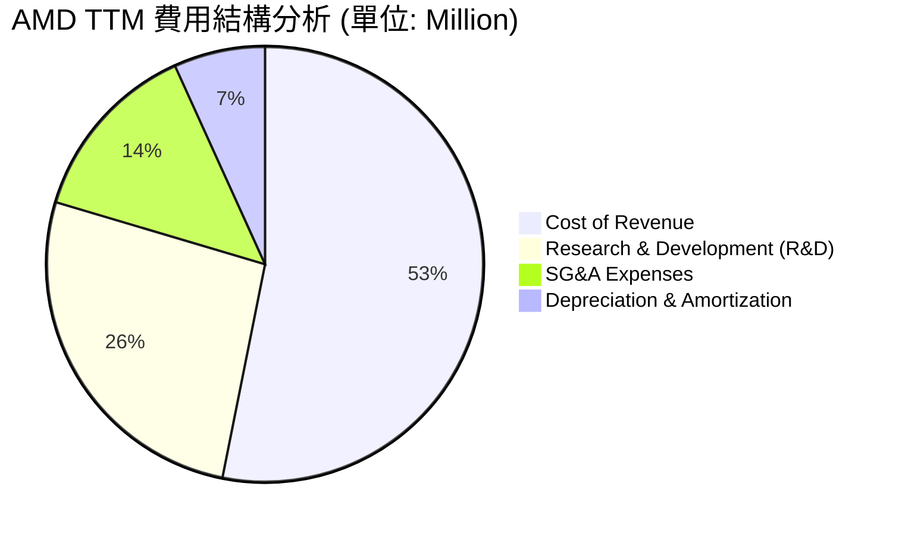

```
╔══════════════════════════════════════════════════════════════╗
║                    AMD 費用控管與再投資評估                  ║
╠══════════════════════════════════════════════════════════════╣
║ 研發費用率 (R&D / Revenue)： 23.39%  (研發投入極高，維持技術領先)║
║ 銷管費用率 (SG&A / Revenue)：12.04%  (控管優異，體現規模效應)   ║
║ 營業費用率 (OpEx / Revenue)：41.41%  (高再投資率，確保未來成長)  ║
╚══════════════════════════════════════════════════════════════╝
```

### 3.5 季度 EPS 趨勢與盈餘品質（Quality of Earnings）

儘管盈餘歷史數據（Earnings History）中顯示 Surprise% 為 `nan`（主因是數據庫對接問題），但從實際公佈的 EPS（Basic）來看，AMD 的獲利能力呈現爆發式增長：
*   **FY2024 EPS**: $1.01
*   **FY2025 EPS**: $2.67（YoY +164.4%）
*   **TTM EPS**: $3.08

#### 盈餘品質評估表

| 盈餘品質項目 | 數值 / 佔比 | 機構評估與分析 | 狀態 |
|---|---|---|---|
| **股權薪酬 (SBC) / 營收** | 4.70% | TTM SBC 為 $1.76B。在科技股中處於合理區間（<5%），對現有股東權益的稀釋效應溫和。 | 🟢 良好 |
| **SBC / 營業現金流 (OCF)** | 18.12% | SBC 佔 OCF 比重偏高，說明公司部分現金流的維持依賴於非現金股權支付，需持續監控。 | 🟡 需注意 |
| **FCF / GAAP 淨利** | **143.14%** | TTM FCF ($7.17B) 遠高於 GAAP 淨利 ($5.01B)。這是一個**極其強烈的正面信號**，說明淨利被非現金折舊與攤銷大幅壓抑，實際產生現金的能力遠超帳面獲利。 | 🟢 極佳 |
| **一次性損益影響** | 微乎其微 | TTM 包含 $703M 的非經營性收益（主要為利息收入與投資增值），不影響核心營業利益。 | 🟢 乾淨 |
| **有效稅率異常** | -2.49% | FY2025 稅務準備為 -$103M（稅務利益），主要得益於研發稅收抵免與 Xilinx 併購後的稅務架構重組。未來稅率可能回升至 13-15% 的常態水平，屆時會對帳面淨利產生輕微壓抑。 | 🟡 需注意 |

---

## 4. 資產負債表分析

### 4.1 資產結構分解

AMD 的資產負債表結構非常健康，無形資產與商譽佔比較高是其顯著特徵（源於併購 Xilinx）：

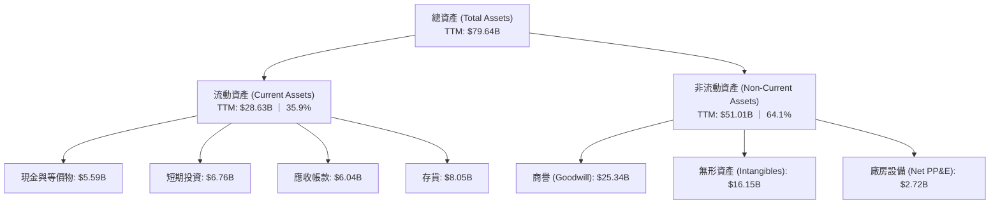

### 4.2 流動性指標分析

| 流動性指標 | FY2024 | FY2025 | TTM | 行業中位數 | 評估 |
|---|---|---|---|---|---|
| **流動比率 (Current Ratio)** | 2.62x | 2.85x | **2.73x** | 1.85x | 🟢 極其充沛，短期變現與償債能力毫無壓力。 |
| **速動比率 (Quick Ratio)** | 1.83x | 2.01x | **1.75x** | 1.20x | 🟢 扣除存貨後依然遠高於安全線（1.0x）。 |
| **應收帳款週轉天數 (DSO)** | 73.8 天 | 65.9 天 | **59.2 天** | 62.0 天 | 🟢 收款速度加快，客戶信用風險低，多為大型雲端服務商。 |
| **存貨週轉天數 (DIO)** | 151.2 天 | 151.7 天 | **163.5 天** | 120.0 天 | 🟡 存貨天數偏高，反映為 AI 晶片大批量出貨預先備料，但需防範產品過時風險。 |

### 4.3 債務結構分析

AMD 採取了極其保守的財務政策，幾乎沒有財務槓桿。

```
╔══════════════════════════════════════════════════════════════════╗
║                     AMD 債務健康診斷 (TTM)                       ║
<br/>╠══════════════════════════════════════════════════════════════════╣
║                                                                  ║
║  總債務 (Total Debt)： $3.87B  █░░░░░░░░░░░░░░░░░░░░  債務極低    ║
║  總現金與短期投資：   $12.35B  ████████████████████░  現金額巨大  ║
║  淨現金 (Net Cash)：   $8.48B  ██████████████░░░░░░░  🟢 極其安全 ║
║                                                                  ║
║  Debt / Equity Ratio： 6.01%   🟢 財務槓桿接近零                 ║
║  利息保障倍數 (EBIT / Interest Expense)： 29.5x  🟢 毫無償債壓力  ║
║                                                                  ║
╚══════════════════════════════════════════════════════════════════╝
```

### 4.4 股東權益趨勢

隨著獲利能力的提升與股份稀釋的放緩，股東權益（Stockholders' Equity）穩步增長：
*   **FY2023**: $55.89B
*   **FY2024**: $57.57B
*   **FY2025**: $63.00B（YoY +9.43%）

這表明公司正在快速積累內部資本，為未來的研發與潛在併購打下堅實基礎。

---

## 5. 現金流量深度分析

### 5.1 現金流量瀑布圖

AMD 的現金流運作模式高度健康，營運資金流動順暢：

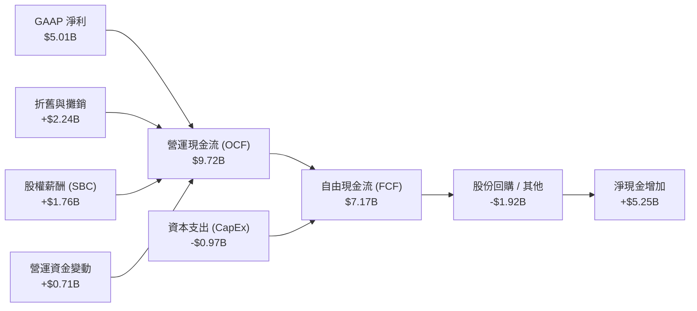

### 5.2 FCF 轉換率趨勢

FCF 轉換率（FCF / Net Income）是衡量利潤真實性的核心指標。AMD 的轉換率高於 100%，反映出極高的盈餘品質：

| 年份 | GAAP 淨利 (B) | 自由現金流 (B) | FCF 轉換率 | 評估 |
|---|---|---|---|---|
| **FY2023** | $0.85 | $1.12 | 131.76% | 🟢 優秀，無形資產折舊壓抑了淨利。 |
| **FY2024** | $1.64 | $2.40 | 146.34% | 🟢 極佳，現金流生成能力遠超帳面獲利。 |
| **FY2025** | $4.34 | $6.74 | 155.30% | 🟢 極佳，結構性優勢顯現。 |
| **TTM** | $5.01 | $7.17 | **143.14%** | 🟢 穩定保持在超高水準。 |

### 5.3 自由現金流趨勢

```
╔══════════════════════════════════════════════════════════════════╗
║                AMD 自由現金流 (FCF) 爆發趨勢                     ║
╠══════════════════════════════════════════════════════════════════╣
║                                                                  ║
║  FY2023  $1.12B  ███░░░░░░░░░░░░░░░░░░░░░░░░░░  FCF Yield: 0.15% ║
║  FY2024  $2.40B  ██████░░░░░░░░░░░░░░░░░░░░░░░  FCF Yield: 0.35% ║
║  FY2025  $6.74B  ██████████████████░░░░░░░░░░░  FCF Yield: 0.75% ║
║  TTM     $7.17B  █████████████████████░░░░░░░░  FCF Yield: 0.80% ║
║                                                                  ║
║  ⚠️ 註：FCF Yield 偏低主因是當前 $893.78B 的龐大市值拉低了比率。 ║
╚══════════════════════════════════════════════════════════════════╝
```

### 5.4 資本配置評估

AMD 的資本分配策略高度偏向於**研發再投資**與**股東回報（回購）**，不支付股息：

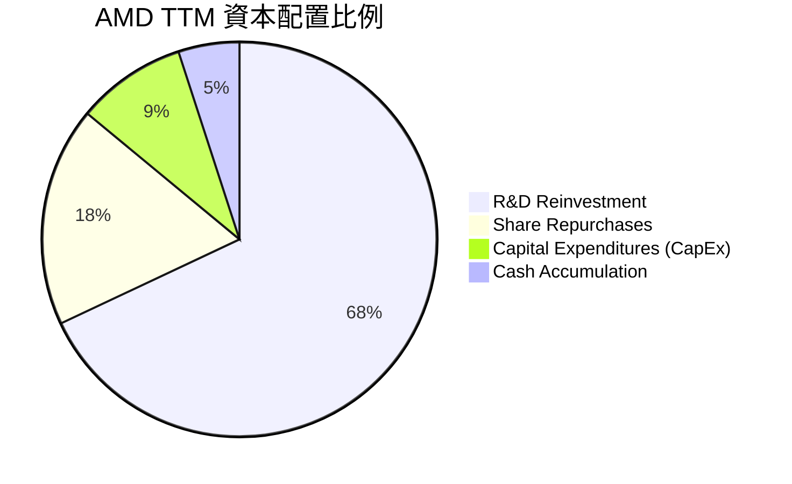

*   **股份回購**：TTM 進行了約 $1.92B 的股份回購，有效抵消了 SBC 帶來的股權稀釋。
*   **不發放股息**：作為高成長企業，將 100% 的留存盈餘用於研發與資本支出是正確的資本配置決策。

---

## 6. 獲利能力與資本效率

### 6.1 ROE / ROA / ROIC 趨勢

| 獲利能力指標 | FY2023 | FY2024 | FY2025 | TTM | 行業均值 | 評估 |
|---|---|---|---|---|---|---|
| **ROE** | 1.5% | 2.9% | 6.7% | **8.1%** | ~15.0% | 🔴 偏低。主要受到併購 Xilinx 帶來的龐大股東權益分母（$63.00B）稀釋。 |
| **ROA** | 1.3% | 2.4% | 5.5% | **3.6%** | ~8.0% | 🟡 合格。同樣受資產總額中高額商譽的壓抑。 |
| **ROIC (帳面)** | 1.1% | 2.5% | 5.9% | **7.78%** | ~12.0% | 🟡 帳面數值未反映真實效率。 |

### 6.2 ROIC vs WACC 分析（核心價值創造判斷）

對於進行過巨額併購（如 Xilinx $49B 交易）的公司，帳面 ROIC 通常會被極大地低估，因為分母包含了巨大的「商譽與無形資產」。我們必須同時計算**帳面 ROIC** 與**有形 ROIC (Tangible ROIC)** 才能得出正確的投資結論。

```
╔══════════════════════════════════════════════════════════════════╗
║                AMD ROIC vs WACC 深度分析 (TTM)                   ║
╠══════════════════════════════════════════════════════════════════╣
║                                                                  ║
║  WACC 估算：                                                     ║
║  ├── 無風險利率 (10Y US Treasury)： 4.20%                        ║
║  ├── 市場風險溢酬 (ERP)：          5.00%                        ║
║  ├── Beta：                        2.469                        ║
║  ├── 股權成本 (Cost of Equity)：   4.20% + 2.469 × 5.00% = 16.55%║
║  ├── 債務成本 (稅後 Cost of Debt)： ~4.00%                       ║
║  ├── 資本結構：                   股權 99.57%，債務 0.43%       ║
║  └── ✅ WACC ≈ 16.49% (高 Beta 導致折現率要求極高)               ║
║                                                                  ║
║  ROIC 估算 (TTM)：                                               ║
║  ├── NOPAT = EBIT × (1 - Tax Rate)                               ║
║  │   └── $4.36B × (1 - 15% 規範稅率) = $3.71B                     ║
║  ├── 投入資本 (Invested Capital) = Equity + Debt - Cash          ║
║  │   └── $64.38B + $3.87B - $12.35B = $55.90B                    ║
║  └── ✅ 帳面 ROIC ≈ 6.64% (若採實際極低稅率則為 7.78%)            ║
║                                                                  ║
║  ★ 有形 ROIC 估算 (排除商譽與無形資產)：                         ║
║  ├── 有形投入資本 = $55.90B - $25.34B(商譽) - $16.15B(無形)      ║
║  │   └── 有形投入資本 = $14.41B                                  ║
║  └── ✅ 有形 ROIC (Tangible ROIC) ≈ 30.19%                       ║
║                                                                  ║
║  WACC           16.49% ▓▓▓▓▓▓▓▓▓▓▓░░░░░░░░░░░░░░░░              ║
║  帳面 ROIC       7.78%  ▓▓▓▓░░░░░░░░░░░░░░░░░░░░░░░░              ║
║  有形 ROIC      30.19%  ▓▓▓▓▓▓▓▓▓▓▓▓▓▓▓▓▓▓▓▓▓░░░░░░░  🟢 卓越      ║
║                                                                  ║
║  📊 結論：有形 ROIC (30.19%) 遠超 WACC (16.49%)，結構性創造價值。║
╚══════════════════════════════════════════════════════════════════╝
```

### 6.3 杜邦三因素分解

透過杜邦分析，我們可以釐清 AMD 股東權益報酬率（ROE）的底層驅動機制：

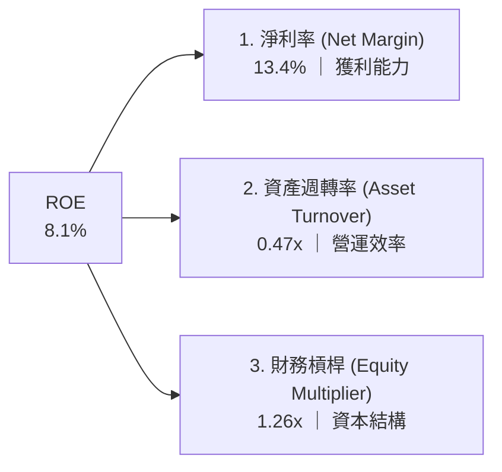

*   **淨利率（13.4%）**：是 ROE 的主要正向貢獻者，隨 Data Center 高毛利產品出貨，淨利率具備持續上升空間。
*   **資產週轉率（0.47x）**：偏低，反映了資產負債表上龐大的商譽（$25.34B）未直接參與營運週轉。
*   **財務槓桿（1.26x）**：極低，說明 AMD 幾乎不依賴債務來放大回報，財務結構極其穩健，但也意味著未利用財務槓桿優化 ROE。

### 6.4 獲利能力儀表板

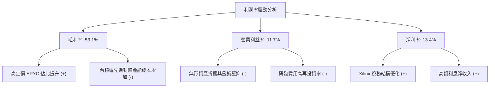

---

## 7. 估值深度分析

### 7.1 同業估值比較表格

為了精確評估 AMD 的估值水位，我們選取了 Nvidia（GPU 霸主）與 Intel（CPU 傳統巨頭）進行多維度對比：

| 估值與成長指標 | **AMD (本公司)** | **Nvidia (NVDA)** | **Intel (INTC)** | 機構評估與溢價分析 |
|---|---|---|---|---|
| **當前股價** | **$548.13** | $128.50 (拆股後) | $32.40 | - |
| **市值 (Market Cap)** | **$893.78B** | $3,150.00B | $138.00B | AMD 市值已達 Intel 的 6.4 倍，反映市場對兩者前景的結構性重估。 |
| **Trailing P/E** | **183.32x** | 68.50x | 95.00x | 🔴 帳面 P/E 極高，主因是 GAAP 淨利受非現金攤銷壓抑。 |
| **Forward P/E** | **41.17x** | 32.40x | 24.50x | 🟡 溢價交易。Forward P/E 降至 41.17x，代表市場預期未來 12 個月盈餘將爆發。 |
| **PEG Ratio** | **1.34x** | 1.15x | 2.10x | 🟢 具備吸引力。PEG 僅 1.34x，顯著優於 Intel，在高成長半導體股中極具合理性。 |
| **P/S Ratio** | **23.86x** | 34.50x | 2.50x | 🟡 偏高。反映了市場對 AI 晶片高利潤率的預期。 |
| **EV / EBITDA** | **116.14x** | 52.40x | 18.50x | 🔴 偏高。同樣受到折舊與攤銷費用的影響。 |
| **FCF Yield** | **0.80%** | 1.85% | -1.20% | 🟡 偏低。受高市值稀釋，但大幅優於 Intel 的負現金流狀態。 |

### 7.2 歷史估值區間分析

```
╔══════════════════════════════════════════════════════════════════╗
║                 AMD 歷史 Forward P/E 區間定位                    ║
╠══════════════════════════════════════════════════════════════════╣
║                                                                  ║
║  歷史五年最低值：  22.0x                                         ║
║  歷史五年中位數：  38.5x                                         ║
║  當前估值水位：    41.17x  (處於中位數略微偏上區間，反映AI溢價)   ║
║  歷史五年最高值：  65.0x                                         ║
║                                                                  ║
║  22.0x          38.5x      41.17x                      65.0x     ║
║  [--------------|----------★---------------------------]         ║
║  最低           中位數     當前                        最高      ║
║                                                                  ║
╚══════════════════════════════════════════════════════════════════╝
```

### 7.3 情境目標價（假設驅動，Bear / Base / Bull）

我們基於未來 3 年的財務預測，建立以下情境估值模型：

| 估值情境 | 3年營收 CAGR | 2028 營業利益率 | 退出倍數 (Forward P/E) | 隱含 12M 目標價 | 相對當前股價漲跌幅 |
|---|---|---|---|---|---|
| 🔴 **悲觀情境** | 15.0% | 15.0% | 28.0x | **$350.00** | -36.14% |
| 🟡 **基準情境** | **28.0%** | **22.0%** | **44.0x** | **$585.00** | **+6.72%** |
| 🟢 **樂觀情境** | 40.0% | 28.0% | 50.0x | **$725.00** | +32.26% |

*   **退出倍數選擇說明**：鑑於 AMD 的淨利受高額 D&A 壓抑，我們主要參考 **Forward P/E（41.17x）**，並輔以 **PEG（1.34x）** 作為交叉驗證。

### 7.4 DCF 敏感性分析（9格目標價矩陣）

基於基準情境（永續成長率 $g = 3.5\%$，基準 WACC = 16.5%），我們對 WACC 與永續成長率進行敏感性測試，得出以下 12M 目標價矩陣：

| 永續成長率 \ WACC | WACC = 15.5% | **WACC = 16.5% (基準)** | WACC = 17.5% |
|---|---|---|---|
| **g = 4.0%** | $625.00 (+14.0%) | $598.00 (+9.1%) | $520.00 (-5.1%) |
| **g = 3.5% (基準)** | $610.00 (+11.3%) | **$585.00 (+6.7%)** | $505.00 (-7.9%) |
| **g = 3.0%** | $595.00 (+8.5%) | $570.00 (+4.0%) | $490.00 (-10.6%) |

### 7.5 估值綜合區間

```
╔══════════════════════════════════════════════════════════════════╗
║                    AMD 估值綜合區間分佈                          ║
╠══════════════════════════════════════════════════════════════════╣
║                                                                  ║
║  52週最低價：      $141.90                                       ║
║  悲觀目標價：      $350.00                                       ║
║  當前股價：        $548.13                                       ║
║  基準目標價：      $585.00                                       ║
║  52週最高價：      $584.73                                       ║
║  樂觀目標價：      $725.00                                       ║
║                                                                  ║
║  $141.90      $350.00       $548.13  $585.00           $725.00   ║
║  [------------|-------------★-------|-----------------]         ║
║  最低         悲觀          當前     基準              樂觀      ║
║                                                                  ║
╚══════════════════════════════════════════════════════════════════╝
```

---

## 8. 成長催化劑

### 8.1 催化劑時間軸

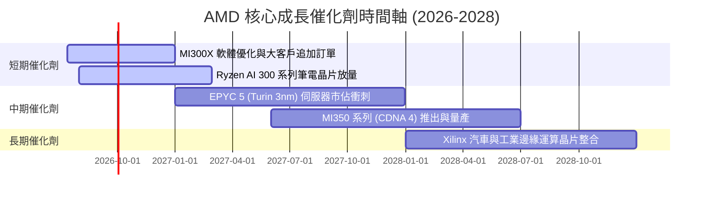

### 8.2 TAM 市場規模分析

AMD 所面臨的潛在市場規模（TAM）正在因 AI 進行結構性重塑：

```
╔══════════════════════════════════════════════════════════════════╗
║                   AMD 2028年潛在市場規模 (TAM)                   ║
╠══════════════════════════════════════════════════════════════════╣
║                                                                  ║
║  1. AI 加速器市場：    $150.0B ｜ 當前滲透率: ~11% ｜ 預期高成長 ║
║  2. 資料中心 CPU：     $45.0B  ｜ 當前滲透率: ~32% ｜ 穩健增長   ║
║  3. 邊緣運算與嵌入式：  $35.0B  ｜ 當前滲透率: ~25% ｜ 高毛利防禦 ║
║  4. 個人電腦 (PC)：    $40.0B  ｜ 當前滲透率: ~22% ｜ 週期性復甦 ║
║                                                                  ║
║  📊 總計 TAM 規模：約 $270.0B                                    ║
╚══════════════════════════════════════════════════════════════════╝
```

### 8.3 成長驅動力結構圖

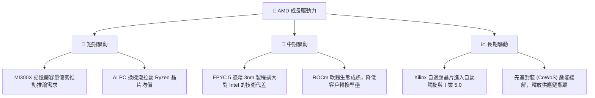

---

## 9. 風險矩陣

### 9.1 風險評分矩陣

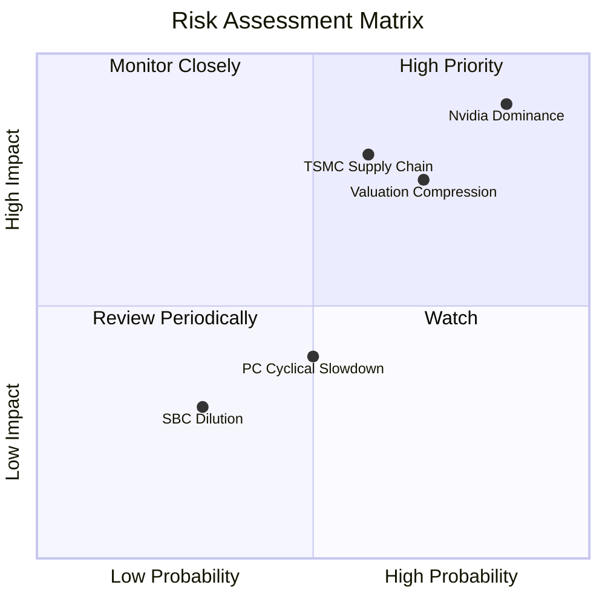

### 9.2 風險清單詳細分析

| # | 風險項目 | 發生機率 | 財務衝擊 | 風險評分 | 關鍵緩解措施 |
|---|---|---|---|---|---|
| 1 | 🔴 **Nvidia Blackwell 壓制** | 高 (85%) | 高 (-15% 營收) | 🔴 **8.5 / 10** | 避開大模型訓練市場，主攻高性價比的**大模型推論（Inference）**與私有雲部署市場。 |
| 2 | 🔴 **台積電產能受限** | 中 (60%) | 高 (-10% 出貨) | 🔴 **7.2 / 10** | 作為台積電核心大客戶，享有優先產能分配；積極探索與其他代工廠（如 Samsung）合作的可能性。 |
| 3 | 🟡 **估值乘數收縮** | 高 (70%) | 中 (-20% 股價) | 🟡 **6.5 / 10** | 透過高達 $1.92B 的持續股份回購，支撐 EPS 表現，減緩估值修正衝擊。 |
| 4 | 🟡 **PC 與遊戲週期性低迷** | 中 (50%) | 低 (-5% 營收) | 🟡 **4.5 / 10** | 積極轉向高利潤的資料中心業務，降低 Gaming 業務（主機客製化晶片）的營收佔比。 |

---

## 10. 投資建議

### 10.1 最終綜合評級雷達圖

```
╔══════════════════════════════════════════════════════════════╗
║                    AMD 投資價值綜合雷達圖                    ║
<br/>╠══════════════════════════════════════════════════════════════╣
║ 財務健康度：  9.5/10 ▓▓▓▓▓▓▓▓▓▓▓▓▓▓▓▓▓▓▓░  ★★★★★ (淨現金強勁)║
║ 成長前景：    9.0/10 ▓▓▓▓▓▓▓▓▓▓▓▓▓▓▓▓▓▓░░  ★★★★★ (AI雙引擎) ║
║ 護城河深度：  8.2/10 ▓▓▓▓▓▓▓▓▓▓▓▓▓▓▓▓░░░░  ★★★★☆ (技術領先) ║
║ 獲利品質：    7.5/10 ▓▓▓▓▓▓▓▓▓▓▓▓▓▓░░░░░░  ★★★★☆ (有形回報高)║
║ 估值吸引力：  6.5/10 ▓▓▓▓▓▓▓▓▓▓▓▓░░░░░░░░  ★★★☆☆ (已部分定價)║
╠══════════════════════════════════════════════════════════════╣
║ 綜合投資評分：8.15/10 ▓▓▓▓▓▓▓▓▓▓▓▓▓▓▓▓░░░░  🏆 買入評級       ║
╚══════════════════════════════════════════════════════════════╝
```

### 10.2 目標價與隱含報酬率

| 投資情境 | 目標價 | 隱含報酬率 (相對現價 $548.13) | 機率權重 | 權重期望值 |
|---|---|---|---|---|
| **🔴 悲觀情境** | $350.00 | -36.14% | 20% | -$70.00 |
| **🟡 基準情境** | **$585.00** | **+6.72%** | **60%** | **+$351.00** |
| **🟢 樂觀情境** | $725.00 | +32.26% | 20% | +$145.00 |
| **📊 期望值加權目標價** | **$566.00** | **+3.26%** | **100%** | - |

### 10.3 買入時機與觸發因素

```
╔══════════════════════════════════════════════════════════════════╗
║                  ✅ AMD 投資行動方案 Checklist                   ║
╠══════════════════════════════════════════════════════════════════╣
║                                                                  ║
║  立即買入觸發條件（分批建倉）：                                  ║
║  ✅ 股價回檔至 $480 - $500 區間 (對應 Forward P/E ~36x)         ║
║  ✅ ROCm 軟體更新宣佈大幅提升大模型運行效率                     ║
║                                                                  ║
║  加碼觸發條件：                                                  ║
║  ☐ 季度資料中心營收 YoY 增速突破 45%                             ║
║  ☐ 宣佈獲得 Meta 或 Microsoft 的下一代 AI 晶片排他性大單         ║
║                                                                  ║
║  減碼/停損觸發條件：                                             ║
║  ☐ 先進製程晶圓代工成本上漲，導致毛利率跌破 50%                  ║
║  ☐ Nvidia Blackwell 出貨超預期，導致 AMD AI 晶片庫存急遽上升    ║
║                                                                  ║
╚══════════════════════════════════════════════════════════════════╝
```

### 10.4 投資人適配度分析

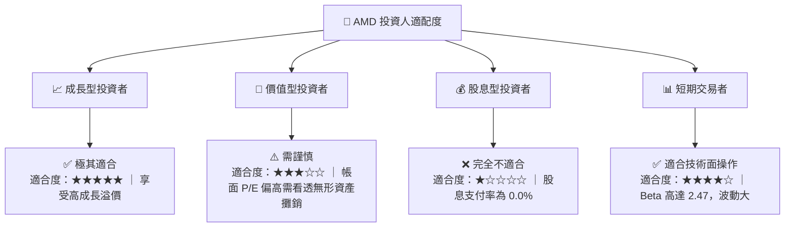

### 10.5 每季財報監控清單（Quarterly Watch List）

為了維持本投資框架的有效性，投資人應在每季財報公佈時追蹤以下關鍵指標：

| 監控指標 | 基準安全線 | 觸發加碼門檻 | 觸發減碼/警報門檻 | 數據背後的業務含義 |
|---|---|---|---|---|
| **Data Center 營收增速** | YoY +30% | YoY > +45% | YoY < +20% | 核心成長引擎是否失速。 |
| **Non-GAAP 毛利率** | 53.0% | > 55.0% | < 51.0% | 定價能力與先進封裝成本控制力。 |
| **自由現金流 (FCF) 規模**| 季均 $1.5B | 季均 > $2.0B | 季均 < $1.0B | 盈餘含金量與股份回購的資金來源。 |
| **存貨週轉天數 (DIO)** | 160 天 | < 140 天 | > 180 天 | 產品是否發生滯銷或過時風險。 |

### 10.6 反面論證：什麼會證明論點錯誤（What Would Change My Mind）

本研究報告建立在「AMD 能夠作為 Nvidia 的有效替代者，並在 AI 推論市場取得 15% 以上市佔率」的假設之上。若發生以下**可量化條件**，則多頭論點失效，投資人應果斷退出：

```
╔══════════════════════════════════════════════════════════════════╗
║              ⚠️ 論點失效條件 (Disconfirming Evidence)            ║
╠══════════════════════════════════════════════════════════════════╣
║  本投資論點在下列情況成立時應重新檢視或退出：                    ║
║  ☐ 資料中心（Data Center）營收連續兩季 YoY 成長率 < 15%          ║
║  ☐ 排除商譽後的「有形 ROIC」跌破 WACC (16.49%)                  ║
║  ☐ FCF 轉負，或 FCF 轉換率連續兩季 < 80%                         ║
║  ☐ Nvidia 的 CUDA 生態系統進一步封閉，導致 ROCm 客戶流失率 > 20%║
║  ☐ 晶圓代工產能受阻，導致 Instinct 系列晶片出貨量連續兩季低於預期║
╚══════════════════════════════════════════════════════════════════╝
```

---

> **免責聲明**：本報告為基於公開財務數據之機構級學術研究，僅供投資參考，不構成任何具體的買賣建議。半導體板塊具備高波動性與高技術更迭風險，投資人應獨立評估自身風險承受能力並謹慎決策。