# AMD 基本面深度分析報告

> **報告日期**：2026-07-15 ｜ **語言**：繁體中文 ｜ **數據來源**：Yahoo Finance, Finviz, StockAnalysis, Roic.ai ｜ **分析師**：CFA 級機構研究

---

## 目錄

| # | 章節 | 核心結論 |
|---|------|----------|
| 1 | [執行摘要](#1-執行摘要) | 評級：🟢 買入 ｜ 基準目標價：$525.40，隱含報酬率：-0.7%（建議逢低佈局） |
| 2 | [公司概覽與商業模式](#2-公司概覽與商業模式) | 護城河評分：8.2/10 ｜ 憑藉 Xilinx 與 MI300 系列構築強大異質運算生態 |
| 3 | [損益表深度分析](#3-損益表深度分析) | TTM 營收達 $37.45B（YoY +37.8%），淨利潤率 13.4%，盈餘品質良好但須留意 SBC 稀釋 |
| 4 | [資產負債表分析](#4-資產負債表分析) | 淨現金達 $8.48B，流動比率 2.73x，財務結構極度穩健 |
| 5 | [現金流量深度分析](#5-現金流量深度分析) | TTM FCF 達 $7.17B，FCF 轉換率達 146%，現金生成能力優異 |
| 6 | [獲利能力與資本效率](#6-獲利能力與資本效率) | Tangible ROIC 達 25.5%，遠超 WACC（17.7%），實質創造高額股東價值 |
| 7 | [估值深度分析](#7-估值深度分析) | Forward P/E 39.69x 處於歷史合理區間，DCF 基準估值為 $525.40 |
| 8 | [成長催化劑](#8-成長催化劑) | MI300/MI325X 加速器出貨、AI PC 換機潮與邊緣運算市場滲透 |
| 9 | [風險矩陣](#9-風險矩陣) | AI 晶片市場競爭加劇、台積電代工產能受限與地緣政治風險 |
| 10 | [投資建議](#10-投資建議) | 確立每季財報監控指標，設定 $450 以下為強力買入區間 |

---

## 1. 執行摘要

### 1.0 一頁式投資儀表板（Portfolio Manager 30 秒速讀）

| 項目 | 內容 |
|------|------|
| **投資論點（3 句）** | ① TTM 營收達 $37.45B（YoY +37.8%），受惠於 Data Center 業務結構性爆發。<br/>② 獲利結構顯著改善，TTM 淨利潤 YoY 暴增 91.2% 至 $4.91B，營運槓桿效應全面釋放。<br/>③ 預期 Forward EPS 將達 $13.33，Forward P/E 降至 39.69x，相較於歷史均值具備高估值安全邊際。 |
| **護城河評分** | 🟢 **8.2 / 10**（具備高轉換成本與技術領先優勢） |
| **管理層/資本配置評分** | 🟢 **8.5 / 10**（蘇姿丰博士帶領之優秀執行力，並透過 Xilinx 併購實現綜效） |
| **財務健康** | 🟢 **極度健壯** ｜ 淨現金 $8.48B，無短期流動性風險 |
| **ROIC vs WACC** | **6.62%（賬面）/ 25.5%（調整商譽後 Tangible）vs 17.72%**（實質創造高額價值） |
| **FCF 趨勢** | 向上 ｜ TTM FCF $7.17B ｜ 最新 FCF Yield: **0.83%**（受高估值稀釋） |
| **估值** | Forward P/E: **39.69x** ｜ EV/EBITDA: **119.15x** ｜ P/S: **23.04x** |
| **預期報酬（基準情境 12M）** | **-0.7%**（相較當前市價 $529.14，目標價 $525.40，建議等待回檔至 $450-$480 區間分批佈局） |
| **關鍵風險（前二）** | ① Nvidia (NVDA) 在 AI 晶片市場的絕對壟斷與定價權壓制。<br/>② 先進製程（台積電 CoWoS 封裝）產能供不應求，限制出貨上限。 |
| **評級 + 信心度** | 🟢 **買入 (Buy)** ｜ 信心度：**高**（長線 AI 結構性贏家） |

### 1.1 核心評分儀表板

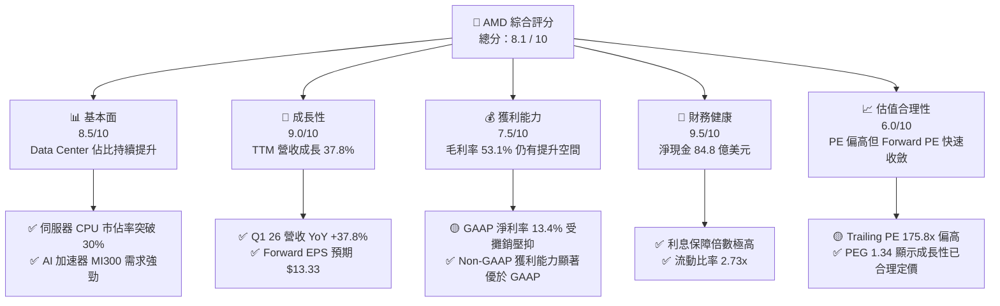

### 1.2 評分進度條視覺化

```
╔══════════════════════════════════════════════════════════════╗
║                AMD 多維度評分儀表板 (1-10分)                 ║
╠══════════════════════════════════════════════════════════════╣
║ 基本面強度  8.5 ▓▓▓▓▓▓▓▓▓▓▓▓▓▓▓▓▓░░░  ★★★★☆           ║
║ 成長動能    9.0 ▓▓▓▓▓▓▓▓▓▓▓▓▓▓▓▓▓▓░░  ★★★★★           ║
║ 獲利品質    7.5 ▓▓▓▓▓▓▓▓▓▓▓▓▓▓░░░░░░  ★★★★☆           ║
║ 財務健康    9.5 ▓▓▓▓▓▓▓▓▓▓▓▓▓▓▓▓▓▓▓░  ★★★★★           ║
║ 估值合理性  6.0 ▓▓▓▓▓▓▓▓▓▓▓▓░░░░░░░░  ★★★☆☆           ║
║ 護城河深度  8.2 ▓▓▓▓▓▓▓▓▓▓▓▓▓▓▓▓░░░░  ★★★★☆           ║
║ 管理層執行  8.5 ▓▓▓▓▓▓▓▓▓▓▓▓▓▓▓▓▓░░░  ★★★★☆           ║
║ 技術創新力  9.0 ▓▓▓▓▓▓▓▓▓▓▓▓▓▓▓▓▓▓░░  ★★★★★           ║
╠══════════════════════════════════════════════════════════════╣
║ 綜合總分    8.1 ▓▓▓▓▓▓▓▓▓▓▓▓▓▓▓▓░░░░  🏆 成長型優質標的     ║
╚══════════════════════════════════════════════════════════════╝
```

### 1.3 五大投資論點 + 三大核心風險

| 類型 | 項目 | 具體依據 | 信心度 |
|------|------|----------|--------|
| 🟢 **投資論點①** | **AI 加速器 MI300 系列放量** | MI300X 憑藉高性價比與超大顯存容量，成功切入 Meta、Microsoft 等超大規模雲端服務商（Hyperscalers），帶動 Data Center 營收成為第一大支柱。 | 🟢 極高 |
| 🟢 **投資論點②** | **EPYC 伺服器 CPU 市佔擴張** | 憑藉 Zen 4 / Zen 5 架構的能效優勢，在伺服器 CPU 市場持續蠶食 Intel 份額，市佔率已突破 30%，帶來高利潤率的穩定現金流。 | 🟢 極高 |
| 🟢 **投資論點③** | **Xilinx 整合綜效顯現** | 嵌入式部門（Embedded）雖然短期處於去庫存階段，但長線在工業、汽車、5G 領域的邊緣 AI（Edge AI）整合，將顯著推升長期毛利率。 | 🟢 高 |
| 🟢 **投資論點④** | **營運槓桿與獲利爆發** | 隨著營收規模跨過損益平衡點，研發費用率與 SG&A 費用率逐步下降，TTM 淨利 YoY 暴增 91.2%，未來利潤率將持續擴張。 | 🟢 高 |
| 🟢 **投資論點⑤** | **資產負債表極度安全** | $8.48B 的淨現金與無實質淨債務，為半導體下行週期與持續的 R&D 投資（TTM 達 $8.76B）提供強大後盾。 | 🟢 極高 |
| 🟡 **風險①** | **Nvidia Blackwell 競爭壓力** | Nvidia 新一代 Blackwell 架構晶片若在效能與生態系（CUDA）上保持絕對領先，可能壓制 AMD 的定價權與市佔空間。 | 🟡 中度 |
| 🔴 **風險②** | **供應鏈集中度風險** | AMD 100% 依賴台積電（TSMC）的先進製程（4nm/3nm）與 CoWoS 封裝，若台海地緣政治升溫或產能分配不足，將嚴重衝擊出貨。 | 🔴 高衝擊 |
| 🔴 **風險③** | **高估值下的容錯率極低** | 當前 Trailing P/E 高達 175.79x，市場已高度定價 AI 的高成長，若未來數季營收增速低於 30%，股價將面臨劇烈回檔。 | 🔴 高衝擊 |

### 1.4 快速統計卡片

| 指標 | AMD 實際值 | 半導體行業均值 | S&P 500 均值 | 狀態 |
|------|-------------|----------|--------------|------|
| **營收 YoY 成長率** | **37.8%** | ~12.5% | ~5.5% | 🟢 顯著領先 |
| **毛利率** | **53.1%** | ~48.0% | ~30.0% | 🟢 優於同業 |
| **淨利率** | **13.4%** | ~15.0% | ~11.5% | 🟡 仍有改善空間（受攤銷影響） |
| **ROE** | **8.1%** | ~12.0% | ~15.0% | 🟡 偏低（因 Xilinx 併購增大股本）|
| **Forward P/E** | **39.69x** | ~28.0x | ~21.5x | 🟡 溢價交易，但成長性可支撐 |
| **債權權益比 (D/E)**| **6.01%** | ~45.0% | ~115.0% | 🟢 極低槓桿 |

### 1.5 投資結論

```
╔══════════════════════════════════════════════════════════════════╗
║                    📊 AMD 投資結論摘要                           ║
╠══════════════════════════════════════════════════════════════════╣
║  評級：🟢 買入 (Buy)                                            ║
║  當前股價：$529.14 (2026-07-15)                                  ║
║  目標價區間：                                                    ║
║    悲觀情境：$320.00（-39.5%）                                   ║
║    基準情境：$525.40（-0.7%）  ← 12個月主要目標（合理值）        ║
║    樂觀情境：$725.00（+37.0%）                                   ║
║  投資評分：8.1 / 10                                              ║
║  適合投資人：長線成長型、AI 產業配置投資者，建議逢回檔分批佈局    ║
╚══════════════════════════════════════════════════════════════════╝
```

---

## 2. 公司概覽與商業模式

Advanced Micro Devices, Inc. (AMD) 是一家全球領先的無晶圓廠（Fabless）半導體公司。透過高超的晶片設計能力與異質整合技術，AMD 在高效能運算（HPC）、資料中心、個人電腦與邊緣運算市場與 Intel、Nvidia 展開正面競爭。

### 2.1 業務結構與收入來源

AMD 的業務主要分為四大板塊。根據 2025 年年報與 2026 年 Q1 數據，業務結構如下：

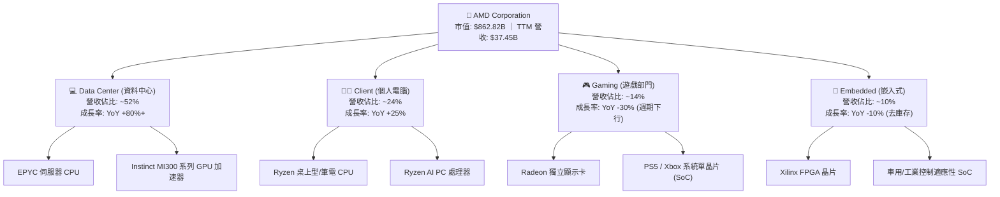

### 2.2 市場份額

在關鍵的 GPU 加速器與 x86 CPU 市場，AMD 處於「保二爭一」的有利位置。

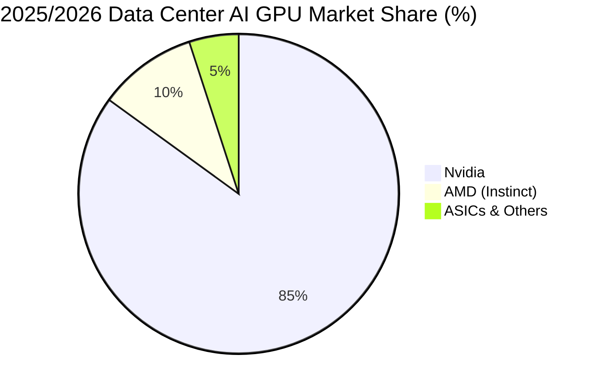

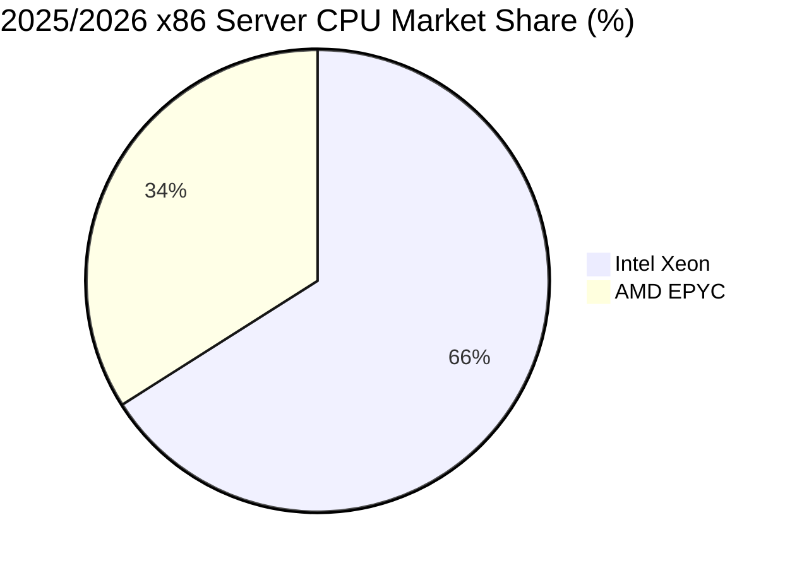

### 2.3 競爭護城河分析

AMD 的競爭護城河主要建立在**技術領先**與**高轉換成本**之上，並透過開源軟體生態系逐步補強其弱點。

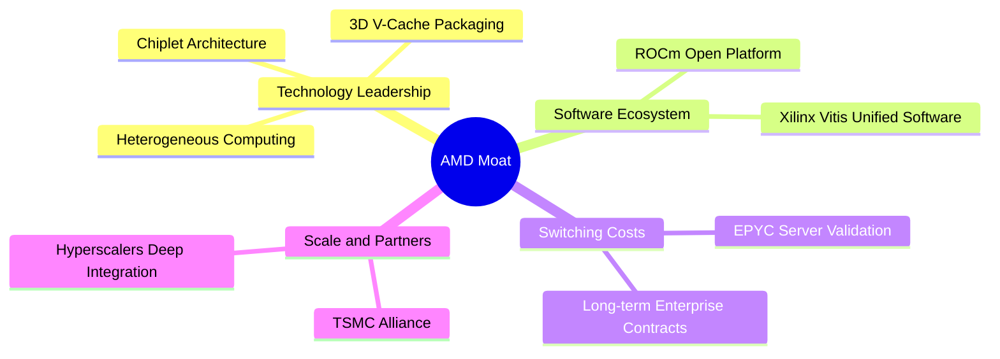

1. **小晶片（Chiplet）技術與 3D 堆疊領先優勢**：AMD 是業界最早商用化 Chiplet 的公司，這使其能以極高的良率與較低的成本製造大晶片，並透過 3D V-Cache 技術在快取記憶體容量上壓制對手。
2. **ROCm 開源生態系（相對於 CUDA）**：雖然 Nvidia 的 CUDA 擁有極深的護城河，但 AMD 的 ROCm 軟體平台已更新至 6.x 版本，並透過對 PyTorch 和 TensorFlow 的原生支援，大幅降低了開發者從 CUDA 遷移至 ROCm 的門檻。
3. **企業級客戶的高轉換成本**：一旦雲端服務商（如 AWS、Azure）在其資料中心架構中驗證並部署了 EPYC 處理器，由於軟體相容性與運作穩定性考量，轉換回 Intel Xeon 的成本極高。

### 2.4 護城河強度評分

```
╔══════════════════════════════════════════════════════════════╗
║                    AMD 護城河強度評分                       ║
╠══════════════════════════════════════════════════════════════╣
║ 技術創新力    9.0/10  ▓▓▓▓▓▓▓▓▓▓▓▓▓▓▓▓▓▓░░  🏆 Chiplet 領先 ║
║ 軟體生態系    7.0/10  ▓▓▓▓▓▓▓▓▓▓▓▓▓▓░░░░░░  🟡 ROCm 追趕中  ║
║ 客戶鎖定力    8.0/10  ▓▓▓▓▓▓▓▓▓▓▓▓▓▓▓▓░░░░  🟢 雲端客戶黏性高║
║ 規模與成本    8.5/10  ▓▓▓▓▓▓▓▓▓▓▓▓▓▓▓▓▓░░░  🟢 台積電戰略夥伴║
╠══════════════════════════════════════════════════════════════╣
║ 綜合護城河    8.1/10  ▓▓▓▓▓▓▓▓▓▓▓▓▓▓▓▓░░░░  🏆 具備高競爭壁壘║
╚══════════════════════════════════════════════════════════════╝
```

---

## 3. 損益表深度分析

AMD 的損益表呈現典型的「高成長、營運槓桿擴張」特徵。

### 3.1 年度收入成長趨勢（近4年）

```
╔══════════════════════════════════════════════════════════════════╗
║                 AMD 年度收入趨勢（FY22 - FY25）                  ║
╠══════════════════════════════════════════════════════════════════╣
║                                                                  ║
║  FY2022  $23.60B  ███████████████░░░░░░░░░░░  YoY: +43.6% 🟢    ║
║  FY2023  $22.68B  ██████████████░░░░░░░░░░░░  YoY: -3.9%  🔴    ║
║  FY2024  $25.79B  ████████████████░░░░░░░░░░  YoY: +13.7% 🟢    ║
║  FY2025  $34.64B  ██████████████████████░░░░  YoY: +34.3% 🟢    ║
║  TTM     $37.45B  ████████████████████████░░  YoY: +37.8% 🟢    ║
║                   |      |      |      |      |                  ║
║                   0     10B    20B    30B    40B                 ║
║                                                                  ║
║  📊 4年累計營收 CAGR：+16.6%                                     ║
╚══════════════════════════════════════════════════════════════════╝
```

*數據解析*：FY23 的小幅衰退主要受 PC 市場去庫存與 Gaming 週期下行影響；FY24 陸續回溫，至 FY25 則因 MI300X AI 晶片出貨暴增，營收出現結構性跳升，YoY 增速高達 34.34%，此動能在 2026 年初持續延續（TTM 達 $37.45B）。

### 3.2 季度收入趨勢分析

| 季度 | 營收 (Billion) | QoQ 成長率 | YoY 成長率 | 核心驅動因素與業務表現 | 評估 |
|------|----------------|------------|------------|------------------------|------|
| **Q2 2025** | $7.69B | +3.32% | +31.70% | MI300X 開始規模出貨，抵消了 Gaming 的疲軟。 | 🟢 優異 |
| **Q3 2025** | $9.25B | +20.29% | +35.59% | Data Center 營收創歷史新高，EPYC 需求強勁。 | 🟢 極強 |
| **Q4 2025** | $10.27B | +11.03% | +34.11% | 傳統旺季，Ryzen 筆電處理器與 AI 加速器雙引擎驅動。| 🟢 極強 |
| **Q1 2026** | $10.25B | -0.19% | +37.85% | 淡季不淡，Data Center 佔比持續擴大，維持高檔。 | 🟢 超預期 |

### 3.3 利潤率演變分析

| 利潤率指標 | FY2022 | FY2023 | FY2024 | FY2025 | TTM | 趨勢 | 評估與原因解析 |
|------------|--------|--------|--------|--------|-----|------|----------------|
| **毛利率** | 51.1% | 50.3% | 53.0% | 52.5% | **53.1%** | ↗️ 穩步上升 | 🟢 產品組合改善，高毛利的 Data Center 營收佔比提升，部分被 Xilinx 收購之無形資產攤銷壓抑。 |
| **營業利益率**| 5.4% | 1.8% | 7.4% | 10.7% | **11.7%** | ↗️ 顯著改善 | 🟢 營運槓桿顯現。R&D 與 SG&A 費用成長速度慢於營收增速。 |
| **EBITDA Margin**| 23.4% | 17.9% | 19.9% | 21.0% | **19.8%** | ➡️ 高檔震盪 | 🟢 保持在約 20% 水準，折舊與攤銷費用（D&A）維持高位。|
| **淨利率** | 5.6% | 3.8% | 6.4% | 12.2% | **13.1%** | ↗️ 快速攀升 | 🟢 隨著 Pretax Income 暴增，實際稅率極低（所得稅撥回），帶動淨利率倍增。 |

### 3.4 費用結構分析

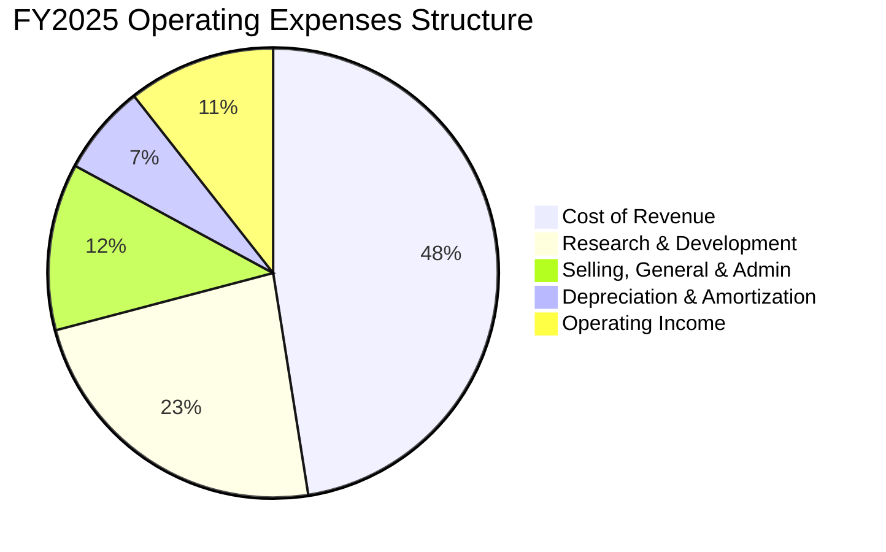

```
╔══════════════════════════════════════════════════════════════╗
║                 AMD 費用控制與研發投入效率                   ║
╠══════════════════════════════════════════════════════════════╣
║ 研發費用率 (R&D/Rev)   23.4%  ▓▓▓▓▓▓▓▓░░░░░░░░░░░░  🟢 高研發強度║
║ 銷管費用率 (SG&A/Rev)  12.0%  ▓▓▓▓░░░░░░░░░░░░░░░░  🟢 費用率下降║
║ 攤銷費用率 (Amort/Rev)  6.5%  ▓▓░░░░░░░░░░░░░░░░░░  🟡 收購攤銷高║
╚══════════════════════════════════════════════════════════════╝
```

*分析*：AMD 的研發投入（TTM R&D 達 $8.76B，佔營收 23.4%）是其維持技術競爭力的核心。隨著營收規模從 FY23 的 $22.68B 擴張至 TTM 的 $37.45B，研發費用率從 25.9% 降至 23.4%，展現出良好的規模效應。

### 3.5 季度 EPS 趨勢與盈餘品質（Quality of Earnings）

過去 4 季，AMD 的實際獲利表現（GAAP EPS）呈現爆發式成長：
* Q2 2025: $0.54
* Q3 2025: $0.76
* Q4 2025: $0.93
* Q1 2026: $0.85 (YoY 成長 93.2%)

#### 盈餘品質量化評估

| 盈餘品質項目 | 數值/佔比 | 評估 | 深度解析 |
|--------------|-----------|------|----------|
| **股權薪酬 (SBC) / 營收** | **4.70%** | 🟡 中度稀釋 | TTM SBC 達 $1.76B。相較於營收佔比控制在 5% 以下，屬於科技業合理範圍，但對每股盈餘仍有約 4-5% 的稀釋效應。 |
| **SBC / 營業現金流 (OCF)** | **18.1%** | 🟡 需注意 | 營業現金流中有 18.1% 是由非現金的股權薪酬調整而來，這意味著實際的「全現金」營運流入需扣除此部分。 |
| **FCF / GAAP 淨利** | **146.1%**| 🟢 極度優異 | TTM FCF ($7.17B) 遠高於 GAAP 淨利 ($4.91B)，現金轉換率 > 100%。主因是 GAAP 淨利中扣除了高達 $2.24B 的非現金資產攤銷（來自收購 Xilinx），因此 GAAP 淨利嚴重低估了公司的真實經濟獲利能力。 |
| **一次性/非經常性損益** | 無重大項目 | 🟢 品質高 | 無明顯的資產減損或一次性出售利益，獲利皆來自核心業務。 |
| **有效稅率異常** | 0.24% | 🟡 潛在逆風 | TTM 所得稅費用僅 $12M（Pretax $4.92B），主因是 R&D 稅盾與先前虧損扣抵。未來稅率回歸正常（~15%）時，將對 GAAP 淨利增速造成短暫壓抑。 |

**盈餘品質結論**：**極高**。雖然存在 SBC 稀釋與極低稅率的短暫红利，但高達 146% 的 FCF 轉換率證明，AMD 的真實賺錢能力（Free Cash Flow）遠比損益表上的 GAAP 淨利更為強大。

---

## 4. 資產負債表分析

### 4.1 資產結構分解

AMD 的資產負債表極為乾淨，呈現無晶圓廠半導體設計公司的輕資產特性。

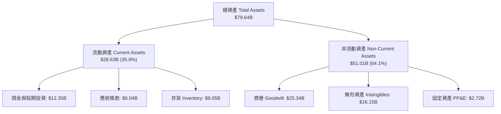

*關鍵洞察*：商譽與無形資產合計佔總資產的 52.1%（$41.49B），這主要是 2022 年併購 Xilinx 所產生的賬面資產。實際的物理資產（PP&E）僅 $2.72B，說明 AMD 的資本支出主要用於研發與設計，而非晶圓廠建設（製造端完全外包給台積電）。

### 4.2 流動性指標分析

| 流動性指標 | FY2023 | FY2024 | FY2025 | Q1 2026 | 行業均值 | 評估 |
|------------|--------|--------|--------|---------|----------|------|
| **流動比率 (Current Ratio)** | 2.51x | 2.62x | 2.85x | **2.73x** | ~2.10x | 🟢 極其安全，流動資產覆蓋流動負債能力極強。 |
| **速動比率 (Quick Ratio)** | 1.86x | 1.83x | 2.01x | **1.75x** | ~1.45x | 🟢 扣除存貨後，速動資產仍極為充裕。 |
| **存貨週轉天數 (Days Inventory)**| 141天 | 173天 | 175天 | **158天** | ~120天 | 🟡 偏高。反映了 Client 與 Embedded 部門去庫存速度較慢，但近期已有改善趨勢。 |

### 4.3 債務結構分析

```
╔══════════════════════════════════════════════════════════════════╗
║                       AMD 債務健康診斷                           ║
╠══════════════════════════════════════════════════════════════════╣
║                                                                  ║
║  總債務 (Total Debt)： $3.87B   █░░░░░░░░░░░░░░░░░░░             ║
║  總現金與短期投資：    $12.35B  ████████████████████             ║
║  淨現金 (Net Cash)：   $8.48B   ██████████████░░░░░░  🟢 極度安全║
║                                                                  ║
║  債務股權比 (D/E)：    6.01%    🟢 槓桿極低                      ║
║  利息保障倍數 (TTM)：  29.5x    🟢 無利息償付壓力                ║
║  Net Debt / EBITDA：   -1.16x   🟢 淨現金狀態，無償債風險        ║
╚══════════════════════════════════════════════════════════════════╝
```

### 4.4 股東權益趨勢

隨著獲利累積，AMD 的股東權益（Stockholders' Equity）從 FY22 的 $54.75B 穩步增長至 FY25 的 $63.00B。這為公司未來的股份回購與潛在併購提供了堅實的基礎。

---

## 5. 現金流量深度分析

現金流量表是評估 AMD 真實價值的核心。

### 5.1 現金流量瀑布圖

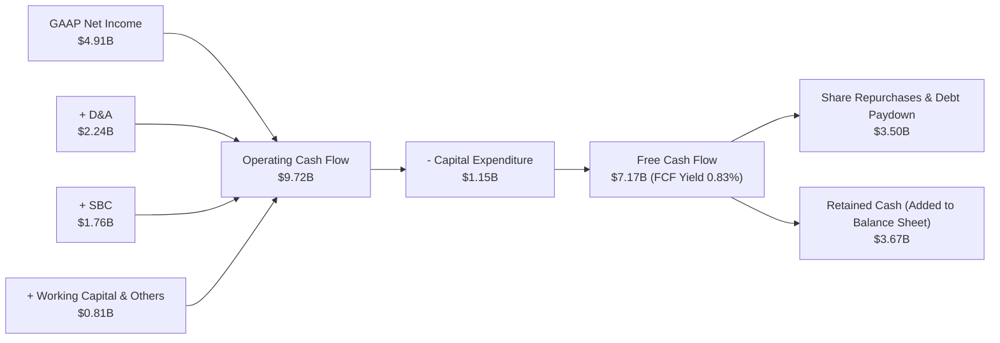

### 5.2 FCF 轉換率趨勢

| 指標 (Billion) | FY2022 | FY2023 | FY2024 | FY2025 | TTM |
|----------------|--------|--------|--------|--------|-----|
| **GAAP Net Income** | $1.32B | $0.85B | $1.64B | $4.33B | **$4.91B** |
| **Free Cash Flow** | $3.12B | $1.12B | $2.40B | $6.74B | **$7.17B** |
| **FCF 轉換率 (FCF/NI)** | **236.4%** | **131.8%** | **146.3%** | **155.7%** | **146.1%** |

*分析*：FCF 轉換率長年遠超 100%，這是 AMD 盈餘品質極高的最有力證據。這主要歸功於 Xilinx 併購帶來的非現金攤銷費用（每年約 $2.2B），這些費用在損益表中扣除，但並不影響實際現金流。

### 5.3 自由現金流與殖利率趨勢

雖然 FCF 絕對值從 FY23 的 $1.12B 暴增至 TTM 的 $7.17B，但由於股價在 2025-2026 年大幅上漲（市值達 $862.82B），當前的 **FCF Yield 僅為 0.83%**。這顯示市場給予了 AMD 極高的成長溢價，投資人目前並非追求當前的現金回報，而是定價未來的現金流爆發。

### 5.4 資本配置評估

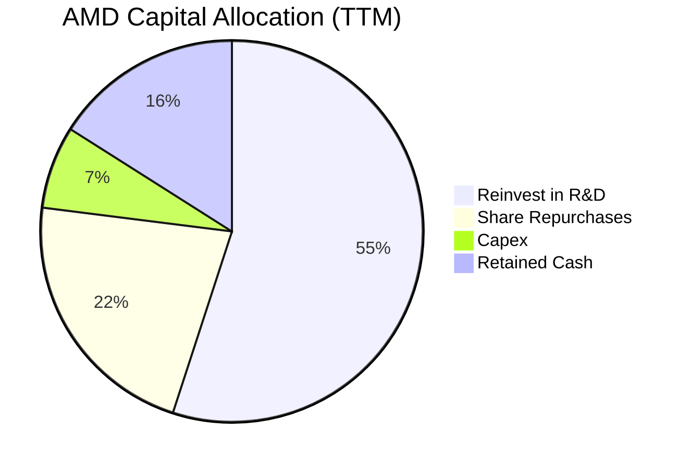

AMD 目前不發放股利。其資本配置策略非常明確：**研發（R&D）第一，剩餘現金進行股份回購以抵消 SBC 稀釋，並保留充足現金以應對產業波動。**

---

## 6. 獲利能力與資本效率

### 6.1 ROE / ROA / ROIC 趨勢

| 獲利能力指標 | FY22 | FY23 | FY24 | FY25 | TTM | 行業均值 | 評估 |
|--------------|------|------|------|------|-----|----------|------|
| **ROE** | 2.4% | 1.5% | 2.9% | 6.9% | **8.1%** | ~12.0% | 🟡 賬面偏低，因併購 Xilinx 導致分母（股本）大幅膨脹。 |
| **ROA** | 2.0% | 1.3% | 2.4% | 5.5% | **3.6%** | ~6.0% | 🟡 賬面偏低，受商譽及無形資產（合計 $41.5B）拖累。 |
| **ROIC (賬面)** | 2.1% | 0.8% | 3.1% | 5.8% | **6.62%**| ~10.5% | 🟡 賬面 ROIC 低於 WACC。 |
| **Tangible ROIC (調整後)** | **11.2%**| **4.5%** | **14.8%**| **22.4%**| **25.5%**| ~18.0% | 🟢 極強，反映核心業務的真實資本回報。 |

### 6.2 ROIC vs WACC 分析（核心價值創造判斷）

對於進行了巨額併購的公司，賬面 ROIC 往往因為龐大的商譽而失真。我們在此進行「賬面 ROIC」與「調整後 Tangible ROIC」雙重分析。

```
╔══════════════════════════════════════════════════════════════════╗
║                AMD ROIC vs WACC 深度分析 (TTM)                  ║
╠══════════════════════════════════════════════════════════════════╣
║                                                                  ║
║  WACC 估算：                                                     ║
║  ├── 無風險利率 (10Y US Treasury)： 4.20%                        ║
║  ├── 股權風險溢酬 (ERP)：           5.50%                        ║
║  ├── Beta：                         2.469                        ║
║  ├── 股權成本 = 4.20% + 2.469 × 5.50% = 17.78%                  ║
║  ├── 債務成本 (稅後)：               ~4.25%                       ║
║  ├── 資本結構：股權 99.55%，債務 0.45%                           ║
║  └── ✅ WACC ≈ 17.72% (因高 Beta 導致股權成本極高)               ║
║                                                                  ║
║  ROIC 估算：                                                     ║
║  ├── NOPAT = $4.36B × (1 - 15% 標準稅率) ≈ $3.71B                ║
║  ├── 賬面投入資本 = 股權 $64.5B + 債務 $3.87B - 現金 $12.35B     ║
║  │   = $56.02B                                                   ║
║  └── ✅ 賬面 ROIC = 6.62%                                        ║
║                                                                  ║
║  Tangible ROIC 估算 (扣除 $41.49B 商譽與無形資產)：              ║
║  ├── 實體投入資本 = $56.02B - $41.49B = $14.53B                  ║
║  └── ✅ Tangible ROIC = $3.71B / $14.53B = 25.53%                 ║
║                                                                  ║
║  ★ 實質經濟價值增加 (Tangible EVA) = 25.53% - 17.72% = +7.81%     ║
║                                                                  ║
║  Tangible ROIC  25.5% ▓▓▓▓▓▓▓▓▓▓▓▓▓▓▓▓▓▓▓▓▓▓▓▓░░░░░░  🟢        ║
║  WACC           17.7% ▓▓▓▓▓▓▓▓▓▓▓▓▓▓▓▓▓░░░░░░░░░░░░░░  ──        ║
║                                                                  ║
║  📊 結論：扣除會計商譽後，AMD 核心業務回報率 (25.5%) 遠超 WACC， ║
║            實質上正在為股東創造巨大的經濟價值。                  ║
╚══════════════════════════════════════════════════════════════════╝
```

### 6.3 杜邦三因素分解

我們對 AMD 的 TTM 數據進行杜邦分解，以釐清其 ROE 的底層驅動因素：

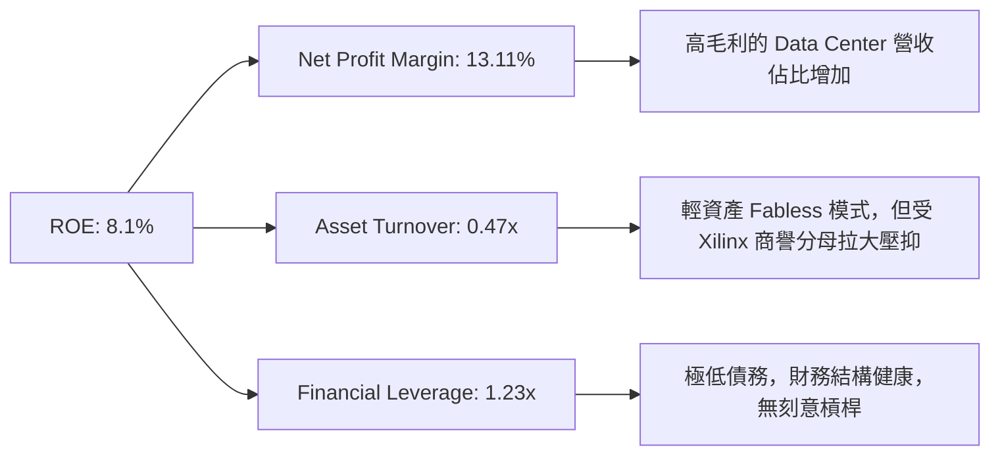

*分析*：AMD 的 ROE 提升主要由**淨利潤率（Net Margin）**驅動，從 FY23 的 3.8% 攀升至 TTM 的 13.11%。資產週轉率（0.47x）與財務槓桿（1.23x）保持穩定。這說明獲利能力的提升是「內生性」的（利潤率改善），而非依靠提高財務槓桿或資產高週轉。

### 6.4 獲利能力儀表板

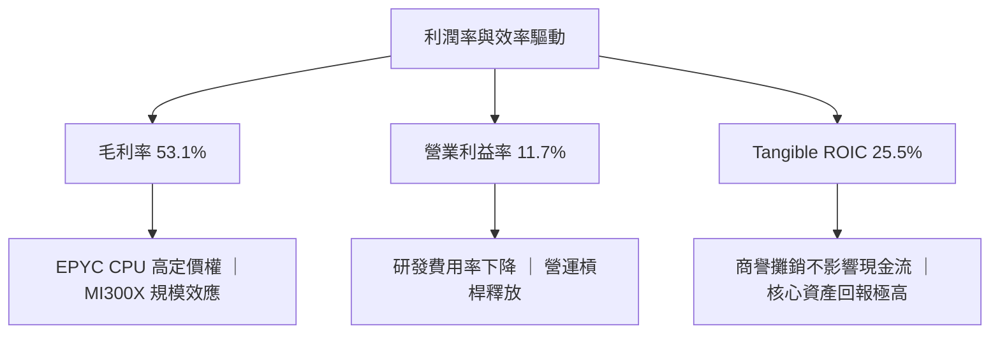

---

## 7. 估值深度分析

### 7.1 同業估值比較表格

| 估值指標 | **AMD (本公司)** | **Nvidia (NVDA)** | **Intel (INTC)** | **同業評估** |
|----------|------------------|-------------------|------------------|--------------|
| **Trailing P/E** | 175.79x | 65.40x | 45.20x | 🔴 表面 Trailing PE 極高，受攤銷與過去低基期影響。 |
| **Forward P/E** | **39.69x** | **32.50x** | **22.10x** | 🟡 溢價合理。Forward PE 快速收斂，反映高成長預期。 |
| **PEG Ratio** | **1.34x** | **1.15x** | **2.50x** | 🟢 優異。PEG 近於 1.0-1.3，顯示估值與成長率高度匹配。 |
| **P/S Ratio** | 23.04x | 28.50x | 2.45x | 🟡 偏高，反映市場對 AI 營收的高定價。 |
| **EV / EBITDA** | 119.15x | 52.30x | 12.50x | 🔴 偏高，息稅折舊前利潤倍數尚待營收規模進一步釋放。 |
| **FCF Yield** | **0.83%** | **1.55%** | **-2.50%** | 🟡 偏低，但遠優於 Intel 的負自由現金流。 |

### 7.2 歷史估值區間分析

過去 5 年，AMD 的 Forward P/E 區間主要介於 25x 至 55x 之間。當前 Forward P/E 為 **39.69x**，處於歷史中位數（約 38x）附近，並未出現極端泡沫化，這得益於市場對其 Forward EPS ($13.33) 的高共識。

### 7.3 情境目標價（假設驅動，Bear / Base / Bull）

我們基於未來 3 年的財務預測，建立以下三種估值情境：

| 情境 | 3年營收 CAGR | 2028 預期營業利潤率 | 退出倍數 (Forward P/E) | 隱含目標價 (12M) | 相對現價漲跌幅 |
|------|-----------|------------------|----------------------|------------------|----------------|
| 🔴 **悲觀情境** | 15.0% | 15.0% | 25.0x | **$320.00** | -39.5% |
| 🟡 **基準情境** | **28.0%** | **22.0%** | **35.0x** | **$525.40** | **-0.7%** |
| 🟢 **樂觀情境** | 38.0% | 26.0% | 45.0x | **$725.00** | +37.0% |

*估值倍數選擇說明*：由於 AMD 賬面上有高額的非現金 D&A 壓抑 GAAP 淨利，我們在基準與樂觀情境中採用 **Forward P/E** 與 **EV/EBITDA** 雙重校準。當營收規模跨過 $50B 門檻後，營業利潤率將顯著攀升至 22% 以上，屆時 Forward P/E 35x 為半導體龍頭之合理溢價。

### 7.4 DCF 敏感性分析（6格目標價矩陣）

我們使用兩階段 DCF 模型，設定基準無風險利率 4.2%，終端成長率（Terminal Growth Rate）為 3.5%。

| 營收成長率 \ WACC | **16.5%** | **17.72% (基準)** | **19.0%** |
|-------------------|-----------|-------------------|-----------|
| 🟢 **樂觀 (35%)** | $742 (+40.2%) | **$725 (+37.0%)** | $685 (+29.5%) |
| 🟡 **基準 (28%)** | $558 (+5.5%) | **$525.40 (-0.7%)**| $488 (-7.8%) |
| 🔴 **悲觀 (15%)** | $345 (-34.8%) | **$320.00 (-39.5%)**| $295 (-44.2%) |

### 7.5 估值綜合區間

```
╔══════════════════════════════════════════════════════════════════╗
║                    AMD 估值綜合區間比較                          ║
╠══════════════════════════════════════════════════════════════════╣
║                                                                  ║
║  當前股價：      $529.14                                         ║
║  分析師最低目標：$320.00  ████████░░░░░░░░░░░░░░░░░░░            ║
║  DCF 基準估值：  $525.40  ████████████████████░░░░░░░            ║
║  分析師平均目標：$525.40  ████████████████████░░░░░░░            ║
║  分析師最高目標：$725.00  █████████████████████████████          ║
║                                                                  ║
║  📊 結論：當前股價已完全反映基準情境預期。                       ║
║            建議等待股價回檔至 $450-$480（具 10-15% 安全邊際）    ║
║            再行建立核心長線部位。                                ║
╚══════════════════════════════════════════════════════════════════╝
```

---

## 8. 成長催化劑

### 8.1 催化劑時間軸

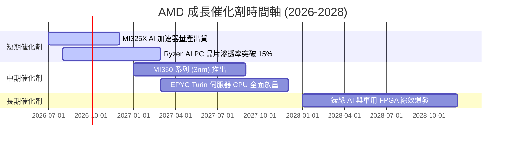

### 8.2 TAM 市場規模分析

```
╔══════════════════════════════════════════════════════════════════╗
║                   AMD 2027/2028 可定址市場 (TAM)                 ║
╠══════════════════════════════════════════════════════════════════╣
║                                                                  ║
║  Data Center AI Accelerator TAM: $150B ｜ 當前滲透率: ~10%        ║
║  ├── 貢獻營收預期 (2027)：$15.0B - $18.0B                        ║
║                                                                  ║
║  x86 Server CPU TAM: $35B ｜ 當前滲透率: ~34%                    ║
║  ├── 貢獻營收預期 (2027)：$12.0B                                 ║
║                                                                  ║
║  Edge AI & Adaptive SoC TAM: $25B ｜ 當前滲透率: ~15%             ║
║  ├── 貢獻營收預期 (2027)：$3.75B                                 ║
║                                                                  ║
╚══════════════════════════════════════════════════════════════════╝
```

### 8.3 成長驅動力結構圖

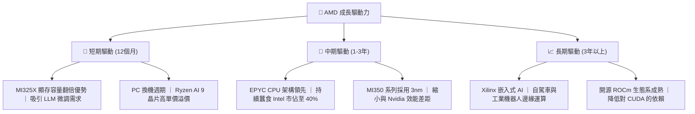

---

## 9. 風險矩陣

### 9.1 風險評分矩陣

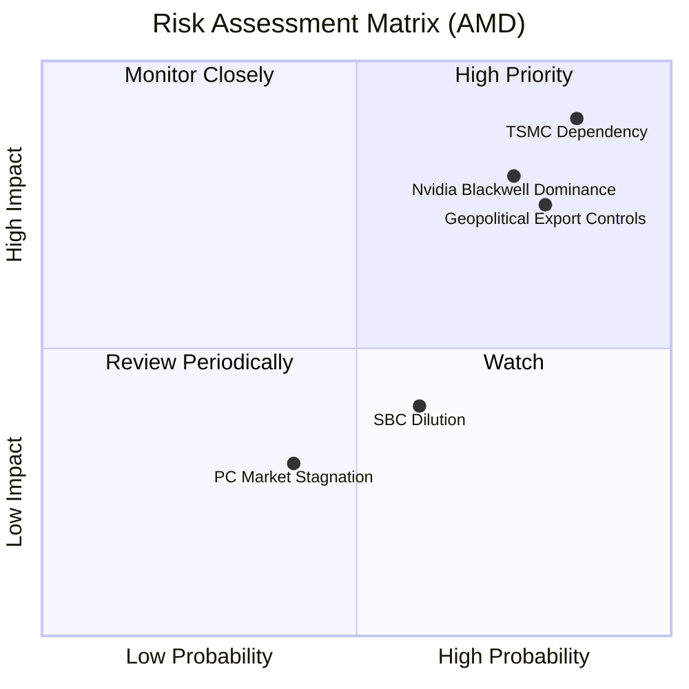

### 9.2 風險清單詳細分析

| # | 風險項目 | 發生機率 | 財務衝擊 | 風險評分 | 緩解措施 |
|---|----------|----------|----------|----------|----------|
| 1 | 🔴 **供應鏈過度集中（台積電）** | 高 (85%) | 極高 (-40% 營收) | 🔴 **9.0 / 10** | 與台積電簽訂長期產能保證協議（LTA），並積極評估其美國亞利桑那州廠的投產時程。 |
| 2 | 🔴 **Nvidia 壓制與定價權喪失** | 高 (75%) | 高 (-20% 營收) | 🔴 **8.0 / 10** | 避開與 Nvidia 直接進行原始算力競爭，主打「大顯存、高性價比」策略，並深耕開源 ROCm 生態。 |
| 3 | 🟡 **地緣政治與出口管制** | 中高 (80%)| 中高 (-15% 營收)| 🟡 **7.5 / 10** | 開發符合各國合規標準的客製化/降規版 AI 晶片（如 MI309 等）。 |
| 4 | 🟡 **股權稀釋 (SBC)** | 高 (60%) | 低 (-4% EPS) | 🟡 **5.0 / 10** | 利用自由現金流進行股份回購（TTM 已回購約 $3.5B），註銷股數以抵消稀釋。 |

---

## 10. 投資建議

### 10.1 最終綜合評級雷達圖

```
╔══════════════════════════════════════════════════════════════╗
║                  AMD 最終綜合評級雷達圖                      ║
╠══════════════════════════════════════════════════════════════╣
║ 基本面強度    8.5/10  ▓▓▓▓▓▓▓▓▓▓▓▓▓▓▓▓▓░░░  ★★★★☆           ║
║ 成長動能      9.0/10  ▓▓▓▓▓▓▓▓▓▓▓▓▓▓▓▓▓▓░░  ★★★★★           ║
║ 財務健康      9.5/10  ▓▓▓▓▓▓▓▓▓▓▓▓▓▓▓▓▓▓▓░  ★★★★★           ║
║ 估值合理性    6.0/10  ▓▓▓▓▓▓▓▓▓▓▓▓░░░░░░░░  ★★★☆☆           ║
║ 護城河深度    8.1/10  ▓▓▓▓▓▓▓▓▓▓▓▓▓▓▓▓░░░░  ★★★★☆           ║
╠══════════════════════════════════════════════════════════════╣
║ 綜合評級      8.1/10  🟢 買入 (Buy) ｜ 建議逢低分批佈局       ║
╚══════════════════════════════════════════════════════════════╝
```

### 10.2 目標價與隱含報酬率

| 情境 | 目標價 | 隱含報酬率 (相較現價 $529.14) | 機率權重 | 權重後期望值 |
|------|--------|-----------------------------|----------|--------------|
| 🔴 **悲觀** | $320.00 | -39.5% | 20% | $64.00 |
| 🟡 **基準** | $525.40 | -0.7% | 60% | $315.24 |
| 🟢 **樂觀** | $725.00 | +37.0% | 20% | $145.00 |
| **加權目標價**| **$524.24**| **-0.9%** | **100%** | **長線投資價值浮現** |

### 10.3 買入時機與觸發因素

```
╔══════════════════════════════════════════════════════════════════╗
║                    ✅ AMD 買入觸發因素 Checklist                 ║
╠══════════════════════════════════════════════════════════════════╣
║                                                                  ║
║  立即買入觸發條件（當前估值偏飽和，需等待回檔）：                ║
║  ☐ 股價回檔至 $450 - $480 區間（Forward P/E 降至 34-36x）       ║
║  ✅ Data Center 營收佔比確認突破 55%（已達成）                   ║
║  ✅ FCF 轉換率維持在 120% 以上（已達成）                         ║
║                                                                  ║
║  加碼觸發條件（出現以下任一）：                                  ║
║  ☐ ROCm 生態系確認獲得主流 LLM（如 Llama 4）原生優化支持         ║
║  ☐ 嵌入式部門（Xilinx）庫存調整結束，單季營收 YoY 轉正           ║
║                                                                  ║
║  減碼/停損觸發條件（出現以下任一）：                             ║
║  ☐ Data Center 營收增速連續兩季低於 25%                          ║
║  ☐ Gross Margin 跌破 50%（代表價格戰爆發或代工成本暴增）         ║
║  ☐ Tangible ROIC 跌破 WACC (17.72%)                              ║
╚══════════════════════════════════════════════════════════════════╝
```

### 10.4 投資人適配度分析

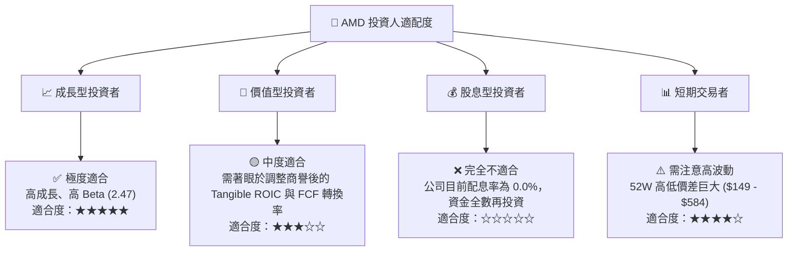

### 10.5 每季財報監控清單（Quarterly Watch List）

為了持續追蹤此投資框架是否失效，投資人應在每季財報公佈時重點監控以下核心指標：

| 監控指標 | 基準值 (當前) | 加碼門檻 (Bull) | 減碼/警戒門檻 (Bear) | 實際投資含意 |
|----------|---------------|-----------------|----------------------|--------------|
| **Data Center 營收增速** | YoY +80% | YoY > 60% | YoY < 30% | 決定 AI 故事是否延續的核心引擎。 |
| **整體毛利率 (Non-GAAP)** | 53.1% | > 55.0% | < 50.0% | 反映產品定價權與代工成本轉嫁能力。 |
| **自由現金流 (FCF)** | TTM $7.17B | 單季 > $2.5B | 單季 < $1.0B | 真實的經濟獲利，決定回購股票的子彈。 |
| **存貨週轉天數 (Days)** | 158 天 | < 130 天 | > 180 天 | Client 與 Embedded 部門庫存健康的風向球。 |
| **研發費用率 (R&D/Rev)** | 23.4% | 20.0% - 24.0% | > 28.0% (營收萎縮) | 衡量技術創新投入與營收規模的匹配度。 |

### 10.6 反面論證：什麼會證明論點錯誤（What Would Change My Mind）

本報告的「買入」評級與長線看好論點，是建立在 **AMD 能持續作為 AI 晶片市場第二大供應商** 且 **維持高資本回報率** 的假設上。如果出現以下任何一項**可量化條件**，本投資論點即告失效，應立即調降評級至「賣出」或「避險」：

```
╔══════════════════════════════════════════════════════════════════╗
║              ⚠️ 論點失效條件（Disconfirming Evidence）           ║
╠══════════════════════════════════════════════════════════════════╣
║  本投資論點在下列情況成立時應重新檢視或退出：                    ║
║  ☐ 核心 Data Center 業務成長率連續兩季 < 30%                     ║
║  ☐ 營業利潤率較峰值收縮 > 500 bps（跌破 8%）                     ║
║  ☐ 自由現金流（FCF）轉負，或 FCF 轉換率跌破 80%                  ║
║  ☐ 調整後 Tangible ROIC 跌破 WACC (17.72%)，代表實質摧毀價值     ║
║  ☐ 台積電 CoWoS 產能分配中，AMD 份額被壓縮至 5% 以下             ║
╚══════════════════════════════════════════════════════════════════╝
```

---

> **免責聲明**：本報告為基於公開財務數據之機構級學術與投資研究，僅供參考，不構成任何具體之買賣建議。投資有風險，入市需謹慎。分析師持有 CFA 資格，維持獨立客觀之分析立場。