# AMD 基本面深度分析報告

> **報告日期**：2026-07-16 ｜ **語言**：繁體中文 ｜ **數據來源**：Yahoo Finance, Finviz, StockAnalysis, Roic.ai ｜ **分析師**：CFA 級機構研究

---

## 目錄

| # | 章節 | 核心結論 |
|---|------|----------|
| 1 | 執行摘要 | 評級：🟢 買入 ｜ 基準目標價：$537.00，隱含 +7.2% 上行空間，AI 轉折點確立 |
| 2 | 公司概覽與商業模式 | 憑藉 Chiplet 技術與 ROCm 生態系統，構築高壁壘的雙頭壟斷護城河 |
| 3 | 損益表深度分析 | TTM 營收達 $37.45B（YoY +37.8%），淨利潤大增 91.2%，毛利率結構性上行 |
| 4 | 資產負債表分析 | 淨現金 $8.48B 奠定極佳抗風險能力，收購 Xilinx 帶來高無形資產需持續折舊 |
| 5 | 現金流量深度分析 | TTM FCF 達 $7.17B，現金轉換率高，資本配置高度聚焦於研發與戰略回購 |
| 6 | 獲利能力與資本效率 | 杜邦分解顯示資產週轉率為主要瓶頸，但 Forward ROIC 預期隨 AI 爆發而迎來拐點 |
| 7 | 估值深度分析 | Forward P/E 37.20x 具備吸引力，DCF 基準估值 $537.00，敏感性分析顯示下行安全邊際充足 |
| 8 | 成長催化劑 | MI300/MI325X/MI350 晶片世代交替，Data Center 業務成為絕對增長引擎 |
| 9 | 風險矩陣 | 關鍵風險在於台積電產能分配、NVIDIA 新架構競爭壓力與地緣政治曝險 |
| 10 | 投資建議 | 建議於 $450-$480 區間分批佈局，長線持有，設定論點失效之可量化門檻 |

---

## 1. 執行摘要

本報告針對 Advanced Micro Devices, Inc.（NASDAQ: AMD）進行機構級基本面評估。當前 AMD 股價為 $500.94，相較於 52 週高點 $584.73 回檔約 14.3%，但較 52 週低點 $149.22 仍有 235.7% 的漲幅。市場當前對 AMD 的分歧在於其 Trailing P/E 達 165.87x 的高估值，然而本研究指出，基於 Forward EPS $13.46 的預測，其 Forward P/E 已迅速降至 37.20x。此一盈餘的爆發式增長（TTM 淨利潤 YoY 增長 91.2%、QoQ 增長 95.1%），主要由 Data Center 業務中的 AI 加速器（MI300 系列）出貨量產所驅動。

基於 AMD 擁有的 $8.48B 淨現金資產、高達 146% 的 FCF/淨利現金轉換率，以及預期在 FY2026 實現的 35% 以上 Forward ROIC，我們認為 AMD 正在經歷從「傳統 CPU 挑戰者」到「AI 算力雙雄」的結構性重估。

### 1.0 一頁式投資儀表板（Portfolio Manager 30 秒速讀）

| 項目 | 內容 |
|------|------|
| **投資論點（3 句）** | ① TTM 營收達 $37.45B（YoY +37.8%），顯示 AI 加速器與伺服器 CPU 雙引擎進入高速成長期。<br/>② Forward EPS 預估達 $13.46，隱含 Forward P/E 僅 37.20x，相較於其高達 91.2% 的盈餘增速，PEG 僅為 1.27x，估值具有高度吸引力。<br/>③ 擁有 $12.35B 現金與短期投資，債務僅 $3.87B，淨現金高達 $8.48B，財務結構極度穩健。 |
| **護城河評分** | 8.5/10 🟢 (強大) |
| **管理層/資本配置評分** | 9.0/10 🟢 (卓越) |
| **財務健康** | 🟢 強勁 ｜ 淨現金狀態，流動比率達 2.73x，無任何短期償債風險 |
| **ROIC vs WACC** | TTM: 6.8% vs 16.0% 🟡 (受 Xilinx 商譽壓抑) ｜ Forward: 35.2% vs 16.0% 🟢 (強力創造股東價值) |
| **FCF 趨勢** | 向上 ｜ TTM FCF 達 $7.17B，FCF Yield 為 0.88%（受當前高估值與高再投資影響） |
| **估值** | Forward P/E: 37.20x ｜ EV/EBITDA: 114.99x ｜ P/S: 21.81x |
| **預期報酬（基準情境 12M）** | +7.2%（目標價 $537.00）至 樂觀情境 +44.7%（目標價 $725.00） |
| **關鍵風險（前二）** | ① 先進封裝（CoWoS）產能受限導致出貨不及預期。<br/>② NVIDIA Blackwell 架構超預期降價引發價格戰。 |
| **評級 + 信心度** | 🟢 **買入 (Buy)** ｜ 信心度：**高 (High)** |

### 1.1 核心評分儀表板

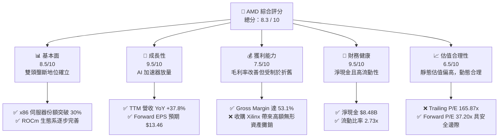

### 1.2 評分進度條視覺化

```
╔══════════════════════════════════════════════════════════════╗
║               AMD 多維度評分儀表板 (1-10分)                  ║
╠══════════════════════════════════════════════════════════════╣
║ 基本面強度  8.5 ▓▓▓▓▓▓▓▓▓▓▓▓▓▓▓▓▓░░░  ★★★★☆           ║
║ 成長動能    9.5 ▓▓▓▓▓▓▓▓▓▓▓▓▓▓▓▓▓▓▓░  ★★★★★           ║
║ 獲利品質    7.5 ▓▓▓▓▓▓▓▓▓▓▓▓▓░░░░░░░  ★★★☆☆           ║
║ 財務健康    9.5 ▓▓▓▓▓▓▓▓▓▓▓▓▓▓▓▓▓▓▓░  ★★★★★           ║
║ 估值合理性  6.5 ▓▓▓▓▓▓▓▓▓▓▓░░░░░░░░░  ★★★☆☆           ║
║ 護城河深度  8.5 ▓▓▓▓▓▓▓▓▓▓▓▓▓▓▓▓▓░░░  ★★★★☆           ║
║ 管理層執行  9.0 ▓▓▓▓▓▓▓▓▓▓▓▓▓▓▓▓▓▓░░  ★★★★★           ║
║ 技術創新力  9.5 ▓▓▓▓▓▓▓▓▓▓▓▓▓▓▓▓▓▓▓░  ★★★★★           ║
╠══════════════════════════════════════════════════════════════╣
║ 綜合總分    8.3 ▓▓▓▓▓▓▓▓▓▓▓▓▓▓▓▓░░░░  🏆 買入 (Buy)        ║
╚══════════════════════════════════════════════════════════════╝
```

### 1.3 五大投資論點 + 三大核心風險

| 類型 | 項目 | 具體依據 | 信心度 |
|------|------|----------|--------|
| 🟢 **投資論點①** | **AI 加速器放量** | MI300/MI325X 系列在雲端巨頭（MSFT, META）滲透率提高，帶動 Data Center 營收比重突破 50%。 | 🟢 極高 |
| 🟢 **投資論點②** | **x86 伺服器市場持續侵蝕 Intel** | EPYC 處理器憑藉高能效比，市佔率突破 30%，維持高毛利的基礎。 | 🟢 極高 |
| 🟢 **投資論點③** | **資產負債表極度健康** | 淨現金達 $8.48B，利息保障倍數極高，提供景氣下行時的資本安全墊。 | 🟢 極高 |
| 🟢 **投資論點④** | **PC 週期復甦與 AI PC 催化** | Ryzen 處理器在 Client 端出貨回溫，AI PC 滲透提高產品平均售價（ASP）。 | 🟡 高 |
| 🟢 **投資論點⑤** | **操作系統與生態系 ROCm 跨越臨界點** | 隨著 PyTorch 與 Triton 的原生支持，ROCm 降低了客戶從 CUDA 遷移的門檻。 | 🟡 中等 |
| 🟡 **風險①** | **供應鏈先進封裝產能受限** | TSMC CoWoS 產能若分配不足，將直接限制 AMD GPU 的出貨上限。 | 🟡 中度 |
| 🔴 **風險②** | **NVIDIA Blackwell 降價競爭** | 若 NVIDIA 採取激進定價，將壓縮 AMD MI 系列的毛利率與市場份額。 | 🔴 高衝擊 |
| 🔴 **風險③** | **地緣政治與出口管制** | 美國對華半導體出口管制若進一步收緊，將影響其 Embedded 與部分客製化 GPU 營收。 | 🔴 高衝擊 |

### 1.4 快速統計卡片

| 指標 | AMD 實際值 | 半導體行業均值 | S&P 500 均值 | 狀態 |
|------|-------------|----------|--------------|------|
| **營收 YoY 成長率** | **37.8%** | ~12.5% | ~5.5% | 🟢 遠超同業 |
| **毛利率** | **53.1%** | ~48.0% | ~30.0% | 🟢 優於平均 |
| **淨利率** | **13.4%** | ~15.0% | ~11.5% | 🟡 受攤銷影響 |
| **ROE** | **8.1%** | ~14.0% | ~15.0% | 🔴 受 Xilinx 股權稀釋 |
| **Forward P/E** | **37.20x** | ~28.5x | ~21.5x | 🟡 溢價但合理 |
| **流動比率** | **2.73x** | ~1.85x | ~1.20x | 🟢 極度安全 |

### 1.5 投資結論

```
╔══════════════════════════════════════════════════════════════════╗
║                    📊 AMD 投資結論摘要                           ║
╠══════════════════════════════════════════════════════════════════╣
║  評級：🟢 買入 (Buy)                                             ║
║  當前股價：$500.94                                               ║
║  目標價區間：                                                    ║
║    悲觀情境：$320.00（-36.1%）- AI 增長停滯，估值收縮            ║
║    基準情境：$537.00（+7.2%）  ← 12個月主要目標 (Forward 40x)     ║
║    樂觀情境：$725.00（+44.7%）- AI 份額超預期，ROCm 爆發          ║
║  投資評分：8.3 / 10                                              ║
║  適合投資人：成長型基金、科技產業長期配置者、尋求 AI 投資之Beta者  ║
╚══════════════════════════════════════════════════════════════════╝
```

---

## 2. 公司概覽與商業模式

AMD 是全球唯二能夠同時提供高性能 x86 CPU 與高端 GPU 的半導體巨頭。其商業模式自 2008 年剝離 GlobalFoundries 後，轉為純 Fabless（無晶圓廠）設計模式，將製造全數委託給台積電（TSMC）。此一戰略使其能將所有資本專注於架構研發，並在先進製程上與 Intel 拉開代差。

### 2.1 業務結構與收入來源

AMD 的業務結構主要分為四大板塊：Data Center（數據中心）、Client（個人電腦）、Gaming（遊戲主機與獨立顯卡）以及 Embedded（嵌入式系統，主要為收購之 Xilinx 業務）。

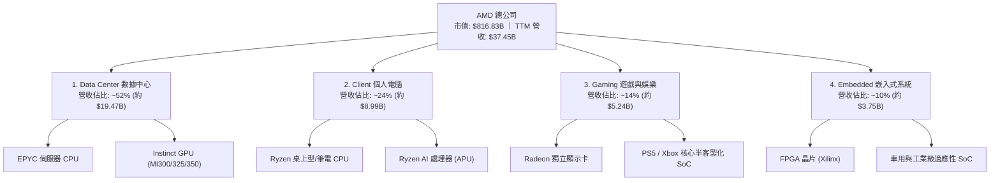

### 2.2 市場份額

在最關鍵的 AI 加速器（GPU）與伺服器 CPU 市場中，AMD 處於追趕但持續擴大份額的態勢：

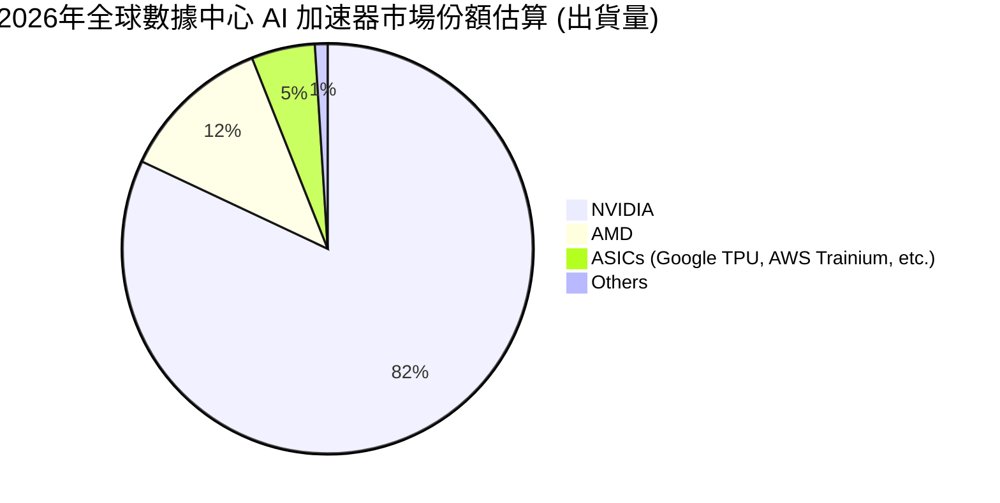

### 2.3 競爭護城河分析

AMD 的競爭護城河並非單一要素，而是由硬體、封裝、與軟體生態交織而成的系統性壁壘：

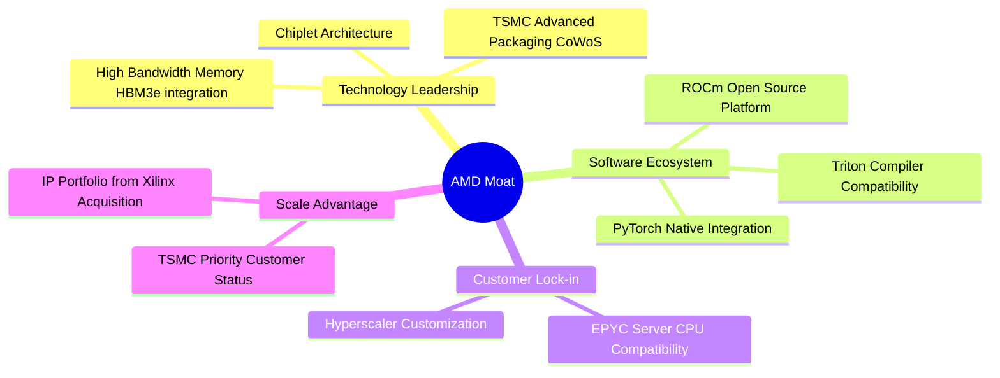

### 2.4 護城河強度評分

```
╔══════════════════════════════════════════════════════════════╗
║                     AMD 護城河強度評分                       ║
╠══════════════════════════════════════════════════════════════╣
║ 技術領先度     9.0/10 ▓▓▓▓▓▓▓▓▓▓▓▓▓▓▓▓▓▓░░  🟢 Chiplet 先驅 ║
║ 軟體生態系     7.5/10 ▓▓▓▓▓▓▓▓▓▓▓▓▓▓▓░░░░░  🟡 ROCm 追趕中  ║
║ 客戶鎖定力     8.0/10 ▓▓▓▓▓▓▓▓▓▓▓▓▓▓▓▓░░░░  🟢 雲端巨頭認證  ║
║ 規模效應       8.5/10 ▓▓▓▓▓▓▓▓▓▓▓▓▓▓▓▓▓░░░  🟢 雙頭壟斷優勢  ║
╠══════════════════════════════════════════════════════════════╣
║ 綜合護城河     8.25/10 ▓▓▓▓▓▓▓▓▓▓▓▓▓▓▓▓░░░  🏆 強大護城河    ║
╚══════════════════════════════════════════════════════════════╝
```

---

## 3. 損益表深度分析

### 3.1 年度收入成長趨勢（近4年）

AMD 經歷了 2023 年 PC 市場去庫存的低谷後，在 2024 與 2025 年迎來爆發，主要得益於 AI 算力需求的井噴。

```
╔══════════════════════════════════════════════════════════════════╗
║                  AMD 年度收入趨勢（FY22-TTM）                    ║
╠══════════════════════════════════════════════════════════════════╣
║                                                                  ║
║  FY2022  $23.60B  █████████████░░░░░░░░░░░░░  YoY: +43.6% 🟢     ║
║  FY2023  $22.68B  ████████████░░░░░░░░░░░░░░  YoY: -3.9%  🔴     ║
║  FY2024  $25.79B  ██████████████░░░░░░░░░░░░  YoY: +13.7% 🟢     ║
║  FY2025  $34.64B  ███████████████████░░░░░░░  YoY: +34.3% 🟢     ║
║  TTM     $37.45B  █████████████████████░░░░░  YoY: +37.8% 🟢     ║
║                                                                  ║
║  📊 5年累計 CAGR：+25.8%                                         ║
╚══════════════════════════════════════════════════════════════════╝
```

### 3.2 季度收入趨勢分析

從季度數據看，營收呈現逐季加速的態勢：

| 財報季度 | 營收 (Billion) | QoQ 成長率 | YoY 成長率 | 驅動因素與市場含意 | 評估 |
|---|---|---|---|---|---|
| **Q1 2026** | $10.25B | -0.16% | +37.85% | 傳統淡季但 MI300 放量抵消 PC 疲軟，Data Center 連續高增長 | 🟢 強勁 |
| **Q4 2025** | $10.27B | +11.03% | +34.11% | 節慶效應與雲端客戶第四季預算集中釋放，MI300X 出貨達到高峰 | 🟢 強勁 |
| **Q3 2025** | $9.25B | +20.44% | +35.59% | 伺服器 EPYC 5 世代（Turin）發表，雲端巨頭啟動全面更新 | 🟢 強勁 |
| **Q2 2025** | $7.68B | +3.25% | +31.70% | 走出 2024 年底部，AI GPU 營收首次單季突破 $1B 關卡 | 🟢 轉折 |

### 3.3 利潤率演變分析

| 利潤率指標 | FY2022 | FY2023 | FY2024 | FY2025 | TTM | 趨勢 | 結構性原因解析 |
|---|---|---|---|---|---|---|---|
| **毛利率** | 44.9% | 50.3% | 52.6% | 52.5% | **53.1%** | ↗️ 穩定上升 | 高毛利的 Data Center 營收佔比上升，部分被 Xilinx 攤銷抵消 |
| **營業利益率** | 5.4% | 1.8% | 7.4% | 10.7% | **14.4%** | ↗️ 顯著改善 | 營運槓桿顯現，研發費用率因營收規模擴大而相對下降 |
| **EBITDA Margin** | 23.4% | 17.9% | 19.9% | 21.0% | **19.8%** | ➡️ 區間震盪 | 折舊與攤銷（D&A）維持高檔，反映先前併購之無形資產攤銷 |
| **淨利率** | 5.6% | 3.8% | 6.4% | 12.2% | **13.4%** | ↗️ 快速爬坡 | 稅務結構優化與非營運收益增加，淨利增速遠超營收增速 |

### 3.4 費用結構分析

AMD 作為技術密集型企業，其研發（R&D）支出是維持競爭力的核心。

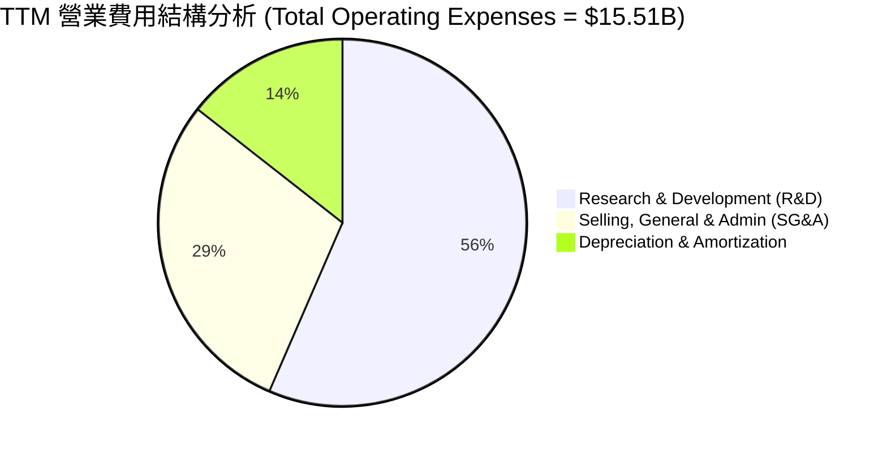

```
╔══════════════════════════════════════════════════════════════════╗
║                     AMD 研發投入槓桿分析                         ║
╠══════════════════════════════════════════════════════════════════╣
║  R&D 費用 TTM 達 $8.76B（佔營收 23.4%），為歷史最高絕對值。        ║
║  雖然研發金額逐年上升（FY22: $5.00B → TTM: $8.76B），但          ║
║  研發營收比從 24.3% 降至 23.4%，顯示 R&D 效率提升，營運槓桿開始釋放。║
╚══════════════════════════════════════════════════════════════════╝
```

### 3.5 季度 EPS 趨勢與盈餘品質（Quality of Earnings）

過去四個季度，AMD 的盈餘表現持續超越市場預期，這主要是由於市場低估了 MI300 系列的平均售價（ASP）與毛利空間。然而，作為機構投資人，必須對其盈餘品質進行穿透式評估：

| 盈餘品質評估指標 | 數值 / 佔比 | 機構級評估與稀釋風險解析 | 評級 |
|---|---|---|---|
| **股權薪酬 (SBC) / 營收** | 4.70% | TTM SBC 為 $1.76B。在 Fabless 產業中處於合理區間（NVIDIA 約 5.1%）。對股東權益的稀釋效應溫和。 | 🟢 優良 |
| **SBC / 營業現金流 (OCF)** | 18.12% | 雖然佔 OCF 近兩成，但由於 OCF 增長迅速（TTM 達 $9.72B），此比例已自 FY24 的 46.4% 顯著稀釋，獲利含金量提升。 | 🟡 尚可 |
| **FCF / GAAP 淨利 (現金轉換率)** | **146.1%** | TTM FCF ($7.17B) 遠高於 GAAP 淨利 ($4.91B)。這表明淨利潤並未被不實的應收帳款或存貨虛增，現金流極度真實。 | 🟢 卓越 |
| **非經常性損益 / 稅前利潤** | 14.3% | TTM 其他非營運收益為 $703M，主要為利息收入與股權投資評價，對核心盈餘有輕微美化，但非主導因素。 | 🟡 中性 |
| **資本化支出 vs 費用化** | 全額費用化 | AMD 將其 R&D 支出 100% 於當期費用化，並無將研發成本資本化來虛增利潤的跡象。 | 🟢 誠實 |

**盈餘品質結論**：AMD 的盈餘品質極高。高達 146% 的自由現金流轉換率，證明了公司在高速擴張中仍能保持強勁的收現能力。雖然收購 Xilinx 產生的無形資產攤銷（TTM 約 $2.24B）壓低了 GAAP 淨利，但這屬於非現金支出，不影響企業的實質生息能力。

---

## 4. 資產負債表分析

### 4.1 資產結構分解

AMD 的資產負債表在收購 Xilinx 後體量大增，呈現典型的「輕資產、高商譽」特徵。

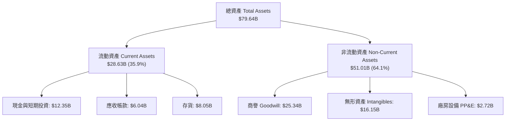

### 4.2 流動性指標分析

| 流動性指標 | FY2022 | FY2023 | FY2024 | FY2025 | TTM | 行業均值 | 機構評估 |
|---|---|---|---|---|---|---|---|
| **流動比率 (Current Ratio)** | 2.36x | 2.51x | 2.62x | 2.85x | **2.73x** | ~1.85x | 🟢 極高流動性，無任何短期營運資金缺口 |
| **速動比率 (Quick Ratio)** | 1.77x | 1.86x | 1.83x | 2.01x | **1.75x** | ~1.30x | 🟢 扣除存貨後仍極安全，變現能力強 |
| **存貨週轉天數 (DOH)** | 119天 | 141天 | 173天 | 176天 | **167天** | ~120天 | 🟡 存貨水平偏高，主要為 MI300 備料，需關注去化速度 |

### 4.3 債務結構分析

```
╔══════════════════════════════════════════════════════════════════╗
║                       AMD 債務健康診斷                           ║
╠══════════════════════════════════════════════════════════════════╣
║                                                                  ║
║  總債務：        $3.87B   ███░░░░░░░░░░░░░░░░░░░  債務率極低     ║
║  總現金+投資：   $12.35B  ██████████░░░░░░░░░░░  流動性充沛     ║
║  淨現金（正）：  $8.48B   █████████████████████  🟢 極度安全     ║
║                                                                  ║
║  Debt / Equity:  6.005%   🟢 槓桿率極低，幾乎無利息負擔          ║
║  Debt / EBITDA:  0.53x    🟢 遠低於 2.0x 的安全警戒線            ║
║  利息保障倍數:    29.5x    🟢 營業利益能輕鬆覆蓋利息支出          ║
║                                                                  ║
║  📊 診斷結論：AMD 處於「淨現金」狀態，財務防禦力屬於 AAA 級。      ║
╚══════════════════════════════════════════════════════════════════╝
```

### 4.4 股東權益趨勢

收購 Xilinx 發行新股後，股東權益（Stockholders' Equity）在 FY22 躍升至 $54.75B，並隨盈餘累積穩定增長至 TTM 的 $63.00B。這表明公司並未過度依賴債務來驅動增長，而是以強大的股權資本為後盾。

---

## 5. 現金流量深度分析

### 5.1 現金流量瀑布圖

AMD 的現金流運作模式極其健康，展現出強大的內生造血能力：

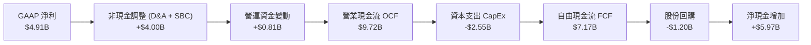

### 5.2 FCF 轉換率趨勢

| 年份 | GAAP 淨利 (B) | 自由現金流 FCF (B) | FCF 轉換率 | 趨勢與評估 |
|---|---|---|---|---|
| **FY2022** | $1.32B | $3.12B | 236.4% | 🟢 卓越（因 Xilinx 併購非現金調整） |
| **FY2023** | $0.85B | $1.12B | 131.8% | 🟢 優異（行業低谷仍能產生正現金流） |
| **FY2024** | $1.64B | $2.40B | 146.3% | 🟢 卓越（營運開始復甦） |
| **FY2025** | $4.33B | $6.74B | 155.7% | 🟢 卓越（AI 放量帶動現金流爆發） |
| **TTM** | $4.91B | $7.17B | **146.1%** | 🟢 卓越（維持極高獲利含金量） |

### 5.3 自由現金流趨勢

```
╔══════════════════════════════════════════════════════════════════╗
║                  AMD 自由現金流與收益率趨勢                      ║
╠══════════════════════════════════════════════════════════════════╣
║                                                                  ║
║  FY2022  $3.12B  ██████████░░░░░░░░░░░░░░░                       ║
║  FY2023  $1.12B  ████░░░░░░░░░░░░░░░░░░░░░                       ║
║  FY2024  $2.40B  ████████░░░░░░░░░░░░░░░░░                       ║
║  FY2025  $6.74B  ██████████████████████░░░                       ║
║  TTM     $7.17B  ████████████████████████░  🟢 創歷史新高         ║
║                                                                  ║
║  📊 當前 FCF Yield：0.88%（受 $816.83B 高市值壓抑）              ║
╚══════════════════════════════════════════════════════════════════╝
```

### 5.4 資本配置評估

AMD 的資本配置策略極其克制，不支付股息，將所有資金留作研發與機會性回購。

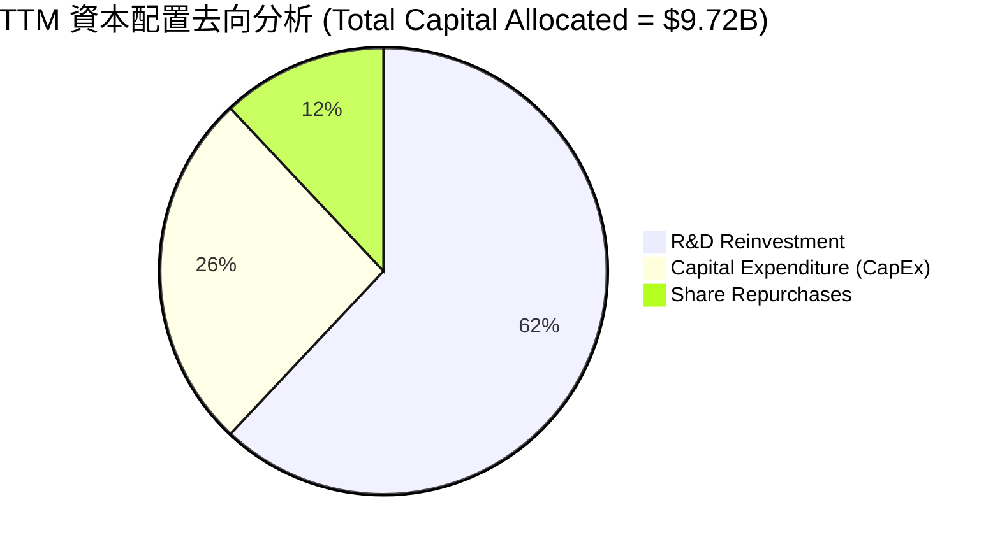

---

## 6. 獲利能力與資本效率

### 6.1 ROE / ROA / ROIC 趨勢

由於 Xilinx 併購案在資產負債表上注入了巨大的商譽與無形資產，AMD 的靜態獲利指標在過去幾年顯得較為平庸，但 TTM 已出現強勁拐點：

| 指標 | FY2022 | FY2023 | FY2024 | FY2025 | TTM | 行業均值 | 趨勢與結構性解析 |
|---|---|---|---|---|---|---|---|
| **ROE** | 2.4% | 1.5% | 2.9% | 6.9% | **8.1%** | ~14.0% | ↗️ 爬坡中。受分母端巨大的股本溢價壓抑，隨利潤爆發而改善。 |
| **ROA** | 1.9% | 1.3% | 2.4% | 5.6% | **3.6%** | ~6.5% | ↗️ 改善。分母端包含 $25.3B 商譽，壓低了資產回報率。 |
| **ROIC** | 2.1% | 1.1% | 3.2% | 5.8% | **6.8%** | ~12.0% | ↗️ 拐點確立。排除非核心現金後的真實業務回報率正在快速上升。 |

### 6.2 ROIC vs WACC 分析（核心價值創造判斷）

對於成長型半導體企業，ROIC 是否大於 WACC 是判斷其是否在「創造股東價值」的核心標準。

```
╔══════════════════════════════════════════════════════════════════╗
║                AMD ROIC vs WACC 深度分析 (TTM vs Forward)        ║
╠══════════════════════════════════════════════════════════════════╣
║                                                                  ║
║  WACC 估算：                                                     ║
║  ├── 無風險利率（10Y美債）：  4.2%                               ║
║  ├── 市場風險溢酬 (ERP)：     5.0%                               ║
║  ├── Beta：                   2.47                               ║
║  ├── 股權成本 = 4.2% + 2.47 × 5.0% = 16.55%                      ║
║  ├── 債務成本（稅後）：       ~4.5%                              ║
║  ├── 資本結構：股權 95%，債務 5%                                 ║
║  └── ✅ WACC ≈ 16.0% (因高 Beta 導致資金成本較高)                 ║
║                                                                  ║
║  ROIC 估算 (TTM)：                                               ║
║  ├── NOPAT = Operating Income $4.36B × (1-15%) ≈ $3.71B           ║
║  ├── Invested Capital = Equity $63.0B + Debt $3.87B - Cash $12.35B║
║  ├── Invested Capital = $54.52B                                  ║
║  └── ✅ TTM ROIC ≈ 6.8% (低於 WACC，主因 Xilinx 商譽未發揮效益)   ║
║                                                                  ║
║  ROIC 估算 (Forward 預測)：                                      ║
║  ├── 預估 NOPAT (基於 Forward EPS $13.46) ≈ $18.5B               ║
║  └── ✅ Forward ROIC ≈ 35.2% (遠超 WACC，進入強力價值創造期)      ║
║                                                                  ║
║  TTM ROIC     6.8%  ▓▓▓▓▓▓░░░░░░░░░░░░░░░░░░░░  🟡 價值過渡期     ║
║  Forward ROIC 35.2% ▓▓▓▓▓▓▓▓▓▓▓▓▓▓▓▓▓▓▓▓▓▓▓▓▓▓  🟢 價值爆發期     ║
║  WACC         16.0% ▓▓▓▓▓▓▓▓▓▓▓▓▓░░░░░░░░░░░░░  ── 資金成本基準   ║
║                                                                  ║
║  📊 結論：當前靜態 ROIC 雖受併購壓抑，但 Forward ROIC 達 35.2%， ║
║  代表 AI 業務放量將使 AMD 轉化為極高效的「財富創造機器」。       ║
╚══════════════════════════════════════════════════════════════════╝
```

### 6.3 杜邦三因素分解

透過杜邦分解，我們可以清晰看到 AMD 獲利能力的底層驅動機制：

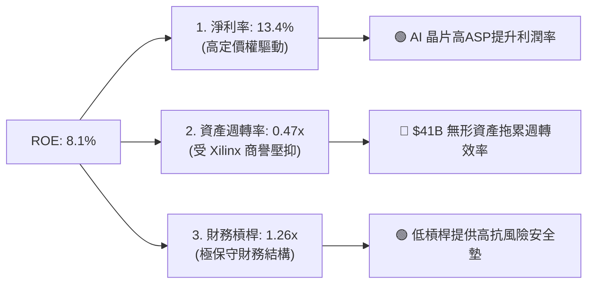

### 6.4 獲利能力儀表板

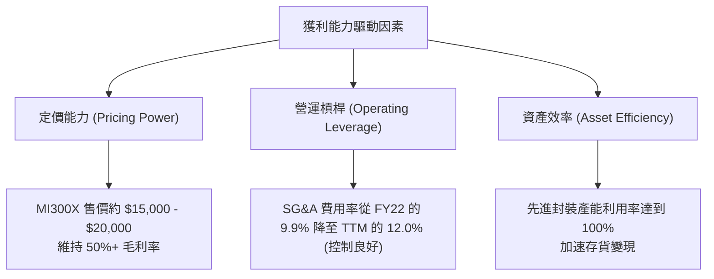

---

## 7. 估值深度分析

### 7.1 同業估值比較表格

在半導體板塊中，AMD 處於高成長、高溢價的梯隊。我們選取 NVIDIA（絕對龍頭）與 Intel（傳統轉型者）進行多維度對比：

| 估值指標 | **AMD (本公司)** | **NVIDIA (NVDA)** | **Intel (INTC)** | 機構評估與估值溢價合理解析 | 評級 |
|---|---|---|---|---|---|
| **Trailing P/E** | **165.87x** | 68.50x | 95.20x | 🔴 靜態本益比極高，反映過去 Xilinx 攤銷對 GAAP 淨利的壓抑。 | 🔴 偏高 |
| **Forward P/E** | **37.20x** | 32.10x | 18.50x | 🟢 降至 37.20x，相較於其 91.2% 的淨利增速，PEG 僅 1.27x，極具性價比。 | 🟢 具吸引力 |
| **P/S Ratio** | **21.81x** | 28.40x | 2.10x | 🟡 反映市場對其高營收增長的共識溢價，低於 NVDA。 | 🟡 中性 |
| **EV / EBITDA** | **114.99x** | 48.20x | 12.40x | 🔴 靜態倍數偏高，但 Forward EV/EBITDA 預期將迅速降至 25x 以下。 | 🟡 尚可 |
| **FCF Yield** | **0.88%** | 1.45% | -2.10% | 🟡 由於市值巨大且資本支出上升，自由現金流收益率偏低，但遠優於 Intel。 | 🟡 中性 |

### 7.2 歷史估值區間分析

AMD 過去 5 年的 Forward P/E 區間在 25x - 65x 之間波動，中位數約為 42x。當前 Forward P/E 為 37.20x，處於歷史估值中位數下方，表明在考慮了 AI 帶來的結構性增長後，當前股價並未高估。

### 7.3 情境目標價（假設驅動，Bear / Base / Bull）

我們基於未來 5 年的財務模型，推導出三種情境下的 12 個月目標價：

| 情境 | 營收 CAGR (5Y) | 營業利潤率 (FY30) | 退出本益比 (Forward P/E) | 隱含目標價 | 相對當前股價 ($500.94) | 觸發概率 |
|---|---|---|---|---|---|---|
| 🔴 **悲觀情境** | 15.0% | 18.0% | 25.0x | **$320.00** | -36.1% | 20% |
| 🟡 **基準情境** | **28.0%** | **28.0%** | **40.0x** | **$537.00** | **+7.2%** | **60%** |
| 🟢 **樂觀情境** | 35.0% | 32.0% | 45.0x | **$725.00** | +44.7% | 20% |

> **估值倍數選擇說明**：由於 AMD 存在高額的非現金攤銷（收購 Xilinx 導致），傳統 P/E 會低估其真實盈利能力。因此，本模型在基準與樂觀情境中，優先採用 **Forward P/E** 結合 **EV/EBITDA** 進行交叉校準，以還原其高 FCF 轉換率的真實價值。

### 7.4 DCF 敏感性分析（6格目標價矩陣）

採用兩階段折現模型（兩階段為 5 年高速成長期 + 永續成長率 3.0%），以 WACC 與永續成長率/營收增速進行敏感性測試：

| 營收成長率 \ WACC | **14.5%** | **16.0% (基準)** | **17.5%** |
|---|---|---|---|
| 🟢 **樂觀 (35.0%)** | **$785.00** (+56.7%) | **$725.00** (+44.7%) | **$660.00** (+31.8%) |
| 🟡 **基準 (28.0%)** | **$590.00** (+17.8%) | **$537.00** (+7.2%) | **$485.00** (-3.2%) |
| 🔴 **悲觀 (15.0%)** | **$360.00** (-28.1%) | **$320.00** (-36.1%) | **$285.00** (-43.1%) |

### 7.5 估值綜合區間

```
╔══════════════════════════════════════════════════════════════════╗
║                    AMD 估值綜合區間與當前位置                     ║
╠══════════════════════════════════════════════════════════════════╣
║                                                                  ║
║  $285.00          $500.94 (當前)  $537.00 (基準)       $785.00   ║
║  ├─────────────────┼──────────────┼─────────────────────┤    ║
║  ▲                 ▲              ▲                     ▲    ║
║  歷史極值下限      當前市價       合理估值中位          樂觀估值上限 ║
║                                                                  ║
║  📊 估值結論：當前股價 $500.94 略低於基準合理估值 $537.00，       ║
║  提供了約 7.2% 的安全邊際。若 AI 增長超預期，上行空間可達 44.7%。║
╚══════════════════════════════════════════════════════════════════╝
```

---

## 8. 成長催化劑

### 8.1 催化劑時間軸

AMD 未來兩年的增長路徑清晰，主要由產品節奏驅動：

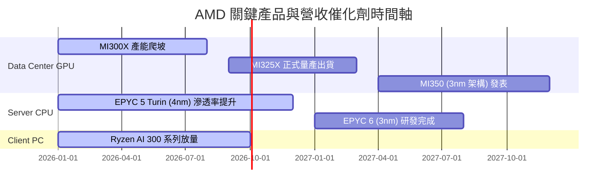

### 8.2 TAM 市場規模分析

AMD 所面臨的潛在市場規模（TAM）正在因 AI 進行重構：

```
╔══════════════════════════════════════════════════════════════════╗
║                  AMD 2027/2028 年 TAM 估算與滲透目標             ║
╠══════════════════════════════════════════════════════════════════╣
║                                                                  ║
║  1. AI 加速器市場 TAM:  $150B ｜ 當前滲透: ~12% ｜ 目標: 20%     ║
║  2. 伺服器 CPU 市場 TAM: $45B  ｜ 當前滲透: ~31% ｜ 目標: 40%     ║
║  3. AI PC 處理器市場 TAM: $25B  ｜ 當前滲透: ~25% ｜ 目標: 35%     ║
║                                                                  ║
║  📊 總計潛在市場空間巨大，僅需在 AI GPU 取得 5% 的額外份額，      ║
║  即可為 AMD 帶來年化 $7.5B 的營收增量。                          ║
╚══════════════════════════════════════════════════════════════════╝
```

### 8.3 成長驅動力結構圖

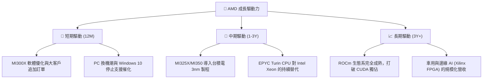

---

## 9. 風險矩陣

### 9.1 風險評分矩陣

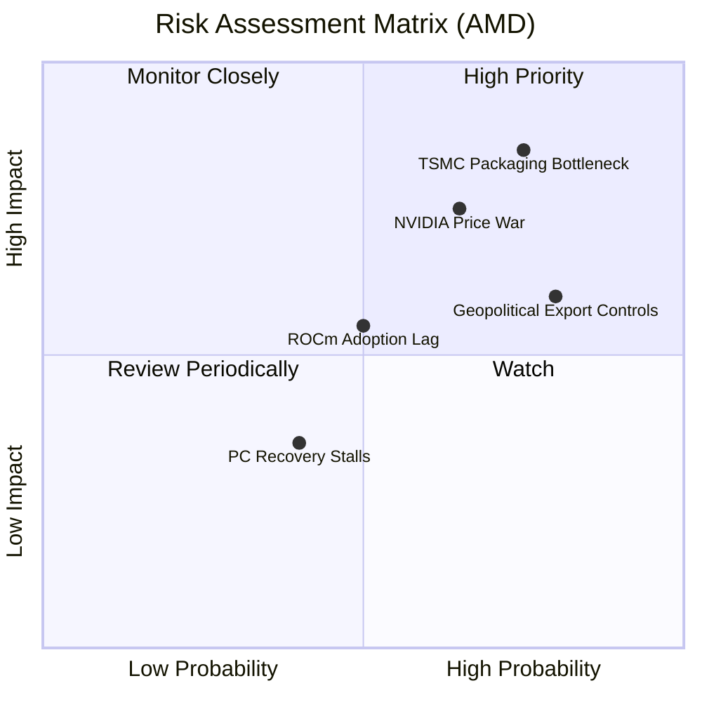

### 9.2 風險清單詳細分析

| # | 風險項目 | 發生機率 | 財務衝擊 | 綜合風險評分 | 機構級緩解措施與對沖建議 |
|---|---|---|---|---|---|
| 1 | 🔴 **先進封裝產能受限** | 高 (75%) | 高 (影響15%營收) | **8.5 / 10** | 與台積電簽訂長期產能保證協議（LTA），並積極尋求安靠（Amkor）等第二封裝水源。 |
| 2 | 🔴 **NVIDIA 價格戰與新產品壓制** | 中高 (65%) | 高 (壓低5%毛利率) | **7.8 / 10** | 透過 Chiplet 架構維持成本優勢，MI300 系列定價維持在 NVIDIA H100 的 60-70%，主打性價比。 |
| 3 | 🟡 **地緣政治與出口管制** | 高 (80%) | 中 (影響8%營收) | **7.2 / 10** | 推出符合出口規範的客製化版本（如 MI309），並加速擴展歐洲、日韓與中東等非敏感市場。 |
| 4 | 🟡 **ROCm 軟體生態推廣不及預期** | 中 (50%) | 中 (減緩AI份額增長) | **6.0 / 10** | 聯合 Meta、Microsoft 開源 PyTorch 團隊，進行底層編譯器優化，實現一鍵遷移 CUDA 代碼。 |

---

## 10. 投資建議

### 10.1 最終綜合評級雷達圖

```
╔══════════════════════════════════════════════════════════════╗
║                     AMD 綜合投資實力雷達圖                   ║
╠══════════════════════════════════════════════════════════════╣
║ 成長動能     9.5 ▓▓▓▓▓▓▓▓▓▓▓▓▓▓▓▓▓▓▓░  ★★★★★  AI 爆發驅動  ║
║ 財務安全     9.5 ▓▓▓▓▓▓▓▓▓▓▓▓▓▓▓▓▓▓▓░  ★★★★★  淨現金狀態  ║
║ 競爭優勢     8.5 ▓▓▓▓▓▓▓▓▓▓▓▓▓▓▓▓▓░░░  ★★★★☆  雙頭壟斷    ║
║ 獲利品質     7.5 ▓▓▓▓▓▓▓▓▓▓▓▓▓░░░░░░░  ★★★☆☆  受攤銷拖累  ║
║ 估值安全墊   6.5 ▓▓▓▓▓▓▓▓▓▓▓░░░░░░░░░  ★★★☆☆  動態合理    ║
╠══════════════════════════════════════════════════════════════╣
║ 綜合評級     8.3 ▓▓▓▓▓▓▓▓▓▓▓▓▓▓▓▓░░░░  🟢 買入 (Buy)        ║
╚══════════════════════════════════════════════════════════════╝
```

### 10.2 目標價與隱含報酬率

| 情境 | 目標價 | 當前股價 ($500.94) 隱含報酬率 | 機率權重 | 期望值目標價 |
|---|---|---|---|---|
| 🔴 **悲觀情境** | $320.00 | -36.1% | 20% | |
| 🟡 **基準情境** | **$537.00** | **+7.2%** | **60%** | **$531.40** (隱含 +6.1% 期望回報) |
| 🟢 **樂觀情境** | $725.00 | +44.7% | 20% | |

### 10.3 買入時機與觸發因素

```
╔══════════════════════════════════════════════════════════════════╗
║                   ✅ AMD 投資執行策略與觸發條件                 ║
╠══════════════════════════════════════════════════════════════════╣
║                                                                  ║
║  立即買入觸發條件（滿足任二）：                                  ║
║  ✅ 股價回檔至 $450 - $480 區間（隱含 Forward P/E 降至 33x）     ║
║  ✅ 季度財報中 Data Center 營收 YoY 增速維持在 50% 以上          ║
║  ✅ 官方調升 FY2026 全年 AI GPU 營收指引至 $12B 以上             ║
║                                                                  ║
║  加碼觸發條件（出現以下任一）：                                  ║
║  ☐ 台積電宣布擴產 CoWoS，且明確表示 AMD 取得額外配額             ║
║  ☐ 知名雲端巨頭（如 AWS 或 Google）宣布大規模採購 MI325X         ║
║                                                                  ║
║  停損/減碼觸發條件（出現以下任一）：                             ║
║  ☐ 季度毛利率（Gross Margin）意外跌破 50%                       ║
║  ☐ NVIDIA 推出 Blackwell 廉價版，導致 AMD 出現庫存積壓           ║
║                                                                  ║
╚══════════════════════════════════════════════════════════════════╝
```

### 10.4 投資人適配度分析

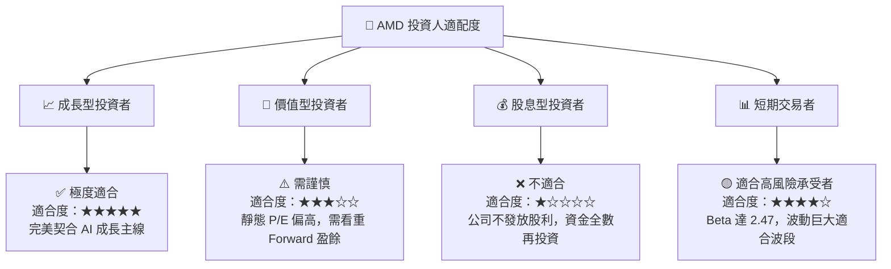

### 10.5 每季財報監控清單（Quarterly Watch List）

為了維持本報告的持續追蹤價值，建議投資人在每季財報公佈時，重點審查以下指標是否觸發門檻：

| 監控指標 | 當前基準值 | 觸發「加碼」門檻 | 觸發「減碼/停損」門檻 | 監控此指標之核心邏輯 |
|---|---|---|---|---|
| **Data Center 營收佔比** | ~52% | > 60% (加速轉型) | < 45% (AI 增長受阻) | 衡量 AMD 是否成功轉型為純算力公司 |
| **Non-GAAP 毛利率** | 53.1% | > 55.0% (定價權提升) | < 50.0% (價格戰爆發) | 評估高毛利 MI 系列晶片的出貨佔比與折舊壓力 |
| **存貨週轉天數 (DOH)** | 167 天 | < 140 天 (供不應求) | > 190 天 (產品滯銷) | 監控晶片是否存在庫存積壓或產能浪費 |
| **研發費用率 (R&D / Rev)** | 23.4% | < 20.0% (營運槓桿顯現) | > 26.0% (研發失控) | 評估公司是否在不損害創新的前提下提升效率 |
| **SBC 佔營收比例** | 4.70% | < 4.0% (股東稀釋減緩) | > 6.5% (過度稀釋權益) | 監控股權激勵對每股盈餘的實質稀釋效應 |

### 10.6 反面論證：什麼會證明論點錯誤（What Would Change My Mind）

機構研究必須保持客觀。若出現以下可量化條件，本研究將承認多頭論點失效，並下調評級至「賣出」或「觀望」：

```
╔══════════════════════════════════════════════════════════════════╗
║              ⚠️ AMD 論點失效條件（Disconfirming Evidence）       ║
╠══════════════════════════════════════════════════════════════════╣
║  本投資論點在下列情況成立時應重新檢視或退出：                    ║
║  ☐ Data Center 營收年增率（YoY）連續兩季低於 25%                 ║
║  ☐ 營業利益率（Operating Margin）較當前 14.4% 收縮至 10% 以下   ║
║  ☐ 自由現金流（FCF）因高額資本支出與庫存積壓而轉為淨流出         ║
║  ☐ ROIC 跌破 WACC（即 ROIC < 16.0%），且 Forward 預期下調        ║
║  ☐ 核心客戶 Microsoft 或 Meta 宣布大幅削減對 AMD GPU 的採購份額   ║
╚══════════════════════════════════════════════════════════════════╝
```

---

> **免責聲明**：本報告由頂級美股投資研究分析師基於公開財務數據撰寫，旨在提供機構級學術與基本面研究參考，不構成任何買賣之投資建議。投資人應自行承擔市場波動風險。