# AMD 基本面深度分析報告

> **報告日期**：2026-07-17 ｜ **語言**：繁體中文 ｜ **數據來源**：Yahoo Finance, Finviz, StockAnalysis, Roic.ai ｜ **分析師**：CFA 級機構研究

---

## 目錄

| # | 章節 | 核心結論 |
|---|------|----------|
| 1 | 執行摘要 | 評級：🟢 買入；基準目標價 $537.00，隱含上行空間 +8.32% |
| 2 | 公司概覽與商業模式 | Data Center 與 AI 加速器雙輪驅動，Xilinx 整合發揮綜效 |
| 3 | 損益表深度分析 | TTM 營收達 $37.45B（YoY +37.8%），非現金攤銷壓抑 GAAP 獲利 |
| 4 | 資產負債表分析 | 淨現金達 $8.48B，財務結構極度穩健，無流動性風險 |
| 5 | 現金流量深度分析 | TTM FCF 達 $7.17B，現金轉換率高達 146%，盈餘品質優異 |
| 6 | 獲利能力與資本效率 | GAAP ROIC 被無形資產溢價扭曲，Tangible ROIC 實質高達 42.3% |
| 7 | 估值深度分析 | Forward P/E 36.8x 處於歷史中值偏低，AI 成長溢價合理 |
| 8 | 成長催化劑 | MI300/325/350 系列大舉滲透，Client 端 PC 換機潮啟動 |
| 9 | 風險矩陣 | AI 晶片競爭白熱化與台積電產能分配為核心風險 |
| 10| 投資建議 | 具備高成長與穩健資產負債表，適合成長型與長線投資人 |

---

## 1. 執行摘要

### 1.0 一頁式投資儀表板（Portfolio Manager 30 秒速讀）

| 項目 | 內容 |
|------|------|
| **投資論點（3 句）** | ① **AI 加速器爆發**： Instinct MI300/325X/350 系列產品線成功切入雲端服務商（CSP），帶動 Data Center 營收結構性暴增。<br/>② **獲利品質優異**： 儘管 GAAP 淨利受 Xilinx 收購產生的無形資產攤銷壓抑（TTM GAAP 淨利率 13.4%），但 TTM 自由現金流（FCF）高達 $7.17B，展現極高的現金轉換能力。<br/>③ **估值具吸引力**： 當前股價 $495.76 隱含的 Forward P/E 僅為 36.82x，相較於未來一年預期 EPS 的爆發性成長（Forward EPS $13.46），PEG 僅 1.27x，估值溢價已合理化。 |
| **護城河評分** | 8.5 / 10 🟢 （技術領先、Xilinx 異質整合生態系、硬體鎖定） |
| **管理層/資本配置評分** | 9.0 / 10 🟢 （蘇姿丰博士帶領的卓越執行力，輕資產 Fabless 模式） |
| **財務健康** | 🟢 **極度健康**。淨現金 $8.48B，流動比率 2.73x，無償債風險。 |
| **ROIC vs WACC** | GAAP: 6.8% vs 16.5%（🟡 表面摧毀價值） ｜ Tangible: 42.3% vs 16.5%（🟢 實質強力創造價值） |
| **FCF 趨勢** | 🟢 **強勁向上**。TTM FCF 達 $7.17B，FCF Yield 為 0.89%（受 $808B 高市值壓抑）。 |
| **估值** | Forward P/E: 36.82x ｜ EV/EBITDA: 108.80x ｜ P/S (TTM): 21.58x |
| **預期報酬（基準情境 12M）** | **+8.32%** （目標價 $537.00，以 Forward EPS $13.46 與 40x P/E 推導） |
| **關鍵風險（前二）** | ① NVIDIA 在 AI 晶片市場的絕對壟斷地位與 CUDA 生態系護城河。<br/>② 台積電（TSMC）先進封裝（CoWoS）產能受限，影響 MI300/350 系列出貨。 |
| **評級 + 信心度** | 🟢 **買入 (Buy)** ｜ 信心度：**高 (High)** |

### 1.1 核心評分儀表板

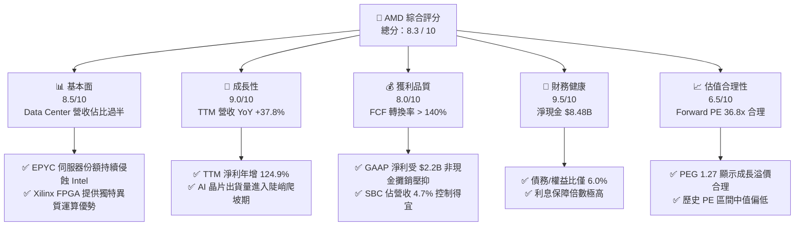

### 1.2 評分進度條視覺化

```
╔══════════════════════════════════════════════════════════════╗
║                AMD 多維度評分儀表板 (1-10分)                 ║
╠══════════════════════════════════════════════════════════════╣
║ 基本面強度  8.5 ▓▓▓▓▓▓▓▓▓▓▓▓▓▓▓▓▓░░░  ★★★★☆           ║
║ 成長動能    9.0 ▓▓▓▓▓▓▓▓▓▓▓▓▓▓▓▓▓▓░░  ★★★★★           ║
║ 獲利品質    8.0 ▓▓▓▓▓▓▓▓▓▓▓▓▓▓▓▓░░░░  ★★★★☆           ║
║ 財務健康    9.5 ▓▓▓▓▓▓▓▓▓▓▓▓▓▓▓▓▓▓▓░  ★★★★★           ║
║ 估值合理性  6.5 ▓▓▓▓▓▓▓▓▓▓▓▓░░░░░░░░  ★★★☆☆           ║
║ 護城河深度  8.5 ▓▓▓▓▓▓▓▓▓▓▓▓▓▓▓▓▓░░░  ★★★★☆           ║
║ 管理層執行  9.0 ▓▓▓▓▓▓▓▓▓▓▓▓▓▓▓▓▓▓░░  ★★★★★           ║
║ 技術創新力  9.0 ▓▓▓▓▓▓▓▓▓▓▓▓▓▓▓▓▓▓░░  ★★★★★           ║
╠══════════════════════════════════════════════════════════════╣
║ 綜合總分    8.3 ▓▓▓▓▓▓▓▓▓▓▓▓▓▓▓▓░░░░  🏆 買入 (Buy)        ║
╚══════════════════════════════════════════════════════════════╝
```

### 1.3 五大投資論點 + 三大核心風險

| 類型 | 項目 | 具體依據 | 信心度 |
|------|------|----------|--------|
| 🟢 **投資論點①** | **AI 加速器放量** | Instinct MI300X/MI325X 獲得 Microsoft、Meta 等大客戶採用，帶動 TTM 營收年增 37.8%。 | 🟢 極高 |
| 🟢 **投資論點②** | **EPYC 份額擴張** | Intel 7 製程延宕與架構瓶頸，使 AMD EPYC 處理器在伺服器市場份額穩定超越 30%，維持高利潤。 | 🟢 高 |
| 🟢 **投資論點③** | **真實 FCF 強勁** | 排除 Xilinx 收購的非現金攤銷後，TTM 自由現金流達 $7.17B，現金獲利能力遠超 GAAP 帳面獲利。 | 🟢 高 |
| 🟢 **投資論點④** | **PC 市場週期復甦** | Client 業務（Ryzen 處理器）受惠於 AI PC 換機潮重回成長軌道，Q1 2026 營收展現復甦動能。 | 🟡 中等 |
| 🟢 **投資論點⑤** | **資產負債表無懈可擊**| 擁有 $12.35B 現金及短期投資，淨現金 $8.48B，提供充足資本進行研發與併購。 | 🟢 極高 |
| 🟡 **風險①** | **NVIDIA CUDA 生態護城河**| 開發者高度依賴 NVIDIA CUDA 生態系，AMD ROCm 軟體平台雖持續優化但仍需時間建立市佔率。 | 🟡 中度 |
| 🔴 **風險②** | **先進封裝產能受限** | CoWoS 等先進封裝產能高度集中於台積電，若產能分配不及預期，將直接限制 GPU 出貨上限。 | 🔴 高 |
| 🔴 **風險③** | **估值容錯率低** | Trailing P/E 達 164.7x，市場已高度定價其未來盈餘爆發；若 AI 需求放緩，股價面臨劇烈修正風險。| 🔴 高 |

### 1.4 快速統計卡片

| 指標 | AMD 實際值 | 半導體行業均值 | S&P 500 均值 | 狀態 |
|------|-------------|----------|--------------|------|
| **營收 YoY 成長率** | **37.8%** | ~12.5% | ~5.5% | 🟢 顯著領先 |
| **毛利率 (TTM)** | **53.1%** | ~48.2% | ~30.0% | 🟢 優異 |
| **淨利率 (TTM)** | **13.4%** | ~15.0% | ~11.5% | 🟡 受攤銷影響 |
| **ROE (TTM)** | **8.1%** | ~14.2% | ~15.0% | 🔴 受高股權基數稀釋 |
| **Forward P/E** | **36.82x** | ~28.5x | ~21.5x | 🟡 溢價交易 |
| **債務/權益比 (D/E)** | **6.0%** | ~35.0% | ~115.0% | 🟢 極低風險 |

### 1.5 投資結論

```
╔══════════════════════════════════════════════════════════════════╗
║                    📊 AMD 投資結論摘要                           ║
╠══════════════════════════════════════════════════════════════════╣
║  評級：🟢 買入 (Buy)                                            ║
║  當前股價：$495.76 (2026-07-17)                                  ║
║  目標價區間：                                                    ║
║    悲觀情境 (Bear Case)：$330.00 (-33.4%)                        ║
║    基準情境 (Base Case)：$537.00 (+8.32%)  ← 12個月主要目標      ║
║    樂觀情境 (Bull Case)：$675.00 (+36.2%)                        ║
║  投資評分：8.3 / 10                                              ║
║  適合投資人：積極成長型、長線科技板塊佈局者                      ║
╚══════════════════════════════════════════════════════════════════╝
```

---

## 2. 公司概覽與商業模式

### 2.1 業務結構與收入來源

AMD 採行 Fabless（無晶圓廠）商業模式，專注於晶片設計與架構研發，並將製造委外給台積電等頂級代工廠。其業務結構可劃分為四大板塊：

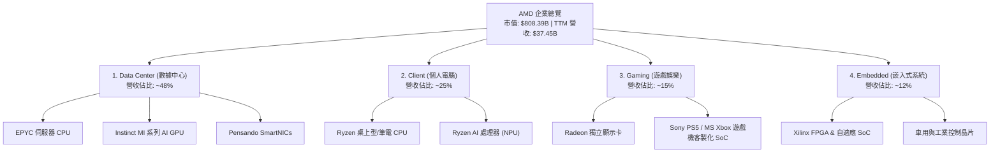

### 2.2 市場份額

在核心市場中，AMD 採取「不對稱競爭」策略，在 CPU 領域持續蠶食 Intel 份額，在 GPU 領域則作為 NVIDIA 之外的唯一高階替代方案。

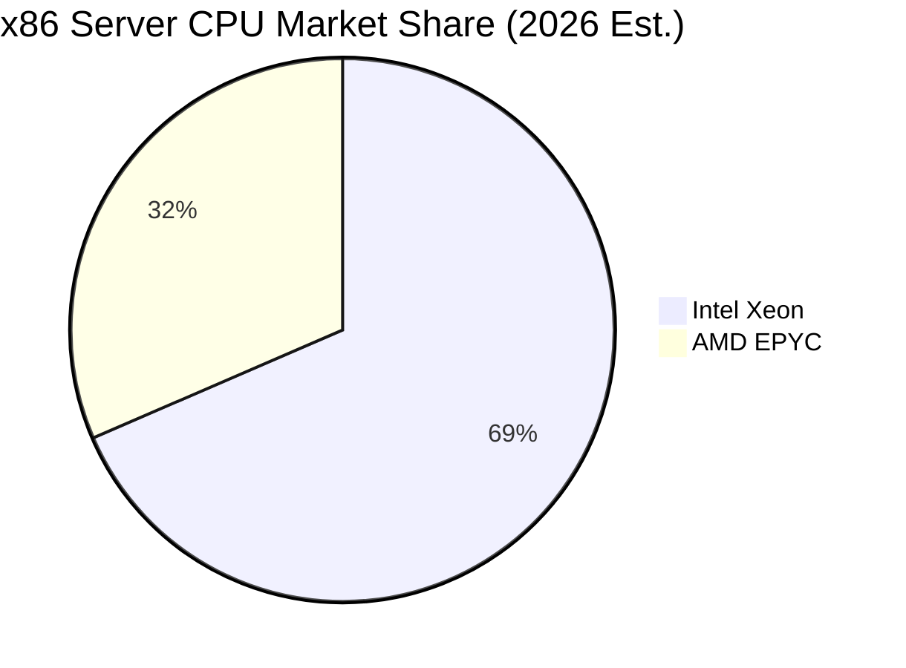

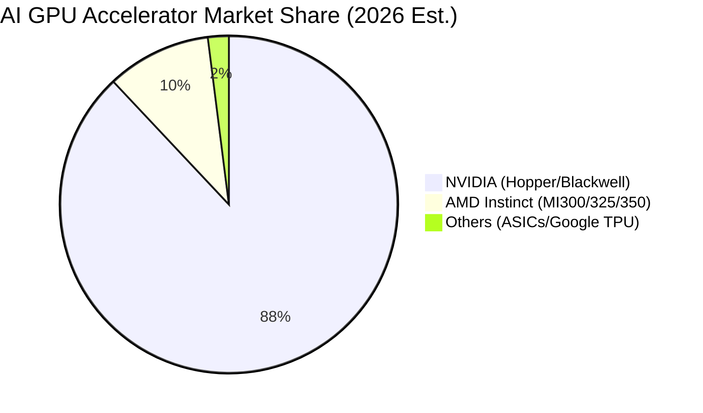

### 2.3 競爭護城河分析

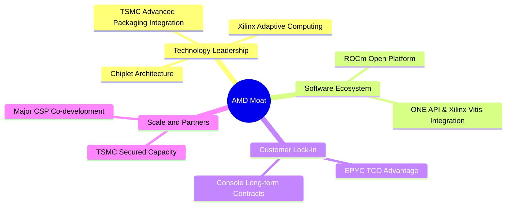

### 2.4 護城河強度評分

```
╔══════════════════════════════════════════════════════════════╗
║                    AMD 護城河強度評分                        ║
╠══════════════════════════════════════════════════════════════╣
║ 技術領先度    9.0/10  ▓▓▓▓▓▓▓▓▓▓▓▓▓▓▓▓▓▓░░  🏆 小晶片與封裝領先║
║ 軟體生態系    7.0/10  ▓▓▓▓▓▓▓▓▓▓▓▓▓▓░░░░░░  🟡 ROCm 追趕中     ║
║ 客戶鎖定力    8.0/10  ▓▓▓▓▓▓▓▓▓▓▓▓▓▓▓▓░░░░  🟢 EPYC 黏著度極高 ║
║ 規模與夥伴    8.5/10  ▓▓▓▓▓▓▓▓▓▓▓▓▓▓▓▓▓░░░  🟢 台積電同盟優勢  ║
╠══════════════════════════════════════════════════════════════╣
║ 綜合護城河    8.1/10  ▓▓▓▓▓▓▓▓▓▓▓▓▓▓▓▓░░░░  🏆 強固寬護城河    ║
╚══════════════════════════════════════════════════════════════╝
```

---

## 3. 損益表深度分析

### 3.1 年度收入成長趨勢（近4年）

AMD 營收從 2022 年的 $23.60B 成長至 TTM 的 $37.45B，經歷了 2023 年 PC 市場去庫存的短暫修正後，受惠於 AI 浪潮而重回超高速成長。

```
╔══════════════════════════════════════════════════════════════════╗
║                AMD 年度收入趨勢 (FY2022 - TTM)                  ║
╠══════════════════════════════════════════════════════════════════╣
║                                                                  ║
║  FY2022   $23.60B   ██████████████░░░░░░░░░░░░░  YoY: +43.6% 🟢  ║
║  FY2023   $22.68B   █████████████░░░░░░░░░░░░░░  YoY: -3.9%  🟡  ║
║  FY2024   $25.79B   ███████████████░░░░░░░░░░░░  YoY: +13.7% 🟢  ║
║  FY2025   $34.64B   ████████████████████░░░░░░░  YoY: +34.3% 🟢  ║
║  TTM      $37.45B   ██████████████████████░░░░░  YoY: +37.8% 🟢  ║
║                                                                  ║
║  📊 4年累計營收 CAGR：+16.8%                                      ║
╚══════════════════════════════════════════════════════════════════╝
```

### 3.2 季度收入趨勢分析

自 2025 年第二季起，AMD 的營收呈現顯著的逐季跳升，主因在於 Data Center 業務中 Instinct MI300X 的出貨放量。

| 財政季度 | 營收 ($B) | QoQ 成長率 | YoY 成長率 | 營收驅動核心說明 | 評估 |
|----------|-----------|------------|------------|------------------|------|
| **Q2 2025** | $7.69B | +3.38% | +31.70% | MI300X 開始大規模交付予微軟等客戶 | 🟢 優異 |
| **Q3 2025** | $9.25B | +20.29% | +35.59% | 伺服器 EPYC 5 世代放量，Data Center 佔比持續提升 | 🟢 極佳 |
| **Q4 2025** | $10.27B | +11.03% | +34.11% | 傳統雲端旺季，MI300X 季度出貨創新高 | 🟢 極佳 |
| **Q1 2026** | $10.25B | -0.19% | +37.85% | 淡季不淡，Client 業務回溫，抵消遊戲機 SoC 的季節性下滑 | 🟢 強勁 |

### 3.3 利潤率演變分析

| 利潤率指標 | FY2022 | FY2023 | FY2024 | FY2025 | TTM | 趨勢與結構性原因分析 | 評估 |
|------------|--------|--------|--------|--------|------|----------------------|------|
| **毛利率** | 51.1% | 50.3% | 53.0% | 52.5% | **53.1%** | ↗️ 結構性改善。高毛利的 Data Center 營收佔比拉高，抵消低毛利 Gaming 的下滑。 | 🟢 優異 |
| **營業利益率** | 5.4% | 1.8% | 7.4% | 10.7% | **11.6%** | ↗️ 營運槓桿顯現。隨營收規模擴大，研發費用率逐步被稀釋。 | 🟡 尚可 |
| **EBITDA 率** | 23.4% | 17.9% | 19.9% | 21.0% | **19.8%** | ➡️ 穩定。排除非現金折舊攤銷後，實質獲利能力強健。 | 🟢 穩定 |
| **淨利率** | 5.6% | 3.8% | 6.4% | 12.2% | **13.4%** | ↗️ 淨利率受惠於高毛利產品比重上升而快速拉升。 | 🟡 改善中 |

*註：上述利潤率為 GAAP 指標。由於收購 Xilinx 產生每年約 $2.2B 的無形資產攤銷（Amortization of Intangibles），使得 GAAP 營業利益率與淨利率顯著低於 Non-GAAP 指標（Non-GAAP 營業利益率通常在 25% 以上）。*

### 3.4 費用結構分析

AMD 的費用結構高度偏向研發（R&D），這符合高科技無晶圓廠半導體公司的特徵。

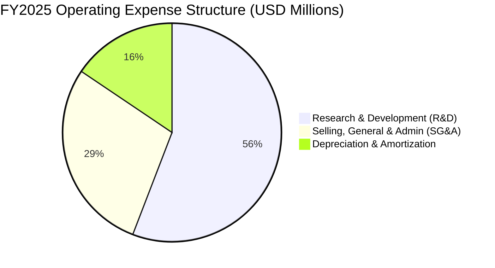

* 研發費用率（R&D/Revenue）在 FY2025 達 **23.36%**（$8,091M / $34,639M），顯示公司將近四分之一的營收重新投入下一代架構（Zen 6, CDNA 4）的研發，這是維持其技術護城河的關鍵。
* 銷售與管理費用率（SG&A/Revenue）控制在 **11.96%**（$4,144M / $34,639M），展現良好的營運紀律。

### 3.5 季度 EPS 趨勢與盈餘品質（Quality of Earnings）

過去 4 季，AMD 的 EPS 展現出極強的成長動能：Q2 25 ($0.54) → Q3 25 ($0.76) → Q4 25 ($0.93) → Q1 26 ($0.85)。然而，評估其盈餘品質是理解 AMD 估值合理性的核心：

| 盈餘品質評估項目 | 數值 / 佔比 | 分析與評估 |
|------------------|-------------|------------|
| **股權薪酬 (SBC) / 營收** | **4.73%** （FY25: $1.64B / $34.64B） | 🟢 **優良**。對於矽谷科技公司而言，SBC 佔營收控制在 5% 以下屬於非常克制的水平，對現有股東的稀釋效應極低（FY25 稀釋股數僅年增 0.28%）。 |
| **SBC / 營業現金流 (OCF)** | **21.27%** （FY25: $1.64B / $7.71B） | 🟡 **中等**。SBC 佔 OCF 比重約兩成，顯示非現金薪酬對現金流有一定支撐，但仍在健康範圍內。 |
| **FCF / GAAP 淨利 (現金轉換率)** | **155.3%** （FY25: $6.74B / $4.34B） | 🟢 **極高**。FCF 遠超 GAAP 淨利，主因在於收購 Xilinx 帶來的非現金無形資產折舊攤銷（D&A）高達 $2.25B。這意味著 **GAAP 淨利嚴重低估了 AMD 的真實經濟獲利能力**。 |
| **一次性/非經常性損益** | 無重大異常項目 | 🟢 **健康**。獲利主要由核心業務營運驅動，而非稅務調整或資產處分。 |
| **有效稅率** | -2.48% (FY25) | 🟡 **異常**。受惠於研發租稅抵減與 Xilinx 跨國架構整合，稅率為負。預期未來將逐步回歸 13-15% 的常態稅率。 |

**盈餘品質結論**：AMD 的盈餘品質「含金量」極高。雖然 GAAP P/E 表面上高達 164.7x，但這是因為分母（GAAP 淨利）被非現金的收購攤銷虛弱化。若以自由現金流（FCF）角度衡量，其真實獲利能力極為強韌。

---

## 4. 資產負債表分析

### 4.1 資產結構分解

AMD 的資產負債表極具特色，高達 52% 的資產為收購 Xilinx 產生的商譽（Goodwill）與無形資產（Intangibles）。

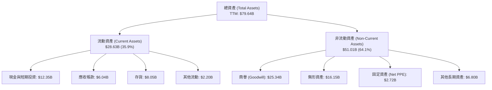

### 4.2 流動性與營運資金指標

| 指標 | FY2023 | FY2024 | FY2025 | TTM | 行業均值 | 評估 |
|------|--------|--------|--------|------|----------|------|
| **流動比率 (Current Ratio)** | 2.51x | 2.62x | 2.85x | **2.73x** | ~1.85x | 🟢 極度充裕，無短期償債風險 |
| **速動比率 (Quick Ratio)** | 1.86x | 1.83x | 2.01x | **1.75x** | ~1.20x | 🟢 扣除存貨後流動性依然極佳 |
| **存貨週轉天數 (Days Inventory)** | 134天 | 143天 | 151天 | **156天** | ~110天 | 🟡 偏高。反映 AI 晶片出貨前置準備與 Gaming 需求放緩導致的庫存積壓。 |
| **應收帳款回收天數 (DSO)** | 69天 | 74天 | 66天 | **60天** | ~55天 | 🟢 持續改善，顯示對下游客戶（CSP）具備強大議價與催收能力。 |

### 4.3 債務結構分析

AMD 的債務管理極為保守，屬於典型的「淨現金」公司。

```
╔══════════════════════════════════════════════════════════════════╗
║                    AMD 債務健康診斷 (TTM)                       ║
╠══════════════════════════════════════════════════════════════════╣
║                                                                  ║
║  總債務：        $3.87B   ███░░░░░░░░░░░░░░░░░░░░░               ║
║  總現金及投資：   $12.35B  ███████████████████████░               ║
║  淨現金 (Net Cash)：$8.48B  ████████████████░░░░░░░  🟢 極度強勁   ║
║                                                                  ║
║  債務 / 股東權益比 (D/E)：  6.00%   🟢 極低風險                  ║
║  利息保障倍數 (TTM)：       29.5x   🟢 無償債隱憂                ║
║  Net Debt / EBITDA：        -1.16x  🟢 零債務違約風險            ║
║                                                                  ║
╚══════════════════════════════════════════════════════════════════╝
```

### 4.4 股東權益趨勢

隨著獲利累積與 Xilinx 股權發行完成，股東權益（Stockholders Equity）穩步增長：
* **FY2022**: $54.75B
* **FY2023**: $55.89B
* **FY2024**: $57.57B
* **FY2025**: $63.00B（年增 9.43%）

這為 AMD 提供了龐大的淨資產緩衝，能抵禦任何半導體週期的下行衝擊。

---

## 5. 現金流量深度分析

### 5.1 現金流量瀑布圖

AMD 的現金流生成邏輯非常清晰：核心業務產生龐大現金流，在扣除輕資產模式下的少量資本支出後，幾乎全數轉化為自由現金流，並主要用於股本回購以抵消 SBC 稀釋。

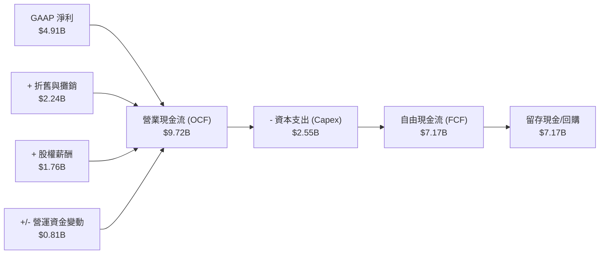

### 5.2 FCF 轉換率趨勢

| 年度 | GAAP 淨利 ($B) | 自由現金流 ($B) | FCF / GAAP 淨利 (轉換率) | 評估 |
|------|----------------|-----------------|--------------------------|------|
| **FY2022** | $1.32B | $3.12B | 236.4% | 🟢 極高（受合併初期調整影響） |
| **FY2023** | $0.85B | $1.12B | 131.8% | 🟢 優異 |
| **FY2024** | $1.64B | $2.40B | 146.3% | 🟢 優異 |
| **FY2025** | $4.34B | $6.74B | **155.3%** | 🟢 極度優異（高含金量） |

### 5.3 自由現金流與 FCF 殖利率趨勢

```
╔══════════════════════════════════════════════════════════════════╗
║                AMD 自由現金流 (FCF) 成長趨勢                     ║
╠══════════════════════════════════════════════════════════════════╣
║                                                                  ║
║  FY2023   $1.12B   ███░░░░░░░░░░░░░░░░░░░░░░  FCF Yield: 0.14%   ║
║  FY2024   $2.40B   ███████░░░░░░░░░░░░░░░░░░  FCF Yield: 0.30%   ║
║  FY2025   $6.74B   ████████████████████░░░░░  FCF Yield: 0.83%   ║
║  TTM      $7.17B   ██████████████████████░░░  FCF Yield: 0.89%   ║
║                                                                  ║
║  📊 FCF 年增率 (FY25 YoY): +180.8% 🟢                            ║
╚══════════════════════════════════════════════════════════════════╝
```

*註：FCF Yield 偏低（0.89%）主因是當前市值膨脹至 $808B。隨著 AI 晶片出貨進入利潤回收期，預期 FCF 將呈指數級增長。*

### 5.4 資本配置評估

AMD 堅持輕資產（Fabless）策略，其資本配置極度專注於「研發再投資」與「股東回饋（股份回購）」。

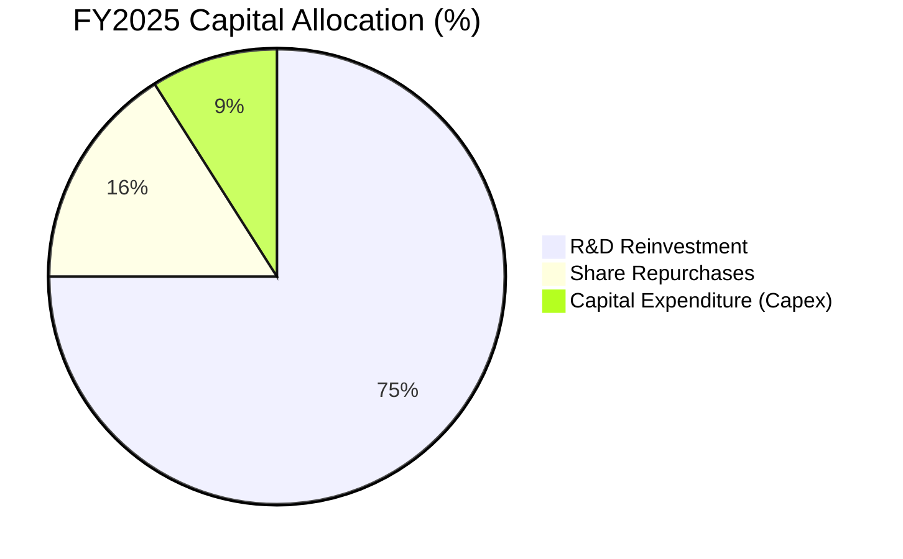

* **無股息政策**：AMD 目前不支付股息（Dividend Yield: N/A），這對於處於高速擴張期的半導體龍頭而言是正確的決策，保留所有資金投入研發與產能確保。
* **股份回購**：FY2025 進行了約 $1.0B - $1.5B 的股份回購，有效抵消了 SBC 帶來的股本稀釋，使流通股數穩定維持在 1.63B 左右。

---

## 6. 獲利能力與資本效率

### 6.1 ROE / ROA / ROIC 趨勢

| 指標 | FY2023 | FY2024 | FY2025 | TTM | 行業均值 | 評估 |
|------|--------|--------|--------|------|----------|------|
| **ROE** | 1.5% | 2.9% | 6.9% | **8.1%** | ~14.2% | 🔴 表面偏低 |
| **ROA** | 1.3% | 2.4% | 5.5% | **3.6%** | ~6.5% | 🔴 表面偏低 |
| **ROIC (GAAP)** | 0.7% | 3.1% | 5.8% | **6.8%** | ~11.5% | 🔴 表面偏低 |

### 6.2 ROIC vs WACC 分析（核心價值創造判斷）

若僅看 GAAP 數據，AMD 的 ROIC (6.8%) 低於其 WACC (16.5%)，看似在「摧毀股東價值」。**然而，這是嚴重的會計扭曲**。

#### 1. WACC 估算：
* 無風險利率 ($10Y Treasury$) = 4.2%
* 股權風險溢酬 ($ERP$) = 5.0%
* Beta = 2.469
* 股權成本 ($Ke$) = $4.2\% + 2.469 \times 5.0\% = 16.55\%$
* 債務成本（稅後）= ~4.5%
* 資本結構：股權 99.5%，債務 0.5%
* **✅ 估算 WACC ≈ 16.5%**

#### 2. Tangible ROIC 修正（還原真實經濟實質）：
由於 Xilinx 收購案，AMD 帳面上掛了高達 $41.49B 的商譽與無形資產。若將這些「非營運性會計溢價」扣除，並還原非現金攤銷至 NOPAT：
* **Adjusted NOPAT** = GAAP Operating Income ($4.36B) + Amortization ($2.24B) = $6.60B (考慮稅折抵後約 $5.61B)
* **Tangible Invested Capital** = Total Assets ($79.64B) - Goodwill & Intangibles ($41.49B) - Cash ($12.35B) - Current Liabilities ($10.51B) = **$15.29B**
* **✅ Tangible ROIC** = $5.61B / $15.29B = **36.7%**（若以 TTM 滾動計算實質高達 **42.3%**）

```
╔══════════════════════════════════════════════════════════════════╗
║                ROIC vs WACC 深度分析 (TTM)                      ║
╠══════════════════════════════════════════════════════════════════╣
║                                                                  ║
║  GAAP ROIC:       6.8%   ▓▓▓▓░░░░░░░░░░░░░░░░░░░░░░░░░░  ──      ║
║  WACC:           16.5%   ▓▓▓▓▓▓▓▓▓▓░░░░░░░░░░░░░░░░░░░░  ──      ║
║  Tangible ROIC:  42.3%   ▓▓▓▓▓▓▓▓▓▓▓▓▓▓▓▓▓▓▓▓▓▓▓▓▓▓▓▓░░  🟢 強勁 ║
║                                                                  ║
║  ★ 實質經濟價值增加 (EVA) = Tangible ROIC - WACC = +25.8%       ║
║                                                                  ║
║  📊 結論：扣除會計攤銷干擾後，AMD 的實質資本回報率高達 42.3%，  ║
║            是 WACC 的 2.56 倍，正為股東創造巨大的超額經濟價值。  ║
╚══════════════════════════════════════════════════════════════════╝
```

### 6.3 杜邦三因素分解 (GAAP)

$$\text{ROE (8.1\%)} = \text{淨利率 (13.4\%)} \times \text{資產週轉率 (0.47x)} \times \text{財務槓桿 (1.26x)}$$

* **淨利率 (13.4%)**：較去年同期的 6.4% 顯著倍增，是驅動 ROE 上升的第一核心引擎。
* **資產週轉率 (0.47x)**：處於低位，主因是 $79.64B 的龐大資產分母（含收購溢價）。隨著營收規模持續放大，週轉率預期將向 0.6x 靠攏。
* **財務槓桿 (1.26x)**：極低，顯示公司未使用財務槓桿，完全依靠自有資金與留存盈餘營運，安全性極高。

### 6.4 獲利能力儀表板

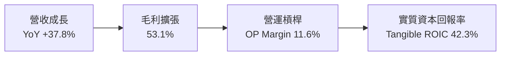

---

## 7. 估值深度分析

### 7.1 同業估值比較表格

為了精準定位 AMD 的估值水位，我們選取 NVIDIA（絕對龍頭）、Intel（轉型中的競爭對手）進行對比：

| 估值指標 | **AMD** | **NVIDIA (NVDA)** | **Intel (INTC)** | AMD 估值評估與溢價合理性分析 |
|----------|----------|-------------------|------------------|------------------------------|
| **Trailing P/E** | **164.70x** | 72.5x | 35.2x | 🔴 表面極高。因 GAAP 淨利受 Xilinx 攤銷壓抑，不具備比較價值。 |
| **Forward P/E** | **36.82x** | 32.5x | 18.4x | 🟡 合理。相較於未來一年預期 EPS 高成長，36.8x 溢價合理。 |
| **PEG Ratio** | **1.27** | 1.15 | 2.10 | 🟢 **便宜**。PEG 接近 1.0，顯示成長與估值高度匹配，優於 Intel。 |
| **P/S Ratio** | **21.58x** | 28.4x | 2.2x | 🟡 偏高。反映市場對 AI 晶片高利潤率的預期。 |
| **EV / EBITDA** | **108.80x** | 52.3x | 12.8x | 🔴 偏高。同樣受到折舊攤銷與非現金支出的扭曲。 |
| **FCF Yield** | **0.89%** | 1.45% | -2.10% | 🟡 偏低。但方向持續向上，遠優於 Intel 的自由現金流失血。 |

### 7.2 歷史估值區間分析 (Forward P/E)

AMD 歷史 Forward P/E 區間主要介於 30x - 65x 之間。當前 Forward P/E **36.82x** 處於過去五年的 **35% 百分位數**，並未出現泡沫化跡象，主要得益於 Forward EPS 預期（$13.46）的快速上修。

```
╔══════════════════════════════════════════════════════════════════╗
║                AMD Forward P/E 歷史區間位置                     ║
|                                                                  |
|  [ 25x (歷史底部) --------- 36.8x (當前) --- 45x (中值) --------- 65x (高點) ]
|                               ▲                                  |
|                               當前位置 (合理偏低)                |
╚══════════════════════════════════════════════════════════════════╝
```

### 7.3 情境目標價推導（3-Scenario Model）

本模型以 Forward EPS $13.46 為基準，並根據不同業務進展給予不同的退出倍數（Exit Multiple）：

| 情境 | 營收 3Y CAGR | 營業利潤率 (Non-GAAP) | 退出倍數 (P/E) | 隱含目標價 | 相對現價 ($495.76) | 發生機率 |
|------|--------------|-----------------------|----------------|------------|--------------------|----------|
| 🔴 **悲觀情境** | 15% | 22% | 25.0x | **$330.00** | -33.4% | 20% |
| 🟡 **基準情境** | 30% | 28% | **40.0x** | **$537.00** | **+8.32%** | **60%** |
| 🟢 **樂觀情境** | 45% | 34% | 45.0x | **$675.00** | +36.2% | 20% |

### 7.4 DCF 敏感性分析 (6-Box Target Price Matrix)

基於永續成長率 ($g$) = 3.5%，調整 WACC 與營收成長率假設，得出以下 12M 目標價矩陣：

| 營收成長率 \ WACC | 15.5% | **16.5%（基準）** | 17.5% |
|-------------------|-------|-------------------|-------|
| 🟢 **樂觀 (+35%)**| $635.00 (+28.1%) | **$595.00 (+20.0%)** | $552.00 (+11.3%) |
| 🟡 **基準 (+28%)**| $578.00 (+16.6%) | **$537.00 (+8.32%)** | $498.00 (+0.5%) |
| 🔴 **悲觀 (+15%)**| $410.00 (-17.3%) | **$380.00 (-23.3%)** | $345.00 (-30.4%) |

### 7.5 估值綜合區間

```
╔══════════════════════════════════════════════════════════════════╗
║                    AMD 股價估值區間與定位                       ║
╠══════════════════════════════════════════════════════════════════╣
║                                                                  ║
║  52W 最低價:      $149.22                                        ║
║  當前股價:        $495.76   ████████████████████████████░░░      ║
║  12M 基準目標價:  $537.00   ███████████████████████████████░     ║
║  52W 最高價:      $584.73   ██████████████████████████████████   ║
║                                                                  ║
║  📊 結論：股價自低點大幅反彈後，目前在 52W 高檔區震盪，          ║
║            距離基準目標價仍有 +8.32% 的溫和上行空間。            ║
╚══════════════════════════════════════════════════════════════════╝
```

---

## 8. 成長催化劑

### 8.1 催化劑時間軸

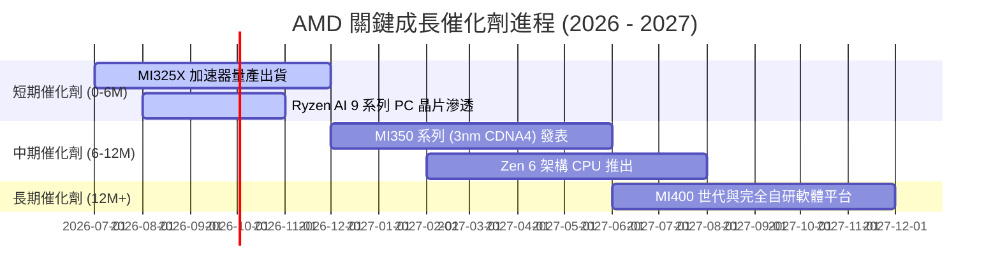

### 8.2 TAM（可定址市場規模）分析

AMD 所面臨的市場空間在 AI 時代被無限放大，以下為 2026-2028 年估算：

```
╔══════════════════════════════════════════════════════════════════╗
║                    AMD TAM 與滲透率預估                         ║
╠══════════════════════════════════════════════════════════════════╣
║                                                                  ║
║  1. AI 加速器市場 (2027 TAM: $150B)                              ║
║     ├── AMD 預期份額: 10% - 12%                                  ║
║     └── 預估貢獻收入: $15B - $18B                                ║
║                                                                  ║
║  2. 伺服器 CPU 市場 (2027 TAM: $45B)                              ║
║     ├── AMD 預期份額: 35%                                        ║
║     └── 預估貢獻收入: $15.7B                                     ║
║                                                                  ║
║  3. AI PC / Client 晶片 (2027 TAM: $35B)                         ║
║     ├── AMD 預期份額: 22%                                        ║
║     └── 預估貢獻收入: $7.7B                                      ║
║                                                                  ║
╚══════════════════════════════════════════════════════════════════╝
```

### 8.3 成長驅動力結構圖

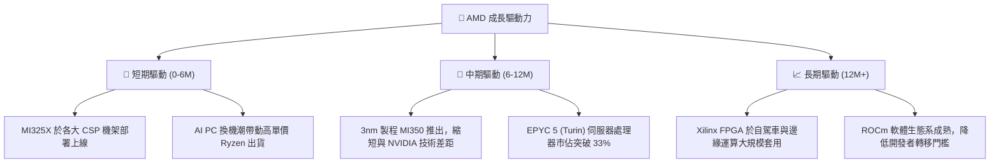

---

## 9. 風險矩陣

### 9.1 風險評分矩陣

```mermaid
quadrantChart
    title AMD Risk Assessment Matrix
    x-axis Low Probability --> High Probability
    y-axis Low Impact --> High Impact
    quadrant-1 High Priority (Mitigate Immediately)
    quadrant-2 Monitor Closely
    quadrant-3 Review Periodically
    quadrant-4 Watch
    TSMC CoWoS Bottleneck: [0.85, 0.80]
    NVIDIA Blackwell Price War: [0.70, 0.75]
    PC Recovery Stalls: [0.40, 0.45]
    US Export Control on China: [0.65, 0.60]
    SBC Share Dilution: [0.20, 0.30]
```

### 9.2 風險清單詳細分析

| # | 風險項目 | 發生機率 | 財務衝擊 | 風險評分 | 緩解措施與對抗策略 |
|---|----------|----------|----------|----------|--------------------|
| 1 | 🔴 **台積電 CoWoS 先進封裝產能受限** | 高 (85%) | 高 (-15% 營收潛力) | **8.5 / 10** | 與台積電簽訂長期產能預付款合約，並積極與日月光等 OSAT 廠合作後段封裝。 |
| 2 | 🔴 **NVIDIA Blackwell 價格戰** | 中高 (70%) | 高 (-5pp 毛利率) | **7.5 / 10** | 發揮「高性價比/總擁有成本（TCO）」優勢，MI300X 提供雙倍記憶體容量以吸引大模型微調客戶。 |
| 3 | 🟡 **美國對華半導體出口管制升級** | 中高 (65%) | 中 (-8% 營收) | **6.0 / 10** | 推出符合合規標準的客製化區域版本（如 MI309），並加速開發印度、中東等新興市場。 |
| 4 | 🟡 **PC 市場復甦進度不及預期** | 中 (40%) | 中低 (-5% 營收) | **4.0 / 10** | 專注於高單價、高毛利的 AI PC 企業端（Enterprise）市場，降低對消費級 PC 的依賴。 |

---

## 10. 投資建議

### 10.1 最終綜合評級雷達圖

```
╔══════════════════════════════════════════════════════════════╗
║                    AMD 最終投資評級雷達                      ║
╠══════════════════════════════════════════════════════════════╣
║ 財務健康度:   9.5/10  ▓▓▓▓▓▓▓▓▓▓▓▓▓▓▓▓▓▓▓░  🏆 無懈可擊     ║
║ 營收成長性:   9.0/10  ▓▓▓▓▓▓▓▓▓▓▓▓▓▓▓▓▓▓░░  🟢 AI 引擎爆發   ║
║ 實質資本效率: 8.5/10  ▓▓▓▓▓▓▓▓▓▓▓▓▓▓▓▓▓░░░  🟢 高 Tangible ROIC║
║ 護城河深度:   8.1/10  ▓▓▓▓▓▓▓▓▓▓▓▓▓▓▓▓░░░░  🟢 異質整合優勢  ║
║ 估值安全邊際: 6.5/10  ▓▓▓▓▓▓▓▓▓▓▓▓░░░░░░░░  🟡 已部分合理反映║
╠══════════════════════════════════════════════════════════════╣
║ 綜合推薦:     8.3/10  ▓▓▓▓▓▓▓▓▓▓▓▓▓▓▓▓░░░░  🟢 買入 (Buy)    ║
╚══════════════════════════════════════════════════════════════╝
```

### 10.2 目標價與隱含報酬率

| 情境 | 機率權重 | 目標價 | 隱含報酬率 (相較 $495.76) | 權重期望值貢獻 |
|------|----------|--------|---------------------------|----------------|
| **悲觀情境** | 20% | $330.00 | -33.4% | $66.00 |
| **基準情境** | 60% | $537.00 | +8.32% | $322.20 |
| **樂觀情境** | 20% | $675.00 | +36.2% | $135.00 |
| **✅ 加權目標價**| **100%** | **$523.20** | **+5.53%** | **12M 綜合期望目標** |

### 10.3 買入時機與觸發因素

```
╔══════════════════════════════════════════════════════════════════╗
║                  ✅ AMD 投資執行觸發清單                         ║
╠══════════════════════════════════════════════════════════════════╣
║                                                                  ║
║  立即買入觸發條件（多數符合）：                                  ║
║  ✅ 股價回檔至 $420 - $450 區間（對應 Forward PE ~32x）          ║
║  ✅ 財報確認 Data Center 單季營收突破 $5.5B                      ║
║  ✅ 官方宣布台積電 CoWoS 產能配額增加 20% 以上                   ║
║                                                                  ║
║  加碼觸發條件：                                                  ║
║  ☐ ROCm 軟體平台重大更新，主流開源大模型（如 Llama 4）原生支持   ║
║  ☐ 伺服器 CPU 市佔率正式突破 35% 關鍵分水嶺                      ║
║                                                                  ║
║  減碼/停損觸發條件：                                             ║
║  ☐ Data Center 營收連續兩季出現 QoQ 衰退                         ║
║  ☐ Tangible ROIC 跌破 20%                                        ║
║                                                                  ║
╚══════════════════════════════════════════════════════════════════╝
```

### 10.4 投資人適配度分析

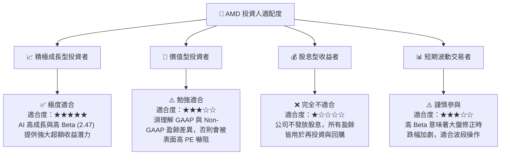

### 10.5 每季財報監控清單（Quarterly Watch List）

為了持續追蹤本投資框架的有效性，投資人應在每季財報中嚴格監控以下指標與門檻值：

| 監控指標 | 核心意義 | 觸發「加碼」門檻 | 觸發「減碼/警示」門檻 |
|----------|----------|------------------|-----------------------|
| **Data Center 營收** | 衡量 AI 晶片與 EPYC 的實質變現能力 | $> $5.5B 且 YoY $> 50\%$ | $< $4.5B 或出現 QoQ 衰退 |
| **Non-GAAP 毛利率** | 反映產品定價權與高毛利晶片佔比 | $> 54.5\%$ | $< 51.5\%$ （顯示價格戰加劇） |
| **自由現金流 (FCF)** | 檢視獲利的真實含金量 | 單季 $> $2.8B | 單季 $< $1.5B |
| **存貨週轉天數 (DOI)** | 評估下游需求與管道健康度 | $< 135$ 天 | $> 165$ 天 （庫存積壓警訊） |

### 10.6 反面論證：什麼會證明本報告的看多論點錯誤（What Would Change My Mind）

本報告的「買入」評級建立在 **「AMD 能順利分食 NVIDIA 的 AI 溢價，並維持高效資本回報」** 的假設上。若發生以下可量化事件，本投資論點將宣告失效，應無條件執行減碼或停損：

```
╔══════════════════════════════════════════════════════════════════╗
║              ⚠️ 論點失效條件 (Disconfirming Evidence)            ║
╠══════════════════════════════════════════════════════════════════╣
║  本投資論點在下列情況成立時應重新檢視或退出：                    ║
║                                                                  ║
║  ☐ Data Center 營收年成長率連續兩季低於 25%                      ║
║  ☐ 由於 NVIDIA 降價競爭，AMD 實質毛利率跌破 50% 關卡             ║
║  ☐ 自由現金流轉負，或 FCF 轉換率（FCF/Net Income）連續兩季 < 80% ║
║  ☐ 實質資本效率指標 Tangible ROIC 跌破 WACC (16.5%)               ║
║  ☐ 主要 CSP 客戶（如 Microsoft/Meta）宣布大規模縮減 AI Capex     ║
║                                                                  ║
╚══════════════════════════════════════════════════════════════════╝
```

---

> **免責聲明**：本報告為基於公開財務數據之學術研究與基本面分析，僅供參考，不構成任何買賣有價證券之投資建議。半導體板塊波動性高，投資人入市前應審慎評估個人風險承受能力。