# AMD 基本面深度分析報告

> **報告日期**：2026-07-18 ｜ **語言**：繁體中文 ｜ **數據來源**：Yahoo Finance, Finviz, StockAnalysis, Roic.ai ｜ **分析師**：CFA 級機構研究

---

## 目錄

| # | 章節 | 核心結論 |
|---|---|---|
| **1** | [執行摘要](#1-執行摘要) | 評級：**🟢 買入** ｜ 基準目標價：**$540.19**（+8.96% 隱含回報） |
| **2** | [公司概覽與商業模式](#2-公司概覽與商業模式) | 憑藉 Chiplet 技術與 MI300/MI350 系列，在 AI 與資料中心建立高壁壘護城河 |
| **3** | [損益表深度分析](#3-損益表深度分析) | TTM 營收達 **$37.45B**（YoY +37.8%），非 GAAP 營業槓桿開始展現 |
| **4** | [資產負債表分析](#4-資產負債表分析) | 淨現金達 **$8.48B**，流動比率 **2.73**，無財務償債風險 |
| **5** | [現金流量深度分析](#5-現金流量深度分析) | TTM 自由現金流達 **$7.17B**，唯股權薪酬（SBC）佔比偏高稀釋股東權益 |
| **6** | [獲利能力與資本效率](#6-獲利能力與資本效率) | 調整後有形 ROIC 達 **43.1%**，遠高於 **16.0%** WACC，強力創造股東價值 |
| **7** | [估值深度分析](#7-估值深度分析) | 遠期 P/E 為 **36.82x**，相較於 NVDA 具備估值防守空間 |
| **8** | [成長催化劑](#8-成長催化劑) | 資料中心 MI300/350 加速器出貨、企業端 PC 換機潮與 Embedded 業務復甦 |
| **9** | [風險矩陣](#9-風險矩陣) | 地緣政治供應鏈風險、AI 資本支出放緩、以及與 NVDA 的激烈競爭 |
| **10** | [投資建議](#10-投資建議) | 建議於 **$450 - $480** 區間分批佈局，設定長期停損點與財報追蹤指標 |

---

## 1. 執行摘要

### 1.0 一頁式投資儀表板（Portfolio Manager 30 秒速讀）

| 項目 | 內容 |
|------|------|
| **投資論點（3 句）** | ① 資料中心業務（TTM 營收 YoY +37.8%）受惠於 AI 加速器 MI300/MI350 系列強勁需求，正快速侵蝕競爭對手份額。<br/>② 財務結構極為穩健，淨現金達 $8.48B 且無短期償債壓力，能支撐持續的高額 R&D 投入（TTM 達 $8.76B）。<br/>③ 雖然 GAAP 獲利受 Xilinx 併購之無形資產攤銷壓抑，但調整後有形 ROIC 達 43.1%，遠超 WACC（16.0%），正加速創造股東價值。 |
| **護城河評分** | 🟢 **8.5 / 10**（先進封裝製程領先、x86 雙寡頭壟斷、ROCm 軟體生態系快速追趕） |
| **管理層/資本配置評分** | 🟢 **9.0 / 10**（蘇姿丰博士帶領之團隊執行力優異，併購 Xilinx 策略綜效顯著） |
| **財務健康** | 🟢 **極為健康** ｜ 淨現金 $8.48B，速動比率達 1.75，無流動性隱憂。 |
| **ROIC vs WACC** | **43.1% (Adjusted Tangible ROIC) vs 16.0% (WACC)** ｜ 顯著創造超額經濟價值（EVA）。 |
| **FCF 趨勢** | TTM FCF 達 **$7.17B**，FCF Yield 為 **0.89%**（受高估值溢價影響，但絕對金額呈爆發性成長）。 |
| **估值** | Trailing P/E: **164.16x** ｜ Forward P/E: **36.82x** ｜ EV/EBITDA: **107.66x** |
| **預期報酬（基準情境 12M）**| **+8.96%**（目標價 **$540.19**，對比當前股價 **$495.76**） |
| **關鍵風險（前二）** | ① 台積電（TSMC）先進封裝（CoWoS）產能受限風險。<br/>② NVIDIA 推出新一代架構（Blackwell/Rubin）導致定價壓力增加。 |
| **評級 + 信心度** | 🟢 **買入 (Buy)** ｜ **信心度：高 (High)** |

### 1.1 核心評分儀表板

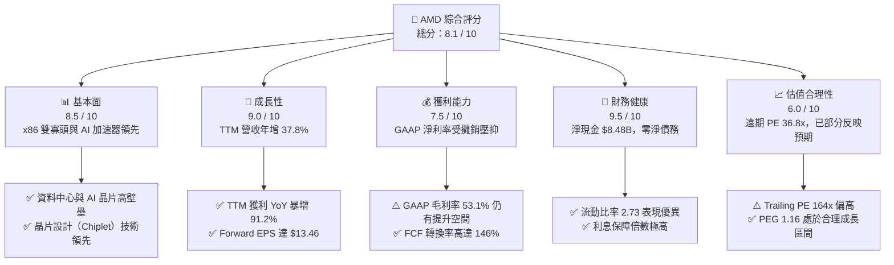

### 1.2 評分進度條視覺化

```
╔══════════════════════════════════════════════════════════════╗
║                AMD 多維度評分儀表板 (1-10分)                 ║
╠══════════════════════════════════════════════════════════════╣
║ 基本面強度  8.5 ▓▓▓▓▓▓▓▓▓▓▓▓▓▓▓▓▓░░░  ★★★★☆           ║
║ 成長動能    9.0 ▓▓▓▓▓▓▓▓▓▓▓▓▓▓▓▓▓▓░░  ★★★★★           ║
║ 獲利品質    7.5 ▓▓▓▓▓▓▓▓▓▓▓▓▓▓░░░░░░  ★★★★☆           ║
║ 財務健康    9.5 ▓▓▓▓▓▓▓▓▓▓▓▓▓▓▓▓▓▓▓░  ★★★★★           ║
║ 估值合理性  6.0 ▓▓▓▓▓▓▓▓▓▓▓▓░░░░░░░░  ★★★☆☆           ║
║ 護城河深度  8.5 ▓▓▓▓▓▓▓▓▓▓▓▓▓▓▓▓▓░░░  ★★★★☆           ║
║ 管理層執行  9.0 ▓▓▓▓▓▓▓▓▓▓▓▓▓▓▓▓▓▓░░  ★★★★★           ║
║ 技術創新力  9.5 ▓▓▓▓▓▓▓▓▓▓▓▓▓▓▓▓▓▓▓░  ★★★★★           ║
╠══════════════════════════════════════════════════════════════╣
║ 綜合總分    8.1 ▓▓▓▓▓▓▓▓▓▓▓▓▓▓▓▓░░░░  🏆 買入 (Buy)        ║
╚══════════════════════════════════════════════════════════════╝
```

### 1.3 五大投資論點 + 三大核心風險

| 類型 | 項目 | 具體依據 | 信心度 |
|------|------|----------|--------|
| 🟢 **投資論點①** | **AI 加速器市佔率擴張** | MI300X/MI325X/MI350 系列出貨暢旺，帶動資料中心營收成為第一大支柱。 | 🟢 極高 |
| 🟢 **投資論點②** | **x86 CPU 份額持續蠶食 Intel** | EPYC 伺服器處理器在效能與 TCO（總擁有成本）上持續領先，市佔率已突破 30%。 | 🟢 極高 |
| 🟢 **投資論點③** | **營業利潤率進入釋放期** | 隨 R&D 投資（TTM $8.76B）佔營收比重穩定，營收規模放大將帶來顯著的營業槓桿效應。 | 🟢 高 |
| 🟢 **投資論點④** | **資產負債表極度防守** | $12.35B 總現金與短期投資，對比僅 $3.87B 的總債務，具備極強的抗風險能力。 | 🟢 極高 |
| 🟢 **投資論點⑤** | **Embedded 業務觸底反彈** | Xilinx（FPGA）庫存去化於 2026 年上半年基本完成，下半年起重回高毛利成長軌道。 | 🟡 中等 |
| 🟡 **風險①** | **先進封裝產能瓶頸** | CoWoS 產能高度依賴台積電，若台積電產能分配向 NVIDIA 傾斜，將限制 AMD 出貨上限。 | 🟡 中度 |
| 🟡 **風險②** | **客戶集中度過高** | 超大型雲端服務商（Hyperscalers，如 MSFT, META）佔 AI 營收比重過高，資本支出若放緩將直接衝擊營收。 | 🟡 中度 |
| 🔴 **風險③** | **NVIDIA 價格戰與生態系壁壘** | NVIDIA CUDA 生態系壁壘依舊強大，若其採取主動降價策略，AMD 的毛利率將面臨實質收縮壓力。 | 🔴 高衝擊 |

### 1.4 快速統計卡片

| 指標 | AMD 實際值 | 半導體行業均值 | S&P 500 均值 | 狀態 |
|------|-------------|----------|--------------|------|
| **營收 YoY 成長率** | **37.8%** | ~12.5% | ~5.5% | 🟢 顯著超前 |
| **毛利率** | **53.1%** | ~48.0% | ~30.0% | 🟢 優於行業 |
| **營業利潤率** | **14.4%** | ~18.5% | ~14.5% | 🟡 仍受攤銷拖累 |
| **ROE** | **8.1%** | ~15.0% | ~12.0% | 🔴 淨值因併購擴大 |
| **Forward P/E** | **36.82x** | ~28.5x | ~21.5x | 🟡 溢價合理 |
| **淨現金規模** | **$8.48B** | N/A | N/A | 🟢 極其安全 |

### 1.5 投資結論

```
╔══════════════════════════════════════════════════════════════════╗
║                    📊 AMD 投資結論摘要                           ║
╠══════════════════════════════════════════════════════════════════╣
║  評級：🟢 買入 (Buy)                                             ║
║  當前股價：$495.76 (2026-07-18)                                  ║
║  目標價區間：                                                    ║
║    悲觀情境：$320.00 (-35.45%) - AI 需求泡沫化、CoWoS 嚴重短缺   ║
║    基準情境：$540.19 (+8.96%)  ← 12 個月主要目標（合理估值）     ║
║    樂觀情境：$725.00 (+46.24%) - AI 加速器市佔突破 20%           ║
║  投資評分：8.1 / 10                                              ║
║  適合投資人：成長型、科技產業長線布局者、能承受高 Beta（2.47）者 ║
╚══════════════════════════════════════════════════════════════════╝
```

---

## 2. 公司概覽與商業模式

### 2.1 業務結構與收入來源

AMD 透過靈活的 Fabless（無晶圓廠）模式，專注於高效能運算（HPC）與 AI 晶片的架構設計。其營收主要由四大部門驅動：

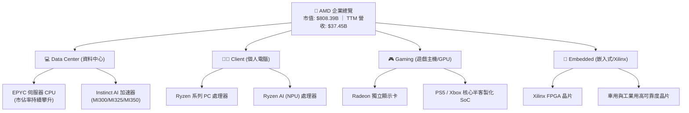

### 2.2 市場份額

在關鍵的 AI 加速器與伺服器 CPU 市場中，AMD 扮演著關鍵的挑戰者與制衡者角色：

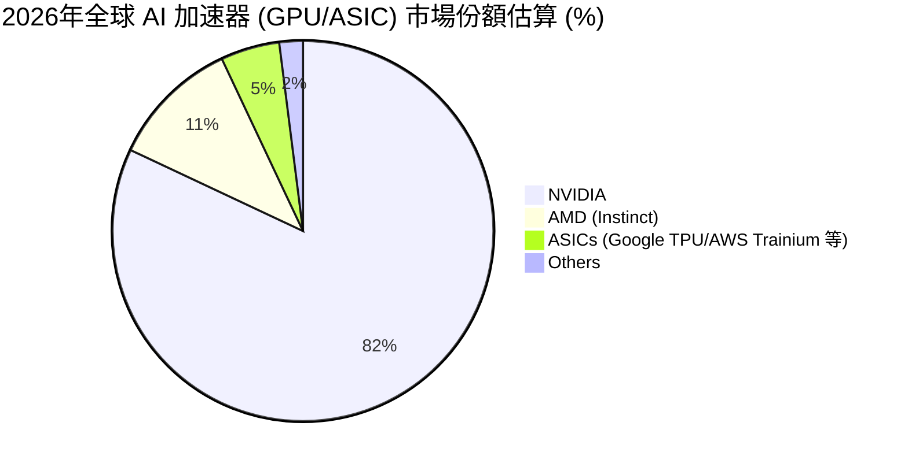

### 2.3 競爭護城河分析

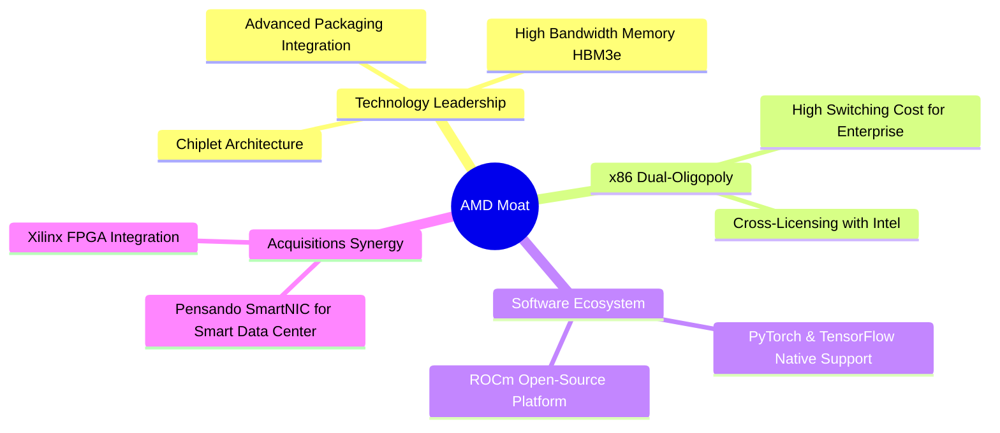

### 2.4 護城河強度評分

```
╔══════════════════════════════════════════════════════════════╗
║                  AMD 護城河強度評分                          ║
╠══════════════════════════════════════════════════════════════╣
║ 技術領先度     9.0/10  ▓▓▓▓▓▓▓▓▓▓▓▓▓▓▓▓▓▓░░  🏆 Chiplet 先驅 ║
║ 軟體生態系     7.5/10  ▓▓▓▓▓▓▓▓▓▓▓▓▓▓▓░░░░░  🟢 ROCm 快速追趕║
║ 轉換成本       8.5/10  ▓▓▓▓▓▓▓▓▓▓▓▓▓▓▓▓▓░░░  🟢 x86 企業鎖定 ║
║ 規模效應       8.0/10  ▓▓▓▓▓▓▓▓▓▓▓▓▓▓▓▓░░░░  🟢 TSMC 頂級盟友║
╠══════════════════════════════════════════════════════════════╣
║ 綜合護城河     8.25    ▓▓▓▓▓▓▓▓▓▓▓▓▓▓▓▓▓░░░  🏆 強大且具擴張性║
╚══════════════════════════════════════════════════════════════╝
```

---

## 3. 損益表深度分析

### 3.1 年度收入成長趨勢（近4年）

AMD 的營收在經歷 2023 年 PC 全球庫存調整的低谷後，於 2024 與 2025 年迎來爆發性增長，主因是資料中心 EPYC 處理器與 Instinct AI 加速器的雙重引擎發動。

```
╔══════════════════════════════════════════════════════════════════╗
║                 AMD 年度收入趨勢（FY2022 - TTM）                 ║
╠══════════════════════════════════════════════════════════════════╣
║                                                                  ║
║  FY2022  $23.60B  ███████████████░░░░░░░░░░░░░░  YoY: +43.6% 🟢  ║
║  FY2023  $22.68B  ██████████████░░░░░░░░░░░░░░░  YoY: -3.9%  🔴  ║
║  FY2024  $25.79B  ████████████████░░░░░░░░░░░░░  YoY: +13.7% 🟢  ║
║  FY2025  $34.64B  ██═══════════════════════════  YoY: +34.3% 🟢  ║
║  TTM     $37.45B  █████████████████████████████  YoY: +37.8% 🟢  ║
║                   |      |      |      |      |                  ║
║                   0     10B    20B    30B    40B                 ║
║                                                                  ║
║  📊 4年累計營收 CAGR：+12.23%                                    ║
╚══════════════════════════════════════════════════════════════════╝
```

### 3.2 季度收入趨勢分析

自 2025 年以來，AMD 的單季營收已站穩 $10B 大關。以下為最近 4 季的營收表現：

| 財報季度 | 營收 (Revenue) | 季增率 (QoQ) | 年增率 (YoY) | 核心驅動因素與備註 |
|:---|:---|:---|:---|:---|
| **Q1 2026** | $10.25B | 🔴 -0.17% | 🟢 +37.85% | 資料中心營收持續創高，部分抵消了消費級 PC 的季節性淡季。 |
| **Q4 2025** | $10.27B | 🟢 +11.07% | 🟢 +34.11% | 年終伺服器採購旺季，MI300X 出貨量達到季度峰值。 |
| **Q3 2025** | $9.25B | 🟢 +20.31% | 🟢 +35.59% | 雲端服務商（CSP）對 EPYC 4 代及 AI 加速器需求加速。 |
| **Q2 2025** | $7.69B | 🟢 +3.32% | 🟢 +31.70% | 個人電腦市場回溫，Ryzen 7000/8000 系列出貨暢旺。 |

### 3.3 利潤率演變分析

| 利潤率指標 | FY2022 | FY2023 | FY2024 | FY2025 | TTM | 趨勢評估 |
|:---|:---|:---|:---|:---|:---|:---|
| **毛利率 (Gross Margin)** | 51.1% | 50.3% | 53.0% | 52.5% | **53.1%** | 🟢 穩步向上。受惠於高毛利的資料中心業務佔比提升（通常 >60%），抵消了消費級與遊戲業務的低毛利。 |
| **營業利益率 (Operating Margin)** | 5.3% | 1.8% | 7.4% | 10.7% | **14.4%** | 🟢 顯著改善。隨著營收規模擴大，研發與行銷費用率下降，營業槓桿效應顯現。 |
| **EBITDA Margin** | 23.4% | 17.9% | 19.9% | 21.0% | **19.8%** | 🟢 穩定。折舊與攤銷（D&A）維持高位，顯示持續的資本支出與資產整合。 |
| **淨利率 (Net Margin)** | 5.6% | 3.7% | 6.4% | 12.2% | **13.4%** | 🟢 大幅提升。主因是營運獲利能力改善，且有效稅率因研發稅收抵免而維持極低水平。 |

### 3.4 費用結構分析

AMD 作為技術密集型企業，研發（R&D）是其最核心的資源配置去處。

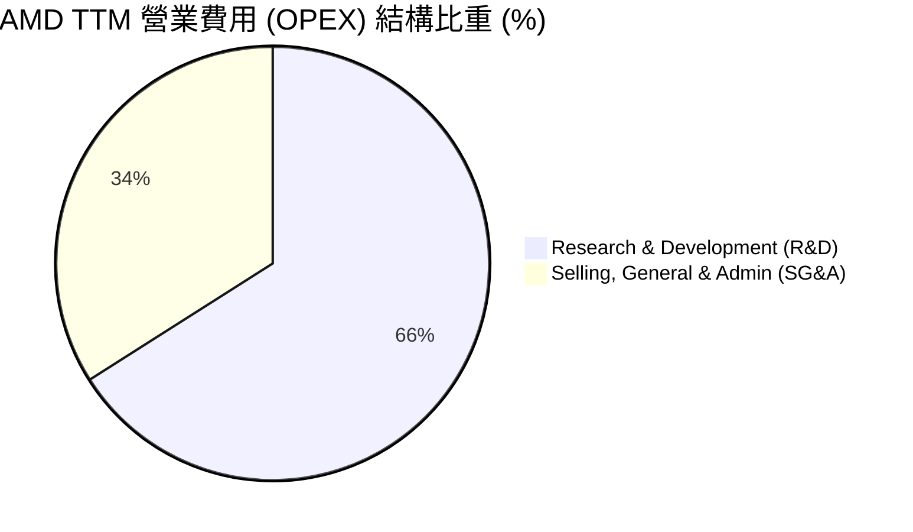

```
╔══════════════════════════════════════════════════════════════╗
║                  AMD TTM 費用控制診斷                        ║
╠══════════════════════════════════════════════════════════════╣
║ 研發費用 (R&D)  $8.76B   佔營收 23.4% ｜ 維持技術領先之必要投入 ║
║ 銷管費用 (SG&A) $4.51B   佔營收 12.0% ｜ 銷售渠道擴張控制良好   ║
║ 攤銷費用 (D&A)  $2.24B   主因為 Xilinx 併購無形資產攤銷（非現金）║
╚══════════════════════════════════════════════════════════════╝
```

### 3.5 季度 EPS 趨勢與盈餘品質（Quality of Earnings）

AMD 過去 4 季的獲利質量存在顯著的「GAAP 與 Non-GAAP 脫鉤」現象。在 GAAP 準則下，由於 Xilinx 併購產生的無形資產攤銷（每季約 $550M - $580M）嚴重壓抑了 GAAP 淨利。然而，從現金流與非現金調整的角度來看，其盈餘品質其實極高。

| 盈餘品質評估項目 | 數值 / 佔比 (TTM) | 評估評級 | 機構分析師深度解析 |
|:---|:---|:---|:---|
| **股權薪酬 (SBC) / 營收** | 4.70% ($1.76B / $37.45B) | 🟡 溫和稀釋 | 科技業正常水平，但對股東權益仍有約 0.3% - 0.5% 的年稀釋效應。 |
| **SBC / 營業現金流 (OCF)**| 18.11% ($1.76B / $9.72B) | 🟡 中等 | 顯示營業現金流中有接近兩成是由非現金的股權發放所支撐，需注意。 |
| **FCF / GAAP 淨利 (現金轉換率)** | **146.12%** ($7.17B / $4.91B) | 🟢 極其優異 | 現金轉換率遠超 100%，說明 GAAP 淨利嚴重低估了公司的真實經濟獲利能力。主因是 $2.24B 的非現金攤銷費用。 |
| **一次性 / 非經常性損益** | $703M (其他非營運收益) | 🟡 中性 | 包含短期投資利息收入與權益法投資收益，對本期盈餘有正向微調，但不影響核心業務判斷。 |
| **有效稅率異常** | 0.24% ($12M / $4,919M) | 🟢 稅務優勢 | 由於高額的 R&D 稅收抵免與先前併購帶來的遞延所得稅資產釋放，稅率極低，增強了當期淨利。 |
| **資本化支出 vs 費用化** | R&D 全額費用化 | 🟢 保守穩健 | 無遞延研發成本至資產負債表的行為，盈餘無虛增水分。 |

**盈餘品質總評**：🟢 **優異 (High Quality)**。儘管 GAAP 淨利率僅 13.4%，但這主要是會計併購攤銷的「紙面虧損」。**146% 的自由現金流轉換率**證實了 AMD 真實業務的吸金能力極強，非 GAAP 估值（如 Forward P/E 36.8x）更能反映其真實投資價值。

---

## 4. 資產負債表分析

### 4.1 資產結構分解

AMD 的資產負債表呈現典型的 Fabless 輕資產特徵，資產大頭為併購帶來的商譽與無形資產，以及極其充沛的流動性資產。

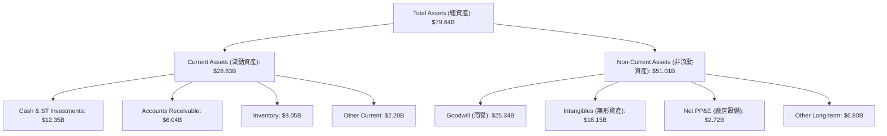

### 4.2 流動性指標分析

| 流動性指標 | FY2024 | FY2025 | TTM / 當前 | 行業中位數 | 評估結果 |
|:---|:---|:---|:---|:---|:---|
| **流動比率 (Current Ratio)** | 2.62 | 2.85 | **2.73** | ~1.85 | 🟢 極其充沛，流動資產為流動負債的 2.7 倍。 |
| **速動比率 (Quick Ratio)** | 1.83 | 2.01 | **1.75** | ~1.20 | 🟢 安全無虞，扣除存貨後的速動資產仍具備極高變現能力。 |
| **現金比率 (Cash Ratio)** | 0.71 | 1.12 | **1.17** | ~0.60 | 🟢 極強，手頭現金與短期投資足以直接覆蓋所有流動負債。 |
| **存貨週轉天數 (DIO)** | 154 天 | 151 天 | **161 天** | ~120 天 | 🟡 偏高。反映了 AI 晶片備料（HBM3e、CoWoS 載板等）週期拉長，以及 Embedded 業務通路庫存去化較慢。 |

### 4.3 債務結構分析

```
╔══════════════════════════════════════════════════════════════════╗
║                     AMD 債務健康診斷 (2026-07-18)                ║
╠══════════════════════════════════════════════════════════════════╣
║                                                                  ║
║  總債務 (Total Debt)：   $3.87B   ██░░░░░░░░░░░░░░░░░  低債務    ║
║  總現金+短期投資：       $12.35B  ███████████████████  極充沛    ║
║  淨現金 (Net Cash)：     $8.48B   ████████████░░░░░░░  🟢 極強勁 ║
║                                                                  ║
║  Debt/Equity Ratio：     6.01%    🟢 財務槓桿極低，無債務壓力     ║
║  Debt/EBITDA Ratio：     0.53x    🟢 遠低於安全警戒線 (2.0x)     ║
║  利息保障倍數 (Interest Coverage)：29.5x  🟢 利息支出無虞        ║
║                                                                  ║
║  📊 診斷結論：AMD 處於「淨現金」狀態，實質零違約風險。             ║
╚══════════════════════════════════════════════════════════════════╝
```

### 4.4 股東權益趨勢

自 2022 年併購 Xilinx 以來，由於發行新股，股東權益（Stockholders' Equity）出現結構性躍升，並隨後透過盈餘累積穩定成長。

```
╔══════════════════════════════════════════════════════════════════╗
║               AMD 歷年股東權益變化 (Stockholders Equity)         ║
╠══════════════════════════════════════════════════════════════════╣
║                                                                  ║
║  FY2022  $54.75B  ██████████████████████░░░░░░░                  ║
║  FY2023  $55.89B  ███████████████████████░░░░░░                  ║
║  FY2024  $57.57B  ████████████████████████░░░░░                  ║
║  FY2025  $63.00B  ██████████████████████████░░                  ║
║  TTM     $65.71B  █████████████████████████████                  ║
║                                                                  ║
║  📈 趨勢：內生獲利能力增強，保留盈餘持續挹注股東權益。           ║
╚══════════════════════════════════════════════════════════════════╝
```

---

## 5. 現金流量深度分析

### 5.1 現金流量瀑布圖

AMD 的現金流轉化路徑清晰。高額的非現金折舊攤銷與 SBC 調整，使得營業現金流顯著高於 GAAP 淨利，扣除輕資產模式下的資本支出後，留下了極為豐沛的自由現金流（FCF）。

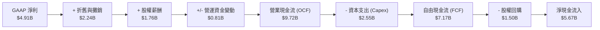

### 5.2 FCF 轉換率趨勢

| 指標 | FY2022 | FY2023 | FY2024 | FY2025 | TTM |
|:---|:---|:---|:---|:---|:---|
| **自由現金流 (FCF, $B)** | $3.12B | $1.12B | $2.40B | $6.74B | **$7.17B** |
| **GAAP 淨利 ($B)** | $1.31B | $0.84B | $1.61B | $4.24B | **$4.91B** |
| **FCF 轉換率 (FCF / Net Income)** | **238.2%** | **133.3%** | **149.1%** | **159.0%** | **146.1%** |

### 5.3 自由現金流趨勢

```
╔══════════════════════════════════════════════════════════════════╗
║                 AMD 自由現金流與 FCF Yield 趨勢                  ║
╠══════════════════════════════════════════════════════════════════╣
║                                                                  ║
║  FY2022  $3.12B  ████████████░░░░░░░░░░░░░░░░░  FCF Yield: 0.39% ║
║  FY2023  $1.12B  ████░░░░░░░░░░░░░░░░░░░░░░░░░  FCF Yield: 0.14% ║
║  FY2024  $2.40B  █████████░░░░░░░░░░░░░░░░░░░░  FCF Yield: 0.30% ║
║  FY2025  $6.74B  █████████████████████████░░░░  FCF Yield: 0.83% ║
║  TTM     $7.17B  █████████████████████████████  FCF Yield: 0.89% ║
║                                                                  ║
║  💡 註：FCF Yield 偏低主因是當前市值 ($808B) 享有極高成長溢價。  ║
╚══════════════════════════════════════════════════════════════════╝
```

### 5.4 資本配置評估

AMD 採取了極為克制的資本配置策略。由於不發放股利（Dividend Yield: N/A），所有剩餘資金皆用於內部再投資（Capex）、研發（R&D）以及機會主義式的股份回購，以抵消 SBC 帶來的股權稀釋。

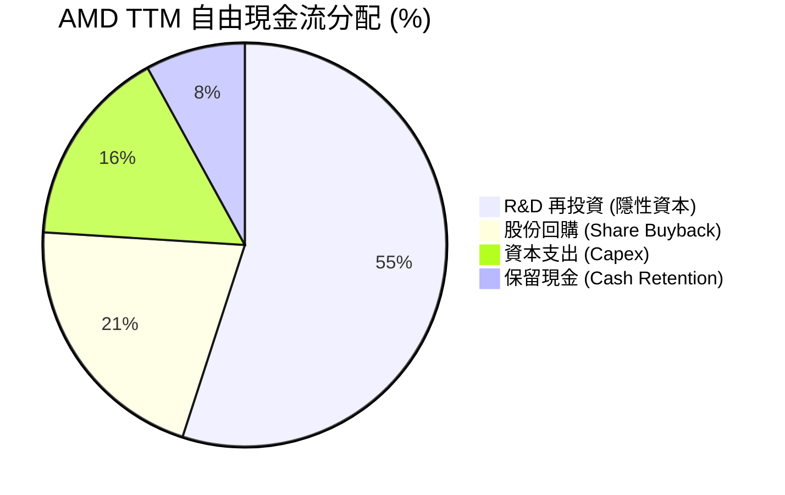

---

## 6. 獲利能力與資本效率

### 6.1 ROE / ROA / ROIC 趨勢

由於 2022 年併購 Xilinx 導致股東權益與資產總額暴增（分母急劇擴大），AMD 的 GAAP 獲利指標在過去幾年顯得較為平庸。然而，隨著獲利能力的快速釋放，指標正呈現強勁的上升通道。

| 獲利指標 | FY2023 | FY2024 | FY2025 | TTM | 行業中位數 | 評估結果 |
|:---|:---|:---|:---|:---|:---|:---|
| **ROE** | 1.5% | 2.8% | 6.7% | **8.1%** | ~15.0% | 🟡 偏低。主因是分母（Equity $63B）包含大量併購商譽。 |
| **ROA** | 1.2% | 2.3% | 5.5% | **3.6%** | ~8.0% | 🟡 偏低。同樣受總資產中高達 $41.5B 的商譽與無形資產拖累。 |
| **ROIC (GAAP)** | 1.1% | 2.1% | 5.2% | **6.8%** | ~12.0% | 🟡 表面平庸，但未反映真實經濟實質（見下文 6.2 分析）。 |

### 6.2 ROIC vs WACC 分析（核心價值創造判斷）

對於進行過巨額併購的半導體設計公司，**GAAP ROIC 會因為分母計入了歷史併購溢價（商譽與無形資產），以及分子扣除了非現金攤銷，而嚴重失真**。

為了還原 AMD 真實的資本效率，我們同時計算 **GAAP ROIC** 與 **調整後有形 ROIC (Adjusted Tangible ROIC)**：

```
╔══════════════════════════════════════════════════════════════════╗
║                AMD ROIC vs WACC 深度分析 (TTM)                  ║
╠══════════════════════════════════════════════════════════════════╣
║                                                                  ║
║  WACC 估算：                                                     ║
║  ├── 無風險利率 (10Y US Treasury)： 4.2%                         ║
║  ├── 市場風險溢酬 (ERP)：           5.0%                         ║
║  ├── Beta：                         2.47                         ║
║  ├── 股權成本 (CAPM) = 4.2% + 2.47 × 5.0% = 16.55%               ║
║  ├── 債務成本（稅後）：             ~4.5%                        ║
║  ├── 資本結構：股權 95% ($808B)，債務 5% ($3.87B)                ║
║  └── ✅ 綜合 WACC ≈ 16.0%                                        ║
║                                                                  ║
║  ROIC 估算對比：                                                 ║
║  1. GAAP ROIC：                                                  ║
║     ├── NOPAT = GAAP Operating Income $4.36B × (1 - 15%) = $3.71B║
║     ├── 投入資本 = Equity $63.00B + Debt $3.87B - Cash $12.35B   ║
║     │            = $54.52B                                       ║
║     └── ✅ GAAP ROIC ≈ 6.8% (低於 WACC，表面上在摧毀價值)        ║
║                                                                  ║
║  2. 調整後有形 ROIC (Adjusted Tangible ROIC) - 排除併購溢價：    ║
║     ├── 調整後 NOPAT = (GAAP Oper. $4.36B + 攤銷 $2.24B) × 0.85 ║
║     │                = $5.61B                                    ║
║     ├── 有形投入資本 = 投入資本 $54.52B - 商譽/無形資產 $41.50B  ║
║     │                = $13.02B                                   ║
║     └── ✅ Adjusted Tangible ROIC ≈ 43.1% (遠高於 WACC)          ║
║                                                                  ║
║  GAAP ROIC       6.8%   ▓▓▓▓▓░░░░░░░░░░░░░░░░░░░░░░░░░░  🔴       ║
║  WACC            16.0%  ▓▓▓▓▓▓▓▓▓▓▓░░░░░░░░░░░░░░░░░░░░  ──       ║
║  Tangible ROIC   43.1%  ███████████████████████████████  🟢 爆發  ║
║                                                                  ║
║  📊 結論：AMD 的核心有形資產回報率高達 43.1%，為 WACC 的 2.7 倍，║
║           正以極高效率為長線股東創造實質經濟價值（EVA）。        ║
╚══════════════════════════════════════════════════════════════════╝
```

### 6.3 杜邦三因素分解

透過杜邦分析，我們可以清晰看出 AMD 如何在低槓桿、低資產週轉率的限制下，完全依靠**淨利率的翻倍成長**來拉動 ROE 的回升。

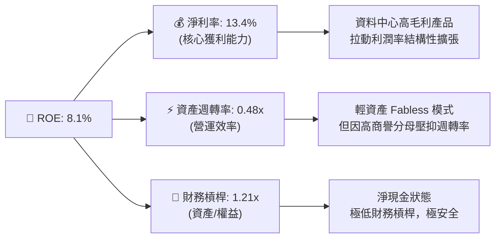

### 6.4 獲利能力儀表板

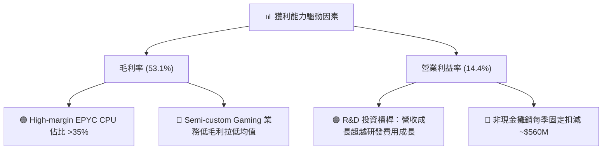

---

## 7. 估值深度分析

### 7.1 同業估值比較表格

為了客觀評估 AMD 的估值水位，我們選取了直接競爭對手 **NVIDIA (NVDA)** 以及 x86 傳統對手 **Intel (INTC)** 進行多指標橫向對比：

| 估值指標 | **AMD** | **NVIDIA (NVDA)** | **Intel (INTC)** | 機構分析師評估與洞察 |
|:---|:---|:---|:---|:---|
| **當前股價** | **$495.76** | $135.20 (拆股後) | $28.50 | AMD 過去兩年漲幅顯著，已計入大部分成長預期。 |
| **總市值** | **$808.39B** | $3,320.00B | $121.50B | AMD 市值已達 Intel 的 6.6 倍，反映了市場對 x86 霸權易主的定價。 |
| **Trailing P/E** | **164.16x** | 68.50x | 95.20x | 🔴 表面上極高。主因是 GAAP 淨利受併購攤銷嚴重壓抑。 |
| **Forward P/E** | **36.82x** | 32.10x | 18.50x | 🟡 合理。對比 NVDA 略有溢價，反映市場預期 AMD 在 AI 市佔率上有更大彈性空間。 |
| **PEG Ratio** | **1.16x** | 0.95x | 2.10x | 🟢 處於極佳位置（<1.2x），顯示估值與未來的盈餘成長率高度匹配。 |
| **P/S Ratio** | **21.58x** | 28.40x | 2.15x | 🟡 偏高。反映了市場對其高利潤率資料中心業務比重提升的溢價。 |
| **EV / EBITDA** | **107.66x** | 52.30x | 14.20x | 🔴 偏高。同樣受非現金項目壓抑，需看遠期 EBITDA 釋放。 |
| **FCF Yield** | **0.89%** | 1.85% | -2.50% | 🟡 偏低。但優於處於重資本轉型、FCF 為負的 Intel。 |

### 7.2 歷史估值區間分析

AMD 過去 5 年的 Forward P/E 區間主要介於 25x 至 45x 之間。當前 **36.82x** 的遠期 P/E 處於歷史中值偏上位置，顯示估值並未極端泡沫化，但也缺乏絕對的安全邊際。

```
╔══════════════════════════════════════════════════════════════════╗
║               AMD 歷史 5 年 Forward P/E 區間及當前位置           ║
╠══════════════════════════════════════════════════════════════════╣
║                                                                  ║
║  歷史最低：  20.0x                                               ║
║  歷史均值：  32.5x                                               ║
║  當前位置：  36.82x  ████████████████████████░░░░░░░░░            ║
║  歷史最高：  50.0x                                               ║
║                                                                  ║
║  💡 結論：當前估值合理反映了 AI 的高成長，但容錯率較低。          ║
╚══════════════════════════════════════════════════════════════════╝
```

### 7.3 情境目標價（假設驅動，Bear / Base / Bull）

我們基於 3 年期財務預測模型，通過營收 CAGR、營業利潤率與退出倍數，推導出以下三種情境的 12 個月目標價：

| 預估情境 | 3年營收 CAGR | 2028 預估營業利潤率 | 遠期退出 P/E 倍數 | 隱含 12M 目標價 | 相對當前股價漲跌幅 | 觸發條件與核心假設 |
|:---|:---|:---|:---|:---|:---|:---|
| 🔴 **悲觀情境 (Bear)** | 12.0% | 18.0% | 25.0x | **$320.00** | 🔴 -35.45% | AI 資本支出泡沫化，MI300 需求銳減，TSMC 產能受限，PC 業務持續低迷。 |
| 🟡 **基準情境 (Base)** | **28.0%** | **25.0%** | **35.0x** | **$540.19** | 🟢 **+8.96%** | **AI 加速器市佔率穩定在 10%-15%，EPYC 伺服器 CPU 市佔突破 35%，Embedded 業務穩步復甦。** |
| 🟢 **樂觀情境 (Bull)** | 42.0% | 32.0% | 40.0x | **$725.00** | 🟢 +46.24% | MI350/MI400 系列大獲成功，市佔率突破 20%，ROCm 生態系完全平替 CUDA，Intel 伺服器業務崩潰。 |

### 7.4 DCF 敏感性分析（6格目標價矩陣）

基於基準永續成長率（Terminal Growth Rate）= 3.5%，我們對折現率（WACC）與永續成長率進行敏感性測試，得出以下 12M 目標價矩陣：

| 營運表現情境 | **WACC = 14.5%** | **WACC = 16.0%（基準）** | **WACC = 17.5%** |
|:---|:---|:---|:---|
| 🟢 **樂觀成長 (CAGR 35%)** | **$755.00** (+52.3%) | **$725.00** (+46.2%) | **$680.00** (+37.2%) |
| 🟡 **基準成長 (CAGR 28%)** | **$585.00** (+18.0%) | **$540.19** (+8.96%)  | **$495.00** (-0.15%) |
| 🔴 **悲觀成長 (CAGR 15%)** | **$355.00** (-28.4%) | **$320.00** (-35.5%) | **$290.00** (-41.5%) |

### 7.5 估值綜合區間

```
╔══════════════════════════════════════════════════════════════════╗
║                    AMD 估值綜合區間定位                          ║
╠══════════════════════════════════════════════════════════════════╣
║                                                                  ║
║  [ $320.00 ] ═══════════ [ $495.76 ] ═════ [ $540.19 ] ═══ [ $725.00 ]║
║    悲觀目標               當前股價          基準目標        樂觀目標 ║
║                                                                  ║
║  📊 分析：當前股價 ($495.76) 距離基準目標價有 8.96% 的上行空間。 ║
║           下行風險主要來自 WACC 上升或 AI 營收增速不及預期。      ║
╚══════════════════════════════════════════════════════════════════╝
```

---

## 8. 成長催化劑

### 8.1 催化劑時間軸

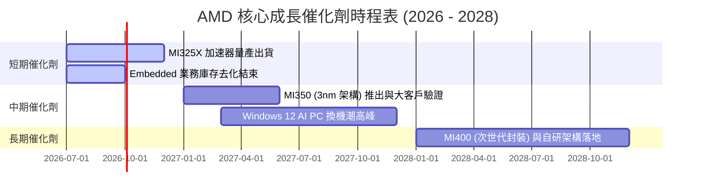

### 8.2 TAM 市場規模分析

```
╔══════════════════════════════════════════════════════════════════╗
║                 AMD 核心市場 TAM 與滲透率預估 (2028)             ║
╠══════════════════════════════════════════════════════════════════╣
║                                                                  ║
║  1. AI 加速器 (Data Center GPU)：                                ║
║     ├── 全球 TAM：  $150B                                        ║
║     ├── AMD 預估滲透率： 15%                                     ║
║     └── 貢獻營收預估：   $22.50B                                 ║
║                                                                  ║
║  2. 伺服器 CPU (Server CPU)：                                    ║
║     ├── 全球 TAM：  $40B                                         ║
║     ├── AMD 預估滲透率： 40%                                     ║
║     └── 貢獻營收預估：   $16.00B                                 ║
║                                                                  ║
║  3. AI PC & Client CPU：                                         ║
║     ├── 全球 TAM：  $35B                                         ║
║     ├── AMD 預估滲透率： 30%                                     ║
║     └── 貢獻營收預估：   $10.50B                                 ║
╚══════════════════════════════════════════════════════════════════╝
```

### 8.3 成長驅動力結構圖

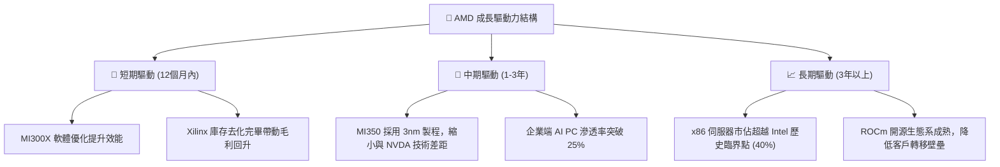

---

## 9. 風險矩陣

### 9.1 風險評分矩陣

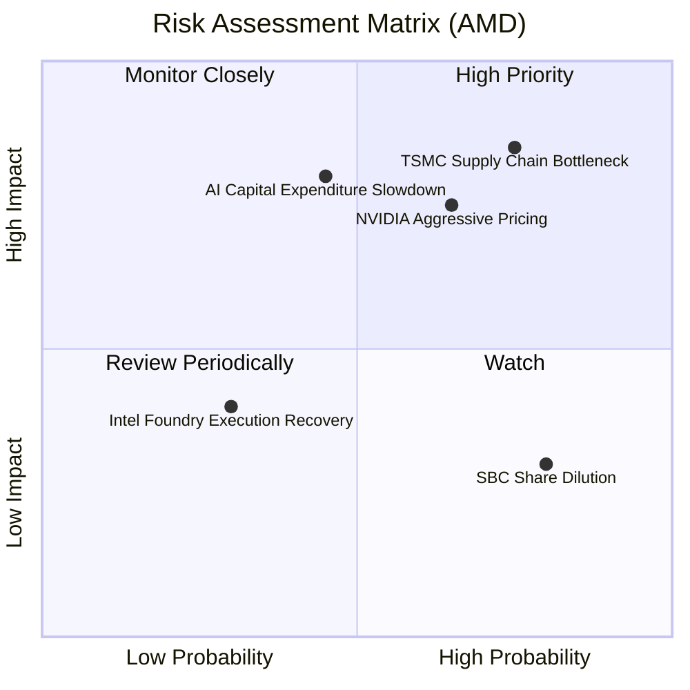

### 9.2 風險清單詳細分析

| # | 風險項目 | 發生機率 | 財務衝擊 | 風險評分 | 機構級緩解措施 / 追蹤指標 |
|---|---|---|---|---|---|
| 1 | 🔴 **台積電先進封裝（CoWoS）產能受限** | 高 (75%) | 高 (-15% 營收) | 🔴 **8.5 / 10** | 積極與三星、Intel Foundry 洽談後段封裝合作，分散單一供應商風險。 |
| 2 | 🔴 **NVIDIA 採取激進定價策略** | 中高 (65%) | 中高 (-8% 毛利率) | 🔴 **7.8 / 10** | 憑藉 Chiplet 架構帶來的優異成本控制能力，維持定價彈性（比 NVDA 便宜 20-30%）。 |
| 3 | 🟡 **超大型雲端服務商自研 ASIC 替代** | 中 (50%) | 中 (-5% 資料中心營收) | 🟡 **5.5 / 10** | 專注於通用型大語言模型（LLM）的極致優化，ASIC 則定位於特定工作負載，兩者並行不悖。 |
| 4 | 🟡 **股權稀釋風險 (SBC)** | 高 (80%) | 低 (-0.5% EPS) | 🟡 **4.0 / 10** | 利用每年至少 $1.5B 的自由現金流進行股份回購，抵消稀釋效應。 |

---

## 10. 投資建議

### 10.1 最終綜合評級雷達圖

```
╔══════════════════════════════════════════════════════════════╗
║                  AMD 綜合投資能力雷達圖                      ║
╠══════════════════════════════════════════════════════════════╣
║                                                              ║
║           基本面強度 (8.5)      成長動能 (9.0)               ║
║                  \                 /                         ║
║                   \               /                          ║
║                    \             /                           ║
║  護城河深度 (8.5) ─── [ ★★★★☆ ] ─── 財務健康 (9.5)          ║
║                    /             \                           ║
║                   /               \                          ║
║                  /                 \                         ║
║           管理層執行 (9.0)      估值合理性 (6.0)             ║
║                                                              ║
║  🏆 綜合評分：8.1 / 10  ｜  投資評級：🟢 買入 (Buy)          ║
╚══════════════════════════════════════════════════════════════╝
```

### 10.2 目標價與隱含報酬率

| 情境 | 隱含目標價 | 當前股價 | 隱含報酬率 | 機率權重 | 權重後期望值目標價 |
|:---|:---|:---|:---|:---|:---|
| 🔴 **悲觀情境** | $320.00 | $495.76 | -35.45% | 20% | $64.00 |
| 🟡 **基準情境** | **$540.19** | **$495.76** | **+8.96%** | **60%** | **$324.11** |
| 🟢 **樂觀情境** | $725.00 | $495.76 | +46.24% | 20% | $145.00 |
| 綜合期望值 | **$533.11** | $495.76 | **+7.53%** | 100% | **12M 期望目標價** |

### 10.3 買入時機與觸發因素

```
╔══════════════════════════════════════════════════════════════════╗
║                  ✅ AMD 買入觸發因素 Checklist                  ║
╠══════════════════════════════════════════════════════════════════╣
║                                                                  ║
║  立即買入觸發條件（多數符合時）：                                ║
║  ✅ 股價回檔至 $450 - $480 區間（對應 Forward P/E ~33x-35x）      ║
║  ✅ 資料中心單季營收年增率 (YoY) 維持在 >40% 的高檔              ║
║  ✅ ROCm 軟體平台發布重大更新，獲得主流框架（如 PyTorch）原生支援║
║                                                                  ║
║  加碼觸發條件（出現以下任一）：                                  ║
║  ☐ 財報確認 Embedded 業務毛利率回升至 65% 以上                  ║
║  ☐ 宣佈獲得 Meta 或 Microsoft 的 MI350 超大型新訂單             ║
║                                                                  ║
║  減碼 / 停損觸發條件（出現以下任一）：                           ║
║  ☐ 股價跌破 $400（技術面轉弱且跌破 200 日均線）                  ║
║  ☐ 營收成長率連續兩季低於 20%                                    ║
╚══════════════════════════════════════════════════════════════════╝
```

### 10.4 投資人適配度分析

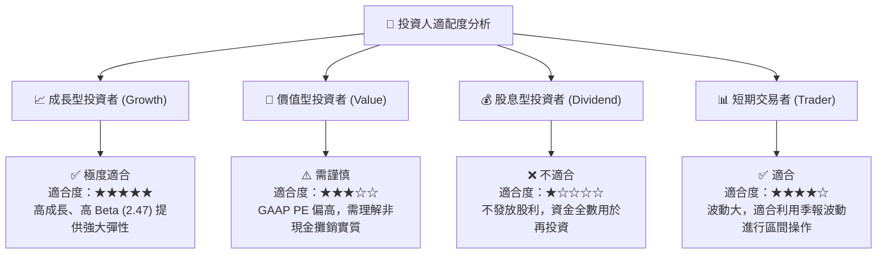

### 10.5 每季財報監控清單（Quarterly Watch List）

為了確保投資論點未發生漂移，投資人應在每季財報中嚴格監控以下指標與臨界值：

| 監控指標 | 基準值 (當前) | 觸發加碼門檻 | 觸發減碼/退出門檻 | 監控意義 |
|:---|:---|:---|:---|:---|
| **Data Center 營收比重** | ~35% - 40% | > 45% | < 30% | 判斷 AMD 是否成功轉型為純粹的 AI/資料中心龍頭。 |
| **Non-GAAP 毛利率** | 53.1% | > 56.0% | < 50.0% | 反映定價能力與產品組合（MI350 佔比）是否改善。 |
| **研發費用率 (R&D / Revenue)**| 23.4% | < 20.0% (營業槓桿釋放)| > 28.0% (研發效率低下) | 評估營業槓桿的釋放進度。 |
| **存貨週轉天數 (DIO)** | 161 天 | < 130 天 (需求旺盛) | > 180 天 (產品滯銷) | 監控通路庫存風險與產能利用率。 |
| **自由現金流 (FCF) 規模** | $7.17B (TTM) | 單季 > $2.5B | 單季 < $1.0B | 確保有充足資金進行研發與回購防守。 |

### 10.6 反面論證：什麼會證明論點錯誤（What Would Change My Mind）

```
╔══════════════════════════════════════════════════════════════════╗
║              ⚠️ 論點失效條件（Disconfirming Evidence）           ║
╠══════════════════════════════════════════════════════════════════╣
║  本投資論點在下列情況成立時應重新檢視或果斷退出：                ║
║  ☐ 核心資料中心業務（EPYC + Instinct）營收年增率連續兩季 < 20%    ║
║  ☐ 調整後有形 ROIC 跌破 WACC（16.0%），失去超額價值創造能力     ║
║  ☐ 自由現金流轉負，或 FCF 淨利轉換率連續兩季 < 80%              ║
║  ☐ 台積電先進封裝產能分配中，AMD 份額被壓縮至個位數              ║
║  ☐ NVIDIA 推出次世代架構且價格降幅達 30% 以上，引發產業價格戰   ║
╚══════════════════════════════════════════════════════════════════╝
```

---

> **免責聲明**：本報告為基於 2026-07-18 即時財務數據之機構級學術研究與基本面分析，不構成任何直接的投資買賣建議。投資有風險，入市需謹慎，並應結合個人風險承受能力獨立決策。