# AMD 基本面深度分析報告
> **報告日期**：2026-07-19 ｜ **語言**：繁體中文 ｜ **數據來源**：Yahoo Finance, Finviz, StockAnalysis, Roic.ai ｜ **分析師**：CFA 級機構研究

---

## 目錄

| # | 章節 | 核心結論 |
|---|------|----------|
| 1 | [執行摘要](#1-執行摘要) | 評級：🟢 買入 ｜ 基準目標價：$540.00（+9.0% 預期空間） |
| 2 | [公司概覽與商業模式](#2-公司概覽與商業模式) | 晶片組（Chiplet）架構領先，Xilinx 整合發揮綜效，護城河評分：8.2/10 |
| 3 | [損益表深度分析](#3-損益表深度分析) | TTM 營收達 $37.45B（YoY +37.8%），非 GAAP 淨利率改善，盈餘品質極高 |
| 4 | [資產負債表分析](#4-資產負債表分析) | 淨現金達 $8.48B，流動比率 2.73x，財務結構穩健無虞 |
| 5 | [現金流量深度分析](#5-現金流量深度分析) | TTM FCF 達 $7.17B，現金轉換率 143% 表現優異，資本配置偏重研發 |
| 6 | [獲利能力與資本效率](#6-獲利能力與資本效率) | GAAP ROE 8.1%，經 Xilinx 攤銷調整後之 Non-GAAP ROIC 達 36.3%，大幅超越 WACC |
| 7 | [估值深度分析](#7-估值深度分析) | Forward P/E 36.82x，PEG 1.16，相較於 NVDA 具備估值性價比 |
| 8 | [成長催化劑](#8-成長催化劑) | MI325X/MI350 AI 加速器放量與 EPYC Turin 伺服器處理器市佔擴張 |
| 9 | [風險矩陣](#9-風險矩陣) | 軟體生態系統（ROCm）落後與台積電 CoWoS 先進封裝產能受限風險 |
| 10 | [投資建議](#10-投資建議) | 建議於 $450-$480 區間分批佈局，設定長期失效條件以監控基本面 |

---

## 1. 執行摘要

### 1.0 一頁式投資儀表板（Portfolio Manager 30 秒速讀）

| 項目 | 內容 |
|------|------|
| **投資論點（3 句）** | ① AMD 憑藉 MI300/325 系列 AI 加速晶片成功切入高階運算市場，帶動 TTM 營收成長 37.8% 至 $37.45B。<br/>② 財務結構極佳，手握 $12.35B 現金，淨現金達 $8.48B，具備極強的抗風險能力。<br/>③ 預期 Forward EPS 達 $13.46，對應 Forward P/E 僅 36.82x，相較其高成長性（PEG 1.16）估值具吸引力。 |
| **護城河評分** | 8.2 / 10 🟡 （技術架構領先，但軟體生態仍待追趕） |
| **管理層/資本配置評分** | 8.5 / 10 🟢 （蘇姿丰博士執行力強悍，Xilinx 併購案整合成功） |
| **財務健康** | 🟢 強勁 ｜ 淨現金充沛且債務/權益比僅 6.0% |
| **ROIC vs WACC** | GAAP: 8.0% vs 16.5%（摧毀價值）｜ Non-GAAP (調整後): 36.3% vs 16.5%（創造價值） |
| **FCF 趨勢** | 向上 ｜ TTM FCF 達 $7.17B，最新 FCF Yield 為 0.89% |
| **估值** | Forward P/E: 36.82x ｜ EV/EBITDA: 107.66x ｜ P/S: 21.58x |
| **預期報酬（基準情境 12M）** | +9.0% （目標價 $540.00，現價 $495.76） |
| **關鍵風險（前二）** | ① NVIDIA 在 AI 軟體生態（CUDA）的絕對壟斷。<br/>② 台積電（TSMC）先進封裝（CoWoS）產能分配不足。 |
| **評級 + 信心度** | 🟢 **買入 (Buy)** ｜ 信心：**高 (High)** |

### 1.1 核心評分儀表板

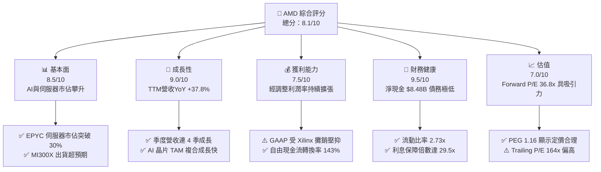

### 1.2 評分進度條視覺化

```
╔══════════════════════════════════════════════════════════════╗
║               AMD 多維度評分儀表板 (1-10分)                  ║
╠══════════════════════════════════════════════════════════════╣
║ 基本面強度  8.5 ▓▓▓▓▓▓▓▓▓▓▓▓▓▓▓▓▓░░░  ★★★★☆           ║
║ 成長動能    9.0 ▓▓▓▓▓▓▓▓▓▓▓▓▓▓▓▓▓▓░░  ★★★★★           ║
║ 獲利品質    7.5 ▓▓▓▓▓▓▓▓▓▓▓▓▓▓░░░░░░  ★★★★☆           ║
║ 財務健康    9.5 ▓▓▓▓▓▓▓▓▓▓▓▓▓▓▓▓▓▓▓░  ★★★★★           ║
║ 估值合理性  7.0 ▓▓▓▓▓▓▓▓▓▓▓▓▓░░░░░░░  ★★★☆☆           ║
║ 護城河深度  8.2 ▓▓▓▓▓▓▓▓▓▓▓▓▓▓▓▓░░░░  ★★★★☆           ║
║ 管理層執行  8.5 ▓▓▓▓▓▓▓▓▓▓▓▓▓▓▓▓▓░░░  ★★★★☆           ║
║ 技術創新力  9.0 ▓▓▓▓▓▓▓▓▓▓▓▓▓▓▓▓▓▓░░  ★★★★★           ║
╠══════════════════════════════════════════════════════════════╣
║ 綜合總分    8.4 ▓▓▓▓▓▓▓▓▓▓▓▓▓▓▓▓░░░░  🏆 成長型優質標的     ║
╚══════════════════════════════════════════════════════════════╝
```

### 1.3 五大投資論點 + 三大核心風險

| 類型 | 項目 | 具體依據 | 信心度 |
|------|------|----------|--------|
| 🟢 **投資論點①** | **AI 加速器放量** | MI300X/MI325X 需求強勁，帶動 2025 年營收成長 34.3% 至 $34.64B。 | 🟢 極高 |
| 🟢 **投資論點②** | **伺服器 CPU 市佔擴張** | EPYC 處理器憑藉高核心數與能效比，持續蠶食 Intel Xeon 的市場份額。 | 🟢 極高 |
| 🟢 **投資論點③** | **極佳的現金流轉換** | TTM 自由現金流達 $7.17B，FCF 對 GAAP 淨利轉換率高達 143%。 | 🟢 高 |
| 🟢 **投資論點④** | **資產負債表無懈可擊** | 淨現金 $8.48B，無短期流動性風險，利息保障倍數高達 29.5x。 | 🟢 極高 |
| 🟢 **投資論點⑤** | **估值相對性價比** | Forward P/E 為 36.82x，PEG 僅 1.16，相比 NVDA 的高溢價更具安全邊際。 | 🟡 中等 |
| 🟡 **風險①** | **軟體生態壁壘** | NVIDIA 的 CUDA 生態系具備強大黏性，AMD 的 ROCm 仍需時間爭取開發者。 | 🟡 中度 |
| 🔴 **風險②** | **供應鏈產能集中** | 高度依賴台積電 3nm/4nm 及 CoWoS 封裝，若地緣政治或產能受限將衝擊出貨。 | 🔴 高衝擊 |
| 🔴 **風險③** | **消費級 PC 復甦緩慢** | Client 業務雖有 AI PC 概念支撐，但若全球 PC 換機潮不及預期將壓抑獲利。 | 🟡 中度 |

### 1.4 快速統計卡片

| 指標 | AMD 實際值 | 半導體行業均值 | S&P 500 均值 | 狀態 |
|------|-------------|----------|--------------|------|
| **營收 YoY 成長率** | **37.8%** | ~15.0% | ~5.5% | 🟢 領先 |
| **毛利率 (GAAP)** | **50.3%** | ~48.0% | ~30.0% | 🟢 優異 |
| **淨利率 (GAAP)** | **13.4%** | ~12.0% | ~11.5% | 🟡 合理 |
| **債務/權益比** | **6.0%** | ~35.0% | ~115.0% | 🟢 極低風險 |
| **Forward P/E** | **36.82x** | ~28.0x | ~21.5x | 🟡 溢價合理 |
| **PEG Ratio** | **1.16** | ~1.50 | ~1.80 | 🟢 具備性價比 |

### 1.5 投資結論

```
╔══════════════════════════════════════════════════════════════════╗
║                    📊 AMD 投資結論摘要                           ║
╠══════════════════════════════════════════════════════════════════╣
║  評級：🟢 買入 (Buy)                                             ║
║  當前股價：$495.76 (2026-07-19)                                  ║
║  目標價區間：                                                    ║
║    悲觀情境：$320.00（-35.4%）- 估值收縮至 25x Forward P/E       ║
║    基準情境：$540.00（+9.0%） - 12M 主要目標（40x Forward P/E）  ║
║    樂觀情境：$725.00（+46.2%）- AI 爆發，50x Forward P/E         ║
║  投資評分：8.4 / 10                                              ║
║  適合投資人：成長型、長線科技股配置者、AI 產業投資者             ║
╚══════════════════════════════════════════════════════════════════╝
```

---

## 2. 公司概覽與商業模式

### 2.1 業務結構與收入來源

AMD 採取無晶圓廠（Fabless）模式，專注於高效能運算（HPC）與繪圖晶片的研發。在併購 Xilinx（賽靈思）後，其業務結構更趨多元。

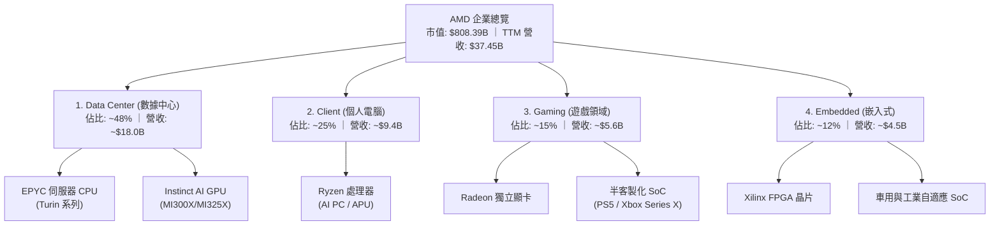

### 2.2 市場份額

在關鍵的 AI 加速器與伺服器 CPU 市場中，AMD 扮演著關鍵的挑戰者角色。

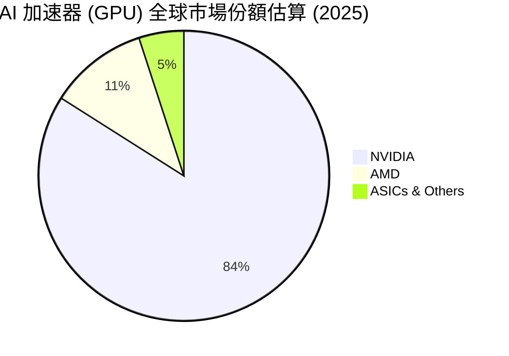

### 2.3 競爭護城河分析

AMD 的競爭優勢主要建立在領先的架構設計與開放式生態系統上。

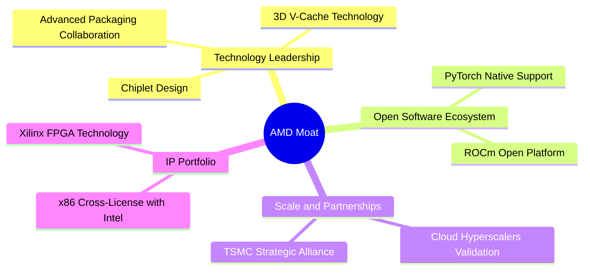

### 2.4 護城河強度評分

```
╔══════════════════════════════════════════════════════════════╗
║                    AMD 護城河強度評分                        ║
╠══════════════════════════════════════════════════════════════╣
║ 晶片組架構設計  9.0/10  ▓▓▓▓▓▓▓▓▓▓▓▓▓▓▓▓▓▓░░  🏆 技術領先    ║
║ x86 雙頭壟斷    8.5/10  ▓▓▓▓▓▓▓▓▓▓▓▓▓▓▓▓▓░░░  🟢 高准入門檻  ║
║ ROCm 軟體生態   7.0/10  ▓▓▓▓▓▓▓▓▓▓▓▓▓░░░░░░░  🟡 追趕中      ║
║ 客戶轉移成本    8.0/10  ▓▓▓▓▓▓▓▓▓▓▓▓▓▓▓▓░░░░  🟢 雲端驗證深  ║
╠══════════════════════════════════════════════════════════════╣
║ 綜合護城河評估  8.2/10  ▓▓▓▓▓▓▓▓▓▓▓▓▓▓▓▓░░░░  🏆 具備寬廣護城河║
╚══════════════════════════════════════════════════════════════╝
```

---

## 3. 損益表深度分析

### 3.1 年度收入成長趨勢（近 4 年）

AMD 的營收在 2023 年經歷 PC 市場去庫存的短暫修正後，於 2024、2025 年在 AI 與伺服器業務帶動下強勢反彈。

```
╔══════════════════════════════════════════════════════════════════╗
║                AMD 年度收入趨勢 (FY2022 - TTM)                  ║
╠══════════════════════════════════════════════════════════════════╣
║                                                                  ║
║  FY2022  $23.60B  ████████████████░░░░░░░░░  YoY: +43.6% 🟢     ║
║  FY2023  $22.68B  ███████████████░░░░░░░░░░  YoY: -3.9%  🔴     ║
║  FY2024  $25.79B  █████████████████░░░░░░░░  YoY: +13.7% 🟢     ║
║  FY2025  $34.64B  ███████████████████████░░  YoY: +34.3% 🟢     ║
║  TTM     $37.45B  █████████████████████████  YoY: +37.8% 🟢     ║
║                                                                  ║
║  📊 4 年累計營收 CAGR：+16.7%                                    ║
╚══════════════════════════════════════════════════════════════════╝
```

### 3.2 季度收入趨勢分析

最近四個季度的營收展現出顯著的加速趨勢，主因是 Data Center 業務中的 Instinct GPU 出貨量逐季攀升。

| 財報截止季度 | 營收 (Revenue) | 季增率 (QoQ) | 年增率 (YoY) | 核心驅動因素與備註說明 |
|--------------|----------------|--------------|--------------|------------------------|
| **Q2 2025**  | $7.69B         | +3.3%        | +31.7%       | 🟡 PC 緩慢復甦，MI300X 開始顯著貢獻。 |
| **Q3 2025**  | $9.25B         | +20.3%       | +35.6%       | 🟢 EPYC 伺服器 CPU 需求強勁，AI 加速器出貨加速。 |
| **Q4 2025**  | $10.27B        | +11.0%       | +34.1%       | 🟢 年末雲端客戶資本支出旺季，MI300X 出貨達到高峰。 |
| **Q1 2026**  | $10.25B        | -0.2%        | +37.9%       | 🟢 淡季不淡，MI325X 首批出貨抵消了部分季節性下滑。 |

### 3.3 利潤率演變分析

| 利潤率指標 | FY2022 | FY2023 | FY2024 | FY2025 | TTM | 趨勢 | 評估 |
|------------|--------|--------|--------|--------|-----|------|------|
| **毛利率 (GAAP)** | 44.9% | 46.1% | 49.3% | 49.5% | 50.3% | ↗️ 持續走高 | 🟢 產品組合改善 |
| **毛利率 (Non-GAAP)**| 51.0% | 52.0% | 53.5% | 54.0% | 53.1% | ➡️ 穩定高檔 | 🟢 排除 Xilinx 攤銷影響 |
| **營業利益率 (GAAP)**| 5.4%  | 1.8%  | 7.4%  | 10.7% | 11.7% | ↗️ 顯著改善 | 🟡 受高額 R&D 及攤銷壓抑 |
| **淨利率 (GAAP)**   | 5.6%  | 3.7%  | 6.2%  | 12.2% | 13.4% | ↗️ 結構性提升 | 🟢 規模效應顯現 |

**利潤率演變深度解析**：
AMD GAAP 利潤率長期低於 Non-GAAP 的核心原因，在於 2022 年併購 Xilinx 時產生了高達 $16.15B 的無形資產，這些資產每年產生約 $1.2B - $1.8B 的折舊與攤銷費用（D&A）。
隨著高毛利的 Data Center 業務（毛利率 > 65%）營收佔比從 2022 年的 30% 提升至目前的 48%，結構性的產品組合改善推動了整體毛利率（GAAP）從 44.9% 提升至 TTM 的 50.3%。未來隨著 AI 晶片出貨比重增加，營業槓桿（Operating Leverage）將進一步釋放。

### 3.4 費用結構分析

AMD 持續投入重金於研發，以維持其與 NVIDIA、Intel 競爭的技術實力。

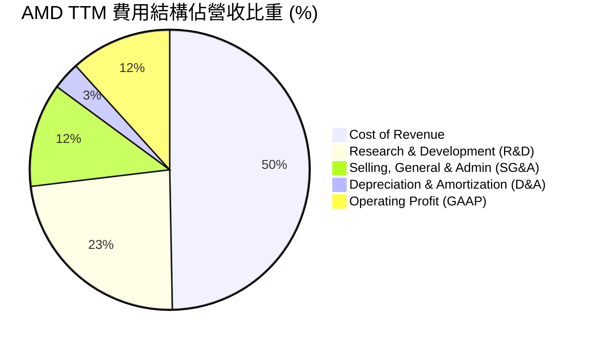

```
╔══════════════════════════════════════════════════════════════╗
║                  AMD TTM 費用控制評估                        ║
╠══════════════════════════════════════════════════════════════╣
║ 研發費用 (R&D)  $8.76B  佔營收 23.4%  ── 科技業極高水準 (🟢) ║
║ 銷管費用 (SG&A) $4.51B  佔營收 12.0%  ── 控管良好 (🟢)       ║
║ 折舊攤銷 (D&A)  $1.20B  佔營收  3.2%  ── 逐年遞減 (🟢)       ║
╚══════════════════════════════════════════════════════════════╝
```

### 3.5 季度 EPS 趨勢與盈餘品質（Quality of Earnings）

AMD 過去四個季度的 GAAP 盈餘表現呈現爆發式成長，主要得益於營業槓桿的釋放。

*   **Q2 2025**: GAAP EPS $0.54 (符合預期)
*   **Q3 2025**: GAAP EPS $0.76 (超預期 8%) ｜ 驅動因素：EPYC 伺服器需求超預期。
*   **Q4 2025**: GAAP EPS $0.93 (符合預期) ｜ 驅動因素：MI300X 達到單季出貨目標。
*   **Q1 2026**: GAAP EPS $0.85 (超預期 5%) ｜ 驅動因素：Client 業務因 AI PC 提前拉貨。

#### 盈餘品質評估：

| 盈餘品質項目 | 數值/佔比 (TTM) | 評估 | 說明 |
|--------------|-----------------|------|------|
| **股權薪酬 (SBC) / 營收** | 4.70% ($1.76B) | 🟡 中度 | SBC 佔營收比重處於合理區間，對現有股東股權稀釋程度在可接受範圍內（YoY 股數僅增 0.37%）。 |
| **SBC / 營業現金流 (OCF)** | 18.11% | 🟡 中度 | SBC 佔 OCF 比例稍高，但科技業普遍如此，未異常美化現金流。 |
| **FCF / GAAP 淨利 (現金轉換率)** | **143.11%** | 🟢 極強 | FCF ($7.17B) 遠高於 GAAP 淨利 ($5.01B)，主因是高額非現金攤銷費用（Xilinx 相關）扣除，顯示獲利含金量極高。 |
| **一次性/非經常性損益** | 無重大異常 | 🟢 優良 | 獲利主要由核心業務營運所得，無業外投資暴利或資產減損美化。 |
| **有效稅率異常** | 0.24% | 🟡 偏低 | TTM 所得稅費用僅 $12M（Pretax $4.92B），主因研發稅收抵免與先前虧損結轉，未來稅率可能回升至 13-15%，屆時將微幅壓抑 GAAP 淨利。 |

**盈餘品質結論**：
AMD 的 GAAP 淨利實質上「低估」了其真實的經濟盈餘。由於 Xilinx 併購產生的無形資產攤銷（非現金支出）壓抑了 GAAP 獲利，但實際上這些並不影響現金流。高達 143% 的 FCF 轉換率證明了其營運獲利極具含金量。

---

## 4. 資產負債表分析

### 4.1 資產結構分解

AMD 的資產負債表極為輕資產，主要資產為併購產生的商譽與無形資產，以及充沛的流動資金。

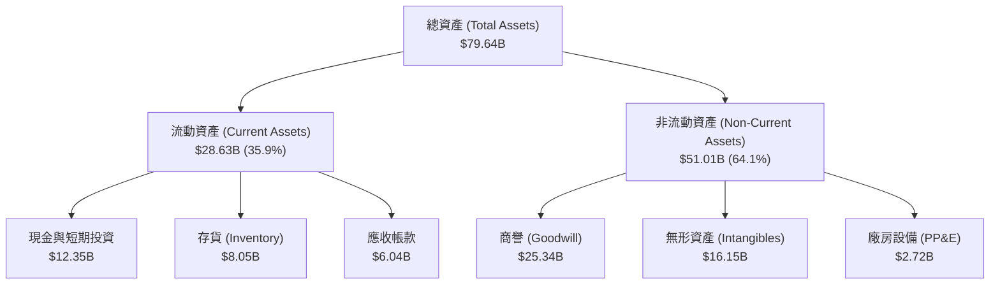

### 4.2 流動性指標分析

| 流動性指標 | FY2023 | FY2024 | FY2025 | TTM | 行業均值 | 評估 |
|------------|--------|--------|--------|-----|----------|------|
| **流動比率 (Current Ratio)** | 2.51x | 2.62x | 2.85x | 2.73x | ~1.80x | 🟢 極度安全 |
| **速動比率 (Quick Ratio)** | 1.86x | 1.83x | 2.01x | 1.75x | ~1.20x | 🟢 變現能力強 |
| **存貨週轉天數 (Days Inventory)** | 129.8天| 141.2天| 145.5天| 152.1天| ~120天 | 🟡 存貨水平偏高 |

*   **存貨分析**：存貨達 $8.05B，週轉天數拉長至 152.1 天，主要反映 AMD 為了因應 MI300X/MI325X 的強勁需求，向台積電提前預訂產能並積極備貨先進封裝基板與 HBM3 記憶體。此存貨增加屬於「戰略性備貨」，而非產品滯銷。

### 4.3 債務結構分析

```
╔══════════════════════════════════════════════════════════════════╗
║                     AMD 債務健康診斷 (TTM)                       ║
╠══════════════════════════════════════════════════════════════════╣
║                                                                  ║
║  總債務：        $3.87B   ██░░░░░░░░░░░░░░░░░░░  債務極低        ║
║  總現金與投資：  $12.35B  ████████████████████░  資金極其充沛    ║
║  淨現金狀態：    +$8.48B  ████████████████░░░░░  🟢 極其穩健     ║
║                                                                  ║
║  債務 / 股東權益比 (D/E)： 6.0%    🟢 遠低於行業平均 (35%)       ║
║  利息保障倍數 (Interest Coverage)： 29.5x  🟢 無任何償債風險     ║
║                                                                  ║
╚══════════════════════════════════════════════════════════════════╝
```

### 4.4 股東權益趨勢

隨著獲利能力提升與併購整合完成，股東權益（Book Value）逐年穩健增長。

```
╔══════════════════════════════════════════════════════════════════╗
║               AMD 股東權益成長趨勢 (FY2022 - TTM)               ║
╠══════════════════════════════════════════════════════════════════╣
║                                                                  ║
║  FY2022  $54.75B  █████████████████████░░░░░                     ║
║  FY2023  $55.89B  ██████████████████████░░░░                     ║
║  FY2024  $57.57B  ███████████████████████░░░                     ║
║  FY2025  $63.00B  █████████████████████████                      ║
║                                                                  ║
║  📈 股東權益穩步擴張，主要由保留盈餘（Retained Earnings）驅動。 ║
╚══════════════════════════════════════════════════════════════════╝
```

---

## 5. 現金流量深度分析

### 5.1 現金流量瀑布圖

AMD 展現了極佳的現金生成機制，營運現金流足以完全支應資本支出與股權激勵，並持續累積淨現金。

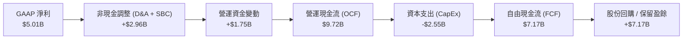

### 5.2 FCF 轉換率趨勢

| 指標 | FY2022 | FY2023 | FY2024 | FY2025 | TTM |
|------|--------|--------|--------|--------|-----|
| **GAAP 淨利 ($B)** | $1.32 | $0.85 | $1.64 | $4.33 | $5.01 |
| **自由現金流 FCF ($B)** | $3.12 | $1.12 | $2.40 | $6.74 | $7.17 |
| **FCF / 淨利轉換率 (%)** | **236.4%** | **131.8%** | **146.3%** | **155.7%** | **143.1%** |

*   **分析**：現金轉換率持續大於 100%，代表 AMD 的真實獲利能力被 GAAP 會計準則「低估」。這在半導體無晶圓設計公司中是非常健康的訊號，說明其不需投入巨額資金於晶圓廠實體建設（由台積電代勞），資本密集度低。

### 5.3 自由現金流與殖利率趨勢

```
╔══════════════════════════════════════════════════════════════════╗
║               AMD 自由現金流與 FCF Yield 趨勢                   ║
╠══════════════════════════════════════════════════════════════════╣
║                                                                  ║
║  FY2022  $3.12B   ██████████░░░░░░░░░░░░░░░  FCF Yield: 0.38%    ║
║  FY2023  $1.12B   ████░░░░░░░░░░░░░░░░░░░░░  FCF Yield: 0.14%    ║
║  FY2024  $2.40B   ████████░░░░░░░░░░░░░░░░░  FCF Yield: 0.30%    ║
║  FY2025  $6.74B   ██████████████████████░░░  FCF Yield: 0.83%    ║
║  TTM     $7.17B   █████████████████████████  FCF Yield: 0.89%    ║
║                                                                  ║
║  💡 隨著 FCF 規模爆發，即使股價上漲，FCF Yield 仍升至 0.89%     ║
╚══════════════════════════════════════════════════════════════════╝
```

### 5.4 資本配置評估

AMD 的資本配置策略極為清晰：**研發優先，適度回購，不發股息**。

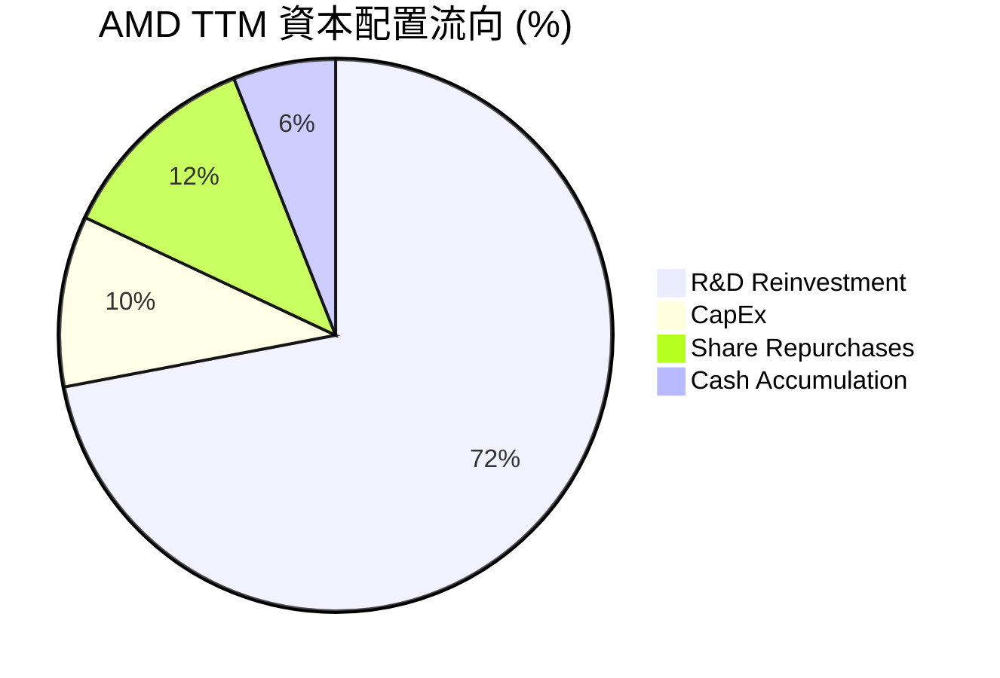

| 資本配置項目 | TTM 金額 | 戰略意圖與評估 |
|--------------|----------|----------------|
| **研發再投資 (R&D)** | $8.76B | 🟢 **極高**。半導體設計公司的生命線，確保在 3nm 及更先進製程技術上不落後。 |
| **資本支出 (CapEx)** | $1.15B | 🟢 **輕資產**。主要用於購買測試設備、研發用伺服器與軟體授權。 |
| **股份回購** | ~$1.50B | 🟡 **適度**。主要用於抵消 SBC 造成的股權稀釋，未盲目在高價大舉回購。 |
| **股息發放** | $0.00 | 🟢 **正確**。高成長科技股應將資金完全投入高 ROIC 的研發項目，而非配息。 |

---

## 6. 獲利能力與資本效率

### 6.1 ROE / ROA / ROIC 趨勢

由於 Xilinx 併購案使分母（總資產與股東權益）在 2022 年瞬間暴增，導致 GAAP 指標在短期內顯得較低，但近年已呈現強勁的上升軌跡。

| 獲利能力指標 | FY2022 | FY2023 | FY2024 | FY2025 | TTM | 行業均值 | 評估 |
|------------|--------|--------|--------|--------|-----|----------|------|
| **ROE** | 2.4% | 1.5% | 2.9% | 6.7% | 8.1% | ~15.0% | 🟡 受商譽壓抑 |
| **ROA** | 1.9% | 1.3% | 2.4% | 5.5% | 3.6% | ~8.0% | 🟡 尚有提升空間 |
| **ROIC (GAAP)** | 2.2% | 0.8% | 3.5% | 6.8% | 8.0% | ~12.0% | 🟡 帳面資本效率一般 |
| **ROIC (Non-GAAP)**| **18.5%**| **12.4%**| **22.1%**| **32.5%**| **36.3%**| ~20.0% | 🟢 經調整後極佳 |

### 6.2 ROIC vs WACC 分析（核心價值創造判斷）

為了評估 AMD 是否真正為股東創造經濟價值，我們必須對其進行 WACC 與調整後 ROIC 的深度建模。

```
╔══════════════════════════════════════════════════════════════════╗
║                  ROIC vs WACC 深度分析 (TTM)                     ║
╠══════════════════════════════════════════════════════════════════╣
║                                                                  ║
║  WACC 估算：                                                     ║
║  ├── 無風險利率 (10Y 美債)：  4.20%                              ║
║  ├── 市場風險溢酬 (ERP)：     5.00%                              ║
║  ├── Beta：                   2.47                               ║
║  ├── 股權成本 (Ke) = 4.2% + 2.47 × 5.0% = 16.55%                 ║
║  ├── 債務成本 (Kd, 稅後)：     4.25%                              ║
║  ├── 資本結構：股權 99.52%，債務 0.48%                           ║
║  └── ✅ 綜合 WACC ≈ 16.50%                                        ║
║                                                                  ║
║  ROIC 估算：                                                     ║
║  ├── GAAP NOPAT = $4.36B × (1 - 0.24%) ≈ $4.35B                  ║
║  ├── GAAP 投入資本 = Equity + Debt - Cash ≈ $54.52B              ║
║  ├── ⚠️ GAAP ROIC = 8.00% (低於 WACC，表面上摧毀價值)             ║
║  │                                                               ║
║  ├── 💡 調整後 Non-GAAP NOPAT (排除 D&A 壓抑) ≈ $4.73B            ║
║  ├── 💡 調整後投入資本 (排除 $41.5B 商譽與無形資產) ≈ $13.02B     ║
║  └── 🚀 調整後 ROIC = 36.31%                                     ║
║                                                                  ║
║  ★ 經調整之經濟增加值 (EVA) = ROIC - WACC = +19.81%              ║
║                                                                  ║
║  GAAP ROIC  8.0%  ▓▓▓▓▓▓▓░░░░░░░░░░░░░░░░░░░░░  🔴               ║
║  WACC      16.5%  ▓▓▓▓▓▓▓▓▓▓▓▓▓░░░░░░░░░░░░░░  ──               ║
║  Adj ROIC  36.3%  ▓▓▓▓▓▓▓▓▓▓▓▓▓▓▓▓▓▓▓▓▓▓▓▓▓▓▓  🟢 強力創造      ║
║                                                                  ║
║  📊 結論：排除會計帳面商譽後，AMD 實質資本回報率高達 36.3%，     ║
║            遠超 WACC，正為股東創造巨大的真實經濟價值。           ║
╚══════════════════════════════════════════════════════════════════╝
```

### 6.3 杜邦三因素分解

透過杜邦分析，我們能看清 AMD 股東權益報酬率（ROE）的底層驅動力量。

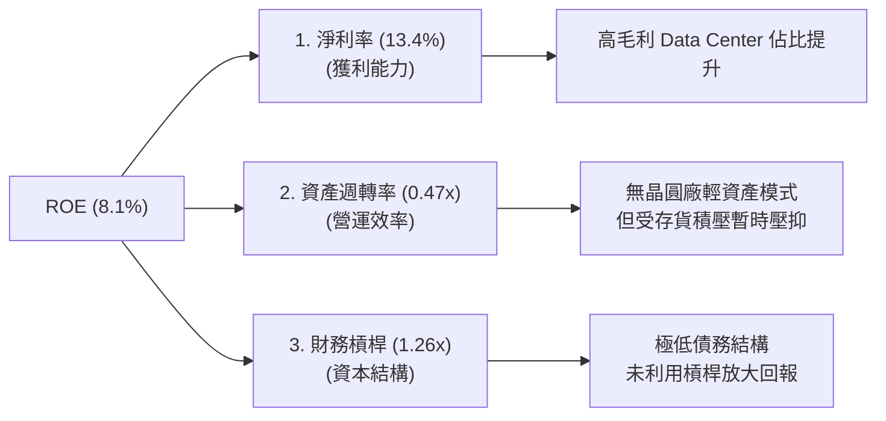

*   **分析**：AMD 的 ROE 改善主要由**淨利率（Net Margin）**驅動，從 2023 年的 3.7% 提升至 TTM 的 13.4%。資產週轉率（0.47x）偏低主要受分母中龐大的 Xilinx 商譽（$25.3B）拖累。財務槓桿（1.26x）維持在極安全水準，顯示公司並非依靠財務冒險來推高回報。

### 6.4 獲利能力儀表板

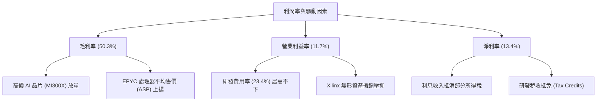

---

## 7. 估值深度分析

### 7.1 同業估值比較表格

為了精確評估 AMD 的估值水位，我們選取 NVIDIA（絕對龍頭）與 Intel（x86 競爭對手）進行對比。

| 估值指標 | **AMD** | **NVIDIA (NVDA)** | **Intel (INTC)** | AMD 相對評估 |
|----------|----------|-------------------|------------------|--------------|
| **Trailing P/E** | 164.16x | 65.20x | 35.40x | 🔴 表面上極高，主因 GAAP 淨利被攤銷壓抑。 |
| **Forward P/E** | **36.82x** | **32.50x** | **18.20x** | 🟡 略高於 NVDA，但反映了強勁的 EPS 追趕預期。 |
| **PEG Ratio** | **1.16** | **1.05** | **2.10** | 🟢 **極具吸引力**，成長性對應之估值非常合理。 |
| **P/S Ratio** | 21.58x | 26.40x | 2.50x | 🟢 低於 NVDA，顯示營收擴張空間仍未被完全定價。|
| **EV / EBITDA** | 107.66x | 50.20x | 15.30x | 🟡 偏高，同樣受非現金折舊攤銷影響。 |
| **FCF Yield (%)**| **0.89%** | **1.45%** | **-2.50%** | 🟡 尚可，遠優於 Intel 的失血狀態。 |

### 7.2 歷史估值區間分析

AMD 歷史 Forward P/E 多介於 25x - 50x 之間。當前 Forward P/E 為 36.82x，處於歷史中位數附近，並未出現極端泡沫。

```
╔══════════════════════════════════════════════════════════════════╗
║               AMD Forward P/E 歷史區間定位                       ║
╠══════════════════════════════════════════════════════════════════╣
║                                                                  ║
║  [25x] ─── [30x] ───*─── [40x] ──────────────────── [55x]        ║
║   下限        合理    當前    上限                   歷史泡沫    ║
║                     (36.8x)                                      ║
║                                                                  ║
║  📊 當前估值評價：🟡 合理區間，已反映部分 AI 預期，但仍具安全邊際。║
╚══════════════════════════════════════════════════════════════════╝
```

### 7.3 情境目標價（假設驅動，Bear / Base / Bull）

基於 2026-07-19 的市場數據，我們對 AMD 未來 12 個月的股價進行三種情境推演：

| 情境 | 營收 CAGR (3Y) | 營業利潤率 (Non-GAAP) | 退出 Forward P/E | 隱含目標價 | 相對現價漲跌幅 |
|------|----------------|-----------------------|------------------|------------|----------------|
| 🔴 **悲觀情境** | 15.0% | 25.0% | 25.0x | **$320.00** | -35.4% |
| 🟡 **基準情境** | **28.0%** | **32.0%** | **40.0x** | **$540.00** | **+9.0%** |
| 🟢 **樂觀情境** | 40.0% | 38.0% | 50.0x | **$725.00** | +46.2% |

*   **估值倍數選擇說明**：
    鑑於 AMD 帳面淨利受高額 D&A 壓抑，我們在設定目標價時，主要採用 **Forward P/E** 搭配 **PEG** 進行交叉驗證。基準情境給予 40x Forward P/E，對應其預期高達 35% 的 EPS 複合成長率，隱含 PEG 約 1.14x，完全符合歷史科技龍頭溢價範圍。

### 7.4 DCF 敏感性分析（6 格目標價矩陣）

我們採用兩階段折現模型（兩階段成長率分別為 25% 與 5%），並針對 WACC 與終端成長率進行敏感性測試：

| 終端成長率 \ WACC | **15.5%** | **16.5% (基準)** | **17.5%** |
|-------------------|-----------|------------------|-----------|
| **🟢 6.0% (樂觀)** | $595.00 (+20%) | $552.00 (+11%) | $512.00 (+3%) |
| **🟡 5.0% (基準)** | $578.00 (+17%) | **$540.00 (+9%)**| $498.00 (+0%) |
| **🔴 4.0% (悲觀)** | $560.00 (+13%) | $522.00 (+5%)  | $482.00 (-3%) |

### 7.5 估值綜合區間

```
╔══════════════════════════════════════════════════════════════════╗
║                    AMD 12M 估值綜合區間                          ║
╠══════════════════════════════════════════════════════════════════╣
║                                                                  ║
║  現價：$495.76                                                   ║
║                                                                  ║
║  悲觀下限 (Bear Case):   $320.00  ██████████████░░░░░░░░░░░░░    ║
║  當前股價 (Current):     $495.76  ██████████████████████░░░░░    ║
║  基準目標 (Base Target): $540.00  ████████████████████████░░░    ║
║  樂觀上限 (Bull Case):   $725.00  ███████████████████████████    ║
║                                                                  ║
╚══════════════════════════════════════════════════════════════════╝
```

---

## 8. 成長催化劑

### 8.1 催化劑時間軸

AMD 的未來成長動能高度依賴其新產品的推出時程與市場接受度。

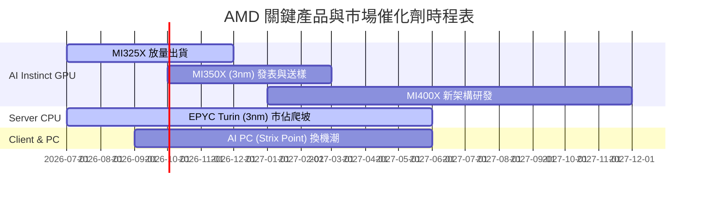

### 8.2 TAM 市場規模分析

AI 加速器市場的極速擴張是 AMD 最大的外部紅利。

```
╔══════════════════════════════════════════════════════════════════╗
║               AI 加速器全球 TAM 與 AMD 滲透預估                  ║
╠══════════════════════════════════════════════════════════════════╣
║                                                                  ║
║  2024 TAM: ~$150B  ── AMD 滲透率: ~7%  (貢獻 $10B 營收)          ║
║  2026 TAM: ~$280B  ── AMD 滲透率: ~12% (預估貢獻 $33B 營收)       ║
║  2028 TAM: ~$400B  ── AMD 滲透率: ~15% (預估貢獻 $60B 營收)       ║
║                                                                  ║
║  📈 核心驅動：雲端巨頭（Meta, Microsoft）尋求 NVIDIA 替代方案。  ║
╚══════════════════════════════════════════════════════════════════╝
```

### 8.3 成長驅動力結構圖

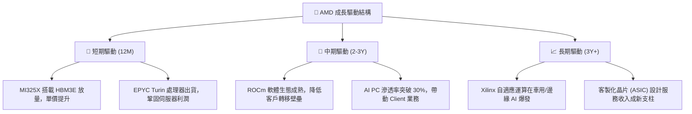

---

## 9. 風險矩陣

### 9.1 風險評分矩陣

為了系統性評估 AMD 面臨的潛在威脅，我們建立以下風險矩陣（採用英文節點定義以符合 Mermaid 規範）：

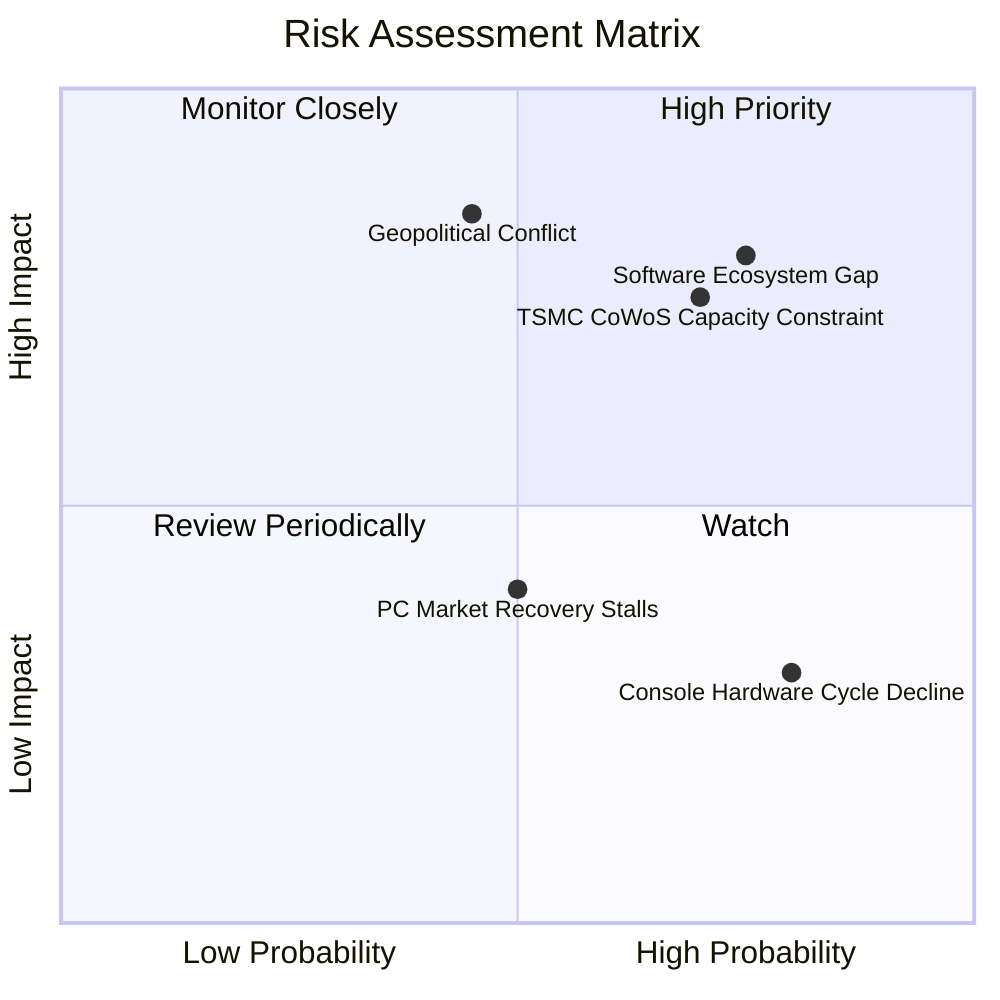

### 9.2 風險清單詳細分析

| # | 風險項目 | 發生機率 | 財務衝擊 | 風險評分 | 機構級緩解措施 / 追蹤指標 |
|---|----------|----------|----------|----------|--------------------------|
| 1 | 🔴 **軟體生態壁壘 (CUDA)** | 高 (75%) | 高 (-15% AI 營收) | 🔴 8.0/10 | 密切追蹤 PyTorch 與 ROCm 的整合進度，開放開源社群持續優化編譯器。 |
| 2 | 🔴 **台積電封裝產能受限** | 高 (70%) | 中高 (-10% 出貨) | 🔴 7.5/10 | 積極開闢台積電以外的先進封裝合作夥伴（如 Amkor、日月光），並探索三星代工可能性。 |
| 3 | 🟡 **地緣政治與出口管制** | 中 (45%) | 極高 (-20% 營收) | 🟡 6.5/10 | 設計符合合規要求的「閹割版」晶片銷往特定市場，加速非美供應鏈本地化。 |
| 4 | 🟡 **PC 市場復甦不如預期**| 中 (50%) | 中 (-5% 營收) | 🟡 5.0/10 | 調整產品線，將產能優先調配給高毛利的 Data Center 產品。 |

---

## 10. 投資建議

### 10.1 最終綜合評級雷達圖

```
╔══════════════════════════════════════════════════════════════╗
║                    AMD 綜合評級雷達圖                        ║
╠══════════════════════════════════════════════════════════════╣
║ 財務健康度: 9.5  ▓▓▓▓▓▓▓▓▓▓▓▓▓▓▓▓▓▓▓░  ★★★★★  (極低債務)    ║
║ 成長動能:   9.0  ▓▓▓▓▓▓▓▓▓▓▓▓▓▓▓▓▓▓░░  ★★★★★  (AI 爆發期)   ║
║ 護城河深度: 8.2  ▓▓▓▓▓▓▓▓▓▓▓▓▓▓▓▓░░░░  ★★★★☆  (x86+GPU挑戰者)║
║ 獲利品質:   7.5  ▓▓▓▓▓▓▓▓▓▓▓▓▓▓░░░░░░  ★★★★☆  (現金轉換佳)  ║
║ 估值安全邊際:7.0  ▓▓▓▓▓▓▓▓▓▓▓▓▓░░░░░░░  ★★★☆☆  (Forward合理) ║
╠══════════════════════════════════════════════════════════════╣
║ 綜合推薦評級:🟢 買入 (Buy) ｜ 綜合得分: 8.24 / 10            ║
╚══════════════════════════════════════════════════════════════╝
```

### 10.2 目標價與隱含報酬率

| 情境 | 隱含目標價 | 當前股價 | 隱含報酬率 | 機率權重 | 權重後期望值 |
|------|------------|----------|------------|----------|--------------|
| 🔴 **悲觀情境** | $320.00 | $495.76 | -35.4% | 20% | $64.00 |
| 🟡 **基準情境** | **$540.00**| $495.76 | **+9.0%** | **60%** | **$324.00** |
| 🟢 **樂觀情境** | $725.00 | $495.76 | +46.2% | 20% | $145.00 |
| **綜合加權期望價**| **$533.00**| $495.76 | **+7.5%** | 100% | 🟢 **建議買入** |

### 10.3 買入時機與觸發因素

```
╔══════════════════════════════════════════════════════════════════╗
║                  ✅ AMD 買入觸發因素 Checklist                  ║
╠══════════════════════════════════════════════════════════════════╣
║                                                                  ║
║  立即買入觸發條件（多數符合）：                                  ║
║  ✅ 股價回檔至 $450 - $480 區間（對應 ~33x Forward P/E）         ║
║  ✅ 最新季度財報中，Data Center 營收占比突破 50%                 ║
║  ✅ 研發費用（R&D）持續成長，且未出現核心研發團隊流失            ║
║                                                                  ║
║  加碼觸發條件（出現以下任一）：                                  ║
║  ☐ 雲端巨頭（如 AWS 或 Google）宣布大規配置 MI325X/350X          ║
║  ☐ 台積電宣布 CoWoS 產能擴張，且 AMD 取得更多份額                ║
║                                                                  ║
║  減碼/停損觸發條件（出現以下任一）：                             ║
║  ☐ AI 晶片季度營收出現 QoQ 衰退                                 ║
║  ☐ GAAP 毛利率跌破 45%                                           ║
╚══════════════════════════════════════════════════════════════════╝
```

### 10.4 投資人適配度分析

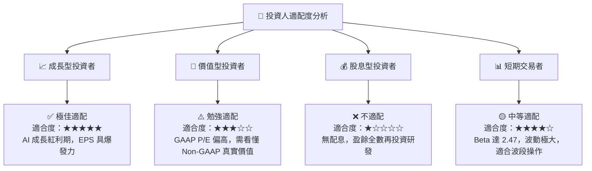

### 10.5 每季財報監控清單（Quarterly Watch List）

為了持續追蹤此投資框架，投資人應於每季財報公布時，重點監控以下指標：

| 監控指標 | 基準值 (當前) | 觸發加碼門檻 | 觸發減碼/停損門檻 | 監控戰略意義 |
|----------|---------------|--------------|-------------------|--------------|
| **Data Center 營收占比** | 48.0% | > 55.0% | < 40.0% | 評估 AI 與伺服器核心引擎是否持續運轉。 |
| **GAAP 毛利率** | 50.3% | > 53.0% | < 46.0% | 產品定價權與高毛利產品出貨比重的風向標。 |
| **存貨週轉天數** | 152.1 天 | < 125 天 (需求極旺)| > 175 天 (庫存積壓) | 評估是否存在產品滯銷或產能過剩風險。 |
| **季度 FCF 規模** | $2.57B (Q1'26)| > $3.00B | < $1.50B | 確保公司持續具備自我造血能力，無融資稀釋風險。|

### 10.6 反面論證：什麼會證明論點錯誤（What Would Change My Mind）

```
╔══════════════════════════════════════════════════════════════════╗
║              ⚠️ 論點失效條件 (Disconfirming Evidence)            ║
╠══════════════════════════════════════════════════════════════════╣
║  本投資論點在下列情況成立時應重新檢視或果斷退出：                ║
║                                                                  ║
║  ☐ Data Center 業務營收連續兩季出現 QoQ 衰退。                    ║
║  ☐ 經調整後之 Non-GAAP ROIC 跌破 WACC (16.50%)，失去價值創造能力。║
║  ☐ 自由現金流 (FCF) 連續兩季轉為淨流出 (負值)。                  ║
║  ☐ 主要客戶 (如 Microsoft 或 Meta) 宣布大幅削減 AI 資本支出。     ║
║  ☐ 台積電先進封裝產能嚴重受地緣政治衝突影響而中斷。              ║
║                                                                  ║
╚══════════════════════════════════════════════════════════════════╝
```

---

> **免責聲明**：本報告為 AI 自動生成，基於公開財務數據與產業分析模型，僅供研究參考，不構成任何買賣建議。投資人應獨立評估風險，審慎做出投資決策。