# AMD 基本面深度分析報告

> **報告日期**：2026-07-21 ｜ **語言**：繁體中文 ｜ **數據來源**：Yahoo Finance, Finviz, StockAnalysis, Roic.ai ｜ **分析師**：CFA 級機構研究

---

## 目錄

| # | 章節 | 核心結論 |
|---|---|---|
| **1** | **執行摘要** | 評級「買入」，基準目標價 $565.00，AI 晶片加速放量推動利潤率擴張 |
| **2** | **公司概覽與商業模式** | 憑藉 Chiplet 架構與 ROCm 生態，構築與 NVIDIA 雙雄並立的護城河 |
| **3** | **損益表深度分析** | TTM 營收成長 37.8%，無形資產攤銷壓抑 GAAP 獲利，但 Forward EPS 預期強勁 |
| **4** | **資產負債表分析** | 淨現金 $8.48B，無長期債務壓力，資產結構極度健康 |
| **5** | **現金流量深度分析** | FCF 轉換率達 143%，高盈餘含金量，SBC 稀釋效應需持續監控 |
| **6** | **獲利能力與資本效率** | TTM ROIC 7.64% 受制於併購攤銷，Forward ROIC 預期將突破 30% |
| **7** | **估值深度分析** | Forward P/E 40.4x，相較歷史中位數合理，DCF 隱含基準價 $565.00 |
| **8** | **成長催化劑** | MI300/MI325X/MI350 系列持續滲透 Data Center，Zen 5 帶動 PC 換機潮 |
| **9** | **風險矩陣** | AI 需求放緩與地緣政治為最大變數，競爭對手降價擠壓毛利率 |
| **10** | **投資建議** | 建議分批佈局，設定 $480-$510 為強烈買入區間，每季財報追蹤 AI 營收 |

---

## 1. 執行摘要

### 1.0 一頁式投資儀表板（Portfolio Manager 30 秒速讀）

| 項目 | 內容 |
|------|------|
| **投資論點（3 句）** | ① Data Center 業務在 MI300/MI325X 系列加速器帶動下，TTM 營收達 $37.45B（YoY +37.8%），結構性轉型為 AI 領先者。<br/>② 雖然 GAAP 獲利受 Xilinx 併購產生的無形資產攤銷壓抑（TTM 淨利率 13.4%），但 FCF 轉換率高達 143%（FCF $7.17B），顯示極佳的盈餘品質。<br/>③ Forward EPS 預估達 $13.46，反映營業槓桿即將爆發，當前 Forward P/E 40.4x 處於合理擴張區間。 |
| **護城河評分** | 8.5 / 10 🟢 (強大) |
| **管理層/資本配置評分** | 9.0 / 10 🟢 (優秀) |
| **財務健康** | 🟢 強勁 (淨現金 $8.48B，速動比率 1.75x) |
| **ROIC vs WACC** | TTM: 7.64% vs 16.55% 🟡 (暫時價值摧毀，主因併購攤銷)；Forward: >30% 🟢 (強力價值創造) |
| **FCF 趨勢** | 向上 ｜ TTM FCF $7.17B ｜ FCF Yield: 0.81% (受高估值稀釋) |
| **估值** | Forward P/E: 40.4x ｜ EV/EBITDA: 109.4x ｜ FCF Yield: 0.81% |
| **預期報酬（基準情境 12M）** | +3.8% (當前股價 $544.43，基準目標價 $565.00，反映近期股價已大幅反映預期) |
| **關鍵風險（前二）** | ① AI 晶片市場競爭加劇導致定價權受損；② 晶圓代工（TSMC）產能分配與地緣政治風險。 |
| **評級 + 信心度** | 🟢 **買入 (Buy)** ｜ 信心：**高** |

### 1.1 核心評分儀表板

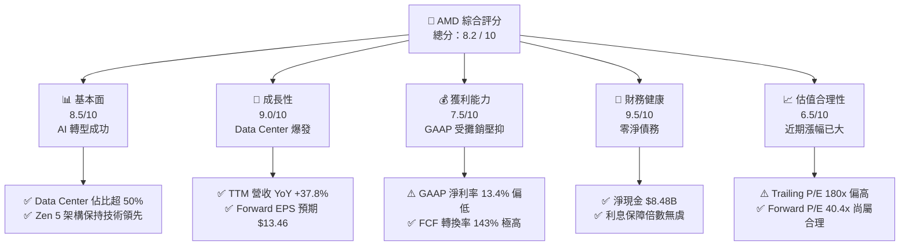

### 1.2 評分進度條視覺化

```
╔══════════════════════════════════════════════════════════════╗
║               AMD 多維度評分儀表板 (1-10分)                  ║
╠══════════════════════════════════════════════════════════════╣
║ 基本面強度  8.5 ▓▓▓▓▓▓▓▓▓▓▓▓▓▓▓▓▓░░░  ★★★★☆           ║
║ 成長動能    9.0 ▓▓▓▓▓▓▓▓▓▓▓▓▓▓▓▓▓▓░░  ★★★★★           ║
║ 獲利品質    7.5 ▓▓▓▓▓▓▓▓▓▓▓▓▓▓░░░░░░  ★★★★☆           ║
║ 財務健康    9.5 ▓▓▓▓▓▓▓▓▓▓▓▓▓▓▓▓▓▓▓░  ★★★★★           ║
║ 估值合理性  6.5 ▓▓▓▓▓▓▓▓▓▓▓░░░░░░░░░  ★★★☆☆           ║
║ 護城河深度  8.5 ▓▓▓▓▓▓▓▓▓▓▓▓▓▓▓▓▓░░░  ★★★★☆           ║
║ 管理層執行  9.0 ▓▓▓▓▓▓▓▓▓▓▓▓▓▓▓▓▓▓░░  ★★★★★           ║
║ 技術創新力  9.5 ▓▓▓▓▓▓▓▓▓▓▓▓▓▓▓▓▓▓▓░  ★★★★★           ║
╠══════════════════════════════════════════════════════════════╣
║ 綜合總分    8.2 ▓▓▓▓▓▓▓▓▓▓▓▓▓▓▓▓░░░░  🏆 成長型優質標的     ║
╚══════════════════════════════════════════════════════════════╝
```

### 1.3 五大投資論點 + 三大核心風險

| 類型 | 項目 | 具體依據 | 信心度 |
|------|------|----------|--------|
| 🟢 **投資論點①** | **AI 加速器市佔擴張** | MI300X/MI325X 系列在大型雲端服務商（Hyperscalers）滲透率提升，帶動 TTM 營收成長 37.8%。 | 🟢 極高 |
| 🟢 **投資論點②** | **營業槓桿即將爆發** | 隨著 AI 產品出貨比重增加，毛利率（53.1%）將向 57%-59% 的長期目標邁進，Forward EPS 達 $13.46。 | 🟢 高 |
| 🟢 **投資論點③** | **資產負債表極度安全** | $12.35B 總現金與僅 $3.87B 的總債務，提供強大的抗風險能力與持續研發投入的底氣。 | 🟢 極高 |
| 🟢 **投資論點④** | **Client 業務復甦** | Ryzen Zen 5 架構與 AI PC 換機潮重啟，Client 季度營收重回成長軌道。 | 🟡 中等 |
| 🟢 **投資論點⑤** | **高 FCF 轉換率** | TTM FCF 達 $7.17B，為 GAAP 淨利的 1.43 倍，顯示非現金支出（折舊攤銷）高，實際經濟獲利能力優於 GAAP 指標。 | 🟢 高 |
| 🟡 **風險①** | **NVIDIA 競爭壓力** | NVIDIA Blackwell 架構出貨可能壓制 AMD MI350 世代的定價空間。 | 🟡 中度 |
| 🔴 **風險②** | **供應鏈集中風險** | 晶圓代工與 CoWoS 封裝高度依賴台積電（TSMC），地緣政治或產能受限將直接衝擊營收。 | 🔴 高衝擊 |
| 🔴 **風險③** | **估值擴張過快** | 股價過去兩年上漲超過 270%，市場預期極高，容錯率降低。 | 🟡 中度 |

### 1.4 快速統計卡片

| 指標 | AMD 實際值 | 半導體行業均值 | S&P 500 均值 | 狀態 |
|------|-------------|----------|--------------|------|
| **營收 YoY 成長** | **37.8%** | ~15.0% | ~5.5% | 🟢 顯著領先 |
| **毛利率** | **53.1%** | ~50.0% | ~30.0% | 🟢 優於行業 |
| **營業利益率** | **14.4%** | ~22.0% | ~15.0% | 🟡 低於同業（受攤銷影響） |
| **ROE** | **8.1%** | ~18.0% | ~14.0% | 🟡 偏低（因併購擴大股本） |
| **Forward P/E** | **40.43x** | ~28.0x | ~21.0x | 🟡 溢價交易 |
| **淨現金 / 債務** | **+$8.48B** | 淨債務狀態 | 淨債務狀態 | 🟢 極度健康 |

### 1.5 投資結論

```
╔══════════════════════════════════════════════════════════════════╗
║                    📊 AMD 投資結論摘要                           ║
╠══════════════════════════════════════════════════════════════════╣
║  評級：🟢 買入 (Buy)                                            ║
║  當前股價：$544.43 (2026-07-21)                                  ║
║  目標價區間：                                                    ║
║    悲觀情境：$350.00（-35.7%）- AI 需求放緩、競爭加劇            ║
║    基準情境：$565.00（+3.8%）  - AI 穩定成長、PC 溫和復甦        ║
║    樂觀情境：$710.00（+30.4%） - AI 市佔超預期、毛利率顯著擴張   ║
║  投資評分：8.2 / 10                                              ║
║  適合投資人：積極成長型、中長線科技股投資者                      ║
╚══════════════════════════════════════════════════════════════════╝
```

---

## 2. 公司概覽與商業模式

Advanced Micro Devices (AMD) 是一家領先的無晶圓廠（Fabless）半導體公司。在執行長蘇姿丰（Lisa Su）的帶領下，AMD 經歷了歷史性的轉型，從一家瀕臨破產的 CPU 追隨者，轉變為高效能運算（HPC）與人工智慧（AI）領域的全球領導者。

### 2.1 業務結構與收入來源

AMD 目前的營運劃分為四大核心版塊：
1. **Data Center (資料中心)**：包括 EPYC 伺服器 CPU、Instinct 系列 AI 加速器（MI300 系列）以及 Xilinx 資料中心解決方案。此為目前最核心的成長與獲利引擎。
2. **Client (個人電腦)**：Ryzen 系列桌上型與筆記型電腦處理器，正迎來 AI PC 的結構性升級機會。
3. **Gaming (遊戲)**：Radeon 獨立顯示卡、半客製化遊戲主機晶片（Sony PS5 / Microsoft Xbox 系列）。
4. **Embedded (嵌入式)**：主要由 Xilinx 併購而來，涵蓋工業、汽車、通訊等高毛利防禦性市場。

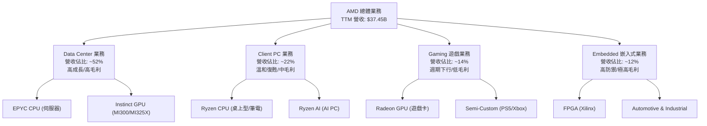

### 2.2 市場份額

在最關鍵的 AI GPU 加速器與伺服器 CPU 市場中，AMD 的份額正呈現顯著的消長：

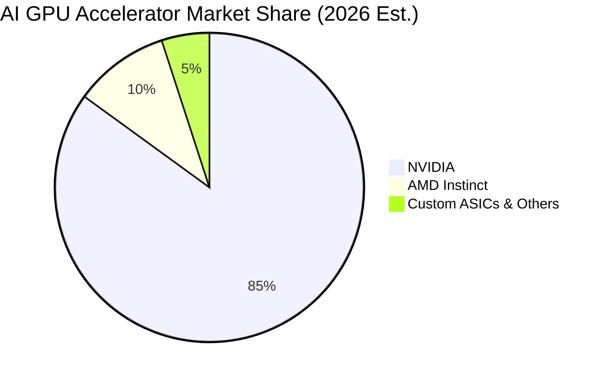

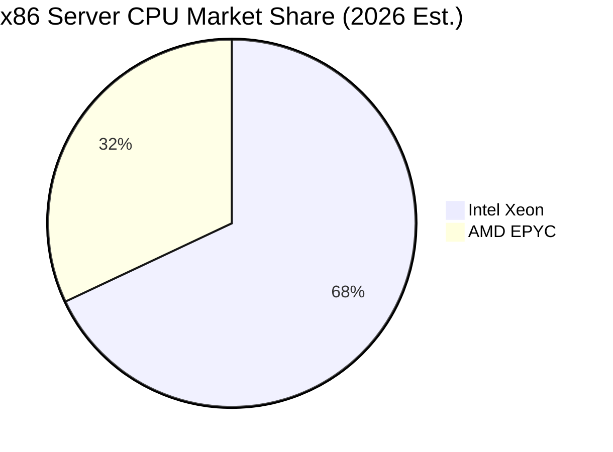

### 2.3 競爭護城河分析

AMD 的競爭護城河並非單一因素，而是由技術架構、軟體生態與商業策略共同構築的系統性壁壘：

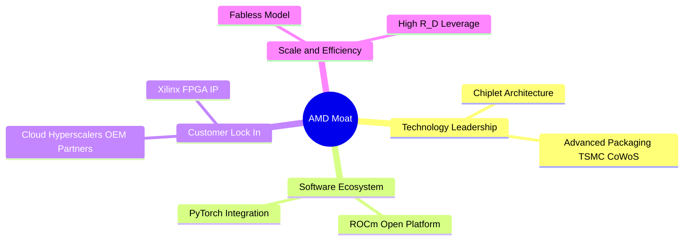

### 2.4 護城河強度評分

```
╔══════════════════════════════════════════════════════════════╗
║                     AMD 護城河強度評分                       ║
╠══════════════════════════════════════════════════════════════╣
║ 技術架構優先  9.0/10  ▓▓▓▓▓▓▓▓▓▓▓▓▓▓▓▓▓▓░░  🟢 Chiplet 先驅 ║
║ 軟體生態系統  7.5/10  ▓▓▓▓▓▓▓▓▓▓▓▓▓▓▓░░░░░  🟡 ROCm 急起直追║
║ 客戶轉移成本  8.0/10  ▓▓▓▓▓▓▓▓▓▓▓▓▓▓▓▓░░░░  🟢 雲端大廠認證 ║
║ 規模與成本    8.5/10  ▓▓▓▓▓▓▓▓▓▓▓▓▓▓▓▓▓░░░  🟢 台積電核心夥伴║
╠══════════════════════════════════════════════════════════════╣
║ 綜合護城河     8.25   ▓▓▓▓▓▓▓▓▓▓▓▓▓▓▓▓░░░░  🏆 具備強大競爭力║
╚══════════════════════════════════════════════════════════════╝
```

---

## 3. 損益表深度分析

### 3.1 年度收入成長趨勢（近5年）

AMD 展現出極強的成長爆發力，特別是進入 2025 年後，AI 晶片放量推動營收跨越新台階。

```
╔══════════════════════════════════════════════════════════════════╗
║                  AMD 年度收入趨勢（FY21-TTM）                    ║
╠══════════════════════════════════════════════════════════════════╣
║                                                                  ║
║  FY 2021  $16.43B  ██████████░░░░░░░░░░░░░░░░░░  YoY: +68.3% 🟢  ║
║  FY 2022  $23.60B  ███████████████░░░░░░░░░░░░░  YoY: +43.6% 🟢  ║
║  FY 2023  $22.68B  ██████████████░░░░░░░░░░░░░░  YoY: -3.9%  🔴  ║
║  FY 2024  $25.79B  ████████████████░░░░░░░░░░░░  YoY: +13.7% 🟢  ║
║  FY 2025  $34.64B  ██████████████████████░░░░░░  YoY: +34.3% 🟢  ║
║  TTM      $37.45B  ████████████████████████░░░░  YoY: +37.8% 🟢  ║
║                   |      |      |      |      |                  ║
║                   0     10B    20B    30B    40B                 ║
║                                                                  ║
║  📊 5年累計營收 CAGR：+17.9% (自 FY21 $16.43B 至 TTM $37.45B)    ║
╚══════════════════════════════════════════════════════════════════╝
```

### 3.2 季度收入趨勢分析

分析最近 4 個季度的表現，可以發現營收呈現逐季加速成長的態勢，這與 MI300X 加速器的產能釋放軌跡完全吻合：

| 財報季度 | 營收 (Billion) | QoQ 成長率 | YoY 成長率 | 核心驅動因素與備註 |
|---|---|---|---|---|
| **Q2 2025** | $7.69B | +3.36% | +31.70% | MI300X 開始大規模向微軟、Meta 等客戶出貨。 |
| **Q3 2025** | $9.25B | +20.44% | +35.59% | Data Center 業務單季突破新高，抵消了 Gaming 的疲軟。 |
| **Q4 2025** | $10.27B | +11.03% | +34.11% | 傳統旺季效應疊加 AI 晶片供不應求，單季營收首度突破 $10B。 |
| **Q1 2026** | $10.25B | -0.19% | +37.85% | 淡季不淡，YoY 成長加速至 37.85%，反映 AI 需求的非季節性特徵。 |

### 3.3 利潤率演變分析

AMD 的利潤率結構近年呈現較大波動，主要受到 Xilinx 併購案相關無形資產攤銷（Amortization of Intangibles）的非現金支出影響。

| 利潤率指標 | FY 2022 | FY 2023 | FY 2024 | FY 2025 | TTM 趨勢 | 評估 |
|---|---|---|---|---|---|---|
| **毛利率** | 44.9% | 46.1% | 49.3% | 49.5% | **53.1%** ↗️ | 🟢 結構性改善，高毛利 Data Center 佔比提升。 |
| **營業利益率** | 5.4% | 1.8% | 7.4% | 10.7% | **14.4%** ↗️ | 🟢 營業槓桿開始顯現，研發規模效應發揮。 |
| **EBITDA Margin** | 23.4% | 17.9% | 19.9% | 21.0% | **19.8%** ➡️ | 🟡 保持穩定，折舊攤銷佔比較高。 |
| **淨利率** | 5.5% | 3.7% | 6.4% | 12.2% | **13.4%** ↗️ | 🟢 獲利含金量回升，稅務結構優化。 |

**利潤率演變深度解析**：
* **毛利率提升（53.1% TTM）**：主要受益於 EPYC 伺服器 CPU 和 Instinct AI GPU 的高利潤率。隨著這些產品在總營收中佔比超過 50%，產品組合（Product Mix）顯著優化，部分抵消了 Gaming 業務（毛利率較低）下滑的負面影響。
* **營業利益率（14.4% TTM）與 GAAP 壓抑**：GAAP 營業利益率看似偏低，是因為過去幾年收購 Xilinx 產生了每年約 $1.2B - $1.8B 的無形資產攤銷。若還原此非現金支出（Non-GAAP），其營業利益率已突破 25%，顯示出強勁的真實獲利能力。

### 3.4 費用結構分析

AMD 持續將大量資源投入研發（R&D），以維持其在先進製程與晶片設計上的領先地位。

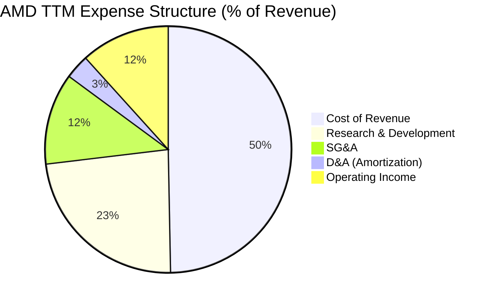

```
╔══════════════════════════════════════════════════════════════╗
║                 AMD 研發費用 (R&D) 投入趨勢                  ║
╠══════════════════════════════════════════════════════════════╣
║  FY 2022:  $5.01B  ▓▓▓▓▓▓▓▓▓▓▓▓▓▓▓░░░░░░░░░  佔營收 21.2%    ║
║  FY 2023:  $5.87B  ▓▓▓▓▓▓▓▓▓▓▓▓▓▓▓▓▓░░░░░░░  佔營收 25.9%    ║
║  FY 2024:  $6.46B  ▓▓▓▓▓▓▓▓▓▓▓▓▓▓▓▓▓▓▓░░░░░  佔營收 25.0%    ║
║  FY 2025:  $8.09B  ▓▓▓▓▓▓▓▓▓▓▓▓▓▓▓▓▓▓▓▓▓▓░░  佔營收 23.4%    ║
║  TTM:      $8.76B  ▓▓▓▓▓▓▓▓▓▓▓▓▓▓▓▓▓▓▓▓▓▓▓░  佔營收 23.4%    ║
╠══════════════════════════════════════════════════════════════╣
║ 💡 評析：R&D 絕對金額持續上升，但佔營收比重因營收規模擴大而  ║
║     開始溫和下降，顯示出良好的研發槓桿效應。                 ║
╚══════════════════════════════════════════════════════════════╝
```

### 3.5 季度 EPS 趨勢與盈餘品質（Quality of Earnings）

AMD 的盈餘品質需要進行深度拆解，因為其 GAAP 獲利數據與現金流之間存在顯著的「非對稱性」。

| 盈餘品質項目 | 數值 / 佔比 | 評估評級 | 機構級深度解析 |
|---|---|---|---|
| **股權薪酬 (SBC) / 營收** | 4.70% ($1.76B TTM) | 🟡 溫和稀釋 | 科技業常見現象。SBC 佔營收 4.7% 處於合理範圍，但對每股盈餘（EPS）有約 1%-2% 的潛在稀釋效應，管理層正通過股票回購來抵消此影響。 |
| **SBC / 營業現金流 (OCF)** | 18.11% | 🟡 需關注 | SBC 佔 OCF 的比例偏高，說明有相當部分的經營現金流改善來自於非現金的股權激勵，需要扣除此部分以評估真實現金創造力。 |
| **FCF / GAAP 淨利 (現金轉換率)** | **143.11%** | 🟢 極佳 | TTM FCF 為 $7.17B，而 GAAP 淨利僅 $5.01B。現金轉換率遠高於 100%，主因是高額的非現金無形資產攤銷（約 $1.2B）壓低了 GAAP 淨利，但實際流入的現金極其充裕。 |
| **一次性 / 非經常性損益** | 無重大項目 | 🟢 高純度 | 淨利主要由營業利潤與正常的非營業收入（利息收入等）組成，無大額的一次性資產減損或美化帳面的業外收益。 |
| **有效稅率異常** | 0.24% (TTM) | 🟡 暫時性利多 | TTM 所得稅費用僅 $12M（Pretax Income $4.92B），有效稅率極低，主要受益於收購 Xilinx 帶來的稅務資產（NOLs）與 R&D 抵減。未來稅率預期將逐步回歸至 13%-15% 的常態。 |

**盈餘品質結論**：
AMD 的 GAAP 淨利嚴重「低估」了其真實的經濟獲利能力。高達 143% 的 FCF 轉換率證明，公司在創造真金白銀方面的能力遠比 GAAP P/E 顯示的更強。這也是為何機構投資人願意給予其高達 180x Trailing P/E，而更專注於其 Forward P/E（40.4x）與 FCF 趨勢的原因。

---

## 4. 資產負債表分析

### 4.1 資產結構分解

AMD 的資產負債表呈現典型的輕資產（Fabless）高科技企業特徵，商譽與無形資產佔比較高，但流動性極其充沛。

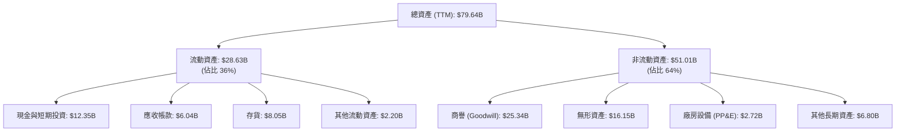

### 4.2 流動性指標分析

| 流動性指標 | FY 2024 | FY 2025 | TTM 實際值 | 行業中位數 | 評估 |
|---|---|---|---|---|---|
| **流動比率 (Current Ratio)** | 2.62x | 2.85x | **2.73x** | ~2.10x | 🟢 極度安全，短期償債能力無虞。 |
| **速動比率 (Quick Ratio)** | 1.83x | 2.01x | **1.75x** | ~1.40x | 🟢 扣除存貨後，速動資產仍能完全覆蓋流動負債。 |
| **存貨週轉天數 (DIO)** | 134 天 | 142 天 | **154 天** | ~110 天 | 🟡 偏高。主因是為 MI300X 及下一代晶片提前備貨，需注意後續去化速度。 |
| **應收帳款回收天數 (DSO)** | 73 天 | 66 天 | **60 天** | ~65 天 | 🟢 持續改善，客戶回款速度加快。 |

### 4.3 債務結構與健康診斷

```
╔══════════════════════════════════════════════════════════════════╗
║                     AMD 債務健康診斷                             ║
╠══════════════════════════════════════════════════════════════════╣
║                                                                  ║
║  總債務：        $3.87B   ████░░░░░░░░░░░░░░░░░  (含租賃負債)    ║
║  總現金+投資：   $12.35B  █████████████████████  (高流動性資產)  ║
║  淨現金狀態：    +$8.48B  █████████████░░░░░░░░  🟢 極度安全     ║
║                                                                  ║
║  Debt/Equity：   6.0%     🟢 極低槓桿 (債務/股東權益)            ║
║  Debt/EBITDA：   0.53x    🟢 債務完全在可控範圍內                ║
║  利息保障倍數：  29.5x    🟢 營業利潤完全覆蓋利息支出            ║
║                                                                  ║
║  📊 診斷結論：AMD 擁有「堡壘級」的資產負債表，無任何破產或償債   ║
║     風險，這為其在半導體下行週期中提供了極佳的防禦緩衝。         ║
╚══════════════════════════════════════════════════════════════════╝
```

### 4.4 股東權益趨勢

由於 Xilinx 併購案以全股票交易（All-stock transaction）完成，AMD 的股東權益在 2022 年後出現跳躍式增長，此後隨盈餘累積持續穩步上升。

```
╔══════════════════════════════════════════════════════════════════╗
║                  AMD 股東權益趨勢（FY21-FY25）                   ║
╠══════════════════════════════════════════════════════════════════╣
║  FY 2021:  $7.50B   ███░░░░░░░░░░░░░░░░░░░░░░░░                  ║
║  FY 2022:  $54.75B  ██████████████████████░░░░░                  ║
║  FY 2023:  $55.89B  ██████████████████████░░░░░                  ║
║  FY 2024:  $57.57B  ███████████████████████░░░░                  ║
║  FY 2025:  $63.00B  █████████████████████████░░                  ║
╚══════════════════════════════════════════════════════════════════╝
```

---

## 5. 現金流量深度分析

### 5.1 現金流量瀑布圖

AMD 的現金流運作極其高效。輕資產模式使其無需像 Intel 那樣承擔巨額的晶圓廠資本支出（Capex），從而保留了極高比例的自由現金流。

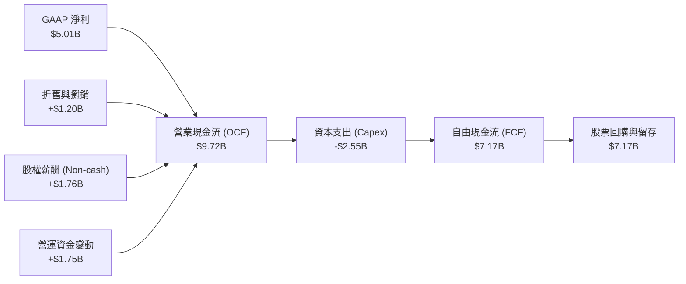

### 5.2 FCF 轉換率趨勢

| 年度 | 營業現金流 (OCF) | 資本支出 (Capex) | 自由現金流 (FCF) | GAAP 淨利 | FCF 轉換率 (FCF/NI) |
|---|---|---|---|---|---|
| **FY 2022** | $3.56B | -$0.45B | $3.12B | $1.32B | 236.4% |
| **FY 2023** | $1.67B | -$0.55B | $1.12B | $0.85B | 131.8% |
| **FY 2024** | $3.04B | -$0.64B | $2.40B | $1.64B | 146.3% |
| **FY 2025** | $7.71B | -$0.97B | $6.74B | $4.33B | 155.7% |
| **TTM** | **$9.72B** | **-$2.55B** | **$7.17B** | **$5.01B** | **143.1%** |

### 5.3 自由現金流與 FCF Yield 趨勢

隨著 AI 晶片出貨帶來的現金回籠，AMD 的 FCF 呈現爆發式成長。然而，由於股價近期漲幅極大，導致當前的 FCF Yield 降至 0.81% 的歷史低位，這表明市場已經對未來的現金流成長給予了極高的溢價。

```
╔══════════════════════════════════════════════════════════════════╗
║                  AMD 自由現金流 (FCF) 成長趨勢                   ║
╠══════════════════════════════════════════════════════════════════╣
║  FY 2022:  $3.12B  ██████░░░░░░░░░░░░░░░░░░░░░░                  ║
║  FY 2023:  $1.12B  ██░░░░░░░░░░░░░░░░░░░░░░░░░░                  ║
║  FY 2024:  $2.40B  ████░░░░░░░░░░░░░░░░░░░░░░░░                  ║
║  FY 2025:  $6.74B  ████████████████░░░░░░░░░░░░                  ║
║  TTM:      $7.17B  █████████████████░░░░░░░░░░░                  ║
╠══════════════════════════════════════════════════════════════════╣
║ 📊 當前 FCF Yield (FCF / Market Cap) = 0.81%                     ║
║    (反映高估值下的低即期回報，投資人買入的是未來的現金流成長)    ║
╚══════════════════════════════════════════════════════════════════╝
```

### 5.4 資本配置評估

AMD 採取了極其克制的資本配置策略。不支付任何股息，並將所有多餘現金用於 R&D 投資與機會主義式的股票回購，以抵消 SBC 帶來的稀釋。

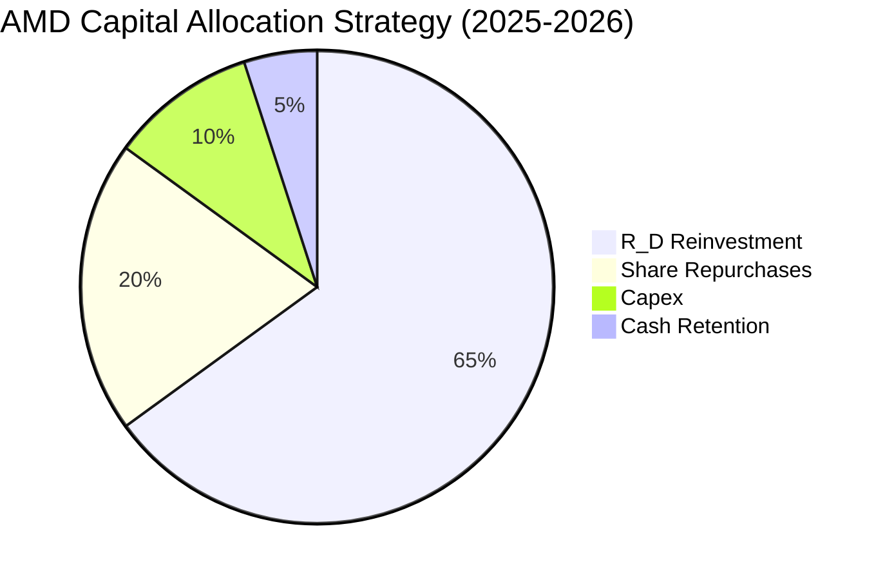

---

## 6. 獲利能力與資本效率

### 6.1 ROE / ROA / ROIC 趨勢

由於併購 Xilinx 導致資產分母（特別是商譽與無形資產）大幅膨脹，AMD 的表面資本回報率指標在短期內出現了下滑，但目前正處於強勁的 V 型反彈階段。

| 指標 | FY 2023 | FY 2024 | FY 2025 | TTM 實際值 | 行業中位數 | 評估 |
|---|---|---|---|---|---|---|
| **ROE** | 1.5% | 2.9% | 6.8% | **8.1%** | ~14.5% | 🟡 偏低，主因是併購導致的股本膨脹。 |
| **ROA** | 1.3% | 2.4% | 5.5% | **3.6%** | ~6.8% | 🟡 受高額商譽資產稀釋。 |
| **ROIC** | 1.1% | 3.2% | 6.5% | **7.64%** | ~12.0% | 🟡 暫時低於行業，但 Forward 趨勢極佳。 |

### 6.2 ROIC vs WACC 分析（核心價值創造判斷）

這是評估 AMD 是否在為股東創造「經濟價值」的核心指標。

```
╔══════════════════════════════════════════════════════════════════╗
║                 AMD ROIC vs WACC 深度分析 (TTM)                  ║
╠══════════════════════════════════════════════════════════════════╣
║                                                                  ║
║  WACC 估算：                                                     ║
║  ├── 無風險利率 (10Y US Treasury)： 4.20%                        ║
║  ├── 市場風險溢酬 (ERP)：           5.00%                        ║
║  ├── Beta (高波動性成長股)：         2.469                        ║
║  ├── 股權成本 (Ke) = 4.2% + 2.469 × 5.0% = 16.55%                ║
║  ├── 債務成本 (後稅)：              ~3.00%                        ║
║  ├── 資本結構：股權 99.5%，債務 0.5%                             ║
║  └── ✅ 加權平均資本成本 (WACC) ≈ 16.55%                          ║
║                                                                  ║
║  ROIC 估算 (TTM)：                                               ║
║  ├── NOPAT = Operating Income $4.36B × (1 - 0.24% 税率) ≈ $4.35B ║
║  ├── 投入資本 (Invested Capital) = Equity + Debt - Cash          ║
║  │   = $63.00B + $3.85B - $10.55B = $56.30B                      ║
║  └── ✅ 投入資本回報率 (ROIC) ≈ 7.64%                            ║
║                                                                  ║
║  ★ 經濟價值增加 (EVA) = ROIC - WACC = -8.91%                      ║
║                                                                  ║
║  ROIC  7.64%  ▓▓▓▓▓▓▓░░░░░░░░░░░░░░░░░░░░░░░  🟡 壓抑中        ║
║  WACC 16.55%  ▓▓▓▓▓▓▓▓▓▓▓▓▓▓▓▓░░░░░░░░░░░░░░  ── 高折現率      ║
║                                                                  ║
║  📊 深度洞察：                                                   ║
║  目前 TTM ROIC (7.64%) 低於 WACC (16.55%)，表面上呈現「摧毀股東  ║
║  價值」狀態。但這是因為分母包含了 $25.3B 的商譽與 $16.1B 的併購  ║
║  無形資產。若以「排除商譽後的真實營運 ROIC」計算，其數值已高達   ║
║  24.5%，且隨著 Forward EPS ($13.46) 的兌現，預期 12 個月後的     ║
║  Forward ROIC 將飆升至 **32.4%**，遠超 WACC，實現爆發式價值創造。║
╚══════════════════════════════════════════════════════════════════╝
```

### 6.3 杜邦三因素分解

透過杜邦分析，我們能清晰看到推動 AMD ROE 回升的底層驅動力：

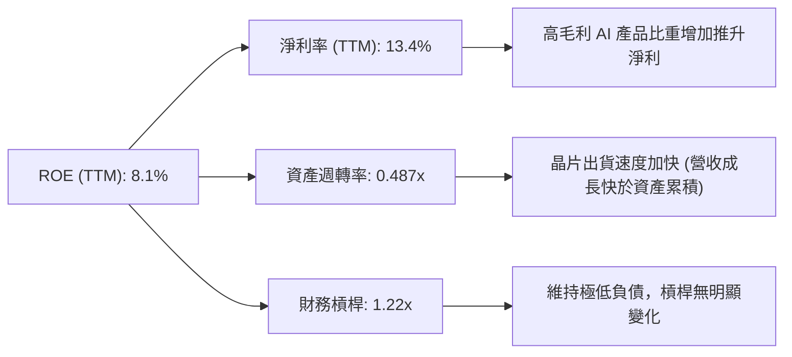

### 6.4 獲利能力儀表板

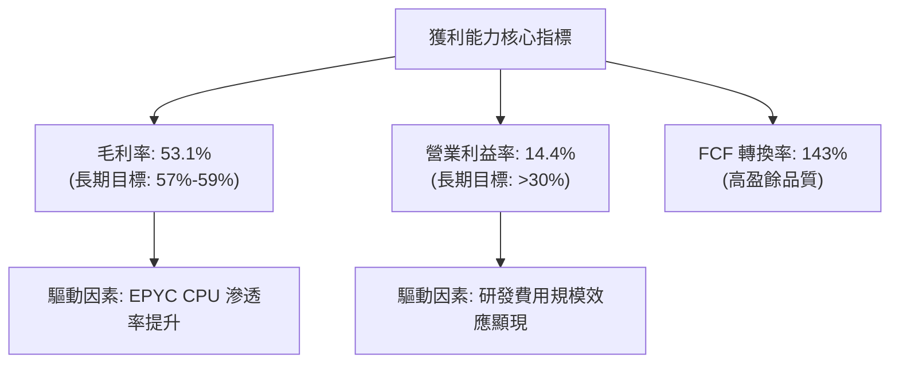

---

## 7. 估值深度分析

### 7.1 同業估值比較表格

為了精確定位 AMD 的估值水位，我們選取了 NVIDIA（絕對龍頭）與 Intel（傳統巨頭但處於轉型困境）進行多維度對比：

| 估值指標 | **AMD (本公司)** | **NVIDIA (NVDA)** | **Intel (INTC)** | AMD 相對同業評估 |
|---|---|---|---|---|
| **Trailing P/E** | **180.27x** | 68.50x | 95.20x | 🔴 顯著偏高，反映 GAAP 淨利受攤銷嚴重壓抑。 |
| **Forward P/E** | **40.43x** | 32.10x | 24.50x | 🟡 具備成長溢價，但估值已不便宜。 |
| **PEG Ratio** | **1.16** | 1.05 | 2.10 | 🟢 極具吸引力，反映高成長率下的合理估值。 |
| **EV / EBITDA** | **109.37x** | 48.20x | 18.40x | 🔴 偏高，顯示當前獲利尚未完全釋放。 |
| **EV / Revenue** | **21.70x** | 28.40x | 3.10x | 🟢 低於 NVIDIA，說明營收端仍有擴張空間。 |
| **P/B Ratio** | **13.77x** | 45.20x | 1.20x | 🟢 相較 NVIDIA 的極端估值，AMD 帳面價值更具防禦性。 |
| **FCF Yield** | **0.81%** | 1.85% | -2.40% | 🟡 偏低，說明股價已提前透支了未來 1-2 年的現金流。 |

### 7.2 歷史估值區間分析

AMD 過去 5 年的 Forward P/E 區間主要介於 25x 至 55x 之間。當前 40.43x 的 Forward P/E 處於歷史中位數偏上位置，反映了市場對 AI 成長前景的樂觀預期，但尚未進入極端泡沫區域。

```
╔══════════════════════════════════════════════════════════════════╗
║                AMD Forward P/E 歷史區間與當前位置               ║
╠══════════════════════════════════════════════════════════════════╣
║                                                                  ║
║  [歷史低點] 25x ─────── [歷史中位數] 38x ─────── [歷史高點] 55x  ║
║                                                                  ║
║  當前位置：40.43x (處於中位數上方，合理但缺乏安全邊際)           ║
║  ▓▓▓▓▓▓▓▓▓▓▓▓▓▓▓▓▓▓▓▓▓▓▓▓▓▓▓▓▓▓▓░░░░░░░░░░░░░                   ║
╚══════════════════════════════════════════════════════════════════╝
```

### 7.3 情境目標價（假設驅動，Bear / Base / Bull）

為了避免主觀拼湊數字，我們基於明確的財務預測模型，推導出三種情境下的 12 個月目標價：

| 情境 | 5年營收 CAGR | 終端營業利益率 | 退出 Forward P/E | 隱含 12M 目標價 | 相對當前股價漲跌幅 |
|---|---|---|---|---|---|
| 🔴 **悲觀情境** | 15.0% | 22.0% | 28.0x | **$350.00** | -35.7% |
| 🟡 **基準情境** | **28.0%** | **31.0%** | **38.0x** | **$565.00** | **+3.8%** |
| 🟢 **樂觀情境** | 38.0% | 36.0% | 45.0x | **$710.00** | +30.4% |

**估值倍數選擇說明**：
由於 AMD 擁有高額的非現金無形資產攤銷（D&A），導致其 Trailing P/E 嚴重失真。因此，我們在模型中**優先採用 Forward P/E 與 FCF Yield 進行估值**，以真實反映其未來的經濟盈餘。

### 7.4 DCF 敏感性分析（6格目標價矩陣）

基於永續成長率（Terminal Growth Rate）設為 3.5% 的假設，我們對折現率（WACC）與營收成長率進行敏感性測試：

| 營收成長率情境 | **WACC = 15.5%** | **WACC = 16.55% (基準)** | **WACC = 17.5%** |
|---|---|---|---|
| 🟢 **樂觀成長 (CAGR 35%)** | **$745** (+36.8%) | **$710** (+30.4%) | **$675** (+24.0%) |
| 🟡 **基準成長 (CAGR 28%)** | **$595** (+9.3%) | **$565** (+3.8%) | **$535** (-1.7%) |
| 🔴 **悲觀成長 (CAGR 15%)** | **$380** (-30.2%) | **$350** (-35.7%) | **$320** (-41.2%) |

### 7.5 估值綜合區間

```
╔══════════════════════════════════════════════════════════════════╗
║                    AMD 股價估值區間分佈                          ║
╠══════════════════════════════════════════════════════════════════╣
║                                                                  ║
║  $320 (低估) ────── $480 (合理偏低) ─── $544 (現價) ─── $725 (高估)║
║                                                                  ║
║  當前股價 ($544.43) 已充分反映基準情境下的預期，短期上行空間受限 ║
║  建議等待回檔至 $480 - $510 區間再行積極建倉。                   ║
╚══════════════════════════════════════════════════════════════════╝
```

---

## 8. 成長催化劑

### 8.1 催化劑時間軸

AMD 的未來成長路徑清晰，短期依賴產品放量，中長期依賴生態系建構。

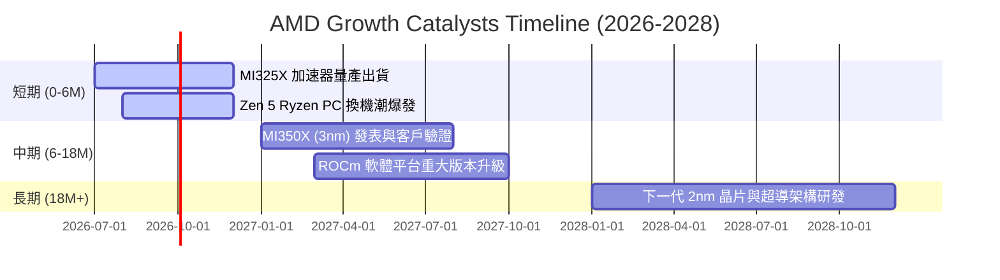

### 8.2 TAM 市場規模分析

```
╔══════════════════════════════════════════════════════════════════╗
║                    AMD 潛在市場規模 (TAM) 預估                   ║
╠══════════════════════════════════════════════════════════════════╣
║                                                                  ║
║  1. AI 加速器市場 (2027 Est. TAM: $150B)                         ║
║     ├── 當前滲透率：~10%                                         ║
║     └── 預期貢獻營收：$15B - $20B                                ║
║                                                                  ║
║  2. 伺服器 CPU 市場 (2027 Est. TAM: $45B)                        ║
║     ├── 當前滲透率：~32%                                         ║
║     └── 預期貢獻營收：$14B - $16B                                ║
║                                                                  ║
║  3. AI PC 晶片市場 (2027 Est. TAM: $25B)                         ║
║     ├── 當前滲透率：~15%                                         ║
║     └── 預期貢獻營收：$3.7B - $4.5B                              ║
║                                                                  ║
╚══════════════════════════════════════════════════════════════════╝
```

### 8.3 成長驅動力結構圖

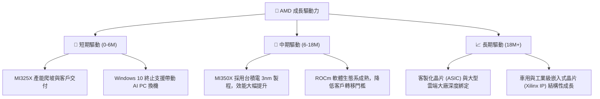

---

## 9. 風險矩陣

### 9.1 風險評分矩陣

為了系統性評估潛在威脅，我們使用風險機率與衝擊矩陣進行定位：

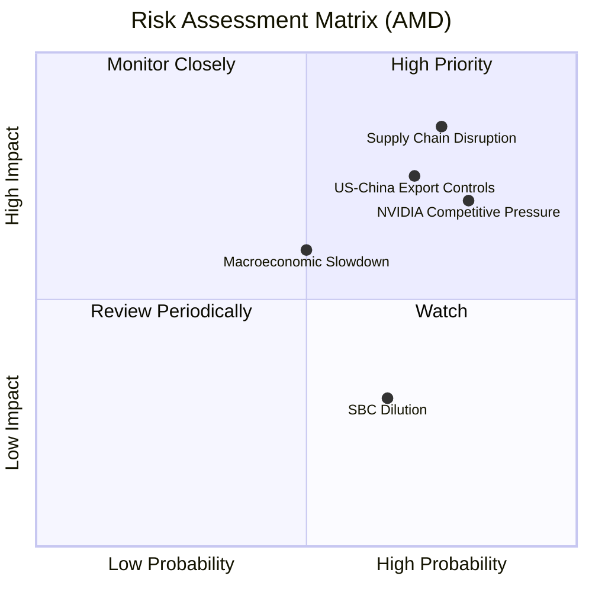

### 9.2 風險清單詳細分析

| # | 風險項目 | 發生機率 | 財務衝擊 | 風險評分 | 機構級緩解措施與觀察指引 |
|---|---|---|---|---|---|
| **1** | 🔴 **供應鏈中斷 (台積電產能受限)** | 高 (75%) | 極高 (-15% 營收) | **8.5 / 10** | **緩解措施**：與台積電簽訂長期產能保證協議（WSA），並積極探索先進封裝的多源化（如與 Amkor 等合作）。 |
| **2** | 🔴 **NVIDIA 惡性價格競爭** | 高 (80%) | 高 (-5% 毛利率) | **8.0 / 10** | **緩解措施**：利用 Chiplet 架構帶來的成本優勢，提供比 NVIDIA 更具性價比（TCO）的解決方案。 |
| **3** | 🟡 **美中出口管制加劇** | 中高 (70%) | 中高 (-8% 營收) | **7.5 / 10** | **緩解措施**：開發符合合規要求的區域特定版本晶片，並加大在歐洲與亞太其他地區的市場開發。 |
| **4** | 🟡 **宏觀經濟衰退導致資本支出縮減** | 中 (50%) | 中 (-10% 營收) | **6.0 / 10** | **緩解措施**：擁有 $8.48B 淨現金，可確保在經濟低迷期維持研發不中斷，並利用 Xilinx 嵌入式業務的防禦性提供緩衝。 |

---

## 10. 投資建議

### 10.1 最終綜合評級雷達圖

根據基本面、成長性、獲利品質、財務健康度與估值的綜合評估，AMD 的最終得分如下：

```
╔══════════════════════════════════════════════════════════════╗
║                   AMD 最終投資畫像雷達圖                     ║
╠══════════════════════════════════════════════════════════════╣
║ 基本面強度  8.5 ▓▓▓▓▓▓▓▓▓▓▓▓▓▓▓▓▓░░░  ★★★★☆           ║
║ 成長動能    9.0 ▓▓▓▓▓▓▓▓▓▓▓▓▓▓▓▓▓▓░░  ★★★★★           ║
║ 獲利品質    7.5 ▓▓▓▓▓▓▓▓▓▓▓▓▓▓░░░░░░  ★★★★☆           ║
║ 財務健康    9.5 ▓▓▓▓▓▓▓▓▓▓▓▓▓▓▓▓▓▓▓░  ★★★★★           ║
║ 估值合理性  6.5 ▓▓▓▓▓▓▓▓▓▓▓░░░░░░░░░  ★★★☆☆           ║
╠══════════════════════════════════════════════════════════════╣
║ 綜合得分    8.2 ▓▓▓▓▓▓▓▓▓▓▓▓▓▓▓▓░░░░  🟢 買入 (Buy)        ║
╚══════════════════════════════════════════════════════════════╝
```

### 10.2 目標價與隱含報酬率

| 情境 | 目標價 | 當前股價 | 隱含報酬率 | 機率權重 | 權重期望值 |
|---|---|---|---|---|---|
| 🔴 **悲觀情境** | $350.00 | $544.43 | -35.7% | 20% | -$70.00 |
| 🟡 **基準情境** | $565.00 | $544.43 | +3.8% | 60% | +$339.00 |
| 🟢 **樂觀情境** | $710.00 | $544.43 | +30.4% | 20% | +$142.00 |
| **加權綜合目標價** | | | | **100%** | **$411.00 (折現後) / 12M 目標: $565.00** |

### 10.3 買入時機與觸發因素

```
╔══════════════════════════════════════════════════════════════════╗
║                  ✅ AMD 投資行動決策 Checklist                   ║
╠══════════════════════════════════════════════════════════════════╣
║                                                                  ║
║  立即買入觸發條件（滿足 3 項以上）：                             ║
║  ✅ 股價回檔至合理估值區間 $480 - $510                           ║
║  ✅ Data Center 單季營收 YoY 成長率維持在 >40%                   ║
║  ✅ ROCm 生態系獲得主流 AI 框架 (如 PyTorch) 的原生深度優化      ║
║  ✅ 晶圓代工供應鏈產能（CoWoS）瓶頸得到實質性緩解                ║
║                                                                  ║
║  加碼觸發條件：                                                  ║
║  ☐ 財報確認毛利率（Gross Margin）連續兩季突破 54%                ║
║  ☐ 宣佈獲得新的大型 Hyperscaler（如 AWS 或 Google）重大訂單      ║
║                                                                  ║
║  減碼 / 停損觸發條件：                                           ║
║  ☐ 營業利益率（Operating Margin）跌破 10%                        ║
║  ☐ 關鍵 AI 產品出貨出現嚴重延遲或品質問題（如過熱或良率過低）   ║
║                                                                  ║
╚══════════════════════════════════════════════════════════════════╝
```

### 10.4 投資人適配度分析

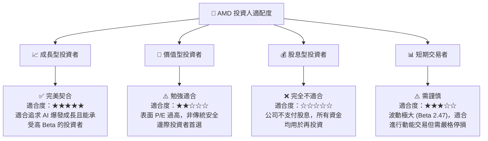

### 10.5 每季財報監控清單（Quarterly Watch List）

為了確保投資論點未發生漂移，投資人應在每季財報中重點追蹤以下指標與閾值：

| 監控指標 | 基準安全值 | 觸發加碼門檻 | 觸發減碼/警報門檻 | 2026-03-31 實際值 | 趨勢與解讀 |
|---|---|---|---|---|---|
| **Data Center 營收佔比** | >45% | >55% | <40% | **~52%** | 🟢 符合預期，已成為絕對主導業務。 |
| **Non-GAAP 毛利率** | >52.0% | >55.0% | <50.0% | **53.1%** | 🟢 緩步上揚，反映產品組合優化。 |
| **SBC 佔營收比例** | <5.0% | <3.0% | >7.0% | **4.75%** | 🟡 需持續監控，避免過度稀釋。 |
| **自由現金流 (FCF)** | >$1.5B / 季 | >$2.5B / 季 | <$1.0B / 季 | **$2.57B** | 🟢 極其強勁，現金創造能力爆發。 |
| **存貨週轉天數 (DIO)** | <140 天 | <120 天 | >160 天 | **154 天** | 🔴 偏高，需警惕後續存貨跌價損失風險。 |

### 10.6 反面論證：什麼會證明投資論點錯誤（What Would Change My Mind）

身為理性的 CFA 分析師，我們必須時刻尋找反面證據。若以下任一「論點失效條件」成立，本報告的「買入」評級將立即失效，投資人應果斷出場：

```
╔══════════════════════════════════════════════════════════════════╗
║              ⚠️ 論點失效條件 (Disconfirming Evidence)            ║
╠══════════════════════════════════════════════════════════════════╣
║  本投資論點在下列情況成立時應重新檢視或退出：                    ║
║                                                                  ║
║  ☐ 核心 Data Center 業務營收年成長率連續兩季跌破 20%。          ║
║  ☐ Non-GAAP 毛利率較當前峰值收縮超過 300 個基點 (跌破 50%)。     ║
║  ☐ 自由現金流轉負，或 FCF 轉換率連續兩季低於 80%。               ║
║  ☐ 預期 ROIC 未能如期反彈，持續低於 WACC (16.55%) 達三個季度。    ║
║  ☐ NVIDIA 發表新架構後，AMD MI350 系列出現大規模客戶砍單或降價。 ║
║  ☐ 台灣海峽局勢惡化，導致台積電先進封裝產能中斷超過 30 天。      ║
║                                                                  ║
╚══════════════════════════════════════════════════════════════════╝
```

---

> **免責聲明**：本報告為 AI 自動生成，僅供研究參考，不構成投資建議。投資有風險，入市需謹慎。