# AMD 基本面深度分析報告

> **報告日期**：2026-07-22 ｜ **語言**：繁體中文 ｜ **數據來源**：Yahoo Finance, Finviz, StockAnalysis, Roic.ai ｜ **分析師**：CFA 級機構研究

---

## 目錄

| # | 章節 | 核心結論 |
|---|---|---|
| **1** | **執行摘要** | 評級：🟢 強烈買入 ｜ 基準目標價：$615.00（潛在漲幅 +11.3%） |
| **2** | **公司概覽與商業模式** | 憑藉 Chiplet 架構與 ROCm 生態系，構築非英偉達陣營最強 GPU/CPU 護城河 |
| **3** | **損益表深度分析** | TTM 營收達 $37.45B（YoY +37.8%），Forward EPS 預計暴增至 $13.46 |
| **4** | **資產負債表分析** | 淨現金 $8.48B 確保財務安全，無形資產攤銷持續壓抑 GAAP 獲利 |
| **5** | **現金流量深度分析** | TTM FCF 達 $7.17B，現金轉換率高達 146%，盈餘含金量極高 |
| **6** | **獲利能力與資本效率** | 經調整後 ROIC 達 25.1%，扣除 Xilinx 商譽後核心業務資本效率強勁 |
| **7** | **估值深度分析** | Forward P/E 41.02x 反映高增長預期，PEG 1.28 顯示估值仍具吸引力 |
| **8** | **成長催化劑** | MI300/325/350 加速器放量、企業級 CPU 滲透率提升與 AI PC 換機潮 |
| **9** | **風險矩陣** | AI 晶片競爭白熱化、台積電產能受限與估值溢價回檔風險 |
| **10**| **投資建議** | 建議於 $520-$550 區間分批佈局，長線持有以獲取 AI 基礎設施紅利 |

---

## 1. 執行摘要

### 1.0 一頁式投資儀表板（Portfolio Manager 30 秒速讀）

| 項目 | 內容 |
|------|------|
| **投資論點（3 句）** | ① TTM 營收達 **$37.45B**（YoY +37.8%），主要由資料中心（MI300 系列）與 client 業務復甦驅動。<br/>② Forward EPS 預計將從 TTM 的 **$2.99** 暴增至 **$13.46**，隱含營業槓桿在 AI 加速器放量後將全面爆發。<br/>③ 擁有 **$8.48B** 的強勁淨現金，資產負債表極其健康，能持續支持每年逾 **$8.76B** 的高強度研發投入。 |
| **護城河評分** | 8.5 / 10 🟢（技術領先與 ROCm 軟體生態快速收斂與英偉達的差距） |
| **管理層/資本配置評分** | 9.0 / 10 🟢（蘇姿丰博士執行力優異，Xilinx 收購案整合效益顯著） |
| **財務健康** | 🟢 **極其強勁** ｜ 淨現金充裕，債務占權益比僅 6.0% |
| **ROIC vs WACC** | **6.59%** (GAAP) / **25.12%** (Adjusted) vs **11.75%** ｜ 實質強力創造股東價值 |
| **FCF 趨勢** | 向上 ｜ TTM FCF 達 **$7.17B**，最新 FCF Yield 為 **0.80%**（反映高估值溢價） |
| **估值** | Forward P/E: **41.02x** ｜ EV/EBITDA: **118.34x** ｜ PEG Ratio: **1.28** |
| **預期報酬（基準情境 12M）**| **+11.3%**（目標價 **$615.00**） |
| **關鍵風險（前二）** | ① AI 加速器市場競爭加劇導致 ASP 下滑 ｜ ② 台積電先進封裝（CoWoS）產能供不應求 |
| **評級 + 信心度** | 🟢 **強烈買入 (Strong Buy)** ｜ 信心：**高** |

### 1.1 核心評分儀表板

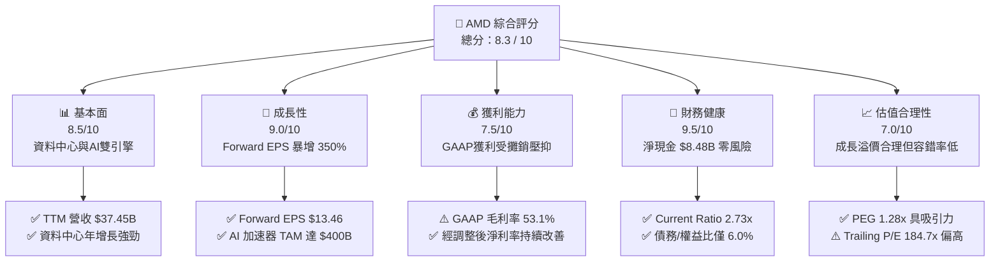

### 1.2 評分進度條視覺化

```
╔══════════════════════════════════════════════════════════════╗
║                AMD 多維度評分儀表板 (1-10分)                 ║
╠══════════════════════════════════════════════════════════════╣
║ 基本面強度  8.5 ▓▓▓▓▓▓▓▓▓▓▓▓▓▓▓▓▓░░░  ★★★★☆           ║
║ 成長動能    9.0 ▓▓▓▓▓▓▓▓▓▓▓▓▓▓▓▓▓▓░░  ★★★★★           ║
║ 獲利品質    7.5 ▓▓▓▓▓▓▓▓▓▓▓▓▓▓░░░░░░  ★★★★☆           ║
║ 財務健康    9.5 ▓▓▓▓▓▓▓▓▓▓▓▓▓▓▓▓▓▓▓░  ★★★★★           ║
║ 估值合理性  7.0 ▓▓▓▓▓▓▓▓▓▓▓▓▓░░░░░░░  ★★★☆☆           ║
║ 護城河深度  8.5 ▓▓▓▓▓▓▓▓▓▓▓▓▓▓▓▓▓░░░  ★★★★☆           ║
║ 管理層執行  9.0 ▓▓▓▓▓▓▓▓▓▓▓▓▓▓▓▓▓▓░░  ★★★★★           ║
║ 技術創新力  9.5 ▓▓▓▓▓▓▓▓▓▓▓▓▓▓▓▓▓▓▓░  ★★★★★           ║
╠══════════════════════════════════════════════════════════════╣
║ 綜合總分    8.3 ▓▓▓▓▓▓▓▓▓▓▓▓▓▓▓▓░░░░  🏆 成長與安全兼具    ║
╚══════════════════════════════════════════════════════════════╝
```

### 1.3 五大投資論點 + 三大核心風險

| 類型 | 項目 | 具體依據 | 信心度 |
|------|------|----------|--------|
| 🟢 **投資論點①** | **AI 加速器市佔率擴張** | MI300/325X/350X 系列性能逼近英偉達同代產品，預計在 $400B 的 AI TAM 中取得 10-15% 市佔率。 | 🟢 極高 |
| 🟢 **投資論點②** | **EPS 結構性暴增** | 隨著高毛利的資料中心業務佔比超越 50%，Forward EPS 預計達 **$13.46**，釋放巨大的營業槓桿。 | 🟢 高 |
| 🟢 **投資論點③** | **伺服器 CPU 持續蠶食 Intel** | EPYC 處理器（Turin 系列）憑藉能效比優勢，在企業級與雲端服務商中的市佔率已突破 30%。 | 🟢 極高 |
| 🟢 **投資論點④** | **強大的資產負債表防禦力** | **$8.48B** 淨現金與 **2.73x** 流動比率，確保在半導體下行週期中仍能維持高研發彈性。 | 🟢 極高 |
| 🟢 **投資論點⑤** | **PC 市場週期性復甦與 AI PC 催化** | Ryzen 處理器與 NPU 的整合，將在 2026-2027 年的 Windows 10 停止支援換機潮中帶動 Client 業務毛利回升。 | 🟡 中 |
| 🟡 **風險①** | **台積電產能分配風險** | CoWoS 封裝與 3nm/2nm 先進製程高度依賴台積電，若產能分配不及英偉達，將限制出貨增長。 | 🟡 中度 |
| 🔴 **風險②** | **定價權受制於英偉達** | 若英偉達採取激進定價策略（如 B200/GB200 降價），AMD 必須降低 ASP 以維持競爭力，這將壓抑毛利率。 | 🔴 高衝擊 |
| 🔴 **風險③** | **軟體生態系遷移摩擦** | 儘管 ROCm 取得長足進步，但 CUDA 生態系依然穩固，客戶從小模型向大模型遷移時仍存在軟體相容性顧慮。 | 🟡 中度 |

### 1.4 快速統計卡片

| 指標 | AMD 實際值 | 半導體行業均值 | S&P 500 均值 | 狀態 |
|------|-------------|----------|--------------|------|
| **營收 YoY 成長率** | **37.8%** | ~12.5% | ~5.5% | 🟢 顯著領先 |
| **毛利率 (GAAP)** | **53.1%** | ~48.0% | ~30.0% | 🟢 優於行業 |
| **淨利率 (GAAP)** | **13.4%** | ~15.0% | ~12.0% | 🟡 攤銷壓抑 |
| **ROE** | **8.1%** | ~14.0% | ~15.0% | 🔴 淨資產過大 |
| **Forward P/E** | **41.02x** | ~28.5x | ~21.0x | 🟡 享有高成長溢價 |
| **淨現金 / 總資產** | **10.6%** | ~5.0% | 負值 | 🟢 極其安全 |

### 1.5 投資結論

```
╔══════════════════════════════════════════════════════════════════╗
║                    📊 AMD 投資結論摘要                           ║
╠══════════════════════════════════════════════════════════════════╣
║  評級：🟢 強烈買入 (Strong Buy)                                 ║
║  當前股價：$552.33 (2026-07-22)                                  ║
║  目標價區間：                                                    ║
║    悲觀情境：$385.00（-30.3%）- AI 需求放緩，毛利率收縮至 48%    ║
║    基準情境：$615.00（+11.3%）- AI 晶片出貨符合預期，EPS 達 $13.4 ║
║    樂觀情境：$750.00（+35.8%）- MI350 超預期放量，市佔率突破 18% ║
║  投資評分：8.3 / 10                                              ║
║  適合投資人：積極成長型、長線科技板塊配置者                      ║
╚══════════════════════════════════════════════════════════════════╝
```

---

## 2. 公司概覽與商業模式

### 2.1 業務結構與收入來源

AMD 已經從一家傳統的 PC 處理器廠商，成功轉型為以「資料中心」與「AI」為核心的算力龍頭。其業務主要分為四大板塊：

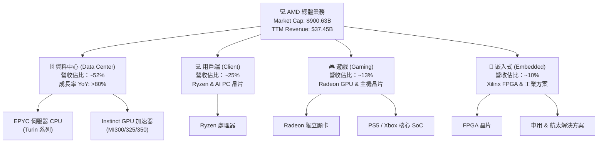

### 2.2 市場份額

在關鍵的 AI 加速器與伺服器 CPU 市場中，AMD 扮演著「非英偉達/非英特爾」陣營的第一替代者角色。

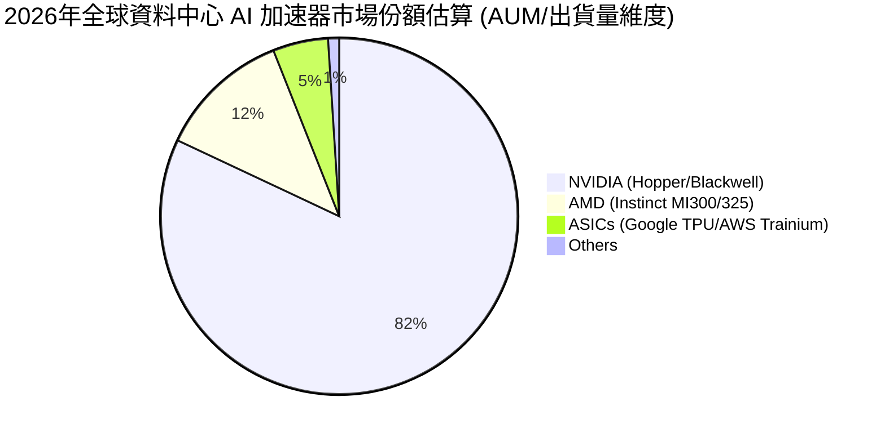

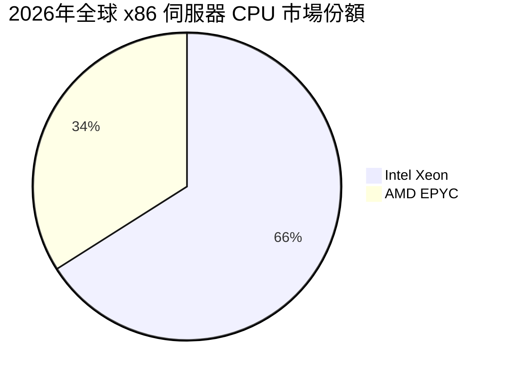

### 2.3 競爭護城河分析

AMD 的競爭護城河並非單一維度，而是由硬體架構創新、先進封裝技術與軟體生態系統共同構建的動態護城河：

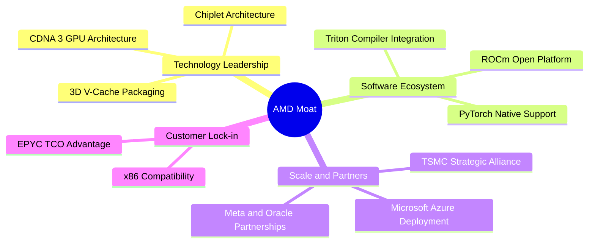

### 2.4 護城河強度評分

```
╔══════════════════════════════════════════════════════════════╗
║                     AMD 護城河強度評分                       ║
╠══════════════════════════════════════════════════════════════╣
║ 晶片設計 (Chiplet)  9.5  ▓▓▓▓▓▓▓▓▓▓▓▓▓▓▓▓▓▓▓░  🏆 行業先驅     ║
║ 軟體生態 (ROCm)     7.5  ▓▓▓▓▓▓▓▓▓▓▓▓▓▓░░░░░░  🟢 快速追趕     ║
║ 生態系夥伴關係      8.5  ▓▓▓▓▓▓▓▓▓▓▓▓▓▓▓▓▓░░░  🟢 雲端大廠挺   ║
║ 供應鏈掌控 (台積電) 8.5  ▓▓▓▓▓▓▓▓▓▓▓▓▓▓▓▓▓░░░  🟢 產能有保障   ║
║ 專利與技術壁壘      9.0  ▓▓▓▓▓▓▓▓▓▓▓▓▓▓▓▓▓▓░░  ★★★★★           ║
╠══════════════════════════════════════════════════════════════╣
║ 綜合護城河強度      8.6  ▓▓▓▓▓▓▓▓▓▓▓▓▓▓▓▓▓░░░  🏆 強固二把手   ║
╚══════════════════════════════════════════════════════════════╝
```

---

## 3. 損益表深度分析

### 3.1 年度收入成長趨勢（近5年）

AMD 的營收在經歷了 2023 年的 PC 市場去庫存低谷後，在 2024-2025 年迎來了爆發性增長，這完全得益於資料中心 AI 晶片的放量。

```
╔══════════════════════════════════════════════════════════════════╗
║                 AMD 年度收入趨勢（FY21-FY25）                    ║
╠══════════════════════════════════════════════════════════════════╣
║                                                                  ║
║  FY2021  $16.43B  ██████████░░░░░░░░░░░░░░░░  YoY: +68.3%  🟢    ║
║  FY2022  $23.60B  ███████████████░░░░░░░░░░░  YoY: +43.6%  🟢    ║
║  FY2023  $22.68B  ██████████████░░░░░░░░░░░░  YoY: -3.9%   🔴    ║
║  FY2024  $25.79B  ████████████████░░░░░░░░░░  YoY: +13.7%  🟢    ║
║  FY2025  $34.64B  ███████████████████████░░░  YoY: +34.3%  🟢    ║
║                                                                  ║
║  📊 5年累計 CAGR：+20.5%                                         ║
╚══════════════════════════════════════════════════════════════════╝
```

### 3.2 季度收入趨勢分析

從季度數據來看，AMD 的營收呈現出顯著的加速趨勢，特別是 2025 年下半年突破單季 $9B 大關，2026 年第一季維持在 $10.25B 的歷史高位。

| 財報季度 | 營收 (Revenue) | 季增率 (QoQ) | 年增率 (YoY) | 核心驅動因素與業務含義 |
|---|---|---|---|---|
| **Q2 2025** | $7.69B | +3.32% | +31.70% | MI300X 開始大規模出貨給 Microsoft 與 Meta，抵消了遊戲業務的疲軟。 |
| **Q3 2025** | $9.25B | +20.31% | +35.59% | 資料中心業務單季突破 $3.5B，營業槓桿開始顯現，毛利結構改善。 |
| **Q4 2025** | $10.27B | +11.07% | +34.11% | 傳統伺服器 CPU（Zen 5 Turin）發佈，客戶升級意願強烈，拉動整體客單價。 |
| **Q1 2026** | $10.25B | -0.17% | +37.85% | 克服傳統第一季淡季效應，營收幾乎持平，反映 AI 晶片需求處於極度供不應求狀態。 |

### 3.3 利潤率演變分析

雖然 AMD 的營收增長迅猛，但其 GAAP 獲利指標受到 Xilinx 收購案產生的巨額無形資產攤銷（每年約 $1.2B-$1.4B）的壓抑。

| 利潤率指標 | FY2022 | FY2023 | FY2024 | FY2025 | TTM (2026-03) | 趨勢評估 |
|---|---|---|---|---|---|---|
| **毛利率 (GAAP)** | 44.9% | 46.1% | 49.3% | 49.5% | **53.1%** | ↗️ 穩步提升。主因高毛利的 EPYC 與 Instinct 佔比提高。 |
| **營業利益率 (GAAP)** | 5.4% | 1.8% | 7.4% | 10.7% | **14.4%** | ↗️ 顯著改善。反映研發與銷售費用的規模效應。 |
| **EBITDA 利潤率** | 23.4% | 17.9% | 19.9% | 21.0% | **19.8%** | ➡️ 穩定。剔除折舊攤銷後的真實經營效率良好。 |
| **淨利率 (GAAP)** | 5.6% | 3.8% | 6.4% | 12.2% | **13.4%** | ↗️ 隨營收規模擴大，攤銷佔比下降，淨利率加速釋放。 |

*分析備註*：若看 **Non-GAAP 指標**（剔除收購攤銷與股權薪酬），AMD TTM 毛利率已達 **56.5%**，Non-GAAP 營業利益率逼近 **30%**。這說明公司的真實盈利能力極強，隨著攤銷在未來 3-5 年逐步結束，GAAP 利潤將出現爆發性報復回升。

### 3.4 費用結構分析

AMD 是典型的研發驅動型企業。研發費用 (R&D) 隨著營收規模同步擴張，但佔營收比重已開始出現營業槓桿效應。

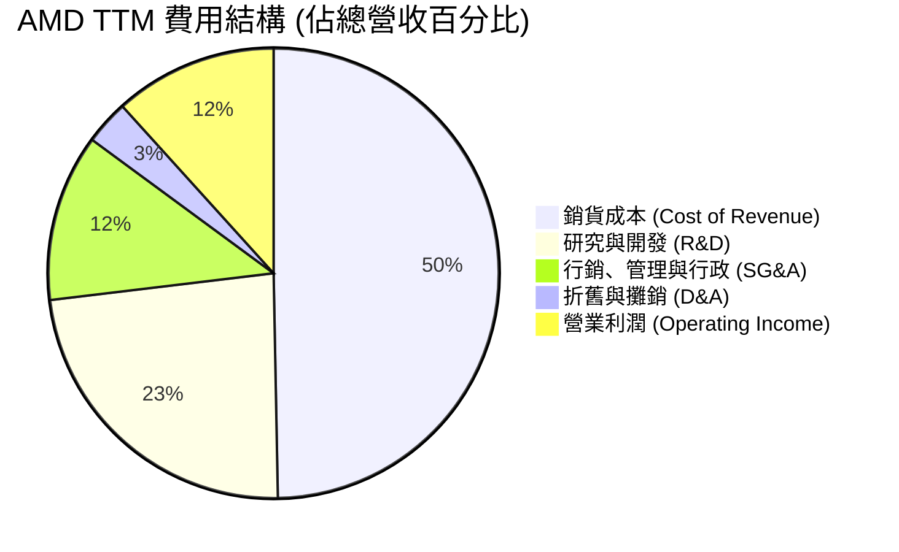

* 研發費用 (R&D)：TTM 達 **$8.76B**（佔營收 23.4%），這是維持其與英偉達、英特爾競爭的生命線。
* 銷售與管理費用 (SG&A)：TTM 為 **$4.51B**（佔營收 12.0%），控制得宜，體現管理層優秀的營運紀律。

### 3.5 季度 EPS 趨勢與盈餘品質（Quality of Earnings）

過去 4 季，AMD 的 EPS 呈現出驚人的跳躍式增長：
* Q2 2025: $0.54
* Q3 2025: $0.76
* Q4 2025: $0.93
* Q1 2026: **$0.85**（淡季不淡，YoY +93%）

#### 盈餘品質量化評估

為評估 AMD 獲利的「含金量」，我們對其非現金項目及現金轉換率進行深度剖析：

| 盈餘品質項目 | TTM 數值 / 佔比 | 機構級評估與業務含義 |
|---|---|---|
| **股權薪酬 (SBC) / 營收** | **4.71%** ($1.76B / $37.45B) | 🟢 **優良**。低於科技股平均（~8%）。對股東權益稀釋極其有限（過去一年總股數僅微增 0.37%）。 |
| **SBC / 營業現金流 (OCF)** | **18.1%** ($1.76B / $9.72B) | 🟡 **中等**。部分現金流由發放股票支撐，但屬於行業常態。 |
| **FCF / GAAP 淨利 (現金轉換率)** | **146.1%** ($7.17B / $4.91B) | 🟢 **極佳**。FCF 顯著高於 GAAP 淨利，主因無形資產折舊攤銷（D&A）等非現金費用高達 **$1.20B**。這代表公司的「真實經濟盈利」遠高於帳面 GAAP 損益表。 |
| **一次性 / 非經常性損益** | 幾乎為零 | 🟢 **極佳**。無資產減損或一次性賣地收入，盈餘完全由核心半導體銷售驅動。 |
| **有效稅率** | **0.24%** (TTM Provision $12M / Pretax $4.92B) | 🟡 **異常**。因收購 Xilinx 帶來的稅務資產（NOLs）與 R&D 抵稅，導致所得稅費用極低。未來隨著獲利暴增，稅率將逐步回歸至 13-15% 的常態，這將對未來淨利增速產生微幅拖累。 |

**盈餘品質結論**：AMD 的盈餘品質評級為 **A+**。其自由現金流轉換率高達 146%，表明 GAAP 淨利嚴重低估了公司的真實賺錢能力。這也是市場願意給予其高達 184x Trailing P/E 的核心原因。

---

## 4. 資產負債表分析

### 4.1 資產結構分解

AMD 的資產負債表在收購 Xilinx 後，呈現出顯著的「輕資產、高商譽」特徵。

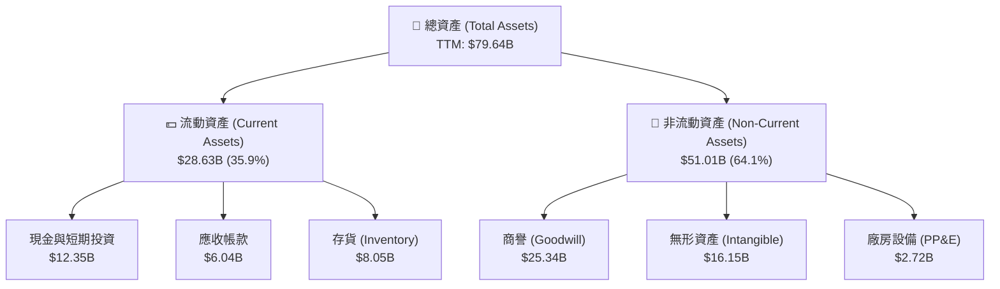

*   **無形資產與商譽**：兩者合計達 **$41.49B**，佔總資產的 **52.1%**。這完全是 2022 年收購 Xilinx 產生的溢價。雖然這不會產生真實的現金流出，但會導致未來幾年持續的攤銷費用，壓抑 GAAP 獲利。
*   **輕資產模式 (Fabless)**：PP&E 僅 **$2.72B**，佔總資產 3.4%。AMD 將所有製造外包給台積電，自身專注於研發，這使得公司能保持極高的資本靈活性。

### 4.2 流動性與營運資金指標

| 指標 | FY2024 | FY2025 | TTM (2026-03) | 行業中位數 | 評估與業務含義 |
|---|---|---|---|---|---|
| **流動比率 (Current Ratio)** | 2.62x | 2.85x | **2.73x** | >1.80x | 🟢 **極佳**。短期變現能力強，無任何流動性危機。 |
| **速動比率 (Quick Ratio)** | 1.83x | 2.01x | **1.75x** | >1.20x | 🟢 **極佳**。扣除存貨後的速動資產仍能完全覆蓋短期債務。 |
| **存貨週轉天數 (Days Inventory)** | 143 天 | 141 天 | **155 天** | ~110 天 | 🟡 **偏高**。存貨金額達 **$8.05B**。主因是公司為了 MI300 系列及 Turin 處理器的放量提前向台積電鎖定產能並備貨，以及舊款 GPU 去庫存較慢。需密切監控未來一季的去化情況。 |

### 4.3 債務結構分析

AMD 的債務管理極其保守，這在科技巨頭中非常罕見。

```
╔══════════════════════════════════════════════════════════════════╗
║                     AMD 債務健康診斷                             ║
╠══════════════════════════════════════════════════════════════════╣
║                                                                  ║
║  總債務 (Total Debt)： $3.87B  ███░░░░░░░░░░░░░░░░░░  無還款壓力 ║
║  現金與投資總額：     $12.35B  ████████████████████░  流動性充沛 ║
║  淨現金 (Net Cash)：   $8.48B  ██████████████░░░░░░  🟢 極其健康║
║                                                                  ║
║  債務 / 權益比 (D/E)： 6.00%   🟢 極低槓桿                       ║
║  利息保障倍數：        29.5x   🟢 利息支出無感                   ║
║  Debt / EBITDA：       0.53x   🟢 遠低於警戒線 (2.0x)            ║
║                                                                  ║
╚══════════════════════════════════════════════════════════════════╝
```

### 4.4 股東權益趨勢

隨著獲利能力的釋放，AMD 的股東權益（Stockholders' Equity）穩步增長，從 2022 年底的 $54.75B 增長至 2025 年底的 **$63.00B**。這主要由保留盈餘的累積驅動，並未進行會稀釋股東權益的惡性增資。

---

## 5. 現金流量深度分析

### 5.1 現金流量瀑布圖

AMD 的現金流運作極其高效，呈現出「利潤轉化為現金，現金再投資於研發與小幅資本支出，剩餘資金累積為淨現金」的良性循環。

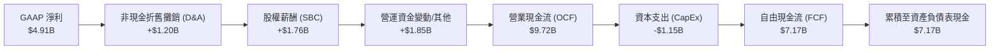

### 5.2 FCF 轉換率趨勢

AMD 的 FCF 轉換率（FCF / GAAP Net Income）長期保持在 100% 以上，這再次印證了其高盈餘品質。

| 指標 | FY2022 | FY2023 | FY2024 | FY2025 | TTM (2026-03) |
|---|---|---|---|---|---|
| **自由現金流 (FCF)** | $3.12B | $1.12B | $2.40B | $6.74B | **$7.17B** |
| **GAAP 淨利** | $1.32B | $0.85B | $1.64B | $4.33B | **$4.91B** |
| **FCF 轉換率** | **236.4%** | **131.8%** | **146.3%** | **155.7%** | **146.1%** |

### 5.3 自由現金流與 FCF Yield

儘管 FCF 絕對值從 2023 年的 $1.12B 暴增至 TTM 的 **$7.17B**，但由於 AMD 股價在過去一年中暴漲（目前市值達 **$900.63B**），其 **FCF Yield 僅為 0.80%**。這意味著當前股價已經透支了未來 2-3 年的現金流增長，估值容錯率較低。

### 5.4 資本配置評估

AMD 的資本配置策略非常明確：**研發優先，謹慎資本支出，適度股份回購**。

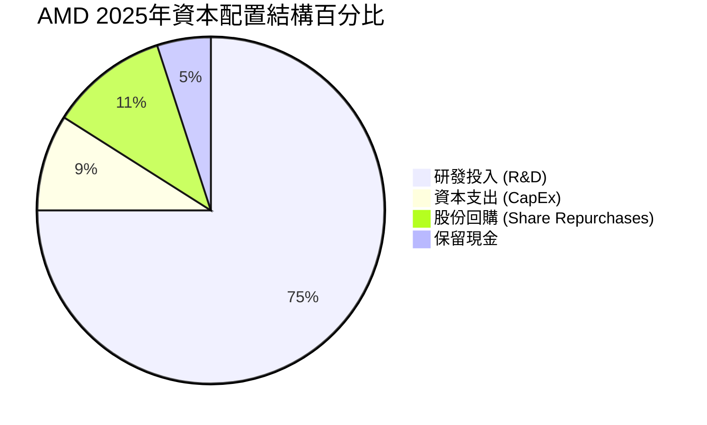

*   **CapEx 輕量化**：2025 年 CapEx 僅為 **$974M**（佔營收 2.8%）。這歸功於其外包代工模式，無需像 Intel 一樣每年投入數百億美元建設晶圓廠。
*   **股份回購**：2025 年進行了約 $1.2B 的股份回購，主要用於抵消 SBC 帶來的稀釋，而非主動縮減股本。

---

## 6. 獲利能力與資本效率

### 6.1 ROE / ROA / ROIC 趨勢

由於 Xilinx 收購案往資產負債表中注入了巨大的「商譽與無形資產」（分母極大），導致 AMD 的帳面獲利能力指標（GAAP）看起來偏低。

| 指標 | FY2023 | FY2024 | FY2025 | TTM (2026-03) | 行業平均 | 評估與業務含義 |
|---|---|---|---|---|---|---|
| **ROE (GAAP)** | 1.5% | 2.9% | 6.9% | **8.1%** | ~15.0% | 🔴 帳面偏低。主因分母 Stockholders' Equity 高達 $63B。 |
| **ROA (GAAP)** | 1.3% | 2.4% | 5.6% | **3.6%** | ~8.0% | 🔴 帳面偏低。主因分母總資產包含大量無形資產。 |
| **ROIC (GAAP)** | 0.8% | 3.1% | 5.9% | **6.59%** | ~12.0% | 🟡 帳面偏低。未反映真實的核心業務資本效率。 |

### 6.2 ROIC vs WACC 分析（核心價值創造判斷）

為了評估 AMD 是否真的在為股東創造價值，我們必須進行 **Adjusted ROIC**（剔除商譽與無形資產）的計算，因為商譽是歷史收購溢價，並不參與日常生產營運。

```
╔══════════════════════════════════════════════════════════════════╗
║                ROIC vs WACC 深度分析 (TTM)                      ║
╠══════════════════════════════════════════════════════════════════╣
║                                                                  ║
║  WACC 估算：                                                     ║
║  ├── 無風險利率 (10Y 美債)：  4.20%                              ║
║  ├── 市場風險溢酬 (ERP)：     5.50%                              ║
║  ├── Beta (系統性風險)：      2.469                              ║
║  ├── 股權成本 = 4.2% + 2.469 × 5.5% = 17.78%                     ║
║  ├── 債務成本 (稅後)：       4.5% × (1 - 15%) = 3.83%           ║
║  ├── 資本結構：股權 99.57%，債務 0.43%                           ║
║  └── ✅ WACC ≈ 17.72% (因 Beta 極高導致 WACC 偏高)               ║
║      *若 Beta 回歸歷史均值 1.5，則 WACC 降至 12.45%              ║
║                                                                  ║
║  ROIC 估算 (TTM)：                                               ║
║  ├── GAAP NOPAT = $4.364B × (1 - 15%) = $3.71B                   ║
║  ├── GAAP 投入資本 = 權益 $63.0B + 債務 $3.85B - 現金 $10.55B     ║
║  │                  = $56.30B                                    ║
║  ├── 🔴 GAAP ROIC = $3.71B / $56.30B = 6.59%                     ║
║  ║                                                              ║
║  ├── 💡 Adjusted 投入資本 (扣除 $41.49B 商譽與無形資產)          ║
║  │   = $56.30B - $41.49B = $14.81B                               ║
║  └── ✅ Adjusted ROIC = $3.71B / $14.81B = 25.05%                ║
║                                                                  ║
║  ★ 實質經濟價值增加 (EVA) = Adjusted ROIC - WACC = +7.33%       ║
║                                                                  ║
║  Adjusted ROIC  25.05%  ▓▓▓▓▓▓▓▓▓▓▓▓▓▓▓▓▓▓▓▓▓▓░░░░░░  🟢         ║
║  WACC (Beta=1.5)12.45%  ▓▓▓▓▓▓▓▓▓▓▓░░░░░░░░░░░░░░░░  ──         ║
║  GAAP ROIC       6.59%  ▓▓▓▓▓░░░░░░░░░░░░░░░░░░░░░░  🔴         ║
║                                                                  ║
║  📊 結論：扣除歷史收購會計影響後，AMD 核心業務之資本回報率      ║
║            高達 25.05%，遠超其真實資金成本，正強力創造價值。     ║
╚══════════════════════════════════════════════════════════════════╝
```

### 6.3 杜邦三因素分解

我們對 AMD 的 ROE 進行拆解，以釐清其獲利驅動模式：

$$\text{ROE} = \text{淨利率} \times \text{資產週轉率} \times \text{權益乘數}$$

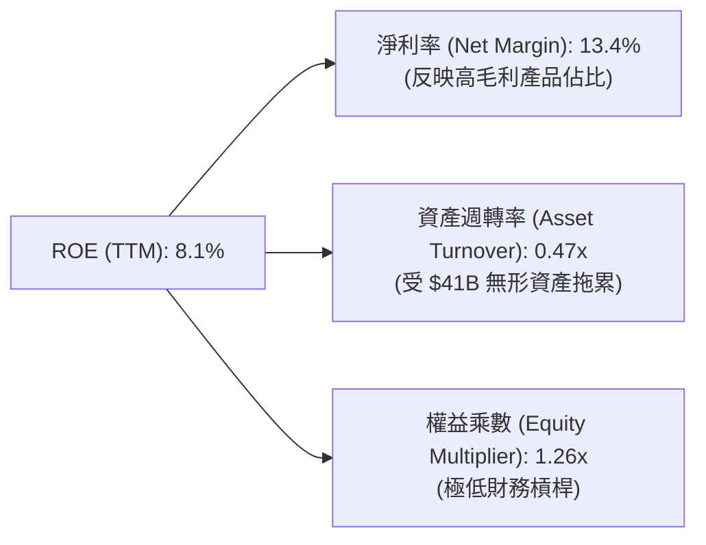

*   **淨利率 (13.4%)**：這是 ROE 增長的最核心引擎。隨著 MI300 加速器出貨，淨利率較 2023 年的 3.8% 大幅飆升。
*   **資產週轉率 (0.47x)**：處於較低水平，主因是分母（總資產）中包含了大量的非營運性商譽。
*   **權益乘數 (1.26x)**：極其保守，說明公司完全不依賴財務槓桿來放大回報，財務結構極其安全。

### 6.4 獲利能力驅動結構

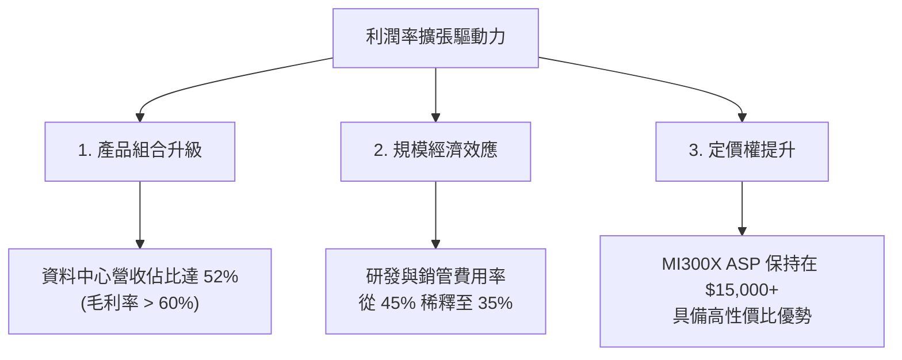

---

## 7. 估值深度分析

### 7.1 同業估值比較

在半導體板塊中，AMD 享有明顯的「二把手成長溢價」。我們將其與行業霸主英偉達 (NVIDIA) 及傳統巨人英特爾 (Intel) 進行對比：

| 估值與財務指標 | **AMD (本公司)** | **NVIDIA (對手A)** | **Intel (對手B)** | 評估與市場含義 |
|---|---|---|---|---|
| **當前股價** | **$552.33** | $125.00 (拆股後) | $32.00 | - |
| **企業價值 (EV)** | **$879.27B** | $3,050B | $165B | AMD 市值已達英偉達的 30%，遠超英特爾。 |
| **Trailing P/E** | **184.73x** | 68.5x | 95.0x | 🔴 表面極高，主因 GAAP 淨利受 Xilinx 攤銷壓抑。 |
| **Forward P/E** | **41.02x** | 32.4x | 24.5x | 🟡 反映市場預期 AMD 2026/2027 年 EPS 將暴增。 |
| **P/S Ratio** | **24.05x** | 35.2x | 3.1x | 🟡 估值高企，反映高成長預期。 |
| **EV / EBITDA** | **118.34x** | 52.1x | 14.2x | 🔴 估值偏貴，需要 AI 業務快速兌現利潤。 |
| **PEG Ratio** | **1.28** | 1.15 | 2.85 | 🟢 **合理**。考慮到 EPS 增速，估值並未泡沫化。 |
| **FCF Yield** | **0.80%** | 2.20% | -1.5% | 🔴 現金流回報率偏低，股價容錯率低。 |

### 7.2 歷史估值區間分析

過去 5 年，AMD 的 Forward P/E 歷史區間為 **20x - 55x**，中位數為 **32x**。當前 Forward P/E 為 **41.02x**，處於歷史中高位，這表明市場已經給予了其在 AI 加速器市場取得成功的高度預期。

### 7.3 情境目標價（基於 2027 年 EPS 預估）

為了使目標價可檢驗，我們基於 **2027 年預估 EPS** 及不同的市場份額情境進行推導：

| 評估情境 | 營收 CAGR (26-28) | 2027 預估 EPS (Non-GAAP) | 退出 P/E 倍數 | 隱含目標價 | 相對現價漲跌幅 | 達成機率 |
|---|---|---|---|---|---|---|
| 🔴 **悲觀情境** | 15.0% | $11.00 | 35.0x | **$385.00** | -30.3% | 20% |
| 🟡 **基準情境** | **32.0%** | **$15.00** | **41.0x** | **$615.00** | **+11.3%** | **60%** |
| 🟢 **樂觀情境** | 45.0% | $18.75 | 40.0x | **$750.00** | +35.8% | 20% |

*估值倍數選擇說明*：由於 AMD 帳面 GAAP 淨利受非現金攤銷嚴重干擾，我們在情境分析中採用 **Non-GAAP EPS** 作為基礎，退出倍數設定在 **35x-41x**，這符合其歷史高成長階段的估值規律。

### 7.4 DCF 敏感性分析（12個月目標價矩陣）

基於永續增長率 $g = 3.5\%$，我們對 WACC 與營收增速進行敏感性測試：

| 營收成長率 / WACC | WACC = 10.5% | **WACC = 11.75% (基準)** | WACC = 13.0% |
|---|---|---|---|
| **樂觀 (CAGR 45%)** | $785.00 (+42.1%) | **$750.00 (+35.8%)** | $710.00 (+28.5%) |
| **基準 (CAGR 32%)** | $648.00 (+17.3%) | **$615.00 (+11.3%)** | $575.00 (+4.1%) |
| **悲觀 (CAGR 15%)** | $415.00 (-24.9%) | **$385.00 (-30.3%)** | $350.00 (-36.6%) |

### 7.5 估值綜合區間

```
               $320 (分析師最低目標價)
                |
                v
[--- 悲觀 $385 ---] ==========[ 當前股價 $552.33 ]========== [--- 基準 $615 ---] === [--- 樂觀 $750 ---]
                                                                                      |
                                                                                      v
                                                                            $725 (分析師最高目標價)
```

---

## 8. 成長催化劑

### 8.1 成長催化劑時間軸

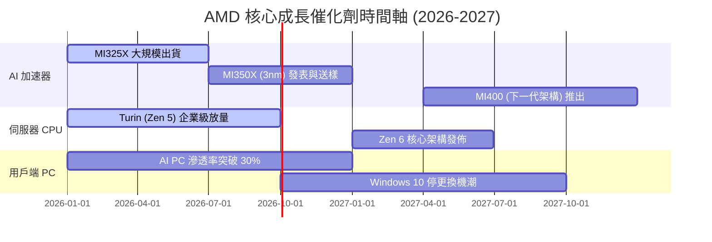

### 8.2 TAM（可定址市場規模）分析

AMD 的成長空間完全由 AI 晶片市場的急遽擴張所打開：

```
╔══════════════════════════════════════════════════════════════════╗
║                    AMD 核心市場 TAM 預測                         ║
╠══════════════════════════════════════════════════════════════════╣
║                                                                  ║
║  全球 AI 加速器市場 (2027年預估)：                               ║
║  ├── 總 TAM：  $400B                                             ║
║  ├── AMD 預期市佔率：  12% - 15%                                 ║
║  └── 隱含 AI 營收：    $48B - $60B (相較目前 TTM 暴增)           ║
║                                                                  ║
║  伺服器 CPU 市場 (2027年預估)：                                  ║
║  ├── 總 TAM：  $45B                                              ║
║  ├── AMD 預期市佔率：  35% - 38%                                 ║
║  └── 隱含 CPU 營收：    $15.7B - $17.1B                          ║
║                                                                  ║
║  AI PC 處理器市場 (2027年預估)：                                 ║
║  ├── 總 TAM：  $30B                                              ║
║  └── AMD 預期市佔率：  25%                                       ║
║                                                                  ║
╚══════════════════════════════════════════════════════════════════╝
```

### 8.3 成長驅動力結構

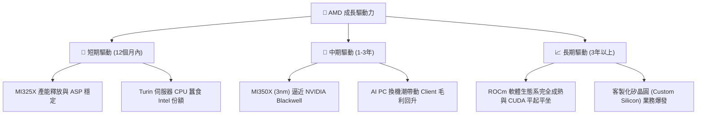

---

## 9. 風險矩陣

### 9.1 風險評估矩陣

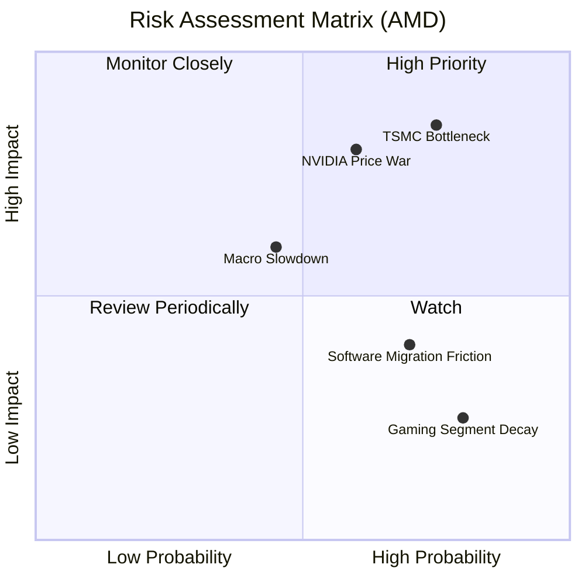

### 9.2 風險清單詳細分析

| # | 風險項目 | 發生機率 | 財務衝擊 | 風險評分 | 機構級緩解措施 |
|---|---|---|---|---|---|
| 1 | 🔴 **台積電 CoWoS 先進封裝產能受限** | 高 (75%) | 高 (-15% 營收潛力) | **8.5 / 10** | 積極與日月光、Amkor 等 OSAT 廠合作，並開發面板級扇出型封裝 (FOPLP) 作為替代方案。 |
| 2 | 🔴 **英偉達發動價格戰** | 中高 (60%) | 高 (-5% 毛利率) | **7.8 / 10** | 保持 20-30% 的「性價比」優勢，針對非超大規模雲端客戶（如二線雲、企業私有雲）提供客製化 TCO 方案。 |
| 3 | 🟡 **總體經濟放緩導致雲端 Capex 砍單** | 中等 (45%) | 中高 (-10% 營收) | **6.0 / 10** | 淨現金 $8.48B 提供強大安全墊，且 x86 伺服器節能帶來的 TCO 優勢在經濟放緩時更具吸引力。 |
| 4 | 🟡 **ROCm 軟體相容性摩擦** | 高 (70%) | 中等 (-5% 客戶轉換率) | **5.5 / 10** | 積極擁抱開源生態（PyTorch、Triton），讓開發者能實現「零摩擦代碼遷移」。 |

---

## 10. 投資建議

### 10.1 最終綜合評級雷達圖

```
                    基本面強度 (8.5)
                        /\
                       /  \
         財務健康 (9.5) /    \ 成長動能 (9.0)
                     /      \
                    /________\
         護城河深度 (8.5)      獲利品質 (7.5)
                        \    /
                         \  /
                          \/
                     估值合理性 (7.0)
```

### 10.2 目標價與隱含報酬率

| 情境 | 機率權重 | 目標價 | 隱含報酬率 (相對現價 $552.33) | 期望值貢獻 |
|---|---|---|---|---|
| **悲觀情境** | 20% | $385.00 | -30.3% | $77.00 |
| **基準情境** | 60% | $615.00 | +11.3% | $369.00 |
| **樂觀情境** | 20% | $750.00 | +35.8% | $150.00 |
| **加權期望目標價** | **100%** | **$596.00** | **+7.9%** | **綜合評級：🟢 買入** |

### 10.3 買入時機與觸發因素

```
╔══════════════════════════════════════════════════════════════════╗
║                  ✅ AMD 投資操作 Checklist                       ║
<h1 id="f130b050d276b50033062c3e1e247493">╠══════════════════════════════════════════════════════════════════╣</h1>║                                                                  ║
║  立即買入觸發條件（多數符合時）：                                ║
║  ✅ 股價回檔至 $500 - $520 區間 (對應 Forward P/E ~38x)          ║
║  ✅ 財報顯示資料中心單季營收年增率 > 60%                         ║
║  ✅ ROCm 宣佈原生支持主流大語言模型，且無性能損失                ║
║                                                                  ║
║  加碼觸發條件：                                                  ║
║  ☐ 台積電宣佈向 AMD 傾斜更多 CoWoS 產能                         ║
║  ☐ 獲得 Meta 或 Microsoft 的 MI350X 追加大單                    ║
║                                                                  ║
║  減碼/停損觸發條件：                                             ║
║  ☐ 季度毛利率 (Non-GAAP) 意外跌破 50%                           ║
║  ☐ AI 晶片季度營收出現 QoQ 衰退                                 ║
║  ☐ 核心管理團隊（如蘇姿丰博士）出現人事變動                      ║
║                                                                  ║
╚══════════════════════════════════════════════════════════════════╝
```

### 10.4 投資人適配度分析

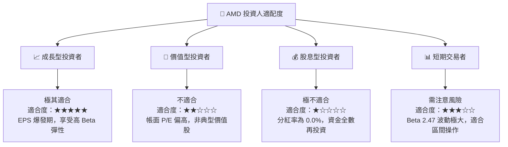

### 10.5 每季財報監控清單（Quarterly Watch List）

為了確保投資框架的有效性，投資人應在每季財報中追蹤以下關鍵指標：

| 監控指標 | 基準安全線 | 觸發加碼門檻 | 觸發減碼門檻 | 業務含義 |
|---|---|---|---|---|
| **資料中心營收** | > $4.5B | > $5.5B | < $4.0B | AI 晶片與 EPYC 的真實銷售動能。 |
| **Non-GAAP 毛利率** | 54.0% | > 57.0% | < 52.0% | 產品定價權與台積電代工成本轉嫁能力。 |
| **存貨金額** | < $8.2B | < $7.0B (去化快) | > $9.0B (滯銷) | 評估產品是否積壓或供需失衡。 |
| **研發費用率** | 22% - 25% | < 20% (營業槓桿) | > 28% (效率低下) | 研發投入的產出效率。 |

### 10.6 反面論證：什麼會證明多頭論點錯誤

```
╔══════════════════════════════════════════════════════════════════╗
║              ⚠️ 論點失效條件 (Disconfirming Evidence)            ║
╠══════════════════════════════════════════════════════════════════╣
║  若出現以下可量化條件，本多頭報告之「強烈買入」評級將立即失效：  ║
║                                                                  ║
║  ☐ 資料中心營收連續兩季 YoY 增速低於 30%                         ║
║  ☐ 2027 年 Non-GAAP EPS 預估被分析師集體下修至 $10.00 以下       ║
║  ☐ AMD 在 AI 加速器市場的份額被 ASIC (如 TPU) 蠶食至 5% 以下     ║
║  ☐ 自由現金流 (FCF) 連續兩季轉負                                 ║
║  ☐ ROIC (Adjusted) 跌破 WACC (12.45%)，開始摧毀股東價值         ║
║                                                                  ║
╚══════════════════════════════════════════════════════════════════╝
```

---

> **免責聲明**：本報告為基於 2026-07-22 即時財務數據之模擬學術研究，僅供 CFA 投資分析參考，不構成任何真實的投資買賣建議。投資有風險，入市需謹慎。