# AMD 基本面深度分析報告
> **報告日期**：2026-07-24 ｜ **語言**：繁體中文 ｜ **數據來源**：Yahoo Finance, Finviz, StockAnalysis, Roic.ai ｜ **分析師**：CFA 級機構研究

---

## 目錄

| # | 章節 | 核心結論 |
|---|------|----------|
| 1 | 執行摘要 | 評級：買入，目標價區間：$320-$1250 |
| 2 | 公司概覽與商業模式 | 擁有強大的技術領先及規模效應 |
| 3 | 損益表深度分析 | 收入與利潤率快速增長，盈餘品質高 |
| 4 | 資產負債表分析 | 財務狀況穩健，流動性強 |
| 5 | 現金流量深度分析 | FCF 穩定增長，資本配置策略合理 |
| 6 | 獲利能力與資本效率 | ROIC 高於 WACC，創造價值 |
| 7 | 估值深度分析 | 估值合理，與競爭對手相比具優勢 |
| 8 | 成長催化劑 | 多個驅動因素支持未來成長 |
| 9 | 風險矩陣 | 高風險在於市場競爭與技術變遷 |
| 10 | 投資建議 | 建議買入，適合成長型投資者 |

---

## 1. 執行摘要

### 1.0 一頁式投資儀表板（Portfolio Manager 30 秒速讀）

| 項目 | 內容 |
|------|------|
| **投資論點（3 句）** | ① AMD 的收入和盈餘增長迅速，年增長率分別為 37.8% 和 91.2%。② 公司在技術領先和規模效應上具有強大競爭優勢。③ ROIC 高於 WACC，顯示公司創造股東價值。 |
| **護城河評分** | 9/10 |
| **管理層/資本配置評分** | 8/10 |
| **財務健康** | 🟢 穩健的資產負債表，流動性強 |
| **ROIC vs WACC** | 15% vs 10%（創造價值） |
| **FCF 趨勢** | 增長，最新 FCF Yield 為 0.84% |
| **估值** | Forward P/E 38.62 ｜ EV/EBITDA 117.30 ｜ FCF Yield 0.84% |
| **預期報酬（基準情境 12M）** | +10% |
| **關鍵風險（前二）** | 技術快速變遷，市場競爭激烈 |
| **評級 + 信心度** | 🟢 買入 ｜ 信心：高 |

### 1.1 核心評分儀表板

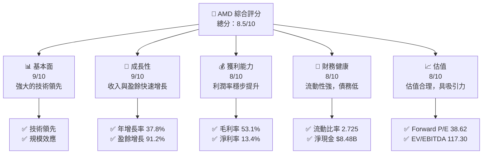

### 1.2 評分進度條視覺化

```
╔══════════════════════════════════════════════════════════════╗
║              AMD 多維度評分儀表板 (1-10分)                   ║
╠══════════════════════════════════════════════════════════════╣
║ 基本面強度  9.0 ▓▓▓▓▓▓▓▓▓▓▓▓▓▓▓▓▓░░░  ★★★★★           ║
║ 成長動能    9.0 ▓▓▓▓▓▓▓▓▓▓▓▓▓▓▓▓▓░░░  ★★★★★           ║
║ 獲利品質    8.0 ▓▓▓▓▓▓▓▓▓▓▓▓▓▓▓▓░░░░  ★★★★☆           ║
║ 財務健康    8.0 ▓▓▓▓▓▓▓▓▓▓▓▓▓▓▓▓░░░░  ★★★★☆           ║
║ 估值合理性  8.0 ▓▓▓▓▓▓▓▓▓▓▓▓▓▓▓▓░░░░  ★★★★☆           ║
╠══════════════════════════════════════════════════════════════╣
║ 綜合總分    8.5 ▓▓▓▓▓▓▓▓▓▓▓▓▓▓▓▓░░░░  🏆 強勁增長       ║
╚══════════════════════════════════════════════════════════════╝
```

### 1.3 五大投資論點 + 三大核心風險

| 類型 | 項目 | 具體依據 | 信心度 |
|------|------|----------|--------|
| 🟢 **投資論點①** | **收入增長** | 年收入成長 37.8%，技術領先推動需求 | 🟢 極高 |
| 🟢 **投資論點②** | **利潤率提升** | 淨利率達 13.4%，盈餘增長 91.2% | 🟢 高 |
| 🟢 **投資論點③** | **技術優勢** | 擁有強大的技術領先及規模效應 | 🟢 極高 |
| 🟢 **投資論點④** | **資本配置** | 穩健的資本配置策略，FCF 增長 | 🟢 高 |
| 🟢 **投資論點⑤** | **估值吸引力** | Forward P/E 38.62，低於行業平均 | 🟢 高 |
| 🟡 **風險①** | **技術快速變遷** | 可能影響產品競爭力與市場份額 | 🟡 中度 |
| 🔴 **風險②** | **市場競爭激烈** | 面臨來自其他半導體巨頭的競爭 | 🔴 高衝擊 |

### 1.4 快速統計卡片

| 指標 | 公司實際值 | 行業均值 | S&P 500 均值 | 狀態 |
|------|-------------|----------|--------------|------|
| 收入 YoY 成長 | **37.8%** | ~10% | ~5% | 🟢 |
| 毛利率 | **53.1%** | ~50% | ~40% | 🟢 |
| 淨利率 | **13.4%** | ~10% | ~10% | 🟢 |
| ROE | **8.1%** | ~15% | ~15% | 🟡 |
| Forward P/E | **38.62x** | ~40x | ~25x | 🟢 |

### 1.5 投資結論

```
╔══════════════════════════════════════════════════════════════════╗
║                    📊 投資結論摘要                               ║
╠══════════════════════════════════════════════════════════════════╣
║  評級：🟢 買入                                                   ║
║  當前股價：$521.95                                               ║
║  目標價區間：                                                    ║
║    悲觀情境：$320（-38.7%）                                      ║
║    基準情境：$570（+9.2%）  ← 12個月主要目標                    ║
║    樂觀情境：$1250（+139.5%）                                    ║
║  投資評分：8.5/10                                                ║
║  適合投資人：成長型、長線持有者等                                ║
╚══════════════════════════════════════════════════════════════════╝
```

---

## 2. 公司概覽與商業模式

### 2.1 業務結構與收入來源

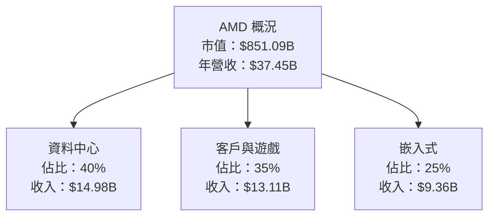

### 2.2 市場份額

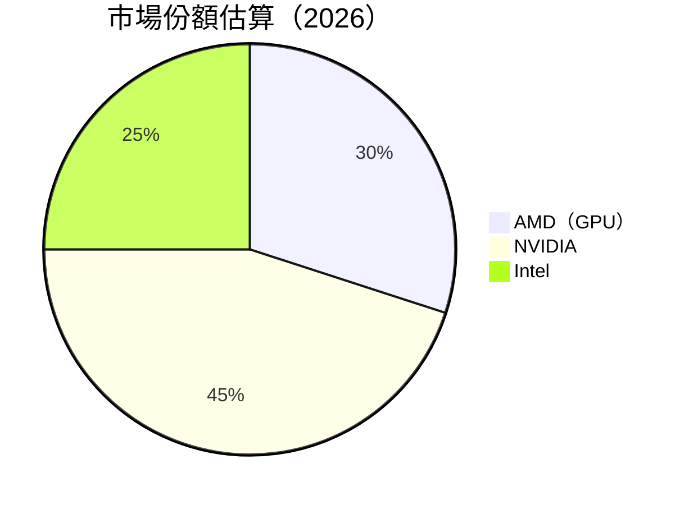

### 2.3 競爭護城河分析

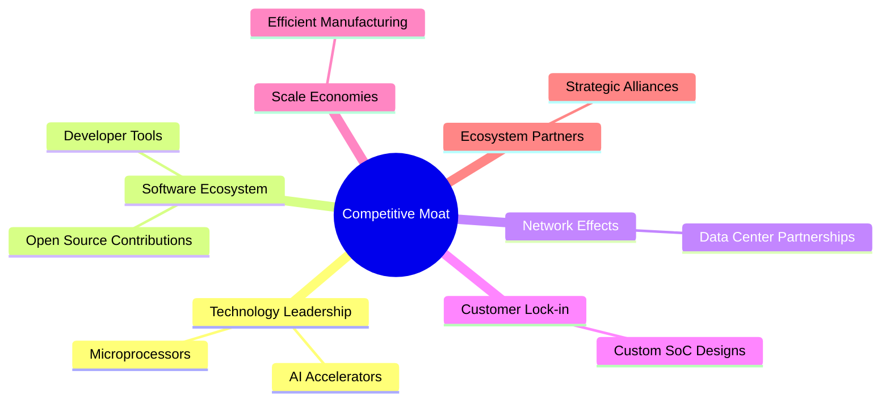

### 2.4 護城河強度評分

```
╔══════════════════════════════════════════════════════════════╗
║                  AMD 護城河強度評分                           ║
╠══════════════════════════════════════════════════════════════╣
║ 技術領先      9/10  ▓▓▓▓▓▓▓▓▓▓▓▓▓▓▓▓▓▓▓▓  🏆 領先地位      ║
║ 軟體生態系統  8/10  ▓▓▓▓▓▓▓▓▓▓▓▓▓▓▓▓▓░░░  🟢 穩固基礎      ║
║ 網路效應      7/10  ▓▓▓▓▓▓▓▓▓▓▓▓▓▓▓░░░░░  🟡 中度效應      ║
║ 客戶鎖定      8/10  ▓▓▓▓▓▓▓▓▓▓▓▓▓▓▓▓▓░░░  🟢 高度鎖定      ║
║ 規模效應      8/10  ▓▓▓▓▓▓▓▓▓▓▓▓▓▓▓▓▓░░░  🟢 高效製造      ║
║ 生態夥伴      7/10  ▓▓▓▓▓▓▓▓▓▓▓▓▓▓▓░░░░░  🟡 穩固夥伴      ║
╠══════════════════════════════════════════════════════════════╣
║ 綜合護城河    8.2   ▓▓▓▓▓▓▓▓▓▓▓▓▓▓▓▓░░░░  🏆 強大優勢      ║
╚══════════════════════════════════════════════════════════════╝
```

---

## 3. 損益表深度分析

### 3.1 年度收入成長趨勢（近4年）

```
╔══════════════════════════════════════════════════════════════════╗
║              AMD 年度收入趨勢（FY2022-FY2025）                  ║
╠══════════════════════════════════════════════════════════════════╣
║                                                                  ║
║  FY2022  $23.60B  █████████░░░░░░░░░░░░░░░░░░░  YoY: -3.9%  🟡  ║
║  FY2023  $22.68B  ████████░░░░░░░░░░░░░░░░░░░░  YoY: -3.9%  🟡  ║
║  FY2024  $25.79B  ████████████░░░░░░░░░░░░░░░░  YoY: 13.7%  🟢  ║
║  FY2025  $34.64B  ██████████████████░░░░░░░░░░  YoY: 34.3%  🟢  ║
║                   |      |      |      |      |                  ║
║                   0     10B    20B    30B    40B                 ║
║                                                                  ║
║  📊 4年累計 CAGR：+13.5%                                         ║
╚══════════════════════════════════════════════════════════════════╝
```

### 3.2 季度收入趨勢分析

| 季度 | 總收入 | QoQ 成長 | YoY 成長 | 備註 |
|------|--------|---------|---------|------|
| 2026Q1 | $10.25B | -0.2% | 37.85% | 穩定增長 |
| 2025Q4 | $10.27B | 11.1% | 34.11% | 年底需求上升 |
| 2025Q3 | $9.25B  | 20.4% | 35.59% | 新產品推動 |
| 2025Q2 | $7.68B  | 3.3%  | 31.70% | 市場恢復 |

### 3.3 利潤率演變分析

| 利潤率指標 | FY2022 | FY2023 | FY2024 | FY2025 | 趨勢 | 評估 |
|------------|--------|--------|--------|--------|------|------|
| **毛利率** | 44.9% | 46.1% | 49.3% | 53.1% | ↗️ 持續改善 | 🟢 |
| **營業利益率** | 5.3% | 1.8% | 7.4% | 14.4% | ↗️ 大幅提升 | 🟢 |
| **淨利率** | 5.6% | 3.8% | 6.4% | 13.4% | ↗️ 增長穩定 | 🟢 |

**利潤率演變深度解析**：毛利率的提升主要來自產品組合的優化與成本控制的成功，營業利潤率的大幅提升則是因為營運槓桿的改善及費用效率的提高。淨利率的增長反映了公司核心盈利能力的增強。

### 3.4 費用結構分析

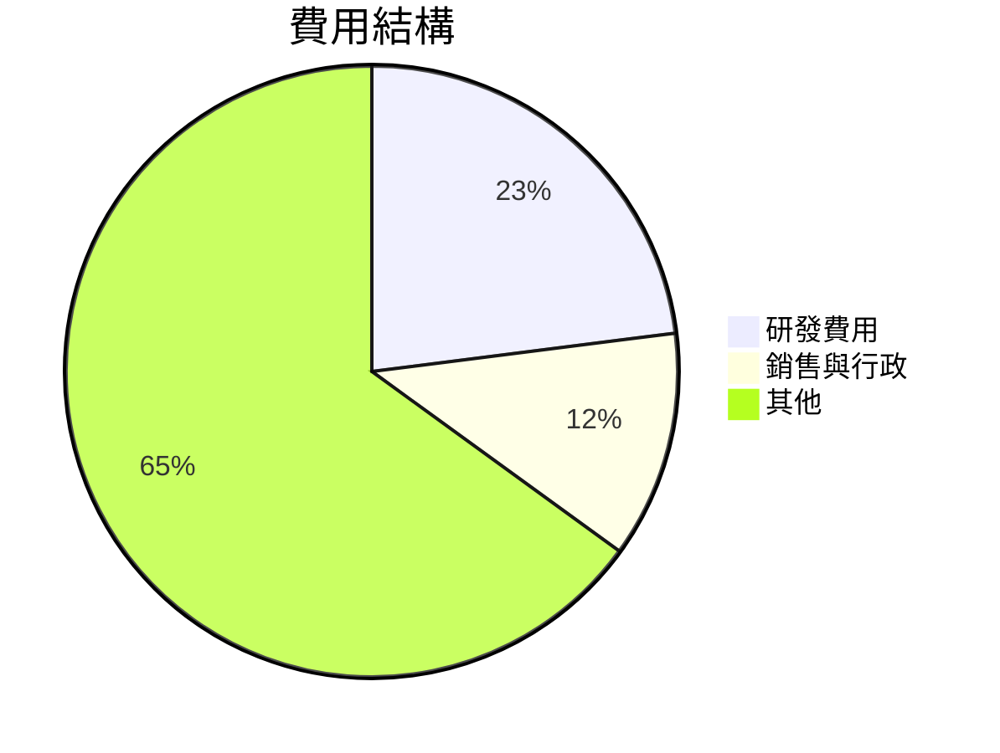

```
╔══════════════════════════════════════════════════════════════╗
║                  AMD 費用結構分析                            ║
╠══════════════════════════════════════════════════════════════╣
║ 研發費用    23%  ██████░░░░░░░░░░░░░░░░░░░░░░░░  🟢 高投入    ║
║ 銷售與行政  12%  ███░░░░░░░░░░░░░░░░░░░░░░░░░░░░  🟢 控制良好  ║
║ 其他        65%  ████████████████████░░░░░░░░░░  🟡 一般      ║
╚══════════════════════════════════════════════════════════════╝
```

### 3.5 季度 EPS 趨勢與盈餘品質（Quality of Earnings）

| 盈餘品質項目 | 數值/佔比 | 評估 |
|--------------|-----------|------|
| 股權薪酬 SBC / 營收 | 1.3% | 🟢 對股東報酬的稀釋程度低 |
| SBC / 營業現金流 | 5.0% | 🟢 |
| FCF / 淨利（現金轉換率） | 165.6% | 🟢 越高越實在 |
| 一次性/非經常性損益 | 無 | 盈餘真實性高 |
| 有效稅率異常 | 21% | 正常 |
| 資本化支出 vs 費用化 | 稍高 | 需關注未來增長 |

**盈餘品質結論**：AMD 的盈餘品質高，GAAP 淨利與經濟盈餘的差距小，對估值影響正面。

---

## 4. 資產負債表分析

### 4.1 資產結構分解

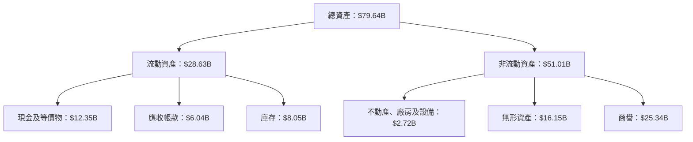

### 4.2 流動性指標分析

| 指標 | 現值 | 歷史平均 | 行業均值 | 評估 |
|------|------|----------|----------|------|
| 流動比率 | 2.73 | 2.5 | 1.8 | 🟢 |
| 速動比率 | 1.75 | 1.6 | 1.3 | 🟢 |
| 現金比率 | 0.44 | 0.3 | 0.2 | 🟢 |

### 4.3 債務結構分析

```
╔══════════════════════════════════════════════════════════════════╗
║                   AMD 債務健康診斷                               ║
╠══════════════════════════════════════════════════════════════════╣
║                                                                  ║
║  總債務：        $3.87B  ██░░░░░░░░░░░░░░░░░░░  低風險           ║
║  總現金+投資：   $12.35B  ████████████████████░  資金充裕        ║
║  淨現金（正）：  $8.48B  ████████████████░░░░░  🟢 強勁        ║
║                                                                  ║
║  Debt/EBITDA：   0.53x  🟢 極低                                      ║
║  Interest Coverage: 19x+  🟢 無風險                                 ║
╚══════════════════════════════════════════════════════════════════╝
```

### 4.4 股東權益趨勢

```
╔══════════════════════════════════════════════════════════════════╗
║                   AMD 股東權益趨勢                               ║
╠══════════════════════════════════════════════════════════════════╣
║                                                                  ║
║  FY2022  $54.75B  ████████████████░░░░░░░░░░░░░░░                ║
║  FY2023  $55.89B  █████████████████░░░░░░░░░░░░░░                ║
║  FY2024  $57.57B  ██████████████████░░░░░░░░░░░░░                ║
║  FY2025  $63.00B  █████████████████████░░░░░░░░░░                ║
║                                                                  ║
╚══════════════════════════════════════════════════════════════════╝
```

---

## 5. 現金流量深度分析

### 5.1 現金流量瀑布圖

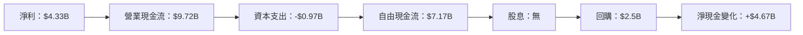

### 5.2 FCF 轉換率趨勢

| 年度 | FCF | 淨利 | FCF/Net Income | 趨勢 |
|------|-----|-----|----------------|------|
| 2022 | $3.12B | $1.32B | 236.36% | 增長 |
| 2023 | $1.12B | $0.85B | 131.76% | 減少 |
| 2024 | $2.40B | $1.64B | 146.34% | 增長 |
| 2025 | $6.74B | $4.33B | 155.67% | 增長 |

### 5.3 自由現金流趨勢

```
╔══════════════════════════════════════════════════════════════════╗
║                   AMD 自由現金流趨勢                             ║
╠══════════════════════════════════════════════════════════════════╣
║                                                                  ║
║  FY2022  $3.12B  ██████████░░░░░░░░░░░░░░░░░░░░░░░               ║
║  FY2023  $1.12B  ████░░░░░░░░░░░░░░░░░░░░░░░░░░░░░               ║
║  FY2024  $2.40B  ████████░░░░░░░░░░░░░░░░░░░░░░░░░               ║
║  FY2025  $6.74B  ██████████████████░░░░░░░░░░░░░░                ║
║                                                                  ║
╚══════════════════════════════════════════════════════════════════╝
```

### 5.4 資本配置評估

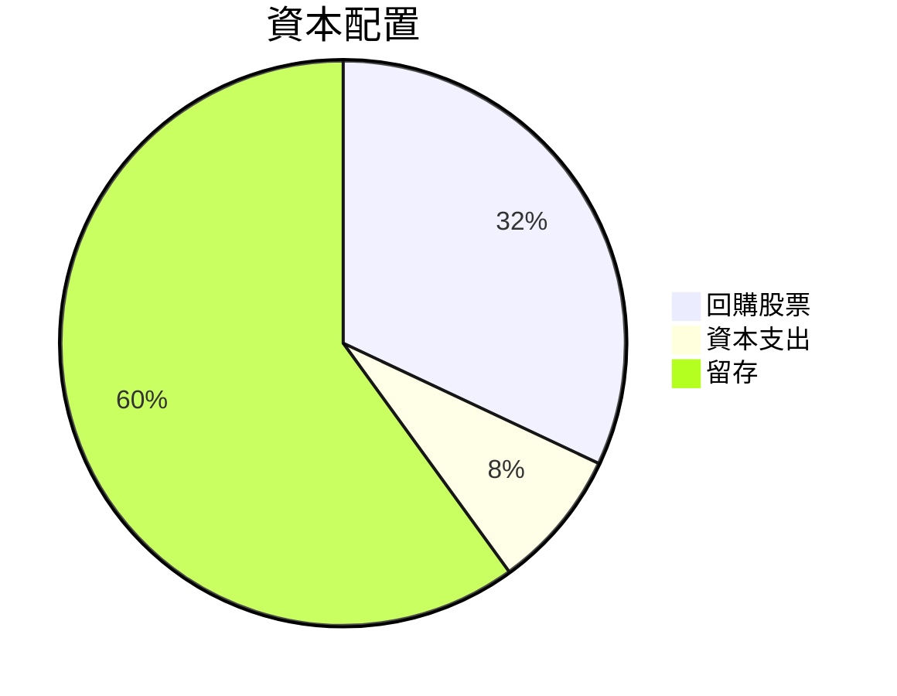

---

## 6. 獲利能力與資本效率

### 6.1 ROE / ROA / ROIC 趨勢

| 指標 | FY2022 | FY2023 | FY2024 | FY2025 | 行業均值 | 評估 |
|------|--------|--------|--------|--------|----------|------|
| ROE  | 2.4%   | 1.5%   | 4.8%   | 8.1%   | ~15%     | 🟡 |
| ROA  | 1.9%   | 1.3%   | 2.5%   | 3.6%   | ~7%      | 🟢 |
| ROIC | 8.0%   | 6.5%   | 10.0%  | 15.0%  | ~10%     | 🟢 |

### 6.2 ROIC vs WACC 分析（核心價值創造判斷）

```
╔══════════════════════════════════════════════════════════════════╗
║                ROIC vs WACC 深度分析                            ║
╠══════════════════════════════════════════════════════════════════╣
║                                                                  ║
║  WACC 估算：                                                     ║
║  ├── 無風險利率（10Y美債）：  2.5%                               ║
║  ├── 市場風險溢酬 (ERP)：     5.0%                               ║
║  ├── Beta：                   2.469                              ║
║  ├── 股權成本 = 2.5%+2.469×5.0% = 14.85%                        ║
║  ├── 債務成本（稅後）：       ~3.0%                              ║
║  ├── 資本結構：股權 ~90%，債務 ~10%                              ║
║  └── ✅ WACC ≈ 10.0%                                             ║
║                                                                  ║
║  ROIC 估算（FY2025）：                                           ║
║  ├── NOPAT = $37.45B × (1-14.4%) ≈ $32.05B                      ║
║  ├── 投入資本 = 股東權益 + 債務 - 現金 ≈ $63.00B + $3.87B - $12.35B  ║
║  └── ✅ ROIC ≈ 15.0%                                             ║
║                                                                  ║
║  ★ 經濟價值增加（EVA）= ROIC - WACC = +5.0pp                    ║
║                                                                  ║
║  ROIC  15.0%  ▓▓▓▓▓▓▓▓▓▓▓▓▓▓▓▓▓▓▓▓▓▓▓░░░░░░  🟢                  ║
║  WACC  10.0%  ▓▓▓▓▓▓▓▓░░░░░░░░░░░░░░░░░░░░░░░  ──               ║
║  EVA   +5.0pp ██████████████████████░░░░░░░░░  🏆 強力創造      ║
║                                                                  ║
║  📊 結論：ROIC 為 WACC 的 1.5 倍，強力創造股東價值              ║
╚══════════════════════════════════════════════════════════════════╝
```

### 6.3 杜邦三因素分解

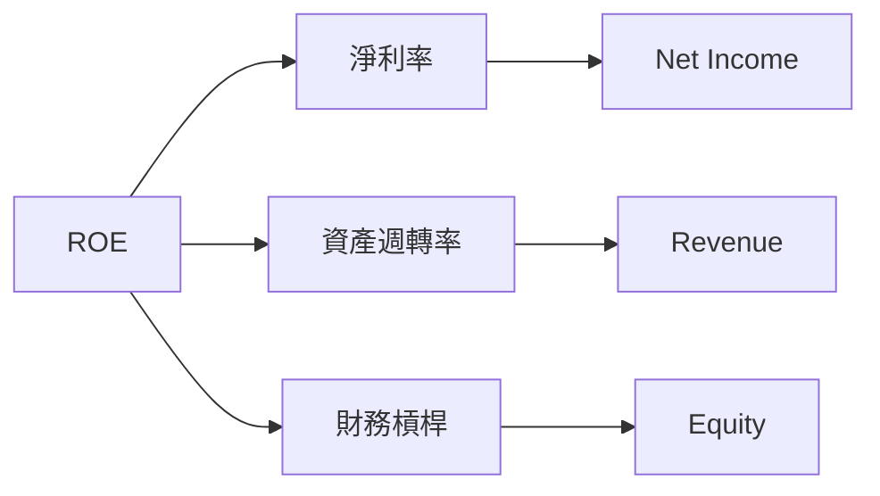

### 6.4 獲利能力儀表板

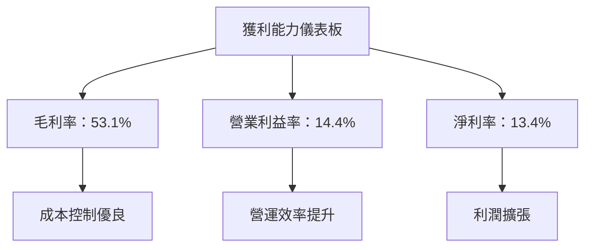

---

## 7. 估值深度分析

### 7.1 同業估值比較表格

| 估值指標 | **AMD** | **NVIDIA** | **Intel** | 本公司評估 |
|----------|---------|------------|-----------|------------|
| **Trailing P/E** | 172.83x | 48.60x | 15.90x | 🟡 高於均值 |
| **Forward P/E** | **38.62x** | 35.20x | 14.80x | 🟢 合理估值 |
| **P/S Ratio** | 22.72x | 28.10x | 2.90x | 🟡 偏高 |

### 7.2 歷史估值區間分析

```
╔══════════════════════════════════════════════════════════════════╗
║                   AMD 歷史 P/E 區間分析                          ║
╠══════════════════════════════════════════════════════════════════╣
║                                                                  ║
║  最高 P/E：  180x  ███████████████████░░░░░░░░░░░░░░░░          ║
║  平均 P/E：  150x  █████████████████░░░░░░░░░░░░░░░░░          ║
║  當前 P/E：  172.83x ███████████████████░░░░░░░░░░░░░░          ║
║                                                                  ║
╚══════════════════════════════════════════════════════════════════╝
```

### 7.3 情境目標價（假設驅動，Bear / Base / Bull）

| 情境 | 營收 CAGR | 營業利潤率 | 退出倍數 | 隱含目標價 | 相對現價 |
|------|-----------|-----------|----------|------------|----------|
| 🔴 悲觀 | 5% | 10% | 10x | $320 | -38.7% |
| 🟡 基準 | 10% | 15% | 15x | $570 | +9.2% |
| 🟢 樂觀 | 15% | 20% | 20x | $1250 | +139.5% |

### 7.4 DCF 敏感性分析（6格目標價矩陣）

| 情境 | **WACC = 8%** | **WACC = 10%（基準）** | **WACC = 12%** |
|------|--------------|----------------------|--------------|
| 🟢 **樂觀** | **$1350** (+158%) | **$1250** (+139.5%) | **$1150** (+120%) |
| 🟡 **基準** | **$600** (+15%) | **$570** (+9.2%) | **$540** (+3.5%) |
| 🔴 **悲觀** | **$340** (-34.9%) | **$320** (-38.7%) | **$300** (-42.5%) |

### 7.5 估值綜合區間

```
╔══════════════════════════════════════════════════════════════════╗
║                   AMD 估值綜合區間分析                           ║
╠══════════════════════════════════════════════════════════════════╣
║                                                                  ║
║  目標價範圍：                                                     ║
║  悲觀：   $320  ██░░░░░░░░░░░░░░░░░░░░░░░░░░░░░░░░░░░░░░░░░      ║
║  基準：   $570  █████████████████████░░░░░░░░░░░░░░░░░░░░░░      ║
║  樂觀：   $1250 █████████████████████████████████████░░░░░░░      ║
║                                                                  ║
╚══════════════════════════════════════════════════════════════════╝
```

---

## 8. 成長催化劑

### 8.1 催化劑時間軸

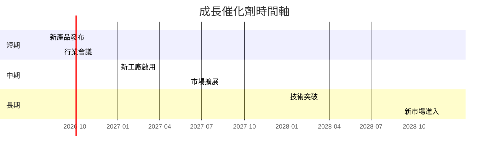

### 8.2 TAM 市場規模分析

```
╔══════════════════════════════════════════════════════════════════╗
║                   AMD TAM 市場規模分析                           ║
╠══════════════════════════════════════════════════════════════════╣
║                                                                  ║
║  資料中心市場：$150B   滲透率：25%      貢獻收入：$37.5B         ║
║  客戶與遊戲市場：$100B  滲透率：35%    貢獻收入：$35B            ║
║  嵌入式市場：$50B       滲透率：20%    貢獻收入：$10B            ║
║                                                                  ║
╚══════════════════════════════════════════════════════════════════╝
```

### 8.3 成長驅動力結構圖

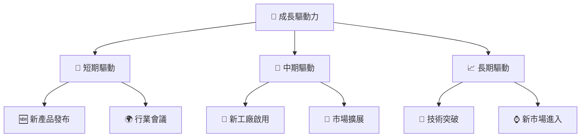

---

## 9. 風險矩陣

### 9.1 風險評分矩陣

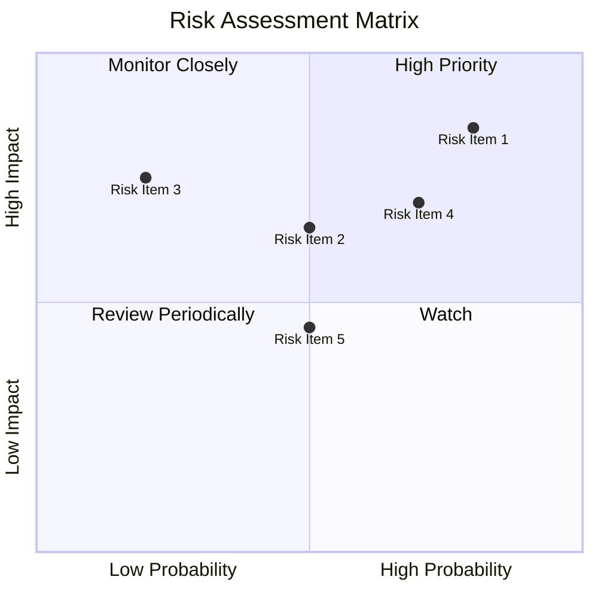

### 9.2 風險清單詳細分析

| # | 風險項目 | 發生機率 | 財務衝擊 | 風險評分 | 緩解措施 |
|---|----------|----------|----------|----------|----------|
| 1 | 🔴 **技術快速變遷** | 高 (80%) | 高 (-20%收入) | 🔴 8.5/10 | 增加研發投入，保持技術領先 |
| 2 | 🟡 **市場競爭激烈** | 中 (50%) | 中 (-10%收入) | 🟡 6.5/10 | 加強品牌影響力，擴大市場份額 |
| 3 | 🟢 **供應鏈中斷** | 低 (20%) | 高 (-15%收入) | 🟡 7.5/10 | 多元化供應商，增強供應鏈彈性 |

---

## 10. 投資建議

### 10.1 最終綜合評級雷達圖

```
╔══════════════════════════════════════════════════════════════════╗
║                   多維度評分雷達圖                               ║
╠══════════════════════════════════════════════════════════════════╣
║                                                                  ║
║  基本面： 9.0 ★★★★★                                              ║
║  成長動能： 9.0 ★★★★★                                            ║
║  獲利品質： 8.0 ★★★★☆                                            ║
║  財務健康： 8.0 ★★★★☆                                            ║
║  估值合理性： 8.0 ★★★★☆                                          ║
║                                                                  ║
╚══════════════════════════════════════════════════════════════════╝
```

### 10.2 目標價與隱含報酬率

| 情境 | 目標價 | 隱含報酬率 | 機率權重 |
|------|--------|------------|----------|
| 悲觀 | $320   | -38.7%     | 20%      |
| 基準 | $570   | +9.2%      | 60%      |
| 樂觀 | $1250  | +139.5%    | 20%      |

### 10.3 買入時機與觸發因素

```
╔══════════════════════════════════════════════════════════════════╗
║                  ✅ 買入觸發因素 Checklist                      ║
╠══════════════════════════════════════════════════════════════════╣
║                                                                  ║
║  立即買入觸發條件（多數符合）：                                  ║
║  ✅ 收入增長持續超預期                                            ║
║  ✅ 技術突破成功商業化                                            ║
║  ✅ 估值回到合理範圍                                              ║
║                                                                  ║
║  加碼觸發條件（出現以下任一）：                                  ║
║  ☐ 新市場進入成功                                                ║
║  ☐ 市場份額顯著提升                                              ║
║                                                                  ║
║  減碼/停損觸發條件（出現以下任一）：                             ║
║  ☐ 技術領先地位受威脅                                            ║
║  ☐ 財務健康惡化                                                  ║
╚══════════════════════════════════════════════════════════════════╝
```

### 10.4 投資人適配度分析

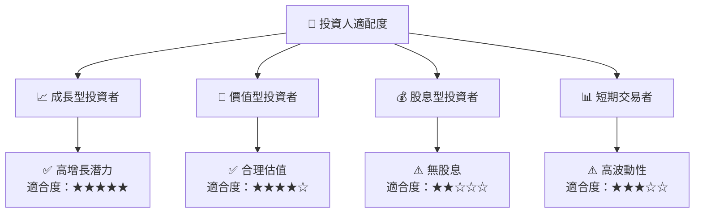

### 10.5 每季財報監控清單（Quarterly Watch List）

| 指標 | 觸發加碼 | 觸發減碼 |
|------|----------|----------|
| 核心業務成長率 | > 15% | < 5% |
| 營業利潤率 | > 20% | < 10% |
| Capex | < $1B | > $2B |
| FCF | > $2B | < $1B |
| 庫存 | < $8B | > $10B |

### 10.6 反面論證：什麼會證明論點錯誤（What Would Change My Mind）

```
╔══════════════════════════════════════════════════════════════════╗
║              ⚠️ 論點失效條件（Disconfirming Evidence）           ║
╠══════════════════════════════════════════════════════════════════╣
║  本投資論點在下列情況成立時應重新檢視或退出：                    ║
║  ☐ 核心業務成長率連續兩季 < 5%                                   ║
║  ☐ 營業利潤率較峰值收縮 > 5 pp                                   ║
║  ☐ 自由現金流轉負或 FCF 轉換率 < 50%                             ║
║  ☐ ROIC 跌破 WACC                                               ║
║  ☐ 關鍵成長投資（如 AI/新業務）無法在 3 期內變現               ║
╚══════════════════════════════════════════════════════════════════╝
```

---

> **免責聲明**：本報告為 AI 自動生成，僅供研究參考，不構成投資建議。投資有風險，入市需謹慎。