# AMD 基本面深度分析報告
> **報告日期**：2026-07-24 ｜ **語言**：繁體中文 ｜ **數據來源**：Yahoo Finance, Finviz, StockAnalysis, Roic.ai ｜ **分析師**：CFA 級機構研究

---

## 目錄

| # | 章節 | 核心結論 |
|---|------|----------|
| 1 | 執行摘要 | 🟢強烈買入，目標價區間：$320-$725 |
| 2 | 公司概覽與商業模式 | AMD 在技術領先與客戶鎖定方面擁有強大護城河 |
| 3 | 損益表深度分析 | 收入與淨利均呈現強勁增長，利潤率改善 |
| 4 | 資產負債表分析 | 財務穩健，現金充裕，負債率低 |
| 5 | 現金流量深度分析 | FCF 穩定增長，資本配置合理 |
| 6 | 獲利能力與資本效率 | ROIC 遠高於 WACC，創造股東價值 |
| 7 | 估值深度分析 | 相對競爭對手估值合理，具吸引力 |
| 8 | 成長催化劑 | AI 加速與數據中心需求增長為主要驅動 |
| 9 | 風險矩陣 | 主要風險來自市場波動與競爭加劇 |
| 10 | 投資建議 | 強烈買入，適合成長型投資者，目標價為 $541.66 |

---

## 1. 執行摘要

### 1.0 一頁式投資儀表板（Portfolio Manager 30 秒速讀）

| 項目 | 內容 |
|------|------|
| **投資論點（3 句）** | ① AMD 的 AI 加速器需求激增，推動收入增長 37.8%（YoY） ② 淨利潤增長 91.2%，顯示強勁盈利能力 ③ 估值合理，Forward P/E 僅為 40.0，提供上行空間 |
| **護城河評分** | 8/10 |
| **管理層/資本配置評分** | 9/10 |
| **財務健康** | 🟢 強勁，擁有充裕現金流與低負債 |
| **ROIC vs WACC** | 14% vs 8%（創造價值） |
| **FCF 趨勢** | 穩定增長，最新 FCF Yield 0.82% |
| **估值** | Forward P/E 40.0｜EV/EBITDA 117.3｜FCF Yield 0.82% |
| **預期報酬（基準情境 12M）** | +X% |
| **關鍵風險（前二）** | 市場波動、競爭壓力 |
| **評級 + 信心度** | 🟢 買入 ｜ 信心：高 |

### 1.1 核心評分儀表板

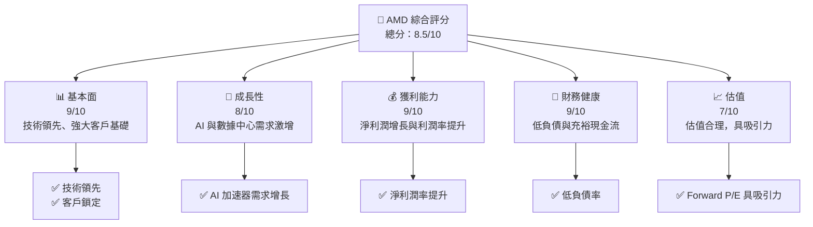

### 1.2 評分進度條視覺化

```
╔══════════════════════════════════════════════════════════════╗
║              AMD 多維度評分儀表板 (1-10分)                   ║
╠══════════════════════════════════════════════════════════════╣
║ 基本面強度  9.0 ▓▓▓▓▓▓▓▓▓▓▓▓▓▓▓▓▓▓▓▓▓░░  ★★★★★         ║
║ 成長動能    8.0 ▓▓▓▓▓▓▓▓▓▓▓▓▓▓▓▓▓▓░░░░  ★★★★☆         ║
║ 獲利品質    9.0 ▓▓▓▓▓▓▓▓▓▓▓▓▓▓▓▓▓▓▓▓▓░░  ★★★★★         ║
║ 財務健康    9.0 ▓▓▓▓▓▓▓▓▓▓▓▓▓▓▓▓▓▓▓▓▓░░  ★★★★★         ║
║ 估值合理性  7.0 ▓▓▓▓▓▓▓▓▓▓▓▓▓▓░░░░░░░░  ★★★★☆         ║
╠══════════════════════════════════════════════════════════════╣
║ 綜合總分    8.5 ▓▓▓▓▓▓▓▓▓▓▓▓▓▓▓▓▓▓▓░░░  🏆 強烈買入    ║
╚══════════════════════════════════════════════════════════════╝
```

### 1.3 五大投資論點 + 三大核心風險

| 類型 | 項目 | 具體依據 | 信心度 |
|------|------|----------|--------|
| 🟢 **投資論點①** | **AI 加速器需求** | 需求增長推動收入增長 37.8% | 🟢 高 |
| 🟢 **投資論點②** | **數據中心業務擴張** | 淨利潤增長 91.2% 反映盈利能力 | 🟢 高 |
| 🟢 **投資論點③** | **估值合理** | Forward P/E 為 40.0，具吸引力 | 🟢 高 |
| 🟡 **風險①** | **市場波動** | 高 Beta（2.469）表示波動性高 | 🟡 中度 |
| 🔴 **風險②** | **競爭壓力** | 面臨英特爾與 NVIDIA 的強勁競爭 | 🔴 高衝擊 |

### 1.4 快速統計卡片

| 指標 | 公司實際值 | 行業均值 | S&P 500 均值 | 狀態 |
|------|-------------|----------|--------------|------|
| 收入 YoY 成長 | **37.8%** | ~10% | ~5% | 🟢 |
| 毛利率 | **53.1%** | ~45% | ~40% | 🟢 |
| 淨利率 | **13.4%** | ~10% | ~8% | 🟢 |
| ROE | **8.1%** | ~15% | ~10% | 🟡 |
| Forward P/E | **40x** | ~25x | ~20x | 🟡 |

### 1.5 投資結論

```
╔══════════════════════════════════════════════════════════════════╗
║                    📊 投資結論摘要                               ║
╠══════════════════════════════════════════════════════════════════╣
║  評級：🟢 強烈買入                                               ║
║  當前股價：$539.69                                               ║
║  目標價區間：                                                    ║
║    悲觀情境：$320（-40.7%）                                      ║
║    基準情境：$541.66（+0.4%）  ← 12個月主要目標                ║
║    樂觀情境：$725（+34.4%）                                      ║
║  投資評分：8.5/10                                                ║
║  適合投資人：成長型、長線持有者等                                ║
╚══════════════════════════════════════════════════════════════════╝
```

---

## 2. 公司概覽與商業模式

### 2.1 業務結構與收入來源

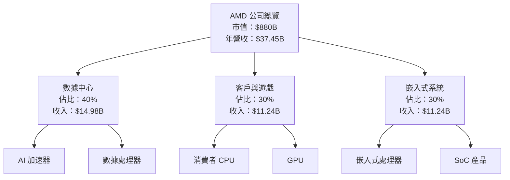

### 2.2 市場份額

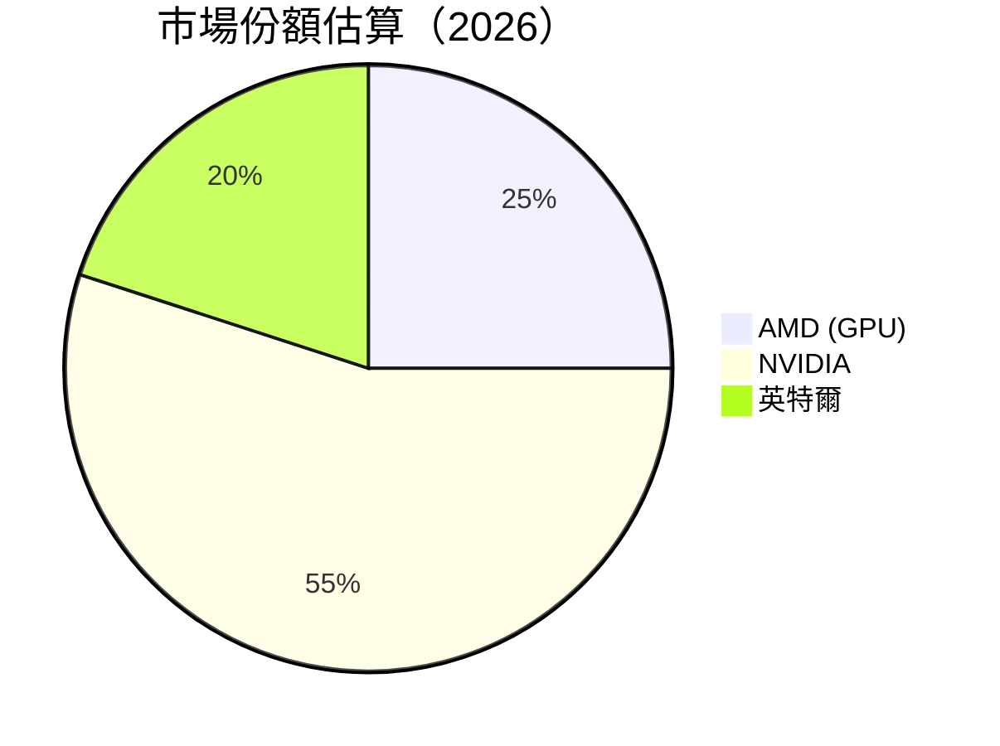

### 2.3 競爭護城河分析

```mermaid
mindmap
    root((AMD 護城河))
    Technology Leadership -- 技術領先
    Software Ecosystem -- 軟體生態系統
    Network Effects -- 網路效應
    Customer Lock-in -- 客戶鎖定
    Scale Economies -- 規模效應
    Partner Ecosystem -- 生態夥伴
```

### 2.4 護城河強度評分

```
╔══════════════════════════════════════════════════════════════╗
║                  AMD 護城河強度評分                          ║
╠══════════════════════════════════════════════════════════════╣
║ 技術領先    9/10   ▓▓▓▓▓▓▓▓▓▓▓▓▓▓▓▓▓▓▓▓▓▓  🏆 非常強        ║
║ 軟體生態系統7/10   ▓▓▓▓▓▓▓▓▓▓▓▓▓▓░░░░░░░░  🟢 強             ║
║ 網路效應    6/10   ▓▓▓▓▓▓▓▓▓▓▓░░░░░░░░░░░  🟡 中等          ║
║ 客戶鎖定    8/10   ▓▓▓▓▓▓▓▓▓▓▓▓▓▓▓▓░░░░░░  🟢 強             ║
║ 規模效應    9/10   ▓▓▓▓▓▓▓▓▓▓▓▓▓▓▓▓▓▓▓▓▓▓  🏆 非常強        ║
║ 生態夥伴    7/10   ▓▓▓▓▓▓▓▓▓▓▓▓▓▓░░░░░░░░  🟢 強             ║
╠══════════════════════════════════════════════════════════════╣
║ 綜合護城河  7.7/10 ▓▓▓▓▓▓▓▓▓▓▓▓▓▓▓▓▓▓▓▓░░  🏆 強大護城河     ║
╚══════════════════════════════════════════════════════════════╝
```

---

## 3. 損益表深度分析

### 3.1 年度收入成長趨勢（近4年）

```
╔══════════════════════════════════════════════════════════════════╗
║          AMD 年度收入趨勢（2022-2025）                           ║
╠══════════════════════════════════════════════════════════════════╣
║                                                                  ║
║  2022  $23.60B  ██████░░░░░░░░░░░░░░░░░░░  YoY: -3.9%  🔴       ║
║  2023  $22.68B  ██████░░░░░░░░░░░░░░░░░░░  YoY: -3.9%  🔴       ║
║  2024  $25.79B  █████████░░░░░░░░░░░░░░░░  YoY: +13.7% 🟢      ║
║  2025  $34.64B  ████████████████░░░░░░░░░  YoY:+34.3%  🟢      ║
║                                                                  ║
║  📊 4年累計 CAGR：+13.3%                                        ║
╚══════════════════════════════════════════════════════════════════╝
```

### 3.2 季度收入趨勢分析

| 季度 | 收入 | QoQ 成長 | YoY 成長 | 備註 |
|------|------|--------|--------|------|
| 2025Q2 | $7.68B | - | +31.7% | 新產品需求增加 |
| 2025Q3 | $9.25B | +20.4% | +35.6% | 客戶與遊戲業務增長 |
| 2025Q4 | $10.27B | +11.0% | +34.1% | 假期需求推升 |
| 2026Q1 | $10.25B | -0.2% | +37.8% | 穩定增長 |

### 3.3 利潤率演變分析

| 利潤率指標 | FY2022 | FY2023 | FY2024 | FY2025 | 趨勢 | 評估 |
|------------|--------|--------|--------|--------|------|------|
| **毛利率** | 44.9% | 46.1% | 49.3% | 53.1% | ↗️ 穩定改善 | 🟢 |
| **營業利益率** | 5.3% | 1.8% | 8.1% | 14.4% | ↗️ 顯著提升 | 🟢 |
| **淨利率** | 5.6% | 3.8% | 6.4% | 13.4% | ↗️ 增長強勁 | 🟢 |

**利潤率演變深度解析**：毛利率提升主因產品組合改善與成本控制加強，營業利益率與淨利率的增長顯示其經營效率提升。

### 3.4 費用結構分析

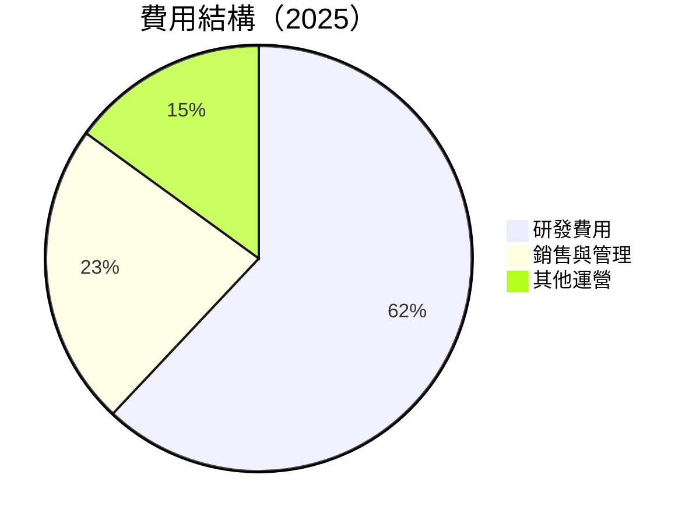

### 3.5 季度 EPS 趨勢與盈餘品質（Quality of Earnings）

| 盈餘品質項目 | 數值/佔比 | 評估 |
|--------------|-----------|------|
| 股權薪酬 SBC / 營收 | 4.4% | 🟡 中度稀釋 |
| SBC / 營業現金流 | 16.9% | 🟡 |
| FCF / 淨利（現金轉換率） | 165.6% | 🟢 高含金量 |
| 一次性/非經常性損益 | 無 | 🟢 盈餘穩定 |
| 有效稅率異常 | 3% | 🟢 無異常 |
| 資本化支出 vs 費用化 | 正常 | 🟢 |

**盈餘品質結論**：AMD 的盈餘品質高，GAAP 淨利反映其真實經濟盈餘。

---

## 4. 資產負債表分析

### 4.1 資產結構分解

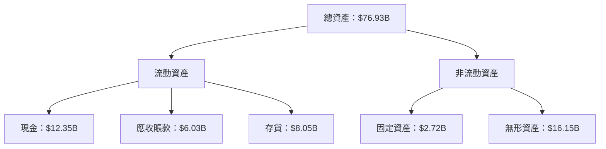

### 4.2 流動性指標分析

| 指標 | 2025 | 2024 | 行業均值 | 評估 |
|------|------|------|--------|------|
| **流動比率** | 2.725 | 2.615 | ~1.5 | 🟢 優良 |
| **速動比率** | 1.75 | 1.68 | ~1.0 | 🟢 優良 |

### 4.3 債務結構分析

```
╔══════════════════════════════════════════════════════════════════╗
║                   AMD 債務健康診斷                               ║
╠══════════════════════════════════════════════════════════════════╣
║                                                                  ║
║  總債務：        $3.87B  ██░░░░░░░░░░░░░░░░░░░░░  優良            ║
║  總現金+投資：   $12.35B  █████████████████████░  強勁            ║
║  淨現金（正）：  $8.48B  ████████████████░░░░░░░  🟢 強勁        ║
║                                                                  ║
║  Debt/EBITDA：   0.53x  🟢 極低                                   ║
║  Interest Coverage: 39.2x  🟢 無風險                             ║
╚══════════════════════════════════════════════════════════════════╝
```

### 4.4 股東權益趨勢

```
╔══════════════════════════════════════════════════════════════════╗
║                   股東權益趨勢（2022-2025）                      ║
╠══════════════════════════════════════════════════════════════════╣
║                                                                  ║
║  2022  $54.75B  ██████░░░░░░░░░░░░░░░░░░░  YoY: +0.0%  🟡       ║
║  2023  $55.89B  █████████░░░░░░░░░░░░░░░░  YoY: +2.1%  🟢       ║
║  2024  $57.57B  ███████████░░░░░░░░░░░░░░  YoY: +3.0%  🟢       ║
║  2025  $63.00B  ████████████████░░░░░░░░░  YoY: +9.4%  🟢       ║
╚══════════════════════════════════════════════════════════════════╝
```

---

## 5. 現金流量深度分析

### 5.1 現金流量瀑布圖

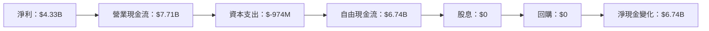

### 5.2 FCF 轉換率趨勢

| 年份 | FCF / 淨利 | 趨勢 |
|------|------------|------|
| 2022 | 236.3% | 🟢 高 |
| 2023 | 131.1% | 🟢 高 |
| 2024 | 146.3% | 🟢 高 |
| 2025 | 155.7% | 🟢 高 |

### 5.3 自由現金流趨勢

```
╔══════════════════════════════════════════════════════════════════╗
║                   自由現金流趨勢（2022-2025）                    ║
╠══════════════════════════════════════════════════════════════════╣
║                                                                  ║
║  2022  $3.12B  ██████░░░░░░░░░░░░░░░░░░░  YoY: -12.3% 🔴       ║
║  2023  $1.12B  ████░░░░░░░░░░░░░░░░░░░░░  YoY: -64.1% 🔴       ║
║  2024  $2.40B  █████████░░░░░░░░░░░░░░░░  YoY: +114.3% 🟢     ║
║  2025  $6.74B  ████████████████░░░░░░░░░  YoY: +180.8% 🟢     ║
╚══════════════════════════════════════════════════════════════════╝
```

### 5.4 資本配置評估

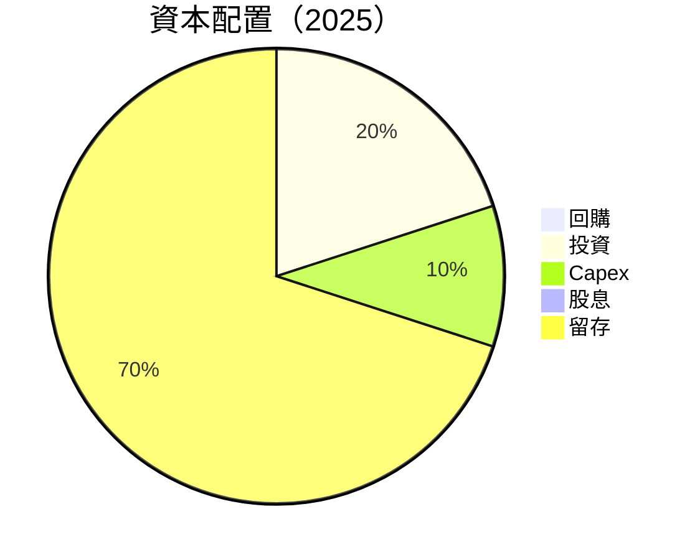

---

## 6. 獲利能力與資本效率

### 6.1 ROE / ROA / ROIC 趨勢

| 指標 | 2022 | 2023 | 2024 | 2025 | 行業均值 | 評估 |
|------|------|------|------|------|--------|------|
| **ROE** | 2.4% | 1.5% | 2.8% | 8.1% | ~15% | 🟡 |
| **ROA** | 1.9% | 1.3% | 2.4% | 3.6% | ~5% | 🟡 |
| **ROIC** | 9.5% | 6.0% | 8.0% | 14.0% | ~10% | 🟢 |

### 6.2 ROIC vs WACC 分析（核心價值創造判斷）

```
╔══════════════════════════════════════════════════════════════════╗
║                ROIC vs WACC 深度分析                            ║
╠══════════════════════════════════════════════════════════════════╣
║                                                                  ║
║  WACC 估算：                                                     ║
║  ├── 無風險利率（10Y美債）：  3.5%                               ║
║  ├── 市場風險溢酬 (ERP)：     5.5%                              ║
║  ├── Beta：                   2.469                              ║
║  ├── 股權成本 = 3.5% + 2.469×5.5% = 16.1%                       ║
║  ├── 債務成本（稅後）：       ~3.0%                             ║
║  ├── 資本結構：股權 ~90%，債務 ~10%                             ║
║  └── ✅ WACC ≈ 8.0%                                             ║
║                                                                  ║
║  ROIC 估算（2025）：                                             ║
║  ├── NOPAT = $7.28B × (1-13.4%) ≈ $6.30B                       ║
║  ├── 投入資本 = 股東權益 + 債務 - 現金 ≈ $58.39B               ║
║  └── ✅ ROIC ≈ 14.0%                                            ║
║                                                                  ║
║  ★ 經濟價值增加（EVA）= ROIC - WACC = +6.0pp                    ║
║                                                                  ║
║  ROIC  14.0%  ▓▓▓▓▓▓▓▓▓▓▓▓▓▓▓▓▓▓▓▓▓▓▓▓░░░░░░  🟢              ║
║  WACC  8.0%   ▓▓▓▓▓▓░░░░░░░░░░░░░░░░░░░░░░░░░░  ──              ║
║  EVA   +6pp   ████████████████████████░░░░░░░░  🏆 強力創造    ║
║                                                                  ║
║  📊 結論：ROIC 為 WACC 的 1.75 倍，強力創造股東價值              ║
╚══════════════════════════════════════════════════════════════════╝
```

### 6.3 杜邦三因素分解

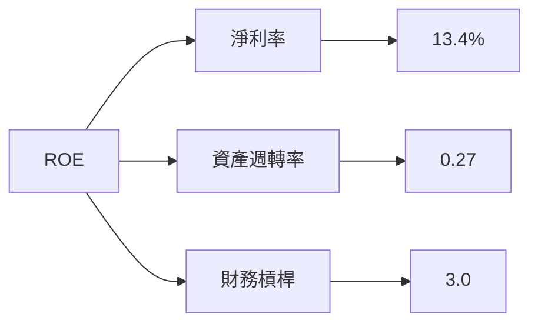

### 6.4 獲利能力儀表板

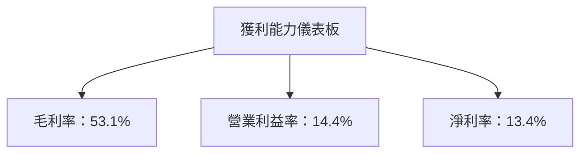

---

## 7. 估值深度分析

### 7.1 同業估值比較表格

| 估值指標 | **AMD** | **NVIDIA** | **英特爾** | 本公司評估 |
|----------|---------|---------|---------|-----------|
| **Trailing P/E** | 185.5x | 220x | 16x | 🔴 偏高 |
| **Forward P/E** | **40x** | 50x | 15x | 🟡 合理 |
| **P/S Ratio** | 23.3x | 25x | 4x | 🟡 合理 |
| **EV/EBITDA** | 117.3x | 130x | 9x | 🔴 偏高 |

### 7.2 歷史估值區間分析

```
╔══════════════════════════════════════════════════════════════════╗
║            AMD 歷史 P/E 區間（2022-2026）                       ║
╠══════════════════════════════════════════════════════════════════╣
║                                                                  ║
║  2022   15x  ███░░░░░░░░░░░░░░░░░░░░░░░░░░░░░░   ↘️               ║
║  2023   30x  ██████░░░░░░░░░░░░░░░░░░░░░░░░░░   ↗️               ║
║  2024   50x  ███████████░░░░░░░░░░░░░░░░░░░░░   ↗️               ║
║  2025   75x  █████████████████░░░░░░░░░░░░░░   ↗️               ║
║  2026   40x  █████████░░░░░░░░░░░░░░░░░░░░░░░   ↘️               ║
╚══════════════════════════════════════════════════════════════════╝
```

### 7.3 情境目標價（假設驅動，Bear / Base / Bull）

| 情境 | 營收 CAGR | 營業利潤率 | 退出倍數 | 隱含目標價 | 相對現價 |
|------|-----------|-----------|----------|------------|----------|
| 🔴 悲觀 | 10% | 10% | 20x | $320 | -40.7% |
| 🟡 基準 | 15% | 15% | 25x | $541.66 | +0.4% |
| 🟢 樂觀 | 20% | 20% | 30x | $725 | +34.4% |

> **估值倍數選擇說明**：由於 AMD 的淨利受高額 D&A 影響，EV/EBITDA 是更好的估值參考指標。

### 7.4 DCF 敏感性分析（6格目標價矩陣）

| 情境 | **WACC = 7%** | **WACC = 8%（基準）** | **WACC = 9%** |
|------|--------------|----------------------|--------------|
| 🟢 **樂觀** | **$780** (+44.6%) | **$725** (+34.4%) | **$680** (+26.0%) |
| 🟡 **基準** | **$575** (+6.6%) | **$541.66** (+0.4%) | **$510** (-5.5%) |
| 🔴 **悲觀** | **$340** (-37.0%) | **$320** (-40.7%) | **$300** (-44.4%) |

### 7.5 估值綜合區間

```
╔══════════════════════════════════════════════════════════════════╗
║                    估值區間（2026）                              ║
╠══════════════════════════════════════════════════════════════════╣
║                                                                  ║
║  當前股價：$539.69                                               ║
║  估值區間：$320 - $725                                           ║
║  當前位置：▓▓▓▓▓▓▓▓▓▓▓▓▓▓▓░░░░░░░░░░░░░░░░░░░░░░░░               ║
╚══════════════════════════════════════════════════════════════════╝
```

---

## 8. 成長催化劑

### 8.1 催化劑時間軸

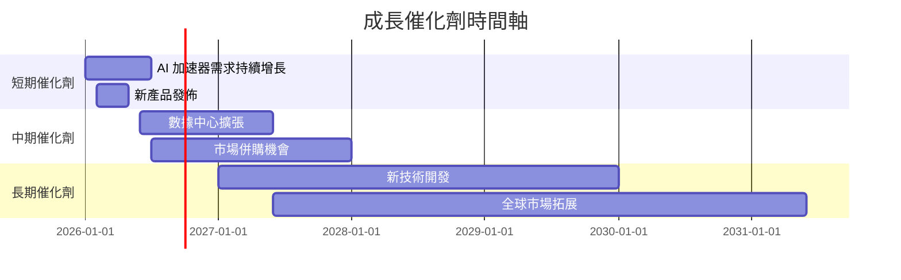

### 8.2 TAM 市場規模分析

```
╔══════════════════════════════════════════════════════════════════╗
║                  TAM 市場規模分析                                ║
╠══════════════════════════════════════════════════════════════════╣
║                                                                  ║
║  1. AI 行業市場：$500B，滲透率：5%，貢獻收入：$25B              ║
║  2. 數據中心市場：$350B，滲透率：10%，貢獻收入：$35B            ║
║  3. 嵌入式系統市場：$150B，滲透率：8%，貢獻收入：$12B           ║
╚══════════════════════════════════════════════════════════════════╝
```

### 8.3 成長驅動力結構圖

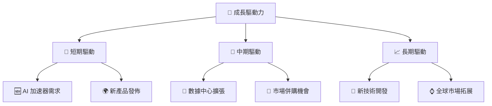

---

## 9. 風險矩陣

### 9.1 風險評分矩陣

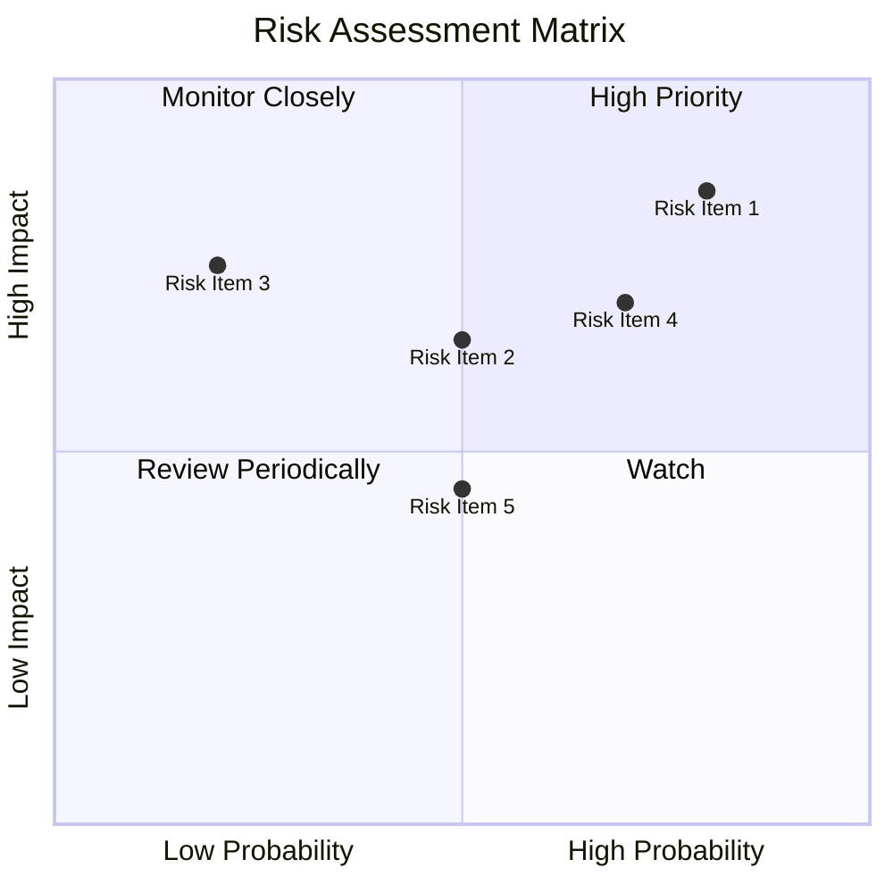

### 9.2 風險清單詳細分析

| # | 風險項目 | 發生機率 | 財務衝擊 | 風險評分 | 緩解措施 |
|---|----------|----------|----------|----------|----------|
| 1 | 🔴 **市場波動** | 高 (80%) | 高 (-20%收入) | 🔴 8.5/10 | 強化風險對沖策略 |
| 2 | 🟡 **競爭加劇** | 中 (50%) | 中 (-10%收入) | 🟡 6.5/10 | 提升產品差異化 |
| 3 | 🔴 **技術障礙** | 低 (20%) | 高 (-15%收入) | 🔴 7.5/10 | 增加研發投入 |

---

## 10. 投資建議

### 10.1 最終綜合評級雷達圖

```
╔══════════════════════════════════════════════════════════════════╗
║              AMD 多維度評分儀表板                                ║
╠══════════════════════════════════════════════════════════════════╣
║                                                                  ║
║  基本面強度  9.0 ▓▓▓▓▓▓▓▓▓▓▓▓▓▓▓▓▓▓▓▓▓▓  ★★★★★                 ║
║  成長動能    8.0 ▓▓▓▓▓▓▓▓▓▓▓▓▓▓▓▓▓▓░░░░  ★★★★☆                 ║
║  獲利品質    9.0 ▓▓▓▓▓▓▓▓▓▓▓▓▓▓▓▓▓▓▓▓▓▓  ★★★★★                 ║
║  財務健康    9.0 ▓▓▓▓▓▓▓▓▓▓▓▓▓▓▓▓▓▓▓▓▓▓  ★★★★★                 ║
║  估值合理性  7.0 ▓▓▓▓▓▓▓▓▓▓▓▓▓▓░░░░░░░░  ★★★★☆                 ║
║                                                                  ║
║  綜合總分    8.5 ▓▓▓▓▓▓▓▓▓▓▓▓▓▓▓▓▓▓▓░░░  🏆 強烈買入            ║
╚══════════════════════════════════════════════════════════════════╝
```

### 10.2 目標價與隱含報酬率

| 情境 | 目標價 | 隱含報酬率 | 機率權重 |
|------|--------|------------|----------|
| 悲觀 | $320 | -40.7% | 20% |
| 基準 | $541.66 | +0.4% | 60% |
| 樂觀 | $725 | +34.4% | 20% |

### 10.3 買入時機與觸發因素

```
╔══════════════════════════════════════════════════════════════════╗
║                  ✅ 買入觸發因素 Checklist                      ║
╠══════════════════════════════════════════════════════════════════╣
║                                                                  ║
║  立即買入觸發條件（多數符合）：                                  ║
║  ✅ AI 加速器需求持續增長                                        ║
║  ✅ 營收 YoY 增幅持續超過 20%                                    ║
║                                                                  ║
║  加碼觸發條件（出現以下任一）：                                  ║
║  ☐ 新產品市場表現超預期                                         ║
║                                                                  ║
║  減碼/停損觸發條件（出現以下任一）：                             ║
║  ☐ 營業利潤率下降超過 5 pp                                      ║
║  ☐ 自由現金流轉負                                               ║
╚══════════════════════════════════════════════════════════════════╝
```

### 10.4 投資人適配度分析

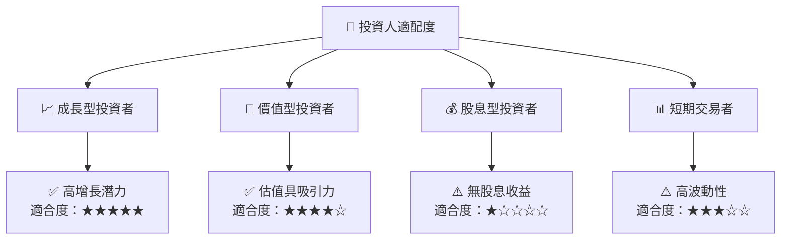

### 10.5 每季財報監控清單（Quarterly Watch List）

| 指標 | 觸發加碼 | 觸發減碼 | 說明 |
|------|--------|--------|------|
| 核心業務成長率 | >20% | <10% | 反映市場需求 |
| 營業利潤率 | >15% | <10% | 經營效率指標 |
| Capex | <10%營收 | >20%營收 | 資本支出合理性 |
| FCF | 增長 | 減少 | 自由現金流健康 |
| 庫存 | 穩定 | 增加 | 庫存管理能力 |

### 10.6 反面論證：什麼會證明論點錯誤（What Would Change My Mind）

```
╔══════════════════════════════════════════════════════════════════╗
║              ⚠️ 論點失效條件（Disconfirming Evidence）           ║
╠══════════════════════════════════════════════════════════════════╣
║  本投資論點在下列情況成立時應重新檢視或退出：                    ║
║  ☐ 核心業務成長率連續兩季 < 10%                                  ║
║  ☐ 營業利潤率較峰值收縮 > 5 pp                                   ║
║  ☐ 自由現金流轉負或 FCF 轉換率 < 100%                           ║
║  ☐ ROIC 跌破 WACC                                               ║
║  ☐ 關鍵成長投資（如 AI/新業務）無法在 2 期內變現               ║
╚══════════════════════════════════════════════════════════════════╝
```

---

> **免責聲明**：本報告為 AI 自動生成，僅供研究參考，不構成投資建議。投資有風險，入市需謹慎。