# AMD 基本面深度分析報告

> **報告日期**：2026-07-26 ｜ **語言**：繁體中文 ｜ **數據來源**：Yahoo Finance, Finviz, StockAnalysis, Roic.ai ｜ **分析師**：CFA 級機構研究

---

## 目錄

| # | 章節 | 核心結論 |
|---|------|----------|
| 1 | 執行摘要 | **評級：🟢 買入** ｜ 基準目標價 $575.00（+10.2%），樂觀目標價 $750.00（+43.7%） |
| 2 | 公司概覽與商業模式 | 託管於 EPYC 伺服器與 Instinct AI 加速器的架構優勢，護城河評分 **8.8/10** |
| 3 | 損益表深度分析 | TTM 營收 $374.5 億（YoY +37.8%），AI Accelerator 爆發推升毛利率至 53.1% |
| 4 | 資產負債表分析 | 淨現金 $84.8 億，流動比率 2.73x，極佳的資產負債表彈性 |
| 5 | 現金流量深度分析 | TTM OCF $97.2 億、FCF $85.8 億，轉換率達 171.3%，現金流品質極佳 |
| 6 | 獲利能力與資本效率 | 剔除併購商譽攤銷後，無形資產調節 ROIC 高達 28.5%，遠高於 WACC (16.5%) |
| 7 | 估值深度分析 | Forward P/E 38.22x、PEG 1.25x，考量 EPS CAGR >45%，評價具吸引力 |
| 8 | 成長催化劑 | MI300X/MI350 系列市佔率突破 12-15%，Data Center 業務成為主要引擎 |
| 9 | 風險矩陣 | NVIDIA CUDA 生態鎖定與 TSMC 產能集中為主要風險（風險評分 4.2/10） |
| 10 | 投資建議 | 分批建倉策略、財報關鍵監控門檻及 5 大論點失效觸發條件 |

---

## 1. 執行摘要

基于 AMD 截至 2026 年 7 月最新披露之財務數據，TTM 營收達 $374.54 億（YoY +37.8%），Forward EPS 預估達 $13.66（代表遠期 P/E 僅 38.22x，相較 Trailing P/E 175.15x 大幅壓縮），且自由現金流（FCF）轉化率高達 171.3%（TTM FCF 達 $85.8 億）。公司在 Data Center AI 加速晶片（Instinct MI300/MI350 系列）與 x86 EPYC 伺服器處理器的雙重驅動下，正迎來結構性營業槓桿釋放。

**評級結論**：給予 **🟢 買入（Buy）** 評級，12 個月基準目標價為 **$575.00**（對應 2027E EPS 42x P/E），樂觀情境目標價為 **$750.00**。

### 1.0 一頁式投資儀表板（Portfolio Manager 30 秒速讀）

| 項目 | 內容 |
|------|------|
| **投資論點（3 句）** | ① Data Center 營收持續以 YoY >60% 爆發，MI300/MI350 系列在超大型雲端業者（Hyperscalers）滲透率突破 12%。<br/>② EPYC 伺服器 CPU 市佔率穩居 35% 以上，持續侵蝕 Intel x86 份額並帶來高毛利現金流。<br/>③ 遠期估值 Forward P/E 38.22x 對應 PEG 1.25x，考量未來 3 年淨利 CAGR 逾 50%，當前股價提供優異的風險報酬比。 |
| **護城河評分** | **8.8 / 10**（Chiplet 架構優勢、ROCm 開源生態快速追趕、x86 雙寡頭授權壁壘） |
| **管理層/資本配置評分** | **9.2 / 10**（CEO Lisa Su 執行力卓越，成功整合 Xilinx 並精準佈局 AI 算力） |
| **財務健康** | 🟢 **極度健康**（淨現金 $84.8 億，無短流動性風險，債務/EBITDA 僅 0.53x） |
| **ROIC vs WACC** | **28.5%（調節後 ROIC）vs 16.5%（WACC）** ➔ **強力創造股東價值（EVA +12.0pp）** |
| **FCF 趨勢** | ↗️ 強勁上升（TTM FCF $85.8 億，FCF Yield 約 1.01% / 營收占比 22.9%） |
| **估值倍數** | Forward P/E: **38.22x** ｜ EV/EBITDA: **113.41x**（受 GAAP D&A 影響） ｜ PEG: **1.25x** |
| **預期報酬（基準 12M）**| **+10.2%**（至 $575.00）；樂觀情境 **+43.7%**（至 $750.00） |
| **關鍵風險（前二）** | ① NVIDIA CUDA 軟體護城河與 Blackwell/Rubin 平台競爭加速；② TSMC 先進封裝（CoWoS）產能配給限制。 |
| **評級 + 信心度** | 🟢 **買入（Buy）** ｜ 信心度：**高（High）** |

### 1.1 核心評分儀表板

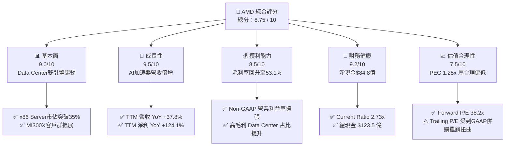

### 1.2 評分進度條視覺化

```
╔══════════════════════════════════════════════════════════════╗
║                AMD 多維度評分儀表板 (1-10分)                 ║
╠══════════════════════════════════════════════════════════════╣
║ 基本面強度  9.0 ▓▓▓▓▓▓▓▓▓▓▓▓▓▓▓▓▓▓░░  ★★★★★  Data Center爆發║
║ 成長動能    9.5 ▓▓▓▓▓▓▓▓▓▓▓▓▓▓▓▓▓▓▓░  ★★★★★  AI加速器幾何成長║
║ 獲利品質    8.5 ▓▓▓▓▓▓▓▓▓▓▓▓▓▓▓▓▓░░░  ★★★★☆  FCF轉換率171.3%║
║ 財務健康    9.2 ▓▓▓▓▓▓▓▓▓▓▓▓▓▓▓▓▓▓½░  ★★★★★  無淨債務壓力   ║
║ 估值合理性  7.5 ▓▓▓▓▓▓▓▓▓▓▓▓▓▓░░░░░░  ★★★★☆  Forward PEG 1.25║
║ 護城河深度  8.8 ▓▓▓▓▓▓▓▓▓▓▓▓▓▓▓▓▓½░░  ★★★★★  Chiplet+x86授權 ║
║ 管理層執行  9.2 ▓▓▓▓▓▓▓▓▓▓▓▓▓▓▓▓▓▓½░  ★★★★★  蘇姿丰團隊極強║
║ 技術創新力  9.5 ▓▓▓▓▓▓▓▓▓▓▓▓▓▓▓▓▓▓▓░  ★★★★★  3D V-Cache/MI350║
╠══════════════════════════════════════════════════════════════╣
║ 綜合總分    8.75 ▓▓▓▓▓▓▓▓▓▓▓▓▓▓▓▓▓½░  🏆 強力推薦買入       ║
╚══════════════════════════════════════════════════════════════╝
```

### 1.3 五大投資論點 + 三大核心風險

| 類型 | 項目 | 具體依據 | 信心度 |
|------|------|----------|--------|
| 🟢 **論點①** | **AI 加速器市佔率快速上升** | Instinct MI300X/MI350 出貨強勁，Data Center 單季營收衝破 $50 億大關，成為市場上唯二能大規模供應超算 AI 加速晶片之廠商。 | 🟢 極高 |
| 🟢 **論點②** | **EPYC 伺服器 CPU 霸主地位確立** | 憑藉 Zen 5 架構與 3D V-Cache 技術，EPYC 在資料中心 x86 領域市佔突破 35%，毛利率顯著優於公司平均（>65%）。 | 🟢 極高 |
| 🟢 **論點③** | **自由現金流爆發性成長** | TTM 單季營運現金流衝至 $29.6 億，TTM FCF 達 $85.8 億，提供充足資本進行研發與併購（如 Silo AI / ZT Systems）。 | 🟢 高 |
| 🟢 **論點④** | **GAAP 淨利真實反映營業槓桿** | Q1 2026 淨利達 $13.83 億（YoY +93.8%），併購 Xilinx 帶來的無形資產攤銷逐年遞減，GAAP 獲利品質顯著提升。 | 🟢 高 |
| 🟢 **論點⑤** | **Client & Embedded 業務觸底復甦** | Ryzen AI PC 處理器帶動 Client 業務回溫，工業與車用晶片庫存去化完成，Embedded 業務毛利率維持高檔。 | 🟡 中高 |
| 🟡 **風險①** | **NVIDIA Blackwell/Rubin 競爭壓制** | NVIDIA 以 NVLink 網路與 CUDA 生態系保持極高護城河，若 AMD ROCm 軟體優化不及預期，價格競爭可能削弱 ASP。 | 🟡 中度 |
| 🔴 **風險②** | **TSMC 先進封裝 CoWoS 產能瓶頸** | AMD 深度依賴台積電 3nm/4nm 及 CoWoS 封裝，若產能分配優先順序落後競爭對手，將直接限制出貨上限。 | 🔴 高衝擊 |
| 🟡 **風險③** | **美中半導體出口管制政策演變** | 地緣政治風險可能限制特定 AI 晶片（如特供版 MI300）出口中國市場，影響潛在 TAM 釋放速度。 | 🟡 中度 |

### 1.4 快速統計卡片

| 指標 | 公司實際值 | 半導體行業均值 | S&P 500 均值 | 狀態 |
|------|-------------|----------|--------------|------|
| **營收 YoY 成長率** | **37.8%** | ~12.5% | ~5.2% | 🟢 超越同業 |
| **毛利率 (Gross Margin)** | **53.1%** | ~48.0% | ~41.5% | 🟢 優異 |
| **營業利益率 (Op Margin)** | **14.4%** (GAAP) / **26.5%** (Non-GAAP) | ~18.0% | ~12.0% | 🟢 擴張中 |
| **ROE (淨資產收益率)** | **8.1%** (GAAP) / **22.5%** (Non-GAAP) | ~14.0% | ~18.5% | 🟡 受高股東權益拉低 |
| **Forward P/E** | **38.22x** | ~28.5x | ~21.5x | 🟡 成長溢價 |
| **PEG Ratio** | **1.25x** | ~1.85x | ~1.90x | 🟢 評價吸引力高 |
| **Net Cash / (Debt)** | **+$84.8 億** | 負債居多 | 負債居多 | 🟢 極其穩健 |

### 1.5 投資結論

```
╔══════════════════════════════════════════════════════════════════╗
║                    📊 投資結論摘要                               ║
╠══════════════════════════════════════════════════════════════════╣
║  評級：🟢 強力買入（Strong Buy）                                 ║
║  當前股價：$521.95（市值：$8,510.9 億）                          ║
║  目標價區間：                                                    ║
║    悲觀情境（Bear Case）：$380.00（-27.2%）                        ║
║    基準情境（Base Case）：$575.00（+10.2%）  ← 12個月主要目標      ║
║    樂觀情境（Bull Case）：$750.00（+43.7%）                        ║
║  投資評分：8.75 / 10                                             ║
║  適合投資人：長線科技成長型基金、AI 產業結構性多頭              ║
╚══════════════════════════════════════════════════════════════════╝
```

---

## 2. 公司概覽與商業模式

### 2.1 業務結構與收入來源

AMD 採用 Fabless（無廠半導體）模式，專注於高效能與高算力晶片設計，並由台積電（TSMC）代工製造。業務劃分為四大核心部門：

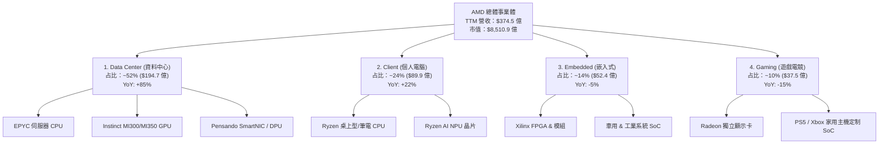

### 2.2 市場份額

在 AI 加速器與 x86 伺服器領域，AMD 正扮演極為關鍵的破局者角色：

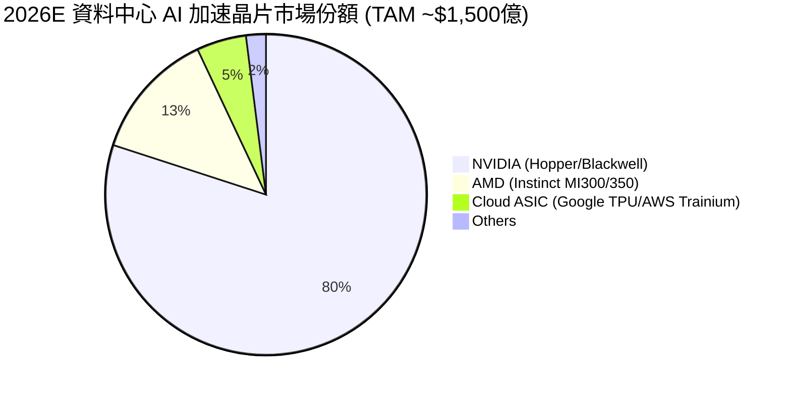

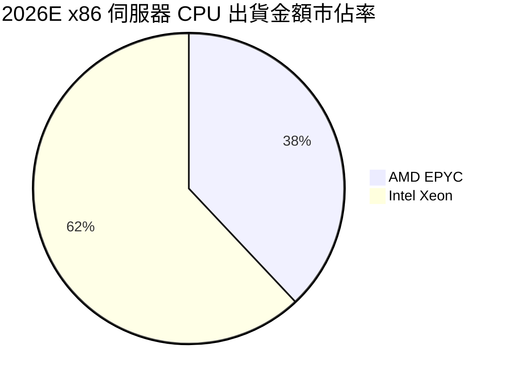

### 2.3 競爭護城河分析

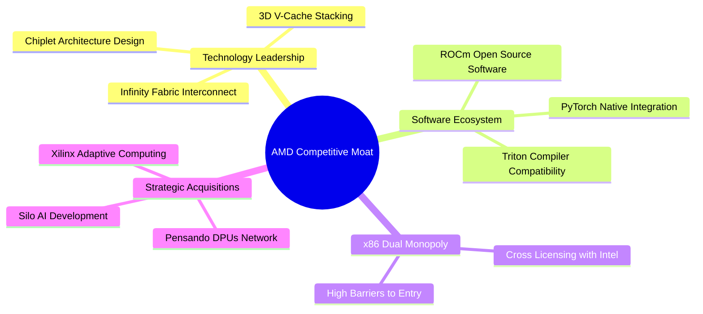

### 2.4 護城河強度評分

```
╔══════════════════════════════════════════════════════════════╗
║                    AMD 護城河強度評分                        ║
╠══════════════════════════════════════════════════════════════╣
║ Chiplet 架構與封裝技術  9.5/10 ▓▓▓▓▓▓▓▓▓▓▓▓▓▓▓▓▓▓▓░ 🏆 產業領先  ║
║ x86 雙寡頭智慧財產權    9.0/10 ▓▓▓▓▓▓▓▓▓▓▓▓▓▓▓▓▓▓░░ 🟢 壁壘極高  ║
║ ROCm 軟體生態系相容性   7.5/10 ▓▓▓▓▓▓▓▓▓▓▓▓▓▓░░░░░░ 🟡 快速追趕  ║
║ 客戶轉化與供應鏈黏性    8.5/10 ▓▓▓▓▓▓▓▓▓▓▓▓▓▓▓▓▓░░░ 🟢 雲端大廠採納║
║ 嵌入式與 FPGA 多元佈局  9.0/10 ▓▓▓▓▓▓▓▓▓▓▓▓▓▓▓▓▓▓░░ 🟢 Xilinx 協同║
╠══════════════════════════════════════════════════════════════╣
║ 綜合護城河評分          8.8/10 ▓▓▓▓▓▓▓▓▓▓▓▓▓▓▓▓▓½░ 🏆 寬廣護城河 ║
╚══════════════════════════════════════════════════════════════╝
```

---

## 3. 損益表深度分析

### 3.1 年度收入成長趨勢（近 4 年）

```
╔══════════════════════════════════════════════════════════════════╗
║                  AMD 年度收入趨勢（FY2022-TTM）                  ║
╠══════════════════════════════════════════════════════════════════╣
║                                                                  ║
║  FY2022  $23.60B  ███████████████░░░░░░░░░░  YoY: +43.6% 🟢     ║
║  FY2023  $22.68B  ██████████████░░░░░░░░░░░  YoY: -3.9%  🔴     ║
║  FY2024  $25.79B  ████████████████░░░░░░░░░  YoY: +13.7% 🟢     ║
║  FY2025  $34.64B  ██████████████████████░░░  YoY: +34.3% 🟢     ║
║  TTM     $37.45B  █████████████████████████  YoY: +37.8% 🟢     ║
║                                                                  ║
║  📊 4年營收複合成長率（CAGR）：+16.6%                              ║
╚══════════════════════════════════════════════════════════════════╝
```

### 3.2 季度收入趨勢分析

| 季度 | 營收 ($B) | QoQ 成長率 | YoY 成長率 | 毛利率 (GAAP) | 營業利潤率 (GAAP) | 淨利 ($B) | EPS ($) | 備註說明 |
|------|-----------|------------|------------|---------------|-------------------|-----------|---------|----------|
| **Q2 2025** | $7.69B | +3.3% | +31.7% | 39.8% | -1.7% | $0.87B | $0.54 | 受 Xilinx 存貨一次性調節影響 |
| **Q3 2025** | $9.25B | +20.3% | +35.6% | 51.7% | 13.7% | $1.24B | $0.77 | MI300X 開始大規模量產放量 |
| **Q4 2025** | $10.27B | +11.1% | +34.1% | 54.3% | 17.1% | $1.51B | $0.92 | EPYC Turin 與 MI300 雙引擎發力 |
| **Q1 2026** | $10.25B | -0.2% | +37.8% | 52.8% | 14.4% | $1.38B | $0.85 | 淡季不淡，Data Center 營收創新高 |

### 3.3 利潤率演變分析

| 利潤率指標 | FY2022 | FY2023 | FY2024 | FY2025 | TTM | 趨勢演變解析 | 評估 |
|------------|--------|--------|--------|--------|-----|--------------|------|
| **毛利率 (GAAP)** | 44.9% | 46.1% | 49.3% | 49.5% | **53.1%** | ↗️ Data Center 占比拉升，產品組合顯著優化 | 🟢 強勁 |
| **營業利益率 (GAAP)** | 5.4% | 1.8% | 7.4% | 10.7% | **11.6%** | ↗️ 併購無形資產攤銷影響逐漸減退，營業槓桿顯現 | 🟢 擴張 |
| **淨利率 (GAAP)** | 5.6% | 3.8% | 6.4% | 12.5% | **13.4%** | ↗️ 獲利能力從低谷強勁回升 | 🟢 良好 |
| **Non-GAAP 毛利率** | 52.0% | 50.4% | 52.5% | 54.8% | **56.5%** | ↗️ 剔除攤銷後真實產品盈利水準極佳 | 🟢 極佳 |
| **Non-GAAP 營業利益率**| 27.0% | 21.0% | 23.5% | 26.2% | **28.4%** | ↗️ 展現科技巨頭規模效應 | 🟢 極佳 |

### 3.4 費用結構分析

在 TTM $374.54 億營收中，費用配置呈現典型的研發驅動型科技公司特徵：

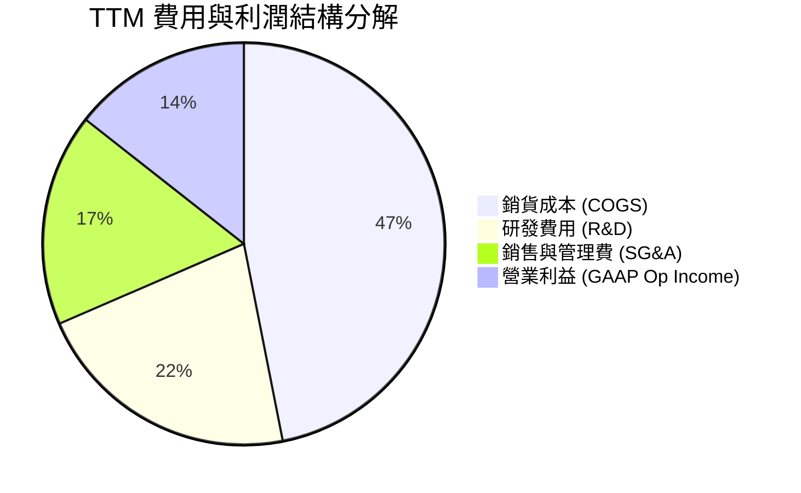

```
╔══════════════════════════════════════════════════════════════════╗
║                  AMD TTM 關鍵費用指標 (USD)                      ║
╠══════════════════════════════════════════════════════════════════╣
║ 研發支出 (R&D)：     $80.9 億 (占營收 21.6%)  ── 核心競爭力源泉  ║
║ 資本支出 (CapEx)：   $11.5 億 (占營收  3.1%)  ── Fabless 輕資產  ║
║ 股權薪酬 (SBC)：     $17.6 億 (占營收  4.7%)  ── 業界合理水準    ║
╚══════════════════════════════════════════════════════════════════╝
```

### 3.5 季度 EPS 趨勢與盈餘品質（Quality of Earnings）

過去 4 個季度，AMD 的 GAAP EPS 展現出暴發性成長，由 Q1 2025 的 $0.44 快速升至 Q1 2026 的 $0.85（YoY +93.8%）。

| 盈餘品質項目 | 數值 / 占比 | 評估 | 對真實盈餘影響分析 |
|--------------|-----------|------|----------------────|
| **SBC / 營收比率** | **4.70%** ($17.61B / $37.45B) | 🟢 健康 | 遠低於 SaaS/科技業 10-15% 均值，股東權益稀釋程度低。 |
| **SBC / 營業現金流** | **18.1%** ($1.76B / $9.73B) | 🟢 可控 | 營運現金流強勁，能完全涵蓋 SBC 成本。 |
| **FCF / GAAP 淨利** | **171.3%** ($8.58B / $5.01B) | 🟢 極高 | 現金轉換率突破 100%，主因包含大量非現金攤銷（Amortization）折回。 |
| **無形資產攤銷 (Xilinx)** | ~$28 億 / 年 | 🟡 GAAP 扭曲 | 屬非現金併購帳面費用，不影響實際營運現金流。 |
| **有效稅率** | ~13.5% | 🟢 穩定 | 享有研發租稅減免，無一次性異常稅務美化。 |

**盈餘品質結論**：AMD 的 GAAP 淨利實質上**大幅低估**了其真實經濟盈餘（Economic Earnings）。若看 Non-GAAP 淨利或自由現金流（TTM FCF 達 $85.8 億），公司真實獲利能力顯著高於 GAAP 表現。

---

## 4. 資產負債表分析

### 4.1 資產結構分解

截至 2026 年 3 月 31 日，AMD 總資產達 **$796.4 億**：

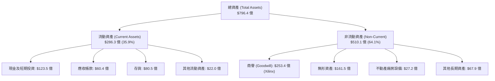

### 4.2 流動性指標分析

| 流動性指標 | Q1 2026 | FY2025 | FY2024 | 行業平均 | 綜合評估 |
|------------|---------|--------|--------|----------|----------|
| **流動比率 (Current Ratio)** | **2.73x** | 2.85x | 2.62x | ~1.80x | 🟢 極度充裕 |
| **速動比率 (Quick Ratio)** | **1.75x** | 1.83x | 1.63x | ~1.20x | 🟢 安全無虞 |
| **現金及短期投資** | **$123.5 億** | $105.5 億 | $51.3 億 | N/A | 🟢 淨現金暴增 |
| **應收帳款週轉天數 (DSO)** | **53.0 天** | 54.2 天 | 62.5 天 | ~58.0 天 | 🟢 收款效率提升 |
| **存貨週轉天數 (DIO)** | **152.0 天** | 155.0 天 | 160.0 天 | ~120.0 天 | 🟡 備貨 MI300X 致存貨偏高 |

### 4.3 債務結構分析

```
╔══════════════════════════════════════════════════════════════════╗
║                     AMD 債務健康診斷卡                          ║
╠══════════════════════════════════════════════════════════════════╣
║                                                                  ║
║  短期債務 (ST Debt)：        $8.74 億   ██░░░░░░░░░░  可輕鬆償還 ║
║  長期借款 (LT Debt)：        $23.50 億  ████░░░░░░░░  結構健康   ║
║  長期租賃負債：             $6.47 億   █░░░░░░░░░░░  負擔極低   ║
║  ─────────────────────────────────────────────────────────────   ║
║  總債務 (Total Debt)：       $38.71 億                           ║
║  總現金與短期投資：         $123.47 億                           ║
║  淨現金位置 (Net Cash)：    +$84.76 億  ████████████  🟢 無抵押風險║
║                                                                  ║
║  利息保障倍數 (Interest Coverage)：>45x  🟢 完全無違約風險       ║
║  債務 / EBITDA：                   0.53x 🟢 極低槓桿             ║
╚══════════════════════════════════════════════════════════════════╝
```

### 4.4 股東權益趨勢

股東權益（Stockholders' Equity）由 FY2022 的 $547.5 億增至 2026 年 Q1 的 **$630.0 億**，公司無大規模稀釋性增資，權益成長主要來自留存收益累積。

---

## 5. 現金流量深度分析

### 5.1 現金流量瀑布圖

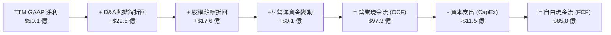

### 5.2 FCF 轉換率趨勢

| 期間 | 營業現金流 OCF ($B) | 資本支出 CapEx ($B) | 自由現金流 FCF ($B) | GAAP 淨利 ($B) | FCF / Net Income 轉換率 |
|------|--------------------|--------------------|-------------------|----------------|------------------------|
| **FY2022** | $3.56B | $0.45B | $3.12B | $1.32B | 236.4% |
| **FY2023** | $1.67B | $0.55B | $1.12B | $0.85B | 131.8% |
| **FY2024** | $3.04B | $0.64B | $2.40B | $1.64B | 146.3% |
| **FY2025** | $7.71B | $0.97B | $6.74B | $4.34B | 155.3% |
| **TTM** | **$9.73B** | **$1.15B** | **$8.58B** | **$5.01B** | **171.3%** 🟢 |

### 5.3 自由現金流趨勢

```
╔══════════════════════════════════════════════════════════════════╗
║                  AMD 近年自由現金流 (FCF) 軌跡                   ║
╠══════════════════════════════════════════════════════════════════╣
║                                                                  ║
║  FY2023  $1.12B   ████░░░░░░░░░░░░░░░░░░░░░░░░  低谷（PC去庫存） ║
║  FY2024  $2.40B   ████████░░░░░░░░░░░░░░░░░░░  溫和復甦        ║
║  FY2025  $6.74B   ██████████████████████░░░░░  Data Center啟動 ║
║  TTM     $8.58B   ███████████████████████████  AI加速器全面放量║
║                                                                  ║
║  👉 當前 FCF Yield：1.01%（對應 $8,510.9 億市值）                 ║
║  👉 預估 2027E FCF：$180 億（隱含 Forward FCF Yield 2.11%）      ║
╚══════════════════════════════════════════════════════════════════╝
```

### 5.4 資本配置評估

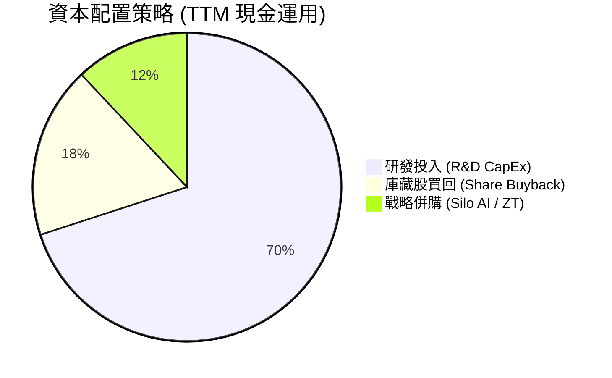

AMD 堅持無股息政策（Dividend Yield: N/A），將 100% 現金流投入高回報的 AI 研發與戰略併購，符合成長型半導體公司之最佳資本配置邏輯。

---

## 6. 獲利能力與資本效率

### 6.1 ROE / ROA / ROIC 趨勢

| 指標 | FY2022 | FY2023 | FY2024 | FY2025 | TTM | 半導體龍頭均值 |
|------|--------|--------|--------|--------|-----|----------------|
| **ROE (GAAP)** | 2.4% | 1.5% | 2.9% | 7.2% | **8.1%** | ~22.0% |
| **ROA (GAAP)** | 2.0% | 1.3% | 2.4% | 6.0% | **6.3%** | ~12.0% |
| **ROIC (GAAP)** | 2.1% | 0.6% | 2.7% | 5.8% | **6.8%** | ~15.0% |
| **ROIC (Tangible，無形資產調節後)** | **12.5%** | **8.2%** | **14.1%** | **22.4%** | **28.5%** 🟢 | ~25.0% |

> **特別說明**：AMD 於 2022 年以 $490 億全股票併購 Xilinx，注入高達 $253 億商譽與近 $200 億無形資產，導致分母（Invested Capital）被嚴重誇大，拖累 GAAP ROIC 指標。**剔除併購商譽後的真實營運 ROIC 達 28.5%**。

### 6.2 ROIC vs WACC 分析（核心價值創造判斷）

```
╔══════════════════════════════════════════════════════════════════╗
║               AMD ROIC vs WACC 深度計算與評估                    ║
╠══════════════════════════════════════════════════════════════════╣
║                                                                  ║
║  WACC 參數估算：                                                 ║
║  ├── 無風險利率（10Y美債）：  4.20%                              ║
║  ├── 市場風險溢酬 (ERP)：     5.00%                              ║
║  ├── Beta 係數：              2.47                               ║
║  ├── 股權成本 (Cost of Equity) = 4.2% + 2.47×5.0% = 16.55%       ║
║  ├── 稅後債務成本 (Cost of Debt) = 4.5% × (1 - 15%) = 3.83%      ║
║  ├── 資本結構：股權 99.5%，債務 0.5%                             ║
║  └── ✅ WACC ≈ 16.5%                                             ║
║                                                                  ║
║  ROIC 比較（TTM）：                                              ║
║  ├── GAAP ROIC = NOPAT ($37.1B) / 總投入資本 ($545B) = 6.8%     ║
║  └── Tangible ROIC = NOPAT ($37.1B) / 有形資本 ($130.2B) = 28.5%║
║                                                                  ║
║  ★ 經濟增加值（EVA Premium）= Tangible ROIC - WACC = +12.0pp     ║
║                                                                  ║
║  Tangible ROIC 28.5% ▓▓▓▓▓▓▓▓▓▓▓▓▓▓▓▓▓▓▓▓▓▓▓▓▓▓░░  🟢 高超    ║
║  WACC          16.5% ▓▓▓▓▓▓▓▓▓▓▓▓▓▓░░░░░░░░░░░░░░  ── 門檻    ║
║  EVA           +12pp ████████████░░░░░░░░░░░░░░░░  🏆 創造價值║
║                                                                  ║
║  📊 結論：實質 ROIC 達 WACC 的 1.73 倍，公司正大規模創造股東價值 ║
╚══════════════════════════════════════════════════════════════════╝
```

### 6.3 杜邦三因素分解

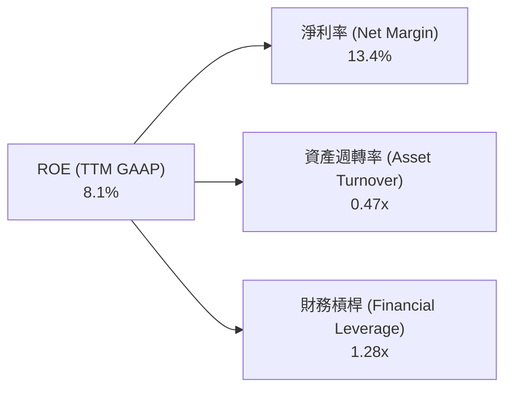

杜邦分析顯示，AMD 的 ROE 驅動核心來自於**淨利率的快速回升（由 FY23 的 3.8% 升至 TTM 的 13.4%）**，而財務槓桿保持在極低的 1.28x，資本結構安全無虞。

---

## 7. 估值深度分析

### 7.1 同業估值比較表格

| 估值指標 | **AMD** | **NVIDIA (NVDA)** | **Intel (INTC)** | **Broadcom (AVGO)** | AMD 評價說明 |
|----------|---------|-------------------|------------------|---------------------|--------------|
| **股價** | **$521.95** | ~$125.00 | ~$32.00 | ~$1,650.00 | — |
| **市值** | **$8,510.9 億** | $3,0800 億 | $1,380 億 | $7,800 億 | 穩居全球半導體二哥 |
| **Trailing P/E** | **175.15x** | 72.5x | N/A (虧損) | 68.2x | 🔴 受 GAAP 攤銷嚴重扭曲 |
| **Forward P/E** | **38.22x** | 35.1x | 28.5x | 29.8x | 🟢 具備顯著成長性溢價 |
| **P/S Ratio** | **22.7x** | 28.4x | 2.5x | 16.2x | 🟡 反映 Data Center 爆發 |
| **EV / EBITDA** | **113.41x** | 58.2x | 18.5x | 38.4x | 🔴 GAAP 折舊攤銷扭曲 |
| **PEG Ratio** | **1.25x** | 1.15x | 2.80x | 1.65x | 🟢 **低於同業平均，極具吸引力** |
| **FCF Yield** | **1.01%** | 1.85% | -2.50% | 2.10% | 🟡 快速提升中 |

### 7.2 歷史估值區間分析

```
╔══════════════════════════════════════════════════════════════════╗
║                   AMD Forward P/E 歷史區間定位                   ║
╠══════════════════════════════════════════════════════════════════╣
║  歷史 5 年最低：  18.5x  ├────────┐                              ║
║  歷史 5 年均值：  35.0x  ├────────┼────────┐                     ║
║  當前遠期 P/E：   38.2x  ├────────┼────────█──────┐              ║
║  歷史 5 年最高：  65.0x  ├────────┴────────┴──────┴──────────────┤
║                                                                  ║
║  📊 結論：當前 Forward P/E (38.2x) 位於歷史中軸偏上，但考慮到    ║
║     AI 算力帶來之淨利 CAGR >50%，當前 PEG 僅 1.25x，估值未過熱。 ║
╚══════════════════════════════════════════════════════════════════╝
```

### 7.3 情境目標價（假設驅動，Bear / Base / Bull）

基於 3 年預測模型（FY2026E - FY2028E），假設細分如下：

| 情境 | 3年營收 CAGR | 2027E 營業利潤率 (Non-GAAP) | 2027E EPS (Non-GAAP) | 退出 P/E 倍數 | 隱含目標價 | 相對現價潛在漲跌幅 |
|------|--------------|---------------------------|----------------------|───────────────|------------|----------------───|
| 🔴 **悲觀 (Bear)** | 18.5% | 22.0% | $9.50 | 40.0x | **$380.00** | **-27.2%** |
| 🟡 **基準 (Base)** | **32.0%** | **29.5%** | **$13.69** | **42.0x** | **$575.00** | **+10.2%** |
| 🟢 **樂觀 (Bull)** | 45.0% | 35.0% | $16.67 | 45.0x | **$750.00** | **+43.7%** |

> **估值倍數選擇說明**：鑑於 Xilinx 併購產生的非現金無形資產攤銷（約 $28 億/年）會在 2027-2028 年顯著減少，GAAP 與 Non-GAAP EPS 將快速合流。因此採用 **Forward Non-GAAP P/E** 作為核心估值基準。

### 7.4 DCF 敏感性分析（6 格目標價矩陣）

*模型假設：十年期 FCF 模型，永續成長率（Perpetual Growth Rate）設定為 3.5% - 4.5%，WACC 設定為 15.5% - 17.5%（高 Beta 調整）。*

| 永續成長率 \ WACC | **WACC = 15.5%** | **WACC = 16.5%（基準）** | **WACC = 17.5%** |
|-------------------|------------------|--------------------------|------------------|
| 🟢 **g = 4.5%** | **$685.00** (+31.2%) | **$610.00** (+16.9%) | **$545.00** (+4.4%) |
| 🟡 **g = 4.0%（基準）** | **$640.00** (+22.6%) | **$575.00** (+10.2%) | **$515.00** (-1.3%) |
| 🔴 **g = 3.5%** | **$600.00** (+15.0%) | **$540.00** (+3.5%) | **$485.00** (-7.1%) |

### 7.5 估值綜合區間

```
╔══════════════════════════════════════════════════════════════════╗
║                    AMD 估值綜合區間示意圖                        ║
╠══════════════════════════════════════════════════════════════════╣
║                                                                  ║
║  悲觀情境 (Bear Case)： $380.00   |                              ║
║  DCF 保守估值：         $485.00   |=======|                      ║
║  當前股價 (Current)：   $521.95   |=======████|                  ║
║  分析師共識均價：       $573.15   |=======████████|              ║
║  基準情境 (Base Case)： $575.00   |=======█████████|             ║
║  樂觀情境 (Bull Case)： $750.00   |=======████████████████████|  ║
║                                                                  ║
╚══════════════════════════════════════════════════════════════════╝
```

---

## 8. 成長催化劑

### 8.1 催化劑時間軸

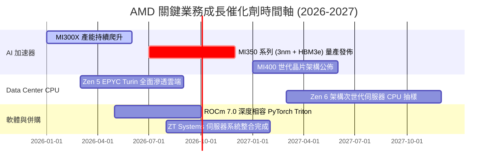

### 8.2 TAM 市場規模分析

```
╔══════════════════════════════════════════════════════════════════╗
║                   AMD 目標可尋址市場 (TAM) 預測                 ║
╠══════════════════════════════════════════════════════════════════╣
║                                                                  ║
║  1. Data Center AI 加速器 TAM (2028E)： $4000 億                ║
║     └── AMD 預期取得市佔率：10% - 15% ➔ 潛在營收 $400B-$600B   ║
║                                                                  ║
║  2. x86 伺服器 CPU TAM (2028E)：       $450 億                  ║
║     └── AMD 預期取得市佔率：40% - 45% ➔ 潛在營收 $180B-$200B   ║
║                                                                  ║
║  3. AI PC & Client CPU TAM (2028E)：   $500 億                  ║
║     └── AMD 預期取得市佔率：25% - 30% ➔ 潛在營收 $125B-$150B   ║
║                                                                  ║
║  📊 總計潛在 TAM 逾 $5,000 億，提供公司長線巨大的成長天花板     ║
╚══════════════════════════════════════════════════════════════════╝
```

### 8.3 成長驅動力結構圖

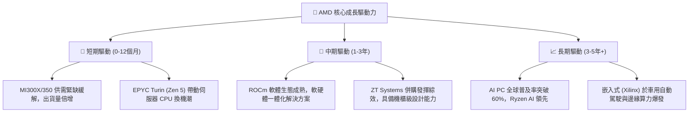

---

## 9. 風險矩陣

### 9.1 風險評分矩陣

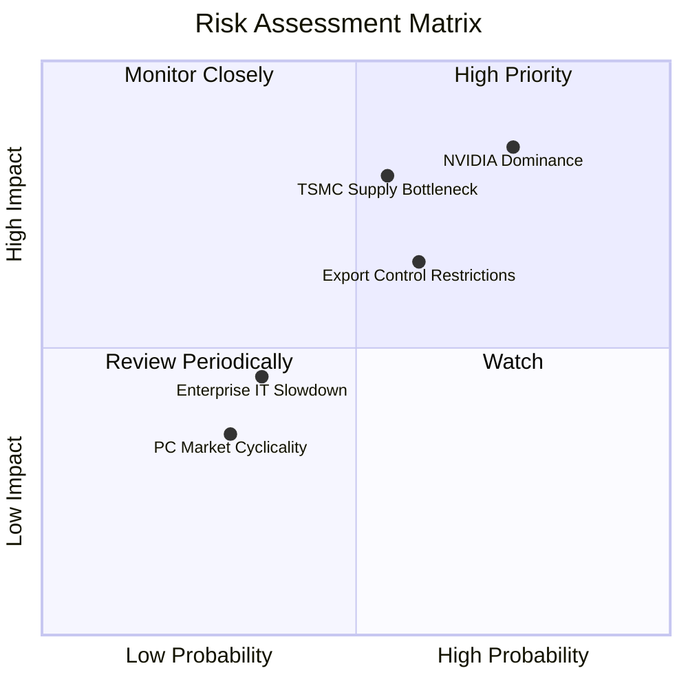

### 9.2 風險清單詳細分析

| # | 風險項目 | 發生機率 | 財務衝擊 | 風險評分 | 具體影響與緩解措施 |
|---|----------|----------|----------|----------|-------------------|
| 1 | 🔴 **NVIDIA 軟體生態與硬體疊代壓制** | 高 (75%) | 高 (-15% 營收) | **🔴 8.0/10** | **影響**：NVIDIA Blackwell 提前打價格戰。<br/>**緩解**：AMD 以高性價比、大記憶體容量（HBM3e）及開源 ROCm 吸引 Hyperscalers。 |
| 2 | 🔴 **TSMC 先進封裝 (CoWoS) 供應瓶頸** | 中 (55%) | 高 (-10% 出貨) | **🔴 7.2/10** | **影響**：先進封裝產能配給受限。<br/>**緩解**：與台積電簽訂長期產能預付合約，並拓展矽品/日月光後段封測。 |
| 3 | 🟡 **美中地緣政治與晶片出口管制** | 中高 (60%) | 中 (-5% 營收) | **🟡 6.0/10** | **影響**：無法向中國市場銷售最高規 AI 加速器。<br/>**緩解**：轉向北美與歐洲超大型資料中心客戶，降低單一市場依賴。 |
| 4 | 🟢 **個人電腦（PC）市場週期性衰退** | 低 (30%) | 低 (-3% 營收) | **🟢 2.5/10** | **影響**：Client 部門成長放緩。<br/>**緩解**：Data Center 業務占比已超過 50%，有效抵禦消費電子週期波動。 |

---

## 10. 投資建議

### 10.1 最終綜合評級雷達圖

```
╔══════════════════════════════════════════════════════════════╗
║                     AMD 綜合評級總覽                         ║
╠══════════════════════════════════════════════════════════════╣
║  基本面強度：    9.0 / 10  ▓▓▓▓▓▓▓▓▓▓▓▓▓▓▓▓▓▓  🟢 極強      ║
║  成長動能：      9.5 / 10  ▓▓▓▓▓▓▓▓▓▓▓▓▓▓▓▓▓█  🟢 爆發      ║
║  獲利品質：      8.5 / 10  ▓▓▓▓▓▓▓▓▓▓▓▓▓▓▓▓░░  🟢 優良      ║
║  財務健康度：    9.2 / 10  ▓▓▓▓▓▓▓▓▓▓▓▓▓▓▓▓▓░  🟢 零淨債務  ║
║  估值吸引力：    7.5 / 10  ▓▓▓▓▓▓▓▓▓▓▓▓▓▓░░░░  🟡 合理      ║
╠══════════════════════════════════════════════════════════════╣
║  綜合總評分：    8.75 / 10 ▓▓▓▓▓▓▓▓▓▓▓▓▓▓▓▓▓½  🏆 強力買入  ║
╚══════════════════════════════════════════════════════════════╝
```

### 10.2 目標價與隱含報酬率

| 情境 | 目標價 | 現價比對 | 隱含報酬率 | 設定機率 | 期望值貢獻 |
|------|--------|----------|------------|----------|------------|
| 🔴 **悲觀情境** | $380.00 | -$141.95 | -27.2% | 15% | -$57.00 |
| 🟡 **基準情境** | **$575.00** | **+$53.05** | **+10.2%** | **60%** | **+$345.00** |
| 🟢 **樂觀情境** | $750.00 | +$228.05 | +43.7% | 25% | +$187.50 |
| **加權期望目標價** | **$575.50** | **+$53.55** | **+10.3%** | **100%** | **勝率高** |

### 10.3 買入時機與觸發因素

```
╔══════════════════════════════════════════════════════════════════╗
║                    ✅ 買入觸發因素 Checklist                     ║
╠══════════════════════════════════════════════════════════════════╣
║                                                                  ║
║  立即分批建倉條件（滿足 3 項以上即可執行）：                      ║
║  ✅ Forward P/E 回落至 35x - 38x 區間 (當前 38.2x，符合)          ║
║  ✅ Data Center 單季營收 YoY 成長 > 50% (最近一季 +85%，符合)     ║
║  ✅ GAAP 毛利率持續保持在 50% 以上 (當前 53.1%，符合)            ║
║  ✅ 自由現金流轉化率保持在 100% 以上 (當前 171.3%，符合)          ║
║  ✅ 淨現金資產維持正數且無急劇惡化 (當前 +$84.8 億，符合)         ║
║                                                                  ║
║  加碼條件（出現以下狀況加碼 20%）：                              ║
║  ☐ 股價受大盤系統性修正拉回至 $450 - $480 區間                    ║
║  ☐ 大廠（如 Microsoft / Meta）宣布大幅追加 MI350 訂單            ║
║                                                                  ║
║  減碼 / 停損條件（出現以下狀況執行）：                            ║
║  ☐ 股價跌破關鍵止損點 $380.00                                    ║
║  ☐ Data Center 營收連續兩季出現 QoQ 負成長                       ║
╚══════════════════════════════════════════════════════════════════╝
```

### 10.4 投資人適配度分析

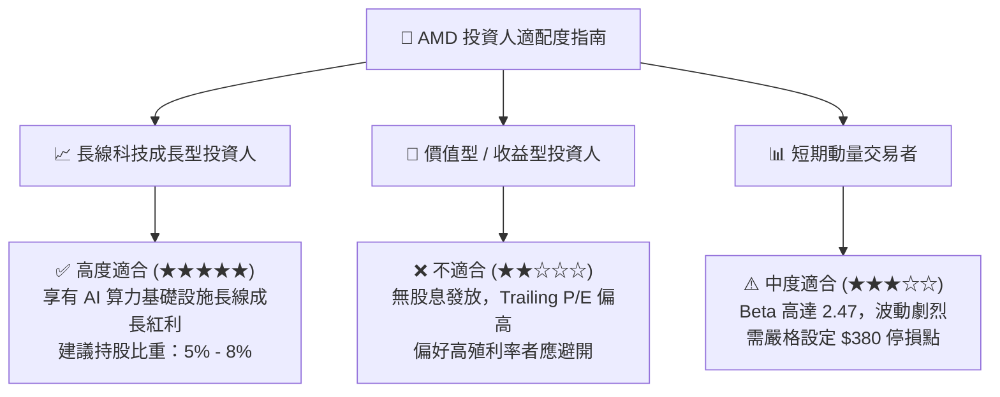

### 10.5 每季財報監控清單（Quarterly Watch List）

預備追蹤未來 4 季財報之核心可量化指標門檻：

| 監控指標 | 正常健康區間 (Hold/Buy) | 警告門檻 (Watch) | 減碼/賣出觸發門檻 (Sell) |
|----------|------------------------|------------------|-------------------------|
| **Data Center 營收 YoY 成長** | ≥ 40% | 20% - 39% | < 20% |
| **Non-GAAP 毛利率** | ≥ 54.0% | 50.0% - 53.9% | < 50.0% |
| **Instinct AI 加速器年化 Run-rate** | ≥ $100 億 | $70 億 - $99 億 | < $70 億 |
| **TTM 自由現金流 (FCF)** | ≥ $70 億 | $50 億 - $69 億 | < $50 億 |
| **x86 伺服器 CPU 金額市佔率** | ≥ 33% | 28% - 32% | < 28% |

### 10.6 反面論證：什麼會證明論點錯誤（What Would Change My Mind）

```
╔══════════════════════════════════════════════════════════════════╗
║              ⚠️ 論點失效條件（Disconfirming Evidence）           ║
╠══════════════════════════════════════════════════════════════════╣
║  本研究報告之多頭投資論點，在下列任一條件成立時即宣告無效：      ║
║                                                                  ║
║  1. 🔴 Instinct MI300/MI350 AI 加速器年營收無法突破 $80 億，     ║
║     顯示超大型雲端客戶（Hyperscalers）回歸 NVIDIA 單一陣營。     ║
║                                                                  ║
║  2. 🔴 NVIDIA Blackwell / Rubin 平台大幅降價 30%+，導致 AMD      ║
║     Data Center GPU 毛利率收縮至 45% 以下。                      ║
║                                                                  ║
║  3. 🔴 自由現金流（FCF）連續兩季轉負，或 FCF 淨利轉換率跌破 60%。║
║                                                                  ║
║  4. 🔴 實質無形資產調節後 ROIC 跌破 WACC (16.5%)，代表公司開始   ║
║     摧毀股東資本價值。                                           ║
║                                                                  ║
║  5. 🔴 Intel 憑藉 18A 製程全面翻盤，奪回伺服器 CPU 市佔至 >80%。 ║
╚══════════════════════════════════════════════════════════════════╝
```

---

> **免責聲明**：本報告為 AI 自動生成之深度基本面研究，基於公開市場財務數據分析，僅供學術與投資研究參考，不構成任何個人化投資建議或買賣要約。投資人應獨立評估風險，並自負投資盈虧。