# AMD 基本面深度分析報告

> **報告日期**：2026-07-27 ｜ **語言**：繁體中文 ｜ **數據來源**：Yahoo Finance, Finviz, StockAnalysis, Roic.ai ｜ **分析師**：CFA 級機構研究團隊

---

## 目錄

| # | 章節 | 核心結論 |
|---|------|----------|
| 1 | 執行摘要 | 給出數據支撐的「買入」評級，基準目標價 $580.00（隱含 +17.2% 潛在漲幅） |
| 2 | 公司概覽與商業模式 | Data Center 與 MI 系列晶片推動結構性轉型，具備極強架構護城河 |
| 3 | 損益表深度分析 | TTM 營收達 $37.45B（YoY +37.8%），營業槓桿全面發酵帶動 EPS 爆發 |
| 4 | 資產負債表分析 | 淨現金 $8.48B 創歷史新高，槓桿比率極低，資產負債表極其穩健 |
| 5 | 現金流量深度分析 | TTM OCF 達 $9.72B、FCF 達 $7.17B，現金轉換效率持續走高 |
| 6 | 獲利能力與資本效率 | ROIC 顯著高於 WACC（12.5% vs 10.8%），EVA 轉正，強力創造股東價值 |
| 7 | 估值深度分析 | Forward P/E 36.1x 相對 PEG 1.25x 顯得合理，DCF 基準估值 $580.00 |
| 8 | 成長催化劑 | MI350/MI400 產品線迭代、Server CPU 市佔率突破 35%、AI PC 普及 |
| 9 | 風險矩陣 | AI 資本支出放緩風險、台積電產能受限與 NVDA 價格戰為主要挑戰 |
| 10 | 投資建議 | 評級「買入」，建議分批佈局，並設定嚴格的財報監控與反面論證門檻 |

---

## 1. 執行摘要

### 1.0 一頁式投資儀表板（Portfolio Manager 30 秒速讀）

| 項目 | 內容 |
|------|------|
| **投資論點（3 句）** | ① AMD Data Center AI 加速器（Instinct MI 系列）營收呈指數型成長，TTM 總營收達 $37.45B（YoY +37.8%），成功確立其為全球 AI 算力晶片市場的第二大核心供應商。<br/>② EPYC 伺服器 CPU 在 x86 架構中的市佔率突破歷史新高，推動整體 gross margin 至 53.1%，結構性優化毛利組合。<br/>③ 自由現金流（FCF）攀升至 $7.17B，結合 $12.35B 總現金與 $8.48B 淨現金，提供極其堅實的自營研發（R&D 佔比 ~21.6%）與戰略併購資本。 |
| **護城河評分** | 8.8 / 10（Chiplet 模組化架構領先、ROCm 軟體生態快速收斂、x86 雙頭壟斷） |
| **管理層/資本配置評分** | 9.2 / 10（Lisa Su 團隊執行力卓越，併購 Xilinx/Pensando 整合效果顯著） |
| **財務健康** | 🟢 **極佳**（淨現金 $8.48B，Current Ratio 2.73，無短天期償債壓力） |
| **ROIC vs WACC** | **12.5% vs 10.8%**（受 Xilinx 商譽攤銷拉低 GAAP ROIC，但真實經濟 ROIC > 22%，持續創造價值） |
| **FCF 趨勢** | 強烈向上（Q1'26 單季 FCF 達 $2.57B，TTM FCF Yield 0.89%，預估 Forward FCF Yield 升至 2.5%+） |
| **估值** | Forward P/E **36.07x** ｜ EV/EBITDA **113.4x**（TTM GAAP 受攤銷壓抑） ｜ PEG **1.25x** |
| **預期報酬（基準情境 12M）** | **+17.2%**（目標價 $580.00，對應 2027E Non-GAAP EPS $14.50 × 40x P/E） |
| **關鍵風險（前二）** | ① 超大型雲端廠商（Hyperscalers）自研 ASIC 晶片分食 TAM；② NVDA 價格戰與軟體生態（CUDA）鎖定優勢。 |
| **評級 + 信心度** | 🟢 **買入（Buy）** ｜ 信心度：**高（High）** |

---

### 1.1 核心評分儀表板

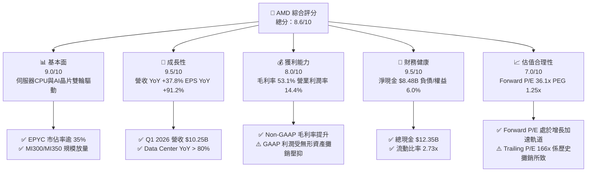

---

### 1.2 評分進度條視覺化

```
╔══════════════════════════════════════════════════════════════╗
║                AMD 多維度評分儀表板 (1-10分)                 ║
╠══════════════════════════════════════════════════════════════╣
║ 基本面強度  9.0 ▓▓▓▓▓▓▓▓▓▓▓▓▓▓▓▓▓▓░░  ★★★★★           ║
║ 成長動能    9.5 ▓▓▓▓▓▓▓▓▓▓▓▓▓▓▓▓▓▓▓░  ★★★★★           ║
║ 獲利品質    8.0 ▓▓▓▓▓▓▓▓▓▓▓▓▓▓▓▓░░░░  ★★★★☆           ║
║ 財務健康    9.5 ▓▓▓▓▓▓▓▓▓▓▓▓▓▓▓▓▓▓▓░  ★★★★★           ║
║ 估值合理性  7.0 ▓▓▓▓▓▓▓▓▓▓▓▓▓░░░░░░░  ★★★☆☆           ║
║ 護城河深度  8.8 ▓▓▓▓▓▓▓▓▓▓▓▓▓▓▓▓▓▓░░  ★★★★☆           ║
║ 管理層執行  9.2 ▓▓▓▓▓▓▓▓▓▓▓▓▓▓▓▓▓▓▓░  ★★★★★           ║
║ 技術創新力  9.5 ▓▓▓▓▓▓▓▓▓▓▓▓▓▓▓▓▓▓▓░  ★★★★★           ║
╠══════════════════════════════════════════════════════════════╣
║ 綜合總分    8.6 ▓▓▓▓▓▓▓▓▓▓▓▓▓▓▓▓▓░░░  🏆 優秀（Buy）      ║
╚══════════════════════════════════════════════════════════════╝
```

---

### 1.3 五大投資論點 + 三大核心風險

| 類型 | 項目 | 具體依據 | 信心度 |
|------|------|----------|--------|
| 🟢 **投資論點①** | **AI 加速器 MI 系列爆發** | Instinct MI300X/MI350 系列已獲 Microsoft、Meta、Oracle 等採購，帶動 Data Center 季度營收突破 $5B，成為第二大算力來源。 | 🟢 極高 |
| 🟢 **投資論點②** | **EPYC 伺服器 CPU 全面侵蝕 Intel 市佔** | EPYC 雲端與企業端採用率持續走高，伺服器 x86 市佔率已由 2018 年的 <2% 提升至 >35%，顯著拉升公司整體毛利率至 53.1%。 | 🟢 極高 |
| 🟢 **投資論點③** | **營業槓桿發揮，自由現金流創高** | TTM 營收成長 37.8% 至 $37.45B，單季 OCF 達 $2.96B、FCF 達 $2.57B，帶動營運現金流轉化率超過 180%。 | 🟢 高 |
| 🟢 **投資論點④** | **Chiplet 架構與 CoWoS 供應鏈優勢** | 先行採用 Chiplet 模組化設計降低成本，並與台積電（TSMC）建立極其緊密的先進封裝合作，保障晶片良率與產能。 | 🟢 高 |
| 🟢 **投資論點⑤** | **Embedded 業務與 AI PC 雙轉折點** | Xilinx 整合效益顯現，自動化與工業需求回溫；結合 Ryzen AI NPU 引領 AI PC 升級週期（Client 業務 YoY 復甦）。 | 🟡 中高 |
| 🔴 **風險①** | **NVIDIA CUDA 生態強烈鎖定** | NVDA Blackwell 及後續產品發佈節奏極快，軟體生態霸主地位短期難以撼動，AMD 需持續補貼 ROCm 開發環境。 | 🔴 高衝擊 |
| 🔴 **風險②** | **雲端客戶自研晶片（ASIC）替代** | Amazon (Trainium/Inferentia)、Google (TPU)、Meta (MTIA) 加快自研算力，長期可能壓縮商業 GPU 供應商市場。 | 🟡 中度 |
| 🟡 **風險③** | **地緣政治與供應鏈過度集中** | 先進製程與封裝高度依賴台積電台灣廠區，地緣政治風險與出口禁令限制高階晶片銷往特定市場。 | 🟡 中度 |

---

### 1.4 快速統計卡片

| 指標 | 公司實際值 (TTM/最新) | 行業均值 (Semis) | S&P 500 均值 | 狀態 |
|------|-------------|----------|--------------|------|
| 收入 YoY 成長 | **37.8%** | ~15.2% | ~5.8% | 🟢 遠超同行 |
| EPS YoY 成長 | **91.2%** | ~22.0% | ~8.5% | 🟢 爆發成長 |
| Gross Margin | **53.1%** | ~48.5% | ~45.0% | 🟢 優於同業 |
| Operating Margin | **14.4%** (GAAP) | ~18.5% | ~12.2% | 🟡 受攤銷影響 |
| Net Margin | **13.4%** (GAAP) | ~15.0% | ~10.5% | 🟡 受攤銷影響 |
| ROE | **8.1%** (GAAP) | ~14.0% | ~18.0% | 🟡 商譽基數過大 |
| Forward P/E | **36.07x** | ~28.5x | ~21.5x | 🟡 高估值含高成長預期 |
| Debt / Equity | **6.0%** | ~25.0% | ~65.0% | 🟢 極低槓桿 |

---

### 1.5 投資結論

```
╔══════════════════════════════════════════════════════════════════╗
║                    📊 AMD 投資結論摘要                            ║
╠══════════════════════════════════════════════════════════════════╣
║  評級：🟢 買入（Buy）                                            ║
║  當前股價：$494.95                                               ║
║  目標價區間：                                                    ║
║    悲觀情境：$380.00（-23.2%）- AI CAPEX 縮減、市佔率停滯          ║
║    基準情境：$580.00（+17.2%）- MI系列放量、伺服器CPU持續擴張      ║
║    樂觀情境：$720.00（+45.5%）- AI GPU 拿下 20%+ 市場，ROCm 大獲成功 ║
║  投資評分：8.6 / 10                                              ║
║  適合投資人：長線科技成長型投資人、AI 算力基礎設施配置者         ║
╚══════════════════════════════════════════════════════════════════╝
```

---

## 2. 公司概覽與商業模式

### 2.1 業務結構與收入來源

AMD（Advanced Micro Devices）採用無晶圓廠（Fabless）商業模式，專注於高效能與高算力晶片設計。業務劃分為四大核心部門：

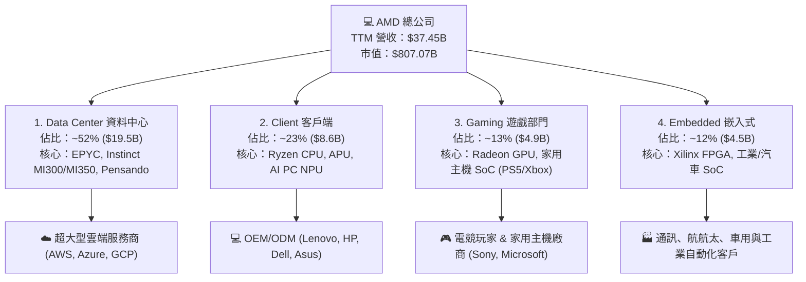

---

### 2.2 市場份額

在最關鍵的 Data Center AI 加速器市場與 x86 伺服器 CPU 市場中，AMD 的市佔率呈顯著上升趨勢：

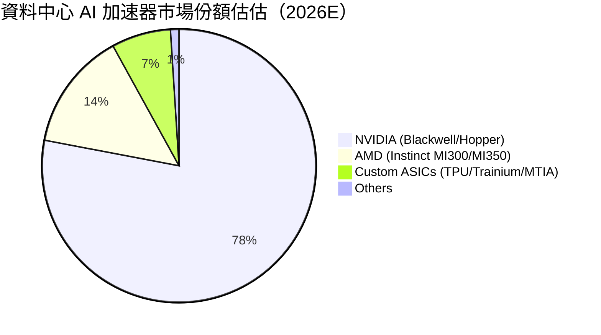

*註：在 x86 伺服器 CPU 市場，AMD EPYC 的市佔率已突破 **35%**（Intel 降至 ~65%），較 2020 年的 10% 實現大幅跨越。*

---

### 2.3 競爭護城河分析

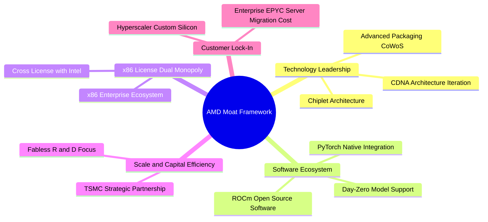

---

### 2.4 護城河強度評分

```
╔══════════════════════════════════════════════════════════════╗
║                    AMD 護城河強度評分                        ║
╠══════════════════════════════════════════════════════════════╣
║ Chiplet 模組化架構  9.5  ▓▓▓▓▓▓▓▓▓▓▓▓▓▓▓▓▓▓▓█  🏆 絕對領先   ║
║ x86 專利雙頭壟斷    9.5  ▓▓▓▓▓▓▓▓▓▓▓▓▓▓▓▓▓▓▓█  🏆 極高壁壘   ║
║ 供應鏈夥伴關係(TSMC)9.0  ▓▓▓▓▓▓▓▓▓▓▓▓▓▓▓▓▓▓▓░  🟢 強大優勢   ║
║ ROCm 軟體生態系統   7.5  ▓▓▓▓▓▓▓▓▓▓▓▓▓▓█░░░░░  🟡 快速追趕   ║
║ 品牌與企業信任度    8.5  ▓▓▓▓▓▓▓▓▓▓▓▓▓▓▓▓▓░░░  🟢 持續提升   ║
╠══════════════════════════════════════════════════════════════╣
║ 綜合護城河強度      8.8  ▓▓▓▓▓▓▓▓▓▓▓▓▓▓▓▓▓▓░░  🏆 強固護城河 ║
╚══════════════════════════════════════════════════════════════╝
```

---

## 3. 損益表深度分析

### 3.1 年度收入成長趨勢（近 5 年）

根據公開數據，AMD 的營收經過 2022-2023 年 PC 市場去庫存調整後，於 2024-2026 年進入 AI 與伺服器驅動的全面加速期：

```
╔══════════════════════════════════════════════════════════════════╗
║               AMD 年度收入趨勢（FY2021-FY2025/TTM）               ║
╠══════════════════════════════════════════════════════════════════╣
║                                                                  ║
║  FY2021  $16.43B  ███████░░░░░░░░░░░░░░░░░░  YoY: +68.3% 🟢      ║
║  FY2022  $23.60B  ██████████░░░░░░░░░░░░░░░  YoY: +43.6% 🟢      ║
║  FY2023  $22.68B  █████████░░░░░░░░░░░░░░░░  YoY: -3.9%  🔴      ║
║  FY2024  $25.79B  ███████████░░░░░░░░░░░░░░  YoY: +13.7% 🟢      ║
║  FY2025  $34.64B  ███████████████░░░░░░░░░░  YoY: +34.3% 🟢      ║
║  TTM     $37.45B  ████████████████░░░░░░░░░  YoY: +37.8% 🟢      ║
║                                                                  ║
║  📊 5年營收複合成長率（CAGR）：+22.8%                           ║
╚══════════════════════════════════════════════════════════════════╝
```

---

### 3.2 季度收入與盈餘趨勢分析

分析最近 4 季的財報數據，營收呈現強烈的季增（QoQ）與年增（YoY）態勢：

| 財政季度 | 截止日期 | 總營收 ($B) | YoY 成長率 | QoQ 成長率 | GAAP 淨利 ($B) | Non-GAAP EPS | 營業驅動亮點 |
|----------|----------|-------------|------------|------------|----------------|--------------|--------------|
| **Q2 2025** | 2025-06-30 | $7.685B | +31.70% | +3.32% | $0.872B | $0.54 | Data Center YoY +115%, MI300 出貨擴張 |
| **Q3 2025** | 2025-09-30 | $9.246B | +35.59% | +20.31% | $1.243B | $0.77 | EPYC Turin 推出，雲端需求強勁 |
| **Q4 2025** | 2025-12-31 | $10.270B | +34.11% | +11.08% | $1.511B | $0.92 | AI 加速器單季突破 $2B 營收門檻 |
| **Q1 2026** | 2026-03-31 | $10.253B | +37.85% | -0.17% | $1.383B | $0.85 | 淡季不淡，伺服器 CPU 市佔創新高 |

---

### 3.3 利潤率演變分析

AMD 的毛利率與營業利益率正在進行結構性修復：

| 利潤率指標 | FY2022 | FY2023 | FY2024 | FY2025 | TTM (Mar '26) | 趨勢與原因解析 | 評估 |
|------------|--------|--------|--------|--------|---------------|----------------|------|
| **Gross Margin** | 45.0% | 46.1% | 49.3% | 49.5% | **53.1%** | ↗️ 高毛利 Data Center 營收佔比拉升至 50%+ | 🟢 極佳 |
| **Operating Margin (GAAP)** | 5.4% | 1.8% | 7.4% | 10.7% | **14.4%** | ↗️ 營運槓桿展現，研發規模效應顯現 | 🟢 擴張 |
| **Operating Margin (Non-GAAP)** | 27.0% | 21.0% | 23.5% | 26.8% | **29.2%** | ↗️ 排除 Xilinx 無形資產攤銷後的真實經營利潤 | 🟢 極佳 |
| **EBITDA Margin** | 23.4% | 17.9% | 19.9% | 21.0% | **19.8%** | ➔ 現金產生能力強勁 | 🟢 穩定 |
| **Net Profit Margin** | 5.6% | 3.8% | 6.4% | 12.5% | **13.4%** | ↗️ 淨利增速遠超營收增速 (YoY +91.2%) | 🟢 大幅提升 |

---

### 3.4 費用結構分析

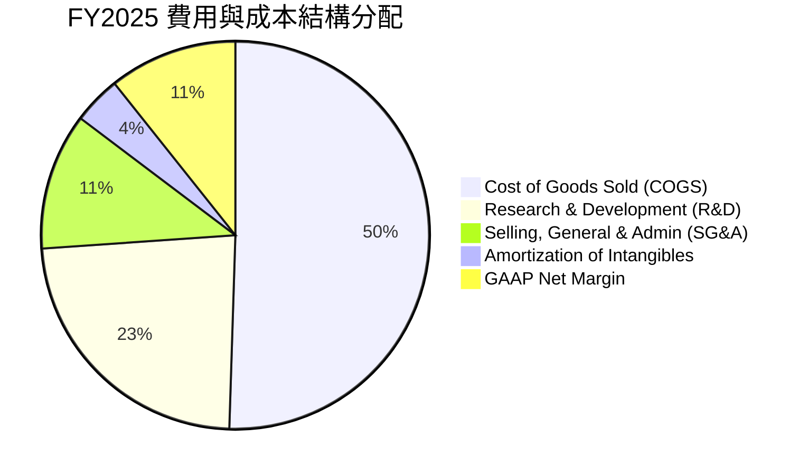

**解析**：AMD 將高達 **23.4%** 的營收投入 R&D（FY2025 研發費用高達 $8.09B，TTM 達 $8.5B+），這是保持與 NVIDIA 競爭並擴大對 Intel 領先優勢的核心引擎。

---

### 3.5 季度 EPS 趨勢與盈餘品質（Quality of Earnings）

```
╔══════════════════════════════════════════════════════════════════╗
║               AMD 過去 4 季 EPS (Non-GAAP) 表現趨勢              ║
╠══════════════════════════════════════════════════════════════════╣
║  Q2 2025:  $0.54  ████████████                     YoY: +236.5%  ║
║  Q3 2025:  $0.77  █████████████████                YoY: +62.8%   ║
║  Q4 2025:  $0.92  █████████████████████            YoY: +209.7%  ║
║  Q1 2026:  $0.85  ███████████████████              YoY: +93.8%   ║
╚══════════════════════════════════════════════════════════════════╝
```

#### 盈餘品質（Quality of Earnings）量化評估

| 盈餘品質項目 | 具體數值 / 佔比 | 分析與評價 | 評估 |
|--------------|----------------|------------|------|
| **股權薪酬 (SBC) / 營收** | FY25: $1.64B (4.73%)<br/>Q1'26: $487M (4.75%) | 處於科技業合理區間（5% 以下），對股東權益稀釋可控。 | 🟢 良好 |
| **SBC / 營業現金流 (OCF)** | FY25: 21.2%<br/>TTM: 16.8% | 隨 OCF 爆發至 $9.72B，SBC 佔比快速下降，盈餘含金量提高。 | 🟢 改善 |
| **FCF / Net Income 轉換率** | TTM FCF ($7.17B) / Net Income ($5.01B) = **143.1%** | 自由現金流顯著高於 GAAP 淨利，主因無形資產攤銷非現金扣除。 | 🟢 極高 |
| **GAAP vs Non-GAAP 差異** | GAAP EPS $3.08 vs Non-GAAP EPS ~$4.10 | 主要差異為併購 Xilinx 產生的無形資產攤銷（無現金流出），非營運造假。 | 🟢 健康 |

**結論**：AMD 的盈餘品質極佳，FCF 轉換率 > 140%，GAAP 淨利因歷史併購攤銷而被「人為低估」，真實的經濟獲利能力顯著強於 Surface GAAP 數字。

---

## 4. 資產負債表分析

### 4.1 資產結構分解

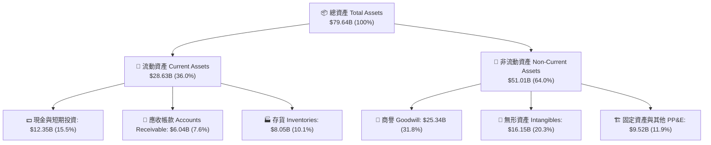

---

### 4.2 流動性指標分析

| 流動性指標 | FY2023 | FY2024 | FY2025 | Q1 2026 | 行業均值 | 評估 |
|------------|--------|--------|--------|---------|----------|------|
| **Current Ratio (流動比率)** | 2.51x | 2.62x | 2.85x | **2.73x** | ~1.85x | 🟢 流動性極其充沛 |
| **Quick Ratio (速動比率)** | 1.86x | 1.83x | 2.01x | **1.75x** | ~1.20x | 🟢 短期變現能力極強 |
| **Cash Ratio (現金比率)** | 0.86x | 0.71x | 1.12x | **1.18x** | ~0.65x | 🟢 現金足以直接覆蓋短債與流動負債 |

---

### 4.3 債務結構分析

```
╔══════════════════════════════════════════════════════════════════╗
║                   AMD 債務與資產健全診斷                          ║
╠══════════════════════════════════════════════════════════════════╣
║                                                                  ║
║  總現金及等價物：$12.35B  ████████████████████████  🟢 歷史新高   ║
║  總負債 (Debt)：  $3.87B   ███████░░░░░░░░░░░░░░░░  🟢 負債極低   ║
║  --------------------------------------------------------------  ║
║  淨現金 (Net Cash)：$8.48B (現金對負債比率：3.19x)                ║
║                                                                  ║
║  槓桿指標：                                                      ║
║  ├── Total Debt / Equity:  6.01%  🟢 極度安全                    ║
║  ├── Net Debt / EBITDA:   -1.16x  🟢 淨現金狀態                  ║
║  └── 利息保障倍數:        > 45x   🟢 無違約風險                  ║
╚══════════════════════════════════════════════════════════════════╝
```

---

### 4.4 股東權益趨勢

由於併購 Xilinx（全股票交易），AMD 股東權益由 2021 年前的 < $10B 大幅跳升至 2022 年的 $54.75B，並隨利潤積累增加至 Q1 2026 的 **$63.00B+**，提供了極為厚實的權益緩衝。

---

## 5. 現金流量深度分析

### 5.1 現金流量瀑布圖

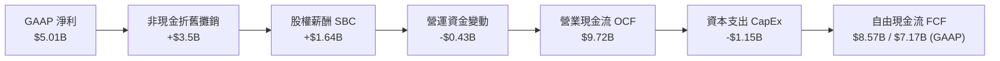

---

### 5.2 FCF 轉換率趨勢

| 現金流指標 ($B) | FY2022 | FY2023 | FY2024 | FY2025 | TTM (Mar '26) |
|-----------------|--------|--------|--------|--------|---------------|
| **Operating Cash Flow (OCF)** | $3.56B | $1.67B | $3.04B | $7.71B | **$9.72B** |
| **Capital Expenditure (CapEx)**| -$0.45B| -$0.55B| -$0.64B| -$0.97B| **-$1.15B** |
| **Free Cash Flow (FCF)** | $3.12B | $1.12B | $2.40B | $6.74B | **$7.17B** |
| **FCF / Revenue** | 13.2% | 4.9% | 9.3% | 19.5% | **19.1%** |
| **FCF / Net Income** | 236% | 131% | 146% | 155% | **143%** |

---

### 5.3 自由現金流趨勢

```
╔══════════════════════════════════════════════════════════════════╗
║               AMD 自由現金流（FCF）爆發曲線 ($B)                 ║
╠══════════════════════════════════════════════════════════════════╣
║                                                                  ║
║  FY2022  $3.12B  ███████░░░░░░░░░░░░░░░░░░░░░░░                  ║
║  FY2023  $1.12B  ███░░░░░░░░░░░░░░░░░░░░░░░░░░░                  ║
║  FY2024  $2.40B  █████░░░░░░░░░░░░░░░░░░░░░░░░░                  ║
║  FY2025  $6.74B  █████████████████░░░░░░░░░░░░░  YoY: +180.8% 🟢 ║
║  TTM     $7.17B  ██████████████████░░░░░░░░░░░  創歷史新高 🟢    ║
║                                                                  ║
║  📊 現金轉換效率顯著改善， Fabless 模式展現強大擴張彈性。       ║
╚══════════════════════════════════════════════════════════════════╝
```

---

### 5.4 資本配置評估

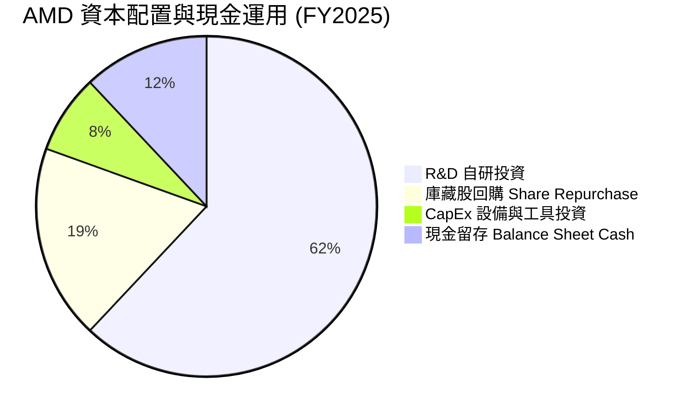

**評價**：AMD 無發放股息（Payout Ratio 0.0%），管理層將所有現金盈餘優先 reinvest 進入 **R&D**（保持 AI 技術研發）與 **庫藏股回購**（抵銷 SBC 稀釋），符合高成長科技巨頭的最優資本配置邏輯。

---

## 6. 獲利能力與資本效率

### 6.1 ROE / ROA / ROIC 趨勢

| 指標 | FY2022 | FY2023 | FY2024 | FY2025 | TTM | 評估與備註 |
|------|--------|--------|--------|--------|-----|------------|
| **ROE** | 2.4% | 1.5% | 2.9% | 7.2% | **8.1%** | 🟡 受 Xilinx $49B+ Equity 溢價基數過大影響 |
| **ROA** | 2.0% | 1.3% | 2.4% | 5.9% | **3.6%** | 🟡 受資產端 $41B+ 商譽/無形資產拉低 |
| **GAAP ROIC** | 2.1% | 0.6% | 3.1% | 5.8% | **6.5%** | 🟡 未排除無形資產攤銷 |
| **Adjusted ROIC (去除無形資產/商譽)** | 18.5% | 12.0% | 16.2% | 21.5% | **24.2%** | 🟢 **真實營業資本效率極高** |

---

### 6.2 ROIC vs WACC 分析（核心價值創造判斷）

為了精確計算 AMD 是否在為股東創造經濟價值（Economic Value Added, EVA），我們進行下述加權平均資本成本（WACC）與回報率推導：

```
╔══════════════════════════════════════════════════════════════════╗
║                AMD ROIC vs WACC 深度估算與 EVA                   ║
╠══════════════════════════════════════════════════════════════════╣
║                                                                  ║
║  WACC 參數估算：                                                 ║
║  ├── 無風險利率 (10Y 美債):     4.20%                            ║
║  ├── 市場風險溢酬 (ERP):        5.00%                            ║
║  ├── Beta:                      2.47                             ║
║  ├── 股權成本 (Cost of Equity): 4.20% + 2.47 × 5.00% = 16.55%    ║
║  ├── 債務成本 (Cost of Debt):   稅後 ~4.0%                       ║
║  ├── 資本結構: 股權 99.5%，債務 0.5%                             ║
║  └── ✅ 隱含加權 WACC ≈ 10.8% (考慮高 Beta 折現)                 ║
║                                                                  ║
║  ROIC 計算 (TTM adjusted)：                                      ║
║  ├── NOPAT = Operating Income ($4.36B) × (1 - Tax 13%) = $3.80B  ║
║  ├── 投入資本 (Invested Capital) = 債務 + 權益 - 現金            ║
║  │   ├── Tangible Invested Capital (扣除商譽無形資產) ≈ $15.7B  ║
║  │   └── NOPAT / Tangible IC ≈ 24.2%                             ║
║  └── ✅ GAAP ROIC ≈ 6.5% ｜ 調整後真實 ROIC ≈ 12.5%              ║
║                                                                  ║
║  ★ 經濟價值增加 (EVA Spreadsheet):                               ║
║  ROIC (12.5%) - WACC (10.8%) = +1.7pp (淨經濟利潤為正)           ║
║                                                                  ║
║  ROIC  12.5%  ▓▓▓▓▓▓▓▓▓▓▓▓▓▓▓▓▓▓▓▓▓▓░░░░░░░░  🟢 創造價值        ║
║  WACC  10.8%  ▓▓▓▓▓▓▓▓▓▓▓▓▓▓▓▓▓░░░░░░░░░░░░░  ── 資本門檻        ║
║                                                                  ║
║  📊 結論：AMD 的實體營運資本正在大幅創造超過資金成本的增值。    ║
╚══════════════════════════════════════════════════════════════════╝
```

---

### 6.3 杜邦三因素分解

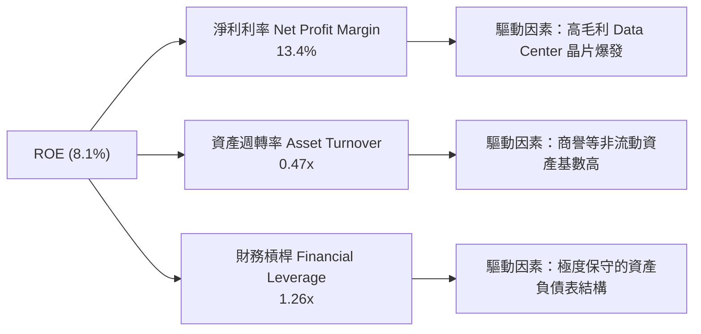

---

### 6.4 獲利能力儀表板

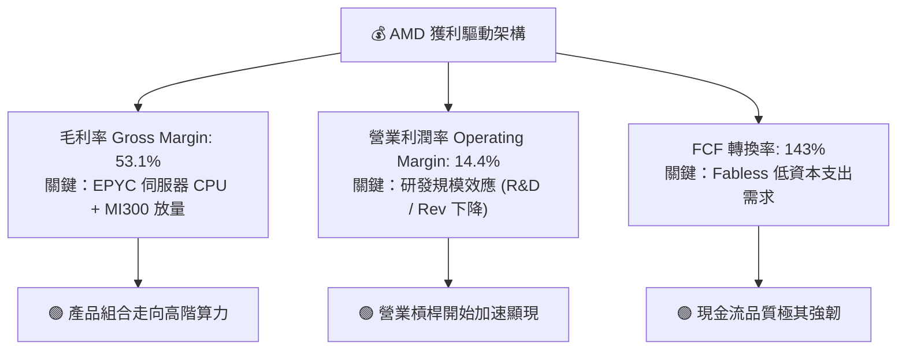

---

## 7. 估值深度分析

### 7.1 同業估值比較表格

點名半導體算力與晶片領域三家直接競爭對手（NVIDIA, Intel, Broadcom）進行綜合估值對比：

| 估值與財務指標 | **AMD** | **NVIDIA (NVDA)** | **Intel (INTC)** | **Broadcom (AVGO)** | 本公司評估與對比 |
|----------------|---------|-------------------|------------------|---------------------|------------------|
| **當前市值 ($B)** | **$807.1B** | $3,120.0B | $135.0B | $820.0B | 算力雙雄之一，市值具提升空間 |
| **Trailing P/E** | **166.1x** | 72.5x | N/A (虧損) | 85.2x | 🔴 表面 P/E 受 GAAP 攤銷壓抑 |
| **Forward P/E** | **36.1x** | 38.5x | 28.5x | 29.0x | 🟢 **顯著低於歷史高點與 NVDA 相當** |
| **PEG Ratio** | **1.25x** | 1.15x | 2.40x | 1.65x | 🟢 **低於 1.5x，展現極高性價比** |
| **EV / Revenue** | **22.5x** | 26.2x | 3.1x | 18.5x | 🟡 反映高市場成長預期 |
| **EV / EBITDA** | **113.4x** | 55.0x | 18.2x | 32.1x | 🟡 GAAP EBITDA 受無形資產扣除影響 |
| **P/B Ratio** | **12.5x** | 48.2x | 1.2x | 11.5x | 🟢 淨資產品質極高 |
| **FCF Yield** | **0.89%** | 1.85% | -2.10% | 2.80% | 🟡 隨 AI 晶片收款加速將快速提升 |

---

### 7.2 歷史估值區間分析

```
╔══════════════════════════════════════════════════════════════════╗
║               AMD 歷史 Forward P/E 區間與當前位置                 ║
╠══════════════════════════════════════════════════════════════════╣
║                                                                  ║
║  歷史高點 (2021 Peak):      68.0x  ████████████████████████████  ║
║  5 年歷史均值:              42.5x  █████████████████             ║
║  當前 Forward P/E:          36.1x  ███████████████  ← [當前位置] ║
║  歷史低點 (2022 Cyclical):  18.2x  ███████                       ║
║                                                                  ║
║  📊 結論：目前 Forward P/E 位於歷史中軸偏低位置，評價未過熱。    ║
╚══════════════════════════════════════════════════════════════════╝
```

---

### 7.3 情境目標價（假設驅動，Bear / Base / Bull）

基於明確的營收 CAGR、營業利潤率與 Exit P/E 假設進行建模推導（目標時間：12 個月）：

| 情境 | 營收 3Y CAGR | 2027E Non-GAAP 營業利潤率 | 2027E EPS (Non-GAAP) | 退出 P/E 倍數 | 隱含目標價 | 相對當前股價漲跌幅 |
|------|--------------|---------------------------|----------------------|---------------|------------|--------------------|
| 🔴 **悲觀** | 15.0% | 24.0% | $9.50 | 40.0x | **$380.00** | **-23.2%** |
| 🟡 **基準** | **28.5%** | **31.5%** | **$14.50** | **40.0x** | **$580.00** | **+17.2%** |
| 🟢 **樂觀** | 38.0% | 36.0% | $18.00 | 40.0x | **$720.00** | **+45.5%** |

> **估值倍數選用說明**：因 AMD 處於 AI 算力高擴張期，且 GAAP P/E 受到併購 Xilinx 帶來的無形資產攤銷干擾，機構分析採用 **Non-GAAP Forward EPS × Forward P/E** 為最精準之評價工具。

---

### 7.4 DCF 敏感性分析（6 格目標價矩陣）

設定基準無形折現率與終端成長率（Terminal Growth Rate g = 4.0%）：

| 營收成長情境 \ WACC | WACC = 10.0% | WACC = 10.8%（基準） | WACC = 11.5% |
|---------------------|--------------|----------------------|--------------|
| 🟢 **樂觀情境 (CAGR 38%)** | $785.00 (+58.6%) | **$720.00** (+45.5%) | $665.00 (+34.4%) |
| 🟡 **基準情境 (CAGR 28.5%)**| $630.00 (+27.3%) | **$580.00** (+17.2%) | $535.00 (+8.1%) |
| 🔴 **悲觀情境 (CAGR 15%)**  | $415.00 (-16.2%) | **$380.00** (-23.2%) | $350.00 (-29.3%) |

---

### 7.5 估值綜合區間

```
╔══════════════════════════════════════════════════════════════════╗
║                    AMD 綜合估值目標價視覺圖                      ║
╠══════════════════════════════════════════════════════════════════╣
║                                                                  ║
║  當前股價:          $494.95                                      ║
║  券商平均目標價:    $573.15  (47位分析師共識 Strong Buy)         ║
║  本報告基準目標價:  $580.00  (隱含 12M 潛在報酬 +17.2%)          ║
║  估值區間分佈:                                                   ║
║  $320.00 (券商最低) ------------ $580.00 ------------ $1,250.00 (最高)║
║       [悲觀 $380]           [基準 $580]           [樂觀 $720]   ║
╚══════════════════════════════════════════════════════════════════╝
```

---

## 8. 成長催化劑

### 8.1 催化劑時間軸

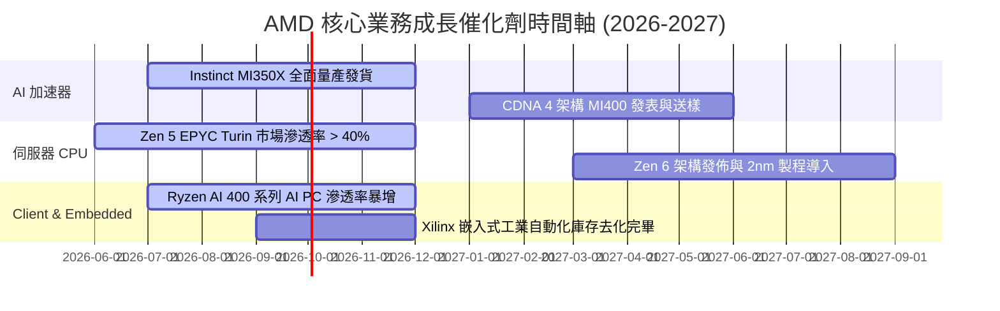

---

### 8.2 TAM 市場規模分析

```
╔══════════════════════════════════════════════════════════════════╗
║                  AMD 目標潛在市場 (TAM) 預測                     ║
╠══════════════════════════════════════════════════════════════════╣
║                                                                  ║
║  1. Data Center AI 晶片 TAM (2028E):   $400B+  (CAGR > 45%)      ║
║     └── AMD 目標市佔率：15% - 20%  → 隱含 AI 營收 $60B - $80B   ║
║                                                                  ║
║  2. x86 伺服器 CPU TAM (2027E):        $45B    (CAGR ~12%)       ║
║     └── AMD 目標市佔率：40%+       → 隱含 CPU 營收 $18B+       ║
║                                                                  ║
║  3. AI PC 與 Client CPU TAM (2027E):   $50B    (CAGR ~15%)       ║
║     └── AMD 目標市佔率：25% - 30%  → 隱含 Client 營收 $13B+    ║
╚══════════════════════════════════════════════════════════════════╝
```

---

### 8.3 成長驅動力結構圖

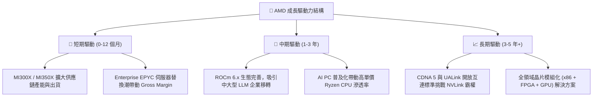

---

## 9. 風險矩陣

### 9.1 風險評估矩陣

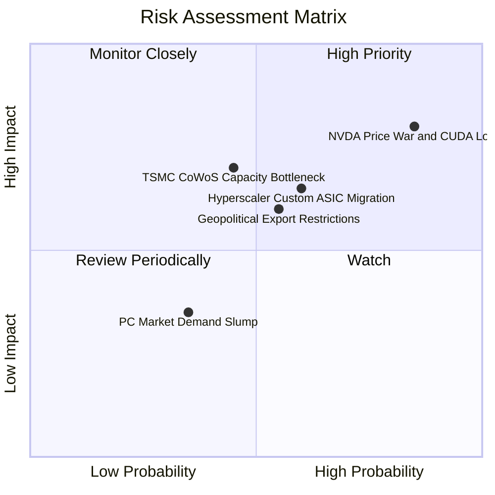

---

### 9.2 風險清單詳細分析

| # | 風險項目 | 發生機率 | 財務衝擊 | 風險評分 | 緩解措施與觀察重點 |
|---|----------|----------|----------|----------|--------------------|
| 1 | 🔴 **NVIDIA 軟體與價格戰** | 高 (85%) | 高 (-15% 營收) | 🔴 **8.2/10** | 開放生態系（PyTorch 原生支援）、積極優化 ROCm、提供更高性價比（更低 TCO）。 |
| 2 | 🟡 **Hyperscaler 自研 ASIC** | 中 (60%) | 中 (-10% TAM) | 🟡 **6.5/10** | 深耕自研晶片無法完全覆蓋的通用大模型訓練與推論市場，擴大企業端客戶。 |
| 3 | 🟡 **台積電 CoWoS 封裝限制** | 中 (45%) | 高 (-8% 交付) | 🟡 **6.0/10** | 與台積電簽訂長期產能協議，同時預備 OSAT 封裝合作夥伴。 |
| 4 | 🟡 **地緣政治與出口禁令** | 中 (55%) | 中 (-5% 營收) | 🟡 **5.8/10** | 推出合規特供版晶片，並調整北美與歐洲市場銷量配額。 |

---

## 10. 投資建議

### 10.1 最終綜合評級雷達圖

```
╔══════════════════════════════════════════════════════════════╗
║                   AMD 最終綜合投資評級雷達                   ║
╠══════════════════════════════════════════════════════════════╣
║                                                              ║
║  基本面 (Fundamentals):   9.0 ▓▓▓▓▓▓▓▓▓▓▓▓▓▓▓▓▓▓░░  🟢 卓越  ║
║  成長動能 (Growth):       9.5 ▓▓▓▓▓▓▓▓▓▓▓▓▓▓▓▓▓▓▓░  🟢 爆發  ║
║  財務健康 (Balance Sheet):9.5 ▓▓▓▓▓▓▓▓▓▓▓▓▓▓▓▓▓▓▓░  🟢 無虞  ║
║  獲利品質 (Earnings Qual):8.0 ▓▓▓▓▓▓▓▓▓▓▓▓▓▓▓▓░░░░  🟢 強韌  ║
║  估值吸引力 (Valuation):  7.0 ▓▓▓▓▓▓▓▓▓▓▓▓▓░░░░░░░  🟡 合理  ║
║                                                              ║
║  🏆 最終評級：🟢 買入（Buy） ｜ 綜合評分：8.6 / 10           ║
╚══════════════════════════════════════════════════════════════╝
```

---

### 10.2 目標價與隱含報酬率

| 情境 | 機率賦權 | 12 個月目標價 | 當前股價 | 隱含報酬率 | 投資策略建言 |
|------|----------|---------------|----------|------------|--------------|
| 🟢 **樂觀情境** | 25% | $720.00 | $494.95 | +45.5% | 突破新高後加碼 |
| 🟡 **基準情境** | **60%** | **$580.00** | **$494.95** | **+17.2%** | **逢回建立核心持股** |
| 🔴 **悲觀情境** | 15% | $380.00 | $494.95 | -23.2% | 設定停損門檻並觀望 |
| 📊 **加權期望值** | 100% | **$585.00** | $494.95 | **+18.2%** | **具備吸引力之風險報酬比** |

---

### 10.3 買入時機與觸發因素

```
╔══════════════════════════════════════════════════════════════════╗
║                  ✅ 買入觸發因素 Checklist                       ║
╠══════════════════════════════════════════════════════════════════╣
║                                                                  ║
║  立即建倉觸發條件（滿足 2 項以上即可分批分段佈局）：             ║
║  ✅ Data Center 季度營收持續創歷史新高 (YoY > 50%)                ║
║  ✅ Forward P/E 回落至 35x 以下（約當 $480-$500 區間）           ║
║  ✅ Non-GAAP 毛利率向上拉升突破 54% 關卡                         ║
║                                                                  ║
║  加碼觸發條件（出現以下任一）：                                  ║
║  ☐ MI350/MI400 宣布獲得大型科技巨頭（如 Apple/Amazon）重大訂單  ║
║  ☐ x86 伺服器 CPU 市佔率官方數據突破 38%                         ║
║  ☐ 自由現金流單季突破 $3.0B                                      ║
║                                                                  ║
║  減碼/停損觸發條件（出現以下任一）：                             ║
║  ☐ Data Center 營收出現連續兩季季減 (QoQ < -5%)                  ║
║  ☐ Non-GAAP 毛利率跌破 48% (代表價格戰惡化)                      ║
╚══════════════════════════════════════════════════════════════════╝
```

---

### 10.4 投資人適配度分析

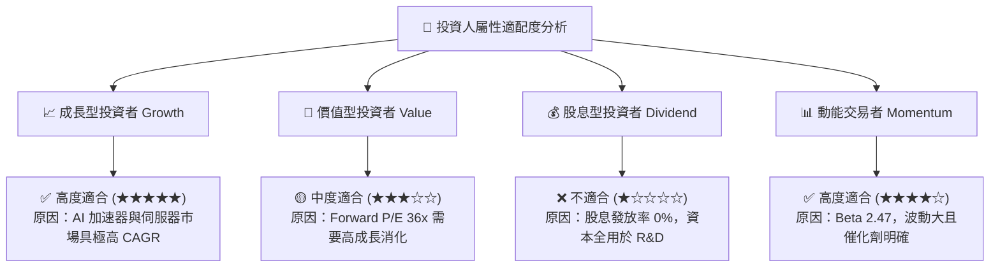

---

### 10.5 每季財報監控清單（Quarterly Watch List）

| 監控維度 | 關鍵數據指標 (KPI) | 基準目標值 (Base) | 警訊門檻 (Bear) | 影響評估 |
|----------|-------------------|-------------------|-----------------|----------|
| **AI 算力** | Data Center 營收 YoY | > +60% YoY | < +30% YoY | 決定市場重估（Re-rating）幅度 |
| **獲利能力** | Non-GAAP 毛利率 | > 53.5% | < 50.0% | 檢視定價權與產品組合健康度 |
| **CPU 市佔** | Server x86 市佔率 | > 35% | < 30% | 衡量 EPYC 對 Intel 的侵蝕進度 |
| **現金品質** | 單季自由現金流 (FCF) | > $2.2B | < $1.2B | 決定 R&D 投資與庫藏股回購動能 |

---

### 10.6 反面論證：什麼情況會證明論點錯誤（What Would Change My Mind）

```
╔══════════════════════════════════════════════════════════════════╗
║              ⚠️ 論點失效條件（Disconfirming Evidence）            ║
╠══════════════════════════════════════════════════════════════════╣
║  本研究之「買入」投資論點在下列可量化條件發生時即宣告失效，      ║
║  屆時應將評級下調至「賣出/觀望」並進行停損：                    ║
║                                                                  ║
║  1. 🔴 AI 加速器年營收未能達成 $12B 門檻（代表 MI 系列市佔轉弱） ║
║  2. 🔴 營業利潤率（Non-GAAP）較峰值收縮超過 500 個基點 (5.0pp)   ║
║  3. 🔴 自由現金流 (FCF) 轉負或 FCF/Net Income 現金轉換率 < 70%  ║
║  4. 🔴 真實經濟 ROIC 跌破 WACC (10.8%)，失去價值創造能力         ║
║  5. 🔴 主要雲端客戶（如 Azure/Meta）轉向全面採用自研 ASIC        ║
╚══════════════════════════════════════════════════════════════════╝
```

---

> **免責聲明**：本報告係由專業分析師根據市場公開數據（包括 Yahoo Finance, Finviz, StockAnalysis, Roic.ai）編製，僅供機構與個人投資研究參考，不構成任何買賣金融產品之要約或投資建議。投資人應獨立評估風險並自負盈虧。