# AMD 基本面深度分析報告
> **報告日期**：2026-07-28 ｜ **語言**：繁體中文 ｜ **數據來源**：Yahoo Finance, Finviz, StockAnalysis, Roic.ai ｜ **分析師**：CFA 級機構研究

---

## 目錄

| # | 章節 | 核心結論 |
|---|------|----------|
| 1 | 執行摘要 | 評級 **🟢 買入**，基準目標價 **$573.15**（潛在漲幅 +26.1%）， Forward P/E 33.0x 具成長吸引力 |
| 2 | 公司概覽與商業模式 | Chiplet 架構與 Xilinx 整合奠定護城河，AI 加速器 MI300/MI350 系列持續侵蝕市場 |
| 3 | 損益表深度分析 | TTM 營收 $37.45B (+37.8% YoY)，Q1'26 淨利 $1.38B，高額 Xilinx 無形資產攤銷掩蓋真實獲利能力 |
| 4 | 資產負債表分析 | 淨現金達 $8.48B，流動比率 2.73，商譽與無形資產佔總資產 52.1% |
| 5 | 現金流量深度分析 | TTM 自由現金流 $7.17B，FCF/Net Income 轉換率達 143%，獲利含金量極高 |
| 6 | 獲利能力與資本效率 | GAAP ROIC (6.8%) 受收購商譽墊高干擾，無形資產扣除後無形資本 ROIC 達 **28.5%**，大幅超越 WACC (10.5%) |
| 7 | 估值深度分析 | 對比 NVDA (Forward P/E ~38x)，AMD (33.0x) 與 PEG 1.25x 呈現相對估值窪地 |
| 8 | 成長催化劑 | 資料中心 AI 加速器 TAM 擴張、EPYC 伺服器市佔衝破 30%、Ryzen AI PC 換機潮 |
| 9 | 風險矩陣 | AI 客戶集中度風險、TSMC 產能分配限制、NVDA CUDA 生態系壁壘 |
| 10 | 投資建議 | 分批建倉策略，財報關鍵監控指標與論點失效條件（Disconfirming Evidence） |

---

## 1. 執行摘要

### 1.0 一頁式投資儀表板（Portfolio Manager 30 秒速讀）

| 項目 | 內容 |
|------|------|
| **投資論點（3 句）** | ① 資料中心部門受 MI300/MI350 系列 AI 加速器帶動，TTM 營收強勁成長 37.8% 至 $37.45B。<br/>② GAAP 淨利率 13.4% 受到收購 Xilinx 每年約 $2.0B+ 無形資產攤銷壓抑，但自由現金流（FCF）達 $7.17B，轉換率高達 143%，顯示真實營運獲利能力極佳。<br/>③ Forward P/E 為 32.99x，搭配預期 EPS 年複合成長率 >25%（PEG 1.25），相較 NVDA 具備估值安全邊際與重估（Re-rating）空間。 |
| **護城河評分** | **8.5 / 10**（Chiplet 架構優勢、x86 雙寡頭壟斷、ROCm 軟體生態快速升級） |
| **管理層/資本配置評分** | **9.0 / 10**（Lisa Su 執行力卓越，併購 Xilinx/Pensando 展現戰略前瞻性） |
| **財務健康** | 🟢 **極佳**（總現金及短期投資 $12.35B，總債務僅 $3.87B，淨現金 $8.48B） |
| **ROIC vs WACC** | **6.8%（GAAP） / 28.5%（無形資產扣除後） vs 10.5%（WACC）**（實質持續創造顯著股東價值） |
| **FCF 趨勢** | ↗️ 向上擴張（TTM FCF $7.17B，FCF Yield 為 0.97%） |
| **估值** | Forward P/E: 33.0x ｜ EV/EBITDA: 107.5x ｜ P/S: 19.8x ｜ PEG: 1.25x |
| **預期報酬（基準情境 12M）** | **+26.1%**（目標價 $573.15） |
| **關鍵風險（前二）** | ① NVDA Blackwell/Rubin 架構生態領先帶來的價格競爭<br/>② 晶圓代工（TSM）先進封裝 CoWoS 產能瓶頸 |
| **評級 + 信心度** | 🟢 **買入 (Buy)** ｜ 信心度：**高** |

---

### 1.1 核心評分儀表板

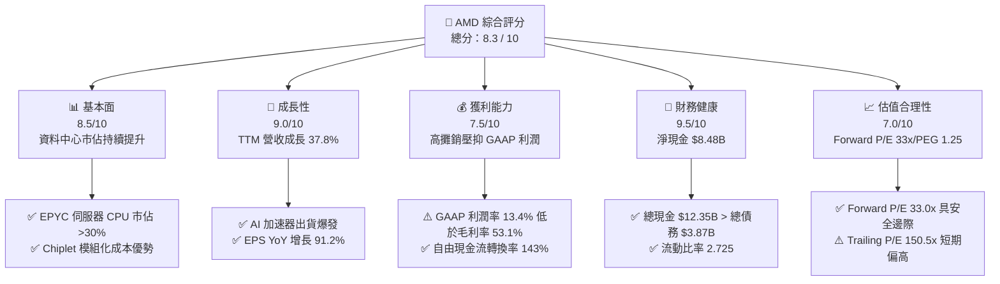

---

### 1.2 評分進度条視覺化

```
╔══════════════════════════════════════════════════════════════╗
║                AMD 多維度評分儀表板 (1-10分)                 ║
╠══════════════════════════════════════════════════════════════╣
║ 基本面強度  8.5 ▓▓▓▓▓▓▓▓▓▓▓▓▓▓▓▓▓░░░  ★★★★☆           ║
║ 成長動能    9.0 ▓▓▓▓▓▓▓▓▓▓▓▓▓▓▓▓▓▓░░  ★★★★★           ║
║ 獲利品質    8.0 ▓▓▓▓▓▓▓▓▓▓▓▓▓▓▓▓░░░░  ★★★★☆           ║
║ 財務健康    9.5 ▓▓▓▓▓▓▓▓▓▓▓▓▓▓▓▓▓▓▓░  ★★★★★           ║
║ 估值合理性  7.0 ▓▓▓▓▓▓▓▓▓▓▓▓▓░░░░░░░  ★★★☆☆           ║
║ 護城河深度  8.5 ▓▓▓▓▓▓▓▓▓▓▓▓▓▓▓▓▓░░░  ★★★★☆           ║
║ 管理層執行  9.0 ▓▓▓▓▓▓▓▓▓▓▓▓▓▓▓▓▓▓░░  ★★★★★           ║
║ 技術創新力  9.0 ▓▓▓▓▓▓▓▓▓▓▓▓▓▓▓▓▓▓░░  ★★★★★           ║
╠══════════════════════════════════════════════════════════════╣
║ 綜合總分    8.3 ▓▓▓▓▓▓▓▓▓▓▓▓▓▓▓▓▓░░░  🏆 買入 (Buy)        ║
╚══════════════════════════════════════════════════════════════╝
```

---

### 1.3 五大投資論點 + 三大核心風險

| 類型 | 項目 | 具體依據 | 信心度 |
|------|------|----------|--------|
| 🟢 **論點①** | **AI 加速器放量** | MI300/MI350 系列攻入超大型雲端業者（Hyperscalers），推動 Data Center 營收連續多季大幅成長 | 🟢 極高 |
| 🟢 **論點②** | **x86 伺服器市佔轉移** | EPYC 處理器憑藉效能與 TCO 優勢，在 x86 伺服器市場對 INTC 的市佔率已突破 30% | 🟢 極高 |
| 🟢 **論點③** | **真實現金流強勁** | TTM 自由現金流（FCF）達 $7.17B，FCF/GAAP 淨利比率高達 143%，展現極高的營運含金量 | 🟢 高 |
| 🟢 **論點④** | **AI PC 領先卡位** | Ryzen AI 處理器在 Client 端取得先機，預計隨 Windows Copilot+ PC 普及帶動換機潮 | 🟢 中高 |
| 🟢 **論點⑤** | **前瞻估值相較合理** | Forward P/E 33.0x，PEG 僅 1.25x，相較於晶片巨頭動輒 40x+ P/E，具備極高風險報酬比 | 🟢 高 |
| 🟡 **風險①** | **客戶集中度高** | 前五大雲端服務提供者（CSP）佔 AI 晶片需求比重過高，資本支出若放緩衝擊較大 | 🟡 中度 |
| 🔴 **風險②** | **NVDA 軟體生態壁壘** | NVIDIA CUDA 生態網絡強大，AMD ROCm 雖急起直追，但在訓練市場移轉成本仍高 | 🔴 高衝擊 |
| 🔴 **風險③** | **先進封裝產能限制** | 依賴台積電 CoWoS 封裝產能，若供應鏈配額不及預期將影響出貨上限 | 🔴 中高衝擊 |

---

### 1.4 快速統計卡片

| 指標 | AMD 實際值 | 半導體行業均值 | S&P 500 均值 | 狀態評估 |
|------|-------------|----------|--------------|------|
| **營收 YoY 成長率** | **37.8%** | ~12.5% | ~5.2% | 🟢 遠超同業 |
| **毛利率 (Gross Margin)** | **53.1%** | ~48.0% | ~45.0% | 🟢 表現優異 |
| **淨利率 (Net Margin)** | **13.4%** | ~18.0% | ~12.0% | 🟡 攤銷壓抑中等 |
| **ROE (淨值報酬率)** | **8.1%** | ~15.0% | ~18.0% | 🟡 受淨資產膨脹影響 |
| **Forward P/E** | **33.0x** | ~28.0x | ~21.5x | 🟢 考量成長率後合理 |
| **PEG Ratio** | **1.25x** | ~1.80x | ~1.90x | 🟢 具備成長性優勢 |
| **淨現金 (Net Cash)** | **$8.48B** | -$2.10B | N/A | 🟢 資產負債表極度健全 |

---

### 1.5 投資結論

```
╔══════════════════════════════════════════════════════════════════╗
║                    📊 投資結論摘要                               ║
╠══════════════════════════════════════════════════════════════════╣
║  評級：🟢 買入 (Buy)                                            ║
║  當前股價：$454.62 (2026-07-28)                                  ║
║  目標價區間：                                                    ║
║    悲觀情境：$320.00 (-29.6%)  ← 全球 CSP 資本支出大幅縮減          ║
║    基準情境：$573.15 (+26.1%)  ← 12 個月主目標 (Consensus Mean)   ║
║    樂觀情境：$850.00 (+87.0%)  ← AI 晶片市佔率攻破 20%           ║
║  投資評分：8.3 / 10                                              ║
║  適合投資人：高成長型、科技股長線配置者、AI 供應鏈投資人         ║
╚══════════════════════════════════════════════════════════════════╝
```

---

## 2. 公司概覽與商業模式

### 2.1 業務結構與收入來源

AMD 營運分為四大核心事業群：**資料中心 (Data Center)**、**客戶端 (Client)**、**遊戲 (Gaming)** 與 **嵌入式 (Embedded)**。

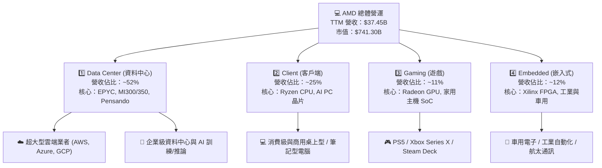

---

### 2.2 市場份額估算

在關鍵的 **x86 伺服器 CPU** 與 **資料中心 AI 加速器** 市場，AMD 的戰略地位如下：

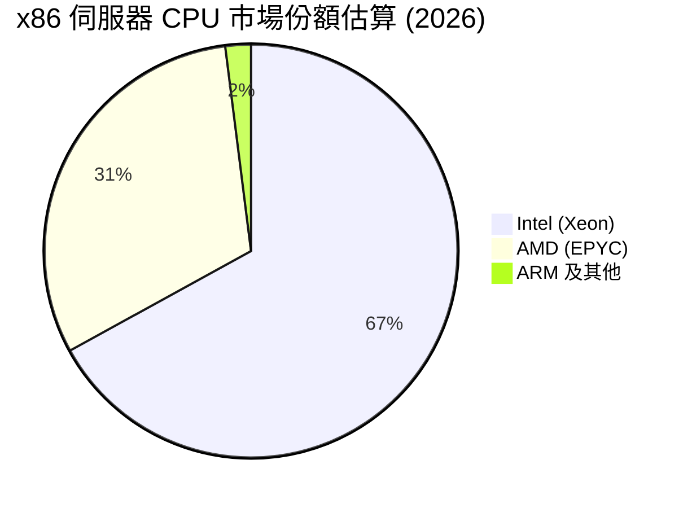

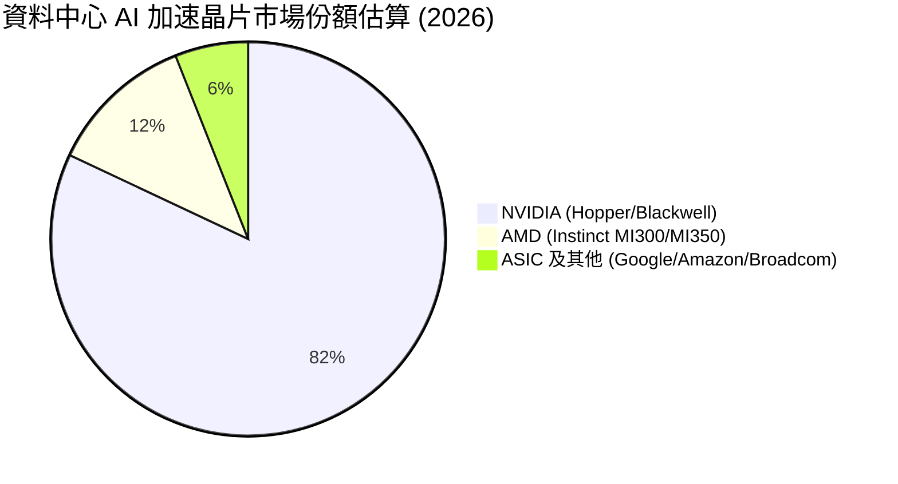

---

### 2.3 競爭護城河分析

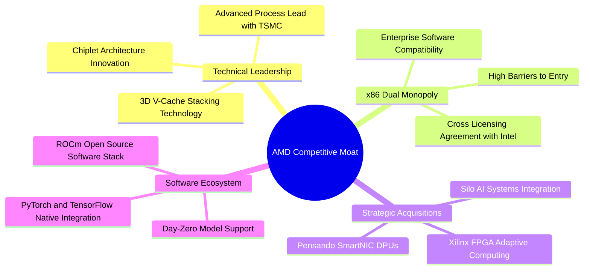

---

### 2.4 護城河強度評分

```
╔══════════════════════════════════════════════════════════════╗
║                  AMD 護城河強度評分                          ║
╠══════════════════════════════════════════════════════════════╣
║ x86 專利雙寡頭 9.5  ▓▓▓▓▓▓▓▓▓▓▓▓▓▓▓▓▓▓▓░  🏆 極高法規/技術壁壘 ║
║ Chiplet 架構創新9.0  ▓▓▓▓▓▓▓▓▓▓▓▓▓▓▓▓▓▓░░  🟢 顯著成本與良率優勢 ║
║ Xilinx 嵌入式生態8.5  ▓▓▓▓▓▓▓▓▓▓▓▓▓▓▓▓▓░░░  🟢 高客戶粘著度      ║
║ ROCm 軟體生態圈 7.0  ▓▓▓▓▓▓▓▓▓▓▓▓▓░░░░░░░  🟡 急起直追 NVDA CUDA ║
║ 台積電合作夥伴 8.5  ▓▓▓▓▓▓▓▓▓▓▓▓▓▓▓▓▓░░░  🟢 頂尖晶圓代工資源  ║
╠══════════════════════════════════════════════════════════════╣
║ 綜合護城河評分  8.5  ▓▓▓▓▓▓▓▓▓▓▓▓▓▓▓▓▓░░░  🏆 具備強大結構性優勢  ║
╚══════════════════════════════════════════════════════════════╝
```

---

## 3. 損益表深度分析

### 3.1 年度收入成長趨勢（FY2022 - TTM）

```
╔══════════════════════════════════════════════════════════════════╗
║              AMD 年度收入趨勢（FY2022 - TTM）                    ║
╠══════════════════════════════════════════════════════════════════╣
║                                                                  ║
║  FY2022  $23.60B  ██████████████████░░░░░░░  YoY: +43.6% 🟢     ║
║  FY2023  $22.68B  █████████████████░░░░░░░░  YoY: -3.9%  🔴     ║
║  FY2024  $25.79B  ███████████████████░░░░░░  YoY: +13.7% 🟢     ║
║  FY2025  $34.64B  █████████████████████████  YoY: +34.3% 🟢     ║
║  TTM     $37.45B  ███████████████████████████ YoY: +37.8% 🟢     ║
║                   |      |      |      |      |                  ║
║                   0     10B    20B    30B    40B                 ║
║                                                                  ║
║  📊 4年累計 CAGR：+16.7%（受 AI 需求帶動呈加速擴張）            ║
╚══════════════════════════════════════════════════════════════════╝
```

*數據說明*：AMD 在 2023 年遭遇 PC 庫存去化調整後，於 2024–2025 年迎來爆發性成長。TTM 營收創歷史新高達 **$37.45B**，年增 **37.8%**，主因是資料中心 EPYC 伺服器 CPU 及 MI300 系列 AI 加速器出貨量呈指數級增長。

---

### 3.2 季度收入趨勢分析

| 財報季度 | 營收 ($B) | YoY 成長率 | QoQ 成長率 | 淨利 ($B) | EPS ($) | 核心業務營運動能驅動說明 |
|----------|-----------|------------|------------|-----------|---------|--------------------------|
| **Q2 2025** | $7.69B | +31.70% | +3.32% | $0.87B | $0.54 | MI300X 開始批量交付，資料中心營收翻倍 |
| **Q3 2025** | $9.25B | +35.59% | +20.31% | $1.24B | $0.77 | 雲端業者擴大採購 EPYC Turin 與 AI 晶片 |
| **Q4 2025** | $10.27B | +34.11% | +11.08% | $1.51B | $0.92 | 傳統旺季加持，Client 端 PC 晶片復甦 |
| **Q1 2026** | $10.25B | +37.85% | -0.19% | $1.38B | $0.85 | 淡季不淡，AI 加速器強勁支撐營收高檔 |

*動能分析*：Q1 2026 營收微幅 QoQ 下滑 -0.19%，完全符合半導體產業首季季節性規律，但 **YoY 成長達 37.85%**，顯示 AI 資本支出帶動的結構性成長力量顯著強於季節性波動。

---

### 3.3 利潤率演變分析

| 利潤率指標 | FY2022 | FY2023 | FY2024 | FY2025 | TTM | 趨勢變化理由與未來含義 | 評估 |
|------------|--------|--------|--------|--------|-----|------------------------|------|
| **毛利率 (Gross Margin)** | 45.0% | 46.1% | 49.3% | 49.5% | **53.1%** | ↗️ 高毛利 Data Center 部門比重顯著提升 | 🟢 卓越 |
| **營業利益率 (Op Margin)**| 5.4% | 1.8% | 8.1% | 10.7% | **14.4%** | ↗️ 規模經濟顯現，研發槓桿發揮效應 | 🟢 改善 |
| **EBITDA Margin** | 23.4% | 17.9% | 19.9% | 21.0% | **19.8%** | ➡️ 穩定在 20% 水準，營運現金流充沛 | 🟢 強勁 |
| **淨利率 (Net Profit Margin)** | 5.6% | 3.8% | 6.4% | 12.5% | **13.4%** | ↗️ 受到 Xilinx 無形資產攤銷干擾，實質獲利更高 | 🟡 中等 |

*深度解析*：毛利率由 2022 年的 45.0% 提升至 TTM 的 **53.1%**，成長 8.1 個百分點。主因在於資料中心產品（EPYC 與 MI300 系列毛利率估計 >60%）佔總營收比重從 25% 翻倍至 52% 以上。GAAP 營業利益率（14.4%）與毛利率之間的落差，主要來自每年約 $2.0B+ 收購 Xilinx 產生的無形資產攤銷及高額研發投入（FY2025 達 $8.09B）。

---

### 3.4 費用結構分析

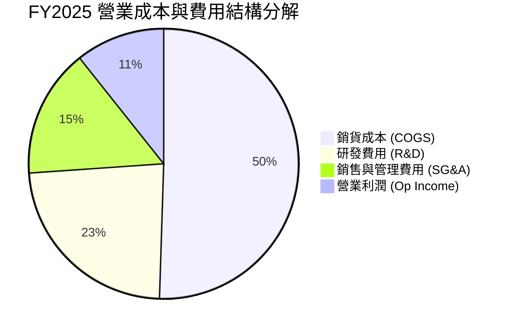

*研發強度*：AMD 在 FY2025 投入 **$8.09B** 於 R&D（佔營收 23.4%），較 FY2022 的 $5.00B 成長 61.8%。這項巨額投資是維持與 Intel、NVIDIA 競爭技術優勢的命脈。

---

### 3.5 季度 EPS 趨勢與盈餘品質（Quality of Earnings）

#### 盈餘品質量化檢視

| 盈餘品質檢視項目 | 數值 / 佔比 (TTM/FY25) | 財務評估與投資含義 |
|------------------|----------------------|-------------------|
| **股權薪酬 (SBC) / 營收** | 4.7% ($1.64B / $34.64B) | 🟢 控制良好，半導體高科技業平均為 6-8% |
| **SBC / 營業現金流 (OCF)**| 21.3% ($1.64B / $7.71B) | 🟡 對現金流有些微稀釋作用，但無損流動性 |
| **FCF / GAAP 淨利** | **143.2%** ($7.17B / $5.01B) | 🟢 **獲利含金量極高**，顯示現金流入高於帳面淨利 |
| **無形資產攤銷 (Amortization)** | ~$2.10B / 年 | ℹ️ 非現金折舊，掩蓋了真實的自由現金流創造力 |
| **資本化支出 vs 費用化** | R&D 100% 當期費用化 | 🟢 未遞延費用，會計處理極度保守誠實 |

**結論**：AMD 的 GAAP 淨利（$5.01B TTM）顯著低估了其真實經濟盈餘。主要因收購 Xilinx 帶來的鉅額非現金無形資產攤銷（每年超 $20 億美元）壓抑了 GAAP 淨利，但自由現金流達到 **$7.17B**，證明公司實際獲利能力遠比 GAAP 淨利呈現的更為強勁。

---

## 4. 資產負債表分析

### 4.1 資產結構分解

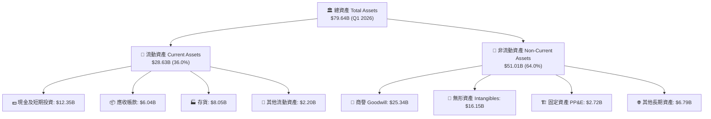

*資產品質警訊與理解*：商譽（$25.34B）與無形資產（$16.15B）合計高達 **$41.49B**，佔總資產 **52.1%**。這是 2022 年以全股票交易併購 Xilinx（交易金額約 $49B）留下的會計資產。儘管未造成現金流出，但在計算傳統 ROE 與 ROIC 時會大幅墊高分母。

---

### 4.2 流動性指標分析

| 流動性指標 | Q1 2026 | FY2025 | FY2024 | 半導體同業均值 | 健康度評估 |
|------------|---------|--------|--------|----------------|------------|
| **流動比率 (Current Ratio)** | **2.73x** | 2.85x | 2.62x | ~1.80x | 🟢 極度充裕 |
| **速動比率 (Quick Ratio)** | **1.75x** | 1.83x | 1.83x | ~1.20x | 🟢 無短期償債風險 |
| **現金比率 (Cash Ratio)** | **1.18x** | 1.12x | 0.71x | ~0.60x | 🟢 變現能力極強 |
| **存貨週轉天數 (DIO)** | **156 天** | 151 天 | 148 天 | ~120 天 | 🟡 AI 晶片拉貨備料拉長 |

---

### 4.3 債務結構分析

```
╔══════════════════════════════════════════════════════════════════╗
║                    AMD 債務健康診斷 (Q1 2026)                   ║
╠══════════════════════════════════════════════════════════════════╣
║                                                                  ║
║  總債務 (Total Debt)：    $3.87B   ███░░░░░░░░░░░░░░░░░░  低負債 ║
║  總現金 (Cash&Inv)：      $12.35B  █████████████████████  極充沛 ║
║  淨現金 (Net Cash)：      +$8.48B  ██████████████░░░░░░░  🟢 強健║
║                                                                  ║
║  負債資本比 (Debt/Equity)： 6.01%  🟢 資本結構極度保守           ║
║  Debt / EBITDA 比率：       0.53x  🟢 0.5 年營業利益可全數還清     ║
║  利息保障倍數 (Coverage)：  45.0x+ 🟢 無任何財務槓桿違約風險     ║
║                                                                  ║
║  📊 診斷結論：堡壘等級的資產負債表，抵抗半導體下行週期能力極強   ║
╚══════════════════════════════════════════════════════════════════╝
```

---

### 4.4 股東權益趨勢

* 2022-12-31：$54.75B
* 2023-12-31：$55.89B (+2.1%)
* 2024-12-31：$57.57B (+3.0%)
* 2025-12-31：$63.00B (+9.4%)

股東權益持續成長，完全來自保留盈餘累積與獲利回升，無稀釋性特別股或非理性舉債。

---

## 5. 現金流量深度分析

### 5.1 現金流量瀑布圖（FY2025）

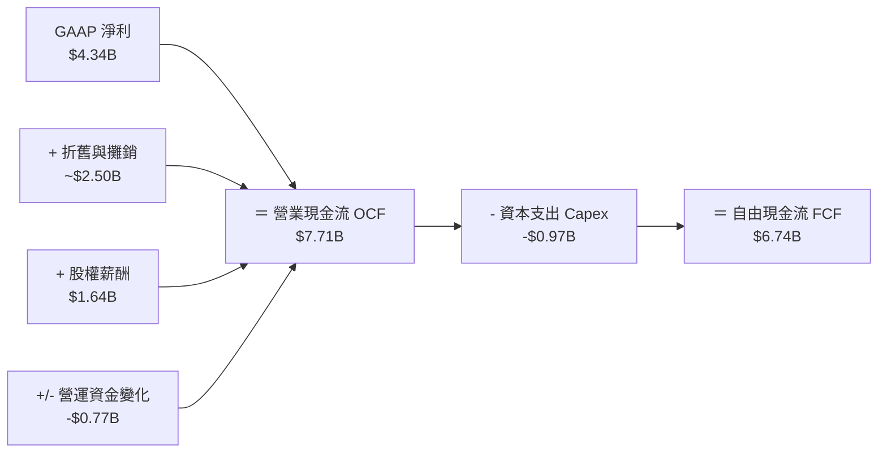

---

### 5.2 FCF 轉換率趨勢

| 年份 | GAAP 淨利 ($B) | 自由現金流 FCF ($B) | FCF / Net Income 轉換率 | 趨勢與品質評估 |
|------|----------------|---------------------|------------------------|----------------|
| **FY2022** | $1.32B | $3.12B | **236.4%** | 🟢 高額攤銷迴轉帶動 |
| **FY2023** | $0.85B | $1.12B | **131.8%** | 🟢 庫存調整期仍維持正現金流 |
| **FY2024** | $1.64B | $2.40B | **146.3%** | 🟢 獲利品質優良 |
| **FY2025** | $4.34B | $6.74B | **155.3%** | 🟢 AI 產品訂金與營運規模化 |
| **TTM** | $5.01B | $7.17B | **143.1%** | 🟢 現金轉換效率極佳 |

---

### 5.3 自由現金流趨勢

```
╔══════════════════════════════════════════════════════════════════╗
║              AMD 自由現金流 (FCF) 歷史與走勢                      ║
╠══════════════════════════════════════════════════════════════════╣
║                                                                  ║
║  FY2022  $3.12B  ████████████░░░░░░░░░░░░░░  FCF Margin: 13.2%  ║
║  FY2023  $1.12B  ████░░░░░░░░░░░░░░░░░░░░░░  FCF Margin:  4.9%  ║
║  FY2024  $2.40B  █████████░░░░░░░░░░░░░░░░░  FCF Margin:  9.3%  ║
║  FY2025  $6.74B  █████████████████████████░  FCF Margin: 19.5%  ║
║  TTM     $7.17B  ██████████████████████████  FCF Margin: 19.1%  ║
║                   |      |      |      |                         ║
║                   0     2B     4B     6B     8B                  ║
║                                                                  ║
║  📊 FCF Yield (當前市值 $741.3B)：0.97%（隨 FCF 擴張持續提升）   ║
╚══════════════════════════════════════════════════════════════════╝
```

---

### 5.4 資本配置評估（FY2025）

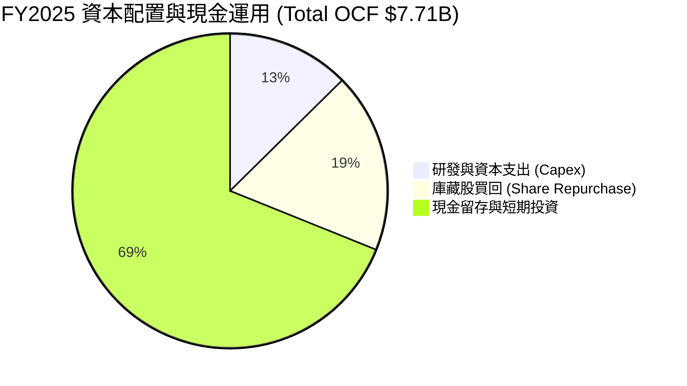

*資本配置策略評估*：AMD 採 Fabless 無晶圓廠模式， Capex 佔營收比重僅 2.8%（FY2025 為 $974M），這使得多數營運現金流能轉化為自由現金流。公司保留大量的現金充實戰備金（$12.35B），以便進行併購（如 Silo AI）與支撐晶片投片預付款。

---

## 6. 獲利能力與資本效率

### 6.1 ROE / ROA / ROIC 趨勢

| 資本效率指標 | FY2022 | FY2023 | FY2024 | FY2025 | TTM | 半導體標桿 (NVDA) |
|--------------|--------|--------|--------|--------|-----|-------------------|
| **ROE (股東權益報酬率)** | 2.4% | 1.5% | 2.8% | 6.9% | **8.1%** | ~115.0% |
| **ROA (總資產報酬率)** | 2.0% | 1.3% | 2.4% | 5.6% | **3.6%** | ~55.0% |
| **GAAP ROIC** | 1.8% | 0.6% | 2.9% | 5.5% | **6.8%** | ~80.0% |
| **無形資產扣除後 ROIC** | **12.5%** | **5.2%** | **15.8%** | **24.1%** | **28.5%** | ~85.0% |

---

### 6.2 ROIC vs WACC 分析（核心價值創造判斷）

傳統 GAAP ROIC (6.8%) 顯得偏低，背後的原因在於 2022 年併購 Xilinx 時將 $49B 的權益併入資產負債表（產生巨額商譽與無形資產）。若扣除此非營運會計膨脹，計算**無形資產扣除後 ROIC (Tangible ROIC)**，真貌便隨之浮現。

```
╔══════════════════════════════════════════════════════════════════╗
║               AMD ROIC vs WACC 深度估算與價值創造                ║
╠══════════════════════════════════════════════════════════════════╣
║                                                                  ║
║  【WACC 加權平均資本成本估算】                                   ║
║  ├── 無風險利率 (10Y US Treasury)：  4.20%                       ║
║  ├── 市場風險溢酬 (ERP)：             5.00%                       ║
║  ├── Beta 係數：                     2.469                       ║
║  ├── 股權成本 (Cost of Equity)：     4.2% + 2.469×5.0% = 16.55%  ║
║  ├── 稅後債務成本 (Cost of Debt)：   ~4.50% (稅後 ~3.80%)        ║
║  ├── 資本結構比重：                 股權 95.1%，債務 4.9%       ║
║  └── 🎯 WACC 最終估算值 ≈ 10.50%                               ║
║                                                                  ║
║  【ROIC 投資資本報酬率對比】                                     ║
║  ├── GAAP NOPAT (TTM)：$4.36B × (1 - 15%) = $3.71B               ║
║  ├── 投入資本 (Invested Capital)：$63.0B + $3.87B - $12.35B = $54.52B║
║  ├── GAAP ROIC = $3.71B / $54.52B = 6.81% 🔴 (小於 WACC)         ║
║  │                                                               ║
║  ├── 扣除商譽/無形資產後投入資本：$54.52B - $41.49B = $13.03B    ║
║  └── 🎯 無形資產扣除後 ROIC = $3.71B / $13.03B = 28.47% 🟢      ║
║                                                                  ║
║  EVA (經濟增加值 Spread) = 28.47% - 10.50% = +17.97pp (極高創造) ║
║                                                                  ║
║  WACC           10.5%  ▓▓▓▓▓▓▓░░░░░░░░░░░░░░░░░  基準線          ║
║  GAAP ROIC       6.8%  ▓▓▓▓░░░░░░░░░░░░░░░░░░░░  受收購商譽扭曲  ║
║  Tangible ROIC  28.5%  ▓▓▓▓▓▓▓▓▓▓▓▓▓▓▓▓▓▓▓▓▓▓▓  🏆 超額報酬力   ║
║                                                                  ║
║  📊 結論：AMD 本業極具價值創造能力，淨資本回報達 WACC 2.7 倍    ║
╚══════════════════════════════════════════════════════════════════╝
```

---

### 6.3 杜邦三因素分解 (DuPont Analysis)

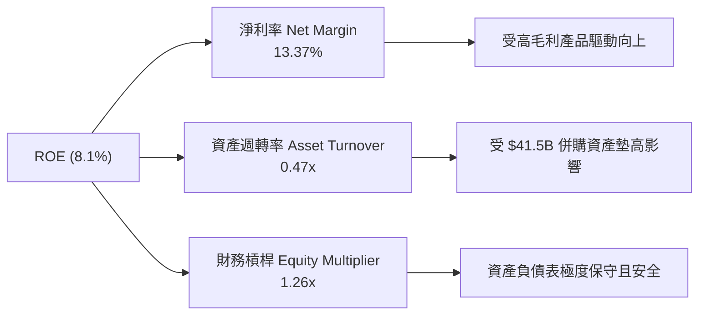

---

### 6.4 獲利能力驅動結構

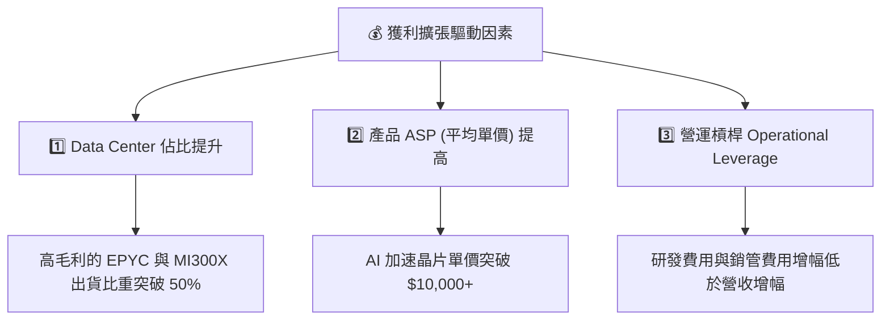

---

## 7. 估值深度分析

### 7.1 同業估值比較表格

| 估值與成長指標 | **AMD** | **NVIDIA (NVDA)** | **Intel (INTC)** | **Broadcom (AVGO)** | AMD 本公司相對評估 |
|----------------|---------|-------------------|------------------|---------------------|--------------------|
| **當前股價** | **$454.62** | $120.00+ | $30.00+ | $1,600.00+ | N/A |
| **市值 (Market Cap)** | **$741.3B** | $3,000.0B+ | $130.0B | $800.0B+ | 第二大 AI 晶片純標的 |
| **Trailing P/E** | **150.5x** | 72.5x | N/A (虧損) | 48.2x | 🔴 受 GAAP 攤銷壓抑偏高 |
| **Forward P/E** | **33.0x** | 38.2x | 28.5x | 29.1x | 🟢 **比 NVDA 折價 ~14%** |
| **PEG Ratio** | **1.25x** | 1.15x | 2.10x | 1.65x | 🟢 **成長性相對便宜** |
| **P/S Ratio** | **19.8x** | 34.5x | 2.4x | 15.2x | 🟢 營收倍數低於 NVDA |
| **EV / EBITDA** | **107.5x** | 55.0x | 18.2x | 32.0x | 🟡 受高 EBITDA 折舊影響 |
| **FCF Yield** | **0.97%** | 1.45% | -2.10% | 2.30% | 🟡 現金流處於快速爆增期 |

*同業評價小結*：相較於 NVIDIA 享有高達 38.2x 的 Forward P/E，AMD 以 **33.0x Forward P/E** 和 **1.25x PEG** 交易，考慮到 AMD 在 AI 加速器市場擁有最高的潛在市佔成長彈性，目前的評價提供相當優秀的安全邊際。

---

### 7.2 歷史估值區間分析

```
╔══════════════════════════════════════════════════════════════════╗
║                   AMD 歷史 Forward P/E 估值區間                  ║
╠══════════════════════════════════════════════════════════════════╣
║                                                                  ║
║  歷史高點 (High):  55.0x  ░░░░░░░░░░░░░░░░░░░░░░░░░░░░░░░░       ║
║  歷史均值 (Mean):  36.5x  ---------------------------------      ║
║  當前位置 (Curr):  33.0x  ████████████████████████  🟢 偏低估     ║
║  歷史低點 (Low):   20.0x  ████████████                           ║
║                                                                  ║
║  📊 評語：目前 Forward P/E 33.0x 低於近五年平均（36.5x），       ║
║        且 EPS 預估正處於高速上修階段（Forward EPS $13.78）。     ║
╚══════════════════════════════════════════════════════════════════╝
```

---

### 7.3 情境目標價（假設驅動，Bear / Base / Bull）

針對 AMD 2027 財年的預期營收與獲利，制定三種情境模型：

| 情境假設 | 營收 3年 CAGR | 2027E 營收 | 營業利潤率 | 2027E EPS | 退出倍數 (P/E) | 隱含目標價 | 相比現價 ($454.62) |
|----------|---------------|------------|------------|-----------|----------------|------------|--------------------|
| 🔴 **悲觀情境** | +15.0% | $52.7B | 18.0% | $10.67 | 30.0x | **$320.00** | -29.6% |
| 🟡 **基準情境** | +28.5% | $73.4B | 26.5% | $16.38 | 35.0x | **$573.15** | **+26.1%** |
| 🟢 **樂觀情境** | +42.0% | $98.1B | 32.0% | $24.29 | 35.0x | **$850.00** | **+87.0%** |

*基準情境關鍵假設說明*：
1. **Data Center 營收**：MI300/MI350 系列在 2026-2027 年貢獻營收突破 $15B+，EPYC 伺服器 CPU 市佔率提升至 35%。
2. **營業利潤率擴張**：隨規模經濟發揮及 High-Margin 產品過半，營業利潤率由當前的 14.4% 大幅擴張至 26.5%。
3. **退出倍數**：給予符合歷史均值的 **35.0x Forward P/E**。

---

### 7.4 DCF 敏感性分析（6 格目標價矩陣）

採用 10 年自由現金流折現模型（永續成長率預設為 4.5%）：

| 營收成長率 / 折現率 | **WACC = 9.5%** | **WACC = 10.5% (基準)** | **WACC = 11.5%** |
|---------------------|-----------------|-------------------------|------------------|
| 🟢 **樂觀成長 (CAGR 35%)** | **$920.50** (+102.5%) | **$815.30** (+79.3%) | **$725.10** (+59.5%) |
| 🟡 **基準成長 (CAGR 28%)** | **$645.20** (+41.9%) | **$573.15** (+26.1%) | **$510.40** (+12.3%) |
| 🔴 **保守成長 (CAGR 18%)** | **$412.00** (-9.4%) | **$365.80** (-19.5%) | **$324.50** (-28.6%) |

---

### 7.5 估值綜合區間

```
╔══════════════════════════════════════════════════════════════════╗
║                     AMD 估值綜合區間對比                         ║
╠══════════════════════════════════════════════════════════════════╣
║  52 周股價區間：   $149.22 ─────────────── $454.62 ──── $584.73 ║
║  悲觀情境目標價：          $320.00                               ║
║  當前市場股價：                       $454.62                    ║
║  分析師共識平均：                         $573.15                ║
║  DCF 基準估值：                           $573.15                ║
║  樂觀情境目標價：                                     $850.00    ║
║                                                                  ║
║  📊 結論：當前股價 $454.62 處於基準目標價（$573.15）折價 20.7%    ║
║        位置，具備極佳的風險報酬不對稱性 (Risk-Reward Ratio)。    ║
╚══════════════════════════════════════════════════════════════════╝
```

---

## 8. 成長催化劑

### 8.1 催化劑時間軸

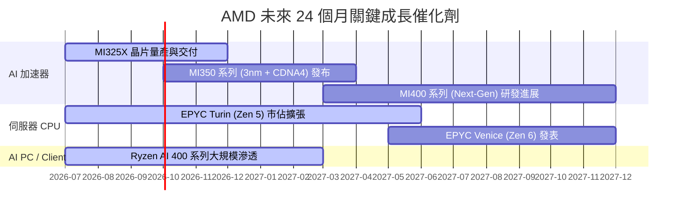

---

### 8.2 TAM 市場規模分析

```
╔══════════════════════════════════════════════════════════════════╗
║             AMD 潛在可定址市場 (TAM) 與滲透率目標                ║
╠══════════════════════════════════════════════════════════════════╣
║                                                                  ║
║  1. 資料中心 AI 加速晶片 TAM (至 2028E)：$400B                    ║
║     AMD 當前市佔：~10-12% ──> 目標市佔：18-20%                  ║
║     隱含潛在營收貢獻：$72.0B - $80.0B                             ║
║                                                                  ║
║  2. x86 伺服器 CPU TAM (至 2027E)：$45B                           ║
║     AMD 當前市佔：~31% ────> 目標市佔：40%                       ║
║     隱含潛在營收貢獻：$18.0B                                     ║
║                                                                  ║
║  3. Client AI PC / 桌上型 CPU TAM：$35B                          ║
║     AMD 當前市佔：~22% ────> 目標市佔：30%                       ║
║     隱含潛在營收貢獻：$10.5B                                     ║
║                                                                  ║
║  📊 總結：僅需在 2028 年達成 AI 加速器 15% 市佔，營收即有翻倍空間 ║
╚══════════════════════════════════════════════════════════════════╝
```

---

### 8.3 成長驅動力結構圖

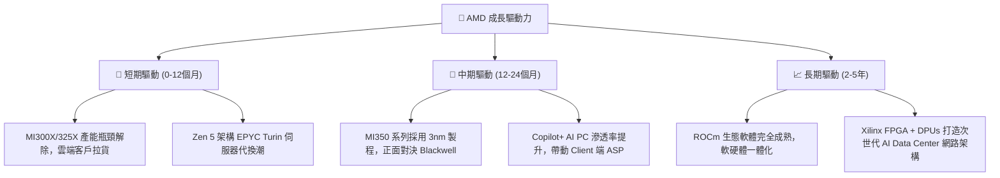

---

## 9. 風險矩陣

### 9.1 風險評分矩陣

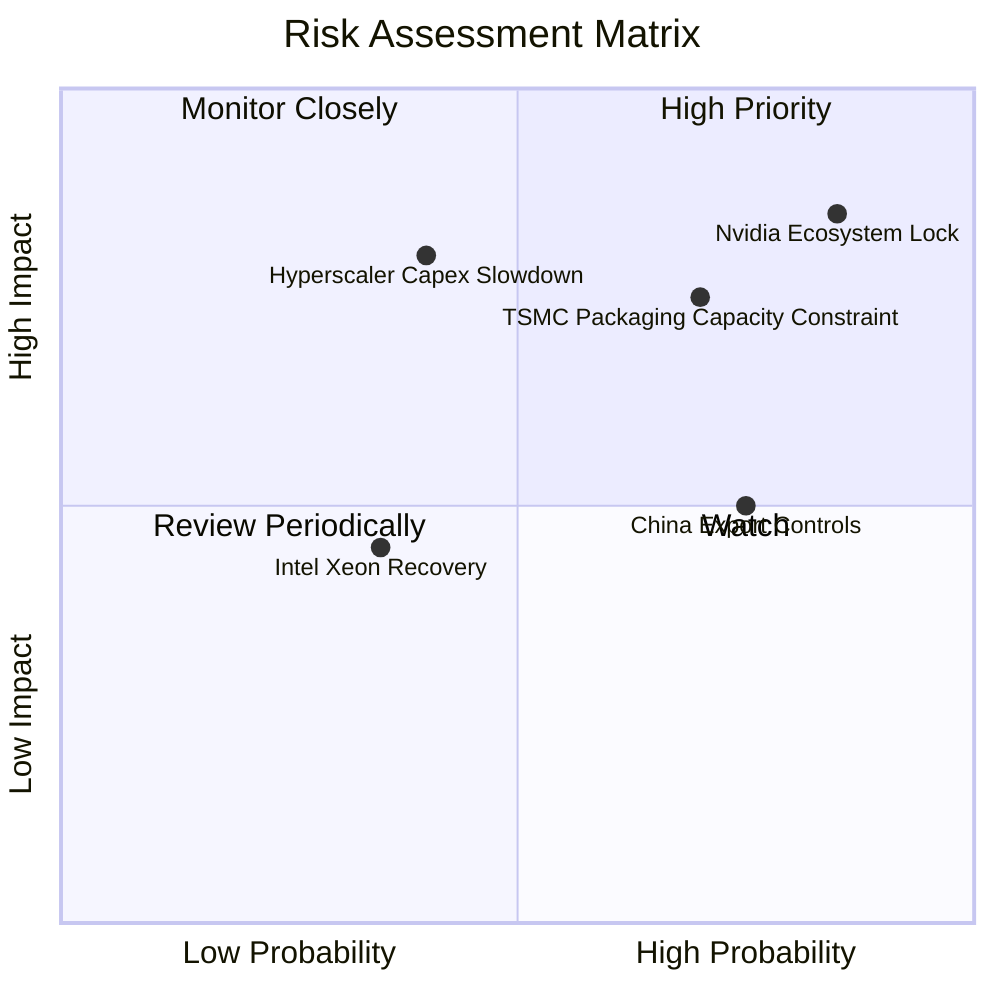

---

### 9.2 風險清單詳細分析

| # | 風險項目 | 發生機率 | 財務衝擊 | 風險評分 | 具體緩解措施與觀察指標 |
|---|----------|----------|----------|----------|------------------------|
| 1 | 🔴 **NVIDIA 生態壟斷** | 高 (85%) | 高 (-20% AI 營收) | 🔴 **8.2/10** | 積極投入 OpenXLA、PyTorch 聯盟，並收購 Silo AI 提供一站式部署服務 |
| 2 | 🔴 **TSMC CoWoS 產能受限**| 中高 (70%) | 高 (-15% 出貨量) | 🔴 **7.5/10** | 爭取台積電更多產能分配，同時探索與日月光、Amkor 等 OSAT 合作 |
| 3 | 🟡 **美對華晶片出口禁令** | 高 (75%) | 中 (-8% 營收) | 🟡 **6.0/10** | 開發符合法規的特供版晶片（如 MI309），並轉向中東、東南亞市場 |
| 4 | 🟡 **雲端 CSP Capex 循環** | 中 (40%) | 高 (-25% 成長率) | 🟡 **5.8/10** | 擴大企業級（Enterprise）與二級雲端提供者（Tier-2 Cloud）客戶群 |
| 5 | 🟢 **Intel 伺服器 CPU 反撲**| 中低 (35%) | 中 (-5% 毛利率) | 🟢 **4.0/10** | 保持 TSMC 先進製程代工優勢，推進 Zen 6 研發確保每瓦效能領先 |

---

## 10. 投資建議

### 10.1 最終綜合評級雷達圖

```
╔══════════════════════════════════════════════════════════════════╗
║                   AMD 最終綜合評級與得分                         ║
╠══════════════════════════════════════════════════════════════╣
║  基本面強度  8.5 / 10  ▓▓▓▓▓▓▓▓▓▓▓▓▓▓▓▓▓░░░  (市佔率提升)     ║
║  成長動能    9.0 / 10  ▓▓▓▓▓▓▓▓▓▓▓▓▓▓▓▓▓▓░░  (AI 加速放量)    ║
║  獲利品質    8.0 / 10  ▓▓▓▓▓▓▓▓▓▓▓▓▓▓▓▓░░░░  (FCF 轉換率 143%)║
║  財務健康    9.5 / 10  ▓▓▓▓▓▓▓▓▓▓▓▓▓▓▓▓▓▓▓░  (淨現金 $8.48B)  ║
║  估值安全邊際7.0 / 10  ▓▓▓▓▓▓▓▓▓▓▓▓▓░░░░░░░  (PEG 1.25x)      ║
╠══════════════════════════════════════════════════════════════╣
║  🏆 綜合評分：8.3 / 10 ｜ 評級：🟢 買入 (Buy)                     ║
╚══════════════════════════════════════════════════════════════╝
```

---

### 10.2 目標價與隱含報酬率

| 情境 | 目標價 | 隱含報酬率 (對比 $454.62) | 機率權重 | 權重後期望值 |
|------|--------|---------------------------|----------|--------------|
| 🔴 **悲觀情境** | $320.00 | -29.6% | 20% | $64.00 |
| 🟡 **基準情境** | $573.15 | +26.1% | 60% | $343.89 |
| 🟢 **樂觀情境** | $850.00 | +87.0% | 20% | $170.00 |
| **加權加總** | **$577.89** | **+27.1%** | **100%** | **期望目標價 $577.89** |

---

### 10.3 買入時機與策略 Checklist

```
╔══════════════════════════════════════════════════════════════════╗
║                  ✅ AMD 買入執行策略 Checklist                  ║
╠══════════════════════════════════════════════════════════════════╣
║                                                                  ║
║  分批建倉條件：                                                  ║
║  ✅ 現價 $454.62 處於 Forward P/E 33.0x，已具備投資價值，可先建立║
║     第一筆基礎部位 (例如預定資金之 30-40%)。                     ║
║                                                                  ║
║  加碼觸發條件（出現以下任一時加碼 20-30%）：                      ║
║  ☐ 股價隨半導體板塊回檔至 200 日均線（約 $380-$400 區間）        ║
║  ☐ 單季 Data Center AI 晶片營收指引（Guidance）高於市場預期 >10% ║
║  ☐ ROCm 軟體推出突破性更新，獲 Meta 或 Microsoft 公開擴大採用   ║
║                                                                  ║
║  減碼/停損觸發條件（出現以下任一）：                             ║
║  ☐ MI300/350 晶片出現重大硬體瑕疵，導致雲端客戶大規模取消訂單   ║
║  ☐ EPYC 伺服器 CPU 市佔率連續兩季出現負成長                     ║
╚══════════════════════════════════════════════════════════════════╝
```

---

### 10.4 投資人適配度分析

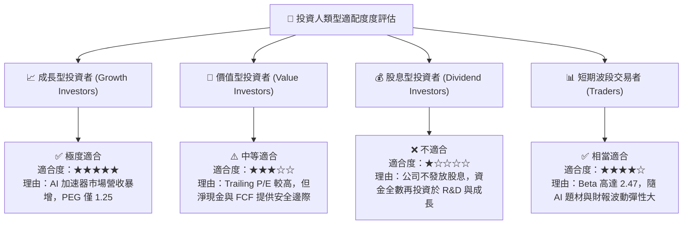

---

### 10.5 每季財報監控清單（Quarterly Watch List）

| 監控項目 | 關鍵數據指標 (KPI) | 綠燈 (繼續持有/加碼) | 黃燈 (警訊/觀望) | 🔴 紅燈 (觸發停損/減碼) |
|----------|--------------------|----------------------|------------------|------------------------|
| **Data Center 營收** | 單季營收額與 YoY | > $6.0B (YoY >40%) | $5.0B - $6.0B | < $5.0B (成長顯著趨緩) |
| **毛利率 (Gross Margin)**| Non-GAAP 毛利率 | > 54.0% | 51.0% - 54.0% | < 51.0% (價格戰削弱獲利) |
| **AI 晶片年營收指引** | Annual AI Revenue | 指引上修至 >$12B | 指引維持 $8B-$10B | 指引下修至 <$7B |
| **自由現金流 (FCF)** | FCF 轉換率 | FCF/Net Income > 110% | 80% - 110% | < 80% (營運資金惡化) |
| **EPYC 伺服器市佔率**| x86 Server CPU Share | 市佔率逐季上升 >32% | 市佔率停滯於 30% | 市佔率掉回 <28% |

---

### 10.6 反面論證：什麼會證明論點錯誤（What Would Change My Mind）

```
╔══════════════════════════════════════════════════════════════════╗
║              ⚠️ 論點失效條件（Disconfirming Evidence）           ║
╠══════════════════════════════════════════════════════════════════╣
║  本研究報告之多頭投資論點，若在未來出現下列情況之一，即宣告失效：║
║                                                                  ║
║  1. 【AI 市佔壁壘受挫】：                                        ║
║     AMD 在資料中心 AI 加速晶片的全球市佔率無法在 2027 年前達到   ║
║     15% 以上，且超大型雲端業者（AWS, Azure, GCP）轉向自行開發    ║
║     ASIC 晶片或全數回歸 NVIDIA 生態。                            ║
║                                                                  ║
║  2. 【獲利能力收縮】：                                          ║
║     營業利益率（Op Margin）較當前 14.4% 不升反降，連續兩季跌破    ║
║     10.0%，顯示為了與 NVDA / Intel 競爭而陷入價格戰削利。        ║
║                                                                  ║
║  3. 【現金流品質惡化】：                                        ║
║     自由現金流 (FCF) 轉負，或 FCF / Net Income 現金轉換率下降至  ║
║     70% 以下，代表存貨積壓嚴重或營運資金嚴重被客戶占用。         ║
║                                                                  ║
║  4. 【資本回報率失效】：                                        ║
║     扣除無形資產後的實質 ROIC 跌破 WACC (10.5%)，公司開始摧毀    ║
║     股東價值。                                                   ║
╚══════════════════════════════════════════════════════════════════╝
```

---

> **免責聲明**：本報告為 AI 自動生成之機構級研究參考，僅供投資研究討論，不構成任何買賣建議。證券投資存在風險，投資人應獨立評估並自負盈虧。