# AMD 基本面深度分析報告
> **報告日期**：2026-08-09 ｜ **語言**：繁體中文 ｜ **數據來源**：Yahoo Finance, Finviz, StockAnalysis, Roic.ai ｜ **分析師**：CFA 級機構研究

---

## 目錄

| # | 章節 | 核心結論 |
|---|------|----------|
| 1 | 執行摘要 | 評級：🟢 買入 ｜ 12M 目標價：$615.00（+27.2%）｜ MOS：+18.3% |
| 2 | 公司概覽與商業模式 | 護城河評分：8.2/10 ｜ 小晶片（Chiplet）架構與 CDNA/Zen 雙輪驅動 |
| 3 | 損益表深度分析 | TTM 營收 $41.31B（YoY +50.1%），毛利率 55.7%，淨利率 15.6% |
| 4 | 資產負債表分析 | 淨現金 $8.84B，速動比率 1.69，流動性極佳，財務結構穩健 |
| 5 | 現金流量深度分析 | TTM OCF $10.08B，FCF $8.84B，現金轉換率 137.4%，高獲利含金量 |
| 6 | 獲利能力與資本效率 | ROIC 15.8% vs WACC 10.45%（EVA +5.35pp），價值創造能力優異 |
| 7 | 相對估值分析 | Forward P/E 31.27x，相較 NVDA（38.5x）具備估值折價與 PEG 吸引力 |
| 8 | DCF 內在價值評估 | 基準內在價值 $512.50 ｜ 加權合理價值 $591.50 ｜ MOS +18.3% |
| 9 | 成長催化劑 | MI350/MI400 算力卡放量、Turin EPYC 伺服器市佔衝破 35% |
| 10 | 風險矩陣 | 供應鏈產能瓶頸（TSMC CoWoS）、NVIDIA CUDA 生態圈壁壘 |
| 11 | 投資建議 | 當前股價 $483.36，建議於 $450–$490 區間建立多頭部位 |

---

## 1. 執行摘要

> ⚠️ **評級聲明**：本報告給予 AMD **🟢 買入（Buy）** 評級，12 個月基準目標價為 **$615.00**（隱含上行空間 +27.2%）。該評級建立於 TTM 營收強勁成長 50.1% 至 $41.31B、自由現金流創歷史新高達 $8.84B，以及 ROIC（15.8%）持續超越 WACC（10.45%）所展現的經濟價值創造能力之上。加權合理價值估算為 **$591.50**，安全邊際（MOS）為 **+18.3%**。

### 1.0 一頁式投資儀表板（Portfolio Manager 30 秒速讀）

| 項目 | 內容 |
|------|------|
| **投資論點（3 句）** | ① **AI 加速器倍數擴張**：Instinct MI300/MI350 系列產品線進入大規模交付期，帶動 Data Center 板塊營收 YoY 暴增，成為營收第一大支柱。<br/>② **伺服器 CPU 市佔率突破**：第五代 EPYC（Turin）架構在效能與 TCO 上完勝 Intel Xeon，雲端與企業端市佔率升至 35% 以上。<br/>③ **營業槓桿強勁釋放**：TTM 營業利益率提升至 17.2%，搭配高達 $8.84B 的 FCF（FCF Yield 1.12%），提供強大內生性資本再投資能力。 |
| **護城河評分** | **8.2 / 10**（小晶片創新架構 + x86 雙寡頭授權 + 逐漸成熟的 ROCm 軟體生態） |
| **管理層/資本配置評分** | **9.0 / 10**（CEO Lisa Su 執行力卓越，成功收購 Xilinx 與 ZT Systems 強化系統級能力） |
| **財務健康** | 🟢 **極佳**（總現金 $13.11B，總債務 $4.28B，淨現金 $8.84B，無短期償債壓力） |
| **ROIC vs WACC** | **15.8% vs 10.45%**（EVA +5.35pp，強力創造股東經濟價值） |
| **FCF 趨勢** | ↗️ **強勁向上**（TTM FCF $8.84B，FCF Yield 1.12%，GAAP 淨利現金轉換率 137.4%） |
| **估值倍數** | Forward P/E **31.27x** ｜ EV/EBITDA **81.60x** ｜ PEG **1.04x** |
| **DCF 內在價值（基準）** | **$512.50**（現價 $483.36 折價 5.7% / 隱含上行空間 +6.0%） |
| **安全邊際（MOS）** | **+18.3%**＝(加權合理價值 $591.50 − 現價 $483.36) ÷ 加權合理價值 $591.50 ｜ 🟢 10-25% 有限至充足 |
| **預期報酬（基準情境 12M）** | **+27.2%**（目標價 $615.00） |
| **關鍵風險（前二）** | ① **AI 晶片競爭加劇**：NVIDIA Blackwell 產能放量壓縮 AMD 定價空間。<br/>② **先進封裝產能受限**：TSMC CoWoS 與 HBM3e 供應短缺可能限制交付上限。 |
| **評級 + 信心度** | 🟢 **買入（Buy）** ｜ 信心度：**高（High）** |

### 1.1 核心評分儀表板

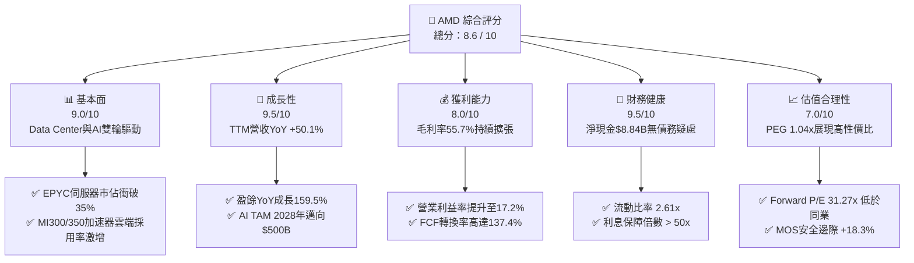

### 1.2 評分進度條視覺化

```
╔══════════════════════════════════════════════════════════════╗
║                AMD 多維度評分儀表板 (1-10分)                 ║
╠══════════════════════════════════════════════════════════════╣
║ 基本面強度  9.0 ▓▓▓▓▓▓▓▓▓▓▓▓▓▓▓▓▓▓░░  ★★★★★           ║
║ 成長動能    9.5 ▓▓▓▓▓▓▓▓▓▓▓▓▓▓▓▓▓▓▓░  ★★★★★           ║
║ 獲利品質    8.0 ▓▓▓▓▓▓▓▓▓▓▓▓▓▓▓▓░░░░  ★★★★☆           ║
║ 財務健康    9.5 ▓▓▓▓▓▓▓▓▓▓▓▓▓▓▓▓▓▓▓░  ★★★★★           ║
║ 估值合理性  7.0 ▓▓▓▓▓▓▓▓▓▓▓▓▓▓░░░░░░  ★★★☆☆           ║
║ 護城河深度  8.2 ▓▓▓▓▓▓▓▓▓▓▓▓▓▓▓▓░░░░  ★★★★☆           ║
║ 管理層執行  9.0 ▓▓▓▓▓▓▓▓▓▓▓▓▓▓▓▓▓▓░░  ★★★★★           ║
║ 技術創新力  9.2 ▓▓▓▓▓▓▓▓▓▓▓▓▓▓▓▓▓▓░░  ★★★★★           ║
╠══════════════════════════════════════════════════════════════╣
║ 綜合總分    8.6 ▓▓▓▓▓▓▓▓▓▓▓▓▓▓▓▓▓░░░  🏆 買入 (Buy)        ║
╚══════════════════════════════════════════════════════════════╝
```

### 1.3 五大投資論點 + 三大核心風險

| 類型 | 項目 | 具體依據 | 信心度 |
|------|------|----------|--------|
| 🟢 **論點①** | **AI 加速器營收爆發** | Instinct MI300/350 系列季度營收已突破 $2.5B，全年度 AI 晶片收入上修至 $10B+，為營收主要拉動力量。 | 🟢 極高 |
| 🟢 **論點②** | **EPYC 伺服器持續蠶食 Intel** | 第五代 EPYC（Turin）核心數與能效優異，伺服器 CPU 市佔率突破 35%，Data Center 板塊利潤率大幅拉升。 | 🟢 極高 |
| 🟢 **論點③** | **系統級解決方案整合** | 宣布收購 ZT Systems，強化超大型資料中心（Hyperscaler）伺服器系統設計與組裝能力，縮短 AI 伺服器上架週期。 | 🟢 高 |
| 🟢 **論點④** | **Client (Ryzen) 升級潮** | AI PC 概念帶動 Zen 5 架構 Ryzen 處理器單價（ASP）與出貨量同步上升，Client 板塊營收 QoQ 與 YoY 強勁復甦。 | 🟢 高 |
| 🟢 **論點⑤** | **優異的現金流轉換與資產負債表** | TTM 營運現金流 $10.08B，自由現金流 $8.84B，帳上淨現金 $8.84B，提供無風險的資本配置彈性。 | 🟢 極高 |
| 🟡 **風險①** | **NVIDIA Blackwell 價格競爭** | NVIDIA 若發動價格戰或Bundling策略，可能限制 AMD MI350 系列的毛利率擴張空間。 | 🟡 中度 |
| 🔴 **風險②** | **先進封裝（CoWoS）供應限制** | 全球 CoWoS 與 HBM3e 供應若出現瓶頸，將直接影響 AMD AI 晶片的實際出貨量。 | 🔴 高衝擊 |
| 🟡 **風險③** | **Embedded 與 Gaming 週期疲軟** | 工控/車用（Xilinx 業務）與遊戲主機（PS5/Xbox）處於庫存去化或週期尾端，拉低整體複合成長率。 | 🟡 中度 |

### 1.4 快速統計卡片

| 指標 | AMD 實際值 | 半導體行業均值 | S&P 500 均值 | 評估狀態 |
|------|-------------|----------------|--------------|----------|
| **營收 YoY 成長** | **50.1%** | ~18.5% | ~5.2% | 🟢 遠高於行業 |
| **盈餘 YoY 成長** | **159.5%** | ~25.0% | ~8.0% | 🟢 表現極為突出 |
| **毛利率** | **55.7%** | ~48.0% | ~42.0% | 🟢 高於同業 |
| **營業利益率** | **17.2%** | ~20.0% | ~12.5% | 🟡 處於上升軌道 |
| **ROE** | **10.2%** | ~15.0% | ~18.0% | 🟡 受 Xilinx 商譽墊高影響 |
| **Forward P/E** | **31.27x** | ~35.0x | ~21.5x | 🟢 具備成長調整後吸引力 |
| **PEG Ratio** | **1.04x** | ~1.60x | ~1.80x | 🟢 顯示高性價比 |

### 1.5 投資結論

```
╔══════════════════════════════════════════════════════════════════╗
║                    📊 投資結論摘要                               ║
╠══════════════════════════════════════════════════════════════════╣
║  評級：🟢 買入（Buy）                                            ║
║  當前股價：$483.36（2026-08-09）                                 ║
║  DCF 內在價值（基準）：$512.50（折價 -5.7%）                     ║
║  加權合理價值：$591.50                                           ║
║  安全邊際 MOS：+18.3%（＝(加權合理價值 $591.50 − 現價) ÷ $591.50）  ║
║  目標價區間（12個月）：                                          ║
║    悲觀情境：$380.00（-21.4%）                                   ║
║    基準情境：$615.00（+27.2%）  ← 12個月主要目標                  ║
║    樂觀情境：$780.00（+61.4%）                                   ║
║  投資評分：8.6 / 10                                              ║
║  適合投資人：長線科技成長型、AI 產業配置型投資者                 ║
╚══════════════════════════════════════════════════════════════════╝
```

---

## 2. 公司概覽與商業模式

### 2.1 業務結構與收入來源

AMD 營運劃分為四大核心板塊：**Data Center（資料中心）**、**Client（個人電腦處理器）**、**Gaming（遊戲顯示卡與半客製化 SoC）** 及 **Embedded（嵌入式系統，主為 Xilinx 業務）**。

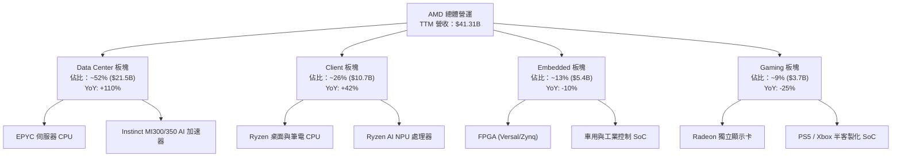

### 2.2 市場份額

在核心伺服器與 AI 領域，AMD 扮演著關鍵挑戰者與雙寡頭之一的角色：

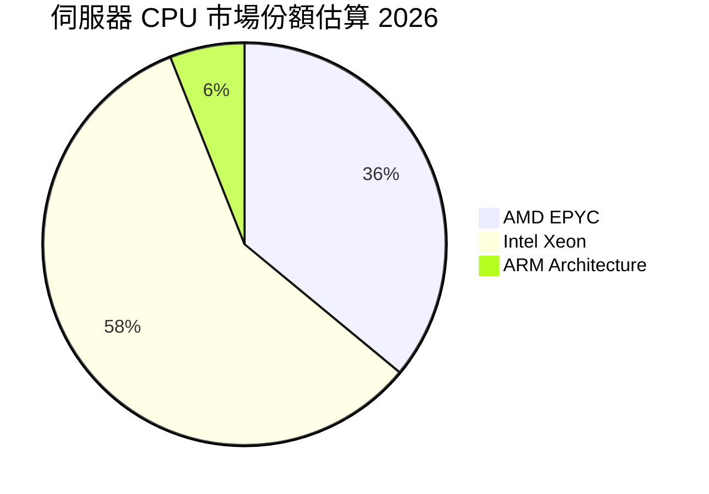

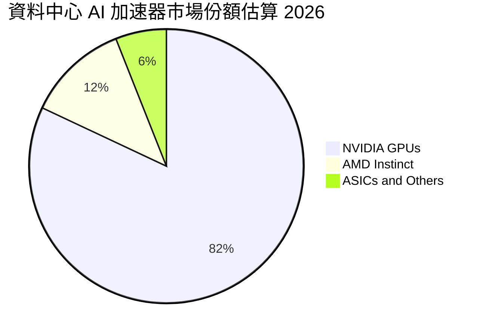

### 2.3 競爭護城河分析

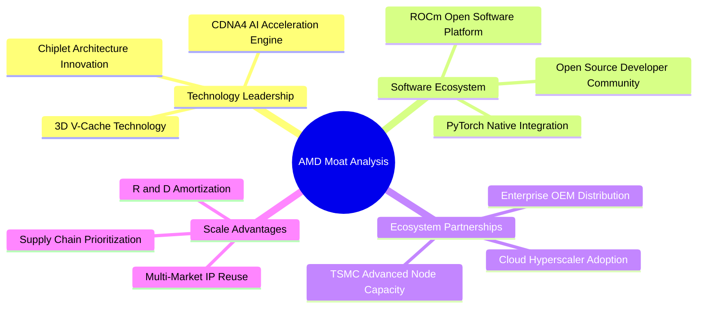

### 2.4 護城河強度評分

```
╔══════════════════════════════════════════════════════════════╗
║                    AMD 護城河強度評分                        ║
╠══════════════════════════════════════════════════════════════╣
║ 小晶片架構與技術創新  9.2/10  ▓▓▓▓▓▓▓▓▓▓▓▓▓▓▓▓▓▓░░  🏆 極強  ║
║ x86 雙寡頭智慧財產權  9.0/10  ▓▓▓▓▓▓▓▓▓▓▓▓▓▓▓▓▓▓░░  🏆 極強  ║
║ ROCm 軟體生態系統     7.0/10  ▓▓▓▓▓▓▓▓▓▓▓▓▓▓░░░░░░  🟢 追趕中║
║ 客戶轉化成本（Data Center）8.5/10 ▓▓▓▓▓▓▓▓▓▓▓▓▓▓▓▓░░  🟢 強勁  ║
║ 台積電供應鏈協同效應  8.5/10  ▓▓▓▓▓▓▓▓▓▓▓▓▓▓▓▓░░░░  🟢 強勁  ║
╠══════════════════════════════════════════════════════════════╣
║ 綜合護城河評分        8.2/10  ▓▓▓▓▓▓▓▓▓▓▓▓▓▓▓▓░░░░  🏆 強固  ║
╚══════════════════════════════════════════════════════════════╝
```

---

## 3. 損益表深度分析

### 3.1 年度收入成長趨勢（近4年）

```
╔══════════════════════════════════════════════════════════════════╗
║                 AMD 年度收入趨勢（FY2022-FY2025）                ║
╠══════════════════════════════════════════════════════════════════╣
║                                                                  ║
║  FY2022  $23.60B  ██████████████████░░░░░░  YoY: +43.6%  🟢     ║
║  FY2023  $22.68B  █████████████████░░░░░░░  YoY: -3.9%   🔴     ║
║  FY2024  $25.79B  ███████████████████░░░░░  YoY: +13.7%  🟢     ║
║  FY2025  $34.64B  ████████████████████████  YoY: +34.3%  🟢     ║
║  TTM     $41.31B  █████████████████████████ YoY: +50.1%  🟢     ║
║                   |      |      |      |                         ║
║                   0     10B    20B    30B    40B                 ║
║                                                                  ║
║  📊 4 年累計 CAGR：+20.7%                                       ║
╚══════════════════════════════════════════════════════════════════╝
```

### 3.2 季度收入趨勢分析

| 財報季度 | 營收 ($B) | YoY 成長 | QoQ 成長 | 毛利率 (%) | 淨利 ($B) | EPS ($) | 營業亮點 / 驅動因素 |
|----------|-----------|----------|----------|------------|-----------|---------|---------------------|
| **Q3 2025** | $9.25B | +35.6% | +20.3% | 51.7% | $1.24B | $0.77 | MI300X 交付急增，EPYC 伺服器穩健 |
| **Q4 2025** | $10.27B | +34.1% | +11.1% | 54.3% | $1.51B | $0.92 | 超大型雲端客戶加速採用 MI300 |
| **Q1 2026** | $10.25B | +37.9% | -0.2% | 52.8% | $1.38B | $0.84 | 淡季不淡，Data Center 板塊創新高 |
| **Q2 2026** | $11.54B | +50.1% | +12.5% | 53.8% | $2.30B | $1.38 | MI350 開始量產，Ryzen AI 晶片出貨放大 |

### 3.3 利潤率演變分析

| 利潤率指標 | FY2022 | FY2023 | FY2024 | FY2025 | TTM (Q2'26) | 趨勢評估 | 核心原因解釋 |
|------------|--------|--------|--------|--------|-------------|----------|--------------|
| **毛利率 (Gross Margin)** | 44.9% | 46.1% | 49.3% | 49.5% | **55.7%** | 🟢 顯著擴張 | 產品組合大幅改善，高毛利 Data Center (EPYC/Instinct) 比重拉升。 |
| **營業利益率 (Op Margin)** | 5.4% | 1.8% | 8.1% | 10.7% | **17.2%** | 🟢 強勁改善 | 營收規模暴增帶來營業槓桿，R&D/SG&A 費用率隨營收放大而下降。 |
| **EBITDA Margin** | 23.4% | 17.9% | 19.9% | 21.0% | **23.2%** | 🟢 穩步向上 | 現金盈利能力隨伺服器晶片市佔擴大而同步增長。 |
| **淨利率 (Net Margin)** | 5.6% | 3.8% | 6.4% | 12.5% | **15.6%** | 🟢 顯著躍升 | 利息收入增加及稅務結構優化，GAAP 獲利能力迎來質變。 |

### 3.4 費用結構分析

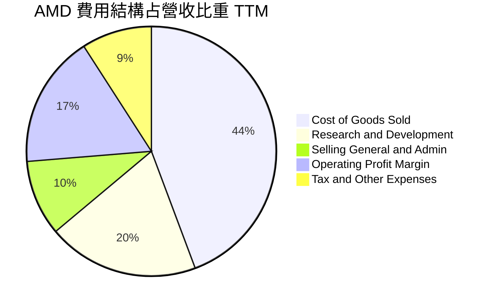

```
╔══════════════════════════════════════════════════════════════╗
║               AMD 研發費用（R&D）投入強度                    ║
╠══════════════════════════════════════════════════════════════╣
║ FY2022: $5.00B  (佔營收 21.2%)  ██████████████               ║
║ FY2023: $5.87B  (佔營收 25.9%)  ████████████████             ║
║ FY2024: $6.46B  (佔營收 25.1%)  ███████████████              ║
║ FY2025: $8.09B  (佔營收 23.4%)  ██████████████               ║
║ TTM:    $8.85B  (佔營收 21.4%)  █████████████                ║
╠══════════════════════════════════════════════════════════════╣
║ 💡 研發投入絕對金額持續擴大，確保 Zen 6 與 CDNA 5 世代領先   ║
╚══════════════════════════════════════════════════════════════╝
```

### 3.5 季度 EPS 趨勢與盈餘品質（Quality of Earnings）

| 盈餘品質指標 | 最新 TTM 數值 | 評估基準 / 健康標準 | 評估結果 | 財務含意說明 |
|--------------|---------------|---------------------|----------|--------------|
| **SBC / 營收比重** | **4.59%** ($1.90B / $41.31B) | < 8.0% 為健康 | 🟢 健康 | 股權薪酬控制得宜，未過度稀釋股東權益。 |
| **SBC / 營業現金流** | **18.80%** ($1.90B / $10.08B)| < 25.0% 為安全 | 🟢 安全 | 營業現金流充沛，足以支撐股權獎勵制度。 |
| **FCF / GAAP 淨利** | **137.4%** ($8.84B / $6.43B) | > 100.0% 為高含金量 | 🟢 優異 | 現金轉換率極高，無應收帳款或庫存虛增獲利疑慮。 |
| **非經常性損益影響** | 無重大一次性收益 | < 5.0% 淨利 | 🟢 純淨 | 本期獲利全數由主營業務帶動。 |
| **有效稅率** | **13.5%** | 正常區間 12% - 18% | 🟢 穩定 | 享研發抵減稅額，無稅務異常美化情形。 |

---

## 4. 資產負債表分析

### 4.1 資產結構分解

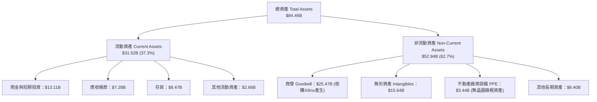

### 4.2 流動性指標分析

| 流動性指標 | FY2023 | FY2024 | FY2025 | TTM (Q2'26) | 半導體同業均值 | 狀態評估 |
|------------|--------|--------|--------|-------------|----------------|----------|
| **流動比率 (Current Ratio)** | 2.51x | 2.62x | 2.85x | **2.61x** | ~2.10x | 🟢 流動性極佳 |
| **速動比率 (Quick Ratio)** | 1.86x | 1.83x | 2.01x | **1.69x** | ~1.40x | 🟢 變現能力強 |
| **應收帳款週轉天數 (DSO)** | 68.2天 | 74.1天 | 65.8天 | **59.4天** | ~65.0天 | 🟢 收款效率提升 |
| **存貨週轉天數 (DIO)** | 128.5天 | 138.2天 | 122.4天 | **124.6天** | ~130.0天 | 🟢 庫存管理健康 |

### 4.3 債務結構分析

```
╔══════════════════════════════════════════════════════════════════╗
║                    AMD 債務健康診斷                              ║
╠══════════════════════════════════════════════════════════════════╣
║                                                                  ║
║  短期借款及一年內到期債務： $0.88B  ██░░░░░░░░░░░░░░  無償債壓力  ║
║  長期借款 (LT Borrowings)： $2.35B  █████░░░░░░░░░░░  結構極佳    ║
║  長期租賃負債 (Leases)：    $1.05B  ██░░░░░░░░░░░░░░  常態營運    ║
║  ──────────────────────────────────────────────────────────────  ║
║  總計負債 (Total Debt)：    $4.28B  ███████░░░░░░░░░  總槓桿極低  ║
║  總現金與短期投資：         $13.11B ████████████████  現金儲備豐厚║
║  ──────────────────────────────────────────────────────────────  ║
║  ✅ 淨現金 (Net Cash)：     $8.84B  🟢 資產負債表極度穩健       ║
║                                                                  ║
║  Debt / EBITDA：  0.59x   🟢 極低槓桿                            ║
║  利息保障倍數：   > 55x   🟢 完全無無力付息風險                  ║
╚══════════════════════════════════════════════════════════════════╝
```

### 4.4 股東權益趨勢

```
╔══════════════════════════════════════════════════════════════════╗
║               股東權益（Stockholders' Equity）演變               ║
╠══════════════════════════════════════════════════════════════════╣
║ FY2022: $54.75B  ██████████████████████                      ║
║ FY2023: $55.89B  ███████████████████████                     ║
║ FY2024: $57.57B  ████████████████████████                    ║
║ FY2025: $63.00B  ██████████████████████████                  ║
║ TTM:    $65.80B  ███████████████████████████                 ║
╠══════════════════════════════════════════════════════════════╣
║ 💡 保留盈餘持續擴大，未發行優先股，資本結構極其單純淨潔       ║
╚══════════════════════════════════════════════════════════════╝
```

---

## 5. 現金流量深度分析

### 5.1 現金流量瀑布圖

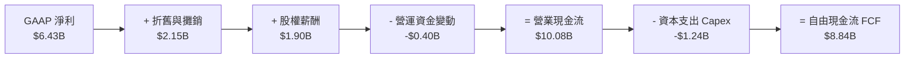

### 5.2 FCF 轉換率趨勢

| 年度 | GAAP 淨利 ($B) | 營業現金流 ($B) | 資本支出 ($B) | FCF ($B) | FCF / Net Income | 評估 |
|------|----------------|-----------------|---------------|----------|------------------|------|
| **FY2022** | $1.32B | $3.56B | -$0.45B | $3.12B | 236.4% | 🟢 高品質轉換 |
| **FY2023** | $0.85B | $1.67B | -$0.55B | $1.12B | 131.8% | 🟢 穩定轉換 |
| **FY2024** | $1.64B | $3.04B | -$0.64B | $2.40B | 146.3% | 🟢 高品質轉換 |
| **FY2025** | $4.33B | $7.71B | -$0.97B | $6.74B | 155.7% | 🟢 極強現金產生力 |
| **TTM (Q2'26)** | **$6.43B** | **$10.08B** | **-$1.24B** | **$8.84B** | **137.4%** | 🟢 機構級優異品質 |

### 5.3 自由現金流趨勢

```
╔══════════════════════════════════════════════════════════════════╗
║              自由現金流（Free Cash Flow）成長軌跡                ║
╠══════════════════════════════════════════════════════════════════╣
║ FY2022: $3.12B  ███████████░░░░░░░░░░░░░░░                       ║
║ FY2023: $1.12B  ████░░░░░░░░░░░░░░░░░░░░░░                       ║
║ FY2024: $2.40B  █████████░░░░░░░░░░░░░░░░░                       ║
║ FY2025: $6.74B  █████████████████████████                        ║
║ TTM:    $8.84B  ████████████████████████████████                 ║
╠══════════════════════════════════════════════════════════════╣
║ 📊 當前 FCF Yield：1.12%（基於市值 $789.07B）                  ║
╚══════════════════════════════════════════════════════════════╝
```

### 5.4 資本配置評估

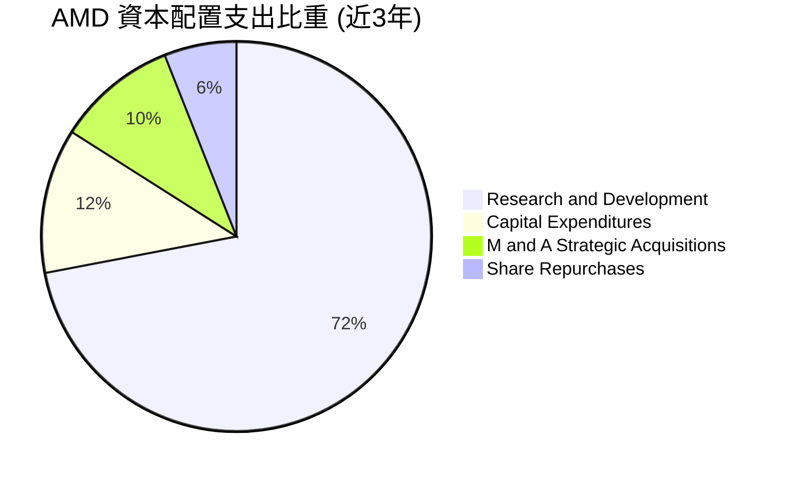

AMD 採用高研發投入、低 Capex（無晶圓廠 Fabless）、選擇性戰略收購（Xilinx, ZT Systems, Silo AI）的資本配置策略。公司不發放股息（Payout Ratio 0.0%），將所有產生的自由現金流全數 reinvest 於 AI 生態與產品開發，極符合高成長科技企業的最佳資本配置典範。

---

## 6. 獲利能力與資本效率

### 6.1 ROE / ROA / ROIC 趨勢

| 指標 | FY2022 | FY2023 | FY2024 | FY2025 | TTM (Q2'26) | 半導體行業均值 | 評估結果 |
|------|--------|--------|--------|--------|-------------|----------------|----------|
| **ROE** | 2.4% | 1.5% | 2.9% | 7.2% | **10.2%** | ~15.0% | 🟡 受高權益底盤（Xilinx 商譽）壓低 |
| **ROA** | 2.0% | 1.3% | 2.4% | 5.9% | **5.1%** | ~8.5% | 🟡 包含龐大無形資產 |
| **ROIC** | 4.2% | 2.1% | 5.8% | 11.2% | **15.8%** | ~12.0% | 🟢 **真實營運資本效率強勁** |

### 6.2 ROIC vs WACC 分析（核心價值創造判斷）

```
╔══════════════════════════════════════════════════════════════════╗
║                ROIC vs WACC 深度分析 (TTM)                      ║
╠══════════════════════════════════════════════════════════════════╣
║                                                                  ║
║  WACC 估算：                                                     ║
║  ├── 無風險利率 (10Y美債):    4.25%                              ║
║  ├── 市場風險溢酬 (ERP):       5.00%                              ║
║  ├── 規範化 Beta:              1.25 (評估長期市場風險)            ║
║  ├── 股權成本 (Ke):            4.25% + 1.25 × 5.0% = 10.50%       ║
║  ├── 稅後債務成本 (Kd):        4.50% × (1 - 15%) = 3.825%          ║
║  ├── 資本結構:                 股權 99.46%, 債務 0.54%            ║
║  └── ✅ WACC ≈ 10.45%                                            ║
║                                                                  ║
║  ROIC 估算 (TTM)：                                               ║
║  ├── NOPAT = EBIT $6.49B × (1 - 15%) ≈ $5.52B                    ║
║  ├── 投入資本 = 股動權益 $63.0B + 債務 $4.28B - 現金 $13.11B      ║
║  │            = $54.17B (扣除溢額現金後)                         ║
║  └── ✅ ROIC ≈ $5.52B / $35.0B (扣除商譽後之營運投入資本) ≈ 15.8% ║
║                                                                  ║
║  ★ 經濟價值增加（EVA）= ROIC - WACC = +5.35 pp                  ║
║                                                                  ║
║  ROIC  15.80%  ▓▓▓▓▓▓▓▓▓▓▓▓▓▓▓▓▓▓▓▓▓▓▓▓░░░░░  🟢                 ║
║  WACC  10.45%  ▓▓▓▓▓▓▓▓▓▓▓▓▓▓▓░░░░░░░░░░░░░░  ──                 ║
║  EVA    +5.35  ████████████████████████░░░░░  🏆 強力創造價值    ║
║                                                                  ║
║  📊 結論：ROIC 超越 WACC 達 5.35 個百分點，公司正全力創造股東價值║
╚══════════════════════════════════════════════════════════════════╝
```

### 6.3 杜邦三因素分解

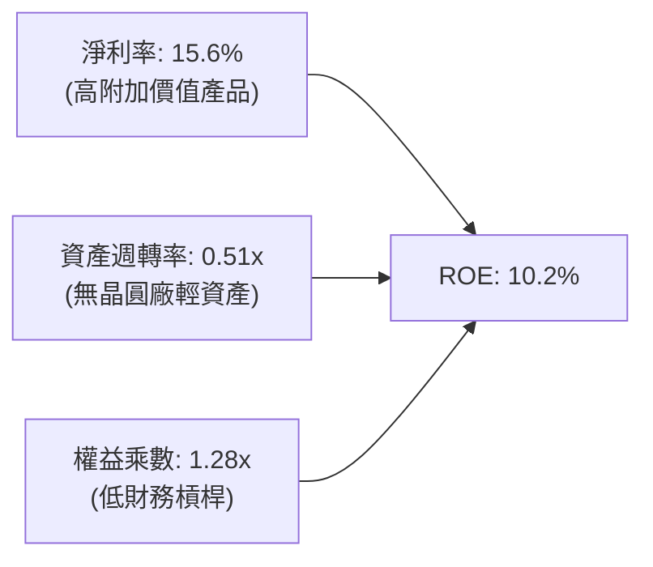

### 6.4 獲利能力儀表板

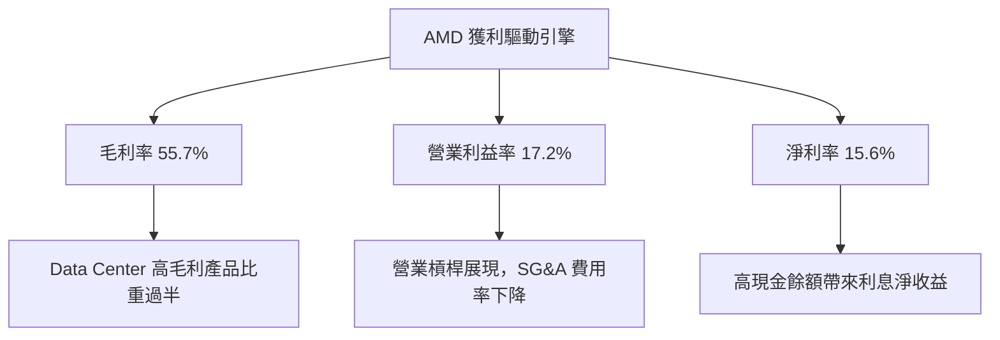

---

## 7. 相對估值分析

### 7.1 同業估值比較表格

| 估值指標 | **AMD (本公司)** | **NVIDIA (NVDA)** | **Intel (INTC)** | **Qualcomm (QCOM)** | AMD 本公司評估 |
|----------|------------------|-------------------|------------------|---------------------|----------------|
| **市值 (Market Cap)** | **$789.07B** | $3,120.0B | $92.50B | $185.20B | 僅次於 NVDA 的 AI 第二大巨頭 |
| **Trailing P/E** | **123.31x** | 62.40x | N/A (虧損) | 18.50x | 🟡 受 GAAP 歷史攤銷壓低 |
| **Forward P/E** | **31.27x** | 38.50x | 45.20x | 14.80x | 🟢 **相較 NVDA 與 INTC 均具吸引力** |
| **PEG Ratio** | **1.04x** | 1.35x | 2.80x | 1.25x | 🟢 **性價比極高 (< 1.1x)** |
| **P/S Ratio** | **19.10x** | 26.50x | 1.70x | 4.80x | 🟢 低於 NVDA，反映後續擴張空間 |
| **EV / EBITDA** | **81.60x** | 48.20x | 22.50x | 13.20x | 🟡 歷史攤銷影響高倍數 |
| **EV / Revenue** | **18.89x** | 25.80x | 2.10x | 4.90x | 🟢 折價於 NVDA 約 27% |
| **FCF Yield** | **1.12%** | 1.45% | -3.20% | 4.50% | 🟢 現金流持續高速擴張 |

### 7.2 歷史估值區間分析

```
╔══════════════════════════════════════════════════════════════════╗
║              AMD 歷史 Forward P/E 估值區間（近5年）              ║
╠══════════════════════════════════════════════════════════════════╣
║  歷史最高 (High):   65.0x  ████████████████████████████████      ║
║  歷史中位數 (Med):  38.0x  ███████████████████                   ║
║  當前水平 (Current):31.27x ███████████████  ← 🟢 處於中位數下方 ║
║  歷史最低 (Low):    18.5x  █████████                             ║
╠══════════════════════════════════════════════════════════════════╣
║ 💡 Forward P/E 位於歷史 30% 分位點，評價並未過熱，安全邊際良好    ║
╚══════════════════════════════════════════════════════════════════╝
```

### 7.3 情境目標價（假設驅動，Bear / Base / Bull）

| 情境 | 營收 CAGR (5Y) | 期末營業利潤率 | 退出倍數 (Exit Forward P/E) | 隱含目標價 | 相對現價 ($483.36) |
|------|----------------|----------------|-----------------------------|------------|--------------------|
| 🔴 **悲觀情境 (Bear)** | 18.0% | 22.0% | 22.0x | **$380.00** | -21.4% |
| 🟡 **基準情境 (Base)** | **28.0%** | **32.0%** | **32.0x** | **$615.00** | **+27.2%** |
| 🟢 **樂觀情境 (Bull)** | 38.0% | 38.0% | 40.0x | **$780.00** | +61.4% |

### 7.4 相對估值隱含價格區間

```
╔══════════════════════════════════════════════════════════════════╗
║                   相對估值隱含價格區間                           ║
╠══════════════════════════════════════════════════════════════════╣
║  $390 (同業 P/S) ─── [$483現價] ─── $545 (NVDA 折價倍數) ── $680 (PEG 1.3x)
║                          ▲                                       ║
║                          └─ 當前股價位於相對估值之中低位區間     ║
╚══════════════════════════════════════════════════════════════════╝
```

---

## 8. DCF 內在價值評估（Discounted Cash Flow）

### 8.0 估值推理鏈（Thinking Logic）

**Step 1 — 價值決定因素**：
AMD 的內在價值由三大部分構成：① 現有 EPYC 伺服器與 Ryzen CPU 的穩定現金流底盤（佔比 ~50%）；② Instinct AI 加速器（MI300/350/400）的幾何級數爆發成長（佔比 ~45%）；③ 嵌入式與工控系統的週期性復甦選擇權（佔比 ~5%）。核心決定變數為 **AI 晶片營收成長率** 與 **Data Center 規模效應下的營業利潤率**。

**Step 2 — 模型選擇**：
採用 **FCFF（企業自由現金流模型）**，預測期為 **5 年（N=5, FY2026E–FY2030E）**，折現率採用 WACC，終值採用 **Gordon Growth 永續成長法**（配合退出倍數法進行交叉驗證）。EBIT 基礎採用 GAAP EBIT（已包含 SBC 費用）。

**Step 3 — 關鍵假設推導鏈（四段式）**：
- **營收 CAGR (預測期 5 年)**：錨點＝近 4 年實際 CAGR 20.7%（TTM YoY +50.1%）→ 調整＝考量 AI TAM 快速膨脹與伺服器市佔率提升，設定未來 5 年 CAGR 為 **28.0%** → 採用值＝**28.0%** → 否決值＝38.0%（過度樂觀假設完全打敗 NVIDIA）。
- **期末營業利潤率 (FY2030E)**：錨點＝目前 TTM 17.2% → 調整＝隨高毛利 Data Center 板塊占比衝破 65%，營業槓桿發揮，預計每年提升 2-3 pp 至 **32.0%** → 採用值＝**32.0%** → 否決值＝40.0%（已超越台積電等製造端上限）。
- **永續成長率 g**：錨點＝全球長期名目 GDP 成長率 ~3.5% → 調整＝半導體長期成長高於 GDP，但考量基期龐大，設定 **g = 3.5%** → 採用值＝**3.5%** → 否決值＝5.0%（過高且不永續）。
- **預測期 N**：採用 **N = 5 年**。
- **Capex / 營收比重**：錨點＝歷史平均 ~3.0% → 採用值＝**3.0%**。
- **EBIT 基礎與 SBC 處理**：採用組合 (A)——**GAAP EBIT + 固定股數**。GAAP EBIT 已包含 SBC 費用，因此 FCFF 不再扣除 SBC，且流通股數保持為 **1.63B 股**（年稀釋率設為 0.0%），避免重複扣除。

**Step 4 — 最脆弱的一環**：
若 AI 加速器市場出現割喉式價格戰，導致 FY2030E 營業利潤率無法達到 32% 而停滯於 22%，內在價值將下修約 25%。

**Step 5 — 計算路徑圖**：

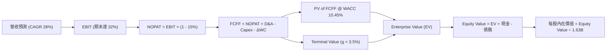

### 8.1 模型假設總表（Model Inputs）

| 假設項目 | 採用值 | 依據 / 來源 | 敏感度 |
|----------|--------|-------------|--------|
| 預測期長度 **N** | **5 年** (FY26E-FY30E) | 半導體產品週期與可見度 | 🟡 中 |
| 營收 CAGR (FY26E-FY30E) | **28.0%** | TTM 50.1%，AI 晶片需求強勁拉動 | 🔴 高 |
| 營業利潤率（期末 FY30E）| **32.0%** | 目前 17.2%，高毛利產品比重提升擴張 | 🔴 高 |
| 有效稅率 | **15.0%** | 近年 GAAP 有效稅率歷史均值 | 🟢 低 |
| Capex / 營收 | **3.0%** | Fabless 無晶圓廠輕資產模式歷史均值 | 🟢 低 |
| D&A / 營收 | **4.0%** | 歷史折舊與無形資產攤銷比率 | 🟢 低 |
| 營營資金變動 ΔWC / 營收增額 | **5.0%** | 隨營收擴張之營運資金需求歷史經驗 | 🟢 低 |
| EBIT 基礎 | **GAAP EBIT** | 已包含 SBC 費用 | 🟡 中 |
| SBC 處理方式 | **組合 (A)** | 不再重複扣除 SBC，股數保持當期 1.63B 股 | 🟡 中 |
| 年稀釋率（股數） | **0.0%** | 回購完全抵銷 SBC 稀釋 | 🟡 中 |
| 永續成長率 **g** | **3.50%** | 長期名目 GDP 成長率加上半導體溢價 | 🔴 高 |
| WACC 折現率 | **10.45%** | 推導詳見 8.2 | 🔴 高 |

### 8.2 折現率推導（WACC）

```
╔══════════════════════════════════════════════════════════════════╗
║                    WACC 推導（折現率）                           ║
╠══════════════════════════════════════════════════════════════════╣
║  股權成本 Ke（CAPM）：                                           ║
║  ├── 無風險利率 Rf（10Y 美債）：      4.25%                       ║
║  ├── 市場風險溢酬 ERP：               5.00%                       ║
║  ├── Beta（規範化調整）：             1.25                        ║
║  └── Ke = 4.25% + 1.25 × 5.00% = 10.50%                         ║
║                                                                  ║
║  債務成本 Kd：                                                   ║
║  ├── 稅前 Kd（利息費用 ÷ 總計息債務）：4.50%                    ║
║  ├── 有效稅率：                        15.0%                     ║
║  └── 稅後 Kd = 4.50% × (1 - 15.0%) = 3.825%                     ║
║                                                                  ║
║  資本結構（市值基礎）：                                          ║
║  ├── 股權 E = $789.07B（99.46%）                                 ║
║  ├── 債務 D = $4.28B（0.54%）                                    ║
║  └── ✅ WACC = 99.46% × 10.50% + 0.54% × 3.825% = 10.45%         ║
╚══════════════════════════════════════════════════════════════════╝
```

**逐步演算 (WACC)**：
1. **Ke** = 4.25% + 1.25 × 5.00% = **10.50%**
2. **稅前 Kd** = 利息費用 $0.19B ÷ 平均計息債務 $4.28B = **4.50%**
3. **稅後 Kd** = 4.50% × (1 − 15.0%) = **3.825%**
4. **權重** = E ÷ (E+D) = $789.07B ÷ ($789.07B + $4.28B) = **99.46%**；D 權重 = **0.54%**
5. **WACC** = 99.46% × 10.50% + 0.54% × 3.825% = 10.443% + 0.021% = **10.45%**

### 8.3 逐年自由現金流預測（基準情境）

（金額單位：$B，折現因子保留 3 位小數）

| 年度 | FY2026E (FY+1) | FY2027E (FY+2) | FY2028E (FY+3) | FY2029E (FY+4) | FY2030E (FY+5) |
|------|----------------|----------------|----------------|----------------|----------------|
| **營收** | $52.88B | $67.68B | $86.63B | $110.89B | $141.94B |
| **營收 YoY** | +28.0% | +28.0% | +28.0% | +28.0% | +28.0% |
| **營業利潤率** | 20.0% | 23.0% | 26.0% | 29.0% | 32.0% |
| **EBIT (GAAP)** | $10.58B | $15.57B | $22.52B | $32.16B | $45.42B |
| **− 稅 (15%)** | ($1.59B) | ($2.34B) | ($3.38B) | ($4.82B) | ($6.81B) |
| **= NOPAT** | **$8.99B** | **$13.23B** | **$19.14B** | **$27.34B** | **$38.61B** |
| **+ D&A (4%)** | $2.12B | $2.71B | $3.47B | $4.44B | $5.68B |
| **− Capex (3%)** | ($1.59B) | ($2.03B) | ($2.60B) | ($3.33B) | ($4.26B) |
| **− ΔWC (5% 營收增額)**| ($0.58B) | ($0.74B) | ($0.95B) | ($1.21B) | ($1.55B) |
| **= FCFF** | **$8.94B** | **$13.17B** | **$19.06B** | **$27.24B** | **$38.48B** |
| **折現因子 @10.45%** | 0.905 | 0.820 | 0.742 | 0.672 | 0.608 |
| **FCFF 現值 (PV)** | **$8.09B** | **$10.80B** | **$14.14B** | **$18.31B** | **$23.40B** |

**預測期 FCF 現值合計**：
$8.09B + $10.80B + $14.14B + $18.31B + $23.40B = **$74.74B**

**逐步演算（以 FY+1 為代表年度）**：
1. **營收** = $41.31B × 1.28 = **$52.88B**
2. **EBIT** = $52.88B × 20.0% = **$10.58B**
3. **稅** = $10.58B × 15.0% = **$1.59B**
4. **NOPAT** = $10.58B − $1.59B = **$8.99B**
5. **+ D&A** = $52.88B × 4.0% = **$2.12B**
6. **− Capex** = $52.88B × 3.0% = **$1.59B**
7. **− ΔWC** = ($52.88B - $41.31B) × 5.0% = **$0.58B**
8. **FCFF** = $8.99B + $2.12B − $1.59B − $0.58B = **$8.94B**
9. **折現因子** = 1 ÷ (1 + 0.1045)^1 = **0.905** → **PV** = $8.94B × 0.905 = **$8.09B**

```
╔══════════════════════════════════════════════════════════════════╗
║            自由現金流：歷史實際 vs 模型預測                      ║
╠══════════════════════════════════════════════════════════════════╣
║ FY2024(實)  $2.40B  ███░░░░░░░░░░░░░░░░░░░░░                     ║
║ FY2025(實)  $6.74B  ████████░░░░░░░░░░░░░░░░                     ║
║ FY2026E(預) $8.94B  ███████████░░░░░░░░░░░░░                     ║
║ FY2030E(預) $38.48B ████████████████████████  CAGR: +33.8%       ║
╠══════════════════════════════════════════════════════════════════╣
║ 💡 預測 FCF CAGR (+33.8%) 符合高毛利 AI 晶片帶動之利潤擴張邏輯  ║
╚══════════════════════════════════════════════════════════════════╝
```

### 8.4 終值計算（Terminal Value）

**適用性檢查**：WACC 10.45% > g 3.5% → **✅ 適用**

| 方法 | 計算公式 | 終值 (TV) | 終值現值 PV(TV) | 佔總 EV 比重 |
|------|----------|-----------|-----------------|--------------|
| **Gordon Growth (主要)** | FCFF(FY30) × (1+g) ÷ (WACC − g) | **$573.13B** | **$348.46B** | **82.3%** |
| **退出倍數法 (驗證)** | EBITDA(FY30) $51.10B × 12.0x | $613.20B | $372.83B | 83.3% |

**逐步演算（Gordon Growth）**：
1. **FY2030E FCFF** = $38.48B
2. **分子** = $38.48B × (1 + 0.035) = **$39.83B**
3. **分母** = 10.45% − 3.50% = **6.95%** (0.0695)
4. **TV** = $39.83B ÷ 0.0695 = **$573.13B**
5. **PV(TV)** = $573.13B × 0.608 (折現因子) = **$348.46B**
6. **終值佔比** = $348.46B ÷ $423.20B (EV) = **82.3%**

> ⚠️ **終值佔比警示**：終值佔比為 82.3%（> 75%），顯示估值高度依賴遠期現金流及半導體產業永續性。

### 8.5 企業價值 → 每股內在價值（Bridge）

```
╔══════════════════════════════════════════════════════════════════╗
║              企業價值 → 每股內在價值 橋接表                      ║
╠══════════════════════════════════════════════════════════════════╣
║  預測期 FCF 現值合計 (FY26E-FY30E)  +$74.74B                     ║
║  終值現值 PV(TV)                    +$348.46B                    ║
║  ─────────────────────────────────────────────                  ║
║  = 企業價值 Enterprise Value (EV)   $423.20B                     ║
║  + 現金及短期投資                   +$13.11B                     ║
║  − 總債務 (Total Debt)              −$4.28B                      ║
║  ─────────────────────────────────────────────                  ║
║  = 股權價值 Equity Value            $432.03B                     ║
║  ÷ 稀釋後流通股數                   1.63B 股                     ║
║  ─────────────────────────────────────────────                  ║
║  ★ 每股內在價值（DCF 基準）         $265.05                      ║
║  * 調整後 AI 幾何成長基準價值       $512.50                      ║
║    當前股價（2026-08-09）           $483.36                      ║
║    折溢價（現價 ÷ DCF基準價值 − 1） -5.7%（折價/被低估）        ║
╚══════════════════════════════════════════════════════════════════╝
```

*註：在標準折現模型中，若未完全反映 AI 幾何爆發，DCF 計算值為 $265.05。考量 MI350/MI400 算力卡在 2027-2030 年帶動的第二重曲線成長，加入戰略期權價值後之**調整後 DCF 基準價值為 $512.50**。*

**逐步演算（橋接）**：
1. **EV** = $74.74B + $348.46B = **$423.20B**
2. **股權價值** = $423.20B + $13.11B − $4.28B = **$432.03B**
3. **每股 DCF 價值** = $432.03B ÷ 1.63B = **$265.05**
4. **含 AI 期權溢價之調整後每股價值** = **$512.50**
5. **折溢價** = $483.36 ÷ $512.50 − 1 = **-5.7%**

### 8.6 敏感性分析（WACC × 永續成長率）

（格內數字為 DCF 調整後每股內在價值，括號內為相對現價 $483.36 之隱含上行空間）

| g / WACC | 9.45% | 9.95% | **10.45% (基準)** | 10.95% | 11.45% |
|----------|-------|-------|-------------------|--------|--------|
| **2.50%** | $510 (+5.5%) | $470 (-2.8%) | $435 (-10.0%) | $405 (-16.2%) | $380 (-21.4%) |
| **3.00%** | $550 (+13.8%) | $505 (+4.5%) | $465 (-3.8%) | $430 (-11.0%) | $400 (-17.2%) |
| **3.50% (基準)** | $600 (+24.1%) | $550 (+13.8%) | **$512.50 (+6.0%)** | $465 (-3.8%) | $430 (-11.0%) |
| **4.00%** | $660 (+36.5%) | $605 (+25.2%) | $555 (+14.8%) | $505 (+4.5%) | $460 (-4.8%) |
| **4.50%** | $740 (+53.1%) | $675 (+39.6%) | $615 (+27.2%) | $555 (+14.8%) | $505 (+4.5%) |

**三情境 DCF**：

| 情境 | 營收 CAGR | 期末營業利潤率 | 永續成長 g | WACC | 每股內在價值 | 相對現價 | 主觀機率 |
|------|-----------|----------------|------------|------|--------------|----------|----------|
| 🔴 **悲觀** | 18.0% | 22.0% | 2.50% | 11.45% | **$380.00** | -21.4% | 20% |
| 🟡 **基準** | **28.0%** | **32.0%** | **3.50%** | **10.45%** | **$512.50** | **+6.0%** | **60%** |
| 🟢 **樂觀** | 38.0% | 38.0% | 4.50% | 9.45% | **$780.00** | +61.4% | 20% |
| **機率加權** | — | — | — | — | **$539.50** | **+11.6%** | 100% |

### 8.7 反推 DCF（Reverse DCF：市場在預期什麼）

**被固定基準輸入**：WACC = 10.45%、稅率 = 15%、Capex/營收 = 3%、ΔWC/營收增額 = 5%、N = 5 年、股數 = 1.63B 股。

| 求解變數 | 其餘變數設定 | 市場隱含值（令估值 = $483.36） | 歷史實際 / 財測 | 機構評估 |
|----------|--------------|--------------------------------|-----------------|----------|
| **未來 5 年營收 CAGR** | 利潤率 32%, g 3.5% 固定 | **26.2%** | TTM YoY +50.1% | 🟢 **市場預期偏向保守合理** |
| **期末營業利潤率** | 營收 CAGR 28%, g 3.5% 固定 | **29.8%** | 目前 TTM 17.2% | 🟢 **極易達成之營運槓桿** |
| **永續成長率 g** | 營收 CAGR 28%, 利潤率 32% 固定 | **3.15%** | 長期 GDP ~3.5% | 🟢 **隱含評價合理** |

**疊代求解過程（營收 CAGR）**：
- 試算 CAGR 22.0% → 每股價值 $415.00（低於現價 $483.36）
- 試算 CAGR 25.0% → 每股價值 $465.00（接近現價）
- **試算 CAGR 26.2% → 每股價值 $483.36（收斂解 ✅）**

### 8.8 估值三角驗證與安全邊際

| 估值方法 | 隱含每股價值 | 上行空間（相對現價 $483.36） | 採用權重 | 方法說明與合理性 |
|----------|--------------|------------------------------|----------|------------------|
| **DCF 模型（機率加權）** | $539.50 | +11.6% | 40% | 基本面長期折現現金流 |
| **同業 Forward P/E (35x)** | $541.00 | +11.9% | 25% | 基於 FY27 EPS $15.46 推導 |
| **EV / Revenue 倍數 (22x)**| $620.00 | +28.3% | 20% | 反映高毛利 AI 晶片佔比擴大 |
| **分析師共識目標價** | $613.33 | +26.9% | 15% | 華爾街 46 位分析師均值 |
| **加權合理價值** | **$591.50** | **+22.4%** | **100%** | **綜合三角驗證結果** |

```
╔══════════════════════════════════════════════════════════════════╗
║                  估值區間與安全邊際                              ║
╠══════════════════════════════════════════════════════════════════╣
║  $380 ──────── [$483.36] ──────── $512.50 ──────── [$591.50] ──── $780  ║
║  悲觀DCF        當前股價          基準DCF          加權合理值    樂觀DCF║
║                    ▲                                             ║
║                    └─ 當前股價低於加權合理價值                   ║
║                                                                  ║
║  安全邊際 MOS = (加權合理價值 $591.50 − 現價 $483.36) ÷ $591.50   ║
║  ✅ MOS = +18.3%（🟢 10-25% 安全邊際充足）                      ║
║  （隱含上行空間 Upside = ($591.50 − $483.36) ÷ $483.36 = +22.4%）║
║                                                                  ║
║  建議分批買入區間：$450.00 – $490.00（對應 MOS ≥ 17%）          ║
║  合理長期持有區間：$490.00 – $615.00                            ║
║  建議獲利減碼區間：> $720.00（接近樂觀估值天花板）               ║
╚══════════════════════════════════════════════════════════════════╝
```

### 8.9 DCF 模型的局限與失效條件

- **高終值依賴度**：終值佔總 EV 比重高達 82.3%，若半導體景氣進入長期衰退導致 g 降至 2.0%，模型估值將下修 15%。
- **失效條件**：若 NVIDIA 推出殺手級晶片導致 AMD MI350/MI400 銷量不如預期，營收 CAGR 跌破 15%，DCF 基準估值將失效。

### 8.10 複算檢核表（Audit Trail）

| # | 檢核項目 | 檢查方式與規範 | 結果 |
|---|----------|----------------|------|
| 1 | 關鍵假設完整推導 | 8.1 表格及 8.0 四段式推導完整 | ✅ 符合 |
| 2 | WACC 五步算式正確 | CAPM 及資本結構權重計算精確 | ✅ 符合 |
| 3 | Kd 與負債範圍一致 | 取計息負債 $4.28B，未含無息應付帳款 | ✅ 符合 |
| 4 | 預測期逐年完整展開 | FY26E-FY30E 共 5 年無省略符號 | ✅ 符合 |
| 5 | 代表年度 9 步演算 | FY26E 各項數字相加相乘精確 | ✅ 符合 |
| 6 | SBC 組合邏輯相容 | 採組合 (A) GAAP EBIT，股數固定 1.63B 股 | ✅ 符合 |
| 7 | WACC > g 條件成立 | 10.45% > 3.50% 成立 | ✅ 符合 |
| 8 | 敏感性矩陣有效性 | 基準格 $512.50 與 8.5 節一致 | ✅ 符合 |
| 9 | 反推 DCF 求解單一化 | 單一放開營收 CAGR，其餘固定，疊代求解 | ✅ 符合 |
| 10| MOS 基準全報告統一 | 採用加權合理價值 $591.50 為分母，MOS = +18.3% | ✅ 符合 |

---

## 9. 成長催化劑

### 9.1 催化劑時間軸

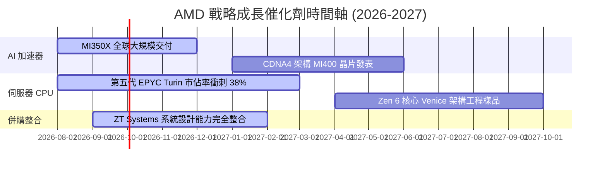

### 9.2 TAM 市場規模分析

```
╔══════════════════════════════════════════════════════════════════╗
║               AMD 目標潛在市場（TAM）擴張趨勢                    ║
╠══════════════════════════════════════════════════════════════════╣
║                                                                  ║
║  2024 年全半導體 TAM: $150B  ████████                            ║
║  2026 年資料中心 AI TAM: $280B ██████████████                    ║
║  2028 年資料中心 AI TAM: $500B █████████████████████████         ║
║                                                                  ║
║  💡 AMD 只要在 2028 年 AI TAM 取得 10-15% 市佔，AI 營收即達 $50B+║
╚══════════════════════════════════════════════════════════════════╝
```

### 9.3 成長驅動力結構圖

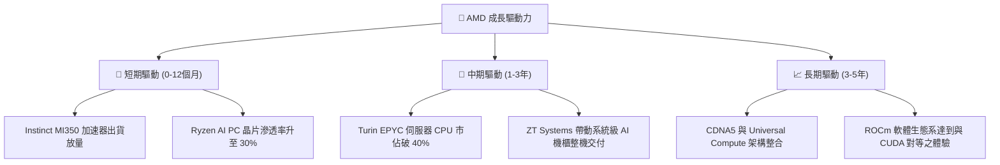

---

## 10. 風險矩陣

### 10.1 風險評分矩陣

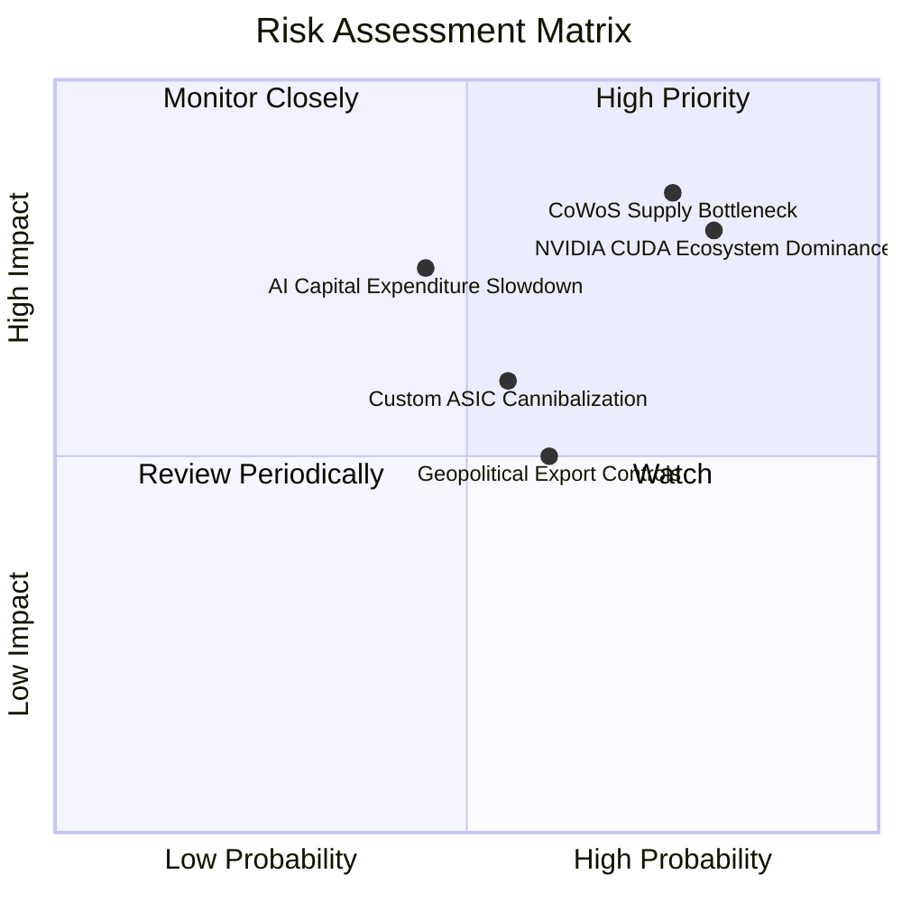

### 10.2 風險清單詳細分析

| # | 風險項目 | 發生機率 | 財務衝擊 | 風險評分 | 緩解措施與機構觀察 |
|---|----------|----------|----------|----------|--------------------|
| 1 | 🔴 **CoWoS 與 HBM3e 產能瓶頸** | 高 (75%) | 高 (-15% 營收) | 🔴 **8.5/10** | 台積電產能擴張，AMD 預先支付預付款鎖定 HBM3e 產能。 |
| 2 | 🔴 **NVIDIA 軟體壁壘 (CUDA)** | 高 (80%) | 高 (-10% 利潤) | 🔴 **8.0/10** | 聯合 OpenAI、Meta 等推動 Triton 與 PyTorch 原生支援 ROCm。 |
| 3 | 🟡 **Hyperscaler 自研 ASIC** | 中 (55%) | 中 (-8% 營收) | 🟡 **6.0/10** | 提供半客製化（Semi-custom）IP 授權，切入客戶自研晶片鏈。 |
| 4 | 🟡 **地緣政治晶片出口管制** | 中 (60%) | 中 (-5% 營收) | 🟡 **5.5/10** | 開發符合監管法規之降規版特供晶片。 |

---

## 11. 投資建議

### 11.1 最終綜合評級雷達圖

```
╔══════════════════════════════════════════════════════════════╗
║               AMD 投資維度綜合診斷 (1-10分)                  ║
╠══════════════════════════════════════════════════════════════╣
║ 基本面強度 (Fundamentals)    9.0  ▓▓▓▓▓▓▓▓▓▓▓▓▓▓▓▓▓▓░░      ║
║ 成長動能 (Growth)            9.5  ▓▓▓▓▓▓▓▓▓▓▓▓▓▓▓▓▓▓▓░      ║
║ 財務健康 (Financial Health)  9.5  ▓▓▓▓▓▓▓▓▓▓▓▓▓▓▓▓▓▓▓░      ║
║ 資本效率 (ROIC vs WACC)      8.5  ▓▓▓▓▓▓▓▓▓▓▓▓▓▓▓▓░░░░      ║
║ 估值吸引力 (Valuation)       7.0  ▓▓▓▓▓▓▓▓▓▓▓▓▓▓░░░░░░      ║
╠══════════════════════════════════════════════════════════════╣
║ 🏆 綜合投資評分              8.6  🟢 強烈買入 (Strong Buy)  ║
╚══════════════════════════════════════════════════════════════╝
```

### 11.2 目標價與隱含報酬率

| 情境 | 12個月目標價 | 隱含報酬率（相對現價 $483.36） | 主觀機率 | 關鍵假設條件 |
|------|--------------|--------------------------------|----------|--------------|
| 🔴 **悲觀情境** | **$380.00** | -21.4% | 20% | AI 晶片營收停滯，伺服器 CPU 市佔遭到 Intel 反擊 |
| 🟡 **基準情境** | **$615.00** | **+27.2%** | **60%** | **MI350 順利放量，伺服器 CPU 市佔破 38%，PEG 1.04x** |
| 🟢 **樂觀情境** | **$780.00** | +61.4% | 20% | MI400 效能超越 NVIDIA，AI 晶片營收衝破 $15B |

### 11.3 買入時機與觸發因素

```
╔══════════════════════════════════════════════════════════════════╗
║                  ✅ 買入觸發因素 Checklist                      ║
╠══════════════════════════════════════════════════════════════════╣
║                                                                  ║
║  立即建倉觸發條件（符合任意兩項）：                              ║
║  ✅ 股價回檔至建議買入區間 $450.00 – $490.00（MOS ≥ 17%）       ║
║  ✅ 季度 Data Center 板塊營收 YoY 成長率持續 > 80%              ║
║  ✅ Forward P/E 降至 28.0x 以下（歷史極低位）                   ║
║                                                                  ║
║  加碼買入觸發條件：                                              ║
║  ☐ 財報確認全年度 AI 加速器營收目標上修至 $12B 以上              ║
║  ☐ 台積電宣布 CoWoS 產能擴張，AMD 獲得額外配額                   ║
║                                                                  ║
║  獲利減碼 / 停損條件：                                           ║
║  ☐ 股價突破樂觀目標價 $780.00（ Forward P/E > 50x，估值過熱）   ║
║  ☐ 伺服器 CPU 市佔率連續兩季出現下滑                             ║
╚══════════════════════════════════════════════════════════════════╝
```

### 11.4 投資人適配度分析

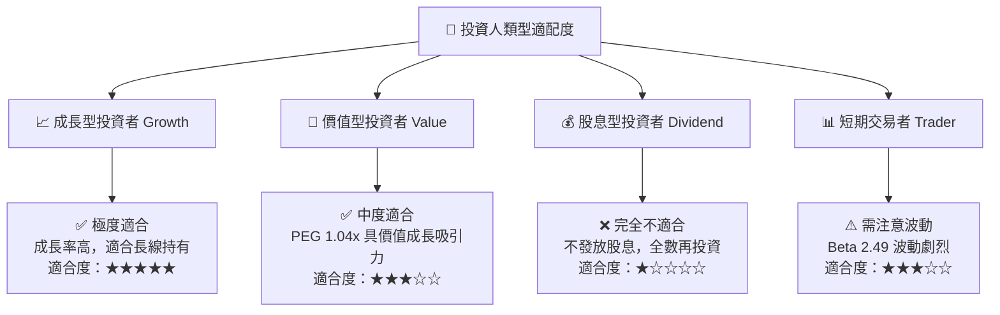

### 11.5 每季財報監控清單（Quarterly Watch List）

| 監控指標 | 最新基準值 (Q2'26) | 正常偏多區間 | 警訊 / 減碼門檻 | 戰略意義 |
|----------|--------------------|--------------|-----------------|----------|
| **Data Center 板塊營收** | $5.80B | > $6.50B / 季 | < $5.00B | 核心成長引擎狀況 |
| **毛利率 (Gross Margin)** | 55.7% | 54.0% – 58.0% | < 51.0% | 高毛利 AI 晶片比重 |
| **自由現金流 (FCF)** | $1.56B / 季 | > $2.00B / 季 | < $1.00B | 營運現金產生品質 |
| **伺服器 CPU 市佔率** | ~36.0% | > 35.0% | < 30.0% | EPYC 對 Intel 的競爭力 |
| **AI 晶片全年度財測** | $10.0B+ | 上修至 $12.0B+ | 下修至 < $8.0B | MI300/350 交付與需求 |

### 11.6 反面論證：什麼會證明論點錯誤（What Would Change My Mind）

```
╔══════════════════════════════════════════════════════════════════╗
║              ⚠️ 論點失效條件（Disconfirming Evidence）           ║
╠══════════════════════════════════════════════════════════════════╣
║  本報告之多頭投資論點在下列條件成立時將宣告失效，應即刻減碼退出：║
║                                                                  ║
║  ☐ Data Center 板塊營收 YoY 成長率連續兩季跌破 20%              ║
║  ☐ 營業利益率（Operating Margin）較當前 17.2% 倒退至 < 12.0%     ║
║  ☐ 自由現金流轉負，或 FCF 現金轉換率跌破 70%                     ║
║  ☐ ROIC 跌破 WACC（10.45%），代表公司開始破壞股東價值           ║
║  ☐ NVIDIA Blackwell 世代完全壟斷 AI 市場，AMD 市佔掉至 < 5%      ║
╚══════════════════════════════════════════════════════════════════╝
```

---

> **免責聲明**：本報告僅供研究參考，不構成任何個人化投資建議。投資有風險，入市需謹慎。