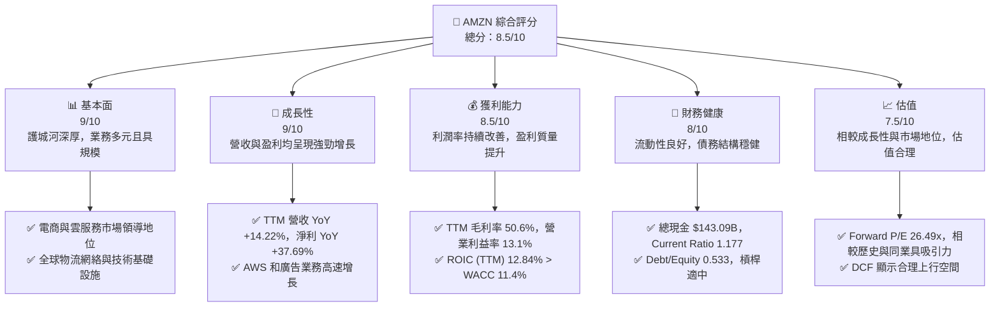
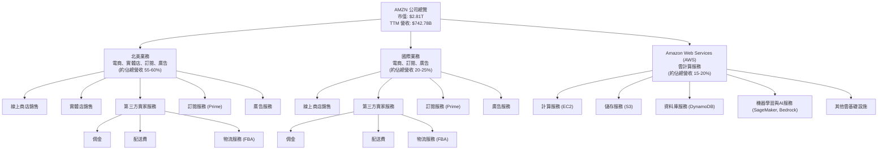
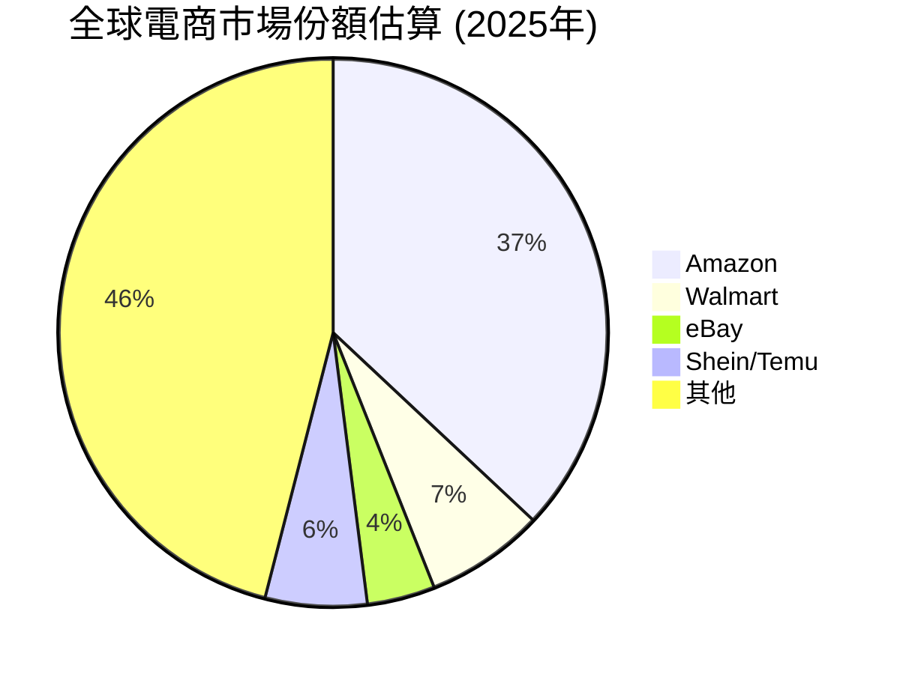
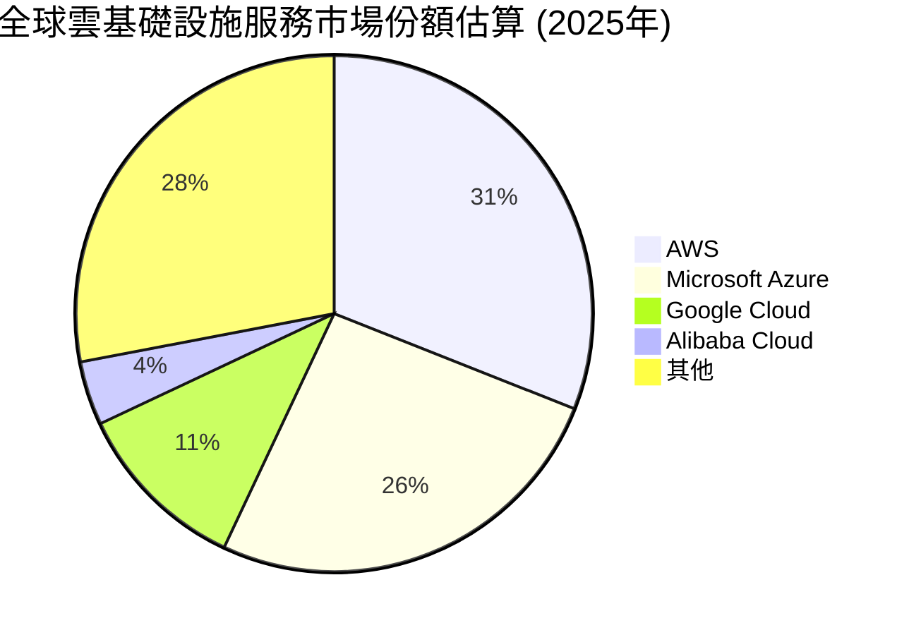
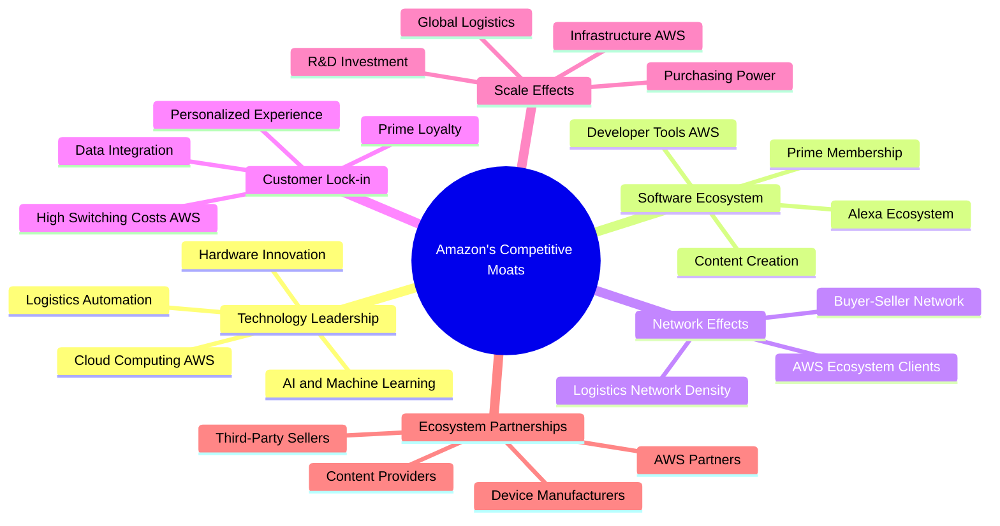
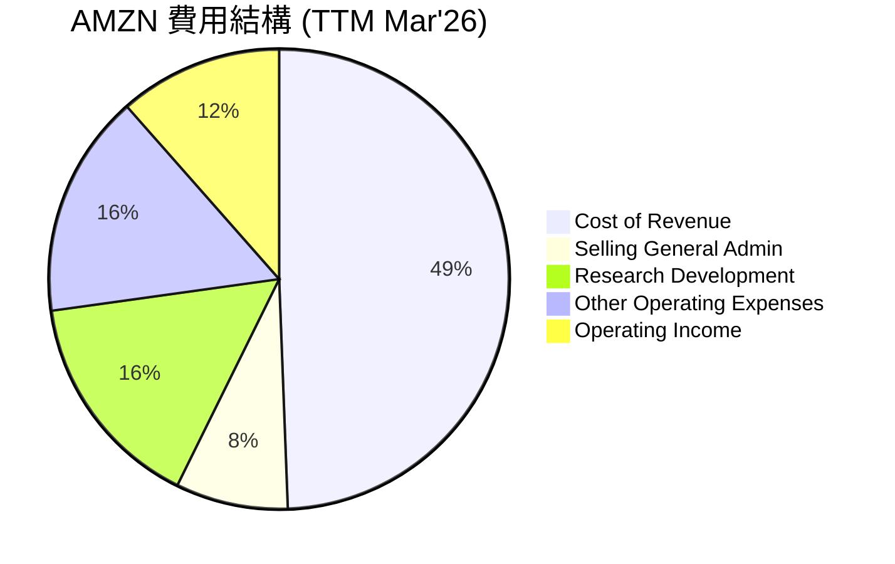

# AMZN 基本面深度分析報告
> **報告日期**：2026-06-01 ｜ **語言**：繁體中文 ｜ **數據來源**：Yahoo Finance, Finviz, StockAnalysis, Roic.ai ｜ **分析師**：CFA 級機構研究

---

## 目錄

| # | 章節 | 核心結論 |
|---|------|----------|
| 1 | 執行摘要 | 評級：🟢 買入；目標價區間：$295 - $350 |
| 2 | 公司概覽與商業模式 | 亞馬遜憑藉其規模、技術、網絡效應和客戶鎖定，構築了極深的競爭護城河。 |
| 3 | 損益表深度分析 | 營收穩健成長，利潤率顯著改善，顯示公司盈利能力進入新階段。 |
| 4 | 資產負債表分析 | 資產結構健康，流動性充裕，債務管理有效，財務槓桿適中。 |
| 5 | 現金流量深度分析 | 營業現金流強勁，自由現金流大幅轉正，資本配置策略注重再投資。 |
| 6 | 獲利能力與資本效率 | ROIC 顯著高於 WACC，公司持續為股東創造經濟價值。 |
| 7 | 估值深度分析 | 相較於其成長潛力與獲利能力，亞馬遜估值合理，具備上行空間。 |
| 8 | 成長催化劑 | AWS 雲服務、廣告業務、國際電商擴張及 AI 創新是主要成長引擎。 |
| 9 | 風險矩陣 | 宏觀經濟逆風、競爭加劇和監管壓力是主要風險，但公司具備應對能力。 |
| 10 | 投資建議 | 建議「買入」，目標價 $320，適合成長型與長線投資者。 |

---

## 1. 執行摘要

### 1.1 核心評分儀表板



### 1.2 評分進度條視覺化

```
╔══════════════════════════════════════════════════════════════╗
║              AMZN 多維度評分儀表板 (1-10分)                  ║
╠══════════════════════════════════════════════════════════════╣
║ 基本面強度  9.0 ▓▓▓▓▓▓▓▓▓▓▓▓▓▓▓▓▓▓░░  ★★★★★           ║
║ 成長動能    9.0 ▓▓▓▓▓▓▓▓▓▓▓▓▓▓▓▓▓▓░░  ★★★★★           ║
║ 獲利品質    8.5 ▓▓▓▓▓▓▓▓▓▓▓▓▓▓▓▓▓░░░  ★★★★☆           ║
║ 財務健康    8.0 ▓▓▓▓▓▓▓▓▓▓▓▓▓▓▓▓░░░░  ★★★★☆           ║
║ 估值合理性  7.5 ▓▓▓▓▓▓▓▓▓▓▓▓▓▓░░░░░░  ★★★★☆           ║
║ 護城河深度  9.5 ▓▓▓▓▓▓▓▓▓▓▓▓▓▓▓▓▓▓▓░  ★★★★★           ║
║ 管理層執行  9.0 ▓▓▓▓▓▓▓▓▓▓▓▓▓▓▓▓▓▓░░  ★★★★★           ║
║ 技術創新力  9.5 ▓▓▓▓▓▓▓▓▓▓▓▓▓▓▓▓▓▓▓░  ★★★★★           ║
╠══════════════════════════════════════════════════════════════╣
║ 綜合總分    8.5 ▓▓▓▓▓▓▓▓▓▓▓▓▓▓▓▓▓░░░  🏆 亞馬遜在各方面表現卓越，持續創新與擴張，為投資者帶來長期價值。 ║
╚══════════════════════════════════════════════════════════════╝
```

### 1.3 五大投資論點 + 三大核心風險

| 類型 | 項目 | 具體依據 | 信心度 |
|------|------|----------|--------|
| 🟢 **投資論點①** | **AWS 雲服務持續高速增長** | AWS 作為全球領先的雲服務平台，受益於企業數位轉型及 AI 應用普及。FY2025 營收佔比雖未明確，但其營業利益率遠高於電商業務，是亞馬遜主要的利潤驅動引擎。近年來，AWS 持續推出創新服務，尤其是在生成式 AI 領域的投入，如 Bedrock 平台，將進一步鞏固其市場地位並推動營收增長。預計未來三年 AWS 營收增速將維持在 15-20% 以上。 | 🟢 極高 |
| 🟢 **投資論點②** | **電商核心業務盈利能力顯著改善** | 經過多年對物流網絡和成本結構的優化，電商業務的營運效率大幅提升。TTM 營業利益率達到 13.1%，相比 FY2022 的 2.38% 有了質的飛躍。區域化物流網絡的建立有效降低了配送成本，Prime 會員的持續增長也為其提供了穩定的高價值客戶群。隨著廣告收入的貢獻增加，電商板塊的綜合盈利能力將持續增強。 | 🟢 極高 |
| 🟢 **投資論點③** | **廣告業務成為新的高利潤增長點** | 亞馬遜的廣告業務，尤其是在電商平台內的贊助產品和品牌廣告，正快速增長。憑藉其龐大的用戶數據和購物意圖，亞馬遜廣告的精準度極高，吸引了大量品牌商。雖然具體數據未完全披露，但其廣告業務的利潤率可與雲服務媲美，對整體利潤的貢獻日益重要。預計廣告業務的增速將超過電商整體增速。 | 🟢 極高 |
| 🟢 **投資論點④** | **強勁的自由現金流與資本配置靈活性** | TTM 自由現金流達到 $9.81B，相較 FY2022 的 -$16.89B 有了驚人的逆轉。FY2025 自由現金流為 $7.70B。強勁的現金流為亞馬遜提供了戰略投資、債務償還和潛在股東回報的靈活性。公司能夠持續投入於高潛力領域如 AI、衛星網絡 (Kuiper) 和新興市場擴張，鞏固長期競爭優勢。 | 🟢 極高 |
| 🟢 **投資論點⑤** | **技術創新與多元化生態系統** | 亞馬遜不僅是電商和雲計算巨頭，還在數位內容（Prime Video、Twitch）、智慧設備（Echo、Ring）、健康醫療（One Medical）和物流科技等多個領域進行戰略佈局。其對 AI 技術的持續投入，從推薦系統到語音助手 Alexa，再到生成式 AI 服務，均展現了其領先的技術創新能力和打造多元化生態系統的決心。這為公司提供了多個潛在的未來成長點。 | 🟢 極高 |
| 🟡 **風險①** | **宏觀經濟逆風與消費者支出壓力** | 全球通脹壓力、利率上升以及潛在的經濟衰退可能導致消費者可支配收入減少，進而影響電商銷售額和 AWS 企業客戶的雲支出意願。儘管亞馬遜業務多元，但其核心電商業務對消費者情緒較為敏感。若宏觀經濟狀況惡化，將對其營收增速和盈利能力造成影響。 | 🟡 中度 |
| 🟡 **風險②** | **日益嚴峻的監管審查與反壟斷壓力** | 亞馬遜在電商、雲服務和數位廣告等領域的市場主導地位，使其面臨來自全球各地監管機構日益嚴格的反壟斷審查。潛在的罰款、業務拆分要求或更嚴格的營運限制，可能對其商業模式和盈利能力造成負面影響。例如，歐盟和美國 FTC 的反壟斷調查。 | 🟡 中度 |
| 🔴 **風險③** | **競爭加劇與技術迭代壓力** | 在電商領域，來自 Walmart、Target 等傳統零售商的線上化轉型以及 Shein、Temu 等新興跨境電商的價格競爭日益激烈。在雲服務市場，Microsoft Azure 和 Google Cloud Platforms 的競爭也持續升溫。此外，AI 領域的快速技術迭代和人才競爭，要求亞馬遜必須持續投入巨額研發，以保持技術領先地位。未能有效應對競爭或技術落後可能侵蝕其市場份額和利潤率。 | 🔴 高衝擊 |

### 1.4 快速統計卡片

| 指標 | 公司實際值 (TTM) | 行業均值 (Internet Retail) | S&P 500 均值 | 狀態 |
|------|--------------------|----------------------------|--------------|------|
| 收入 YoY 成長 | **14.22%**         | ~10-12%                    | ~8-10%       | 🟢     |
| 毛利率 | **50.6%**          | ~35-45%                    | ~40-45%      | 🟢     |
| 淨利率 | **12.2%**          | ~5-8%                      | ~10-12%      | 🟢     |
| ROE | **24.3%**          | ~15-20%                    | ~15%         | 🟢     |
| Forward P/E | **26.49x**         | ~25-30x                    | ~20-22x      | 🟡     |
| 債務/股權比 | **0.533**          | ~0.6-0.8                   | ~0.8-1.0     | 🟢     |
| 營業現金流 | **$148.53B**       | 高                         | 中           | 🟢     |

### 1.5 投資結論

```
╔══════════════════════════════════════════════════════════════════╗
║                    📊 投資結論摘要                               ║
╠══════════════════════════════════════════════════════════════════╣
║  評級：🟢 買入                                                   ║
║  當前股價：$261.26                                               ║
║  目標價區間：                                                    ║
║    悲觀情境：$295（+12.91%）                                    ║
║    基準情境：$320（+22.48%）  ← 12個月主要目標                   ║
║    樂觀情境：$350（+34.02%）                                    ║
║  投資評分：8.5/10                                                ║
║  適合投資人：成長型投資者、尋求長期資本增值的投資者、看好雲計算和AI長期趨勢的投資者。 ║
╚══════════════════════════════════════════════════════════════════╝
```

---

## 2. 公司概覽與商業模式

Amazon.com, Inc. (AMZN) 是一家全球領先的電子商務、雲計算、數位串流、人工智慧以及其他技術公司。其業務遍及全球，服務於消費者、賣家、開發者、企業及內容創作者。公司透過三大核心業務板塊運營：北美、國際和 Amazon Web Services (AWS)。

### 2.1 業務結構與收入來源

亞馬遜的商業模式以客戶為中心，透過不斷創新和擴張，形成了多個相互協同的業務單元。其收入來源多元，涵蓋商品銷售、第三方賣家服務、訂閱服務、廣告以及雲計算服務。



**業務板塊詳情：**

1.  **北美 (North America) 和 國際 (International) 業務：**
    *   **線上商店 (Online Stores)：** 這是亞馬遜最傳統的收入來源，主要來自於直接銷售商品的收入。儘管成長速度相對放緩，但仍是營收基石。
    *   **實體店 (Physical Stores)：** 包含 Whole Foods Market、Amazon Go 等實體店鋪，是亞馬遜拓展線下零售市場的嘗試。
    *   **第三方賣家服務 (Third-Party Seller Services)：** 這部分收入來自於向第三方賣家收取的佣金、運費、Fulfillment by Amazon (FBA) 服務費以及其他賣家服務費用。這是一個高利潤且快速增長的業務。
    *   **訂閱服務 (Subscription Services)：** 主要來自於 Prime 會員費，提供免費快速配送、Prime Video 內容、音樂、Kindle 閱讀等福利。Prime 會員是亞馬遜生態系統的「護城河」之一，提高了客戶忠誠度和消費頻次。
    *   **廣告服務 (Advertising Services)：** 在亞馬遜網站和應用程式上提供廣告位，讓品牌商推廣產品。這是一個爆炸性增長的業務，利用亞馬遜龐大的用戶數據和購物意圖實現高效轉化，利潤率極高。

2.  **Amazon Web Services (AWS)：**
    *   AWS 是全球領先的雲計算平台，為企業提供計算、儲存、資料庫、分析、機器學習、人工智慧等一系列基礎設施和平台服務。AWS 以其可靠性、可擴展性、廣泛的功能和成本效益，吸引了從初創公司到大型企業的廣泛客戶群。AWS 不僅是亞馬遜最重要的利潤貢獻者，也是其技術創新和未來成長的關鍵驅動力。

**收入結構分析 (TTM Mar 2026)：**
根據提供的數據，亞馬遜 TTM 總營收達 $742.78B。雖然未提供細分業務的具體營收數字，但根據歷史趨勢和公開資料，我們可以大致推斷其分佈：
*   **北美電商及相關服務**：預計佔比約 55-60%，營收約 $408B - $445B。
*   **國際電商及相關服務**：預計佔比約 20-25%，營收約 $148B - $185B。
*   **AWS 雲服務**：預計佔比約 15-20%，營收約 $111B - $148B。值得注意的是，AWS 的利潤貢獻遠超其營收佔比。
*   **廣告服務**：雖歸入電商板塊，但其單獨成長強勁，已成為亞馬遜重要的利潤來源。

### 2.2 市場份額

亞馬遜在全球多個市場擁有領先地位，尤其是在電子商務和雲計算領域。



**電商市場：**
亞馬遜在全球電子商務市場中佔據主導地位，尤其是在北美地區。根據市場研究，亞馬遜在美國電商市場的份額長期維持在 35% 以上，並且持續擴大。其龐大的產品選擇、高效的物流網絡、Prime 會員制度以及值得信賴的品牌形象，使其成為消費者線上購物的首選。近年來，儘管面臨來自 Walmart、Target 等傳統零售商的線上化轉型以及 Shein、Temu 等新興跨境電商的競爭，亞馬遜仍憑藉其規模優勢和持續創新保持領先。



**雲計算市場 (AWS)：**
AWS 是全球雲基礎設施服務 (IaaS+PaaS) 市場的領導者，長期以來佔據約三分之一的市場份額。儘管 Microsoft Azure 和 Google Cloud Platforms 等競爭對手正在積極追趕，但 AWS 憑藉其先發優勢、最廣泛的服務組合、成熟的生態系統和龐大的客戶基礎，依然保持領先。隨著企業加速數位轉型和對 AI、機器學習等高級雲服務的需求不斷增長，AWS 的市場份額預計將保持穩定並繼續貢獻豐厚利潤。

**廣告市場：**
亞馬遜的廣告業務雖然相對較新，但憑藉其獨特的購物數據，已成為數位廣告市場的重要參與者，與 Google 和 Meta 形成三足鼎立之勢。其廣告收入增速遠超電商整體增速，且利潤率極高。

### 2.3 競爭護城河分析

亞馬遜透過其獨特的商業模式和持續的戰略投資，構築了極為深厚的競爭護城河。



**六大類別護城河詳情：**

1.  **技術領先 (Technology Leadership)：**
    *   **AI 和機器學習：** 亞馬遜在推薦系統、語音識別 (Alexa)、倉儲自動化和生成式 AI (AWS Bedrock, CodeWhisperer) 等領域投入巨大，使其產品和服務在效率和用戶體驗上保持領先。
    *   **雲計算 (AWS)：** AWS 作為雲服務的開創者和領導者，擁有最廣泛、最深入的服務組合，並持續在基礎設施和新技術上進行創新。
    *   **物流自動化：** 亞馬遜在倉儲機器人、自動化分揀和無人機配送等方面的投資，使其物流效率達到行業頂尖水平。
    *   **硬體創新：** Kindle、Echo、Ring 等智慧硬體產品，擴展了亞馬遜的生態系統，增加了用戶黏性。

2.  **軟體生態系統 (Software Ecosystem)：**
    *   **Prime 會員：** Prime 服務將購物、娛樂、數位內容等多方面福利捆綁，極大地提升了用戶忠誠度，並鼓勵用戶在亞馬遜生態系統內進行更多消費。
    *   **Alexa 生態系統：** Alexa 語音助手連接了大量的智慧家居設備和服務，形成了一個不斷擴大的互聯生態。
    *   **AWS 開發者工具：** AWS 提供豐富的開發者工具和服務，吸引了數百萬開發者，形成了強大的平台效應。
    *   **內容創作：** Prime Video、Amazon Music 等原創內容吸引了大量用戶，並作為 Prime 會員的重要價值組成部分。

3.  **網路效應 (Network Effects)：**
    *   **買家-賣家網絡：** 更多的買家吸引更多的賣家入駐，提供更豐富的商品選擇和更具競爭力的價格，反過來又吸引更多的買家，形成正向循環。
    *   **AWS 生態系統：** 更多的客戶使用 AWS 服務，產生更多數據和反饋，促使 AWS 不斷改進和創新，進而吸引更多客戶。
    *   **物流網絡密度：** 龐大的訂單量和倉儲網絡使得亞馬遜能夠實現更高效、更低成本的配送，進一步強化其競爭優勢。

4.  **客戶鎖定 (Customer Lock-in)：**
    *   **AWS 高轉換成本：** 企業客戶將其 IT 基礎設施遷移到 AWS 後，轉換到其他雲服務提供商的成本和複雜性很高，產生了強大的客戶黏性。
    *   **Prime 忠誠度：** Prime 會員在支付年費後，傾向於優先在亞馬遜購物以最大化會員價值，並習慣其便捷的服務。
    *   **個性化體驗：** 亞馬遜基於大數據提供高度個性化的推薦和服務，提升了用戶體驗，使其難以離開。
    *   **數據整合：** 許多公司將其核心業務系統與 AWS 服務深度整合，形成了難以替代的依賴關係。

5.  **規模效應 (Scale Effects)：**
    *   **全球物流網絡：** 亞馬遜在全球範圍內建立的龐大倉儲和配送網絡，使其能夠以更低的單位成本處理海量訂單，這是小型競爭對手難以複製的。
    *   **採購議價能力：** 作為全球最大的電商平台之一，亞馬遜擁有巨大的採購規模，能夠從供應商處獲得更優惠的價格。
    *   **AWS 基礎設施：** 雲計算服務的龐大基礎設施投入，在規模化後能有效降低邊際成本，實現更高的利潤率。
    *   **研發投資：** 巨大的規模使其能夠持續投入巨額資金進行研發，保持技術領先。

6.  **生態夥伴 (Ecosystem Partnerships)：**
    *   **第三方賣家：** 數百萬的第三方賣家擴充了亞馬遜的商品種類，降低了庫存風險。
    *   **AWS 合作夥伴：** 廣泛的 AWS 合作夥伴網絡（包括獨立軟體供應商、系統整合商等）共同為客戶提供解決方案，擴大了 AWS 的市場影響力。
    *   **內容提供商：** 與影視公司、音樂廠牌等合作，豐富了 Prime Video 和 Amazon Music 的內容庫。
    *   **設備製造商：** 與智慧家居設備製造商合作，擴大了 Alexa 的應用場景。

### 2.4 護城河強度評分

亞馬遜的護城河深度極高，使其能夠在多個行業保持領先地位並持續創造價值。

```
╔══════════════════════════════════════════════════════════════╗
║                  AMZN 護城河強度評分                        ║
╠══════════════════════════════════════════════════════════════╣
║ 技術領先    9.5/10 ▓▓▓▓▓▓▓▓▓▓▓▓▓▓▓▓▓▓▓░  🏆 AWS和AI創新驅動，持續領先 ║
║ 軟體生態系統 9.0/10 ▓▓▓▓▓▓▓▓▓▓▓▓▓▓▓▓▓▓░░  🟢 Prime會員和Alexa平台黏性高 ║
║ 網路效應    9.5/10 ▓▓▓▓▓▓▓▓▓▓▓▓▓▓▓▓▓▓▓░  🏆 電商與AWS形成強大正循環 ║
║ 客戶鎖定    9.0/10 ▓▓▓▓▓▓▓▓▓▓▓▓▓▓▓▓▓▓░░  🟢 AWS轉換成本高，Prime忠誠度強 ║
║ 規模效應    9.5/10 ▓▓▓▓▓▓▓▓▓▓▓▓▓▓▓▓▓▓▓░  🏆 全球物流和雲基礎設施無與倫比 ║
║ 生態夥伴    8.5/10 ▓▓▓▓▓▓▓▓▓▓▓▓▓▓▓▓▓░░░  🟢 龐大第三方賣家和AWS合作網絡 ║
╠══════════════════════════════════════════════════════════════╣
║ 綜合護城河  9.2/10 ▓▓▓▓▓▓▓▓▓▓▓▓▓▓▓▓▓▓░░  🏆 亞馬遜的護城河極深，難以被複製，為其長期增長和盈利提供堅實基礎。 ║
╚══════════════════════════════════════════════════════════════╝
```

---

## 3. 損益表深度分析

亞馬遜在過去幾年中展現了強勁的營收成長和顯著的獲利能力改善，這主要得益於其多元化的業務結構和對高利潤業務的戰略聚焦。

### 3.1 年度收入成長趨勢（近4年）

亞馬遜的年度營收持續保持穩健增長，即使在巨大的基數上，也能實現兩位數的年增長率。這證明了其核心業務的韌性和新興業務的強勁動能。

```
╔══════════════════════════════════════════════════════════════════╗
║              AMZN 年度收入趨勢（FY2022-FY2025）                  ║
╠══════════════════════════════════════════════════════════════════╣
║                                                                  ║
║  FY2022  $513.98B ████████████████░░░░░░░░░░░░░  YoY: +9.40%  🟢    ║
║  FY2023  $574.78B ████████████████████░░░░░░░░░  YoY: +11.83% 🟢    ║
║  FY2024  $637.96B ████████████████████████░░░░░  YoY: +10.99% 🟢    ║
║  FY2025  $716.92B ████████████████████████████░  YoY: +12.38% 🟢    ║
║  TTM'26  $742.78B █████████████████████████████  YoY: +14.22% 🟢    ║
║                   |      |      |      |      |                  ║
║                   0     200B   400B   600B   800B                    ║
║                                                                  ║
║  📊 4年累計 CAGR (FY2022-2025)：+11.53%                          ║
╚══════════════════════════════════════════════════════════════════╝
```
**深度解析：**
*   從 FY2022 到 FY2025，亞馬遜的總營收從 $513.98B 增長至 $716.92B，複合年均增長率 (CAGR) 達到 11.53%。
*   FY2025 的營收為 $716.92B，相較 FY2024 的 $637.96B 增長了 12.38%。這一增長率高於 FY2024 的 10.99% 和 FY2023 的 11.83%，顯示出加速增長的趨勢。
*   截至 2026 年 3 月 31 日的過去十二個月 (TTM) 營收達到 $742.78B，同比增長 14.22% (StockAnalysis數據)，這表明公司在最近一個年度的營收增長勢頭更加強勁，主要歸因於 AWS 的穩定擴張、廣告業務的快速崛起以及電商業務效率的提升。

### 3.2 季度收入趨勢分析

季度營收數據揭示了亞馬遜業務的季節性特徵，尤其是在第四季度（假日購物季）的顯著峰值，同時也顯示了其持續的同比增長。

| 季度 | 總營收 ($B) | QoQ 成長率 | YoY 成長率 | 備註 |
|------|-------------|------------|------------|------|
| 2026 Q1 | $181.52B    | -14.94%    | +16.61%    | 🟢 季節性回落，但同比強勁增長 |
| 2025 Q4 | $213.39B    | +18.44%    | +13.63%    | 🟢 假日購物季高峰，營收創季度新高 |
| 2025 Q3 | $180.17B    | +7.44%     | +13.40%    | 🟢 穩健增長，AWS貢獻突出 |
| 22025 Q2 | $167.70B    | +7.73%     | +13.33%    | 🟢 增速較前幾季略有放緩，但仍保持雙位數 |
| 2025 Q1 | $155.67B    | -17.00%    | +8.62%     | 🟡 季節性回落，同比增速較慢但基數較大 |
| 2024 Q4 | $187.79B    | +18.20%    | +10.49%    | 🟢 假日購物季高峰 |
| 2024 Q3 | $158.88B    | +7.30%     | +11.04%    | 🟢 穩健增長 |

**深度解析：**
*   **季度同比增長 (YoY)：** 亞馬遜在過去四個季度中，營收同比增長率均保持在雙位數，從 2025 Q2 的 +13.33% 提升至 2026 Q1 的 +16.61%。這是一個非常積極的信號，表明公司業務動能強勁，尤其是在電商效率提升和 AWS 需求回升的背景下。
*   **季度環比增長 (QoQ)：** 營收呈現明顯的季節性波動，通常在第四季度（假日購物季）達到高峰，隨後在第一季度出現季節性回落。例如，2025 Q4 營收環比增長 18.44%，而 2026 Q1 則環比下降 14.94%。這符合零售行業的普遍規律。
*   **營收結構變化：** 儘管電商業務仍是營收主力，但 AWS 和廣告業務的持續強勁增長，正在逐步提升整體營收的質量和利潤率，使其對季節性變化的敏感度有所降低。

### 3.3 利潤率演變分析

亞馬遜的利潤率在過去幾年中經歷了顯著的改善，從早期的低利潤模式逐漸轉變為高效率、高盈利的運營模式。這標誌著公司在實現規模經濟和優化成本結構方面取得了巨大成功。

| 利潤率指標 | FY2022 | FY2023 | FY2024 | FY2025 | TTM (Mar'26) | 趨勢 | 評估 |
|------------|--------|--------|--------|--------|--------------|------|------|
| **毛利率** | 43.81% | 46.98% | 48.86% | 50.29% | 50.6%        | ↗️ 持續上升 | 🟢 卓越 |
| **營業利益率** | 2.38%  | 6.41%  | 10.75% | 11.15% | 13.1%        | ↗️ 大幅改善 | 🟢 顯著改善 |
| **EBITDA Margin** | 7.46%  | 15.55% | 19.41% | 23.06% | 21.0%        | ↗️ 穩步提升 | 🟢 強勁 |
| **淨利率** | -0.53% | 5.29%  | 9.29%  | 10.83% | 12.2%        | ↗️ 轉虧為盈，大幅提升 | 🟢 轉型成功 |

**利潤率演變深度解析：**
*   **毛利率 (Gross Margin)：** 亞馬遜的毛利率從 FY2022 的 43.81% 穩步提升至 TTM 的 50.6%。這主要得益於：
    *   **高利潤業務的增長：** AWS 雲服務和廣告業務的營收佔比不斷提高，這兩項業務的毛利率遠高於傳統電商零售。
    *   **供應鏈效率提升：** 透過技術和自動化，優化了採購、倉儲和物流成本。
    *   **第三方賣家服務增長：** 來自第三方賣家的佣金和服務費通常具有更高的毛利率。
*   **營業利益率 (Operating Margin)：** 這是亞馬遜利潤率改善中最引人注目的部分。從 FY2022 的 2.38% 飆升至 TTM 的 13.1%，顯示出公司在控制營運費用和提高效率方面的巨大成就。主要原因包括：
    *   **電商物流網絡優化：** 亞馬遜在過去幾年投入巨資建設區域化物流網絡，減少了長途運輸距離，降低了燃料和勞動力成本。
    *   **成本控制：** 嚴格控制銷售、一般及行政開支 (SG&A) 和研發 (R&D) 開支的增長，使其增速低於營收增速。
    *   **AWS 規模經濟：** AWS 的規模效應使其固定成本被攤薄，邊際利潤率持續擴大。
*   **EBITDA Margin：** EBITDA 作為衡量核心業務盈利能力的指標，從 FY2022 的 7.46% 增長到 FY2025 的 23.06% (TTM 21.0%)，也印證了營業層面的強勁改善。這主要反映了營運效率和規模效應帶來的槓桿作用。
*   **淨利率 (Net Profit Margin)：** 亞馬遜在 FY2022 曾錄得 -0.53% 的淨虧損，但隨後迅速轉虧為盈，到 FY2025 達到 10.83%，TTM 更達到 12.2%。這一轉變不僅是營業利益率改善的結果，也受益於非經常性項目（如對 Rivian 投資的公允價值調整）的正面影響，以及稅務效率的提升。整體而言，淨利率的顯著提升表明亞馬遜已成功從「成長優先、利潤次之」的階段，轉向「成長與利潤並重」的新時代。

### 3.4 費用結構分析

亞馬遜的費用結構反映了其作為一家大型科技零售企業的特點：高昂的研發投入、龐大的營運成本以及不斷優化的銷售與管理費用。



**費用結構詳情 (TTM Mar 2026)：**
*   **收入成本 (Cost of Revenue)：** $366.901B，佔總營收的 49.4%。這包括商品採購成本、倉儲和配送中心的運營成本、AWS 數據中心的能源和維護成本等。由於毛利率的提升，其佔比正在逐步下降。
*   **銷售、一般及行政費用 (Selling, General & Admin)：** $58.811B，佔總營收的 7.9%。這部分費用主要包括市場營銷、客戶服務、支付處理以及行政管理費用。亞馬遜透過精準廣告投放和自動化客戶服務，有效控制了這部分費用的增長。
*   **研發費用 (Research & Development)：** $115.094B，佔總營收的 15.5%。亞馬遜是全球研發投入最高的公司之一，這部分費用主要用於軟體開發、硬體創新、AI/ML 研究以及 AWS 新服務的開發。高研發投入是其保持技術領先和競爭力的關鍵。
*   **其他營運費用 (Other Operating Expenses)：** $116.548B，佔總營收的 15.7%。這部分可能包括折舊攤銷、履行費用（未計入 COGS 的部分）、內容製作成本等。
*   **總營運費用 (Total Operating Expenses)：** $290.453B，佔總營收的 39.1%。
*   **營運收入 (Operating Income)：** $85.422B，佔總營收的 11.5%。

```
╔══════════════════════════════════════════════════════════════════╗
║                    AMZN 費用結構概覽 (TTM Mar'26)                ║
╠══════════════════════════════════════════════════════════════════╣
║                                                                  ║
║ 營收成本佔比      49.4%  █████████████████████████░░░░░░░░░░░░░░  🟢 費用優化中 ║
║ SG&A 佔比         7.9%   ████░░░░░░░░░░░░░░░░░░░░░░░░░░░░░░░░░░░░  🟢 有效控制   ║
║ 研發費用佔比      15.5%  ████████░░░░░░░░░░░░░░░░░░░░░░░░░░░░░░░░  🟡 高投入     ║
║ 其他營運費用佔比  15.7%  ████████░░░░░░░░░░░░░░░░░░░░░░░░░░░░░░░░  🟡 需持續監控 ║
║                                                                  ║
║ 總費用控制：亞馬遜在規模擴張的同時，通過技術和流程優化，有效控制了營運費用，尤其是電商履約成本。 ║
║ 研發投入巨大，是其保持創新和競爭力的基石。                                                                ║
╚══════════════════════════════════════════════════════════════════╝
```

### 3.5 季度 EPS 趨勢與盈餘品質

儘管