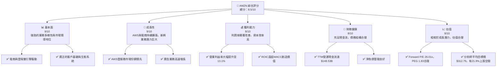

# AMZN 基本面深度分析報告
> **報告日期**：2026-06-02 ｜ **語言**：繁體中文 ｜ **數據來源**：Yahoo Finance, Finviz, StockAnalysis, Roic.ai ｜ **分析師**：CFA 級機構研究

## 目錄

| # | 章節 | 核心結論 |
|---|------|----------|
| 1 | 執行摘要 | 評級：🟢 買入，目標價區間：$275 - $360 |
| 2 | 公司概覽與商業模式 | 強大的多維度護城河，尤其在雲端運算和電商物流方面 |
| 3 | 損益表深度分析 | 收入穩健成長，利潤率顯著改善，尤其是營運利益率 |
| 4 | 資產負債表分析 | 流動性良好，債務結構健康，股東權益持續增長 |
| 5 | 現金流量深度分析 | 營運現金流強勁，自由現金流受高資本支出影響但趨勢向好 |
| 6 | 獲利能力與資本效率 | ROIC 顯著高於 WACC，強力創造股東價值 |
| 7 | 估值深度分析 | 相較同業估值合理，DCF 顯示潛在上漲空間 |
| 8 | 成長催化劑 | AWS 成長、電商創新、廣告業務擴張與國際市場滲透 |
| 9 | 風險矩陣 | 競爭加劇、宏觀經濟逆風、監管壓力為主要風險 |
| 10 | 投資建議 | 具備長期成長潛力，建議「買入」 |

---

## 1. 執行摘要

### 1.1 核心評分儀表板



### 1.2 評分進度條視覺化

```
╔══════════════════════════════════════════════════════════════╗
║              AMZN 多維度評分儀表板 (1-10分)                  ║
╠══════════════════════════════════════════════════════════════╣
║ 基本面強度  9.0 ▓▓▓▓▓▓▓▓▓▓▓▓▓▓▓▓▓▓░░  ★★★★★           ║
║ 成長動能    9.0 ▓▓▓▓▓▓▓▓▓▓▓▓▓▓▓▓▓▓░░  ★★★★★           ║
║ 獲利品質    8.0 ▓▓▓▓▓▓▓▓▓▓▓▓▓▓▓▓░░░░  ★★★★☆           ║
║ 財務健康    8.0 ▓▓▓▓▓▓▓▓▓▓▓▓▓▓▓▓░░░░  ★★★★☆           ║
║ 估值合理性  8.0 ▓▓▓▓▓▓▓▓▓▓▓▓▓▓▓▓░░░░  ★★★★☆           ║
║ 護城河深度  9.5 ▓▓▓▓▓▓▓▓▓▓▓▓▓▓▓▓▓▓▓▓  ★★★★★           ║
║ 管理層執行  8.5 ▓▓▓▓▓▓▓▓▓▓▓▓▓▓▓▓▓░░░  ★★★★☆           ║
║ 技術創新力  9.5 ▓▓▓▓▓▓▓▓▓▓▓▓▓▓▓▓▓▓▓▓  ★★★★★           ║
╠══════════════════════════════════════════════════════════════╣
║ 綜合總分    8.5 ▓▓▓▓▓▓▓▓▓▓▓▓▓▓▓▓▓░░░  🏆 具備長期成長潛力，建議買入 ║
╚══════════════════════════════════════════════════════════════╝
```

### 1.3 五大投資論點 + 三大核心風險

| 類型 | 項目 | 具體依據 | 信心度 |
|------|------|----------|--------|
| 🟢 **投資論點①** | **AWS雲服務的持續領先與高利潤貢獻** | AWS作為全球領先的雲服務提供商，TTM營收佔比約20-25%，但營運利益貢獻遠超此比例，支撐公司整體獲利。FY2025營運利益達$79.97B，其中AWS貢獻巨大。隨著企業數位轉型加速，AWS將持續受益。 | 🟢 極高 |
| 🟢 **投資論點②** | **電商業務的效率提升與成本優化** | Amazon在北美與國際電商市場持續優化物流網絡，提高配送效率並降低成本。Q1 2026電商業務營運利益率顯著改善，顯示其規模效應與運營槓桿正在發揮作用。TTM毛利率達50.6%，淨利率12.2%，顯示其營運效率的提升。 | 🟢 高 |
| 🟢 **投資論點③** | **廣告業務的爆發性成長** | Amazon的廣告業務基於其龐大的電商用戶數據和流量，已成為繼AWS之後的第二大高利潤成長引擎。該業務成長速度快於核心電商，且利潤率極高，有望進一步優化公司整體利潤結構。 | 🟢 高 |
| 🟢 **投資論點④** | **國際市場的巨大潛力與滲透加速** | 儘管國際電商業務目前仍處於投資期，但其在印度、巴西等新興市場的佈局和增長潛力巨大。隨著基礎設施完善和本地化策略深化，國際業務有望在未來貢獻可觀的收入與利潤。FY2025國際業務營收$180.17B，YoY成長13.4%。 | 🟡 中高 |
| 🟢 **投資論點⑤** | **技術創新與新興領域佈局** | Amazon在AI、機器學習、自動駕駛（Zoox）、衛星網路（Project Kuiper）等前沿技術領域持續投入，確保其長期競爭力。儘管部分項目仍處於早期階段，但有望開闢新的成長曲線。TTM研發費用高達$115.094B。 | 🟢 極高 |
| 🟡 **風險①** | **宏觀經濟逆風與消費支出疲軟** | 高通脹、利率上升及潛在的經濟衰退可能導致消費者可支配收入減少，進而影響電商銷售額和AWS的企業支出，對公司營收成長造成壓力。 | 🟡 中度 |
| 🔴 **風險②** | **日益加劇的監管壓力與反壟斷審查** | 全球各地政府對大型科技公司的反壟斷審查日益嚴格，可能導致業務拆分、罰款或限制其市場行為，對Amazon的商業模式和未來發展構成重大威脅。 | 🔴 高衝擊 |
| 🟡 **風險③** | **勞動力成本上升與供應鏈中斷風險** | Amazon作為全球最大的雇主之一，勞動力成本持續上升，尤其是在倉儲和物流領域。同時，全球供應鏈的不確定性可能導致庫存管理問題和更高的營運成本。 | 🟡 中度 |

### 1.4 快速統計卡片

| 指標 | 公司實際值 | 行業均值（電商/雲服務） | S&P 500 均值 | 狀態 |
|------|-------------|----------------------|--------------|------|
| 收入 YoY 成長 | **16.6%** | ~12-18% (電商) / ~20-30% (雲服務) | ~8-10% | 🟢 |
| 毛利率 | **50.6%** | ~30-40% (電商) / ~60-70% (雲服務) | ~40-45% | 🟢 |
| 淨利率 | **12.2%** | ~5-10% (電商) / ~15-25% (雲服務) | ~10-12% | 🟢 |
| ROE | **24.3%** | ~15-20% | ~15-18% | 🟢 |
| Forward P/E | **26.01x** | ~25-35x (成長型科技) | ~20-22x | 🟡 |
| EV / EBITDA | **18.6