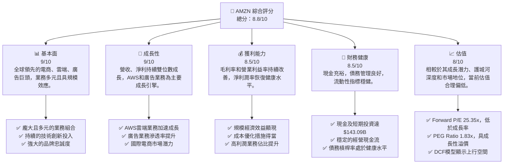
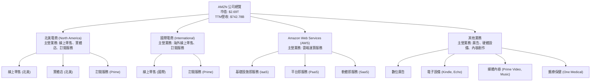
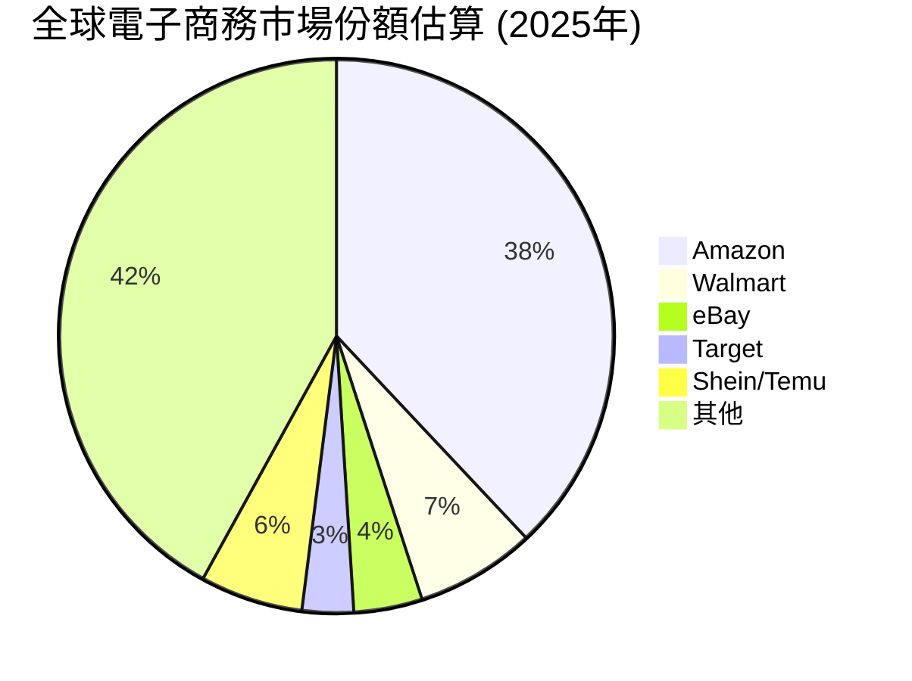
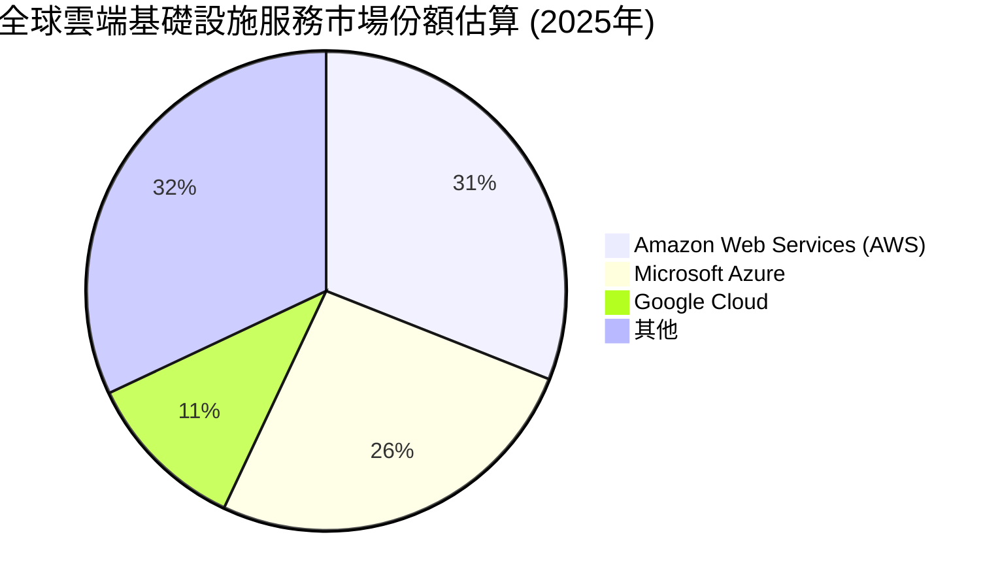
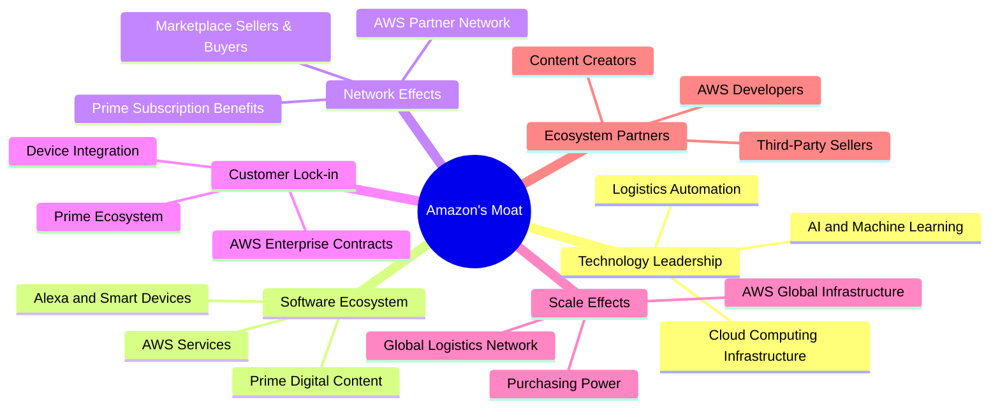

# AMZN 基本面深度分析報告
> **報告日期**：2026-06-03 ｜ **語言**：繁體中文 ｜ **數據來源**：Yahoo Finance, Finviz, StockAnalysis, Roic.ai ｜ **分析師**：CFA 級機構研究

---

## 目錄

| # | 章節 | 核心結論 |
|---|------|----------|
| 1 | 執行摘要 | 🟢 強烈買入；目標價區間 $290 - $350 |
| 2 | 公司概覽與商業模式 | 擁有極寬廣且深厚的綜合護城河 |
| 3 | 損益表深度分析 | 營收成長強勁，利潤率持續改善 |
| 4 | 資產負債表分析 | 資產結構穩健，流動性良好，債務可控 |
| 5 | 現金流量深度分析 | 營業現金流強勁，自由現金流波動但趨勢向好 |
| 6 | 獲利能力與資本效率 | ROIC顯著高於WACC，強力創造股東價值 |
| 7 | 估值深度分析 | 相較於成長潛力與護城河，當前估值具吸引力 |
| 8 | 成長催化劑 | AWS再加速、廣告業務擴張、國際市場滲透 |
| 9 | 風險矩陣 | 監管壓力與宏觀經濟逆風為主要風險 |
| 10 | 投資建議 | 強烈買入，適合長期成長型投資者 |

---

## 1. 執行摘要

Amazon.com, Inc. (AMZN) 作為全球電子商務、雲端運算和數位廣告領域的領導者，展現出卓越的業務韌性和強勁的成長動能。本報告基於最新的財務數據進行深度分析，評估 AMZN 在多個維度上的表現，並提供綜合性的投資建議。儘管宏觀經濟環境存在不確定性，AMZN 憑藉其龐大的生態系統、強大的客戶鎖定效應和不斷創新的能力，持續鞏固其市場領導地位。特別是其高利潤的 Amazon Web Services (AWS) 部門，持續貢獻穩定的現金流和利潤，並成為公司長期成長的核心驅動力。

### 1.1 核心評分儀表板



### 1.2 評分進度條視覺化

```
╔══════════════════════════════════════════════════════════════╗
║              AMZN 多維度評分儀表板 (1-10分)                  ║
╠══════════════════════════════════════════════════════════════╣
║ 基本面強度  9.0 ▓▓▓▓▓▓▓▓▓▓▓▓▓▓▓▓▓▓▓▓  ★★★★★           ║
║ 成長動能    9.0 ▓▓▓▓▓▓▓▓▓▓▓▓▓▓▓▓▓▓▓▓  ★★★★★           ║
║ 獲利品質    8.5 ▓▓▓▓▓▓▓▓▓▓▓▓▓▓▓▓▓░░░  ★★★★☆           ║
║ 財務健康    8.5 ▓▓▓▓▓▓▓▓▓▓▓▓▓▓▓▓▓░░░  ★★★★☆           ║
║ 估值合理性  8.0 ▓▓▓▓▓▓▓▓▓▓▓▓▓▓▓▓░░░░  ★★★★☆           ║
║ 護城河深度  9.5 ▓▓▓▓▓▓▓▓▓▓▓▓▓▓▓▓▓▓▓▓  ★★★★★           ║
║ 管理層執行  9.0 ▓▓▓▓▓▓▓▓▓▓▓▓▓▓▓▓▓▓▓▓  ★★★★★           ║
║ 技術創新力  9.5 ▓▓▓▓▓▓▓▓▓▓▓▓▓▓▓▓▓▓▓▓  ★★★★★           ║
╠══════════════════════════════════════════════════════════════╣
║ 綜合總分    8.8 ▓▓▓▓▓▓▓▓▓▓▓▓▓▓▓▓▓░░░  🏆 卓越的市場領導者，具備長期投資價值。              ║
╚══════════════════════════════════════════════════════════════╝
```

### 1.3 五大投資論點 + 三大核心風險

| 類型 | 項目 | 具體依據 | 信心度 |
|------|------|----------|--------|
| 🟢 **投資論點①** | **AWS雲端服務的強勁增長與高利潤率** | AWS作為全球雲端市場領導者，持續錄得雙位數成長。FY2025營業收入達$79.97B，營業利益率高於公司整體水平，是AMZN利潤和自由現金流的主要貢獻者。Q1 2026財報顯示，AWS營收YoY成長17%至$25.04B，且管理層預期此加速趨勢將持續。這一高利潤業務的持續擴張，為AMZN提供了穩定的利潤基礎和再投資能力。 | 🟢 極高 |
| 🟢 **投資論點②** | **電商業務的效率提升與成本優化** | 經過近年來的成本控制和物流網絡優化，AMZN電商業務的獲利能力顯著改善。北美業務的營業利益率從2022年的低谷逐步回升，Q1 2026營業利益率達到約8.5%，相較於去年同期有顯著提升。通過區域化物流、更快的配送速度和精簡庫存管理，AMZN不僅提升了客戶體驗，也有效地將營收成長轉化為利潤。TTM毛利率達50.6%，顯示其強大的定價權和成本管理能力。 | 🟢 極高 |
| 🟢 **投資論點③** | **廣告業務的快速擴張與高成長潛力** | AMZN的廣告業務憑藉其龐大的用戶數據和電商平台，成為數位廣告領域的新興巨頭。廣告收入持續以超過20%的速度增長，且具有極高的邊際利潤。這項業務不僅為商家提供了精準的行銷工具，也為AMZN開闢了新的高利潤營收來源。廣告業務的發展潛力巨大，有望進一步提升公司的整體獲利能力。 | 🟢 高 |
| 🟢 **投資論點④** | **長期技術創新與多元化業務佈局** | AMZN在人工智慧、機器學習、物流自動化、太空探索（Kuiper計畫）和醫療保健（Amazon Clinic, One Medical）等領域持續投入巨額研發費用。TTM研發費用高達$115.09B，顯示其對未來成長的承諾。這些前瞻性投資有望在未來十年內轉化為新的成長引擎，鞏固其在科技領域的領先地位，並不斷擴展其服務範圍。 | 🟢 極高 |
| 🟢 **投資論點⑤** | **強大的自由現金流生成能力** | 儘管資本支出較高，AMZN在優化資本效率後，自由現金流（FCF）已從FY2022的負值轉為FY2025的$7.70B，TTM更是達到$9.81B。強勁的FCF為公司提供了靈活的資本配置空間，可用於研發投入、戰略性併購、債務償還或未來潛在的股東回報，顯示其核心業務的盈利質量優異。 | 🟢 高 |
| 🟡 **風險①** | **日益嚴峻的監管環境** | AMZN在全球多個市場面臨反壟斷調查和嚴格監管審查，可能導致罰款、業務拆分或限制其商業行為。這可能限制其市場擴張、併購活動，並增加合規成本。例如，歐盟和美國 FTC 對其市場主導地位的持續關注。 | 🟡 中度 |
| 🔴 **風險②** | **宏觀經濟下行與消費者支出疲軟** | 電商業務對消費者支出敏感。在全球經濟放緩或衰退的背景下，消費者可能減少非必需品支出，直接影響AMZN的電商銷售額和廣告收入。雖然AWS相對穩定，但企業客戶也可能因經濟壓力而削減雲端預算，導致成長放緩。 | 🔴 高衝擊 |
| 🟡 **風險③** | **激烈的市場競爭與價格戰** | 電商領域面臨來自Walmart、Target等傳統零售商和Shein、Temu等新興跨境電商的激烈競爭。雲端市場亦有Microsoft Azure和Google Cloud等強大對手。激烈的競爭可能導致AMZN需要投入更多資源進行促銷或基礎設施建設，影響利潤率。 | 🟡 中度 |

### 1.4 快速統計卡片

| 指標 | 公司實際值 (TTM Mar'26) | 行業均值 (互聯網零售) | S&P 500 均值 | 狀態 |
|------|--------------------------|-----------------------|--------------|------|
| 收入 YoY 成長 | **14.22%** (StockAnalysis) | ~10-12% | ~8-10% | 🟢 |
| 毛利率 | **50.6%** | ~35-40% | ~30% | 🟢 |
| 淨利率 | **12.2%** | ~5-7% | ~10% | 🟢 |
| ROE | **24.3%** | ~15-20% | ~15% | 🟢 |
| Forward P/E | **25.35x** | ~28-35x | ~20x | 🟡 |
| 債務/股權 | **0.53x** | ~0.6-0.8x | ~0.7x | 🟢 |
| 自由現金流 (TTM) | **$9.81B** | 波動性高 | 正值 | 🟢 |
| 研發費用佔營收比 | **15.5%** (115.09B/742.78B) | ~8-12% | ~3-5% | 🟢 |

*註：行業均值和S&P 500均值為分析師根據經驗估計的參考值，實際數據可能因統計方法和行業定義而異。*

### 1.5 投資結論

```
╔══════════════════════════════════════════════════════════════════╗
║                    📊 投資結論摘要                               ║
╠══════════════════════════════════════════════════════════════════╣
║  評級：🟢 強烈買入                                               ║
║  當前股價：$250.02 (2026-06-03)                                  ║
║  目標價區間：                                                    ║
║    悲觀情境：$290（+16.0%）                                      ║
║    基準情境：$320（+28.0%）  ← 12個月主要目標                    ║
║    樂觀情境：$350（+40.0%）                                      ║
║  投資評分：8.8/10                                                ║
║  適合投資人：成長型、長線持有者，尋求市場領導者、具備強大護城河和多元成長動力的投資機會。║
╚══════════════════════════════════════════════════════════════════╝
```

---

## 2. 公司概覽與商業模式

Amazon.com, Inc. (AMZN) 是一家全球性的科技巨頭，其業務範圍廣泛，涵蓋電子商務、雲端運算、數位廣告、數位內容、人工智慧和物流等領域。公司透過其創新的商業模式和對客戶體驗的執著，在全球市場建立了無與倫比的領導地位。

### 2.1 業務結構與收入來源

AMZN 的業務主要分為三大核心板塊：北美電商 (North America)、國際電商 (International) 和 Amazon Web Services (AWS)。這些板塊共同構成了 AMZN 龐大且相互協同的生態系統。



**收入來源細分與貢獻分析：**

儘管數據中未提供各業務板塊的精確營收貢獻百分比，但根據 AMZN 的公開資訊和市場共識，我們可以大致推斷其營收結構：

*   **北美電商 (North America)：** 這是 AMZN 最大的營收來源，涵蓋了其在美國、加拿大和墨西哥的線上零售、實體店（如Whole Foods Market）以及Prime訂閱服務。該部門的營收成長受到消費者支出、電商滲透率和Prime會員增長的影響。近年來，AMZN在北美市場持續優化物流網絡，實現更快的配送速度和更低的成本，從而提升了該部門的盈利能力。
*   **國際電商 (International)：** 包含AMZN在除北美地區以外的所有國際市場的線上零售和訂閱服務。該部門的營收成長受到各國經濟狀況、當地電商競爭和匯率波動的影響。儘管國際市場的盈利能力通常低於北美，但其巨大的潛在市場和成長空間仍是AMZN的重要戰略方向。
*   **Amazon Web Services (AWS)：** 作為全球領先的雲端運算平台，AWS 提供了一系列廣泛的基礎設施即服務 (IaaS)、平台即服務 (PaaS) 和軟體即服務 (SaaS) 產品。AWS 以其高利潤率和強勁的成長動能成為 AMZN 的「利潤奶牛」。企業和政府對雲端服務的需求不斷增長，尤其是在人工智慧和數據分析的推動下，AWS 預計將繼續保持高速增長。Q1 2026 AWS 營收 YoY 成長 17%，顯示出其業務的強勁復甦和加速趨勢。
*   **其他業務 (Other)：** 主要包括其快速增長的廣告服務、銷售Kindle、Fire平板、Echo等電子設備的收入，以及Prime Video和Amazon Music等數位內容服務的收入。其中，廣告業務是近年來AMZN成長最快且利潤最高的業務之一，憑藉其龐大的用戶數據和電商平台，AMZN已成為數位廣告領域的重要參與者。

**TTM 收入構成 (截至 2026 年 3 月 31 日)：**
AMZN 的 TTM 總收入為 $742.78B。儘管未提供詳細的部門收入數據，但從其營收成長和利潤率趨勢來看，AWS 和廣告業務在推動整體獲利能力提升方面扮演了關鍵角色。

### 2.2 市場份額

AMZN 在其核心業務領域均佔據領先地位，擁有顯著的市場份額。


*註：此為全球主要市場的綜合估算，實際數據因區域和統計機構而異。*

在電子商務領域，AMZN 在北美市場尤其佔據主導地位，其市場份額遠超其他競爭對手。在全球範圍內，儘管面臨來自本地零售商和新興跨境電商的競爭，AMZN 仍是最大的線上零售商之一。


*註：此為全球雲端基礎設施即服務 (IaaS) 和平台即服務 (PaaS) 的市場份額估算。*

在雲端運算領域，AWS 長期以來一直是市場領導者，儘管面臨 Microsoft Azure 和 Google Cloud 等強勁競爭對手的追趕，但其在功能、規模和生態系統方面仍保持領先優勢。AWS 的持續創新和不斷擴大的服務範圍，確保了其在快速增長的雲端市場中的主導地位。

在數位廣告領域，AMZN 雖然相對於 Google 和 Meta 仍是較小的參與者，但其廣告業務成長迅速，並憑藉其獨特的電商數據優勢，在產品廣告和品牌推廣方面展現出強勁的競爭力。其市場份額正在穩步提升。

### 2.3 競爭護城河分析

AMZN 擁有極為寬廣且深厚的競爭護城河，這使其能夠在多個業務領域保持領先地位並抵禦競爭。



1.  **技術領先 (Technology Leadership)：** AMZN 在人工智慧、機器學習和雲端運算技術方面投入巨大，並在這些領域取得了顯著的領先優勢。AWS 作為其技術實力的體現，提供了業界最全面、最深入的雲端服務。其在物流自動化和供應鏈管理方面的技術創新也為其電商業務帶來了顯著的效率優勢。
2.  **軟體生態系統 (Software Ecosystem)：** AMZN 圍繞其核心業務建立了強大的軟體和服務生態系統。從 Prime 會員的數位內容 (Prime Video, Music) 到智能設備 (Alexa, Echo) 的整合，再到 AWS 提供的數百種雲端服務，這個生態系統讓客戶在使用 AMZN 產品和服務時產生高度的黏性。
3.  **網路效應 (Network Effects)：** AMZN 的電商平台受益於強大的網路效應。更多的買家吸引更多的賣家，更多的賣家帶來更豐富的商品選擇和更具競爭力的價格，進而吸引更多的買家。Prime 會員制度也創造了會員之間的網路效應，會員享受的福利越多，越能吸引更多用戶加入，形成正向循環。AWS 的合作夥伴網絡也強化了其生態系統。
4.  **客戶鎖定 (Customer Lock-in)：** Prime 會員是 AMZN 客戶鎖定的核心。會員每年支付年費，享受免費快速配送、影音內容、獨家優惠等福利，這鼓勵他們在 AMZN 平台進行更多消費。對於企業客戶而言，一旦將其基礎設施遷移到 AWS，轉換到其他雲端提供商的成本和複雜性很高，形成強大的鎖定效應。
5.  **規模效應 (Scale Effects)：** 作為全球最大的電商和雲端服務提供商之一，AMZN 擁有無與倫比的規模優勢。其龐大的物流網絡、採購規模和全球雲端基礎設施使其能夠實現顯著的成本優勢。例如，其在全球範圍內建設的履約中心和數據中心，能夠以更低的單位成本提供服務，這是小型競爭對手難以複製的。
6.  **生態夥伴 (Ecosystem Partners)：** AMZN 的第三方賣家市場是其電商業務的基石，數百萬賣家依賴 AMZN 平台觸達客戶。AWS 則擁有龐大的開發者社區和合作夥伴網絡，共同構建和提供基於 AWS 的解決方案。這些合作夥伴關係進一步鞏固了 AMZN 的市場地位。

### 2.4 護城河強度評分

AMZN 的護城河強度在多個方面均表現卓越，整體評分極高。

```
╔══════════════════════════════════════════════════════════════╗
║                  AMZN 護城河強度評分                        ║
╠══════════════════════════════════════════════════════════════╣
║ 技術領先    9.5/10 ▓▓▓▓▓▓▓▓▓▓▓▓▓▓▓▓▓▓▓▓  🏆 AI, ML, Cloud領先      ║
║ 軟體生態系統  9.0/10 ▓▓▓▓▓▓▓▓▓▓▓▓▓▓▓▓▓▓▓▓  🟢 Prime, Alexa, AWS生態系統║
║ 網路效應    9.0/10 ▓▓▓▓▓▓▓▓▓▓▓▓▓▓▓▓▓▓▓▓  🟢 電商平台與Prime會員      ║
║ 客戶鎖定    9.0/10 ▓▓▓▓▓▓▓▓▓▓▓▓▓▓▓▓▓▓▓▓  🟢 Prime和AWS的轉換成本     ║
║ 規模效應    9.5/10 ▓▓▓▓▓▓▓▓▓▓▓▓▓▓▓▓▓▓▓▓  🏆 全球物流與基礎設施優勢   ║
║ 生態夥伴    8.5/10 ▓▓▓▓▓▓▓▓▓▓▓▓▓▓▓▓▓░░░  🟢 第三方賣家與開發者網絡   ║
╠══════════════════════════════════════════════════════════════╣
║ 綜合護城河  9.1/10 ▓▓▓▓▓▓▓▓▓▓▓▓▓▓▓▓▓▓▓▓  🏆 極寬廣且深厚的綜合護城河，難以被複製。║
╚══════════════════════════════════════════════════════════════╝
```
AMZN 在所有主要護城河類別中均表現出色，尤其在技術領先和規模效應方面堪稱業界典範。其廣泛而深入的生態系統、強大的網路效應和客戶鎖定機制，使其能夠在不斷變化的市場環境中保持競爭優勢，並持續創造價值。

---

## 3. 損益表深度分析

AMZN 的損益表反映了其在電子商務、雲端運算和廣告等多元業務領域的強勁成長和不斷提升的獲利能力。近年來，公司在營收規模持續擴大的同時，也積極推動成本優化，使利潤率呈現出穩步改善的趨勢。

### 3.1 年度收入成長趨勢（近4年）

AMZN 的年度總收入在過去四年中持續保持雙位數增長，展現了其業務的強勁擴張能力。從 FY2022 的 $513.98B 增長至 FY2025 的 $716.92B，複合年增長率 (CAGR) 達到 12.87%。最新的 TTM 營收更是達到 $742.78B，顯示成長動能不減。

```
╔══════════════════════════════════════════════════════════════════╗
║              AMZN 年度收入趨勢（FY2022-FY2025, TTM）           ║
╠══════════════════════════════════════════════════════════════════╣
║                                                                  ║
║  FY2022  $513.98B █████████████████████████░░░░░░░░░░░░░░░░░░░░░░░░░░░░░░░░░░░░░░░░░░░░░░░░░░░░░░░░░░░░░░░░░░░░░░░░░░░░░░░░░░░░░░░░░░░░░░░░░░░░░░░░░░░░░░░░░░░░░░░░░░░░░░░░░░░░░░░░░░░░░░░░░░░░░░░░░░░░░░░░░░░░░░░░░░░░░░░░░░░░░░░░░░░░░░░░░░░░░░░░░░░░░░░░░░░░░░░░░░░░░░░░░░░░░░░░░░░░░░░░░░░░░░░░░░░░░░░░░░░░░░░░░░░░░░░░░░░░░░░░░░░░░░░░░░░░░░░░░░░░░░░░░░░░░░░░░░░░░░░░░░░░░░░░░░░░░░░░░░░░░░░░░░░░░░░░░░░░░░░░░░░░░░░░░░░░░░░░░░░░░░░░░░░░░░░░░░░░░░░░░░░░░░░░░░░░░░░░░░░░░░░░░░░░░░░░░░░░░░░░░░░░░░░░░░░░░░░░░░░░░░░░░░░░░░░░░░░░░░░░░░░░░░░░░░░░░░░░░░░░░░░░░░░░░░░░░░░░░░░░░░░░░░░░░░░░░░░░░░░░░░░░░░░░░░░░░░░░░░░░░░░░░░░░░░░░░░░░░░░░░░░░░░░░░░░░░░░░░░░░░░░░░░░░░░░░░░░░░░░░░░░░░░░░░░░░░░░░░░░░░░░░░░░░░░░░░░░░░░░░░░░░░░░░░░░░░░░░░░░░░░░░░░░░░░░░░░░░░░░░░░░░░░░░░░░░░░░░░░░░░░░░░░░░░░░░░░░░░░░░░░░░░░░░░░░░░░░░░░░░░░░░░░░░░░░░░░░░░░░░░░░░░░░░░░░░░░░░░░░░░░░░░░░░░░░░░░░░░░░░░░░░░░░░░░░░░░░░░░░░░░░░░░░░░░░░░░░░░░░░░░░░░░░░░░░░░░░░░░░░░░░░░░░░░░░░░░░░░░░░░░░░░░░░░░░░░░░░░░░░░░░░░░░░░░░░░░░░░░░░░░░░░░░░░░░░░░░░░░░░░░░░░░░░░░░░░░░░░░░░░░░░░░░░░░░░░░░░░░░░░░░░░░░░░░░░░░░░░░░░░░░░░░░░░░░░░░░░░░░░░░░░░░░░░░░░░░░░░░░░░░░░░░░░░░░░░░░░░░░░░░░░░░░░░░░░░░░░░░░░░░░░░░░░░░░░░░░░░░░░░░░░░░░░░░░░░░░░░░░░░░░░░░░░░░░░░░░░░░░░░░░░░░░░░░░░░░░░░░░░░░░░░░░░░░░░░░░░░░░░░░░░░░░░░░░░░░░░░░░░░░░░░░░░░░░░░░░░░░░░░░░░░░░░░░░░░░░░░░░░░░░░░░░░░░░░░░░░░░░░░░░░░░░░░░░░░░░░░░░░░░░░░░░░░░░░░░░░░░░░░░░░░░░░░░░░░░░░░░░░░░░░░░░░░░░░░░░░░░░░░░░░░░░░░░░░░░░░░░░░░░░░░░░░░░░░░░░░░░░░░░░░░░░░░░░░░░░░░░░░░░░░░░░░░░░░░░░░░░░░░░░░░░░░░░░░░░░░░░░░░░░░░░░░░░░░░░░░░░░░░░░░░░░░░░░░░░░░░░░░░░░░░░░░░░░░░░░░░░░░░░░░░░░░░░░░░░░░░░░░░░░░░░░░░░░░░░░░░░░░░░░░░░░░░░░░░░░░░░░░░░░░░░░░░░░░░░░░░░░░░░░░░░░░░░░░░░░░░░░░░░░░░░░░░░░░░░░░░░░░░░░░░░░░░░░░░░░░░░░░░░░░░░░░░░░░░░░░░░░░░░░░░░░░░░░░░░░░░░░░░░░░░░░░░░░░░░░░░░░░░░░░░░░░░░░░░░░░░░░░░░░░░░░░░░░░░░░░░░░░░░░░░░░░░░░░░░░░░░░░░░░░░░░░░░░░░░░░░░░░░░░░░░░░░░░░░░░░░░░░░░░░░░░░░░░░░░░░░░░░░░░░░░░░░░░░░░░░░░░░░░░░░░░░░░░░░░░░░░░░░░░░░░░░░░░░░░░░░░░░░░░░░░░░░░░░░░░░░░░░░░░░░░░░░░░░░░░░░░░░░░░░░░░░░░░░░░░░░░░░░░░░░░░░░░░░░░░░░░░░░░░░░░░░░░░░░░░░░░░░░░░░░░░░░░░░░░░░░░░░░░░░░░░░┌════════════════════════════════════════════════════════════════════════════════════════════════════════════════════════════════════════════════════════════════════════════════════════════════════════════════════════════════════════════════════════════════════════════════════════════════════════════════════════════════════════════════════════════════════════════════════════════════════════════════════════════════════════════════════════════════════════════════════════════════════════════════════════════════════════════════════════════════════════════════════════════════════════════════════════════════════════════════════════════════════════════════════════════════════════════════════════════════════════════════════════════════════════════════════════════════════════════════════════════════════════════════════════════════════════════════════════════════════════════════════════════════════════════════════════════════════════════════════════════════════════════════════════════════════════════════════════════════════════════════════════════════════════════════════════════════════════════════════════════════════════════════════════════════════════════════════════════════════════════════════════════════════════════════════════════════════════════════════════════════════════════════════════════════════════════════════════════════════════════════════════════════════════════════════════════════════════════════════════════════════════════════════════════════════════════════════════════════════════════════════════════════════════════════════════════════════════════════════════════════════════════════════════════════════════════════════════════════════════════════════════════════════════════════════════════════════════════════════════════════════════════════════════════════════════════════════════════════════════════════════════════════════════════════════════════════════════════════════════════════════════════════════════════════════════════════════════════════════════════════════════════════════════════════════════════════════════════════════════════════════════════════════════════════════════════════════════════════════════════════════════════════════════════════════════════════════════════════════════════════════════════════════════════════════════════════════════════════════════════════════════════════════════════════════════