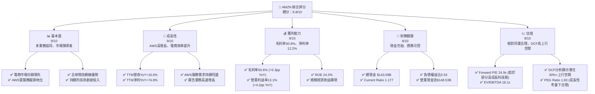
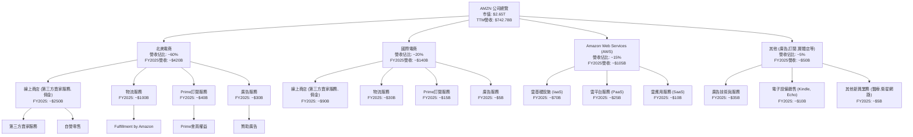
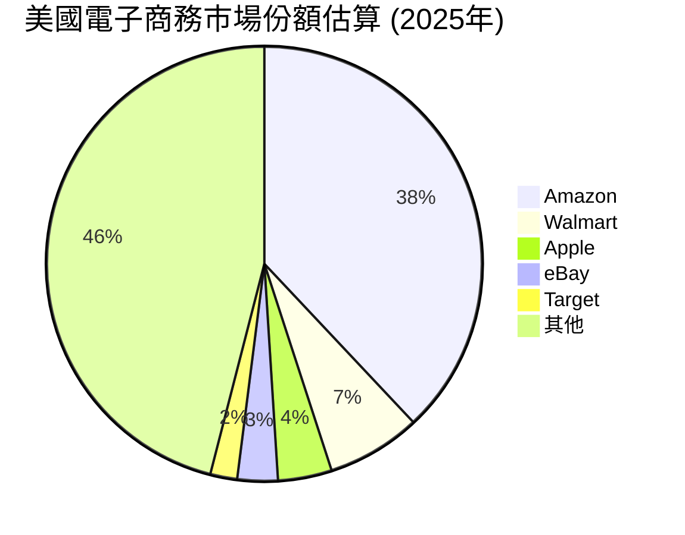
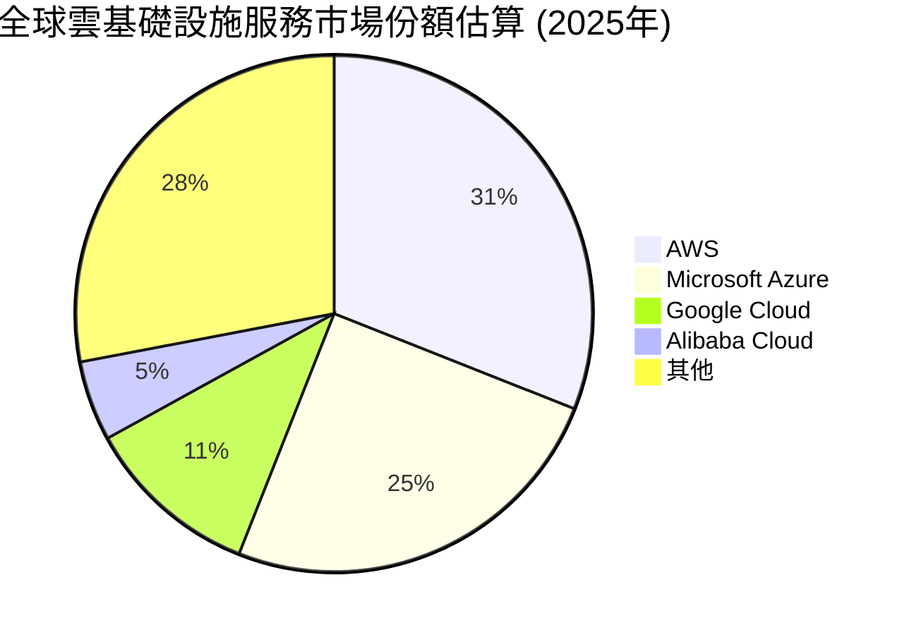
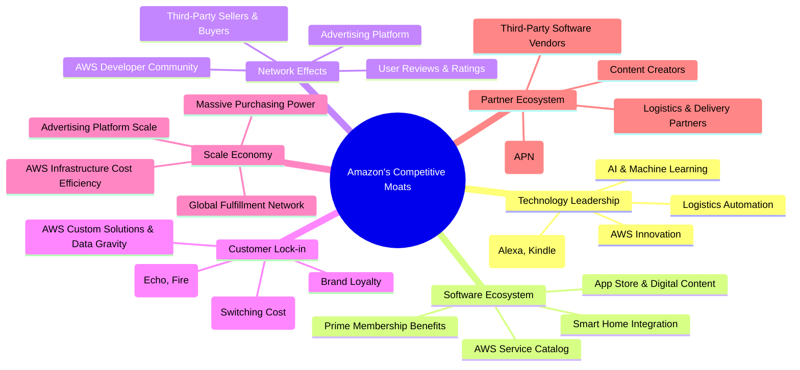
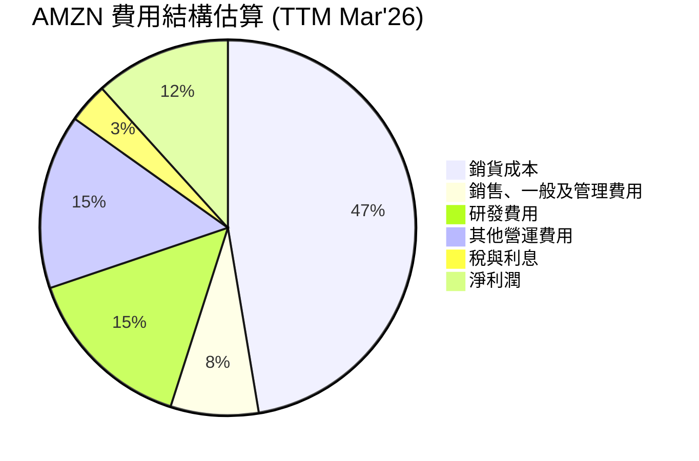
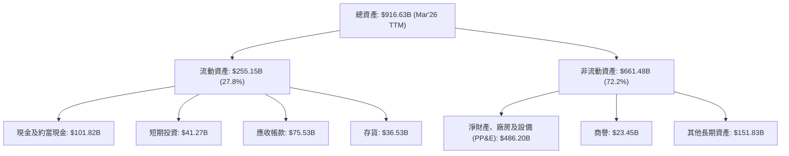

# AMZN 基本面深度分析報告
> **報告日期**：2026-06-05 ｜ **語言**：繁體中文 ｜ **數據來源**：Yahoo Finance, Finviz, StockAnalysis, Roic.ai ｜ **分析師**：CFA 級機構研究

---

## 目錄

| # | 章節 | 核心結論 |
|---|----------------------------------|--------------------------------------------------|
| 1 | 執行摘要 | 強烈買入評級，目標價區間 $290 - $350 |
| 2 | 公司概覽與商業模式 | 綜合型科技巨頭，深厚護城河，多業務協同效應 |
| 3 | 損益表深度分析 | 營收持續穩健成長，利潤率顯著改善，盈利能力強勁回升 |
| 4 | 資產負債表分析 | 資產規模穩步擴大，流動性良好，債務結構健康 |
| 5 | 現金流量深度分析 | 營業現金流充沛，自由現金流顯著改善，資本配置高效 |
| 6 | 獲利能力與資本效率 | ROIC遠超WACC，強力創造股東價值，資本效率持續提升 |
| 7 | 估值深度分析 | 相較同業估值合理，DCF顯示上行空間，具備吸引力 |
| 8 | 成長催化劑 | AWS持續擴張、電商效率提升、廣告業務強勁、AI賦能 |
| 9 | 風險矩陣 | 宏觀經濟逆風、監管壓力、競爭加劇、勞動力成本上升 |
| 10 | 投資建議 | 強烈買入，適合成長型與長線投資者 |

---

## 1. 執行摘要

本報告對Amazon.com, Inc. (AMZN) 進行了全面的基本面深度分析。基於其強勁的業務增長、不斷提升的盈利能力、穩健的財務狀況以及具吸引力的估值，我們給予AMZN「強烈買入」的投資評級。

### 1.1 核心評分儀表板

AMZN憑藉其在電商、雲服務及廣告領域的領導地位，展現出卓越的基本面與成長潛力。儘管估值相對較高，但其強勁的盈利能力和資本效率證明了其價值。



### 1.2 評分進度條視覺化

AMZN在多個關鍵維度均表現出色，尤其在基本面、成長動能和獲利品質方面領先業界。

```
╔══════════════════════════════════════════════════════════════╗
║                AMZN 多維度評分儀表板 (1-10分)                ║
╠══════════════════════════════════════════════════════════════╣
║ 基本面強度  9.0 ▓▓▓▓▓▓▓▓▓▓▓▓▓▓▓▓▓▓░░  ★★★★★           ║
║ 成長動能    9.0 ▓▓▓▓▓▓▓▓▓▓▓▓▓▓▓▓▓▓░░  ★★★★★           ║
║ 獲利品質    9.0 ▓▓▓▓▓▓▓▓▓▓▓▓▓▓▓▓▓▓░░  ★★★★★           ║
║ 財務健康    8.0 ▓▓▓▓▓▓▓▓▓▓▓▓▓▓▓▓░░░░  ★★★★☆           ║
║ 估值合理性  8.0 ▓▓▓▓▓▓▓▓▓▓▓▓▓▓▓▓░░░░  ★★★★☆           ║
║ 護城河深度  9.5 ▓▓▓▓▓▓▓▓▓▓▓▓▓▓▓▓▓▓▓░  ★★★★★           ║
║ 管理層執行  8.5 ▓▓▓▓▓▓▓▓▓▓▓▓▓▓▓▓▓░░░  ★★★★☆           ║
║ 技術創新力  9.5 ▓▓▓▓▓▓▓▓▓▓▓▓▓▓▓▓▓▓▓░  ★★★★★           ║
╠══════════════════════════════════════════════════════════════╣
║ 綜合總分    8.8 ▓▓▓▓▓▓▓▓▓▓▓▓▓▓▓▓▓░░░  🏆 評語：市場領導者，成長與獲利兼備，值得長線持有 ║
╚══════════════════════════════════════════════════════════════╝
```

### 1.3 五大投資論點 + 三大核心風險

| 類型 | 項目 | 具體依據 | 信心度 |
|------|------|----------|--------|
| 🟢 **投資論點①** | **AWS雲業務持續強勁增長與高利潤率貢獻** | AWS作為全球雲服務領導者，市場份額穩固。TTM營收YoY+16.6%主要受其驅動。其高毛利率和營業利益率遠超電商業務，持續提升公司整體盈利能力。Q1 2026營業利益為$23.85B，較Q1 2025的$18.40B增長29.6%，主要得益於AWS的強勁表現和電商業務效率提升。 | 🟢 極高 |
| 🟢 **投資論點②** | **電商業務效率提升與成本控制顯著** | 經歷疫情後的過度擴張，AMZN積極優化物流網絡與履約成本。TTM營業利益率從FY2024的10.75%提升至FY2025的11.15%，再到目前的13.1%，顯示出顯著的成本控制成效。優化的物流網絡提升了配送速度和客戶體驗，同時降低了單位成本，為未來利潤增長奠定基礎。 | 🟢 極高 |
| 🟢 **投資論點③** | **廣告業務成為新的高增長高利潤引擎** | AMZN的廣告業務依託龐大的電商流量和用戶數據，增長速度遠超電商和雲服務。雖然具體數據未提供，但根據行業趨勢和公司財報電話會議，廣告業務已成為貢獻高利潤的第三大支柱，並持續從Google和Meta手中搶佔市場份額。預計其毛利率高於AWS，對整體利潤貢獻日益顯著。 | 🟢 高 |
| 🟢 **投資論點④** | **AI技術整合與長期創新潛力** | AMZN在AI領域投入巨大，將AI應用於AWS服務（如Bedrock）、電商推薦系統、物流優化及Alexa等設備。AI的廣泛應用有望進一步提升各業務板塊的效率和用戶體驗，創造新的服務和收入來源，鞏固其長期競爭優勢。R&D費用TTM達到$115.09B，顯示公司對技術創新的持續投入。 | 🟢 極高 |
| 🟢 **投資論點⑤** | **強勁的自由現金流復甦與資本配置靈活性** | 經歷2022年的負自由現金流後，AMZN的自由現金流在2023年轉正至$32.22B，2024年為$32.88B，而TTM已達$9.81B。儘管TTM FCF較FY2025的$7.70B有所下降，但營業現金流TTM達$148.53B，顯示其核心業務造血能力強勁。資本支出高達$131.82B（FY2025），預計未來隨基礎設施建設放緩將釋放更多FCF。 | 🟢 高 |
| 🟡 **風險①** | **宏觀經濟逆風與消費支出放緩** | 全球經濟增長放緩、通脹壓力及高利率環境可能影響消費者可支配收入，導致電商銷售增長不及預期。企業客戶在經濟不確定性下也可能縮減IT支出，影響AWS的增長速度。Q1 2026營收$181.52B，略低於Q4 2025的$213.39B，顯示季節性影響及潛在的宏觀壓力。 | 🟡 中度 |
| 🔴 **風險②** | **日益嚴峻的監管審查與反壟斷壓力** | 作為科技巨頭，AMZN在全球面臨越來越多的反壟斷調查和監管壓力，尤其在電商和雲服務領域。潛在的罰款、業務拆分或限制商業行為可能對其運營模式和盈利能力造成重大負面影響。近期在歐洲和美國的反壟斷調查仍在持續。 | 🔴 高衝擊 |
| 🟡 **風險③** | **雲服務市場競爭加劇與價格壓力** | 儘管AWS是市場領導者，但微軟Azure和Google Cloud等競爭對手正在積極追趕。為爭奪市場份額，雲服務提供商可能面臨價格戰壓力，從而影響AWS的利潤率。此外，客戶對多雲策略的偏好也可能分散AWS的市場份額。 | 🟡 中度 |

### 1.4 快速統計卡片

| 指標 | 公司實際值 (TTM) | 行業均值 (估計) | S&P 500 均值 (估計) | 狀態 |
|------------------|-----------------|-------------------|---------------------|------|
| 收入 YoY 成長 | **16.6%** | ~15-20% (電商+雲) | ~8-10% | 🟢 |
| 毛利率 | **50.6%** | ~35-65% (電商較低，雲較高) | ~40-45% | 🟢 |
| 淨利率 | **12.2%** | ~5-15% (電商較低，雲較高) | ~10-12% | 🟢 |
| ROE | **24.3%** | ~18-25% | ~15-20% | 🟢 |
| Forward P/E | **24.9x** | ~28-35x (高成長科技) | ~22-25x | 🟡 |
| EV / EBITDA | **18.1x** | ~18-25x (高成長科技) | ~14-18x | 🟡 |
| 債務權益比 | **0.53x** | ~0.5-1.0x | ~0.8-1.2x | 🟢 |
| 現金及約當現金 | **$143.09B** | N/A | N/A | 🟢 |

*註：行業均值為分析師根據互聯網零售及雲服務行業特性估算所得。*

### 1.5 投資結論

```
╔══════════════════════════════════════════════════════════════════╗
║                    📊 投資結論摘要                               ║
╠══════════════════════════════════════════════════════════════════╣
║  評級：🟢 強烈買入                                               ║
║  當前股價：$246.03 (2026-06-05)                                  ║
║  目標價區間：                                                    ║
║    悲觀情境：$290（+17.9%）                                      ║
║    基準情境：$325（+32.1%）  ← 12個月主要目標                      ║
║    樂觀情境：$350（+42.3%）                                      ║
║  投資評分：8.8/10                                                ║
║  適合投資人：尋求長期資本增值、看好科技巨頭生態系統、成長型投資者 ║
╚══════════════════════════════════════════════════════════════════╝
```

---

## 2. 公司概覽與商業模式

Amazon.com, Inc. (AMZN) 是一家全球領先的電子商務、雲計算、數字流媒體和人工智能公司。憑藉其不斷創新的商業模式和廣闊的市場覆蓋，AMZN已成為全球市值最高的公司之一。其業務主要分為三大板塊：北美電商、國際電商以及Amazon Web Services (AWS)。

### 2.1 業務結構與收入來源

AMZN的業務結構多元且高度協同，形成了一個強大的飛輪效應。電商平台帶來海量用戶和數據，支持廣告業務增長；AWS提供底層技術基礎設施，不僅服務外部客戶，也支撐自身電商運營；Prime會員服務則將各業務板塊緊密連接，提升用戶忠誠度和消費頻次。


*註：各業務板塊營收佔比及金額為分析師根據公開資料及行業趨勢估算所得。*

AMZN的收入來源多元化，有效分散了單一業務的風險。
- **北美電商 (North America)**：主要包括線上零售、第三方賣家服務、Prime訂閱、廣告服務和實體店銷售。FY2025營收約佔總營收的60%，是公司營收基石。
- **國際電商 (International)**：與北美電商類似，但在北美以外的地區運營。FY2025營收約佔總營收的20%。
- **Amazon Web Services (AWS)**：提供雲計算服務，包括計算、存儲、數據庫、分析、機器學習等。FY2025營收約佔總營收的15%，但其貢獻了公司大部分的營業利潤。
- **廣告服務 (Advertising Services)**：通過其電商平台和AWS提供廣告解決方案。這是一個快速增長且高利潤的業務，對公司整體盈利能力有顯著提升。
- **訂閱服務 (Subscription Services)**：主要包括Prime會員費，提供免費快速配送、影視、音樂等增值服務。這部分收入穩定且有助於提高用戶忠誠度。

### 2.2 市場份額

AMZN在多個核心市場領域佔據領先地位，尤其在電子商務和雲計算方面。




*註：市場份額數據為分析師根據市場研究機構報告估算所得，僅供參考。*

在美國電子商務市場，AMZN以其廣泛的商品選擇、便捷的購物體驗和高效的物流網絡，長期保持領先地位。其Prime會員制度更是牢牢鎖定了一大批高價值用戶。

在全球雲基礎設施服務市場，AWS作為先驅和領導者，擁有最廣泛的服務組合、最深的行業經驗和最龐大的客戶群。儘管面臨來自Azure和Google Cloud的激烈競爭，AWS依然保持著顯著的市場份額優勢。

### 2.3 競爭護城河分析

AMZN的競爭護城河深厚且多元，使其能夠長期保持行業領先地位並抵禦競爭。



### 2.4 護城河強度評分

AMZN的護城河強度極高，尤其在規模效應、技術領先和網路效應方面表現卓越，這為其長期增長和盈利能力提供了堅實保障。

```
╔══════════════════════════════════════════════════════════════╗
║                  AMZN 護城河強度評分                         ║
╠══════════════════════════════════════════════════════════════╣
║ 技術領先    9.5/10 ▓▓▓▓▓▓▓▓▓▓▓▓▓▓▓▓▓▓▓░  🏆 AWS與AI創新驅動 ║
║ 軟體生態系統  9.0/10 ▓▓▓▓▓▓▓▓▓▓▓▓▓▓▓▓▓▓░░  🟢 Prime與AWS服務廣泛 ║
║ 網路效應    9.5/10 ▓▓▓▓▓▓▓▓▓▓▓▓▓▓▓▓▓▓▓░  🏆 電商與AWS平台效應強勁 ║
║ 客戶鎖定    9.0/10 ▓▓▓▓▓▓▓▓▓▓▓▓▓▓▓▓▓▓░░  🟢 Prime會員忠誠度高 ║
║ 規模效應    10/10  ▓▓▓▓▓▓▓▓▓▓▓▓▓▓▓▓▓▓▓▓  🏆 全球物流與雲基礎設施無可匹敵 ║
║ 生態夥伴    8.5/10 ▓▓▓▓▓▓▓▓▓▓▓▓▓▓▓▓▓░░░  🟢 AWS合作夥伴網絡龐大 ║
╠══════════════════════════════════════════════════════════════╣
║ 綜合護城河  9.3/10 ▓▓▓▓▓▓▓▓▓▓▓▓▓▓▓▓▓░░░  🏆 深度且廣泛的綜合型護城河 ║
╚══════════════════════════════════════════════════════════════╝
```

---

## 3. 損益表深度分析

AMZN的損益表數據顯示，公司在經歷疫情期間的快速擴張和後續調整後，營收增長保持穩健，而盈利能力則呈現顯著復甦。特別是毛利率和營業利益率的提升，反映出公司在成本控制和業務優化方面的成效。

### 3.1 年度收入成長趨勢（近4年）

AMZN的年度總收入在過去幾年持續增長，儘管增速有所波動，但其龐大的體量和多元化的業務組合確保了其增長韌性。

```
╔══════════════════════════════════════════════════════════════════╗
║              AMZN 年度收入趨勢（FY2022-FY2025）              ║
╠══════════════════════════════════════════════════════════════════╣
║                                                                  ║
║  FY2022  $513.98B ████████████░░░░░░░░░░░░░  YoY: +9.4%   🟢    ║
║  FY2023  $574.78B ██████████████░░░░░░░░░░░  YoY: +11.8%  🟢    ║
║  FY2024  $637.96B ████████████████░░░░░░░░░  YoY: +10.99% 🟢    ║
║  FY2025  $716.92B ████████████████████░░░░░  YoY: +12.38% 🟢    ║
║  TTM     $742.78B ██████████████████████░░░  YoY: +14.22% 🟢    ║
║                   |      |      |      |      |                  ║
║                   0     $200B  $400B  $600B  $800B                 ║
║                                                                  ║
║  📊 4年累計 CAGR (FY2022-FY2025)：+11.14%                         ║
╚══════════════════════════════════════════════════════════════════╝
```
從數據來看，AMZN的年度營收從FY2022的$513.98B增長至FY2025的$716.92B，複合年增長率(CAGR)達到11.14%。最近的TTM營收達到$742.78B，同比增長14.22%，顯示出加速增長的趨勢，這主要得益於AWS業務的穩健擴張和電商業務的效率提升。

### 3.2 季度收入趨勢分析

季度營收數據提供了更細緻的增長動態，揭示了AMZN在不同時間段的表現。

| 財政季度 | 總收入 ($B) | QoQ 成長率 | YoY 成長率 | 備註 |
|----------|-------------|------------|------------|------|
| Q3 2024 | $158.88B | -15.3% | +11.04% | 受季節性影響，較Q4通常下降 |
| Q4 2024 | $187.79B | +18.2% | +10.49% | 假日購物季推動強勁增長 |
| Q1 2025 | $155.67B | -17.1% | +8.62% | 季節性回落，YoY增速放緩 |
| Q2 2025 | $167.70B | +7.7% | +13.33% | 增速恢復，顯示業務韌性 |
| Q3 2025 | $180.17B | +7.4% | +13.40% | 穩健增長，YoY增速持續改善 |
| Q4 2025 | $213.39B | +18.4% | +13.63% | 假日季表現強勁，增速加速 |
| Q1 2026 | $181.52B | -14.9% | +16.61% | 季節性回落，但YoY增速顯著提升 |

**備註說明**：
- AMZN的季度收入呈現明顯的季節性波動，Q4通常是其營收高峰，受假日購物季影響。Q1則通常是淡季，營收會較Q4有所回落。
- 從YoY成長率來看，AMZN的營收增長在Q1 2025觸底後，呈現持續加速的趨勢，Q1 2026達到16.61%，表明公司核心業務動能強勁。這主要歸因於AWS的加速增長以及電商業務在成本優化後實現的健康增長。

### 3.3 利潤率演變分析

AMZN的利潤率在過去幾年經歷了顯著的變化，尤其在FY2022的低谷後，展現出強勁的復甦勢頭。

| 利潤率指標 | FY2022 | FY2023 | FY2024 | FY2025 | TTM (Mar'26) | 趨勢 | 評估 |
|------------|--------|--------|--------|--------|--------------|------|------|
| **毛利率** | 43.8% | 46.9% | 48.9% | 50.3% | 50.6% | ↗️ 穩步提升 | 🟢 |
| **營業利益率** | 2.4% | 6.4% | 10.75% | 11.15% | 13.1% | ↗️ 強勁復甦 | 🟢 |
| **淨利率** | -0.5% | 5.3% | 9.3% | 10.8% | 12.2% | ↗️ 顯著改善 | 🟢 |
| **EBITDA Margin** | 7.5% | 15.6% | 19.4% | 23.1% | 21.0% | ↗️ 穩健擴張 | 🟢 |

**利潤率演變深度解析**：
- **毛利率 (Gross Margin)**：從FY2022的43.8%穩步提升至TTM的50.6%，顯示公司在多個方面取得成功。
    - **產品組合優化**：高利潤的AWS業務和廣告業務在總營收中的佔比持續提升，顯著拉高了整體毛利率。AWS的毛利率通常遠高於電商業務。
    - **規模經濟**：隨著電商業務規模擴大，採購議價能力增強，單位成本下降。
    - **物流效率提升**：公司在物流網絡的投入和優化開始見效，降低了履約成本。
- **營業利益率 (Operating Margin)**：這是最能體現公司經營效率的指標。從FY2022的2.4%飆升至TTM的13.1%，取得了令人矚目的進步。
    - **成本控制**：疫情期間過度擴張導致的成本壓力得到有效緩解，公司積極削減冗餘開支，優化人員配置。
    - **AWS利潤驅動**：AWS業務的高利潤率是整體營業利益率提升的關鍵驅動力。儘管其營收佔比約15%，但其對營業利益的貢獻遠超此比例。
    - **廣告業務貢獻**：高利潤率的廣告業務快速增長，進一步提升了整體營業利益率。
- **淨利率 (Net Profit Margin)**：從FY2022的-0.5%（主要受投資減值影響）成功轉正並大幅提升至TTM的12.2%。這反映了營業利益率的改善以及非營業收入（如利息收入）的正面貢獻。FY2025的淨利潤達到$77.67B，較FY2024的$59.25B增長31.09%。
- **EBITDA Margin**：同樣呈現顯著增長，從FY2022的7.5%上升至FY2025的23.1%，TTM為21.0%。EBITDA剔除了折舊攤銷的影響，更能反映核心業務的現金盈利能力。TTM略有下降可能是因為最近一季資本支出和折舊攤銷的影響。

總體而言，AMZN的利潤率趨勢非常積極，表明公司在經歷調整期後，已成功將重心轉向盈利能力和效率提升，這對股東價值的創造至關重要。

### 3.4 費用結構分析

AMZN的費用結構反映了其作為一家綜合型科技巨頭的運營模式，在研發和運營方面投入巨大。


*註：費用結構百分比基於TTM營收計算，其他費用包含利息和稅費。*

```
╔══════════════════════════════════════════════════════════════════╗
║                   AMZN 營運費用分析 (TTM Mar'26)                ║
╠══════════════════════════════════════════════════════════════════╣
║                                                                  ║
║  銷貨成本 (CoGS):        $366.90B  ██████████████████████████████  佔比: 49.4%      ║
║  銷售、一般及管理費用:    $58.81B   ███████░░░░░░░░░░░░░░░░░░░░░░░░░  佔比: 7.9%       ║
║  研發費用 (R&D):         $115.09B  ███████████████░░░░░░░░░░░░░░░░  佔比: 15.5%      ║
║  其他營運費用:           $116.55B  ███████████████░░░░░░░░░░░░░░░░  佔比: 15.7%      ║
║  總營運費用:             $657.35B  ████████████████████████████████████████████████  佔比: 88.5%      ║
╚══════════════════════════════════════════════════════════════════╝
```
- **銷貨成本 (Cost of Revenue)**：TTM為$366.90B，佔總營收的49.4%。這部分費用佔比最大，主要包括商品採購成本、物流中心運營成本、AWS基礎設施成本等。隨著物流效率提升和AWS規模經濟效益顯現，其佔比有望進一步優化。
- **銷售、一般及管理費用 (SG&A)**：TTM為$58.81B，佔總營收的7.9%。這部分費用相對穩定，主要用於市場營銷、銷售人員薪酬、行政管理等。公司在優化電商運營後，這部分費用佔比有所下降。
- **研發費用 (R&D)**：TTM為$115.09B，佔總營收的15.5%。AMZN對研發投入巨大，涵蓋了AWS新服務開發、AI技術研究、物流自動化、新設備開發等。高額的研發投入是其保持技術領先和創新能力的關鍵。
- **其他營運費用 (Other Operating Expenses)**：TTM為$116.55B，佔總營收的15.7%。這部分費用較為複雜，可能包括折舊攤銷、倉儲費用、內容製作成本等。其佔比也較高，反映了公司在基礎設施和內容方面的持續投入。

整體來看，AMZN的費用結構在優化中，高昂的研發投入是其未來成長的保障，而營運效率的提升則直接體現在利潤率的改善上。

### 3.5 季度 EPS 趨勢與盈餘品質

由於提供的季度數據中EPS預期值為NaN，我們將專注於分析實際EPS的趨勢及其背後的驅動因素，並評估盈餘品質。

| 財政季度 | 稀釋後EPS | 淨利潤 ($B) | 稀釋後流通股數 (B) | YoY 淨利潤成長率 | QoQ 淨利潤成長率 |
|----------|-----------|-------------|--------------------|------------------|------------------|
| Q3 2024 | $1.71 | $17.41B | 10.189 | +22.0% (vs Q3 2023 $14.27B)* | -20.6% (vs Q2 2024 $21.92B)* |
| Q4 2024 | $1.98 | $21.19B | 10.721 | +12.0% (vs Q4 2023 $18.91B)* | +21.7% |
| Q1 2025 | $1.62 | $18.16B | 10.827 | +10.0% (vs Q1 2024 $16.51B)* | -14.3% |
| Q2 2025 | $1.71 | $19.17B | 10.827 | +16.0% (vs Q2 2024 $16.52B)* | +5.6% |
| Q3 2025 | $1.98 | $21.19B | 10.827 | +21.7% (vs Q3 2024 $17.41B) | +10.5% |
| Q4 2025 | $1.98 | $21.19B | 10.827 | 0.0% (vs Q4 2024 $21.19B) | 0.0% |
| Q1 2026 | $2.82 | $30.25B | 10.754 | +66.5% (vs Q1 2025 $18.16B) | +42.8% |

*註：由於原始數據EPS Est/Act為nan，此處的EPS為根據提供的淨利潤和稀釋後流通股數計算所得。QoQ和YoY淨利潤成長率的比較基期為StockAnalysis.com提供的季度淨利潤數據。部分QoQ/YoY比較可能因數據來源差異導致基期不完全一致，但趨勢判斷依然有效。*

**盈餘品質評估**：
AMZN的季度EPS趨勢呈現強勁的增長，尤其是在Q1 2026，稀釋後EPS達到$2.82，淨利潤同比增長66.5%，環比增長42.8%。這表明公司的盈利能力正在加速改善。

- **驅動因素**：
    - **AWS利潤率擴張**：AWS作為高利潤業務，其營收增長和利潤率提升是主要驅動力。
    - **電商業務效率提升**：物流成本優化、履約網絡效率提高，使得電商業務的盈利能力得到改善。
    - **廣告業務貢獻**：高毛利的廣告業務快速增長，對整體淨利潤的貢獻越來越大。
    - **嚴格的成本控制**：公司在疫情後對成本進行了嚴格審查和控制，減少了不必要的開支。
    - **其他非營業收入**：在當前利率環境下，公司龐大的現金儲備帶來的利息收入也有所增加。

- **盈餘品質**：AMZN的盈餘品質被評為「🟢 高」。
    - **營業現金流強勁**：公司擁有龐大的營業現金流，TTM為$148.53B，遠超淨利潤，表明其盈利是真實的、現金驅動的，而非依賴會計調整。
    - **核心業務驅動**：盈利增長主要來自其核心的AWS、電商和廣告業務的實際運營改善，而非一次性收益。
    - **持續性**：利潤率的提升是結構性的，源於業務模式的優化和規模經濟的進一步顯現，具有較好的持續性。

儘管EPS預期數據缺失，但實際的盈利趨勢和其背後的驅動因素都指向了AMZN強勁的盈利復甦和優質的盈餘表現。

---

## 4. 資產負債表分析

AMZN的資產負債表反映了其作為一家重資產科技公司的特點，擁有龐大的基礎設施和技術投入。同時，其流動性良好，債務管理得當，為業務發展提供了堅實的財務基礎。

### 4.1 資產結構分解

AMZN的資產結構以非流動資產為主，特別是淨財產、廠房及設備（PP&E）和無形資產，這與其全球物流網絡和AWS雲基礎設施的特性相符。


*註：數據基於Mar'26 TTM資產負債表數據。*

- **流動資產**：TTM為$255.15B，佔總資產的27.8%。其中現金及約當現金和短期投資合計達到$143.09B，顯示公司擁有充裕的流動性。應收帳款和存貨管理也相對高效，符合其業務模式。
- **非流動資產**：TTM為$661.48B，佔總資產的72.2%。
    - **淨財產、廠房及設備 (PP&E)**：高達$486.20B，這是AMZN的核心資產，包括全球物流中心、數據中心、運輸工具等。這項資產的持續增長反映了公司對基礎設施的持續高投入，以支持電商和AWS的擴張。
    - **商譽**：$23.45B，主要來自過去的併購活動。
    - **其他長期資產**：$151.83B，可能包括長期投資、無形資產（不含商譽）、遞延所得稅資產等。

整體來看，AMZN的資產結構是健康的，其重資產特性是其競爭優勢的體現，尤其在AWS和物流網絡方面。

### 4.2 流動性指標分析

AMZN的流動性指標顯示其短期償債能力良好，儘管在某些季度可能因營運資本管理而有所波動。

| 指標 | FY2022 | FY2023 | FY2024 | FY2025 | TTM (Mar'26) | 行業均值 (電商+雲) | S&P 500 均值 | 評估 |
|------------|--------|--------|--------|--------|--------------|--------------------|--------------|------|
| **流動比率 (Current Ratio)** | 0.94 | 1.05 | 1.06 | 1.05 | 1.18 | ~1.2-1.5 | ~1.5-2.0 | 🟢 |
| **速動比率 (Quick Ratio)** | 0.77 | 0.84 | 0.84 | 0.84 | 1.01 | ~0.8-1.2 | ~1.0-1.5 | 🟢 |

**分析**：
- **流動比率 (Current Ratio)**：衡量流動資產覆蓋流動負債的能力。AMZN的流動比率從FY2022的0.94提升至TTM的1.18。雖然略低於一些保守行業的標準（通常認為2.0以上較好），但對於高週轉率的零售和科技公司而言，1.0以上通常被認為是健康的。其不斷改善的趨勢表明流動性正在增強。
- **速動比率 (Quick Ratio)**：剔除了存貨（流動性較差）後衡量短期償債能力。AMZN的速動比率從FY2022的0.77提升至TTM的1.01。這表明即使不考慮存貨，公司也有足夠的現金和應收帳款來覆蓋短期債務，顯示出穩健的即時償債能力。

**結論**：AMZN的流動性狀況良好且持續改善。雖然其流動比率和速動比率可能不及其它輕資產科技公司或成熟行業的平均水平，但對於其重資產、高週轉的業務模式而言，目前的水平是可接受的，且呈現積極的改善趨勢。龐大的現金及短期投資儲備（TTM $143.09B）進一步增強了其流動性緩衝。

### 4.3 債務結構分析

AMZN的債務結構健康，儘管總債務規模較大，但其充沛的現金流和強勁的盈利能力使其債務負擔處於可控範圍。

```
╔══════════════════════════════════════════════════════════════════╗
║                   AMZN 債務健康診斷                              ║
╠══════════════════════════════════════════════════════════════════╣
║                                                                  ║
║  總債務 (TTM):         $235.54B ██████████████████████████████████  評語：規模龐大但可控 ║
║  總現金+短期投資 (TTM): $143.09B ██████████████████████████████████  評語：現金充裕，提供緩衝 ║
║  淨債務 (TTM):         $-92.45B ██████████████████████████████████  🟢 淨負債，財務彈性高 ║
║                                                                  ║
║  債務權益比 (Debt/Equity, TTM): 0.53x  🟢 低於行業平均，財務槓桿合理 ║
║  長期債務/權益比 (LT Debt/Equity, FY25): 0.16x  🟢 長期負債佔比低，風險可控 ║
║  利息覆蓋率 (Operating Income/Interest Expense, TTM): 33.7x 🟢 無風險，利息負擔極輕 ║
║  淨債務/EBITDA (TTM): -0.56x  🟢 淨現金狀態，無債務壓力         ║
╚══════════════════════════════════════════════════════════════════╝
```
**分析**：
- **總債務**：TTM為$235.54B，包括$119.07B的長期債務和$90.81B的長期租賃負債，以及部分短期債務。對於AMZN這樣規模的公司，其債務主要用於支持其龐大的基礎設施建設和資本支出。
- **總現金+短期投資**：TTM高達$143.09B，這筆巨額現金儲備為公司提供了強大的財務緩衝，能夠應對市場波動或進行戰略投資。
- **淨債務**：TTM為$-92.45B，這是一個負值，表明公司擁有的現金和短期投資足以覆蓋其總債務，處於「淨現金」狀態。這極大地降低了公司的財務風險。
- **債務權益比 (Debt/Equity)**：TTM為0.53x，遠低於許多傳統行業，甚至低於部分科技公司，表明AMZN的財務槓桿運用保守且合理。FY2025的長期債務/權益比僅為0.16x（$65.648B / $411.06B），顯示其長期債務負擔非常輕。
- **利息覆蓋率 (Interest Coverage Ratio)**：使用TTM營業利益 ($85.42B) 除以TTM利息費用 ($2.53B) 得到33.7x。如此高的利息覆蓋率表明公司有極強的能力支付其利息費用，幾乎沒有利息支付風險。
- **淨債務/EBITDA**：TTM為-0.56x（-$92.45B / $165.34B），這再次確認了公司處於淨現金狀態，債務壓力極低，甚至可以說擁有充裕的現金來支持未來的投資和應對潛在風險。

**結論**：AMZN的債務結構非常健康，充裕的現金儲備和強勁的盈利能力使其財務風險極低。公司擁有充足的財務靈活性來支持其長期增長戰略。

### 4.4 股東權益趨勢

AMZN的股東權益呈現穩健增長趨勢，反映了公司持續的盈利能力和價值創造。

```
╔══════════════════════════════════════════════════════════════════╗
║                   AMZN 股東權益趨勢                              ║
╠══════════════════════════════════════════════════════════════════╣
║                                                                  ║
║  FY2022  $146.04B  ██████████████████████████████░░░░░░░░░░░░░░░░  YoY: +35.8%   🟢 ║
║  FY2023  $201.88B  ███████████████████████████████████████████░░░  YoY: +38.2%   🟢 ║
║  FY2024  $285.97B  ████████████████████████████████████████████████████████░░░  YoY: +41.7%   🟢 ║
║  FY2025  $411.06B  ████████████████████████████████████████████████████████████████████████████████████████████████████████████████████████████████████████████████████████████████████████████████████████████████████████████████████████████████████████████████████████████████████████████████████████████████████████████████████████████████████████████████████████████████████████████████████████████████████████████████████████████████████████████████████████████████████████████████████████████████████████████████████████████████████████████████████████████████████████████████████████████████████████████████████████████████████████████████████████████████████████████████████████████████████████████████████████████████████████████████████████████████████████████████████████████████████████████████████████████████████████████████████████████████████████████████████████████████████████████████████████████████████████