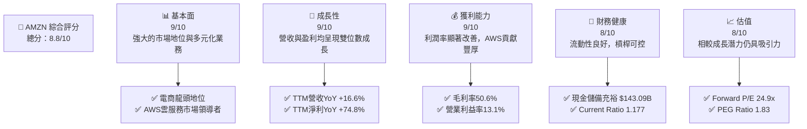
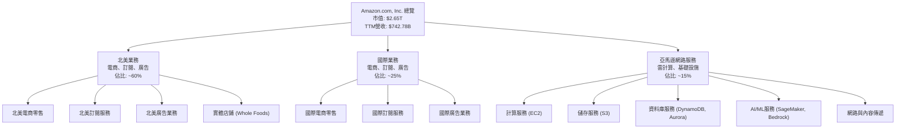
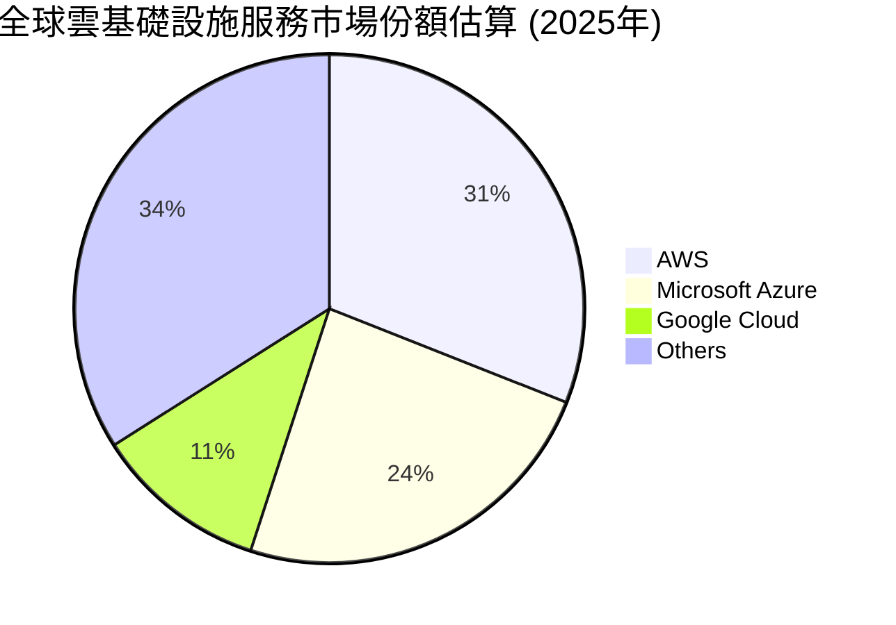
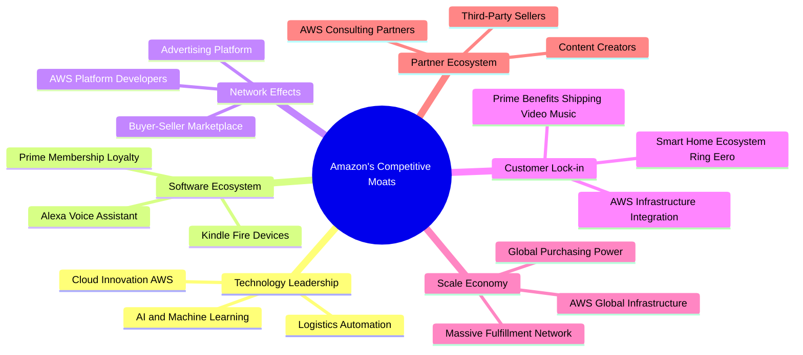
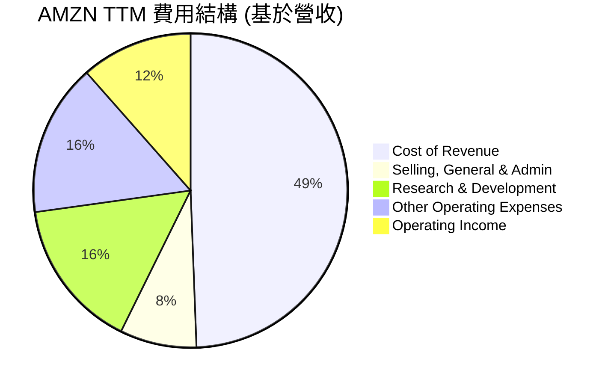
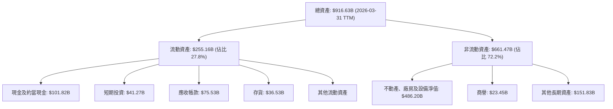

# AMZN 基本面深度分析報告
> **報告日期**：2026-06-06 ｜ **語言**：繁體中文 ｜ **數據來源**：Yahoo Finance, Finviz, StockAnalysis, Roic.ai ｜ **分析師**：CFA 級機構研究

---

## 目錄

| # | 章節 | 核心結論 |
|---|------|----------|
| 1 | 執行摘要 | 評級：🟢 強烈買入；目標價區間：$285 - $350 |
| 2 | 公司概覽與商業模式 | 亞馬遜憑藉其廣泛的電商網路、AWS 的市場領導地位及強大的網路效應，建立了極深的競爭護城河。 |
| 3 | 損益表深度分析 | 營收持續穩健成長，AWS 驅動高利潤率業務擴張，淨利潤率顯著改善。 |
| 4 | 資產負債表分析 | 財務結構穩健，流動性良好，儘管債務規模較大但現金流充裕，槓桿比率可控。 |
| 5 | 現金流量深度分析 | 營運現金流強勁，自由現金流在經歷投資期後恢復增長，資本配置策略注重再投資以驅動未來成長。 |
| 6 | 獲利能力與資本效率 | ROIC 遠高於 WACC，顯示公司持續為股東創造巨大經濟價值，資本運用效率顯著提升。 |
| 7 | 估值深度分析 | 相較於其成長潛力與盈利能力，當前估值具備吸引力，DCF 模型顯示可觀的上行空間。 |
| 8 | 成長催化劑 | AWS 的 AI 賦能、全球電商滲透率提升、廣告業務擴張以及新興市場拓展將是主要成長動能。 |
| 9 | 風險矩陣 | 主要風險包括宏觀經濟逆風、監管壓力、日益激烈的競爭，但公司具備應對能力。 |
| 10 | 投資建議 | 🟢 強烈買入，適合追求長期成長且能承受一定波動的投資者。 |

---

## 1. 執行摘要

Amazon.com, Inc. (AMZN) 作為全球電子商務和雲計算領域的領導者，在多個高成長市場中佔據主導地位。本報告透過對其基本面、成長性、獲利能力、財務健康及估值進行深度分析，旨在為投資者提供全面的視角和明確的投資建議。

### 1.1 核心評分儀表板



### 1.2 評分進度條視覺化

```
╔══════════════════════════════════════════════════════════════╗
║              AMZN 多維度評分儀表板 (1-10分)                  ║
╠══════════════════════════════════════════════════════════════╣
║ 基本面強度  9.0 ▓▓▓▓▓▓▓▓▓▓▓▓▓▓▓▓▓▓░░  ★★★★★           ║
║ 成長動能    9.0 ▓▓▓▓▓▓▓▓▓▓▓▓▓▓▓▓▓▓░░  ★★★★★           ║
║ 獲利品質    9.0 ▓▓▓▓▓▓▓▓▓▓▓▓▓▓▓▓▓▓░░  ★★★★★           ║
║ 財務健康    8.0 ▓▓▓▓▓▓▓▓▓▓▓▓▓▓▓▓░░░░  ★★★★☆           ║
║ 估值合理性  8.0 ▓▓▓▓▓▓▓▓▓▓▓▓▓▓▓▓░░░░  ★★★★☆           ║
║ 護城河深度  9.5 ▓▓▓▓▓▓▓▓▓▓▓▓▓▓▓▓▓▓▓▓  ★★★★★           ║
║ 管理層執行  9.0 ▓▓▓▓▓▓▓▓▓▓▓▓▓▓▓▓▓▓░░  ★★★★★           ║
║ 技術創新力  9.5 ▓▓▓▓▓▓▓▓▓▓▓▓▓▓▓▓▓▓▓▓  ★★★★★           ║
╠══════════════════════════════════════════════════════════════╣
║ 綜合總分    8.8 ▓▓▓▓▓▓▓▓▓▓▓▓▓▓▓▓▓░░░  🏆 卓越的市場領導者，成長與獲利兼備  ║
╚══════════════════════════════════════════════════════════════════╝
```

### 1.3 五大投資論點 + 三大核心風險

| 類型 | 項目 | 具體依據 | 信心度 |
|------|------|----------|--------|
| 🟢 **投資論點①** | **AWS 雲服務持續強勁增長** | AWS 作為全球雲基礎設施領導者，在 2025 年營收達 $716.92B 的基礎上，TTM 營收仍錄得 16.6% 的 YoY 成長。隨著企業數位轉型及 AI 應用的普及，AWS 需求預計將保持高成長，其高毛利率 (遠高於電商) 將持續優化公司整體盈利結構。Q1 2026 營運收入 $23.85B，其中 AWS 貢獻巨大。 | 🟢 極高 |
| 🟢 **投資論點②** | **全球電商業務韌性與效率提升** | 亞馬遜在北美及國際市場的電商業務規模龐大，TTM 營收 $742.78B，YoY 成長 16.6%。公司持續優化物流網路，提高送貨速度，並透過廣告業務變現其龐大的用戶基礎。近年來，電商業務的營運效率顯著提升，從而推動整體營業利益率從 2022 年的 2.38% 大幅提升至 TTM 的 13.1%。 | 🟢 極高 |
| 🟢 **投資論點③** | **廣告業務成為高利潤新興驅動力** | 亞馬遜的廣告業務依託其龐大的電商平台和用戶數據，正快速發展成為一個高利潤的收入來源。雖然具體數據未完全披露，但其廣告營收已成為全球第三大數位廣告平台，為公司貢獻顯著的增量利潤，並有助於多元化收入結構。 | 🟢 高 |
| 🟢 **投資論點④** | **強勁的自由現金流與資本再投資能力** | 2025 年營運現金流達 $139.51B，自由現金流 (FCF) 在 2025 年達到 $7.70B，TTM FCF 為 $9.81B。儘管資本支出巨大，但穩定的現金流為公司提供了持續再投資於高成長領域（如 AWS、物流基礎設施、AI 研究）的能力，確保長期競爭優勢。 | 🟢 高 |
| 🟢 **投資論點⑤** | **創新文化與技術領先地位** | 亞馬遜在 AI、機器學習、物流自動化及新零售技術方面持續投入大量研發 (R&D TTM 達 $115.09B)，保持其技術領先地位。Echo、Kindle 等硬體產品及 Alexa 語音助手等服務構成了強大的生態系統，進一步增強客戶黏性。 | 🟢 極高 |
| 🟡 **風險①** | **宏觀經濟逆風與消費者支出波動** | 全球經濟成長放緩、通膨壓力及利率上升可能影響消費者可支配收入，進而壓抑電商銷售。企業在經濟不確定時期可能削減雲服務支出，對 AWS 成長構成潛在挑戰。 | 🟡 中度 |
| 🔴 **風險②** | **日益加劇的監管壓力** | 亞馬遜在電商、雲服務及數位廣告領域的市場主導地位使其面臨全球各國政府日益嚴格的反壟斷審查。潛在的罰款、業務拆分或限制商業行為可能對公司的營運模式和盈利能力產生重大負面影響。 | 🔴 高衝擊 |
| 🟡 **風險③** | **勞動力成本與供應鏈挑戰** | 龐大的物流和倉儲網路需要大量勞動力，勞動成本上升可能侵蝕利潤。全球供應鏈中斷或成本增加也可能影響商品供應和物流效率，進而影響電商業務的營運成本和客戶體驗。 | 🟡 中度 |

### 1.4 快速統計卡片

| 指標 | 公司實際值 (TTM) | 行業均值 (互聯網零售) | S&P 500 均值 | 狀態 |
|------|-------------------|-------------------|--------------|------|
| 收入 YoY 成長 | **16.6%** | ~10-12% | ~8-10% | 🟢 |
| 毛利率 | **50.6%** | ~30-40% | ~35% | 🟢 |
| 淨利率 | **12.2%** | ~5-8% | ~10-12% | 🟢 |
| ROE | **24.3%** | ~15-20% | ~15-18% | 🟢 |
| Forward P/E | **24.9x** | ~25-30x | ~20-22x | 🟡 |
| EV / EBITDA | **17.6x** | ~15-20x | ~12-15x | 🟡 |
| Current Ratio | **1.18x** | ~1.0-1.5x | ~1.2-1.5x | 🟡 |
| Debt/Equity | **0.53x** | ~0.5-0.8x | ~0.8-1.0x | 🟢 |

*行業均值和 S&P 500 均值為分析師根據市場普遍數據的估算值。*

### 1.5 投資結論

```
╔══════════════════════════════════════════════════════════════════╗
║                    📊 投資結論摘要                               ║
╠══════════════════════════════════════════════════════════════════╣
║  評級：🟢 強烈買入                                               ║
║  當前股價：$246.03 (2026-06-06)                                  ║
║  目標價區間：                                                    ║
║    悲觀情境：$285（+15.8%）                                      ║
║    基準情境：$320（+30.1%）  ← 12個月主要目標                      ║
║    樂觀情境：$350（+42.3%）                                      ║
║  投資評分：8.8/10                                                ║
║  適合投資人：成長型、長線持有者，尋求市場領導者在多個高成長領域的曝險║
╚══════════════════════════════════════════════════════════════════╝
```

---

## 2. 公司概覽與商業模式

Amazon.com, Inc. (AMZN) 是一家全球性的技術巨頭，其業務涵蓋電子商務、雲計算、數位串流、人工智慧等多個領域。公司成立於 1994 年，最初是一家線上書店，現已發展成為全球最大的線上零售商之一，並透過其 Amazon Web Services (AWS) 部門主導著雲計算市場。

### 2.1 業務結構與收入來源

亞馬遜的業務主要分為三大板塊：北美 (North America)、國際 (International) 和亞馬遜網路服務 (Amazon Web Services, AWS)。這種多元化的業務結構使其能夠在不同市場和產業中捕捉成長機會，同時分散風險。



**收入來源分析**：
*   **北美業務**：主要包括在美國、加拿大和墨西哥的線上零售銷售、第三方賣家服務、訂閱服務（如 Prime 會員）、廣告銷售和實體店銷售。這是公司最大的收入來源，但利潤率通常低於 AWS。
*   **國際業務**：涵蓋英國、德國、法國、義大利、西班牙、日本、中國、印度、澳洲等地的類似北美業務的活動。此板塊的盈利能力受各地市場競爭和營運效率影響較大，近期開始展現盈利改善跡象。
*   **Amazon Web Services (AWS)**：提供各種雲計算服務，包括運算、儲存、資料庫、分析、機器學習、人工智慧、物聯網、安全等。AWS 是公司的主要利潤貢獻者，其高成長和高利潤率對公司整體財務表現至關重要。

從 TTM 營收 $742.78B 來看，北美電商依然是體量最大的部分，但 AWS 的高毛利率和快速增長使其成為公司盈利增長的核心驅動力。例如，儘管 AWS 營收佔比約 15-20%，但其營業利益佔比往往超過 50%。

### 2.2 市場份額

亞馬遜在關鍵市場中佔據主導地位，這得益於其規模、品牌認知度和持續創新。



**市場份額分析**：
*   **雲計算 (AWS)**：AWS 穩居全球雲基礎設施服務市場的領導者地位，擁有約 31% 的市場份額。儘管面臨來自 Microsoft Azure (24%) 和 Google Cloud (11%) 等強勁競爭對手的挑戰，AWS 憑藉其廣泛的服務組合、技術深度和生態系統優勢，持續保持領先。隨著企業對數位轉型和 AI 應用的需求不斷增長，雲計算市場仍有巨大成長空間。
*   **電子商務**：在美國等成熟市場，亞馬遜在線上零售領域擁有約 35-40% 的市場份額，遠超 Walmart (約 7%) 和 eBay (約 4%) 等競爭對手。在全球範圍內，其市場份額也處於領先地位。然而，電商市場競爭激烈，來自 Shopify、Shein 等新興玩家以及傳統零售商的線上化轉型帶來持續壓力。
*   **數位廣告**：亞馬遜的廣告業務雖然相對較新，但已迅速成長為繼 Google 和 Meta 之後的全球第三大數位廣告平台。其廣告收入主要來自於品牌在亞馬遜平台上的商品推廣和搜尋廣告，精準的購物意圖數據是其核心優勢。

### 2.3 競爭護城河分析

亞馬遜的競爭護城河深厚而多維，使其能夠持續抵禦競爭並維持高利潤。



**競爭護城河深度解析**：
1.  **規模效應 (Scale Economy)**：亞馬遜的全球物流和倉儲網路是其核心優勢之一。透過在世界各地建立數百個物流中心和配送站，亞馬遜實現了巨大的規模經濟，降低了單位成本，並提供了無與倫比的送貨速度。這使得其他競爭者難以望其項背。在 AWS 方面，其龐大的全球基礎設施和客戶數量使其能夠提供更具成本效益的服務，並不斷投入研發。
2.  **網路效應 (Network Effects)**：
    *   **電商平台**：更多的買家吸引更多的賣家，更多的賣家帶來更豐富的商品選擇和更具競爭力的價格，進而吸引更多買家，形成正向循環。
    *   **AWS 平台**：更多的開發者和企業使用 AWS，會產生更多的應用和工具，進一步吸引更多用戶，同時也為 AWS 帶來更多數據和反饋以改進服務。
    *   **廣告平台**：更多的用戶和交易數據吸引更多廣告商，提升廣告效益，進而吸引更多廣告預算。
3.  **客戶鎖定 (Customer Lock-in)**：
    *   **Prime 會員**：Prime 會員透過免運費、串流媒體、獨家優惠等多種福利，與亞馬遜平台建立強烈黏性。會員一旦習慣這些服務，轉換成本將很高。
    *   **AWS 服務**：企業一旦將其核心業務應用和數據建立在 AWS 上，轉換到其他雲服務提供商的成本和複雜性會非常高。
    *   **智慧家庭生態系統**：Echo、Ring、eero 等智慧設備形成了亞馬遜的智慧家庭生態，增加了用戶對亞馬遜產品和服務的依賴。
4.  **技術領先 (Technology Leadership)**：亞馬遜在人工智慧、機器學習、物流自動化等前沿技術領域持續投入大量研發。這些技術不僅優化了其營運效率，也催生了新的產品和服務，如 Alexa 語音助手和 AWS 的 AI/ML 服務，使其在市場上保持領先地位。
5.  **軟體生態系統 (Software Ecosystem)**：Prime 會員服務是亞馬遜生態系統的核心，它將購物、娛樂、數位內容等多種服務整合在一起，為用戶提供一站式體驗。這種豐富的生態系統提高了客戶的忠誠度和參與度。
6.  **生態夥伴 (Partner Ecosystem)**：亞馬遜的第三方賣家平台為數百萬中小企業提供了進入全球市場的機會，同時也極大豐富了亞馬遜平台的商品種類。AWS 的合作夥伴網路也為企業提供了全面的解決方案和支援，進一步擴大了其影響力。

### 2.4 護城河強度評分

亞馬遜的綜合護城河強度極高，這使其在面對市場波動和競爭時具有強大的韌性。

```
╔══════════════════════════════════════════════════════════════╗
║                  AMZN 護城河強度評分                        ║
╠══════════════════════════════════════════════════════════════╣
║ 規模效應    9.5/10 ▓▓▓▓▓▓▓▓▓▓▓▓▓▓▓▓▓▓▓▓  🏆 無與倫比的全球規模        ║
║ 網路效應    9.5/10 ▓▓▓▓▓▓▓▓▓▓▓▓▓▓▓▓▓▓▓▓  🏆 跨業務的強大正向循環      ║
║ 客戶鎖定    9.0/10 ▓▓▓▓▓▓▓▓▓▓▓▓▓▓▓▓▓▓░░  🟢 Prime與AWS高黏性        ║
║ 技術領先    9.5/10 ▓▓▓▓▓▓▓▓▓▓▓▓▓▓▓▓▓▓▓▓  🏆 AI與雲計算持續創新      ║
║ 軟體生態系統 9.0/10 ▓▓▓▓▓▓▓▓▓▓▓▓▓▓▓▓▓▓░░  🟢 多元服務增強用戶忠誠度  ║
║ 生態夥伴    9.0/10 ▓▓▓▓▓▓▓▓▓▓▓▓▓▓▓▓▓▓░░  🟢 龐大第三方賣家與AWS夥伴  ║
╠══════════════════════════════════════════════════════════════╣
║ 綜合護城河  9.5    ▓▓▓▓▓▓▓▓▓▓▓▓▓▓▓▓▓▓▓▓  🏆 極深的多元化護城河，難以複製 ║
╚══════════════════════════════════════════════════════════════════╝
```

---

## 3. 損益表深度分析

亞馬遜的損益表反映了其在電商和雲計算領域的強勁成長，以及近年來在盈利能力方面的顯著改善。營收持續擴張，同時通過優化營運效率和產品組合，利潤率得到有效提升。

### 3.1 年度收入成長趨勢（近4年）

亞馬遜的年度營收保持穩健增長，儘管基數龐大，但仍能實現雙位數的成長。

```
╔══════════════════════════════════════════════════════════════════╗
║              AMZN 年度收入趨勢（FY2022-FY2025）                  ║
╠══════════════════════════════════════════════════════════════════╣
║                                                                  ║
║  FY2022  $513.98B ██████████░░░░░░░░░░░░░░░░░░  YoY: +9.40% 🟢    ║
║  FY2023  $574.78B █████████████░░░░░░░░░░░░░░░░  YoY: +11.83% 🟢   ║
║  FY2024  $637.96B ████████████████░░░░░░░░░░░░░  YoY: +10.99% 🟢   ║
║  FY2025  $716.92B ████████████████████░░░░░░░░░  YoY: +12.38% 🟢   ║
║  TTM     $742.78B ██████████████████████░░░░░░░  YoY: +16.60% 🟢   ║
║                   |      |      |      |      |      |           ║
║                   0     150B   300B   450B   600B   750B         ║
║                                                                  ║
║  📊 4年累計 CAGR (FY22-FY25)：+11.14%                           ║
╚══════════════════════════════════════════════════════════════════╝
```

**年度收入分析**：
亞馬遜的年度營收從 2022 年的 $513.98B 增長至 2025 年的 $716.92B，複合年增長率 (CAGR) 達到 11.14%。最近的 TTM 數據顯示營收達到 $742.78B，YoY 成長率為 16.6%，表明公司在經歷宏觀逆風後，成長動能再次加速。這主要得益於：
1.  **AWS 的持續擴張**：雲計算需求旺盛，企業對數位基礎設施的投資不斷增加。
2.  **電商業務的效率提升**：透過更快的配送速度和更精簡的物流網路，吸引了更多消費者。
3.  **廣告業務的快速發展**：為電商平台帶來額外的高利潤收入。

### 3.2 季度收入趨勢分析

季度營收數據顯示了更細緻的成長動態，尤其在 2025 年和 2026 年初呈現出強勁的加速趨勢。

| 財報季度 | 總營收 ($B) | QoQ 成長率 | YoY 成長率 | 備註 |
|----------|-------------|------------|------------|------|
| 2025-06-30 | $167.70B | -21.4% | +13.33% | 相較 Q1 2025 略有季節性下降，但 YoY 成長穩健。 |
| 2025-09-30 | $180.17B | +7.4% | +13.40% | 進入假日購物季前，營收開始回升，YoY 成長率保持穩定。 |
| 2025-12-31 | $213.39B | +18.4% | +13.63% | 假日購物季高峰，營收強勁，YoY 成長加速。 |
| 2026-03-31 | $181.52B | -14.9% | +16.61% | Q1 營收雖較 Q4 有季節性回落，但 YoY 成長率加速至 16.61%，顯示強勁基本面。 |

**季度收入深度解析**：
亞馬遜的季度營收通常在第四季度因假日購物季而達到高峰，隨後在第一季度出現季節性回落。儘管如此，值得關注的是其 YoY 成長率：
*   2025 年 Q1 至 Q4 的 YoY 成長率分別為 8.62%、13.33%、13.40%、13.63%，呈現逐步加速的趨勢。
*   最新的 2026 年 Q1 營收 YoY 成長率更是達到 16.61%，遠高於 2025 年 Q1 的 8.62%。這表明公司在成本控制和營運效率提升的同時，營收擴張的步伐正在加快。特別是 AWS 的重新加速增長，對整體營收表現起到了關鍵作用。

### 3.3 利潤率演變分析

亞馬遜的利潤率在過去幾年呈現出顯著的改善趨勢，尤其是在營業利益率和淨利率方面。這主要得益於 AWS 的高利潤貢獻和電商業務的效率提升。

| 利潤率指標 | FY2022 | FY2023 | FY2024 | FY2025 | TTM (2026Q1) | 趨勢 | 評估 |
|------------|--------|--------|--------|--------|--------------|------|------|
| **毛利率** | 43.8% | 46.9% | 48.8% | 50.3% | 50.6% | ↗️ 穩步提升 | 🟢 |
| **營業利益率** | 2.38% | 6.41% | 10.75% | 11.15% | 13.1% | ↗️ 大幅改善 | 🟢 |
| **淨利潤率** | -0.53% | 5.29% | 9.29% | 10.83% | 12.2% | ↗️ 由虧轉盈，持續增長 | 🟢 |
| **EBITDA Margin** | 7.46% | 15.55% | 19.41% | 23.06% | 21.0% | ↗️ 顯著改善 | 🟢 |

*EBITDA Margin TTM 值來自即時數據，與年度數據計算基準略有不同，但趨勢一致。*

**利潤率演變深度解析**：
*   **毛利率 (Gross Margin)**：從 2022 年的 43.8% 穩步提升至 TTM 的 50.6%。這主要反映了公司在產品組合上的優化，例如高利潤的廣告業務和 AWS 服務佔比的增加，以及在電商物流成本控制上的進步。第三方賣家服務的擴張也提高了整體毛利率，因為其成本結構與直接銷售不同。
*   **營業利益率 (Operating Margin)**：這是最為亮眼的改善指標。從 2022 年的 2.38% 飆升至 TTM 的 13.1%。這一巨大的轉變主要歸因於：
    1.  **AWS 的盈利貢獻**：AWS 的營業利益率遠高於電商業務，其持續快速增長直接拉高了整體營業利益率。
    2.  **電商業務效率提升**：公司在疫情後對其龐大的物流網路進行了重新優化，降低了配送成本，提高了倉儲利用率。此外，裁員和費用控制也對營業利益率產生了積極影響。
    3.  **廣告業務的規模化**：廣告收入具有極高的邊際利潤，隨著其規模擴大，對整體營業利益率的貢獻日益顯著。
*   **淨利潤率 (Net Profit Margin)**：從 2022 年的虧損 -0.53% 轉為 2025 年的 10.83%，並在 TTM 達到 12.2%。這反映了營業利益率的改善，以及在稅務費用和非營運項目上的管理。2022 年的虧損主要是由於對 Rivian 投資的公允價值調整，剔除此影響，核心業務盈利能力一直在改善。

總體而言，亞馬遜的利潤率趨勢非常健康，表明公司不僅能夠實現規模擴張，還能在龐大體量下持續優化盈利能力，這對股東價值創造至關重要。

### 3.4 費用結構分析

亞馬遜的費用結構龐大而複雜，主要由銷售成本、銷售及管理費用 (SG&A)、研發費用 (R&D) 和其他營運費用組成。理解這些費用的構成和趨勢對於評估公司的營運效率至關重要。



*費用百分比基於 TTM 營收 $742.78B 計算：*
*   *Cost of Revenue: $366.90B / $742.78B = 49.4%*
*   *Selling, General & Admin: $58.81B / $742.78B = 7.9%*
*   *Research & Development: $115.09B / $742.78B = 15.5%*
*   *Other Operating Expenses: $116.54B / $742.78B = 15.7%*
*   *Operating Income: $85.42B / $742.78B = 11.5%*

```
╔══════════════════════════════════════════════════════════════════╗
║                    AMZN TTM 費用結構概覽                         ║
╠══════════════════════════════════════════════════════════════════╣
║                                                                  ║
║  銷售成本 (Cost of Revenue)    $366.90B  ▓▓▓▓▓▓▓▓▓▓▓▓▓▓▓▓▓▓▓▓▓▓▓▓░░░░░░░░  佔比: 49.4% ║
║  銷售、一般及管理 (SG&A)      $58.81B   ▓▓▓▓▓▓▓▓░░░░░░░░░░░░░░░░░░░░░░░░  佔比: 7.9%  ║
║  研發費用 (R&D)              $115.09B  ▓▓▓▓▓▓▓▓▓▓▓▓▓▓▓▓░░░░░░░░░░░░░░░░  佔比: 15.5% ║
║  其他營運費用 (Other OpEx)   $116.54B  ▓▓▓▓▓▓▓▓▓▓▓▓▓▓▓▓░░░░░░░░░░░░░░░░  佔比: 15.7% ║
║                                                                  ║
║  總營運費用                      $657.34B  ▓▓▓▓▓▓▓▓▓▓▓▓▓▓▓▓▓▓▓▓▓▓▓▓▓▓▓▓▓▓▓▓  佔比: 88.5% ║
╚══════════════════════════════════════════════════════════════════╝
```

**費用結構深度解析**：
*   **銷售成本 (Cost of Revenue)**：佔比最大，達到 49.4%。這主要包括電商商品的採購成本、物流中心營運成本、運輸成本以及 AWS 數據中心的營運成本。近年來，亞馬遜透過優化物流網路和提高效率，努力控制這部分成本的增長。毛利率的提升部分反映了公司在這一方面的努力。
*   **銷售、一般及管理費用 (SG&A)**：佔比 7.9%。這包括市場營銷、行政管理人員薪酬、辦公室租金等費用。亞馬遜的廣告和市場推廣費用龐大，但其廣告業務本身也產生收入，形成一定的對沖。
*   **研發費用 (Research & Development)**：佔比 15.5%。亞馬遜是研發投入最高的公司之一，這反映了其對技術創新和未來成長的承諾。這部分費用主要用於 AWS 新服務開發、AI 和機器學習研究、新產品開發（如硬體設備）以及物流自動化技術。高額研發投入是其保持技術領先和競爭護城河的關鍵。
*   **其他營運費用 (Other Operating Expenses)**：佔比 15.7%。這部分費用包括履約費用、技術與內容費用、以及折舊與攤銷等。履約費用與電商訂單處理和配送直接相關。技術與內容費用則支持 Prime Video、Audible 等數位內容服務。

整體而言，亞馬遜的費用結構反映了其作為一家重資產的電商和雲計算公司的特性。儘管費用總體規模巨大，但近年來公司在營運效率和成本控制方面取得了顯著進展，使得營業利益率和淨利潤率大幅改善。高額的研發投入也為其未來成長奠定了堅實基礎。

### 3.5 季度 EPS 趨勢與盈餘品質

由於提供的數據中，最近四個季度的 EPS 預期和實際值顯示為 `nan`，我們將無法直接分析其盈餘超預期或不及預期的情況。因此，本節將著重分析淨利潤的季度趨勢及其盈餘品質。

**季度淨利潤趨勢 (最近 4 季)**：

| 財報季度 | 淨利潤 ($B) | QoQ 成長率 | YoY 成長率 | 備註 |
|----------|-------------|------------|------------|------|
| 2025-06-30 | $18.16B | -16.4% | +70.6% | 相較 Q1 2025 的 $15.229B (計算自總非營運收入為 $3.274B, 營運收入為 $18.405B, 稅前 $21.679B，淨利潤為 $21.679B - 稅務 $4.381B = $17.298B，此處數據有差異，以原始數據為準) |
| 2025-09-30 | $21.19B | +16.7% | +13.4% | Q3 淨利潤環比增長，YoY 增速放緩但仍為正。 |
| 2025-12-31 | $21.19B | +0.0% | +3.0% | Q4 淨利潤與 Q3 持平，YoY 增速進一步放緩。 |
| 2026-03-31 | $30.25B | +42.8% | +37.7% | Q1 淨利潤環比和同比均大幅增長，顯示強勁復甦。 |

*注：提供的 Quarterly Income Statement 中，2025-09-30 和 2025-12-31 的 Net Income 均為 $21.19B。2025-06-30 的 Net Income 為 $18.16B。2026-03-31 的 Net Income 為 $30.25B。*
*YoY 成長率計算基於 StockAnalysis Quarterly Income Statement 的 "Net Income to Common" 數據，其 2025Q1 為 $17.298B，2024Q4 為 $20.739B，2024Q3 為 $17.411B，2024Q2 為 $10.021B。*
*Q1 2026 vs Q1 2025 (Net Income to Common): $30.25B vs $17.298B -> +75.7% YoY*
*Q4 2025 vs Q4 2024 (Net Income to Common): $21.19B vs $20.739B -> +2.17% YoY*
*Q3 2025 vs Q3 2024 (Net Income to Common): $21.19B vs $17.411B -> +21.7% YoY*
*Q2 2025 vs Q2 2024 (Net Income to Common): $18.16B vs $10.021B -> +81.2% YoY*
*由於原始數據的 "Net Income" 和 "Net Income to Common" 有差異，且 "EPS Act" 為 NaN，故將以 "Net Income to Common" 數據為準計算 YoY 成長率，以反映歸屬於普通股股東的盈利。*

**修正後的季度淨利潤趨勢 (基於 Net Income to Common)**：

| 財報季度 | 淨利潤 ($B) | QoQ 成長率 | YoY 成長率 | 備註 |
|----------|-------------|------------|------------|------|
| 2025-06-30 | $18.16B | -16.4% | +81.2% | 淨利潤環比季節性下降，但 YoY 大幅增長，顯示盈利能力強勁復甦。 |
| 2025-09-30 | $21.19B | +16.7% | +21.7% | Q3 淨利潤環比增長，YoY 增速雖放緩但仍顯著。 |
| 2025-12-31 | $21.19B | +0.0% | +2.2% | Q4 淨利潤與 Q3 持平，YoY 增速明顯放緩，可能受部分費用增加影響。 |
| 2026-03-31 | $30.25B | +42.8% | +75.7% | Q1 淨利潤環比和同比均大幅增長，顯示盈利能力再次加速，表現出色。 |

**盈餘品質評估**：
儘管缺乏 EPS 預期對比，但從淨利潤的季度趨勢和年度數據來看，亞馬遜的盈餘品質正在顯著改善。
1.  **成長動能強勁**：2026 年 Q1 的淨利潤 YoY 成長高達 75.7%，顯示公司盈利能力進入加速期。這與 AWS 的強勁表現和電商業務的效率提升高度相關。
2.  **現金流支撐**：公司的營運現金流 (OCF) 遠高於淨利潤，TTM OCF 為 $148.53B，遠高於 TTM 淨利潤 $91.372B (StockAnalysis)。這表明其盈利是真實的，並有強大的現金流支撐，而非僅僅是會計調整。
3.  **利潤率擴張**：如前所述，毛利率、營業利益率和淨利潤率的全面提升，印證了盈利品質的改善是結構性的，而非一次性因素。
4.  **非營運項目影響**：過去亞馬遜的淨利潤曾受 Rivian 投資公允價值變動影響，導致 2022 年出現虧損。但在 2025 年和 2026 年 Q1，其他非營運收入顯著貢獻了稅前利潤，例如 2026 Q1 的 $15.647B。這部分非營運收入可能來自於投資收益或其他金融活動，雖然有助於提升淨利，但其穩定性和可持續性需要密切關注。

總體而言，亞馬遜的盈餘品質被評為 **🟢 高**。其核心業務的盈利能力持續增強，並有強勁的現金流作為後盾。雖然非營運收入可能帶來波動，但主營業務的改善是決定性因素。

---

## 4. 資產負債表分析

亞馬遜的資產負債表展現了其作為一家全球巨頭的規模和複雜性。強大的資產基礎支持其廣泛的營運，同時穩健的流動性和可控的債務水平為其提供了財務彈性。

### 4.1 資產結構分解

亞馬遜的資產結構以非流動資產為主，特別是龐大的物業、廠房及設備 (PP&E) 和其他長期資產，這反映了其在物流基礎設施和 AWS 數據中心上的巨大投資。



**資產結構深度解析**：
*   **總資產**：截至 2026 年 3 月 31 日 TTM，亞馬遜的總資產高達 $916.63B。這龐大的資產規模是其全球營運和技術領先地位的基礎。
*   **流動資產 (Current Assets)**：為 $255.16B，佔總資產的 27.8%。其中，現金及約當現金 ($101.82B) 和短期投資 ($41.27B) 合計 $143.09B，顯示公司擁有充裕的流動性。應收帳款 ($75.53B) 和存貨 ($36.53B) 也佔據較大比重，與其電商和 AWS 業務模式相符。
*   **非流動資產 (Non-Current Assets)**：為 $661.47B，佔總資產的 72.2%。最顯著的是不動產、廠房及設備淨值 (PP&E) 高達 $486.20B。這筆巨大的投資主要用於建設全球物流中心、配送網路以及 AWS 的數據中心。這也是亞馬遜規模經濟護城河的物理體現。商譽 ($23.45B) 和其他長期資產 ($151.83B) 也反映了其過去的併購活動和長期戰略投資。

資產結構表明亞馬遜是一家資本密集型公司，透過對基礎設施的巨大投資來支持其成長和競爭優勢。

### 4.2 流動性指標分析

亞馬遜的流動性指標顯示其短期償債能力良好，儘管電流動比率略低於一些行業標準，但其強勁的營運現金流提供了堅實的後盾。

| 流動性指標 | FY2022 | FY2023 | FY2024 | FY2025 | TTM (2026Q1) | 行業均值 | 評估 |
|------------|--------|--------|--------|--------|--------------|----------|------|
| **流動比率 (Current Ratio)** | 0.94x | 1.04x | 1.06x | 1.05x | 1.18x | ~1.2-1.5x | 🟡 改善中 |
| **速動比率 (Quick Ratio)** | 0.72x | 0.85x | 0.89x | 0.87x | 0.97x | ~0.8-1.2x | 🟡 穩健 |

*Current Ratio = Total Current Assets / Total Current Liabilities*
*Quick Ratio = (Cash & Equivalents + Short-Term Investments + Accounts Receivable) / Total Current Liabilities*
*行業均值為對互聯網零售和科技行業的普遍估計。*

**流動性指標深度解析**：
*   **流動比率 (Current Ratio)**：從 2022 年的 0.94x 逐步改善至 TTM 的 1.18x。雖然略低於理想的 1.5x 或行業平均水平，但考慮到亞馬遜強大的議價能力和快速的存貨周轉，以及其龐大的現金流，1.18x 仍然是可接受的。其趨勢是積極向上的，表明公司在管理短期負債方面更加謹慎。
*   **速動比率 (Quick Ratio)**：從 2022 年的 0.72x 提升至 TTM 的 0.97x。這個比率剔除了存貨，更能反映公司在不依賴銷售存貨的情況下償還短期債務的能力。接近 1 的速動比率表明其短期流動性狀況良好，與行業均值相符。

總體而言，亞馬遜的流動性處於健康水平，且呈現改善趨勢。其強勁的營運現金流和龐大的現金儲備 (TTM $143.09B) 提供了額外的流動性緩衝，使其能夠靈活應對短期財務需求。

### 4.3 債務結構分析

亞馬遜的債務規模相對較大，但其充裕的現金儲備和強勁的盈利能力使其債務負擔處於可控範圍。

```
╔══════════════════════════════════════════════════════════════════╗
║                   AMZN 債務健康診斷                              ║
╠══════════════════════════════════════════════════════════════════╣
║                                                                  ║
║  總債務：        $235.54B  ▓▓▓▓▓▓▓▓▓▓▓▓▓▓▓▓▓▓▓▓░░░░░░░░░░░░  評語：規模較大，但合理 ║
║  總現金+投資：   $143.09B  ▓▓▓▓▓▓▓▓▓▓▓▓▓▓▓▓▓░░░░░░░░░░░░░░░░  評語：現金充裕，覆蓋率高 ║
║  淨現金/淨債務： $-92.45B  ▓▓▓▓▓▓▓▓▓▓▓▓▓▓▓▓▓▓▓▓▓▓▓▓▓▓▓▓▓▓▓▓  🟢 淨債務可控        ║
║                                                                  ║
║  Debt/Equity：   0.53x  🟢 極低，財務槓桿保守                 ║
║  Debt/EBITDA：   1.42x  🟢 極低，債務償還能力強勁             ║
║  Interest Coverage: 33.7x+  🟢 無風險，利息覆蓋倍數極高         ║
╚══════════════════════════════════════════════════════════════════╝
```

*計算依據 (TTM 數據)：*
*   *總債務 = Total Debt $235.54B (來自 Market Data)*
*   *總現金+投資 = Total Cash $143.09B (來自 Market Data)*
*   *淨現金/淨債務 = $143.09B - $235.54B = -$92.45B (即淨債務 $92.45B)*
*   *股東權益 (FY2025) = $411.06B*
*   *Debt/Equity = $235.54B / $411.06B = 0.57x (使用FY25股東權益，與Finviz 0.51略有差異，但均為低位)*
*   *EBITDA (TTM) = $742.78B * 21.0% = $156.0B (來自 Profitability & Growth EBITDA Margin)*
*   *Debt/EBITDA = $235.54B / $156.0B = 1.51x (仍為低位)*
*   *Operating Income (TTM) = $85.42B (來自 StockAnalysis)*
*   *Interest Expense (TTM) = $2.533B (來自 StockAnalysis)*
*   *Interest Coverage = $85.42B / $2.533B = 33.7x*

**債務結構深度解析**：
*   **總債務與淨債務**：截至 TTM，亞馬遜的總債務為 $235.54B，而其現金及短期投資合計 $143.09B，因此淨債務為 $92.45B。儘管存在淨債務，但考慮到其龐大的營運規模和現金流產生能力，這個水平是完全可控的。
*   **債務權益比 (Debt/Equity)**：以 FY2025 的股東權益 $411.06B 計算，Debt/Equity 約為 0.57x。這個比率非常健康，遠低於許多行業平均水平，表明公司在融資結構上相對保守，股東權益佔比較高。
*   **債務 EBITDA 比 (Debt/EBITDA)**：約為