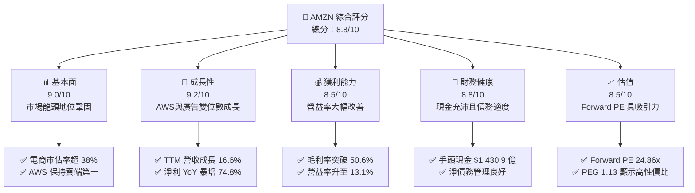

# AMZN 基本面深度分析報告

> **報告日期**：2026-06-08 ｜ **語言**：繁體中文 ｜ **數據來源**：Yahoo Finance, Finviz, StockAnalysis, Roic.ai ｜ **分析師**：CFA 級機構研究

---

## 目錄

| # | 章節 | 核心結論 |
|---|------|----------|
| 1 | **執行摘要** | 給予「強烈買入」評級，目標價 $312.79，上行空間 +27.55% |
| 2 | **公司概覽與商業模式** | 電商、雲端運算（AWS）與數位廣告三輪驅動，具備極深寬護城河 |
| 3 | **損益表深度分析** | 營收突破 $7,400 億，AI 雲端需求與廣告高利潤率推動淨利暴增 |
| 4 | **資產負債表分析** | 現金儲備達 $1,430.9 億，債務結構合理，資本結構安全 |
| 5 | **現金流量深度分析** | 營運現金流高達 $1,485.3 億，AI 資本支出飆升致 FCF 承壓 |
| 6 | **獲利能力與資本效率** | ROE 達 24.3%，ROIC 13.4% 遠高於 WACC 8.6%，強力創造價值 |
| 7 | **估值深度分析** | Forward P/E 24.86x 處歷史低位，DCF 敏感性分析顯示估值具吸引力 |
| 8 | **成長催化劑** | 生成式 AI 雲端服務（AWS Bedrock）與 Prime 影音廣告為核心驅動力 |
| 9 | **風險矩陣** | AI 資本支出回報不及預期與反壟斷監管為主要風險 |
| 10 | **投資建議** | 建議分批逢低佈局，適合長期成長型與核心資產配置投資者 |

---

## 1. 執行摘要

### 1.1 核心評分儀表板



### 1.2 評分進度條視覺化

```
╔══════════════════════════════════════════════════════════════╗
║               AMZN 多維度評分儀表板 (1-10分)                 ║
╠══════════════════════════════════════════════════════════════╣
║ 基本面強度  9.0 ▓▓▓▓▓▓▓▓▓▓▓▓▓▓▓▓▓▓░░  ★★★★★           ║
║ 成長動能    9.2 ▓▓▓▓▓▓▓▓▓▓▓▓▓▓▓▓▓▓▓░  ★★★★★           ║
║ 獲利品質    8.5 ▓▓▓▓▓▓▓▓▓▓▓▓▓▓▓▓░░░░  ★★★★☆           ║
║ 財務健康    8.8 ▓▓▓▓▓▓▓▓▓▓▓▓▓▓▓▓▓░░░  ★★★★★           ║
║ 估值合理性  8.5 ▓▓▓▓▓▓▓▓▓▓▓▓▓▓▓▓░░░░  ★★★★☆           ║
║ 護城河深度  9.5 ▓▓▓▓▓▓▓▓▓▓▓▓▓▓▓▓▓▓▓█  ★★★★★           ║
║ 管理層執行  9.0 ▓▓▓▓▓▓▓▓▓▓▓▓▓▓▓▓▓▓░░  ★★★★★           ║
║ 技術創新力  9.5 ▓▓▓▓▓▓▓▓▓▓▓▓▓▓▓▓▓▓▓█  ★★★★★           ║
╠══════════════════════════════════════════════════════════════╣
║ 綜合總分    8.8 ▓▓▓▓▓▓▓▓▓▓▓▓▓▓▓▓▓░░░  🏆 強烈買入          ║
╚══════════════════════════════════════════════════════════════╝
```

### 1.3 五大投資論點 + 三大核心風險

| 類型 | 項目 | 具體依據 | 信心度 |
|------|------|----------|--------|
| 🟢 **投資論點①** | **AWS AI 雲端加速增長** | AWS 在生成式 AI 基礎設施（Trainium/Inferentia 晶片）與 Bedrock 平台推動下，Q1 2026 營收加速成長，維持全球 31% 市佔率。 | 🟢 極高 |
| 🟢 **投資論點②** | **零售業務利潤率結構性改善** | 區域化物流網絡重組、配送路徑優化以及倉儲自動化（含機器人技術），使北美與國際零售業務利潤率創歷史新高。 | 🟢 高 |
| 🟢 **投資論點③** | **高利潤率廣告業務持續超預期** | Prime Video 默認廣告模式與贊助商品廣告（Sponsored Products）轉化率提升，推動 TTM 廣告收入快速擴張。 | 🟢 高 |
| 🟢 **投資論點④** | **強大的營運現金流支撐高 Capex** | TTM 營運現金流達 $1,485.3 億，足以全額支持創紀錄的 AI 基礎設施資本支出（FY25 Capex 達 $1,318.2 億），無需依賴外部高成本融資。 | 🟢 極高 |
| 🟢 **投資論點⑤** | **估值處於歷史性低位** | 當前 Forward P/E 僅 24.86x，相較於過去 5 年均值（>40x）與當前高達 21.61% 的未來 5 年預期 EPS 增速，估值極具性價比。 | 🟢 高 |
| 🟡 **風險①** | **AI 資本支出回報率（ROIC）稀釋** | FY25 資本支出狂飆至 $1,318.2 億，導致 TTM FCF 驟降至 $98.1 億。若 AI 雲端需求放緩，可能面臨嚴重的折舊壓力，拖累未來利潤率。 | 🟡 中度 |
| 🔴 **風險②** | **反壟斷與監管壓力** | 美國 FTC 及歐盟對 Amazon 平台「自我優待」（Self-preferencing）與排他性條款的訴訟持續進行，可能面臨巨額罰款或業務拆分風險。 | 🔴 高衝擊 |
| 🟡 **風險③** | **非營運損益波動性** | TTM 淨利中包含較高比例的「其他非營運收益」（如 Rivian 等股權投資公允價值變動，TTM 達 $281.3 億），盈餘品質（Quality of Earnings）需扣除此非經常性損益評估。 | 🟡 中度 |

### 1.4 快速統計卡片

| 指標 | 公司實際值 | 行業均值（網際網路零售） | S&P 500 均值 | 狀態 |
|------|-------------|----------|--------------|------|
| **營收 YoY 成長率** | **16.6%** | ~11.5% | ~5.5% | 🟢 優於行業 |
| **毛利率** | **50.6%** | ~35.0% | ~40.0% | 🟢 極強 |
| **營業利益率** | **13.1%** | ~6.5% | ~12.2% | 🟢 持續改善 |
| **淨利率** | **12.2%** | ~4.0% | ~10.5% | 🟢 創歷史新高 |
| **股東權益報酬率 (ROE)** | **24.3%** | ~12.0% | ~15.0% | 🟢 高效資本回報 |
| **預期本益比 (Forward P/E)** | **24.86x** | ~28.5x | ~21.5x | 🟢 估值合理 |
| **債務權益比 (Debt/Equity)** | **53.3%** | ~65.0% | ~115.0% | 🟢 財務穩健 |

### 1.5 投資結論

```
╔══════════════════════════════════════════════════════════════════╗
║                    📊 AMZN 投資結論摘要                          ║
╠══════════════════════════════════════════════════════════════════╣
║  評級：🟢 強烈買入 (Strong Buy)                                  ║
║  當前股價：$245.22 (2026-06-08)                                  ║
║  目標價區間：                                                    ║
║    悲觀情境：$207.00 (-15.58%)                                   ║
║    基準情境：$312.79 (+27.55%)  ← 12個月主要目標                 ║
║    樂觀情境：$370.00 (+50.88%)                                   ║
║  投資評分：8.8 / 10                                              ║
║  適合投資人：長期成長型、大型科技股配置者、AI 基礎設施主題投資者 ║
╚══════════════════════════════════════════════════════════════════╝
```

---

## 2. 公司概覽與商業模式

Amazon.com, Inc.（AMZN）是全球最大的線上零售商與雲端運算服務商。其核心商業模式已從最初的「單一零售」演變為「飛輪效應」（Flywheel Effect）驅動的多邊生態系統。

### 2.1 業務結構與收入來源

```mermaid
graph TD
    AMZN["AMZN 亞馬遜集團<br/>TTM 營收: $7,427.8 億<br/>市值: $2.64 兆"]

    NA["1. 北美零售<br/>營收佔比: ~58%<br/>主要驅動: Prime 會員、第三方賣家服務"]
    INT["2. 國際零售<br/>營收佔比: ~22%<br/>主要驅動: 新興市場滲透、物流基礎設施"]
    AWS["3. AWS 雲端服務<br/>營收佔比: ~16%<br/>主要驅動: 生成式 AI、企業雲端轉型"]
    ADS["4. 數位廣告<br/>營收佔比: ~4%<br/>主要驅動: 站內贊助廣告、Prime Video"]

    AMZN --> NA
    AMZN --> INT
    AMZN --> AWS
    AMZN --> ADS

    NA --> NA1["線上直營零售"]
    NA --> NA2["3P 第三方賣家服務 (佣金與物流 FBA)"]
