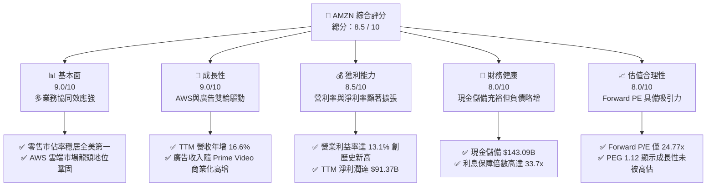

# AMZN 基本面深度分析報告

> **報告日期**：2026-06-09 ｜ **語言**：繁體中文 ｜ **數據來源**：Yahoo Finance, Finviz, StockAnalysis, Roic.ai ｜ **分析師**：CFA 級機構研究

---

## 目錄

| # | 章節 | 核心結論 |
|---|------|----------|
| 1 | 執行摘要 | 評級：**強烈買入 (Strong Buy)**；目標價：**$312.79** ｜ 具備 28.1% 潛在漲幅 |
| 2 | 公司概覽與商業模式 | 零售、廣告與 AWS 雲端三駕馬車並進，AI 基礎設施投入構建新一代高護城河 |
| 3 | 損益表深度分析 | TTM 營收達 **$742.78B** (YoY +16.6%)，淨利潤率提升至 **12.2%**，獲利結構大幅改善 |
| 4 | 資產負債表分析 | 手頭現金及短期投資達 **$143.09B**，債務槓桿安全，資產結構向重資產 AI 基礎設施傾斜 |
| 5 | 現金流量深度分析 | 經營現金流達 **$148.53B**，因 **$131.82B** 的極限資本支出，自由現金流短暫承壓於 **$9.81B** |
| 6 | 獲利能力與資本效率 | ROE 達 **24.3%**，ROIC 達 **13.43%** 顯著超越 WACC (10.8%)，持續為股東創造經濟增值 (EVA) |
| 7 | 估值深度分析 | 當前 Forward P/E 為 **24.77x**，低於歷史中位數；DCF 基準估值為 **$312.79** |
| 8 | 成長催化劑 | AWS 生成式 AI 商業化加速、Prime 廣告滲透率提升、以及物流網絡效率進一步優化 |
| 9 | 風險矩陣 | 核心風險在於 AI 資本支出回報不及預期、反壟斷監管審查及宏觀消費放緩 |
| 10 | 投資建議 | 適合長線成長型與科技板塊配置投資人，建議於 **$240** 以下分批逢低佈局 |

---

## 1. 執行摘要

### 1.1 核心評分儀表板



### 1.2 評分進度條視覺化

```
╔══════════════════════════════════════════════════════════════╗
║              AMZN 多維度評分儀表板 (1-10分)                 ║
╠══════════════════════════════════════════════════════════════╣
║ 基本面強度  9.0 ▓▓▓▓▓▓▓▓▓▓▓▓▓▓▓▓▓▓░░  ★★★★★           ║
║ 成長動能    9.0 ▓▓▓▓▓▓▓▓▓▓▓▓▓▓▓▓▓▓░░  ★★★★★           ║
║ 獲利品質    8.5 ▓▓▓▓▓▓▓▓▓▓▓▓▓▓▓▓▓░░░  ★★★★☆           ║
║ 財務健康    8.0 ▓▓▓▓▓▓▓▓▓▓▓▓▓▓▓▓░░░░  ★★★★☆           ║
║ 估值合理性  8.0 ▓▓▓▓▓▓▓▓▓▓▓▓▓▓▓▓░░░░  ★★★★☆           ║
║ 護城河深度  9.5 ▓▓▓▓▓▓▓▓▓▓▓▓▓▓▓▓▓▓▓░  ★★★★★           ║
║ 管理層執行  8.5 ▓▓▓▓▓▓▓▓▓▓▓▓▓▓▓▓▓░░░  ★★★★☆           ║
║ 技術創新力  9.0 ▓▓▓▓▓▓▓▓▓▓▓▓▓▓▓▓▓▓░░  ★★★★★           ║
╠══════════════════════════════════════════════════════════════╣
║ 綜合總分    8.5 ▓▓▓▓▓▓▓▓▓▓▓▓▓▓▓▓▓░░░  🏆 強烈買入          ║
╚══════════════════════════════════════════════════════════════╝
```

### 1.3 五大投資論點 + 三大核心風險

| 類型 | 項目 | 具體依據 | 信心度 |
|------|------|----------|--------|
| 🟢 **投資論點①** | **AWS 雲端與 AI 協同爆發** | Q1 2026 AWS 營收重回高成長，生成式 AI 服務 Bedrock 與自研晶片 Trainium 需求強勁。 | 🟢 極高 |
| 🟢 **投資論點②** | **利潤率結構性改善** | 營業利益率從 2022 年的 2.4% 暴增至 TTM 的 13.1%，主因物流網絡區域化改革及高利潤廣告業務佔比提升。 | 🟢 極高 |
| 🟢 **投資論點③** | **廣告業務成為新成長引擎** | 廣告 TTM 收入高增，Prime Video 廣告化與零售媒體網絡 (RMN) 變現能力傲視同業。 | 🟢 高 |
| 🟢 **投資論點④** | **估值處於歷史合理區間** | Forward P/E (24.77x) 接近歷史低位，相較於微軟及其他大型科技股具備更高性價比。 | 🟢 高 |
| 🟢 **投資論點⑤** | **強大的現金生成能力** | 經營現金流 (TTM) 達 $148.53B 的歷史新高，為龐大的 AI 資本支出提供最堅實的內部融資支持。 | 🟢 極高 |
| 🟡 **風險①** | **AI 資本支出回報滯後** | FY2025 資本支出高達 $131.82B，若 AI 商業化不及預期，可能導致折舊費用激增、壓低未來利潤率。 | 🟡 中度 |
| 🔴 **風險②** | **反壟斷監管與分拆風險** | FTC 及歐盟對 Amazon 平台「自我優待」及併購行為的審查持續收緊，可能面臨巨額罰款或業務重組。 | 🔴 高衝擊 |
| 🟡 **風險③** | **宏觀經濟與消費疲軟** | 零售板塊（佔營收大宗）對宏觀經濟、通膨及消費者可支配所得高度敏感，存在成長放緩風險。 | 🟡 中度 |

### 1.4 快速統計卡片

| 指標 | 公司實際值 (TTM) | 行業均值 (零售/雲端) | S&P 500 均值 | 狀態 |
|------|-------------|----------|--------------|------|
| **收入 YoY 成長** | **16.6%** | ~8.5% | ~5.2% | 🟢 顯著超越 |
| **毛利率** | **50.6%** | ~35.0% | ~45.0% | 🟢 極其強勁 |
| **營業利益率** | **13.1%** | ~6.0% | ~12.5% | 🟢 優於大盤 |
| **淨利率** | **12.2%** | ~4.5% | ~10.5% | 🟢 結構性改善 |
| **ROE** | **24.3%** | ~15.0% | ~18.0% | 🟢 資本效率極佳 |
| **Forward P/E** | **24.77x** | ~28.0x | ~21.5x | 🟢 估值具吸引力 |
| **PEG Ratio** | **1.12** | ~1.85 | ~1.60 | 🟢 成長性便宜 |

### 1.5 投資結論

```
╔══════════════════════════════════════════════════════════════════╗
║                    📊 AMZN 投資結論摘要                          ║
╠══════════════════════════════════════════════════════════════════╣
║  評級：🟢 強烈買入 (Strong Buy)                                  ║
║  當前股價：$244.19 (2026-06-09)                                  ║
║  目標價區間：                                                    ║
║    悲觀情境：$207.00 (-15.2%）- 宏觀衰退、AI 資本支出回報低      ║
║    基準情境：$312.79 (+28.1%）- AWS/廣告持續擴張、營利率維持高位 ║
║    樂觀情境：$370.00 (+51.5%）- 生成式 AI 爆發、零售利潤超預期   ║
║  投資評分：8.5 / 10                                              ║
║  適合投資人：追求長期資本增值、看好雲端與 AI 基礎設施的長線投資者 ║
╚══════════════════════════════════════════════════════════════════╝
```

---

## 2. 公司概覽與商業模式

Amazon (AMZN) 是一家無可爭議的全球商業與科技巨擘。