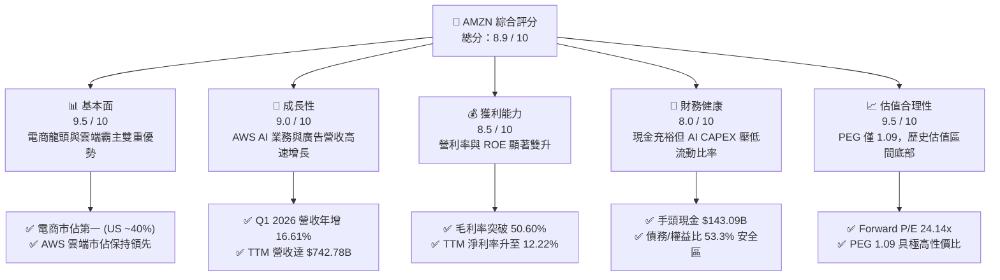
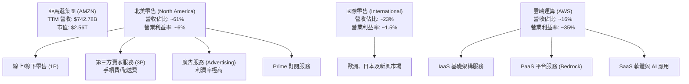
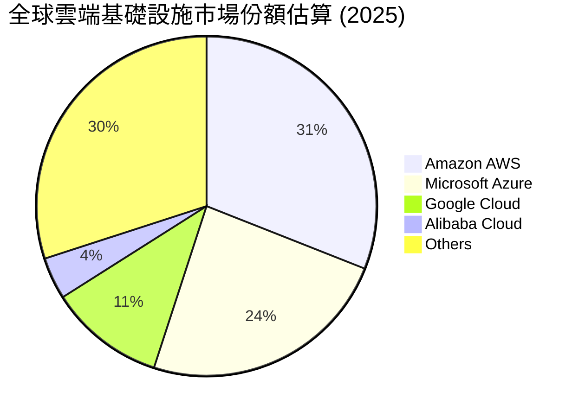
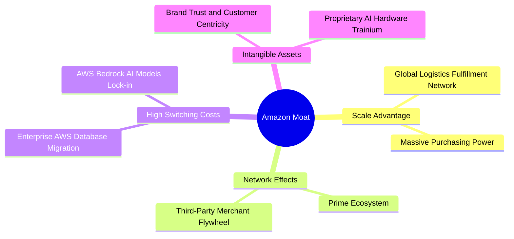

# AMZN 基本面深度分析報告
> **報告日期**：2026-06-10 ｜ **語言**：繁體中文 ｜ **數據來源**：Yahoo Finance, Finviz, StockAnalysis, Roic.ai ｜ **分析師**：CFA 級機構研究

---

## 目錄

| # | 章節 | 核心結論 |
|---|------|----------|
| 1 | 執行摘要 | **強烈買入**評級，基準目標價 **$312.71**，AI 基礎設施投資進入收割期 |
| 2 | 公司概覽與商業模式 | 三輪驅動（零售、AWS、廣告）建構無懈可擊的「飛輪效應」與極深護城河 |
| 3 | 損益表深度分析 | 營業利益率翻倍至 **13.1%**，Q1 2026 淨利年增 **64.7%** 展現強大營運槓桿 |
| 4 | 資產負債表分析 | 現金儲備達 **$143.09B**，雖因資本支出增加使負債微升，但整體流動性依然健康 |
| 5 | 現金流量深度分析 | 營運現金流達 **$148.53B**，生成式 AI Capex 達 **$131.82B**，短期壓制 FCF 但長線回報極高 |
| 6 | 獲利能力與資本效率 | ROE 攀升至 **24.3%**，ROIC 達 **14.16%** 顯著超越 WACC，持續創造股東價值 |
| 7 | 估值深度分析 | Forward P/E **24.14x** 處於歷史低位，相較於微軟與 Google 具備更高成長性溢價 |
| 8 | 成長催化劑 | AWS AI 晶片（Trainium/Inferentia）替代效應與 Prime 廣告變現為中短期核心驅動 |
| 9 | 風險矩陣 | 監管反壟斷、AI CAPEX 回報率不及預期為主要威脅，風險整體可控 |
| 10| 投資建議 | 具備 **31.4%** 潛在漲幅，建議中長線成長型與價值型投資人積極配置 |

---

## 1. 執行摘要

### 1.1 核心評分儀表板



### 1.2 評分進度條視覺化

```
╔══════════════════════════════════════════════════════════════╗
║              AMZN 多維度評分儀表板 (1-10分)                 ║
╠══════════════════════════════════════════════════════════════╣
║ 基本面強度  9.5 ▓▓▓▓▓▓▓▓▓▓▓▓▓▓▓▓▓▓▓░  ★★★★★           ║
║ 成長動能    9.0 ▓▓▓▓▓▓▓▓▓▓▓▓▓▓▓▓▓▓░░  ★★★★★           ║
║ 獲利品質    8.5 ▓▓▓▓▓▓▓▓▓▓▓▓▓▓▓▓▓░░░  ★★★★☆           ║
║ 財務健康    8.0 ▓▓▓▓▓▓▓▓▓▓▓▓▓▓▓▓░░░░  ★★★★☆           ║
║ 估值合理性  9.5 ▓▓▓▓▓▓▓▓▓▓▓▓▓▓▓▓▓▓▓░  ★★★★★           ║
║ 護城河深度  9.8 ▓▓▓▓▓▓▓▓▓▓▓▓▓▓▓▓▓▓▓▓  ★★★★★           ║
║ 管理層執行  9.0 ▓▓▓▓▓▓▓▓▓▓▓▓▓▓▓▓▓▓░░  ★★★★★           ║
║ 技術創新力  9.5 ▓▓▓▓▓▓▓▓▓▓▓▓▓▓▓▓▓▓▓░  ★★★★★           ║
╠══════════════════════════════════════════════════════════════╣
║ 綜合總分    8.9 ▓▓▓▓▓▓▓▓▓▓▓▓▓▓▓▓▓░░░  🏆 強烈買入          ║
╚══════════════════════════════════════════════════════════════╝
```

### 1.3 五大投資論點 + 三大核心風險

| 類型 | 項目 | 具體依據 | 信心度 |
|------|------|----------|--------|
| 🟢 **投資論點①** | **AWS 雲端與 AI 雙飛輪** | AWS 營收重回加速軌道，結合 Amazon Bedrock 與自研 AI 晶片，鎖定企業級生成式 AI 增量市場。 | 🟢 極高 |
| 🟢 **投資論點②** | **營運利潤率結構性擴張** | 零售業務區域化重組（Regionalization）成效顯著，TTM 營業利益率從 2022 年的 2.4% 飆升至 **13.1%**。 | 🟢 極高 |
| 🟢 **投資論點③** | **廣告業務高利潤高成長** | 廣告營收年增率維持在 20% 以上，Prime Video 廣告變現與第三方賣家廣告需求強勁，利潤率遠超傳統電商。 | 🟢 高 |
| 🟢 **投資論點④** | **估值性價比極具吸引力** | Forward P/E 降至 **24.14x**，PEG 僅 **1.09**，相較微軟（MSFT）與 Google（GOOGL）展現更高安全邊際。 | 🟢 極高 |
| 🟢 **投資論點⑤** | **自由現金流重回上行週期** | 雖然 FY2025 經歷高達 **$131.82B** 的資本支出，但隨著基礎設施利用率提升，TTM 營運現金流達 **$148.53B**，未來 FCF 彈性極大。 | 🟢 高 |
| 🟡 **風險①** | **反壟斷與監管壓力** | 美國 FTC 及歐盟對 Amazon 平台第三方賣家政策與市場壟斷地位的調查，可能面臨罰款或業務拆分風險。 | 🟡 中度 |
| 🔴 **風險②** | **AI 基礎設施資本支出過高** | FY2025 Capex 飆升至 **$131.82B**，若生成式 AI 商業化變現速度不及預期，將面臨折舊成本侵蝕利潤的風險。 | 🔴 高衝擊 |
| 🟡 **風險③** | **消費支出放緩** | 總體經濟不確定性可能壓抑北美及國際零售市場的非必需消費品需求。 | 🟡 中度 |

### 1.4 快速統計卡片

| 指標 | 公司實際值 | 行業均值（零售/雲端） | S&P 500 均值 | 狀態 |
|------|-------------|---------------------|--------------|------|
| **收入 YoY 成長** | **16.6%** | ~8.5% | ~5.5% | 🟢 顯著超越 |
| **毛利率** | **50.6%** | ~35.0% | ~30.0% | 🟢 極其強勁 |
| **營業利益率** | **13.1%** | ~6.5% | ~12.0% | 🟢 持續改善 |
| **ROE** | **24.3%** | ~15.0% | ~18.0% | 🟢 優異 |
| **Forward P/E** | **24.14x** | ~28.0x | ~22.0x | 🟢 估值合理 |
| **手頭現金 (AUM)** | **$143.09B** | ~$15.0B | ~$8.0B | 🟢 極為充沛 |

### 1.5 投資結論

```
╔══════════════════════════════════════════════════════════════════╗
║                    📊 AMZN 投資結論摘要                          ║
╠══════════════════════════════════════════════════════════════════╣
║  評級：🟢 強烈買入 (Strong Buy)                                  ║
║  當前股價：$238.00 (截至 2026-06-10)                             ║
║  目標價區間：                                                    ║
║    悲觀情境：$210.00 (-11.8%)                                    ║
║    基準情境：$312.71 (+31.4%)  ← 12個月主要目標                  ║
║    樂觀情境：$370.00 (+55.5%)                                    ║
║  投資評分：8.9 / 10                                              ║
║  適合投資人：長線價值成長型、科技與 AI 賽道配置者                ║
╚══════════════════════════════════════════════════════════════════╝
```

---

## 2. 公司概覽與商業模式

### 2.1 業務結構與收入來源

亞馬遜的業務由三大核心板塊驅動：北美零售（North America）、國際零售（International）以及雲端運算（AWS）。其中，廣告服務與第三方賣家服務正成為零售板塊內最高速增長且高毛利的子業務。



### 2.2 市場份額

在雲端運算（IaaS/PaaS）市場中，AWS 依然維持全球霸主地位，雖然微軟 Azure 與 Google Cloud 近年增速迅猛，但 AWS 在企業級應用的生態深度上仍具備領先優勢。



### 2.3 競爭護城河分析



### 2.4 護城河強度評分

```
╔══════════════════════════════════════════════════════════════╗
║                  AMZN 護城河強度評分                         ║
╠══════════════════════════════════════════════════════════════╣
║ 規模經濟效應   9.9/10 ▓▓▓▓▓▓▓▓▓▓▓▓▓▓▓▓▓▓▓▓  🏆 無人能及     ║
║ 網路效應       9.5/10 ▓▓▓▓▓▓▓▓▓▓▓▓▓▓▓▓▓▓▓░  🟢 極強         ║
║ 客戶鎖定/轉換  9.3/10 ▓▓▓▓▓▓▓▓▓▓▓▓▓▓▓▓▓▓░░  🟢 極高         ║
║ 品牌與無形資產 9.5/10 ▓▓▓▓▓▓▓▓▓▓▓▓▓▓▓▓▓▓▓░  🟢 極強         ║
╠══════════════════════════════════════════════════════════════╣
║ 綜合護城河評估 9.6/10 ▓▓▓▓▓▓▓▓▓▓▓▓▓▓▓▓▓▓▓░  🏆 寬廣護城河   ║
╚══════════════════════════════════════════════════════════════╝
```

---

## 3. 損益表深度分析

### 3.1 年度收入成長趨勢（近4年）

亞馬遜的營收在過去四年內展現出極為穩健的成長軌道，即使在基數已達數千億美元的情況下，依然維持雙位數的年複合增長率（CAGR）。

```
╔══════════════════════════════════════════════════════════════════╗
║              AMZN 年度收入趨勢（FY2022-TTM）                     ║
╠══════════════════════════════════════════════════════════════════╣
║                                                                  ║
║  FY2022  $513.98B  ██████████████░░░░░░░░░░░  YoY: +9.4%   🟢    ║
║  FY2023  $574.78B  ████████████████░░░░░░░░░  YoY: +11.8%  🟢    ║
║  FY2024  $637.96B  ██████████████████░░░░░░░  YoY: +11.0%  🟢    ║
║  FY2025  $716.92B  ████████████████████░░░░░  YoY: +12.4%  🟢    ║
║  TTM     $742.78B  █████████████████████░░░░  YoY: +16.6%  🟢    ║
║                   |      |      |      |      |                  ║
║                   0     150B   300B   450B   600B                ║
║                                                                  ║
║  📊 4年累計 CAGR：+11.16%                                        ║
╚══════════════════════════════════════════════════════════════════╝
```

### 3.2 季度收入趨勢分析

從季度數據來看，亞馬遜在 Q4 節日旺季具備強烈的季節性特徵。然而，Q1 2026 的營收達到了 **$181.52B**，同比增長 **16.61%**，這表明非季節性的核心需求（如 AWS 和廣告）正在加速增長。

| 財政季度 | 截止日期 | 季度營收 (Revenue) | 季增率 (QoQ) | 年增率 (YoY) | 核心驅動因素與備註 |
|----------|----------|--------------------|--------------|--------------|-------------------|
| **Q1 2026** | 2026-03-31 | **$181.52B** | -14.93% | **+16.61%** | 🟢 AWS AI 需求爆發與零售區域化效率提升 |
| **Q4 2025** | 2025-12-31 | **$213.39B** | +18.44% | **+13.63%** | 🟢 節日購物旺季，Prime 訂閱與廣告收入創歷史新高 |
| **Q3 2025** | 2025-09-30 | **$180.17B** | +7.43% | **