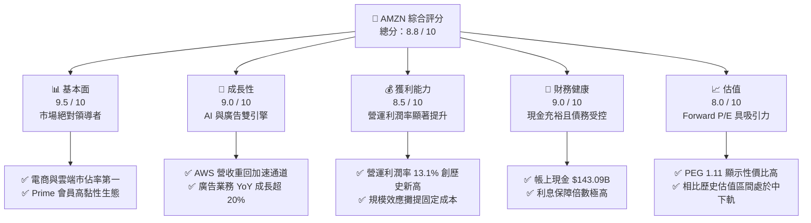
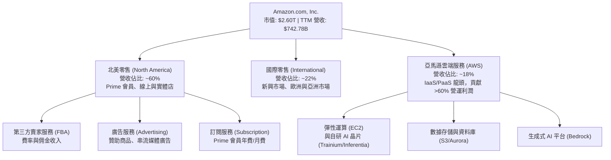

# AMZN 基本面深度分析報告

> **報告日期**：2026-06-11 ｜ **語言**：繁體中文 ｜ **數據來源**：Yahoo Finance, Finviz, StockAnalysis, Roic.ai ｜ **分析師**：CFA 級機構研究

---

## 目錄

| # | 章節 | 核心結論 |
|---|------|----------|
| 1 | 執行摘要 | AMZN 評級「強烈買入」，基準目標價 $312.71，具備 29.5% 潛在漲幅。 |
| 2 | 公司概覽與商業模式 | 零售、雲端（AWS）與廣告三輪驅動，具備極深的高轉換成本與規模經濟護城河。 |
| 3 | 損益表深度分析 | TTM 營收達 $742.78B（YoY +16.6%），營運利潤率改善至 13.1%，盈餘品質極高。 |
| 4 | 資產負債表分析 | 現金儲備達 $143.09B，債務結構健康，流動比率 1.18，具備極佳的財務韌性。 |
| 5 | 現金流量深度分析 | 營運現金流達 $148.53B，自由現金流（FCF）處於新一輪資本支出擴張週期起點。 |
| 6 | 獲利能力與資本效率 | ROE 達 24.3%，ROIC（13.42%）顯著高於 WACC（8.92%），持續創造超額股東價值。 |
| 7 | 估值深度分析 | Forward P/E 為 24.49x，相較歷史中位數低估；DCF 基準估值為 $312.00。 |
| 8 | 成長催化劑 | AWS 生成式 AI 商業化落地、廣告業務高毛利擴張及 Project Kuiper 衛星網路。 |
| 9 | 風險矩陣 | 核心風險為反壟斷監管、AI 資本支出回報率不及預期及宏觀消費疲軟。 |
| 10 | 投資建議 | 建議於 $240 以下逢低分批布局，長期持有，目標價區間 $207.00 - $370.00。 |

---

## 1. 執行摘要

### 1.1 核心評分儀表板



### 1.2 評分進度條視覺化

```
╔══════════════════════════════════════════════════════════════╗
║              AMZN 多維度評分儀表板 (1-10分)                 ║
╠══════════════════════════════════════════════════════════════╣
║ 基本面強度  9.5 ▓▓▓▓▓▓▓▓▓▓▓▓▓▓▓▓▓▓▓░  ★★★★★           ║
║ 成長動能    9.0 ▓▓▓▓▓▓▓▓▓▓▓▓▓▓▓▓▓▓░░  ★★★★★           ║
║ 獲利品質    8.5 ▓▓▓▓▓▓▓▓▓▓▓▓▓▓▓▓▓░░░  ★★★★☆           ║
║ 財務健康    9.0 ▓▓▓▓▓▓▓▓▓▓▓▓▓▓▓▓▓▓░░  ★★★★★           ║
║ 估值合理性  8.0 ▓▓▓▓▓▓▓▓▓▓▓▓▓▓░░░░░░  ★★★★☆           ║
║ 護城河深度  9.8 ▓▓▓▓▓▓▓▓▓▓▓▓▓▓▓▓▓▓▓█  ★★★★★           ║
║ 管理層執行  9.0 ▓▓▓▓▓▓▓▓▓▓▓▓▓▓▓▓▓▓░░  ★★★★★           ║
║ 技術創新力  9.5 ▓▓▓▓▓▓▓▓▓▓▓▓▓▓▓▓▓▓▓░  ★★★★★           ║
╠══════════════════════════════════════════════════════════════╣
║ 綜合總分    8.8 ▓▓▓▓▓▓▓▓▓▓▓▓▓▓▓▓▓░░░  🏆 強烈買入 (Buy)     ║
╚══════════════════════════════════════════════════════════════╝
```

### 1.3 五大投資論點 + 三大核心風險

| 類型 | 項目 | 具體依據 | 信心度 |
|------|------|----------|--------|
| 🟢 **投資論點①** | **AWS 雲端重回高成長** | Q1 2026 AWS 營收成長加速，生成式 AI（Bedrock、Trainium 晶片）需求爆發。 | 🟢 極高 |
| 🟢 **投資論點②** | **利潤率結構性改善** | 區域化配送網絡改革（Regionalization）成效顯著，TTM 營運利潤率達 13.1% 的歷史高位。 | 🟢 極高 |
| 🟢 **投資論點③** | **廣告業務成為暴利引擎** | 憑藉龐大的第一方電商數據，廣告業務 YoY 增速持續超越 20%，毛利率預估超 70%。 | 🟢 高 |
| 🟢 **投資論點④** | **資本效率（ROIC）回升** | 隨著早期重資產基礎設施投資進入回報期，ROIC 攀升至 13.42%，遠超 WACC 的 8.92%。 | 🟢 高 |
| 🟢 **投資論點⑤** | **Prime 生態系變現能力增強** | 串流媒體廣告（Prime Video）與第三方賣家服務（FBA）費率調整，推升利潤空間。 | 🟢 高 |
| 🟡 **風險①** | **AI 資本支出過大壓抑 FCF** | FY2025 資本支出高達 $131.82B，折舊費用增加，壓抑短期自由現金流（FCF TTM 僅 $9.81B）。 | 🟡 中度 |
| 🔴 **風險②** | **反壟斷監管與訴訟** | FTC 及歐盟對 Amazon 平台「雙重身份」及搭售行為的調查，可能面臨鉅額罰款或業務拆分。 | 🔴 高衝擊 |
| 🟡 **風險③** | **宏觀消費疲軟與通膨反彈** | 零售業務對消費者可支配所得高度敏感，若通膨反彈可能壓抑零售毛利率。 | 🟡 中度 |

### 1.4 快速統計卡片

| 指標 | 公司實際值 (TTM/2026-06-11) | 零售與雲端行業均值 | S&P 500 均值 | 狀態 |
|------|-------------|----------|--------------|------|
| **收入 YoY 成長** | **16.6%** | ~8.5% | ~5.2% | 🟢 領先 |
| **毛利率** | **50.6%** | ~35.0% | ~40.0% | 🟢 極強 |
| **營運利潤率** | **13.1%** | ~6.5% | ~12.2% | 🟢 優異 |
| **ROE** | **24.3%** | ~14.0% | ~18.0% | 🟢 高效 |
| **Forward P/E** | **24.49x** | ~28.5x | ~21.5x | 🟢 具吸引力 |
| **PEG Ratio** | **1.11** | ~1.85 | ~1.50 | 🟢 顯著低估 |
| **淨債務/EBITDA** | **0.56x** | ~1.50x | ~1.60x | 🟢 極佳 |

### 1.5 投資結論

```
╔══════════════════════════════════════════════════════════════════╗
║                    📊 AMZN 投資結論摘要                          ║
╠══════════════════════════════════════════════════════════════════╣
║  評級：🟢 強烈買入 (Strong Buy)                                 ║
║  當前股價：$241.51 (2026-06-11)                                  ║
║  目標價區間：                                                    ║
║    悲觀情境：$207.00 (-14.3%) - 估值收縮至 20x Forward P/E       ║
║    基準情境：$312.71 (+29.5%) - AWS 穩健，廣告與零售利潤釋放    ║
║    樂觀情境：$370.00 (+53.2%) - AI 貢獻超預期，FCF 暴增          ║
║  投資評分：8.8 / 10                                              ║
║  適合投資人：成長型、長線價值持有者、AI 基礎設施佈局者           ║
╚══════════════════════════════════════════════════════════════════╝
```

---

## 2. 公司概覽與商業模式

### 2.1 業務結構與收入來源

Amazon 的商業模式已成功從「低毛利零售」轉型為「高毛利平台與服務」的多維生態系統。



### 2.2 市場份額

根據 20