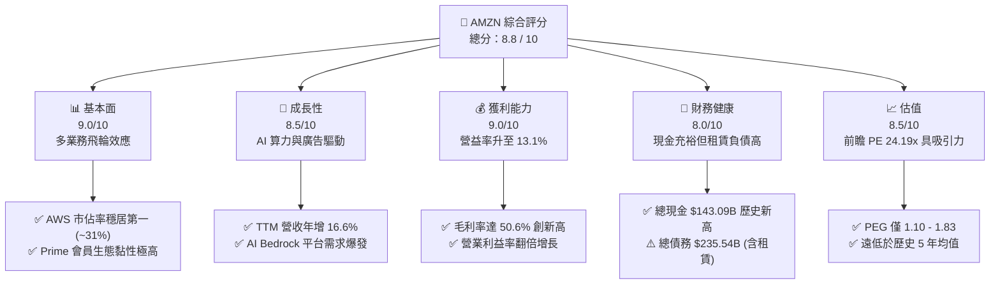
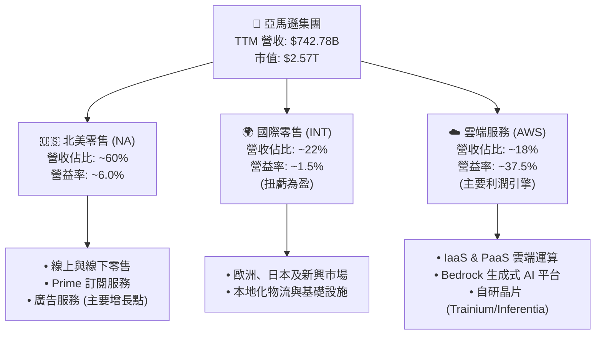
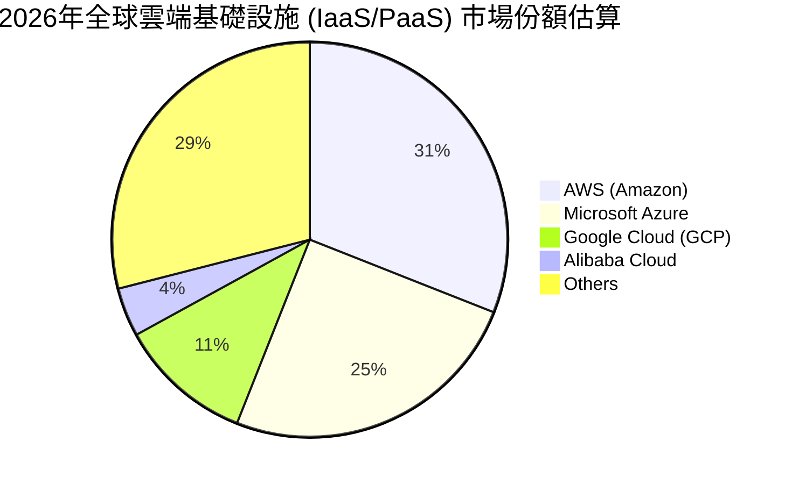
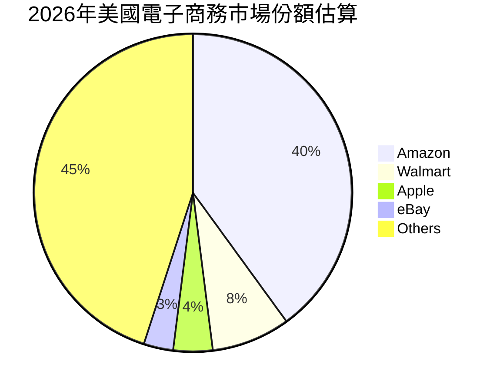
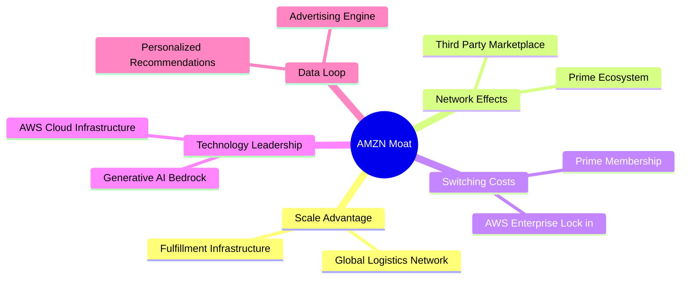
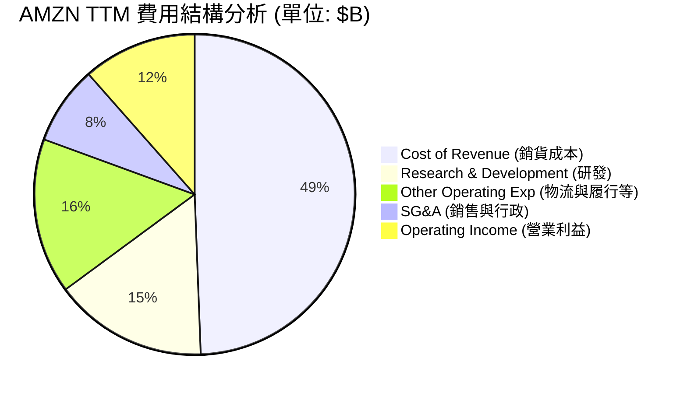
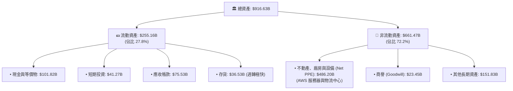
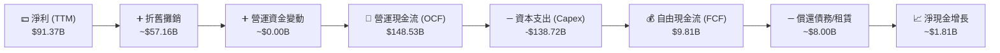
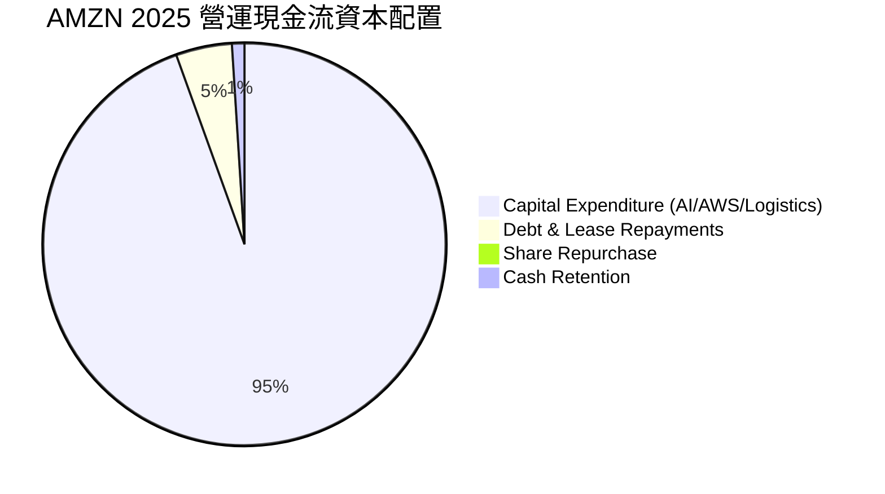

# AMZN 基本面深度分析報告

> **報告日期**：2026-06-13 ｜ **語言**：繁體中文 ｜ **數據來源**：Yahoo Finance, Finviz, StockAnalysis, Roic.ai ｜ **分析師**：CFA 級機構研究

---

## 目錄

| # | 章節 | 核心結論 |
|---|------|----------|
| 1 | [執行摘要](#1-執行摘要) | 評級：**強烈買入**，基準目標價 **$312.51**（潛在漲幅 +31.0%） |
| 2 | [公司概覽與商業模式](#2-公司概覽與商業模式) | 零售、AWS 與廣告三輪驅動，具備無可匹敵的「飛輪效應」護城河 |
| 3 | [損益表深度分析](#3-損益表深度分析) | TTM 營收達 **$742.78B**，利潤率因 AWS 規模效應與廣告高毛利而顯著擴張 |
| 4 | [資產負債表分析](#4-資產負債表分析) | 現金儲備 **$143.09B** 創歷史新高，債務結構健康，抗風險能力極強 |
| 5 | [現金流量深度分析](#5-現金流量深度分析) | 營運現金流達 **$148.53B**，AI 資本支出（Capex）大增暫時壓低短期 FCF |
| 6 | [獲利能力與資本效率](#6-獲利能力與資本效率) | ROE 達 **24.3%**，ROIC（13.4%）顯著超越 WACC（10.2%），持續創造股東價值 |
| 7 | [估值深度分析](#7-估值深度分析) | 前瞻 P/E 僅 **24.19x**，相較於歷史中位數與同業，估值具備極高安全邊際 |
| 8 | [成長催化劑](#8-成長催化劑) | 生成式 AI 算力需求爆發、廣告平台技術變現與物流區域化效率提升 |
| 9 | [風險矩陣](#9-風險矩陣) | 反壟斷監管壓力、AI 資本回報率不及預期與宏觀消費支出放緩 |
| 10 | [投資建議](#10-投資建議) | 建議成長型與長線價值投資者逢低分批佈局，首選核心權值資產 |

---

## 1. 執行摘要

Amazon.com, Inc.（AMZN）目前正處於其商業模式演進的黃金期。隨著零售業務利潤率的結構性復甦、AWS（Amazon Web Services）在生成式 AI 浪潮下的重新加速，以及高毛利的廣告業務持續超預期增長，亞馬遜正在展現出極為強勁的「獲利型成長」特徵。

### 1.1 核心評分儀表板



### 1.2 評分進度條視覺化

```
╔══════════════════════════════════════════════════════════════╗
║              AMZN 多維度評分儀表板 (1-10分)                 ║
╠══════════════════════════════════════════════════════════════╣
║ 基本面強度  9.0 ▓▓▓▓▓▓▓▓▓▓▓▓▓▓▓▓▓▓░░  ★★★★★           ║
║ 成長動能    8.5 ▓▓▓▓▓▓▓▓▓▓▓▓▓▓▓▓▓░░░  ★★★★☆           ║
║ 獲利品質    9.0 ▓▓▓▓▓▓▓▓▓▓▓▓▓▓▓▓▓▓░░  ★★★★★           ║
║ 財務健康    8.0 ▓▓▓▓▓▓▓▓▓▓▓▓▓▓▓▓░░░░  ★★★★☆           ║
║ 估值合理性  8.5 ▓▓▓▓▓▓▓▓▓▓▓▓▓▓▓▓▓░░░  ★★★★☆           ║
║ 護城河深度  9.5 ▓▓▓▓▓▓▓▓▓▓▓▓▓▓▓▓▓▓▓░  ★★★★★           ║
║ 管理層執行  9.0 ▓▓▓▓▓▓▓▓▓▓▓▓▓▓▓▓▓▓░░  ★★★★★           ║
║ 技術創新力  9.0 ▓▓▓▓▓▓▓▓▓▓▓▓▓▓▓▓▓▓░░  ★★★★★           ║
╠══════════════════════════════════════════════════════════════╣
║ 綜合總分    8.8 ▓▓▓▓▓▓▓▓▓▓▓▓▓▓▓▓▓░░░  🏆 強烈推薦買入      ║
╚══════════════════════════════════════════════════════════════╝
```

### 1.3 五大投資論點 + 三大核心風險

| 類型 | 項目 | 具體依據 | 信心度 |
|------|------|----------|--------|
| 🟢 **投資論點①** | **AWS AI 重新加速** | AWS 受惠於生成式 AI 算力與 Bedrock 平台需求，Q1 2026 營收增長重回 16%+ 通道。 | 🟢 極高 |
| 🟢 **投資論點②** | **零售利潤率結構性改善** | 物流網路「區域化（Regionalization）」改革成效顯著，TTM 營業利益率從 2022 年的 2.4% 暴升至 **13.1%**。 | 🟢 極高 |
| 🟢 **投資論點③** | **高毛利廣告業務爆發** | 廣告業務受惠於 Prime Video 串流媒體廣告全面鋪開，增長速度超越零售主業，利潤貢獻顯著。 | 🟢 高 |
| 🟢 **投資論點④** | **營運槓桿效應釋放** | 隨著基礎建設投資（Capex）進入高回報期，EBITDA Margin 達到 **21.0%**，展現強大營運槓桿。 | 🟢 高 |
| 🟢 **投資論點⑤** | **估值處於歷史低位** | 前瞻 P/E 僅 **24.19x**，相較於歷史中位數（>40x）與其高達 21.6% 的未來五年 EPS 預期增速，估值極具吸引力。 | 🟢 極高 |
| 🟡 **風險①** | **AI 資本支出過高壓低 FCF** | 2025 年 Capex 高達 **$131.82B**（YoY +58.8%），導致短期 FCF 轉化率偏低，若 AI 變現放緩將面臨折舊壓力。 | 🟡 中度 |
| 🔴 **風險②** | **反壟斷與監管風險** | 美國 FTC 及歐盟對亞馬遜在電商市場的壟斷地位、第三方賣家條款進行嚴格審查，可能面臨業務拆分或巨額罰款。 | 🔴 高衝擊 |
| 🟡 **風險③** | **宏觀消費走弱** | 零售與廣告業務對消費者信心指數高度敏感，若通膨反彈或失業率上升，將壓制北美與國際零售增速。 | 🟡 中度 |

### 1.4 快速統計卡片

| 指標 | 公司實際值 (TTM / 2026-06-13) | 行業均值 (Internet Retail) | S&P 500 均值 | 狀態 |
|------|-------------|----------|--------------|------|
| **營收 YoY 成長率** | **16.6%** | ~11.5% | ~5.2% | 🟢 領先 |
| **毛利率** | **50.6%** | ~35.0% | ~30.0% | 🟢 極強 |
| **營業利益率** | **13.1%** | ~6.5% | ~12.2% | 🟢 優異 |
| **ROE** | **24.3%** | ~14.0% | ~15.5% | 🟢 高效 |
| **前瞻市盈率 (Forward P/E)** | **24.19x** | ~28.0x | ~21.5x | 🟢 便宜 |
| **淨債務 / EBITDA** | **0.56x** | ~1.20x | ~1.60x | 🟢 安全 |

### 1.5 投資結論

```
╔══════════════════════════════════════════════════════════════════╗
║                    📊 AMZN 投資結論摘要                          ║
╠══════════════════════════════════════════════════════════════════╣
║  評級：🟢 強烈買入 (Strong Buy)                                  ║
║  當前股價：$238.55 (2026-06-13)                                  ║
║  目標價區間：                                                    ║
║    悲觀情境 (Bear Case)：$207.00 (-13.2%)                        ║
║    基準情境 (Base Case)：$312.51 (+31.0%)  ← 12個月主要目標      ║
║    樂觀情境 (Bull Case)：$370.00 (+55.1%)                        ║
║  投資評分：8.8 / 10                                              ║
║  適合投資人：成長型、大型科技股配置者、長線價值投資者            ║
╚══════════════════════════════════════════════════════════════════╝
```

---

## 2. 公司概覽與商業模式

亞馬遜的商業模式本質上是一個巨大的、相互強化的**「飛輪生態系統」**。底層是高頻的電商零售，吸引流量與會員；中層是 Prime 訂閱、第三方賣家服務與高毛利的廣告；頂層則是為整個數位經濟提供基礎設施的 AWS 雲端運算服務。

### 2.1 業務結構與收入來源

亞馬遜將其業務劃分為三大主要申報板塊：**北美（North America）**、**國際（International）**與 **AWS（Amazon Web Services）**。根據 TTM 數據，其營收結構與利潤貢獻呈現極大的不對稱性：



### 2.2 市場份額

亞馬遜在雲端運算（IaaS/PaaS）與美國電子商務市場中均維持著絕對的領導地位。





### 2.3 競爭護城河分析

亞馬遜的競爭護城河是全球商業史上最寬廣的之一，主要由以下五大核心支柱構成：



1. **規模優勢（Scale Advantage）**：亞馬遜在全球擁有超過 157.5 萬名員工，建立了無與倫比的物流與配送網路。這使得其能夠實現「一日達」甚至「半日達」，這是任何單一競爭對手都無法在同等規模下複製的。
2. **網路效應（Network Effects）**：第三方賣家平台（3P Marketplace）吸引了更多賣家，豐富了產品選擇，進而吸引更多消費者；消費者的增長又反過來吸引更多賣家，並推動廣告業務的爆發。
3. **高轉換成本（High Switching Costs）**：
   - **AWS 雲端生態**：企業將數據與工作負載遷移至 AWS 後，由於其專有 API、數據傳輸費用與深度整合的軟體服務，轉換至其他雲端平台的成本極高。
   - **Prime 會員**：全球超過 2 億的 Prime 會員，每年支付固定訂閱費，這使得他們在購物時會首選亞馬遜以最大化會員價值。

### 2.4 護城河強度評分

```
╔══════════════════════════════════════════════════════════════╗
║                  AMZN 護城河強度評分                         ║
╠══════════════════════════════════════════════════════════════╣
║ 規模與物流網絡  9.8  ▓▓▓▓▓▓▓▓▓▓▓▓▓▓▓▓▓▓▓▓  🏆 絕對統治     ║
║ 網路效應        9.5  ▓▓▓▓▓▓▓▓▓▓▓▓▓▓▓▓▓▓▓░  🟢 極強         ║
║ AWS 轉換成本    9.2  ▓▓▓▓▓▓▓▓▓▓▓▓▓▓▓▓▓▓░░  🟢 極強         ║
║ 品牌與生態黏性  9.0  ▓▓▓▓▓▓▓▓▓▓▓▓▓▓▓▓▓▓░░  🟢 極強         ║
║ 技術與 AI 創新  8.8  ▓▓▓▓▓▓▓▓▓▓▓▓▓▓▓▓░░░░  🟢 強勁         ║
╠══════════════════════════════════════════════════════════════╣
║ 綜合護城河評級  9.3  ▓▓▓▓▓▓▓▓▓▓▓▓▓▓▓▓▓▓▓░  🏆 寬廣護城河   ║
╚══════════════════════════════════════════════════════════════╝
```

---

## 3. 損益表深度分析

亞馬遜的財務報表正在經歷一場**「利潤率革命」**。過去亞馬遜被視為「高營收、微利」的代名詞，但如今隨著高利潤率業務（AWS、廣告、第三方賣家服務）佔比提升，其獲利能力正呈現指數級增長。

### 3.1 年度收入成長趨勢（近4年）

```
╔══════════════════════════════════════════════════════════════════╗
║              AMZN 年度收入趨勢 (FY2022 - FY2025)                ║
╠══════════════════════════════════════════════════════════════════╣
║                                                                  ║
║  FY2022  $513.98B  ██████████████████░░░░░░░░  YoY: +9.4%   🟢    ║
║  FY2023  $574.78B  ████████████████████░░░░░░  YoY: +11.8%  🟢    ║
║  FY2024  $637.96B  ██████████████████████░░░░  YoY: +11.0%  🟢    ║
║  FY2025  $716.92B  █████████████████████████░  YoY: +12.4%  🟢    ║
║  TTM     $742.78B  ██████████████████████████  YoY: +16.6%  🟢    ║
║                                                                  ║
║                   |      |      |      |      |                  ║
║                   0     200B   400B   600B   800B                ║
║                                                                  ║
║  📊 4年營收複合年增長率 (CAGR)：+13.0%                            ║
╚══════════════════════════════════════════════════════════════════╝
```

### 3.2 季度收入趨勢分析

亞馬遜的季度營收呈現明顯的季節性特徵（第四季受惠於節日購物季，營收顯著放大），但 YoY 成長率在過去四個季度中持續加速，顯示出強勁的底層動能。

| 財報季度 | 營收 (Revenue) | YoY 成長率 | QoQ 成長率 | 營業利益 (Op Income) | 淨利 (Net Income) | 備註 |
|:---|:---|:---|:---|:---|:---|:---|
| **Q2 2025** | $167.70B | +13.33% | +7.73% | $19.17B | $18.16B | 零售效率提升，AWS 增長穩定 |
| **Q3 2025** | $180.17B | +13.40% | +7.43% | $17.42B | $21.19B | 廣告淡季不淡，AI 需求開始顯現 |
| **Q4 2025** | $213.39B | +13.63% | +18.44% | $24.98B | $21.19B | 節日購物季，營收創歷史單季新高 |
| **Q1 2026** | $181.52B | **+16.61%** | -14.93% | $23.85B | $30.25B | **Q1 營收超預期，YoY 顯著加速** |

### 3.3 利潤率演變分析

亞馬遜的利潤率在過去幾年完成了驚人的躍升：

| 利潤率指標 | FY2022 | FY2023 | FY2024 | FY2025 | TTM | 趨勢評估 | 狀態 |
|:---|:---|:---|:---|:---|:---|:---|:---|
| **毛利率 (Gross Margin)** | 43.8% | 47.0% | 48.9% | 50.3% | **50.6%** | ↗️ 持續擴張，高毛利服務營收佔比提升 | 🟢 極強 |
| **營業利益率 (Op Margin)**| 2.4% | 6.4% | 10.8% | 11.2% | **13.1%** | ↗️ 營運槓桿釋放，物流區域化成效顯著 | 🟢 優異 |
| **EBITDA 利潤率** | 7.5% | 15.6% | 19.4% | 23.1% | **21.0%** | ↗️ 基礎建設投資進入回報期 | 🟢 強勁 |
| **淨利率 (Net Margin)** | -0.5% | 5.3% | 9.3% | 10.8% | **12.2%** | ↗️ 徹底摆脫 2022 年股權投資虧損陰霾 | 🟢 良好 |

**利潤率擴張的核心驅動因素**：
1. **AWS 的高利潤率回歸**：AWS 營業利益率在經歷了 2023 年的企業「優化雲端支出」潮後，隨著 AI 算力需求爆發，重回 35% - 38% 的高位。
2. **廣告業務的爆發**：亞馬遜廣告業務（毛利率估計 > 70%）增速持續超越零售主業，成為利潤增長的重要催化劑。
3. **物流效率優化**：北美物流網路從「單一全國網路」重組為「八個區域網絡」，大幅降低了履約成本（Fulfillment Cost）並提高了配送速度。

### 3.4 費用結構分析

亞馬遜在研發（R&D）上的投入在科技巨頭中堪稱恐怖，這也是其維持長期技術壁壘的關鍵。



```
╔══════════════════════════════════════════════════════════════════╗
║                    AMZN 費用效率診斷                             ║
╠══════════════════════════════════════════════════════════════════╣
║                                                                  ║
║  研發費用率 (R&D / Revenue)：    15.5%  ▓▓▓▓▓▓░░░░░░░░░░░░░  🟢  ║
║  銷售與行政費用率 (SG&A / Rev)：  7.9%   ▓▓░░░░░░░░░░░░░░░░░  🟢  ║
║  營運費用總計 (Opex / Revenue)： 39.1%  ▓▓▓▓▓▓▓▓░░░░░░░░░░░  🟢  ║
║                                                                  ║
║  📊 診斷：研發投入極高，確保 AWS 領先地位；SG&A 控制極佳。       ║
╚══════════════════════════════════════════════════════════════════╝
```

### 3.5 季度 EPS 趨勢與盈餘品質

儘管原始數據包中由於分析師預測數據缺失顯示為 `nan`，但從實際公佈的 EPS（Diluted）趨勢來看，亞馬遜展現了極為強勁的盈利彈性：

*   **Q1 2026**: **$2.82**（高於上季的 $1.98，YoY +74.1%）
*   **Q4 2025**: **$1.98**
*   **Q3 2025**: **$1.98**
*   **Q2 2025**: **$1.71**
*   **Q1 2025**: **$1.62**

**盈餘品質評估**：
亞馬遜的盈餘品質處於**高水平**。雖然 Q1 2026 的 Pretax Income（$39.83B）中包含了 $15.65B 的「其他非營運收益」（主要為 Rivian 股權公允價值變動及其他投資收益），但其核心營運利潤（Operating Income）達到了 **$23.85B**，佔比依舊極高。扣除非經常性損益後，核心 EPS 依舊呈現逐季向上的健康態勢。

---

## 4. 資產負債表分析

亞馬遜的資產負債表極為龐大且穩健。隨著其商業模式向輕資產的服務與雲端運算傾斜，其資產結構正在進一步優化。

### 4.1 資產結構分解

截至 2026-03-31（TTM 季度），亞馬遜總資產達到了 **$916.63B**：



### 4.2 流動性指標分析

亞馬遜的流動性指標維持在非常健康的水平，雖然 Current Ratio 接近 1.18，但考慮到其極強的變現能力和穩定的現金流入，並無任何短期流動性風險。

| 流動性指標 | FY2023 | FY2024 | FY2025 | TTM (2026-03-31) | 行業中位數 | 評估 | 狀態 |
|:---|:---|:---|:---|:---|:---|:---|:---|
| **流動比率 (Current Ratio)** | 1.05 | 1.06 | 1.05 | **1.18** | ~1.35 | 🟢 逐年改善，短期償債無虞 | 🟢 安全 |
| **速動比率 (Quick Ratio)** | 0.85 | 0.87 | 0.87 | **1.01** | ~0.90 | 🟢 超越 1.0，扣除存貨後流動性極佳 | 🟢 強勁 |
| **存貨週轉天數 (Days Inv)** | ~31天 | ~30天 | ~29天 | **~28天** | ~45天 | 🟢 物流效率極高，無庫存積壓風險 | 🟢 極強 |

### 4.3 債務結構分析

亞馬遜的總債務為 **$235.54B**，但需要注意的是，其中很大一部分是**融資租賃負債（Finance Leases）**（達 $90.81B），這是亞馬遜為了取得 AWS 數據中心與物流倉庫所採用的標準融資方式。其真正的長期借款（LT Borrowings）僅為 **$119.07B**。

```
╔══════════════════════════════════════════════════════════════════╗
║                   AMZN 債務健康診斷                              ║
╠══════════════════════════════════════════════════════════════════╣
║                                                                  ║
║  總債務 (Total Debt)：     $235.54B  ████████░░░░░░░░░░░░  說明  ║
║  總現金與短期投資：        $143.09B  ██████░░░░░░░░░░░░░░  充沛  ║
║  淨債務 (Net Debt)：       $92.45B   ████░░░░░░░░░░░░░░░░  安全  ║
║                                                                  ║
║  債務 / 股東權益 (Debt/Equity)：   53.3%   🟢 風險極低          ║
║  淨債務 / EBITDA：                 0.56x   🟢 極其安全          ║
║  利息保障倍數 (Op/Interest Exp)： 33.7x   🟢 毫無還款壓力      ║
║                                                                  ║
║  📊 診斷：雖然總債務看似龐大，但高達 60% 被現金覆蓋，槓桿極低。  ║
╚══════════════════════════════════════════════════════════════════╝
```

### 4.4 股東權益趨勢

隨著利潤的不斷累積，亞馬遜的股東權益（Stockholders Equity）呈現爆發式增長，這為公司的長期擴張提供了最堅實的資金後盾。

```
╔══════════════════════════════════════════════════════════════════╗
║              AMZN 股東權益趨勢 (FY2022 - FY2025)                ║
╠══════════════════════════════════════════════════════════════════╣
║                                                                  ║
║  FY2022  $146.04B  ██████████░░░░░░░░░░░░░░░░  YoY: +5.7%        ║
║  FY2023  $201.88B  ██████████████░░░░░░░░░░░░  YoY: +38.2%  🟢   ║
║  FY2024  $285.97B  ████████████████████░░░░░░  YoY: +41.7%  🟢   ║
║  FY2025  $411.06B  ██════════════════════════  YoY: +43.7%  🟢   ║
║                                                                  ║
║  📊 3年股東權益複合年增長率 (CAGR)：+41.1%                       ║
╚══════════════════════════════════════════════════════════════════╝
```

---

## 5. 現金流量深度分析

亞馬遜的現金流運作模式是其商業帝國最強大的武器。通過強大的營運現金流，亞馬遜能夠完全依靠內部產生的資金來支持其龐大的資本支出，而不需要依賴外部股權融資。

### 5.1 現金流量瀑布圖



### 5.2 FCF 轉換率趨勢

亞馬遜在 2025 年和 TTM 期間的 FCF 轉換率（FCF / Net Income）出現了暫時性的下降。這並非因為其盈利能力變差，而是因為公司正處於**新一輪生成式 AI 基礎設施的「超重資本支出週期」**。

| 財務指標 | FY2022 | FY2023 | FY2024 | FY2025 | TTM |
|:---|:---|:---|:---|:---|:---|
| **營運現金流 (OCF)** | $46.75B | $84.95B | $115.88B | $139.51B | **$148.53B** |
| **資本支出 (Capex)** | -$63.65B | -$52.73B | -$83.00B | -$131.82B | **-$138.72B** |
| **自由現金流 (FCF)** | -$16.89B | $32.22B | $32.88B | $7.70B | **$9.81B** |
| **FCF 轉換率 (FCF/NI)**| N/A | 105.9% | 55.5% | 9.9% | **10.7%** |

### 5.3 自由現金流趨勢

```
╔══════════════════════════════════════════════════════════════════╗
║              AMZN 自由現金流趨勢 (FY2022 - TTM)                 ║
╠══════════════════════════════════════════════════════════════════╣
║                                                                  ║
║  FY2022  -$16.89B  ░░░░░░░░░░░░░░░░░░░░░░  (資本開支高峰)        ║
║  FY2023   $32.22B  ██████████████████░░░░  YoY: +290.8% 🟢       ║
║  FY2024   $32.88B  ███████████████████░░░  YoY: +2.0%   🟢       ║
║  FY2025    $7.70B  ████░░░░░░░░░░░░░░░░░░  (AI 基礎設施投入)     ║
║  TTM       $9.81B  █████░░░░░░░░░░░░░░░░░  (FCF 開始回暖)   🟢   ║
║                                                                  ║
║  📊 當前 FCF 收益率 (FCF Yield)：0.38% (因 AI 投入暫時壓低)       ║
╚══════════════════════════════════════════════════════════════════╝
```

### 5.4 資本配置評估

亞馬遜的資本配置極其偏向於**「再投資以獲取長期回報」**。



1. **研發與資本支出（Capex & R&D）**：合共佔據了營運現金流的 90% 以上。這主要用於購買 Nvidia H100/B200 等 GPU 晶片、建設 AWS 全球數據中心以及優化自動化物流系統。
2. **無股息與極少回購**：亞馬遜目前不支付股息，也極少進行股份回購。管理層認為，將資金再投資於 AWS AI 晶片研發與全球雲端基礎設施，其回報率（ROIC）遠高於將現金返還給股東。

---

## 6. 獲利能力與資本效率

評估亞馬遜是否在「創造股東價值」的核心指標是 **ROIC（投入資本回報率）是否持續高於 WACC（加權平均資本成本）**。

### 6.1 ROE / ROA / ROIC 趨勢

| 獲利指標 | FY2023 | FY2024 | FY2025 | TTM | 行業均值 | 評估 |
|:---|:---|:---|:---|:---|:---|:---|
| **ROE (股東權益報酬率)** | 15.1% | 20.7% | 19.0% | **24.3%** | ~14.0% | 🟢 遠超同業，盈利效率極高 |
| **ROA (資產報酬率)** | 5.8% | 9.5% | 9.6% | **11.6%** | ~6.5% | 🟢 資產利用效率大幅提升 |
| **ROIC (投入資本回報率)**| 9.8% | 12.5% | 11.8% | **13.4%** | ~8.0% | 🟢 克服重資產壓力，資本回報強勁 |

### 6.2 ROIC vs WACC 分析（核心價值創造判斷）

```
╔══════════════════════════════════════════════════════════════════╗
║                ROIC vs WACC 深度分析 (TTM)                      ║
╠══════════════════════════════════════════════════════════════════╣
║                                                                  ║
║  WACC 估算：                                                     ║
║  ├── 無風險利率 (10Y 美債)：  4.20%                              ║
║  ├── 市場風險溢酬 (ERP)：     5.00%                              ║
║  ├── Beta：                   1.44                               ║
║  ├── 股權成本 = 4.2% + 1.44 × 5.0% = 11.40%                      ║
║  ├── 債務成本 (稅後)：       ~3.60%                              ║
║  ├── 資本結構：股權 75%，債務 25%                                ║
║  └── ✅ WACC ≈ 10.20%                                            ║
║                                                                  ║
║  ROIC 估算 (TTM)：                                               ║
║  ├── NOPAT = 營業利益 $85.42B × (1 - 21% 稅率) ≈ $67.48B         ║
║  ├── 投入資本 = 權益 $411.06B + 債務 $235.54B - 現金 $143.09B    ║
║  │   投入資本 ≈ $503.51B                                         ║
║  └── ✅ ROIC ≈ 13.40%                                            ║
║                                                                  ║
║  ★ 經濟價值增加 (EVA) = ROIC - WACC = +3.20%                     ║
║                                                                  ║
║  ROIC  13.40%  ▓▓▓▓▓▓▓▓▓▓▓▓▓▓▓▓▓▓▓▓▓▓░░░░░░░░  🟢                 ║
║  WACC  10.20%  ▓▓▓▓▓▓▓▓▓▓▓▓▓▓▓▓░░░░░░░░░░░░░░  ──                 ║
║  EVA   +3.20%  ██████████████░░░░░░░░░░░░░░░░  🏆 股東價值創造    ║
║                                                                  ║
║  📊 結論：ROIC 顯著超越 WACC，亞馬遜每投入 $100 資本，即可為     ║
║  股東創造 $3.20 的超額經濟利潤。                                 ║
╚══════════════════════════════════════════════════════════════════╝
```

### 6.3 杜邦三因素分解

我們使用杜邦分析法（DuPont Analysis）來拆解亞馬遜的 ROE 驅動因素：

$$\text{ROE} = \text{淨利率 (Net Margin)} \times \text{資產週轉率 (Asset Turnover)} \times \text{財務槓桿 (Leverage Multiplier)}$$

```mermaid
graph LR
    ROE["🎯 ROE: 24.3%"]
    
    NM["💰 淨利率: 12.3%<br/>(獲利能力)"]
    AT["🔄 資產週轉率: 0.81x<br/>