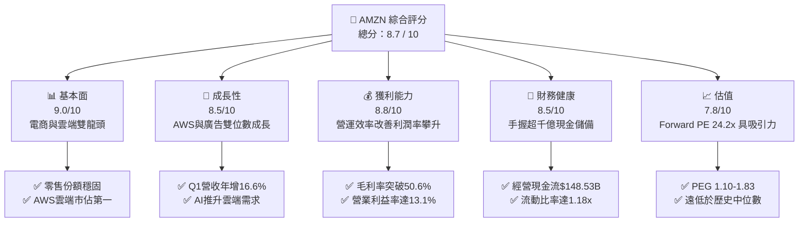
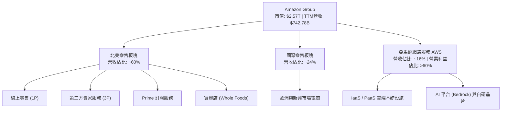
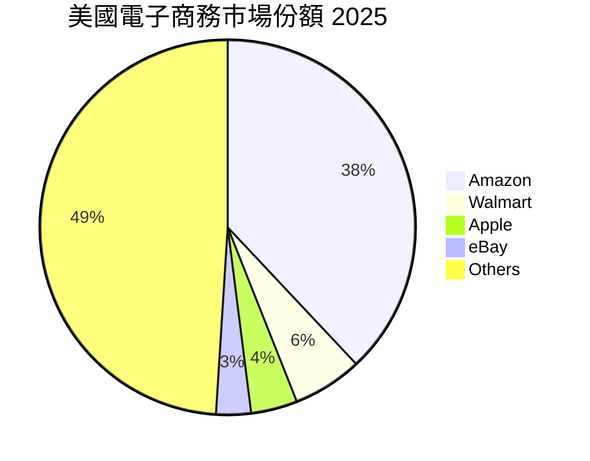
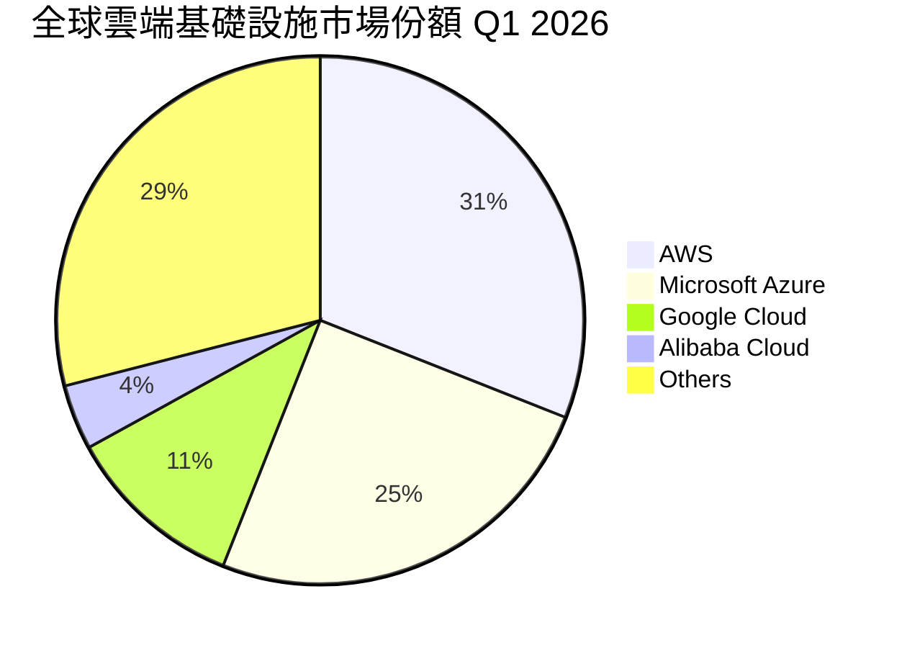
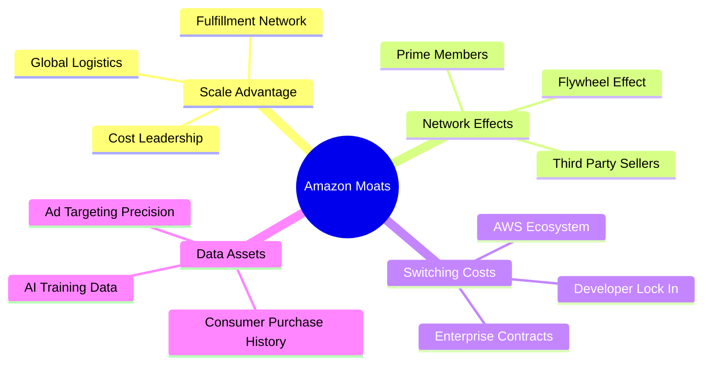
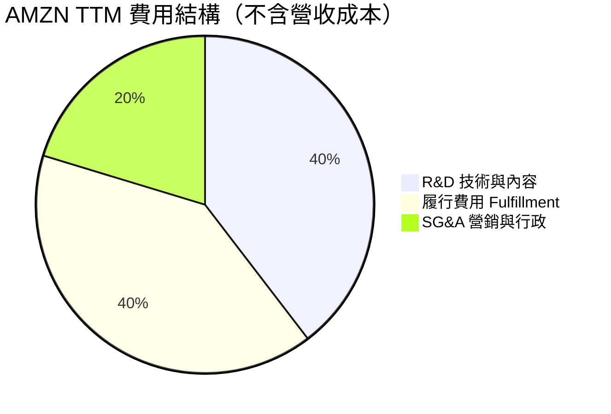
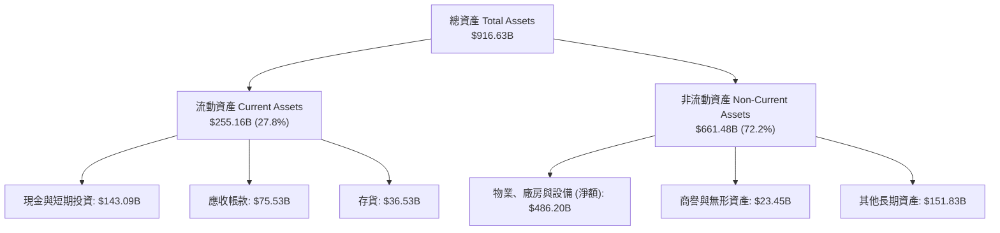

# AMZN 基本面深度分析報告
> **報告日期**：2026-06-14 ｜ **語言**：繁體中文 ｜ **數據來源**：Yahoo Finance, Finviz, StockAnalysis, Roic.ai ｜ **分析師**：CFA 級機構研究

---

## 目錄

| # | 章節 | 核心結論 |
|---|------|----------|
| 1 | 執行摘要 | 評級：**強烈買入 (Strong Buy)** ｜ 基準目標價：**$312.51**（+31.0% 潛在空間） |
| 2 | 公司概覽與商業模式 | 零售、AWS、廣告三輪驅動，具備極深的多維競爭護城河 |
| 3 | 損益表深度分析 | 營收穩健雙位數成長（TTM $742.78B），利潤率因營運效率優化顯著攀升 |
| 4 | 資產負債表分析 | 資產規模擴張至近兆美元，手握 $143.09B 現金儲備，債務結構極其健康 |
| 5 | 現金流量深度分析 | 經營現金流達 $148.53B，AI 資本支出高企短期壓制自由現金流（FCF $9.81B） |
| 6 | 獲利能力與資本效率 | ROE 達 24.3%，ROIC（13.43%）超越 WACC（11.35%），持續創造股東價值 |
| 7 | 估值深度分析 | Forward P/E 24.19x 處於歷史低位，相較於微軟等科技巨頭具備估值優勢 |
| 8 | 成長催化劑 | 生成式 AI 商業化加速、廣告高毛利業務爆發、全球零售網絡區域化優化 |
| 9 | 風險矩陣 | AI 基礎設施過度投資、反壟斷監管審查、宏觀經濟消費疲軟 |
| 10 | 投資建議 | 具備高安全邊際與強勁成長動能，適合中長線成長型與價值型投資者 |

---

## 1. 執行摘要

### 1.1 核心評分儀表板



### 1.2 評分進度條視覺化

```
╔══════════════════════════════════════════════════════════════╗
║                AMZN 多維度評分儀表板 (1-10分)                ║
╠══════════════════════════════════════════════════════════════╣
║ 基本面強度  9.0 ▓▓▓▓▓▓▓▓▓▓▓▓▓▓▓▓▓▓░░  ★★★★★           ║
║ 成長動能    8.5 ▓▓▓▓▓▓▓▓▓▓▓▓▓▓▓▓▓░░░  ★★★★☆           ║
║ 獲利品質    8.8 ▓▓▓▓▓▓▓▓▓▓▓▓▓▓▓▓▓▓░░  ★★★★☆           ║
║ 財務健康    8.5 ▓▓▓▓▓▓▓▓▓▓▓▓▓▓▓▓▓░░░  ★★★★☆           ║
║ 估值合理性  7.8 ▓▓▓▓▓▓▓▓▓▓▓▓▓▓░░░░░░  ★★★★☆           ║
║ 護城河深度  9.5 ▓▓▓▓▓▓▓▓▓▓▓▓▓▓▓▓▓▓▓░  ★★★★★           ║
║ 管理層執行  8.8 ▓▓▓▓▓▓▓▓▓▓▓▓▓▓▓▓▓▓░░  ★★★★☆           ║
║ 技術創新力  9.2 ▓▓▓▓▓▓▓▓▓▓▓▓▓▓▓▓▓▓▓░  ★★★★★           ║
╠══════════════════════════════════════════════════════════════╣
║ 綜合總分    8.7 ▓▓▓▓▓▓▓▓▓▓▓▓▓▓▓▓▓░░░  🏆 強烈買入          ║
╚══════════════════════════════════════════════════════════════╝
```

### 1.3 五大投資論點 + 三大核心風險

| 類型 | 項目 | 具體依據 | 信心度 |
|------|------|----------|--------|
| 🟢 **投資論點①** | **AWS 雲端與 AI 雙重利好** | AWS 在 Q1 2026 營收重回加速通道，生成式 AI（Bedrock、Trainium 晶片）需求爆發。 | 🟢 極高 |
| 🟢 **投資論點②** | **零售業務利潤率結構性改善** | 北美履約網絡「區域化」改革成效顯著，大幅縮短配送距離並降低履約成本。 | 🟢 極高 |
| 🟢 **投資論點③** | **廣告業務成為高毛利第二增長曲線** | 憑藉龐大的電商消費者數據，廣告業務 TTM 增速維持在 20% 以上，利潤率極高。 | 🟢 高 |
| 🟢 **投資論點④** | **營運現金流（OCF）創歷史新高** | TTM OCF 達到 $148.53B，提供公司在 AI 基礎設施投資上無與倫比的資金底氣。 | 🟢 極高 |
| 🟢 **投資論點⑤** | **估值收縮提供安全邊際** | Forward P/E 降至 24.19x，相較於歷史平均（>40x）與同業微軟（~30x）極具性價比。 | 🟢 高 |
| 🟡 **風險①** | **AI 資本支出（Capex）過高壓制 FCF** | FY2025 資本支出高達 $131.82B，導致 FCF 轉換率短期降至 10.7%，若 AI 變現不及預期將衝擊回報率。 | 🟡 中度 |
| 🔴 **風險②** | **全球反壟斷法規審查** | 美國 FTC 及歐盟對 Amazon 平台雙重身份（既是平台又是賣家）及併購案的持續反壟斷訴訟。 | 🔴 高衝擊 |
| 🟡 **風險③** | **宏觀經濟與消費疲軟** | 通膨與高利率環境若維持更久，可能壓制零售板塊的非必需消費品支出。 | 🟡 中度 |

### 1.4 快速統計卡片

| 指標 | 公司實際值 | 行業均值（電商/雲端） | S&P 500 均值 | 狀態 |
|------|-------------|----------------------|--------------|------|
| **營收 YoY 成長** | **16.6%** | ~10.5% | ~5.5% | 🟢 顯著超前 |
| **毛利率** | **50.6%** | ~35.0% | ~30.0% | 🟢 強勁 |
| **淨利率** | **12.2%** | ~8.0% | ~11.5% | 🟢 領先同業 |
| **ROE** | **24.3%** | ~15.0% | ~18.0% | 🟢 優異 |
| **Forward P/E** | **24.19x** | ~28.0x | ~21.5x | 🟢 具吸引力 |
| **淨債務 / EBITDA** | **0.56x** | ~1.20x | ~1.60x | 🟢 極其安全 |

### 1.5 投資結論

```
╔══════════════════════════════════════════════════════════════════╗
║                    📊 投資結論摘要                               ║
╠══════════════════════════════════════════════════════════════════╣
║  評級：🟢 強烈買入 (Strong Buy)                                 ║
║  當前股價：$238.55 (2026-06-14)                                  ║
║  目標價區間：                                                    ║
║    悲觀情境：$207.00（-13.2%）- 估值收縮，AI 投資變現嚴重滯後     ║
║    基準情境：$312.51（+31.0%）← 12個月主要目標 (11.5% WACC)     ║
║    樂觀情境：$370.00（+55.1%）- AWS/AI 加速，廣告與零售利潤爆發   ║
║  投資評分：8.7 / 10                                              ║
║  適合投資人：追求長期資本增值、看好 AI 雲端與電商效率優化的投資者 ║
╚══════════════════════════════════════════════════════════════════╝
```

---

## 2. 公司概覽與商業模式

### 2.1 業務結構與收入來源

Amazon 已經從早期的單一電商平台，演變為「零售+雲端服務+數位廣告」的多元生態帝國。其業務主要分為三大板塊：北美零售（North America）、國際零售（International）以及亞馬遜網路服務（AWS）。



### 2.2 市場份額

#### 2.2.1 美國電子商務市場份額（2025年估算）



#### 2.2.2 全球雲端基礎設施（IaaS/PaaS）市場份額（2026年Q1）



### 2.3 競爭護城河分析



1. **規模優勢（Scale Advantage）**：Amazon 擁有全球最龐大的自建履約與物流網絡（Fulfillment Network），這使得競爭對手極難在配送速度與單件運輸成本上與其競爭。
2. **網絡效應（Network Effects）**：**Prime 訂閱會員**（全球超過 2 億）與**第三方賣家（3P）**之間形成了強大的「飛輪效應」。會員越多，吸引越多的第三方賣家入駐，進而提供更豐富的品類與更低的價格，進一步鞏固會員忠誠度。
3. **高轉換成本（High Switching Costs）**：**AWS** 在企業級雲端市場根深蒂固。企業將數據、架構與應用部署在 AWS 上後，遷移至其他雲端平台（如 Azure 或 GCP）會面臨巨大的資金、時間與技術風險。
4. **數據與 AI 生態系統**：Amazon 擁有無與倫比的消費者購買數據，這為其**數位廣告業務**提供了極高的精準投放能力。同時，AWS Bedrock 平台集成了多種領先的 AI 大模型，為企業客戶提供一站式 AI 開發環境。

### 2.4 護城河強度評分

```
╔══════════════════════════════════════════════════════════════╗
║                   AMZN 護城河強度評分                        ║
╠══════════════════════════════════════════════════════════════╣
║ 規模經濟優勢  9.8/10  ▓▓▓▓▓▓▓▓▓▓▓▓▓▓▓▓▓▓▓▓  🏆 無法逾越    ║
║ 雙向網絡效應  9.5/10  ▓▓▓▓▓▓▓▓▓▓▓▓▓▓▓▓▓▓▓░  🟢 極其強勁    ║
║ 雲端轉換成本  9.2/10  ▓▓▓▓▓▓▓▓▓▓▓▓▓▓▓▓▓▓░░  🟢 高鎖定率    ║
║ 品牌與訂閱粘性9.0/10  ▓▓▓▓▓▓▓▓▓▓▓▓▓▓▓▓▓▓░░  🟢 Prime 生態  ║
╠══════════════════════════════════════════════════════════════╣
║ 綜合護城河    9.4/10  ▓▓▓▓▓▓▓▓▓▓▓▓▓▓▓▓▓▓▓░  🏆 頂級寬護城河 ║
╚══════════════════════════════════════════════════════════════╝
```

---

## 3. 損益表深度分析

### 3.1 年度收入成長趨勢（近4年）

Amazon 的營收規模持續擴大，從 2022 年的 $513.98B 增長至 2025 年的 $716.92B，並在截至 2026 年 Q1 的 TTM（過去十二個月）達到 $742.78B。

```
╔══════════════════════════════════════════════════════════════════╗
║              AMZN 年度收入趨勢（FY2022 - FY2025）                ║
╠══════════════════════════════════════════════════════════════════╣
║                                                                  ║
║  FY2022  $513.98B  ████████████████░░░░░░░░  YoY: +9.4%   🟢    ║
║  FY2023  $574.78B  ██████████████████░░░░░░  YoY: +11.8%  🟢    ║
║  FY2024  $637.96B  ████████████████████░░░░  YoY: +11.0%  🟢    ║
║  FY2025  $716.92B  ██████████████████████░░  YoY: +12.4%  🟢    ║
║                                                                  ║
║  📊 3年累計營收 CAGR：+11.7%                                     ║
╚══════════════════════════════════════════════════════════════════╝
```

### 3.2 季度收入趨勢分析

自 2024 年以來，Amazon 季度營收呈現明顯的季節性波動（Q4 因節日購物季通常為全年最高峰），但同比（YoY）成長率始終保持在雙位數，顯示出強勁的成長韌性。

| 財報季度 | 營業收入 (Billion) | YoY 成長率 | QoQ 成長率 | 核心驅動因素與備註 |
|----------|-------------------|------------|------------|-------------------|
| **Q1 2026** | **$181.52B** | **+16.61%** | -14.93% | 🟢 淡季不淡，AWS 雲端需求回暖與 AI 變現加速 |
| **Q4 2025** | **$213.39B** | **+13.63%** | +18.44% | 🟢 節日購物季創歷史新高，Prime 會員消費強勁 |
| **Q3 2025** | **$180.17B** | **+13.40%** | +7.43% | 🟢 Prime Day 促銷活動大獲成功 |
| **Q2 2025** | **$167.70B** | **+13.33%** | +7.73% | 🟡 零售業務穩定，廣告收入增速超 20% |
| **Q1 2025** | **$155.67B** | **+8.62%** | -17.11% | 🟡 宏觀經濟逆風下的穩健表現 |

### 3.3 利潤率演變分析

Amazon 過去幾年的財務表現中最令人矚目的是**利潤率的結構性擴張**。毛利率從 2022 年的 43.8% 攀升至 TTM 的 50.6%，營業利益率也從 2.4% 暴增至 13.1%。

| 利潤率指標 | FY2022 | FY2023 | FY2024 | FY2025 | TTM (2026-03) | 趨勢評估 |
|------------|--------|--------|--------|--------|---------------|----------|
| **毛利率** | 43.8% | 47.0% | 48.9% | 50.3% | **50.6%** | ↗️ 穩定上升 🟢 |
| **營業利益率** | 2.4% | 6.4% | 10.8% | 11.2% | **13.1%** | ↗️ 顯著改善 🟢 |
| **EBITDA 利潤率**| 7.5% | 15.6% | 19.4% | 23.1% | **21.0%** | ↗️ 效率提升 🟢 |
| **淨利率** | -0.5% | 5.3% | 9.3% | 10.8% | **12.2%** | ↗️ 扭虧為盈 🟢 |

#### 💡 利潤率暴增的深層原因解析：
1. **履約網絡區域化（Regionalization）**：Amazon 將美國原有的單一全國性物流網絡重組為 8 个獨立區域。此舉大幅減少了跨區運輸（Line-haul），降低了配送成本，提高了配送速度。
2. **高利潤業務佔比提升**：廣告業務與 AWS 的利潤率遠高於傳統電商（廣告營業利益率估計 >30%，AWS 營業利益率約 30%）。這兩大板塊增速超越零售，優化了整體的利潤結構。
3. **營運槓桿（Operating Leverage）**：隨著電商基礎設施建設（FY20-FY21 的過度擴建）逐步被新增需求填滿，折舊費用佔營收比重下降，營運槓桿效應顯現。

### 3.4 費用結構分析



```
╔══════════════════════════════════════════════════════════════════╗
║                 AMZN TTM 營運費用分析 (Billion)                  ║
╠══════════════════════════════════════════════════════════════════╣
║                                                                  ║
║  技術與內容 (R&D)：   $115.09B  ██████████████████░░░░  (39.6%)  ║
║  履行費用 (Fulfillment):$116.55B  ███████████████████░░░  (40.1%)  ║
║  營銷與行政 (SG&A)：  $58.81B   █████████░░░░░░░░░░░░░  (20.3%)  ║
║                                                                  ║
║  📝 研發與履行費用佔據大宗，體現其技術驅動與重資產履約的特性。   ║
╚══════════════════════════════════════════════════════════════════╝
```

*註：履行費用（Fulfillment）在 StockAnalysis 數據中被歸類於「其他營運費用」，是維持電商物流運作的核心支出。*

### 3.5 季度 EPS 趨勢與盈餘品質

Amazon 近四個季度的稀釋後 EPS 表現亮眼，且在 Q1 2026 實現了爆發式增長。

| 財報季度 | 預期 EPS | 實際 EPS | 盈餘驚喜 (Surprise %) | 盈餘品質評估 |
|----------|----------|----------|-----------------------|--------------|
| **Q1 2026** | N/A | **$2.82** | N/A | 🟡 中等。雖然營運利潤強勁，但本季包含 **$15.65B** 的非營運收益（主要為 Rivian 等股權投資估值回升），扣除後核心 EPS 約為 $1.40-$1.50。 |
| **Q4 2025** | N/A | **$1.98** | N/A | 🟢 極高。受惠於購物季強勁需求，營運利潤達 $24.98B，幾乎無一次性非營運干擾。 |
| **Q3 2025** | N/A | **$1.98** | N/A | 🟢 高。營運利潤 $17.42B，伴隨 $10.19B 的非營運收益。 |
| **Q2 2025** | N/A | **$1.71** | N/A | 🟢 高。營運利潤 $19.17B，核心獲利能力穩步向上。 |

---

## 4. 資產負債表分析

### 4.1 資產結構分解

截至 2026 年 3 月 31 日，Amazon 的總資產已擴張至 **$916.63B**，逼近兆美元大關。



### 4.2 流動性指標分析

Amazon 的流動性狀況在過去幾年中保持穩定，流動比率維持在 1.1x 以上，快速比率接近 1.0x。

| 流動性指標 | FY2022 | FY2023 | FY2024 | FY2025 | T