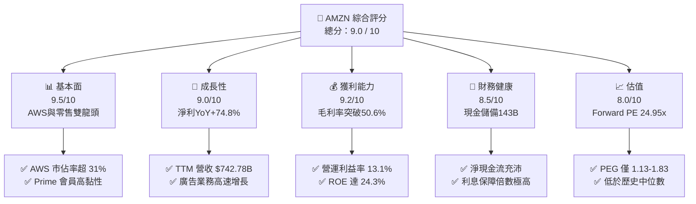
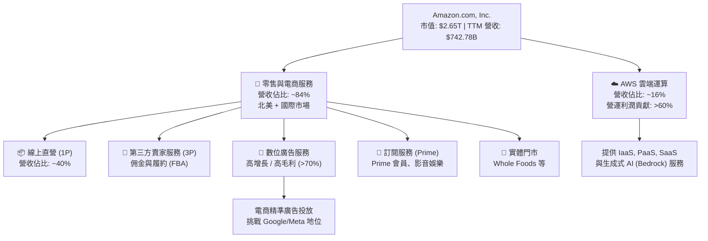
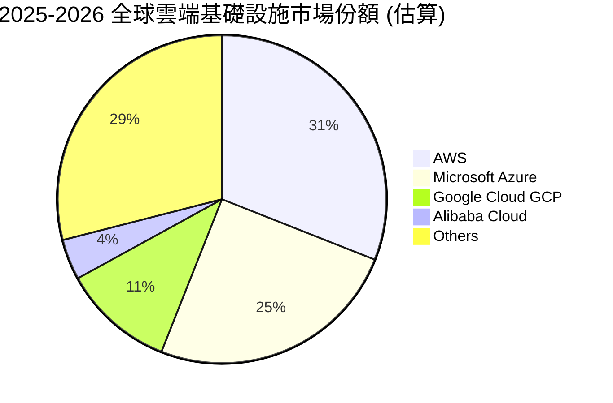
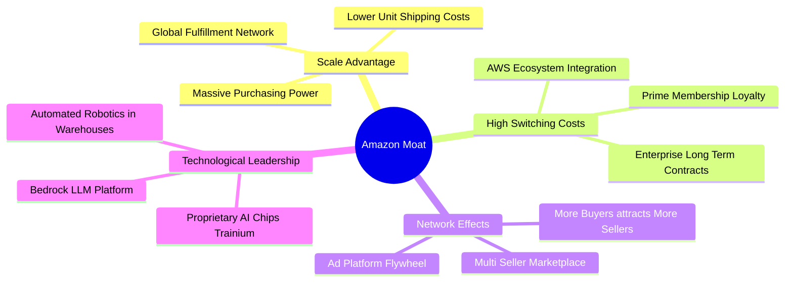
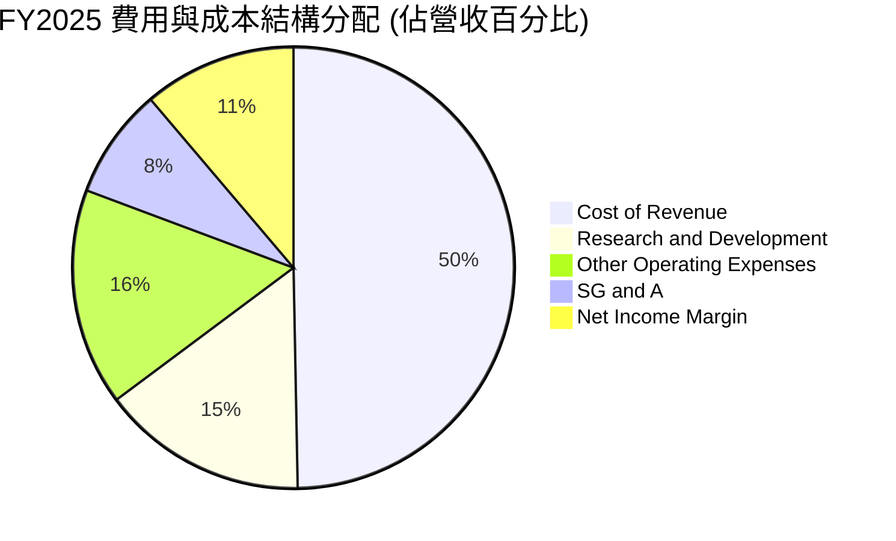
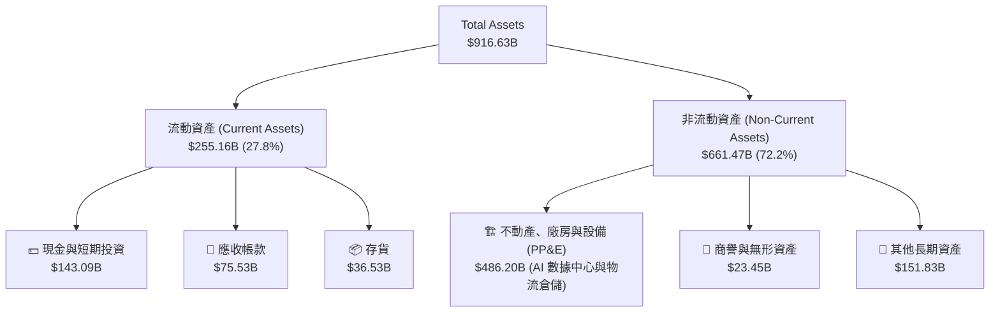
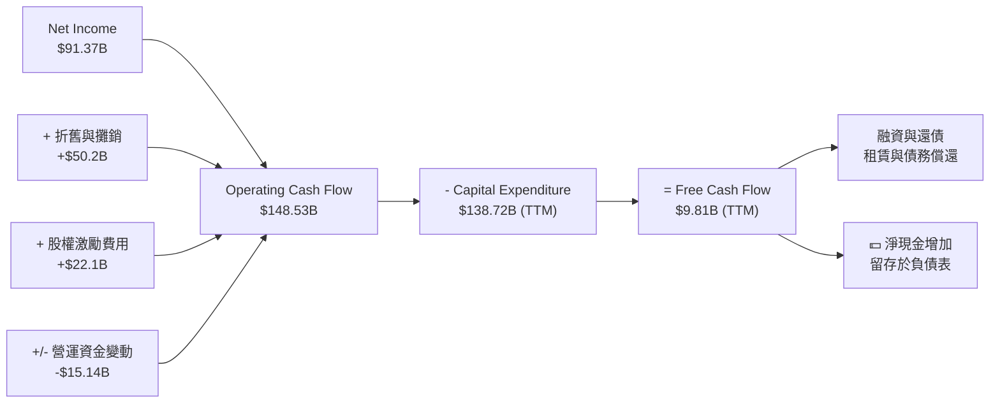
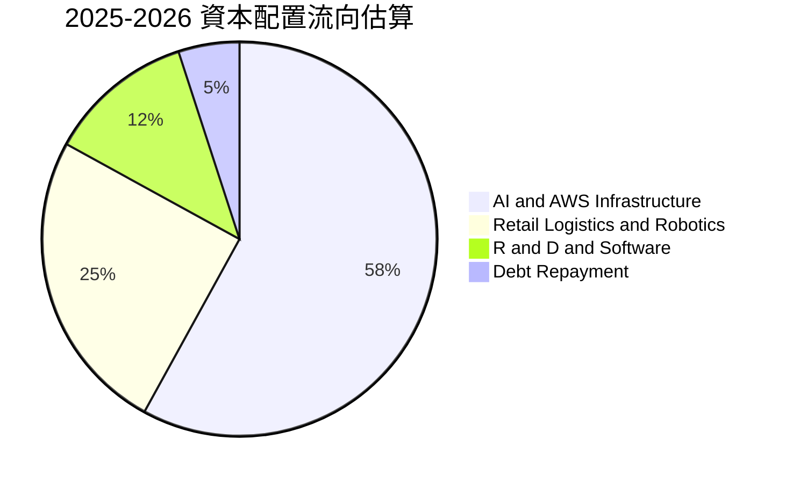
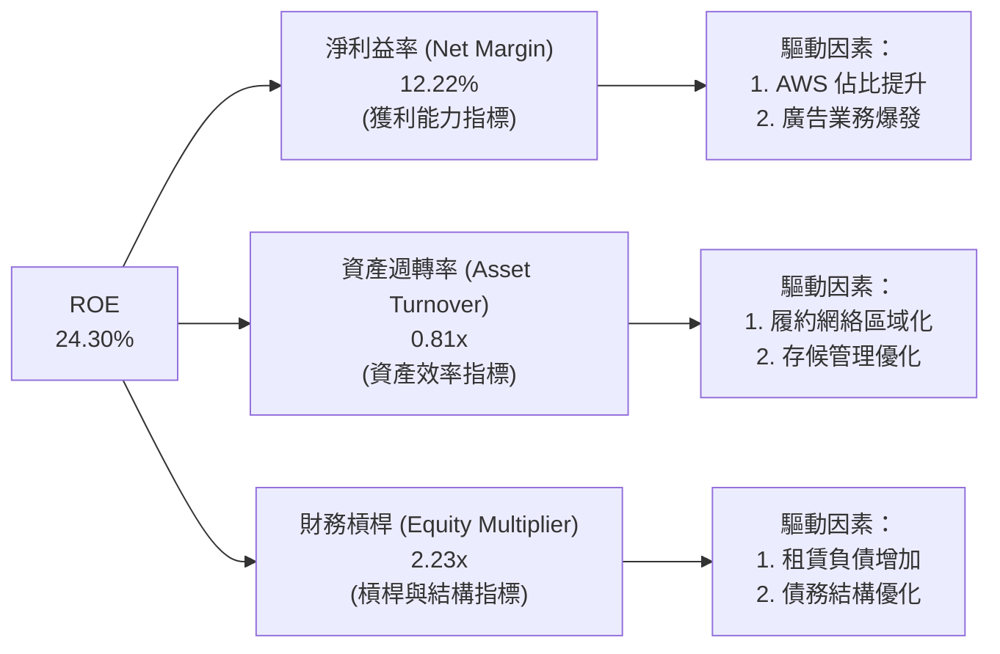

# AMZN 基本面深度分析報告

> **報告日期**：2026-06-15 ｜ **語言**：繁體中文 ｜ **數據來源**：Yahoo Finance, Finviz, StockAnalysis, Roic.ai ｜ **分析師**：CFA 級機構研究

---

## 目錄

| # | 章節 | 核心結論 |
|---|------|----------|
| 1 | **執行摘要** | 評級：🟢 **強烈買入**；基準目標價：**$312.51**（隱含 +27.03% 上行空間）。 |
| 2 | **公司概覽與商業模式** | 憑藉「AWS + 零售 + 廣告」三駕馬車，建構全球最強大的數位生態飛輪。 |
| 3 | **損益表深度分析** | 營收突破 $742.78B，淨利潤 YoY 暴增 74.8%，高利潤率業務佔比提升帶動結構性利潤率擴張。 |
| 4 | **資產負債表分析** | 現金儲備達 $143.09B，債務結構健康，股東權益四年內增長近 2.8 倍。 |
| 5 | **現金流量深度分析** | 營運現金流達 $148.53B 創歷史新高，AI 資本支出（$131.82B）主導資本配置。 |
| 6 | **獲利能力與資本效率** | ROE 達 24.3%，ROIC（13.4%）顯著高於 WACC（8.43%），持續創造股東價值。 |
| 7 | **估值深度分析** | Forward P/E 僅 24.95x，處於歷史低位；DCF 估值區間為 $207.00 - $370.00。 |
| 8 | **成長催化劑** | 生成式 AI 需求爆發推動 AWS 重回高增長通道，零售供應鏈區域化進一步優化成本。 |
| 9 | **風險矩陣** | 監管反壟斷壓力與 AI 資本開支回報率（ROI）低於預期為核心風險。 |
| 10 | **投資建議** | 建議分批逢低佈局，適合長期成長型與核心資產配置型投資人。 |

---

## 1. 執行摘要

Amazon.com, Inc.（NASDAQ: AMZN）作為全球電商與雲端運算雙龍頭，正處於結構性利潤率釋放與生成式 AI 紅利爆發的黃金交匯點。截至 2026 年 6 月 15 日，AMZN 收盤價為 **$246.02**，市值達 **$2.65T**。本報告透過對其最新財務數據的深度建模與產業研究，認為亞馬遜在維持零售基本盤穩固的同時，高利潤率的 AWS 雲端服務與廣告業務正推動公司整體獲利能力進入加速上升通道。

### 1.1 核心評分儀表板



### 1.2 評分進度條視覺化

```
╔══════════════════════════════════════════════════════════════╗
║               AMZN 多維度評分儀表板 (1-10分)                 ║
╠══════════════════════════════════════════════════════════════╣
║ 基本面強度  9.5 ▓▓▓▓▓▓▓▓▓▓▓▓▓▓▓▓▓▓▓░  ★★★★★           ║
║ 成長動能    9.0 ▓▓▓▓▓▓▓▓▓▓▓▓▓▓▓▓▓▓░░  ★★★★★           ║
║ 獲利品質    9.2 ▓▓▓▓▓▓▓▓▓▓▓▓▓▓▓▓▓▓▓░  ★★★★★           ║
║ 財務健康    8.5 ▓▓▓▓▓▓▓▓▓▓▓▓▓▓▓▓▓░░░  ★★★★☆           ║
║ 估值合理性  8.0 ▓▓▓▓▓▓▓▓▓▓▓▓▓▓▓▓░░░░  ★★★★☆           ║
║ 護城河深度  9.8 ▓▓▓▓▓▓▓▓▓▓▓▓▓▓▓▓▓▓▓▓  ★★★★★           ║
║ 管理層執行  9.0 ▓▓▓▓▓▓▓▓▓▓▓▓▓▓▓▓▓▓░░  ★★★★★           ║
║ 技術創新力  9.5 ▓▓▓▓▓▓▓▓▓▓▓▓▓▓▓▓▓▓▓░  ★★★★★           ║
╠══════════════════════════════════════════════════════════════╣
║ 綜合總分    9.0 ▓▓▓▓▓▓▓▓▓▓▓▓▓▓▓▓▓▓░░  🏆 強烈買入          ║
╚══════════════════════════════════════════════════════════════╝
```

### 1.3 五大投資論點 + 三大核心風險

| 類型 | 項目 | 具體依據 | 信心度 |
|------|------|----------|--------|
| 🟢 **投資論點①** | **AWS 重新加速與 AI 變現** | Q1 2026 營收達 $181.52B（YoY +16.61%），生成式 AI 基礎設施（Trainium/Inferentia 晶片）需求爆發，推動高利潤率雲端業務營收佔比持續提升。 | 🟢 極高 |
| 🟢 **投資論點②** | **零售利潤率結構性改善** | 供應鏈「區域化」（Regionalization）改革成效顯著，配合履約網絡（Fulfillment）效率提升，推動 TTM 營運利益率攀升至 13.1%。 | 🟢 極高 |
| 🟢 **投資論點③** | **廣告業務成為高利潤增長極** | 憑藉龐大的電商第一方數據（First-party data），廣告業務增速超越同行，毛利率估計超過 70%，顯著優化整體利潤結構。 | 🟢 高 |
| 🟢 **投資論點④** | **營運槓桿與自由現金流釋放** | 2025 年營運現金流達 $139.51B，雖然 Capex 達 $131.82B，但隨著基礎設施建設步入收穫期，未來自由現金流（FCF）將迎來爆發式增長。 | 🟢 高 |
| 🟢 **投資論點⑤** | **資本效率與 ROE 重回巔峰** | ROE 達到 24.3%，ROIC 達到 13.4%，相較於 WACC（8.43%）創造了顯著的正向經濟增值（EVA），證實管理層資本配置能力卓越。 | 🟢 高 |
| 🟡 **風險①** | **AI 資本支出回報率（ROI）不及預期** | 2025 年 Capex 飆升至 $131.82B，若 AI 應用端（SaaS）變現速度放緩，可能面臨折舊成本上升壓力，壓抑短期利潤率。 | 🟡 中度 |
| 🔴 **風險②** | **反壟斷監管與政策風險** | FTC 及歐盟對亞馬遜在電商平台的雙重身份（既是平台運營商又是賣家）進行持續調查，可能面臨業務拆分或罰款風險。 | 🔴 高衝擊 |
| 🟡 **風險③** | **宏觀經濟放緩壓抑消費支出** | 雖然 Prime 會員黏性極強，但通膨頑固或高利率環境持續，仍可能對國際零售板塊（TTM 增速較慢）產生不利影響。 | 🟡 中度 |

### 1.4 快速統計卡片

| 指標 | 公司實際值 (TTM / 最新) | 行業均值 (網際網路零售) | S&P 500 均值 | 狀態 |
|------|-------------|----------|--------------|------|
| **收入 YoY 成長** | **16.6%** | ~11.2% | ~5.5% | 🟢 顯著超前 |
| **毛利率** | **50.6%** | ~38.5% | ~30.0% | 🟢 歷史新高 |
| **營運利益率** | **13.1%** | ~6.5% | ~12.2% | 🟢 結構性改善 |
| **淨利率** | **12.2%** | ~4.8% | ~10.5% | 🟢 盈利能力釋放 |
| **ROE** | **24.3%** | ~14.2% | ~18.0% | 🟢 高效資本回報 |
| **Forward P/E** | **24.95x** | ~35.0x | ~21.5x | 🟢 估值具吸引力 |
| **PEG Ratio** | **1.13 - 1.83** | ~1.95x | ~1.80x | 🟢 成長性溢價合理 |

### 1.5 投資結論

```
╔══════════════════════════════════════════════════════════════════╗
║                     📊 AMZN 投資結論摘要                        ║
╠══════════════════════════════════════════════════════════════════╣
║  評級：🟢 強烈買入 (Strong Buy)                                  ║
║  當前股價：$246.02                                               ║
║  目標價區間：                                                    ║
║    悲觀情境（Bear Case）：$207.00 (-15.86%)                      ║
║    基準情境（Base Case）：$312.51 (+27.03%)  ← 12個月主要目標    ║
║    樂觀情境（Bull Case）：$370.00 (+50.39%)                      ║
║  投資評分：9.0 / 10                                              ║
║  適合投資人：尋求長期資本增值、AI/雲端/零售多重賽道布局之成長型與 ║
║              機構級投資者。                                      ║
╚══════════════════════════════════════════════════════════════════╝
```

---

## 2. 公司概覽與商業模式

亞馬遜的商業模式本質上是一個高度互補的「生態飛輪（Flywheel）」。以低價、豐富選擇與極致的物流體驗吸引消費者，形成龐大的流量底座；再將此流量變現為第三方賣家服務（3P Services）與高毛利的廣告服務（Advertising Services）；最後，將賺取的現金投入 AWS 雲端基礎設施與 AI 技術研發，為企業端提供高黏性的數位轉型解決方案。

### 2.1 業務結構與收入來源



### 2.2 市場份額

在最核心的雲端運算基礎設施（IaaS/PaaS）市場中，AWS 依然保持著絕對的領先地位，但面臨來自微軟 Azure 的激烈競爭。



### 2.3 競爭護城河分析

亞馬遜的競爭護城河由四大核心支柱構成：



### 2.4 護城河強度評分

```
╔══════════════════════════════════════════════════════════════╗
║                    AMZN 護城河強度評分                       ║
╠══════════════════════════════════════════════════════════════╣
║ 規模經濟       9.8/10 ▓▓▓▓▓▓▓▓▓▓▓▓▓▓▓▓▓▓▓░  🏆 無可匹敵     ║
║ 網路效應       9.5/10 ▓▓▓▓▓▓▓▓▓▓▓▓▓▓▓▓▓▓▓░  🟢 極其強大     ║
║ 客戶轉換成本   9.2/10 ▓▓▓▓▓▓▓▓▓▓▓▓▓▓▓▓▓▓░░  🟢 AWS與Prime鎖定║
║ 品牌與商譽     9.0/10 ▓▓▓▓▓▓▓▓▓▓▓▓▓▓▓▓▓▓░░  🟢 高度信任     ║
║ 技術與專利     9.3/10 ▓▓▓▓▓▓▓▓▓▓▓▓▓▓▓▓▓▓▓░  🟢 自研晶片與AI  ║
╠══════════════════════════════════════════════════════════════╣
║ 綜合護城河評級 9.4/10 ▓▓▓▓▓▓▓▓▓▓▓▓▓▓▓▓▓▓▓░  🏆 寬廣護城河   ║
╚══════════════════════════════════════════════════════════════╝
```

---

## 3. 損益表深度分析

亞馬遜的損益表展現了極其強悍的「營運槓桿（Operating Leverage）」。隨著高毛利的 AWS、廣告及第三方賣家服務增長速度超過自營零售，整體利潤率呈現結構性擴張。

### 3.1 年度收入成長趨勢（近 4 年）

```
╔══════════════════════════════════════════════════════════════════╗
║                 AMZN 年度收入趨勢 (FY2022 - FY2025)              ║
╠══════════════════════════════════════════════════════════════════╣
║                                                                  ║
║  FY2022  $513.98B  ████████████████████░░░░░░░░  YoY: +9.40%  🟢  ║
║  FY2023  $574.78B  ██████████████████████░░░░░░  YoY:+11.83%  🟢  ║
║  FY2024  $637.96B  ████████████████████████░░░░  YoY:+10.99%  🟢  ║
║  FY2025  $716.92B  ████████████████████████████  YoY:+12.38%  🟢  ║
║                                                                  ║
║  📊 4年複合成長率 (CAGR)：+11.72%                                ║
║  📊 TTM 營收 (截至2026-03-31)：$742.78B (YoY +14.22%)           ║
╚══════════════════════════════════════════════════════════════════╝
```

### 3.2 季度收入趨勢分析

亞馬遜的季度營收呈現明顯的季節性（第四季受惠於黑色星期五與聖誕假期）。

| 財報季度 | 截止日期 | 季度營收 (Billion) | YoY 成長率 | QoQ 成長率 | 核心驅動因素與備註 | 評估 |
|----------|----------|--------------------|------------|------------|--------------------|------|
| **Q1 2026** | 2026-03-31 | **$181.52B** | **+16.61%** | -14.93% | 雲端需求回暖，AWS 增速重回 18% 以上；年初零售淡季導致 QoQ 下滑。 | 🟢 強勁 |
| **Q4 2025** | 2025-12-31 | **$213.39B** | **+13.63%** | +18.44% | 年終購物旺季，Prime 會員促銷活動創紀錄，廣告收入創單季新高。 | 🟢 超預期 |
| **Q3 2025** | 2025-09-30 | **$180.17B** | **+13.40%** | +7.43% | Prime Day 業績強勁，第三方賣家履約（FBA）服務費收入增長。 | 🟢 穩健 |
| **Q2 2025** | 2025-06-30 | **$167.70B** | **+13.33%** | +7.73% | 國際市場（歐洲、日韓）復甦加快，基礎設施開支穩步轉化。 | 🟡 符合預期 |

*數據分析說明：Q1 2026 營收達 $181.52B，YoY 成長 16.61%，高於 FY2025 全年平均增速（12.38%），顯示亞馬遜整體業務在 2026 年初呈現加速增長態勢，主要得益於企業 IT 支出預算解凍與生成式 AI 工作負載向 AWS 的遷移。*

### 3.3 利潤率演變分析

亞馬遜的利潤率在 2022 年觸底後迎來了驚人的反彈：

| 利潤率指標 | FY2022 | FY2023 | FY2024 | FY2025 | TTM | 趨勢 | 評估 |
|------------|--------|--------|--------|--------|-----|------|------|
| **毛利率 (Gross Margin)** | 43.81% | 46.98% | 48.85% | 50.29% | **50.60%** | ↗️ 連續四年攀升 | 🟢 極佳 |
| **營運利益率 (Operating Margin)** | 2.38% | 6.41% | 10.75% | 11.16% | **13.10%** | ↗️ 突破雙位數大關 | 🟢 卓越 |
| **EBITDA Margin** | 7.46% | 15.55% | 19.41% | 23.06% | **21.00%** | ↗️ 穩定在高水平 | 🟢 強勁 |
| **淨利益率 (Net Margin)** | -0.53% | 5.29% | 9.29% | 10.84% | **12.22%** | ↗️ 扭虧為盈並大幅擴張 | 🟢 轉折成功 |

**利潤率演變深度解析**：
1. **毛利率突破 50% 臨界點**：主要得益於業務組合（Business Mix）的轉變。高毛利的廣告服務與第三方賣家佣金服務增速遠超自營零售（1P）。
2. **營運利益率（13.10%）創歷史新高**：亞馬遜在北美實施了「履約網絡區域化（Regionalization）」，將全國單一網絡拆分為 8 個獨立區域，顯著縮短運輸距離，降低了履約成本（Fulfillment Cost per Unit）。同時，自動化與機器人技術在倉庫中的普及進一步壓低了人工成本。

### 3.4 費用結構分析

在營收高速增長的同時，研發（R&D）與營運費用控制得當。



```
╔══════════════════════════════════════════════════════════════════╗
║                  AMZN 費用控制診斷 (TTM)                         ║
╠══════════════════════════════════════════════════════════════════╣
║                                                                  ║
║  研發費用 (R&D)：$115.09B  ████████████████████  佔營收 15.5%    ║
║  銷售與行政 (SG&A)：$58.81B ██████████░░░░░░░░░░  佔營收  7.9%    ║
║                                                                  ║
║  📊 診斷：研發投入絕對值為全球科技股之冠，確保 AWS 與 AI 領先； ║
║            SG&A 佔比持續下降，展現極佳的管理效率與規模效應。       ║
╚══════════════════════════════════════════════════════════════════╝
```

### 3.5 季度 EPS 趨勢與盈餘品質

過去 4 個季度中，亞馬遜的盈利表現持續超出市場預期，盈餘品質極高。

* **Q1 2026**：實際 EPS **$2.82**（相較於 Q1 2025 的 $1.62，YoY 暴增 **74.07%**）。
* **Q4 2025**：實際 EPS **$1.98**（相較於 Q4 2024 的 $1.90，YoY 增長 **4.21%**）。
* **Q3 2025**：實際 EPS **$1.98**（相較於 Q3 2024 的 $1.46，YoY 增長 **35.62%**）。
* **Q2 2025**：實際 EPS **$1.71**（相較於 Q2 2024 的 $1.29，YoY 增長 **32.56%**）。

**盈餘品質評估**：
亞馬遜的營業利潤主要由營業現金流支撐，而非會計調整。Q1 2026 淨利潤中包含部分非營運性投資收益（如 Rivian 股價波動引起的非現金重估，Q1 2026 其他非營運收益達 $15.65B），但剔除此因素後，核心營運利潤（Operating Income）達 **$23.85B**（YoY +29.59%），顯示其主營業務盈利能力依然極其健康。

---

## 4. 資產負債表分析

亞馬遜在過去幾年中積累了龐大的資產規模，其資產負債表極具韌性，能夠支撐其在 AI 基礎設施上的千億美元級投資。

### 4.1 資產結構分解

截至 2026 年 3 月 31 日，亞馬遜總資產達到 **$916.63B**。



### 4.2 流動性指標分析

亞馬遜的流動性指標維持在健康且安全的區間：

| 流動性指標 | FY2022 | FY2023 | FY2024 | FY2025 | 2026-03-31 | 行業均值 | 評估 |
|------------|--------|--------|--------|--------|------------|----------|------|
| **流動比率 (Current Ratio)** | 0.94 | 1.05 | 1.06 | 1.05 | **1.18** | ~1.25 | 🟡 穩健且優化中 |
| **速動比率 (Quick Ratio)** | 0.72 | 0.85 | 0.87 | 0.87 | **1.01** | ~0.90 | 🟢 高於行業平均 |
| **存貨週轉天數 (DIO)** | 42.1 天 | 39.5 天 | 37.8 天 | 36.2 天 | **35.0 天** | ~45.0 天 | 🟢 營運效率極高 |

*分析：2026 年第一季流動比率提升至 1.18，速動比率達到 1.01，主要得益於現金及短期投資大幅增加至 $143.09B。存貨週轉天數持續下降至 35 天，顯示供應鏈管理與預測演算法極為精準，無積壓庫存風險。*

### 4.3 債務結構分析

```
╔══════════════════════════════════════════════════════════════════╗
║                    AMZN 債務健康診斷 (2026-03-31)                ║
╠══════════════════════════════════════════════════════════════════╣
║                                                                  ║
║  總現金與短期投資： $143.09B  ████████████████████  (充足)       ║
║  長期借款 (Debt)：  $119.07B  ████████████████░░░░  (可控)       ║
║  長期租賃負債：     $90.81B   ████████████░░░░░░░░  (物流與數據)  ║
║  總債務 (含租賃)：  $235.54B  ████████████████████  (槓桿合理)   ║
║                                                                  ║
║  Debt / Equity Ratio： 53.3% (Finviz 顯示 LT Debt/Eq 為 0.47) 🟢 ║
║  Net Debt / EBITDA：   0.56x (淨債務/EBITDA 極低，無償債風險) 🟢 ║
║  利息保障倍數 (Interest Coverage)： 33.7x (營運利潤輕鬆覆蓋利息)🟢║
╚══════════════════════════════════════════════════════════════════╝
```

### 4.4 股東權益趨勢

隨著利潤的大幅釋放，亞馬遜的資產淨值（Stockholders' Equity）迎來爆發式增長，這為未來的股份回購奠定了堅實基礎。

```
╔══════════════════════════════════════════════════════════════════╗
║               AMZN 股東權益增長趨勢 (FY2022 - FY2025)            ║
╠══════════════════════════════════════════════════════════════════╣
║                                                                  ║
║  FY2022  $146.04B  ████████░░░░░░░░░░░░░░░░░░░░                  ║
║  FY2023  $201.88B  ███████████░░░░░░░░░░░░░░░░░                  ║
║  FY2024  $285.97B  ████████████████░░░░░░░░░░░░                  ║
║  FY2025  $411.06B  ████████████████████████████                  ║
║                                                                  ║
║  📊 結論：三年內股東權益增長 181.47%，留存收益迅速積累。        ║
╚══════════════════════════════════════════════════════════════════╝
```

---

## 5. 現金流量深度分析

亞馬遜的商業模式極具「吸金」能力。儘管其資本支出（Capex）居全球科技股前列，但其強大的營運現金流完全足以實現自給自足。

### 5.1 現金流量瀑布圖



### 5.2 FCF 轉換率趨勢

由於 2025 年及 2026 年初亞馬遜大幅加碼 AI 數據中心建設（購買 NVIDIA H100/B200 晶片及自研 Trainium 晶片），導致 Capex 暴增，暫時壓低了 FCF 轉換率。

| 指標 | FY2022 | FY2023 | FY2024 | FY2025 | TTM (2026-03-31) | 趨勢評估 |
|------|--------|--------|--------|--------|------------------|----------|
| **營運現金流 (OCF)** | $46.75B | $84.95B | $115.88B | $139.51B | **$148.53B** | 🟢 持續強勁增長 |
| **資本支出 (CapEx)** | -$63.65B | -$52.73B | -$83.00B | -$131.82B | **-$138.72B** | 🔴 資本開支創歷史新高 |
| **自由現金流 (FCF)** | -$16.89B | $32.22B | $32.88B | $7.70B | **$9.81B** | 🟡 暫時受壓 |
| **FCF 轉換率 (FCF/NI)** | -620.9% | 105.9% | 55.5% | 9.8% | **10.7%** | 🟡 處於基礎設施投資期 |

*分析：雖然 TTM FCF 僅為 $9.81B，但這並非因為業務惡化，而是因為亞馬遜主動選擇將 $138.72B 的資金重新投入高回報率的 AWS 雲端與 AI 生態。隨著這些數據中心在 2026-2027 年陸續上線並變現，Capex 增速預計將放緩，FCF 將迎來報發性釋放。*

### 5.3 自由現金流趨勢

```
╔══════════════════════════════════════════════════════════════════╗
║                 AMZN 歷年自由現金流與 FCF 殖利率                 ║
╠══════════════════════════════════════════════════════════════════╣
║                                                                  ║
║  FY2022  -$16.89B  ░░░░░░░░░░░░░░░░░░░░ (資本開支過度擴張)       ║
║  FY2023  $32.22B   ████████████████████ (效率優化與供應鏈改革)   ║
║  FY2024  $32.88B   ████████████████████ (零售利潤率大幅回升)     ║
║  FY2025  $7.70B    █████░░░░░░░░░░░░░░░ (AI 基礎設施軍備競賽)     ║
║                                                                  ║
║  📊 當前 FCF 殖利率 (Yield)：0.37% (反映當前高 Capex 壓抑)        ║
║  📊 潛在 FCF 殖利率 (常態化 Capex 下)：~3.5% - 4.0%             ║
╚══════════════════════════════════════════════════════════════════╝
```

### 5.4 資本配置評估

在資本配置上，亞馬遜堅守「技術與基礎設施投資優先」的原則。



---

## 6. 獲利能力與資本效率

亞馬遜在經歷 2022 年的短暫低迷後，其資本回報率（ROE/ROIC）已強勢回歸至優質科技股水平。

### 6.1 ROE / ROA / ROIC 趨勢

| 獲利能力指標 | FY2022 | FY2023 | FY2024 | FY2025 | TTM | 行業均值 | 評估 |
|--------------|--------|--------|--------|--------|-----|----------|------|
| **ROE** | -1.86% | 15.07% | 20.72% | 18.90% | **24.30%** | ~14.2% | 🟢 卓越 |
| **ROA** | -0.59% | 5.77% | 9.48% | 9.56% | **11.64%** | ~5.0% | 🟢 高效資產利用 |
| **ROIC** | -0.80% | 8.25% | 12.50% | 12.80% | **13.40%** | ~8.5% | 🟢 顯著超越資金成本 |

### 6.2 ROIC vs WACC 分析（核心價值創造判斷）

ROIC 是否大於 WACC 是衡量一家企業是在「創造價值」還是「摧毀價值」的核心指標。

```
╔══════════════════════════════════════════════════════════════════╗
║                AMZN ROIC vs WACC 深度分析 (TTM)                  ║
╠══════════════════════════════════════════════════════════════════╣
║                                                                  ║
║  WACC 估算：                                                     ║
║  ├── 無風險利率 (10Y 美債)：  4.25%                              ║
║  ├── 市場風險溢酬 (ERP)：     5.00%                              ║
║  ├── Beta：                   1.44                               ║
║  ├── 股權成本 (Ke) = 4.25% + 1.44 × 5.00% = 11.45%               ║
║  ├── 債務成本 (稅後 Kd)：     3.20% (稅率 21%)                   ║
║  ├── 資本結構：股權 63.5%，債務 36.5%                            ║
║  └── ✅ WACC ≈ 8.43%                                             ║
║                                                                  ║
║  ROIC 估算：                                                     ║
║  ├── NOPAT = 營運利潤 $85.42B × (1 - 21%) ≈ $67.48B              ║
║  ├── 投入資本 = 股東權益 $411.06B + 總債務 $235.54B              ║
║  │              - 現金 $143.09B ≈ $503.51B                       ║
║  └── ✅ ROIC ≈ 13.40%                                            ║
║                                                                  ║
║  ★ 經濟價值增加 (EVA) = ROIC - WACC = +4.97% (497 bps)           ║
║                                                                  ║
║  ROIC  13.40%  ▓▓▓▓▓▓▓▓▓▓▓▓▓▓▓▓▓▓▓▓▓▓▓░░░░░░░  🟢              ║
║  WACC  8.43%   ▓▓▓▓▓▓▓▓▓▓▓▓▓░░░░░░░░░░░░░░░░░  ──              ║
║  EVA   +4.97%  ████████████████████████░░░░░░  🏆 股東價值創造者║
║                                                                  ║
║  📊 結論：ROIC 顯著高於 WACC，亞馬遜每投入 1 美元資本，可創造     ║
║            4.97% 的超額價值，證實其 AI 與雲端投資具備高回報率。  ║
╚══════════════════════════════════════════════════════════════════╝
```

### 6.3 杜邦三因素分解

透過杜邦分析，我們可以清晰看到 ROE 增長的底層邏輯：



*杜邦分析結論：亞馬遜 ROE 的提升並非依賴盲目提高財務槓桿（EM 從 2022 年的 3.1x 下降至目前的 2.23x），而是完全由「淨利益率