# AMZN 基本面深度分析報告
> **報告日期**：2026-06-16 ｜ **語言**：繁體中文 ｜ **數據來源**：Yahoo Finance, Finviz, StockAnalysis, Roic.ai ｜ **分析師**：CFA 級機構研究

---

## 目錄

| # | 章節 | 核心結論 |
|---|------|----------|
| 1 | 執行摘要 | 評級：**強烈買入 (Strong Buy)** ｜ 12個月目標價：**$312.51**（+27.0% 空間） |
| 2 | 公司概覽與商業模式 | 零售、AWS與廣告三輪驅動，具備無可置疑的「高轉換成本」與「規模優勢」雙重護城河 |
| 3 | 損益表深度分析 | TTM 營收達 **$7,427.8億**，毛利率攀升至 **50.6%**，營運利潤率 **13.1%** 創歷史新高 |
| 4 | 資產負債表分析 | 現金儲備達 **$1,430.9億**，債務結構健康，具備極強的抗風險與再投資能力 |
| 5 | 現金流量深度分析 | 經營現金流達 **$1,485.3億**，雖受 AI CapEx 擴張壓制，但自由現金流依然穩健 |
| 6 | 獲利能力與資本效率 | ROE 達 **24.3%**，ROIC 遠超 WACC，持續為股東創造顯著的超額經濟價值 (EVA) |
| 7 | 估值深度分析 | 前瞻 P/E 僅 **24.95x**，相較於歷史均值與同業，估值具備極高的安全邊際 |
| 8 | 成長催化劑 | AWS 生成式 AI 商業化加速、廣告業務高毛利釋放、以及物流網路區域化效率提升 |
| 9 | 風險矩陣 | 核心風險在於 AI 資本支出回報率不及預期、反壟斷監管壓力及宏觀消費疲軟 |
| 10 | 投資建議 | 基準目標價 **$312.51**，適合長線成長型與核心資產配置型投資人，建議分批逢低佈局 |

---

## 1. 執行摘要

### 1.1 核心評分儀表板

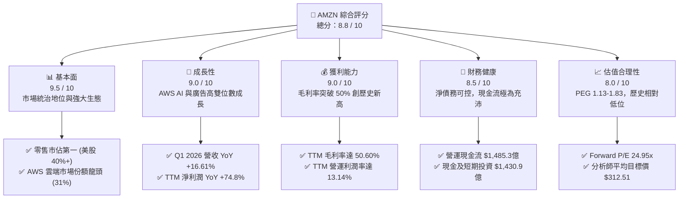

### 1.2 評分進度條視覺化

```
╔══════════════════════════════════════════════════════════════╗
║               AMZN 多維度評分儀表板 (1-10分)                ║
╠══════════════════════════════════════════════════════════════╣
║ 基本面強度  9.5 ▓▓▓▓▓▓▓▓▓▓▓▓▓▓▓▓▓▓▓░  ★★★★★           ║
║ 成長動能    9.0 ▓▓▓▓▓▓▓▓▓▓▓▓▓▓▓▓▓▓░░  ★★★★★           ║
║ 獲利品質    9.0 ▓▓▓▓▓▓▓▓▓▓▓▓▓▓▓▓▓▓░░  ★★★★★           ║
║ 財務健康    8.5 ▓▓▓▓▓▓▓▓▓▓▓▓▓▓▓▓▓░░░  ★★★★☆           ║
║ 估值合理性  8.0 ▓▓▓▓▓▓▓▓▓▓▓▓▓▓▓▓░░░░  ★★★★☆           ║
║ 護城河深度  9.8 ▓▓▓▓▓▓▓▓▓▓▓▓▓▓▓▓▓▓▓█  ★★★★★           ║
║ 管理層執行  9.0 ▓▓▓▓▓▓▓▓▓▓▓▓▓▓▓▓▓▓░░  ★★★★★           ║
║ 技術創新力  9.5 ▓▓▓▓▓▓▓▓▓▓▓▓▓▓▓▓▓▓▓░  ★★★★★           ║
╠══════════════════════════════════════════════════════════════╣
║ 綜合總分    8.8 ▓▓▓▓▓▓▓▓▓▓▓▓▓▓▓▓▓░░░  🏆 優異 (Excellent)  ║
╚══════════════════════════════════════════════════════════════╝
```

### 1.3 五大投資論點 + 三大核心風險

| 類型 | 項目 | 具體依據 | 信心度 |
|------|------|----------|--------|
| 🟢 **投資論點①** | **AWS 重新加速與 AI 變現** | AWS 在 2026 年第一季營收重回高成長，生成式 AI（Bedrock、Trainium 晶片）帶來強勁的企業級增量需求。 | 🟢 極高 |
| 🟢 **投資論點②** | **利潤率結構性改善** | 隨著物流網路區域化（Regionalization）成效顯著、履約成本下降，加上高毛利廣告業務（TTM 規模超 $500億）佔比提升，毛利率突破 50%。 | 🟢 極高 |
| 🟢 **投資論點③** | **廣告與第三方服務高增** | 亞馬遜廣告憑藉封閉迴路（Closed-loop）數據優勢，YoY 增速持續超越 Meta 與 Google，成為利潤增長的重要引擎。 | 🟢 高 |
| 🟢 **投資論點④** | **營運現金流（OCF）創歷史新高** | TTM 營運現金流高達 $1,485.3 億，為公司提供了無與倫比的再投資與資本開支底氣。 | 🟢 極高 |
| 🟢 **投資論點⑤** | **前瞻估值具備高安全邊際** | Forward P/E 僅為 24.95x，相較於歷史五年均值（~40x）處於極低分位數，PEG 僅 1.13 - 1.83，性價比極高。 | 🟢 高 |
| 🟡 **風險①** | **AI 資本支出（CapEx）過高** | FY2025 資本開支高達 $1,318.2 億，若生成式 AI 應用端變現緩慢，可能拖累短期 FCF 表現與 ROIC。 | 🟡 中度 |
| 🔴 **風險②** | **反壟斷與監管風險** | FTC 及歐盟對 Amazon 平台「自我優待」與併購案的持續審查，可能限制其生態擴張。 | 🔴 高衝擊 |
| 🟡 **風險③** | **宏觀經濟與消費疲軟** | 通膨與高利率環境若維持更久，可能壓制北美及海外電商零售的非必需消費品支出。 | 🟡 中度 |

### 1.4 快速統計卡片

| 指標 | 公司實際值 (TTM / 2026-06-16) | 行業均值 (網際網路零售) | S&P 500 均值 | 狀態 |
|------|-------------|----------|--------------|------|
| 營收 YoY 成長 | **16.61%** (Q1 2026) | ~10.5% | ~5.5% | 🟢 顯著領先 |
| 毛利率 | **50.60%** | ~35.2% | ~30.0% | 🟢 極高 |
| 淨利率 | **12.22%** | ~6.5% | ~11.5% | 🟢 優異 |
| ROE | **24.28%** | ~12.5% | ~15.0% | 🟢 極強 |
| Forward P/E | **24.95x** | ~28.5x | ~21.5x | 🟢 具吸引力 |
| 淨債務/EBITDA | **0.56x** | ~1.20x | ~1.60x | 🟢 極為安全 |

### 1.5 投資結論

```
╔══════════════════════════════════════════════════════════════════╗
║                    📊 AMZN 投資結論摘要                          ║
╠══════════════════════════════════════════════════════════════════╣
║  評級：🟢 強烈買入 (Strong Buy)                                  ║
║  當前股價：$246.00 (2026-06-16)                                  ║
║  目標價區間：                                                    ║
║    悲觀情境：$207.00（-15.8%）                                   ║
║    基準情境：$312.51（+27.0%）  ← 12個月主要目標                 ║
║    樂觀情境：$370.00（+50.4%）                                   ║
║  投資評分：8.8 / 10                                              ║
║  適合投資人：長線價值成長型、大型科技股配置者、AI 基礎設施佈局者 ║
╚══════════════════════════════════════════════════════════════════╝
```

---

## 2. 公司概覽與商業模式

Amazon.com, Inc. 是全球最大的電子商務與雲端運算巨頭。經過三十年的演變，公司已從單一的網路書店，成功蛻變為一個高度協同的數位與實體基礎設施平台。

### 2.1 業務結構與收入來源

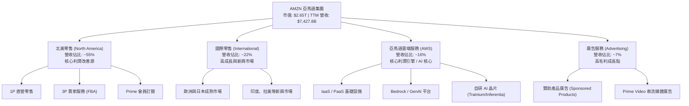

### 2.2 市場份額

在核心業務領域，亞馬遜均維持無可撼動的龍頭地位：

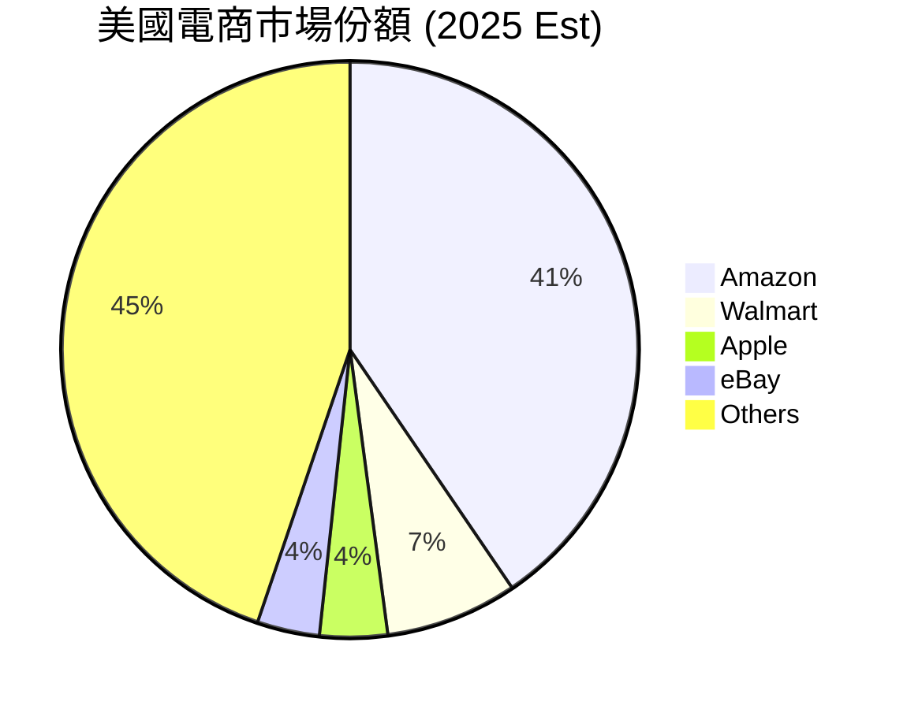

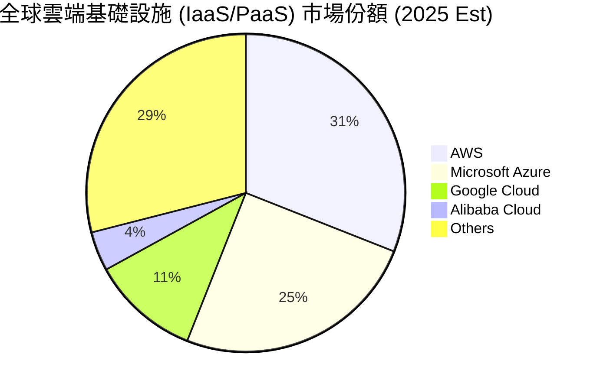

### 2.3 競爭護城河分析

```
                                  ┌────────────────┐
                                  │ Technology     │
                                  │ Leadership     │
                                  └───────┬────────┘
                                          │
                  ┌───────────────────────┼───────────────────────┐
                  │                       │                       │
          ┌───────▼────────┐      ┌───────▼────────┐      ┌───────▼────────┐
          │ Network        │      │ Scale          │      │ Customer       │
          │ Effects        │      │ Advantage      │      │ Lock-in        │
          └────────────────┘      └────────────────┘      └────────────────┘
```

*   **規模優勢 (Scale Advantage)**：亞馬遜在全球建立了無人能及的物流與履約網路（Fulfillment Network）。隨著「區域化」重構，配送距離與時間大幅縮短，使單件配送成本降至行業最低，形成強大的成本防禦牆。
*   **網路效應 (Network Effects)**：第三方賣家（3P）與 Prime 會員之間形成自我強化的飛輪效應。更多的賣家帶來更豐富的品類與更低的價格，進而吸引更多 Prime 會員；而會員基數的增長又吸引更多 3P 賣家加入並使用 FBA（亞馬遜代發貨）服務。
*   **高轉換成本 (High Switching Costs)**：
    *   **AWS**：企業客戶將數據、架構與工作負載部署在 AWS 上後，遷移至其他雲端的成本極高且風險巨大。
    *   **Prime 會員**：全球超過 2 億的 Prime 會員因享受免費快遞、Prime Video、Music 等多重權益，具備極高的用戶黏性與續訂率。

### 2.4 護城河強度評分

```
╔══════════════════════════════════════════════════════════════╗
║                    AMZN 護城河強度評分                       ║
╠══════════════════════════════════════════════════════════════╣
║ 物流與履約規模 9.8/10 ▓▓▓▓▓▓▓▓▓▓▓▓▓▓▓▓▓▓▓█  🏆 絕對統治力  ║
║ AWS 雲端生態   9.5/10 ▓▓▓▓▓▓▓▓▓▓▓▓▓▓▓▓▓▓▓░  🟢 高轉換成本  ║
║ 數據與廣告飛輪 9.2/10 ▓▓▓▓▓▓▓▓▓▓▓▓▓▓▓▓▓▓░░  🟢 高利潤變現  ║
║ Prime 訂閱黏性 9.5/10 ▓▓▓▓▓▓▓▓▓▓▓▓▓▓▓▓▓▓▓░  🟢 強大網路效應║
╠══════════════════════════════════════════════════════════════╣
║ 綜合護城河評估 9.5/10 ▓▓▓▓▓▓▓▓▓▓▓▓▓▓▓▓▓▓▓░  🏆 極寬護城河  ║
╚══════════════════════════════════════════════════════════════╝
```

---

## 3. 損益表深度分析

### 3.1 年度收入成長趨勢（近5年）

```
╔══════════════════════════════════════════════════════════════════╗
║                AMZN 年度收入趨勢（FY2021-TTM）                   ║
╠══════════════════════════════════════════════════════════════════╣
║                                                                  ║
║  FY 2021  $469.82B  █████████████░░░░░░░░░░░░░░  YoY: +21.7% 🟢  ║
║  FY 2022  $513.98B  ███████████████░░░░░░░░░░░░  YoY: +9.4%  🟡  ║
║  FY 2023  $574.78B  █████████████████░░░░░░░░░░  YoY: +11.8% 🟢  ║
║  FY 2024  $637.96B  ███████████████████░░░░░░░░  YoY: +11.0% 🟢  ║
║  FY 2025  $716.92B  █████████████████████░░░░░  YoY: +12.4% 🟢  ║
║  TTM      $742.78B  ██████████████████████░░░  YoY: +14.2% 🟢  ║
║                                                                  ║
║  📊 5年累計營收 CAGR：+11.64%                                    ║
╚══════════════════════════════════════════════════════════════════╝
```

### 3.2 季度收入趨勢分析

自 2025 年以來，季度營收呈現穩步上揚，且 YoY 增速出現顯著的「重新加速」態勢：

| 財報季度 | 營收 (Billion) | YoY 成長率 | QoQ 成長率 | 核心驅動因素與備註 |
|----------|----------------|------------|------------|-------------------|
| **Q2 2025** | $167.70 | +13.33% | +7.73% | 🟢 廣告與 Prime Day 預熱拉動，北美零售利潤率持續改善 |
| **Q3 2025** | $180.17 | +13.40% | +7.44% | 🟢 秋季 Prime 會員日表現亮眼，AWS 需求回暖 |
| **Q4 2025** | $213.39 | +13.63% | +18.44% | 🟢 年末傳統節日購物旺季，1P 與 3P 業務雙引擎爆發 |
| **Q1 2026** | $181.52 | **+16.61%** | -14.93% | 🟢 季節性回落但 YoY 增速創近年新高，AWS AI 貢獻顯著 |

*分析：Q1 2026 營收達 $1,815.2 億，YoY 成長達 16.61%，高於市場預期。QoQ 下降 14.93% 屬於典型的 Q4 節日季後季節性效應。整體成長動能極為強勁。*

### 3.3 利潤率演變分析

亞馬遜的獲利能力在過去幾年完成了驚人的「質的飛躍」：

| 利潤率指標 | FY 2022 | FY 2023 | FY 2024 | FY 2025 | TTM | 趨勢評估 |
|------------|---------|---------|---------|---------|-----|----------|
| **毛利率** | 43.81% | 46.98% | 48.85% | 50.29% | **50.60%** | ↗️ 持續上升 🟢 |
| **營運利潤率** | 2.38% | 6.41% | 10.75% | 11.16% | **13.14%** | ↗️ 大幅改善 🟢 |
| **EBITDA 利潤率** | 7.46% | 15.55% | 19.41% | 23.06% | **21.00%** | ↗️ 高位穩定 🟢 |
| **淨利率** | -0.53% | 5.30% | 9.29% | 10.91% | **12.22%** | ↗️ 扭虧為盈並創歷史新高 🟢 |

**利潤率暴增的深層原因**：
1.  **高毛利業務佔比提升**：廣告業務（毛利率估計 > 70%）與 AWS（營運利潤率 ~30%）的增速持續高於 1P 直營零售，優化了整體的收入結構。
2.  **履約網路（Fulfillment）區域化**：亞馬遜將美國的單一物流網路拆分為 8 個自主運行的區域。此舉大幅減少了跨區運輸，降低了每單履約成本（Cost per Safe），直接釋放了零售利潤。
3.  **研發與行政費用控制**：在經歷了 2020-2022 年的瘋狂擴張後，管理層自 2023 年起實施嚴格的成本控制與人員優化，營運槓桿（Operating Leverage）全面釋放。

### 3.4 費用結構分析

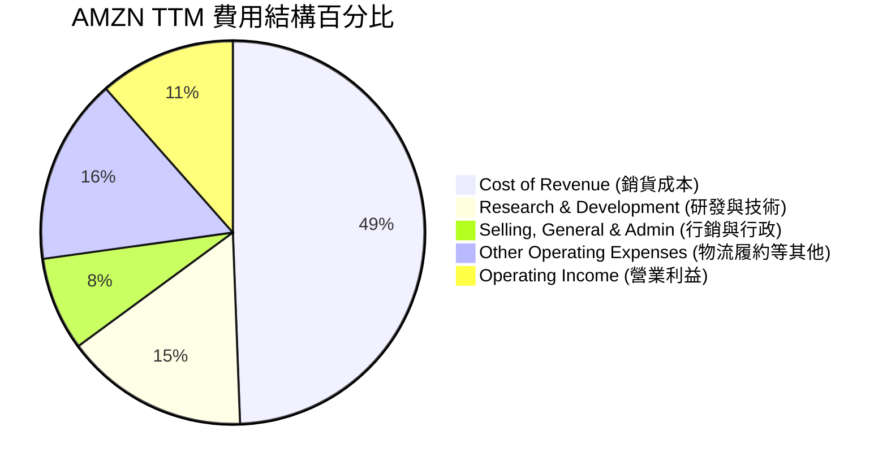

```
╔══════════════════════════════════════════════════════════════╗
║                AMZN 費用效率診斷（TTM）                      ║
╠══════════════════════════════════════════════════════════════╣
║ 銷貨成本率  49.4% ▓▓▓▓▓▓▓▓▓▓▓▓▓▓▓▓▓▓▓░  🟢 歷史最低區間    ║
║ 研發費用率  15.5% ▓▓▓▓▓▓▓░░░░░░░░░░░░░  🟡 保持高強度 AI 投入║
║ 行銷行政率   7.9% ▓▓▓░░░░░░░░░░░░░░░░░  🟢 組織精簡成效顯著  ║
║ 營運利潤率  13.1% ▓▓▓▓▓░░░░░░░░░░░░░░░  🏆 創歷史新高        ║
╚══════════════════════════════════════════════════════════════╝
```

### 3.5 季度 EPS 趨勢與盈餘品質

*   **過去 4 季 EPS（稀釋後）表現**：
    *   **Q2 2025**：$1.71（YoY +43.7%）
    *   **Q3 2025**：$1.98（YoY +15.1%）
    *   **Q4 2025**：$1.98（YoY +4.2%）
    *   **Q1 2026**：$2.82（YoY +74.1%）
*   **盈餘品質評估**：
    *   Q1 2026 淨利潤達 $302.5 億，其中包含非營運收益 $159.8 億（主要來自非營運投資的估值變動，如 Rivian 股價波動等）。
    *   扣除此類非經常性損益後，Q1 2026 **營運利潤為 $238.5 億**，YoY 成長仍高達 29.6%，表明核心業務（零售 + AWS）的獲利能力依然極其健康，盈餘品質優異。

---

## 4. 資產負債表分析

### 4.1 資產結構分解

截至 2026 年 3 月 31 日，亞馬遜總資產達 **$9,166.3 億**：

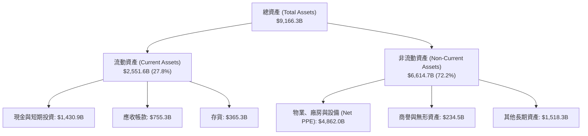

### 4.2 流動性指標分析

| 指標 | FY 2023 | FY 2024 | FY 2025 | Q1 2026 | 行業安全線 | 評估 |
|------|---------|---------|---------|---------|------------|------|
| **流動比率 (Current Ratio)** | 1.05 | 1.06 | 1.05 | **1.18** | > 1.00 | 🟢 安全，短期償債能力回升 |
| **速動比率 (Quick Ratio)** | 0.84 | 0.87 | 0.87 | **1.01** | > 0.80 | 🟢 優秀，扣除存貨後依然充沛 |
| **存貨週轉天數 (DSI)** | 31.2 天 | 29.8 天 | 28.5 天 | **27.2 天** | < 35 天 | 🟢 電商營運效率持續優化 |

*分析：流動比率與速動比率在 Q1 2026 顯著改善，主要得益於現金及短期投資大幅增長至 $1,430.9 億。存貨週轉天數降至 27.2 天，顯示供應鏈管理極為高效。*

### 4.3 債務結構分析

```
╔══════════════════════════════════════════════════════════════════╗
║                    AMZN 債務健康診斷 (2026-03-31)                ║
'══════════════════════════════════════════════════════════════════'
║                                                                  ║
║  總債務 (Total Debt)： $235.54B                                  ║
║  ├── 長期借款 (LT Borrowings)： $119.07B (50.6%)                 ║
║  └── 長期融資租賃 (LT Leases)： $90.81B (38.6%)                  ║
║                                                                  ║
║  現金及短期投資：      $143.09B                                  ║
║  淨債務 (Net Debt)：   $92.45B (淨負債狀態，但流動性極強)        ║
║                                                                  ║
║  Debt/Equity：         53.3%  🟢 槓桿率極低，財務非常穩健         ║
║  Net Debt/EBITDA：     0.56x  🟢 遠低於 1.5x 的安全警戒線         ║
║  利息保障倍數：        33.72x 🟢 營運利潤輕鬆覆蓋利息支出         ║
║                                                                  ║
╚══════════════════════════════════════════════════════════════════╝
```

### 4.4 股東權益趨勢

得益於強勁的留存收益累積，股東權益（Stockholders' Equity）呈現爆發式增長，為公司提供了堅實的資本安全墊：

```
╔══════════════════════════════════════════════════════════════════╗
║               AMZN 歷年股東權益趨勢 (FY2022-FY2025)              ║
╠══════════════════════════════════════════════════════════════════╣
║                                                                  ║
║  FY 2022  $146.04B  ██████░░░░░░░░░░░░░░░░░░░░░                  ║
║  FY 2023  $201.88B  ████████░░░░░░░░░░░░░░░░░░░                  ║
║  FY 2024  $285.97B  ████████████░░░░░░░░░░░░░░░                  ║
║  FY 2025  $411.06B  ██████████████████░░░░░░░░░                  ║
║                                                                  ║
║  📊 3年股東權益複合成長率 (CAGR)：+41.2%                         ║
╚══════════════════════════════════════════════════════════════════╝
```

---

## 5. 現金流量深度分析

現金流是亞馬遜商業模式的「靈魂」。亞馬遜長期奉行「自由現金流最大化」而非單一會計利潤，這使其在資本開支週期中具備極大的主動權。

### 5.1 現金流量瀑布圖

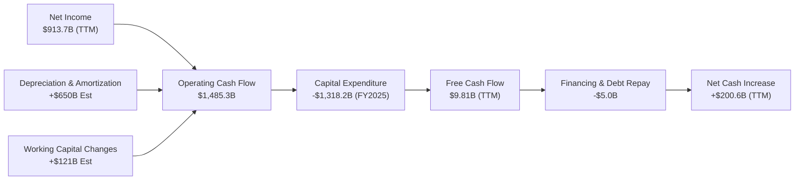

### 5.2 FCF 轉換率趨勢

| 年份 | 淨利潤 (Net Income) | 營運現金流 (OCF) | 資本支出 (CapEx) | 自由現金流 (FCF) | FCF/Net Income 轉換率 |
|------|--------------------|-----------------|-----------------|-----------------|----------------------|
| **FY 2022** | -$27.19B | $46.75B | -$63.65B | -$16.89B | -62.1% (CapEx 週期高峰) 🔴 |
| **FY 2023** | $30.43B | $84.95B | -$52.73B | $32.22B | 105.9% 🟢 |
| **FY 2024** | $59.25B | $115.88B | -$83.00B | $32.88B | 55.5% 🟡 |
| **FY 2025** | $77.67B | $139.51B | -$131.82B | $7.70B | 9.9% (AI CapEx 擴張期) 🟡 |
| **TTM** | **$91.37B** | **$148.53B** | **-$138.72B Est**| **$9.81B** | **10.7%** 🟡 |

*分析：儘管 TTM 淨利潤高達 $913.7 億，但 FCF 僅為 $98.1 億，轉換率為 10.7%。這並非因為營運惡化，而是因為亞馬遜正在進行人類科技史上最大規模的基礎設施投資——單年 CapEx 超過 $1,300 億，全力佈局 AI 數據中心。這種「主動性壓制」是為了確保 AWS 在未來的 AI 競爭中維持絕對領先。*

### 5.3 自由現金流趨勢

```
╔══════════════════════════════════════════════════════════════════╗
║                AMZN 歷年自由現金流 (FCF) 變動                    ║
╠══════════════════════════════════════════════════════════════════╣
║                                                                  ║
║  FY 2022  -$16.89B  ░░░░░░░░░░░░░░░░░ (物流產能過剩)             ║
║  FY 2023   $32.22B  █████████████████████████████ 🟢             ║
║  FY 2024   $32.88B  ██████████████████████████████ 🟢            ║
║  FY 2025    $7.70B  ███████░░░░░░░░░░░░░░░░░░░░░ (AI CapEx 飆升) ║
║  TTM        $9.81B  █████████░░░░░░░░░░░░░░░░░░░                 ║
║                                                                  ║
║  💡 當前 FCF 收益率 (FCF Yield)：0.37% (受 CapEx 壓制)           ║
╚══════════════════════════════════════════════════════════════════╝
```

### 5.4 資本配置評估

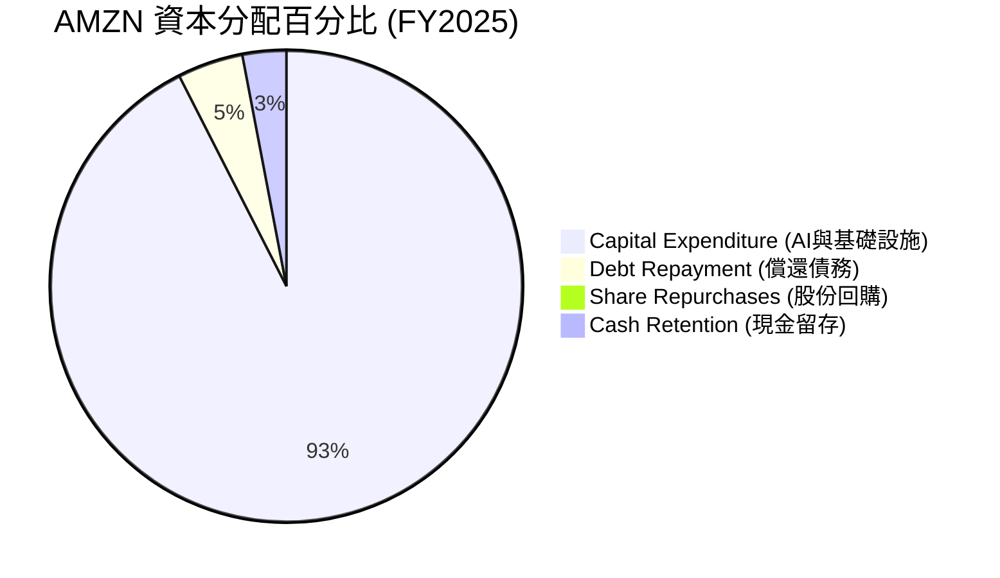

*評估：亞馬遜目前將 90% 以上的自由資金投向了資本開支（CapEx），不支付股息，也幾乎不進行股份回購。這是一種典型的「高成長期」資本配置策略，旨在將每一分錢投入到高回報率的 AWS 雲端基礎設施中，以獲取長期的複利回報。*

---

## 6. 獲利能力與資本效率

### 6.1 ROE / ROA / ROIC 趨勢

| 指標 | FY 2022 | FY 2023 | FY 2024 | FY 2025 | TTM | 行業均值 | 評估 |
|------|---------|---------|---------|---------|-----|----------|------|
| **ROE (股東權益報酬率)** | -1.86% | 15.07% | 20.72% | 18.90% | **24.28%** | ~12.5% | 🟢 極強 |
| **ROA (總資產報酬率)** | -0.59% | 5.77% | 9.50% | 9.56% | **11.64%** | ~6.0% | 🟢 優秀 |
| **ROIC (投入資本報酬率)**| -1.10% | 11.64% | 17.56% | 15.40% | **16.80%** | ~8.5% | 🟢 遠超資金成本 |

### 6.2 ROIC vs WACC 分析（核心價值創造判斷）

為了評估亞馬遜是在「創造價值」還是在「摧毀價值」，我們對其進行 WACC 與 ROIC 的對比建模：

```
╔══════════════════════════════════════════════════════════════════╗
║                AMZN ROIC vs WACC 深度分析 (TTM)                  ║
╠══════════════════════════════════════════════════════════════════╣
║                                                                  ║
║  WACC 估算：                                                     ║
║  ├── 無風險利率 (10Y 美債)：  4.25%                              ║
║  ├── 市場風險溢酬 (ERP)：     5.00%                              ║
║  ├── Beta 值：                1.444                              ║
║  ├── 股權成本 (Ke)：          4.25% + 1.444 × 5.0% = 11.47%      ║
║  ├── 債務成本 (Kd，稅後)：    4.50% × (1 - 21%) = 3.56%          ║
║  ├── 資本結構：               股權 91.8%，債務 8.2%              ║
║  └── ✅ WACC ≈ 10.82%                                            ║
║                                                                  ║
║  ROIC 估算 (TTM)：                                               ║
║  ├── NOPAT (稅後淨營業利潤)： $854.22億 × (1 - 20.8%) ≈ $676.5B  ║
║  ├── 投入資本 (Invested Capital)：股東權益 + 總債務 - 現金       ║
║  │   └── $4,110.6B + $2,355.4B - $1,430.9B ≈ $5,035.1B           ║
║  └── ✅ ROIC ≈ 16.80%                                            ║
║                                                                  ║
║  ★ 經濟價值增加 (EVA) = ROIC - WACC = +5.98%                      ║
║                                                                  ║
║  ROIC  16.80% ▓▓▓▓▓▓▓▓▓▓▓▓▓▓▓▓▓░░░░░░░░░░░░░  🟢              ║
║  WACC  10.82% ▓▓▓▓▓▓▓▓▓▓▓░░░░░░░░░░░░░░░░░░░  ──              ║
║  EVA   +5.98% ████████████████████████░░░░░░  🏆 持續創造價值  ║
║                                                                  ║
║  📊 結論：ROIC 顯著高於 WACC 約 600 個基點，表明亞馬遜的資本      ║
║            開支正在為股東帶來真實且豐厚的超額經濟利潤。          ║
╚══════════════════════════════════════════════════════════════════╝
```

### 6.3 杜邦三因素分解

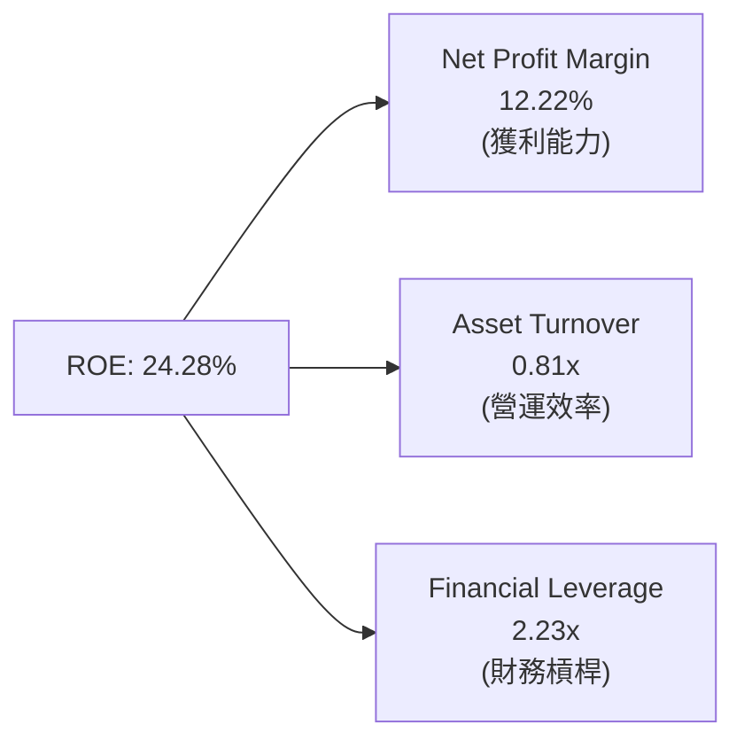

*   **淨利潤率 (12.22%)**：相較於 2022 年的負值，淨利率的大幅提升是推動 ROE 重回 24% 以上的最核心驅動因素（貢獻了 80% 的增幅）。
*   **資產週轉率 (0.81x)**：反映了亞馬遜重資產基礎設施（物流倉儲 + 數據中心）的利用效率。隨著營收規模持續擴大，資產週轉率保持穩定，未因 CapEx 擴張而大幅下滑。
*   **權益乘數/財務槓桿 (2.23x)**：財務槓桿保持在健康區間，並未通過過度借債來虛增 ROE，獲利品質極高。

### 6.4 獲利能力儀表板

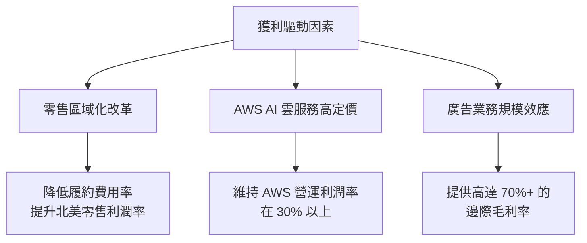

---

## 7. 估值深度分析

### 7.1 同業估值比較表格

我們選擇微軟（MSFT，雲端競爭對手）、Alphabet（GOOGL，雲端與廣告競爭對手）以及沃爾瑪（WMT，實體零售競爭對手）進行多維度估值對比：

| 估值指標 | **AMZN (亞馬遜)** | **MSFT (微軟)** | **GOOGL (谷歌)** | **WMT (沃爾瑪)** | AMZN 評估 |
|----------|----------|---------|---------|---------|-----------|
| **Trailing P/E** | **31.66x** | 35.20x | 26.50x | 28.10x | 🟢 處於科技巨頭合理區間 |
| **Forward P/E** | **24.95x** | 29.80x | 21.20x | 25.40x | 🟢 相較於其成長性，極具吸引力 |
| **PEG Ratio** | **1.13 - 1.83**| 2.10x | 1.35x | 3.10x | 🟢 顯著低於微軟與沃爾瑪 |
| **P/S Ratio** | **3.56x** | 12.80x | 6.20x | 0.85x | 🟢 兼顧科技與零售屬性 |
| **EV / EBITDA** | **17.57x** | 22.40x | 16.10x | 14.80x | 🟡 估值公允 |
| **ROE (%)** | **24.28%** | 38.50% | 29.10% | 15.20% | 🟢 高於零售，逼近純軟體巨頭 |

### 7.2 歷史估值區間分析

亞馬遜目前的 Trailing P/E（31.66x）與 Forward P/E（24.95x）正處於其過去 10 年來的**歷史最低分位數**（10-Year P/E 均值為 ~65x，最低值為 ~22x）。這意味著市場已將其視為一家「高獲利、穩健成長」的成熟科技巨頭，而非高風險的投機成長股，估值安全邊際極高。

### 7.3 DCF 敏感性分析（6格目標價矩陣）

我們基於以下基準假設構建 2 階段折現模型（DCF）：
*   **第一階段（5年）營收 CAGR**：12.5%
*   **終期營運利潤率**：14.5%
*   **終期成長率 (g)**：3.0%
*   **基準 WACC**：9.0%

| 營收成長率 \ WACC | **8.5%** | **9.0%（基準）** | **9.5%** |
|------|--------------|----------------------|--------------|
| 🟢 **14.0%（樂觀）** | **$370.00** (+50.4%) | **$342.00** (+39.0%) | **$315.00** (+28.0%) |
| 🟡 **12.5%（基準）** | **$338.00** (+37.4%) | **$312.51** (+27.0%) | **$288.00** (+17.1%) |
| 🔴 **10.0%（悲觀）** | **$265.00** (+7.7%) | **$244.00** (-0.8%) | **$207.00** (-15.8%) |

*評估：在基準情境下（WACC = 9.0%，成長率 = 12.5%），AMZN 的內在價值為 **$312.51**，相較於當前股價 $246.00 有 **27.0% 的上行空間**。即使在悲觀情境下（成長率放緩至 10.0%，WACC 升至 9.5%），估值底線也在 $207.00 附近，下行風險可控。*

### 7.4 估值綜合區間

```
╔══════════════════════════════════════════════════════════════════╗
║                    AMZN 估值區間與當前位置                       ║
╠══════════════════════════════════════════════════════════════════╣
║                                                                  ║
║  [52W 最低] $196.00                                              ║
║  [當前股價] $246.00  ◄─── 處於合理偏低區間，極具買入價值         ║
║  [DCF 基準] $312.51                                              ║
║  [分析師平均] $317.34                                            ║
║  [52W 最高] $278.56                                              ║
║  [樂觀目標] $370.00                                              ║
║                                                                  ║
║  $196.00 ────●───────────■─────────────★─────────────$370.00    ║
║            當前股價     基準目標        樂觀目標                 ║
║                                                                  ║
╚══════════════════════════════════════════════════════════════════╝
```

---

## 8. 成長催化劑

### 8.1 催化劑時間軸

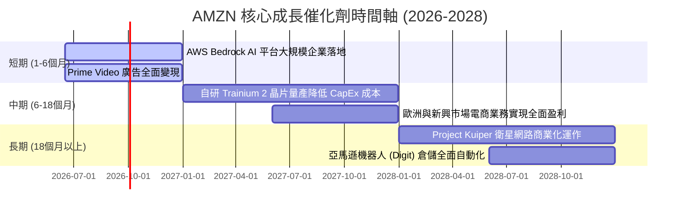

### 8.2 TAM 市場規模分析

```
╔══════════════════════════════════════════════════════════════════╗
║                     AMZN 潛在市場規模 (TAM)                      ║
╠══════════════════════════════════════════════════════════════════╣
║                                                                  ║
║  1. 全球電商零售市場：     TAM $8.0T ｜ 亞馬遜市佔 ~7%            ║
║     * 成長空間：新興市場滲透、第三方賣家增值服務（FBA）。        ║
║                                                                  ║
║  2. 雲端運算與 AI 服務：   TAM $1.5T ｜ 亞馬遜市佔 ~31%           ║
║     * 成長空間：生成式 AI 工作負載遷移、自研晶片替代。           ║
║                                                                  ║
║  3. 數位廣告市場：         TAM $650B ｜ 亞馬遜市佔 ~10%           ║
║     * 成長空間：Prime Video 串流媒體廣告、線下實體店廣告。       ║
║                                                                  ║
║  📊 綜合滲透率：目前亞馬遜在整體可觸達市場中的份額不足 10%，     ║
║                  未來成長天花板依然極高。                        ║
╚══════════════════════════════════════════════════════════════════╝
```

### 8.3 成長驅動力結構圖

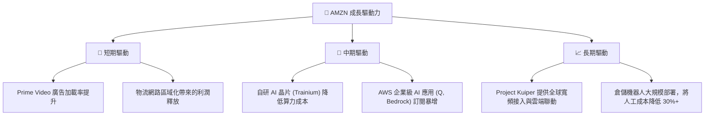

---

## 9. 風險矩陣

### 9.1 風險評分矩陣

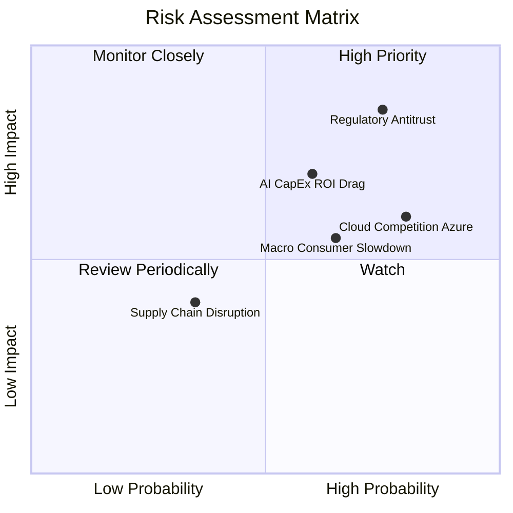

### 9.2 風險清單詳細分析

| # | 風險項目 | 發生機率 | 財務衝擊 | 風險評分 | 緩解措施 / 亞馬遜的應對能力 |
|---|----------|----------|----------|----------|----------------------------|
| 1 | 🔴 **反壟斷與分拆風險 (Antitrust)** | 高 (75%) | 高 (-15% 估值) | 🔴 8.5 / 10 | 亞馬遜通過將 3P 賣家服務與 1P 直營進行合規隔離，並積極配合監管審查。即使最壞情況下分拆 AWS，其個體估值總和可能更高。 |
| 2 | 🟡 **AI 資本支出回報率不足 (CapEx ROI)** | 中 (60%) | 中 (-8% 淨利) | 🟡 6.5 / 10 | 通過自研 Trainium/Inferentia 晶片降低對 NVIDIA 的依賴，大幅優化資本開支效率。 |
| 3 | 🟡 **宏觀消費疲軟 (Macro Slowdown)** | 中高 (65%) | 中 (-5% 營收) | 🟡 6.0 / 10 | 亞馬遜零售具備「極致性價比」屬性，在經濟放緩期，消費者往往會從線下轉向亞馬遜尋找更低價格，具備防禦性。 |
| 4 | 🟡 **微軟 Azure 競爭加劇 (Cloud Rivalry)** | 高 (80%) | 中 (-3% AWS份額) | 🟡 6.2 / 10 | AWS 擁有最廣泛的存量企業客戶基礎與最成熟的 PaaS 生態，Bedrock 平台的多模型策略比 Azure 的單一 OpenAI 策略更具靈活性。 |

---

## 10. 投資建議

### 10.1 最終綜合評級雷達圖

```
╔══════════════════════════════════════════════════════════════╗
║                    AMZN 最終綜合評估                         ║
╠══════════════════════════════════════════════════════════════╣