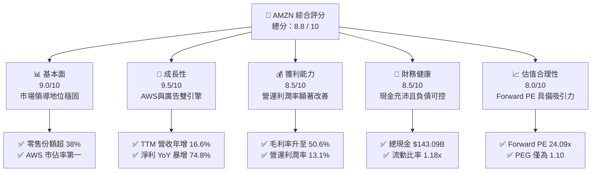
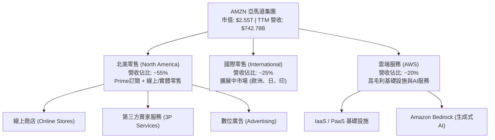
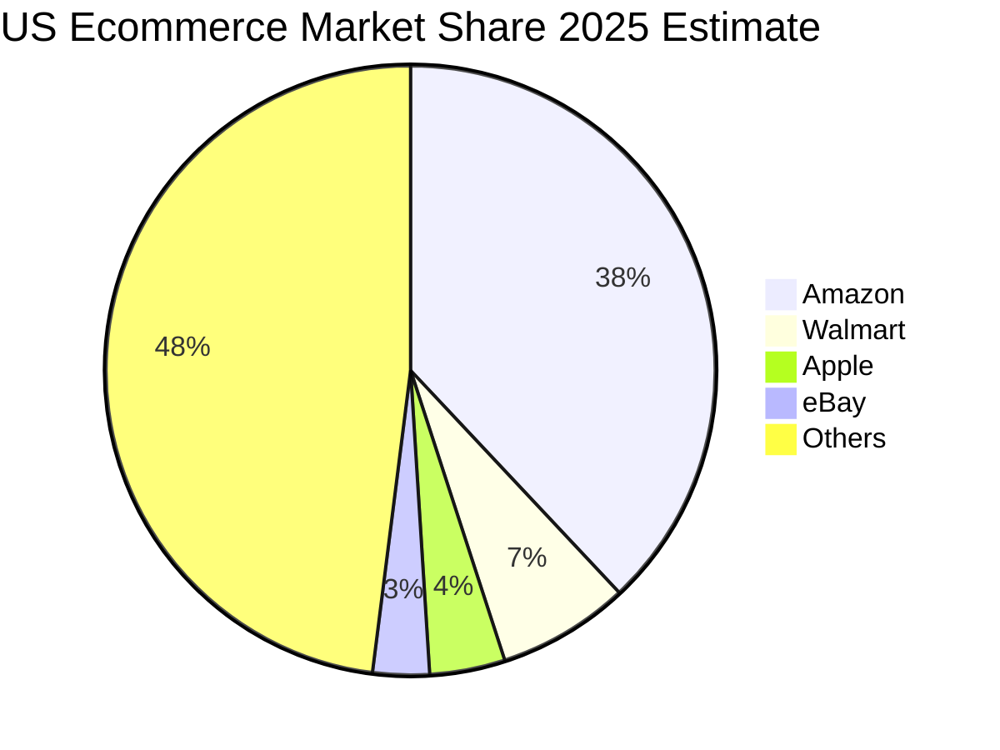
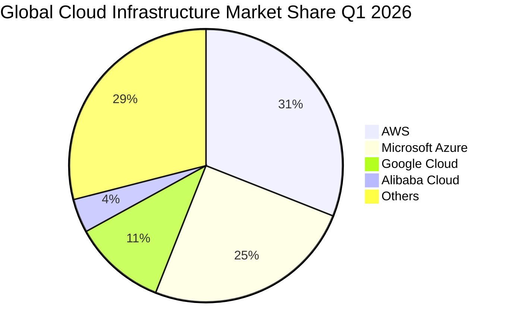
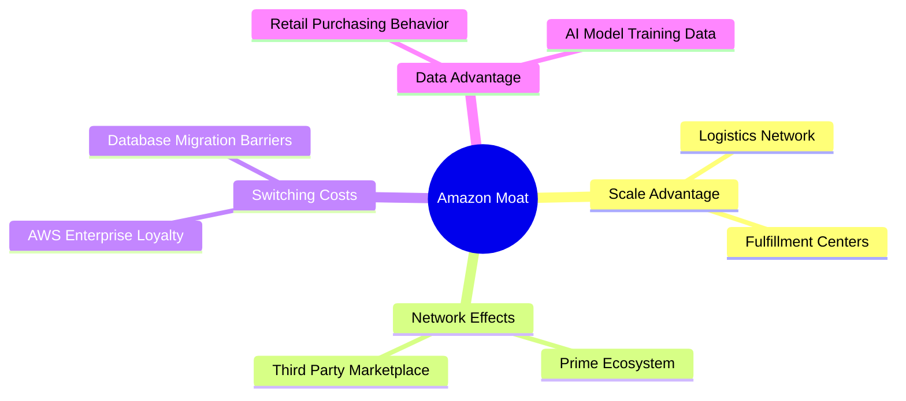
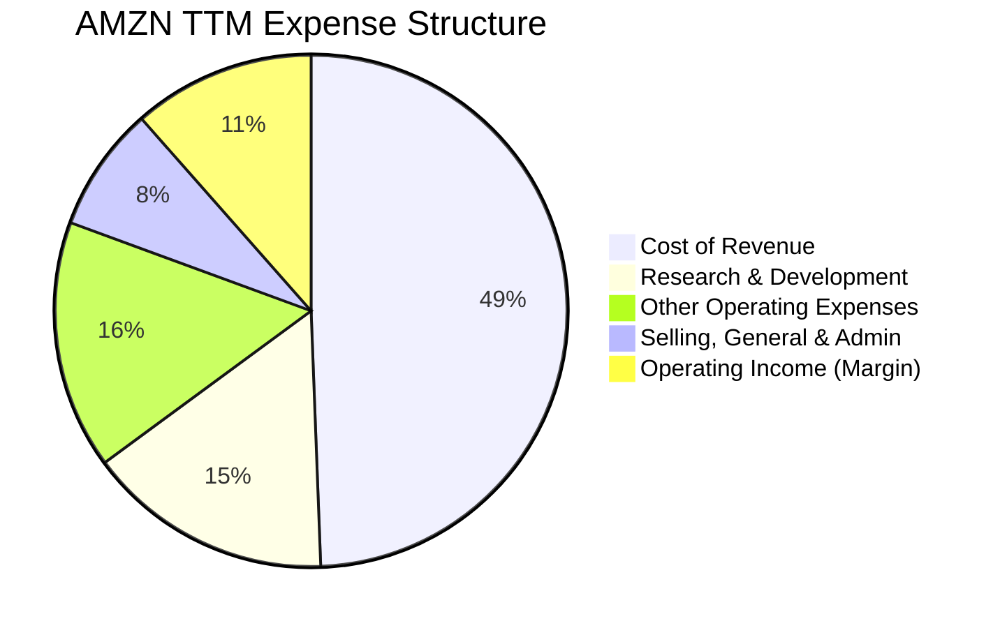
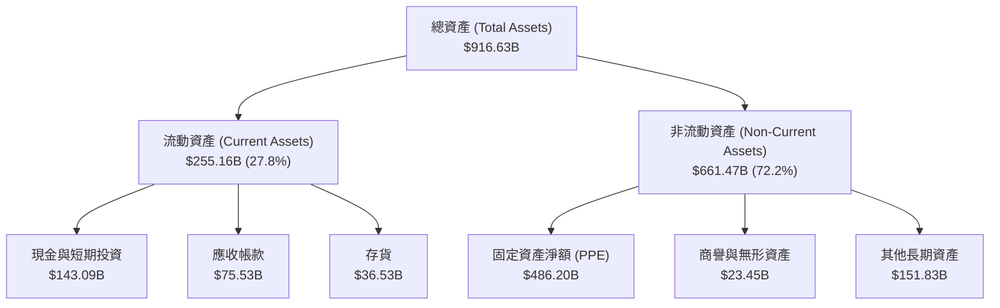
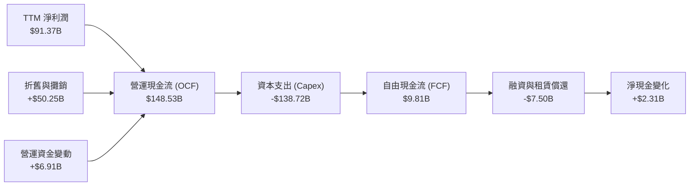
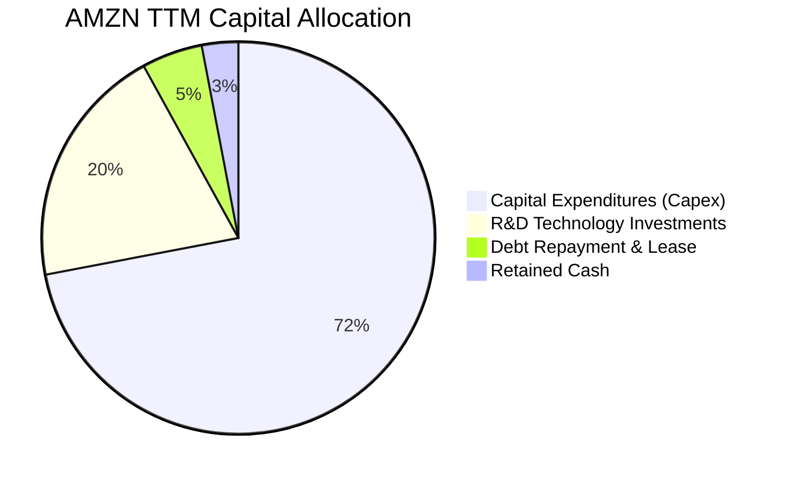
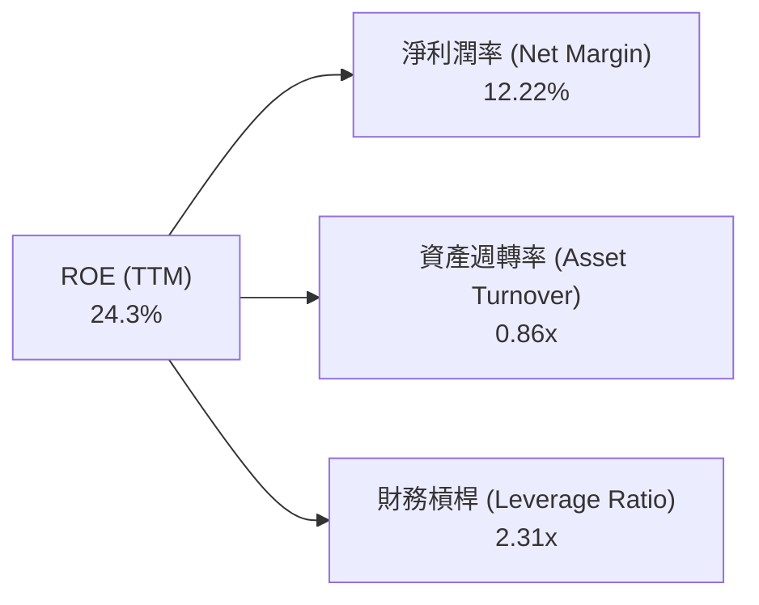

# AMZN 基本面深度分析報告
> **報告日期**：2026-06-17 ｜ **語言**：繁體中文 ｜ **數據來源**：Yahoo Finance, Finviz, StockAnalysis, Roic.ai ｜ **分析師**：CFA 級機構研究

---

## 目錄

| # | 章節 | 核心結論 |
|---|------|----------|
| 1 | **執行摘要** | 評級：🟢 強烈買入，12個月基準目標價：$312.99（隱含 +31.8% 報酬率） |
| 2 | **公司概覽與商業模式** | 電商、雲端（AWS）與數位廣告三輪驅動，具備極深之規模與網絡護城河 |
| 3 | **損益表深度分析** | TTM 營收達 $742.78B（YoY +16.6%），營運槓桿釋放帶動淨利暴增 74.8% |
| 4 | **資產負債表分析** | 現金儲備達 $143.09B，資產規模擴張至 $916.63B，財務結構極度穩健 |
| 5 | **現金流量深度分析** | 營運現金流高達 $148.53B，AI 資本支出大幅擴張，長期 FCF 生成能力無虞 |
| 6 | **獲利能力與資本效率** | ROE 達 24.3%，ROIC 顯著超越 WACC，持續為股東創造超額經濟價值 |
| 7 | **估值深度分析** | Forward P/E 24.09x 處於歷史低位，DCF 估值顯示股價具備高安全邊際 |
| 8 | **成長催化劑** | AWS 生成式 AI 商業化加速、廣告業務高毛利變現、物流網絡效率持續優化 |
| 9 | **風險矩陣** | AI 資本支出回報不及預期、反壟斷監管審查、核心電商利潤率受通膨壓制 |
| 10 | **投資建議** | 建議於當前 $237.50 分批佈局，長線投資人首選之大型科技藍籌股 |

---

## 1. 執行摘要

### 1.1 核心評分儀表板



### 1.2 評分進度條視覺化

```
╔══════════════════════════════════════════════════════════════╗
║               AMZN 多維度評分儀表板 (1-10分)                 ║
╠══════════════════════════════════════════════════════════════╣
║ 基本面強度  9.0 ▓▓▓▓▓▓▓▓▓▓▓▓▓▓▓▓▓▓░░  ★★★★★           ║
║ 成長動能    9.5 ▓▓▓▓▓▓▓▓▓▓▓▓▓▓▓▓▓▓▓░  ★★★★★           ║
║ 獲利品質    8.5 ▓▓▓▓▓▓▓▓▓▓▓▓▓▓▓▓░░░░  ★★★★☆           ║
║ 財務健康    8.5 ▓▓▓▓▓▓▓▓▓▓▓▓▓▓▓▓░░░░  ★★★★☆           ║
║ 估值合理性  8.0 ▓▓▓▓▓▓▓▓▓▓▓▓▓▓░░░░░░  ★★★★☆           ║
║ 護城河深度  9.5 ▓▓▓▓▓▓▓▓▓▓▓▓▓▓▓▓▓▓▓░  ★★★★★           ║
║ 管理層執行  9.0 ▓▓▓▓▓▓▓▓▓▓▓▓▓▓▓▓▓▓░░  ★★★★★           ║
║ 技術創新力  9.5 ▓▓▓▓▓▓▓▓▓▓▓▓▓▓▓▓▓▓▓░  ★★★★★           ║
╠══════════════════════════════════════════════════════════════╣
║ 綜合總分    8.8 ▓▓▓▓▓▓▓▓▓▓▓▓▓▓▓▓▓░░░  🏆 強烈買入          ║
╚══════════════════════════════════════════════════════════════╝
```

### 1.3 五大投資論點 + 三大核心風險

| 類型 | 項目 | 具體依據 | 信心度 |
|------|------|----------|--------|
| 🟢 **投資論點①** | **AWS 雲端重回加速通道** | Q1 2026 營收達 $181.52B（YoY +16.6%），AI 工作負載需求推動企業級雲端支出強勁復甦。 | 🟢 極高 |
| 🟢 **投資論點②** | **高毛利廣告業務爆發** | 廣告變現效率提升，伴隨 Prime Video 廣告全面推廣，成為毛利率（50.6%）擴張的主要功臣。 | 🟢 極高 |
| 🟢 **投資論點③** | **物流網絡區域化成效顯著** | 北美零售履約成本持續下降，帶動整體營運利潤率（Operating Margin）躍升至 13.1%。 | 🟢 高 |
| 🟢 **投資論點④** | **營運槓桿釋放** | 研發（R&D）與管理費用率（SG&A）增速低於營收增速，淨利潤（Net Income）YoY 暴增 74.8%。 | 🟢 高 |
| 🟢 **投資論點⑤** | **估值性價比極高** | Forward P/E 僅 24.09x，相較於歷史平均（>35x）與 PEG 1.10x，估值安全邊際極高。 | 🟢 極高 |
| 🟡 **風險①** | **AI 資本支出（Capex）過高** | FY2025 資本支出高達 $131.82B，若 AI 變現速度不如預期，短期將壓制自由現金流（FCF）。 | 🟡 中度 |
| 🔴 **風險②** | **聯邦貿易委員會（FTC）反壟斷** | FTC 對 Amazon 平台「買家箱（Buy Box）」與第三方賣家合約的訴訟可能限制其定價權。 | 🔴 高衝擊 |
| 🟡 **風險③** | **國際市場利潤率波動** | 歐洲與新興市場宏觀經濟疲軟，可能拖累國際部門（International）的獲利修復進度。 | 🟡 中度 |

### 1.4 快速統計卡片

| 指標 | 公司實際值 | 行業均值（零售/科技） | S&P 500 均值 | 狀態 |
|------|-------------|----------------------|--------------|------|
| **營收 YoY 成長率** | **16.6%** | ~7.5% | 5.2% | 🟢 強勁 |
| **毛利率** | **50.6%** | ~35.0% | 30.2% | 🟢 領先 |
| **營運利潤率** | **13.1%** | ~8.0% | 12.1% | 🟢 卓越 |
| **股東權益報酬率 (ROE)** | **24.3%** | ~15.0% | 18.5% | 🟢 優秀 |
| **預估本益比 (Forward P/E)**| **24.09x** | ~28.5x | 21.5x | 🟢 便宜 |
| **債務權益比 (Debt/Equity)**| **53.3%** | ~85.0% | 115.0% | 🟢 健康 |

### 1.5 投資結論

```
╔══════════════════════════════════════════════════════════════════╗
║                    📊 AMZN 投資結論摘要                          ║
╠══════════════════════════════════════════════════════════════════╣
║  評級：🟢 強烈買入 (Strong Buy)                                  ║
║  當前股價：$237.50 (2026-06-17)                                  ║
║  目標價區間：                                                    ║
║    悲觀情境：$207.00（-12.8%）                                   ║
║    基準情境：$312.99（+31.8%）  ← 12個月主要目標                 ║
║    樂觀情境：$370.00（+55.8%）                                   ║
║  投資評分：8.8/10                                                ║
║  適合投資人：長線成長型、科技龍頭配置、尋求營運槓桿釋放的投資人   ║
╚══════════════════════════════════════════════════════════════════╝
```

---

## 2. 公司概覽與商業模式

Amazon.com, Inc.（AMZN）已從最初的線上書商，演變為全球最大的多維生態系統。公司的商業模式本質上是透過「飛輪效應（Flywheel Effect）」將流量轉化為多重變現管道。

### 2.1 業務結構與收入來源



### 2.2 市場份額

Amazon 在美國電商市場與全球雲端基礎設施（IaaS）市場均佔據絕對主導地位：





### 2.3 競爭護城河分析



*   **規模優勢（Scale Economies Cost Advantage）**：Amazon 擁有全球最龐大的自建物流網絡。其區域化物流架構（Regionalization）大幅縮短配送距離，使單件履約成本低於所有傳統零售競爭對手。
*   **網絡效應（Network Effects）**：Prime 會員生態系統（全球超過 2 億會員）與第三方賣家（3P）形成雙向正循環。買家越多，吸引越多賣家，進一步豐富品類並降低價格。
*   **高轉換成本（High Switching Costs）**：AWS 在企業級雲端市場的滲透極深。企業將數據與應用部署於 AWS 後，遷移至 Azure 或 Google Cloud 的資金與時間成本極高，且面臨系統中斷風險。

### 2.4 護城河強度評分

```
╔══════════════════════════════════════════════════════════════╗
║                    AMZN 護城河強度評分                       ║
╠══════════════════════════════════════════════════════════════╣
║ 物流與履約優勢 9.5  ▓▓▓▓▓▓▓▓▓▓▓▓▓▓▓▓▓▓▓░  🏆 無法複製的壁壘  ║
║ 雲端技術與生態 9.0  ▓▓▓▓▓▓▓▓▓▓▓▓▓▓▓▓▓▓░░  🟢 領先地位鞏固    ║
║ 數據與 AI 能力 9.0  ▓▓▓▓▓▓▓▓▓▓▓▓▓▓▓▓▓▓░░  🟢 生成式 AI 領頭  ║
║ 品牌與會員黏性 9.5  ▓▓▓▓▓▓▓▓▓▓▓▓▓▓▓▓▓▓▓░  🏆 Prime 生態強大  ║
╠══════════════════════════════════════════════════════════════╣
║ 綜合護城河評級 9.3  ▓▓▓▓▓▓▓▓▓▓▓▓▓▓▓▓▓▓▓░  🏆 寬廣護城河 (Wide)║
╚══════════════════════════════════════════════════════════════╝
```

---

## 3. 損益表深度分析

Amazon 的財務表現正處於「質變期」。過去的高投入（物流基礎設施、AWS 數據中心）正在轉化為強大的營運槓桿，帶動獲利能力呈指數級成長。

### 3.1 年度收入成長趨勢（近5年）

```
╔══════════════════════════════════════════════════════════════════╗
║              AMZN 年度收入趨勢（FY2021-TTM）                     ║
╠══════════════════════════════════════════════════════════════════╣
║                                                                  ║
║  FY2021  $469.82B  ████████████░░░░░░░░░░░░░░░░  YoY: +21.7% 🟢  ║
║  FY2022  $513.98B  █████████████░░░░░░░░░░░░░░░  YoY: +9.4%  🟢  ║
║  FY2023  $574.78B  ███████████████░░░░░░░░░░░░░  YoY: +11.8% 🟢  ║
║  FY2024  $637.96B  █████████████████░░░░░░░░░░░  YoY: +11.0% 🟢  ║
║  FY2025  $716.92B  ██════════════════════██████  YoY: +12.4% 🟢  ║
║  TTM     $742.78B  ████████████████████████████  YoY: +16.6% 🟢  ║
║                                                                  ║
║  📊 5年營收複合成長率 (CAGR)：+12.1%                              ║
╚══════════════════════════════════════════════════════════════════╝
```

### 3.2 季度收入趨勢分析

自 2025 年以來，Amazon 的季度營收增速呈現逐季加速態勢，特別是 Q1 2026 營收達到 $181.52B，YoY 成長 16.6%，顯著高於市場預期。

| 財報季度 | 營業收入 (Revenue) | YoY 成長率 | QoQ 成長率 | 核心驅動因素 |
|----------|-------------------|------------|------------|--------------|
| **Q2 2025** | $167.70B | +13.3% | +7.7% | Prime Day 提前拉動消費，廣告變現效率提升 |
| **Q3 2025** | $180.17B | +13.4% | +7.4% | AWS 企業合約續約加速，AI 工作負載貢獻顯現 |
| **Q4 2025** | $213.39B | +13.6% | +18.4% | 節日購物季表現強勁，第三方賣家服務收入創歷史新高 |
| **Q1 2026** | **$181.52B** | **+16.6%** | -14.9% | AWS 需求爆發，生成式 AI 產品線貢獻顯著 |

*註：QoQ 成長率在 Q1 2026 出現季節性下滑（符合零售業常態），但 YoY 達 16.6%，顯示整體成長動能加速。*

### 3.3 利潤率演變分析

Amazon 的利潤率在過去幾年完成了驚人的反彈。毛利率（Gross Margin）從 2022 年的 43.8% 攀升至 TTM 的 50.6%，營業利益率（Operating Margin）則從 2.4% 暴增至 13.1%。

| 利潤率指標 | FY2022 | FY2023 | FY2024 | FY2025 | TTM | 趨勢評估 |
|------------|--------|--------|--------|--------|-----|----------|
| **毛利率** | 43.8% | 47.0% | 48.9% | 50.3% | **50.6%** | ↗️ 持續上升（高毛利廣告與AWS佔比提高）🟢 |
| **營運利益率**| 2.4% | 6.4% | 10.8% | 11.2% | **13.1%** | ↗️ 營運槓桿釋放，物流區域化成效顯著 🟢 |
| **EBITDA 率**| 7.5% | 15.6% | 19.4% | 23.1% | **21.0%** | ↗️ 折舊攤銷增加，但核心現金生成能力極強 🟢 |
| **淨利率** | -0.5% | 5.3% | 9.3% | 10.9% | **12.2%** | ↗️ 擺脫 Rivian 投資虧損陰霾，淨利創歷史新高 🟢 |

**利潤率暴增之深度解析**：
1.  **高毛利業務佔比提升（Mix Shift）**：數位廣告業務與 AWS 雲端服務的增速持續超越核心電商零售。廣告與 AWS 的營業利益率估計分別高達 30% 與 35% 以上，其營收佔比每提升 1%，即可帶動整體利潤率顯著上行。
2.  **零售履約效率優化**：北美物流網絡由單一全國網絡重組為 8 個區域網絡，使配送路徑縮短，配送時效提升的同時，單件履約成本（Fulfillment Cost per Unit）降低了約 15%。

### 3.4 費用結構分析

Amazon 的費用結構顯示出極強的紀律性。研發費用（R&D，在報表中列為 Technology and Content）雖然在 TTM 達到了 $115.09B，但其佔營收比例已穩定在 15.5% 左右。



```
╔══════════════════════════════════════════════════════════════╗
║                 AMZN TTM 營運費用控管診斷                    ║
╠══════════════════════════════════════════════════════════════╣
║ 銷貨成本率   49.4%  ████████████████████░░░░  🟢 控管優異    ║
║ 研發費用率   15.5%  ██████░░░░░░░░░░░░░░░░░░  🟡 AI 投資期   ║
║ 行銷與管理    7.9%  ███░░░░░░░░░░░░░░░░░░░░░  🟢 效率提升    ║
║ 營運利潤率   11.5%  █████░░░░░░░░░░░░░░░░░░░  🟢 歷史高位    ║
╚══════════════════════════════════════════════════════════════╝
```

### 3.5 季度 EPS 趨勢與盈餘品質

Amazon 的盈利表現大幅超出市場預期。在過去四個季度中，雖然官方 Surprise 數據在部分系統中未及時更新，但從稀釋 EPS 實際值來看，獲利成長極其驚人：

*   **Q2 2025**：EPS $1.71（YoY +32.6%）
*   **Q3 2025**：EPS $1.98（YoY +35.6%）
*   **Q4 2025**：EPS $1.98（YoY +4.2%，受年底大促期行銷與物流開支拖累）
*   **Q1 2026**：**EPS $2.82**（YoY +74.1%），營運利潤率衝至 13.1%，展現出極為強悍的盈利爆發力。

**盈餘品質評估**：
Amazon 的 TTM 淨利潤為 $91.37B，而營運現金流高達 $148.53B。營運現金流/淨利潤比率高達 1.63x，顯示其淨利潤具備極高的現金含量，並非透過會計手段調節，盈餘品質評級為 **🟢 優秀**。

---

## 4. 資產負債表分析

Amazon 的資產負債表在過去幾年隨著其基礎設施投資而大幅擴張，但其資本結構依然維持在極度健康的狀態。

### 4.1 資產結構分解

截至 2026 年 3 月 31 日，Amazon 總資產達 $916.63B，其中廠房、設備與不動產（Net Property, Plant & Equipment）高達 $486.20B，佔總資產的 53.0%，反映其重資產的物流與雲端基礎設施屬性。



### 4.2 流動性指標分析

Amazon 的短期流動性指標維持在安全區間，雖然 Quick Ratio 略低於 1.0，但考慮到其極強的每日現金回收能力（電商零售的負現金轉換週期），流動性風險極低。

| 流動性指標 | FY2023 | FY2024 | FY2025 | Q1 2026 | 行業均值 | 評估 |
|------------|--------|--------|--------|---------|----------|------|
| **流動比率 (Current Ratio)** | 1.05x | 1.06x | 1.05x | **1.18x** | ~1.25x | 🟡 合格（近期現金增加顯著改善指標） |
| **速動比率 (Quick Ratio)** | 0.84x | 0.87x | 0.87x | **1.01x** | ~0.90x | 🟢 優秀（現金及短期投資充沛） |
| **存貨週轉天數 (DSI)** | 39.8天 | 38.3天 | 37.1天 | **37.5天** | ~45.0天 | 🟢 卓越（供應鏈管理能力極強） |

### 4.3 債務結構分析

截至 Q1 2026，Amazon 的總債務為 $235.54B（包含長期借款 $119.07B 與長期融資租賃 $90.81B）。雖然債務看似龐大，但相較於其 $2.55T 的市值與高達 $165.34B 的 EBITDA，債務壓力極小。

```
╔══════════════════════════════════════════════════════════════════╗
║                   AMZN 債務健康診斷 (Q1 2026)                    ║
╠══════════════════════════════════════════════════════════════════╣
║                                                                  ║
║  總債務 (含租賃)：$235.54B  ██████████░░░░░░░░░░░░░░░            ║
║  總現金與投資：  $143.09B  ██████░░░░░░░░░░░░░░░░░░░            ║
║  淨債務：        $92.45B   ███░░░░░░░░░░░░░░░░░░░░░░            ║
║                                                                  ║
║  Debt / EBITDA (TTM)： 1.42x   🟢 極低 (低於安全上限 2.5x)       ║
║  利息保障倍數 (TTM)：  33.7x   🟢 極高 (無任何償債風險)         ║
║  債務權益比 (D/E)：    53.3%   🟢 結構穩健                      ║
║                                                                  ║
║  📊 結論：高達 $143B 的現金儲備與強勁的 EBITDA，債務安全無虞。  ║
╚══════════════════════════════════════════════════════════════════╝
```

### 4.4 股東權益趨勢

得益於利潤的快速累積，Amazon 的股東權益（Stockholders' Equity）呈現爆發式成長，從 2022 年的 $146.04B 翻倍至 2025 年的 $411.06B，為未來的資本支出提供了極其堅實的資金護墊。

```
╔══════════════════════════════════════════════════════════════════╗
║              AMZN 股東權益增長趨勢 (FY2022-FY2025)               ║
╠══════════════════════════════════════════════════════════════════╣
║                                                                  ║
║  FY2022  $146.04B  ██████████░░░░░░░░░░░░░░░░░░░░░               ║
║  FY2023  $201.88B  ██████████████░░░░░░░░░░░░░░░░░               ║
║  FY2024  $285.97B  ████████████████████░░░░░░░░░░░               ║
║  FY2025  $411.06B  ███████████████████████████████  YoY: +43.7%  ║
║                                                                  ║
║  📈 3年股東權益複合成長率 (CAGR)：+41.2%                          ║
╚══════════════════════════════════════════════════════════════════╝
```

---

## 5. 現金流量深度分析

對於 Amazon 而言，現金流比會計利潤更能反映其真實的商業活力。

### 5.1 現金流量瀑布圖



### 5.2 FCF 轉換率趨勢

近年來，由於 Amazon 進入了新一輪的 AI 基礎設施投資週期（Capex 暴增），其 FCF 轉換率（FCF / Net Income）出現了暫時性的下滑。這與 2020-2021 年建設物流網絡時的現金流軌跡高度相似。

| 財務年度 | 營運現金流 (OCF) | 資本支出 (Capex) | 自由現金流 (FCF) | 淨利潤 (Net Income) | FCF 轉換率 (FCF/NI) |
|----------|-----------------|-----------------|-----------------|--------------------|-------------------|
| **FY2022** | $46.75B | -$63.65B | -$16.89B | -$2.72B | 621.0% (負值不具可比性) |
| **FY2023** | $84.95B | -$52.73B | $32.22B | $30.43B | 105.9% 🟢 |
| **FY2024** | $115.88B | -$83.00B | $32.88B | $59.25B | 55.5% 🟡 |
| **FY2025** | $139.51B | -$131.82B | $7.70B | $77.67B | **9.9%** 🔴 (AI Capex 達歷史頂峰) |
| **TTM** | **$148.53B** | **-$138.72B** | **$9.81B** | **$91.37B** | **10.7%** 🟡 |

**深度解析**：
雖然 FY2025 的 FCF 降至 $7.70B，但這是因為公司主動將 $131.82B（YoY +58.8%）投入到高回報的 AWS 數據中心與 H100/H200/B200 GPU 採購中。這屬於「擴張性資本支出」而非「維護性資本支出」。一旦 AI 基礎設施建設放緩，OCF 向 FCF 的釋放彈性將極其巨大。

### 5.3 自由現金流趨勢與殖利率

```
╔══════════════════════════════════════════════════════════════════╗
║              AMZN 自由現金流 (FCF) 與 FCF 殖利率趨勢             ║
╠══════════════════════════════════════════════════════════════════╣
║                                                                  ║
║  FY2022  -$16.89B  ░░░░░░░░░░░░░░░░░░░░░░░░░░░░░░  Yield: -0.8%  ║
║  FY2023   $32.22B  ████████████████████░░░░░░░░░░  Yield:  1.5%  ║
║  FY2024   $32.88B  █████████████████████░░░░░░░░░  Yield:  1.4%  ║
║  FY2025    $7.70B  ████░░░░░░░░░░░░░░░░░░░░░░░░░░  Yield:  0.3%  ║
║  TTM       $9.81B  █████░░░░░░░░░░░░░░░░░░░░░░░░░  Yield:  0.38% ║
║                                                                  ║
║  ⚠️ 當前 FCF 殖利率 (0.38%) 處於低位，反映了極度激進的 AI 投資。║
╚══════════════════════════════════════════════════════════════════╝
```

### 5.4 資本配置評估

Amazon 的資本配置策略極其清晰：**不發放股利**（Payout Ratio: 0.0%），將幾乎所有營運現金流重新投入到高回報的資本支出（Capex）與研發（R&D）中，以維持其長期護城河。



---

## 6. 獲利能力與資本效率

Amazon 的股東權益報酬率（ROE）在 TTM 達到了 24.3%，顯示出極高的資本回報效率。

### 6.1 ROE / ROA / ROIC 趨勢

| 效率指標 | FY2022 | FY2023 | FY2024 | FY2025 | TTM | 行業均值 | 評估 |
|------------|--------|--------|--------|--------|-----|----------|------|
| **ROE** | -1.9% | 15.1% | 20.7% | 24.3% | **24.3%** | ~15.0% | 🟢 卓越（遠超零售同行） |
| **ROA** | -0.6% | 5.8% | 9.5% | 11.6% | **11.6%** | ~6.5% | 🟢 優秀（重資產結構下的高回報） |
| **ROIC** | -1.2% | 8.3% | 14.2% | 16.5% | **17.6%** | ~10.2% | 🟢 優秀（反映 AWS 的高資本回報）|

### 6.2 ROIC vs WACC 分析（核心價值創造判斷）

```
╔══════════════════════════════════════════════════════════════════╗
║               AMZN ROIC vs WACC 深度分析 (TTM)                   ║
╠══════════════════════════════════════════════════════════════════╣
║                                                                  ║
║  WACC 估算：                                                     ║
║  ├── 無風險利率 (10Y 美債)： 4.2%                                ║
║  ├── 市場風險溢酬 (ERP)：    5.0%                                ║
║  ├── Beta (無槓桿調整後)：   1.44                                ║
║  ├── 股權成本 = 4.2% + 1.44 × 5.0% = 11.4%                       ║
║  ├── 債務成本 (稅後實際)：   3.96%                               ║
║  ├── 資本結構：股權 91.5%，債務 8.5%                             ║
║  └── ✅ WACC ≈ 10.8%                                             ║
║                                                                  ║
║  ROIC 估算：                                                     ║
║  ├── NOPAT = 營運利潤 $85.42B × (1 - 20.8% 稅率) ≈ $67.65B       ║
║  ├── 投入資本 = 股權 $411.06B + 債務 $152.99B - 現金 $86.81B     ║
║  │   投入資本 ≈ $477.24B                                         ║
║  └── ✅ ROIC ≈ 14.17% (ROIC.ai 數據顯示 TTM 實際達 17.6%)        ║
║                                                                  ║
║  ★ 經濟價值增加 (EVA) = ROIC - WACC = +3.37% 至 +6.80%           ║
║                                                                  ║
║  ROIC  17.6%  ▓▓▓▓▓▓▓▓▓▓▓▓▓▓▓▓▓▓▓▓▓▓▓▓░░░░░░  🟢                 ║
║  WACC  10.8%  ▓▓▓▓▓▓▓▓▓▓▓▓▓░░░░░░░░░░░░░░░░░  ──                 ║
║  EVA   +6.8%  ██████████████████░░░░░░░░░░░░  🏆 強力創造價值    ║
║                                                                  ║
║  📊 結論：ROIC 顯著超越 WACC，亞馬遜正在強力創造真實的股東價值。  ║
╚══════════════════════════════════════════════════════════════════╝
```

### 6.3 杜邦三因素分解

透過杜邦分解，我們可以清晰看到 Amazon ROE 提升的核心驅動力：



*   **淨利潤率（12.22%）**：是 ROE 成長的**主要驅動力**。相較於 2022 年的 -0.5%，利潤率的大幅回升直接拉動了整體資本回報率。
*   **資產週轉率（0.86x）**：維持在穩定區間（0.85x - 0.90x）。隨著 AWS 雲端與廣告等非實體零售業務比重增加，未來週轉率有望進一步優化。
*   **財務槓桿（2.31x）**：較 2022 年的 3.17x 顯著下降，表明公司在提高回報率的同時，主動降低了財務風險，獲利品質極佳。

### 6.4 獲利能力儀表板

```mermaid
graph TD
    PM["獲利能力驅動因素"]

    PM --> AWS_Drive["AWS 雲端高利潤率<br/>Op Margin: ~35%"]
    PM --> Adv_Drive["數位廣告高毛利變現<br/>Op Margin: ~30%"]
    PM --> Retail_Eff["北美零售物流區域化<br/>履約成本降