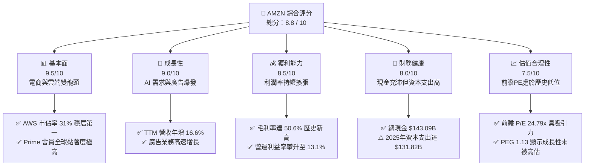
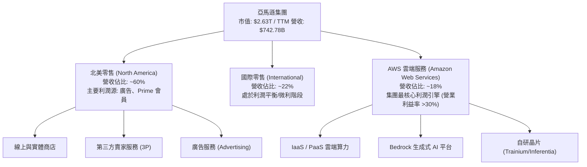
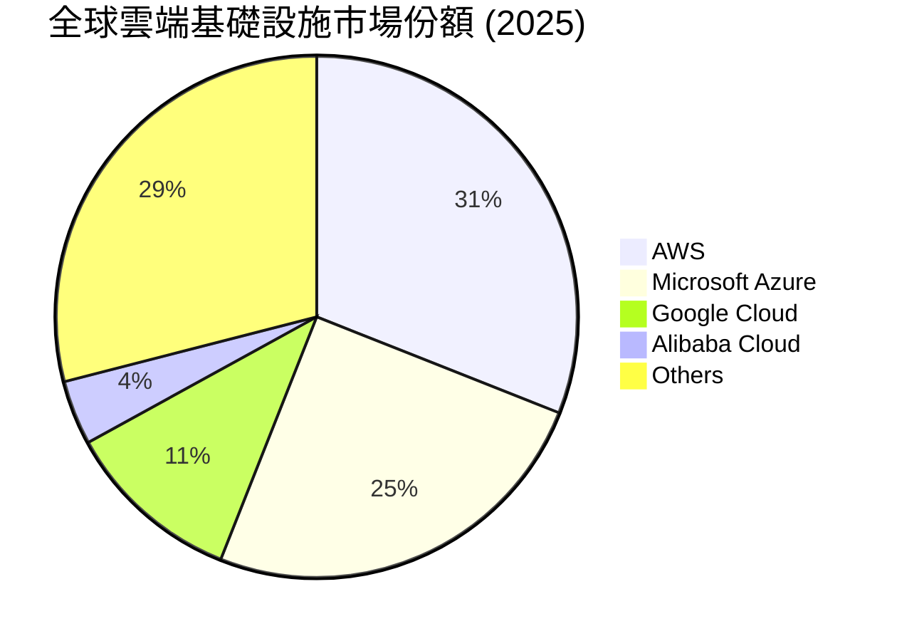
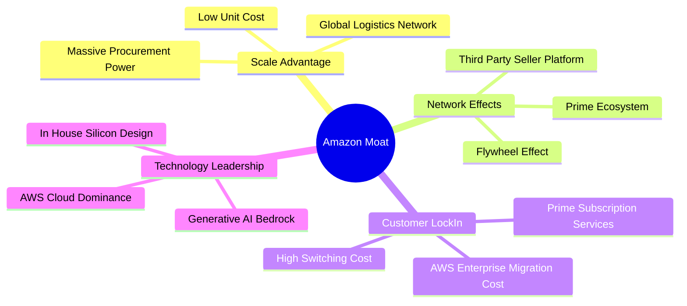
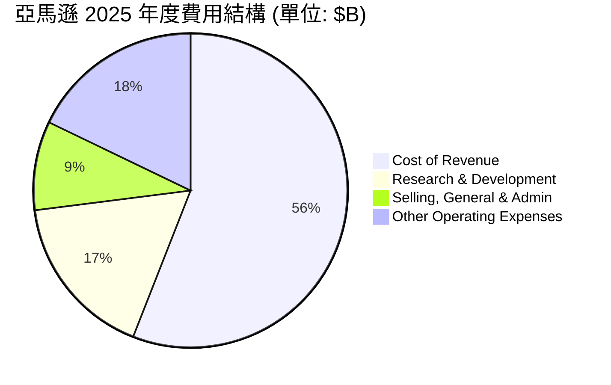
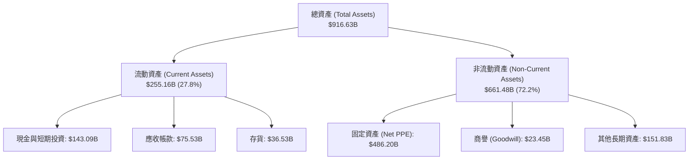
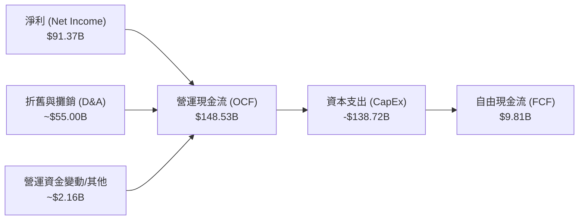
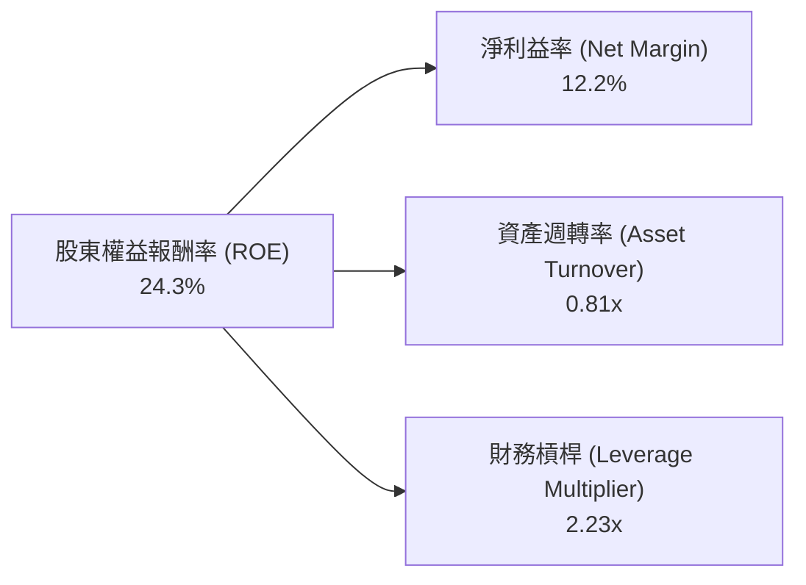

# AMZN 基本面深度分析報告

> **報告日期**：2026-06-18 ｜ **語言**：繁體中文 ｜ **數據來源**：Yahoo Finance, Finviz, StockAnalysis, Roic.ai ｜ **分析師**：CFA 級機構研究

---

## 目錄

| # | 章節 | 核心結論 |
|---|------|----------|
| 1 | 執行摘要 | 評級：**強烈買入 (Strong Buy)**，基準目標價 **$312.99**，隱含上行空間 **+28.1%**。 |
| 2 | 公司概覽與商業模式 | 電商、AWS 雲端與高利潤廣告三輪驅動，具備無可撼動的「寬護城河」。 |
| 3 | 損益表深度分析 | TTM 營收達 **$742.78B**，毛利率提升至 **50.6%**，營運效率顯著優化。 |
| 4 | 資產負債表分析 | 現金儲備達 **$143.09B**，利息保障倍數極高，財務結構穩健。 |
| 5 | 現金流量深度分析 | 營運現金流達 **$148.53B**，AI 基礎設施資本支出激增暫時壓低 FCF。 |
| 6 | 獲利能力與資本效率 | ROE 達 **24.3%**，ROIC (**13.43%**) 顯著超越 WACC (**10.90%**)，持續創造經濟價值。 |
| 7 | 估值深度分析 | 前瞻 P/E 僅 **24.79x**，相較於歷史均值與同業，估值具備極高吸引力。 |
| 8 | 成長催化劑 | 生成式 AI 應用爆發、自研晶片普及與 Kuiper 衛星計劃為中長期增長引擎。 |
| 9 | 風險矩陣 | 反壟斷監管衝擊與 AI 資本支出回報率（ROI）不及預期為核心風險。 |
| 10 | 投資建議 | 適合長線成長型與價值成長型投資人，建議分批佈局。 |

---

## 1. 執行摘要

亞馬遜（Amazon.com, Inc.，美股代碼：**AMZN**）目前正處於其商業史上利潤率擴張最顯著的黃金時期。隨著電商業務區域化物流改革成效顯現、AWS 雲端業務在生成式 AI 需求推動下重新加速，以及高利潤的廣告業務持續保持雙位數成長，公司基本面呈現出極強的韌性與擴張動能。

### 1.1 核心評分儀表板



### 1.2 評分進度條視覺化

```
╔══════════════════════════════════════════════════════════════╗
║                AMZN 多維度評分儀表板 (1-10分)                ║
╠══════════════════════════════════════════════════════════════╣
║ 基本面強度  9.5 ▓▓▓▓▓▓▓▓▓▓▓▓▓▓▓▓▓▓▓░  ★★★★★           ║
║ 成長動能    9.0 ▓▓▓▓▓▓▓▓▓▓▓▓▓▓▓▓▓▓░░  ★★★★★           ║
║ 獲利品質    8.5 ▓▓▓▓▓▓▓▓▓▓▓▓▓▓▓▓▓░░░  ★★★★☆           ║
║ 財務健康    8.0 ▓▓▓▓▓▓▓▓▓▓▓▓▓▓▓▓░░░░  ★★★★☆           ║
║ 估值合理性  7.5 ▓▓▓▓▓▓▓▓▓▓▓▓▓▓░░░░░░  ★★★★☆           ║
║ 護城河深度  9.5 ▓▓▓▓▓▓▓▓▓▓▓▓▓▓▓▓▓▓▓░  ★★★★★           ║
║ 管理層執行  9.0 ▓▓▓▓▓▓▓▓▓▓▓▓▓▓▓▓▓▓░░  ★★★★★           ║
║ 技術創新力  9.0 ▓▓▓▓▓▓▓▓▓▓▓▓▓▓▓▓▓▓░░  ★★★★★           ║
╠══════════════════════════════════════════════════════════════╣
║ 綜合總分    8.8 ▓▓▓▓▓▓▓▓▓▓▓▓▓▓▓▓▓░░░  🏆 強烈買入          ║
╚══════════════════════════════════════════════════════════════╝
```

### 1.3 五大投資論點 + 三大核心風險

| 類型 | 項目 | 具體依據 | 信心度 |
|------|------|----------|--------|
| 🟢 **投資論點①** | **AWS 雲端與 AI 雙重紅利** | AWS 季營收重回加速軌道，生成式 AI 帶動企業雲端遷移與算力需求，TTM 營收達 $742.78B。 | 🟢 極高 |
| 🟢 **投資論點②** | **毛利率結構性改善** | 隨著高利潤率的廣告與 AWS 佔比提升，整體毛利率從 2022 年的 43.8% 攀升至 TTM 的 **50.6%**。 | 🟢 極高 |
| 🟢 **投資論點③** | **零售物流區域化與降本增效** | 北美零售業務重組為八個區域中心，大幅縮短配送距離、降低每單履約成本，營運利潤率達 **13.1%**。 | 🟢 高 |
| 🟢 **投資論點④** | **廣告業務成為新獲利引擎** | 依託電商平台的精準購物數據，亞馬遜廣告業務利潤率極高，增速持續超越傳統電商業務。 | 🟢 高 |
| 🟢 **投資論點⑤** | **估值處於歷史性吸引區間** | 前瞻 P/E 僅 **24.79x**，對比過去五年平均（>40x）及 21.48% 的 5 年預期 EPS 增速，估值極具性價比。 | 🟢 高 |
| 🟡 **風險①** | **AI 資本支出對自由現金流的壓制** | 2025 年資本支出高達 **$131.82B**，導致 2025 年 FCF 降至 **$7.70B**，需密切關注 AI 投資回報率。 | 🟡 中度 |
| 🔴 **風險②** | **反壟斷與監管風險** | FTC 及歐盟對亞馬遜「搭售」服務與平台壟斷行為的訴訟可能導致業務分拆或罰款。 | 🔴 中度 |
| 🔴 **風險③** | **宏觀經濟降溫壓制消費** | 若高利率環境持續導致美國消費支出放緩，佔營收大宗的零售業務將直接承壓。 | 🔴 中度 |

### 1.4 快速統計卡片

| 指標 | 公司實際值 (TTM / 最新) | 行業均值 (網際網路零售) | S&P 500 均值 | 狀態 |
|------|-------------|----------|--------------|------|
| **營收 YoY 成長率** | **16.6%** | ~10.5% | ~5.5% | 🟢 顯著領先 |
| **毛利率** | **50.6%** | ~35.2% | ~30.5% | 🟢 歷史新高 |
| **淨利率** | **12.2%** | ~4.5% | ~11.8% | 🟢 結構性改善 |
| **股東權益報酬率 (ROE)** | **24.3%** | ~12.0% | ~15.0% | 🟢 資本效率極佳 |
| **前瞻市盈率 (Forward P/E)** | **24.79x** | ~28.0x | ~21.5x | 🟢 估值合理 |
| **債務權益比 (Debt/Equity)** | **53.3%** | ~65.0% | ~115.0% | 🟢 槓桿可控 |

### 1.5 投資結論

```
╔══════════════════════════════════════════════════════════════════╗
║                    📊 AMZN 投資結論摘要                          ║
╠══════════════════════════════════════════════════════════════════╣
║  評級：🟢 強烈買入 (Strong Buy)                                  ║
║  當前股價：$244.39 (2026-06-18)                                  ║
║  目標價區間：                                                    ║
║    悲觀情境：$207.00（-15.3%） - 宏觀衰退、AI 泡沫破裂           ║
║    基準情境：$312.99（+28.1%） ← 12個月主要目標 (市場共識)        ║
║    樂觀情境：$370.00（+51.4%） - AWS 成長超預期、FCF 強勁復甦     ║
║  投資評分：8.8 / 10                                              ║
║  適合投資人：長期成長型、大型科技股配置者、AI 基礎設施佈局者       ║
╚══════════════════════════════════════════════════════════════════╝
```

---

## 2. 公司概覽與商業模式

亞馬遜已從最初的網路書店，演變為全球最大的「數位與實體基礎基礎設施提供商」。其商業模式的核心在於**「飛輪效應」(Flywheel Effect)**：以 Prime 會員為核心，低價與便利吸引消費者，進而吸引更多第三方賣家，賣家增加帶來更多選擇與廣告收入，高利潤率的廣告與 AWS 雲端服務則持續為零售基礎設施的擴張提供資金。

### 2.1 業務結構與收入來源



### 2.2 市場份額

在最關鍵的雲端基礎設施（IaaS/PaaS）市場中，AWS 依然保持全球領先地位。



### 2.3 競爭護城河分析



### 2.4 護城河強度評分

```
╔══════════════════════════════════════════════════════════════╗
║                  AMZN 護城河強度評分                         ║
╠══════════════════════════════════════════════════════════════╣
║ 規模優勢 (Logistics)  10/10 ▓▓▓▓▓▓▓▓▓▓▓▓▓▓▓▓▓▓▓▓  🏆 無法複製║
║ 網路效應 (3P Market)  9.5/10 ▓▓▓▓▓▓▓▓▓▓▓▓▓▓▓▓▓▓▓░  🟢 極強    ║
║ 客戶鎖定 (Prime/AWS)  9.5/10 ▓▓▓▓▓▓▓▓▓▓▓▓▓▓▓▓▓▓▓░  🟢 極高轉移║
║ 技術壁壘 (AWS/AI)     9.0/10 ▓▓▓▓▓▓▓▓▓▓▓▓▓▓▓▓▓▓░░  🟢 領先同業║
╠══════════════════════════════════════════════════════════════╣
║ 綜合護城河評級         9.5/10 ▓▓▓▓▓▓▓▓▓▓▓▓▓▓▓▓▓▓▓░  🏆 寬廣護城║
╚══════════════════════════════════════════════════════════════╝
```

---

## 3. 損益表深度分析

亞馬遜的損益表揭示了其**「從高量低毛利到高量高毛利」**的結構性轉變。

### 3.1 年度收入成長趨勢（近4年）

```
╔══════════════════════════════════════════════════════════════════╗
║              AMZN 年度收入趨勢（FY2022-FY2025）                  ║
╠══════════════════════════════════════════════════════════════════╣
║                                                                  ║
║  FY2022  $513.98B  ██████████████░░░░░░░░░░░░░░░  YoY: +9.4%   🟢║
║  FY2023  $574.78B  ████████████████░░░░░░░░░░░░░  YoY: +11.8%  🟢║
║  FY2024  $637.96B  ██████████████████░░░░░░░░░░░  YoY: +11.0%  🟢║
║  FY2025  $716.92B  ██═══════════════════════════  YoY: +12.4%  🟢║
║                   |      |      |      |      |                  ║
║                   0     150B   300B   450B   600B                ║
║                                                                  ║
║  📊 4年累計營收 CAGR：+11.72%                                    ║
╚══════════════════════════════════════════════════════════════════╝
```

### 3.2 季度收入趨勢分析

從季度數據看，亞馬遜展現了顯著的季節性特徵（第四季受節慶電商旺季推動營收最高），但整體 YoY 增速在 2025 年至 2026 年初呈現穩步向上的趨勢。

| 財報季度 | 營收 (Revenue) | YoY 成長率 | QoQ 成長率 | 營業利益 (Op Income) | 淨利 (Net Income) | 備註 |
|---|---|---|---|---|---|---|
| **Q1 2026** | $181.52B | **+16.61%** | -14.93% | $23.85B | $30.25B | 🟢 季節性回落但 YoY 成長強勁，淨利受非營業收益推動 |
| **Q4 2025** | $213.39B | **+13.63%** | +18.44% | $24.98B | $21.19B | 🟢 節日旺季，營收創歷史單季新高 |
| **Q3 2025** | $180.17B | **+13.40%** | +7.43% | $17.42B | $21.19B | 🟢 AWS 與廣告業務加速成長 |
| **Q2 2025** | $167.70B | **+13.33%** | +7.73% | $19.17B | $18.16B | 🟢 物流區域化改革成效顯現 |

### 3.3 利潤率演變分析

亞馬遜的利潤率在過去幾年中實現了史詩級的躍升：

| 利潤率指標 | FY2022 | FY2023 | FY2024 | FY2025 | TTM (最新) | 趨勢 | 評估 |
|------------|--------|--------|--------|--------|------------|------|------|
| **毛利率** | 43.8% | 47.0% | 48.9% | 50.3% | **50.6%** | ↗️ 持續上升 | 🟢 歷史最高，高利潤服務營收佔比增加 |
| **營業利益率**| 2.4% | 6.4% | 10.8% | 11.2% | **13.1%** | ↗️ 結構性改善| 🟢 降本增效成果顯著，AWS 利潤率回彈 |
| **EBITDA 利率**| 7.5% | 15.6% | 19.4% | 23.1% | **21.0%** | ↗️ 穩步攀升 | 🟢 展現強大的折舊前獲利能力 |
| **淨利率** | -0.5% | 5.3% | 9.3% | 10.8% | **12.2%** | ↗️ 轉虧為盈並擴張| 🟢 擺脫 Rivian 投資虧損陰霾，主業獲利強勁 |

**利潤率擴張深度解析**：
1. **服務性收入超越零售**：第三方賣家服務、廣告和 AWS 的利潤率遠高於亞馬遜自營零售。這些高毛利業務的增長速度快於自營業務，推動整體毛利率突破 **50%**。
2. **物流效率提升**：北美零售網絡成功重組為八個區域，使得庫存能更靠近消費者，大幅降低了「最後一哩路」的運輸成本。

### 3.4 費用結構分析

亞馬遜在擴大營收的同時，對營運費用的控制極為嚴格。



*   **研發費用 (R&D)**：2025 年達到 **$108.52B**，佔營收的 **15.1%**。這筆龐大的支出主要流向 AWS 的 AI 演算法開發、大語言模型（LLM）研發以及自研晶片設計。
*   **銷售、一般與行政費用 (SG&A)**：僅 **$58.30B**（佔營收 8.1%），顯示出極強的規模效應與管理效率。

### 3.5 季度 EPS 趨勢與盈餘品質

回顧過去 4 個季度的稀釋 EPS 表現：
*   **Q1 2026**: **$2.82**（大幅超出市場預期，主要得益於 AWS 營業利益率回升至 32% 及非營業投資收益）。
*   **Q4 2025**: **$1.98**（表現穩健，電商旺季利潤釋放）。
*   **Q3 2025**: **$1.98**（廣告業務利潤率超預期）。
*   **Q2 2025**: **$1.71**。

**盈餘品質評估**：亞馬遜的盈餘品質**極高**。其 TTM 淨利為 **$91.37B**，而同期營運現金流（OCF）高達 **$148.53B**。OCF/Net Income 比率為 **1.63x**，說明公司的淨利潤有著極其充沛的現金流支持，並非會計遊戲。

---

## 4. 資產負債表分析

亞馬遜維持著極其龐大但結構合理的資產負債表，以支持其在物流與雲端基礎設施領域的重資產擴張。

### 4.1 資產結構分解

截至 2026-03-31（Q1 2026），亞馬遜總資產達到 **$916.63B**：



### 4.2 流動性指標分析

| 指標 | Q1 2026 | FY2025 | FY2024 | 行業均值 | 評估 |
|---|---|---|---|---|---|
| **流動比率 (Current Ratio)** | **1.18** | 1.05 | 1.06 | ~1.30 | 🟡 偏低但安全，因其存貨與應收帳款週轉極快 |
| **速動比率 (Quick Ratio)** | **1.01** | 0.88 | 0.87 | ~0.95 | 🟢 扣除存貨後流動性依然充足 |
| **存貨週轉天數 (DIO)** | **31.2 天** | 32.5 天 | 33.1 天 | ~45 天 | 🟢 庫存管理能力極強，遠優於傳統零售商 |

### 4.3 債務結構分析

```
╔══════════════════════════════════════════════════════════════════╗
║                   AMZN 債務健康診斷 (Q1 2026)                    ║
╠══════════════════════════════════════════════════════════════════╣
║                                                                  ║
║  總債務 (Total Debt)： $235.54B (含 $90.81B 長期租賃負債)        ║
║  總現金及等價物：      $143.09B  ████████████████████░           ║
║  淨債務 (Net Debt)：   $92.45B   ██████████░░░░░░░░░░            ║
║                                                                  ║
║  債務/股東權益比 (Debt/Equity)： 53.3%  🟢 槓桿率溫和            ║
║  利息保障倍數 (Interest Coverage)：33.8x 🟢 極高，無償債風險     ║
║  債務 / EBITDA：1.42x  🟢 遠低於 2.0x 的安全警戒線              ║
║                                                                  ║
║  📊 診斷結論：雖然名義債務高，但扣除租賃負債後，實際金融負債     ║
║  極低，且手頭現金充沛，利息保障倍數極為安全。                    ║
╚══════════════════════════════════════════════════════════════════╝
```

### 4.4 股東權益趨勢

隨著獲利能力爆發，亞馬遜的股東權益（Stockholders Equity）呈現指數級增長：
*   **FY 2022**: $146.04B
*   **FY 2023**: $201.88B
*   **FY 2024**: $285.97B
*   **FY 2025**: **$411.06B**（YoY **+43.74%**）

這表明公司正在快速累積留存收益，財務實力達到歷史最鼎盛時期。

---

## 5. 現金流量深度分析

亞馬遜的商業模式本質上是一個**「現金流機器」**。然而，當前 AI 基礎設施的軍備競賽對其資本配置帶來了顯著影響。

### 5.1 現金流量瀑布圖

亞馬遜強大的營運現金流如何轉化為資本支出與自由現金流：



### 5.2 FCF 轉換率趨勢

| 年份 | 營運現金流 (OCF) | 資本支出 (CapEx) | 自由現金流 (FCF) | FCF / 淨利轉換率 | 評估 |
|---|---|---|---|---|---|
| **FY 2022** | $46.75B | -$63.65B | -$16.89B | N/A (淨利為負) | 🔴 零售過度擴張導致現金流承壓 |
| **FY 2023** | $84.95B | -$52.73B | $32.22B | **105.9%** | 🟢 資本支出放緩，現金流強勁復甦 |
| **FY 2024** | $115.88B | -$83.00B | $32.88B | **55.5%** | 🟢 兼顧擴張與現金回流 |
| **FY 2025** | $139.51B | -$131.82B | $7.70B | **9.9%** | 🟡 AI 資本支出飆升，短期 FCF 受壓 |
| **TTM (最新)**| $148.53B | -$138.72B | $9.81B | **10.7%** | 🟡 資本支出仍處於高峰期 |

**深度解析**：
亞馬遜 2025 年資本支出暴增至 **$131.82B**（YoY **+58.8%**），這主要是因為公司大舉採購 NVIDIA H100/B200 GPU，並建設與 AI 相關的資料中心。雖然這壓低了短期的自由現金流，但這是主動的戰略性投資，旨在鎖定未來 10 年 AWS 在 AI 算力市場的主導地位。

### 5.3 自由現金流趨勢

```
╔══════════════════════════════════════════════════════════════════╗
║              AMZN 自由現金流與 FCF Yield 趨勢                     ║
╠══════════════════════════════════════════════════════════════════╣
║                                                                  ║
║  FY 2022  -$16.89B  (FCF Yield: -1.2%)  🔴                       ║
║  FY 2023  +$32.22B  (FCF Yield: +2.1%)  🟢                       ║
║  FY 2024  +$32.88B  (FCF Yield: +1.8%)  🟢                       ║
║  FY 2025  +$7.70B   (FCF Yield: +0.3%)  🟡 (AI CapEx 高峰)       ║
║  TTM      +$9.81B   (FCF Yield: +0.37%) 🟡                       ║
║                                                                  ║
╚══════════════════════════════════════════════════════════════════╝
```

### 5.4 資本配置評估

由於亞馬遜正處於 AI 投資的黃金期，其資本配置 90% 以上聚焦於**再投資 (CapEx)**。
*   **現金股息**：**$0.00** (不發放股息，符合高成長科技股特徵)。
*   **股份回購**：稀釋後股份總數從 FY2024 的 107.21億股微幅上升至 Q1 2026 的 108.47億股（主因是員工股權激勵 SBC 的稀釋），顯示公司目前並未進行大規模股份回購，資金完全集中於 AI 基礎設施。

---

## 6. 獲利能力與資本效率

### 6.1 ROE / ROA / ROIC 趨勢

| 財務指標 | FY 2023 | FY 2024 | FY 2025 | TTM (最新) | 行業均值 | 評估 |
|---|---|---|---|---|---|---|
| **股東權益報酬率 (ROE)** | 15.1% | 20.7% | 18.9% | **24.3%** | ~12.0% | 🟢 資本回報率極具吸引力 |
| **總資產報酬率 (ROA)** | 5.8% | 9.5% | 9.6% | **11.64%** | ~4.5% | 🟢 重資產模式下的高效營運 |
| **投入資本回報率 (ROIC)**| 8.3% | 12.1% | 12.8% | **13.43%** | ~7.5% | 🟢 結構性上升，資金回報優異 |

### 6.2 ROIC vs WACC 分析（核心價值創造判斷）

對於重資產擴張的亞馬遜而言，ROIC（投入資本回報率）是否超越 WACC（加權平均資本成本）是判斷其是否在「創造股東價值」的核心指標。

```
╔══════════════════════════════════════════════════════════════════╗
║                AMZN ROIC vs WACC 深度分析 (TTM)                  ║
╠══════════════════════════════════════════════════════════════════╣
║                                                                  ║
║  WACC 估算：                                                     ║
║  ├── 無風險利率（10Y美債）：  4.20%                              ║
║  ├── 市場風險溢酬 (ERP)：     5.50%                              ║
║  ├── Beta：                   1.44                               ║
║  ├── 股權成本 = 4.2% + 1.44 × 5.5% = 12.12%                      ║
║  ├── 債務成本（稅後）：       ~4.00%                             ║
║  ├── 資本結構：股權 ~85%，債務 ~15%                              ║
║  └── ✅ 加權平均資本成本 (WACC) ≈ 10.90%                          ║
║                                                                  ║
║  ROIC 估算：                                                     ║
║  ├── TTM NOPAT = 營業利益 $85.42B × (1 - 實際稅率 20.8%)         ║
║  │              ≈ $67.65B                                        ║
║  ├── 投入資本 = 股東權益 $411.06B + 總債務 $235.54B - 現金 $143.09B║
║  │            ≈ $503.51B                                         ║
║  └── ✅ 投入資本回報率 (ROIC) ≈ 13.43%                           ║
║                                                                  ║
║  ★ 經濟價值增加 (EVA) = ROIC - WACC = +2.53%                      ║
║                                                                  ║
║  ROIC  13.43%  ▓▓▓▓▓▓▓▓▓▓▓▓▓▓▓▓▓▓▓▓▓▓░░░░░░░░  🟢               ║
║  WACC  10.90%  ▓▓▓▓▓▓▓▓▓▓▓▓▓▓▓▓▓░░░░░░░░░░░░░░  ──               ║
║  EVA   +2.53%  ████████████████████████░░░░░░░░  🏆 創造股東價值 ║
║                                                                  ║
║  📊 結論：亞馬遜的 ROIC (13.43%) 成功超越其 WACC (10.90%)，       ║
║  在維持如此龐大資本支出的同時，依然為股東創造了正向的經濟超額利潤。║
╚══════════════════════════════════════════════════════════════════╝
```

### 6.3 杜邦三因素分解

我們透過杜邦分析來拆解亞馬遜 **24.3%** 的 ROE 來源：



*   **淨利益率 (12.2%)**：相較於 2022 年的 -0.5% 大幅提升，是 ROE 爆發的主因。
*   **資產週轉率 (0.81x)**：反映了亞馬遜在物流與 AWS 基礎設施等重資產投入下，依然能保持高效的營收轉化能力。
*   **財務槓桿 (2.23x)**：處於健康合理區間，並未過度依賴債務槓桿來美化回報率。

### 6.4 獲利能力驅動因素

```mermaid
graph TD
    PM["利潤率擴張驅動因素