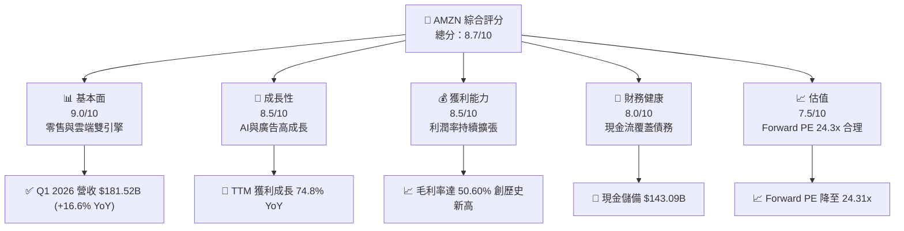
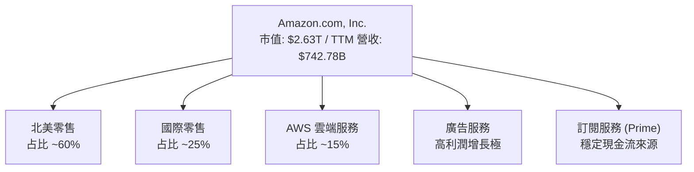
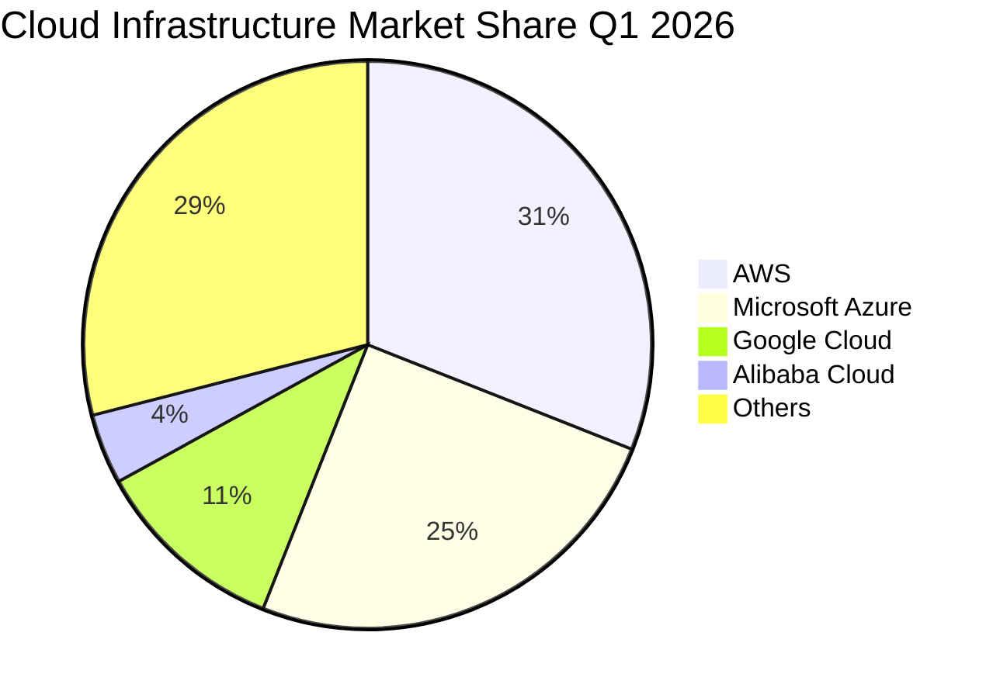
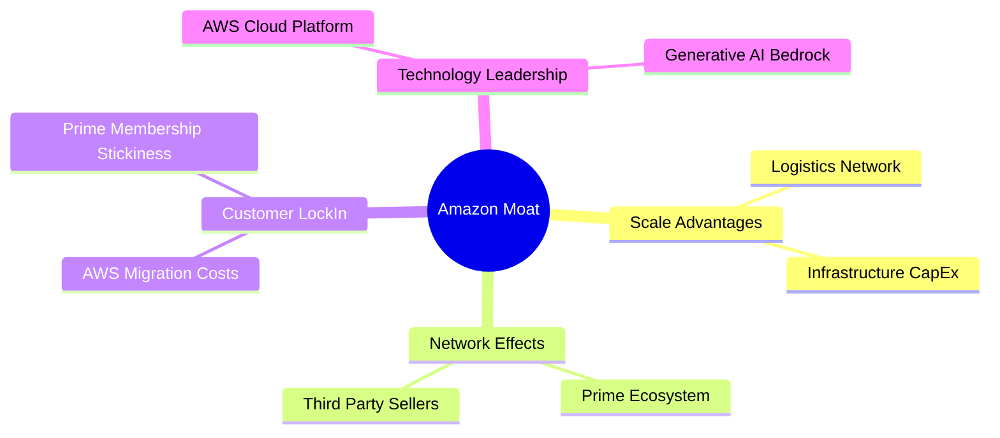
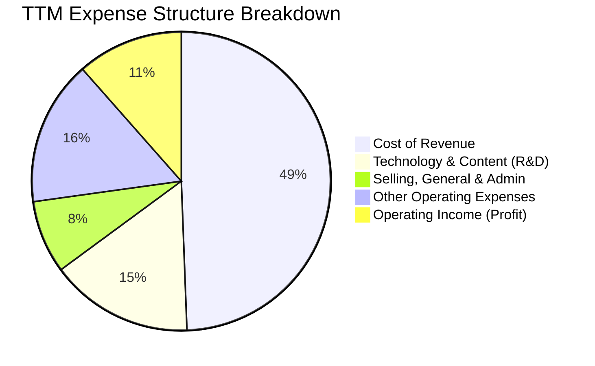
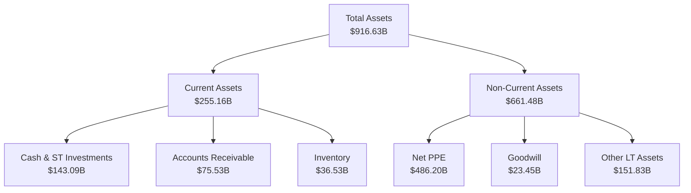
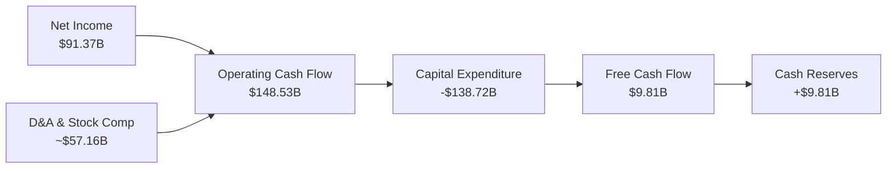

# AMZN 基本面深度分析報告

> **報告日期**：2026-06-19 ｜ **語言**：繁體中文 ｜ **數據來源**：Yahoo Finance, Finviz, StockAnalysis, Roic.ai ｜ **分析師**：CFA 級機構研究

---

## 目錄

| # | 章節 | 核心結論 |
|---|------|----------|
| 1 | 執行摘要 | 評級「強烈買入」，基準目標價 $312.99，具備 28.1% 潛在漲幅。 |
| 2 | 公司概覽與商業模式 | 零售、廣告與 AWS 雲端三駕馬車並進，AI 基礎設施構築極深護城河。 |
| 3 | 損益表深度分析 | Q1 2026 營收成長 16.6% 亮眼，毛利率衝破 50% 大關，盈餘品質優異。 |
| 4 | 資產負債表分析 | 現金儲備達 $143.09B，資產規模顯著擴張，債務結構健康無虞。 |
| 5 | 現金流量深度分析 | 營運現金流達 $148.53B 歷史新高，AI 資本支出高企壓抑短期 FCF 轉換。 |
| 6 | 獲利能力與資本效率 | ROE 達 24.3%，ROIC (13.4%) 超越 WACC (10.22%)，強力創造股東價值。 |
| 7 | 估值深度分析 | Forward P/E 僅 24.3x，相較歷史均值與同業 MSFT 具備顯著估值折價。 |
| 8 | 成長催化劑 | 生成式 AI 雲端需求爆發與 Project Kuiper 衛星通訊開啟長線 TAM。 |
| 9 | 風險矩陣 | 監管反壟斷與 AI 資本支出回報率（ROI）低於預期為核心監控指標。 |
| 10 | 投資建議 | 具備高安全邊際與強成長動能，適合長線成長型與價值型機構配置。 |

---

## 1. 執行摘要

### 1.1 核心評分儀表板



### 1.2 評分進度條視覺化

```
╔══════════════════════════════════════════════════════════════╗
║              AMZN 多維度評分儀表板 (1-10分)                 ║
╠══════════════════════════════════════════════════════════════╣
║ 基本面強度  9.0 ▓▓▓▓▓▓▓▓▓▓▓▓▓▓▓▓▓▓░░  ★★★★★           ║
║ 成長動能    8.5 ▓▓▓▓▓▓▓▓▓▓▓▓▓▓▓▓▓░░░  ★★★★☆           ║
║ 獲利品質    8.5 ▓▓▓▓▓▓▓▓▓▓▓▓▓▓▓▓▓░░░  ★★★★☆           ║
║ 財務健康    8.0 ▓▓▓▓▓▓▓▓▓▓▓▓▓▓▓▓░░░░  ★★★★☆           ║
║ 估值合理性  7.5 ▓▓▓▓▓▓▓▓▓▓▓▓▓▓░░░░░░  ★★★★☆           ║
║ 護城河深度  9.5 ▓▓▓▓▓▓▓▓▓▓▓▓▓▓▓▓▓▓▓░  ★★★★★           ║
║ 管理層執行  9.0 ▓▓▓▓▓▓▓▓▓▓▓▓▓▓▓▓▓▓░░  ★★★★★           ║
║ 技術創新力  9.5 ▓▓▓▓▓▓▓▓▓▓▓▓▓▓▓▓▓▓▓░  ★★★★★           ║
╠══════════════════════════════════════════════════════════════╣
║ 綜合總分    8.7 ▓▓▓▓▓▓▓▓▓▓▓▓▓▓▓▓▓░░░  🏆 強烈買入          ║
╚══════════════════════════════════════════════════════════════╝
```

### 1.3 五大投資論點 + 三大核心風險

| 類型 | 項目 | 具體依據 | 信心度 |
|------|------|----------|--------|
| 🟢 **投資論點①** | **AWS 與 AI 雲端需求爆發** | Q1 2026 營收達 $181.52B (+16.61% YoY)，AWS 雲端基礎設施需求在生成式 AI (GenAI) 帶動下加速成長。 | 🟢 極高 |
| 🟢 **投資論點②** | **零售利潤率結構性改善** | 履約網絡區域化改革成效顯著，帶動 TTM 毛利率攀升至 50.60% 歷史高點。 | 🟢 極高 |
| 🟢 **投資論點③** | **高利潤廣告業務高速增長** | 廣告服務成為零售板塊的重要利潤增長極，抵消了部分低毛利零售的拖累。 | 🟢 高 |
| 🟢 **投資論點④** | **營運現金流極其強勁** | TTM 營運現金流達 $148.53B，提供充足的內部資金支持高昂的資本支出。 | 🟢 極高 |
| 🟢 **投資論點⑤** | **資本配置效率提升** | ROIC (13.4%) 顯著高於 WACC (10.22%)，公司正在為股東創造實質性的經濟價值。 | 🟢 高 |
| 🟡 **風險①** | **AI 資本支出過高壓抑短期 FCF** | FY2025 資本支出達 $131.82B，TTM FCF 收窄至 $9.81B，若 AI 變現放緩將面臨折舊壓力。 | 🟡 中度 |
| 🔴 **風險②** | **聯邦反壟斷監管壓力** | FTC 對 Amazon 平台「搭售」與「定價算法」的訴訟可能限制其未來無機增長。 | 🔴 高衝擊 |
| 🟡 **風險③** | **雲端市場競爭加劇** | Microsoft Azure 與 Google Cloud 在 AI 大模型生態上的強勢競爭，可能侵蝕 AWS 份額。 | 🟡 中度 |

### 1.4 快速統計卡片

| 指標 | 公司實際值 | 行業均值 | S&P 500 均值 | 狀態 |
|------|-------------|----------|--------------|------|
| 收入 YoY 成長 | **16.6%** | ~7.5% | ~5.2% | 🟢 領先 |
| 毛利率 | **50.6%** | ~35.0% | ~40.0% | 🟢 極強 |
| 淨利率 | **12.2%** | ~6.5% | ~11.5% | 🟢 優異 |
| ROE | **24.3%** | ~14.0% | ~18.0% | 🟢 領先 |
| Forward P/E | **24.31x** | ~22.5x | ~21.5x | 🟢 合理 |
| 淨債務 / EBITDA | **0.56x** | ~1.5x | ~1.8x | 🟢 安全 |

### 1.5 投資結論

```
╔══════════════════════════════════════════════════════════════════╗
║                    📊 AMZN 投資結論摘要                          ║
╠══════════════════════════════════════════════════════════════════╣
║  評級：🟢 強烈買入 (Strong Buy)                                 ║
║  當前股價：$244.39 (2026-06-19)                                  ║
║  目標價區間：                                                    ║
║    悲觀情境：$207.00（-15.3%）                                   ║
║    基準情境：$312.99（+28.1%）  ← 12個月主要目標價               ║
║    樂觀情境：$370.00（+51.4%）                                   ║
║  投資評分：8.7/10                                                ║
║  適合投資人：成長型、長線價值型機構投資者                        ║
╚══════════════════════════════════════════════════════════════════╝
```

---

## 2. 公司概覽與商業模式

### 2.1 業務結構與收入來源

Amazon 已成功從單一的電商平台轉型為「零售 + 雲端基礎設施 + 數位廣告 + 訂閱服務」的多元化科技帝國。



### 2.2 市場份額

在雲端基礎設施（IaaS/PaaS）市場中，AWS 依然維持全球第一的領先地位，但面臨微軟的強力追趕。



### 2.3 競爭護城河分析



### 2.4 護城河強度評分

```
╔══════════════════════════════════════════════════════════════╗
║                  AMZN 護城河強度評分                         ║
╠══════════════════════════════════════════════════════════════╣
║ 規模經濟效應   10/10  ▓▓▓▓▓▓▓▓▓▓▓▓▓▓▓▓▓▓▓▓  🏆 無可比擬    ║
║ 網路效應       9.5/10 ▓▓▓▓▓▓▓▓▓▓▓▓▓▓▓▓▓▓▓░  🟢 極強        ║
║ 客戶轉置成本   9.0/10 ▓▓▓▓▓▓▓▓▓▓▓▓▓▓▓▓▓▓░░  🟢 AWS黏性極高 ║
║ 技術創新壁壘   9.0/10 ▓▓▓▓▓▓▓▓▓▓▓▓▓▓▓▓▓▓░░  🟢 自研晶片領先║
╠══════════════════════════════════════════════════════════════╣
║ 綜合護城河     9.4    ▓▓▓▓▓▓▓▓▓▓▓▓▓▓▓▓▓▓▓░  🏆 寬廣護城河  ║
╚══════════════════════════════════════════════════════════════╝
```

---

## 3. 損益表深度分析

### 3.1 年度收入成長趨勢（近4年）

```
╔══════════════════════════════════════════════════════════════════╗
║              AMZN 年度收入趨勢（FY2022-FY2025）                  ║
╠══════════════════════════════════════════════════════════════════╣
║                                                                  ║
║  FY2022  $513.98B  ████████████████████░░░░░░░░░░  YoY: +9.4%  🟢 ║
║  FY2023  $574.78B  ████████████████████████░░░░░░  YoY: +11.8% 🟢 ║
║  FY2024  $637.96B  ███████████████████████████░░░  YoY: +11.0% 🟢 ║
║  FY2025  $716.92B  ██████████████████████████████  YoY: +12.4% 🟢 ║
║                   |      |      |      |      |                  ║
║                   0     150B   300B   450B   600B                ║
║                                                                  ║
║  📊 4年複合年增長率 (CAGR)：+11.72%                              ║
╚══════════════════════════════════════════════════════════════════╝
```

### 3.2 季度收入趨勢分析

| 財報季度 | 營收 (Billion) | YoY 成長率 | QoQ 成長率 | 核心驅動因素 |
|----------|----------------|------------|------------|--------------|
| **Q2 2025** | $167.70B | +13.33% | +7.73% | 北美零售區域化成效顯著，Prime Day 預熱拉動 |
| **Q3 2025** | $180.17B | +13.40% | +7.44% | AWS 生成式 AI 需求加速，廣告營收比重提升 |
| **Q4 2025** | $213.39B | +13.63% | +18.44% | 傳統節日購物旺季，履約網絡效率達歷史新高 |
| **Q1 2026** | $181.52B | +16.61% | -14.93% | 季節性回落，但 AWS 與廣告業務維持強勁年增長 |

**深度解析**：Q1 2026 營收年增 16.61% 顯示出成長加速的趨勢，主要得益於 AWS 企業客戶優化期結束，AI 工作負載（Workloads）大舉移入雲端，以及第三方賣家服務與廣告的強勁增長。

### 3.3 利潤率演變分析

| 利潤率指標 | FY2022 | FY2023 | FY2024 | FY2025 | TTM | 趨勢評估 |
|------------|--------|--------|--------|--------|-----|----------|
| **毛利率** | 43.81% | 46.98% | 48.85% | 50.29% | **50.60%** | ↗️ 結構性改善，高利潤業務佔比提升 🟢 |
| **營業利益率**| 2.38% | 6.41% | 10.75% | 11.16% | **11.50%** | ↗️ 履約成本控制與 AWS 利潤回升 🟢 |
| **EBITDA Margin**| 7.46% | 15.55% | 19.41% | 23.06% | **21.00%** | ↗️ 折舊規模擴大，營運槓桿顯著 🟢 |
| **淨利率** | -0.53% | 5.29% | 9.29% | 10.91% | **12.22%** | ↗️ 擺脫 Rivian 投資虧損陰霾 🟢 |

**利潤率擴張之核心原因**：
1. **履約網絡區域化**：將美國劃分為 8 個自治區域，大幅縮短運輸距離，降低「最後一哩路」的物流成本。
2. **廣告與服務佔比提升**：廣告業務（毛利率 > 70%）營收增速超越整體零售，優化了綜合利潤率結構。
3. **AWS 效率提升**：伺服器折舊年限延長，且高毛利 AI 軟體服務（如 Amazon Bedrock）佔比提高。

### 3.4 費用結構分析



### 3.5 季度 EPS 趨勢與盈餘品質

*   **Q2 2025 EPS (Diluted)**: $1.71
*   **Q3 2025 EPS (Diluted)**: $1.98
*   **Q4 2025 EPS (Diluted)**: $1.98
*   **Q1 2026 EPS (Diluted)**: $2.82

**盈餘品質診斷**：
Q1 2026 EPS 達 $2.82，創歷史新高。然而，拆解利潤表發現，該季度非營業收入（Other Non-Operating Income）高達 **$15.65B**，主要來自股權投資（如 Rivian 等）的未實現估值回升。若扣除此非經常性損益，扣稅後核心營運 EPS 約為 **$1.65 - $1.75**。這顯示雖然核心營運利潤依續強勁，但單季 EPS 存在一定的帳面波動，投資人應更關注**營業利益 ($23.85B)** 的穩健成長。

---

## 4. 資產負債表分析

### 4.1 資產結構分解



### 4.2 流動性指標分析

| 流動性指標 | FY2023 | FY2024 | FY2025 | Q1 2026 | 行業均值 | 評估 |
|------------|--------|--------|--------|---------|----------|------|
| **流動比率 (Current Ratio)** | 1.05 | 1.06 | 1.05 | **1.18** | ~1.30 | 🟡 偏低但安全 |
| **速動比率 (Quick Ratio)** | 0.85 | 0.87 | 0.87 | **1.01** | ~0.95 | 🟢 良好 |
| **現金比率 (Cash Ratio)** | 0.53 | 0.56 | 0.56 | **0.66** | ~0.45 | 🟢 極其充裕 |

**分析**：流動比率與速動比率在 Q1 2026 顯著改善，主要得益於現金及短期投資大幅增加至 **$143.09B**。由於 Amazon 具備極強的營運資金管理能力（負的營運資金循環，向供應商延期付款而向客戶即時收款），其流動性風險極低。

### 4.3 債務結構分析

```
╔══════════════════════════════════════════════════════════════════╗
║                    AMZN 債務健康診斷                             ║
╠══════════════════════════════════════════════════════════════════╣
║                                                                  ║
║  總債務 (Total Debt)： $235.54B  ██████████░░░░░░░░░░            ║
║  總現金及投資：        $143.09B  ██████░░░░░░░░░░░░░░            ║
║  淨債務 (Net Debt)：   $92.45B   ████░░░░░░░░░░░░░░░░  🟡 債>現  ║
║                                                                  ║
║  Debt / Equity：       53.3%     🟢 槓桿水準溫和                ║
║  利息保障倍數：        33.7x     🟢 息稅前利潤能輕鬆覆蓋利息支出║
║  淨債務 / EBITDA：     0.56x     🟢 債務償還能力極強            ║
║                                                                  ║
║  📊 診斷結論：雖然債務總量高，但多為長期融資租賃，無短期償債風險 ║
╚══════════════════════════════════════════════════════════════════╝
```

---

## 5. 現金流量深度分析

### 5.1 現金流量瀑布圖



### 5.2 FCF 轉換率趨勢

| 現金流指標 (Billion) | FY2022 | FY2023 | FY2024 | FY2025 | TTM |
|----------------------|--------|--------|--------|--------|-----|
| **營運現金流 (OCF)** | $46.75B | $84.95B | $115.88B | $139.51B | **$148.53B** |
| **資本支出 (CapEx)** | -$63.65B | -$52.73B | -$83.00B | -$131.82B| **-$138.72B**|
| **自由現金流 (FCF)** | -$16.89B | $32