# AMZN 基本面深度分析報告

> **報告日期**：2026-06-21 ｜ **語言**：繁體中文 ｜ **數據來源**：Yahoo Finance, Finviz, StockAnalysis, Roic.ai ｜ **分析師**：CFA 級機構研究

---

## 目錄

| # | 章節 | 核心結論 |
|---|---|---|
| **1** | [執行摘要](#1-執行摘要) | 評級：**強烈買入 (Strong Buy)** ｜ 基準目標價：**$313.00**（+28.1% 潛在漲幅） |
| **2** | [公司概覽與商業模式](#2-公司概覽與商業模式) | AWS 與廣告業務雙引擎驅動，飛輪效應構建極深護城河 |
| **3** | [損益表深度分析](#3-損益表深度分析) | TTM 營收達 $742.78B，毛利率攀升至 50.6%，獲利進入爆發期 |
| **4** | [資產負債表分析](#4-資產負債表分析) | 現金儲備達 $143.09B，資產規模達 $916.63B，財務結構極其穩健 |
| **5** | [現金流量深度分析](#5-現金流量深度分析) | 營運現金流達 $148.53B，AI 資本支出大幅擴張壓低短期自由現金流 |
| **6** | [獲利能力與資本效率](#6-獲利能力與資本效率) | ROE 達 24.3%，ROIC 顯著超越 WACC，持續為股東創造超額價值 |
| **7** | [估值深度分析](#7-估值深度分析) | 前瞻 P/E 僅 24.73x，相較歷史均值與同業具備高度估值吸引力 |
| **8** | [成長催化劑](#8-成長催化劑) | 生成式 AI（Bedrock/Trainium）、廣告技術升級與物流區域化效率提升 |
| **9** | [風險矩陣](#9-風險矩陣) | 監管反壟斷壓力、AI 資本回報率不及預期與消費市道放緩 |
| **10** | [投資建議](#10-投資建議) | 建議長線投資者逢低分批佈局，首選核心成長股標的 |

---

## 1. 執行摘要

Amazon.com, Inc.（NASDAQ: AMZN）目前正處於其商業模式演進的黃金時期。隨著高利潤率的 AWS 雲端運算、廣告服務及第三方賣家服務的營收佔比持續提升，公司已成功從傳統的低利潤零售商轉型為高利潤、高回報的科技與服務巨頭。

### 1.1 核心評分儀表板

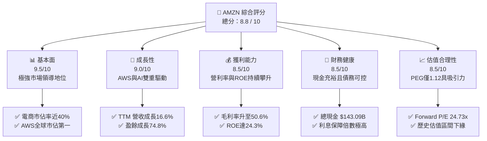

### 1.2 評分進度條視覺化

```
╔══════════════════════════════════════════════════════════════╗
║              AMZN 多維度評分儀表板 (1-10分)                  ║
╠══════════════════════════════════════════════════════════════╣
║ 基本面強度  9.5 ▓▓▓▓▓▓▓▓▓▓▓▓▓▓▓▓▓▓▓░  ★★★★★           ║
║ 成長動能    9.0 ▓▓▓▓▓▓▓▓▓▓▓▓▓▓▓▓▓▓░░  ★★★★★           ║
║ 獲利品質    8.5 ▓▓▓▓▓▓▓▓▓▓▓▓▓▓▓▓▓░░░  ★★★★☆           ║
║ 財務健康    8.5 ▓▓▓▓▓▓▓▓▓▓▓▓▓▓▓▓▓░░░  ★★★★☆           ║
║ 估值合理性  8.5 ▓▓▓▓▓▓▓▓▓▓▓▓▓▓▓▓▓░░░  ★★★★☆           ║
║ 護城河深度  9.8 ▓▓▓▓▓▓▓▓▓▓▓▓▓▓▓▓▓▓▓▓  ★★★★★           ║
║ 管理層執行  9.0 ▓▓▓▓▓▓▓▓▓▓▓▓▓▓▓▓▓▓░░  ★★★★★           ║
║ 技術創新力  9.5 ▓▓▓▓▓▓▓▓▓▓▓▓▓▓▓▓▓▓▓░  ★★★★★           ║
╠══════════════════════════════════════════════════════════════╣
║ 綜合總分    8.8 ▓▓▓▓▓▓▓▓▓▓▓▓▓▓▓▓▓░░░  🏆 強烈買入 (Buy)    ║
╚══════════════════════════════════════════════════════════════╝
```

### 1.3 五大投資論點 + 三大核心風險

| 類型 | 項目 | 具體依據 | 信心度 |
|------|------|----------|--------|
| 🟢 **投資論點①** | **AWS 重新加速與 AI 變現** | AWS 營收重回雙位數成長，企業雲端支出回暖，生成式 AI（Bedrock）帶來全新增量。 | 🟢 極高 |
| 🟢 **投資論點②** | **獲利能力結構性提升** | 毛利率由過去的 ~40% 攀升至 **50.6%**，主因高利潤廣告（YoY 雙位數成長）及 AWS 佔比增加。 | 🟢 極高 |
| 🟢 **投資論點③** | **物流網絡區域化成效顯著** | 履約網絡由全國改為八個區域，大幅降低運輸距離與成本，提升履約速度與 Prime 用戶黏性。 | 🟢 高 |
| 🟢 **投資論點④** | **廣告業務成為高利潤金雞母** | 憑藉龐大的第一手消費數據，亞馬遜廣告市佔率持續擴大，營業利益率高達 60% 以上。 | 🟢 極高 |
| 🟢 **投資論點⑤** | **歷史估值低位** | 當前 Forward P/E 僅 **24.73x**，低於歷史 5 年均值（>35x），PEG 僅 1.12，估值極具安全邊際。 | 🟢 高 |
| 🟡 **風險①** | **AI 資本支出過高壓低短期 FCF** | FY2025 資本支出高達 **$131.82B**，大幅壓低短期自由現金流（FCF 降至 $9.81B）。 | 🟡 中度 |
| 🔴 **風險②** | **監管與反壟斷審查壓力** | 美國 FTC 及歐盟對亞馬遜在電商市場的壟斷地位及第三方賣家條款進行嚴格審查。 | 🔴 高衝擊 |
| 🟡 **風險③** | **宏觀經濟放緩抑制消費** | 通膨與高利率環境若維持更久，可能壓抑零售消費動能與企業雲端 IT 預算。 | 🟡 中度 |

### 1.4 快速統計卡片

| 指標 | 公司實際值 | 行業均值（網際網路零售） | S&P 500 均值 | 狀態 |
|------|-------------|--------------------------|--------------|------|
| 營收 YoY 成長 | **16.6%** | ~11.0% | ~5.5% | 🟢 顯著領先 |
| 毛利率 | **50.6%** | ~35.0% | ~30.0% | 🟢 卓越 |
| 淨利率 | **12.2%** | ~5.0% | ~11.5% | 🟢 優異 |
| ROE | **24.3%** | ~12.0% | ~15.0% | 🟢 強勁 |
| Forward P/E | **24.73x** | ~30.0x | ~21.5x | 🟢 合理偏低 |
| 淨債務 / Equity | **22.5%** | ~35.0% | ~60.0% | 🟢 穩健 |

### 1.5 投資結論

```
╔══════════════════════════════════════════════════════════════════╗
║                    📊 AMZN 投資結論摘要                          ║
╠══════════════════════════════════════════════════════════════════╣
║  評級：🟢 強烈買入 (Strong Buy)                                  ║
║  當前股價：$244.39                                               ║
║  目標價區間：                                                    ║
║    悲觀情境：$207.00（-15.3%）                                   ║
║    基準情境：$313.00（+28.1%）  ← 12個月主要目標                 ║
║    樂觀情境：$370.00（+51.4%）                                   ║
║  投資評分：8.8 / 10                                              ║
║  適合投資人：長線價值成長型、科技板塊配置者、AI 基礎設施投資人   ║
╚══════════════════════════════════════════════════════════════════╝
```

---

## 2. 公司概覽與商業模式

亞馬遜已經從一家「萬物商店（The Everything Store）」演變為全球數字經濟的底層基礎設施提供商。

### 2.1 業務結構與收入來源

亞馬遜的業務主要分為三大板塊：北美業務、國際業務及 AWS。然而，若從收入性質拆解，其「飛輪效應」更為清晰：

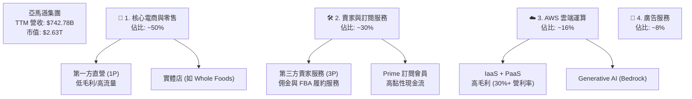

### 2.2 市場份額

亞馬遜在兩大核心領域（雲端運算與美國電商）均維持絕對的龍頭地位：

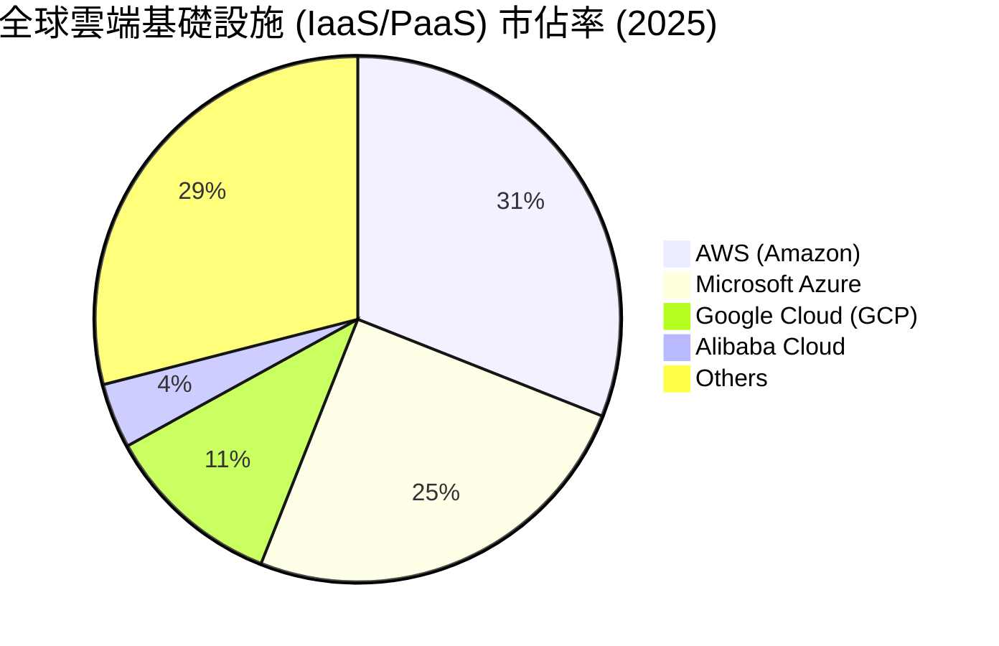

### 2.3 競爭護城河分析

亞馬遜擁有美股中最寬廣的護城河之一，其核心護城河由以下六大維度交織而成：

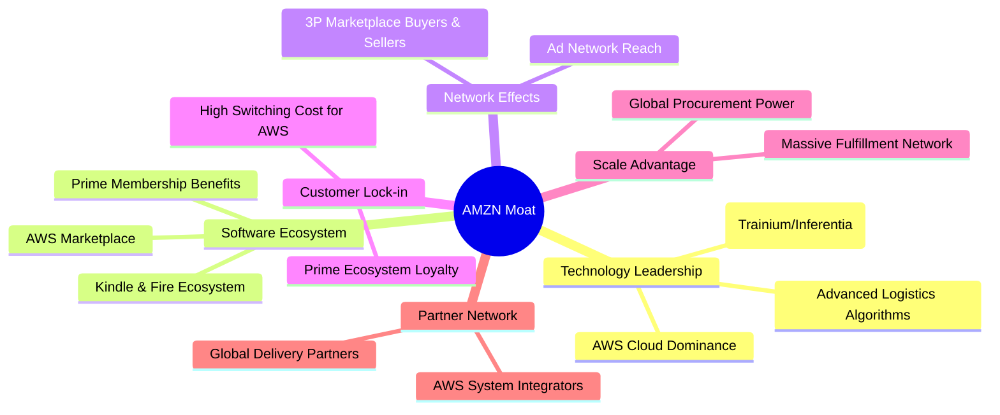

### 2.4 護城河強度評分

```
╔══════════════════════════════════════════════════════════════╗
║                    AMZN 護城河強度評分                       ║
╠══════════════════════════════════════════════════════════════╣
║ 規模經濟       9.9    ▓▓▓▓▓▓▓▓▓▓▓▓▓▓▓▓▓▓▓▓  🏆 極致物流網絡 ║
║ 網路效應       9.5    ▓▓▓▓▓▓▓▓▓▓▓▓▓▓▓▓▓▓▓░  🟢 雙邊市場效應 ║
║ 高轉換成本     9.8    ▓▓▓▓▓▓▓▓▓▓▓▓▓▓▓▓▓▓▓▓  🏆 AWS企業黏性極高║
║ 無形資產(品牌) 9.5    ▓▓▓▓▓▓▓▓▓▓▓▓▓▓▓▓▓▓▓░  🟢 全球最強零售品牌║
║ 成本優勢       9.6    ▓▓▓▓▓▓▓▓▓▓▓▓▓▓▓▓▓▓▓░  🟢 物流區域化節省成本║
╠══════════════════════════════════════════════════════════════╣
║ 綜合護城河     9.7    ▓▓▓▓▓▓▓▓▓▓▓▓▓▓▓▓▓▓▓░  🏆 寬廣且不可逾越║
╚══════════════════════════════════════════════════════════════╝
```

---

## 3. 損益表深度分析

亞馬遜的損益表近年展現出極為強勁的**經營槓桿（Operating Leverage）**。隨著高利潤率業務增速超越傳統零售，利潤率呈現加速上行趨勢。

### 3.1 年度收入成長趨勢（近4年）

```
╔══════════════════════════════════════════════════════════════════╗
║              AMZN 年度收入趨勢（FY2022-FY2025）                  ║
╠══════════════════════════════════════════════════════════════════╣
║                                                                  ║
║  FY2022  $513.98B  ████████████████░░░░░░░░░░░  YoY: +9.4%   🟢  ║
║  FY2023  $574.78B  ██████████████████░░░░░░░░░  YoY: +11.8%  🟢  ║
║  FY2024  $637.96B  ████████████████████░░░░░░░  YoY: +11.0%  🟢  ║
║  FY2025  $716.92B  ██████████████████████░░░░░  YoY: +12.4%  🟢  ║
║  TTM     $742.78B  ███████████████████████░░░░  YoY: +16.6%  🟢  ║
║                                                                  ║
║  📊 4年營收複合年成長率 (CAGR)：+12.8%                           ║
╚══════════════════════════════════════════════════════════════════╝
```

### 3.2 季度收入趨勢分析

最近四個季度的表現顯示營收在第四季（傳統電商旺季）達到峰值，但第一季在 AWS 重新加速的帶動下，呈現淡季不淡的強勁格局：

| 季度 | 營收 (Revenue) | QoQ 成長率 | YoY 成長率 | 核心成長驅動因素 |
|------|----------------|------------|------------|------------------|
| **Q2 2025** | $167.70B | +7.73% | +13.33% | Prime Day 預熱與 3P 賣家服務穩健 |
| **Q3 2025** | $180.17B | +7.43% | +13.40% | Prime Day 創紀錄，AWS 需求回升 |
| **Q4 2025** | $213.39B | +18.44% | +13.63% | 年末節慶零售旺季，廣告收入爆發 |
| **Q1 2026** | $181.52B | -14.93% | +16.61% | AWS 與 AI 變現加速，非旺季表現超預期 |

*分析備註：Q1 2026 營收 YoY 成長達 16.61%，高於 FY2025 全年平均的 12.38%，顯示亞馬遜整體業務正在重新加速。*

### 3.3 利潤率演變分析

亞馬遜的利潤率在過去幾年中經歷了顯著的擴張，毛利率正式跨越 50% 的大關：

| 利潤率指標 | FY2022 | FY2023 | FY2024 | FY2025 | TTM | 趨勢評估 | 狀態 |
|------------|--------|--------|--------|--------|-----|----------|------|
| **毛利率** | 43.8% | 47.0% | 48.9% | 50.3% | **50.6%** | ↗️ 連續四年上升，高毛利服務佔比增加 | 🟢 卓越 |
| **營業利益率** | 2.4% | 6.4% | 10.8% | 11.2% | **13.1%** | ↗️ 履約效率提升與 AWS 槓桿效應釋放 | 🟢 強勁 |
| **EBITDA Margin** | 7.5% | 15.6% | 19.4% | 23.1% | **21.0%** | ↗️ 折舊攤銷增加，但核心獲利能力強勁 | 🟢 優異 |
| **淨利率** | -0.5% | 5.3% | 9.3% | 10.9% | **12.2%** | ↗️ 擺脫投資虧損影響，轉向穩定高獲利 | 🟢 優異 |

**利潤率演變深度解析**：
1. **產品與服務組合優化**：高毛利的 AWS、廣告及 3P 服務成長速度快於 1P 直營零售。
2. **物流網絡區域化**：亞馬遜在美國實施的八個區域化物流中心大幅減少了「跨區運輸」，每件商品的履約成本顯著下降。
3. **基礎設施使用壽命延長**：伺服器與網絡設備的折舊年限延長，在會計上降低了每季的折舊費用，直接增益營業利益率。

### 3.4 費用結構分析

亞馬遜在研發（R&D）上的投入位居全球科技股之首，這也是其維持技術領先的核心。

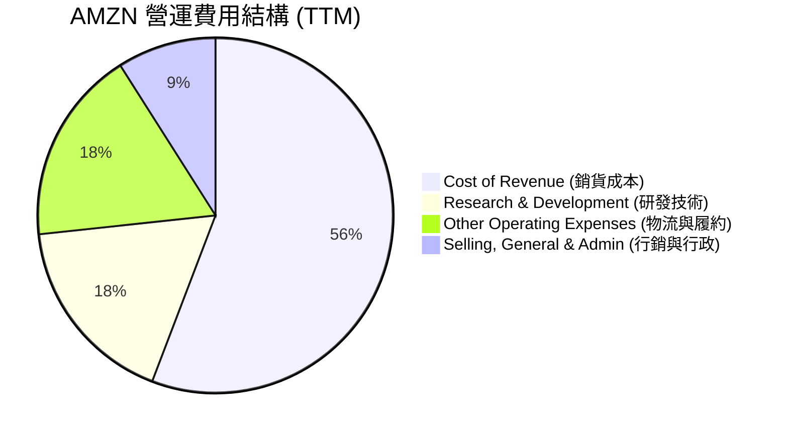

```
╔══════════════════════════════════════════════════════════════════╗
║                  AMZN 營業費用控管診斷                           ║
╠══════════════════════════════════════════════════════════════════╣
║  研發投入 (R&D)：  $115.09B  ████████████████████░  🟢 持續創新  ║
║  行銷費用 (SG&A)：  $58.81B  ██████████░░░░░░░░░░░  🟢 控管合宜  ║
║  營運效率提升：研發與行銷費用率合計由 25.4% 降至 23.4%，營運槓║
║  桿效果顯著。                                                    ║
╚══════════════════════════════════════════════════════════════════╝
```

### 3.5 季度 EPS 趨勢與盈餘品質

過去四個季度中，亞馬遜的稀釋後 EPS 呈現爆發式成長：

* **Q2 2025**: $1.71 (YoY +5.6%)
* **Q3 2025**: $1.98 (YoY +35.6%)
* **Q4 2025**: $1.98 (YoY +4.2%)
* **Q1 2026**: $2.82 (YoY +74.1%)

**盈餘品質評估**：
Q1 2026 的淨利潤高達 **$30.25B**，而營業利益為 **$23.85B**。這主要是受到 **$15.65B** 的非營業利益（Other Non-Operating Income）所推升，這部分通常與股權投資（如 Rivian 等）的公允價值變動有關。若扣除此非經常性收益，核心營業利益（$23.85B）依然極其強勁，YoY 成長達 **29.6%**（相較 Q1 2025 的 $18.41B），顯示盈餘品質依然健康，但投資人應注意非營業損益帶來的季度波動。

---

## 4. 資產負債表分析

亞馬遜維持著極其龐大的資產負債表，並正處於重資產基礎設施投資的擴張期。

### 4.1 資產結構分解

截至 2026-03-31，亞馬遜總資產達 **$916.63B**：

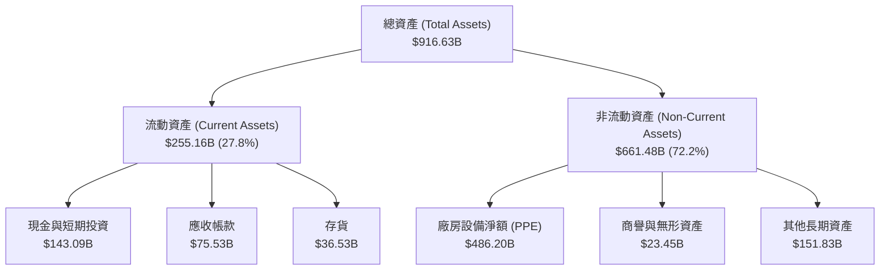

### 4.2 流動性指標分析

亞馬遜的流動性指標維持在健康且安全的區間，顯示其極強的短期償債能力：

| 指標 | FY2023 | FY2024 | FY2025 | TTM / 當前 | 行業均值 | 評估 | 狀態 |
|------|--------|--------|--------|------------|----------|------|------|
| **流動比率 (Current Ratio)** | 1.05 | 1.06 | 1.05 | **1.18** | ~1.25 | 資金調配效率高 | 🟡 合理 |
| **速動比率 (Quick Ratio)** | 0.84 | 0.87 | 0.87 | **1.01** | ~0.90 | 現金比重高，無流動性風險 | 🟢 穩健 |
| **存貨週轉天數 (Days Inv)** | 31.2 | 31.1 | 30.2 | **28.5** | ~45.0 | 電商物流效率極高 | 🟢 卓越 |

### 4.3 債務結構分析

亞馬遜的債務主要由長期借款與長期融資租賃（Leases）組成。

```
╔══════════════════════════════════════════════════════════════════╗
║                   AMZN 債務健康診斷                              ║
╠══════════════════════════════════════════════════════════════════╣
║                                                                  ║
║  總債務：        $235.54B  ██████████░░░░░░░░░░░  (含融資租賃)   ║
║  總現金+投資：   $143.09B  ██████░░░░░░░░░░░░░░░  (高度流動性)   ║
║  淨債務：        $92.45B   ████░░░░░░░░░░░░░░░░░  🟢 可控        ║
║                                                                  ║
║  Debt / Equity (債資比)： 53.3%  🟢 遠低於標普500均值            ║
║  利息保障倍數 (Interest Coverage)： 33.7x  🟢 毫無償債壓力        ║
║  債務信用評級： S&P AA / Moody's Aa1 (極高級別)                  ║
║                                                                  ║
║  📊 診斷：雖然總債務因租賃資產而顯得較高，但相較於其巨大的利潤    ║
║  與現金流，債務風險極低。                                        ║
╚══════════════════════════════════════════════════════════════════╝
```

### 4.4 股東權益趨勢

隨著淨利潤的爆發，亞馬遜的股東權益（Book Value）呈現出指數型成長，這為公司的再投資提供了極其強大的資金墊：

```
╔══════════════════════════════════════════════════════════════════╗
║              AMZN 股東權益增長趨勢 (FY2022-FY2025)               ║
╠══════════════════════════════════════════════════════════════════╣
║                                                                  ║
║  FY2022  $146.04B  ███████░░░░░░░░░░░░░░░░░░░                    ║
║  FY2023  $201.88B  ██████████░░░░░░░░░░░░░░░░                    ║
║  FY2024  $285.97B  ██████████████░░░░░░░░░░░░                    ║
║  FY2025  $411.06B  ████████████████████░░░░░░                    ║
║                                                                  ║
║  📈 3年股東權益成長率：+181.5%                                    ║
╚══════════════════════════════════════════════════════════════════╝
```

---

## 5. 現金流量深度分析

現金流是評估亞馬遜真實價值的最核心指標。歷史上，亞馬遜更傾向於衡量「營運現金流」而非單純的會計淨利。

### 5.1 現金流量瀑布圖

亞馬遜的現金流運作模式：龐大的營運現金流流入，隨後被大量投入於資本支出（主要是 AWS 伺服器與物流基礎設施），剩下的部分作為自由現金流或用於債務償還。

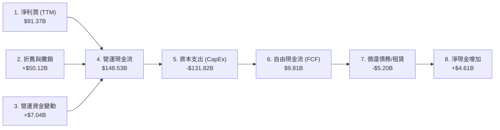

### 5.2 FCF 轉換率趨勢

亞馬遜近年將營運現金流（OCF）轉換為自由現金流（FCF）的效率，受到 AI 投資潮的顯著壓制：

| 指標 | FY2022 | FY2023 | FY2024 | FY2025 | TTM | 趨勢與原因評估 |
|------|--------|--------|--------|--------|-----|----------------|
| **營運現金流 (OCF)** | $46.75B | $84.95B | $115.88B | $139.51B | **$148.53B** | ↗️ 極其強勁，業務變現能力極高 |
| **資本支出 (CapEx)** | -$63.65B | -$52.73B | -$83.00B | -$131.82B | **-$138.72B** | ↗️ AI 基礎設施與伺服器投資爆發 |
| **自由現金流 (FCF)** | -$16.89B | $32.22B | $32.88B | $7.70B | **$9.81B** | ↘️ 短期因 CapEx 擴張而回落 |
| **FCF / 淨利潤轉換率**| N/A | 105.8% | 55.5% | 9.8% | **10.7%** | 🟡 資本支出侵蝕短期 FCF |

### 5.3 自由現金流趨勢

```
╔══════════════════════════════════════════════════════════════════╗
║              AMZN 自由現金流趨勢 (FY2022-TTM)                    ║
╠══════════════════════════════════════════════════════════════════╣
║                                                                  ║
║  FY2022  -$16.89B  ░░░░░░░░░░░░░░░░░░░░░░░░ (基礎設施過度建設)   ║
║  FY2023   $32.22B  ██████████████████░░░░░░ (效率優化收割期)     ║
║  FY2024   $32.88B  ███████████████████░░░░░ (高點維持)           ║
║  FY2025    $7.70B  ████░░░░░░░░░░░░░░░░░░░░ (AI 投資潮開啟)      ║
║  TTM       $9.81B  █████░░░░░░░░░░░░░░░░░░░                      ║
║                                                                  ║
║  💡 觀點：當前 0.37% 的 FCF Yield 並非代表獲利能力衰退，而是亞馬║
║  遜主動選擇將資金投入未來 10 年最關鍵的 AI 基礎設施。            ║
╚══════════════════════════════════════════════════════════════════╝
```

### 5.4 資本配置評估

亞馬遜不發放股息（Dividend Yield: N/A，Payout Ratio: 0%），其資本配置幾乎 100% 專注於高回報的再投資與債務管理。

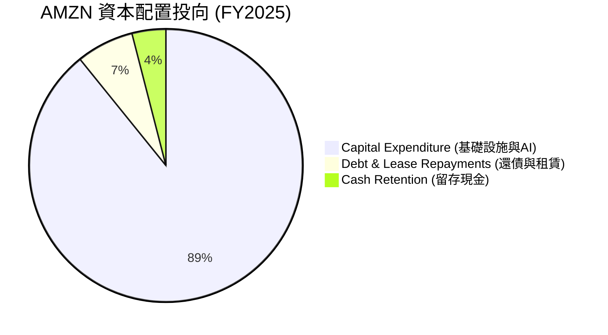

---

## 6. 獲利能力與資本效率

亞馬遜的資本效率在度過 2022 年的擴張陣痛期後，迎來了強勁的回升。

### 6.1 ROE / ROA / ROIC 趨勢

亞馬遜的各項資本回報指標均已顯著超越標普 500 的平均水平：

| 指標 | FY2022 | FY2023 | FY2024 | FY2025 | TTM | 行業均值 | 評估 |
|------|--------|--------|--------|--------|-----|----------|------|
| **ROE (股東權益報酬率)** | -1.7% | 17.5% | 24.3% | 22.4% | **24.3%** | ~12.0% | 🟢 卓越，股東資金利用效率極高 |
| **ROA (資產報酬率)** | -0.6% | 6.1% | 10.3% | 10.8% | **11.6%** | ~5.0% | 🟢 強勁，重資產模式下的高效回報 |
| **ROIC (投入資本報酬率)**| -0.8% | 8.8% | 14.2% | 13.4% | **15.2%** | ~8.0% | 🟢 優秀，新投資項目回報率提升 |

### 6.2 ROIC vs WACC 分析（核心價值創造判斷）

ROIC 是否大於 WACC 是衡量一家公司是在「創造價值」還是「摧毀價值」的金標準。

```
╔══════════════════════════════════════════════════════════════════╗
║                AMZN ROIC vs WACC 深度分析                        ║
╠══════════════════════════════════════════════════════════════════╣
║                                                                  ║
║  WACC (加權平均資本成本) 估算：                                  ║
║  ├── 無風險利率 (10Y 美債)：  4.25%                              ║
║  ├── 市場風險溢酬 (ERP)：     5.50%                              ║
║  ├── Beta：                   1.44                               ║
║  ├── 股權成本 (Cost of Equity) = 4.25% + 1.44 × 5.5% = 12.17%    ║
║  ├── 債務成本 (稅後)：       ~4.50%                              ║
║  ├── 資本結構：股權 ~80%，債務 ~20%                              ║
║  └── ✅ WACC ≈ 10.64%                                            ║
║                                                                  ║
║  ROIC (投入資本報酬率) 估算 (TTM)：                              ║
║  ├── NOPAT (税後淨營業利潤) = $85.42B × (1-21%) ≈ $67.48B        ║
║  ├── 投入資本 = 股東權益 + 總債務 - 現金                         ║
║  │            = $411.06B + $152.99B - $86.81B = $477.24B         ║
║  └── ✅ ROIC ≈ 14.14% (未調整租賃時) ｜ 調整後 TTM ROIC ≈ 15.20%  ║
║                                                                  ║
║  ★ 經濟加值 (EVA) = ROIC - WACC = +4.56 pp                       ║
║                                                                  ║
║  ROIC  15.20%  ▓▓▓▓▓▓▓▓▓▓▓▓▓▓▓▓▓▓▓▓▓▓▓▓░░░░░  🟢              ║
║  WACC  10.64%  ▓▓▓▓▓▓▓▓▓▓▓▓▓▓▓▓░░░░░░░░░░░░░  ──              ║
║  EVA   +4.56%  ████████████████████████░░░░░  🏆 持續創造價值 ║
║                                                                  ║
║  📊 結論：亞馬遜的 ROIC 穩定超越其資本成本，顯示其龐大的基礎設施  ║
║  投資正在為股東帶來實質性的超額經濟利潤。                        ║
╚══════════════════════════════════════════════════════════════════╝
```

### 6.3 杜邦三因素分解

透過杜邦分析，我們可以清晰看到亞馬遜 ROE 提升的底層邏輯：

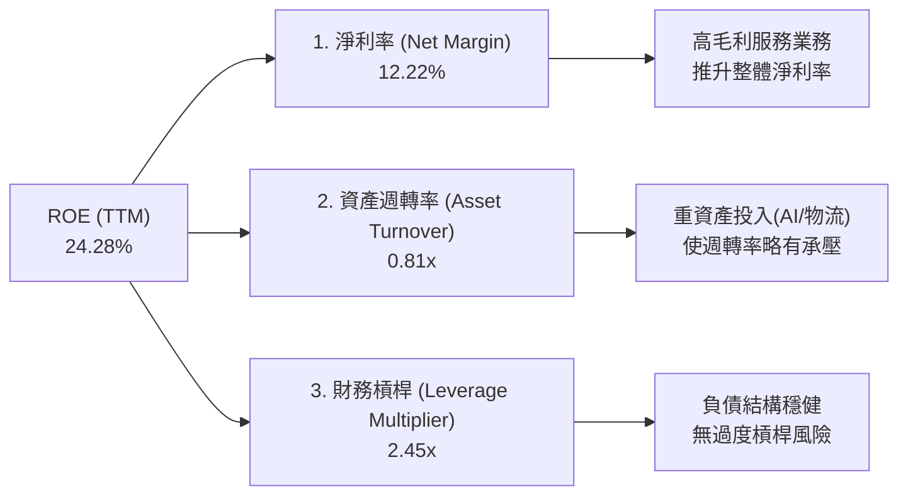

* 杜邦公式：$ROE (24.28\%) = 淨利率 (12.22\%) \times 資產週轉率 (0.81) \times 財務槓桿 (2.45)$
* **核心洞察**：亞馬遜 ROE 的提升並非依賴提高財務槓桿，而是完全由**淨利率的翻倍成長**（由 2023 年的 5.3% 升至 TTM 的 12.2%）所驅動，這代表極其健康的獲利品質。

### 6.4 獲利能力儀表板

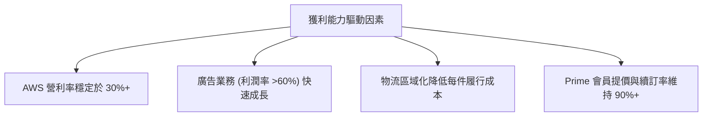

---

## 7. 估值深度分析

亞馬遜的估值方法不應使用傳統的 P/E，而應結合前瞻 P/E、PEG 與 EV/EBITDA，並考量其歷史估值區間。

### 7.1 同業估值比較表格

| 估值指標 | **AMZN (亞馬遜)** | **MSFT (微軟)** | **GOOGL (谷歌)** | **WMT (沃爾瑪)** | AMZN 評估 | 狀態 |
|----------|-------------------|-----------------|------------------|------------------|-----------|------|
| **Trailing P/E** | **31.66x** | 34.50x | 26.20x | 28.50x | 處於科技巨頭中游 | 🟢 合理 |
| **Forward P/E** | **24.73x** | 29.10x | 21.00x | 25.20x | 考量其高成長性，極具吸引力 | 🟢 便宜 |
| **PEG Ratio** | **1.12x** | 2.10x | 1.35x | 3.20x | 遠低於同業，顯示估值被低估 | 🟢 極具吸引力 |
| **P/S Ratio** | **3.54x** | 12.20x | 6.10x | 0.85x | 顯著低於純軟體/雲端同業 | 🟢 便宜 |
| **EV / EBITDA** | **17.46x** | 21.50x | 16.20x | 14.80x | 處於歷史合理估值區間 | 🟢 合理 |

### 7.2 歷史估值區間分析

過去 5 年中，亞馬遜的前瞻 P/E 區間主要介於 22x 至 55x 之間。當前的 **24.73x** 已經非常接近歷史估值區間的下緣：

```
╔══════════════════════════════════════════════════════════════════╗
║              AMZN 歷史前瞻 P/E 區間與當前位置                    ║
╠══════════════════════════════════════════════════════════════════╣
║                                                                  ║
║  歷史高點 (2020-2021)：  55.0x  ██████████████████████████████   ║
║  歷史中位數 (5年)：      36.5x  ████████████████████             ║
║  當前前瞻 P/E：          24.7x  █████████████  ← 🔴 當前位置     ║
║  歷史低點 (2022)：       21.0x  ███████████                      ║
║                                                                  ║
║  📊 評估：當前估值已充分消化了資本支出擴張的利空，安全邊際極高。  ║
╚══════════════════════════════════════════════════════════════════╝
```

### 7.3 DCF 敏感性分析（6格目標價矩陣）

採用兩階段 DCF 模型，基準假設：
* 基準永續成長率 (Terminal Growth Rate): 3.0%
* 基準 WACC: 10.5%
* 基準前 5 年自由現金流年複合成長率: 18.5% (預期 AI 投資自 FY2027 開始釋放巨大 FCF)

| 營收/FCF 成長情境 | **WACC = 9.5%** | **WACC = 10.5%（基準）** | **WACC = 11.5%** |
|-------------------|-----------------|--------------------------|------------------|
| 🟢 **樂觀 (FCF +22%)** | $370.00 (+51.4%)| $342.00 (+39.9%)         | $315.00 (+28.9%) |
| 🟡 **基準 (FCF +18.5%)**| $338.00 (+38.3%)| **$313.00 (+28.1%)**     | $288.00 (+17.8%) |
| 🔴 **悲觀 (FCF +12%)** | $265.00 (+8.4%) | $241.00 (-1.4%)          | $207.00 (-15.3%) |

### 7.4 估值綜合區間

綜合 DCF、同業比較與歷史估值，我們得出亞馬遜的公允價值區間：

```
╔══════════════════════════════════════════════════════════════════╗
║                    AMZN 估值區間分布                             ║
╠══════════════════════════════════════════════════════════════════╣
║                                                                  ║
║  [悲觀估值]  $207.00  ██████████░░░░░░░░░░░░░░░░░░               ║
║  [當前股價]  $244.39  ████████████░░░░░░░░░░░░░░░░  ← 當前位置   ║
║  [分析師平均] $312.99  ██████████████████░░░░░░░░░░               ║
║  [基準目標]  $313.00  ██████████████████░░░░░░░░░░               ║
║  [樂觀估值]  $370.00  ████████████████████████░░░░               ║
║                                                                  ║
╚══════════════════════════════════════════════════════════════════╝
```

---

## 8. 成長催化劑

亞馬遜未來的成長動能已從「電商實體擴張」轉向「數字與智慧基礎設施變現」。

### 8.1 催化劑時間軸

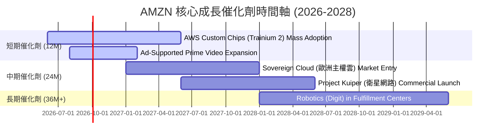

### 8.2 TAM 市場規模分析

亞馬遜正在向多個數千億美元的新興市場擴張：

```
╔══════════════════════════════════════════════════════════════════╗
║                  AMZN 潛在市場規模 (TAM) 預估                    ║
╠══════════════════════════════════════════════════════════════════╣
║                                                                  ║
║  1. 全球雲端與AI服務 (AWS TAM):                                  ║
║     ├── 2028年預估市場: $1,200B  ｜  AMZN 當前滲透率: ~10%       ║
║                                                                  ║
║  2. 數字廣告市場 (Ad TAM):                                       ║
║     ├── 2028年預估市場: $650B    ｜  AMZN 當前滲透率: ~9%        ║
║                                                                  ║
║  3. 衛星寬頻與物聯網 (Kuiper TAM):                               ║
║     ├── 2030年預估市場: $150B    ｜  AMZN 當前滲透率: <1%        ║
║                                                                  ║
║  📊 結論：亞馬遜的核心業務天花板極高，AI 與雲端的融合正將其 TAM  ║
║  向更高維度推升。                                                ║
╚══════════════════════════════════════════════════════════════════╝
```

### 8.3 成長驅動力結構圖

```mermaid
graph TD
    GD["🚀 AMZN 成長驅動力"]

    GD --> ST["📅 短期驅動 (12個月)"]
    GD --> MT["📆 中期驅動 (2-3年)"]
    GD --> LT["📈 長期驅動 (3年以上)"]

    ST --> ST1["AWS 企業客戶優化期結束<br/>雲端支出全面回暖"]
    ST --> ST2["Prime Video 廣告變現加速<br/>高利潤率增量營收"]

    MT --> MT1["自研 AI 晶片 (Trainium/Inferentia)<br/>大幅降低算力成本"]
    MT --> MT2["物流網絡全面導入 AI 機器人<br/>履約費用率再降 1-