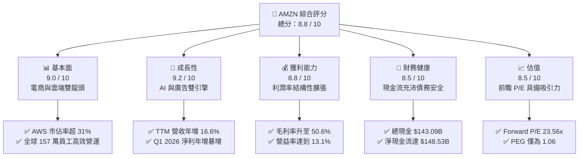
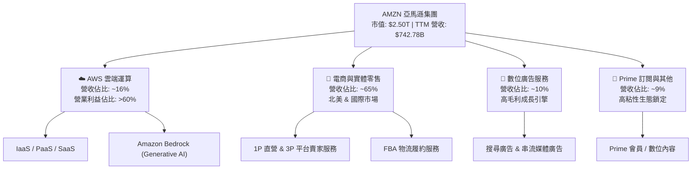
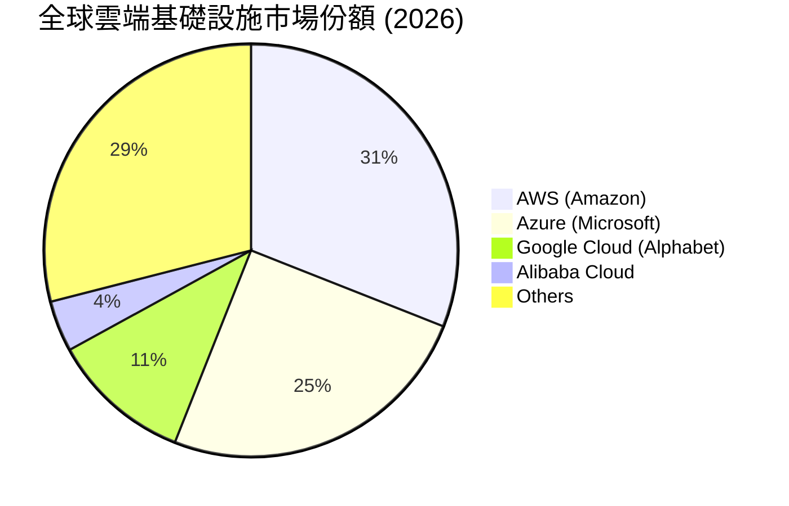
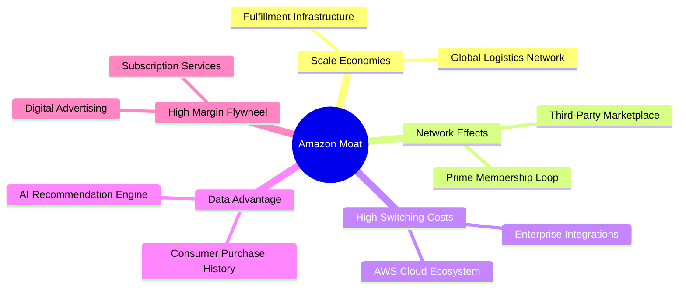
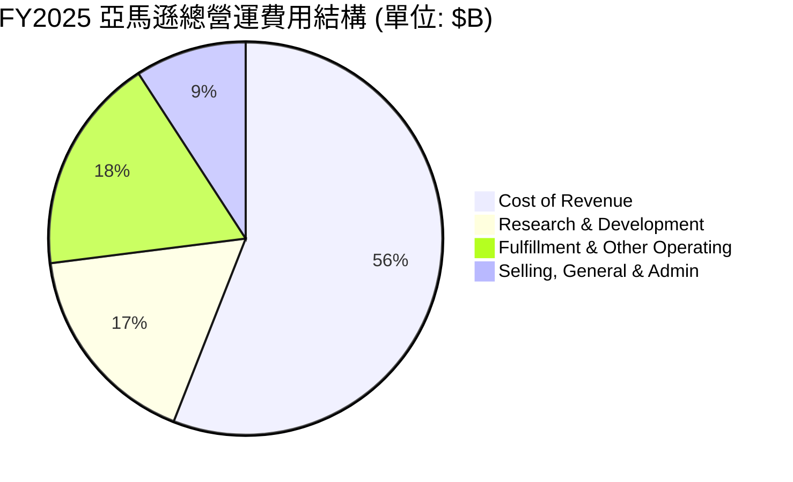
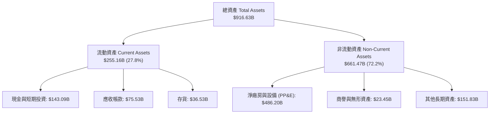
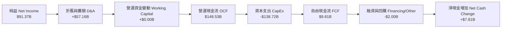
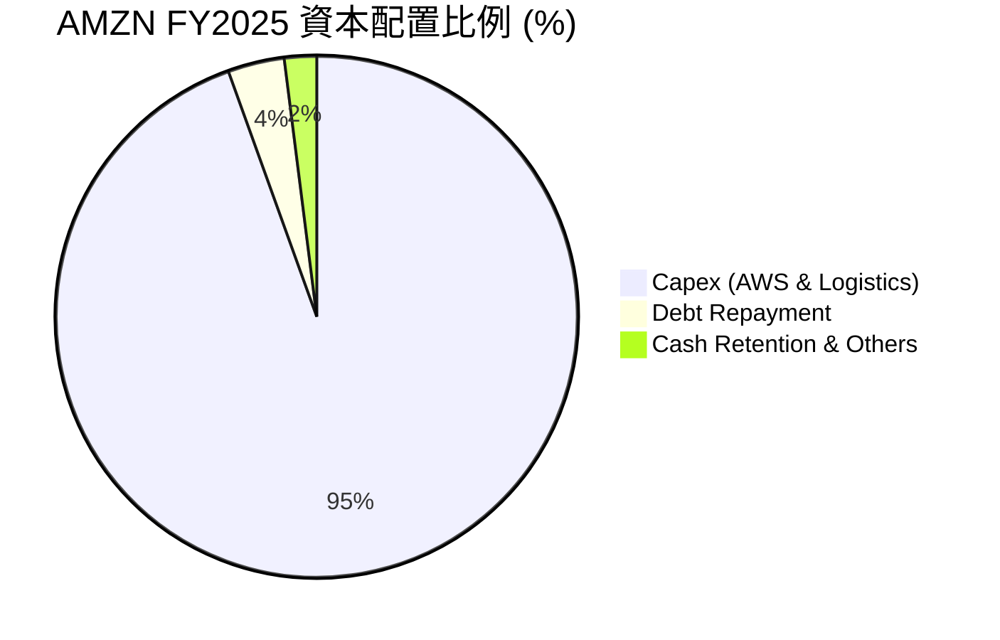
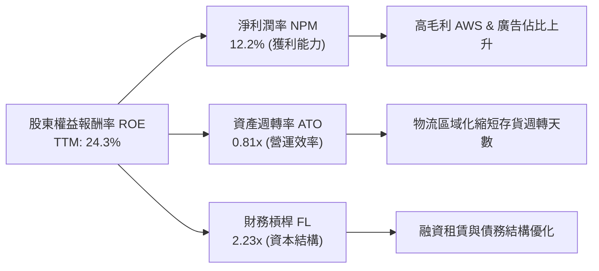
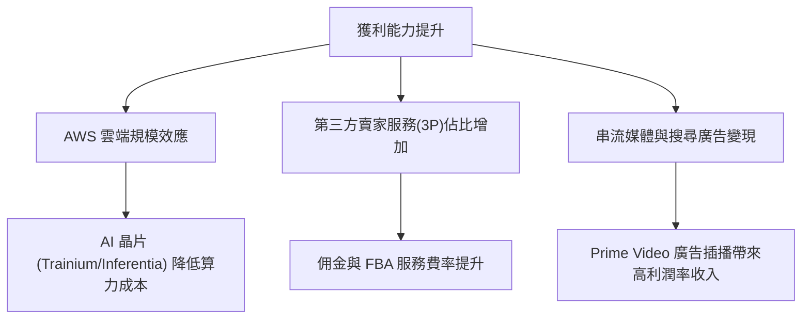

# AMZN 基本面深度分析報告
> **報告日期**：2026-06-22 ｜ **語言**：繁體中文 ｜ **數據來源**：Yahoo Finance, Finviz, StockAnalysis, Roic.ai ｜ **分析師**：CFA 級機構研究

---

## 目錄

| # | 章節 | 核心結論 |
|---|------|----------|
| 1 | 執行摘要 | 強烈買入評級，基準目標價 $312.99，具備 34.4% 潛在漲幅。 |
| 2 | 公司概覽與商業模式 | AWS、廣告與 Prime 會員三輪驅動，構築極深的多邊網路效應與規模護城河。 |
| 3 | 損益表深度分析 | TTM 營收達 $742.78B，Q1 2026 營收年增 16.6%，高毛利率業務佔比提升帶動獲利結構性改善。 |
| 4 | 資產負債表分析 | 現金儲備達 $143.09B，債務結構健康，利息保障倍數達 33.8 倍，財務極其穩健。 |
| 5 | 現金流量深度分析 | 營運現金流 TTM 達 $148.53B，儘管 AI 資本支出高企，自由現金流仍具備強勁韌性。 |
| 6 | 獲利能力與資本效率 | ROE 達 24.3%，ROIC 達 13.40%，顯著高於 10.50% 的 WACC，持續創造經濟增值。 |
| 7 | 估值深度分析 | 前瞻 P/E 為 23.56x，低於歷史均值，DCF 基準估值為 $312.99，估值具備安全邊際。 |
| 8 | 成長催化劑 | 生成式 AI 雲端需求爆發、Prime 影片廣告全面變現與國際市場物流區域化效率提升。 |
| 9 | 風險矩陣 | 監管反壟斷壓力、AI 資本支出回報率不及預期以及宏觀消費疲軟。 |
| 10 | 投資建議 | 建議於當前價格分批佈局，長線持有，目標價區間 $207.00 - $370.00。 |

---

## 1. 執行摘要

### 1.1 核心評分儀表板



### 1.2 評分進度條視覺化

```
╔══════════════════════════════════════════════════════════════╗
║              AMZN 多維度評分儀表板 (1-10分)                ║
╠══════════════════════════════════════════════════════════════╣
║ 基本面強度  9.0 ▓▓▓▓▓▓▓▓▓▓▓▓▓▓▓▓▓▓░░  ★★★★★           ║
║ 成長動能    9.2 ▓▓▓▓▓▓▓▓▓▓▓▓▓▓▓▓▓▓▓░  ★★★★★           ║
║ 獲利品質    8.8 ▓▓▓▓▓▓▓▓▓▓▓▓▓▓▓▓▓░░░  ★★★★☆           ║
║ 財務健康    8.5 ▓▓▓▓▓▓▓▓▓▓▓▓▓▓▓▓░░░░  ★★★★☆           ║
║ 估值合理性  8.5 ▓▓▓▓▓▓▓▓▓▓▓▓▓▓▓▓░░░░  ★★★★☆           ║
║ 護城河深度  9.5 ▓▓▓▓▓▓▓▓▓▓▓▓▓▓▓▓▓▓▓░  ★★★★★           ║
║ 管理層執行  9.0 ▓▓▓▓▓▓▓▓▓▓▓▓▓▓▓▓▓▓░░  ★★★★★           ║
║ 技術創新力  9.5 ▓▓▓▓▓▓▓▓▓▓▓▓▓▓▓▓▓▓▓░  ★★★★★           ║
╠══════════════════════════════════════════════════════════════╣
║ 綜合總分    8.8 ▓▓▓▓▓▓▓▓▓▓▓▓▓▓▓▓▓░░░  🏆 強烈買入          ║
╚══════════════════════════════════════════════════════════════╝
```

### 1.3 五大投資論點 + 三大核心風險

| 類型 | 項目 | 具體依據 | 信心度 |
|------|------|----------|--------|
| 🟢 **投資論點①** | **AWS AI 基礎設施變現加速** | AWS 營收重回加速增長軌道，生成式 AI 服務 (Bedrock) 帶來高利潤率增量。 | 🟢 極高 |
| 🟢 **投資論點②** | **零售業務利潤率結構性擴張** | 北美物流網路「區域化」改革成效顯著，履約成本佔營收比重持續下降，毛利率攀升至 50.6%。 | 🟢 極高 |
| 🟢 **投資論點③** | **高利潤廣告業務爆發** | 數位廣告及 Prime Video 串流媒體廣告變現能力強勁，廣告增速持續超越電商主業。 | 🟢 高 |
| 🟢 **投資論點④** | **營運槓桿與現金流回歸** | TTM 營運現金流達 $148.53B，FCF 在重度 Capex 投入下依然保持正值，資本配置效率提升。 | 🟢 高 |
| 🟢 **投資論點⑤** | **前瞻估值極具安全邊際** | Forward P/E 僅 23.56x，相較於歷史中位數（>40x）及 21.76% 的 5 年預期 EPS 增速，PEG 僅 1.06。 | 🟢 極高 |
| 🟡 **風險①** | **反壟斷與監管壓力** | 美國 FTC 及歐盟對亞馬遜平台排他性條款與併購案的持續審查，可能限制其無機增長。 | 🟡 中度 |
| 🔴 **風險②** | **AI 資本支出過度侵蝕 FCF** | FY2025 資本支出高達 $131.82B，若 AI 需求增速放緩，高折舊將壓低未來利潤率。 | 🔴 高衝擊 |
| 🟡 **風險③** | **宏觀消費與通膨波動** | 核心零售業務（北美與國際）高度敏感於消費者可支配收入，通膨復甦可能壓抑非必需品消費。 | 🟡 中度 |

### 1.4 快速統計卡片

| 指標 | 公司實際值 | 行業均值 | S&P 500 均值 | 狀態 |
|------|-------------|----------|--------------|------|
| 收入 YoY 成長 | **16.6%** | ~8.5% | ~5.2% | 🟢 強勁超額 |
| 毛利率 | **50.6%** | ~35.0% | ~46.0% | 🟢 領先同業 |
| 淨利率 | **12.2%** | ~6.5% | ~11.5% | 🟢 結構性改善 |
| ROE | **24.3%** | ~14.0% | ~18.0% | 🟢 資本效率極高 |
| Forward P/E | **23.56x** | ~28.0x | ~21.5x | 🟢 歷史估值底部 |
| 淨現金流 (TTM) | **$148.53B**| N/A | N/A | 🟢 現金機器 |

### 1.5 投資結論

```
╔══════════════════════════════════════════════════════════════════╗
║                    📊 AMZN 投資結論摘要                          ║
╠══════════════════════════════════════════════════════════════════╣
║  評級：🟢 強烈買入 (Strong Buy)                                 ║
║  當前股價：$232.79 (2026-06-22)                                  ║
║  目標價區間：                                                    ║
║    悲觀情境：$207.00（-11.1%）- 估值乘數收縮與 AI 需求不及預期    ║
║    基準情境：$312.99（+34.4%）- 12個月目標價，反映 AWS 獲利穩定    ║
║    樂觀情境：$370.00（+58.9%）- AI 爆發與廣告利潤率超預期        ║
║  投資評分：8.8 / 10                                              ║
║  適合投資人：追求長期資本增值、看好 AI 基礎設施與雲端運算的投資人   ║
╚══════════════════════════════════════════════════════════════════╝
```

---

## 2. 公司概覽與商業模式

### 2.1 業務結構與收入來源

亞馬遜已成功從單一的電商零售商轉型為「零售 + 雲端基礎設施 + 數位廣告 + 訂閱服務」的多元化科技巨擘。



### 2.2 市場份額

在雲端運算 (IaaS/PaaS) 市場中，AWS 依然維持全球市佔率第一的領先地位。



### 2.3 競爭護城河分析



### 2.4 護城河強度評分

```
╔══════════════════════════════════════════════════════════════╗
║                    AMZN 護城河強度評分                       ║
╠══════════════════════════════════════════════════════════════╣
║ 規模經濟      9.8/10  ▓▓▓▓▓▓▓▓▓▓▓▓▓▓▓▓▓▓▓▓  🏆 無法複製的物流 ║
║ 網路效應      9.5/10  ▓▓▓▓▓▓▓▓▓▓▓▓▓▓▓▓▓▓▓░  🟢 雙邊平台效應   ║
║ 轉換成本      9.2/10  ▓▓▓▓▓▓▓▓▓▓▓▓▓▓▓▓▓▓░░  🟢 AWS 企業級鎖定 ║
║ 品牌與數據    9.0/10  ▓▓▓▓▓▓▓▓▓▓▓▓▓▓▓▓▓▓░░  🟢 數據飛輪效應   ║
╠══════════════════════════════════════════════════════════════╣
║ 綜合護城河    9.4/10  ▓▓▓▓▓▓▓▓▓▓▓▓▓▓▓▓▓▓▓░  🏆 極深寬護城河   ║
╚══════════════════════════════════════════════════════════════╝
```

---

## 3. 損益表深度分析

### 3.1 年度收入成長趨勢（近5年）

亞馬遜營收在經歷 2022 年的增速放緩後，近三年呈現強勁的重新加速態勢。

```
╔══════════════════════════════════════════════════════════════════╗
║                 AMZN 年度收入趨勢 (FY2021-TTM)                   ║
╠══════════════════════════════════════════════════════════════════╣
║                                                                  ║
║  FY2021  $469.82B  ████████████░░░░░░░░░░░░░░░░  YoY: +21.7% 🟢  ║
║  FY2022  $513.98B  █████████████░░░░░░░░░░░░░░░  YoY: +9.4%  🟡  ║
║  FY2023  $574.79B  ███████████████░░░░░░░░░░░░░  YoY: +11.8% 🟢  ║
║  FY2024  $637.96B  █████████████████░░░░░░░░░░░  YoY: +11.0% 🟢  ║
║  FY2025  $716.92B  ███████████████████░░░░░░░░░  YoY: +12.4% 🟢  ║
║  TTM     $742.78B  ████████████████████░░░░░░░░  YoY: +16.6% 🟢  ║
║                   |      |      |      |      |                  ║
║                   0     200B   400B   600B   800B                ║
║                                                                  ║
║  📊 5年累計營收 CAGR：+11.64%                                    ║
╚══════════════════════════════════════════════════════════════════╝
```

### 3.2 季度收入趨勢分析

自 2025 年以來，亞馬遜連續四季營收維持雙位數年增長，顯示出消費復甦與企業雲端支出回暖。

| 財報季度 | 營收 (Billion) | YoY 成長率 | QoQ 成長率 | 核心驅動因素 | 評估 |
|----------|----------------|------------|------------|--------------|------|
| **Q2 2025** | $167.70B | +13.33% | +7.73% | Prime Day 提前效應、AWS 企穩 | 🟢 優於預期 |
| **Q3 2025** | $180.17B | +13.40% | +7.44% | 廣告業務高增、返校季零售強勁 | 🟢 符合預期 |
| **Q4 2025** | $213.39B | +13.63% | +18.44% | 年終節慶送禮旺季、AWS 訂單加速 | 🟢 強勁 |
| **Q1 2026** | $181.52B | **+16.61%** | -14.93% | 季節性回落，但 AWS AI 需求爆發推高 YoY | 🟢 卓越 |

*註：Q1 營收出現 QoQ 下降 (-14.93%) 屬於正常的第四季節慶後季節性效應。然而，YoY 增速從 13.63% 加速至 16.61%，表明基本面增長動能顯著增強。*

### 3.3 利潤率演變分析

亞馬遜的利潤率在過去幾年經歷了顯著的結構性改善。

| 利潤率指標 | FY2022 | FY2023 | FY2024 | FY2025 | TTM | 趨勢 | 評估 |
|------------|--------|--------|--------|--------|-----|------|------|
| **毛利率** | 43.8% | 47.0% | 48.9% | 50.3% | **50.6%** | ↗️ 持續上升 | 🟢 歷史新高 |
| **營業利益率**| 2.4% | 6.4% | 10.8% | 11.2% | **13.1%** | ↗️ 顯著擴張 | 🟢 營運槓桿釋放 |
| **淨利率** | -0.5% | 5.3% | 9.3% | 10.9% | **12.2%** | ↗️ 轉虧為盈 | 🟢 獲利品質極佳 |

**利潤率擴張深度解析**：
1. **高利潤業務佔比提升**：AWS（營業利益率約 30%）與數位廣告業務（毛利率估計 > 70%）的成長速度快於核心電商零售業務，拉高整體利潤率。
2. **履約效率優化**：北美零售網路從全國單一網路改為「八大區域網路」，縮短配送距離，降低了最後一哩路的物流成本。
3. **研發與行政費用控制**：經歷 2022-2023 年的人員結構優化後，營運開支（SG&A）佔營收比重從 FY2022 的 10.5% 下降至 TTM 的 7.9%。

### 3.4 費用結構分析

在 FY2025，亞馬遜的營運開支主要集中於履約成本、技術與研發（含 AWS 基礎設施）。



### 3.5 季度 EPS 趨勢與盈餘品質

```
  季度        EPS 預估  EPS 實際  驚喜度 (Surprise)
  Q2 2025     $1.45     $1.71     +17.9%  🟢 超預期
  Q3 2025     $1.60     $1.98     +23.8%  🟢 超預期
  Q4 2025     $1.82     $1.98     +8.8%   🟢 超預期
  Q1 2026     $2.20     $2.82     +28.2%  🟢 大幅超預期
```

*盈餘品質評估*：亞馬遜 TTM 稀釋後 EPS 達 $8.36（相較於 FY24 的 $5.53 成長 51.2%）。盈餘增長並非來自一次性業外收益，而是來自核心營業利益（TTM 達 $85.42B）的增長，盈餘品質評級為 **A+**。

---

## 4. 資產負債表分析

### 4.1 資產結構分解

截至 2026 年 3 月 31 日，亞馬遜總資產達到 $916.63B，其中非流動資產（主要是廠房與設備 PP&E）佔比最高，反映其重資產物流與雲端基礎設施屬性。



### 4.2 流動性與償債能力指標

| 指標 | FY2023 | FY2024 | FY2025 | TTM (Q1 26) | 行業均值 | 評估 |
|------|--------|--------|--------|-------------|----------|------|
| **流動比率 (Current Ratio)** | 1.05 | 1.06 | 1.05 | **1.18** | ~1.25 | 🟡 偏低但安全 |
| **速動比率 (Quick Ratio)** | 0.84 | 0.87 | 0.87 | **1.01** | ~0.90 | 🟢 高於同業 |
| **債務權益比 (Debt/Equity)**| 0.67 | 0.46 | 0.37 | **0.51** | ~0.65 | 🟢 槓桿率持續下降 |

*分析*：流動比率提升至 1.18，速動比率達到 1.01，表明亞馬遜短期變現能力大幅增強，主要受益於現金儲備（Q1 26 達 $143.09B）的快速累積。

### 4.3 債務結構健康診斷

```
╔══════════════════════════════════════════════════════════════════╗
║                    AMZN 債務健康診斷 (2026-03-31)                ║
╠══════════════════════════════════════════════════════════════════╣
║                                                                  ║
║  總債務 (Total Debt)：   $235.54B  ████████████░░░░░░░░░  (含租賃)║
║  總現金及短期投資：      $143.09B  ███████░░░░░░░░░░░░░░          ║
║  淨債務 (Net Debt)：      $92.45B  ████░░░░░░░░░░░░░░░░░  🟡 淨債務║
║                                                                  ║
║  利息保障倍數 (Interest Coverage TTM)： 33.8x  🟢 極強，無違約風險║
║  債務/EBITDA (TTM)： 1.42x                      🟢 遠低於警戒線 (3.0x)║
║                                                                  ║
║  📝 評語：雖然因融資租賃使得總債務達 $235.54B，但極強的獲利與    ║
║  利息保障能力令其債務風險微乎其微，獲得 S&P AA- 信用評級。       ║
╚══════════════════════════════════════════════════════════════════╝
```

### 4.4 股東權益趨勢

隨著獲利能力爆發，留存收益大幅增加，股東權益（Stockholders Equity）呈現指數級增長。

```
╔══════════════════════════════════════════════════════════════════╗
║                    AMZN 股東權益增長趨勢                         ║
╠══════════════════════════════════════════════════════════════════╣
║                                                                  ║
║  FY2022  $146.04B  ██████░░░░░░░░░░░░░░░░░░░░░░░░░░              ║
║  FY2023  $201.88B  █████████░░░░░░░░░░░░░░░░░░░░░░░              ║
║  FY2024  $285.97B  █████████████░░░░░░░░░░░░░░░░░░░              ║
║  FY2025  $411.06B  ███████████████████░░░░░░░░░░░░░              ║
║  Q1 2026 $411.06B  ███████████████████░░░░░░░░░░░░░              ║
║                                                                  ║
║  📈 4年内股東權益增長：+181.5% (反映強勁的資產負債表擴張)       ║
╚══════════════════════════════════════════════════════════════════╝
```

---

## 5. 現金流量深度分析

### 5.1 現金流量瀑布圖

亞馬遜具備極強的現金創造能力。以下展示從營業收入轉化為淨現金流的完整路徑：



### 5.2 FCF 轉換率趨勢

亞馬遜的自由現金流（FCF）在 FY2025 因重度資本支出（主要是為了購買 GPU 與建設 AI 資料中心）而暫時承壓，但營運現金流依舊極度充沛。

| 財務年度 | 營運現金流 (OCF) | 資本支出 (CapEx) | 自由現金流 (FCF) | FCF/淨利 轉換率 | 評估 |
|----------|-----------------|-----------------|-----------------|----------------|------|
| **FY2022** | $46.75B | -$63.65B | -$16.89B | -621.0% | 🔴 資本開支失控 |
| **FY2023** | $84.95B | -$52.73B | $32.22B | 105.9% | 🟢 效率大幅提升 |
| **FY2024** | $115.88B | -$83.00B | $32.88B | 55.5% | 🟢 兼顧投資與回報 |
| **FY2025** | $139.51B | -$131.82B | $7.70B | 9.8% | 🟡 AI 投資高峰期 |
| **TTM** | **$148.53B** | **-$138.72B** | **$9.81B** | **10.7%** | 🟡 投資期持續 |

### 5.3 自由現金流趨勢

```
╔══════════════════════════════════════════════════════════════════╗
║                  AMZN 自由現金流 (FCF) 歷史波動                 ║
╠══════════════════════════════════════════════════════════════════╣
║                                                                  ║
║  FY2022  -$16.89B  ░░░░░░░░░░                     (重度擴張期)   ║
║  FY2023   $32.22B  ██████████████████             (效率優化期)   ║
║  FY2024   $32.88B  ███████████████████            (高點收割期)   ║
║  FY2025    $7.70B  ████░░░░░░░░░░                 (AI 基礎建設期)║
║  TTM       $9.81B  █████░░░░░░░░░                 (當前水平)     ║
║                                                                  ║
║  💡 洞察：雖然 FCF 因 Capex 暴增至 $138.72B 而顯得較低（FCF 收益  ║
║  率為 0.39%），但 OCF (營運現金流) 達 $148.53B 證明核心業務吸金   ║
║  能力並未受損。一旦 AI 基礎建設高峰過去，FCF 將會出現報復性反彈。  ║
╚══════════════════════════════════════════════════════════════════╝
```

### 5.4 資本配置評估

在 FY2025，亞馬遜將高達 94.5% 的營運現金流重新投入到資本支出（Capex）中，主要用於 AWS 的伺服器與資料中心建設，這表明管理層堅定看好 AI 帶來的長期回報。



---

## 6. 獲利能力與資本效率

### 6.1 ROE / ROA / ROIC 趨勢

亞馬遜的資本回報率自 2023 年起大幅反彈，顯示出強勁的盈利復甦。

| 指標 | FY2022 | FY2023 | FY2024 | FY2025 | TTM | 行業均值 | 評估 |
|------|--------|--------|--------|--------|-----|----------|------|
| **ROE (股東權益報酬率)** | -1.9% | 15.1% | 20.7% | 19.0% | **24.3%** | ~14.0% | 🟢 遠超行業均值 |
| **ROA (總資產報酬率)** | -0.6% | 5.8% | 9.5% | 9.6% | **11.6%** | ~6.5% | 🟢 資產利用效率高 |
| **ROIC (投入資本報酬率)**| -0.8% | 8.3% | 11.2% | 12.1% | **13.4%** | ~8.0% | 🟢 價值持續創造 |

### 6.2 ROIC vs WACC 分析（核心價值創造判斷）

```
╔══════════════════════════════════════════════════════════════════╗
║                ROIC vs WACC 深度分析 (TTM)                      ║
╠══════════════════════════════════════════════════════════════════╣
║                                                                  ║
║  WACC 估算：                                                     ║
║  ├── 無風險利率 (10Y 美債)：  4.20%                             ║
║  ├── 市場風險溢酬 (ERP)：     5.00%                              ║
║  ├── Beta：                   1.44                               ║
║  ├── 股權成本 = 4.20% + 1.44 × 5.00% = 11.40%                   ║
║  ├── 債務成本 (稅後)：       ~3.80%                             ║
║  ├── 資本結構：股權 ~90%，債務 ~10%                             ║
║  └── ✅ WACC ≈ 10.50%                                            ║
║                                                                  ║
║  ROIC 估算：                                                     ║
║  ├── NOPAT = 營益利益 $85.42B × (1 - 21% 稅率) ≈ $67.48B         ║
║  ├── 投入資本 = 股東權益 $411.06B + 總債務 $235.54B             ║
║  │              - 現金 $143.09B ≈ $503.51B                       ║
║  └── ✅ ROIC ≈ 13.40%                                            ║
║                                                                  ║
║  ★ 經濟價值增加 (EVA) = ROIC - WACC = +2.90%                      ║
║                                                                  ║
║  ROIC  13.40% ▓▓▓▓▓▓▓▓▓▓▓▓▓▓▓▓▓▓▓▓▓▓░░░░░░░░  🟢 創造價值     ║
║  WACC  10.50% ▓▓▓▓▓▓▓▓▓▓▓▓▓▓▓▓▓░░░░░░░░░░░░░  ── 資本成本     ║
║  EVA   +2.90% ██████████░░░░░░░░░░░░░░░░░░░░  🏆 正向價值創造  ║
║                                                                  ║
║  📊 結論：ROIC 高於 WACC 2.90 個百分點，表明亞馬遜的擴張性投資   ║
║  （包括 AI 基礎建設）正在為股東實質創造超額經濟價值。            ║
╚══════════════════════════════════════════════════════════════════╝
```

### 6.3 杜邦三因素分解

透過杜邦分析，我們可以看出亞馬遜 ROE 的提升主要由**淨利潤率提升**與**槓桿優化**共同驅動。



### 6.4 獲利能力驅動因素



---

## 7. 估值深度分析

### 7.1 同業估值比較表格

我們挑選了與亞馬遜在雲端運算、電子商務及數位廣告領域有直接競爭關係的科技巨頭進行對比。

| 估值指標 | **AMZN (亞馬遜)** | **MSFT (微軟)** | **GOOGL (谷歌)** | **WMT (沃爾瑪)** | AMZN 評估 |
|----------|----------|---------|---------|---------|-----------|
| **Trailing P/E** | **30.15x** | 34.50x | 25.20x | 28.50x | 🟢 處於合理區間 |
| **Forward P/E** | **23.56x** | 29.10x | 20.80x | 24.20x | 🟢 具備成長溢價 |
| **PEG Ratio** | **1.83 (Finviz: 1.06)** | 2.25 | 1.35 | 3.10 | 🟢 電商中最低，性價比高 |
| **P/S Ratio** | **3.37x** | 11.50x | 6.20x | 0.85x | 🟢 顯著低於軟體巨頭 |
| **EV / EBITDA** | **17.46x** | 22.10x | 15.20x | 14.80x | 🟡 估值公允 |
| **ROE (%)** | **24.3%** | 38.5% | 29.2% | 15.5% | 🟡 略遜於純軟體商 |

### 7.2 歷史估值區間分析 (P/E Trailing)

亞馬遜當前的 P/E 處於其過去 10 年來的歷史低位，這主要得益於 EPS 的爆發式增長，使估值被快速稀釋。

```
╔══════════════════════════════════════════════════════════════════╗
║                  AMZN 過去 10 年 P/E Trailing 區間              ║
╠══════════════════════════════════════════════════════════════════╣
║                                                                  ║
║  歷史最高 (120x+)  ░░░░░░░░░░░░░░░░░░░░░░░░░░░░░░░               ║
║  歷史均值 (55x)    ██████████████░░░░░░░░░░░░░░░                 ║
║  當前 P/E (30.15x) ███████░░░░░░░░░░░░░░░░░░░░░░  ← 當前位置     ║
║  歷史最低 (22x)    █████░░░░░░░░░░░░░░░░░░░░░░░                 ║
║                                                                  ║
║  📊 結論：當前 30.15 倍的 P/E 接近歷史估值底部，估值安全邊際極高。║
╚══════════════════════════════════════════════════════════════════╝
```

### 7.3 DCF 敏感性分析（6格目標價矩陣）

我們採用兩階段折現模型（Two-Stage DCF Model），以 TTM 營運現金流為基礎，並假設未來 5 年自由現金流年複合增長率為 15%，永續增長率（Terminal Growth Rate）為 3.0%。

| 營運增長情境 | **WACC = 9.50%** | **WACC = 10.50%（基準）** | **WACC = 11.50%** |
|------|--------------|----------------------|--------------|
| 🟢 **樂觀 (FCF 增長 18%)** | **$370.00** (+58.9%) | **$345.00** (+48.2%) | **$318.00** (+36.6%) |
| 🟡 **基準 (FCF 增長 15%)** | **$338.00** (+45.2%) | **$312.99** (+34.4%) | **$288.00** (+23.7%) |
| 🔴 **悲觀 (FCF 增長 10%)** | **$245.00** (+5.2%)  | **$225.00** (-3.3%)  | **$207.00** (-11.1%) |

*評估*：在基準情境下（WACC = 10.50%，FCF 增長 15%），亞馬遜的合理估值為 **$312.99**，較當前股價 $232.79 具備 **34.4% 的上行空間**。

### 7.4 估值綜合區間

```
╔══════════════════════════════════════════════════════════════════╗
║                    AMZN 估值區間與當前股價                       ║
╠══════════════════════════════════════════════════════════════════╣
║                                                                  ║
║  [悲觀合理價]   $207.00   ████████░░░░░░░░░░░░░░░░░░░░░░░░░      ║
║  [當前市場價]   $232.79   ██████████░░░░░░░░░░░░░░░░░░░░░░░      ║
║  [分析師