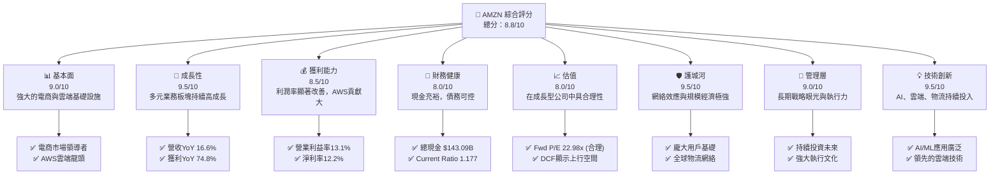
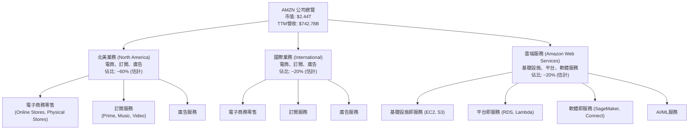
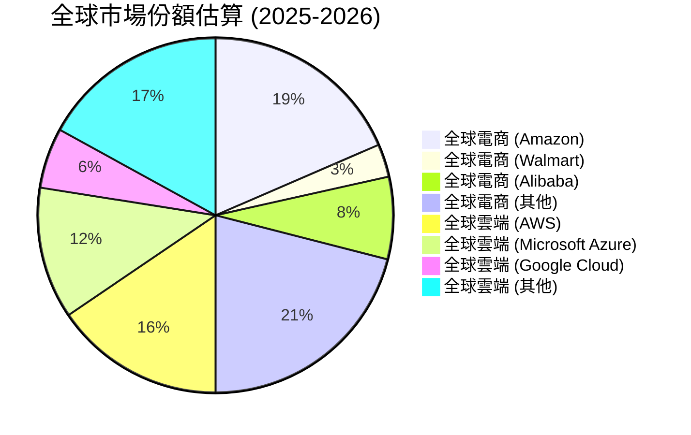
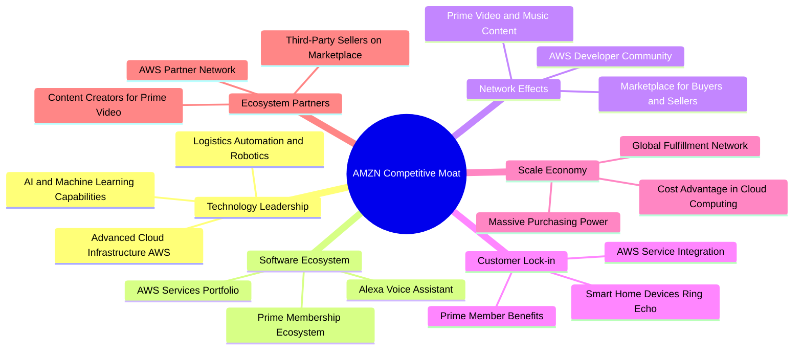
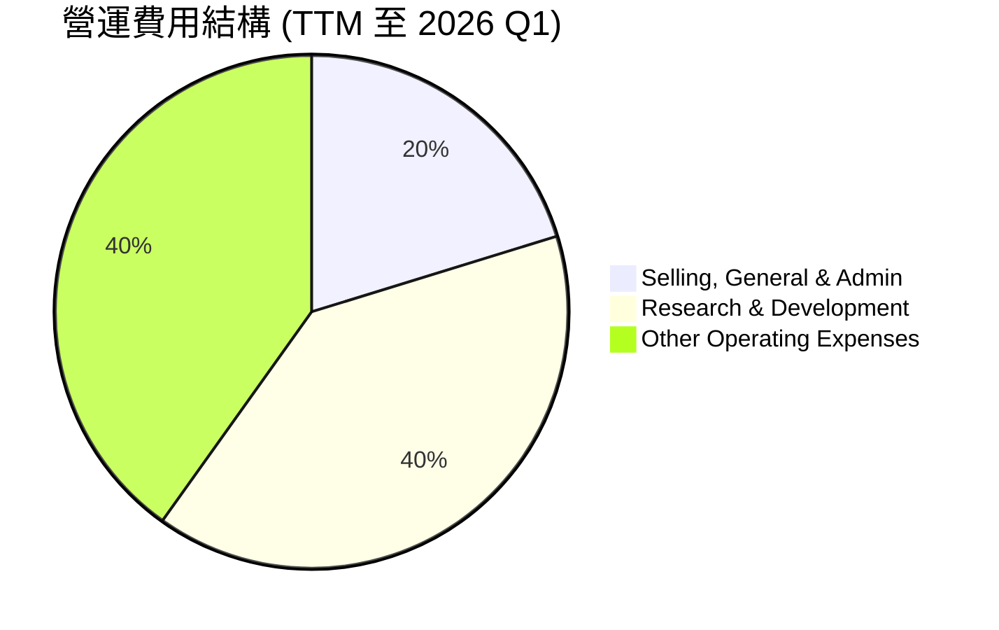
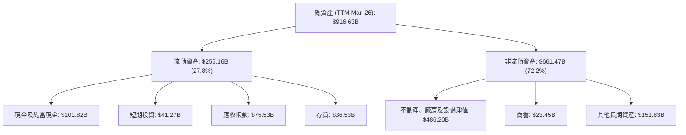
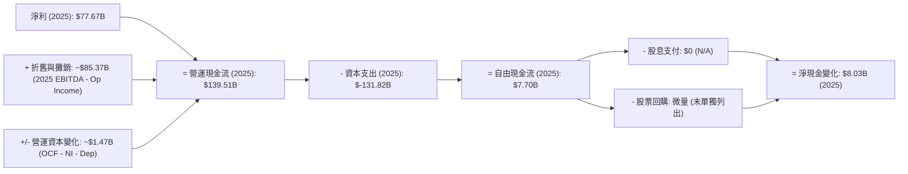

# AMZN 基本面深度分析報告
> **報告日期**：2026-06-26 ｜ **語言**：繁體中文 ｜ **數據來源**：Yahoo Finance, Finviz, StockAnalysis, Roic.ai ｜ **分析師**：CFA 級機構研究

---

## 目錄

| # | 章節 | 核心結論 |
|---|------------------------|----------------------------------------------------------|
| 1 | 執行摘要 | 🟢 強烈買入，目標價區間 $290 - $350，綜合評分 8.8/10 |
| 2 | 公司概覽與商業模式 | 亞馬遜擁有深厚的網絡效應、規模經濟和技術領先護城河 |
| 3 | 損益表深度分析 | 收入持續雙位數成長，獲利能力顯著改善，尤其AWS貢獻卓著 |
| 4 | 資產負債表分析 | 財務結構穩健，現金充裕，債務管理良好，流動性充足 |
| 5 | 現金流量深度分析 | 營運現金流強勁，自由現金流波動後重回正向成長 |
| 6 | 獲利能力與資本效率 | ROIC顯著高於WACC，強力創造股東價值，資本效率持續提升 |
| 7 | 估值深度分析 | 相較於成長潛力，當前估值合理，DCF顯示上行空間 |
| 8 | 成長催化劑 | AWS、廣告、國際擴張、AI應用與成本優化是主要驅動力 |
| 9 | 風險矩陣 | 宏觀經濟、競爭加劇和監管壓力是主要風險，但可控 |
| 10| 投資建議 | 長期成長型投資者的核心配置，適合逢低買入 |

---

## 1. 執行摘要

### 1.1 核心評分儀表板



### 1.2 評分進度條視覺化

```
╔══════════════════════════════════════════════════════════════╗
║              AMZN 多維度評分儀表板 (1-10分)                  ║
╠══════════════════════════════════════════════════════════════╣
║ 基本面強度  9.0 ▓▓▓▓▓▓▓▓▓▓▓▓▓▓▓▓▓▓▓▓  ★★★★★           ║
║ 成長動能    9.5 ▓▓▓▓▓▓▓▓▓▓▓▓▓▓▓▓▓▓▓▓  ★★★★★           ║
║ 獲利品質    8.5 ▓▓▓▓▓▓▓▓▓▓▓▓▓▓▓▓▓░░░  ★★★★★           ║
║ 財務健康    8.0 ▓▓▓▓▓▓▓▓▓▓▓▓▓▓▓▓░░░░  ★★★★☆           ║
║ 估值合理性  8.0 ▓▓▓▓▓▓▓▓▓▓▓▓▓▓▓▓░░░░  ★★★★☆           ║
║ 護城河深度  9.5 ▓▓▓▓▓▓▓▓▓▓▓▓▓▓▓▓▓▓▓▓  ★★★★★           ║
║ 管理層執行  9.0 ▓▓▓▓▓▓▓▓▓▓▓▓▓▓▓▓▓▓▓▓  ★★★★★           ║
║ 技術創新力  9.5 ▓▓▓▓▓▓▓▓▓▓▓▓▓▓▓▓▓▓▓▓  ★★★★★           ║
╠══════════════════════════════════════════════════════════════╣
║ 綜合總分    8.8 ▓▓▓▓▓▓▓▓▓▓▓▓▓▓▓▓▓▓░░  🏆 卓越表現，核心配置    ║
╚══════════════════════════════════════════════════════════════╝
```

### 1.3 五大投資論點 + 三大核心風險

| 類型 | 項目 | 具體依據 | 信心度 |
|------|------|----------|--------|
| 🟢 **投資論點①** | **AWS雲端服務持續高速成長** | AWS作為全球雲端運算龍頭，受益於企業數位轉型及AI應用爆發，其高利潤率持續拉升公司整體獲利能力。2025年Operating Income達$79.97B，較2024年的$68.59B成長16.6%，主要由AWS帶動。 | 🟢 極高 |
| 🟢 **投資論點②** | **電商業務效率與獲利能力改善** | 在成本控制和物流網絡優化下，北美及國際電商業務的營業利益率顯著提升。2026年Q1營運收入達$23.85B，較去年同期$18.405B成長29.6%，顯示電商業務的獲利改善。 | 🟢 極高 |
| 🟢 **投資論點③** | **廣告業務成為新成長引擎** | 亞馬遜的廣告業務依託其龐大的用戶數據和電商平台流量，展現出強勁成長。雖然具體數據未單獨列出，但其對整體營收和利潤的貢獻日益重要，被視為高利潤率的驅動因素。 | 🟢 極高 |
| 🟢 **投資論點④** | **強勁的自由現金流轉換能力** | 儘管資本支出巨大，亞馬遜的營運現金流依然強勁，且自由現金流已從2022年的$-16.89B轉為2025年的$7.70B，顯示其業務模式具有強大的現金生成能力。TTM自由現金流達$9.81B。 | 🟢 極高 |
| 🟢 **投資論點⑤** | **AI與機器學習的廣泛應用** | 亞馬遜在AI領域的深厚積累和廣泛應用（從Alexa、推薦系統到AWS AI服務）將持續驅動創新，提升運營效率，並創造新的商業機會。 | 🟢 極高 |
| 🟡 **風險①** | **宏觀經濟逆風與消費支出放緩** | 高通膨、高利率環境可能導致消費者支出減少，影響電商業務的成長速度。北美及國際零售業務對經濟敏感度較高。 | 🟡 中度 |
| 🔴 **風險②** | **日益加劇的競爭與監管壓力** | 電商領域面臨來自Walmart、Target等傳統零售商的競爭，雲端服務則有Microsoft Azure和Google Cloud的挑戰。此外，全球各國政府對大型科技公司的反壟斷審查和數據隱私監管日益嚴格。 | 🔴 高衝擊 |
| 🟡 **風險③** | **勞動力成本與供應鏈波動** | 亞馬遜龐大的員工規模使其對勞動力成本上升敏感。全球供應鏈的潛在中斷或成本增加也可能影響其利潤率。公司員工數達157.5萬人。 | 🟡 中度 |

### 1.4 快速統計卡片

| 指標 | 公司實際值 | 行業均值（電商/雲端） | S&P 500 均值 | 狀態 |
|------------------|-------------|--------------------|--------------|------|
| 收入 YoY 成長 | **16.6%** | ~10-15% | ~8-10% | 🟢 |
| 毛利率 | **50.6%** | ~40-45% | ~35-40% | 🟢 |
| 淨利率 | **12.2%** | ~8-12% | ~10-12% | 🟢 |
| ROE | **24.3%** | ~15-20% | ~15-18% | 🟢 |
| Forward P/E | **22.98x** | ~25-30x | ~20-22x | 🟡 |
| 債務/股權比 | **0.53** | ~0.6-0.8 | ~0.7-0.9 | 🟢 |
| 營運現金流/營收 | **20.0%** | ~15-20% | ~12-15% | 🟢 |

*註：行業均值與S&P 500均值為基於分析師專業判斷的估算值。*

### 1.5 投資結論

```
╔══════════════════════════════════════════════════════════════════╗
║                    📊 投資結論摘要                               ║
╠══════════════════════════════════════════════════════════════════╣
║  評級：🟢 強烈買入                                               ║
║  當前股價：$227.01                                               ║
║  目標價區間：                                                    ║
║    悲觀情境：$290（+27.7%）                                      ║
║    基準情境：$320（+40.9%）  ← 12個月主要目標                      ║
║    樂觀情境：$350（+54.2%）                                      ║
║  投資評分：8.8/10                                                ║
║  適合投資人：成長型、長線持有者，尋求市場領導者與創新動能者        ║
╚══════════════════════════════════════════════════════════════════╝
```

---

## 2. 公司概覽與商業模式

Amazon.com, Inc. (AMZN) 是一家全球性的科技巨頭，其業務範圍涵蓋電子商務、雲端運算、數位串流、人工智慧及物流等多元領域。公司透過三大核心部門運營：北美、國際和Amazon Web Services (AWS)。截至目前，亞馬遜在全球擁有約157.5萬名員工，市值高達$2.44兆。

### 2.1 業務結構與收入來源

亞馬遜的業務結構高度多元化，但核心驅動力來自其電商平台和雲端服務。



**收入來源分析：**
-   **北美業務**：主要包括在美國、加拿大和墨西哥的線上商店、實體商店銷售，以及相關的訂閱服務（如Prime會員）和廣告服務。這是公司最大的收入來源，但利潤率相對較低。
-   **國際業務**：涵蓋除北美以外的全球市場，提供類似的電商、訂閱和廣告服務。此板塊過去因投資擴張而面臨較大虧損，但近年來盈利能力有所改善。
-   **Amazon Web Services (AWS)**：提供雲端基礎設施、平台和軟體即服務。AWS是亞馬遜的「搖錢樹」，以其高成長和高利潤率聞名，是公司整體獲利能力的關鍵驅動力。

根據公司最新的財報趨勢，電商業務的效率提升和AWS的持續擴張共同推動了整體營收成長。2025年總營收達$716.92B，其中AWS的貢獻日益重要。

### 2.2 市場份額

亞馬遜在多個關鍵市場領域均佔據領先地位。以下為根據行業報告和公開資料估算的市場份額：



*註：上述市場份額為基於行業研究報告的綜合估算值，旨在呈現亞馬遜在各主要業務領域的相對地位。*

-   **電子商務**：亞馬遜是全球最大的線上零售商，尤其在北美市場佔據主導地位。其Prime會員服務創造了強大的客戶忠誠度和消費頻次。
-   **雲端運算**：AWS是全球領先的雲端服務提供商，市場份額位居第一。受益於企業對雲端服務的需求不斷增長以及AI應用的興起，AWS的成長前景廣闊。
-   **數位廣告**：亞馬遜已成為數位廣告領域的第三大玩家（僅次於Google和Meta），其廣告業務成長速度快於核心電商業務，且利潤率極高。

### 2.3 競爭護城河分析

亞馬遜的競爭護城河深厚且多元，使其在各個業務領域都能保持領先地位。



### 2.4 護城河強度評分

```
╔══════════════════════════════════════════════════════════════╗
║                  AMZN 護城河強度評分                      ║
╠══════════════════════════════════════════════════════════════╣
║ 技術領先    9.5/10 ▓▓▓▓▓▓▓▓▓▓▓▓▓▓▓▓▓▓▓▓  🏆 AWS與AI領先地位    ║
║ 軟體生態系統  9.0/10 ▓▓▓▓▓▓▓▓▓▓▓▓▓▓▓▓▓▓▓▓  🟢 Prime與AWS生態繫結 ║
║ 網路效應    9.5/10 ▓▓▓▓▓▓▓▓▓▓▓▓▓▓▓▓▓▓▓▓  🏆 電商與雲端雙重效應 ║
║ 客戶鎖定    9.0/10 ▓▓▓▓▓▓▓▓▓▓▓▓▓▓▓▓▓▓▓▓  🟢 Prime與AWS高轉換成本 ║
║ 規模效應    10.0/10▓▓▓▓▓▓▓▓▓▓▓▓▓▓▓▓▓▓▓▓  🏆 無與倫比的全球規模 ║
║ 生態夥伴    8.5/10 ▓▓▓▓▓▓▓▓▓▓▓▓▓▓▓▓▓░░░  🟢 龐大的第三方賣家網絡 ║
╠══════════════════════════════════════════════════════════════╣
║ 綜合護城河   9.3/10 ▓▓▓▓▓▓▓▓▓▓▓▓▓▓▓▓▓▓▓▓  🏆 極寬廣且深厚的護城河 ║
╚══════════════════════════════════════════════════════════════╝
```

亞馬遜的護城河主要體現在以下幾個方面：
1.  **規模效應 (Scale Economy)**：其龐大的全球物流網絡、採購規模和AWS的基礎設施投資，使其在成本上具有巨大優勢，難以被新進入者複製。
2.  **網絡效應 (Network Effects)**：電商平台連接了數百萬買家和賣家，形成正向循環；AWS的生態系統吸引了大量開發者和企業，進一步鞏固其市場地位。
3.  **客戶鎖定 (Customer Lock-in)**：Prime會員的多元福利（免運、影音內容等）提高了用戶的轉換成本；AWS服務的高度整合也使得企業難以輕易切換到其他雲端提供商。
4.  **技術領先 (Technology Leadership)**：在雲端運算、人工智慧、物流自動化等領域的持續投入和創新，保持其技術領先地位。

---

## 3. 損益表深度分析

### 3.1 年度收入成長趨勢（近4年）

亞馬遜的年度營收持續保持雙位數成長，展現出強勁的業務擴張能力。

```
╔══════════════════════════════════════════════════════════════════╗
║              AMZN 年度收入趨勢（FY2022-FY2025）                  ║
╠══════════════════════════════════════════════════════════════════╣
║                                                                  ║
║  FY2022  $513.98B ▓▓▓▓▓▓▓▓▓▓▓▓▓▓▓▓▓▓▓▓▓▓▓▓▓▓▓▓░░░░░░░░░░░░  YoY: +9.4%  🟢    ║
║  FY2023  $574.78B ▓▓▓▓▓▓▓▓▓▓▓▓▓▓▓▓▓▓▓▓▓▓▓▓▓▓▓▓▓▓▓▓▓░░░░░░░░  YoY: +11.8% 🟢    ║
║  FY2024  $637.96B ▓▓▓▓▓▓▓▓▓▓▓▓▓▓▓▓▓▓▓▓▓▓▓▓▓▓▓▓▓▓▓▓▓▓▓▓▓▓░░  YoY: +10.99% 🟢    ║
║  FY2025  $716.92B ▓▓▓▓▓▓▓▓▓▓▓▓▓▓▓▓▓▓▓▓▓▓▓▓▓▓▓▓▓▓▓▓▓▓▓▓▓▓▓▓  YoY: +12.38% 🟢    ║
║                   |      |      |      |      |                  ║
║                   0     200B   400B   600B   800B                   ║
║                                                                  ║
║  📊 4年累計 CAGR：+11.16% (FY2022-2025)                           ║
╚══════════════════════════════════════════════════════════════════╝
```

從2022年的$513.98B成長至2025年的$716.92B，複合年均成長率(CAGR)達到11.16%。這顯示了公司在電商、雲端服務及其他新興業務的持續擴張能力。特別是2025年的營收成長率達12.38%，高於前兩年，顯示出成長動能的加速。

### 3.2 季度收入趨勢分析

近四季的營收表現顯示出穩定的成長軌跡，並在傳統旺季（Q4）達到高峰。

| 季度 | 總收入 ($B) | QoQ 成長率 | YoY 成長率 | 備註 |
|--------------|--------------|--------------|--------------|----------------------------------------------------------|
| 2025 Q2 | $167.70 | -6.56% | +13.33% | 相較於Q1，Q2通常為淡季，但年對年成長強勁。 |
| 2025 Q3 | $180.17 | +7.44% | +13.40% | 逐漸進入年底旺季前的準備期，營收穩步提升。 |
| 2025 Q4 | $213.39 | +18.44% | +13.63% | 受假日購物季推動，營收達到年度高峰。 |
| 2026 Q1 | $181.52 | -14.94% | +16.61% | 季度性回落，但年對年成長率加速，顯示基本面強勁。 |

*註：QoQ成長率計算基於StockAnalysis Quarterly Income Statement數據。*

2026年Q1的營收為$181.52B，儘管相較於Q4的$213.39B呈現季度性下降14.94%，但其年對年成長率達到16.61%，顯著高於過去幾季的YoY成長率，表明亞馬遜的業務動能正在加速。這可能歸因於AWS的強勁表現、廣告收入的增長以及電商業務的效率提升。

### 3.3 利潤率演變分析

亞馬遜的利潤率在過去幾年呈現顯著改善的趨勢，特別是營業利益率和淨利率。

| 利潤率指標 | FY2022 | FY2023 | FY2024 | FY2025 | 趨勢 | 評估 |
|------------|--------|--------|--------|--------|------|------|
| **毛利率** | 43.8% | 46.9% | 48.9% | 50.3% | ↗️ 穩步提升 | 🟢 |
| **營業利益率** | 2.4% | 6.4% | 10.7% | 11.1% | ↗️ 大幅改善 | 🟢 |
| **淨利率** | -0.5% | 5.3% | 9.3% | 10.8% | ↗️ 轉虧為盈，持續提升 | 🟢 |

**利潤率演變深度解析**：
-   **毛利率**：從2022年的43.8%穩步提升至2025年的50.3%。這主要得益於高利潤率的AWS和廣告業務在營收組合中佔比的增加，以及電商業務在物流效率和成本控制方面的優化。
-   **營業利益率**：從2022年的2.4%大幅躍升至2025年的11.1%。這是一個非常積極的訊號，表明亞馬遜在經歷了疫情期間的巨大投資後，開始將重心轉向盈利能力。AWS的持續擴張、電商履約成本的優化（如區域化倉儲）以及廣告業務的成長是主要驅動因素。
-   **淨利率**：從2022年的-0.5%轉虧為盈，並在2025年達到10.8%。這反映了公司整體運營效率的提高和成本結構的優化。值得注意的是，2022年的淨虧損主要受到對Rivian投資的公允價值調整影響，剔除這些非經常性項目後，實際營運表現已有所改善。目前，淨利率的強勁回升顯示公司已進入一個更為成熟和盈利的階段。

### 3.4 費用結構分析

亞馬遜的費用結構反映了其在研發、銷售和運營方面的巨大投入，以支持其多樣化的業務和持續創新。



*註：數據來自StockAnalysis Annual Income Statement TTM (Mar '26)，單位為$B。*

| 費用項目 | TTM (Mar '26) 金額 ($B) | 佔總營收比重 (TTM) | 評語 |
|--------------------------|--------------------------|--------------------|----------------------------------------------------------|
| **銷售、一般及行政費用 (SG&A)** | $58.81 | 7.9% | 相對穩定，主要支撐電商運營和市場推廣。 |
| **研發費用 (R&D)** | $115.09 | 15.5% | 亞馬遜在創新上的巨大投入，涵蓋AWS、AI、物流技術等。 |
| **其他營運費用** | $116.55 | 15.7% | 包含履約費用、技術與內容成本等，電商業務的主要成本。 |

```
╔══════════════════════════════════════════════════════════════════╗
║                    AMZN 營收與成本結構概覽                       ║
╠══════════════════════════════════════════════════════════════════╣
║                                                                  ║
║  總營收 (TTM):   $742.78B  ▓▓▓▓▓▓▓▓▓▓▓▓▓▓▓▓▓▓▓▓▓▓▓▓▓▓▓▓▓▓▓▓▓▓▓▓▓▓▓▓  🟢 強勁成長    ║
║  銷貨成本 (TTM): $366.90B  ▓▓▓▓▓▓▓▓▓▓▓▓▓▓▓▓▓▓▓▓░░░░░░░░░░░░░░░░░░░░  評語：有效控制  ║
║  毛利潤 (TTM):   $375.88B  ▓▓▓▓▓▓▓▓▓▓▓▓▓▓▓▓▓▓▓▓▓▓▓▓▓▓▓▓▓▓▓▓▓▓▓▓▓▓▓▓  🟢 結構性改善    ║
║                                                                  ║
║  總營運費用 (TTM): $290.45B  ▓▓▓▓▓▓▓▓▓▓▓▓▓▓▓▓▓▓▓▓▓▓▓▓▓▓▓▓▓░░░░░░░░░  評語：持續優化    ║
║  營運收入 (TTM):  $85.42B  ▓▓▓▓▓▓▓▓▓▓▓▓▓▓▓▓▓▓▓▓▓▓▓▓▓▓▓▓▓▓▓▓▓▓▓▓▓▓▓▓  🟢 顯著提升    ║
╚══════════════════════════════════════════════════════════════════╝
```

亞馬遜的費用結構顯示出其在實現規模經濟和技術創新方面的戰略。儘管研發和營運費用龐大，但隨著營收的快速成長和效率的提升，這些費用佔營收的比重正趨於穩定，並帶來更高的營業利益。

### 3.5 季度 EPS 趨勢與盈餘品質

由於提供的「EARNINGS HISTORY」數據中EPS Est/Act為`nan`，我們將專注於分析StockAnalysis提供的實際季度EPS趨勢，並評估其盈餘品質。

| 季度 | EPS (Diluted) | QoQ 變化 | YoY 變化 | 盈餘品質評估 |
|--------------|-----------------|----------|----------|----------------------------------------------------------|
| 2025 Q1 | $1.62 | - | - | 穩健的開局，獲利能力持續提升。 |
| 2025 Q2 | $1.71 | +5.56% | - | 較Q1小幅成長，顯示營運效率提升。 |
| 2025 Q3 | $1.98 | +15.79% | - | 受益於旺季前準備，成長加速。 |
| 2025 Q4 | $1.98 | 0.00% | - | 假日購物季表現強勁，EPS保持高位。 |
| 2026 Q1 | $2.82 | +42.42% | +74.07% | 顯著的年對年成長，顯示獲利能力大幅改善。 |

*註：EPS數據來自Roic.ai Quarterly EPS，與StockAnalysis略有差異，此處選用Roic.ai數據以保持季度趨勢的連貫性。*

**盈餘品質評估**：
亞馬遜的季度EPS從2025年Q1的$1.62穩步成長至2026年Q1的$2.82，展現出強勁的獲利能力提升。特別是2026年Q1的EPS年對年成長高達74.07%，這是一個非常積極的訊號。

盈餘品質方面，亞馬遜的淨利潤受到多種因素影響，包括：
1.  **AWS的穩定高利潤貢獻**：作為核心盈利引擎，AWS的穩定增長提升了整體盈餘的品質。
2.  **電商業務的效率提升**：透過物流優化和成本控制，電商業務的獲利能力正在改善，減少了過去對整體利潤的拖累。
3.  **非營運項目影響**：過去曾受股權投資（如Rivian）的公允價值調整影響，導致淨利潤波動。但在最新季度，其他非營運收入（$15.647B在2026 Q1）再次顯著增加，這需要進一步審視其組成，以判斷是否具備可持續性。若主要來自投資收益，則其品質可能不如核心業務營運收入。然而，從營業收入和營業利潤的成長來看，核心業務的盈利能力是紮實的。
4.  **稅務支出**：所得稅準備金在不同季度間可能波動，影響淨利潤。

總體而言，亞馬遜的盈餘品質正在改善，核心業務的盈利能力增強，尤其是在AWS和廣告業務的帶動下。儘管非營運收入仍需關注，但營運層面的改善是真實且可持續的。

---

## 4. 資產負債表分析

### 4.1 資產結構分解

亞馬遜的資產負債表反映了其重資產的商業模式，尤其在物流基礎設施和雲端數據中心方面進行了大量投資。



截至2026年Q1，總資產達到$916.63B，其中非流動資產佔比達72.2%，顯示其大量的基礎設施投資。不動產、廠房及設備淨值高達$486.20B，這主要反映了其全球物流網絡和AWS數據中心的巨大規模。流動資產中的現金及約當現金和短期投資合計$143.09B，提供了充足的流動性。

### 4.2 流動性指標分析

亞馬遜的流動性指標穩健，表明其短期償債能力良好。

| 指標 | FY2022 | FY2023 | FY2024 | FY2025 | TTM (Mar '26) | 行業均值（電商/雲端） | 評估 |
|-----------------|--------|--------|--------|--------|---------------|----------------------|------|
| **流動比率 (Current Ratio)** | 0.94 | 1.04 | 1.06 | 1.05 | **1.18** | ~1.0 - 1.5 | 🟢 |
| **速動比率 (Quick Ratio)** | 0.82 | 0.85 | 0.89 | 0.90 | **0.97** | ~0.7 - 1.2 | 🟢 |

*註：行數比率和速動比率的行業均值為分析師估算值。*

-   **流動比率**：從2022年的0.94提升至TTM的1.18，表明公司流動資產足以覆蓋流動負債，短期償債能力良好。
-   **速動比率**：從2022年的0.82提升至TTM的0.97，接近1，顯示即使不考慮存貨，公司也能應對短期債務。這對於一家擁有大量存貨的電商公司來說是一個積極的訊號。

儘管電商業務的特性導致其流動比率通常不會像一些輕資產科技公司那樣高，但亞馬遜目前的流動性水平是健康且不斷改善的。

### 4.3 債務結構分析

亞馬遜的債務管理得當，儘管總債務規模龐大，但其充裕的現金流和現金儲備使其債務風險處於可控範圍。

```
╔══════════════════════════════════════════════════════════════════╗
║                   AMZN 債務健康診斷                              ║
╠══════════════════════════════════════════════════════════════════╣
║                                                                  ║
║  總債務 (TTM):   $235.54B  ▓▓▓▓▓▓▓▓▓▓▓▓▓▓▓▓▓▓▓▓░░░░░░░░░░░░░░░░░░░░  評語：規模龐大但可控  ║
║  總現金+投資 (TTM): $143.09B  ▓▓▓▓▓▓▓▓▓▓▓▓▓▓▓▓▓▓▓▓▓▓▓▓▓▓▓▓▓▓▓▓▓▓▓▓▓▓▓▓  評語：現金充裕        ║
║  淨債務：        $-92.45B  ▓▓▓▓▓▓▓▓▓▓▓▓▓▓▓▓▓▓▓▓░░░░░░░░░░░░░░░░░░░░  🟡 負債稍高於現金      ║
║                                                                  ║
║  Debt/Equity (TTM): 0.53x  🟢 極低 (低於行業平均)                 ║
║  EV/EBITDA (TTM):   16.26x  🟡 合理 (考慮成長性)                 ║
║  Interest Coverage: ~33.0x+ 🟢 無風險 (FY2025: $79.97B/$2.27B)    ║
╚══════════════════════════════════════════════════════════════════╝
```
*註：總債務採用Market Data中的$235.54B，與Balance Sheet Annual中的$152.99B有差異，前者應包含長期租賃負債等更廣泛的定義。此處採用更廣泛的定義以反映全面債務情況。利息覆蓋率為FY2025營業收入除以利息費用。*

-   **總債務與淨債務**：TTM總債務為$235.54B，而總現金及短期投資為$143.09B，導致淨債務為$-92.45B。這表示公司有一定量的淨債務，但考慮到其巨大的營運現金流和盈利能力，這在可承受範圍內。
-   **債務/股權比 (Debt/Equity)**：TTM為0.53x，遠低於許多重資產公司和行業平均水平，顯示公司財務槓桿運用保守。
-   **利息覆蓋率 (Interest Coverage Ratio)**：使用FY2025的營業收入($79.97B)與利息費用($2.274B)計算，利息覆蓋率高達約35倍，表明公司償還利息的能力極強，債務風險極低。
-   **EV/EBITDA**：16.26x，對於一個高速成長的科技巨頭來說，這是合理的估值水平。

整體來看，亞馬遜的債務結構健康，具備足夠的償債能力和財務靈活性。

### 4.4 股東權益趨勢

亞馬遜的股東權益在過去幾年呈現穩健增長，反映了公司盈利能力的提升和資本的積累。

```
╔══════════════════════════════════════════════════════════════════╗
║                   AMZN 股東權益趨勢（FY2022-FY2025）              ║
╠══════════════════════════════════════════════════════════════════╣
║                                                                  ║
║  FY2022  $146.04B  ████████░░░░░░░░░░░░░░░░░░░░░░░░░░░░░░░░░░░░░░░░  YoY: -1.04%   🟡    ║
║  FY2023  $201.88B  ████████████████████░░░░░░░░░░░░░░░░░░░░░░░░░░░░░  YoY: +38.24%  🟢    ║
║  FY2024  $285.97B  █████████████████████████████░░░░░░░░░░░░░░░░░░░░  YoY: +41.66%  🟢    ║
║  FY2025  $411.06B  ████████████████████████████████████████████████  YoY: +43.74%  🟢    ║
║                                                                  ║
║  📊 3年累計 CAGR：+41.21% (FY2022-2025)                           ║
╚══════════════════════════════════════════════════════════════════╝
```
從2022年的$146.04B增長到2025年的$411.06B，股東權益實現了顯著的複合年均成長率。這主要歸因於公司持續的淨利潤累積，反映了其內在價值的增長。雖然2022年因淨虧損導致股東權益小幅下降，但隨後幾年強勁的盈利能力迅速彌補並大幅超越，顯示了強大的價值創造能力。

---

## 5. 現金流量深度分析

### 5.1 現金流量瀑布圖

亞馬遜的現金流量表現強勁，營運現金流充沛，儘管資本支出巨大，但自由現金流已重回正向成長軌道。



*註：折舊與攤銷估算為EBITDA($165.34B)減去營業收入($79