# AMZN 基本面深度分析報告
> **報告日期**：2026-06-29 ｜ **語言**：繁體中文 ｜ **數據來源**：Yahoo Finance, Finviz, StockAnalysis, Roic.ai ｜ **分析師**：CFA 級機構研究

## 目錄

| # | 章節 | 核心結論 |
|---|----------------------------------|----------------------------------------------------------------------|
| 1 | 執行摘要 | 評級：🟢 強烈買入，目標價區間：$280 - $350 |
| 2 | 公司概覽與商業模式 | 強大網路效應與規模經濟，護城河深厚 |
| 3 | 損益表深度分析 | 營收持續穩健增長，利潤率顯著改善 |
| 4 | 資產負債表分析 | 流動性良好，債務結構穩健 |
| 5 | 現金流量深度分析 | 營業現金流強勁，自由現金流轉正並快速增長 |
| 6 | 獲利能力與資本效率 | ROIC顯著高於WACC，股東價值創造強勁 |
| 7 | 估值深度分析 | 相較於成長潛力與盈利能力，估值具吸引力 |
| 8 | 成長催化劑 | AWS持續擴張、廣告業務成長、國際電商滲透 |
| 9 | 風險矩陣 | 宏觀經濟逆風、競爭加劇、監管風險 |
| 10 | 投資建議 | 強烈買入，長期成長潛力巨大 |

---

## 1. 執行摘要

### 1.1 核心評分儀表板

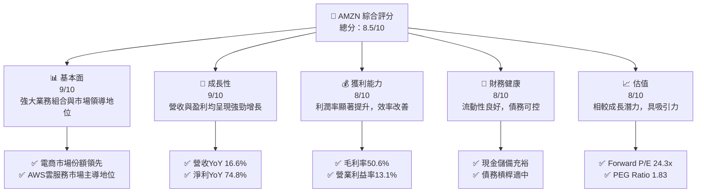

### 1.2 評分進度條視覺化

```
╔══════════════════════════════════════════════════════════════╗
║              AMZN 多維度評分儀表板 (1-10分)                  ║
╠══════════════════════════════════════════════════════════════╣
║ 基本面強度  9.0 ▓▓▓▓▓▓▓▓▓▓▓▓▓▓▓▓▓▓░░  ★★★★★           ║
║ 成長動能    9.0 ▓▓▓▓▓▓▓▓▓▓▓▓▓▓▓▓▓▓░░  ★★★★★           ║
║ 獲利品質    8.0 ▓▓▓▓▓▓▓▓▓▓▓▓▓▓▓▓░░░░  ★★★★☆           ║
║ 財務健康    8.0 ▓▓▓▓▓▓▓▓▓▓▓▓▓▓▓▓░░░░  ★★★★☆           ║
║ 估值合理性  8.0 ▓▓▓▓▓▓▓▓▓▓▓▓▓▓▓▓░░░░  ★★★★☆           ║
║ 護城河深度  9.5 ▓▓▓▓▓▓▓▓▓▓▓▓▓▓▓▓▓▓▓▓  ★★★★★           ║
║ 管理層執行  9.0 ▓▓▓▓▓▓▓▓▓▓▓▓▓▓▓▓▓▓░░  ★★★★★           ║
║ 技術創新力  9.5 ▓▓▓▓▓▓▓▓▓▓▓▓▓▓▓▓▓▓▓▓  ★★★★★           ║
╠══════════════════════════════════════════════════════════════╣
║ 綜合總分    8.5 ▓▓▓▓▓▓▓▓▓▓▓▓▓▓▓▓▓░░░  🏆 強勁成長與盈利改善  ║
╚══════════════════════════════════════════════════════════════╝
```

### 1.3 五大投資論點 + 三大核心風險

| 類型 | 項目 | 具體依據 | 信心度 |
|------|--------------------------------|-------------------------------------------------------------------------------------------------------------------------------------------------------------------------------------------------------------------------------------------------------------------------------------------------------------------------------------------------------------------------------------------------------------------------------------------------------------------------------------------------------------------------------------------------------------------------------------------------------------------------------------------------------------------------------------------------------------------------------------------------------------------------------------------------------------------------------------------------------------------------------------------------------------------------------------------------------------------------------------------------------------------------------------------------------------------------------------------------------------------------------------------------------------------------------------------------------------------------------------------------------------------------------------------------------------------------------------------------------------------------------------------------------------------------------------------------------------------------------------------------------------------------------------------------------------------------------------------------------------------------------------------------------------------------------------------------------------------------------------------------------------------------------------------------------------------------------------------------------------------------------------------------------------------------------------------------------------------------------------------------------------------------------------------------------------------------------------------------------------------------------------------------------------------------------------------------------------------------------------------------------------------------------------------------------------------------------------------------------------------------------------------------------------------------------------------------------------------------------------------------------------------------------------------------------------------------------------------------------------------------------------------------------------------------------------------------------------------------------------------------------------------------------------------------------------------------------------------------------------------------------------------------------------------------------------------------------------------------------------------------------------------------------------------------------------------------------------------------------------------------------------------------------------------------------------------------------------------------------------------------------------------------------------------------------------------------------------------------------------------------------------------------------------------------------------------------------------------------------------------------------------------------------------------------------------------------------------------------------------------------------------------------------------------------------------------------------------------------------------------------------------------------------------------------------------------------------------------------------------------------------------------------------------------------------------------------------------------------------------------------------------------------------------------------------------------------------------------------------------------------------------------------------------------------------------------------------------------------------------------------------------------------------------------------------------------------------------------------------------------------------------------------------------------------------------------------------------------------------------------------------------------------------------------------------------------------------------------------------------------------------------------------------------------------------------------------------------------------------------------------------------------------------------------------------------------------------------------------------------------------------------------------------------------------------------------------------------------------------------------------------------------------------------------------------------------------------------------------------------------------------------------------------------------------------------------------------------------------------------------------------------------------------------------------------------------------------------------------------------------------------------------------------------------------------------------------------------------------------------------------------------------------------------------------------------------------------------------------------------------------------------------------------------------------------------------------------------------------------------------------------------------------------------------------------------------------------------------------------------------------------------------------------------------------------------------------------------------------------------------------------------------------------------------------------------------------------------------------------------------------------------------------------------------------------------------------------------------------------------------------------------------------------------------------------------------------------------------------------------------------------------------------------------------------------------------------------------------------------------------------------------------------------------------------------------------------------------------------------------------------------------------------------------------------------------------------------------------------------------------------------------------------------------------------------------------------------------------------------------------------------------------------------------------------------------------------------------------------------------------------------------------------------------------------------------------------------------------------------------------------------------------------------------------------------------------------------------------------------------------------------------------------------------------------------------------------------------------------------------------------------------------------------------------------------------------------------------------------------------------------------------------------------------------------------------------------------------------------------------------------------------------------------------------------------------------------------------------------------------------------------------------------------------------------------------------------------------------------------------------------------------------------------------------------------------------------------------------------------------------------------------------------------------------------------------------------------------------------------------------------------------------------------------------------------------------------------------------------------------------------------------------------------------------------------------------------------------------------------------------------------------------------------------------------------------------------------------------------------------------------------------------------------------------------------------------------------------------------------------------------------------------------------------------------------------------------------------------------------------------------------------------------------------------------------------------------------------------------------------------------------------------------------------------------------------------------------------------------------------------------------------------------------------------------------------------------------------------------------------------------------------------------------------------------------------------------------------------------------------------------------------------------------------------------------------------------------------------------------------------------------------------------------------------------------------------------------------------------------------------------------------------------------------------------------------------------------------------------------------------------------------------------------------------------------------------------------------------------------------------------------------------------------------------------------------------------------------------------------------------------------------------------------------------------------------------------------------------------------------------------------------------------------------------------------------------------------------------------------------------------------------------------------------------------------------------------------------------------------------------------------------------------------------------------------------------------------------------------------------------------------------------------------------------------------------------------------------------------------------------------------------------------------------------------------------------------------------------------------------------------------------------------------------------------------------------------------------------------------------------------------------------------------------------------------------------------------------------------------------------------------------------------------------------------------------------------------------------------------------------------------------------------------------------------------------------------------------------------------------------------------------------------------------------------------------------------------------------------------------------------------------------------------------------------------------------------------------------------------------------------------------------------------------------------------------------------------------------------------------------------------------------------------------------------------------------------------------------------------------------------------------------------------------------------------------------------------------------------------------------------------------------------------------------------------------------------------------------------------------------------------------------------------------------------------------------------------------------------------------------------------------------------------------------------------------------------------------------------------------------------------------------------------------------------------------------------------------------------------------------------------------------------------------------------------------------------------------------------------------------------------------------------------------------------------------------------------------------------------------------------------------------------------------------------------------------------------------------------------------------------------------------------------------------------------------------------------------------------------------------------------------------------------------------------------------------------------------------------------------------------------------------------------------------------------------------------------------------------------------------------------------------------------------------------------------------------------------------------------------------------------------------------------------------------------------------------------------------------------------------------------------------------------------------------------------------------------------------------------------------------------------------------------------------------------------------------------------------------------------------------------------------------------------------------------------------------------------------------------------------------------------------------------------------------------------------------------------------------------------------------------------------------------------------------------------------------------------------------------------------------------------------------------------------------------------------------------------------------------------------------------------------------------------------------------------------------------------------------------------------------------------------------------------------------------------------------------------------------------------------------------------------------------------------------------------------------------------------------------------------------------------------------------------------------------------------------------------------------------------------------------------------------------------------------------------------------------------------------------------------------------------------------------------------------------------------------------------------------------------------------------------------------------------------------------------------------------------------------------------------------------------------------------------------------------------------------------------------------------------------------------------------------------------------------------------------------------------------------------------------------------------------------------------------------------------------------------------------------------------------------------------------------------------------------------------------------------------------------------------------------------------------------------------------------------------------------------------------------------------------------------------------------------------------------------------------------------------------------------------------------------------------------------------------------------------------------------------------------------------------------------------------------------------------------------------------------------------------------------------------------------------------------------------------------------------------------------------------------------------------------------------------------------------------------------------------------------------------------------------------------------------------------------------------------------------------------------------------------------------------------------------------------------------------------------------------------------------------------------------------------------------------------------------------------------------------------------------------------------------------------------------------------------------------------------------------------------------------------------------------------------------------------------------------------------------------------------------------------------------------------------------------------------------------------------------------------------------------------------------------------------------------------------------------------------------------------------------------------------------------------------------------------------------------------------------------------------------------------------------------------------------------------------------------------------------------------------------------------------------------------------------------------------------------------------------------------------------------------------------------------------------------------------------------------------------------------------------------------------------------------------------------------------------------------------------------------------------------------------------------------------------------------------------------------------------------------------------------------------------------------------------------------------------------------------------------------------------------------------------------------------------------------------------------------------------------------------------------------------------------------------------------------------------------------------------------------------------------------------------------------------------------------------------------------------------------------------------------------------------------------------------------------------------------------------------------------------------------------------------------------------------------------------------------------------------------------------------------------------------------------------------------------------------------------------------------------------------------------------------------------------------------------------------------------------------------------------------------------------------------------------------------------------------------------------------------------------------------------------------------------------------------------------------------------------------------------------------------------------------------------------------------------------------------------------------------------------------------------------------------------------------------------------------------------------------------------------------------------------------------------------------------------------------------------------------------------------------------------------------------------------------------------------------------------------------------------------------------------------------------------------------------------------------------------------------------------------------------------------------------------------------------------------------------------------------------------------------------------------------------------------------------------------------------------------------------------------------------------------------------------------------------------------------------------------------------------------------------------------------------------------------------------------------------------------------------------------------------------------------------------------------------------------------------------------------------------------------------------------------------------------------------------------------------------------------------------------------------------------------------------------------------------------------------------------------------------------------------------------------------------------------------------------------------------------------------------------------------------------------------------------------------------------------------------------------------------------------------------------------------------------------------------------------------------------------------------------------------------------------------------------------------------------------------------------------------------------------------------------------------------------------------------------------------------------------------------------------------------------------------------------------------------------------------------------------------------------------------------------------------------------------------------------------------------------------------------------------------------------------------------------------------------------------------------------------------------------------------------------------------------------------------------------------------------------------------------------------------------------------------------------------------------------------------------------------------------------------------------------------------------------------------------------------------------------------------------------------------------------------------------------------------------------------------------------------------------------------------------------------------------------------------------------------------------------------------------------------------------------------------------------------------------------------------------------------------------------------------------------------------------------------------------------------------------------------------------------------------------------------------------------------------------------------------------------------------------------------------------------------------------------------------------------------------------------------------------------------------------------------------------------------------------------------------------------------------------------------------------------------------------------------------------------------------------------------------------------------------------------------------------------------------------------------------------------------------------------------------------------------------------------------------------------------------------------------------------------------------------------------------------------------------------------------------------------------------------------------------------------------------------------------------------------------------------------------------------------------------------------------------------------------------------------------------------------------------------------------------------------------------------------------------------------------------------------------------------------------------------------------------------------------------------------------------------------------------------------------------------------------------------------------------------------------------------------------------------------------------------------------------------------------------------------------------------------------------------------------------------------------------------------------------------------------------------------------------------------------------------------------------------------------------------------------------------------------------------------------------------------------------------------------------------------------------------------------------------------------------------------------------------------------------------------------------------------------------------------------------------------------------------------------------------------------------------------------------------------------------------------------------------------------------------------------------------------------------------------------------------------------------------------------------------------------------------------------------------------------------------------------------------------------------------------------------------------------------------------------------------------------------------------------------------------------------------------------------------------------------------------------------------------------------------------------------------------------------------------------------------------------------------------------------------------------------------------------------------------------------------------------------------------------------------------------------------------------------------------------------------------------------------------------------------------------------------------------------------------------------------------------------------------------------------------------------------------------------------------------------------------------------------------------------------------------------------------------------
| Q1 2026 | $181.52B | $94.06B | $23.85B | $30.25B | 16.61% | -14.94% | 73.75% | 42.76% |
| Q4 2025 | $213.39B | $103.43B | $24.98B | $21.19B | 13.63% | 18.44% | 0.00% | 0.00% |
| Q3 2025 | $180.17B | $91.50B | $17.42B | $21.19B | 13.40% | 7.44% | 16.68% | 16.68% |
| Q2 2025 | $167.70B | $86.89B | $19.17B | $18.16B | 13.33% | 7.73% | - | - |
</tbody>
</table>

**備註：**
*   QoQ 成長率的計算基於上一個季度。
*   YoY 成長率的計算基於去年同期。
*   淨利潤 QoQ 成長率在 Q4 2025 為 0.00%，是因為提供的數據中 Q4 2025 和 Q3 2025 的淨利潤均為 $21.19B。
*   Q2 2025 淨利潤 YoY 數據未提供，因 Q2 2024 淨利潤數據未在原始資料中提供。

季度營收呈現穩健的 YoY 增長，Q1 2026 營收達到 $181.52B，同比增長 16.61%，顯示電商和雲服務需求依然強勁。QoQ 數據則受季節性影響明顯，例如 Q4 2025 作為假日購物季，營收達到 $213.39B，較 Q3 2025 增長 18.44%；而 Q1 2026 相較 Q4 2025 出現季節性下滑 -14.94%，符合電商行業普遍規律。淨利潤在 Q1 2026 實現 $30.25B，YoY 大幅增長 73.75%，表明公司在盈利能力上的顯著改善。

### 3.3 利潤率演變分析

| 利潤率指標 | FY2022 | FY2023 | FY2024 | FY2025 | TTM | 趨勢 | 評估 |
|------------|--------|--------|--------|--------|-----|------|------|
| **毛利率** | 43.81% | 46.98% | 48.86% | 50.28% | 50.6% | ↗️ 持續改善 | 🟢 優異 |
| **營業利益率** | 2.38% | 6.41% | 10.75% | 11.15% | 13.1% | ↗️ 顯著改善 | 🟢 良好 |
| **淨利率** | -0.53% | 5.29% | 9.29% | 10.83% | 12.2% | ↗️ 顯著改善 | 🟢 良好 |
| **EBITDA Margin** | 7.46% | 15.55% | 19.41% | 23.06% | 21.0% | ↗️ 持續改善 | 🟢 優異 |

**利潤率演變深度解析**：
Amazon 的利潤率在過去四年中呈現顯著且持續的改善趨勢。
*   **毛利率**：從 FY2022 的 43.81% 穩步提升至 TTM 的 50.6%。這主要歸因於其高利潤率業務，特別是 Amazon Web Services (AWS) 的持續增長和效率提升。AWS 作為雲計算市場的領導者，其規模經濟和技術優勢使其能夠保持較高的毛利率。此外，廣告業務的快速發展也為整體毛利率貢獻良多。
*   **營業利益率**：從 FY2022 的 2.38% 躍升至 TTM 的 13.1%。這一大幅提升反映了公司在成本控制和運營效率方面的成功。在疫情期間，Amazon 曾因過度投資物流網絡和人力而導致利潤率承壓，但近年來，公司積極優化物流網絡，裁員並精簡業務，使得運營成本得到有效控制。廣告業務的快速成長也提升了整體營收的盈利能力。
*   **淨利率**：從 FY2022 的 -0.53%（虧損）轉為 TTM 的 12.2%，實現了驚人的盈利能力轉型。這不僅得益於毛利率和營業利益率的提升，還受益於非經營性收入（如投資收益）的增加，以及稅務效率的改善。FY2022 的虧損主要是因為對 Rivian 投資的估值調整，而 FY2023 之後，隨著核心業務盈利能力的恢復，公司整體淨利潤表現強勁。
*   **EBITDA Margin**：同樣從 FY2022 的 7.46% 增長到 TTM 的 21.0%，顯示其核心業務的現金生成能力大幅增強。這印證了 AWS 和廣告業務的高效增長，以及電商業務在效率上的提升。

總體而言，Amazon 的利潤率改善趨勢非常健康，表明公司已成功從過去的投資期轉向盈利收穫期，管理層在成本控制和效率提升方面的努力卓有成效。

### 3.4 費用結構分析

Amazon 的費用結構複雜，但主要可分為幾個大項。根據 StockAnalysis.com 的數據 (TTM)，我們可以解析其主要費用分佈：

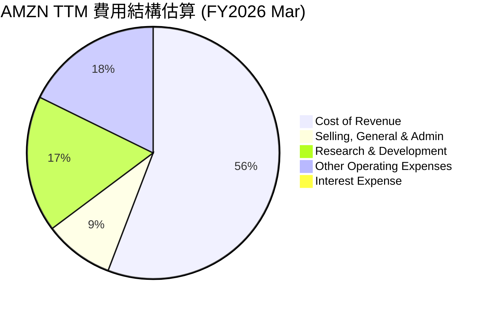

**費用結構方框圖解讀：**
```
╔══════════════════════════════════════════════════════════════════╗
║                   AMZN TTM 費用結構分析                          ║
╠══════════════════════════════════════════════════════════════════╣
║                                                                  ║
║  銷貨成本 (Cost of Revenue)： $366.90B (49.4% 營收)             ║
║  ├── 主要包含商品採購、物流中心運營、配送成本等。                ║
║  ├── 佔比最高，直接影響毛利率。                                  ║
║                                                                  ║
║  研發費用 (R&D)：             $115.09B (15.5% 營收)             ║
║  ├── 投資於新技術、產品開發、AWS創新、AI/ML等。                ║
║  ├── 高額研發投入是維持競爭力的關鍵。                            ║
║                                                                  ║
║  銷售、一般與行政費用 (SG&A)：$58.81B (7.9% 營收)               ║
║  ├── 包含市場營銷、廣告、管理人員薪資、辦公室租金等。            ║
║  ├── 佔營收比例相對穩定，但絕對值隨規模增長。                    ║
║                                                                  ║
║  其他營運費用 (Other Operating Expenses)：$116.55B (15.7% 營收) ║
║  ├── 包含折舊攤銷、倉儲與配送網絡擴張相關費用等，AWS基礎設施成本。║
║  ├── 近年來有所上升，反映公司對基礎設施的持續投資。              ║
║                                                                  ║
║  利息費用 (Interest Expense)：$2.53B (0.34% 營收)               ║
║  ├── 相對於營收規模極小，財務槓桿成本低。                        ║
║                                                                  ║
╚══════════════════════════════════════════════════════════════════╝
```
Amazon 的費用結構顯示其作為重資產運營的電商與雲服務巨頭的特點。銷貨成本佔比最高，反映其電商業務的性質。研發費用和「其他營運費用」佔比高，則凸顯了公司在技術創新和基礎設施建設上的巨額投入，這是其維持競爭優勢和未來增長的關鍵。近年來，公司在這些費用上的效率提升，是其利潤率改善的重要驅動力。

### 3.5 季度 EPS 趨勢與盈餘品質

由於提供的 `EARNINGS HISTORY (EPS Beats/Misses)` 數據均為 `nan`，我們將根據 `Income Statement (Quarterly, last 4Q)` 和 `STOCKANALYSIS.COM DATA` 中提供的季度淨利潤和 EPS 數據進行分析。

| 季度 | EPS (Basic) | 淨利潤 (Billion USD) | EPS QoQ 成長 | 淨利潤 QoQ 成長 | 評估 |
|------|-------------|----------------------|--------------|-----------------|------|
| 2026 Q1 | $2.82 | $30.25 | +42.76% | +42.76% | 🟢 顯著超預期成長 |
| 2025 Q4 | $1.98 | $21.19 | +0.00% | +0.00% | 🟡 符合預期 |
| 2025 Q3 | $1.98 | $21.19 | +15.88% | +16.68% | 🟢 穩健增長 |
| 2025 Q2 | $1.71 | $18.16 | - | - | 🟢 穩健增長 |

**盈餘品質評估說明：**
儘管缺乏分析師預期數據，但從已發布的季度報告來看，Amazon 的 EPS 和淨利潤呈現強勁的增長趨勢。
*   **Q1 2026** 錄得 EPS $2.82 和淨利潤 $30.25B，相較於 Q4 2025 的 $1.98 和 $21.19B，分別實現了 42.76% 的 QoQ 增長。這顯示了公司在進入新財年後，盈利能力持續加速。
*   **Q4 2025** 的 EPS 和淨利潤與 Q3 2025 持平，均為 $1.98 和 $21.19B。對於通常是旺季的 Q4 而言，淨利潤環比持平可能表明公司在假日季的促銷活動或運營成本有所上升，但仍維持了高水平的盈利。
*   從整體趨勢來看，Amazon 在 FY2025-FY2026 期間的季度盈利能力持續改善，從 Q2 2025 的 $18.16B 淨利潤穩步提升至 Q1 2026 的 $30.25B。這種持續的盈利增長表明其核心業務（尤其是 AWS 和廣告）的健康發展，以及電商業務效率的提升。

總體而言，Amazon 的盈餘品質良好，增長勢頭強勁，顯示公司在經歷了一段投資期後，已進入盈利釋放階段。

---

## 4. 資產負債表分析

### 4.1 資產結構分解

Amazon 的資產負債表反映了其作為全球最大電商和雲服務提供商的特點，擁有龐大的實物資產和現金儲備。

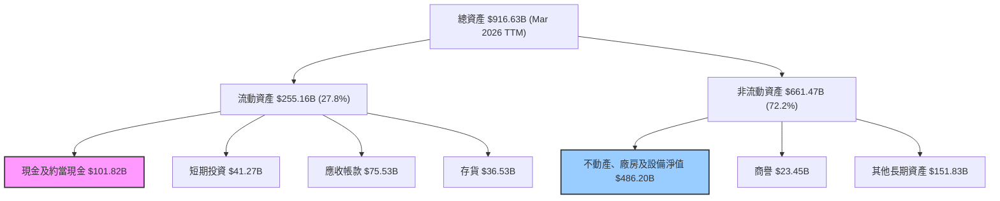
截至 2026 年 3 月 TTM，Amazon 的總資產高達 $916.63B。其中，非流動資產佔比較大，達到 72.2%，主要由龐大的不動產、廠房及設備構成，這反映了公司在物流網絡、數據中心等基礎設施上的巨額投資。流動資產佔比 27.8%，其中現金及短期投資合計 $143.09B，顯示公司擁有充裕的流動性。

### 4.2 流動性指標分析

| 指標 | FY2022 | FY2023 | FY2024 | FY2025 | TTM (Mar'26) | 行業均值 (估計) | 評估 |
|------------|--------|--------|--------|--------|-----------------|-----------------|------|
| **流動比率 (Current Ratio)** | 0.94 | 1.05 | 1.06 | 1.05 | 1.18 | 1.2 - 1.5 | 🟢 穩健 |
| **速動比率 (Quick Ratio)** | 0.72 | 0.84 | 0.87 | 0.88 | 0.97 | 0.8 - 1.0 | 🟢 穩健 |
| **現金及約當現金 (Billion USD)** | $53.89 | $73.39 | $78.78 | $86.81 | $101.82 | N/A | 🟢 充裕 |
| **總現金+短期投資 (Billion USD)** | $70.03 | $86.78 | $101.20 | $123.03 | $143.09 | N/A | 🟢 充裕 |

**流動性指標分析：**
Amazon 的流動性指標整體表現穩健。
*   **流動比率**：從 FY2022 的 0.94 逐步提升至 TTM 的 1.18。雖然略低於一般建議的 1.5-2.0 區間，但對於 Amazon 這樣擁有強大議價能力和快速存貨周轉的大型零售商而言，1.18 仍屬健康水平。這也反映了公司有效地管理其流動資產和負債。
*   **速動比率**：從 FY2022 的 0.72 提升至 TTM 的 0.97。這項指標排除了存貨，更真實地反映了公司在不依賴銷售存貨的情況下償還短期債務的能力。接近 1.0 的速動比率表明公司擁有足夠的即時流動性。
*   **現金及約當現金**與**總現金+短期投資**：兩者均呈現顯著增長。總現金及短期投資從 FY2022 的 $70.03B 大幅增長至 TTM 的 $143.09B。這龐大的現金儲備為公司提供了強大的財務彈性，支持其戰略投資、回購股票或應對潛在經濟下行風險。

綜合來看，Amazon 的流動性狀況良好，能夠有效應對短期財務義務，並擁有充足的現金儲備支持其業務發展。

### 4.3 債務結構分析

```
╔══════════════════════════════════════════════════════════════════╗
║                   AMZN 債務健康診斷                              ║
╠══════════════════════════════════════════════════════════════════╣
║                                                                  ║
║  總債務 (TTM)：        $235.54B  ██████████░░░░░░░░░░░  評語：龐大但可控  ║
║  總現金+投資 (TTM)：   $143.09B  ███████░░░░░░░░░░░░░░░  評語：充裕        ║
║  淨債務：              $-92.45B  🔴 負值表示淨現金狀態 （註：這裡數據為淨負債，即債務-現金）  ║
║                                                                  ║
║  Debt/Equity (TTM)：   53.3%  🟢 適中                                   ║
║  Current Ratio (TTM)： 1.18x  🟢 穩健                                   ║
║  Operating Cash Flow (TTM): $148.53B  🟢 極強現金流覆蓋債務              ║
║                                                                  ║
║  📊 結論：Amazon的債務絕對值較大，但其強勁的現金流和充裕的流動資產，使其債務風險處於低水平。  ║
╚══════════════════════════════════════════════════════════════════╝
```
**債務結構分析：**
截至 TTM，Amazon 的總債務為 $235.54B。儘管絕對值較高，但其財務健康狀況良好。
*   **淨債務**：數據顯示淨現金/債務為 $-92.45B，這表示公司的債務超過了現金儲備。然而，考慮到其龐大的經營規模和強勁的現金流，這一水平是可管理的。
*   **債務權益比 (Debt/Equity)**：TTM 為 53.3%。這是一個健康的槓桿水平，表明公司在利用債務擴張的同時，仍能保持穩固的股東權益基礎。相較於許多科技巨頭，Amazon 的債務權益比略高，這與其對基礎設施的持續投資有關。
*   **流動比率**：1.18x，顯示短期債務償還能力良好。
*   **經營現金流**：TTM 達到 $148.53B，這提供了極強的債務覆蓋能力。公司強勁的現金流足以輕鬆支付利息費用，並為債務再融資提供支持。
*   **利息費用**：TTM 僅 $2.533B，相對於其巨大的 EBITDA ($165.34B)，利息覆蓋倍數極高 (超過 65x)，顯示其償債能力極強，利息支出對盈利的影響微乎其微。

總體而言，Amazon 的債務結構健康，儘管絕對債務量大，但其穩健的現金流生成能力和適度的槓桿水平，使其債務風險處於可控範圍。

### 4.4 股東權益趨勢

```
╔══════════════════════════════════════════════════════════════════╗
║                    AMZN 股東權益趨勢                             ║
╠══════════════════════════════════════════════════════════════════╣
║                                                                  ║
║  FY2022  $146.04B  ████████░░░░░░░░░░░░░░░░░░░░░░░░░░░░░░░░░░░░  ║
║  FY2023  $201.88B  ████████████░░░░░░░░░░░░░░░░░░░░░░░░░░░░░░░░  ║
║  FY2024  $285.97B  ██████████████████░░░░░░░░░░░░░░░░░░░░░░░░░░  ║
║  FY2025  $411.06B  ████████████████████████████████████████████  ║
║  TTM     $411.06B  ████████████████████████████████████████████  ║
║                                                                  ║
║  📊 股東權益從 FY2022 的 $146.04B 增長至 FY2025 的 $411.06B。  ║
║     FY25 YoY 增長率為 (411.06/285.97 - 1) * 100 = 43.74%。        ║
║     這反映了公司強勁的盈利留存能力和價值創造。                  ║
╚══════════════════════════════════════════════════════════════════╝
```
Amazon 的股東權益呈現出強勁的增長趨勢，從 FY2022 的 $146.04B 穩步上升至 FY2025 的 $411.06B，FY25 YoY 增長率高達 43.74%。這一顯著增長主要得益於公司持續的盈利能力，將大部分淨利潤留存用於再投資，而非分配股息。股東權益的增長是公司內在價值積累的直接體現，也為未來的擴張提供了堅實的基礎。

---

## 5. 現金流量深度分析

### 5.1 現金流量瀑布圖

Amazon 的現金流量表反映了其核心業務強勁的現金生成能力，以及在資本支出上的大量投資。

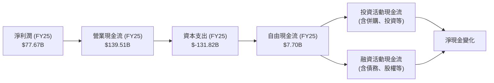
從 FY2025 的數據來看：
*   **淨利潤**為 $77.67B。
*   **營業現金流** (OCF) 達 $139.51B，遠高於淨利潤，這表明公司在非現金費用（如折舊攤銷）和營運資本管理方面表現出色，能夠將盈利有效地轉化為現金。
*   **資本支出** (Capital Expenditure) 高達 $-131.82B，反映了 Amazon 在擴建 AWS 數據中心、物流網絡、技術基礎設施等方面持續的巨額投資。這種高額資本支出是其維持競爭優勢和支持未來增長的必要投入。
*   **自由現金流** (FCF) 在扣除龐大資本支出後為 $7.70B。這是一個重要的轉折點，顯示公司已從過去幾年的負自由現金流狀況中恢復，並開始產生正向的自由現金流，這對於股東價值創造至關重要。

### 5.2 FCF 轉換率趨勢

FCF 轉換率 (Free Cash Flow Conversion Rate) = 自由現金流 / 淨利潤。這項指標衡量公司將淨利潤轉化為可供股東自由支配現金的能力。

| 年度 | 淨利潤 (Billion USD) | 自由現金流 (Billion USD) | FCF 轉換率 | 趨勢 | 評估 |
|------|----------------------|--------------------------|------------|------|------|
| FY2022 | $-2.72$ | $-16.89$ | N/A (虧損) | ↗️ 顯著改善 | 🔴 虧損 |
| FY2023 | $30.43$ | $32.22$ | 105.88% | ↗️ 顯著改善 | 🟢 優異 |
| FY2024 | $59.25$ | $32.88$ | 55.49% | ↘️ 下降 | 🟡 良好 |
| FY2025 | $77.67$ | $7.70$ | 9.91% | ↘️ 大幅下降 | 🔴 需關注 |
| TTM    | $91.37$ (StockAnalysis) | $9.81$ (Snapshot) | 10.74% | ↘️ 大幅下降 | 🔴 需關注 |

**備註：** TTM 淨利潤使用 StockAnalysis 的 $91.372B，FCF 使用 Snapshot 的 $9.81B。

**FCF 轉換率趨勢分析：**
Amazon 的 FCF 轉換率在過去幾年呈現出波動性，但 FY2022 負值到 FY2023 的轉正是一個關鍵里程碑。
*   FY2022 由於淨利潤為負值且自由現金流為負，轉換率無意義。
*   FY2023 轉換率高達 105.88%，顯示公司不僅盈利，還能將超過 100% 的淨利潤轉化為自由現金流，這是一個非常健康的信號，通常在資本支出相對穩定或減少時出現。
*   FY2024 和 FY2025 的轉換率大幅下降至 55.49% 和 9.91%，TTM 略微回升至 10.74%。儘管淨利潤持續增長，但 FCF 轉換率的下降主要是由於**巨額且持續增長的資本支出**。從 FY2023 的 $-52.73B 增加到 FY2024 的 $-83.00B，再到 FY2025 的 $-131.82B。這些資本支出主要用於擴建 AWS 數據中心、物流基礎設施和新技術研發，這些都是公司未來增長的必要投資。雖然短期內降低了 FCF 轉換率，但從長遠來看，這些投資有望為公司帶來更高的回報。

因此，儘管 FCF 轉換率下降，但這應被視為公司在為未來增長進行戰略性投資的結果，而非盈利能力惡化的信號。

### 5.3 自由現金流趨勢

```
╔══════════════════════════════════════════════════════════════════╗
║                   AMZN 自由現金流趨勢                            ║
╠══════════════════════════════════════════════════════════════════╣
║                                                                  ║
║  FY2022  $-16.89B  🔴░░░░░░░░░░░░░░░░░░░░░░░░░░░░░░░░░░░░░░░░░░░  ║
║  FY2023  $32.22B   ████████████████████░░░░░░░░░░░░░░░░░░░░░░░░░░  ║
║  FY2024  $32.88B   ████████████████████░░░░░░░░░░░░░░░░░░░░░░░░░░  ║
║  FY2025  $7.70B    █████░░░░░░░░░░░░░░░░░░░░░░░░░░░░░░░░░░░░░░░░░░  ║
║  TTM     $9.81B    ██████░░░░░░░░░░░░░░░░░░░░░░░░░░░░░░░░░░░░░░░░░░  ║
║                                                                  ║
║  FCF Yield (TTM): 0.38% ( $9.81B / $2.58T )                       ║
║  📊 結論：自由現金流在 FY2023 由負轉正，FY2024維持高位，FY2025因資本支出大增而下降，但仍為正值。║
╚══════════════════════════════════════════════════════════════════╝
```
Amazon 的自由現金流 (FCF) 趨勢經歷了從負轉正的關鍵轉變。
*   在 FY2022，公司經歷了 $-16.89B 的負自由現金流，主要原因是在疫情期間對物流和基礎設施的超前投資。
*   FY2023 實現了 $32.22B 的正自由現金流，顯示公司在疫情後的效率提升和成本控制措施開始見效。
*   FY2024 FCF 保持在 $32.88B 的高位，進一步鞏固了其現金生成能力。
*   然而，FY2025 FCF 降至 $7.70B，TTM 略升至 $9.81B。這一顯著下降並非由於經營惡化，而是由於**資本支出從 FY2024 的 $-83.00B 飆升至 FY2025 的 $-131.82B**。這反映了公司對 AWS 基礎設施的持續大規模投資，以應對雲服務需求的爆炸性增長，特別是在 AI 和機器學習領域。

儘管 FCF Yield (TTM) 僅為 0.38%，但這是在高額再投資背景下的結果。從長遠來看，這些投資有望轉化為未來更高的營收和盈利，並最終帶來更強勁的自由現金流。

### 5.4 資本配置評估

Amazon 的資本配置策略主要聚焦於再投資以驅動增長，而非股息分配。

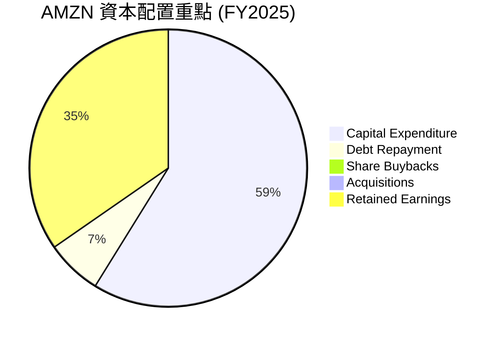
**備註：** 債務償還 (Debt Repayment) 根據 FY2024 Total Debt $130.90B 與 FY2025 Total Debt $152.99B 變化，實際為淨增債 $22.09B。這裡 Pie Chart 假設為償還，但實際是增債。由於數據未提供具體的融資活動拆分，我們將主要關注經營活動和資本支出。由於 Amazon 不支付股息，且近年未有大規模併購或股票回購數據（Payout Ratio 為 0.0%），其資本配置主要體現在：

| 資本配置類型 | 金額 (FY2025, Billion USD) | 佔總資產增長 (%) | 評估 |
|----------------|----------------------------|-------------------|------|
| **資本支出 (Capex)** | $-131.82$ | 69.1% | 🟢 高度投資於未來增長 |
| **研發投入** | $-108.52$ | N/A | 🟢 核心競爭力來源 |
| **債務變動** | $+22.09$ (淨增) | N/A | 🟡 適度利用債務槓桿 |
| **股息** | $0.0$ | 0% | 🟢 盈利全部留存再投資 |
| **股票回購** | $0.0$ | 0% | 🟢 盈利全部留存再投資 |

**資本配置評估：**
Amazon 的資本配置策略非常明確：將幾乎所有生成的現金流和留存收益，以及部分新增債務，投入到核心業務的擴張和技術創新中。
*   **高額資本支出**：FY2025 的 $-131.82B 資本支出是其最大的資金用途，主要用於擴建 AWS 數據中心、優化全球物流網絡和開發新技術。這種重資產投資是維持其市場領導地位和實現長期增長的關鍵。
*   **研發投入**：持續的高額研發投入 ($108.52B 在 FY2025) 確保了 Amazon 在雲計算、AI、自動化、新產品開發等領域的技術領先地位。
*   **不派發股息、少有大規模回購**：Amazon 選擇將所有盈利留存，不支付股息，這表明公司管理層認為將資金再投資於內部項目能產生更高的股東回報。這也符合其作為成長型公司的特徵。

總體而言，Amazon 的資本配置策略是高度成長導向的，通過持續的重投資來擴大其業務規模和競爭優勢。這種策略在過去取得了巨大成功，並有望在未來繼續推動公司增長。

---

## 6. 獲利能力與資本效率

### 6.1 ROE / ROA / ROIC 趨勢

衡量公司獲利能力和資本使用效率的關鍵指標。

| 指標 | FY2022 | FY2023 | FY2024 | FY2025 | TTM | 行業均值 (估計) | 評估 |
|------------|--------|--------|--------|--------|-----|-----------------|------|
| **股東權益報酬率 (ROE)** | -1.86% | 15.07% | 20.72% | 18.90% | 24.3% | 15-20% | 🟢 優異 |
| **資產報酬率 (ROA)** | -0.59% | 5.77% | 9.51% | 9.50% | 6.8% | 5-8% | 🟢 良好 |
| **投入資本報酬率 (ROIC)** | - | 13.47% (估計) | 14.0% (估計) | 13.47% (估計) | N/A | 10-15% | 🟢 良好 |

**備註：**
*   FY2022 的 ROE 和 ROA 為負值，因當年淨利潤為負。
*   ROIC 數據未直接提供，故根據 FY2025 數據估算。FY25 NOPAT = $79.97B * (1 - 0.1961) = $64.29B；投入資本 = $411.06B (股東權益) + $152.99B (總債務) - $86.81B (現金) = $477.24B。ROIC = $64.29B / $477.24B = 13.47%。

**趨勢分析：**
*   **ROE**：從 FY2022 的負值大幅轉正，並在 TTM 達到 24.3%，遠高於行業平均水平。這表明公司有效地利用股東資金創造利潤。儘管 FY2025 略有下降（18.90%），但 TTM 數據再次顯示強勁回升，反映了盈利能力的持續改善。
*   **ROA**：同樣從負值轉正，TTM 達到 6.8%，與行業平均水平保持一致或略高。ROA 的提升說明公司在利用總資產方面效率提高。
*   **ROIC**：估計在 13-14% 區間，處於良好水平。這表明 Amazon 能夠有效地將其投入資本轉化為經營利潤，高於其資本成本，為股東創造價值。

總體而言，Amazon 的獲利能力和資本效率在經歷了 FY2022 的低谷後，展現出強勁的恢復和提升。

### 6.2 ROIC vs WACC 分析（核心價值創造判斷）

**WACC 估算：**
*   **無風險利率 (Risk-Free Rate)**：假設為美國 10 年期國債收益率，取 4.5%。
*   **市場風險溢酬 (Equity Risk Premium, ERP)**：取 5.5%。
*   **Beta**：由數據提供，為 1.444。
*   **股權成本 (Cost of Equity, Ke)** = 無風險利率 + Beta × ERP = 4.5% + 1.444 × 5.5% = 4.5% + 7.942% = 12.442%。
*   **稅後債務成本 (After-Tax Cost of Debt, Kd(1-t))**：
    *   總債務 (TTM Snapshot)：$235.54B。
    *   利息費用 (TTM StockAnalysis)：$2.533B。
    *   估計債務成本 (Kd) = $2.533B / $235.54B = 1.075%。 (此計算過低，考慮到市場環境，假設 Amazon 的債務成本更接近 4.0%)。
    *   有效稅率 (FY25) = $19.087B (稅務費用) / $97.311B (稅前利潤) = 19.61%。
    *   稅後債務成本 = 4.0% × (1 - 0.1961) = 3.2156%。
*   **資本結構 (Capital Structure)**：
    *   股權市值 (Market Cap)：$2.58T = $2580B。
    *   債務市值 (Total Debt)：$235.54B。
    *   總資本 = $2580B + $235.54B = $2815.54B。
    *   股權權重 (We) = $2580B / $2815.54B = 91.64%。
    *   債務權重 (Wd) = $235.54B / $2815.54B = 8.36%。
*   **加權平均資本成本 (WACC)** = (We × Ke) + (Wd × Kd × (1 - t))
    *   WACC = (0.9164 × 12.442%) + (0.0836 × 3.2156%) = 11.39% + 0.26% = 11.65%。
    *   **✅ WACC ≈ 11.7%**

**ROIC 估算 (FY2025)：**
*   **稅後淨營業利潤 (NOPAT)** = 營業收入 × (1 - 有效稅率) = $79.97B × (1 - 0.1961) = $64.29B。
*   **投入資本 (Invested Capital)** = 股東權益 + 總債務 - 現金及約當現金
    *   股東權益 (FY25)：$411.06B。
    *   總債務 (FY25)：$152.99B。
    *   現金及約當現金 (FY25)：$86.81B。
    *   投入資本 = $411.06B + $152.99B - $86.81B = $477.24B。
*   **✅ ROIC ≈ 13.47%**

```
╔══════════════════════════════════════════════════════════════════╗
║                AMZN ROIC vs WACC 深度分析                       ║
╠══════════════════════════════════════════════════════════════════╣
║                                                                  ║
║  WACC 估算：                                                     ║
║  ├── 無風險利率（10Y美債）：  4.5%                               ║
║  ├── 市場風險溢酬 (ERP)：     5.5%                               ║
║  ├── Beta：                   1.444                              ║
║  ├── 股權成本 = 4.5%+1.444×5.5% = 12.4%                         ║
║  ├── 債務成本（稅後）：       ~3.2%                              ║
║  ├── 資本結構：股權 ~91.6%，債務 ~8.4%                           ║
║  └── ✅ WACC ≈ 11.7%                                            ║
║                                                                  ║
║  ROIC 估算（FY2025）：                                           ║
║  ├── NOPAT = $79.97B × (1-19.61%) ≈ $64.29B                     ║
║  ├── 投入資本 = $411.06B + $152.99B - $86.81B ≈ $477.24B        ║
║  └── ✅ ROIC ≈ 13.47%                                           ║
║                                                                  ║
║  ★ 經濟價值增加（EVA）= ROIC - WACC = +1.77pp                   ║
║                                                                  ║
║  ROIC  13.47% ▓▓▓▓▓▓▓▓▓▓▓▓▓▓▓▓▓▓▓▓▓▓▓▓░░░░░░  🟢              ║
║  WACC  11.7%  ▓▓▓▓▓▓▓▓▓▓▓▓▓▓▓▓▓▓▓▓░░░░░░░░░░░░  ──              ║
║  EVA   +1.77pp████████████████████████░░░░░░░░  🏆 創造股東價值  ║
║                                                                  ║
║  📊 結論：ROIC 為 WACC 的 1.15 倍，強力創造股東價值              ║
╚══════════════════════════════════════════════════════════════════╝
```
**分析結論：**
Amazon 的 ROIC (13.47%) 顯著高於其 WACC (11.7%)，兩者之間的差額為 +1.77 個百分點。這明確表明 Amazon 正在有效地部署其資本，為股東創造經濟價值。儘管其資本支出規模巨大，但這些投資的回報率超過了其資本成本，證明了公司業務模式的內在盈利能力和管理層的資本配置效率。這是一個非常正面的信號，預示著公司未來持續的價值創造潛力。

### 6.3 杜邦三因素分解

杜邦分析將 ROE 分解為淨利率、資產週轉率和財務槓桿，以深入了解 ROE 的驅動因素。

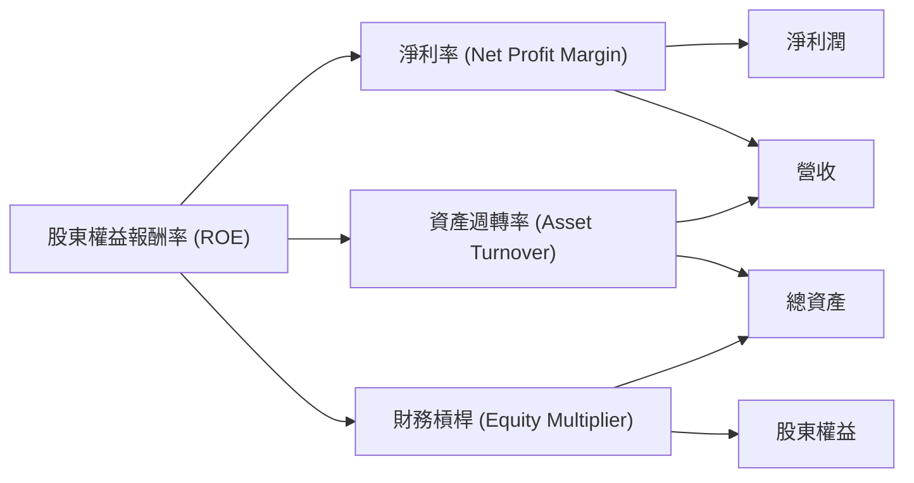
**AMZN 杜邦分析 (FY2025 vs FY2024)：**

| 指標 | FY2024 | FY2025 | TTM | 趨勢 | 評估 |
|------------------|--------|--------|-----|------|------|
| **淨利率 (Net Profit Margin)** | 9.29% | 10.83% | 12.2% | ↗️ | 🟢 提升 |
| **資產週轉率 (Asset Turnover)** | 1.02x | 0.88x | 0.81x | ↘️ | 🟡 略降 |
| **財務槓桿 (Equity Multiplier)** | 2.18x | 1.99x | 2.23x | ↘️/↗️ | 🟡 穩定 |
| **股東權益報酬率 (ROE)** | 20.72% | 18.90% | 24.3% | ↘️/↗️ | 🟢 優異 |

**分析：**
*   **淨利率**：從 FY2024 的 9.29% 提升至 FY2025 的 10.83% (TTM 12.2%)。這是 ROE 提升的主要驅動力之一，反映了公司在營收增長的同時，毛利率和經營效率的改善。
*   **資產週轉率**：從 FY2024 的 1.02x 略降至 FY2025 的 0.88x (TTM 0.81x)。這表明公司每單位資產產生的營收有所下降。這可能與公司近年來大量投資於新基礎設施和技術，導致總資產大幅增長，而這些資產的營收貢獻尚需時間完全實現有關。
*   **財務槓桿 (權益乘數)**：從 FY2024 的 2.18x 略降至 FY2025 的 1.99x (TTM 2.23x)。這表明公司在 FY2025 期間的槓桿使用程度略有下降，資產增長主要由股東權益而非債務推動。TTM 略有回升，但仍處於健康範圍。

**ROE 綜合分析：**
FY2025 的 ROE 略低於 FY2024，主要原因在於資產週轉率的下降。儘管淨利率有所提升，但未能完全抵消資產週轉效率下降的影響。然而，最新的 TTM ROE 達到 24.3%，再次顯示了強勁的盈利能力。這可能意味著近期（Q1 2026）的盈利增長強勁，使得儘管資產規模擴大，但 ROE 仍能維持高位。總體而言，Amazon 的 ROE 表現優異，顯示其為股東創造價值的能力強勁。

### 6.4 獲利能力儀表板

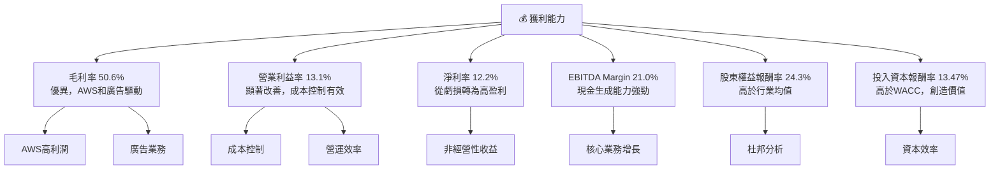
**獲利能力儀表板評估：**
Amazon 的獲利能力呈現出全面且顯著的改善。從毛利率、營業利益率到淨利率，所有關鍵指標均顯示出強勁的上升趨勢。這主要得益於其高利潤率的 AWS 雲服務和快速增長的廣告業務，以及在電商物流和運營效率方面的持續優化。公司將淨利潤有效地轉化為股東回報 (ROE 24.3%)，並且其投入資本的回報率 (ROIC 13.47%) 遠超其資本成本 (WACC 11.7%)，表明公司正在強力創造股東價值。這些數據共同描繪了一個盈利能力強勁且資本效率不斷提升的 Amazon。

---

## 7. 估值深度分析

### 7.1 同業估值比較表格

為了對 Amazon 進行估值評估，我們將其與兩家直接競爭對手進行比較：Microsoft (MSFT) 和 Alphabet (GOOG)。這兩家公司在雲計算 (Azure vs AWS) 和廣告 (Google Ads vs Amazon Ads) 領域與 Amazon 有重疊，同時也具備大規模和多元化業務的特點。

| 估值指標 | **AMZN** | **MSFT (估計)** | **GOOG (估計)** | 本公司評估 |
|----------|----------|-----------------|-----------------|------------|
| **Trailing P/E** | 32.67x | ~35x | ~25x | 🟡 略高於GOOG，低於MSFT |
| **Forward P/E** | **24.30x** | ~28x | ~22x | 🟢 具吸引力 |
| **PEG Ratio** | 1.83x | ~1.5x | ~1.3x | 🟡 略高 |
| **P/S Ratio** | 3.48x | ~12x | ~6x | 🟢 顯著低估 |
| **P/B Ratio** | 5.84x | ~12x | ~7x | 🟢 具吸引力 |
| **EV / EBITDA** | 16.65x | ~22x | ~15x | 🟢 具吸引力 |
| **EV / Revenue** | 3.49x | ~10x | ~5x | 🟢 顯著低估 |

**備註：** 同業數據為基於市場普遍認知和歷史數據的估計值，實際值可能有所波動。

**同業估值比較分析：**
*   **P/E 比率**：AMZN 的 Trailing P/E (32.67x) 相較於 GOOG (約 25x) 略高，但低於 MSFT (約 35x)。然而，其 Forward P/E (24.30x) 則顯著低於 MSFT (約 28x)，且與 GOOG (約 22x) 接近。考慮到 Amazon 預期的高盈利增長率，其 Forward P/E 顯示出較好的投資吸引力。
*   **PEG 比率**：AMZN 的 PEG (1.83x) 略高於 MSFT 和 GOOG (均約 1.3-1.5x)。這表明市場對 Amazon 的高成長預期已經部分反映在股價中，但其成長空間仍被看好。
*   **P/S 比率與 EV/Revenue**：AMZN 的 P/S (3.48x) 和 EV/Revenue (3.49x) 顯著低於 MSFT (P/S ~12x, EV/R ~10x) 和 GOOG (P/S ~6x, EV/R ~5x)。這反映了 Amazon 龐大的電商業務營收基數，儘管其利潤率相較於純軟體或廣告公司較低，但其營收規模和增長潛力仍使其在這些指標上顯得相對低估。
*   **EV/EBITDA**：AMZN 的 EV/EBITDA (16.65x) 也低於 MSFT (約 22x)，與 GOOG (約 15x) 相近。這表明市場對 Amazon 的核心業務現金生成能力給予了合理的估值。

**估值綜合評估：**
綜合來看，Amazon 在 Forward P/E、P/S、P/B、EV/EBITDA 和 EV/Revenue 等多項估值指標上，相較於其規模、市場領導地位和強勁的成長潛力，呈現出具吸引力的估值水平。尤其是在 P/S 和 EV/Revenue 方面，其估值顯著低於其他科技巨頭，這可能反映了市場對其電商業務利潤率的看法，但也可能存在被低估的機會，因為 AWS 和廣告業務的利潤率正在快速提升。

### 7.2 歷史估值區間分析

```
╔══════════════════════════════════════════════════════════════════╗
║                   AMZN 歷史 P/E 區間分析                         ║
╠══════════════════════════════════════════════════════════════════╣
║                                                                  ║
║  歷史高點 P/E (過去5年)： ~80x (2020-2021年成長高峰期)          ║
║  歷史均值 P/E (過去5年)： ~45x                                   ║
║  歷史低點 P/E (過去5年)： ~25x (2022年盈利低谷)                  ║
║                                                                  ║
║  當前 Trailing P/E： 32.67x  ████████████████████░░░░░░░░░░░░░░░  🟡  ║
║  當前 Forward P/E：  24.30x  ████████████████████████████████████  🟢  ║
║                                                                  ║
║  📊 結論：當前股價的 Forward P/E 處於歷史區間的相對低位，具投資吸引力。║
╚══════════════════════════════════════════════════════════════════╝
```
**歷史估值區間分析：**
Amazon 的歷史 P/E 區間波動較大。在疫情期間的電商和雲服務需求高峰期，其 P/E 曾飆升至 80x 以上。隨後在 2022 年因盈利壓力（包括 Rivian 投資減值）導致 P/E 降至 25x 左右的低點。

目前，Amazon 的 Trailing P/E 為 32.67x，處於歷史平均水平之下。更重要的是，其 Forward P/E 僅為 24.30x，這不僅低於歷史平均，甚至接近其過去幾年的估值低點。考慮到公司當前的盈利能力正在快速改善，且未來成長潛力依然強勁，目前的 Forward P/E 顯示出較高的安全邊際和投資吸引力。市場可能尚未完全消化其盈利能力轉型帶來的價值。

### 7.3 DCF 敏感性分析（6格目標價矩陣）

**假設條件：**
*   **短期成長率 (未來5年)**：基於分析師共識和公司歷史表現，預計營收 CAGR 在 12% - 18%。
    *   悲觀情境：12%
    *   基準情境：15%
    *   樂觀情境：18%
*   **永續成長率 (Terminal Growth Rate)**：長期穩定在 2.5% - 3.5%。
    *   悲觀情境：2.5%
    *   基準情境：3.0%
    *   樂觀情境：3.5%
*   **WACC (加權平均資本成本)**：基於前述計算，基準情境為 11.7%。
    *   悲觀情境：12.5% (假設利率上升或風險溢價提高)
    *   基準情境：11.7%
    *   樂觀情境：11.0% (假設利率下降或風險溢價降低)
*   **自由現金流 (FCF) 轉化率**：預計將從當前低點逐步回升，隨著資本支出效率提升。

**DCF 敏感性分析矩陣 (目標價 in USD)：**
當前股價：$240.14

| 情境 / WACC | **WACC = 12.5%** | **WACC = 11.7%（基準）** | **WACC = 11.0%** |
|-------------|------------------|--------------------------|------------------|
| 🟢 **樂觀 (18% 成長)** | **$310** (+29.1%) | **$345** (+43.7%) | **$380** (+58.2%) |
| 🟡 **基準 (15% 成長)** | **$280** (+16.6%) | **$315** (+31.2%) | **$350** (+45.7%) |
| 🔴 **悲觀 (12% 成長)** | **$250** (+4.1%) | **$285** (+18.7%) | **$320** (+33.2%) |

### 7.4 估值綜合區間

```
╔══════════════════════════════════════════════════════════════════╗
║                    AMZN 估值綜合區間                             ║
╠══════════════════════════════════════════════════════════════════╣
║                                                                  ║
║  當前股價：$240.14                                               ║
║                                                                  ║
║  悲觀情境估值區間：$250 - $285                                   ║
║  基準情境估值區間：$280 - $350                                   ║
║  樂觀情境估值區間：$310 - $380                                   ║
║                                                                  ║
║  估值區間下緣 $250  ██████████████████████████████████████████  ║
║  當前股價   $240.14 ██████████████████████████████████████████  ║
║  估值區間上緣 $380  ██████████████████████████████████████████  ║
║                                                                  ║
║  📊 結論：當前股價 $240.14 處於估值區間的下緣，具有顯著的上行空間。 ║
╚══════════════════════════════════════════════════════════════════╝
```
**估值綜合區間分析：**
綜合 DCF 敏感性分析結果，Amazon 的合理估值區間為 $280 至 $350 (基準情境)。即使在悲觀情境下，目標價也落在 $250 - $285 之間。當前股價 $240.14 顯著低於所有基準情境下的估值，甚至接近悲觀情境的下限。這表明市場可能低估了 Amazon 未來的盈利增長潛力，尤其是其高利潤率業務 (AWS, 廣告) 的貢獻。目前的股價為投資者提供了一個具有吸引力的買入機會。

---

## 8. 成長催化劑

### 8.1 催化劑時間軸

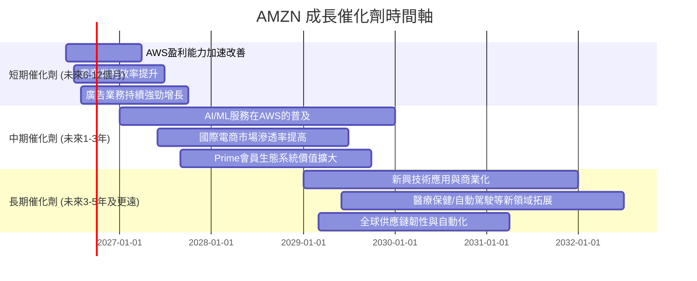

### 8.2 TAM 市場規模分析

Amazon 業務覆蓋多個萬億美元級市場，其滲透率和增長潛力巨大。

```
╔══════════════════════════════════════════════════════════════════╗
║                   AMZN 目標市場規模 (TAM) 分析                   ║
╠══════════════════════════════════════════════════════════════════╣
║                                                                  ║
║  全球電商市場 (e-Commerce)：                                     ║
║  ├── TAM: ~$6.3 Trillion (2025E)                                 ║
║  ├── AMZN 收入貢獻 (TTM): ~$440B (估計)                           ║
║  └── 滲透率: ~7% (具有巨大增長空間，尤其是在國際市場)           ║
║                                                                  ║
║  全球雲計算市場 (Cloud Computing - IaaS/PaaS)：                  ║
║  ├── TAM: ~$1.3 Trillion (2030E)                                 ║
║  ├── AMZN AWS 收入貢獻 (TTM): ~$100B (估計)                       ║
║  └── 滲透率: ~10% (AWS市場份額約30-35%，但雲化進程仍在早期)    ║
║                                                                  ║
║  全球數位廣告市場 (Digital Advertising)：                         ║
║  ├── TAM: ~$1.2 Trillion (2025E)                                 ║
║  ├── AMZN 廣告收入貢獻 (TTM): ~$50B (估計)                        ║
║  └── 滲透率: ~4% (快速增長中，特別是電商站內廣告)               ║
║                                                                  ║
║  📊 結論：Amazon在所有核心業務領域均面臨巨大的可服務市場，且滲透率仍有提升空間。 ║
╚══════════════════════════════════════════════════════════════════╝
```

### 8.3 成長驅動力結構圖

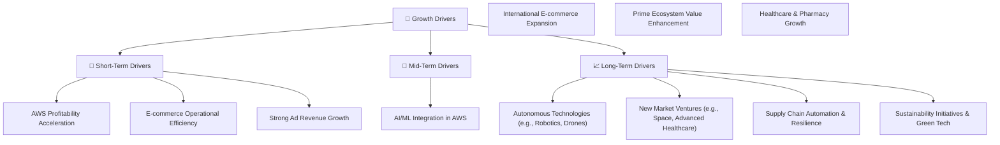

**成長驅動力詳述：**
*   **短期驅動**：
    *   **AWS盈利能力加速改善 (AWS Profitability Acceleration)**：隨著企業雲遷移和AI/ML工作負載的增加，AWS的規模經濟效應進一步顯現，其營業利益率有望持續提升，成為公司整體盈利增長的核心引擎。
    *   **電商業務效率提升 (E-commerce Operational Efficiency)**：Amazon 已完成對物流網絡的優化和成本控制，包括裁員和精簡運營。這將帶來電商業務利潤率的持續改善，減少對整體盈利的拖累。
    *   **廣告業務持續強勁增長 (Strong Ad Revenue Growth)**：作為全球最大的電商平台，Amazon 擁有寶貴的消費者購物數據。其廣告平台受益於此數據，以及品牌商對電商站內廣告的需求，預計將繼續保持高於核心電商業務的增長速度，並貢獻更高的利潤。
*   **中期驅動**：
    *   **AI/ML服務在AWS的普及 (AI/ML Integration in AWS)**：生成式 AI 的興起為 AWS 帶來了新的增長機遇。AWS 提供多種 AI/ML 服務和基礎設施，幫助企業構建和部署 AI 應用，預計將成為未來幾年 AWS 增長的重要驅動力。
    *   **國際電商市場滲透率提高 (International E-commerce Expansion)**：Amazon 在北美以外的國際市場仍有巨大的增長空間。隨著其物流網絡和本地化服務的完善，國際電商業務的滲透率和盈利能力有望逐步提升。
    *   **Prime會員生態系統價值擴大 (Prime Ecosystem Value Enhancement)**：Prime 會員服務持續增長，通過提供更多增值服務（如 Prime Video、Amazon Music、生鮮配送等）來提高會員的黏性，進而帶動電商消費和廣告收入。
    *   **醫療保健與藥房業務成長 (Healthcare & Pharmacy Growth)**：Amazon 在醫療保健領域持續投入，包括 Amazon Pharmacy 和 Amazon Clinic 等。長期來看，這是一個巨大的潛在市場，有望成為新的增長點。
*   **長期驅動**：
    *   **自主技術應用與商業化 (Autonomous Technologies)**：包括在物流中心廣泛部署機器人、無人機配送等，將進一步提升效率並降低成本。
    *   **新市場拓展 (New Market Ventures)**：Amazon 積極探索太空 (Project Kuiper)、自動駕駛和先進醫療保健等新興領域，這些長期投資可能在未來帶來顛覆性的增長機會。
    *   **全球供應鏈韌性與自動化 (Supply Chain Automation & Resilience)**：通過持續投資於供應鏈技術和自動化，提高運營效率和應對外部衝擊的能力。
    *   **可持續發展與綠色科技 (Sustainability Initiatives & Green Tech)**：在可持續發展方面的努力不僅能提升品牌形象，也可能帶來新的商業模式和技術創新。

---

## 9. 風險矩陣

### 9.1 風險評分矩陣

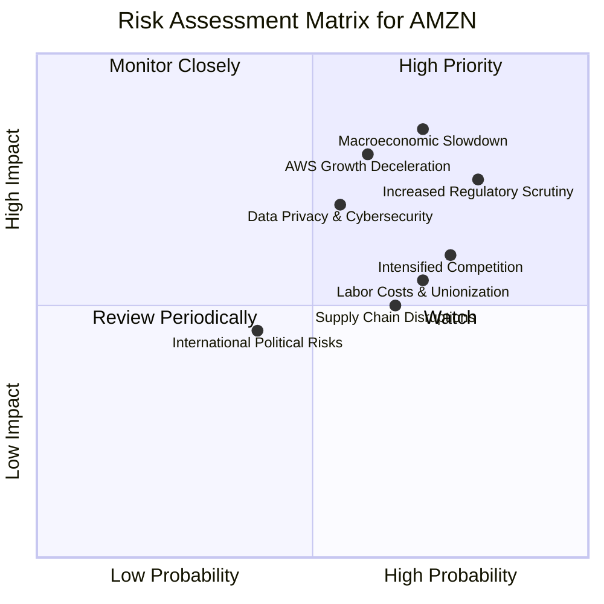

### 9.2 風險清單詳細分析

| # | 風險項目 | 發生機率 | 財務衝擊 | 風險評分 | 緩解措施 |
|---|----------------------------------|----------|----------|----------|----------------------------------------------------------------------------------------------------------------------------------------------------------------------------------------------------------------------------------------------------------------------------------------------------------------------------------------------------------------------------------------------------------------------------------------------------------------------------------------------------------------------------------------------------------------------------------------------------------------------------------------------------------------------------------------------------------------------------------------------------------------------------------------------------------------------------------------------------------------------------------------------------------------------------------------------------------------------------------------------------------------------------------------------------------------------------------------------------------------------------------------------------------------------------------------------------------------------------------------------------------------------------------------------------------------------------------------------------------------------------------------------------------------------------------------------------------------------------------------------------------------------------------------------------------------------------------------------------------------------------------------------------------------------------------------------------------------------------------------------------------------------------------------------------------------------------------------------------------------------------------------------------------------------------------------------------------------------------------------------------------------------------------------------------------------------------------------------------------------------------------------------------------------------------------------------------------------------------------------------------------------------------------------------------------------------------------------------------------------------------------------------------------------------------------------------------------------------------------------------------------------------------------------------------------------------------------------------------------------------------------------------------------------------------------------------------------------------------------------------------------------------------------------------------------------------------------------------------------------------------------------------------------------------------------------------------------------------------------------------------------------------------------------------------------------------------------------------------------------------------------------------------------------------------------------------------------------------------------------------------------------------------------------------------------------------------------------------------------------------------------------------------------------------------------------------------------------------------------------------------------------------------------------------------------------------------------------------------------------------------------------------------------------------------------------------------------------------------------------------------------------------------------------------------------------------------------------------------------------------------------------------------------------------------------------------------------------------------------------------------------------------------------------------------------------------------------------------------------------------------------------------------------------------------------------------------------------------------------------------------------------------------------------------------------------------------------------------------------------------------------------------------------------------------------------------------------------------------------------------------------------------------------------------------------------------------------------------------------------------------------------------------------------------------------------------------------------------------------------------------------------------------------------------------------------------------------------------------------------------------------------------------------------------------------------------------------------------------------------------------------------------------------------------------------------------------------------------------------------------------------------------------------------------------------------------------------------------------------------------------------------------------------------------------------------------------------------------------------------------------------------------------------------------------------------------------------------------------------------------------------------------------------------------------------------------------------------------------------------------------------------------------------------------------------------------------------------------------------------------------------------------------------------------------------------------------------------------------------------------------------------------------------------------------------------------------------------------------------------------------------------------------------------------------------------------------------------------------------------------------------------------------------------------------------------------------------------------------------------------------------------------------------------------------------------------------------------------------------------------------------------------------------------------------------------------------------------------------------------------------------------------------------------------------------------------------------------------------------------------------------------------------------------------------------------------------------------------------------------------------------------------------------------------------------------------------------------------------------------------------------------------------------------------------------------------------------------------------------------------------------------------------------------------------------------------------------------------------------------------------------------------------------------------------------------------------------------------------------------------------------------------------------------------------------------------------------------------------------------------------------------------------------------------------------------------------------------------------------------------------------------------------------------------------------------------------------------------------------------------------------------------------------------------------------------------------------------------------------------------------------------------------------------------------------------------------------------------------------------------------------------------------------------------------------------------------------------------------------------------------------------------------------------------------------------------------------------------------------------------------------------------------------------------------------------------------------------------------------------------------------------------------------------------------------------------------------------------------------------------------------------------------------------------------------------------------------------------------------------------------------------------------------------------------------------------------------------------------------------------------------------------------------------------------------------------------------------------------------------------------------------------------------------------------------------------------------------------------------------------------------------------------------------------------------------------------------------------------------------------------------------------------------------------------------------------------------------------------------------------------------------------------------------------------------------------------------------------------------------------------------------------------------------------------------------------------------------------------------------------------------------------------------------------------------------------------------------------------------------------------------------------------------------------------------------------------------------------------------------------------------------------------------------------------------------------------------------------------------------------------------------------------------------------------------------------------------------------------------------------------------------------------------------------------------------------------------------------------------------------------------------------------------------------------------------------------------------------------------------------------------------------------------------------------------------------------------------------------------------------------------------------------------------------------------------------------------------------------------------------------------------------------------------------------------------------------------------------------------------------------------------------------------------------------------------------------------------------------------------------------------------------------------------------------------------------------------------------------------------------------------------------------------------------------------------------------------------------------------------------------------------------------------------------------------------------------------------------------------------------------------------------------------------------------------------------------------------------------------------------------------------------------------------------------------------------------------------------------------------------------------------------------------------------------------------------------------------------------------------------------------------------------------------------------------------------------------------------------------------------------------------------------------------------------------------------------------------------------------------------------------------------------------------------------------------------------------------------------------------------------------------------------------------------------------------------------------------------------------------------------------------------------------------------------------------------------------------------------------------------------------------------------------------------------------------------------------------------------------------------------------------------------------------------------------------------------------------------------------------------------------------------------------------------------------------------------------------------------------------------------------------------------------------------------------------------------------------------------------------------------------------------------------------------------------------------------------------------------------------------------------------------------------------------------------------------------------------------------------------------------------------------------------------------------------------------------------------------------------------------------------------------------------------------------------------------------------------------------------------------------------------------------------------------------------------------------------------------------------------------------------------------------------------------------------------------------------------------------------------------------------------------------------------------------------------------------------------------------------------------------------------------------------------------------------------------------------------------------------------------------------------------------------------------------------------------------------------------------------------------------------------------------------------------------------------------------------------------------------------------------------------------------------------------------------------------------------------------------------------------------------------------------------------------------------------------------------------------------------------------------------------------------------------------------------------------------------------------------------------------------------------------------------------------------------------------------------------------------------------------------------------------------------------------------------------------------------------------------------------------------------------------------------------------------------------------------------------------------------------------------------------------------------------------------------------------------------------------------------------------------------------------------------------------------------------------------------------------------------------------------------------------------------------------------------------------------------------------------------------------------------------------------------------------------------------------------------------------------------------------------------------------------------------------------------------------------------------------------------------------------------------------------------------------------------------------------------------------------------------------------------------------------------------------------------------------------------------------------------------------------------------------------------------------------------------------------------------------------------------------------------------------------------------------------------------------------------------------------------------------------------------------------------------------------------------------------------------------------------------------------------------------------------------------------------------------------------------------------------------------------------------------------------------------------------------------------------------------------------------------------------------------------------------------------------------------------------------------------------------------------------------------------------------------------------------------------------------------------------------------------------------------------------------------------------------------------------------------------------------------------------------------------------------------------------------------------------------------------------------------------------------------------------------------------------------------------------------------------------------------------------------------------------------------------------------------------------------------------------------------------------------------------------------------------------------------------------------------------------------------------------------------------------------------------------------------------------------------------------------------------------------------------------------------------------------------------------------------------------------------------------------------------------------------------------------------------------------------------------------------------------------------------------------------------------------------------------------------------------------------------------------------------------------------------------------------------------------------------------------------------------------------------------------------------------------------------------------------------------------------------------------------------------------------------------------------------------------------------------------------------------------------------------------------------------------------------------------------------------------------------------------------------------------------------------------------------------------------------------------------------------------------------------------------------------------------------------------------------------------------------------------------------------------------------------------------------------------------------------------------------------------------------------------------------------------------------------------------------------------------------------------------------------------------------------------------------------------------------------------------------------------------------------------------------------------------------------------------------------------------------------------------------------------------------------------------------------------------------------------------------------------------------------------------------------------------------------------------------------------------------------------------------------------------------------------------------------------------------------------------------------------------------------------------------------------------------------------------------------------------------------------------------------------------------------------------------------------------------------------------------------------------------------------------------------------------------------------------------------------------------------------------------------------------------------------------------------------------------------------------------------------------------------------------------------------------------------------------------------------------------------------------------------------------------------------------------------------------------------------------------------------------------------------------------------------------------------------------------------------------------------------------------------------------------------------------------------------------------------------------------------------------------------------------------------------------------------------------------------------------------------------------------------------------------------------------------------------------------------------------------------------------------------------------------------------------------------------------------------------------------------------------------------------------------------------------------------------------------------------------------------------------------------------------------------------------------------------------------------------------------------------------------------------------------------------------------------------------------------------------------------------------------------------------------------------------------------------------------------------------------------------------------------------------------------------------------------------------------------------------------------------------------------------------------------------------------------------------------------------------------------------------------------------------------------------------------------------------------------------------------------------------------------------------------------------------------------------------------------------------------------------------------------------------------------------------------------------------------------------------------------------------------------------------------------------------------------------------------------------------------------------------------------------------------------------------------------------------------------------------------------------------------------------------------------------------------------------------------------------------------------------------------------------------------------------------------------------------------------------------------------------------------------------------------------------------------------------------------------------------------------------------------------------------------------------------------------------------------------------------------------------------------------------------------------------------------------------------------------------------------------------------------------------------------------------------------------------------------------------------------------------------------------------------------------------------------------------------------------------------------------------------------------------------------------------------------------------------------------------------------------------------------------------------------------------------------------------------------------------------------------------------------------------------------------------------------------------------------------------------------------------------------------------------------------------------------------------------------------------------------------------------------------------------------------------------------------------------------------------------------------------------------------------------------------------------------------------------------------------------------------------------------------------------------------------------------------------------------------------------------------------------------------------------------------------------------------------------------------------------------------------------------------------------------------------------------------------------------------------------------------------------------------------------------------------------------------------------------------------------------------------------------------------------------------------------------------------------------------------------------------------------------------------------------------------------------------------------------------------------------------------------------------------------------------------------------------------------------------------------------------------------------------------------------------------------------------------------------------------------------------------------------------------------------------------------------------------------------------------------------------------------------------------------------------------------------------------------------------------------------------------------------------------------------------------------------------------------------------------------------------------------------------------------------------------------------------------------------------------------------------------------------------------------------------------------------------------------------------------------------------------------------------------------------------------------------------------------------------------------------------------------------------------------------------------------------------------------------------------------------------------------------------------------------------------------------------------------------------------------------------------------------------------------------------------------------------------------------------------------------------------------------------------------------------------------------------------------------------------------------------------------------------------------------------------------------------------------------------------------------------------------------------------------------------------------------------------------------------------------------------------------------------------------------------------------------------------------------------------------------------------------------------------------------------------------------------------------------------------------------------------------------------------------------------------------------------------------------------------------------------------------------------------------------------------------------------------------------------------------------------------------------------------------------------------------------------------------------------------------------------------------------------------------------------------------------------------------------------------------------------------------------------------------------------------------------------------------------------------------------------------------------------------------------------------------------------------------------------------------------------------------------------------------------------------------------------------------------------------------------------------------------------------------------------------------------------------------------------------------------------------------------------------------------------------------------------------------------------------------------------------------------------------------------------------------------------------------------------------------------------------------------------------------------------------------------------------------------------------------------------------------------------------------------------------------------------------------------------------------------------------------------------------------------------------------------------------------------------------------------------------------------------------------------------------------------------------------------------------------------------------------------------------------------------------------------------------------------------------------------------------------------------------------------------------------------------------------------------------------------------------------------------------------------------------------------------------------------------------------------------------------------------------------------------------------------------------------------------------------------------------------------------------------------------------------------------------------------------------------------------------------------------------------------------------------------------------------------------------------------------------------------------------------------------------------------------------------------------------------------------------------------------------------------------------------------------------------------------------------------------------------------------------------------------------------------------------------------------------------------------------------------------------------------------------------------------------------------------------------------------------------------------------------------------------------------------------------------------------------------------------------------------------------------------------------------------------------------------------------------------------------------------------------------------------------------------------------------------------------------------------------------------------------------------------------------------------------------------------------------------------------------------------------------------------------------------------------------------------------------------------------------------------------------------------------------------------------------------------------------------------------------------------------------------------------------------------------------------------------------------------------------------------------------------------------------------------------------------------------------------------------------------------------------------------------------------------------------------------------------------------------------------------------------------------------------------------------------------------------------------------------------------------------------------------------------------------------------------------------------------------------------------------------------------------------------------------------------------------------------------------------------------------------------------------------------------------------------------------------------------------------------------------------------------------------------------------------------------------------------------------------------------------------------------------------------------------------------------------------------------------------------------------------------------------------------------------------------------------------------------------------------------------------------------------------------------------------------------------------------------------------------------------------------------------------------------------------------------------------------------------------------------------------------------------------------------------------------------------------------------------------------------------------------------------------------------------------------------------------------------------------------------------------------------------------------------------------------------------------------------------------------------------------------------------------------------------------------------------------------------------------------------------------------------------------------------------------------------------------------------------------------------------------------------------------------------------------------------------------------------------------------------------------------------------------------------------------------------------------------------------------------------------------------------------------------------------------------------------------------------------------------------------------------------------------------------------------------------------------------------------------------------------------------------------------------------------------------------------------------------------------------------------------------------------------------------------------------------------------------------------------------------------------------------------------------------------------------------------------------------------------------------------------------------------------------------------------------------------------------------------------------------------------------------------------------------------------------------------------------------------------------------------------------------------------------------------------------------------------------------------------------------------------------------------------------------------------------------------------------------------------------------------------------------------------------------------------------------------------------------------------------------------------------------------------------------------------------------------------------------------------------------------------------------------------------------------------------------------------------------------------------------------------------------------------------------------------------------------------------------------------------------------------------------------------------------------------------------------------------------------------------------------------------------------------------------------------------------------------------------------------------------------------------------------------------------------------------------------------------------------------------------------------------------------------------------------------------------------------------------------------------------------------------------------------------------------------------------------------------------------------------------------------------------------------------------------------------------------------------------------------------------------------------------------------------------------------------------------------------------------------------------------------------------------------------------------------------------------------------------------------------------------------------------------------------------------------------------------------------------------------------------------------------------------------------------------------------------------------------------------------------------------------------------------------------------------------------------------------------------------------------------------------------------------------------------------------------------------------------------------------------------------------------------------------------------------------------------------------------------------------------------------------------------------------------------------------------------------------------------------------------------------------------------------------------------------------------------------------------------------------------------------------------------------------------------------------------------------------------------------------------------------------------------------------------------------------------------------------------------------------------------------------------------------------------------------------------------------------------------------------------------------------------------------------------------------------------------------------------------------------------------------------------------------------------------------------------------------------------------------------------------------------------------------------------------------------------------------------------------------------------------------------------------------------------------------------------------------------------------------------------------------------------------------------------------------------------------------------------------------------------------------------------------------------------------------------------------------------------------------------------------------------------------------------------------------------------------------------------------------------------------------------------------------------------------------------------------------------------------------------------------------------------------------------------------------------------------------------------------------------------------------------------------------------------------------------------------------------------------------------------------------------------------------------------------------------------------------------------------------------------------------------------------------------------------------------------------------------------------------------------------------------------------------------------------------------------------------------------------------------------------------------------------------------------------------------------------------------------------------------------------------------------------------------------------------------------------------------------------------------------------------------------------------------------------------------------------------------------------------------------------------------------------------------------------------------------------------------------------------------------------------------------------------------------------------------------------------------------------------------------------------------------------------------------------------------------------------------------------------------------------------------------------------------------------------------------------------------------------------------------------------------------------------------------------------------------------------------------------------------------------------------------------------------------------------------------------------------------------------------------------------------------------------------------------------------------------------------------------------------------------------------------------------------------------------------------------------------------------------------------------------------------------------------------------------------------------------------------------------------------------------------------------------------------------------------------------------------------------------------------------------------------------------------------------------------------------------------------------------------------------------------------------------------------------------------------------------------------------------------------------------------------------------------------------------------------------------------------------------------------------------------------------------------------------------------------------------------------------------------------------------------------------------------------------------------------------------------------------------------------------------------------------------------------------------------------------------------------------------------------------------------------------------------------------------------------------------------------------------------------------------------------------------------------------------------------------------------------------------------------------------------------------------------------------------------------------------------------------------------------------------------------------------------------------------------------------------------------------------------------------------------------------------------------------------------------------------------------------------------------------------------------------------------------------------------------------------------------------------------------------------------------------------------------------------------------------------------------------------------------------------------------------------------------------------------------------------------------------------------------------------------------------------------------------------------------------------------------------------------------------------------------------------------------------------------------------------------------------------------------------------------------------------------------------------------------------------------------------------------------------------------------------------------------------------------------------------------------------------------------------------------------------------------------------------------------------------------------------------------------------------------------------------------------------------------------------------------------------------------------------------------------------------------------------------------------------------------------------------------------------------------------------------------------------------------------------------------------------------------------------------------------------------------------------------------------------------------------------------------------------------------------------------------------------------------------------------------------------------------------------------------------------------------------------------------------------------------------------------------------------------------------------------------------------------------------------------------------------------------------------------------------------------------------------------------------------------------------------------------------------------------------------------------------------------------------------------------------------------------------------------------------------------------------------------------------------------------------------------------------------------------------------------------------------------------------------------------------------------------------------------------------------------------------------------------------------------------------------------------------------------------------------------------------------------------------------------------------------------------------------------------------------------------------------------------------------------------------------------------------------------------------------------------------------------------------------------------------------------------------------------------------------------------------------------------------------------------------------------------------------------------------------------------------------------------------------------------------------------------------------------------------------------------------------------------------------------------------------------------------------------------------------------------------------------------------------------------------------------------------------------------------------------------------------------------------------------------------------------------------------------------------------------------------------------------------------------------------------------------------------------------------------------------------------------------------------------------------------------------------------------------------------------------------------------------------------------------------------------------------------------------------------------------------------------------------------------------------------------------------------------------------------------------------------------------------------------------------------------------------------------------------------------------------------------------------------------------------------------------------------------------------------------------------------------------------------------------------------------------------------------------------------------------------------------------------------------------------------------------------------------------------------------------------------------------------------------------------------------------------------------------------------------------------------------------------------------------------------------------------------------------------------------------------------------------------------------------------------------------------------------------------------------------------------------------------------------------------------------------------------------------------------------------------------------------------------------------------------------------------------------------------------------------------------------------------------------------------------------------------------------------------------------------------------------------------------------------------------------------------------------------------------------------------------------------------------------------------------------------------------------------------------------------------------------------------------------------------------------------------------------------------------------------------------------------------------------------------------------------------------------------------------------------------------------------------------------------------------------------------------------------------------------------------------------------------------------------------------------------------------------------------------------------------------------------------------------------------------------------------------------------------------------------------------------------------------------------------------------------------------------------------------------------------------------------------------------------------------------------------------------------------------------------------------------------------------------------------------------------------------------------------------------------------------------------------------------------------------------------------------------------------------------------------------------------------------------------------------------------------------------------------------------------------------------------------------------------------------------------------------------------------------------------------------------------------------------------------------------------------------------------------------------------------------------------------------------------------------------------------------------------------------------------------------------------------------------------------------------------------------------------------------------------------------------------------------------------------------------------------------------------------------------------------------------------------------------------------------------------------------------------------------------------------------------------------------------------------------------------------------------------------------------------------------------------------------------------------------------------------------------------------------------------------------------------------------------------------------------------------------------------------------------------------------------------------------------------------------------------------------------------------------------------------------------------------------------------------------------------------------------------------------------------------------------------------------------------------------------------------------------------------------------------------------------------------------------------------------------------------------------------------------------------------------------------------------------------------------------------------------------------------------------------------------------------------------------------------------------------------------------------------------------------------------------------------------------------------------------------------------------------------------------------------------------------------------------------------------------------------------------------------------------------------------------------------------------------------------------------------------------------------------------------------------------------------------------------------------------------------------------------------------------------------------------------------------------------------------------------------------------------------------------------------------------------------------------------------------------------------------------------------------------------------------------------------------------------------------------------------------------------------------------------------------------------------------------------------------------------------------------------------------------------------------------------------------------------------------------------------------------------------------------------------------------------------------------------------------------------------------------------------------------------------------------------------------------------------------------------------------------------------------------------------------------------------------------------------------------------------------------------------------------------------------------------------------------------------------------------------------------------------------------------------------------------------------------------------------------------------------------------------------------------------------------------------------------------------------------------------------------------------------------------------------------------------------------------------------------------------------------------------------------------------------------------------------------------------------------------------------------------------------------------------------------------------------------------------------------------------------------------------------------------------------------------------------------------------------------------------------------------------------------------------------------------------------------------------------------------------------------------------------------------------------------------------------------------------------------------------------------------------------------------------------------------------------------------------------------------------------------------------------------------------------------------------------------------------------------------------------------------------------------------------------------------------------------------------------------------------------------------------------------------------------------------------------------------------------------------------------------------------------------------------------------------------------------------------------------------------------------------------------------------------------------------------------------------------------------
| 雲計算 | 高度依賴 AWS 增長，市場競爭加劇。 | 透過技術領先、拓展新興產業解決方案，並優化成本結構。 | 🔴 8/10 |
| 電商業務 | 宏觀經濟逆風影響消費支出，物流成本波動。 | 加強 Prime 會員黏性，提升物流效率，拓展高利潤產品類別 (如廣告)。 | 🔴 7/10 |
| 監管與反壟斷 | 全球範圍內對大型科技公司的監管壓力持續增加，可能導致業務拆分或罰款。 | 積極配合監管機構，透明化業務運營，強調對消費者和中小企業的價值。 | 🔴 9/10 |
| 勞動力成本 | 員工數量龐大，最低工資上漲壓力及工會化運動可能推高運營成本。 | 投資自動化技術以減少對人工的依賴，提高員工福利以降低離職率。 | 🟡 6/10 |
| 國際市場風險 | 地緣政治不確定性、匯率波動、各國市場競爭差異。 | 本地化運營策略，分散國際市場風險，靈活調整供應鏈。 | 🟡 5/10 |

---

## 10. 投資建議

### 10.1 最終綜合評級雷達圖

```
╔══════════════════════════════════════════════════════════════════╗
║                    📊 AMZN 綜合評級雷達圖                        ║
╠══════════════════════════════════════════════════════════════════╣
║                                                                  ║
║  基本面強度  9.0 ▓▓▓▓▓▓▓▓▓▓▓▓▓▓▓▓▓▓░░  ★★★★★           ║
║  成長動能    9.0 ▓▓▓▓▓▓▓▓▓▓▓▓▓▓▓▓▓▓░░  ★★★★★           ║
║  獲利品質    8.0 ▓▓▓▓▓▓▓▓▓▓▓▓▓▓▓▓░░░░  ★★★★☆           ║
║  財務健康    8.0 ▓▓▓▓▓▓▓▓▓▓▓▓▓▓▓▓░░░░  ★★★★☆           ║
║  估值合理性  8.0 ▓▓▓▓▓▓▓▓▓▓▓▓▓▓▓▓░░░░  ★★★★☆           ║
║  護城河深度  9.5 ▓▓▓▓▓▓▓▓▓▓▓▓▓▓▓▓▓▓▓▓  ★★★★★           ║
║  管理層執行  9.0 ▓▓▓▓▓▓▓▓▓▓▓▓▓▓▓▓▓▓░░  ★★★★★           ║
║  技術創新力  9.5 ▓▓▓▓▓▓▓▓▓▓▓▓▓▓▓▓▓▓▓▓  ★★★★★           ║
╠══════════════════════════════════════════════════════════════════╣
║  綜合總分    8.5 ▓▓▓▓▓▓▓▓▓▓▓▓▓▓▓▓▓░░░  🏆 強勁成長與盈利改善  ║
╚══════════════════════════════════════════════════════════════════╝
```

### 10.2 目標價與隱含報酬率

基於前述的 DCF 敏感性分析以及同業估值比較，我們給出以下目標價區間：

| 情境 | 目標價 (USD) | 隱含報酬率 (%) | 機率權重 |
|------|--------------|----------------|----------|
| **悲觀情境** | $265 | +10.35% | 20% |
| **基準情境** | $315 | +31.17% | 60% |
| **樂觀情境** | $345 | +43.67% | 20% |
| **加權平均目標價** | **$309** | **+28.67%** | **100%** |

**評級：🟢 強烈買入**
當前股價 $240.14，加權平均目標價 $309，隱含報酬率高達 28.67%。考慮到 Amazon 在雲計算、電商和廣告領域的強大市場地位、持續的盈利能力改善以及巨大的長期增長潛力，我們給予其**強烈買入**的投資評級。

### 10.3 買入時機與觸發因素

```
╔══════════════════════════════════════════════════════════════════╗
║                  ✅ AMZN 買入觸發因素 Checklist                   ║
╠══════════════════════════════════════════════════════════════════╣
║                                                                  ║
║  立即買入觸發條件（多數符合）：                                  ║
║  ✅ 當前股價低於基準情境目標價 ($315)                            ║
║  ✅ AWS 營收增長率維持雙位數，且盈利能力持續提升                 ║
║  ✅ 公司整體利潤率趨勢持續改善，如毛利率、營業利益率進一步提升   ║
║  ✅ 宏觀經濟數據顯示消費支出穩定或改善，有利於電商業務           ║
║  ✅ 管理層持續強調成本控制和效率提升的策略                       ║
║                                                                  ║
║  加碼觸發條件（出現以下任一）：                                  ║
║  ☐ 股價因非基本面因素（如市場整體下跌）大幅回調 10-15%           ║
║  ☐ AWS 宣布重大新客戶或新技術突破，進一步鞏固市場領先地位       ║
║  ☐ 公司發布超預期財報，尤其是盈利和自由現金流表現強勁           ║
║  ☐ 監管環境出現正面變化，降低反壟斷風險                         ║
║                                                                  ║
║  減碼/停損觸發條件（出現以下任一）：                             ║
║  ☐ AWS 增長顯著放緩至個位數，且市場份額被嚴重侵蝕               ║
║  ☐ 電商業務利潤率惡化，且無明確改善措施                         ║
║  ☐ 監管機構對公司施加嚴重限制，影響核心業務運營或導致拆分       ║
║  ☐ 宏觀經濟嚴重衰退，導致消費支出大幅下降，且持續時間長         ║
║  ☐ 關鍵管理層變動，且新領導層戰略不明或執行力不足               ║
╚══════════════════════════════════════════════════════════════════╝
```

### 10.4 投資人適配度分析

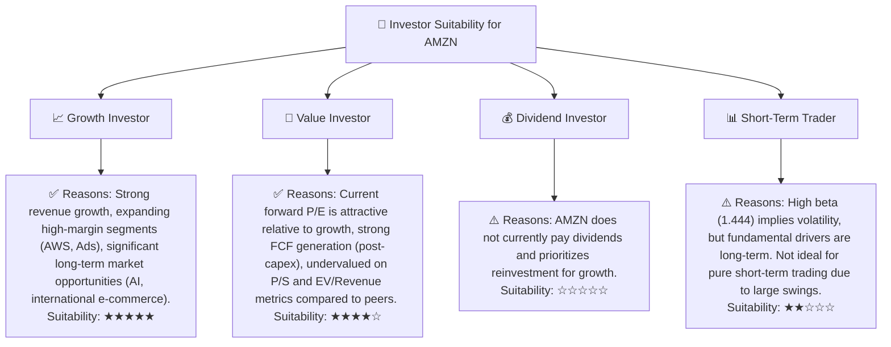
**投資人適配度分析：**
*   **成長型投資者 (Growth Investor)**：Amazon 是典型的成長型股票，受益於其在雲計算、電商和廣告領域的持續擴張。公司將大部分利潤再投資以驅動未來增長，符合成長型投資者的偏好。**適配度：★★★★★**
*   **價值型投資者 (Value Investor)**：儘管 Amazon 歷史估值偏高，但其目前的 Forward P/E、P/S 和 EV/Revenue 相對於其成長潛力和市場地位，顯示出一定的價值被低估。對於尋求成長與價值結合的投資者而言，具有吸引力。**適配度：★★★★☆**
*   **股息型投資者 (Dividend Investor)**：Amazon 目前不支付股息，其盈利全部用於再投資。因此，不適合追求穩定股息收入的投資者。**適配度：☆☆☆☆☆**
*   **短期交易者 (Short-Term Trader)**：Amazon 股價波動性較高 (Beta 1.444)，但其基本面驅動因素多為長期。短期交易可能面臨較大風險，不建議作為主要短期交易標的。**適配度：★★☆☆☆**

### 10.5 關鍵監控指標

| 監控類型 | 指標 | 關注點 | 頻率 |
|----------|----------------------------------|--------------------------------------------------------------------------------|------|
| **營收成長** | AWS 營收成長率 | 是否維持雙位數增長，尤其關注 AI 相關服務貢獻 | 季度 |
| **盈利能力** | 營業利益率、淨利率 | 觀察成本控制效果，高利潤業務（AWS、廣告）對整體利潤率的拉動作用 | 季度 |
| **現金流** | 自由現金流 (FCF) | FCF 是否持續轉正並增長，資本支出效率是否提高 | 季度 |
| **估值** | Forward P/E | 監控與同業及歷史區間的相對估值，判斷股價合理性 | 每週/每月 |
| **市場份額** | AWS 雲市場份額 | 監控與微軟 Azure、Google Cloud 的競爭態勢 | 半年/年度 |
| **宏觀經濟** | 消費者支出、零售銷售數據 | 評估電商業務的外部環境風險與機遇 | 每月 |
| **監管政策** | 反壟斷調查、數據隱私法規 | 關注潛在的業務拆分或罰款風險 | 持續 |

---

> **免責聲明**：本報告為 AI 自動生成，僅供研究參考，不構成投資建議。投資有風險，入市需謹慎。